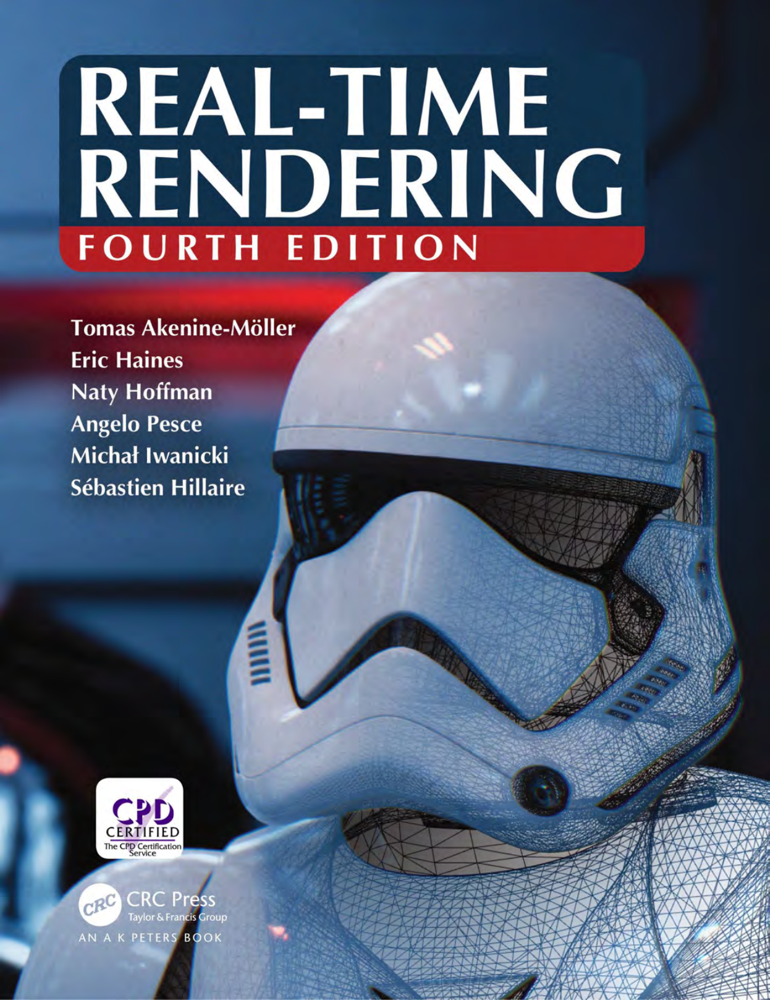
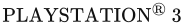
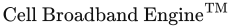
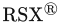
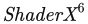
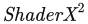

# 《Real-Time Rendering》第四版 书前资料

## 封面、扉页、版权与献辞

### 原PDF物理页1：封面

**实时渲染（REAL-TIME RENDERING）**

**第四版（FOURTH EDITION）**

Tomas Akenine-Möller  
Eric Haines  
Naty Hoffman  
Angelo Pesce  
Michał Iwanicki  
Sébastien Hillaire

CPD 认证（CPD CERTIFIED）  
CPD 认证服务机构（The CPD Certification Service）

CRC 出版社（CRC Press）  
Taylor & Francis 集团（Taylor & Francis Group）  
A K Peters 出版品牌图书（AN A K PETERS BOOK）

### 原PDF物理页2：半扉页

**实时渲染（Real-Time Rendering）**  
**第四版（Fourth Edition）**

### 原PDF物理页3：出版社标志页

Taylor & Francis  
Taylor & Francis 集团（Taylor & Francis Group）  
[http://taylorandfrancis.com](http://taylorandfrancis.com)

### 原PDF物理页4：扉页

**实时渲染（Real-Time Rendering）**  
**第四版（Fourth Edition）**

Tomas Akenine-Möller  
Eric Haines  
Naty Hoffman  
Angelo Pesce  
Michał Iwanicki  
Sébastien Hillaire

CRC 出版社（CRC Press）  
Taylor & Francis 集团（Taylor & Francis Group）  
博卡拉顿（Boca Raton）　伦敦（London）　纽约（New York）

CRC Press 是 Taylor & Francis 集团旗下的出版品牌；该集团属于 Informa。  
A K Peters 出版品牌图书（AN A K PETERS BOOK）

### 原PDF物理页5：版权页

CRC Press  
Taylor & Francis Group  
6000 Broken Sound Parkway NW, Suite 300  
Boca Raton, FL 33487-2742

© 2018 Taylor & Francis Group, LLC

CRC Press 是 Taylor & Francis 集团旗下的出版品牌；该集团属于 Informa。

不对美国政府的原创作品主张版权。

采用无酸纸印刷。

国际标准书号（ISBN-13）：978-1-1386-2700-0（精装）

本书所含信息来自真实可靠且备受推崇的来源。为出版可靠的数据和信息，作者与出版方已作出合理努力，但无法对所有材料的有效性或使用这些材料所产生的后果承担责任。作者与出版方已尽力查找本出版物中所有转载材料的版权所有者；如未能取得以此形式出版的许可，谨向有关版权所有者致歉。如有任何受版权保护的材料未予注明，请来信告知，以便我们在今后的重印中予以纠正。

除美国版权法允许的情况外，未经出版方书面许可，不得以任何形式，通过任何现有或今后发明的电子、机械或其他手段，包括影印、缩微摄影和录制，或在任何信息存储或检索系统中，重印、复制、传播或使用本书的任何部分。

如需获得影印或以电子方式使用本书材料的许可，请访问 [www.copyright.com](http://www.copyright.com/)（[http://www.copyright.com/](http://www.copyright.com/)），或联系 Copyright Clearance Center, Inc.（版权许可中心，简称 CCC），地址：222 Rosewood Drive, Danvers, MA 01923，电话：978-750-8400。CCC 是一家非营利组织，为各类用户提供许可和登记服务。对于已获得 CCC 影印许可的组织，另有专门的付款制度。

**商标声明：** 产品名称或公司名称可能是商标或注册商标；使用这些名称仅为识别和说明之目的，并无侵权意图。

#### 美国国会图书馆在版编目数据

姓名：Möller, Tomas, 1971-，作者。

书名：实时渲染（Real-time rendering）／Tomas Akenine-Möller, Eric Haines, Naty Hoffman, Angelo Pesce, Michał Iwanicki, Sébastien Hillaire。

描述：第四版。| Boca Raton：Taylor & Francis, CRC Press，2018。

标识符：LCCN 2018009546 | ISBN 9781138627000（精装：碱性纸）

主题：LCSH：计算机图形学。| 实时数据处理。| 渲染（计算机图形学）

分类号：LCC T385 .M635 2018 | DDC 006.6/773--dc23

美国国会图书馆（LC）记录可查阅：[https://lccn.loc.gov/2018009546](https://lccn.loc.gov/2018009546)

请访问 Taylor & Francis 网站：  
[http://www.taylorandfrancis.com](http://www.taylorandfrancis.com)

以及 CRC Press 网站：  
[http://www.crcpress.com](http://www.crcpress.com)

### 原PDF物理页6：献辞

献给 Eva、Felix 和 Elina  
T. A-M.

献给 Cathy、Ryan 和 Evan  
E. H.

献给 Dorit、Karen 和 Daniel  
N. H.

献给 Fei、Clelia 和 Alberto  
A. P.

献给 Aneta 和 Weronika  
M. I.

献给 Stéphanie 和 Svea  
S. H.

### 原PDF物理页7：出版社标志页

Taylor & Francis  
Taylor & Francis 集团（Taylor & Francis Group）  
[http://taylorandfrancis.com](http://taylorandfrancis.com)

## 前言

> 原书页码：xiii–xix；PDF 物理页：14–21。物理页 21 为出版社标志页。

<!-- PDF 14；原书 xiii；页眉/标题：前言（Preface） -->

“过去八年里，变化并没有那么大。”这是我们开始编写第四版时的想法。“更新这本书能有多难？”一年半之后，又请来了三位专家，我们的工作总算完成了。我们大概还能再花一年时间编辑和补充，而到那时，轻轻松松又会多出一百篇需要纳入的文章和演讲资料。举个具体的数字：我们用 Google 文档整理了一份参考资料，长达 170 多页，每页大约有 20 条参考资料及相关笔记。我们引用的某些资料，完全可以在另一本书中各自占据一整节，而且确实已有这样的例子。本书的一些章节，例如阴影章，所讨论的主题已经有整本专著。如此丰富的信息虽给我们增加了工作量，却是从业者的好消息。我们会经常指向这些一手资料，因为它们提供的细节远比本书适合容纳的内容丰富。

本书讨论的是能够足够快速地生成合成图像、使观看者能够与虚拟环境交互的算法。我们重点关注三维渲染，也在有限的范围内涉及用户交互的机制。建模、动画以及许多其他领域，对于制作实时应用程序都很重要，但这些主题不在本书的范围之内。

我们希望你在阅读本书之前，对计算机图形学已有一些基本认识，并具备计算机科学和编程知识。我们关注的也是算法，而非 API。关于这些其他主题，已有许多教材可供选择。如果某一节确实让你摸不着头脑，可以先略读过去，或查看参考文献。我们相信，我们能够为你提供的最有价值的帮助，是让你意识到自己尚不了解什么：一个想法最基本的内核、其他人已经从中发现了什么，以及在你愿意时进一步学习的途径。

我们尽可能引用相关资料，并在大多数章节的末尾汇总延伸阅读和资源。在前几版中，我们几乎引用了所有自认为包含相关信息的资料。在这一版里，本书更像一本指南，而非百科全书，因为这个领域的发展早已超出了用详尽无遗（也让人筋疲力尽）的清单列出某项技术所有可能变体的能力。我们相信，只介绍众多方法中少数具有代表性的方案，用更新、覆盖面更广的综述替代原始资料，并由你这位读者通过所引文献继续探寻更多信息，会对你更有帮助。

这些资料大多只需点击一下鼠标便可获得；请访问 realtimerendering.com，查看参考书目中各项文献的链接列表。即使你对某个主题只有短暂的兴趣，也不妨花一点时间看看相关文献，哪怕只是欣赏其中展示的一些精彩图像。我们的网站还<!-- PDF 15；原书 xiv；页眉：前言（Preface）；承接上一页 -->提供了资源、教程、演示程序、代码示例、软件库、图书勘误等内容的链接。

我们写作本书时真正的目标和指路明灯很简单：我们想写出一本自己当初入门时就希望拥有的书，一本既有统一的整体，又包含入门教材中找不到的细节和参考资料的书。我们希望，这本体现了我们如何看待这个世界的书，能够在你的探索之旅中派上用场。

### 第四版致谢

无论如何，我们都不是各个方面的专家，也不是完美的作者。许许多多人的回复和审阅意见，使这一版得到了难以估量的改进，也让我们避免了因自身无知或疏忽而犯下的错误。仅举一例：当我们四处请教虚拟现实部分应涵盖哪些内容时，Johannes Van Waveren（他此前不认识我们中的任何人）立刻回复了一份极为详尽的主题提纲，这份提纲成为该章的基础。计算机图形学专业人士的这些善举，是撰写本书时最大的乐趣之一。有一位尤其值得一提：Patrick Cozzi 不辞辛劳地审阅了本书的每一章。我们感谢在本版编写过程中一路帮助我们的众多人士。对于每一位帮助过我们的人，我们都可以写上一句乃至三句话，但那会使我们进一步超出已经快把书撑破的页数限制。

对于其他所有人，我们由衷地向你们表达感激与谢意：

Sebastian Aaltonen, Johan Andersson, Magnus Andersson, Ulf Assarsson, Dan Baker, Chad Barb, Rasmus Barringer, Michal Bastien, Louis Bavoil, Michael Beale, Adrian Bentley, Ashwin Bhat, Antoine Bouthors, Wade Brainerd, Waylon Brinck, Ryan Brucks, Eric Bruneton, Valentin de Bruyn, Ben Burbank, Brent Burley, Ignacio Castaño, Cem Cebenoyan, Mark Cerny, Matthaeus Chajdas, Danny Chan, Rob Cook, Jean-Luc Corenthin, Adrian Courrèges, Cyril Crassin, Zhihao Cui, Kuba Cupisz, Robert Cupisz, Michal Drobot, Wolfgang Engel, Eugene d’Eon, Matej Drame, Michal Drobot, Alex Evans, Cass Everitt, Kayvon Fatahalian, Adam Finkelstein, Kurt Fleischer, Tim Foley, Tom Forsyth, Guillaume François, Daniel Girardeau-Montaut, Olga Gocmen, Marcin Gollent, Ben Golus, Carlos Gonzalez-Ochoa, Judah Graham, Simon Green, Dirk Gregorius, Larry Gritz, Andrew Hamilton, Earl Hammon, Jr., Jon Harada, Jon Hasselgren, Aaron Hertzmann, Stephen Hill, Rama Hoetzlein, Nicolas Holzschuch, Liwen Hu, John “Spike” Hughes, Ben Humberston, Warren Hunt, Andrew Hurley, John Hutchinson, Milan Ikits, Jon Jansen, Jorge Jimenez, Anton Kaplanyan, Gökhan Karadayi, Brian Karis, Nicolas Kasyan, Alexander Keller, Brano Kemen, Emmett Kilgariff, Byumjin Kim, Chris King, Joe Michael Kniss, Manuel Kraemer, Anders Wang Kristensen, Christopher Kulla, Edan Kwan, Chris Landreth, David Larsson, Andrew Lauritzen, Aaron Lefohn, Eric Lengyel, David Li, Ulrik Lindahl, Edward Liu, Ignacio Llamas, Dulce Isis Segarra López, David Luebke, Patrick Lundell, Miles Macklin, Dzmitry Malyshau, Sam Martin, Morgan McGuire, Brian McIntyre, James McLaren, Mariano Merchante, Arne Meyer, Sergiy Migdalskiy, Kenny Mitchell, Gregory Mitrano, Adam Moravanszky, Jacob Munkberg, Kensaku Nakata, Srinivasa G. Narasimhan, David Neubelt, Fabrice Neyret, Jane Ng, Kasper Høy Nielsen, Matthias Nießner, Jim Nilsson, Reza Nourai, Chris Oat, Ola Olsson, Rafael Orozco, Bryan Pardilla, Steve Parker, Ankit Patel, Jasmin Patry, Jan Pechenik, Emil Persson, Marc Petit, Matt Pettineo, Agnieszka Piechnik, Jerome Platteaux, Aras Pranckevičius, Elinor Quittner, Silvia Rasheva, Nathaniel Reed, Philip Rideout, Jon Rocatis, Robert Runesson, Marco Salvi, Nicolas Savva, Andrew Schneider, Michael Schneider, Markus Schuetz, Jeremy Selan, Tarek Sherif, Peter Shirley, Peter Sikachev, Peter-Pike Sloan, Ashley Vaughan Smith, Rys Sommefeldt, Edvard Sørgård, Tiago Sousa, Tomasz Stachowiak, Nick Stam, Lee Stemkoski, Jonathan Stone, Kier Storey, Jacob Ström, Filip Strugar, Pierre Terdiman, Aaron Thibault, Nicolas Thibieroz, Robert Toth, Thatcher Ulrich, Mauricio Vives, Alex Vlachos, Evan Wallace, Ian Webster, Nick Whiting, Brandon Whitley, Mattias Widmark, Graham Wihlidal, Michael Wimmer, Daniel Wright, Bart Wroński, Chris Wyman, Ke Xu, Cem Yuksel，以及 Egor Yusov.

<!-- 上述名单横跨 PDF 15–16；原书 xiv–xv。跨页姓名 Matthias Nießner 已连写；PDF 16 页眉：前言（Preface）。 -->

感谢你们投入时间和精力；你们无私付出，我们心怀感激地接受。

最后，我们要感谢 Taylor & Francis 的工作人员所付出的全部努力，尤其要感谢 Rick Adams，帮助我们启动这项工作并一路给予指引；感谢 Jessica Vega 和 Michele Dimont 高效的编辑工作；感谢 Charlotte Byrnes 出色的文字编辑工作。

Tomas Akenine-Möller  
Eric Haines  
Naty Hoffman  
Angelo Pesce  
Michał Iwanicki  
Sébastien Hillaire  
2018 年 2 月

### 第三版致谢

我们特别感谢几位不遗余力地给予我们帮助的人。首先，如果没有硬件制造公司的广泛而慷慨的合作，我们的图形体系结构案例研究不可能达到这样的水准。非常感谢 ARM 的 Edvard Sørgard、Borgar Ljosland、Dave Shreiner 和 Jørn Nystad，提供有关 Mali 200 体系结构的详细资料。也感谢 Microsoft 的 Michael Dougherty，他为 Xbox 360 一节提供了极有价值的帮助。Sony Computer Entertainment 的 Masaaki Oka 亲自对  系统案例研究进行了技术审阅，同时还负责与  和  的开发人员联系，取得他们的审阅意见。

ATI/AMD 的 Natalya Tatarchuk 回答了仿佛永无止境的问题，核查了许多段落中的事实，并提供了大量截图；她给予我们的帮助远远超出了职责所要求的范围。除了回应我们惯常提出的资料和澄清请求，Wolfgang Engel 还提供了即将出版的  中的文章，以及很难<!-- PDF 17；原书 xvi；页眉：前言（Preface）；承接上一页 -->获得的  书籍 [427, 428] 的副本，给了我们极大的帮助；这些书现在已可在网上免费获取。NVIDIA 的 Ignacio Castaño 为我们提供了宝贵的支持和联系渠道，甚至重新修改了一个很难调好的演示程序，只为让我们取得恰到好处的截图。

各章审阅者为我们提供了无比宝贵的帮助。他们提出了大量改进建议，也带来了更多见解，给予我们的帮助难以估量。按字母顺序列出，他们是：

Michael Ashikhmin, Dan Baker, Willem de Boer, Ben Diamand, Ben Discoe, Amir Ebrahimi, Christer Ericson, Michael Gleicher, Manny Ko, Wallace Lages, Thomas Larsson, Grégory Massal, Ville Miettinen, Mike Ramsey, Scott Schaefer, Vincent Scheib, Peter Shirley, K.R. Subramanian, Mauricio Vives，以及 Hector Yee.

还有一些审阅者帮助我们检查了特定章节。我们感谢：

Matt Bronder, Christine DeNezza, Frank Fox, Jon Hasselgren, Pete Isensee, Andrew Lauritzen, Morgan McGuire, Jacob Munkberg, Manuel M. Oliveira, Aurelio Reis, Peter-Pike Sloan, Jim Tilander，以及 Scott Whitman.

我们特别感谢 Media Molecule 的 Rex Crowle、Kareem Ettouney 和 Francis Pang，他们为封面设计提供了出色的图像和版式构思，给予了我们很大的帮助。

许多人还通过其他方式帮助我们，例如解答问题和提供截图。很多人投入了大量时间和精力，对此我们向你们致谢。按字母顺序列出如下：

Paulo Abreu, Timo Aila, Johan Andersson, Andreas Bærentzen, Louis Bavoil, Jim Blinn, Jaime Borasi, Per Christensen, Patrick Conran, Rob Cook, Erwin Coumans, Leo Cubbin, Richard Daniels, Mark DeLoura, Tony DeRose, Andreas Dietrich, Michael Dougherty, Bryan Dudash, Alex Evans, Cass Everitt, Randy Fernando, Jim Ferwerda, Chris Ford, Tom Forsyth, Sam Glassenberg, Robin Green, Ned Greene, Larry Gritz, Joakim Grundwall, Mark Harris, Ted Himlan, Jack Hoxley, John “Spike” Hughes, Ladislav Kavan, Alicia Kim, Gary King, Chris Lambert, Jeff Lander, Daniel Leaver, Eric Lengyel, Jennifer Liu, Brandon Lloyd, Charles Loop, David Luebke, Jonathan Maïm, Jason Mitchell, Martin Mittring, Nathan Monteleone, Gabe Newell, Hubert Nguyen, Petri Nordlund, Mike Pan, Ivan Pedersen, Matt Pharr, Fabio Policarpo, Aras Pranckevičius, Siobhan Reddy, Dirk Reiners, Christof Rezk-Salama, Eric Risser, Marcus Roth, Holly Rushmeier, Elan Ruskin, Marco Salvi, Daniel Scherzer, Kyle Shubel, Philipp Slusallek, Torbjörn Söderman, Tim Sweeney, Ben Trumbore, Michal Valient, Mark Valledor, Carsten Wenzel, Steve Westin, Chris Wyman, Cem Yuksel, Billy Zelsnack, Fan Zhang，以及 Renaldas Zioma.

我们也感谢在 GD Algorithms 等公共论坛上回应我们提问的许多其他人。抽出时间给我们发送勘误的读者，同样给予了很大帮助。正是这种相互支持的态度，构成了在这一领域工作的一大乐趣。

一如我们所期望的那样，A K Peters 工作人员的热情和干练，让出版环节轻松了许多。对于这些出色的支持，我们向你们所有人致谢。

<!-- PDF 18；原书 xvii；页眉：前言（Preface） -->

就个人而言，Tomas 要感谢儿子 Felix 和女儿 Elina，让他（再次）懂得：玩电脑游戏（在 Wii 上）能有多么有趣，而不只是看画面；当然，还有他美丽的妻子 Eva……

Eric 也要感谢儿子 Ryan 和 Evan，不知疲倦地寻找酷炫的游戏演示和截图；感谢妻子 Cathy，帮助他熬过这一切。

Naty 要感谢女儿 Karen 和儿子 Daniel，在写作挤占了背着他们玩耍的时间时给予体谅；感谢妻子 Dorit 始终如一的鼓励与支持。

Tomas Akenine-Möller  
Eric Haines  
Naty Hoffman  
2008 年 3 月

### 第二版致谢

编写第二版最令人愉快的事情之一，就是与他人合作并得到他们的帮助。尽管他们自己也面临紧迫的截止日期和各种事务，许多人仍投入了大量时间来帮助我们改进本书。我们尤其要感谢几位主要审阅者。按字母顺序列出，他们是：

Michael Abrash, Ian Ashdown, Ulf Assarsson, Chris Brennan, Sébastien Dominé, David Eberly, Cass Everitt, Tommy Fortes, Evan Hart, Greg James, Jan Kautz, Alexander Keller, Mark Kilgard, Adam Lake, Paul Lalonde, Thomas Larsson, Dean Macri, Carl Marshall, Jason L. Mitchell, Kasper Høy Nielsen, Jon Paul Schelter, Jacob Ström, Nick Triantos, Joe Warren, Michael Wimmer，以及 Peter Wonka.

其中，我们要特别感谢 NVIDIA 的 Cass Everitt 和 ATI Technologies 的 Jason L. Mitchell，他们投入了大量时间和精力，为我们取得所需的资源。我们也感谢 Wolfgang Engel，慷慨分享其即将出版的著作《ShaderX》[426] 的内容，使本版尽可能跟上最新进展。

从与我们讨论他们的工作，到提供图像或其他资源，再到为本书某些部分撰写审阅意见，许多其他人也帮助我们完成了这一版。我们对他们所有人都心怀感激。这些人包括：

Jason Ang, Haim Barad, Jules Bloomenthal, Jonathan Blow, Chas. Boyd, John Brooks, Cem Cebenoyan, Per Christensen, Hamilton Chu, Michael Cohen, Daniel Cohen-Or, Matt Craighead, Paul Debevec, Joe Demers, Walt Donovan, Howard Dortch, Mark Duchaineau, Phil Dutré, Dave Eberle, Gerald Farin, Simon Fenney, Randy Fernando, Jim Ferwerda, Nickson Fong, Tom Forsyth, Piero Foscari, Laura Fryer, Markus Giegl, Peter Glaskowsky, Andrew Glassner, Amy Gooch, Bruce Gooch, Simon Green, Ned Greene, Larry Gritz, Joakim Grundwall, Juan Guardado, Pat Hanrahan, Mark Harris, Michael Herf, Carsten Hess, Rich Hilmer, Kenneth Hoff III, Naty Hoffman, Nick Holliman, Hugues Hoppe, Heather Horne, Tom Hubina, Richard Huddy, Adam James, Kaveh Kardan, Paul Keller, David Kirk, Alex Klimovitski, Jason Knipe, Jeff Lander, Marc Levoy, J.P. Lewis, Ming Lin, Adrian Lopez, Michael McCool, Doug McNabb, Stan Melax, Ville Miettinen, Kenny Mitchell, Steve Morein, Henry Moreton, Jerris Mungai, Jim Napier, George Ngo, Hubert Nguyen, Tito Pagán, Jörg Peters, Tom Porter, Emil Praun, Kekoa Proudfoot, Bernd Raabe, Ravi Ramamoorthi, Ashutosh Rege, Szymon Rusinkiewicz, Chris Seitz, Carlo Séquin, Jonathan Shade, Brian Smits, John Spitzer, Wolfgang Straßer, Wolfgang Stürzlinger, Philip Taylor, Pierre Terdiman, Nicolas Thibieroz, Jack Tumblin, Fredrik Ulfves, Thatcher Ulrich, Steve Upstill, Alex Vlachos, Ingo Wald, Ben Watson, Steve Westin, Dan Wexler, Matthias Wloka, Peter Woytiuk, David Wu, Garrett Young, Borut Zalik, Harold Zatz, Hansong Zhang，以及 Denis Zorin.

<!-- 上述名单横跨 PDF 18–19；原书 xvii–xviii。跨页姓名 David Kirk 已连写；PDF 19 页眉：前言（Preface）。 -->

我们还要感谢《ACM Transactions on Graphics》期刊为本书提供镜像网站。

Alice 和 Klaus Peters、制作经理 Ariel Jaffee、编辑 Heather Holcombe、文字编辑 Michelle M. Richards，以及 A K Peters 的其他工作人员，出色地完成了工作，使本书尽可能完善。感谢你们所有人。

最后，也是最重要的，我们向家人致以最深的谢意，感谢他们给了我们完成本版所需的大量安静时间。老实说，我们从没想到会花这么久！

Tomas Akenine-Möller  
Eric Haines  
2002 年 5 月

### 第一版致谢

许多人帮助我们完成了本书。其中一些最重要的贡献，来自审阅了本书部分内容的人。审阅者们慷慨地贡献专业知识，帮助我们显著改善了内容和文风。我们要感谢以下人士（按字母顺序）：

Thomas Barregren, Michael Cohen, Walt Donovan, Angus Dorbie, Michael Garland, Stefan Gottschalk, Ned Greene, Ming C. Lin, Jason L. Mitchell, Liang Peng, Keith Rule, Ken Shoemake, John Stone, Phil Taylor, Ben Trumbore, Jorrit Tyberghein，以及 Nick Wilt.

我们对你们的感激无以言表。

许多其他人也为本书投入了时间和劳动。有些人允许我们使用图像，有些人提供了模型，还有些人为我们指出重要资源，或引荐能够提供帮助的人。除了上面列出的人士，我们还要感谢以下人士的帮助：

Tony Barkans, Daniel Baum, Nelson Beebe, Curtis Beeson, Tor Berg, David Blythe, Chas. Boyd, Don Brittain, Ian Bullard, Javier Castellar, Satyan Coorg, Jason Della Rocca, Paul Diefenbach, Alyssa Donovan, Dave Eberly, Kells Elmquist, Stuart Feldman, Fred Fisher, Tom Forsyth, Marty Franz, Thomas Funkhouser, Andrew Glassner, Bruce Gooch, Larry Gritz, Robert Grzeszczuk, Paul Haeberli, Evan Hart, Paul Heckbert, Chris Hecker, Joachim Helenklaken, Hugues Hoppe, John Jack, Mark Kilgard, David Kirk, James Klosowski, Subodh Kumar, André LaMothe, Jeff Lander, Jens Larsson, Jed Lengyel, Fredrik Liliegren, David Luebke, Thomas Lundqvist, Tom McReynolds, Stan Melax, Don Mitchell, André Möller, Steve Molnar, Scott R. Nelson, Hubert Nguyen, Doug Rogers, Holly Rushmeier, Gernot Schaufler, Jonas Skeppstedt, Stephen Spencer, Per Stenström, Jacob Ström, Filippo Tampieri, Gary Tarolli, Ken Turkowski, Turner Whitted, Agata 和 Andrzej Wojaczek, Andrew Woo, Steve Worley, Brian Yen, Hans-Philip Zachau, Gabriel Zachmann，以及 Al Zimmerman.

<!-- 上述名单横跨 PDF 19–20；原书 xviii–xix。PDF 20 从 Steve Molnar 开始；页眉：前言（Preface）。 -->

我们也要感谢《ACM Transactions on Graphics》期刊为本书提供稳定的网站。

Alice 和 Klaus Peters 以及 AK Peters 的工作人员，尤其是 Carolyn Artin 和 Sarah Gillis，为使本书成为现实发挥了重要作用。感谢你们所有人。

最后，我们向家人和朋友致以最深的谢意，感谢他们在这段不可思议、有时艰辛、又常常令人振奋的过程中始终给予支持。

Tomas Möller  
Eric Haines  
1999 年 3 月

<!-- PDF 21；出版社标志页，无印刷页码；原图文字未被文本提取识别。 -->

### 出版社标志页

Taylor & Francis  
Taylor & Francis 集团（Taylor & Francis Group）  
http://taylorandfrancis.com
