# 《Real-Time Rendering》第四版 参考文献

原书参考文献共1978条。保留原编号、原题和全部出版元数据；“本书引用页”指原书印刷页码。

## 参考文献 1—200

**[1]** Aalto, Tatu，《在 Remedy 的 Northlight 引擎中进行 DirectX 光线追踪实验》（原题：Experiments with DirectX Raytracing in Remedy’s Northlight Engine）。Game Developers Conference, 2018年3月19日. 本书引用页：1044。

**[2]** Aaltonen, Sebastian，《现代无纹理延迟渲染技术》（原题：Modern Textureless Deferred Rendering Techniques）。Beyond3D Forum, 2016年2月28日. 本书引用页：906, 907。

**[3]** Abbas, Wasim，《实用的解析二维有符号距离场生成》（原题：Practical Analytic 2D Signed Distance Field Generation）。收录于 ACM SIGGRAPH 2016 Talks, 文章编号68, 2016年7月. 本书引用页：677, 678。

**[4]** Abrash, Michael，《Michael Abrash 图形编程黑皮书》（原题：Michael Abrash’s Graphics Programming Black Book）。特别版, The Coriolis Group, Inc., 1997. 本书引用页：823。

**[5]** Abrash, Michael，《延迟——AR 与 VR 不可回避的必要条件》（原题：Latency—The sine qua non of AR and VR）。Ramblings in Valve Time 博客, 2012年12月29日. 本书引用页：920, 939。

**[6]** Abrash, Michael，《光栅扫描显示器：远不止眼睛所见》（原题：Raster-Scan Displays: More Than Meets The Eye）。Ramblings in Valve Time 博客, 2013年1月28日. 本书引用页：922, 1012。

**[7]** Abrash, Michael，《深入 VR 兔子洞：修复画面抖动》（原题：Down the VR Rabbit Hole: Fixing Judder）。Ramblings in Valve Time 博客, 2013年7月26日. 本书引用页：935, 1011。

**[8]** Abrash, Michael，《Oculus 首席科学家预测未来五年的 VR 技术》（原题：Oculus Chief Scientist Predicts the Next 5 Years of VR Technology）。Road to VR 网站, 2016年11月4日. 本书引用页：931, 932。

**[9]** Adams, Ansel，《相机》（原题：The Camera）。Little, Brown and Company, 1980. 本书引用页：291。

**[10]** Adams, Ansel，《底片》（原题：The Negative）。Little, Brown and Company, 1981. 本书引用页：289, 291。

**[11]** Adams, Ansel，《照片》（原题：The Print）。Little, Brown and Company, 1983. 本书引用页：291。

**[12]** Adorjan, Matthias，《OpenSfM：协作式运动恢复结构系统》（原题：OpenSfM: A Collaborative Structure-from-Motion System）。视觉计算专业毕业论文, Vienna University of Technology, 2016. 本书引用页：574, 575。

**[13]** Aila, Timo, 和 Ville Miettinen，《dPVS：面向大规模动态环境的遮挡剔除系统》（原题：dPVS: An Occlusion Culling System for Massive Dynamic Environments）。IEEE Computer Graphics and Applications, 第24卷, 第2期, 第86–97页, 2004年3月. 本书引用页：666, 821, 839, 850, 879。

**[14]** Aila, Timo, 和 Samuli Laine，《无走样阴影贴图》（原题：Alias-Free Shadow Maps）。收录于 Eurographics Symposium on Rendering, Eurographics Association, 第161–166页, 2004年6月. 本书引用页：260。

**[15]** Aila, Timo, 和 Samuli Laine，《理解 GPU 上的光线遍历效率》（原题：Understanding the Efficiency of Ray Traversal on GPUs）。High Performance Graphics, 2009年6月. 本书引用页：511。

**[16]** Aila, Timo, Samuli Laine, 和 Tero Karras，《理解 GPU 上的光线遍历效率——Kepler 与 Fermi 补遗》（原题：Understanding the Efficiency of Ray Traversal on GPUs—Kepler and Fermi Addendum）。技术报告 NVR-2012-02, NVIDIA, 2012. 本书引用页：511, 961。

**[17]** Airey, John M., John H. Rohlf, 和 Frederick P. Brooks Jr.，《在复杂虚拟建筑环境中，以交互更新速率实现图像真实感》（原题：Towards Image Realism with Interactive Update Rates in Complex Virtual Building Environments）。ACM SIGGRAPH Computer Graphics (Symposium on Interactive 3D Graphics), 第24卷, 第2期, 第41–50页, 1990年3月. 本书引用页：687, 837。

**[18]** Airey, John M.，《通过自动模型空间细分与潜在可见集计算，提高建筑漫游系统的更新速率》（原题：Increasing Update Rates in the Building Walkthrough System with Automatic Model-Space Subdivision and Potentially Visible Set Calculations）。博士学位论文, 技术报告 TR90-027, 计算机科学系, University of North Carolina at Chapel Hill, 1990年7月. 本书引用页：837。

**[19]** Akeley, K., P. Haeberli, 和 D. Burns，《tomesh.c》（原题：tomesh.c）。SGI Developer’s Toolbox 光盘上的一个 C 程序, 1990. 本书引用页：692。

**[20]** Akeley, Kurt, 和 Pat Hanrahan，《实时图形架构》（原题：Real-Time Graphics Architectures）。CS448A 课程讲义, Stanford University, 2001年秋季. 本书引用页：1040。

**[21]** Akenine-Möller, Tomas，《快速三维三角形与包围盒重叠测试》（原题：Fast 3D Triangle-Box Overlap Testing）。journal of graphics tools, 第6卷, 第1期, 第29–33页, 2001. 本书引用页：974, 975。

**[22]** Akenine-Möller, Tomas, 和 Jacob Ström，《大众图形：面向移动电话的硬件光栅化架构》（原题：Graphics for the Masses: A Hardware Rasterization Architecture for Mobile Phones）。ACM Transactions on Graphics, 第22卷, 第3期, 第801–808页, 2003. 本书引用页：146, 1015, 1027。

**[23]** Akenine-Möller, Tomas, 和 Ulf Assarsson，《论阴影体轮廓中顶点的度》（原题：On the Degree of Vertices in a Shadow Volume Silhouette）。journal of graphics tools, 第8卷, 第4期, 第21–24页, 2003. 本书引用页：667。

**[24]** Akenine-Möller, T., 和 T. Aila，《利用改进的三角形设置实现保守光栅化与分块光栅化》（原题：Conservative and Tiled Rasterization Using a Modified Triangle Setup）。journal of graphics tools, 第10卷, 第3期, 第1–8页, 2005. 本书引用页：996, 1001。

**[25]** Akenine-Möller, Tomas, 和 Björn Johnsson，《每什么单位的性能？》（原题：Performance per What?）。Journal of Computer Graphics Techniques, 第1卷, 第18期, 第37–41页, 2012. 本书引用页：790。

**[26]** Akenine-Möller, Tomas，《关于图形硬件的一些笔记》（原题：Some Notes on Graphics Hardware）。Tomas Akenine-Möller 网页, 2012年11月27日. 本书引用页：999, 1000。

**[27]** Akin, Atilla，《突破材质真实感的极限》（原题：Pushing the Limits of Realism of Materials）。Maxwell Render 博客, 2014年11月26日. 本书引用页：362, 363。

**[28]** Alexa, Marc，《网格变形的最新进展》（原题：Recent Advances in Mesh Morphing）。Computer Graphics Forum, 第21卷, 第2期, 第173–197页, 2002. 本书引用页：87, 88, 102。

**[29]** Alexa, M., 和 T. Boubekeur，《细分着色》（原题：Subdivision Shading）。ACM Transactions on Graphics, 第27卷, 第5期, 第142:1–142:3页, 2008. 本书引用页：767。

**[30]** Aliaga, Daniel G., 和 Anselmo Lastra，《通过自动图像放置保证帧率》（原题：Automatic Image Placement to Provide a Guaranteed Frame Rate）。收录于 SIGGRAPH ’99: Proceedings of the 26th Annual Conference on Computer Graphics and Interactive Techniques, ACM Press/Addison-Wesley Publishing Co., 第307–316页, 1999年8月. 本书引用页：561。

**[31]** AMD，《AMD PowerTune 技术》（原题：AMD PowerTune Technology）。AMD 网站, 2011. 本书引用页：789。

**[32]** AMD，《AMD Graphics Cores Next（GCN）架构》（原题：AMD Graphics Cores Next (GCN) Architecture）。AMD 网站, 2012. 本书引用页：1036。

**[33]** AMD，《异步着色器：释放 GPU 的全部潜力》（原题：Asynchronous Shaders: Unlocking the Full Potential of the GPU）。AMD 网站, 2015. 本书引用页：1036。

**[34]** AMD，《Radeon：剖析 Polaris 架构》（原题：Radeon: Dissecting the Polaris Architecture）。AMD 网站, 2016. 本书引用页：1038。

**[35]** AMD，《Radeon 的下一代 Vega 架构》（原题：Radeon’s Next-Generation Vega Architecture）。AMD 网站, 2017. 本书引用页：1035, 1036, 1037。

**[36]** AMD, GPUOpen，《TressFX》（原题：TressFX）。GitHub 代码仓库, 2017. 本书引用页：642, 644, 647。

**[37]** American Society for Photogrammetry & Remote Sensing，《LAS 规范，1.4 版——R13》（原题：LAS Specification, Version 1.4— R13）。asprs.org, 2013年7月15日. 本书引用页：573。

**[38]** Anagnostou, Kostas，《Unreal 如何渲染一帧》（原题：How Unreal Renders a Frame）。Interplay of Light 博客, 2017年10月24日. 本书引用页：899, 905, 913。

**[39]** Anderson, Eric A.，《构建《Obduction》：Cyan 自定义的 UE4 美术工具》（原题：Building Obduction: Cyan’s Custom UE4 Art Tools）。Game Developers Conference, 2016年3月. 本书引用页：366。

**[40]** Andersson, Johan，《在 Frostbite 中利用程序化着色器泼溅进行地形渲染》（原题：Terrain Rendering in Frostbite Using Procedural Shader Splatting）。SIGGRAPH Advanced Real-Time Rendering in 3D Graphics and Games 课程, 2007年8月. 本书引用页：43, 175, 218, 877, 878。

**[41]** Andersson, Johan, 和 Daniel Johansson，《阴影与贴花：来自 Frostbite 的 D3D10 技术》（原题：Shadows & Decals: D3D10 Techniques from Frostbite）。Game Developers Conference, 2009年3月. 本书引用页：245, 246, 247。

**[42]** Andersson, Johan，《Frostbite 中的并行图形——现状与未来》（原题：Parallel Graphics in Frostbite—Current & Future）。SIGGRAPH Beyond Programmable Shading 课程, 2009年8月. 本书引用页：893。

**[43]** Andersson, Johan，《《战地 3》中的 DirectX 11 渲染》（原题：DirectX 11 Rendering in Battlefield 3）。Game Developers Conference, 2011年3月. 本书引用页：147, 888, 890, 893, 896。

**[44]** Andersson, Johan，《《战地 3》中的绚丽 PC 图形》（原题：Shiny PC Graphics in Battlefield 3）。GeForce LAN, 2011年10月. 本书引用页：569, 570, 604。

**[45]** Andersson, Johan，《游戏引擎的并行化未来》（原题：Parallel Futures of a Game Engine）。Intel Dynamic Execution Environment Symposium, 2012年5月. 本书引用页：811, 812。

**[46]** Andersson, Johan，《渲染管线——挑战与下一步》（原题：The Rendering Pipeline—Challenges & Next Steps）。SIGGRAPH Open Problems in Real-Time Rendering 课程, 2015年8月. 本书引用页：156, 514, 1014。

**[47]** Andersson, Johan, 和 Colin Barré-Brisebois，《绚丽像素及其未来：SEED 的实时光线追踪》（原题：Shiny Pixels and Beyond: Real-Time Raytracing at SEED）。Game Developers Conference, 2018年3月. 本书引用页：1044。

**[48]** Andersson, M., J. Hasselgren, R. Toth, 和 T. Akenine-Möller，《用于随机渲染的自适应纹理空间着色》（原题：Adaptive Texture Space Shading for Stochastic Rendering）。Computer Graphics Forum, 第33卷, 第2期, 第341–350页, 2014. 本书引用页：910, 911。

**[49]** Andersson, Magnus，《随机光栅化与深度缓冲的算法改进》（原题：Algorithmic Improvements for Stochastic Rasterization & Depth Buffering）。博士学位论文, Lund University, 2015年10月. 本书引用页：1015。

**[50]** Andersson, M., J. Hasselgren, 和 T. Akenine-Möller，《面向图形硬件的掩码深度剔除》（原题：Masked Depth Culling for Graphics Hardware）。ACM Transactions on Graphics, 第34卷, 第6期, 第188:1–188:9页, 2015. 本书引用页：849, 1015, 1016。

**[51]** Andreev, Dmitry，《电子游戏的实时帧率提升转换》（原题：Real-Time Frame Rate Up-Conversion for Video Games）。收录于 ACM SIGGRAPH 2010 Talks, ACM, 文章编号16, 2010年7月. 本书引用页：537, 542。

**[52]** Andreev, Dmitry，《从不同视角看抗锯齿》（原题：Anti-Aliasing from a Different Perspective）。Game Developers Conference, 2011年3月. 本书引用页：147。

**[53]** Anguelov, Bobby，《DirectX10 教程 10：阴影映射，第 2 部分》（原题：DirectX10 Tutorial 10: Shadow Mapping Part 2）。Taking Initiative 博客, 2011年5月25日. 本书引用页：249。

**[54]** Annen, Thomas, Jan Kautz, Frédo Durand, 和 Hans-Peter Seidel，《用于中距离光照的球谐梯度》（原题：Spherical Harmonic Gradients for Mid-Range Illumination）。收录于 Proceedings of the Fifteenth Eurographics Conference on Rendering Techniques, Eurographics Association, 第331–336页, 2004年6月. 本书引用页：488。

**[55]** Annen, Thomas, Tom Mertens, Philippe Bekaert, Hans-Peter Seidel, 和 Jan Kautz，《卷积阴影贴图》（原题：Convolution Shadow Maps）。收录于 Proceedings of the 18th Eurographics Conference on Rendering Techniques, Eurographics Association, 第51–60页, 2007年6月. 本书引用页：255。

**[56]** Annen, Thomas, Tom Mertens, Hans-Peter Seidel, Eddy Flerackers, 和 Jan Kautz，《指数阴影贴图》（原题：Exponential Shadow Maps）。收录于 Graphics Interface 2008, Canadian Human-Computer Communications Society, 第155–161页, 2008年5月. 本书引用页：256。

**[57]** Annen, Thomas, Zhao Dong, Tom Mertens, Philippe Bekaert, Hans-Peter Seidel, 和 Jan Kautz，《动态场景中的实时全频率阴影》（原题：Real-Time, All-Frequency Shadows in Dynamic Scenes）。ACM Transactions on Graphics, 第27卷, 第3期, 文章编号34, 2008年8月. 本书引用页：257。

**[58]** Ansari, Marwan Y.，《使用 DirectX 9 像素着色器实现图像特效》（原题：Image Effects with DirectX 9 Pixel Shaders）。收录于 Wolfgang Engel, 编， 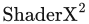: Shader Programming Tips and Tricks with DirectX 9, 第481–518页, Wordware, 2004. 本书引用页：521, 665。

**[59]** Answer, James，《快速而灵活：《The Unknown》的技术美术与渲染》（原题：Fast and Flexible: Technical Art and Rendering for The Unknown）。Game Developers Conference, 2016年3月. 本书引用页：710, 787, 805, 931, 934, 936, 938。

**[60]** Antoine, François, Ryan Brucks, Brian Karis, 和 Gavin Moran，《男孩、风筝与一百平方英里的实时数字外景场地》（原题：The Boy, the Kite and the 100 Square Mile Real-Time Digital Backlot）。收录于 ACM SIGGRAPH 2015 Talks, ACM, 文章编号20, 2015年8月. 本书引用页：493。

**[61]** Antonio, Franklin，《更快的线段求交》（原题：Faster Line Segment Intersection）。收录于 David Kirk, 编， Graphics Gems III, 第199–202页, Academic Press, 1992. 本书引用页：988, 989。

**[62]** Antonov, Michael，《剖析异步时间扭曲》（原题：Asynchronous Timewarp Examined）。Oculus Developer Blog, 2015年3月3日. 本书引用页：936, 937。

**[63]** Apodaca, Anthony A., 和 Larry Gritz，《高级 RenderMan：为电影创建计算机生成影像》（原题：Advanced RenderMan: Creating CGI for Motion Pictures）。Morgan Kaufmann, 1999. 本书引用页：37, 909。

**[64]** Apodaca, Anthony A.，《PhotoRealistic RenderMan 的工作原理》（原题：How PhotoRealistic RenderMan Works）。收录于 Advanced RenderMan: Creating CGI for Motion Pictures, Morgan Kaufmann, 第6章, 1999. 另见 SIGGRAPH Advanced RenderMan 2: To RI INFINITY and Beyond 课程, 2000年7月. 本书引用页：51。

**[65]** Apple，《ARKit》（原题：ARKit）。Apple 开发者网站. 本书引用页：918。

**[66]** Apple，《面向 iOS 的 OpenGL ES 编程指南》（原题：OpenGL ES Programming Guide for iOS）。Apple 开发者网站. 本书引用页：177, 702, 713。

**[67]** de Araújo, B. R., D. S. Lopes, P. Jepp, J. A. Jorge, 和 B. Wyvill，《隐式曲面多边形化综述》（原题：A Survey on Implicit Surface Polygonization）。ACM Computing Surveys, 第47卷, 第4期, 第60:1–60:39页, 2015. 本书引用页：586, 683, 751, 753, 781, 944。

**[68]** Arge, L., G. S. Brodal, 和 R. Fagerberg，《缓存无关数据结构》（原题：Cache-Oblivious Data Structures）。收录于 Handbook of Data Structures, CRC Press, 第34章, 2005. 本书引用页：827。

**[69]** ARM Limited，《ARM Mali 应用开发者最佳实践，1.0 版》（原题：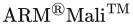 Application Developer Best Practices, Version 1.0）。ARM 文档, 2017年2月27日. 本书引用页：48, 798, 1029。

**[70]** Arvo, James，《包围盒与球体相交测试的简单方法》（原题：A Simple Method for Box-Sphere Intersection Testing）。收录于 Andrew S. Glassner, 编， Graphics Gems, Academic Press, 第335–339页, 1990. 本书引用页：977, 984。

**[71]** Arvo, James，《使用元层次结构进行光线追踪》（原题：Ray Tracing with Meta-Hierarchies）。SIGGRAPH Advanced Topics in Ray Tracing 课程, 1990年8月. 本书引用页：953。

**[72]** Arvo, James, 编，，《图形学精粹 II》（原题：Graphics Gems II）。Academic Press, 1991. 本书引用页：102, 991。

**[73]** Arvo, James，《部分遮挡多面体光源的辐照度雅可比矩阵》（原题：The Irradiance Jacobian for Partially Occluded Polyhedral Sources）。收录于 SIGGRAPH ’94: Proceedings of the 21st Annual Conference on Computer Graphics and Interactive Techniques, ACM, 第343–350页, 1994年7月. 本书引用页：379。

**[74]** Arvo, James，《辐照度张量在非朗伯现象模拟中的应用》（原题：Applications of Irradiance Tensors to the Simulation of non-Lambertian Phenomena）。收录于 SIGGRAPH ’95: Proceedings of the 22nd Annual Conference on Computer Graphics and Interactive Techniques, ACM, 第335–342页, 1995年8月. 本书引用页：389, 390。

**[75]** Asanovic, Krste, 等，《并行计算研究全景：伯克利的视角》（原题：The Landscape of Parallel Computing Research: A View from Berkeley）。技术报告编号 UCB/EECS-2006-183, 电气工程与计算机科学系, University of California, Berkeley, 2006. 本书引用页：806, 815。

**[76]** Ashdown, Ian，《辐射度：程序员的视角》（原题：Radiosity: A Programmer’s Perspective）。John Wiley & Sons, Inc., 1994. 本书引用页：271, 442。

**[77]** Ashikhmin, Michael, 和 Peter Shirley，《各向异性的 Phong 光反射模型》（原题：An Anisotropic Phong Light Reflection Model）。技术报告 UUCS-00-014, 计算机科学系, University of Utah, 2000年6月. 本书引用页：352。

**[78]** Ashikhmin, Michael, Simon Premože, 和 Peter Shirley，《基于微表面的 BRDF 生成器》（原题：A Microfacet-Based BRDF Generator）。收录于 SIGGRAPH ’00: Proceedings of the 27th Annual Conference on Computer Graphics and Interactive Techniques, ACM Press/Addison-Wesley Publishing Co., 第67–74页, 2000年7月. 本书引用页：328, 335, 357。

**[79]** Ashikhmin, Michael，《基于微表面的 BRDF》（原题：Microfacet-Based BRDFs）。SIGGRAPH State of the Art in Modeling and Measuring of Surface Reflection 课程, 2001年8月. 本书引用页：329。

**[80]** Ashikhmin, Michael, Abhijeet Ghosh，《使用环境贴图实现简单的模糊反射》（原题：Simple Blurry Reflections with Environment Maps）。journal of graphics tools, 第7卷, 第4期, 第3–8页, 2002. 本书引用页：417, 418。

**[81]** Ashikhmin, Michael, 和 Simon Premože，《基于分布的 BRDF》（原题：Distribution-Based BRDFs）。技术报告, 2007. 本书引用页：357。

**[82]** Asirvatham, Arul, 和 Hugues Hoppe，《使用基于 GPU 的几何裁剪图进行地形渲染》（原题：Terrain Rendering Using GPU-Based Geometry Clipmaps）。收录于 Matt Pharr, 编， GPU Gems 2, Addison-Wesley, 第27–45页, 2005. 本书引用页：872, 873。

**[83]** Assarsson, Ulf, 和 Tomas Möller，《针对包围盒优化的视锥剔除算法》（原题：Optimized View Frustum Culling Algorithms for Bounding Boxes）。journal of graphics tools, 第5卷, 第1期, 第9–22页, 2000. 本书引用页：836, 982, 986。

**[84]** Atanasov, Asen, 和 Vladimir Koylazov，《用于渲染镜面薄片的实用随机算法》（原题：A Practical Stochastic Algorithm for Rendering Mirror-Like Flakes）。收录于 ACM SIGGRAPH 2016 Talks, 文章编号67, 2016年7月. 本书引用页：372。

**[85]** Austin, Michael，《体素冲浪》（原题：Voxel Surfing）。Game Developers Conference, 2016年3月. 本书引用页：586。

**[86]** Bærentzen, J. Andreas, Steen Lund Nielsen, Mikkel Gjøl, 和 Bent D. Larsen，《两种具有隐藏线消除功能的抗锯齿线框绘制方法》（原题：Two Methods for Antialiased Wireframe Drawing with Hidden Line Removal）。收录于 SCCG ’08 Proceedings of the 24th Spring Conference on Computer Graphics, ACM, 第171–177页, 2008年4月. 本书引用页：673, 675。

**[87]** Baert, J., A. Lagae, 和 Ph. Dutré，《稀疏体素八叉树的外存构建》（原题：Out-of-Core Construction of Sparse Voxel Octrees）。Computer Graphics Forum, 第33卷, 第6期, 第220–227页, 2014. 本书引用页：579, 582。

**[88]** Bagnell, Dan，《Cesium 中的图形技术——顶点压缩》（原题：Graphics Tech in Cesium—Vertex Compression）。Cesium 博客, 2015年5月18日. 本书引用页：715。

**[89]** Bahar, E., 和 S. Chakrabarti，《全波理论在三维物体计算机辅助图形中的应用》（原题：Full-Wave Theory Applied to Computer-Aided Graphics for 3D Objects）。IEEE Computer Graphics and Applications, 第7卷, 第7期, 第46–60页, 1987年7月. 本书引用页：361。

**[90]** Bahnassi, Homam, 和 Wessam Bahnassi，《体积云与巨粒子》（原题：Volumetric Clouds and Mega-Particles）。收录于 Wolfgang Engel, 编， , Charles River Media, 第295–302页, 2006. 本书引用页：521, 556。

**[91]** Baker, Dan，《高级光照技术》（原题：Advanced Lighting Techniques）。Meltdown 2005, 2005年7月. 本书引用页：369。

**[92]** Baker, Dan, 和 Yannis Minadakis，《Firaxis 的《文明 V》：可扩展游戏性能案例研究》（原题：Firaxis’ Civilization V: A Case Study in Scalable Game Performance）。Game Developers Conference, 2010年3月. 本书引用页：812。

**[93]** Baker, Dan，《精彩的镜面反射——LEAN 与 CLEAN 镜面高光》（原题：Spectacular Specular—LEAN and CLEAN Specular Highlights）。Game Developers Conference, 2011年3月. 本书引用页：370。

**[94]** Baker, Dan，《物体空间光照》（原题：Object Space Lighting）。Game Developers Conference, 2016年3月. 本书引用页：911。

**[95]** Bako, Steve, Thijs Vogels, Brian McWilliams, Mark Meyer, Jan Novák, Alex Harvill, Pradeep Sen, Tony DeRose, 和 Fabrice Rousselle，《用于蒙特卡洛渲染降噪的核预测卷积网络》（原题：Kernel-Predicting Convolutional Networks for Denoising Monte Carlo Renderings）。ACM Transactions on Graphics, 第36卷, 第4期, 文章编号97, 2017. 本书引用页：511, 1043。

**[96]** Baldwin, Doug, 和 Michael Weber，《通过坐标变换快速计算光线与三角形交点》（原题：Fast Ray-Triangle Intersections by Coordinate Transformation）。Journal of Computer Graphics Techniques, 第5卷, 第3期, 第39–49页, 2016. 本书引用页：962。

**[97]** Balestra, C., 和 P.-K. Engstad，《《神秘海域：德雷克船长的宝藏》的技术》（原题：The Technology of Uncharted: Drake’s Fortune）。Game Developers Conference, 2008年3月. 本书引用页：893。

**[98]** Banks, David，《不同余维中的光照》（原题：Illumination in Diverse Codimensions）。收录于 SIGGRAPH ’94: Proceedings of the 21st Annual Conference on Computer Graphics and Interactive Techniques, ACM, 第327–334页, 1994年7月. 本书引用页：359。

**[99]** Barb, C.，《《泰坦陨落 2》中的纹理流送》（原题：Texture Streaming in Titanfall 2）。Game Developers Conference, 2017年2—3月. 本书引用页：869。

**[100]** Barber, C. B., D. P. Dobkin, 和 H. Huhdanpaa，《计算凸包的 Quickhull 算法》（原题：The Quickhull Algorithm for Convex Hull）。技术报告 GCG53, Geometry Center, 1993年7月. 本书引用页：950。

**[101]** Barequet, G., 和 G. Elber，《三维向量的最优包围锥》（原题：Optimal Bounding Cones of Vectors in Three Dimensions）。Information Processing Letters, 第93卷, 第2期, 第83–89页, 2005. 本书引用页：834。

**[102]** Barkans, Anthony C.，《颜色恢复：真彩色的 8 位交互图形》（原题：Color Recovery: True-Color 8-Bit Interactive Graphics）。IEEE Computer Graphics and Applications, 第17卷, 第1期, 第67–77页, 1997年1/2月. 本书引用页：1010。

**[103]** Barkans, Anthony C.，《使用 Talisman 架构进行高质量渲染》（原题：High-Quality Rendering Using the Talisman Architecture）。收录于 Proceedings of the ACM SIGGRAPH/EUROGRAPHICS Workshop on Graphics Hardware, ACM, 第79–88页, 1997年8月. 本书引用页：189。

**[104]** Barla, Pascal, Joëlle Thollot, 和 Lee Markosian，《X-Toon：扩展的卡通着色器》（原题：X-Toon: An Extended Toon Shader）。收录于 Proceedings of the 4th International Symposium on Non-Photorealistic Animation and Rendering, ACM, 第127–132页, 2006. 本书引用页：654。

**[105]** Barré-Brisebois, Colin, 和 Marc Bouchard，《近似半透明性，以快速、低成本地实现可信的次表面散射外观》（原题：Approximating Translucency for a Fast, Cheap and Convincing Subsurface Scattering Look）。Game Developers Conference, 2011年2—3月. 本书引用页：639, 640。

**[106]** Barré-Brisebois, Colin, 和 Stephen Hill，《细节混合》（原题：Blending in Detail）。Self-Shadow 博客, 2012年7月10日. 本书引用页：366, 371, 890。

**[107]** Barré-Brisebois, Colin，《再探六边形散景模糊》（原题：Hexagonal Bokeh Blur Revisited）。ZigguratVertigo’s Hideout 博客, 2017年4月17日. 本书引用页：531。

**[108]** Barrett, Sean，《混合运算对线性插值不满足分配律》（原题：Blend Does Not Distribute Over Lerp）。Game Developer, 第11卷, 第10期, 第39–41页, 2004年11月. 本书引用页：160。

**[109]** Barrett, Sean，《稀疏虚拟纹理》（原题：Sparse Virtual Textures）。Game Developers Conference, 2008年3月. 本书引用页：867。

**[110]** Barringer, R., M. Andersson, 和 T. Akenine-Möller，《光线加速器：异构架构上高效而灵活的光线追踪》（原题：Ray Accelerator: Efficient and Flexible Ray Tracing on a Heterogeneous Architecture）。Computer Graphics Forum, 第36卷, 第8期, 第166–177页, 2017. 本书引用页：1006。

**[111]** Bartels, Richard H., John C. Beatty, 和 Brian A. Barsky，《计算机图形学与几何建模中的样条入门》（原题：An Introduction to Splines for use in Computer Graphics and Geometric Modeling）。Morgan Kaufmann, 1987. 本书引用页：732, 734, 749, 754, 756, 781。

**[112]** Barzel, Ronen, 编，，《图形工具——jgt 编辑精选》（原题：Graphics Tools—The jgt Editors’ Choice）。A K Peters, Ltd., 2005. 本书引用页：1058, 1064, 1065, 1084, 1091, 1111, 1115, 1133, 1138, 1143。

**[113]** Batov, Vladimir，《快速而简单的内存分配器》（原题：A Quick and Simple Memory Allocator）。Dr. Dobbs’s Portal, 1998年1月1日. 本书引用页：793。

**[114]** Baum, Daniel R., Stephen Mann, Kevin P. Smith, 和 James M. Winget，《让辐射度可用：生成精确辐射度解的自动预处理与网格划分技术》（原题：Making Radiosity Usable: Automatic Preprocessing and Meshing Techniques for the Generation of Accurate Radiosity Solutions）。Computer Graphics (SIGGRAPH ’91 Proceedings), 第25卷, 第4期, 第51–60页, 1991年7月. 本书引用页：689。

**[115]** Bavoil, Louis, Steven P. Callahan, Aaron Lefohn, João L. D. Comba, 和 Cláudio T. Silva，《在 GPU 上使用 k 缓冲实现多片元特效》（原题：Multi-Fragment Effects on the GPU Using the k-Buffer）。收录于 Proceedings of the 2007 Symposium on Interactive 3D Graphics and Games, ACM, 第97–104页, 2007年4—5月. 本书引用页：156, 624, 626。

**[116]** Bavoil, Louis, Steven P. Callahan, 和 Cláudio T. Silva，《利用反向投影与深度剥离实现稳健的软阴影映射》（原题：Robust Soft Shadow Mapping with Backprojection and Depth Peeling）。journal of graphics tools, 第13卷, 第1期, 第16–30页, 2008. 本书引用页：238, 252。

**[117]** Bavoil, Louis，《高级软阴影映射技术》（原题：Advanced Soft Shadow Mapping Techniques）。Game Developers Conference, 2008年2月. 本书引用页：256。

**[118]** Bavoil, Louis, 和 Kevin Myers，《利用双向深度剥离实现顺序无关透明》（原题：Order Independent Transparency with Dual Depth Peeling）。NVIDIA 白皮书, 2008年2月. 本书引用页：155, 157。

**[119]** Bavoil, Louis, 和 Miguel Sainz, 和 Rouslan Dimitrov，《图像空间中基于地平线的环境光遮蔽》（原题：Image-Space Horizon-Based Aambient Occlusion）。收录于 ACM SIGGRAPH 2008 Talks, ACM, 文章编号22, 2008年8月. 本书引用页：460。

**[120]** Bavoil, Louis, 和 Jon Jansen，《粒子阴影与缓存高效的后处理》（原题：Particle Shadows and Cache-Efficient Post-Processing）。Game Developers Conference, 2013年3月. 本书引用页：570。

**[121]** Bavoil, Louis, 和 Iain Cantlay，《SetStablePowerState.exe：在 Windows 10 上禁用 GPU Boost，使 NVIDIA GPU 的时间戳查询更具确定性》（原题：SetStablePowerState.exe: Disabling GPU Boost on Windows 10 for more deterministic timestamp queries on NVIDIA GPUs）。NVIDIA GameWorks 博客, 2016年9月14日. 本书引用页：789。

**[122]** Beacco, A., N. Pelechano, 和 C. Andújar，《实时人群渲染综述》（原题：A Survey of Real-Time Crowd Rendering）。Computer Graphics Forum, 第35卷, 第8期, 第32–50页, 2016. 本书引用页：563, 566, 567, 587, 798。

**[123]** Bec, Xavier，《更快的折射公式与透射颜色滤波》（原题：Faster Refraction Formula, and Transmission Color Filtering）。Ray Tracing News, 第10卷, 第1期, 1997年1月. 本书引用页：627。

**[124]** Beckmann, Petr, 和 André Spizzichino，《粗糙表面对电磁波的散射》（原题：The Scattering of Electromagnetic Waves from Rough Surfaces）。Pergamon Press, 1963. 本书引用页：331, 338。

**[125]** Beeler, Dean, 和 Anuj Gosalia，《Oculus Rift 上的异步时间扭曲》（原题：Asynchronous Timewarp on Oculus Rift）。Oculus Developer Blog, 2016年3月25日. 本书引用页：935, 937。

**[126]** Beeler, Dean, Ed Hutchins, 和 Paul Pedriana，《异步空间扭曲》（原题：Asynchronous Spacewarp）。Oculus Developer Blog, 2016年11月10日. 本书引用页：937。

**[127]** Beers, Andrew C., Maneesh Agrawala, 和 Navin Chaddha，《从压缩纹理进行渲染》（原题：Rendering from Compressed Textures）。收录于 SIGGRAPH ’96: Proceedings of the 23rd Annual Conference on Computer Graphics and Interactive Techniques, ACM, 第373–378页, 1996年8月. 本书引用页：192。

**[128]** Behrendt, S., C. Colditz, O. Franzke, J. Kopf, 和 O. Deussen，《使用公告板云进行逼真的实时景观渲染》（原题：Realistic Real-Time Rendering of Landscapes Using Billboard Clouds）。Computer Graphics Forum, 第24卷, 第3期, 第507–516页, 2005. 本书引用页：563。

**[129]** Belcour, Laurent, 和 Pascal Barla，《用于变化虹彩建模的微表面理论实用扩展》（原题：A Practical Extension to Microfacet Theory for the Modeling of Varying Iridescence）。ACM Transactions on Graphics (SIGGRAPH 2017), 第36卷, 第4期, 第65:1–65:14页, 2017年7月. 本书引用页：363。

**[130]** Bénard, Pierre, Adrien Bousseau, 和 Jöelle Thollot，《风格化动画时间一致性的最新技术报告》（原题：State-of-the-Art Report on Temporal Coherence for Stylized Animations）。Computer Graphics Forum, 第30卷, 第8期, 第2367–2386页, 2011. 本书引用页：669, 678。

**[131]** Bénard, Pierre, Lu Jingwan, Forrester Cole, Adam Finkelstein, 和 Jöelle Thollot，《主动笔划：动画三维模型的一致线条风格化》（原题：Active Strokes: Coherent Line Stylization for Animated 3D Models）。收录于 Proceedings of the International Symposium on Non-Photorealistic Animation and Rendering, Eurographics Association, 第37–46页, 2012. 本书引用页：669。

**[132]** Bénard, Pierre, Aaron Hertzmann, 和 Michael Kass，《计算拓扑准确的光滑曲面轮廓》（原题：Computing Smooth Surface Contours with Accurate Topology）。ACM Transactions on Graphics, 第33卷, 第2期, 第19:1–19:21页, 2014. 本书引用页：656, 667。

**[133]** Benson, David, 和 Joel Davis，《八叉树纹理》（原题：Octree Textures）。ACM Transactions on Graphics (SIGGRAPH 2002), 第21卷, 第3期, 第785–790页, 2002年7月. 本书引用页：190。

**[134]** Bentley, Adrian，《《声名狼藉：次子》引擎开发复盘》（原题：inFAMOUS Second Son Engine Postmortem）。Game Developers Conference, 2014年3月. 本书引用页：54, 490, 871, 884, 904。

**[135]** de Berg, M., M. van Kreveld, M. Overmars, 和 O. Schwarzkopf，《计算几何——算法与应用》（原题：Computational Geometry—Algorithms and Applications）。第3版, Springer-Verlag, 2008. 本书引用页：685, 699, 967。

**[136]** van den Bergen, G.，《使用 AABB 树对复杂可变形模型进行高效碰撞检测》（原题：Efficient Collision Detection of Complex Deformable Models Using AABB Trees）。journal of graphics tools, 第2卷, 第4期, 第1–13页, 1997. 亦收录于 [112]. 本书引用页：821。

**[137]** Berger, Matthew, Andrea Tagliasacchi, Lee M. Seversky, Pierre Alliez, Gaël Guennebaud, Joshua A. Levine, Andrei Sharf, 和 Claudio T. Silva，《从点云重建曲面的研究综述》（原题：A Survey of Surface Reconstruction from Point Clouds）。Computer Graphics Forum, 第36卷, 第1期, 第301–329页, 2017. 本书引用页：573, 683。

**[138]** Beyer, Johanna, Markus Hadwiger, 和 Hanspeter Pfister，《基于 GPU 的大规模体可视化最新技术》（原题：State-of-the-Art in GPU-Based Large-Scale Volume Visualization）。Computer Graphics Forum, 第34卷, 第8期, 第13–37页, 2015. 本书引用页：586。

**[139]** Bezrati, Abdul，《通过光源链表实现实时光照》（原题：Real-Time Lighting via Light Linked List）。SIGGRAPH Advances in Real-Time Rendering in Games 课程, 2014年8月. 本书引用页：893, 903。

**[140]** Bezrati, Abdul，《通过光源链表实现实时光照》（原题：Real-Time Lighting via Light Linked List）。收录于 Wolfgang Engel, 编， , CRC Press, 第183–193页, 2015. 本书引用页：893, 903。

**[141]** Bier, Eric A., 和 Kenneth R. Sloan, Jr.，《两部分纹理映射》（原题：Two-Part Texture Mapping）。IEEE Computer Graphics and Applications, 第6卷, 第9期, 第40–53页, 1986年9月. 本书引用页：170。

**[142]** Biermann, Henning, Adi Levin, 和 Denis Zorin，《具有法线控制的分片光滑细分曲面》（原题：Piecewise Smooth Subdivision Surface with Normal Control）。收录于 SIGGRAPH ’00: Proceedings of the 27th Annual Conference on Computer Graphics and Interactive Techniques, ACM Press/Addison-Wesley Publishing Co., 第113–120页, 2000年7月. 本书引用页：764。

**[143]** Billeter, Markus, Erik Sintorn, 和 Ulf Assarsson，《使用光传播体实现实时多次散射》（原题：Real-Time Multiple Scattering Using Light Propagation Volumes）。收录于 Proceedings of the ACM SIGGRAPH Symposium on Interactive 3D Graphics and Games, ACM, 第119–126页, 2012. 本书引用页：611。

**[144]** Billeter, Markus, Ola Olsson, 和 Ulf Assarsson，《分块前向着色》（原题：Tiled Forward Shading）。收录于 Wolfgang Engel, 编， , CRC Press, 第99–114页, 2013. 本书引用页：895, 896, 914。

**[145]** Billeter, Markus，《移动硬件上的多光源渲染》（原题：Many-Light Rendering on Mobile Hardware）。SIGGRAPH Real-Time Many-Light Management and Shadows with Clustered Shading 课程, 2015年8月. 本书引用页：893, 900, 903, 914。

**[146]** Bilodeau, Bill，《顶点着色器技巧：利用顶点着色器提高性能的新方法》（原题：Vertex Shader Tricks: New Ways to Use the Vertex Shader to Improve Performance）。Game Developers Conference, 2014年3月. 本书引用页：51, 87, 514, 568, 571, 798。

**[147]** Binstock, Atman，《利用延迟锁存优化 VR 图形》（原题：Optimizing VR Graphics with Late Latching）。Oculus Developer Blog, 2015年3月2日. 本书引用页：938。

**[148]** Bishop, L., D. Eberly, T. Whitted, M. Finch, 和 M. Shantz，《设计 PC 游戏引擎》（原题：Designing a PC Game Engine）。IEEE Computer Graphics and Applications, 第18卷, 第1期, 第46–53页, 1998年1/2月. 本书引用页：836。

**[149]** Bitterli, Benedikt，《Benedikt Bitterli 渲染资源》（原题：Benedikt Bitterli Rendering Resources）。https://benedikt-bitterli.me/resources, 依据 CC BY 3.0 许可授权, https://creativecommons.org/licenses/by/3.0. 本书引用页：441, 445, 447, 449, 450。

**[150]** Bittner, Jiří, 和 Jan Přikryl，《使用直线空间划分计算精确的区域可见性》（原题：Exact Regional Visibility Using Line Space Partitioning）。技术报告 TR-186-2-01-06, 计算机图形学与算法研究所, Vienna University of Technology, 2001年3月. 本书引用页：843。

**[151]** Bittner, Jiří, Peter Wonka, 和 Michael Wimmer，《利用直线空间细分进行城市场景可见性预处理》（原题：Visibility Preprocessing for Urban Scenes Using Line Space Subdivision）。收录于 Pacific Graphics 2001, IEEE Computer Society, 第276–284页, 2001年10月. 本书引用页：843。

**[152]** Bittner, Jiří, Oliver Mattausch, Ari Silvennoinen, 和 Michael Wimmer，《剔除阴影投射物以实现高效阴影映射》（原题：Shadow Caster Culling for Efficient Shadow Mapping）。收录于 Symposium on Interactive 3D Graphics and Games, ACM, 第81–88页, 2011. 本书引用页：247。

**[153]** Bjørge, Marius, Sam Martin, Sandeep Kakarlapudi, 和 Jan-Harald Fredriksen，《利用块局部存储实现高效渲染》（原题：Efficient Rendering with Tile Local Storage）。收录于 ACM SIGGRAPH 2014 Talks, ACM, 文章编号51, 2014年7月. 本书引用页：156。

**[154]** Bjørge, Marius，《推动移动图形的发展》（原题：Moving Mobile Graphics）。SIGGRAPH Advanced Real-Time Shading 课程, 2016年7月. 本书引用页：247, 265。

**[155]** Bjorke, Kevin，《基于图像的光照》（原题：Image-Based Lighting）。收录于 Randima Fernando, 编， GPU Gems, Addison-Wesley, 第308–321页, 2004. 本书引用页：500。

**[156]** Bjorke, Kevin，《高质量滤波》（原题：High-Quality Filtering）。收录于 Randima Fernando, 编， GPU Gems, Addison-Wesley, 第391–424页, 2004. 本书引用页：515, 521。

**[157]** Blasi, Philippe, Bertrand Le Saec, 和 Christophe Schlick，《离散体密度物体的渲染算法》（原题：A Rendering Algorithm for Discrete Volume Density Objects）。Computer Graphics Forum, 第12卷, 第3期, 第201–210页, 1993. 本书引用页：598。

**[158]** Blinn, J. F., 和 M. E. Newell，《计算机生成图像中的纹理与反射》（原题：Texture and Reflection in Computer Generated Images）。Communications of the ACM, 第19卷, 第10期, 第542–547页, 1976年10月. 本书引用页：405, 406。

**[159]** Blinn, James F.，《用于计算机合成图像的光反射模型》（原题：Models of Light Reflection for Computer Synthesized Pictures）。ACM Computer Graphics (SIGGRAPH ’77 Proceedings), 第11卷, 第2期, 第192–198页, 1977年7月. 本书引用页：331, 340, 416。

**[160]** Blinn, James，《褶皱表面的模拟》（原题：Simulation of Wrinkled Surfaces）。Computer Graphics (SIGGRAPH ’78 Proceedings), 第12卷, 第3期, 第286–292页, 1978年8月. 本书引用页：209, 765。

**[161]** Blinn, James F.，《代数曲面绘制的推广》（原题：A Generalization of Algebraic Surface Drawing）。ACM Transactions on Graphics, 第1卷, 第3期, 第235–256页, 1982. 本书引用页：751。

**[162]** Blinn, Jim，《我和我的（假）阴影》（原题：Me and My (Fake) Shadow）。IEEE Computer Graphics and Applications, 第8卷, 第1期, 第82–86页, 1988年1月. 亦收录于 [165]. 本书引用页：225, 227。

**[163]** Blinn, Jim，《双曲插值》（原题：Hyperbolic Interpolation）。IEEE Computer Graphics and Applications, 第12卷, 第4期, 第89–94页, 1992年7月. 亦收录于 [165]. 本书引用页：999。

**[164]** Blinn, Jim，《图像合成——理论》（原题：Image Compositing—Theory）。IEEE Computer Graphics and Applications, 第14卷, 第5期, 第83–87页, 1994年9月. 亦收录于 [166]. 本书引用页：160。

**[165]** Blinn, Jim，《Jim Blinn 专栏：图形管线之旅》（原题：Jim Blinn’s Corner: A Trip Down the Graphics Pipeline）。Morgan Kaufmann, 1996. 本书引用页：27, 832, 1059。

**[166]** Blinn, Jim，《Jim Blinn 专栏：脏像素》（原题：Jim Blinn’s Corner: Dirty Pixels）。Morgan Kaufmann, 1998. 本书引用页：165, 1059。

**[167]** Blinn, Jim，《暴风雪中的幽灵》（原题：A Ghost in a Snowstorm）。IEEE Computer Graphics and Applications, 第18卷, 第1期, 第79–84页, 1998年1/2月. 亦收录于 [168], 第9章. 本书引用页：165。

**[168]** Blinn, Jim，《Jim Blinn 专栏：记号，记号，还是记号》（原题：Jim Blinn’s Corner: Notation, Notation, Notation）。Morgan Kaufmann, 2002. 本书引用页：165, 1059。

**[169]** Blinn, Jim，《什么是像素？》（原题：What Is a Pixel?）。IEEE Computer Graphics and Applications, 第25卷, 第5期, 第82–87页, 2005年9/10月. 本书引用页：165, 280。

**[170]** Bloomenthal, Jules，《边缘推断及其在抗锯齿中的应用》（原题：Edge Inference with Applications to Antialiasing）。Computer Graphics (SIGGRAPH ’83 Proceedings), 第17卷, 第3期, 第157–162页, 1983年7月. 本书引用页：146。

**[171]** Bloomenthal, Jules，《隐式曲面多边形化器》（原题：An Implicit Surface Polygonizer）。收录于 Paul S. Heckbert, 编， Graphics Gems IV, Academic Press, 第324–349页, 1994. 本书引用页：753。

**[172]** Blow, Jonathan，《Mipmap 映射，第 1 部分》（原题：Mipmapping, Part 1）。Game Developer, 第8卷, 第12期, 第13–17页, 2001年12月. 本书引用页：184。

**[173]** Blow, Jonathan，《Mipmap 映射，第 2 部分》（原题：Mipmapping, Part 2）。Game Developer, 第9卷, 第1期, 第16–19页, 2002年1月. 本书引用页：184。

**[174]** Blow, Jonathan，《Happycake 开发笔记：阴影》（原题：Happycake Development Notes: Shadows）。Happycake Development Notes 网站, 2004年8月25日. 本书引用页：242。

**[175]** Blythe, David，《Direct3D 10 系统》（原题：The Direct3D 10 System）。ACM Transactions on Graphics, 第25卷, 第3期, 第724–734页, 2006年7月. 本书引用页：29, 39, 42, 47, 48, 50, 249。

**[176]** Bookout, David，《利用像素着色器排序实现可编程混合》（原题：Programmable Blend with Pixel Shader Ordering）。Intel Developer Zone 博客, 2015年10月13日. 本书引用页：52。

**[177]** Born, Max, 和 Emil Wolf，《光学原理：光的传播、干涉和衍射的电磁理论》（原题：Principles of Optics: Electromagnetic Theory of Propagation, Interference and Diffraction of Light）。第7版, Cambridge University Press, 1999. 本书引用页：373。

**[178]** Borshukov, George, 和 J. P. Lewis，《《黑客帝国 2：重装上阵》的逼真人脸渲染》（原题：Realistic Human Face Rendering for The Matrix Reloaded）。收录于 ACM SIGGRAPH 2003 Sketches and Applications, ACM, 2003年7月. 本书引用页：635。

**[179]** Borshukov, George, 和 J. P. Lewis，《快速次表面散射》（原题：Fast Subsurface Scattering）。SIGGRAPH Digital Face Cloning 课程, 2005年8月. 本书引用页：635。

**[180]** Botsch, Mario, Alexander Hornung, Matthias Zwicker, 和 Leif Kobbelt，《在当今 GPU 上进行高质量曲面泼溅》（原题：High-Quality Surface Splatting on Today’s GPUs）。收录于 Proceedings of the Second Eurographics / IEEE VGTC Symposium on Point-Based Graphics, Eurographics Association, 第17–24页, 2005年6月. 本书引用页：574。

**[181]** Boubekeur, Tamy, Patrick Reuter, 和 Christophe Schlick，《带标量标记的 PN 三角形》（原题：Scalar Tagged PN Triangles）。收录于 Eurographics 2005 Short Presentations, Eurographics Association, 第17–20页, 2005年9月. 本书引用页：747。

**[182]** Boubekeur, T., 和 Marc Alexa，《Phong 曲面细分》（原题：Phong Tessellation）。ACM Transactions on Graphics, 第27卷, 第5期, 第141:1–141:5页, 2008. 本书引用页：748。

**[183]** Boulton, Mike，《《光环 4》中的静态光照技巧》（原题：Static Lighting Tricks in Halo 4）。Game Developers Conference, 2013年3月. 本书引用页：486。

**[184]** Bouthors, Antoine, Fabrice Neyret, Nelson Max, Eric Bruneton, 和 Cyril Crassin，《云中的交互式多次各向异性散射》（原题：Interactive Multiple Anisotropic Scattering in Clouds）。收录于 Proceedings of the 2008 Symposium on Interactive 3D Graphics and Games, ACM, 第173–182页, 2008. 本书引用页：618, 619, 620。

**[185]** Bowles, H., K. Mitchell, B. Sumner, J. Moore, 和 M. Gross，《迭代图像扭曲》（原题：Iterative Image Warping）。Computer Graphics Forum, 第31卷, 第2期, 第237–246页, 2012. 本书引用页：523。

**[186]** Bowles, H.，《低成本海洋：形状表示、网格划分与着色》（原题：Oceans on a Shoestring: Shape Representation, Meshing and Shading）。SIGGRAPH Advances in Real-Time Rendering in Games 课程, 2013年7月. 本书引用页：878。

**[187]** Bowles, Huw, 和 Beibei Wang，《闪亮，但别太闪亮！稳定而稳健的程序化闪光效果》（原题：Sparkly but not too Sparkly! A Stable and Robust Procedural Sparkle Effect）。SIGGRAPH Advances in Real-Time Rendering in Games 课程, 2015年8月. 本书引用页：372。

**[188]** Box, Harry，《片场灯光技术员手册：电影照明设备、实践与配电》（原题：Set Lighting Technician’s Handbook: Film Lighting Equipment, Practice, and Electrical Distribution）。第4版, Focal Press, 2010. 本书引用页：435。

**[189]** Boyd, Stephen, 和 Lieven Vandenberghe，《凸优化》（原题：Convex Optimization）。Cambridge University Press, 2004. 可免费下载。 本书引用页：946。

**[190]** Brainerd, W., T. Foley, M. Kraemer, H. Moreton, 和 M. Nießner，《利用自适应四叉树在 GPU 上高效渲染细分曲面》（原题：Efficient GPU Rendering of Subdivision Surfaces Using Adaptive Quadtrees）。ACM Transactions on Graphics, 第35卷, 第4期, 第113:1–113:12页, 2016. 本书引用页：779, 780。

**[191]** Bratt, I.，《ARM Mali T880 移动 GPU》（原题：The ARM Mali T880 Mobile GPU）。Hot Chips 网站, 2015. 本书引用页：1027。

**[192]** Brawley, Zoe, 和 Natalya Tatarchuk，《视差遮挡映射：利用反向高度图追踪实现自阴影、透视正确的凹凸映射》（原题：Parallax Occlusion Mapping: Self-Shadowing, Perspective-Correct Bump Mapping Using Reverse Height Map Tracing）。收录于 Wolfgang Engel, 编， , Charles River Media, 第135–154页, 2004年11月. 本书引用页：217。

**[193]** Bredow, Rob，《《精灵鼠小弟》中的毛发》（原题：Fur in Stuart Little）。SIGGRAPH Advanced RenderMan 2: To RI INFINITY and Beyond 课程, 2000年7月. 本书引用页：382, 633。

**[194]** Brennan, Chris，《通过调整物体距离实现准确的环境映射反射与折射》（原题：Accurate Environment Mapped Reflections and Refractions by Adjusting for Object Distance）。收录于 Wolfgang Engel, 编， Direct3D ShaderX: Vertex & Pixel Shader Tips and Techniques, Wordware, 第290–294页, 2002年5月. 本书引用页：500。

**[195]** Brennan, Chris，《漫反射立方体映射》（原题：Diffuse Cube Mapping）。收录于 Wolfgang Engel, 编， Direct3D ShaderX: Vertex & Pixel Shader Tips and Techniques, Wordware, 第287–289页, 2002年5月. 本书引用页：427。

**[196]** Breslav, Simon, Karol Szerszen, Lee Markosian, Pascal Barla, 和 Joëlle Thollot，《用于三维场景着色的动态二维图案》（原题：Dynamic 2D Patterns for Shading 3D Scenes）。ACM Transactions on Graphics, 第27卷, 第3期, 第20:1–20:5页, 2007. 本书引用页：670。

**[197]** Bridson, Robert，《计算机图形学中的流体模拟》（原题：Fluid Simulation for Computer Graphics）。第2版, CRC Press, 2015. 本书引用页：571, 649。

**[198]** Brinck, Waylon, 和 Andrew Maximov，《《神秘海域 4》的技术美术》（原题：The Technical Art of Uncharted 4）。SIGGRAPH 制作专场, 2016年7月. 本书引用页：290。

**[199]** Brinkmann, Ron，《数字合成的艺术与科学》（原题：The Art and Science of Digital Compositing）。Morgan Kaufmann, 1999. 本书引用页：149, 151, 159, 160。

**[200]** Brisebois, Vincent, 和 Ankit Patel，《剖析 OptiX 5 中人工智能带来的性能提升》（原题：Profiling the AI Performance Boost in OptiX 5）。NVIDIA News Center, 2017年7月31日. 本书引用页：511, 1043, 1044。

## 参考文献 201—400

**[201]** Brown, Alistair, 《〈星际公民〉中的视觉特效》（原题：Visual Effects in Star Citizen），游戏开发者大会（Game Developers Conference）， 2015年3月. 本书引用页：366。

**[202]** Brown, Gary S., 《非高斯随机表面造成的遮蔽》（原题：Shadowing by Non-gaussian Random Surfaces），IEEE Transactions on Antennas and Propagation, 第28卷, 第6期, 第788–790页, 1980. 本书引用页：334。

**[203]** Bruneton, Eric, and Fabrice Neyret, 《预计算大气散射》（原题：Precomputed Atmospheric Scattering），Computer Graphics Forum, 第27卷, 第4期, 第1079–1086页, 2008. 本书引用页：614, 615, 616。

**[204]** Bruneton, Eric, Fabrice Neyret, and Nicolas Holzschuch, 《利用从几何到BRDF的无缝过渡实现实时逼真的海洋光照》（原题：Real-Time Realistic Ocean Lighting Using Seamless Transitions from Geometry to BRDF），Computer Graphics Forum, 第29卷, 第2期, 第487–496页, 2010. 本书引用页：372。

**[205]** Bruneton, Eric, and Fabrice Neyret, 《用于高效、准确表面着色的非线性预滤波方法综述》（原题：A Survey of Non-linear Pre-filtering Methods for Efficient and Accurate Surface Shading），IEEE Transactions on Visualization and Computer Graphics, 第18卷, 第2期, 第242–260页, 2012. 本书引用页：372。

**[206]** Buades, Jose María, Jesús Gumbau, and Miguel Chover, 《可分离软阴影映射》（原题：Separable Soft Shadow Mapping），The Visual Computer, 第32卷, 第2期, 第167–178页, 2016年2月. 本书引用页：252。

**[207]** Buchanan, J. W., and M. C. Sousa, 《边缘缓冲：一种便于轮廓线渲染的数据结构》（原题：The Edge Buffer: A Data Structure for Easy Silhouette Rendering），收录于 Proceedings of the 1st International Symposium on Non-photorealistic Animation and Rendering, ACM, 第39–42页, 2000年6月. 本书引用页：666。

**[208]** Bukowski, Mike, Padraic Hennessy, Brian Osman, and Morgan McGuire, 《可扩展的高质量运动模糊与环境光遮蔽》（原题：Scalable High Quality Motion Blur and Ambient Occlusion），SIGGRAPH“三维图形与游戏中的实时渲染进展”课程（SIGGRAPH Advances in Real-Time Rendering in 3D Graphics and Games）， 2012年8月. 本书引用页：540, 542, 543。

**[209]** Bukowski, Mike, Padraic Hennessy, Brian Osman, and Morgan McGuire, 《〈Skylanders SWAP Force〉的景深着色器》（原题：The Skylanders SWAP Force Depth-of-Field Shader），收录于 Wolfgang Engel, 主编， , CRC Press, 第175–184页, 2013. 本书引用页：529, 530, 532, 533。

**[210]** Bunnell, Michael, 《动态环境光遮蔽与间接光照》（原题：Dynamic Ambient Occlusion and Indirect Lighting），收录于 Matt Pharr, 主编， GPU Gems 2, Addison-Wesley, 第223–233页, 2005. 本书引用页：454, 497。

**[211]** van der Burg, John, 《构建高级粒子系统》（原题：Building an Advanced Particle System），Gamasutra, 2000年6月. 本书引用页：571。

**[212]** Burley, Brent, 《阴影贴图偏移锥与改进的软阴影：迪士尼附加部分》（原题：Shadow Map Bias Cone and Improved Soft Shadows: Disney Bonus Section），SIGGRAPH“面向所有人的RenderMan”课程（SIGGRAPH RenderMan for Everyone）， 2006年8月. 本书引用页：249, 250。

**[213]** Burley, Brent, and Dylan Lacewell, 《Ptex：面向生产渲染的逐面纹理映射》（原题：Ptex: Per-Face Texture Mapping for Production Rendering），收录于 Proceedings of the Nineteenth Eurographics Conference on Rendering, Eurographics Association, 第1155–1164页, 2008. 本书引用页：191。

**[214]** Burley, Brent, 《迪士尼的基于物理的着色》（原题：Physically Based Shading at Disney），SIGGRAPH“影视与游戏制作中的实用基于物理的着色”课程（SIGGRAPH Practical Physically Based Shading in Film and Game Production）， 2012年8月. 本书引用页：325, 336, 340, 342, 345, 353, 354, 357, 364。

**[215]** Burley, Brent, 《将迪士尼BRDF扩展为集成次表面散射的BSDF》（原题：Extending the Disney BRDF to a BSDF with Integrated Subsurface Scattering），SIGGRAPH“基于物理的着色：理论与实践”课程（SIGGRAPH Physically Based Shading in Theory and Practice）， 2015年8月. 本书引用页：354。

**[216]** Burns, Christopher A., Kayvon Fatahalian, and William R. Mark, 《采用解耦采样的惰性物体空间着色架构》（原题：A Lazy Object-Space Shading Architecture with Decoupled Sampling），收录于 Proceedings of the Conference on High-Performance Graphics, Eurographics Association, 第19–28页, 2010年6月. 本书引用页：910。

**[217]** Burns, C. A., and W. A. Hunt, 《可见性缓冲：一种对缓存友好的延迟着色方法》（原题：The Visibility Buffer: A Cache-Friendly Approach to Deferred Shading），Journal of Computer Graphics Techniques, 第2卷, 第2期, 第55–69页, 2013. 本书引用页：905, 906。

**[218]** Cabello, Ricardo, 等, 《Three.js源代码》（原题：Three.js source code）， 发布版本r89, 2017年12月. 本书引用页：41, 50, 115, 189, 201, 407, 485, 552, 628。

**[219]** Cabral, Brian, and Leith (Casey) Leedom, 《使用线积分卷积对向量场成像》（原题：Imaging Vector Fields Using Line Integral Convolution），收录于 SIGGRAPH ’93: Proceedings of the 20th Annual Conference on Computer Graphics and Interactive Techniques, ACM, 第263–270页, 1993年8月. 本书引用页：538。

**[220]** Caillaud, Florian, Vincent Vidal, Florent Dupont, and Guillaume Lavoué, 《任意带纹理网格的渐进压缩》（原题：Progressive Compression of Arbitrary Textured Meshes），Computer Graphics Forum, 第35卷, 第7期, 第475–484页, 2016. 本书引用页：709。

**[221]** Calver, Dean, 《着色器中的顶点解压缩》（原题：Vertex Decompression in a Shader），收录于 Wolfgang Engel, 主编， Direct3D ShaderX: Vertex & Pixel Shader Tips and Techniques, Wordware, 第172–187页, 2002年5月. 本书引用页：713。

**[222]** Calver, Dean, 《照片级逼真的延迟光照》（原题：Photo-Realistic Deferred Lighting），Beyond3D.com 网站, 2003年7月30日. 本书引用页：883, 884, 886。

**[223]** Calver, Dean, 《在GPU上访问与修改拓扑》（原题：Accessing and Modifying Topology on the GPU），收录于 Wolfgang Engel, 主编， , Charles River Media, 第5–19页, 2004. 本书引用页：703。

**[224]** Calver, Dean, 《在PS 3.0上实现高动态范围延迟光照》（原题：Deferred Lighting on PS 3.0 with High Dynamic Range），收录于 Wolfgang Engel, 主编， , Charles River Media, 第97–105页, 2004. 本书引用页：288。

**[225]** Cantlay, Iain, and Andrei Tatarinov, 《从地形到耶稣光：更好地利用DX11》（原题：From Terrain to Godrays: Better Use of DX11），游戏开发者大会（Game Developers Conference）， 2014年3月. 本书引用页：44, 569。

**[226]** Card, Drew, and Jason L. Mitchell, 《使用像素着色器和顶点着色器进行非真实感渲染》（原题：Non-Photorealistic Rendering with Pixel and Vertex Shaders），收录于 Wolfgang Engel, 主编， Direct3D ShaderX: Vertex & Pixel Shader Tips and Techniques, Wordware, 第319–333页, 2002年5月. 本书引用页：662, 668。

**[227]** Carling, Richard, 《矩阵求逆》（原题：Matrix Inversion），收录于 Andrew S. Glassner, 主编， Graphics Gems, Academic Press, 第470–471页, 1990. 本书引用页：68。

**[228]** Carmack, John, 《延迟缓解策略》（原题：Latency Mitigation Strategies），AltDevBlog, 2013年2月22日. 本书引用页：920, 936, 937。

**[229]** do Carmo, Manfred P., 《曲线与曲面的微分几何》（原题：Differential Geometry of Curves and Surfaces）， Prentice-Hall, Inc., 1976. 本书引用页：81。

**[230]** Carpenter, Loren, 《A缓冲：一种抗锯齿的隐藏面处理方法》（原题：The A-Buffer, an Antialiased Hidden Surface Method），Computer Graphics (SIGGRAPH ’84 Proceedings), 第18卷, 第3期, 第103–108页, 1984年7月. 本书引用页：155, 626。

**[231]** Carpentier, Giliam, and Kohei Ishiyama, 《Decima：光照与抗锯齿的进展》（原题：Decima, Advances in Lighting and AA），SIGGRAPH“游戏中的实时渲染进展”课程（SIGGRAPH Advances in Real-Time Rendering in Games）， 2017年8月. 本书引用页：146, 148, 386, 805。

**[232]** Carucci, Francesco, 《深入几何实例化》（原题：Inside Geometry Instancing），收录于 Matt Pharr, 主编， GPU Gems 2, Addison-Wesley, 第47–67页, 2005. 本书引用页：797。

**[233]** Castaño, Ignacio, 《光照贴图参数化》（原题：Lightmap Parameterization），The Witness Blog, 2010年3月30日. 本书引用页：486。

**[234]** Castaño, Ignacio, 《计算Alpha多级渐远纹理》（原题：Computing Alpha Mipmaps），The Witness Blog, 2010年9月9日. 本书引用页：204, 206。

**[235]** Castaño, Ignacio, 《阴影映射总结——第1部分》（原题：Shadow Mapping Summary—Part 1），The Witness Blog, 2013年9月23日. 本书引用页：249, 250, 265。

**[236]** Catmull, E., and R. Rom, 《一类局部插值样条》（原题：A Class of Local Interpolating Splines），收录于 R. Barnhill & R. Riesenfeld, 主编， Computer Aided Geometric Design, Academic Press, 第317–326页, 1974. 本书引用页：731。

**[237]** Catmull, E., 《用于计算机显示曲面的细分算法》（原题：A Subdivision Algorithm for Computer Display of Curved Surfaces）， 博士学位论文, 犹他大学（University of Utah）， 1974年12月. 本书引用页：1048。

**[238]** Catmull, Edwin, 《曲面的计算机显示》（原题：Computer Display of Curved Surfaces），收录于 Proceedings of the IEEE Conference on Computer Graphics, Pattern Recognition and Data Structures, IEEE Press, 第11–17页, 1975年5月. 本书引用页：24。

**[239]** Catmull, E., and J. Clark, 《任意拓扑网格上递归生成的B样条曲面》（原题：Recursively Generated B-Spline Surfaces on Arbitrary Topological Meshes），Computer-Aided Design, 第10卷, 第6期, 第350–355页, 1978年9月. 本书引用页：761, 762。

**[240]** Cebenoyan, Cem, 《图形流水线性能》（原题：Graphics Pipeline Performance），收录于 Randima Fernando, 主编， GPU Gems, Addison-Wesley, 第473–486页, 2004. 本书引用页：787, 802, 815, 853。

**[241]** Cebenoyan, Cem, 《真正的虚拟纹理——利用DirectX11.2平铺资源》（原题：Real Virtual Texturing—Taking Advantage of DirectX11.2 Tiled Resources），游戏开发者大会（Game Developers Conference）， 2014年3月. 本书引用页：246, 263, 867。

**[242]** Celes, Waldemar, and Frederico Abraham, 《快速且用途广泛的基于纹理的线框渲染》（原题：Fast and Versatile Texture-Based Wireframe Rendering），The Visual Computer, 第27卷, 第10期, 第939–948页, 2011. 本书引用页：674。

**[243]** Cerezo, Eva, Frederic Pérez, Xavier Pueyo, Francisco J. Seron, and François X. Sillion, 《参与介质渲染技术综述》（原题：A Survey on Participating Media Rendering Techniques），The Visual Computer, 第21卷, 第5期, 第303–328页, 2005年6月. 本书引用页：590。

**[244]** 《Cesium博客》（原题：The Cesium Blog）， http://cesiumjs.org/blog/, 2017. 本书引用页：879。

**[245]** Chabert, Charles-Félix, Wan-Chun Ma, Tim Hawkins, Pieter Peers, and Paul Debevec, 《利用依赖波长的法线贴图快速渲染逼真的人脸》（原题：Fast Rendering of Realistic Faces with Wavelength Dependent Normal Maps），收录于 ACM SIGGRAPH 2007 Posters, ACM, 文章编号183, 2007年8月. 本书引用页：634。

**[246]** Chaikin, G., 《一种高速曲线生成算法》（原题：An Algorithm for High Speed Curve Generation），Computer Graphics and Image Processing, 第4卷, 第3期, 第346–349页, 1974. 本书引用页：754。

**[247]** Chaitanya, Chakravarty R. Alla, Anton S. Kaplanyan, Christoph Schied, Marco Salvi, Aaron Lefohn, Derek Nowrouzezahrai, and Timo Aila, 《使用循环去噪自编码器交互式重建蒙特卡洛图像序列》（原题：Interactive Reconstruction of Monte Carlo Image Sequences Using a Recurrent Denoising Autoencoder），ACM Transactions on Graphics, 第36卷, 第4期, 文章编号98, 第2017页. 本书引用页：511, 1043。〔原书出版页码字段为“pp. 2017”，此处依原书保留。〕

**[248]** Chajdas, Matthäus G., Christian Eisenacher, Marc Stamminger, and Sylvain Lefebvre, 《虚拟纹理映射入门》（原题：Virtual Texture Mapping 101），收录于 Wolfgang Engel, 主编， GPU Pro, A K Peters, Ltd., 第185–195页, 2010. 本书引用页：867。

**[249]** Chajdas, Matthäus G., 《D3D12与Vulkan：经验教训》（原题：D3D12 and Vulkan: Lessons Learned） 游戏开发者大会（Game Developers Conference）， 2016年3月. 本书引用页：40, 806, 814。

**[250]** Chan, Danny, and Bryan Johnston, 《渲染风格：〈爆炸头武士〉视觉外观背后的历史与技术》（原题：Style in Rendering: The History and Technique Behind Afro Samurai’s Look），游戏开发者大会（Game Developers Conference）， 2009年3月. 本书引用页：652, 658, 664。

**[251]** Chan, Danny, 《〈使命召唤：高级战争〉的真实世界测量》（原题：Real-World Measurements for Call of Duty: Advanced Warfare），收录于 SIGGRAPH“基于物理的着色：理论与实践”课程（SIGGRAPH Physically Based Shading in Theory and Practice）， 2015年8月. 本书引用页：349, 355。

**[252]** Chan, Eric, and Frédo Durand, 《快速预滤波线条》（原题：Fast Prefiltered Lines），收录于 Matt Pharr, 主编， GPU Gems 2, Addison-Wesley, 第345–359页, 2005. 本书引用页：133。

**[253]** Chandrasekhar, Subrahmanyan, 《辐射传输》（原题：Radiative Transfer）， Oxford University Press, 1950. 本书引用页：352。

**[254]** Chang, Chia-Tche, Bastien Gorissen, and Samuel Melchior, 《在旋转群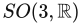上快速优化有向包围盒》（原题：Fast Oriented Bounding Box Optimization on the Rotation Group ），ACM Transactions on Graphics, 第30卷, 第5期, 第122:1–122:16页, 2011年10月. 本书引用页：951。

**[255]** Chang, Chun-Fa, Gary Bishop, and Anselmo Lastra, 《LDI树：用于基于图像渲染的层次表示》（原题：LDI Tree: A Hierarchical Representation for Image-Based Rendering），收录于 SIGGRAPH ’99: Proceedings of the 26th Annual Conference on Computer Graphics and Interactive Techniques, ACM Press/Addison-Wesley Publishing Co., 第291–298页, 1999年8月. 本书引用页：565。

**[256]** Chen, G. P. Sander, D. Nehab, L. Yang, and L. Hu, 《按深度预排序的三角形列表》（原题：Depth-Presorted Triangle Lists），ACM Transactions on Graphics, 第31卷, 第6期, 第160:1–160:9页, 2016. 本书引用页：831。

**[257]** Chen, Hao, 《〈光环3〉的光照与材质》（原题：Lighting and Material of Halo 3），游戏开发者大会（Game Developers Conference）， 2008年3月. 本书引用页：475。

**[258]** Chen, Hao, and Natalya Tatarchuk, 《Bungie的光照研究》（原题：Lighting Research at Bungie），SIGGRAPH“三维图形与游戏中的实时渲染进展”课程（SIGGRAPH Advances in Real-Time Rendering in 3D Graphics and Games）， 2009年8月. 本书引用页：256, 257, 475。

**[259]** Chen, K., 《〈孤岛惊魂4〉中的自适应虚拟纹理渲染》（原题：Adaptive Virtual Texture Rendering in Far Cry 4），游戏开发者大会（Game Developers Conference）， 2015年3月. 本书引用页：869。

**[260]** Chen, Pei-Ju, Hiroko Awata, Atsuko Matsushita, En-Cheng Yang, and Kentaro Arikawa, 《青凤蝶Graphium sarpedon眼睛中极为丰富的光谱感知能力》（原题：Extreme Spectral Richness in the Eye of the Common Bluebottle Butterfly, Graphium sarpedon），Frontiers in Ecology and Evolution, 第4卷, 第18页, 2016年3月8日. 本书引用页：272。

**[261]** Chi, Yung-feng, 《利用当今GPU实现栩栩如生的实时浅水动画》（原题：True-to-Life Real-Time Animation of Shallow Water on Todays GPUs），收录于 Wolfgang Engel, 主编， , Charles River Media, 第467–480页, 2005. 本书引用页：602, 626。

**[262]** Chiang, Matt Jen-Yuan, Benedikt Bitterli, Chuck Tappan, and Brent Burley, 《面向生产路径追踪的实用、可控毛发与皮毛模型》（原题：A Practical and Controllable Hair and Fur Model for Production Path Tracing），Computer Graphics Forum (Eurographics 2016), 第35卷, 第2期, 第275–283页, 2016. 本书引用页：643。

**[263]** Chlumský, Viktor,《用于多通道距离场的形状分解》（原题：Shape Decomposition for Multi-channel Distance Fields）， 理学硕士学位论文, 理论计算机科学系, 布拉格捷克理工大学（Czech Technical University in Prague）， 2015年5月. 本书引用页：677, 890。

**[264]** Choi, H., 《Bifrost——面向下一个五十亿用户的GPU架构》（原题：Bifrost—The GPU Architecture for Next Five Billion），ARM Tech Forum, 2016年6月. 本书引用页：1026, 1027。

**[265]** Christensen, Per H., 《基于点的近似颜色渗透》（原题：Point-Based Approximate Color Bleeding），技术备忘录, Pixar Animation Studios, 2008. 本书引用页：454。

**[266]** Cichocki, Adam, 《面向平面反射体的优化像素投影反射》（原题：Optimized Pixel-Projected Reflections for Planar Reflectors），SIGGRAPH“游戏中的实时渲染进展”课程（SIGGRAPH Advances in Real-Time Rendering in Games）， 2017年8月. 本书引用页：509。

**[267]** Cignoni, P., C. Montani, and R. Scopigno, 《对带有T形顶点的凸多边形进行三角剖分》（原题：Triangulating Convex Polygons Having T-Vertices），journal of graphics tools, 第1卷, 第2期, 第1–4页, 1996. 亦收录于[112]。 本书引用页：690。

**[268]** Cignoni, Paolo, 《论顶点法线的计算》（原题：On the Computation of Vertex Normals），Meshlab Stuff 博客, 2009年4月10日. 亦收录于[112]。 本书引用页：695。

**[269]** Cigolle, Zina H., Sam Donow, Daniel Evangelakos, Michael Mara, Morgan McGuire, and Quirin Meyer, 《独立单位向量的高效表示方法综述》（原题：A Survey of Efficient Representations for Independent Unit Vectors），Journal of Computer Graphics Techniques, 第3卷, 第1期, 第1–30页, 2014. 本书引用页：222, 714, 715。

**[270]** Clarberg, Petrik, and Tomas Akenine-Möller, 《用于直接光照的实用乘积重要性采样》（原题：Practical Product Importance Sampling for Direct Illumination），Computer Graphics Forum, 第27卷, 第2期, 第681–690页, 2008. 本书引用页：419。

**[271]** Clarberg, P., R. Toth, J. Hasselgren, J. Nilsson, and T. Akenine-Möller, 《AMFS：面向未来图形处理器的自适应多频率着色》（原题：AMFS: Adaptive Multi-frequency Shading for Future Graphics Processors），ACM Transactions on Graphics, 第33卷, 第4期, 第141:1–141:12页, 2014. 本书引用页：910, 1013。

**[272]** Clark, James H., 《用于可见表面算法的层次几何模型》（原题：Hierarchical Geometric Models for Visible Surface Algorithms），Communications of the ACM, 第19卷, 第10期, 第547–554页, 1976年10月. 本书引用页：835。

**[273]** Coffin, Christina, 《Playstation 3版〈战地3〉中基于SPU的延迟着色》（原题：SPU Based Deferred Shading in Battlefield 3 for Playstation 3），游戏开发者大会（Game Developers Conference）， 2011年3月. 本书引用页：898, 904。

**[274]** Cohen, Jonathan D., Marc Olano, and Dinesh Manocha, 《保持外观的简化》（原题：Appearance-Preserving Simplification），收录于 SIGGRAPH ’98: Proceedings of the 25th Annual Conference on Computer Graphics and Interactive Techniques, ACM, 第115–122页, 1998年7月. 本书引用页：212。

**[275]** Cohen, Michael F., and John R. Wallace, 《辐射度与真实感图像合成》（原题：Radiosity and Realistic Image Synthesis）， Academic Press Professional, 1993. 本书引用页：442, 483。

**[276]** Cohen-Or, Daniel, Yiorgos Chrysanthou, Frédo Durand, Ned Greene, Vladlen Kulton, and Cláudio T. Silva,《SIGGRAPH可见性、问题、技术与应用课程》（原题：SIGGRAPH Visibility, Problems, Techniques and Applications course）， 2001年8月. 本书引用页：原书未填写（原文止于“Cited on p.”）。

**[277]** Cohen-Or, Daniel, Yiorgos Chrysanthou, Cláudio T. Silva, and Frédo Durand, 《漫游应用中的可见性综述》（原题：A Survey of Visibility for Walkthrough Applications），IEEE Transactions on Visualization and Computer Graphics, 第9卷, 第3期, 第412–431页, 2003年7—9月. 本书引用页：830, 831, 879。

**[278]** Cok, Keith, Roger Corron, Bob Kuehne, and Thomas True, 《SIGGRAPH高效图形软件开发：图形学的阴与阳课程》（原题：SIGGRAPH Developing Efficient Graphics Software: The Yin and Yang of Graphics course）， 2000年7月. 本书引用页：801。

**[279]** Colbert, Mark, and Jaroslav Křivánek, 《基于GPU的重要性采样》（原题：GPU-Based Importance Sampling），收录于 Hubert Nguyen, 主编， GPU Gems 3, Addison-Wesley, 第459–475页, 2007. 本书引用页：419, 423, 503。

**[280]** Colbert, Mark, and Jaroslav Křivánek, 《采用滤波重要性采样的实时着色》（原题：Real-Time Shading with Filtered Importance Sampling），收录于 ACM SIGGRAPH 2007 Technical Sketches, ACM, 文章编号71, 2007年8月. 本书引用页：419, 423。

**[281]** Cole, Forrester, Aleksey Golovinskiy, Alex Limpaecher, Heather Stoddart Barros, Adam Finkelstein, Thomas Funkhouser, and Szymon Rusinkiewicz, 《人们会在哪里画线？》（原题：Where Do People Draw Lines?），ACM Transactions on Graphics (SIGGRAPH 2008), 第27卷, 第3期, 第88:1–88:11页, 2008. 本书引用页：656。

**[282]** Cole, Forrester, and Adam Finkelstein, 《实现高质量线条可见性的两种快速方法》（原题：Two Fast Methods for High-Quality Line Visibility），IEEE Transactions on Visualization and Computer Graphics, 第16卷, 第5期, 第707–717页, 2010年9／10月. 本书引用页：668, 675。

**[283]** Collin, D., 《〈战地〉中的剔除》（原题：Culling the Battlefield），游戏开发者大会（Game Developers Conference）， 2011年3月. 本书引用页：837, 840, 849。

**[284]** Conran, Patrick, 《SpecVar贴图：将凹凸贴图烘焙到镜面反射响应中》（原题：SpecVar Maps: Baking Bump Maps into Specular Response），收录于 ACM SIGGRAPH 2005 Sketches, ACM, 文章编号22, 2005年8月. 本书引用页：369。

**[285]** Cook, Robert L., and Kenneth E. Torrance, 《用于计算机图形学的反射模型》（原题：A Reflectance Model for Computer Graphics），Computer Graphics (SIGGRAPH ’81 Proceedings), 第15卷, 第3期, 第307–316页, 1981年7月. 本书引用页：314, 326, 331, 338, 343, 446。

**[286]** Cook, Robert L., and Kenneth E. Torrance, 《用于计算机图形学的反射模型》（原题：A Reflectance Model for Computer Graphics），ACM Transactions on Graphics, 第1卷, 第1期, 第7–24页, 1982年1月. 本书引用页：326, 338, 343, 446。

**[287]** Cook, Robert L., 《着色树》（原题：Shade Trees），Computer Graphics (SIGGRAPH ’84 Proceedings), 第18卷, 第3期, 第223–231页, 1984年7月. 本书引用页：37, 765。

**[288]** Cook, Robert L., 《计算机图形学中的随机采样》（原题：Stochastic Sampling in Computer Graphics），ACM Transactions on Graphics, 第5卷, 第1期, 第51–72页, 1986年1月. 本书引用页：249。

**[289]** Cook, Robert L., Loren Carpenter, and Edwin Catmull, 《Reyes图像渲染架构》（原题：The Reyes Image Rendering Architecture），Computer Graphics (SIGGRAPH ’87 Proceedings), 第21卷, 第4期, 第95–102页, 1987年7月. 本书引用页：26, 774, 908。

**[290]** Cook, Robert L., and Tony DeRose, 《小波噪声》（原题：Wavelet Noise），ACM Transactions on Graphics (SIGGRAPH 2005), 第24卷, 第3期, 第803–811页, 2005. 本书引用页：199。

**[291]** Coombes, David, 《DX12应该做和不应该做的事：更新版！》（原题：DX12 Do’s and Don’ts, Updated!），NVIDIA GameWorks 博客, 2015年11月12日. 本书引用页：814。

**[292]** Cormen, T. H., C. E. Leiserson, R. Rivest, and C. Stein, 《算法导论》（原题：Introduction to Algorithms）， MIT Press, 2009. 本书引用页：820, 829, 835。

**[293]** Courrèges, Adrian, 《〈GTA V〉——图形研究》（原题：GTA V—Graphics Study），Adrian Courrèges 博客, 2015年11月2日. 本书引用页：525, 535, 901, 913。

**[294]** Courrèges, Adrian, 《〈DOOM〉（2016）——图形研究》（原题：DOOM (2016)—Graphics Study），Adrian Courrèges 博客, 2016年9月9日. 本书引用页：246, 535, 540, 629, 901, 913。

**[295]** Courrèges, Adrian, 《当心透明像素》（原题：Beware of Transparent Pixels），Adrian Courrèges 博客, 2017年5月9日. 本书引用页：160, 208。

**[296]** Cox, Michael, and Pat Hanrahan, 《面向物体并行渲染的像素合并：一种分布式监听算法》（原题：Pixel Merging for Object-Parallel Rendering: A Distributed Snooping Algorithm），收录于 Proceedings of the 1993 Symposium on Parallel Rendering, ACM, 第49–56页, 1993年11月. 本书引用页：802。

**[297]** Cox, Michael, David Sprague, John Danskin, Rich Ehlers, Brian Hook, Bill Lorensen, and Gary Tarolli, 《SIGGRAPH面向PC平台的高性能图形应用开发课程》（原题：SIGGRAPH Developing High-Performance Graphics Applications for the PC Platform course）， 1998年7月. 本书引用页：1023。

**[298]** Cozzi, Patrick, 《使用深度缓冲进行拾取》（原题：Picking Using the Depth Buffer），AGI Blog, 2008年3月5日. 本书引用页：943。

**[299]** Cozzi, Patrick, and Kevin Ring, 《虚拟地球的三维引擎设计》（原题：3D Engine Design for Virtual Globes）， A K Peters/CRC Press, 2011. 本书引用页：668, 715, 872, 879。

**[300]** Cozzi, P., and D. Bagnell, 《WebGL地球渲染流水线》（原题：A WebGL Globe Rendering Pipeline），收录于 Wolfgang Engel, 主编， , CRC Press, 第39–48页, 2013. 本书引用页：872, 876。

**[301]** Cozzi, Patrick, 主编， 《WebGL精粹》（原题：WebGL Insights）， CRC Press, 2015. 本书引用页：129, 1048。

**[302]** Cozzi, Patrick, 《Cesium三维瓦片》（原题：Cesium 3D Tiles），GitHub代码仓库, 2017. 本书引用页：827。

**[303]** Crane, Keenan, Ignacio Llamas, and Sarah Tariq, 《三维流体的实时模拟与渲染》（原题：Real-Time Simulation and Rendering of 3D Fluids），收录于 Hubert Nguyen, 主编， GPU Gems 3, Addison-Wesley, 第633–675页, 2007. 本书引用页：608, 609, 649。

**[304]** Crassin, Cyril, 《GigaVoxels：用于高效探索大型精细场景的基于体素的渲染流水线》（原题：GigaVoxels: A Voxel-Based Rendering Pipeline For Efficient Exploration Of Large And Detailed Scenes）， 博士学位论文, 格勒诺布尔大学（University of Grenoble）， 2011年7月. 本书引用页：494, 579, 584。

**[305]** Crassin, Cyril, Fabrice Neyret, Miguel Sainz, Simon Green, and Elmar Eisemann, 《使用体素锥追踪的交互式间接光照》（原题：Interactive Indirect Illumination Using Voxel Cone Tracing），Computer Graphics Forum, 第30卷, 第7期, 第1921–1930页, 2011. 本书引用页：455, 467。

**[306]** Crassin, Cyril, and Simon Green, 《使用GPU硬件光栅器实现基于八叉树的稀疏体素化》（原题：Octree-Based Sparse Voxelization Using the GPU Hardware Rasterizer），收录于 Patrick Cozzi & Christophe Riccio, 主编， OpenGL Insights, CRC Press, 第303–319页, 2012. 本书引用页：582。

**[307]** Crassin, Cyril, 《用于实时全局光照的基于八叉树的稀疏体素化》（原题：Octree-Based Sparse Voxelization for Real-Time Global Illumination），NVIDIA GPU Technology Conference, 2012年2月. 本书引用页：504, 582。

**[308]** Crassin, Cyril, 《面向下一代实时渲染的动态稀疏体素八叉树》（原题：Dynamic Sparse Voxel Octrees for Next-Gen Real-Time Rendering），SIGGRAPH“超越可编程着色”课程（SIGGRAPH Beyond Programmable Shading）， 2012年8月. 本书引用页：579, 584。

**[309]** Crassin, Cyril, Morgan McGuire, Kayvon Fatahalian, and Aaron Lefohn, 《聚合G缓冲抗锯齿》（原题：Aggregate G-Buffer Anti-Aliasing），IEEE Transactions on Visualization and Computer Graphics, 第22卷, 第10期, 第2215–2228页, 2016年10月. 本书引用页：888。

**[310]** Cripe, Brian, and Thomas Gaskins, 《DirectModel工具包：满足技术应用的三维图形需求》（原题：The DirectModel Toolkit: Meeting the 3D Graphics Needs of Technical Applications），Hewlett-Packard Journal, 第19–27页, 1998年5月. 本书引用页：818。

**[311]** Crow, Franklin C., 《计算机图形学的阴影算法》（原题：Shadow Algorithms for Computer Graphics），Computer Graphics (SIGGRAPH ’77 Proceedings), 第11卷, 第2期, 第242–248页, 1977年7月. 本书引用页：230。

**[312]** Crow, Franklin C., 《用于纹理映射的区域求和表》（原题：Summed-Area Tables for Texture Mapping），Computer Graphics (SIGGRAPH ’84 Proceedings), 第18卷, 第3期, 第207–212页, 1984年7月. 本书引用页：186。

**[313]** Culler, David E., and Jaswinder Pal Singh, 由Anoop Gupta参与撰写, 《并行计算机体系结构：硬件与软件方法》（原题：Parallel Computer Architecture: A Hardware/Software Approach）， Morgan Kaufmann, 1998. 本书引用页：810。

**[314]** Cunningham, Steve, 《使用标准正交基进行三维观察与旋转》（原题：3D Viewing and Rotation Using Orthonormal Bases），收录于 Andrew S. Glassner, 主编， Graphics Gems, Academic Press, 第516–521页, 1990. 本书引用页：74。

**[315]** Cupisz, Kuba, and Kasper Engelstoft, 《Unity中的光照》（原题：Lighting in Unity），游戏开发者大会（Game Developers Conference）， 2015年3月. 本书引用页：476, 482, 509。

**[316]** Cupisz, Robert, 《使用四面体剖分进行光照探针插值》（原题：Light Probe Interpolation Using Tetrahedral Tessellations），游戏开发者大会（Game Developers Conference）， 2012年3月. 本书引用页：489, 490。

**[317]** Curtis, Cassidy, 《自由而粗略的素描式动画》（原题：Loose and Sketchy Animation），收录于 ACM SIGGRAPH ’98 Electronic Art and Animation Catalog, ACM, 第145页, 1998年7月. 本书引用页：672。

**[318]** Cychosz, J. M., and W. N. Waggenspack, Jr., 《射线与圆柱求交》（原题：Intersecting a Ray with a Cylinder），收录于 Paul S. Heckbert, 主编， Graphics Gems IV, Academic Press, 第356–365页, 1994. 本书引用页：959。

**[319]** Cyrus, M., and J. Beck, 《广义二维和三维裁剪》（原题：Generalized Two- and Three-Dimensional Clipping），Computers and Graphics, 第3卷, 第23–28页, 1978. 本书引用页：959。

**[320]** Dachsbacher, Carsten, and Marc Stamminger, 《半透明阴影贴图》（原题：Translucent Shadow Maps），收录于 Proceedings of the 14th Eurographics Workshop on Rendering, Eurographics Association, 第197–201页, 2003年6月. 本书引用页：638, 639。

**[321]** Dachsbacher, Carsten, and Marc Stamminger, 《反射阴影贴图》（原题：Reflective Shadow Maps），收录于 Proceedings of the 2005 Symposium on Interactive 3D Graphics and Games, ACM, 第203–231页, 2005. 本书引用页：491。

**[322]** Dachsbacher, Carsten, and Marc Stamminger, 《间接光照的泼溅》（原题：Splatting of Indirect Illumination），收录于 Proceedings of the 2006 Symposium on Interactive 3D Graphics and Games, ACM, 第93–100页, 2006. 本书引用页：492。

**[323]** Dachsbacher, C., and N. Tatarchuk, 《具有准确轮廓生成功能的棱柱视差遮蔽映射》（原题：Prism Parallax Occlusion Mapping with Accurate Silhouette Generation），Symposium on Interactive 3D Graphics and Games 海报, 2007年4—5月. 本书引用页：220。

**[324]** Dallaire, Chris, 《用于生成地形瓦片索引缓冲的二叉三角形树》（原题：Binary Triangle Trees for Terrain Tile Index Buffer Generation），Gamasutra, 2006年12月21日. 本书引用页：876。

**[325]** Dam, Erik B., Martin Koch, and Martin Lillholm, 《四元数、插值与动画》（原题：Quaternions, Interpolation and Animation），技术报告 DIKU-TR-98/5, 计算机科学系, 哥本哈根大学（University of Copenhagen）， 1998年7月. 本书引用页：81。

**[326]** Davies, Jem, 《Bifrost GPU架构与ARM Mali-G71 GPU》（原题：The Bifrost GPU Architecture and the ARM Mali-G71 GPU），Hot Chips, 2016年8月. 本书引用页：1025。

**[327]** Davies, Leigh, 《从顺序无关透明度到体积阴影映射：DirectX 12中光栅有序视图的101种用途》（原题：OIT to Volumetric Shadow Mapping, 101 Uses for Raster-Ordered Views Using DirectX 12），Intel Developer Zone 博客, 2015年3月5日. 本书引用页：52, 139, 156。

**[328]** Davies, Leigh, 《光栅器有序视图入门：初步指南》（原题：Rasterizer Order Views 101: A Primer），Intel Developer Zone 博客, 2015年8月5日. 本书引用页：52, 156。

**[329]** Day, Mike, 《CSM滚动：一种加速级联阴影贴图渲染的技术》（原题：CSM Scrolling: An Acceleration Technique for the Rendering of Cascaded Shadow Maps），由Mike Acton主讲, SIGGRAPH“游戏中的实时渲染进展”课程（SIGGRAPH Advances in Real-Time Rendering in Games）， 2012年8月. 本书引用页：245。

**[330]** Day, Mike, 《一种高效且易用的色调映射算子》（原题：An Efficient and User-Friendly Tone Mapping Operator），Insomniac R&D Blog, 2012年9月18日. 本书引用页：286。

**[331]** De Smedt, Matthijs, 《PC GPU性能热点》（原题：PC GPU Performance Hot Spots），NVIDIA GameWorks 博客, 2016年8月10日. 本书引用页：790, 792, 795, 814。

**[332]** Debevec, Paul E., 《将合成物体渲染到真实场景中：利用全局光照和高动态范围摄影连接传统图形技术与基于图像的图形技术》（原题：Rendering Synthetic Objects into Real Scenes: Bridging Traditional and Image-Based Graphics with Global Illumination and High Dynamic Range Photography），收录于 SIGGRAPH ’98: Proceedings of the 25th Annual Conference on Computer Graphics and Interactive Techniques, ACM, 第189–198页, 1998年7月. 本书引用页：406。

**[333]** Debevec, Paul, Rod Bogart, Frank Vitz, and Greg Ward, 《SIGGRAPH高动态范围成像与基于图像的光照课程》（原题：SIGGRAPH HDRI and Image-Based Lighting course）， 2003年7月. 本书引用页：435。

**[334]** DeBry, David (grue), Jonathan Gibbs, Devorah DeLeon Petty, and Nate Robins, 《在未参数化模型上绘制和渲染纹理》（原题：Painting and Rendering Textures on Unparameterized Models），ACM Transactions on Graphics (SIGGRAPH 2002), 第21卷, 第3期, 第763–768页, 2002年7月. 本书引用页：190。

**[335]** DeCarlo, Doug, Adam Finkelstein, and Szymon Rusinkiewicz, 《具有时间相干性的暗示轮廓交互式渲染》（原题：Interactive Rendering of Suggestive Contours with Temporal Coherence），收录于 Proceedings of the 3rd International Symposium on Non-Photorealistic Animation and Rendering, ACM, 第15–24页, 2004年6月. 本书引用页：655。

**[336]** Decaudin, Philippe, 《三维场景的卡通风格渲染》（原题：Cartoon-Looking Rendering of 3D-Scenes），技术报告 INRIA 2919, Université de Technologie de Compiègne, 法国, 1996年6月. 本书引用页：661, 664。

**[337]** Decaudin, Philippe, and Fabrice Neyret, 《体积公告板》（原题：Volumetric Billboards），Computer Graphics Forum, 第28卷, 第8期, 第2079–2089页, 2009. 本书引用页：564。

**[338]** Décoret, Xavier, Frédo Durand, François Sillion, and Julie Dorsey, 《用于极端模型简化的公告板云》（原题：Billboard Clouds for Extreme Model Simplification），ACM Transactions on Graphics (SIGGRAPH 2003), 第22卷, 第3期, 第689–696页, 2003. 本书引用页：563。

**[339]** Deering, M., S. Winnder, B. Schediwy, C. Duff, and N. Hunt, 《三角形处理器与法向量着色器：用于高性能图形的超大规模集成电路系统》（原题：The Triangle Processor and Normal Vector Shader: A VLSI System for High Performance Graphics），Computer Graphics (SIGGRAPH ’88 Proceedings), 第22卷, 第4期, 第21–30页, 1988年8月. 本书引用页：883。

**[340]** Deering, Michael, 《几何压缩》（原题：Geometry Compression），收录于 SIGGRAPH ’95: Proceedings of the 22nd Annual Conference on Computer Graphics and Interactive Techniques, ACM, 第13–20页, 1995年8月. 本书引用页：700。

**[341]** Delalandre, Cyril, Pascal Gautron, Jean-Eudes Marvie, and Guillaume François, 《透射率函数映射》（原题：Transmittance Function Mapping），Symposium on Interactive 3D Graphics and Games, 2011. 本书引用页：570, 612, 620。

**[342]** Delva, Michael, Julien Hamaide, and Ramses Ladlani, 《使用Shader Shaker进行基于语义的着色器生成》（原题：Semantic Based Shader Generation Using Shader Shaker），收录于 Wolfgang Engel, 主编， 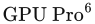, CRC Press, 第505–520页, 2015. 本书引用页：128。

**[343]** Demers, Joe, 《景深：技术综述》（原题：Depth of Field: A Survey of Techniques），收录于 Randima Fernando, 主编， GPU Gems, Addison-Wesley, 第375–390页, 2004. 本书引用页：531。

**[344]** Demoreuille, Pete, 《针对虚拟现实优化Unreal Engine 4渲染器》（原题：Optimizing the Unreal Engine 4 Renderer for VR），Oculus Developer Blog, 2016年5月25日. 本书引用页：900, 934。

**[345]** d’Eon, Eugene, and David Luebke, 《逼真实时皮肤渲染的高级技术》（原题：Advanced Techniques for Realistic Real-Time Skin Rendering），收录于 Hubert Nguyen, 主编， GPU Gems 3, Addison-Wesley, 第293–347页, 2007. 本书引用页：635, 636, 639。

**[346]** d’Eon, Eugene, Guillaume François, Martin Hill, Joe Letteri, and Jean-Mary Aubry, 《能量守恒的毛发反射模型》（原题：An Energy-Conserving Hair Reflectance Model），Computer Graphics Forum, 第30卷, 第4期, 第1467–8659页, 2011. 本书引用页：641, 643。〔原书页码范围为1467–8659，此处依原书保留。〕

**[347]** DeRose, T., M. Kass, and T. Truong, 《角色动画中的细分曲面》（原题：Subdivision Surfaces in Character Animation），收录于 SIGGRAPH ’98: Proceedings of the 25th Annual Conference on Computer Graphics and Interactive Techniques, ACM, 第85–94页, 1998年7月. 本书引用页：761, 764, 767, 777。

**[348]** Deshmukh, Priyamvad, Feng Xie, and Eric Tabellion, 《梦工厂织物着色模型：从方便艺术家使用到物理上合理》（原题：DreamWorks Fabric Shading Model: From Artist Friendly to Physically Plausible），收录于 ACM SIGGRAPH 2017 Talks, 文章编号38, 2017年7月. 本书引用页：359。

**[349]** Deshpande, Adit, 《你需要了解的9篇深度学习论文》（原题：The 9 Deep Learning Papers You Need To Know About），Adit Deshpande 博客, 2016年8月24日. 本书引用页：1043。

**[350]** Didyk, P., T. Ritschel, E. Eisemann, K. Myszkowski, and H.-P. Seidel, 《自适应图像空间立体视图合成》（原题：Adaptive Image-Space Stereo View Synthesis），收录于 Proceedings of the Vision, Modeling, and Visualization Workshop 2010, Eurographics Association, 第299–306页, 2010. 本书引用页：523。

**[351]** Didyk, P., E. Eisemann, T. Ritschel, K. Myszkowski, and H.-P. Seidel, 《针对高刷新率显示器、以感知为依据的三维内容实时时间上采样》（原题：Perceptually-Motivated Real-Time Temporal Upsampling of 3D Content for High-Refresh-Rate Displays），Computer Graphics Forum, 第29卷, 第2期, 第713–722页, 2011. 本书引用页：523。

**[352]** Dietrich, Andreas, Enrico Gobbetti, and Sung-Eui Yoon, 《超大规模模型渲染技术》（原题：Massive-Model Rendering Techniques），IEEE Computer Graphics and Applications, 第27卷, 第6期, 第20–34页, 2007年11／12月. 本书引用页：587, 879。

**[353]** Dietrich, Sim, 《衰减贴图》（原题：Attenuation Maps），收录于 Mark DeLoura, 主编， Game Programming Gems, Charles River Media, 第543–548页, 2000. 本书引用页：221。

**[354]** Dimitrijević, Aleksandar, 《性能状态跟踪》（原题：Performance State Tracking），收录于 Patrick Cozzi & Christophe Riccio, 主编， OpenGL Insights, CRC Press, 第527–534页, 2012. 本书引用页：789。

**[355]** Dimov, Rossen, 《推导GTR BRDF的Smith遮蔽函数》（原题：Deriving the Smith Shadowing Function for the GTR BRDF），Chaos Group 白皮书, 2015年6月. 本书引用页：343。

**[356]** Ding, Vivian, 《〈最后生还者〉的游戏内光照与过场动画光照》（原题：In-Game and Cinematic Lighting of The Last of Us），游戏开发者大会（Game Developers Conference）， 2014年3月. 本书引用页：229。

**[357]** Dmitriev, Kirill, and Yury Uralsky, 《利用层次最小值—最大值阴影贴图实现软阴影》（原题：Soft Shadows Using Hierarchical Min-Max Shadow Maps），游戏开发者大会（Game Developers Conference）， 2007年3月. 本书引用页：252。

**[358]** Dobashi, Yoshinori, Kazufumi Kaneda, Hideo Yamashita, Tsuyoshi Okita, and Tomoyuki Nishita, 《一种简单高效的真实感云动画方法》（原题：A Simple, Efficient Method for Realistic Animation of Clouds），收录于 SIGGRAPH ’00: Proceedings of the 27th Annual Conference on Computer Graphics and Interactive Techniques, ACM Press/Addison-Wesley Publishing Co., 第19–28页, 2000年7月. 本书引用页：556。

**[359]** Dobashi, Yoshinori, Tsuyoshi Yamamoto, and Tomoyuki Nishita, 《利用图形硬件交互式渲染大气散射效果》（原题：Interactive Rendering of Atmospheric Scattering Effects Using Graphics Hardware），收录于 Graphics Hardware 2002, Eurographics Association, 第99–107页, 2002年9月. 本书引用页：604。

**[360]** Dobbie, Will, 《利用向量纹理进行GPU文字渲染》（原题：GPU Text Rendering with Vector Textures），Will Dobbie 博客, 2016年1月21日. 本书引用页：677。

**[361]** Dobbyn, Simon, John Hamill, Keith O’Conor, and Carol O’Sullivan, 《Geopostors：实时几何体／替身人群渲染系统》（原题：Geopostors: A Real-Time Geometry/Impostor Crowd Rendering System），收录于 Proceedings of the 2005 Symposium on Interactive 3D Graphics and Games, ACM, 第95–102页, 2005年4月. 本书引用页：551。

**[362]** Doggett, M., 《纹理缓存》（原题：Texture Caches），IEEE Micro, 第32卷, 第3期, 第136–141页, 2005. 本书引用页：1017。

**[363]** Doghramachi, Hawar, and Jean-Normand Bucci, 《Deferred+：Dawn引擎的新一代剔除与渲染》（原题：Deferred+: Next-Gen Culling and Rendering for the Dawn Engine），收录于 Wolfgang Engel, 主编， GPU Zen, Black Cat Publishing, 第77–103页, 2017. 本书引用页：715, 849, 908。

**[364]** Dolby Laboratories Inc., 《ICtCp杜比白皮书》（原题：ICtCp Dolby White Paper），Dolby 网站. 本书引用页：276, 287。

**[365]** Dominé, Sébastien, 《OpenGL多重采样》（原题：OpenGL Multisample） 游戏开发者大会（Game Developers Conference）， 2002年3月. 本书引用页：145。

**[366]** Dong, Zhao, Bruce Walter, Steve Marschner, and Donald P. Greenberg, 《根据实测金属表面微几何预测外观》（原题：Predicting Appearance from Measured Microgeometry of Metal Surfaces），ACM Transactions on Graphics, 第35卷, 第1期, 文章编号9, 2015. 本书引用页：361。

**[367]** Donnelly, William, 《利用距离函数实现逐像素置换映射》（原题：Per-Pixel Displacement Mapping with Distance Functions），收录于 Matt Pharr, 主编， GPU Gems 2, Addison-Wesley, 第123–136页, 2005. 本书引用页：218。

**[368]** Donnelly, William, and Andrew Lauritzen, 《方差阴影贴图》（原题：Variance Shadow Maps），收录于 Proceedings of the 2006 Symposium on Interactive 3D Graphics, ACM, 第161–165页, 2006. 本书引用页：252。

**[369]** Donner, Craig, and Henrik Wann Jensen, 《多层半透明材质中的光扩散》（原题：Light Diffusion in Multi-Layered Translucent Materials），ACM Transactions on Graphics (SIGGRAPH 2005), 第24卷, 第3期, 第1032–1039页, 2005. 本书引用页：635。

**[370]** Doo, D., and M. Sabin, 《递归分割曲面在奇异点附近的行为》（原题：Behaviour of Recursive Division Surfaces Near Extraordinary Points），Computer-Aided Design, 第10卷, 第6期, 第356–360页, 1978年9月. 本书引用页：761。

**[371]** Dorn, Jonathan, Connelly Barnes, Jason Lawrence, and Westley Weimer, 《迈向自动带限程序化着色器》（原题：Towards Automatic Band-Limited Procedural Shaders），Computer Graphics Forum (Pacific Graphics 2015), 第34卷, 第7期, 第77–87页, 2015. 本书引用页：200。

**[372]** Doss, Joshua A., 《利用Graftal替身实现艺术风格渲染》（原题：Art-Based Rendering with Graftal Imposters），收录于 Mark DeLoura, 主编， Game Programming Gems 7, Charles River Media, 第447–454页, 2008. 本书引用页：672。

**[373]** Dou, Hang, Yajie Yan, Ethan Kerzner, Zeng Dai, and Chris Wyman, 《阴影贴图的自适应深度偏移》（原题：Adaptive Depth Bias for Shadow Maps），Journal of Computer Graphics Techniques, 第3卷, 第4期, 第146–162页, 2014. 本书引用页：250。

**[374]** Dougan, Carl, 《平行移动标架》（原题：The Parallel Transport Frame），收录于 Mark DeLoura, 主编， Game Programming Gems 2, Charles River Media, 第215–219页, 2001. 本书引用页：102。

**[375]** Drago, F., K. Myszkowski, T. Annen, and N. Chiba, 《用于显示高对比度场景的自适应对数映射》（原题：Adaptive Logarithmic Mapping for Displaying High Contrast Scenes），Computer Graphics Forum, 第22卷, 第3期, 第419–426页, 2003. 本书引用页：286。

**[376]** Driscoll, Rory, 《立方体贴图纹素的立体角》（原题：Cubemap Texel Solid Angle），CODEITNOW 博客, 2012年1月15日. 本书引用页：419。

**[377]** Drobot, Michal, 《带高度混合的四叉树置换映射》（原题：Quadtree Displacement Mapping with Height Blending），收录于 Wolfgang Engel, 主编， GPU Pro, A K Peters, Ltd., 第117–148页, 2010. 本书引用页：220。

**[378]** Drobot, Michał, 《面向实时图形的空间与时间相干性框架》（原题：A Spatial and Temporal Coherence Framework for Real-Time Graphics），收录于 Eric Lengyel, 主编， Game Engine Gems 2, A K Peters, Ltd., 第97–118页, 2011. 本书引用页：518。

**[379]** Drobot, Michal, 《〈杀戮地带：暗影坠落〉的光照》（原题：Lighting of Killzone: Shadow Fall），Digital Dragons 会议, 2013年4月. 本书引用页：116。

**[380]** Drobot, Michal, 《基于物理的面光源》（原题：Physically Based Area Lights），收录于 Wolfgang Engel, 主编， , CRC Press, 第67–100页, 2014. 本书引用页：116, 388。

**[381]** Drobot, Michal, 《全屏渲染阶段中的GCN执行模式》（原题：GCN Execution Patterns in Full Screen Passes），Michal Drobot 博客, 2014年4月1日. 本书引用页：514。

**[382]** Drobot, Michał, 《混合重建抗锯齿》（原题：Hybrid Reconstruction Anti Aliasing），SIGGRAPH“游戏中的实时渲染进展”课程（SIGGRAPH Advances in Real-Time Rendering in Games）， 2014年8月. 本书引用页：141, 142, 146, 165。

**[383]** Drobot, Michał, 《混合重建抗锯齿》（原题：Hybrid Reconstruction Antialiasing），收录于 Wolfgang Engel, 主编， , CRC Press, 第101–139页, 2015. 本书引用页：141, 146, 165。

**[384]** Drobot, Michal, 《〈使命召唤：无限战争〉的渲染》（原题：Rendering of Call of Duty Infinite Warfare），Digital Dragons 会议, 2017年5月. 本书引用页：262, 325, 371, 420, 502, 503, 509, 569。

**[385]** Drobot, Michal, 《用于平铺渲染与簇渲染的改进剔除方法》（原题：Improved Culling for Tiled and Clustered Rendering），SIGGRAPH“游戏中的实时渲染进展”课程（SIGGRAPH Advances in Real-Time Rendering in Games）， 2017年8月. 本书引用页：902, 905。

**[386]** Drobot, Michał, 《〈使命召唤：无限战争〉中的实用多层材质》（原题：Practical Multilayered Materials in Call of Duty Infinite Warfare），SIGGRAPH“基于物理的着色：理论与实践”课程（SIGGRAPH Physically Based Shading in Theory and Practice）， 2017年8月. 本书引用页：151, 363, 364, 623, 625, 629。

**[387]** Duff, Tom, 《三维渲染图像的合成》（原题：Compositing 3-D Rendered Images），Computer Graphics (SIGGRAPH ’85 Proceedings), 第19卷, 第3期, 第41–44页, 1985年7月. 本书引用页：149。

**[388]** Duff, Tom, James Burgess, Per Christensen, Christophe Hery, Andrew Kensler, Max Liani, and Ryusuke Villemin, 《重新探讨标准正交基的构建》（原题：Building an Orthonormal Basis, Revisited），Journal of Computer Graphics Techniques, 第6卷, 第1期, 第1–8页, 2017. 本书引用页：75。

**[389]** Duffy, Joe, 《深入剖析CLR》（原题：CLR Inside Out），MSDN Magazine, 第21卷, 第10期, 2006年9月. 本书引用页：791。

**[390]** Dufresne, Marc Fauconneau, 《前向簇着色》（原题：Forward Clustered Shading），Intel Software Developer Zone, 2014年8月5日. 本书引用页：900, 914。

**[391]** Duiker, Haarm-Pieter, and George Borshukov, 《电影风格色调映射》（原题：Filmic Tone Mapping），在Electronic Arts所作报告, 2006年10月27日. 本书引用页：286。

**[392]** Duiker, Haarm-Pieter, 《用于实时渲染的电影风格色调映射》（原题：Filmic Tonemapping for Real-Time Rendering），SIGGRAPH“影视与游戏制作中的色彩增强与渲染”课程（SIGGRAPH Color Enhancement and Rendering in Film and Game Production）， 2010年7月. 本书引用页：286, 288, 289, 290。

**[393]** Dummer, Jonathan, 《锥步进映射：一种迭代式射线—高度场求交算法》（原题：Cone Step Mapping: An Iterative Ray-Heightfield Intersection Algorithm），lonesock 网站, 2006. 本书引用页：219。

**[394]** Dunn, Alex, 《透明（或半透明）渲染》（原题：Transparency (or Translucency) Rendering），NVIDIA GameWorks 博客, 2014年10月20日. 本书引用页：155, 157, 159, 204, 569。

**[395]** Dupuy, Jonathan, Eric Heitz, Jean-Claude Iehl, Pierre Poulin, Fabrice Neyret, and Victor Ostromoukhov, 《线性高效的抗锯齿置换与反射率映射》（原题：Linear Efficient Antialiased Displacement and Reflectance Mapping），ACM Transactions on Graphics, 第32卷, 第6期, 第211:1–211:11页, 2013年11月. 本书引用页：370。

**[396]** Dupuy, Jonathan, 《利用LEADR映射对基于物理的着色进行抗锯齿处理》（原题：Antialiasing Physically Based Shading with LEADR Mapping），SIGGRAPH“基于物理的着色：理论与实践”课程（SIGGRAPH Physically Based Shading in Theory and Practice）， 2014年8月. 本书引用页：370。

**[397]** Dupuy, Jonathan, Eric Heitz, and Eugene d’Eon, 《统一微表面与微片理论的进一步进展》（原题：Additional Progress Towards the Unification of Microfacet and Microflake Theories），收录于 Proceedings of the Eurographics Symposium on Rendering: Experimental Ideas & Implementations, Eurographics Association, 第55–63页, 2016. 本书引用页：352, 648。

**[398]** Durand, Frédo, 《三维可见性：解析研究与应用》（原题：3D Visibility: Analytical Study and Applications）， 博士学位论文, Université Joseph Fourier, Grenoble, 1999年7月. 本书引用页：879。

**[399]** Dutré, Philip,《全局光照纲要》（原题：Global Illumination Compendium）， 网页, 2003年9月29日. 本书引用页：372, 443, 512。

**[400]** Dutré, Philip, Kavita Bala, and Philippe Bekaert, 《高级全局光照》（原题：Advanced Global Illumination）， 第2版, A K Peters, Ltd., 2006. 本书引用页：269, 442, 512, 684。

## 参考文献 401—600

**[401]** Dyken, C., M. Reimers, and J. Seland，《使用自适应混合 Bézier 曲面片进行实时 GPU 轮廓细化》（原题：Real-Time GPU Silhouette Refinement Using Adaptively Blended Bézier Patches），Computer Graphics Forum, 第27卷, 第1期, 第1–12页, 2008. 本书引用页：747。

**[402]** Dyn, Nira, David Levin, and John A. Gregory，《用于曲线设计的四点插值细分方案》（原题：A 4-Point Interpolatory Subdivision Scheme for Curve Design），Computer Aided Geometric Design, 第4卷, 第4期, 第257–268页, 1987. 本书引用页：755。

**[403]** Eberly, David，《耳切法三角剖分》（原题：Triangulation by Ear Clipping），Geometric Tools 网站, 2003. 本书引用页：686。

**[404]** Eberly, David，《三维游戏引擎设计：实时计算机图形学的实用方法》（原题：3D Game Engine Design: A Practical Approach to Real-Time Computer Graphics），第2版, Morgan Kaufmann, 2006. 本书引用页：82, 772, 829, 950, 951, 959, 976, 990。

**[405]** Eberly, David，《从法线贴图重建高度场》（原题：Reconstructing a Height Field from a Normal Map），Geometric Tools 博客, 2006年5月3日. 本书引用页：214。

**[406]** Eberly, David，《计算 SLERP 的快速精确算法》（原题：A Fast and Accurate Algorithm for Computing SLERP），Journal of Graphics, GPU, and Game Tools, 第15卷, 第3期, 第161–176页, 2011. 本书引用页：82。

**[407]** Ebert, David S., John Hart, Bill Mark, F. Kenton Musgrave, Darwyn Peachey, Ken Perlin, and Steven Worley，《纹理与建模：过程式方法》（原题：Texturing and Modeling: A Procedural Approach），第3版, Morgan Kaufmann, 2002. 本书引用页：198, 200, 222, 672。

**[408]** Eccles, Allen，《Diamond Monster 3Dfx Voodoo 1 显卡》（原题：The Diamond Monster 3Dfx Voodoo 1），GameSpy Hall of Fame, 2000. 本书引用页：1。

**[409]** Eisemann, Martin, and Xavier Décoret，《快速场景体素化及其应用》（原题：Fast Scene Voxelization and Applications），载于 ACM SIGGRAPH 2006 Sketches, ACM, 文章编号 8, 2006. 本书引用页：581, 586。

**[410]** Eisemann, Martin, Marcus Magnor, Thorsten Grosch, and Stefan Müller，《利用射线斜率快速测试射线与轴对齐包围盒的重叠》（原题：Fast Ray/Axis-Aligned Bounding Box Overlap Tests Using Ray Slopes），journal of graphics tools, 第12卷, 第4期, 第35–46页, 2007. 本书引用页：961。

**[411]** Eisemann, Martin, and Xavier Décoret，《用于可信软阴影的遮挡纹理》（原题：Occlusion Textures for Plausible Soft Shadows），Computer Graphics Forum, 第27卷, 第1期, 第13–23页, 2008. 本书引用页：230。

**[412]** Eisemann, Martin, Michael Schwarz, Ulf Assarsson, and Michael Wimmer，《实时阴影》（原题：Real-Time Shadows），A K Peters/CRC Press, 2011. 本书引用页：223, 244, 249, 253, 265。

**[413]** Eisemann, Martin, Michael Schwarz, Ulf Assarsson, and Michael Wimmer，《SIGGRAPH 高效实时阴影》（原题：SIGGRAPH Efficient Real-Time Shadows），课程, 2012年8月. 本书引用页：265。

**[414]** El Garawany, Ramy，《〈神秘海域4〉中的延迟光照》（原题：Deferred Lighting in Uncharted 4），SIGGRAPH 游戏实时渲染进展课程（SIGGRAPH Advances in Real-Time Rendering in Games course）, 2016年7月. 本书引用页：472, 886, 887, 898, 904。

**[415]** El Mansouri, Jalal，《〈汤姆·克兰西的彩虹六号：围攻〉的渲染》（原题：Rendering Tom Clancy’s Rainbow Six Siege），游戏开发者大会（Game Developers Conference）, 2016年3月. 本书引用页：146, 246, 252, 805, 850, 887。

**[416]** Elcott, Sharif, Kay Chang, Masayoshi Miyamoto, and Napaporn Metaaphanon，《〈最终幻想XV〉的渲染技术》（原题：Rendering Techniques of Final Fantasy XV），载于 ACM SIGGRAPH 2016 Talks, ACM, 文章编号 48, 2016年7月. 本书引用页：620。

**[417]** Eldridge, Matthew, Homan Igehy, and Pat Hanrahan，《Pomegranate：完全可扩展的图形体系结构》（原题：Pomegranate: A Fully Scalable Graphics Architecture），载于 SIGGRAPH ’00：第27届计算机图形学与交互技术年会论文集（SIGGRAPH ’00: Proceedings of the 27th Annual Conference on Computer Graphics and Interactive Techniques）, ACM Press/Addison-Wesley Publishing Co., 第443–454页, 2000年7月. 本书引用页：1020, 1021, 1022。

**[418]** Eldridge, Matthew，《围绕可扩展性和通信设计图形体系结构》（原题：Designing Graphics Architectures around Scalability and Communication），博士学位论文, Stanford University, 2001年6月. 本书引用页：1020, 1022, 1023。

**[419]** Elek, Oskar，《实时渲染具有多重散射的可参数化行星大气》（原题：Rendering Parametrizable Planetary Atmospheres with Multiple Scattering in Real Time），中欧计算机图形学研讨会（Central European Seminar on Computer Graphics）, 2009. 本书引用页：615。

**[420]** Elek, Oskar，《实时渲染中的分层材质》（原题：Layered Materials in Real-Time Rendering），载于 第14届中欧计算机图形学研讨会论文集（Proceedings of the 14th Central European Seminar on Computer Graphics）, Vienna University of Technology, 第27–34页, 2010年5月. 本书引用页：364。

**[421]** Elinas, Pantelis, and Wolfgang Stuerzlinger，《三维云的实时渲染》（原题：Real-Time Rendering of 3D Clouds），journal of graphics tools, 第5卷, 第4期, 第33–45页, 2000. 本书引用页：556。

**[422]** van Emde Boas, P., R. Kaas, and E. Zijlstra，《高效优先队列的设计与实现》（原题：Design and Implementation of an Efficient Priority Queue），Mathematical Systems Theory, 第10卷, 第1期, 第99–127页, 1977. 本书引用页：827。

**[423]** Enderton, Eric, Erik Sintorn, Peter Shirley, and David Luebke，《随机透明度》（原题：Stochastic Transparency），IEEE Transactions on Visualization and Computer Graphics, 第17卷, 第8期, 第1036–1047页, 2011. 本书引用页：149, 206。

**[424]** Endres, Michael, and Frank Kitson，《完善像素：精进视觉风格塑造的艺术》（原题：Perfecting The Pixel: Refining the Art of Visual Styling），游戏开发者大会（Game Developers Conference）, 2010年3月. 本书引用页：289。

**[425]** Eng, Austin，《更紧密的视锥体剔除，以及为何你可能想忽略它》（原题：Tighter Frustum Culling and Why You May Want to Disregard It），Cesium 博客, 2017年2月2日. 本书引用页：986。

**[426]** Engel, Wolfgang，编，《Direct3D ShaderX：顶点与像素着色器技巧和技术》（原题：Direct3D ShaderX: Vertex & Pixel Shader Tips and Techniques），Wordware, 2002. 本书引用页：xvii。

**[427]** Engel, Wolfgang，编，《ShaderX 第二卷：DirectX 9 入门与教程》（原题：: Introduction & Tutorials with DirectX 9），Wordware, 2004. 本书引用页：xvi。

**[428]** Engel, Wolfgang，编，《ShaderX 第二卷：DirectX 9 着色器编程技巧与诀窍》（原题：: Shader Programming Tips & Tricks with DirectX 9），Wordware, 2004. 本书引用页：xvi。

**[429]** Engel, Wolfgang，编，《ShaderX 第三卷》（原题：），Charles River Media, 2004. 本书引用页：1148。

**[430]** Engel, Wolfgang，《级联阴影贴图》（原题：Cascaded Shadow Maps），载于 Wolfgang Engel，编， , Charles River Media, 第197–206页, 2006. 本书引用页：242, 243。

**[431]** Engel, Wolfgang，《为多个光源设计渲染器：光照预通道渲染器》（原题：Designing a Renderer for Multiple Lights: The Light Pre-Pass Renderer），载于 Wolfgang Engel，编， , Charles River Media, 第655–666页, 2009. 本书引用页：892。

**[432]** Engel, Wolfgang，《光照预通道；延迟光照：最新进展》（原题：Light Pre-Pass; Deferred Lighting: Latest Development），SIGGRAPH 游戏实时渲染进展课程（SIGGRAPH Advances in Real-Time Rendering in Games course）, 2009年8月. 本书引用页：892, 901。

**[433]** Engel, Wolfgang，《经过过滤和剔除的可见性缓冲区》（原题：The Filtered and Culled Visibility Buffer），欧洲游戏开发者大会（Game Developers Conference Europe）, 2016年8月. 本书引用页：833, 851, 907。

**[434]** Engelhardt, Thomas, and Carsten Dachsbacher，《八面体环境贴图》（原题：Octahedron Environment Maps），载于 2008年视觉、建模与可视化会议论文集（Proceedings of the Vision, Modeling, and Visualization Conference 2008）, Aka GmbH, 第383–388页 2008年10月. 本书引用页：413。

**[435]** Ericson, Christer，《实时碰撞检测》（原题：Real-Time Collision Detection），Morgan Kaufmann, 2005. 本书引用页：827, 879, 946, 948, 950, 955, 977, 978, 979, 990。

**[436]** Ericson, Christer，《使用分离轴测试进行碰撞检测》（原题：Collisions Using Separating-Axis Tests），游戏开发者大会（Game Developers Conference）, 2007年3月. 本书引用页：980。

**[437]** Ericson, Christer，《更多 Capcom/CEDEC 内幕披露》（原题：More Capcom/CEDEC Bean-Spilling），realtimecollisiondetection.net博客, 2007年10月1日. 本书引用页：537。

**[438]** Ericson, Christer，《把图形绘制调用安排好！》（原题：Order Your Graphics Draw Calls Around!），realtimecollisiondetection.net博客, 2008年10月3日. 本书引用页：803。

**[439]** Ericson, Christer，《优化粒子系统的渲染》（原题：Optimizing the Rendering of a Particle System），realtimecollisiondetection.net博客, 2009年1月2日. 本书引用页：556, 568。

**[440]** Ericson, Christer，《优化球体与三角形的相交测试》（原题：Optimizing a Sphere-Triangle Intersection Test），realtimecollisiondetection.net博客, 2010年12月30日. 本书引用页：974。

**[441]** Eriksson, Carl, Dinesh Manocha, and William V. Baxter III，《利用 HLOD 加快大型静态与动态环境的显示》（原题：HLODs for Faster Display of Large Static and Dynamic Environments），载于 2001年交互式三维图形研讨会论文集（Proceedings of the 2001 Symposium on Interactive 3D Graphics）, ACM, 第111–120页, 2001. 本书引用页：866。

**[442]** Estevez, Alejandro Conty, and Christopher Kulla，《适合生产流程的微表面绒光 BRDF》（原题：Production Friendly Microfacet Sheen BRDF），技术报告, Sony Imageworks, 2017. 本书引用页：358。

**[443]** Etuaho, Olli，《无缺陷且快速的移动端 WebGL》（原题：Bug-Free and Fast Mobile WebGL），载于 Patrick Cozzi，编， WebGL Insights, CRC Press, 第123–137页, 2015. 本书引用页：702, 796, 802, 805, 814。

**[444]** Evans, Alex，《动态场景全局光照的快速近似》（原题：Fast Approximations for Global Illumination on Dynamic Scenes），SIGGRAPH 三维图形与游戏高级实时渲染课程（SIGGRAPH Advanced Real-Time Rendering in 3D Graphics and Games course）, 2006年8月. 本书引用页：454, 488。

**[445]** Evans, Alex, and Anton Kirczenow，《〈小小大星球2〉中的体素》（原题：Voxels in LittleBigPlanet 2），SIGGRAPH 游戏实时渲染进展课程（SIGGRAPH Advances in Real-Time Rendering in Games course）, 2011年8月. 本书引用页：571。

**[446]** Evans, Alex，《从失败中学习：为〈Dreams PS4〉这一几何密集、绘画风格的用户生成内容游戏探索过的、前景可期但大多已放弃的非常规渲染器综述》（原题：Learning from Failure: A Survey of Promising, Unconventional and Mostly Abandoned Renderers for ‘Dreams PS4’, a Geometrically Dense, Painterly UGC Game），SIGGRAPH 游戏实时渲染进展课程（SIGGRAPH Advances in Real-Time Rendering in Games course）, 2015年8月. 本书引用页：577, 679。

**[447]** Evans, Martin，《用延迟屏幕空间贴花在物体上绘制内容》（原题：Drawing Stuff on Other Stuff with Deferred Screenspace Decals），Blog 3.0, 2015年2月27日. 本书引用页：889。

**[448]** Everitt, Cass，《使用 GeForce 和 GeForce2 进行单通道轮廓渲染》（原题：One-Pass Silhouette Rendering with GeForce and GeForce2），NVIDIA 白皮书, 2000年6月. 本书引用页：656。

**[449]** Everitt, Cass，《交互式顺序无关透明度》（原题：Interactive Order-Independent Transparency），NVIDIA 白皮书, 2001年5月. 本书引用页：154。

**[450]** Everitt, Cass, and Mark Kilgard，《用于硬件加速渲染的实用而稳健的模板阴影体》（原题：Practical and Robust Stenciled Shadow Volumes for Hardware-Accelerated Rendering），NVIDIA 白皮书, 2002年3月. 本书引用页：232。

**[451]** Everitt, Cass, and John McDonald，《超越移植》（原题：Beyond Porting），Steam 开发者日（Steam Dev Days）, 2014年2月. 本书引用页：795, 805。

**[452]** Everitt, Cass, Graham Sellers, John McDonald, and Tim Foley，《逼近零驱动开销》（原题：Approaching Zero Driver Overhead），游戏开发者大会（Game Developers Conference）, 2014年3月. 本书引用页：191, 192。

**[453]** Everitt, Cass，《多视图渲染》（原题：Multiview Rendering），SIGGRAPH 推进移动图形课程（SIGGRAPH Moving Mobile Graphics course）, 2016年7月. 本书引用页：927, 928。

**[454]** Ewins, Jon P., Marcus D. Waller, Martin White, and Paul F. Lister，《纹理映射中的 MIP 贴图层级选择》（原题：MIP-Map Level Selection for Texture Mapping），IEEE Transactions on Visualization and Computer Graphics, 第4卷, 第4期, 第317–329页, 1998年10—12月. 本书引用页：185。

**[455]** Eyles, J., S. Molnar, J. Poulton, T. Greer, A. Lastra, N. England, and L. Westover，《PixelFlow：实现》（原题：PixelFlow: The Realization），载于 ACM SIGGRAPH/EUROGRAPHICS 图形硬件研讨会论文集（Proceedings of the ACM SIGGRAPH/EUROGRAPHICS Workshop on Graphics Hardware）, ACM, 第57–68页, 1997年8月. 本书引用页：1022。

**[456]** Fairchild, Mark D.，《色貌模型》（原题：Color Appearance Models），第3版, John Wiley & Sons, Inc., 2013. 本书引用页：276, 278, 291。

**[457]** Farin, Gerald，《三角形 Bernstein-Bézier 曲面片》（原题：Triangular Bernstein-Bézier Patches），Computer Aided Geometric Design, 第3卷, 第2期, 第83–127页, 1986. 本书引用页：745, 781。

**[458]** Farin, Gerald，《计算机辅助几何设计的曲线与曲面：实用指南》（原题：Curves and Surfaces for Computer Aided Geometric Design—A Practical Guide），第4版, Academic Press Inc., 1996. 本书引用页：718, 720, 721, 724, 725, 728, 732, 734, 738, 742, 745, 749, 754, 756, 781。

**[459]** Farin, Gerald E.，《NURBS：从射影几何到实际应用》（原题：NURBS: From Projective Geometry to Practical Use），第2版, A K Peters, Ltd., 1999. 本书引用页：781。

**[460]** Farin, Gerald, and Dianne Hansford，《计算机辅助几何设计基础》（原题：The Essentials of CAGD），A K Peters, Ltd., 2000. 本书引用页：781。

**[461]** Farin, Gerald E., and Dianne Hansford，《实用线性代数：几何工具箱》（原题：Practical Linear Algebra: A Geometry Toolbox），A K Peters, Ltd., 2004. 本书引用页：102, 991。

**[462]** Fatahalian, Kayvon, and Randy Bryant，《并行计算机体系结构与编程》（原题：Parallel Computer Architecture and Programming），课程, Carnegie Mellon University, 2017年春季. 本书引用页：30, 55。

**[463]** Fauconneau, M.，《使用 ISPC 进行高质量快速 DX11 纹理压缩》（原题：High-Quality, Fast DX11 Texture Compression with ISPC），游戏开发者大会（Game Developers Conference）, 2015年3月. 本书引用页：198。

**[464]** Fedkiw, Ronald, Jos Stam, and Henrik Wann Jensen，《烟雾的视觉模拟》（原题：Visual Simulation of Smoke），载于 SIGGRAPH ’01：第27届计算机图形学与交互技术年会论文集（SIGGRAPH ’01: Proceedings of the 27th Annual Conference on Computer Graphics and Interactive Techniques）, ACM, 第15–22页, 2001年8月. 本书引用页：649。

**[465]** Fenney, Simon，《使用低频信号调制进行纹理压缩》（原题：Texture Compression Using Low-Frequency Signal Modulation），载于 Graphics Hardware 2003, Eurographics Association, 第84–91页, 2003年7月. 本书引用页：196。

**[466]** Fernandes, António Ramires, and Bruno Oliveira，《GPU 曲面细分：还有许多地形 LOD 问题有待解决》（原题：GPU Tessellation: We Still Have a LOD of Terrain to Cover），载于 Patrick Cozzi & Christophe Riccio，编， OpenGL Insights, CRC Press, 第145–161页, 2012. 本书引用页：46, 879。

**[467]** Fernando, Randima，《百分比渐近软阴影》（原题：Percentage-Closer Soft Shadows），载于 ACM SIGGRAPH 2005 Sketches, ACM, 文章编号 35, 2005年8月. 本书引用页：250。

**[468]** Ferwerda, James，《计算机图形学中的早期视觉基础》（原题：Elements of Early Vision for Computer Graphics），IEEE Computer Graphics and Applications, 第21卷, 第5期, 第22–33页, 2001年9/10月. 本书引用页：278。

**[469]** Feynman, Richard, Robert B. Leighton, and Matthew Sands，《费曼物理学讲义》（原题：The Feynman Lectures on Physics），1963. 可在以下位置获取： Feynman Lectures 网站, 2006. 本书引用页：298, 373。

**[470]** de Figueiredo, L. H.，《参数曲线的自适应采样》（原题：Adaptive Sampling of Parametric Curves），载于 Alan Paeth，编， Graphics Gems V, Academic Press, 第173–178页, 1995. 本书引用页：771。

**[471]** Filion, Dominic, and Rob McNaughton，《〈星际争霸II〉：特效与技术》（原题：Starcraft II: Effects and Techniques），SIGGRAPH 三维图形与游戏实时渲染进展课程（SIGGRAPH Advances in Real-Time Rendering in 3D Graphics and Games course）, 2008年8月. 本书引用页：257, 459, 885。

**[472]** Fisher, F., and A. Woo，《镜面高光：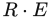 与 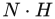 的比较》（原题： versus  Specular Highlights），载于 Paul S. Heckbert，编， Graphics Gems IV, Academic Press, 第388–400页, 1994. 本书引用页：421。

**[473]** Flavell, Andrew，《运行时 Mip 贴图过滤》（原题：Run Time Mip-Map Filtering），Game Developer, 第5卷, 第11期, 第34–43页, 1998年11月. 本书引用页：185, 186。

**[474]** Floater, Michael, Kai Hormann, and Géza Kós，《凸多边形上重心坐标的一般构造》（原题：A General Construction of Barycentric Coordinates over Convex Polygons），Advances in Computational Mathematics, 第24卷, 第1–4期, 第311–331页, 2006年1月. 本书引用页：970。

**[475]** Floater, M.，《三角形 Bézier 曲面》（原题：Triangular Bézier Surfaces），技术报告, University of Oslo, 2011年8月. 本书引用页：741。

**[476]** Fog, Agner，《优化 C++ 软件》（原题：Optimizing Software in C++），Software Optimization Resources, 2007. 本书引用页：815。

**[477]** Fogal, Thomas, Alexander Schiewe, and Jens Krüger，《可扩展的基于 GPU 的射线引导体渲染分析》（原题：An Analysis of Scalable GPU-Based Ray-Guided Volume Rendering），载于 IEEE 大规模数据分析与可视化研讨会论文集（LDAV 13）（Proceedings of the IEEE Symposium on Large Data Analysis and Visualization (LDAV 13)）, IEEE Computer Society, 第43–51页, 2013. 本书引用页：586。

**[478]** Foley, Tim，《并行编程模型入门》（原题：Introduction to Parallel Programming Models），SIGGRAPH 超越可编程着色课程（SIGGRAPH Beyond Programmable Shading course）, 2009年8月. 本书引用页：815。

**[479]** Fong, Julian, Magnus Wrenninge, Christopher Kulla, and Ralf Habel，《SIGGRAPH 生产级体渲染》（原题：SIGGRAPH Production Volume Rendering），课程, 2017年8月. 本书引用页：589, 590, 591, 592, 594, 649。

**[480]** Forest, Vincent, Loic Barthe, and Mathias Paulin，《实时层次化二值场景体素化》（原题：Real-Time Hierarchical Binary-Scene Voxelization），journal of graphics, GPU, and game tools, 第14卷, 第3期, 第21–34页, 2011. 本书引用页：581。

**[481]** Forsyth, Tom，《视图无关渐进网格（VIPM）方法比较》（原题：Comparison of VIPM Methods），载于 Mark DeLoura，编， Game Programming Gems 2, Charles River Media, 第363–376页, 2001. 本书引用页：707, 711, 859。

**[482]** Forsyth, Tom，《替身：添加场景杂物》（原题：Impostors: Adding Clutter），载于 Mark DeLoura，编， Game Programming Gems 2, Charles River Media, 第488–496页, 2001. 本书引用页：561, 562。

**[483]** Forsyth, Tom，《使用多个动态视锥体提高阴影缓冲区的稳健性》（原题：Making Shadow Buffers Robust Using Multiple Dynamic Frustums），载于 Wolfgang Engel，编， , Charles River Media, 第331–346页, 2005. 本书引用页：242。

**[484]** Forsyth, Tom，《极其实用的阴影》（原题：Extremely Practical Shadows），游戏开发者大会（Game Developers Conference）, 2006年3月. 本书引用页：234, 241, 242。

**[485]** Forsyth, Tom，《线性时间顶点缓存优化》（原题：Linear-Speed Vertex Cache Optimisation），TomF’s Tech Blog, 2006年9月28日. 本书引用页：701, 705。

**[486]** Forsyth, Tom，《阴影缓冲区》（原题：Shadowbuffers），游戏开发者大会（Game Developers Conference）, 2007年3月. 本书引用页：234, 242。

**[487]** Forsyth, Tom，《Trilight：用于游戏的简单通用光照模型》（原题：The Trilight: A Simple General-Purpose Lighting Model for Games），TomF’s Tech Blog, 2007年3月22日. 本书引用页：382, 432。

**[488]** Forsyth, Tom，《渲染状态更改的代价》（原题：Renderstate Change Costs），TomF’s Tech Blog, 2008年1月27日. 本书引用页：795, 796, 802, 803。

**[489]** Forsyth, Tom，《虚拟现实、增强现实与其他现实》（原题：VR, AR and Other Realities），TomF’s Tech Blog, 2012年9月16日. 本书引用页：917。

**[490]** Forsyth, Tom，《预乘 Alpha，第二部分》（原题：Premultiplied Alpha Part 2），TomF’s Tech Blog, 2015年3月18日. 本书引用页：208。

**[491]** Forsyth, Tom，《sRGB 学习曲线》（原题：The sRGB Learning Curve），TomF’s Tech Blog, 2015年11月30日. 本书引用页：161, 162, 163。

**[492]** Fowles, Grant R.，《现代光学导论》（原题：Introduction to Modern Optics），第2版, Holt, Reinhart, and Winston, 1975. 本书引用页：373。

**[493]** Franklin, Dustin，《基于硬件的环境光遮蔽》（原题：Hardware-Based Ambient Occlusion），载于 Wolfgang Engel，编， , Charles River Media, 第91–100页, 2005. 本书引用页：452。

**[494]** Frey, Ivo Zoltan，《使用双四元数与 QTangents 进行球面蒙皮》（原题：Spherical Skinning with Dual-Quaternions and QTangents），载于 ACM SIGGRAPH 2011 Talks, 文章编号 11, 2011年8月. 本书引用页：209, 210, 715。

**[495]** Frisken, Sarah, Ronald N. Perry, Alyn P. Rockwood, and Thouis R. Jones，《自适应采样距离场：计算机图形学中的通用形状表示》（原题：Adaptively Sampled Distance Fields: A General Representation of Shape for Computer Graphics），载于 SIGGRAPH ’00：第27届计算机图形学与交互技术年会论文集（SIGGRAPH ’00: Proceedings of the 27th Annual Conference on Computer Graphics and Interactive Techniques）, ACM Press/Addison-Wesley Publishing Co., 第249–254页, 2000年7月. 本书引用页：677, 751。

**[496]** Frisvad, Jeppe Revall，《无需归一化即可从三维单位向量构建标准正交基》（原题：Building an Orthonormal Basis from a 3D Unit Vector Without Normalization），journal of graphics tools, 第16卷, 第3期, 第151–159页, 2012. 本书引用页：75。

**[497]** Fry, Alex，《Frostbite 中的高动态范围调色与显示》（原题：High Dynamic Range Color Grading and Display in Frostbite），游戏开发者大会（Game Developers Conference）, 2017年2—3月. 本书引用页：283, 287, 288, 290。

**[498]** Frykholm, Niklas，《BitSquid 底层动画系统》（原题：The BitSquid Low Level Animation System），Autodesk Stingray 博客, 2009年11月20日. 本书引用页：715, 905。

**[499]** Frykholm, Niklas，《什么是万向节锁，为什么我们仍须担心它？》（原题：What Is Gimbal Lock and Why Do We Still Have to Worry about It?），Autodesk Stingray 博客, 2013年3月15日. 本书引用页：73。

**[500]** Fuchs, H., Z. M. Kedem, and B. F. Naylor，《利用先验树结构生成可见表面》（原题：On Visible Surface Generation by A Priori Tree Structures），Computer Graphics (SIGGRAPH ’80 Proceedings), 第14卷, 第3期, 第124–133页, 1980年7月. 本书引用页：823。

**[501]** Fuchs, H., G. D. Abram, and E. D. Grant，《刚性物体的近实时着色显示》（原题：Near Real-Time Shaded Display of Rigid Objects），Computer Graphics (SIGGRAPH ’83 Proceedings), 第17卷, 第3期, 第65–72页, 1983年7月. 本书引用页：823。

**[502]** Fuchs, H., J. Poulton, J. Eyles, T. Greer, J. Goldfeather, D. Ellsworth, S. Molnar, G. Turk, B. Tebbs, and L. Israel，《Pixel-Planes 5：使用处理器增强存储器的异构多处理器图形系统》（原题：Pixel-Planes 5: A Heterogeneous Multiprocessor Graphics System Using Processor-Enhanced Memories），Computer Graphics (SIGGRAPH ’89 Proceedings), 第23卷, 第3期, 第79–88页, 1989年7月. 本书引用页：8, 1026。

**[503]** Fuhrmann, Anton L., Eike Umlauf, and Stephan Mantler，《用于森林渲染的极端模型简化》（原题：Extreme Model Simplification for Forest Rendering），载于 首届 Eurographics 自然现象会议论文集（Proceedings of the First Eurographics Conference on Natural Phenomena）, Eurographics Association, 第57–66页, 2005. 本书引用页：563。

**[504]** Fujii, Yasuhiro，《对 Oren-Nayar 反射模型的一点小改进》（原题：A Tiny Improvement of Oren-Nayar Reflectance Model），http://mimosa-pudica.net, 2013年10月9日. 本书引用页：354。

**[505]** Fünfzig, C., K. Müller, D. Hansford, and G. Farin，《用于 GPU 上切平面连续曲面的 PNG1 三角形》（原题：PNG1 Triangles for Tangent Plane Continuous Surfaces on the GPU），载于 Graphics Interface 2008, Canadian Information Processing Society, 第219–226页, 2008. 本书引用页：747。

**[506]** Fung, James，《GPU 上的计算机视觉》（原题：Computer Vision on the GPU），载于 Matt Pharr，编， GPU Gems 2, Addison-Wesley, 第649–666页, 2005. 本书引用页：521。

**[507]** Funkhouser, Thomas A.，《建筑模型交互式可视化的数据库与显示算法》（原题：Database and Display Algorithms for Interactive Visualization of Architectural Models），博士学位论文, University of California, Berkeley, 1993. 本书引用页：866。

**[508]** Funkhouser, Thomas A., and Carlo H. Séquin，《复杂虚拟环境可视化中维持交互帧率的自适应显示算法》（原题：Adaptive Display Algorithm for Interactive Frame Rates During Visualization of Complex Virtual Environments），载于 SIGGRAPH ’93：第20届计算机图形学与交互技术年会论文集（SIGGRAPH ’93: Proceedings of the 20th Annual Conference on Computer Graphics and Interactive Techniques）, ACM, 第247–254页, 1993年8月. 本书引用页：710, 864, 865, 866。

**[509]** Fürst, René, Oliver Mattausch, and Daniel Scherzer，《实时深度阴影贴图》（原题：Real-Time Deep Shadow Maps），载于 Wolfgang Engel，编， , CRC Press, 第253–264页, 2013. 本书引用页：258。

**[510]** Gaitatzes, Athanasios, and Georgios Papaioannou，《渐进式屏幕空间多通道表面体素化》（原题：Progressive Screen-Space Multichannel Surface Voxelization），载于 Wolfgang Engel，编， , CRC Press, 第137–154页, 2013. 本书引用页：582。

**[511]** Galeano, David，《Turbulenz 引擎中的渲染优化》（原题：Rendering Optimizations in the Turbulenz Engine），载于 Patrick Cozzi，编， WebGL Insights, CRC Press, 第157–171页, 2015. 本书引用页：795, 796, 802, 803。

**[512]** Gallagher, Benn, and Martin Mittring，《在 UE4 中构建〈Paragon〉》（原题：Building Paragon in UE4），游戏开发者大会（Game Developers Conference）, 2016年3月. 本书引用页：527, 556, 637。

**[513]** Garcia, Ismael, Mateu Sbert, and Lázló Szirmay-Kalos，《使用公告板云渲染树木》（原题：Tree Rendering with Billboard Clouds），第三届匈牙利计算机图形学与几何学会议（Third Hungarian Conference on Computer Graphics and Geometry）, 2005年1月. 本书引用页：563。

**[514]** Garland, Michael, and Paul S. Heckbert，《地形与高度场的快速多边形近似》（原题：Fast Polygonal Approximation of Terrains and Height Fields），技术报告 CMU-CS-95-181, Carnegie Mellon University, 1995. 本书引用页：708, 877。

**[515]** Garland, Michael, and Paul S. Heckbert，《使用二次误差度量进行曲面简化》（原题：Surface Simplification Using Quadric Error Metrics），载于 SIGGRAPH ’97：第24届计算机图形学与交互技术年会论文集（SIGGRAPH ’97: Proceedings of the 24th Annual Conference on Computer Graphics and Interactive Techniques）, ACM Press/Addison-Wesley Publishing Co., 第209–216页, 1997年8月. 本书引用页：708。

**[516]** Garland, Michael, and Paul S. Heckbert，《使用二次误差度量简化具有颜色和纹理的曲面》（原题：Simplifying Surfaces with Color and Texture Using Quadric Error Metrics），载于 IEEE Visualization 98 论文集（Proceedings of IEEE Visualization 98）, IEEE Computer Society, 第263–269页, 1998年7月. 本书引用页：706, 707, 708。

**[517]** Garland, Michael，《基于二次型的多边形曲面简化》（原题：Quadric-Based Polygonal Surface Simplification），博士学位论文, 技术报告 CMU-CS-99-105, Carnegie Mellon University, 1999. 本书引用页：709。

**[518]** Gautron, Pascal, Jaroslav Křivánek, Sumanta Pattanaik, and Kadi Bouatouch，《用于精确高效渲染的新型半球基》（原题：A Novel Hemispherical Basis for Accurate and Efficient Rendering），载于 第十五届 Eurographics 渲染技术会议论文集（Proceedings of the Fifteenth Eurographics Conference on Rendering Techniques）, Eurographics Association, 第321–330页, 2004年6月. 本书引用页：404。

**[519]** Geczy, George，《三维世界中的二维编程：使用 DirectX 8 Direct3D 开发二维游戏引擎》（原题：2D Programming in a 3D World: Developing a 2D Game Engine Using DirectX 8 Direct3D），Gamasutra, 2001年6月. 本书引用页：550。

**[520]** Gehling, Michael，《动态天空景观》（原题：Dynamic Skyscapes），Game Developer, 第13卷, 第3期, 第23–33页, 2006年3月. 本书引用页：549。

**[521]** Geiss, Ryan，《使用 GPU 生成复杂的过程式地形》（原题：Generating Complex Procedural Terrains Using the GPU），载于 Hubert Nguyen，编， GPU Gems 3, Addison-Wesley, 第7–37页, 2007. 本书引用页：171。

**[522]** Geiss, Ryan, and Michael Thompson，《NVIDIA 演示团队揭秘：Cascades》（原题：NVIDIA Demo Team Secrets—Cascades），游戏开发者大会（Game Developers Conference）, 2007年3月. 本书引用页：171, 571。

**[523]** Geldreich, Rich，《crunch/crnlib v1.04》（原题：crunch/crnlib v1.04），GitHub 代码仓库, 2012. 本书引用页：870。

**[524]** General Services Administration，《政府采购中使用的颜色》（原题：Colors Used in Government Procurement），文件编号 FED-STD-595C, 2008年1月16日. 本书引用页：349。

**[525]** Gerasimov, Philipp，《全向阴影映射》（原题：Omnidirectional Shadow Mapping），载于 Randima Fernando，编， GPU Gems, Addison-Wesley, 第193–203页, 2004. 本书引用页：234。

**[526]** Gershun, Arun，《光场》（原题：The Light Field），莫斯科（Moscow）, 1936, 译者： P. Moon and G. Timoshenko, Journal of Mathematics and Physics, 第18卷, 第2期, 第51–151页, 1939. 本书引用页：379。

**[527]** Gibson, Steve，《亚像素字体渲染的早期起源》（原题：The Distant Origins of Sub-Pixel Font Rendering），Sub-pixel Font Rendering Technology, 2006年8月4日. 本书引用页：675。

**[528]** Giegl, Markus, and Michael Wimmer，《消除突变：解决图像空间混合问题，实现平滑的离散 LOD 过渡》（原题：Unpopping: Solving the Image-Space Blend Problem for Smooth Discrete LOD Transition），Computer Graphics Forum, 第26卷, 第1期, 第46–49页, 2007. 本书引用页：856。

**[529]** Giesen, Fabian，《视锥体剔除》（原题：View Frustum Culling），The ryg 博客, 2010年10月17日. 本书引用页：983, 986。

**[530]** Giesen, Fabian，《图形流水线之旅，2011年》（原题：A Trip through the Graphics Pipeline 2011），The ryg 博客, 2011年7月9日. 本书引用页：32, 42, 46, 47, 48, 49, 52, 53, 54, 55, 141, 247, 684, 701, 784, 1040。

**[531]** Giesen, Fabian，《快速模糊1》（原题：Fast Blurs 1），The ryg 博客, 2012年7月30日. 本书引用页：518。

**[532]** Gigus, Z., J. Canny, and R. Seidel，《高效计算和表示多面体物体的外观图》（原题：Efficiently Computing and Representing Aspect Graphs of Polyhedral Objects），IEEE Transactions on Pattern Analysis and Machine Intelligence, 第13卷, 第6期, 第542–551页, 1991. 本书引用页：831。

**[533]** Gilabert, Mickael, and Nikolay Stefanov，《延迟辐射传输体》（原题：Deferred Radiance Transfer Volumes），游戏开发者大会（Game Developers Conference）, 2012年3月. 本书引用页：478, 481。

**[534]** van Ginneken, B., M. Stavridi, and J. J. Koenderink，《粗糙表面的漫反射与镜面反射》（原题：Diffuse and Specular Reflectance from Rough Surfaces），Applied Optics, 第37卷, 第1期, 1998年1月. 本书引用页：335。

**[535]** Ginsburg, Dan, and Dave Gosselin，《动态逐像素光照技术》（原题：Dynamic Per-Pixel Lighting Techniques），载于 Mark DeLoura，编， Game Programming Gems 2, Charles River Media, 第452–462页, 2001. 本书引用页：211, 221。

**[536]** Ginsburg, Dan，《将 Source 2 移植到 Vulkan》（原题：Porting Source 2 to Vulkan），SIGGRAPH 下一代 API 概览课程（SIGGRAPH An Overview of Next Generation APIs course）, 2015年8月. 本书引用页：814。

**[537]** Giorgianni, Edward J., and Thomas E. Madden，《数字色彩管理：编码解决方案》（原题：Digital Color Management: Encoding Solutions），第2版, John Wiley & Sons, Inc., 2008. 本书引用页：286, 291。

**[538]** Girshick, Ahna, Victoria Interrante, Steve Haker, and Todd Lemoine，《线条方向很重要：论在三维线描中使用主方向的理由》（原题：Line Direction Matters: An Argument for the Use of Principal Directions in 3D Line Drawings），载于 第一届非真实感动画与渲染国际研讨会论文集（Proceedings of the 1st International Symposium on Non-photorealistic Animation and Rendering）, ACM, 第43–52页, 2000年6月. 本书引用页：672。

**[539]** Gjøl, Mikkel, and Mikkel Svendsen，《〈Inside〉的渲染》（原题：The Rendering of Inside），游戏开发者大会（Game Developers Conference）, 2016年3月. 本书引用页：521, 524, 527, 572, 587, 604, 609, 892, 1010。

**[540]** Glassner, Andrew S.，编，《图形学精粹》（原题：Graphics Gems），Academic Press, 1990. 本书引用页：102, 991。

**[541]** Glassner, Andrew S.，《计算三维模型的表面法线》（原题：Computing Surface Normals for 3D Models），载于 Andrew S. Glassner，编， Graphics Gems, Academic Press, 第562–566页, 1990. 本书引用页：695。

**[542]** Glassner, Andrew，《从无结构多边形列表构建顶点法线》（原题：Building Vertex Normals from an Unstructured Polygon List），载于 Paul S. Heckbert，编， Graphics Gems IV, Academic Press, 第60–73页, 1994. 本书引用页：691, 692, 695。

**[543]** Glassner, Andrew S.，《数字图像合成原理》（原题：Principles of Digital Image Synthesis），第1卷, Morgan Kaufmann, 1995. 本书引用页：372, 512, 1010。

**[544]** Glassner, Andrew S.，《数字图像合成原理》（原题：Principles of Digital Image Synthesis），第2卷, Morgan Kaufmann, 1995. 本书引用页：268, 271, 280, 372, 512。

**[545]** Gneiting, A.，《实时几何缓存》（原题：Real-Time Geometry Caches），载于 ACM SIGGRAPH 2014 Talks, ACM, 文章编号 49, 2014年8月. 本书引用页：92。

**[546]** Gobbetti, Enrico, and Fabio Marton，《分层点云》（原题：Layered Point Clouds），基于点的图形学研讨会（Symposium on Point-Based Graphics）, 2004年6月. 本书引用页：573。

**[547]** Gobbetti, E., D. Kasik, and S.-E. Yoon，《海量模型可视化的技术策略》（原题：Technical Strategies for Massive Model Visualization），ACM 实体与物理建模研讨会（ACM Symposium on Solid and Physical Modeling）, 2008年6月. 本书引用页：879。

**[548]** Goldman, Ronald，《三维空间中两条直线的求交》（原题：Intersection of Two Lines in Three-Space），载于 Andrew S. Glassner，编， Graphics Gems, Academic Press, 第304页, 1990. 本书引用页：990。

**[549]** Goldman, Ronald，《三个平面的求交》（原题：Intersection of Three Planes），载于 Andrew S. Glassner，编， Graphics Gems, Academic Press, 第305页, 1990. 本书引用页：990。

**[550]** Goldman, Ronald，《矩阵与变换》（原题：Matrices and Transformations），载于 Andrew S. Glassner，编， Graphics Gems, Academic Press, 第472–475页, 1990. 本书引用页：75。

**[551]** Goldman, Ronald，《Bézier 曲线的若干性质》（原题：Some Properties of Bézier Curves），载于 Andrew S. Glassner，编， Graphics Gems, Academic Press, 第587–593页, 1990. 本书引用页：722。

**[552]** Goldman, Ronald，《从变换矩阵恢复数据》（原题：Recovering the Data from the Transformation Matrix），载于 James Arvo，编， Graphics Gems II, Academic Press, 第324–331页, 1991. 本书引用页：74。

**[553]** Goldman, Ronald，《分解线性变换与仿射变换》（原题：Decomposing Linear and Affine Transformations），载于 David Kirk，编， Graphics Gems III, Academic Press, 第108–116页, 1992. 本书引用页：74。

**[554]** Goldman, Ronald，《一元与二元 Bernstein 基函数的恒等式》（原题：Identities for the Univariate and Bivariate Bernstein Basis Functions），载于 Alan Paeth，编， Graphics Gems V, Academic Press, 第149–162页, 1995. 本书引用页：781。

**[555]** Gollent, M.，《REDengine 3 中的地景创建与渲染》（原题：Landscape Creation and Rendering in REDengine 3），游戏开发者大会（Game Developers Conference）, 2014年3月. 本书引用页：262, 263, 873。

**[556]** Golub, Gene, and Charles Van Loan，《矩阵计算》（原题：Matrix Computations），第4版, Johns Hopkins University Press, 2012. 本书引用页：102。

**[557]** Golus, Ben，《抗锯齿 Alpha 测试：深奥的 Alpha 转覆盖率》（原题：Anti-aliased Alpha Test: The Esoteric Alpha to Coverage），Medium.com 网站, 2017年8月12日. 本书引用页：204, 205, 206, 207。

**[558]** Gomes, Abel, Irina Voiculescu, Joaquim Jorge, Brian Wyvill, and Callum Galbraith，《隐式曲线与曲面：数学、数据结构与算法》（原题：Implicit Curves and Surfaces: Mathematics, Data Structures and Algorithms），Springer, 2009. 本书引用页：583, 683, 751, 753, 781, 944。

**[559]** Gonzalez, Rafael C., and Richard E. Woods，《数字图像处理》（原题：Digital Image Processing），第3版, Addison-Wesley, 2007. 本书引用页：130, 543, 661。

**[560]** Gonzalez-Ochoa, C., and D. Holder，《〈神秘海域〉中的水体技术》（原题：Water Technology in Uncharted），游戏开发者大会（Game Developers Conference）, 2012年3月. 本书引用页：879。

**[561]** Gooch, Amy, Bruce Gooch, Peter Shirley, and Elaine Cohen，《用于自动技术插图的非真实感光照模型》（原题：A Non-Photorealistic Lighting Model for Automatic Technical Illustration），载于 SIGGRAPH ’98：第25届计算机图形学与交互技术年会论文集（SIGGRAPH ’98: Proceedings of the 25th Annual Conference on Computer Graphics and Interactive Techniques）, ACM, 第447–452页, 1998年7月. 本书引用页：103。

**[562]** Gooch, Bruce, Peter-Pike J. Sloan, Amy Gooch, Peter Shirley, and Richard Riesenfeld，《交互式技术插图》（原题：Interactive Technical Illustration），载于 1999年交互式三维图形研讨会论文集（Proceedings of the 1999 Symposium on Interactive 3D Graphics）, ACM, 第31–38页, 1999. 本书引用页：656, 667。

**[563]** Gooch, Bruce or Amy, and Amy or Bruce Gooch，《非真实感渲染》（原题：Non-Photorealistic Rendering），A K Peters, Ltd., 2001. 本书引用页：652, 678。

**[564]** Good, Otavio, and Zachary Taylor，《使用球谐光照贴图优化光子追踪》（原题：Optimized Photon Tracing Using Spherical Harmonic Light Maps），载于 ACM SIGGRAPH 2005 Sketches, 文章编号 53, 2005年8月. 本书引用页：475。

**[565]** Goodwin, Todd, Ian Vollick, and Aaron Hertzmann，《等照度线距离：以着色方法控制艺术笔画粗细》（原题：Isophote Distance: A Shading Approach to Artistic Stroke Thickness），第五届非真实感动画与渲染国际研讨会论文集（Proceedings of the 5th International Symposium on Non-Photorealistic Animation and Rendering）, ACM, 第53–62页, 2007年8月. 本书引用页：657, 667。

**[566]** Goral, Cindy M., Kenneth E. Torrance, Donald P. Greenberg, and Bennett Battaile，《漫反射表面间光相互作用的建模》（原题：Modelling the Interaction of Light Between Diffuse Surfaces），Computer Graphics (SIGGRAPH ’84 Proceedings), 第18卷, 第3期, 第212–222页, 1984年7月. 本书引用页：442。

**[567]** Gortler, Steven J., Radek Grzeszczuk, Richard Szeliski, and Michael F. Cohen，《Lumigraph 光场图》（原题：The Lumigraph），载于 SIGGRAPH ’96：第23届计算机图形学与交互技术年会论文集（SIGGRAPH ’96: Proceedings of the 23rd Annual Conference on Computer Graphics and Interactive Techniques）, ACM, 第43–54页, 1996年8月. 本书引用页：549。

**[568]** Gosselin, David R., Pedro V. Sander, and Jason L. Mitchell，《实时纹理空间皮肤渲染》（原题：Real-Time Texture-Space Skin Rendering），载于 Wolfgang Engel，编， , Charles River Media, 第171–183页, 2004. 本书引用页：635。

**[569]** Gosselin, David R.，《实时皮肤渲染》（原题：Real Time Skin Rendering），游戏开发者大会（Game Developers Conference）, 2004年3月. 本书引用页：634, 635。

**[570]** Goswami, Prashant, Yanci Zhang, Renato Pajarola, and Enrico Gobbetti，《使用多路 kd 树对海量点模型进行高质量交互式渲染》（原题：High Quality Interactive Rendering of Massive Point Models Using Multi-way kd-Trees），Pacific Graphics 2010, 2010年9月. 本书引用页：574。

**[571]** Gotanda, Yoshiharu，《〈星之海洋4〉：灵活的着色器管理与后处理》（原题：Star Ocean 4: Flexible Shader Management and Post-Processing），游戏开发者大会（Game Developers Conference）, 2009年3月. 本书引用页：286。

**[572]** Gotanda, Yoshiharu，《电子游戏中的胶片模拟》（原题：Film Simulation for Videogames），SIGGRAPH 电影与游戏制作中的色彩增强与渲染课程（SIGGRAPH Color Enhancement and Rendering in Film and Game Production course）, 2010年7月. 本书引用页：286。

**[573]** Gotanda, Yoshiharu，《超越简单的实时基于物理的 Blinn-Phong 模型》（原题：Beyond a Simple Physically Based Blinn-Phong Model in Real-Time），SIGGRAPH 基于物理的着色：理论与实践课程（SIGGRAPH Physically Based Shading in Theory and Practice course）, 2012年8月. 本书引用页：354, 364, 421。

**[574]** Gotanda, Yoshiharu，《为新一代主机设计反射模型》（原题：Designing Reflectance Models for New Consoles），SIGGRAPH 基于物理的着色：理论与实践课程（SIGGRAPH Physically Based Shading in Theory and Practice course）, 2014年8月. 本书引用页：331, 354, 355。

**[575]** Gotanda, Yoshiharu, Masaki Kawase, and Masanori Kakimoto，《SIGGRAPH 基于物理的光学效果实时渲染：理论与实践》（原题：SIGGRAPH Real-Time Rendering of Physically Based Optical Effect in Theory and Practice），课程, 2015年8月. 本书引用页：543。

**[576]** Gottschalk, S., M. C. Lin, and D. Manocha，《OBBTree：用于快速干涉检测的层次结构》（原题：OBBTree: A Hierarchical Structure for Rapid Interference Detection），载于 SIGGRAPH ’96：第23届计算机图形学与交互技术年会论文集（SIGGRAPH ’96: Proceedings of the 23rd Annual Conference on Computer Graphics and Interactive Techniques）, ACM, 第171–180页, 1996年8月. 本书引用页：946, 980。

**[577]** Gottschalk, Stefan，《使用有向包围盒进行碰撞查询》（原题：Collision Queries Using Oriented Bounding Boxes），博士学位论文, 计算机科学系（Department of Computer Science）, University of North Carolina at Chapel Hill, 2000. 本书引用页：947, 951, 980。

**[578]** Gouraud, H.，《曲面的连续着色》（原题：Continuous Shading of Curved Surfaces），IEEE Transactions on Computers, 第C-20卷, 第623–629页, 1971年6月. 本书引用页：118。

**[579]** Green, Chris，《高效的自阴影辐射度法线映射》（原题：Efficient Self-Shadowed Radiosity Normal Mapping），SIGGRAPH 三维图形与游戏高级实时渲染课程（SIGGRAPH Advanced Real-Time Rendering in 3D Graphics and Games course）, 2007年8月. 本书引用页：403。

**[580]** Green, Chris，《改进矢量纹理与特效中基于 Alpha 测试的放大》（原题：Improved Alpha-Tested Magnification for Vector Textures and Special Effects），SIGGRAPH 三维图形与游戏高级实时渲染课程（SIGGRAPH Advanced Real-Time Rendering in 3D Graphics and Games course）, 2007年8月. 本书引用页：206, 677, 678, 890。

**[581]** Green, D., and D. Hatch，《快速多边形与立方体相交测试》（原题：Fast Polygon-Cube Intersection Testing），载于 Alan Paeth，编， Graphics Gems V, Academic Press, 第375–379页, 1995. 本书引用页：974。

**[582]** Green, Paul, Jan Kautz, and Frédo Durand，《用于环境贴图渲染的高效反射与可见性近似》（原题：Efficient Reflectance and Visibility Approximations for Environment Map Rendering），Computer Graphics Forum, 第26卷, 第3期, 第495–502页, 2007. 本书引用页：398, 417, 424, 466, 471。

**[583]** Green, Robin，《球谐光照：详尽细节》（原题：Spherical Harmonic Lighting: The Gritty Details），游戏开发者大会（Game Developers Conference）, 2003年3月. 本书引用页：401, 430。

**[584]** Green, Simon，《笨办法实现的 OpenGL 着色器技巧》（原题：Stupid OpenGL Shader Tricks），游戏开发者大会（Game Developers Conference）, 2003年3月. 本书引用页：537, 539, 540。

**[585]** Green, Simon，《使用图形硬件计算区域求和表》（原题：Summed Area Tables Using Graphics Hardware），游戏开发者大会（Game Developers Conference）, 2003年3月. 本书引用页：188。

**[586]** Green, Simon，《次表面散射的实时近似》（原题：Real-Time Approximations to Subsurface Scattering），载于 Randima Fernando，编， GPU Gems, Addison-Wesley, 第263–278页, 2004. 本书引用页：633, 635, 638, 639。

**[587]** Green, Simon，《实现改进的 Perlin 噪声》（原题：Implementing Improved Perlin Noise），载于 Matt Pharr，编， GPU Gems 2, Addison-Wesley, 第409–416页, 2005. 本书引用页：199。

**[588]** Green, Simon，《DirectX 10/11 视觉特效》（原题：DirectX 10/11 Visual Effects），游戏开发者大会（Game Developers Conference）, 2009年3月. 本书引用页：518。

**[589]** Green, Simon，《用于游戏的屏幕空间流体渲染》（原题：Screen Space Fluid Rendering for Games），游戏开发者大会（Game Developers Conference）, 2010年3月. 本书引用页：520, 569。

**[590]** Greene, Ned，《环境映射及世界投影的其他应用》（原题：Environment Mapping and Other Applications of World Projections），IEEE Computer Graphics and Applications, 第6卷, 第11期, 第21–29页, 1986年11月. 本书引用页：410, 414, 424。

**[591]** Greene, Ned, Michael Kass, and Gavin Miller，《层次化 Z 缓冲区可见性》（原题：Hierarchical Z-Buffer Visibility），载于 SIGGRAPH ’93：第20届计算机图形学与交互技术年会论文集（SIGGRAPH ’93: Proceedings of the 20th Annual Conference on Computer Graphics and Interactive Techniques）, ACM, 第231–238页, 1993年8月. 本书引用页：846, 847, 1015。

**[592]** Greene, Ned，《检测长方体与凸多面体的相交》（原题：Detecting Intersection of a Rectangular Solid and a Convex Polyhedron），载于 Paul S. Heckbert，编， Graphics Gems IV, Academic Press, 第74–82页, 1994. 本书引用页：946。

**[593]** Greene, Ned，《复杂环境的层次化渲染》（原题：Hierarchical Rendering of Complex Environments），博士学位论文, 技术报告 UCSC-CRL-95-27, University of California at Santa Cruz, 1995年6月. 本书引用页：846, 847。

**[594]** Greger, Gene, Peter Shirley, Philip M. Hubbard, and Donald P. Greenberg，《辐照度体》（原题：The Irradiance Volume），IEEE Computer Graphics and Applications, 第18卷, 第2期, 第32–43页, 1998年3/4月. 本书引用页：487。

**[595]** Gregorius, Dirk，《凸多面体之间的分离轴测试》（原题：The Separating Axis Test between Convex Polyhedra），游戏开发者大会（Game Developers Conference）, 2013年3月. 本书引用页：987。

**[596]** Gregorius, Dirk，《实现 QuickHull》（原题：Implementing QuickHull），游戏开发者大会（Game Developers Conference）, 2014年3月. 本书引用页：950, 951。

**[597]** Gregorius, Dirk，《为物理模拟稳健地生成接触》（原题：Robust Contact Creation for Physics Simulations），游戏开发者大会（Game Developers Conference）, 2015年3月. 本书引用页：947。

**[598]** Grenier, Jean-Philippe，《基于物理的镜头眩光》（原题：Physically Based Lens Flare），Autodesk Stingray 博客, 2017年7月3日. 本书引用页：524, 526。

**[599]** Grenier, Jean-Philippe，《屏幕空间 HIZ 追踪笔记》（原题：Notes on Screen Space HIZ Tracing），Autodesk Stingray 博客, 2017年8月14日. 本书引用页：508。

**[600]** Gribb, Gil, and Klaus Hartmann，《从世界—视图—投影矩阵快速提取视锥体平面》（原题：Fast Extraction of Viewing Frustum Planes from the World-View-Projection Matrix），gamedevs.org, 2001年6月. 本书引用页：984。

## 参考文献 601—800

**[601]** Griffin, Wesley, and Marc Olano, 《纹理压缩的客观图像质量评估》（Objective Image Quality Assessment of Texture Compression），收录于 Proceedings of the 18th Meeting of the ACM SIGGRAPH Symposium on Interactive 3D Graphics and Games, ACM, 第119–126页, 1999年3月. 本书引用页：第198页。

**[602]** Griffiths, Andrew, 《实时细胞纹理生成》（Real-Time Cellular Texturing），收录于 Wolfgang Engel，编， , Charles River Media, 第519–532页, 2006年. 本书引用页：第199页。

**[603]** Grimes, Bronwen, 《为更大、更好的续作着色：《求生之路2》中的技术》（Shading a Bigger, Better Sequel: Techniques in Left 4 Dead 2 ） Game Developers Conference（游戏开发者大会）, 2010年3月. 本书引用页：第366页。

**[604]** Grimes, Bronwen, 《构建驱动《反恐精英：全球攻势》经济系统的内容》（Building the Content that Drives the Counter-Strike: Global Offensive Economy） Game Developers Conference（游戏开发者大会）, 2014年3月. 本书引用页：第366页。

**[605]** Gritz, Larry, 《着色器抗锯齿》（Shader Antialiasing），收录于 高级RenderMan：为电影创建计算机生成影像（Advanced RenderMan: Creating CGI for Motion Pictures）, Morgan Kaufmann, 第11章, 1999年. 另以《着色语言中的基础抗锯齿》（“Basic Antialiasing in Shading Language”）为题收录于 SIGGRAPH高级RenderMan：超越配套指南（SIGGRAPH Advanced RenderMan: Beyond the Companion） 课程 , 1999年8月. 本书引用页：第200页。

**[606]** Gritz, Larry, 《光源与表面的隐秘生活》（The Secret Life of Lights and Surfaces） SIGGRAPH高级RenderMan 2：迈向RI INFINITY及更远（SIGGRAPH Advanced RenderMan 2: To RI INFINITY and Beyond） 课程, 2000年7月. 另见《光照模型与光》（“Illumination Models and Light”），收录于 高级RenderMan：为电影创建计算机生成影像（Advanced RenderMan: Creating CGI for Motion Pictures） , Morgan Kaufmann, 1999年. 本书引用页：第382页。

**[607]** Gritz, Larry, and Eugene d’Eon, 《保持线性的重要性》（The Importance of Being Linear），收录于 Hubert Nguyen，编， GPU Gems 3 , Addison-Wesley, 第529–542页, 2007年. 本书引用页：第161、166、184页。

**[608]** Gritz, Larry，编， 《开放着色语言1.9：语言规范》（Open Shading Language 1.9: Language Specification） Sony Pictures Imageworks Inc., 2017年. 本书引用页：第37页。

**[609]** Gronsky, Stefan, 《食物照明》（Lighting Food） SIGGRAPH人人都能烹饪：走进《料理鼠王》的厨房（SIGGRAPH Anyone Can Cook—Inside Ratatouille’s Kitchen） 课程, 2007年8月. 本书引用页：第638页。

**[610]** Gruen, Holger, 《基于平面的混合最小值/最大值阴影贴图》（Hybrid Min/Max Plane-Based Shadow Maps），收录于 Wolfgang Engel，编， GPU Pro, A K Peters, Ltd., 第447–454页, 2010年. 本书引用页：第252页。

**[611]** Gruen, Holger, and Nicolas Thibieroz, 《使用Dx11链表实现顺序无关透明与间接光照》（OIT and Indirect Illumination Using Dx11 Linked Lists） Game Developers Conference（游戏开发者大会）, 2010年3月. 本书引用页：第155页。

**[612]** Gruen, Holger, 《优化的扩散景深求解器（DDOF）》（An Optimized Diffusion Depth Of Field Solver (DDOF)） Game Developers Conference（游戏开发者大会）, 2011年3月. 本书引用页：第535页。

**[613]** Gruen, Holger, 《使用常量缓冲区而不再持续烦恼》（Constant Buffers without Constant Pain） NVIDIA GameWorks 博客, 2015年1月14日. 本书引用页：第795页。

**[614]** Grün, Holger, 《平滑N面片》（Smoothed N-Patches），收录于 Wolfgang Engel，编， , Charles River Media, 第5–22页, 2006年. 本书引用页：第747页。

**[615]** Grün, Holger, 《实现快速DDOF求解器》（Implementing a Fast DDOF Solver） Eric Lengyel，编， Game Engine Gems 2, A K Peters, Ltd., 第119–133页, 2011年. 本书引用页：第535页。

**[616]** Gu, Xianfeng, Steven J. Gortler, and Hugues Hoppe, 《几何图像》（Geometry Images） ACM Transactions on Graphics (SIGGRAPH 2002), 第21卷, 第3期, 第355–361页, 2002年. 本书引用页：第566页。

**[617]** Guennebaud, Gaël, Loïc Barthe, and Mathias Paulin, 《高质量自适应软阴影映射》（High-Quality Adaptive Soft Shadow Mapping） Computer Graphics Forum, 第26卷, 第3期, 第525–533页, 2007年. 本书引用页：第252页。

**[618]** Guenter, B., J. Rapp, and M. Finch, 《GPU着色器中的符号微分》（Symbolic Differentiation in GPU Shaders） 技术报告 MSR-TR-2011-31, Microsoft, 2011年3月. 本书引用页：第1017页。

**[619]** Guenter, Brian, Mark Finch, Steven Drucker, Desney Tan, and John Snyder, 《中央凹式3D图形》（Foveated 3D Graphics） ACM Transactions on Graphics , 第31卷, 第6期, 文章编号164, 2012年. 本书引用页：第924、931页。

**[620]** Guerrette, Keith, 《移动诸天》（Moving The Heavens） Game Developers Conference（游戏开发者大会）, 2014年3月. 本书引用页：第617页。

**[621]** Guertin, Jean-Philippe, Morgan McGuire, and Derek Nowrouzezahrai, 《快速而稳定的特征感知运动模糊滤波器》（A Fast and Stable Feature-Aware Motion Blur Filter） 技术报告, NVIDIA, 2013年11月. 本书引用页：第537、542、543页。

**[622]** Guigue, Philippe, and Olivier Devillers, 《使用朝向谓词进行快速而稳健的三角形重叠测试》（Fast and Robust Triangle-Triangle Overlap Test Using Orientation Predicates） journals of graphics tools, 第8卷, 第1期, 第25–42页, 2003年. 本书引用页：第972、974页。

**[623]** Gulbrandsen, Ole, 《面向美术人员的金属菲涅耳模型》（Artist Friendly Metallic Fresnel） Journal of Computer Graphics Techniques, 第3卷, 第4期, 第64–72页, 2014年. 本书引用页：第320页。

**[624]** Guymon, Mel, 《火焰技术：玩火》（Pyro-Techniques: Playing with Fire） Game Developer, 第7卷, 第2期, 第23–27页, 2000年2月. 本书引用页：第554页。

**[625]** Haar, Ulrich, and Sebastian Aaltonen, 《GPU驱动的渲染管线》（GPU-Driven Rendering Pipelines） SIGGRAPH游戏实时渲染进展（SIGGRAPH Advances in Real-Time Rendering in Games） 课程 , 2015年8月. 本书引用页：第246、247、263、833、848、849、850、851、905页。

**[626]** Habel, Ralf, Bogdan Mustata, and Michael Wimmer, 《使用Preetham天光模型实现高效球谐光照》（Efficient Spherical Harmonics Lighting with the Preetham Skylight Model），收录于 Eurographics 2008短论文集（Eurographics 2008—Short Papers）, Eurographics Association, 第119–122页, 2008年. 本书引用页：第430页。

**[627]** Habel, Ralf, and Michael Wimmer, 《高效辐照度法线映射》（Efficient Irradiance Normal Mapping），收录于 Proceedings of the 2010 ACM SIGGRAPH Symposium on Interactive 3D Graphics and Games , ACM, 第189–195页, 2010年2月. 本书引用页：第404、475页。

**[628]** Hable, John, 《《神秘海域2》：HDR光照》（Uncharted 2 : HDR Lighting） Game Developers Conference（游戏开发者大会）, 2010年3月. 本书引用页：第286、288页。

**[629]** Hable, John, 《为什么Reinhard会降低暗部的饱和度》（Why Reinhard Desaturates Your Blacks） Filmic Worlds 博客, 2010年5月17日. 本书引用页：第288页。

**[630]** Hable, John, 《为什么电影风格曲线会提高暗部的饱和度》（Why a Filmic Curve Saturates Your Blacks） Filmic Worlds 博客, 2010年5月24日. 本书引用页：第288页。

**[631]** Hable, John, 《《神秘海域2》：角色光照与着色》（Uncharted 2: Character Lighting and Shading） SIGGRAPH游戏实时渲染进展（SIGGRAPH Advances in Real-Time Rendering in Games） 课程, 2010年7月. 本书引用页：第357、635页。

**[632]** Hable, John, 《次世代角色：从面部扫描到面部动画》（Next-Gen Characters: From Facial Scans to Facial Animation） Game Developers Conference（游戏开发者大会）, 2014年3月. 本书引用页：第466页。

**[633]** Hable, John, 《简单而快速的球谐旋转》（Simple and Fast Spherical Harmonic Rotation） Filmic Worlds 博客, 2014年7月2日. 本书引用页：第401页。

**[634]** Hable, John, 《使用分段幂曲线进行电影风格色调映射》（Filmic Tonemapping with Piecewise Power Curves） Filmic Worlds 博客, 2017年3月26日. 本书引用页：第286页。

**[635]** Hable, John, 《极简调色工具》（Minimal Color Grading Tools） Filmic Worlds 博客, 2017年3月28日. 本书引用页：第290页。

**[636]** Hadwiger, Markus, Christian Sigg, Henning Scharsach, Khatja Bühler, and Markus Gross, 《离散等值面的实时光线投射与高级着色》（Real-Time Ray-Casting and Advanced Shading of Discrete Isosurfaces） Computer Graphics Forum, 第20卷, 第3期, 第303–312页, 2005年. 本书引用页：第583页。

**[637]** Haeberli, P., and K. Akeley, 《累积缓冲区：对高质量渲染的硬件支持》（The Accumulation Buffer: Hardware Support for High-Quality Rendering） Computer Graphics (SIGGRAPH ’90 Proceedings) , 第24卷, 第4期, 第309–318页, 1990年8月. 本书引用页：第139、529、537、547页。

**[638]** Haeberli, Paul, and Mark Segal, 《作为基本绘图图元的纹理映射》（Texture Mapping as a Fundamental Drawing Primitive），收录于 4th Eurographics Workshop on Rendering , Eurographics Association, 第259–266页, 1993年6月. 本书引用页：第200页。

**[639]** Hagen, Margaret A., 《如何制作视觉上逼真的3D显示》（How to Make a Visually Realistic 3D Display） Computer Graphics, 第25卷, 第2期, 第76–81页, 1991年4月. 本书引用页：第554页。

**[640]** Haines, Eric, 《基本光线追踪算法》（Essential Ray Tracing Algorithms），收录于 Andrew Glassner，编， 光线追踪导论（An Introduction to Ray Tracing）, Academic Press Inc., 第2章, 1989年. 本书引用页：第955、959、961、969页。

**[641]** Haines, Eric, 《快速光线与凸多面体求交》（Fast Ray-Convex Polyhedron Intersection），收录于 James Arvo，编， Graphics Gems II, Academic Press, 第247–250页, 1991年. 本书引用页：第961页。

**[642]** Haines, Eric, 《判断点在多边形内的策略》（Point in Polygon Strategies），收录于 Paul S. Heckbert，编， Graphics Gems IV , Academic Press, 第24–46页, 1994年. 本书引用页：第962、966、968、969、970页。

**[643]** Haines, Eric, and Steven Worley, 《中等质量渲染中的快速、低内存Z缓冲》（Fast, Low-Memory Z-Buffering when Performing Medium-Quality Rendering） journal of graphics tools, 第1卷, 第3期, 第1–6页, 1996年. 本书引用页：第803页。

**[644]** Haines, Eric, 《利用平台区域生成平面软阴影》（Soft Planar Shadows Using Plateaus） journal of graphics tools, 第6卷, 第1期, 第19–27页, 2001年. 亦收录于文献[112]。 本书引用页：第229页。

**[645]** Haines, Eric, 《交互式3D图形》（Interactive 3D Graphics） Udacity第291号课程，开课时间： 2013年5月. 本书引用页：第1048页。

**[646]** Haines, Eric, 《60 Hz、120 Hz、240 Hz……》（60 Hz, 120 Hz, 240 Hz...） Real-Time Rendering 博客, 2014年11月5日. 本书引用页：第1011页。

**[647]** Haines, Eric, 《三角形的极限》（Limits of Triangles） Real-Time Rendering 博客, 2014年11月10日. 本书引用页：第688、695页。

**[648]** Haines, Eric, 《GPU更偏爱预乘》（GPUs Prefer Premultiplication） Real-Time Rendering 博客 , 2016年1月10日. 本书引用页：第160、208页。

**[649]** Haines, Eric, 《一道PNG谜题》（A PNG Puzzle） Real-Time Rendering 博客, 2016年2月19日. 本书引用页：第160页。

**[650]** Haines, Eric, 《Minecon 2016报告》（Minecon 2016 Report） Real-Time Rendering 博客, 2016年9月30日. 本书引用页：第920页。

**[651]** Hakura, Ziyad S., and Anoop Gupta, 《纹理映射缓存体系结构的设计与分析》（The Design and Analysis of a Cache Architecture for Texture Mapping），收录于 Proceedings of the 24th Annual International Symposium on Computer Architecture, ACM, 第108–120页, 1997年6月. 本书引用页：第997、1007、1017页。

**[652]** Hall, Chris, Rob Hall, and Dave Edwards, 《《赛车总动员2》中的渲染》（Rendering in Cars 2） SIGGRAPH三维图形与游戏实时渲染进展（SIGGRAPH Advances in Real-Time Rendering in 3D Graphics and Games） 课程 , 2011年8月. 本书引用页：第245、246、937页。

**[653]** Hall, Roy, 《计算机生成图像中的光照与颜色》（Illumination and Color in Computer Generated Imagery）, Springer-Verlag, 1989年. 本书引用页：第1010页。

**[654]** Hall, Tim, 《使用OpenGL渲染镜面的操作指南》（A How To for Using OpenGL to Render Mirrors） comp.graphics.api.opengl 新闻组, 1996年8月. 本书引用页：第505页。

**[655]** Halstead, Mark, Michal Kass, and Tony DeRose, 《使用Catmull-Clark曲面进行高效、光顺的插值》（Efficient, Fair Interpolation Using Catmull-Clark Surfaces），收录于 SIGGRAPH ’93: Proceedings of the 20th Annual Conference on Computer Graphics and Interactive Techniques, ACM, 第35–44页, 1993年8月. 本书引用页：第762、763、778页。

**[656]** Hamilton, Andrew, and Kenneth Brown, 《摄影测量与《星球大战：前线》》（Photogrammetry and Star Wars Battlefront ） Game Developers Conference（游戏开发者大会）, 2016年3月. 本书引用页：第366页。

**[657]** Hammon, Earl, Jr., 《GGX+Smith微表面的PBR漫反射光照》（PBR Diffuse Lighting for GGX+Smith Microsurfaces） Game Developers Conference（游戏开发者大会）, 2017年2—3月. 本书引用页：第331、334、337、342、355页。

**[658]** Han, Charles, Bo Sun, Ravi Ramamoorthi, and Eitan Grinspun, 《频域法线贴图滤波》（Frequency Domain Normal Map Filtering） ACM Transactions on Graphics (SIGGRAPH 2007), 第26卷, 第3期, 第28:1–28::11页, 2007年7月. 本书引用页：第369、370页。

**[659]** Han, S., and P. Sander, 《通过三角形重排序减少动画场景中的重复绘制》（Triangle Reordering for Reduced Overdraw in Animated Scenes），收录于 Proceedings of the 20th ACM SIGGRAPH Symposium on Interactive 3D Graphics and Games, ACM, 第23–27页, 2016年. 本书引用页：第831页。

**[660]** Hanika, Johannes, 《Manuka：Weta Digital的光谱渲染器》（Manuka: Weta Digital’s Spectral Renderer） SIGGRAPH生产实践中的路径追踪（SIGGRAPH Path Tracing in Production） 课程, 2017年8月. 本书引用页：第278、280、311、591页。

**[661]** Hanrahan, P., and P. Haeberli, 《在3D形状上直接进行所见即所得的绘画与纹理绘制》（Direct WYSIWYG Painting and Texturing on 3D Shapes） Computer Graphics (SIGGRAPH ’90 Proceedings) , 第24卷, 第4期, 第215–223页, 1990年8月. 本书引用页：第942页。

**[662]** Hanrahan, Pat, and Wolfgang Krueger, 《次表面散射引起的分层表面反射》（Reflection from Layered Surfaces due to Subsurface Scattering），收录于 SIGGRAPH ’93: Proceedings of the 20th Annual Conference on Computer Graphics and Interactive Techniques, ACM, 第165–174页, 1993年8月. 本书引用页：第353、354页。

**[663]** Hanson, Andrew J., 《四元数可视化》（Visualizing Quaternions）, Morgan Kaufmann, 2006年. 本书引用页：第102页。

**[664]** Hapke, B., 《月球表面的理论测光函数》（A Theoretical Photometric Function for the Lunar Surface） Journal of Geophysical Research, 第68卷, 第15期, 第4571–4586页, 1963年8月1日. 本书引用页：第314页。

**[665]** Harada, T., J. McKee, and J. Yang, 《Forward+：将延迟光照提升到新的层次》（Forward+: Bringing Deferred Lighting to the Next Level），收录于 Eurographics 2012短论文集（Eurographics 2012—Short Papers）, Eurographics Association, 第5–8页, 2012年5月. 本书引用页：第895页。

**[666]** Harada, T., 《Forward+的2.5D剔除》（A 2.5D culling for Forward+），收录于 SIGGRAPH Asia 2012技术简报集（SIGGRAPH Asia 2012 Technical Briefs）, ACM, 第18:1–18:4页, 2012年12月. 本书引用页：第897页。

**[667]** Harada, Takahiro, Jay McKee, and Jason C. Yang, 《Forward+：迈向实时电影风格着色的一步》（Forward+: A Step Toward Film-Style Shading in Real Time），收录于 Wolfgang Engel，编， 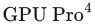, CRC Press, 第115–135页, 2013年. 本书引用页：第887、895、896、897、904页。

**[668]** Hargreaves, Shawn, 《延迟着色》（Deferred Shading） Game Developers Conference（游戏开发者大会）, 2004年3月. 本书引用页：第882、884、886页。

**[669]** Hargreaves, Shawn, and Mark Harris, 《延迟着色》（Deferred Shading） NVIDIA Developers Conference（NVIDIA开发者大会）, 2004年6月29日. 本书引用页：第882、884页。

**[670]** Harris, Mark J., and Anselmo Lastra, 《实时云渲染》（Real-Time Cloud Rendering） Computer Graphics Forum, 第20卷, 第3期, 第76–84页, 2001年. 本书引用页：第556、617页。

**[671]** Hart, Evan, Dave Gosselin, and John Isidoro, 《使用Direct3D和OpenGL进行顶点着色》（Vertex Shading with Direct3D and OpenGL） Game Developers Conference（游戏开发者大会）, 2001年3月. 本书引用页：第659页。

**[672]** Hart, Evan, 《游戏的UHD色彩》（UHD Color for Games） NVIDIA 白皮书, 2016年6月. 本书引用页：第161、165、278、281、283、287、290页。

**[673]** Hart, J. C., D. J. Sandin, and L. H. Kauffman, 《确定性三维分形的光线追踪》（Ray Tracing Deterministic 3-D Fractals） Computer Graphics (SIGGRAPH ’89 Proceedings) , 第23卷, 第3期, 第289–296页, 1989年. 本书引用页：第752页。

**[674]** Hart, John C., George K. Francis, and Louis H. Kauffman, 《四元数旋转可视化》（Visualizing Quaternion Rotation） ACM Transactions on Graphics, 第13卷, 第3期, 第256–276页, 1994年. 本书引用页：第102页。

**[675]** Hasenfratz, Jean-Marc, Marc Lapierre, Nicolas Holzschuch, and François Sillion, 《实时软阴影算法综述》（A Survey of Real-Time Soft Shadows Algorithms） Computer Graphics Forum, 第22卷, 第4期, 第753–774页, 2003年. 本书引用页：第265页。

**[676]** Hasselgren, J., T. Akenine-Möller, and L. Ohlsson, 《保守光栅化》（Conservative Rasterization），收录于 Matt Pharr，编， GPU Gems 2 , Addison-Wesley, 第677–690页, 2005年. 本书引用页：第1001页。

**[677]** Hasselgren, J., T. Akenine-Möller, and S. Laine, 《一族低成本采样方案》（A Family of Inexpensive Sampling Schemes） Computer Graphics Forum, 第24卷, 第4期, 第843–848页, 2005年. 本书引用页：第146页。

**[678]** Hasselgren, J., and T. Akenine-Möller, 《高效的多视图光栅化体系结构》（An Efficient Multi-View Rasterization Architecture），收录于 Proceedings of the 17th Eurographics Conference on Rendering Techniques , Eurographics Association, 第61–72页, 2006年6月. 本书引用页：第928页。

**[679]** Hasselgren, J., and T. Akenine-Möller, 《高效深度缓冲压缩》（Efficient Depth Buffer Compression），收录于 Graphics Hardware 2006, Eurographics Association, 第103–110页, 2006年9月. 本书引用页：第997、1009、1016页。

**[680]** Hasselgren, J., and T. Akenine-Möller, 《PCU：可编程剔除单元》（PCU: The Programmable Culling Unit）ACM Transactions on Graphics, 第26卷, 第3期, 第92.1–91.20页, 2007年. 本书引用页：第252页。

**[681]** Hasselgren, J., M. Andersson, J. Nilsson, and T. Akenine-Möller, 《压缩深度缓存》（A Compressed Depth Cache） Journal of Computer Graphics Techniques, 第1卷, 第1期, 第101–118页, 2012年. 本书引用页：第1009页。

**[682]** Hasselgren, Jon, Jacob Munkberg, and Karthik Vaidyanathan, 《用于散焦与运动模糊的实用分层重建》（Practical Layered Reconstruction for Defocus and Motion Blur） Journal of Computer Graphics Techniques , 第4卷, 第2期, 第45–58页, 2012年. 本书引用页：第542页。

**[683]** Hasselgren, J., M. Andersson, and T. Akenine-Möller, 《带掩码的软件遮挡剔除》（Masked Software Occlusion Culling） High-Performance Graphics, 2016年6月. 本书引用页：第849、850页。

**[684]** Hast, Anders, 《3D立体渲染：实现问题概览》（3D Stereoscopic Rendering: An Overview of Implementation Issues），收录于 Eric Lengyel，编， Game Engine Gems, Jones & Bartlett, 第123–138页, 2010年. 本书引用页：第927、932、934页。

**[685]** Hathaway, Benjamin, 《作为后处理的Alpha混合》（Alpha Blending as a Post-Process），收录于 Wolfgang Engel，编， GPU Pro, A K Peters, Ltd., 第167–184页, 2010年. 本书引用页：第208页。

**[686]** He, Xiao D., Kenneth E. Torrance, François X. Sillion, and Donald P. Greenberg, 《光反射的综合物理模型》（A Comprehensive Physical Model for Light Reflection） Computer Graphics (SIGGRAPH ’91 Proceedings), 第25卷, 第4期, 第175–186页, 1991年7月. 本书引用页：第361、424页。

**[687]** He, Y., Y. Gu, and K. Fatahalian, 《以自适应、多速率着色扩展图形管线》（Extending the Graphics Pipeline with Adaptive, Multi-rate Shading） ACM Transactions on Graphics, 第33卷, 第4期, 第142:1–142:12页, 2014年. 本书引用页：第1013页。

**[688]** He, Y., T. Foley, N. Tatarchuk, and K. Fatahalian, 《快速、自动的着色器细节层次系统》（A System for Rapid, Automatic Shader Level-of-Detail） ACM Transactions on Graphics, 第34卷, 第6期, 第187:1–187:12页, 2015年. 本书引用页：第853页。

**[689]** Hearn, Donald, and M. Pauline Baker, 《使用OpenGL的计算机图形学》（Computer Graphics with OpenGL） , 第4版, Prentice-Hall, Inc., 2010年. 本书引用页：第102页。

**[690]** Heckbert, Paul, 《纹理映射综述》（Survey of Texture Mapping） IEEE Computer Graphics and Applications, 第6卷, 第11期, 第56–67页, 1986年11月. 本书引用页：第222页。

**[691]** Heckbert, Paul S., 《纹理映射与图像扭曲基础》（Fundamentals of Texture Mapping and Image Warping） 技术报告 516, 加利福尼亚大学伯克利分校计算机科学部（Computer Science Division, University of California, Berkeley）, 1989年6月. 本书引用页：第187、189、222、688页。

**[692]** Heckbert, Paul S., 《像素的坐标是什么？》（What Are the Coordinates of a Pixel?），收录于 Andrew S. Glassner，编， Graphics Gems, Academic Press, 第246–248页, 1990年. 本书引用页：第176页。

**[693]** Heckbert, Paul S., 《用于双向光线追踪的自适应辐射度纹理》（Adaptive Radiosity Textures for Bidirectional Ray Tracing） Computer Graphics (SIGGRAPH ’90 Proceedings) , 第24卷, 第4期, 第145–154页, 1990年8月. 本书引用页：第439页。

**[694]** Heckbert, Paul S., and Henry P. Moreton, 《多边形纹理映射与着色中的插值》（Interpolation for Polygon Texture Mapping and Shading） 计算机图形学最新进展：可视化与建模（State of the Art in Computer Graphics: Visualization and Modeling） , Springer-Verlag, 第101–111页, 1991年. 本书引用页：第22、999页。

**[695]** Heckbert, Paul S.，编， 《图形学宝石IV》（Graphics Gems IV） , Academic Press, 1994年. 本书引用页：第102、991页。

**[696]** Heckbert, Paul S., 《极简光线追踪器》（A Minimal Ray Tracer），收录于 Paul S. Heckbert，编， Graphics Gems IV , Academic Press, 第375–381页, 1994年. 本书引用页：第444页。

**[697]** Heckbert, Paul S., and Michael Herf, 《使用图形硬件模拟软阴影》（Simulating Soft Shadows with Graphics Hardware） 技术报告 CMU-CS-97-104, 卡内基梅隆大学（Carnegie Mellon University）, 1997年1月. 本书引用页：第228页。

**[698]** Hecker, Chris, 《更多编译器结果以及应对方法》（More Compiler Results, and What To Do About It） Game Developer, 第14–21页, 1996年8/9月. 本书引用页：第793页。

**[699]** Hector, Tobias, 《Vulkan：移动平台上的高效率》（Vulkan: High Efficiency on Mobile） Imagination 博客, 2015年11月5日. 本书引用页：第40、794、814页。

**[700]** Hegeman, Kyle, Nathan A. Carr, and Gavin S. P. Miller, 《GPU上基于粒子的流体模拟》（Particle-Based Fluid Simulation on the GPU），收录于 计算科学——ICCS 2006（Computational Science—ICCS 2006）, Springer, 第228–235页, 2006年. 本书引用页：第571页。

**[701]** Heidmann, Tim, 《真实阴影，实时生成》（Real Shadows, Real Time） Iris Universe , 第18期, 第23–31页, 1991年11月. 本书引用页：第230、231页。

**[702]** Heidrich, Wolfgang, and Hans-Peter Seidel, 《与视图无关的环境贴图》（View-Independent Environment Maps），收录于 Proceedings of the ACM SIGGRAPH/EUROGRAPHICS Workshop on Graphics Hardware , ACM, 第39–45页, 1998年8月. 本书引用页：第413页。

**[703]** Heidrich, Wolfgang, Rüdifer Westermann, Hans-Peter Seidel, and Thomas Ertl, 《像素纹理在可视化和真实感图像合成中的应用》（Applications of Pixel Textures in Visualization and Realistic Image Synthesis），收录于 Proceedings of the 1999 Symposium on Interactive 3D Graphics, ACM, 第127–134页, 1999年4月. 本书引用页：第538页。

**[704]** Heidrich, Wolfgang, and Hans-Peter Seidel, 《硬件加速的真实感着色与光照》（Realistic, Hardware-Accelerated Shading and Lighting），收录于 SIGGRAPH ’99: Proceedings of the 26th Annual Conference on Computer Graphics and Interactive Techniques , ACM Press/Addison-Wesley Publishing Co., 第171–178页, 1999年8月. 本书引用页：第413、417、426页。

**[705]** Heidrich, Wolfgang, Katja Daubert, Jan Kautz, and Hans-Peter Seidel, 《基于预计算可见性的微几何光照》（Illuminating Micro Geometry Based on Precomputed Visibility），收录于 SIGGRAPH ’00: Proceedings of the 27th Annual Conference on Computer Graphics and Interactive Techniques, ACM Press/Addison-Wesley Publishing Co., 第455–464页, 2000年7月. 本书引用页：第466页。

**[706]** Heitz, Eric, and Fabrice Neyret, 《在稀疏体素八叉树中表示外观并预过滤亚像素数据》（Representing Appearance and Pre-filtering Subpixel Data in Sparse Voxel Octrees），收录于 Proceedings of the Fourth ACM SIGGRAPH / Eurographics Conference on High-Performance Graphics , Eurographics Association, 第125–134页, 2012年6月. 本书引用页：第579、585、586页。

**[707]** Heitz, Eric, Christophe Bourlier, and Nicolas Pinel, 《发射器与接收器方位方向之间的相关性对随机粗糙表面照明函数的影响》（Correlation Effect between Transmitter and Receiver Azimuthal Directions on the Illumination Function from a Random Rough Surface） Waves in Random and Complex Media, 第23卷, 第3期, 第318–335页, 2013年. 本书引用页：第336页。

**[708]** Heitz, Eric, 《理解基于微表面的BRDF中的遮蔽与阴影函数》（Understanding the Masking-Shadowing Function in Microfacet-Based BRDFs） Journal of Computer Graphics Techniques , 第3卷, 第4期, 第48–107页, 2014年. 本书引用页：第332、333、334、335、336、337、339、344页。

**[709]** Heitz, Eric, and Jonathan Dupuy, 《通过随机求值实现简单的各向异性粗糙漫反射材质》（Implementing a Simple Anisotropic Rough Diffuse Material with Stochastic Evaluation） 技术报告, 2015年. 本书引用页：第331页。

**[710]** Heitz, Eric, Jonathan Dupuy, Cyril Crassin, and Carsten Dachsbacher, 《SGGX微薄片分布》（The SGGX Microflake Distribution） ACM Transactions on Graphics (SIGGRAPH 2015), 第34卷, 第4期, 第48:1–48:11页, 2015年8月. 本书引用页：第648、649页。

**[711]** Heitz, Eric, Jonathan Dupuy, Stephen Hill, and David Neubelt, 《使用线性变换余弦实现实时多边形光源着色》（Real-Time Polygonal-Light Shading with Linearly Transformed Cosines） ACM Transactions on Graphics (SIGGRAPH 2016), 第35卷, 第4期, 第41:1–41:8页, 2016年7月. 本书引用页：第390页。

**[712]** Heitz, Eric, Johannes Hanika, Eugene d’Eon, and Carsten Dachsbacher, 《采用Smith模型的多重散射微表面BSDF》（Multiple-Scattering Microfacet BSDFs with the Smith Model） ACM Transactions on Graphics (SIGGRAPH 2016), 第35卷, 第4期, 第58:1–58:8页, 2016年7月. 本书引用页：第346页。

**[713]** Held, Martin, 《ERIT：高效可靠求交测试集》（ERIT—A Collection of Efficient and Reliable Intersection Tests） journal of graphics tools, 第2卷, 第4期, 第25–44页, 1997年. 本书引用页：第959、974页。

**[714]** Held, Martin, 《FIST：快速工业级多边形三角剖分》（FIST: Fast Industrial-Strength Triangulation of Polygons） Algorithmica, 第30卷, 第4期, 第563–596页, 2001年. 本书引用页：第685页。

**[715]** Hennessy, John L., and David A. Patterson, 《计算机体系结构：量化研究方法》（Computer Architecture: A Quantitative Approach）, 第5版, Morgan Kaufmann, 2011年. 本书引用页：第12、30、783、789、867、1007、1040页。

**[716]** Hennessy, Padraic, 《实现笔记：基于物理的镜头光晕》（Implementation Notes: Physically Based Lens Flares） Placeholder Art 博客, 2015年1月19日. 本书引用页：第526页。

**[717]** Hennessy, Padraic, 《《Skylanders: SuperChargers》中的混合分辨率渲染》（Mixed Resolution Rendering in Skylanders: SuperChargers ） Game Developers Conference（游戏开发者大会）, 2016年3月. 本书引用页：第520页。

**[718]** Hensley, Justin, and Thorsten Scheuermann, 《使用区域求和表实现动态光泽环境反射》（Dynamic Glossy Environment Reflections Using Summed-Area Tables），收录于 Wolfgang Engel，编， , Charles River Media, 第187–200页, 2005年. 本书引用页：第188、419页。

**[719]** Hensley, Justin, Thorsten Scheuermann, Greg Coombe, Montek Singh, and Anselmo Lastra, 《快速生成区域求和表及其应用》（Fast Summed-Area Table Generation and Its Applications） Computer Graphics Forum, 第24卷, 第3期, 第547–555页, 2005年. 本书引用页：第188、419页。

**[720]** Hensley, Justin, 《闪亮而模糊的物体》（Shiny, Blurry Things） SIGGRAPH超越可编程着色（SIGGRAPH Beyond Programmable Shading） 课程, 2009年8月. 本书引用页：第419页。

**[721]** Henyey, L. G., and J. L. Greenstein, 《银河系中的漫射辐射》（Diffuse Radiation in the Galaxy），收录于 Astrophysical Journal, 第93卷, 第70–83页, 1941年. 本书引用页：第598页。

**[722]** Herf, M., and P. S. Heckbert, 《快速软阴影》（Fast Soft Shadows），收录于 ACM SIGGRAPH ’96 Visual Proceedings, ACM, 第145页, 1996年8月. 本书引用页：第228页。

**[723]** Hermosilla, Pedro, and Pere-Pau Vázquez, 《使用几何着色器实现非真实感渲染效果》（NPR Effects Using the Geometry Shader），收录于 Wolfgang Engel，编， GPU Pro, A K Peters, Ltd., 第149–165页, 2010年. 本书引用页：第668页。

**[724]** Herrell, Russ, Joe Baldwin, and Chris Wilcox, 《高质量多边形描边》（High-Quality Polygon Edging） IEEE Computer Graphics and Applications, 第15卷, 第4期, 第68–74页, 1995年7月. 本书引用页：第673页。

**[725]** Hertzmann, Aaron, 《3D非真实感渲染入门：剪影与轮廓》（Introduction to 3D Non-Photorealistic Rendering: Silhouettes and Outlines） SIGGRAPH非真实感渲染（SIGGRAPH Non-Photorealistic Rendering） 课程, 1999年8月. 本书引用页：第663、667页。

**[726]** Hertzmann, Aaron, and Denis Zorin, 《光滑曲面的插图绘制》（Illustrating Smooth Surfaces），收录于 SIGGRAPH ’00: Proceedings of the 27th Annual Conference on Computer Graphics and Interactive Techniques , ACM Press/Addison-Wesley Publishing Co., 第517–526页, 2000年7月. 本书引用页：第667、672页。

**[727]** Hertzmann, Aaron, 《基于笔划的渲染综述》（A Survey of Stroke-Based Rendering） IEEE Computer Graphics and Applications, 第23卷, 第4期, 第70–81页, 2003年7/8月. 本书引用页：第678页。

**[728]** Hertzmann, Aaron, 《非真实感渲染与艺术科学》（Non-Photorealistic Rendering and the Science of Art），收录于 Proceedings of the 8th International Symposium on Non-Photorealistic Animation and Rendering , ACM, 第147–157页, 2010年. 本书引用页：第678页。

**[729]** Hery, Christophe, 《论阴影缓冲区》（On Shadow Buffers） RenderMan/RAT小技巧（Stupid RenderMan/RAT Tricks）, SIGGRAPH 2002 RenderMan用户组会议, 2002年7月. 本书引用页：第638页。

**[730]** Hery, Christophe, 《实现一个或多个皮肤BSSRDF》（Implementing a Skin BSSRDF (or Several)） SIGGRAPH RenderMan理论与实践（SIGGRAPH RenderMan, Theory and Practice） 课程, 2003年7月. 本书引用页：第638页。

**[731]** Hery, Christophe, Michael Kass, and Junyi Ling, 《将几何融入着色》（Geometry into Shading） 技术备忘录, Pixar Animation Studios, 2014年. 本书引用页：第370页。

**[732]** Hery, Christophe, and Junyi Ling, 《Pixar的材质基础：PxrSurface与PxrMarschnerHair》（Pixar’s Foundation for Materials: PxrSurface and PxrMarschnerHair） SIGGRAPH基于物理的着色：理论与实践（SIGGRAPH Physically Based Shading in Theory and Practice） 课程 , 2017年8月. 本书引用页：第321、343、359、363、364、370页。

**[733]** Herzog, Robert, Elmar Eisemann, Karol Myszkowski, and H.-P. Seidel, 《GPU上的时空上采样》（Spatio-Temporal Upsampling on the GPU），收录于 Proceedings of the 2010 ACM SIGGRAPH Symposium on Interactive 3D Graphics and Games, ACM, 第91–98页, 2010年. 本书引用页：第520页。

**[734]** Hicks, Odell, 《热成像模拟》（A Simulation of Thermal Imaging），收录于 Wolfgang Engel，编， , Charles River Media, 第169–170页, 2004年. 本书引用页：第521页。

**[735]** Hill, F. S., Jr., 《“垂直点积”的乐趣》（The Pleasures of ‘Perp Dot’ Products），收录于 Paul S. Heckbert，编， Graphics Gems IV, Academic Press, 第138–148页, 1994年. 本书引用页：第6、987页。

**[736]** Hill, Steve, 《简单而快速的内存分配器》（A Simple Fast Memory Allocator），收录于 David Kirk，编， Graphics Gems III , Academic Press, 第49–50页, 1992年. 本书引用页：第793页。

**[737]** Hill, Stephen, 《《断罪》中的渲染》（Rendering with Conviction） Game Developers Conference（游戏开发者大会）, 2010年3月. 本书引用页：第452、457页。

**[738]** Hill, Stephen, and Daniel Collin, 《游戏中实用的动态可见性》（Practical, Dynamic Visibility for Games），收录于 Wolfgang Engel，编， , A K Peters/CRC Press, 第329–348页, 2011年. 本书引用页：第848页。

**[739]** Hill, Stephen, 《狂野西部的镜面反射对决》（Specular Showdown in the Wild West） Self-Shadow 博客, 2011年7月22日. 本书引用页：第370页。

**[740]** Hill, Stephen, and Dan Baker, 《坚如磐石的着色：不牺牲细节的图像稳定性》（Rock-Solid Shading: Image Stability Without Sacrificing Detail） SIGGRAPH游戏实时渲染进展（SIGGRAPH Advances in Real-Time Rendering in Games） 课程 , 2012年8月. 本书引用页：第371页。

**[741]** Hillaire, Sébastien, 《通过减少驱动程序调用提高性能》（Improving Performance by Reducing Calls to the Driver），收录于 Patrick Cozzi & Christophe Riccio，编， OpenGL Insights, CRC Press, 第353–363页, 2012年. 本书引用页：第795、796、797页。

**[742]** Hillaire, Sébastien, 《Frostbite中基于物理的统一体积渲染》（Physically-Based and Unified Volumetric Rendering in Frostbite） SIGGRAPH实时渲染进展（SIGGRAPH Advances in Real-Time Rendering） 课程 , 2015年8月. 本书引用页：第570、610、611、612、613页。

**[743]** Hillaire, Sébastien, 《Frostbite中基于物理的天空、大气与云渲染》（Physically Based Sky, Atmosphere and Cloud Rendering in Frostbite） SIGGRAPH基于物理的着色：理论与实践（SIGGRAPH Physically Based Shading in Theory and Practice） 课程 , 2016年7月. 本书引用页：第589、596、599、602、610、614、615、616、617、620、621、622、623、649页。

**[744]** Hillaire, Sébastien, 《体积斯坦福兔》（Volumetric Stanford Bunny）Shadertoy, 2017年3月25日. 本书引用页：第594页。

**[745]** Hillaire, Sébastien, 《用于Frostbite交互式全局光照工作流程的实时光线追踪》（Real-Time Raytracing for Interactive Global Illumination Workflows in Frostbite） Game Developers Conference（游戏开发者大会）, 2018年3月. 本书引用页：第1044页。

**[746]** Hillesland, Karl, 《实时Ptex与向量位移》（Real-Time Ptex and Vector Displacement），收录于 Wolfgang Engel，编， , CRC Press, 第69–80页, 2013年. 本书引用页：第191页。

**[747]** Hillesland, K. E., and J. C. Yang, 《纹素着色》（Texel Shading），收录于 Eurographics 2016短论文集（Eurographics 2016—Short Papers） , Eurographics Association, 第73–76页, 2016年5月. 本书引用页：第911页。

**[748]** Hillesland, Karl, 《纹素着色》（Texel Shading） GPUOpen 网站, 2016年7月21日. 本书引用页：第911页。

**[749]** Hinsinger, D., F. Neyret, and M.-P. Cani, 《海浪的交互式动画》（Interactive Animation of Ocean Waves），收录于 Proceedings of the 2002 ACM SIGGRAPH/Eurographics Symposium on Computer Animation , ACM, 第161–166页, 2002年. 本书引用页：第878页。

**[750]** Hirche, Johannes, Alexander Ehlert, Stefan Guthe, and Michael Doggett, 《硬件加速的逐像素位移映射》（Hardware Accelerated Per-Pixel Displacement Mapping），收录于 Graphics Interface 2004, Canadian Human-Computer Communications Society, 第153–158页, 2004年. 本书引用页：第220页。

**[751]** Hoberock, Jared, and Yuntao Jia, 《高质量环境光遮蔽》（High-Quality Ambient Occlusion），收录于 Hubert Nguyen，编， GPU Gems 3 , Addison-Wesley, 第257–274页, 2007年. 本书引用页：第454页。

**[752]** Hoetzlein, Rama, 《GVDB：在GPU上对稀疏体素数据库结构进行光线追踪》（GVDB: Raytracing Sparse Voxel Database Structures on the GPU） High Performance Graphics, 2016年6月. 本书引用页：第578、582、586页。

**[753]** Hoetzlein, Rama, 《NVIDIA® GVDB体素：编程指南》（NVIDIA ®GVDB Voxels: Programming Guide） NVIDIA 网站, 2017年5月. 本书引用页：第578、580、582页。

**[754]** Hoffman, Donald D., 《视觉智能》（Visual Intelligence）, W. W. Norton & Company, 2000年. 本书引用页：第150页。

**[755]** Hoffman, Naty, and Kenny Mitchell, 《实时照片级真实感地形光照》（Photorealistic Terrain Lighting in Real Time） Game Developer, 第8卷, 第7期, 第32–41页, 2001年7月. 更详细的版本见《实时照片级真实感地形光照》（“Real-Time Photorealistic Terrain Lighting”）， Game Developers Conference（游戏开发者大会）, 2001年3月. 亦收录于文献[1786]。 本书引用页：第451页。

**[756]** Hoffman, Naty, 《电子游戏的色彩增强》（Color Enhancement for Videogames） SIGGRAPH电影与游戏制作中的色彩增强与渲染（SIGGRAPH Color Enhancement and Rendering in Film and Game Production） 课程, 2010年7月. 本书引用页：第289、290页。

**[757]** Hoffman, Naty, 《走出回音室：向其他学科、行业与艺术形式学习》（Outside the Echo Chamber: Learning from Other Disciplines, Industries, and Art Forms） 开幕主题演讲， Symposium on Interactive 3D Graphics and Games , 2013年3月. 本书引用页：第284、289页。

**[758]** Hoffman, Naty, 《背景：着色的物理学与数学》（Background: Physics and Math of Shading） SIGGRAPH基于物理的着色：理论与实践（SIGGRAPH Physically Based Shading in Theory and Practice） 课程 , 2013年7月. 本书引用页：第315页。

**[759]** Holbert, Daniel, 《法线偏移阴影》（Normal Offset Shadows） Dissident Logic 博客, 2010年8月27日. 本书引用页：第238页。

**[760]** Holbert, Daniel, 《向阴影痤疮说“再见”》（Saying ‘Goodbye’ to Shadow Acne） Game Developers Conference（游戏开发者大会）海报 , 2011年3月. 本书引用页：第238页。

**[761]** Hollemeersch, C.-F., B. Pieters, P. Lambert, and R. Van de Walle, 《使用CUDA加速虚拟纹理》（Accelerating Virtual Texturing Using CUDA），收录于 Wolfgang Engel，编， GPU Pro, A K Peters, Ltd., 第623–642页, 2010年. 本书引用页：第868页。

**[762]** Holzschuch, Nicolas, and Romain Pacanowski, 《识别实测反射率中的衍射效应》（Identifying Diffraction Effects in Measured Reflectances） Eurographics Workshop on Material Appearance Modeling , 2015年6月. 本书引用页：第361页。

**[763]** Holzschuch, Nicolas, and Romain Pacanowski, 《结合反射与衍射的双尺度微表面反射模型》（A Two-Scale Microfacet Reflectance Model Combining Reflection and Diffraction） ACM Transactions on Graphics (SIGGRAPH 2017) , 第36卷, 第4期, 第66:1–66:12页, 2017年7月. 本书引用页：第331、343、361页。

**[764]** Hoobler, Nathan, 《高性能后处理》（High Performance Post-Processing） Game Developers Conference（游戏开发者大会）, 2011年3月. 本书引用页：第54、536页。

**[765]** Hoobler, Nathan, 《快速、灵活、基于物理的体积光散射》（Fast, Flexible, Physically-Based Volumetric Light Scattering） Game Developers Conference（游戏开发者大会）, 2016年3月. 本书引用页：第608页。

**[766]** Hooker, JT, 《Treyarch的体积全局光照》（Volumetric Global Illumination at Treyarch） SIGGRAPH游戏实时渲染进展（SIGGRAPH Advances in Real-Time Rendering in Games） 课程, 2016年7月. 本书引用页：第395、478、488、489页。

**[767]** Hoppe, H., T. DeRose, T. Duchamp, M. Halstead, H. Jin, J. McDonald, J. Schweitzer, and W. Stuetzle, 《分片光滑曲面重建》（Piecewise Smooth Surface Reconstruction），收录于 SIGGRAPH ’94: Proceedings of the 21st Annual Conference on Computer Graphics and Interactive Techniques , ACM, 第295–302页, 1994年7月. 本书引用页：第758、760、763页。

**[768]** Hoppe, Hugues, 《渐进网格》（Progressive Meshes），收录于 SIGGRAPH ’96: Proceedings of the 23rd Annual Conference on Computer Graphics and Interactive Techniques, ACM, 第99–108页, 1996年8月. 本书引用页：第706、707、710、859页。

**[769]** Hoppe, Hugues, 《渐进网格的视图相关细化》（View-Dependent Refinement of Progressive Meshes），收录于 SIGGRAPH ’97: Proceedings of the 24th Annual Conference on Computer Graphics and Interactive Techniques, ACM Press/Addison-Wesley Publishing Co., 第189–198页, 1997年8月. 本书引用页：第772页。

**[770]** Hoppe, Hugues, 《渐进网格的高效实现》（Efficient Implementation of Progressive Meshes） Computers and Graphics, 第22卷, 第1期, 第27–36页, 1998年. 本书引用页：第707、710页。

**[771]** Hoppe, Hugues, 《为透明顶点缓存优化网格局部性》（Optimization of Mesh Locality for Transparent Vertex Caching），收录于 SIGGRAPH ’99: Proceedings of the 26th Annual Conference on Computer Graphics and Interactive Techniques, ACM Press/Addison-Wesley Publishing Co., 第269–276页, 1999年8月. 本书引用页：第700页。

**[772]** Hoppe, Hugues, 《用于简化带外观属性网格的新二次度量》（New Quadric Metric for Simplifying Meshes with Appearance Attributes），收录于 Proceedings of Visualization ’99, IEEE Computer Society, 第59–66页, 1999年10月. 本书引用页：第709页。

**[773]** Hormann, K., and M. Floater, 《任意平面多边形的均值坐标》（Mean Value Coordinates for Arbitrary Planar Polygons） ACM Transactions on Graphics, 第25卷, 第4期, 第1424–1441页, 2006年10月. 本书引用页：第970页。

**[774]** Hormann, Kai, Bruno Lévy, and Alla Sheffer, 《SIGGRAPH网格参数化：理论与实践》（SIGGRAPH Mesh Parameterization: Theory and Practice） 课程, 2007年8月. 本书引用页：第173页。

**[775]** Hornus, Samuel, Jared Hoberock, Sylvain Lefebvre, and John Hart, 《ZP+：正确的Z-Pass模板阴影》（ZP+ : Correct Z-Pass Stencil Shadows），收录于 Proceedings of the 2005 Symposium on Interactive 3D Graphics and Games, ACM, 第195–202页, 2005年4月. 本书引用页：第232页。

**[776]** Horvath, Helmuth, 《Gustav Mie与粒子对光的散射和吸收：历史发展与基础》（Gustav Mie and the Scattering and Absorption of Light by Particles: Historic Developments and Basics）Journal of Quantitative Spectroscopy and Radiative Transfer, 第110卷, 第11期, 第787–799页, 2009年. 本书引用页：第597页。

**[777]** Hoschek, Josef, and Dieter Lasser, 《计算机辅助几何设计基础》（Fundamentals of Computer Aided Geometric Design） , A K Peters, Ltd., 1993年. 本书引用页：第718、721、725、732、734、738、742、749、754、781页。

**[778]** Hosek, Lukas, and Alexander Wilkie, 《全天空穹顶光谱辐亮度的解析模型》（An Analytic Model for Full Spectral Sky-Dome Radiance） ACM Transaction on Graphics, 第31卷, 第4期, 第1–9页, 2012年7月. 本书引用页：第614页。

**[779]** Hu, Jinhui, Suya You, and Ulrich Neumann, 《大规模城市建模方法》（Approaches to Large-Scale Urban Modeling） IEEE Computer Graphics and Applications, 第23卷, 第6期, 第62–69页, 2003年11/12月. 本书引用页：第573页。

**[780]** Hu, L., P. Sander, and H. Hoppe, 《并行的视图相关细节层次控制》（Parallel View-Dependent Level-of-Detail Control） IEEE Transactions on Visualization and Computer Graphics, 第16卷, 第5期, 第718–728页, 2010年. 本书引用页：第475、859页。

**[781]** Hu, Liwen, Chongyang Ma, Linjie Luo, and Hao Li, 《使用发型数据库进行单视图头发建模》（Single-View Hair Modeling Using a Hairstyle Database） ACM Transaction on Graphics, 第34卷, 第4期, 第1–9页, 2015年7月. 本书引用页：第645页。

**[782]** Hubbard, Philip M., 《使用球体近似多面体以实现时间关键型碰撞检测》（Approximating Polyhedra with Spheres for Time-Critical Collision Detection） ACM Transactions on Graphics, 第15卷, 第3期, 第179–210页, 1996年. 本书引用页：第976页。

**[783]** Hughes, James, Reza Nourai, and Ed Hutchins, 《理解、测量与分析VR图形性能》（Understanding, Measuring, and Analyzing VR Graphics Performance），收录于 Wolfgang Engel，编，GPU Zen, Black Cat Publishing, 第253–274页, 2017年. 本书引用页：第785、815、937、938、940页。

**[784]** Hughes, John F., and Tomas Möller, 《从单位向量构建标准正交基》（Building an Orthonormal Basis from a Unit Vector） journal of graphics tools, 第4卷, 第4期, 第33–35页, 1999年. 亦收录于文献[112]。 本书引用页：第75、552页。

**[785]** Hughes, John F., Andries van Dam, Morgan McGuire, David F. Sklar, James D. Foley, Steven K. Feiner, and Kurt Akeley, 《计算机图形学：原理与实践》（Computer Graphics: Principles and Practice）, 第3版, Addison-Wesley, 2013年. 本书引用页：第102、278页。

**[786]** Hullin, Matthias, Elmar Eisemann, Hans-Peter Seidel, and Sungkil Lee, 《基于物理的实时镜头光晕渲染》（Physically-Based Real-Time Lens Flare Rendering） ACM Transactions on Graphics (SIGGRAPH 2011), 第30卷, 第4期, 第108:1–108:10页, 2011年7月. 本书引用页：第524、526页。

**[787]** Humphreys, Greg, Mike Houston, Ren Ng, Randall Frank, Sean Ahern, Peter D. Kirchner, and James t. Klosowski, 《Chromium：用于集群交互式渲染的流处理框架》（Chromium: A Stream-Processing Framework for Interactive Rendering on Clusters） ACM Transactions on Graphics, 第21卷, 第3期, 第693–702页, 2002年7月. 本书引用页：第1020页。

**[788]** Hunt, R. W. G., 《颜色再现》（The Reproduction of Colour）, 第6版, John Wiley & Sons, Inc., 2004年. 本书引用页：第291页。

**[789]** Hunt, R. W. G., and M. R. Pointer, 《颜色测量》（Measuring Colour）, 第4版, John Wiley & Sons, Inc., 2011年. 本书引用页：第276、291页。

**[790]** Hunt, Warren, 《用于虚拟现实的实时光线投射》（Real-Time Ray-Casting for Virtual Reality） Hot 3D专场, High-Performance Graphics, 2017年7月. 本书引用页：第939页。

**[791]** Hunter, Biver, and Paul Fuqua, 《光的科学与魔法：摄影布光入门》（Light Science and Magic: An Introduction to Photographic Lighting）, 第4版, Focal Press, 2011年. 本书引用页：第435页。

**[792]** Hurlburt, Stephanie, 《改进游戏中的纹理压缩》（Improving Texture Compression in Games） Game Developers Conference（游戏开发者大会）的AMD Capsaicin & Cream开发者专场, 2017年2月. 本书引用页：第870页。

**[793]** Hwu, Wen-Mei, and David Kirk, 《大规模并行处理器编程》（Programming Massively Parallel Processors） 伊利诺伊大学电气与计算机工程系（Department of Electrical and Computer Engineering, University of Illinois），ECE 498 AL1课程笔记，2007年秋季. 本书引用页：第1040页。

**[794]** Igehy, Homan, Matthew Eldridge, and Kekoa Proudfoot, 《纹理缓存体系结构中的预取》（Prefetching in a Texture Cache Architecture），收录于 Proceedings of the ACM SIGGRAPH/EUROGRAPHICS Workshop on Graphics Hardware, ACM, 第133–142页, 1998年8月. 本书引用页：第1017页。

**[795]** Igehy, Homan, Matthew Eldridge, and Pat Hanrahan, 《并行纹理缓存》（Parallel Texture Caching），收录于 Proceedings of the ACM SIGGRAPH/EUROGRAPHICS Workshop on Graphics Hardware , ACM, 第95–106页, 1999年8月. 本书引用页：第1017页。

**[796]** Iglesias-Guitian, Jose A., Bochang Moon, Charalampos Koniaris, Eric Smolikowski, and Kenny Mitchell, 《用于实时时域滤波的像素历史线性模型》（Pixel History Linear Models for Real-Time Temporal Filtering） Computer Graphics Forum (Pacific Graphics 2016) , 第35卷, 第7期, 第363–372页, 2016年. 本书引用页：第143页。

**[797]** Ikits, Milan, Joe Kniss, Aaron Lefohn, and Charles Hansen, 《体积渲染技术》（Volume Rendering Techniques），收录于 Randima Fernando，编， GPU Gems, Addison-Wesley, 第667–692页, 2004年. 本书引用页：第605、607页。

**[798]** Iourcha, Konstantine, and Jason C. Yang, 《方向自适应边缘抗锯齿滤波器》（A Directionally Adaptive Edge Anti-Aliasing Filter），收录于 Proceedings of the Conference on High-Performance Graphics 2009, ACM, 第127–133页, 2009年8月. 本书引用页：第147页。

**[799]** Isenberg, Tobias, Bert Freudenberg, Nick Halper, Stefan Schlechtweg, and Thomas Strothotte, 《多边形模型剪影算法开发者指南》（A Developer’s Guide to Silhouette Algorithms for Polygonal Models） IEEE Computer Graphics and Applications, 第23卷, 第4期, 第28–37页, 2003年7/8月. 本书引用页：第678页。

**[800]** Isenberg, M., and P. Alliez, 《使用平行四边形预测压缩多边形网格几何》（Compressing Polygon Mesh Geometry with Parallelogram Prediction），收录于 Proceedings of the Conference on Visualization ’02 , IEEE Computer Society, 第141–146页, 2002年. 本书引用页：第92页。

## 参考文献 801—1000

**[801]** Isensee, Pete, 《C++优化策略与技术》（C++ Optimization Strategies and Techniques），Pete Isensee 网站, 2007. 本书引用页：815。

**[802]** Isidoro, John, Alex Vlachos，以及 Chris Brennan, 《海水渲染》（Rendering Ocean Water），载于 Wolfgang Engel（编）， Direct3D ShaderX：顶点与像素着色器技巧及技术（Direct3D ShaderX: Vertex & Pixel Shader Tips and Techniques） , Wordware, 第347–356页, 2002年5月. 本书引用页：43。

**[803]** Isidoro, John, 《下一代皮肤渲染》（Next Generation Skin Rendering），游戏技术大会（Game Tech Conference）, 2004. 本书引用页：635。

**[804]** Isidoro, John, 《阴影映射：基于GPU的技巧与技术》（Shadow Mapping: GPU-Based Tips and Techniques），游戏开发者大会（Game Developers Conference）, 2006年3月. 本书引用页：250。

**[805]** Iwanicki, Michał, 《结合低频预计算可见性的法线映射》（Normal Mapping with Low-Frequency Precomputed Visibility），载于 SIGGRAPH 2009报告（SIGGRAPH 2009 Talks）, ACM, 文章编号 52, 2009年8月. 本书引用页：466, 471。

**[806]** Iwanicki, Michał, 《〈最后生还者〉的光照技术》（Lighting Technology of The Last of Us），载于 ACM SIGGRAPH 2013报告（ACM SIGGRAPH 2013 Talks）, ACM, 文章编号 20, 2013年7月. 本书引用页：229, 289, 467, 476, 486, 498。

**[807]** Iwanicki, Michał，以及 Angelo Pesce, 《基于物理的渲染的近似模型》（Approximate Models for Physically Based Rendering），SIGGRAPH基于物理的着色：理论与实践（SIGGRAPH Physically Based Shading in Theory and Practice），课程 , 2015年8月. 本书引用页：386, 387, 422, 424, 502。

**[808]** Iwanicki, Michał，以及 Peter-Pike Sloan, 《环境骰子》（Ambient Dice），Eurographics渲染研讨会：实验性构想与实现（Eurographics Symposium on Rendering—Experimental Ideas & Implementations）, 2017年6月. 本书引用页：395, 478, 488。

**[809]** Iwanicki, Michał，以及 Peter-Pike Sloan, 《〈使命召唤：无限战争〉中的预计算光照》（Precomputed Lighting in Call of Duty: Infinite Warfare），SIGGRAPH游戏实时渲染进展（SIGGRAPH Advances in Real-Time Rendering in Games），课程, 2017年8月. 本书引用页：402, 471, 476, 490, 491。

**[810]** Jakob, Wenzel, Miloš Hašan, Ling-Qi Yan, Jason Lawrence, Ravi Ramamoorthi，以及 Steve Marschner, 《离散随机微表面模型》（Discrete Stochastic Microfacet Models），ACM图形学汇刊（ACM Transactions on Graphics） (SIGGRAPH 2014), 第33卷, 第4期, 第115:1–115:9页, 2014年7月. 本书引用页：372。

**[811]** Jakob, Wenzel, Eugene d’Eon, Otto Jakob，以及 Steve Marschner, 《用于渲染分层材质的综合框架》（A Comprehensive Framework for Rendering Layered Materials），ACM图形学汇刊（ACM Transactions on Graphics） (SIGGRAPH 2014), 第33卷, 第4期, 第118:1–118:14页, 2014年7月. 本书引用页：346, 364。

**[812]** Jakob, Wenzel, 《layerlab：分层材质计算工具箱》（layerlab: A Computational Toolbox for Layered Materials），SIGGRAPH基于物理的着色：理论与实践（SIGGRAPH Physically Based Shading in Theory and Practice），课程 , 2015年8月. 本书引用页：364。

**[813]** James, Doug L.，以及 Christopher D. Twigg, 《网格动画蒙皮》（Skinning Mesh Animations），ACM图形学汇刊（ACM Transactions on Graphics）, 第23卷, 第3期, 第399–407页, 2004年8月. 本书引用页：85。

**[814]** James, Greg, 《硬件加速程序化纹理动画的操作》（Operations for Hardware Accelerated Procedural Texture Animation），载于 Mark DeLoura（编）， 游戏编程宝石2（Game Programming Gems 2） , Charles River Media, 第497–509页, 2001. 本书引用页：521。

**[815]** James, Greg，以及 John O’Rorke, 《实时辉光》（Real-Time Glow），载于 Randima Fernando（编）， GPU Gems, Addison-Wesley, 第343–362页, 2004. 本书引用页：517, 518, 527。

**[816]** Jansen, Jon，以及 Louis Bavoil, 《使用DirectX 11曲面细分与混合分辨率快速渲染不透明度映射粒子》（Fast Rendering of Opacity-Mapped Particles Using DirectX 11 Tessellation and Mixed Resolutions），NVIDIA 白皮书, 2011年2月. 本书引用页：520, 569, 570, 571, 609, 612。

**[817]** Jarosz, Wojciech, 《快速图像卷积》（Fast Image Convolutions），伊利诺伊大学厄巴纳—香槟分校SIGGRAPH研讨班（SIGGRAPH Workshop at University of Illinois at Urbana-Champaign）, 2001. 本书引用页：518。

**[818]** Jarosz, Wojciech, 《散射介质中光传输的高效蒙特卡洛方法》（Efficient Monte Carlo Methods for Light Transport in Scattering Media） , 博士学位论文, 加利福尼亚大学圣迭戈分校（University of California, San Diego）, 2008年9月. 本书引用页：589。

**[819]** Jarosz, Wojciech, Nathan A. Carr，以及 Henrik Wann Jensen, 《球谐函数的重要性采样》（Importance Sampling Spherical Harmonics），计算机图形学论坛（Computer Graphics Forum）, 第28卷, 第2期, 第577–586页, 2009. 本书引用页：419。

**[820]** Jendersie, Johannes, David Kuri，以及 Thorsten Grosch, 《用于实时全局光照的预计算照度合成》（Precomputed Illuminance Composition for Real-Time Global Illumination），载于 第20届ACM SIGGRAPH交互式三维图形与游戏研讨会论文集（Proceedings of the 20th ACM SIGGRAPH Symposium on Interactive 3D Graphics and Games）, ACM, 第129–137页, 2016. 本书引用页：483。

**[821]** Jensen, Henrik Wann, Justin Legakis，以及 Julie Dorsey, 《湿润材质的渲染》（Rendering of Wet Materials），载于 渲染技术’99（Rendering Techniques ’99）, Springer, 第273–282页, 1999年6月. 本书引用页：349。

**[822]** Jensen, Henrik Wann, 《使用光子映射进行真实感图像合成》（Realistic Image Synthesis Using Photon Mapping）, A K Peters, Ltd., 2001. 本书引用页：630。

**[823]** Jensen, Henrik Wann, Stephen R. Marschner, Marc Levoy，以及 Pat Hanrahan, 《次表面光传输的实用模型》（A Practical Model for Subsurface Light Transport），载于 SIGGRAPH ’01：第28届计算机图形学与交互技术年会论文集（SIGGRAPH ’01 Proceedings of the 28th Annual Conference on Computer Graphics and Interactive Techniques）, ACM, 第511–518页, 2001年8月. 本书引用页：634, 638。

**[824]** Jeschke, Stefan, Stephan Mantler，以及 Michael Wimmer, 《交互式平滑曲面壳映射》（Interactive Smooth and Curved Shell Mapping），载于 渲染技术（Rendering Techniques）, Eurographics Association, 第351–360页, 2007年6月. 本书引用页：220。

**[825]** Jiang, Yibing, 《〈神秘海域4〉中基于体积的材质的创建流程》（The Process of Creating Volumetric-Based Materials in Uncharted 4），SIGGRAPH游戏实时渲染进展（SIGGRAPH Advances in Real-Time Rendering in Games），课程 , 2016年7月. 本书引用页：356, 357, 358, 359。

**[826]** Jiménez, J. J., F. R. Feito，以及 R. J. Segura, 《无需预处理的稳健且优化的点在多边形内包含性测试算法》（Robust and Optimized Algorithms for the Point-in-Polygon Inclusion Test without Pre-processing），计算机图形学论坛（Computer Graphics Forum）, 第28卷, 第8期, 第2264–2274页, 2009. 本书引用页：970。

**[827]** Jiménez, J. J., David Whelan, Veronica Sundstedt，以及 Diego Gutierrez, 《实时真实感皮肤半透明性》（Real-Time Realistic Skin Translucency），计算机图形学与应用（Computer Graphics and Applications） , 第30卷, 第4期, 第32–41页, 2010. 本书引用页：637。

**[828]** Jimenez, Jorge, Belen Masia, Jose I. Echevarria, Fernando Navarro，以及 Diego Gutierrez, 《实用形态学抗锯齿》（Practical Morphological Antialiasing），载于 Wolfgang Engel（编）， , A K Peters/CRC Press, 第95–113页, 2011. 本书引用页：148。

**[829]** Jimenez, Jorge, Diego Gutierrez, 等, 《实时抗锯齿的滤波方法》（SIGGRAPH实时抗锯齿的滤波方法（SIGGRAPH Filtering Approaches for Real-Time Anti-Aliasing），课程）, 2011年8月. 本书引用页：147, 165。

**[830]** Jimenez, Jorge, Jose I. Echevarria, Tiago Sousa，以及 Diego Gutierrez, 《SMAA：增强型亚像素形态学抗锯齿》（SMAA: Enhanced Subpixel Morphological Antialiasing），计算机图形学论坛（Computer Graphics Forum）, 第31卷, 第2期, 第355–364页, 2012. 本书引用页：146, 148。

**[831]** Jimenez, Jorge, 《下一代角色渲染》（Next Generation Character Rendering），游戏开发者大会（Game Developers Conference）, 2013年3月. 本书引用页：636, 637。

**[832]** Jimenez, Jorge, 《〈使命召唤：高级战争〉中的下一代后处理》（Next Generation Post Processing in Call of Duty Advanced Warfare），SIGGRAPH游戏实时渲染进展（SIGGRAPH Advances in Real-Time Rendering in Games），课程 , 2014年8月. 本书引用页：251, 527, 534, 535, 537, 540, 542, 543。

**[833]** Jimenez, Jorge, Karoly Zsolnai, Adrian Jarabo, Christian Freude, Thomas Auzinger, Xian-Chun Wu, Javier von der Pahlen, Michael Wimmer，以及 Diego Gutierrez, 《可分离次表面散射》（Separable Subsurface Scattering），计算机图形学论坛（Computer Graphics Forum）, 第34卷, 第6期, 第188–197页, 2015. 本书引用页：637。

**[834]** Jimenez, Jorge, 《电影级SMAA：清晰的形态学与时间抗锯齿》（Filmic SMAA: Sharp Morphological and Temporal Antialiasing），SIGGRAPH游戏实时渲染进展（SIGGRAPH Advances in Real-Time Rendering in Games），课程 , 2016年7月. 本书引用页：148。

**[835]** Jimenez, Jorge, Xianchun Wu, Angelo Pesce，以及 Adrian Jarabo, 《精确间接遮蔽的实用实时策略》（Practical Real-Time Strategies for Accurate Indirect Occlusion），SIGGRAPH基于物理的着色：理论与实践（SIGGRAPH Physically Based Shading in Theory and Practice），课程, 2016年7月. 本书引用页：451, 461, 462, 468, 472。

**[836]** Jimenez, Jorge, 《〈使命召唤：无限战争〉中的动态时间抗锯齿》（Dynamic Temporal Antialiasing in Call of Duty: Infinite Warfare），SIGGRAPH游戏实时渲染进展（SIGGRAPH Advances in Real-Time Rendering in Games），课程 , 2017年8月. 本书引用页：142, 143, 145, 146, 148, 166, 805。

**[837]** Jin, Shuangshuang, Robert R. Lewis，以及 David West, 《顶点法线计算算法比较》（A Comparison of Algorithms for Vertex Normal Computation），视觉计算机（The Visual Computer）, 第21卷, 第71–82页, 2005. 本书引用页：695。

**[838]** Johansson, Mikael, 《建筑信息模型（BIM）的高效立体渲染》（Efficient Stereoscopic Rendering of Building Information Models (BIM)），计算机图形技术期刊（Journal of Computer Graphics Techniques） , 第5卷, 第3期, 第1–17页, 2016. 本书引用页：927。

**[839]** Johnson, G. S., J. Lee, C. A. Burns，以及 W. R. Mark, 《不规则Z缓冲：不规则数据结构的硬件加速》（The Irregular Z-Buffer: Hardware Acceleration for Irregular Data Structures），ACM图形学汇刊（ACM Transactions on Graphics） , 第24卷, 第4期, 第1462–1482页, 2005年10月. 本书引用页：260。

**[840]** Johnsson, Björn, Per Ganestam, Michael Doggett，以及 Tomas Akenine-Möller, 《图形处理器上运行的软件算法的能效》（Power Efficiency for Software Algorithms Running on Graphics Processors），载于 第四届ACM SIGGRAPH／Eurographics高性能图形学会议论文集（Proceedings of the Fourth ACM SIGGRAPH / Eurographics Conference on High-Performance Graphics） , Eurographics Association, 第67–75页, 2012年6月. 本书引用页：790。

**[841]** Jones, James L., 《使用OpenGL ES 3.0实现高效变形目标动画》（Efficient Morph Target Animation Using OpenGL ES 3.0），载于 Wolfgang Engel（编）， , CRC Press, 第289–295页, 2014. 本书引用页：90。

**[842]** Jönsson, Daniel, Erik Sundén, Anders Ynnerman，以及 Timo Ropinski, 《交互式体渲染的体积光照技术综述》（A Survey of Volumetric Illumination Techniques for Interactive Volume Rendering），计算机图形学论坛（Computer Graphics Forum）, 第33卷, 第1期, 第27–51页, 2014. 本书引用页：605。

**[843]** Joy, Kenneth I., 《在线几何建模笔记》（On-Line Geometric Modeling Notes）, http://graphics.idav.ucdavis.edu/education/CAGDNotes/homepage.html, 1996. 本书引用页：756。

**[844]** Junkins, S., 《Intel处理器图形Gen9的计算架构》（The Compute Architecture of Intel Processor Graphics Gen9），Intel 白皮书 v1.0, 2015年8月. 本书引用页：1006, 1007。

**[845]** Kajiya, James T., 《各向异性反射模型》（Anisotropic Reflection Models），Computer Graphics (SIGGRAPH ’85 Proceedings), 第19卷, 第3期, 第15–21页, 1985年7月. 本书引用页：853。

**[846]** Kajiya, James T., 《渲染方程》（The Rendering Equation），Computer Graphics (SIGGRAPH ’86 Proceedings), 第20卷, 第4期, 第143–150页, 1986年8月. 本书引用页：315, 437, 444。

**[847]** Kajiya, James T.，以及 Timothy L. Kay, 《使用三维纹理渲染毛皮》（Rendering Fur with Three Dimensional Textures），Computer Graphics (SIGGRAPH ’89 Proceedings) , 第17卷, 第3期, 第271–280页, 1989年7月. 本书引用页：359, 642。

**[848]** Kalnins, Robert D., Philip L. Davidson, Lee Markosian，以及 Adam Finkelstein, 《连贯的风格化轮廓》（Coherent Stylized Silhouettes），ACM图形学汇刊（ACM Transactions on Graphics） (SIGGRAPH 2003) , 第22卷, 第3期, 第856–861页, 2003. 本书引用页：667。

**[849]** Kämpe, Viktor, 《快速且节省内存的体素化阴影构建》（Fast, Memory-Efficient Construction of Voxelized Shadows）, 博士学位论文, 查尔姆斯理工大学（Chalmers University of Technology）, 2016. 本书引用页：586。

**[850]** Kämpe, Viktor, Erik Sintorn, Ola Olsson，以及 Ulf Assarsson, 《快速且节省内存的体素化阴影构建》（Fast, Memory-Efficient Construction of Voxelized Shadows），IEEE可视化与计算机图形学汇刊（IEEE Transactions on Visualization and Computer Graphics）, 第22卷, 第10期, 第2239–2248页, 2016年10月. 本书引用页：264, 586。

**[851]** Kaneko, Tomomichi, Toshiyuki Takahei, Masahiko Inami, Naoki Kawakami, Yasuyuki Yanagida, Taro Maeda，以及 Susumu Tachi, 《利用视差映射进行精细形状表示》（Detailed Shape Re报告 with Parallax Mapping） 2001年人工现实与远程临场国际会议（International Conference on Artificial Reality and Telexistence 2001） , 2001年12月. 本书引用页：215。

**[852]** Kang, H., H. Jang, C.-S. Cho，以及 J. Han, 《采用GPU曲面细分的多分辨率地形渲染》（Multi-Resolution Terrain Rendering with GPU Tessellation），视觉计算机（The Visual Computer） , 第31卷, 第4期, 第455–469页, 2015. 本书引用页：567, 876。

**[853]** Kaplan, Matthew, Bruce Gooch，以及 Elaine Cohen, 《交互式艺术渲染》（Interactive Artistic Rendering），载于 第一届非真实感动画与渲染国际研讨会论文集（Proceedings of the 1st International Symposium on Non-photorealistic Animation and Rendering）, ACM, 第67–74页, 2000年6月. 本书引用页：670, 672。

**[854]** Kaplanyan, Anton, 《CryEngine 3中的光传播体》（Light Propagation Volumes in CryEngine 3），SIGGRAPH游戏实时渲染进展（SIGGRAPH Advances in Real-Time Rendering in Games），课程, 2009年8月. 本书引用页：493。

**[855]** Kaplanyan, Anton，以及 Carsten Dachsbacher, 《用于实时间接光照的级联光传播体》（Cascaded Light Propagation Volumes for Real-Time Indirect Illumination），载于 2010年ACM SIGGRAPH交互式三维图形与游戏研讨会论文集（Proceedings of the 2010 ACM SIGGRAPH Symposium on Interactive 3D Graphics and Games）, ACM, 第99–107页, 2010年2月. 本书引用页：494, 496。

**[856]** Kaplanyan, Anton, 《CryENGINE 3：达到光速》（CryENGINE 3: Reaching the Speed of Light），SIGGRAPH游戏实时渲染进展（SIGGRAPH Advances in Real-Time Rendering in Games），课程 , 2010年7月. 本书引用页：196, 289, 290, 848, 849, 887, 892。

**[857]** Kaplanyan, Anton, Stephen Hill, Anjul Patney，以及 Aaron Lefohn, 《对法线分布进行滤波以实现着色抗锯齿》（Filtering Distributions of Normals for Shading Antialiasing），载于 高性能图形学会议论文集（Proceedings of High-Performance Graphics） , Eurographics Association, 第151–162页, 2016年6月. 本书引用页：371。

**[858]** Kapoulkine, Arseny, 《最优网格渲染并不最优》（Optimal Grid Rendering Is Not Optimal），Bits, pixels, cycles and more 博客, 2017年7月31日. 本书引用页：700, 701。

**[859]** Karabassi, Evaggelia-Aggeliki, Georgios Papaioannou，以及 Theoharis Theoharis, 《一种基于深度缓冲的快速体素化算法》（A Fast Depth-Buffer-Based Voxelization Algorithm），图形工具期刊（journal of graphics tools）, 第4卷, 第4期, 第5–10页, 1999. 本书引用页：580。

**[860]** Karis, Brian, 《分块光源剔除》（Tiled Light Culling），Graphic Rants 博客, 2012年4月9日. 本书引用页：113, 882。

**[861]** Karis, Brian, 《Unreal Engine 4中的真实着色》（Real Shading in Unreal Engine 4），SIGGRAPH基于物理的着色：理论与实践（SIGGRAPH Physically Based Shading in Theory and Practice），课程, 2013年7月. 本书引用页：111, 113, 116, 325, 336, 340, 342, 352, 355, 383, 385, 388, 421, 423。

**[862]** Karis, Brian, 《高质量时间超采样》（High Quality Temporal Supersampling），SIGGRAPH游戏实时渲染进展（SIGGRAPH Advances in Real-Time Rendering in Games），课程, 2014年8月. 本书引用页：142, 143, 144, 620。

**[863]** Karis, Brian, 《Unreal中基于物理的毛发着色》（Physically Based Hair Shading in Unreal），SIGGRAPH基于物理的着色：理论与实践（SIGGRAPH Physically Based Shading in Theory and Practice），课程 , 2016年7月. 本书引用页：641, 644, 646。

**[864]** Kass, Michael, Aaron Lefohn，以及 John Owens, 《利用GPU上的模拟扩散实现交互式景深》（Interactive Depth of Field Using Simulated Diffusion on a GPU），技术备忘录, Pixar Animation Studios, 2006. 本书引用页：535。

**[865]** Kasyan, Nikolas, 《玩转实时阴影》（Playing with Real-Time Shadows），SIGGRAPH高效实时阴影（SIGGRAPH Efficient Real-Time Shadows），课程, 2013年7月. 本书引用页：54, 234, 245, 251, 264, 585。

**[866]** Kautz, Jan, Wolfgang Heidrich，以及 Katja Daubert, 《用于OpenGL渲染的凹凸贴图阴影》（Bump Map Shadows for OpenGL Rendering），技术报告 MPI-I-2000–4-001, Max-Planck-Institut für Informatik, 德国萨尔布吕肯（Saarbrücken, Germany）, 2000年2月.本书引用页：466。

**[867]** Kautz, Jan，以及 M. D. McCool, 《使用预滤波环境贴图近似光泽反射》（Approximation of Glossy Reflection with Prefiltered Environment Maps），载于 Graphics Interface 2000, Canadian Human-Computer Communications Society, 第119–126页, 2000年5月. 本书引用页：423。

**[868]** Kautz, Jan, P.-P. Vázquez, W. Heidrich，以及 H.-P. Seidel, 《预滤波环境贴图的统一方法》（A Unified Approach to Prefiltered Environment Maps），载于 渲染技术2000（Rendering Techniques 2000）, Springer, 第185–196页, 2000年6月. 本书引用页：420。

**[869]** Kautz, Jan, Peter-Pike Sloan，以及 John Snyder, 《利用球谐函数实现低频光照下的快速任意BRDF着色》（Fast, Arbitrary BRDF Shading for Low-Frequency Lighting Using Spherical Harmonics），载于 第13届Eurographics渲染研讨会论文集（Proceedings of the 13th Eurographics Workshop on Rendering）, Eurographics Association, 第291–296页, 2002年6月. 本书引用页：401, 431。

**[870]** Kautz, Jan, Jaakko Lehtinen，以及 Peter-Pike Sloan, 《预计算辐射传输：理论与实践》（SIGGRAPH预计算辐射传输：理论与实践（SIGGRAPH Precomputed Radiance Transfer: Theory and Practice），课程） , 2005年8月. 本书引用页：481。

**[871]** Kautz, Jan, 《球谐光照表示》（SH Light Re报告s），SIGGRAPH预计算辐射传输：理论与实践（SIGGRAPH Precomputed Radiance Transfer: Theory and Practice），课程, 2005年8月. 本书引用页：430。

**[872]** Kavan, Ladislav, Steven Collins, Jiří Žára，以及 Carol O’Sullivan, 《使用双四元数进行蒙皮》（Skinning with Dual Quaternions），载于 2007年交互式三维图形与游戏研讨会论文集（Proceedings of the 2007 Symposium on Interactive 3D Graphics and Games） , ACM, 第39–46页, 2007年4—5月. 本书引用页：87。

**[873]** Kavan, Ladislav, Steven Collins, Jiří Žára，以及 Carol O’Sullivan, 《采用近似双四元数混合的几何蒙皮》（Geometric Skinning with Approximate Dual Quaternion Blending），ACM图形学汇刊（ACM Transactions on Graphics） , 第27卷, 第4期, 第105:1–105:23页, 2008. 本书引用页：87。

**[874]** Kavan, Ladislav, Simon Dobbyn, Steven Collins, Jiří Žára，以及 Carol O’Sullivan, 《Polypostors：用于三维人群的二维多边形替身》（Polypostors: 2D Polygonal Impostors for 3D Crowds），载于 2008年交互式三维图形与游戏研讨会论文集（Proceedings of the 2008 Symposium on Interactive 3D Graphics and Games）, ACM, 第149–156页, 2008. 本书引用页：562。

**[875]** Kavan, Ladislav, Adam W. Bargteil，以及 Peter-Pike Sloan, 《最小二乘顶点烘焙》（Least Squares Vertex Baking），计算机图形学论坛（Computer Graphics Forum）, 第30卷, 第4期, 第1319–1326页, 2011. 本书引用页：452。

**[876]** Kay, L., 《SceneJS：基于WebGL的场景图引擎》（SceneJS: A WebGL-Based Scene Graph Engine），载于 Patrick Cozzi & Christophe Riccio（编）， OpenGL Insights, CRC Press, 第571–582页, 2012. 本书引用页：829。

**[877]** Kay, T. L.，以及 J. T. Kajiya, 《复杂场景的光线追踪》（Ray Tracing Complex Scenes），Computer Graphics (SIGGRAPH ’86 Proceedings), 第20卷, 第4期, 第269–278页, 1986年8月. 本书引用页：959, 961。

**[878]** Kelemen, Csaba，以及 Lázló Szirmay-Kalos, 《具有重要性采样的基于微表面的镜面与哑光耦合BRDF模型》（A Microfacet Based Coupled Specular-Matte BRDF Model with Importance Sampling），载于 Eurographics 2001短篇报告（Eurographics 2001—Short Presentations）, Eurographics Association, 第25–34页, 2001年9月. 本书引用页：346, 352, 419。

**[879]** Keller, Alexander, 《即时辐射度》（Instant Radiosity），载于 SIGGRAPH ’97：第24届计算机图形学与交互技术年会论文集（SIGGRAPH ’97: Proceedings of the 24th Annual Conference on Computer Graphics and Interactive Techniques） , ACM Press/Addison-Wesley Publishing Co., 第49–56页, 1997年8月. 本书引用页：491。

**[880]** Keller, Alexander，以及 Wolfgang Heidrich, 《交错采样》（Interleaved Sampling），载于 渲染技术2001（Rendering Techniques 2001）, Springer, 第266–273页, 2001年6月. 本书引用页：145。

**[881]** Kemen, B., 《对数深度缓冲的优化与修复》（Logarithmic Depth Buffer Optimizations & Fixes），Outerra 博客, 2013年7月18日. 本书引用页：101。

**[882]** Kensler, Andrew，以及 Peter Shirley, 《通过自动搜索优化射线与三角形求交》（Optimizing Ray-Triangle Intersection via Automated Search），载于 2006年IEEE交互式光线追踪研讨会（2006 IEEE Symposium on Interactive Ray Tracing） , IEEE Computer Society, 第33–38页, 2006. 本书引用页：962。

**[883]** Kent, James R., Wayne E. Carlson，以及 Richard E. Parent, 《多面体对象的形状变换》（Shape Transformation for Polyhedral Objects），Computer Graphics (SIGGRAPH ’92 Proceedings), 第26卷, 第2期, 第47–54页, 1992. 本书引用页：87。

**[884]** Kershaw, Kathleen, 《通用纹理映射流水线》（A Generalized Texture-Mapping Pipeline）, 硕士学位论文, 纽约州伊萨卡康奈尔大学计算机图形学项目（Program of Computer Graphics, Cornell University, Ithaca, New York）, 1992. 本书引用页：169, 170。

**[885]** Kessenich, John, Graham Sellers，以及 Dave Shreiner, 《OpenGL编程指南：学习OpenGL 4.5及SPIR-V的官方指南》（OpenGL Programming Guide: The Official Guide to Learning OpenGL, Version 4.5 with SPIR-V） , 第9版, Addison-Wesley, 2016. 本书引用页：27, 39, 41, 55, 96, 173, 174。

**[886]** Kettlewell, Richard, 《Codemasters的《GRID2》及后续作品中的渲染》（Rendering in Codemasters’ GRID2 and beyond），游戏开发者大会（Game Developers Conference）, 2014年3月. 本书引用页：258。

**[887]** Kharlamov, Alexander, Iain Cantlay，以及 Yury Stepanenko, 《下一代SpeedTree渲染》（Next-Generation SpeedTree Rendering），载于 Hubert Nguyen（编）， GPU Gems 3, Addison-Wesley, 第69–92页, 2007. 本书引用页：207, 560, 564, 646, 856。

**[888]** Kihl, Robert, 《Frostbite 2中使用体积距离场进行破坏遮罩》（Destruction Masking in Frostbite 2 Using Volume Distance Fields），SIGGRAPH游戏实时渲染进展（SIGGRAPH Advances in Real-Time Rendering in Games），课程 , 2010年7月. 本书引用页：889, 890。

**[889]** Kilgard, Mark J., 《实现OpenGL：同一架构的两种实现》（Realizing OpenGL: Two Implementations of One Architecture），载于 ACM SIGGRAPH／EUROGRAPHICS图形硬件研讨会论文集（Proceedings of the ACM SIGGRAPH/EUROGRAPHICS Workshop on Graphics Hardware） , ACM, 第45–55页, 1997年8月. 本书引用页：1007。

**[890]** Kilgard, Mark J., 《使用模板缓冲创建反射与阴影》（Creating Reflections and Shadows Using Stencil Buffers），游戏开发者大会（Game Developers Conference）, 1999年3月. 本书引用页：805。

**[891]** Kilgard, Mark J., 《适用于当今GPU的实用且稳健的凹凸映射技术》（A Practical and Robust Bump-Mapping Technique for Today’s GPUs），游戏开发者大会（Game Developers Conference）, 2000年3月. 本书引用页：212, 214。

**[892]** Kim, Pope，以及 Daniel Barrero, 《〈星际战士〉的渲染技术》（Rendering Tech of Space Marine），韩国游戏大会（Korea Game Conference）, 2011年11月. 本书引用页：892, 900, 905。

**[893]** Kim, Pope, 《〈战锤40000：星际战士〉中的屏幕空间贴花》（Screen Space Decals in Warhammer 40,000: Space Marine），载于 ACM SIGGRAPH 2012报告（ACM SIGGRAPH 2012 Talks）, 文章编号 6, 2012年8月. 本书引用页：889。

**[894]** Kim, Tae-Yong，以及 Ulrich Neumann, 《不透明度阴影贴图》（Opacity Shadow Maps），载于 渲染技术2001（Rendering Techniques 2001）, Springer, 第177–182页, 2001. 本书引用页：257, 570, 571, 612。

**[895]** King, Gary，以及 William Newhall, 《高效全向阴影贴图》（Efficient Omnidirectional Shadow Maps），载于 Wolfgang Engel（编）， , Charles River Media, 第435–448页, 2004. 本书引用页：234。

**[896]** King, Gary, 《阴影映射算法》（Shadow Mapping Algorithms），GPU Jackpot 报告, 2004年10月. 本书引用页：235, 240。

**[897]** King, Gary, 《动态辐照度环境贴图的实时计算》（Real-Time Computation of Dynamic Irradiance Environment Maps），载于 Matt Pharr（编）， GPU Gems 2 , Addison-Wesley, 第167–176页, 2005. 本书引用页：426, 428, 430。

**[898]** King, Yossarian, 《别让他们看见突变：几何细节层次选择中的问题》（Never Let ’Em See You Pop—Issues in Geometric Level of Detail Selection），载于 Mark DeLoura（编）， 游戏编程宝石（Game Programming Gems）, Charles River Media, 第432–438页, 2000. 本书引用页：861, 864。

**[899]** King, Yossarian, 《二维镜头光晕》（2D Lens Flare），载于 Mark DeLoura（编）， 游戏编程宝石（Game Programming Gems）, Charles River Media, 第515–518页, 2000. 本书引用页：524。

**[900]** Kircher, Scott, 《〈黑道圣徒3〉的光照与简化》（Lighting & Simplifying Saints Row: The Third），游戏开发者大会（Game Developers Conference）, 2012年3月. 本书引用页：889, 892。

**[901]** Kirk, David B.，以及 Douglas Voorhies, 《DN-10000VS的渲染架构》（The Rendering Architecture of the DN-10000VS），Computer Graphics (SIGGRAPH ’90 Proceedings) , 第24卷, 第4期, 第299–307页, 1990年8月. 本书引用页：185。

**[902]** Kirk, David（编）， 《图形学宝石III》（Graphics Gems III） , Academic Press, 1992. 本书引用页：102, 991。

**[903]** Kirk, David B.，以及 Wen-mei W. Hwu, 《大规模并行处理器编程：实践方法》（Programming Massively Parallel Processors: A Hands-on Approach）, 第3版, Morgan Kaufmann, 2016. 本书引用页：55, 1040。

**[904]** Klehm, Oliver, Tobias Ritschel, Elmar Eisemann，以及 Hans-Peter Seidel, 《屏幕空间中的弯曲法线与圆锥》（Bent Normals and Cones in Screen Space），载于 视觉、建模与可视化（Vision, Modeling，以及 Visualization）, Eurographics Association, 第177–182页, 2011. 本书引用页：467, 471。

**[905]** Klein, Allison W., Wilmot Li, Michael M. Kazhdan, Wagner T. Corrêa, Adam Finkelstein，以及 Thomas A. Funkhouser, 《非真实感虚拟环境》（Non-Photorealistic Virtual Environments），载于 SIGGRAPH ’00：第27届计算机图形学与交互技术年会论文集（SIGGRAPH ’00: Proceedings of the 27th Annual Conference on Computer Graphics and Interactive Techniques）, ACM Press/Addison-Wesley Publishing Co., 第527–534页, 2000年7月. 本书引用页：670, 671。

**[906]** Klein, R., G. Liebich，以及 W. Strasser, 《带误差控制的网格简化》（Mesh Reduction with Error Control），载于 第七届可视化会议（Visualization ’96）论文集（Proceedings of the 7th Conference on Visualization ’96）, IEEE Computer Society, 第311–318页, 1996. 本书引用页：875。

**[907]** Kleinhuis, Christian, 《使用DirectX实现变形目标动画》（Morph Target Animation Using DirectX），载于 Wolfgang Engel（编）， , Charles River Media, 第39–45页, 2005. 本书引用页：89。

**[908]** Klint, Josh, 《Leadwerks游戏引擎4中的植被管理》（Vegetation Management in Leadwerks Game Engine 4），载于 Eric Lengyel（编）， 游戏引擎宝石3（Game Engine Gems 3）, CRC Press, 第53–71页, 2016. 本书引用页：560。

**[909]** Kloetzli, J., 《D3D11软件曲面细分》（D3D11 Software Tessellation），游戏开发者大会（Game Developers Conference）, 2013年3月. 本书引用页：879。

**[910]** Klosowski, J. T., M. Held, J. S. B. Mitchell, H. Sowizral，以及 K. Zikan, 《利用k-DOP包围体层次结构实现高效碰撞检测》（Efficient Collision Detection Using Bounding Volume Hierarchies of k-DOPs），IEEE可视化与计算机图形学汇刊（IEEE Transactions on Visualization and Computer Graphics） , 第4卷, 第1期, 第21–36页, 1998. 本书引用页：979。IEEE可视化与计算机图形学汇刊（IEEE Transactions on Visualization and Computer Graphics）, 第6卷, 第2期, 第108–123页, 2000年4月／6月.

**[911]** Knight, Balor, Matthew Ritchie，以及 George Parrish, 《用于高效延迟着色的屏幕空间分类》（Screen-Space Classification for Efficient Deferred Shading），Eric Lengyel（编）， 游戏引擎宝石2（Game Engine Gems 2）, A K Peters, Ltd., 第55–73页, 2011. 本书引用页：898。

**[912]** Kniss, Joe, G. Kindlmann，以及 C. Hansen, 《交互式体渲染的多维传递函数》（Multi-Dimensional Transfer Functions for Interactive Volume Rendering），IEEE可视化与计算机图形学汇刊（IEEE Transactions on Visualization and Computer Graphics）, 第8卷, 第3期, 第270–285页, 2002. 本书引用页：606。

**[913]** Kniss, Joe, S. Premoze, C.Hansen, P. Shirley，以及 A. McPherson, 《体积光照与建模模型》（A Model for Volume Lighting and Modeling），IEEE可视化与计算机图形学汇刊（IEEE Transactions on Visualization and Computer Graphics）, 第9卷, 第2期, 第150–162页, 2003. 本书引用页：607。

**[914]** Knowles, Pyarelal, Geoff Leach，以及 Fabio Zambetta, 《高效分层片元缓冲技术》（Efficient Layered Fragment Buffer Techniques），载于 Patrick Cozzi & Christophe Riccio（编）， OpenGL Insights, CRC Press, 第279–292页, 2012. 本书引用页：155。

**[915]** Kobbelt, Leif, 《根号3细分》（ -Subdivision），载于 SIGGRAPH ’00：第27届计算机图形学与交互技术年会论文集（SIGGRAPH ’00: Proceedings of the 27th Annual Conference on Computer Graphics and Interactive Techniques）, ACM Press/Addison-Wesley Publishing Co., 第103–112页, 2000年7月. 本书引用页：756, 761。

**[916]** Kobbelt, Leif，以及 Mario Botsch, 《计算机图形学中基于点的技术综述》（A Survey of Point-Based Techniques in Computer Graphics），计算机与图形学（Computers & Graphics） , 第28卷, 第6期, 第801–814页, 2004年12月. 本书引用页：578。

**[917]** Kochanek, Doris H. U.，以及 Richard H. Bartels, 《具有局部张力、连续性与偏置控制的插值样条》（Interpolating Splines with Local Tension, Continuity，以及 Bias Control），Computer Graphics (SIGGRAPH ’84 Proceedings) , 第18卷, 第3期, 第33–41页, 1984年7月. 本书引用页：730, 731。

**[918]** Koenderink, Jan J., Andrea J. van Doorn，以及 Marigo Stavridi, 《用表面散射模式表示的双向反射分布函数》（Bidirectional Reflection Distribution Function Expressed in Terms of Surface Scattering Modes）ECCV 2001论文集（Proceedings of ECCV 2001）, 第2卷, 第28–39页, 1996. 本书引用页：404。

**[919]** Koenderink, Jan J.，以及 Sylvia Pont, 《天鹅绒般皮肤的秘密》（The Secret of Velvety Skin），机器视觉与应用期刊（Journal of Machine Vision and Applications）, 第14卷, 第4期, 第260–268页, 2002. 本书引用页：356。

**[920]** Köhler, Johan, 《实用的顺序无关透明》（Practical Order Independent Transparency），技术报告 ATVI-TR-16-02, Activision Research, 2016. 本书引用页：569。

**[921]** Kojima, Hideo, Hideki Sasaki, Masayuki Suzuki，以及 Junji Tago, 《透过FOX之眼看照片级真实感：《合金装备：原爆点〉的核心》（Photorealism Through the Eyes of a FOX: The Core of Metal Gear Solid Ground Zeroes），游戏开发者大会（Game Developers Conference）, 2013年3月. 本书引用页：289。

**[922]** Kolchin, Konstantin, 《基于曲率的半透明材质着色：以人体皮肤等为例》（Curvature-Based Shading of Translucent Materials, such as Human Skin），载于 第五届澳大利亚与东南亚计算机图形学及交互技术国际会议论文集（Proceedings of the 5th International Conference on Computer Graphics and Interactive Techniques in Australia and Southeast Asia） , ACM, 第239–242页, 2007年12月. 本书引用页：634。

**[923]** Koltun, Vladlen, Yiorgos Chrysanthou，以及 Daniel Cohen-Or, 《利用对偶射线空间实现硬件加速的区域可见性计算》（Hardware-Accelerated From-Region Visibility Using a Dual Ray Space），载于 渲染技术2001（Rendering Techniques 2001）, Springer, 第204–214页, 2001年6月. 本书引用页：843。

**[924]** Kontkanen, Janne，以及 Samuli Laine, 《环境光遮蔽场》（Ambient Occlusion Fields），载于 Wolfgang Engel（编）， , Charles River Media, 第101–108页, 2005. 本书引用页：452。

**[925]** Kontkanen, Janne，以及 Samuli Laine, 《环境光遮蔽场》（Ambient Occlusion Fields），载于 2005年交互式三维图形与游戏研讨会论文集（Proceedings of the 2005 Symposium on Interactive 3D Graphics and Games） , ACM, 第41–48页, 2005年4月. 本书引用页：452。

**[926]** Kontkanen, Janne，以及 Samuli Laine, 《预计算体积光照的采样》（Sampling Precomputed Volumetric Lighting），图形工具期刊（journal of graphics tools）, 第11卷, 第3期, 第1–16页, 2006. 本书引用页：489, 491。

**[927]** Koonce, Rusty, 《〈Tabula Rasa〉中的延迟着色》（Deferred Shading in Tabula Rasa），载于 Hubert Nguyen（编）， GPU Gems 3 , Addison-Wesley, 第429–457页, 2007. 本书引用页：239, 886, 887。

**[928]** Kopta, D., T. Ize, J. Spjut, E. Brunvand, A. Davis，以及 A. Kensler, 《动画场景中快速有效的BVH更新》（Fast, Effective BVH Updates for Animated Scenes），载于 ACM SIGGRAPH交互式三维图形与游戏研讨会论文集（Proceedings of the ACM SIGGRAPH Symposium on Interactive 3D Graphics and Games）, ACM, 第197–204页, 2012. 本书引用页：821。

**[929]** Kopta, D., K. Shkurko, J. Spjut, E. Brunvand，以及 A. Davis, 《节能且节省带宽的光线追踪架构》（An Energy and Bandwidth Efficient Ray Tracing Architecture），第五届高性能图形学会议论文集（Proceedings of the 5th High-Performance Graphics Conference）, ACM, 第121–128页, 2013年7月. 本书引用页：1039。

**[930]** Kotfis, Dave，以及 Patrick Cozzi, 《利用深度相机进行八叉树映射》（Octree Mapping from a Depth Camera），载于 Wolfgang Engel（编）， , CRC Press, 第257–273页, 2016. 本书引用页：573, 580, 919。

**[931]** Kovacs, D., J. Mitchell, S. Drone，以及 D. Zorin, 《具有位移的实时带折痕近似细分曲面》（Real-Time Creased Approximate Subdivision Surfaces with Displacements），IEEE可视化与计算机图形学汇刊（IEEE Transactions on Visualization and Computer Graphics） , 第16卷, 第5期, 第742–751页, 2010. 本书引用页：777。

**[932]** Kovalèík, Vít，以及 Jiří Sochor, 《采用统计优化遮挡查询的遮挡剔除》（Occlusion Culling with Statistically Optimized Occlusion Queries），中欧计算机图形学、可视化与计算机视觉国际会议（WSCG）（International Conference in Central Europe on Computer Graphics, Visualization and Computer Vision (WSCG)）, 2005年1—2月. 本书引用页：845。

**[933]** Krajcevski, P., Adam Lake，以及 D. Manocha, 《FasTC：加速的固定码率纹理编码》（FasTC: Accelerated Fixed-Rate Texture Encoding），载于 ACM SIGGRAPH交互式三维图形与游戏研讨会论文集（Proceedings of the ACM SIGGRAPH Symposium on Interactive 3D Graphics and Games）, ACM, 第137–144页, 2013年3月. 本书引用页：870。

**[934]** Krajcevski, P.，以及 D. Manocha, 《使用强度膨胀实现快速PVRTC压缩》（Fast PVRTC Compression Using Intensity Dilation），计算机图形技术期刊（Journal of Computer Graphics Techniques） , 第3卷, 第4期, 第132–145页, 2014. 本书引用页：870。

**[935]** Krajcevski, P.，以及 D. Manocha, 《SegTC：使用图像分割进行快速纹理压缩》（SegTC: Fast Texture Compression Using Image Segmentation），载于 高性能图形学会议论文集（Proceedings of High-Performance Graphics）, Eurographics Association, 第71–77页, 2014年6月. 本书引用页：870。

**[936]** Krassnigg, Jan, 《一种延迟贴花渲染技术》（A Deferred Decal Rendering Technique），载于 Eric Lengyel（编）， 游戏引擎宝石（Game Engine Gems）, Jones and Bartlett, 第271–280页, 2010. 本书引用页：889。

**[937]** Kraus, Martin，以及 Magnus Strengert, 《基于双线性插值的金字塔滤波器》（Pyramid Filters based on Bilinear Interpolation），载于 GRAPP 2007：第二届计算机图形学理论与应用国际会议论文集（GRAPP 2007, Proceedings of the Second International Conference on Computer Graphics Theory and Applications）, INSTICC, 第21–28页, 2007. 本书引用页：518。

**[938]** Krishnamurthy, V.，以及 M. Levoy, 《对稠密多边形网格拟合光滑曲面》（Fitting Smooth Surfaces to Dense Polygon Meshes），载于 SIGGRAPH ’96：第23届计算机图形学与交互技术年会论文集（SIGGRAPH ’96: Proceedings of the 23rd Annual Conference on Computer Graphics and Interactive Techniques）, ACM, 第313–324页, 1996年8月. 本书引用页：765。

**[939]** Krishnan, S., M. Gopi, M. Lin, D. Manocha，以及 A. Pattekar, 《利用ShellTrees快速准确地确定样条模型间的接触》（Rapid and Accurate Contact Determination between Spline Models Using ShellTrees），计算机图形学论坛（Computer Graphics Forum）, 第17卷, 第3期, 第315–326页, 1998. 本书引用页：718。

**[940]** Krishnan, S., A. Pattekar, M. C. Lin，以及 D. Manocha, 《球壳：用于快速邻近查询的高阶包围体》（Spherical Shell: A Higher Order Bounding Volume for Fast Proximity Queries），载于 第三届机器人算法基础国际研讨会论文集（Proceedings of Third International Workshop on the Algorithmic Foundations of Robotics）, A K Peters, Ltd, 第122–136页, 1998. 本书引用页：718。

**[941]** Kristensen, Anders Wang, Tomas Akenine-Mller，以及 Henrik Wann Jensen, 《用于实时光照设计的预计算局部辐射传输》（Precomputed Local Radiance Transfer for Real-Time Lighting Design），ACM图形学汇刊（ACM Transactions on Graphics） (SIGGRAPH 2005), 第24卷, 第3期, 第1208–1215页, 2005年8月. 本书引用页：481。

**[942]** Kronander, Joel, Francesco Banterle, Andrew Gardner, Ehsan Miandji，以及 Jonas Unger, 《混合现实场景的照片级真实感渲染》（Photorealistic Rendering of Mixed Reality Scenes）计算机图形学论坛（Computer Graphics Forum）, 第34卷, 第2期, 第643–665页, 2015. 本书引用页：935。

**[943]** Kryachko, Yuri, 《使用顶点纹理位移实现真实感水体渲染》（Using Vertex Texture Displacement for Realistic Water Rendering），载于 Matt Pharr（编）， GPU Gems 2 , Addison-Wesley, 第283–294页, 2005. 本书引用页：43。

**[944]** Kubisch, Christoph，以及 Markus Tavenrath, 《OpenGL 4.4场景渲染技术》（OpenGL 4.4 Scene 渲染技术（Rendering Techniques）），NVIDIA GPU技术大会（NVIDIA GPU Technology Conference）, 2014年3月. 本书引用页：795, 849, 851。

**[945]** Kubisch, Christoph, 《三角形的一生：NVIDIA的逻辑流水线》（Life of a Triangle—NVIDIA’s Logical Pipeline），NVIDIA GameWorks 博客, 2015年3月16日. 本书引用页：32。

**[946]** Kubisch, Christoph, 《从OpenGL迁移到Vulkan》（Transitioning from OpenGL to Vulkan），NVIDIA GameWorks 博客, 2016年2月11日. 本书引用页：40, 41, 796, 814。

**[947]** Kulla, Christopher，以及 Alejandro Conty, 《重新审视Imageworks基于物理的着色》（Revisiting Physically Based Shading at Imageworks），SIGGRAPH基于物理的着色：理论与实践（SIGGRAPH Physically Based Shading in Theory and Practice），课程 , 2017年8月. 本书引用页：321, 336, 343, 346, 347, 352, 353, 358, 363, 364。

**[948]** Kyprianidis, Jan Eric, Henry Kang，以及 Jürgen Döllner, 《GPU上的各向异性Kuwahara滤波》（Anisotropic Kuwahara Filtering on the GPU），载于 Wolfgang Engel（编）， GPU Pro, A K Peters, Ltd., 第247–264页, 2010. 本书引用页：665。

**[949]** Kyprianidis, Jan Eric, John Collomosse, Tinghuai Wang，以及 Tobias Isenberg, 《“艺术”现状：图像与视频艺术风格化技术分类》（State of the ‘Art’: A Taxonomy of Artistic Stylization Techniques for Images and Video），IEEE可视化与计算机图形学汇刊（IEEE Transactions on Visualization and Computer Graphics）, 第19卷, 第5期, 第866–885页, 2013年5月. 本书引用页：665, 678。

**[950]** Lacewell, Dylan, Dave Edwards, Peter Shirley，以及 William B. Thompson, 《用于交互式枝叶渲染的随机公告板云》（Stochastic Billboard Clouds for Interactive Foliage Rendering），图形工具期刊（journal of graphics tools）, 第11卷, 第1期, 第1–12页, 2006. 本书引用页：563, 564。

**[951]** Lacewell, Dylan, 《使用OptiX进行烘焙》（Baking With OptiX），NVIDIA GameWorks 博客, 2016年6月7日. 本书引用页：452。

**[952]** Lachambre, Sébastian, Sébastian Lagarde，以及 Cyril Jover,《Unity摄影测量工作流程》（Unity Photogrammetry Workflow）, Unity Technologies, 2017. 本书引用页：349。

**[953]** Lacroix, Jason, 《为熟悉的面孔投射新光：《古墓丽影〉中基于光照的渲染》（Casting a New Light on a Familiar Face: Light-Based Rendering in Tomb Raider），游戏开发者大会（Game Developers Conference）, 2013年3月. 本书引用页：114, 116。

**[954]** Lafortune, Eric P. F., Sing-Choong Foo, Kenneth E. Torrance，以及 Donald P. Greenberg, 《反射函数的非线性近似》（Non-Linear Approximation of Reflectance Functions），载于 SIGGRAPH ’97：第24届计算机图形学与交互技术年会论文集（SIGGRAPH ’97: Proceedings of the 24th Annual Conference on Computer Graphics and Interactive Techniques） , ACM Press/Addison-Wesley Publishing Co., 第117–126页, 1997年8月. 本书引用页：424。

**[955]** Lagae, Ares，以及 Philip Dutré, 《高效的射线与四边形相交测试》（An Efficient Ray-Quadrilateral Intersection Test）图形工具期刊（journal of graphics tools）, 第10卷, 第4期, 第23–32页, 2005. 本书引用页：967。

**[956]** Lagae, A., S. Lefebvre, R. Cook, T. DeRose, G. Drettakis, D. S. Ebert, J. P. Lewis, K. Perlin，以及 M. Zwicker, 《程序化噪声函数的技术现状》（State of the Art in Procedural Noise Functions），载于 Eurographics 2010技术现状报告（Eurographics 2010—State of the Art Reports）, Eurographics Association, 第1–19页, 2010. 本书引用页：199。

**[957]** Lagarde, Sébastian, 《Phong与Blinn光照模型之间的关系》（Relationship Between Phong and Blinn Lighting Models），Sébastian Lagarde 博客, 2012年3月29日. 本书引用页：421。

**[958]** Lagarde, Sébastian，以及 Antoine Zanuttini, 《使用视差校正立方体贴图的局部基于图像的光照》（Local Image-Based Lighting with Parallax-Corrected Cubemap），载于 ACM SIGGRAPH 2012报告（ACM SIGGRAPH 2012 Talks）, ACM, 文章编号 36, 2012年8月. 本书引用页：500。

**[959]** Lagarde, Sébastian, 《菲涅耳方程备忘》（Memo on Fresnel Equations），Sébastian Lagarde 博客, 2013年4月29日. 本书引用页：321。

**[960]** Lagarde, Sébastian，以及 Charles de Rousiers, 《将Frostbite迁移到基于物理的渲染》（Moving Frostbite to Physically Based Rendering），SIGGRAPH基于物理的着色：理论与实践（SIGGRAPH Physically Based Shading in Theory and Practice），课程 , 2014年8月. 本书引用页：111, 113, 115, 116, 312, 325, 336, 340, 341, 354, 371, 422, 426, 435, 503, 890。

**[961]** Lagarde, Sébastian, 《IES光源格式：规范与读取器》（IES Light Format: Specification and Reader），Sébastian Lagarde 博客, 2014年11月5日. 本书引用页：116, 435。

**[962]** Laine, Samuli, Hannu Saransaari, Janne Kontkanen, Jaakko Lehtinen，以及 Timo Aila, 《用于实时间接光照的增量式即时辐射度》（Incremental Instant Radiosity for Real-Time Indirect Illumination），载于 第18届Eurographics渲染技术研讨会论文集（Proceedings of the 18th Eurographics Symposium on Rendering Techniques） , Eurographics Association, 第277–286页, 2007年6月. 本书引用页：492。

**[963]** Laine, Samuli，以及 Tero Karras, 《高效稀疏体素八叉树：分析、扩展与实现》（‘Efficient Sparse Voxel Octrees—Analysis, Extensions，以及 Implementation），技术报告, NVIDIA, 2010. 本书引用页：579, 580, 586。

**[964]** Laine, Samuli, 《体素化的拓扑方法》（A Topological Approach to Voxelization），计算机图形学论坛（Computer Graphics Forum）, 第32卷, 第4期, 第77–86页, 2013. 本书引用页：581。

**[965]** Laine, Samuli，以及 Tero Karras, 《用于常数时间包围平面近似的顶点映射》（Apex Point Map for Constant-Time Bounding Plane Approximation），载于 Eurographics渲染研讨会：实验性构想与实现（Eurographics Symposium on Rendering—Experimental Ideas & Implementations）, Eurographics Association, 第51–55页, 2015. 本书引用页：980。

**[966]** Lake, Adam, Carl Marshall, Mark Harris，以及 Marc Blackstein, 《用于可扩展实时动画的风格化渲染技术》（Stylized 渲染技术（Rendering Techniques），for Scalable Real-Time Animation），载于 非真实感动画与渲染国际研讨会（International Symposium on Non-Photorealistic Animation and Rendering） , ACM, 第13–20页, 2000年6月. 本书引用页：670。

**[967]** Lambert, J. H., 《光度学》（Photometria）, 1760. 英文译本由D. L. DiLaura翻译, Illuminating Engineering Society of North America, 2001. 本书引用页：109, 389, 390, 469。

**[968]** Lander, Jeff, 《为骨骼蒙皮：面向网络一代的游戏编程》（Skin Them Bones: Game Programming for the Web Generation），Game Developer, 第5卷, 第5期, 第11–16页, 1998年5月. 本书引用页：86。

**[969]** Lander, Jeff, 《在渲染树的荫蔽下》（Under the Shade of the Rendering Tree），Game Developer, 第7卷, 第2期, 第17–21页, 2000年2月. 本书引用页：657, 670。

**[970]** Lander, Jeff, 《包裹起来：纹理映射方法》（That’s a Wrap: Texture Mapping Methods），Game Developer, 第7卷, 第10期, 第21–26页, 2000年10月. 本书引用页：170, 173。

**[971]** Lander, Jeff, 《万圣节的幽灵树》（Haunted Trees for Halloween），Game Developer, 第7卷, 第11期, 第17–21页, 2000年11月. 本书引用页：942。

**[972]** Lander, Jeff, 《程序员洞穴深处的图像》（Images from Deep in the Programmer’s Cave），Game Developer, 第8卷, 第5期, 第23–28页, 2001年5月. 本书引用页：654, 666, 672。

**[973]** Lander, Jeff, 《后照片级真实感时代》（The Era of Post-Photorealism），Game Developer, 第8卷, 第6期, 第18–22页, 2001年6月. 本书引用页：670。

**[974]** Landis, Hayden, 《可用于生产的全局光照》（Production-Ready Global Illumination），SIGGRAPH生产中的RenderMan（SIGGRAPH RenderMan in Production），课程, 2002年7月. 本书引用页：446, 448, 465。

**[975]** Langlands, Anders, 《渲染色彩空间》（Render Color Spaces），alShaders 博客, 2016年6月23日. 本书引用页：278。

**[976]** Lanman, Douglas，以及 David Luebke, 《近眼光场显示器》（Near-Eye Light Field Displays），ACM图形学汇刊（ACM Transactions on Graphics）, 第32卷, 第6期, 第220:1–220:10页, 2013年11月. 本书引用页：549, 923。

**[977]** Lanza, Stefano, 《水下上帝光的动画与渲染》（Animation and Rendering of Underwater God Rays），载于 Wolfgang Engel（编）， , Charles River Media, 第315–327页, 2006. 本书引用页：626, 631。

**[978]** Lapidous, Eugene，以及 Guofang Jiao, 《低成本图形硬件的最优深度缓冲》（Optimal Depth Buffer for Low-Cost Graphics Hardware），载于 ACM SIGGRAPH／EUROGRAPHICS图形硬件研讨会论文集（Proceedings of the ACM SIGGRAPH/EUROGRAPHICS Workshop on Graphics Hardware）, ACM, 第67–73页, 1999年8月. 本书引用页：100。

**[979]** Larsen, E., S. Gottschalk, M. Lin，以及 D. Manocha, 《使用扫掠球体积进行快速邻近查询》（Fast Proximity Queries with Swept Sphere Volumes），技术报告 TR99-018, 北卡罗来纳大学计算机科学系（Department of Computer Science, University of North Carolina）, 1999. 本书引用页：976。

**[980]** Larsson, Thomas，以及 Tomas Akenine-Möller, 《连续变形物体的碰撞检测》（Collision Detection for Continuously Deforming Bodies），载于 Eurographics 2001短篇报告（Eurographics 2001—Short Presentations）, Eurographics Association, 第325–333页, 2001年9月. 本书引用页：821。

**[981]** Larsson, Thomas，以及 Tomas Akenine-Möller, 《用于通用碰撞检测的动态包围体层次结构》（A Dynamic Bounding Volume Hierarchy for Generalized Collision Detection），计算机与图形学（Computers & Graphics） , 第30卷, 第3期, 第451–460页, 2006. 本书引用页：821。

**[982]** Larsson, Thomas, Tomas Akenine-Möller，以及 Eric Lengyel, 《关于更快速的球体与盒体重叠测试》（On Faster Sphere-Box Overlap Testing），图形工具期刊（journal of graphics tools）, 第12卷, 第1期, 第3–8页, 2007. 本书引用页：977。

**[983]** Larsson, Thomas, 《高效的椭球体与OBB相交测试》（An Efficient Ellipsoid-OBB Intersection Test），图形工具期刊（journal of graphics tools） , 第13卷, 第1期, 第31–43页, 2008. 本书引用页：978。

**[984]** Larsson, Thomas，以及 Linus Källberg, 《紧密贴合的定向包围盒的快速计算》（Fast Computation of Tight-Fitting Oriented Bounding Boxes），Eric Lengyel（编）， 游戏引擎宝石2（Game Engine Gems 2） , A K Peters, Ltd., 第3–19页, 2011. 本书引用页：951, 952。

**[985]** Lathrop, Olin, David Kirk，以及 Doug Voorhies, 《通过亚像素寻址实现精确渲染》（Accurate Rendering by Subpixel Addressing），IEEE计算机图形学与应用（IEEE Computer Graphics and Applications）, 第10卷, 第5期, 第45–53页, 1990年9月. 本书引用页：689。

**[986]** Latta, Lutz, 《GPU上的大规模并行粒子系统》（Massively Parallel Particle Systems on the GPU），载于 Wolfgang Engel（编）， , Charles River Media, 第119–133页, 2004. 亦在GDC 2004上发表，并以《构建百万粒子系统》（Building a Million-Particle System）为题刊载于 Gamasutra, 2004年7月28日. 本书引用页：568, 571。

**[987]** Latta, Lutz, 《关于粒子特效的一切》（Everything about Particle Effects），游戏开发者大会（Game Developers Conference） , 2007年3月. 本书引用页：568, 569, 571。

**[988]** Lauritzen, Andrew, 《区域求和方差阴影贴图》（Summed-Area Variance Shadow Maps），载于 Hubert Nguyen（编）， GPU Gems 3, Addison-Wesley, 第157–182页, 2007. 本书引用页：188, 252, 253, 255。

**[989]** Lauritzen, Andrew，以及 Michael McCool, 《分层方差阴影贴图》（Layered Variance Shadow Maps），载于 Graphics Interface 2008, Canadian Human-Computer Communications Society, 第139–146页, 2008年5月. 本书引用页：257。

**[990]** Lauritzen, Andrew, 《面向当前与未来渲染流水线的延迟渲染》（Deferred Rendering for Current and Future Rendering Pipelines），SIGGRAPH超越可编程着色（SIGGRAPH Beyond Programmable Shading），课程 , 2010年7月. 本书引用页：888, 893, 895, 896, 914。

**[991]** Lauritzen, Andrew, Marco Salvi，以及 Aaron Lefohn, 《样本分布阴影贴图》（Sample Distribution Shadow Maps），载于 交互式三维图形与游戏研讨会（Symposium on Interactive 3D Graphics and Games） , ACM, 第97–102页, 2011年2月. 本书引用页：54, 101, 244, 245。

**[992]** Lauritzen, Andrew, 《光源与像素求交：对前向与延迟渲染的思考》（Intersecting Lights with Pixels: Reasoning about Forward and Deferred Rendering），SIGGRAPH超越可编程着色（SIGGRAPH Beyond Programmable Shading），课程, 2012年8月. 本书引用页：882, 887, 896。

**[993]** Lauritzen, Andrew, 《面向图形的计算的未来方向》（Future Directions for Compute-for-Graphics），SIGGRAPH实时渲染的开放问题（SIGGRAPH Open Problems in Real-Time Rendering），课程, 2017年8月. 本书引用页：32, 812, 908。

**[994]** LaValle, Steve, 《预测的潜在力量》（The Latent Power of Prediction），Oculus Developer Blog, 2013年7月12日. 本书引用页：915, 920, 936, 939。

**[995]** LaValle, Steven M., Anna Yershova, Max Katsev，以及 Michael Antonov, 《Oculus Rift的头部跟踪》（Head Tracking for the Oculus Rift），载于 IEEE机器人与自动化国际会议（ICRA）（IEEE International Conference Robotics and Automation (ICRA)）, IEEE Computer Society, 第187–194页, 2014年5—6月. 本书引用页：915, 916, 936。

**[996]** Laven, Philip, 《MiePlot网站与软件》（MiePlot 网站与软件）, 2015. 本书引用页：597, 599。

**[997]** Lax, Peter D., 《线性代数及其应用》（Linear Algebra and Its Applications）, 第2版, John Wiley & Sons, Inc., 2007. 本书引用页：61。

**[998]** Lazarov, Dimitar, 《〈使命召唤：黑色行动〉中基于物理的光照》（Physically-Based lighting in Call of Duty: Black Ops），SIGGRAPH游戏实时渲染进展（SIGGRAPH Advances in Real-Time Rendering in Games），课程 , 2011年8月. 本书引用页：340, 370, 371, 421, 476。

**[999]** Lazarov, Dimitar, 《让《使命召唤：黑色行动II》更加符合物理》（Getting More Physical in Call of Duty: Black Ops II），SIGGRAPH基于物理的着色：理论与实践（SIGGRAPH Physically Based Shading in Theory and Practice），课程 , 2013年7月. 本书引用页：352, 421, 502。

**[1000]** Lazarus, F.，以及 A. Verroust, 《三维形变：综述》（Three-Dimensional Metamorphosis: A Survey），视觉计算机（The Visual Computer）, 第14卷, 第8期, 第373–389页, 1998. 本书引用页：87, 102。

## 参考文献 1001—1200

**[1001]** Le, Binh Huy、Jessica K. Hodgins。《采用优化旋转中心的实时骨骼蒙皮》（Real-Time Skeletal Skinning with Optimized Centers of Rotation）。ACM Transactions on Graphics, 第35卷， 第4期， 第37:1–37:10页, 2016年。 本书引用页：87。

**[1002]** Leadbetter, Richard。《〈极限竞速：地平线2〉的制作》（The Making of Forza Horizon 2）。Eurogamer.net, 2014年10月11日。 本书引用页：141, 900。

**[1003]** Lecocq, Pascal, Pascal Gautron, Jean-Eudes Marvie、Gael Sourimant。《亚像素阴影映射》（Sub-Pixel Shadow Mapping）。收录于 Proceedings of the 18th Meeting of the ACM SIGGRAPH Symposium on Interactive 3D Graphics and Games, ACM, 第103–110页, 2014年。 本书引用页：259。

**[1004]** Lecocq, Pascal, Arthur Dufay, Gael Sourimant、Jean-Eude Marvie。《实时面光源着色的解析近似》（Analytic Approximations for Real-Time Area Light Shading）。IEEE Transactions on Visualization and Computer Graphics, 第23卷， 第5期， 第1428–1441页, 2017年。 本书引用页：389。

**[1005]** Lee, Aaron W. F., David Dobkin, Wim Sweldens、Peter Schröder。《多分辨率网格变形》（Multiresolution mesh morphing）。收录于 SIGGRAPH ’99: Proceedings of the 26th Annual Conference on Computer Graphics and Interactive Techniques, ACM Press/Addison-Wesley Publishing Co., 第343–350页, 1999年。 本书引用页：87。

**[1006]** Lee, Aaron, Henry Moreton、Hugues Hoppe。《位移细分曲面》（Displaced Subdivision Surfaces）。收录于 SIGGRAPH ’00: Proceedings of the 27th Annual Conference on Computer Graphics and Interactive Techniques, ACM Press/Addison-Wesley Publishing Co., 第85–94页, 2000年7月。 本书引用页：706, 765, 766。

**[1007]** Lee, Aaron。《构建你自己的细分曲面》（Building Your Own Subdivision Surfaces）。Gamasutra, 2000年9月8日。 本书引用页：706。

**[1008]** Lee, Hyunho、Min-Ho Kyung。《利用嵌入树折叠进行并行网格简化》（Parallel Mesh Simplification Using Embedded Tree Collapsing）。The Visual Computer, 第32卷， 第6期， 第967–976页, 2016年。 本书引用页：709。

**[1009]** Lee, Hyunjun, Sungtae Kwon、Seungyong Lee。《实时铅笔画渲染》（Real-Time Pencil Rendering）。收录于 Proceedings of the 4th International Symposium on Non-Photorealistic Animation and Rendering, ACM, 第37–45页, 2006年。 本书引用页：672。

**[1010]** Lee, Jongseok, Sungyul Choe、Seungyong Lee。《面向移动图形的网格几何压缩》（Mesh Geometry Compression for Mobile Graphics）。收录于 2010 7th IEEE Consumer Communications and Networking Conference, IEEE Computer Society, 第1–5页, 2010年。 本书引用页：714。

**[1011]** Lee, Mark。《〈抵抗2〉中的预光照》（Pre-lighting in Resistance 2）。游戏开发者大会（Game Developers Conference）, 2009年3月。 本书引用页：892。

**[1012]** Lee, Sungkil、Elmar Eisemann。《实用的实时镜头眩光渲染》（Practical Real-Time Lens-Flare Rendering）。Computer Graphics Forum, 第32卷， 第4期， 第1–6页, 2013年。 本书引用页：526。

**[1013]** Lee, W.-J., Y. Youngsam, J. Lee, J.-W. Kim, J.-H. Nah, S. Jung, S. Lee, H.-S. Park、T.-D. Han。《SGRT：用于实时光线追踪的移动GPU架构》（SGRT: A Mobile GPU Architecture for Real-Time Ray Tracing）。收录于 Proceedings of the 5th High-Performance Graphics Conference, ACM, 第109–119页, 2013年7月。 本书引用页：1039。

**[1014]** Lee, Yunjin, Lee Markosian, Seungyong Lee、John F. Hughes。《通过抽象化着色生成线描》（Line Drawings via Abstracted Shading）。ACM Transactions on Graphics (SIGGRAPH 2007), 第26卷， 第3期， 第18:1–18:6页, 2007年7月。 本书引用页：656。

**[1015]** Lee-Steere, J.、J. Harmon。《每秒60帧的橄榄球：渲染〈麦登橄榄球10〉的挑战》（Football at 60 FPS: The Challenges of Rendering Madden NFL 10）。游戏开发者大会（Game Developers Conference）, 2010年3月。 本书引用页：198。

**[1016]** Lefebvre, Sylvain、Fabrice Neyret。《基于图案的程序化纹理》（Pattern Based Procedural Textures）。Proceedings of the 2003 Symposium on Interactive 3D Graphics, ACM, 第203–212页, 2003年。 本书引用页：175。

**[1017]** Lefebvre, Sylvain, Samuel Hornus、Fabrice Neyret。《GPU上的八叉树纹理》（Octree Textures on the GPU）。收录于 Matt Pharr, 编， GPU Gems 2, Addison-Wesley, 第595–613页, 2005年。 本书引用页：190。

**[1018]** Lefebvre, Sylvain、Hugues Hoppe。《完美空间哈希》（Perfect Spatial Hashing）。ACM Transactions on Graphics, 第25卷， 第3期， 第579–588页, 2006年7月。 本书引用页：190。

**[1019]** Lehtinen, Jaakko。《用于预计算与采集光传输的框架》（A Framework for Precomputed and Captured Light Transport）。ACM Transactions on Graphics, 第26卷， 第4期， 第13:1–13:22页, 2007年。 本书引用页：481。

**[1020]** Lehtinen, Jaakko。《高效物理光照的理论与算法》（Theory and Algorithms for Efficient Physically-Based Illumination）。博士学位论文, 赫尔辛基理工大学（Helsinki University of Technology）, 芬兰埃斯波, 2007年。 本书引用页：481。

**[1021]** Lehtinen, Jaakko, Matthias Zwicker, Emmanuel Turquin, Janne Kontkanen, Frédo Durand, François Sillion、Timo Aila。《光传输的无网格层次表示》（A Meshless Hierarchical Representation for Light Transport）。ACM Transactions on Graphics, 第27卷， 第3期， 第37:1–37:9页, 2008年。 本书引用页：484。

**[1022]** Lengyel, Eric。《微调顶点的投影深度值》（Tweaking a Vertex’s Projected Depth Value）。收录于 Mark DeLoura, 编， Game Programming Gems, Charles River Media, 第361–365页, 2000年。 本书引用页：236, 657。

**[1023]** Lengyel, Eric。《T形接缝消除与重新三角剖分》（T-Junction Elimination and Retriangulation）。收录于 Dante Treglia, 编， Game Programming Gems 3, Charles River Media, 第338–343页, 2002年。 本书引用页：690。

**[1024]** Lengyel, Eric，编。《游戏引擎精粹2》（Game Engine Gems 2）。A K Peters, Ltd., 2011年。 本书引用页：815。

**[1025]** Lengyel, Eric。《3D游戏编程与计算机图形学数学》（Mathematics for 3D Game Programming and Computer Graphics）。第3版, Charles River Media, 2011年。 本书引用页：102, 209, 210。

**[1026]** Lengyel, Eric。《游戏数学案例研究》（Game Math Case Studies）。游戏开发者大会（Game Developers Conference）, 2015年3月。 本书引用页：863。

**[1027]** Lengyel, Eric。《平滑地平线映射》（Smooth Horizon Mapping）。收录于 Eric Lengyel, 编， Game Engine Gems 3, CRC Press, 第73–83页, 2016年。 本书引用页：214。

**[1028]** Lengyel, Eric。《直接从字形轮廓进行GPU友好的字体渲染》（GPU-Friendly Font Rendering Directly from Glyph Outlines）。Journal of Computer Graphics Techniques, 第6卷， 第2期， 第31–47页, 2017年。 本书引用页：677, 970。

**[1029]** Lengyel, Jerome。《图形学与视觉的融合》（The Convergence of Graphics and Vision）。Computer, 第31卷， 第7期， 第46–53页, 1998年7月。 本书引用页：546。

**[1030]** Lengyel, Jerome。《实时毛皮》（Real-Time Fur）。收录于 Rendering Techniques 2000, Springer, 第243–256页, 2000年6月。 本书引用页：853。

**[1031]** Lengyel, Jerome, Emil Praun, Adam Finkelstein、Hugues Hoppe。《任意曲面上的实时毛皮》（Real-Time Fur over Arbitrary Surfaces）。收录于 Proceedings of the 2001 Symposium on Interactive 3D Graphics, ACM, 第227–232页, 2001年3月。 本书引用页：646, 853。

**[1032]** Lensch, Hendrik P. A., Michael Goesele, Philippe Bekaert, Jan Kautz, Marcus A. Magnor, Jochen Lang、Hans-Peter Seidel。《半透明物体的交互式渲染》（Interactive Rendering of Translucent Objects）。收录于 Pacific Conference on Computer Graphics and Applications 2002, IEEE Computer Society, 第214–224页, 2002年10月。 本书引用页：635。

**[1033]** Levoy, Marc、Turner Whitted。《将点用作显示图元》（The Use of Points as a Display Primitive）。技术报告 85-022, 计算机科学系, 北卡罗来纳大学教堂山分校（University of North Carolina at Chapel Hill）, 1985年1月。 本书引用页：572。

**[1034]** Levoy, Marc、Pat Hanrahan。《光场渲染》（Light Field Rendering）。收录于 SIGGRAPH ’96: Proceedings of the 23rd Annual Conference on Computer Graphics and Interactive Techniques, ACM, 第31–42页, 1996年8月。 本书引用页：549。

**[1035]** Levoy, Marc, Kari Pulli, Brian Curless, Szymon Rusinkiewicz, David Koller, Lucas Pereira, Matt Ginzton, Sean Anderson, James Davis, Jeremy Ginsberg、Jonathan Shade。《数字米开朗基罗计划：大型雕像的3D扫描》（The Digital Michelangelo Project: 3D Scanning of Large Statues）。收录于 SIGGRAPH ’00: Proceedings of the 27th Annual Conference on Computer Graphics and Interactive Techniques, ACM Press/Addison-Wesley Publishing Co., 第131–144页, 2000年7月。 本书引用页：573。

**[1036]** Lévy, Bruno, Sylvain Petitjean, Nicolas Ray、Jérome Maillot。《用于自动生成纹理图集的最小二乘共形映射》（Least Squares Conformal Maps for Automatic Texture Atlas Generation）。ACM Transaction on Graphics, 第21卷， 第3期， 第362–371页, 2002年7月。 本书引用页：485, 486。

**[1037]** Lewis, J. P., Matt Cordner、Nickson Fong。《姿态空间变形：形状插值与骨骼驱动变形的统一方法》（Pose Space Deformation: A Unified Approach to Shape Interpolation and Skeleton-Driven Deformation）。收录于 SIGGRAPH ’00: Proceedings of the 27th Annual Conference on Computer Graphics and Interactive Techniques, ACM Press/Addison-Wesley Publishing Co., 第165–172页, 2000年7月。 本书引用页：84, 87, 90, 102。

**[1038]** Leyendecker, Felix。《打造〈孤岛危机3〉的世界》（Crafting the World of Crysis 3）。欧洲游戏开发者大会（Game Developers Conference Europe）, 2013年8月。 本书引用页：366。

**[1039]** Li, Xin。《使用Slerp，还是不用Slerp》（To Slerp, or Not to Slerp）。Game Developer, 第13卷， 第7期， 第17–23页, 2006年8月。 本书引用页：82。

**[1040]** Li, Xin。《iSlerp：Slerp的增量方法》（iSlerp: An Incremental Approach of Slerp）。journal of graphics tools, 第12卷， 第1期， 第1–6页, 2007年。 本书引用页：82。

**[1041]** Licea-Kane, Bill。《GLSL：中心还是质心？（或者：当着色器发起攻击！）》（GLSL: Center or Centroid? (Or When Shaders Attack!)）。The OpenGL Pipeline Newsletter, 第3卷， 2007年。 本书引用页：141。

**[1042]** Liktor, Gábor、Carsten Dachsbacher。《用于硬件光栅化的解耦延迟着色》（Decoupled Deferred Shading for Hardware Rasterization）。收录于 Proceedings of the ACM SIGGRAPH Symposium on Interactive 3D Graphics and Games, ACM, 第143–150页, 2012年。 本书引用页：910。

**[1043]** Liktor, Gábor、Carsten Dachsbacher。《GPU上的解耦延迟着色》（Decoupled Deferred Shading on the GPU）。收录于 Wolfgang Engel, 编， , CRC Press, 第81–98页, 2013年。 本书引用页：910。

**[1044]** Liktor, G., M. Pan、C. Dachsbacher。《用于连续细节层次的分数式Reyes风格自适应曲面细分》（Fractional Reyes-Style Adaptive Tessellation for Continuous Level of Detail）。Computer Graphics Forum, 第33卷， 第7期， 第191–198页, 2014年。 本书引用页：774, 775。

**[1045]** Liktor, G.、K. Vaidyanathan。《用于增量式硬件遍历的带宽高效BVH布局》（Bandwidth-Efficient BVH Layout for Incremental Hardware Traversal）。收录于 Proceedings of High-Performance Graphics, Eurographics Association, 第51–61页, 2016年6月。 本书引用页：1039。

**[1046]** Lilley, Sean。《阴影及其在Cesium中的实现》（Shadows and Cesium Implementation）。Cesium 网站, 2016年11月。 本书引用页：265。

**[1047]** Lin, Gang、Thomas P.-Y. Yu。《一种改进的3D网格渲染顶点缓存方案》（An Improved Vertex Caching Scheme for 3D Mesh Rendering）。IEEE Trans. on Visualization and Computer Graphics, 第12卷， 第4期， 第640–648页, 2006年。 本书引用页：701。

**[1048]** Lindbloom, Bruce。《RGB/XYZ矩阵》（RGB/XYZ Matrices）。Bruce Lindbloom 网站, 2017年4月7日。 本书引用页：278。

**[1049]** Lindholm, Erik, Mark Kilgard、Henry Moreton。《用户可编程顶点引擎》（A User-Programmable Vertex Engine）。收录于 SIGGRAPH ’01 Proceedings of the 28th Annual Conference on Computer Graphics and Interactive Techniques, ACM, 第149–158页, 2001年8月。 本书引用页：15, 38。

**[1050]** Lindholm, E., J. Nickolls, S. Oberman、J. Montrym。《NVIDIA Tesla：统一的图形与计算架构》（NVIDIA Tesla: A Unified Graphics and Computing Architecture）。IEEE Micro, 第28卷， 第2期， 第39–55页, 2008年。 本书引用页：1004, 1029, 1031。

**[1051]** Lindstrom, P.、J. D. Cohen。《多分辨率地形的即时解压缩与渲染》（On-the-Fly Decompression and Rendering of Multiresolution Terrain）。收录于 Proceedings of the 2010 ACM SIGGRAPH Symposium on Interactive 3D Graphics and Games, ACM, 第65–73页, 2010年。 本书引用页：879。

**[1052]** Ling-Qi, Yan, Chi-Wei Tseng, Henrik Wann Jensen、Ravi Ramamoorthi。《物理精确的毛皮反射：建模、测量与渲染》（Physically-Accurate Fur Reflectance: Modeling, Measurement and Rendering）。ACM Transactions on Graphics (SIGGRAPH Asia 2015), 第34卷， 第6期， 文章编号185, 2015年。 本书引用页：640, 641, 647。

**[1053]** Lira, Felipe, Felipe Chaves, Flávio Villalva, Jesus Sosa, Kléverson Paião、Teófilo Dutra。《移动端卡通着色》（Mobile Toon Shading）。收录于 Wolfgang Engel, 编，GPU Zen, Black Cat Publishing, 第115–122页, 2017年。 本书引用页：659。

**[1054]** Liu, Albert Julius, Zhao Dong, Miloš Hašan、Steve Marschner。《模拟实木的结构与纹理》（Simulating the Structure and Texture of Solid Wood）。ACM Transactions on Graphics, 第35卷， 第6期， 文章编号170, 2016年。 本书引用页：199。

**[1055]** Liu, Edward。《镜头匹配着色与Unreal Engine 4集成，第3部分》（Lens Matched Shading and Unreal Engine 4 Integration Part 3）。NVIDIA GameWorks 博客, 2017年1月18日。 本书引用页：930, 940。

**[1056]** Liu, Fang, Meng-Cheng Huang, Xue-Hui Liu、En-Hua Wu。《通过桶排序实现高效深度剥离》（Efficient Depth Peeling via Bucket Sort）。收录于 Proceedings of the Conference on High-Performance Graphics, ACM, 第51–57页, 2009年8月。 本书引用页：155。

**[1057]** Liu, Ligang, Lei Zhang, Yin Xu, Craig Gotsman、Steven J. Gortler。《网格参数化的局部/全局方法》（A Local/Global Approach to Mesh Parameterization）。收录于 Proceedings of the Symposium on Geometry Processing, Eurographics Association, 第1495–1504页, 2008年。 本书引用页：485。

**[1058]** Liu, Songrun, Zachary Ferguson, Alec Jacobson、Yotam Gingold。《Seamless：接缝消除，以及感知接缝的形状与网格分辨率解耦》（Seamless: Seam Erasure and Seam-Aware Decoupling of Shape from Mesh Resolution）。ACM Transactions on Graphics, 第36卷， 第6期， 第216:1–216:15页, 2017年。 本书引用页：486。

**[1059]** Liu, Xinguo, Peter-Pike Sloan, Heung-Yeung Shum、John Snyder。《光泽物体的全频率预计算辐射传输》（All-Frequency Precomputed Radiance Transfer for Glossy Objects）。收录于 Proceedings of the Fifteenth Eurographics Conference on Rendering Techniques, Eurographics Association, 第337–344页, 2004年6月。 本书引用页：432。

**[1060]** Llopis, Noel。《采用面向数据设计的高性能编程》（High-Performance Programming with Data-Oriented Design）。收录于 Eric Lengyel, 编， Game Engine Gems 2, A K Peters, Ltd., 第251–261页, 2011年。 本书引用页：791, 812。

**[1061]** Lloyd, Brandon, Jeremy Wendt, Naga Govindaraju、Dinesh Manocha。《CC阴影体》（CC Shadow Volumes）。收录于 Proceedings of the 15th Eurographics Workshop on Rendering Techniques, Eurographics Association, 第197–206页, 2004年6月。 本书引用页：233。

**[1062]** Lloyd, Brandon, David Tuft, Sung-Eui Yoon、Dinesh Manocha。《通过扭曲与分区实现低误差阴影贴图》（Warping and Partitioning for Low Error Shadow Maps）。收录于 Eurographics Symposium on Rendering, Eurographics Association, 第215–226页, 2006年6月。 本书引用页：241, 242, 244。

**[1063]** Lloyd, Brandon。《对数透视阴影贴图》（Logarithmic Perspective Shadow Maps）。博士学位论文, 计算机科学系, 北卡罗来纳大学教堂山分校（University of North Carolina at Chapel Hill）, 2007年8月。 本书引用页：101, 241, 242。

**[1064]** Lobanchikov, Igor A.、Holger Gruen。《GSC Game World的〈潜行者：晴空〉：Direct3D 10.0/1的展示》（GSC Game World’s S.T.A.L.K.E.R: Clear Sky—A Showcase for Direct3D 10.0/1）。游戏开发者大会（Game Developers Conference）, 2009年3月。 本书引用页：252, 887, 888。

**[1065]** Löfstedt, Marta、Tomas Akenine-Möller。《光线与三角形求交算法的评估框架》（An Evaluation Framework for Ray-Triangle Intersection Algorithms）。journal of graphics tools, 第10卷， 第2期， 第13–26页, 2005年。 本书引用页：962。

**[1066]** Lokovic, Tom、Eric Veach。《深度阴影贴图》（Deep Shadow Maps）。收录于 SIGGRAPH ’00: Proceedings of the 27th Annual Conference on Computer Graphics and Interactive Techniques, ACM Press/Addison-Wesley Publishing Co., 第385–392页, 2000年7月。 本书引用页：257, 258, 570, 638。

**[1067]** Loop, C.。《基于三角形的平滑细分》（Smooth Subdivision Based on Triangles）。硕士学位论文, 数学系, 犹他大学（University of Utah）, 1987年8月。 本书引用页：758, 759, 760, 761。

**[1068]** Loop, Charles、Jim Blinn。《使用可编程图形硬件实现与分辨率无关的曲线渲染》（Resolution Independent Curve Rendering Using Programmable Graphics Hardware）。ACM Transactions on Graphics, 第24卷， 第3期， 第1000–1009页, 2005年。 本书引用页：677, 725。

**[1069]** Loop, Charles、Jim Blinn。《在GPU上渲染矢量艺术》（Rendering Vector Art on the GPU）。收录于 Hubert Nguyen, 编， GPU Gems 3, Addison-Wesley, 第543–561页, 2007年。 本书引用页：677, 725。

**[1070]** Loop, Charles、Scott Schaefer。《用双三次曲面片近似Catmull-Clark细分曲面》（Approximating Catmull-Clark Subdivision Surfaces with Bicubic Patches）。ACM Transactions on Graphics, 第27卷， 第1期， 第8:1–8:11页, 2008年。 本书引用页：767, 775, 776, 777, 779。

**[1071]** Loop, Charles, Cha Zhang、Zhengyou Zhang。《实时高分辨率稀疏体素化及其在基于图像建模中的应用》（Real-Time High-Resolution Sparse Voxelization with Application to Image-Based Modeling）。收录于 Proceedings of the 5th High-Performance Graphics Conference, ACM, 第73–79页, 2013年7月。 本书引用页：580。

**[1072]** Loos, Bradford、Peter-Pike Sloan。《体积遮蔽》（Volumetric Obscurance）。收录于 Proceedings of the 2010 ACM SIGGRAPH Symposium on Interactive 3D Graphics, ACM, 第151–156页, 2010年2月。 本书引用页：459。

**[1073]** Loos, Bradford J., Lakulish Antani, Kenny Mitchell, Derek Nowrouzezahrai, Wojciech Jarosz、Peter-Pike Sloan。《模块化辐射传输》（Modular Radiance Transfer）。ACM Transactions on Graphics, 第30卷， 第6期， 第178:1–178:10页, 2011年。 本书引用页：484。

**[1074]** Lorach, Tristan。《DirectX 10混合形状：突破限制》（DirectX 10 Blend Shapes: Breaking the Limits）。收录于 Hubert Nguyen, 编， GPU Gems 3, Addison-Wesley, 第53–67页, 2007年。 本书引用页：90。

**[1075]** Lorach, Tristan。《柔和粒子》（Soft Particles）。NVIDIA白皮书, 2007年1月。 本书引用页：558。

**[1076]** Lord, Kieren、Ross Brown。《使用遗传算法优化三角形条带》（Using Genetic Algorithms to Optimise Triangle Strips）。收录于 Proceedings of the 3rd International Conference on Computer Graphics and Interactive Techniques in Australasia and South East Asia (GRAPHITE 2005), ACM, 第169–176页, 2005年。 本书引用页：699。

**[1077]** Lorensen, William E.、Harvey E. Cline。《行进立方体：一种高分辨率3D曲面构建算法》（Marching Cubes: A High Resolution 3D Surface Construction Algorithm）。Computer Graphics (SIGGRAPH ’87 Proceedings), 第21卷， 第4期， 第163–169页, 1987年7月。 本书引用页：583。

**[1078]** Losasso, F.、H. Hoppe。《几何裁剪图：使用嵌套规则网格渲染地形》（Geometry Clipmaps: Terrain Rendering Using Nested Regular Grids）。ACM Transactions on Graphics, 第23卷， 第3期， 第769–776页, 2004年。 本书引用页：872, 873。

**[1079]** Lottes, Timothy。《FXAA》（FXAA）。NVIDIA白皮书, 2009年2月。 本书引用页：148。

**[1080]** Lottes, Timothy。《用15张幻灯片介绍FXAA 3.11》（FXAA 3.11 in 15 Slides）。SIGGRAPH实时抗锯齿的滤波方法（SIGGRAPH Filtering Approaches for Real-Time Anti-Aliasing） 课程, 2011年8月。 本书引用页：148。

**[1081]** Lottes, Timothy。《-HDR- VDR颜色管线的高级技术与优化》（Advanced Techniques and Optimization of -HDR- VDR Color Pipelines）。游戏开发者大会（Game Developers Conference）, 2016年3月。 本书引用页：281, 286, 1010。

**[1082]** Lottes, Timothy。《VDR后续：HDR信号的色调映射》（VDR Follow Up—Tonemapping for HDR Signals）。GPUOpen 网站, 2016年10月5日。 本书引用页：281。

**[1083]** Lottes, Timothy。《结合显示能力对传统与新型“HDR”编码进行技术评估》（Technical Evaluation of Traditional vs New ‘HDR’ Encoding Crossed with Display Capability）。Timothy Lottes 博客, 2016年10月12日。 本书引用页：283。

**[1084]** Lottes, Timothy。《FXAA像素宽度对比度降低》（FXAA Pixel Width Contrast Reduction）。Timothy Lottes 博客, 2016年10月27日。 本书引用页：148。

**[1085]** Loviscach, Jörn。《轮廓几何着色器》（Silhouette Geometry Shaders）。收录于 Wolfgang Engel, 编， , Charles River Media, 第49–56页, 2004年。 本书引用页：853。

**[1086]** Loviscach, Jörn。《法线向量的维护与运用》（Care and Feeding of Normal Vectors）。收录于 Wolfgang Engel, 编， , Charles River Media, 第45–56页, 2008年。 本书引用页：366。

**[1087]** Loviscach, Jörn。《法线向量的维护与运用》（Care and Feeding of Normal Vectors）。游戏开发者大会（Game Developers Conference）, 2008年3月。 本书引用页：366。

**[1088]** Low, Kok-Lim、Tiow-Seng Tan。《使用顶点聚类简化模型》（Model Simplification Using Vertex-Clustering）。收录于 Proceedings of the 1997 Symposium on Interactive 3D Graphics, ACM, 第75–81页, 1997年4月。 本书引用页：709。

**[1089]** Ludwig, Joe。《将〈军团要塞2〉移植到虚拟现实的经验教训》（Lessons Learned Porting Team Fortress 2 to Virtual Reality）。游戏开发者大会（Game Developers Conference）, 2013年3月。 本书引用页：920, 932, 940。

**[1090]** Luebke, David P.、Chris Georges。《传送门与镜面：简单、快速地求取潜在可见集》（Portals and Mirrors: Simple, Fast Evaluation of Potentially Visible Sets）。收录于 Proceedings of the 1995 Symposium on Interactive 3D Graphics, ACM, 第105–106页, 1995年4月。 本书引用页：838。

**[1091]** Luebke, David P.。《面向开发者的多边形简化算法综述》（A Developer’s Survey of Polygonal Simplification Algorithms）。IEEE Computer Graphics & Applications, 第21卷， 第3期， 第24–35页, 2001年5月—6月。 本书引用页：706, 716。

**[1092]** Luebke, David。《3D图形的细节层次》（Level of Detail for 3D Graphics）。Morgan Kaufmann, 2003年。 本书引用页：706, 708, 709, 716, 854, 879。

**[1093]** Luksch, C., R. F. Tobler, T. Mühlbacher, M. Schwärzler、M. Wimmer。《采用规则采样实时渲染光泽材质》（Real-Time Rendering of Glossy Materials with Regular Sampling）。The Visual Computer, 第30卷， 第6-8期， 第717–727页, 2014年。 本书引用页：423。

**[1094]** Lysenko, Mikola。《Minecraft游戏中的网格生成》（Meshing in a Minecraft Game）。0 FPS 博客, 2012年6月30日。 本书引用页：582, 583。

**[1095]** Ma, Wan-Chun, Tim Hawkins, Pieter Peers, Charles-Félix Chabert, Malte Weiss、Paul Debevec。《从偏振球面梯度照明中快速获取镜面与漫反射法线贴图》（Rapid Acquisition of Specular and Diffuse Normal Maps from Polarized Spherical Gradient Illumination）。收录于 Proceedings of the 18th Eurographics Symposium on Rendering Techniques, Eurographics Association, 第183–194页, 2007年6月。 本书引用页：634, 635。

**[1096]** MacDonald, J. D.、K. S. Booth。《利用空间细分进行光线追踪的启发式方法》（Heuristics for Ray Tracing Using Space Subdivision）。Visual Computer, 第6卷， 第6期， 第153–165页, 1990年。 本书引用页：953。

**[1097]** Maciel, P.、P. Shirley。《使用带纹理的簇在大型环境中进行视觉导航》（Visual Navigation of Large Environments Using Textured Clusters）。收录于 Proceedings of the 1995 Symposium on Interactive 3D Graphics, ACM, 第96–102页, 1995年。 本书引用页：561, 853, 866。

**[1098]** Macklin, Miles。《更快的雾效》（Faster Fog）。Miles Macklin 博客, 2010年6月10日。 本书引用页：603。

**[1099]** Maglo, Adrien, Guillaume Lavoué, Florent Dupont、Céline Hudelot。《3D网格压缩：综述、比较与新兴趋势》（3D Mesh Compression: Survey, Comparisons, and Emerging Trends）。ACM Computing Surveys, 第47卷， 第3期， 第44:1–44:41页, 2015年4月。 本书引用页：712, 714。

**[1100]** Magnenat-Thalmann, Nadia, Richard Laperrière、Daniel Thalmann。《用于手部动画和物体抓取的关节相关局部变形》（Joint-Dependent Local Deformations for Hand Animation and Object Grasping）。收录于 Graphics Interface ’88, Canadian Human-Computer Communications Society, 第26–33页, 1988年6月。 本书引用页：85。

**[1101]** Magnusson, Kenny。《用〈战地3〉为你打光》（Lighting You Up with Battlefield 3）。游戏开发者大会（Game Developers Conference）, 2011年3月。 本书引用页：482。

**[1102]** Mah, Layla、Stephan Hodes。《游戏中的DirectCompute：用计算着色器增强你的引擎》（DirectCompute for Gaming: Supercharge Your Engine with Compute Shaders）。游戏开发者大会（Game Developers Conference）, 2013年3月。 本书引用页：54, 518, 535。

**[1103]** Mah, Layla。《驱动下一代图形：AMD GCN架构》（Powering the Next Generation Graphics: AMD GCN Architecture）。游戏开发者大会（Game Developers Conference）, 2013年3月。 本书引用页：1035。

**[1104]** Mah, Layla。《VR与图形应用中的低延迟、无卡顿渲染》（Low Latency and Stutter-Free Rendering in VR and Graphics Applications）。游戏开发者大会（Game Developers Conference）, 2015年3月。 本书引用页：922, 928, 938, 939。

**[1105]** Maillot, Patrick-Giles。《使用四元数编码3D变换》（Using Quaternions for Coding 3D Transformations）。收录于 Andrew S. Glassner, 编， Graphics Gems, Academic Press, 第498–515页, 1990年。 本书引用页：77。

**[1106]** Maillot, Jérôme、Jos Stam。《用于多边形建模的统一细分方案》（A Unified Subdivision Scheme for Polygonal Modeling）。Computer Graphics Forum, 第20卷， 第3期， 第471–479页, 2001年。 本书引用页：761。

**[1107]** Maïm, Jonathan、Daniel Thalmann。《提高几何实例化的外观多样性》（Improved Appearance Variety for Geometry Instancing）。收录于 Wolfgang Engel, 编， , Charles River Media, 第17–28页, 2008年。 本书引用页：798, 800。

**[1108]** Maïm, Jonathan, Barbara Yersin、Daniel Thalmann。《用于人群的独特实例》（Unique Instances for Crowds）。IEEE Computer Graphics & Applications, 第29卷， 第6期， 第82–90页, 2009年。 本书引用页：798, 800。

**[1109]** Malan, Hugh。《〈除暴战警〉中的图形技术》（Graphics Techniques in Crackdown）。收录于 Wolfgang Engel, 编， 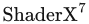, Charles River Media, 第189–215页, 2009年。 本书引用页：561。

**[1110]** Malan, Hugh。《〈尘埃514〉中的实时全局光照与反射》（Real-Time Global Illumination and Reflections in Dust 514）。SIGGRAPH游戏中的实时渲染进展（SIGGRAPH Advances in Real-Time Rendering in Games） 课程, 2012年8月。 本书引用页：142, 143, 493。

**[1111]** Malmer, Mattias, Fredrik Malmer, Ulf Assarsson、Nicolas Holzschuch。《用于近邻阴影的快速预计算环境光遮蔽》（Fast Precomputed Ambient Occlusion for Proximity Shadows）。journal of graphics tools, 第12卷， 第2期， 第59–71页, 2007年。 本书引用页：452。

**[1112]** Malvar, Henrique S., Gary J. Sullivan、Sridhar Srinivasan。《用于图像压缩的基于提升的可逆颜色变换》（Lifting-Based Reversible Color Transformations for Image Compression）。收录于 Applications of Digital Image Processing XXXI, SPIE, 2008年。 本书引用页：197。

**[1113]** Malvar, R.。《不使用小波的快速渐进式图像编码》（Fast Progressive Image Coding Without Wavelets）。数据压缩会议（Data Compression Conference）, 2000年3月。 本书引用页：870。

**[1114]** Malyshau, Dzmitry。《基于四元数的渲染管线》（A Quaternion-Based Rendering Pipeline）。收录于 Wolfgang Engel, 编， , CRC Press, 第265–273页, 2012年。 本书引用页：82, 210, 715。

**[1115]** Mammen, Abraham。《采用虚拟像素映射技术实现的透明与抗锯齿算法》（Transparency and Antialiasing Algorithms Implemented with the Virtual Pixel Maps Technique）。IEEE Computer Graphics & Applications, 第9卷， 第4期， 第43–55页, 1989年7月。 本书引用页：139, 154。

**[1116]** Mamou, Khaled, Titus Zaharia、Françoise Prêteux。《TFAN：一种低复杂度3D网格压缩算法》（TFAN: A Low Complexity 3D Mesh Compression Algorithm）。Computer Animation and Virtual Worlds, 第20卷， 第1–12页, 2009年。 本书引用页：712。

**[1117]** Mansencal, Thomas。《关于渲染引擎的色彩空间无关性》（About Rendering Engines Colourspaces Agnosticism）。Colour Science 博客, 2014年9月17日。 本书引用页：278。

**[1118]** Mansencal, Thomas。《关于RGB色彩空间模型的性能》（About RGB Colourspace Models Performance）。Colour Science 博客, 2014年10月9日。 本书引用页：278。

**[1119]** Manson, Josiah、Scott Schaefer。《感知参数化的MIP映射》（Parameterization-Aware MIP-Mapping）。Computer Graphics Forum, 第31卷， 第4期， 第1455–1463页, 2012年。 本书引用页：191。

**[1120]** Manson, Josiah、Peter-Pike Sloan。《反射探针的快速滤波》（Fast Filtering of Reflection Probes）。Computer Graphics Forum, 第35卷， 第4期， 第119–127页, 2016年。 本书引用页：420, 503, 518。

**[1121]** Mantor, M.、M. Houston。《AMD Graphic Core Next：低功耗高性能图形与并行计算》（AMD Graphic Core Next—Low Power High Performance Graphics & Parallel Compute）。AMD Fusion开发者峰会（AMD Fusion Developer Summit）, 2011年6月。 本书引用页：1036。

**[1122]** Mara, M.、M. McGuire。《经裁剪和透视投影的3D球体的2D多边形边界》（2D Polyhedral Bounds of a Clipped, Perspective-Projected 3D Sphere）。Journal of Computer Graphics Techniques, 第2卷， 第2期， 第70–83页, 2013年。 本书引用页：863, 886, 894。

**[1123]** Mara, M., M. McGuire, D. Nowrouzezahrai、D. Luebke。《用于稳定全局光照近似的深度G缓冲区》（Deep G-Buffers for Stable Global Illumination Approximation）。收录于 Proceedings of High Performance Graphics, Eurographics Association, 第87–98页, 2016年6月。 本书引用页：509。

**[1124]** Mara, Michael, Morgan McGuire, Benedikt Bitterli、Wojciech Jarosz。《一种高效的全局光照去噪算法》（An Efficient Denoising Algorithm for Global Illumination）。High Performance Graphics, 2017年6月。 本书引用页：511。

**[1125]** Markosian, Lee, Michael A. Kowalski, Samuel J. Trychin, Lubomir D. Bourdev, Daniel Goldstein、John F. Hughes。《实时非真实感渲染》（Real-Time Nonphotorealistic Rendering）。收录于 SIGGRAPH ’97: Proceedings of the 24th Annual Conference on Computer Graphics and Interactive Techniques, ACM Press/Addison-Wesley Publishing Co., 第415–420页, 1997年8月。 本书引用页：667。

**[1126]** Markosian, Lee, Barbara J. Meier, Michael A. Kowalski, Loring S. Holden, J. D. Northrup、John F. Hughes。《具有连续细节层次的艺术化渲染》（Art-Based Rendering with Continuous Levels of Detail）。收录于 Proceedings of the 1st International Symposium on Non-Photorealistic Animation and Rendering, ACM, 第59–66页, 2000年6月。 本书引用页：670, 672。

**[1127]** Marques, R., C. Bouville, M. Ribardière, L. P. Santos、K. Bouatouch。《用于光照积分的球面斐波那契点集》（Spherical Fibonacci Point Sets for Illumination Integrals）。Computer Graphics Forum, 第32卷， 第8期， 第134–143页, 2013年。 本书引用页：397。

**[1128]** Marschner, Stephen R., Henrik Wann Jensen, Mike Cammarano, Steve Worley、Pat Hanrahan。《人类毛发纤维的光散射》（Light Scattering from Human Hair Fibers）。ACM Transactions on Graphics (SIGGRAPH 2003), 第22卷， 第3期， 第780–791页, 2000年。 本书引用页：359, 640, 641, 642, 643, 644。

**[1129]** Marschner, Steve、Peter Shirley。《计算机图形学基础》（Fundamentals of Computer Graphics）。第4版, CRC Press, 2015年。 本书引用页：102。

**[1130]** Marshall, Carl S.。《卡通渲染：实时轮廓边缘检测与渲染》（Cartoon Rendering: Real-Time Silhouette Edge Detection and Rendering）。收录于 Mark DeLoura, 编， Game Programming Gems 2, Charles River Media, 第436–443页, 2001年。 本书引用页：666。

**[1131]** Martin, Sam、Per Einarsson。《用于电子游戏的实时辐射度架构》（A Real-Time Radiosity Architecture for Video Game）。SIGGRAPH三维图形与游戏中的实时渲染进展（SIGGRAPH Advances in Real-Time Rendering in 3D Graphics and Games） 课程, 2010年7月。 本书引用页：482。

**[1132]** Martin, Tobias、Tiow-Seng Tan。《梯形阴影贴图的抗锯齿与连续性》（Anti-aliasing and Continuity with Trapezoidal Shadow Maps）。收录于 15th Eurographics Symposium on Rendering, Eurographics Association, 第153–160页, 2004年6月。 本书引用页：241。

**[1133]** Martinez, Adam。《更快呈现仙境的照片级真实感：Sony Pictures Imageworks的物理着色与光照》（Faster Photorealism in Wonderland: Physically-Based Shading and Lighting at Sony Pictures Imageworks）。SIGGRAPH影视与游戏制作中的物理着色模型（SIGGRAPH Physically-Based Shading Models in Film and Game Production） 课程, 2010年7月。 本书引用页：340。

**[1134]** Mason, Ashton E. W.、Edwin H. Blake。《计算机动画中的自动分层细节层次优化》（Automatic Hierarchical Level of Detail Optimization in Computer Animation）。Computer Graphics Forum, 第16卷， 第3期， 第191–199页, 1997年。 本书引用页：866。

**[1135]** Masserann, Arnaud。《索引多个顶点数组》（Indexing Multiple Vertex Arrays）。收录于 Patrick Cozzi & Christophe Riccio, 编， OpenGL Insights, CRC Press, 第365–374页, 2012年。 本书引用页：691, 699, 703。

**[1136]** Mattausch, Oliver, Jiří Bittner、Michael Wimmer。《CHC++：重新审视相干层次剔除》（CHC++: Coherent Hierarchical Culling Revisited）。Computer Graphics Forum, 第27卷， 第2期， 第221–230页, 2008年。 本书引用页：845。

**[1137]** Mattausch, Oliver, Jiří Bittner, Ari Silvennoinen, Daniel Scherzer、Michael Wimmer。《阴影贴图的高效在线可见性》（Efficient Online Visibility for Shadow Maps）。收录于 Wolfgang Engel, 编， , CRC Press, 第233–242页, 2012年。 本书引用页：247。

**[1138]** Mattes, Ben、Jean-Francois St-Amour。《〈波斯王子〉的插画式渲染》（Illustrative Rendering of Prince of Persia）。游戏开发者大会（Game Developers Conference）, 2009年3月。 本书引用页：658, 662。

**[1139]** Matusik, W., C. Buehler, R. Raskar, S. J. Gortler、L. McMillan。《基于图像的视觉外壳》（Image-Based Visual Hulls）。收录于 SIGGRAPH ’00: Proceedings of the 27th Annual Conference on Computer Graphics and Interactive Techniques, ACM Press/Addison-Wesley Publishing Co., 第369–374页, 2000年。 本书引用页：580。

**[1140]** Maughan, Chris。《使用纹理遮罩加速镜头眩光》（Texture Masking for Faster Lens Flare）。收录于 Mark DeLoura, 编， Game Programming Gems 2, Charles River Media, 第474–480页, 2001年。 本书引用页：524。

**[1141]** Maule, Marilena, João L. D. Comba, Rafael Torchelsen、Rui Bastos。《基于光栅的透明技术综述》（A Survey of Raster-Based Transparency Techniques）。Computer and Graphics, 第35卷， 第6期， 第1023–1034页, 2011年。 本书引用页：159。

**[1142]** Maule, Marilena, João Comba, Rafael Torchelsen、Rui Bastos。《混合透明技术》（Hybrid Transparency）。收录于 Proceedings of the ACM SIGGRAPH Symposium on Interactive 3D Graphics and Games, ACM, 第103–118页, 2013年。 本书引用页：156。

**[1143]** Mavridis, Pavlos、Georgios Papaioannou。《GPU上的高质量椭圆纹理滤波》（High Quality Elliptical Texture Filtering on GPU）。收录于 Symposium on Interactive 3D Graphics and Games, ACM, 第23–30页, 2011年2月。 本书引用页：189。

**[1144]** Mavridis, P.、G. Papaioannou。《紧凑的YCoCg帧缓冲区》（The Compact YCoCg Frame Buffer）。Journal of Computer Graphics Techniques, 第1卷， 第1期， 第19–35页, 2012年。 本书引用页：804, 805。

**[1145]** Max, Nelson L.。《地平线映射：凹凸映射表面的阴影》（Horizon Mapping: Shadows for Bump-Mapped Surfaces）。The Visual Computer, 第4卷， 第2期， 第109–117页, 1988年。 本书引用页：460, 466。

**[1146]** Max, Nelson L.。《从面片法线计算顶点法线的权重》（Weights for Computing Vertex Normals from Facet Normals）。journal of graphics tools, 第4卷， 第2期， 第1–6页, 1999年。 亦收录于文献[112]。 本书引用页：695。

**[1147]** Max, Nelson。《构建标准正交基时提高精度》（Improved Accuracy When Building an Orthonormal Basis）。Journal of Computer Graphics Techniques, 第6卷， 第1期， 第9–16页, 2017年。 本书引用页：75。

**[1148]** 《Maxima：计算机代数系统》（Maxima, a Computer Algebra System）。http://maxima.sourceforge.net/, 2017年。 本书引用页：991。

**[1149]** Mayaux, Benoit。《实时体积渲染》（Real-Time Volumetric Rendering）。Revision Demo Party, 2013年3月—4月。 本书引用页：620。

**[1150]** McAllister, David K., Anselmo A. Lastra、Wolfgang Heidrich。《空间双向反射分布函数的高效渲染》（Efficient Rendering of Spatial Bi-directional Reflectance Distribution Functions）。收录于 Graphics Hardware 2002, Eurographics Association, 第79–88页, 2002年9月。 本书引用页：417, 424。

**[1151]** McAllister, David。《空间BRDF》（Spatial BRDFs）。收录于 Randima Fernando, 编， GPU Gems, Addison-Wesley, 第293–306页, 2004年。 本书引用页：417, 424。

**[1152]** McAnlis, Colt。《多线程3D渲染器》（A Multithreaded 3D Renderer）。收录于 Eric Lengyel, 编， Game Engine Gems, Jones and Bartlett, 第149–165页, 2010年。 本书引用页：814。

**[1153]** McAuley, Stephen。《〈孤岛惊魂3〉中的光照与材质校准》（Calibrating Lighting and Materials in Far Cry 3）。SIGGRAPH物理着色的理论与实践（SIGGRAPH Physically Based Shading in Theory and Practice） 课程, 2012年8月。 本书引用页：349。

**[1154]** McAuley, Stephen。《渲染〈孤岛惊魂4〉的世界》（Rendering the World of Far Cry 4）。游戏开发者大会（Game Developers Conference）, 2015年3月。 本书引用页：143, 146, 210, 420, 424, 453, 481, 503, 715, 864。

**[1155]** McCabe, Dan、John Brothers。《DirectX 6纹理贴图压缩》（DirectX 6 Texture Map Compression）。Game Developer, 第5卷， 第8期， 第42–46页, 1998年8月。 本书引用页：1013。

**[1156]** McCaffrey, Jon。《探索移动端与桌面端OpenGL的性能》（Exploring Mobile vs. Desktop OpenGL Performance）。收录于 Patrick Cozzi & Christophe Riccio, 编， OpenGL Insights, CRC Press, 第337–352页, 2012年。 本书引用页：814。

**[1157]** McCloud, Scott。《理解漫画：看不见的艺术》（Understanding Comics: The Invisible Art）。Harper Perennial, 1994年。 本书引用页：652, 678。

**[1158]** McCombe, J. A.。《PowerVR图形：最新进展与未来计划》（PowerVR Graphics—Latest Developments and Future Plans）。游戏开发者大会（Game Developers Conference）, 2015年3月。 本书引用页：511, 1039, 1044。

**[1159]** McCool, Michael D., Chris Wales、Kevin Moule。《采用增量和层次希尔伯特顺序的边缘方程多边形光栅化》（Incremental and Hierarchical Hilbert Order Edge Equation Polygon Rasterization）。收录于 Graphics Hardware 2001, Eurographics Association, 第65–72页, 2001年8月。 本书引用页：996, 1001。

**[1160]** McCormack, J., R. McNamara, C. Gianos, L. Seiler, N. P. Jouppi、Ken Corell。《Neon：单芯片3D工作站图形加速器》（Neon: A Single-Chip 3D Workstation Graphics Accelerator）。收录于 Proceedings of the ACM SIGGRAPH/EUROGRAPHICS Workshop on Graphics Hardware, ACM, 第123–123页, 1998年8月。 本书引用页：185, 1010, 1034。

**[1161]** McCormack, Joel, Ronald Perry, Keith I. Farkas、Norman P. Jouppi。《Feline：用于各向异性纹理映射的快速椭圆线》（Feline: Fast Elliptical Lines for Anisotropic Texture Mapping）。收录于 SIGGRAPH ’99: Proceedings of the 26th Annual Conference on Computer Graphics and Interactive Techniques, ACM Press/Addison-Wesley Publishing Co., 第243–250页, 1999年8月。 本书引用页：189。

**[1162]** McCormack, Joel、Robert McNamara。《使用半平面边缘函数的分块多边形遍历》（Tiled Polygon Traversal Using Half-Plane Edge Functions）。收录于 Graphics Hardware 2000, Eurographics Association, 第15–22页, 2000年8月。 本书引用页：22, 996, 997。

**[1163]** McDermott, Wes。《Allegorithmic的完整PBR指南》（The Comprehensive PBR Guide by Allegorithmic）。第2卷， Allegorithmic, 2016年。 本书引用页：325, 349。

**[1164]** McDonald, J.、M. Kilgard。《利用相邻边法线实现无裂缝点法线三角形》（Crack-Free Point-Normal Triangles Using Adjacent Edge Normals）。技术报告, NVIDIA, 2010年12月。 本书引用页：747。

**[1165]** McDonald, J.。《别把一切都丢掉：高效的缓冲区管理》（Don’t Throw It All Away: Efficient Buffer Management）。游戏开发者大会（Game Developers Conference）, 2012年3月。 本书引用页：117。

**[1166]** McDonald, John。《Alpha混合：预乘还是不预乘》（Alpha Blending: To Pre or Not To Pre）。NVIDIA GameWorks 博客, 2013年1月31日。 本书引用页：208。

**[1167]** McDonald, John。《避免灾难性的性能损失：检测CPU-GPU同步点》（Avoiding Catastrophic Performance Loss: Detecting CPU-GPU Sync Points）。游戏开发者大会（Game Developers Conference）, 2014年3月。 本书引用页：790, 794, 805。

**[1168]** McEwan, Ian, David Sheets, Mark Richardson、Stefan Gustavson。《GLSL中的高效计算噪声》（Efficient Computational Noise in GLSL）。journal of graphics tools, 第16卷， 第2期， 第85–94页, 2012年。 本书引用页：199。

**[1169]** McGuire, Morgan、John F. Hughes。《由硬件确定的特征边》（Hardware-Determined Feature Edges）。收录于 Proceedings of the 3rd International Symposium on Non-Photorealistic Animation and Rendering, ACM, 第35–47页, 2004年6月。 本书引用页：668。

**[1170]** McGuire, Morgan。《超级着色器》（The SuperShader）。收录于 Wolfgang Engel, 编， 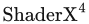, Charles River Media, 第485–498页, 2005年。 本书引用页：128。

**[1171]** McGuire, Morgan、Max McGuire。《陡峭视差映射》（Steep Parallax Mapping）。Symposium on Interactive 3D Graphics and Games 海报, 2005年4月。 本书引用页：215, 216, 217, 218, 933。

**[1172]** McGuire, Morgan。《计算机图形学档案库》（Computer Graphics Archive）。http://graphics.cs.williams.edu/data, 2011年8月。 本书引用页：105, 118。

**[1173]** McGuire, Morgan, Padraic Hennessy, Michael Bukowski、Brian Osman。《用于可信运动模糊的重建滤波器》（A Reconstruction Filter for Plausible Motion Blur）。Symposium on Interactive 3D Graphics and Games, 2012年2月。 本书引用页：537, 540, 541, 542, 543。

**[1174]** McGuire, Morgan, Michael Mara、David Luebke。《可扩展环境遮蔽》（Scalable Ambient Obscurance）。High Performance Graphics, 2012年6月。 本书引用页：459。

**[1175]** McGuire, M., D. Evangelakos, J. Wilcox, S. Donow、M. Mara。《标准立方体MIP贴图的可信Blinn-Phong反射》（Plausible Blinn-Phong Reflection of Standard Cube MIP-Maps）。技术报告 CSTR201301, 计算机科学系, 威廉姆斯学院（Williams College）, 2013年。 本书引用页：419。

**[1176]** McGuire, Morgan、Louis Bavoil。《加权混合的顺序无关透明》（Weighted Blended Order-Independent Transparency）。Journal of Computer Graphics Techniques, 第2卷， 第2期， 第122–141页, 2013年。 本书引用页：158。

**[1177]** McGuire, Morgan。《Z预通道被认为无关紧要》（Z-Prepass Considered Irrelevant）。Casual Effects 博客, 2013年8月14日。 本书引用页：803, 882。

**[1178]** McGuire, Morgan。《〈小龙斯派罗：交换力量〉的景深着色器》（The Skylanders SWAP Force Depth-of-Field Shader）。Casual Effects 博客, 2013年9月13日。 本书引用页：529, 530, 532, 533, 536。

**[1179]** McGuire, Morgan、Michael Mara。《高效的GPU屏幕空间光线追踪》（Efficient GPU Screen-Space Ray Tracing）。Journal of Computer Graphics Techniques, 第3卷， 第4期， 第73–85页, 2014年。 本书引用页：506。

**[1180]** McGuire, Morgan。《实现加权混合的顺序无关透明》（Implementing Weighted, Blended Order-Independent Transparency）。Casual Effects 博客, 2015年3月26日。 本书引用页：158, 569。

**[1181]** McGuire, Morgan。《快速彩色透明》（Fast Colored Transparency）。Casual Effects 博客, 2015年3月27日。 本书引用页：158。

**[1182]** McGuire, Morgan。《透过昏暗玻璃窥看实时透明的未来》（Peering Through a Glass, Darkly at the Future of Real-Time Transparency）。SIGGRAPH实时渲染中的开放问题（SIGGRAPH Open Problems in Real-Time Rendering） 课程, 2016年7月。 本书引用页：159, 165, 623, 649。

**[1183]** McGuire, Morgan。《VR开发中避免晕动症的策略》（Strategies for Avoiding Motion Sickness in VR Development）。Casual Effects 博客, 2016年8月12日。 本书引用页：920。

**[1184]** McGuire, Morgan, Mike Mara, Derek Nowrouzezahrai、David Luebke。《利用预计算光场探针实现实时全局光照》（Real-Time Global Illumination Using Precomputed Light Field Probes）。收录于 Proceedings of the 21st ACM SIGGRAPH Symposium on Interactive 3D Graphics and Games, ACM, 第2:1–2:11页, 2017年2月。 本书引用页：490, 502。

**[1185]** McGuire, Morgan、Michael Mara。《现象学透明》（Phenomenological Transparency）。IEEE Transactions of Visualization and Computer Graphics, 第23卷， 第5期， 第1465–1478页, 2017年5月。 本书引用页：158, 623, 624, 629, 632, 649。

**[1186]** McGuire, Morgan。《虚拟前沿：虚拟现实与增强现实中的计算机图形学挑战》（The Virtual Frontier: Computer Graphics Challenges in Virtual Reality & Augmented Reality）。SIGGRAPH NVIDIA 演讲, 2017年7月31日。 本书引用页：923, 939, 940。

**[1187]** McGuire, Morgan。《NVIDIA研究部门如何为VR的未来重塑显示管线，第2部分》（How NVIDIA Research is Reinventing the Display Pipeline for the Future of VR, Part 2）。Road to VR 网站, 2017年11月30日。 本书引用页：919, 940, 1046。

**[1188]** McGuire, Morgan。《图形学宝典》（The Graphics Codex）。第2.14版, Casual Effects Publishing, 2018年。 本书引用页：372, 512, 1047。

**[1189]** McGuire, Morgan。《光线步进》（Ray Marching）。收录于 The Graphics Codex, 第2.14版, Casual Effects Publishing, 2018年。 本书引用页：752。

**[1190]** McLaren, James。《〈明日之子〉的技术》（The Technology of The Tomorrow Children）。游戏开发者大会（Game Developers Conference）, 2015年3月。 本书引用页：496, 504, 569。

**[1191]** McNabb, Doug。《稀疏程序化体渲染》（Sparse Procedural Volume Rendering）。收录于 Wolfgang Engel, 编， , CRC Press, 第167–180页, 2015年。 本书引用页：611, 934。

**[1192]** McReynolds, Tom、David Blythe。《使用OpenGL进行高级图形编程》（Advanced Graphics Programming Using OpenGL）。Morgan Kaufmann, 2005年。 本书引用页：152, 153, 199, 200, 221, 222, 229, 538, 551, 674, 675, 678。

**[1193]** McTaggart, Gary。《〈半条命2〉/Valve Source着色》（Half-Life 2/Valve Source Shading）。游戏开发者大会（Game Developers Conference）, 2004年3月。 本书引用页：127, 394, 402, 478, 488, 499。

**[1194]** McVoy, Larry、Carl Staelin。《lmbench：可移植的性能分析工具》（lmbench: Portable Tools for Performance Analysis）。收录于 Proceedings of the USENIX Annual Technical Conference, USENIX, 第120–133页, 1996年1月。 本书引用页：792。

**[1195]** Mehra, Ravish、Subodh Kumar。《利用方向距离图准确高效地渲染细节》（Accurate and Efficient Rendering of Detail Using Directional Distance Maps）。收录于 Proceedings of the Eighth Indian Conference on Vision, Graphics and Image Processing, ACM, 第34:1–34:8页, 2012年12月。 本书引用页：219。

**[1196]** Melax, Stan。《一种简单、快速且有效的多边形缩减算法》（A Simple, Fast, and Effective Polygon Reduction Algorithm）。Game Developer, 第5卷， 第11期， 第44–49页, 1998年11月。 本书引用页：707, 860。

**[1197]** Melax, Stan。《最短弧四元数》（The Shortest Arc Quaternion）。收录于 Mark DeLoura, 编， Game Programming Gems, Charles River Media, 第214–218页, 2000年。 本书引用页：83。

**[1198]** Meneveaux, Daniel, Benjamin Bringier, Emmanuelle Tauzia, Mickaël Ribardière、Lionel Simonot。《使用带界面的朗伯微表面渲染粗糙不透明材质》（Rendering Rough Opaque Materials with Interfaced Lambertian Microfacets）。IEEE Transactions on Visualization and Computer Graphics, 第24卷， 第3期， 第1368–1380页, 2018年。 本书引用页：331。

**[1199]** Meng, Johannes, Florian Simon, Johannes Hanika、Carsten Dachsbacher。《使用三刺激值颜色进行具有物理意义的渲染》（Physically Meaningful Rendering Using Tristimulus Colours）。Computer Graphics Forum, 第34卷， 第4期， 第31–40页, 2015年。 本书引用页：349。

**[1200]** Merry, Bruce。《基于分块的架构的性能调优》（Performance Tuning for Tile-Based Architectures）。收录于 Patrick Cozzi & Christophe Riccio, 编， OpenGL Insights, CRC Press, 第323–335页, 2012年。 本书引用页：790, 814。

## 参考文献 1201—1400

**[1201]** Mertens, Tom, Jan Kautz, Philippe Bekaert, Hans-Peter Seidel, 和 Frank Van Reeth, 《局部次表面散射的高效渲染》（原题：Efficient Rendering of Local Subsurface Scattering）；载于 Proceedings of the 11th Pacific Conference on Computer Graphics and Applications, IEEE Computer Society, 第51–58页, 2003年10月. 本书引用页：639。

**[1202]** Meshkin, Houman, 《与排序无关的 Alpha 混合》（原题：Sort-Independent Alpha Blending）；游戏开发者大会（Game Developers Conference）, 2007年3月. 本书引用页：156。

**[1203]** Meyer, Alexandre, 和 Fabrice Neyret, 《交互式体积纹理》（原题：Interactive Volumetric Textures）；载于 Rendering Techniques ’98, Springer, 第157–168页, 1998年7月. 本书引用页：565, 646。

**[1204]** Meyer, Alexandre, Fabrice Neyret, 和 Pierre Poulin, 《带有着色和阴影的树木交互式渲染》（原题：Interactive Rendering of Trees with Shading and Shadows）；载于 Rendering Techniques 2001, Springer, 第183–196页, 2001年6月. 本书引用页：202。

**[1205]** Meyer, Quirin, Jochen Süßner, Gerd Sußner, Marc Stamminger, 和 Günther Greiner, 《论浮点法向量》（原题：On Floating-Point Normal Vectors）；Computer Graphics Forum, 第29卷, 第4期, 第1405–1409页, 2010. 本书引用页：222。

**[1206]** Meyers, Scott, 《CPU 缓存及其为何值得关注》（原题：CPU Caches and Why You Care）；code::dive 会议（code::dive conference）, 2014年11月5日. 本书引用页：791, 792。

**[1207]** Microsoft, 《坐标系》（原题：Coordinate Systems）；Windows Mixed Reality 网站（Windows Mixed Reality website）, 2017. 本书引用页：918, 932。

**[1208]** Microsoft, 《Direct3D 11 图形》（原题：Direct3D 11 Graphics）；Windows 开发者中心（Windows Dev Center）. 本书引用页：42, 233, 525。

**[1209]** Mikkelsen, Morten S., 《在 GPU 上对未参数化曲面进行凹凸映射》（原题：Bump Mapping Unparametrized Surfaces on the GPU）；技术报告, Naughty Dog, 2010. 本书引用页：210。

**[1210]** Mikkelsen, Morten S., 《精细裁剪的分块光源列表》（原题：Fine Pruned Tiled Light Lists）；载于 Wolfgang Engel, 编， , CRC Press, 第69–81页, 2016. 本书引用页：897, 914。

**[1211]** Miller, Gavin, 《局部与全局可达性着色的高效算法》（原题：Efficient Algorithms for Local and Global Accessibility Shading）；载于 SIGGRAPH ’94: Proceedings of the 21st Annual Conference on Computer Graphics and Interactive Techniques, ACM, 第319–326页, 1994年7月. 本书引用页：449。

**[1212]** Miller, Gene S., 和 C. Robert Hoffman, 《光照与反射贴图：模拟环境与真实环境中的模拟物体》（原题：Illumination and Reflection Maps: Simulated Objects in Simulated and Real Environments）；SIGGRAPH“高级计算机图形动画”课程（SIGGRAPH Advanced Computer Graphics Animation course）, 1984年7月. 本书引用页：408, 424。

**[1213]** Miller, Scott, 《用于扩展动态范围图像的感知电光传递函数（EOTF）》（原题：A Perceptual EOTF for Extended Dynamic Range Imagery）；SMPTE 标准更新演示报告（SMPTE Standards Update presentation）, 2014年5月6日. 本书引用页：281。

**[1214]** Mitchell, D., 和 A. Netravali, 《计算机图形学中的重建滤波器》（原题：Reconstruction Filters in Computer Graphics）；Computer Graphics (SIGGRAPH ’88 Proceedings), 第22卷, 第4期, 第239–246页, 1988年8月. 本书引用页：136。

**[1215]** Mitchell, Jason L., Michael Tatro, 和 Ian Bullard, 《DirectX 6 中的多重纹理》（原题：Multitexturing in DirectX 6）；Game Developer, 第5卷, 第9期, 第33–37页, 1998年9月. 本书引用页：200。

**[1216]** Mitchell, Jason L., 《高级顶点着色器与像素着色器技术》（原题：Advanced Vertex and Pixel Shader Techniques）；欧洲游戏开发者大会（European Game Developers Conference）, 2001年9月. 本书引用页：521。

**[1217]** Mitchell, Jason L., 《在 Direct3D 中利用 1.4 版像素着色器处理图像》（原题：Image Processing with 1.4 Pixel Shaders in Direct3D）；载于 Wolfgang Engel, 编， Direct3D ShaderX: Vertex & Pixel Shader Tips and Techniques, Wordware, 第258–269页, 2002. 本书引用页：521, 662。

**[1218]** Mitchell, Jason L., Marwan Y. Ansari, 和 Evan Hart, 《利用 DirectX 9 像素着色器进行高级图像处理》（原题：Advanced Image Processing with DirectX 9 Pixel Shaders）；载于 Wolfgang Engel, 编， : Shader Programming Tips and Tricks with DirectX 9, Wordware, 第439–468页, 2004. 本书引用页：515, 517, 521。

**[1219]** Mitchell, Jason L., 《光束渲染》（原题：Light Shaft Rendering）；载于 Wolfgang Engel, 编， 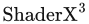, Charles River Media, 第573–588页, 2004. 本书引用页：604。

**[1220]** Mitchell, Jason L., 和 Pedro V. Sander, 《显式 Early-Z 剔除的应用》（原题：Applications of Explicit Early-Z Culling）；SIGGRAPH“实时着色”课程（SIGGRAPH Real-Time Shading course）, 2004年8月. 本书引用页：53, 1016。

**[1221]** Mitchell, Jason, 《环境贴图的运动模糊》（原题：Motion Blurring Environment Maps）；载于 Wolfgang Engel, 编， , Charles River Media, 第263–268页, 2005. 本书引用页：538。

**[1222]** Mitchell, Jason, Gary McTaggart, 和 Chris Green, 《Valve 的 Source 引擎中的着色》（原题：Shading in Valve’s Source Engine）；SIGGRAPH“三维图形与游戏中的高级实时渲染”课程（SIGGRAPH Advanced Real-Time Rendering in 3D Graphics and Games course）, 2006年8月. 本书引用页：289, 382, 402, 499。

**[1223]** Mitchell, Jason L., Moby Francke, 和 Dhabih Eng, 《〈军团要塞2〉中的插画式渲染》（原题：Illustrative Rendering in Team Fortress 2）；Proceedings of the 5th International Symposium on Non-Photorealistic Animation and Rendering, ACM, 第71–76页, 2007年8月. 收录于 [1746]. 本书引用页：678。

**[1224]** Mitchell, Jason, 《有目的的风格化：〈军团要塞2〉的插画世界》（原题：Stylization with a Purpose: The Illustrative World of Team Fortress 2）；游戏开发者大会（Game Developers Conference）, 2008年3月. 本书引用页：652, 654。

**[1225]** Mitchell, Kenny, 《作为后处理的体积光散射》（原题：Volumetric Light Scattering as a Post-Process）；载于 Hubert Nguyen, 编， GPU Gems 3, Addison-Wesley, 第275–285页, 2007. 本书引用页：604。

**[1226]** Mittring, Martin, 《三角网格切线空间计算》（原题：Triangle Mesh Tangent Space Calculation）；载于 Wolfgang Engel, 编， , Charles River Media, 第77–89页, 2005. 本书引用页：210。

**[1227]** Mittring, Martin, 《探寻下一代——CryEngine 2》（原题：Finding Next Gen—CryEngine 2）；SIGGRAPH“三维图形与游戏中的高级实时渲染”课程（SIGGRAPH Advanced Real-Time Rendering in 3D Graphics and Games course）, 2007年8月. 本书引用页：43, 195, 239, 242, 255, 457, 476, 559, 856, 860, 861。

**[1228]** Mittring, Martin, 和 Byran Dudash, 《DirectX 11 虚幻引擎“Samaritan”演示背后的技术》（原题：The Technology Behind the DirectX 11 Unreal Engine ‘Samaritan’ Demo）；游戏开发者大会（Game Developers Conference）, 2011年3月. 本书引用页：389, 502, 531, 641, 642。

**[1229]** Mittring, Martin, 《“Unreal Engine 4 Elemental Demo”演示背后的技术》（原题：The Technology Behind the ‘Unreal Engine 4 Elemental Demo’）；游戏开发者大会（Game Developers Conference）, 2012年3月. 本书引用页：288, 371, 383, 495, 526, 536, 571。

**[1230]** Mohr, Alex, 和 Michael Gleicher, 《从示例构建高效、准确的角色蒙皮》（原题：Building Efficient, Accurate Character Skins from Examples）；ACM Transactions on Graphics (SIGGRAPH 2003), 第22卷, 第3期, 第562–568页, 2003. 本书引用页：85。

**[1231]** Möller, Tomas, 和 Ben Trumbore, 《快速、最小存储的射线与三角形求交》（原题：Fast, Minimum Storage Ray-Triangle Intersection）；journal of graphics tools, 第2卷, 第1期, 第21–28页, 1997. 亦收录于 [112]. 本书引用页：962, 965。

**[1232]** Möller, Tomas, 《快速的三角形与三角形相交测试》（原题：A Fast Triangle-Triangle Intersection Test）；journal of graphics tools, 第2卷, 第2期, 第25–30页, 1997. 本书引用页：972。

**[1233]** Möller, Tomas, 和 John F. Hughes, 《高效构造将一个向量旋转至另一个向量的矩阵》（原题：Efficiently Building a Matrix to Rotate One Vector to Another）；journal of graphics tools, 第4卷, 第4期, 第1–4页, 1999. 亦收录于 [112]. 本书引用页：83, 84。

**[1234]** Molnar, Steven, 《面向高性能体系结构的高效超采样抗锯齿》（原题：Efficient Supersampling Antialiasing for High-Performance Architectures）；技术报告 TR91-023, 北卡罗来纳大学教堂山分校计算机科学系（Department of Computer Science, University of North Carolina at Chapel Hill）, 1991. 本书引用页：145, 547。

**[1235]** Molnar, S., J. Eyles, 和 J. Poulton, 《PixelFlow：利用图像合成实现高速渲染》（原题：PixelFlow: High-Speed Rendering Using Image Composition）；Computer Graphics (SIGGRAPH ’92 Proceedings), 第26卷, 第2期, 第231–240页, 1992年7月. 本书引用页：883, 1022。

**[1236]** Molnar, S., M. Cox, D. Ellsworth, 和 H. Fuchs, 《基于排序的并行渲染分类》（原题：A Sorting Classification of Parallel Rendering）；IEEE Computer Graphics and Applications, 第14卷, 第4期, 第23–32页, 1994年7月. 本书引用页：1020, 1023。

**[1237]** Montesdeoca, S. E., H. S. Seah, 和 H.-M. Rall, 《受艺术指导的水彩渲染动画》（原题：Art-Directed Watercolor Rendered Animation）；载于 Expressive 2016, Eurographics Association, 第51–58页, 2016年5月. 本书引用页：665。

**[1238]** Morein, Steve, 《ATI Radeon HyperZ 技术》（原题：ATI Radeon HyperZ Technology）；Graphics Hardware 的 Hot3D 专场（Graphics Hardware Hot3D session）, 2000年8月. 本书引用页：1009, 1015, 1016, 1038。

**[1239]** Moreton, Henry P., 和 Carlo H. Séquin, 《用于光顺曲面设计的泛函优化》（原题：Functional Optimization for Fair Surface Design）；Computer Graphics (SIGGRAPH ’92 Proceedings), 第26卷, 第2期, 第167–176页, 1992年7月. 本书引用页：761。

**[1240]** Moreton, Henry, 《利用前向差分实现无裂缝曲面细分》（原题：Watertight Tessellation Using Forward Differencing）；载于 Graphics Hardware 2001, Eurographics Association, 第25–132页, 2001年8月. 本书引用页：768, 769。

**[1241]** Morovič, Ján,《色域映射》（原题：Color Gamut Mapping）；John Wiley & Sons, 2008. 本书引用页：278。

**[1242]** Mortenson, Michael E., 《几何建模》（原题：Geometric Modeling）；第3版, John Wiley & Sons, 2006. 本书引用页：718, 781。

**[1243]** Morton, G. M., 《面向计算机的大地测量数据库与一种新的文件排序技术》（原题：A Computer Oriented Geodetic Data Base and a New Technique in File Sequencing）；技术报告, IBM, 安大略省渥太华（Ottawa, Ontario）, 1966年3月1日. 本书引用页：1018。

**[1244]** Mueller, Carl, 《飞行模拟器图像生成器的体系结构》（原题：Architectures of Image Generators for Flight Simulators）；技术报告 TR95-015, 北卡罗来纳大学教堂山分校计算机科学系（Department of Computer Science, University of North Carolina at Chapel Hill）, 1995. 本书引用页：149。

**[1245]** Mulde, Jurriaan D., Frans C. A. Groen, 和 Jarke J. van Wijk, 《用于纱门透明的像素掩码》（原题：Pixel Masks for Screen-Door Transparency）；载于 Visualization ’98, IEEE Computer Society, 第351–358页, 1998年10月. 本书引用页：149。

**[1246]** Munkberg, Jacob, 和 Tomas Akenine-Möller, 《用于运动模糊与景深的背面剔除》（原题：Backface Culling for Motion Blur and Depth of Field）；Journal of Graphics, GPU, and Game Tools, 第15卷, 第2期, 第123–139页, 2011. 本书引用页：835。

**[1247]** Munkberg, Jacob, Karthik Vaidyanathan, Jon Hasselgren, Petrik Clarberg, 和 Tomas Akenine-Möller, 《用于散焦与运动模糊的分层重建》（原题：Layered Reconstruction for Defocus and Motion Blur）；Computer Graphics Forum, 第33卷, 第4期, 第81–92页, 2014. 本书引用页：542。

**[1248]** Munkberg, J., J. Hasselgren, P. Clarberg, M. Andersson, 和 T. Akenine-Möller, 《用于光线追踪的纹理空间缓存与重建》（原题：Texture Space Caching and Reconstruction for Ray Tracing）；ACM Transactions on Graphics, 第35卷, 第6期, 第249:1–249:13页, 2016. 本书引用页：934。

**[1249]** Museth, Ken, 《VDB：具有动态拓扑的高分辨率稀疏体数据》（原题：VDB: High-Resolution Sparse Volumes with Dynamic Topology）；ACM Transactions on Graphics, 第32卷, 第2期, 文章编号 27, 2013年6月. 本书引用页：578, 584。

**[1250]** Myers, Kevin, 《深入理解 Alpha 到覆盖率转换》（原题：Alpha-to-Coverage in Depth）；载于 Wolfgang Engel, 编， , Charles River Media, 第69–74页, 2006. 本书引用页：207。

**[1251]** Myers, Kevin, 《方差阴影映射》（原题：Variance Shadow Mapping）；NVIDIA 白皮书, 2007. 本书引用页：253。

**[1252]** Myers, Kevin, Randima (Randy) Fernando, 和 Louis Bavoil, 《将逼真的软阴影集成到游戏引擎中》（原题：Integrating Realistic Soft Shadows into Your Game Engine）；NVIDIA 白皮书, 2008年2月. 本书引用页：250。

**[1253]** Myers, Kevin, 《稀疏阴影树》（原题：Sparse Shadow Trees）；载于 ACM SIGGRAPH 2016 Talks, ACM, 文章编号 14, 2016年7月. 本书引用页：239, 246, 263。

**[1254]** Nagy, Gabor, 《复杂物体上的实时阴影》（原题：Real-Time Shadows on Complex Objects）；载于 Mark DeLoura, 编， Game Programming Gems, Charles River Media, 第567–580页, 2000. 本书引用页：229。

**[1255]** Nagy, Gabor, 《游戏中外观逼真的玻璃》（原题：Convincing-Looking Glass for Games）；载于 Mark DeLoura, 编， Game Programming Gems, Charles River Media, 第586–593页, 2000. 本书引用页：153。

**[1256]** Nah, J.-H., H.-J. Kwon, D.-S. Kim, C.-H. Jeong, J. Park, T.-D. Han, D. Manocha, 和 W.-C. Park, 《RayCore：面向移动设备的光线追踪硬件体系结构》（原题：RayCore: A Ray-Tracing Hardware Architecture for Mobile Devices）；ACM Transactions on Graphics, 第33卷, 第5期, 第162:1–162:15页, 2014. 本书引用页：1039。

**[1257]** Naiman, Avi C., 《锯齿边缘：何时需要滤波？》（原题：Jagged Edges: When Is Filtering Needed?）；ACM Transactions on Graphics, 第14卷, 第4期, 第238–258页, 1998. 本书引用页：143。

**[1258]** Narasimhan, Srinivasa G., Mohit Gupta, Craig Donner, Ravi Ramamoorthi, Shree K. Nayar, 和 Henrik Wann Jensen, 《通过稀释获取参与介质的散射性质》（原题：Acquiring Scattering Properties of Participating Media by Dilution）；ACM Transactions on Graphics (SIGGRAPH 2006), 第25卷, 第3期, 第1003–1012页, 2006年8月. 本书引用页：591, 592。

**[1259]** Narkowicz, Krzysztof, 《GPU 上的实时 BC6H 压缩》（原题：Real-Time BC6H Compression on GPU）；载于 Wolfgang Engel, 编， , CRC Press, 第219–230页, 2014. 本书引用页：503, 870。

**[1260]** Narkowicz, Krzysztof, 《ACES 电影式色调映射曲线》（原题：ACES Filmic Tone Mapping Curve）；Krzysztof Narkowicz 博客, 2016年1月6日. 本书引用页：287。

**[1261]** Narkowicz, Krzysztof, 《HDR 显示——初步入门》（原题：HDR Display—First Steps）；Krzysztof Narkowicz 博客, 2016年8月31日. 本书引用页：287。

**[1262]** Nassau, Kurt, 《色彩的物理学与化学：颜色的十五种成因》（原题：The Physics and Chemistry of Color: The Fifteen Causes of Color）；第2版, John Wiley & Sons, Inc., 2001. 本书引用页：373。

**[1263]** Navarro, Fernando, Francisco J. Serón, 和 Diego Gutierrez, 《运动模糊渲染：研究现状》（原题：Motion Blur Rendering: State of the Art）；Computer Graphics Forum, 第30卷, 第1期, 第3–26页, 2011. 本书引用页：543。

**[1264]** Nehab, D., P. Sander, J. Lawrence, N. Tatarchuk, 和 J. Isidoro, 《利用反向重投影缓存加速实时着色》（原题：Accelerating Real-Time Shading with Reverse Reprojection Caching）；载于 Graphics Hardware 2007, Eurographics Association, 第25–35页, 2007年8月. 本书引用页：522, 523。

**[1265]** Nelson, Scott R., 《正确抗锯齿线条的十二项特征》（原题：Twelve Characteristics of Correct Antialiased Lines）；journal of graphics tools, 第1卷, 第4期, 第1–20页, 1996. 本书引用页：165。

**[1266]** Neubelt, D., 和 M. Pettineo, 《为〈教团：1886〉打造下一代材质管线》（原题：Crafting a Next-Gen Material Pipeline for The Order: 1886）；SIGGRAPH“基于物理的着色：理论与实践”课程（SIGGRAPH Physically Based Shading in Theory and Practice course）, 2013年7月. 本书引用页：357, 365, 370。

**[1267]** Neubelt, D., 和 M. Pettineo, 《为〈教团：1886〉打造下一代材质管线》（原题：Crafting a Next-Gen Material Pipeline for The Order: 1886）；游戏开发者大会（Game Developers Conference）, 2014年3月. 本书引用页：365, 370, 466, 896。

**[1268]** Neubelt, D., 和 M. Pettineo, 《Ready At Dawn 工作室的高级光照研发》（原题：Advanced Lighting R&D at Ready At Dawn Studios）；SIGGRAPH“基于物理的着色：理论与实践”课程（SIGGRAPH Physically Based Shading in Theory and Practice course）, 2015年8月. 本书引用页：398, 477, 488, 498。

**[1269]** Ng, Ren, Ravi Ramamoorthi, 和 Pat Hanrahan, 《利用非线性小波光照近似生成全频率阴影》（原题：All-Frequency Shadows Using Non-linear Wavelet Lighting Approximation）；ACM Transactions on Graphics (SIGGRAPH 2003), 第22卷, 第3期, 第376–281页, 2003. 本书引用页：433。

**[1270]** Ng, Ren, Ravi Ramamoorthi, 和 Pat Hanrahan, 《用于全频率重新打光的三重乘积小波积分》（原题：Triple Product Wavelet Integrals for All-Frequency Relighting）；ACM Transactions on Graphics (SIGGRAPH 2004), 第23卷, 第3期, 第477–487页, 2004年8月. 本书引用页：402, 433, 470。

**[1271]** Ngan, Addy, Frédo Durand, 和 Wojciech Matusik, 《BRDF 模型的实验分析》（原题：Experimental Analysis of BRDF Models）；载于 16th Eurographics Symposium on Rendering, Eurographics Association, 第117–126页, 2005年6—7月. 本书引用页：338, 343。

**[1272]** Nguyen, Hubert, 《在体积上投射阴影》（原题：Casting Shadows on Volumes）；Game Developer, 第6卷, 第3期, 第44–53页, 1999年3月. 本书引用页：229。

**[1273]** Nguyen, Hubert, 《“Vulcan”演示中的火焰》（原题：Fire in the ‘Vulcan’ Demo）；载于 Randima Fernando, 编， GPU Gems, Addison-Wesley, 第87–105页, 2004. 本书引用页：152, 521, 554。

**[1274]** Nguyen, Hubert, 和 William Donnelly, 《“Nalu”演示中的毛发动画与渲染》（原题：Hair Animation and Rendering in the ‘Nalu’ Demo）；载于 Matt Pharr, 编， GPU Gems 2, Addison-Wesley, 第361–380页, 2005. 本书引用页：257, 644, 719, 730。

**[1275]** Ni, T., I. Castaño, J. Peters, J. Mitchell, P. Schneider, 和 V. Verma, SIGGRAPH“细分曲面的高效替代方法”课程（原题：SIGGRAPH Efficient Substitutes for Subdivision Surfaces course）；2009年8月. 本书引用页：767, 781。

**[1276]** Nichols, Christopher, 《关于无偏渲染的真相》（原题：The Truth about Unbiased Rendering）；Chaosgroup Labs 博客, 2016年9月29日. 本书引用页：1043。

**[1277]** Nicodemus, F. E., J. C. Richmond, J. J. Hsia, I. W. Ginsberg, 和 T. Limperis, 《反射率的几何考量与术语》（原题：Geometric Considerations and Nomenclature for Reflectance）；美国国家标准局（National Bureau of Standards (US)）, 1977年10月. 本书引用页：310, 634。

**[1278]** Nienhuys, Han-Wen, Jim Arvo, 和 Eric Haines, 《球体与包围盒比值竞赛的结果》（原题：Results of Sphere in Box Ratio Contest）；Ray Tracing News, 第10卷, 第1期, 1997年1月. 本书引用页：953。

**[1279]** Nießner, M., C. Loop, M. Meyer, 和 T. DeRose, 《Catmull-Clark 细分曲面的特征自适应 GPU 渲染》（原题：Feature-Adaptive GPU Rendering of Catmull-Clark Subdivision Surfaces）；ACM Transactions on Graphics, 第31卷, 第1期, 第6:1–6:11页, 2012年1月. 本书引用页：771, 774, 777, 778, 779。

**[1280]** Nießner, M., C. Loop, 和 G. Greiner, 《Catmull-Clark 细分曲面中半光滑折痕的高效求值》（原题：Efficient Evaluation of Semi-Smooth Creases in Catmull-Clark Subdivision Surfaces）；载于 Eurographics 2012—Short Papers, Eurographics Association, 第41–44页, 2012年5月. 本书引用页：777。

**[1281]** Nießner, M., 和 C. Loop, 《利用硬件曲面细分实现解析位移映射》（原题：Analytic Displacement Mapping Using Hardware Tessellation）；ACM Transactions on Graphics, 第32卷, 第3期, 第26:1–26:9页, 2013. 本书引用页：766, 773。

**[1282]** Nießner, M., 《利用硬件曲面细分渲染细分曲面》（原题：Rendering Subdivision Surfaces Using Hardware Tessellation）；博士学位论文, 埃尔朗根-纽伦堡弗里德里希-亚历山大大学（Friedrich-Alexander-Universität Erlangen-Nürnberg）, 2013. 本书引用页：777, 779, 781。

**[1283]** Nießner, M., B. Keinert, M. Fisher, M. Stamminger, C. Loop, 和 H. Schäfer, 《利用硬件曲面细分的实时渲染技术》（原题：Real-Time Rendering Techniques with Hardware Tessellation）；Computer Graphics Forum, 第35卷, 第1期, 第113–137页, 2016. 本书引用页：773, 781, 879。

**[1284]** Nishita, Tomoyuki, Thomas W. Sederberg, 和 Masanori Kakimoto, 《裁剪有理曲面片的光线追踪》（原题：Ray Tracing Trimmed Rational Surface Patches）；Computer Graphics (SIGGRAPH ’90 Proceedings), 第24卷, 第4期, 第337–345页, 1990年8月. 本书引用页：967。

**[1285]** Nishita, Tomoyuki, Takao Sirai, Katsumi Tadamura, 和 Eihachiro Nakamae, 《考虑大气散射的地球显示》（原题：Display of the Earth Taking into Account Atmospheric Scattering）；载于 SIGGRAPH ’93: Proceedings of the 20th Annual Conference on Computer Graphics and Interactive Techniques, ACM, 第175–182页, 1993年8月. 本书引用页：614。

**[1286]** Nöll, Tobias, 和 Didier Stricker, 《用于自动生成纹理图集的任意形状图块高效装箱》（原题：Efficient Packing of Arbitrarily Shaped Charts for Automatic Texture Atlas Generation）；载于 Proceedings of the Twenty-Second Eurographics Conference on Rendering, Eurographics Association, 第1309–1317页, 2011. 本书引用页：191。

**[1287]** Northrup, J. D., 和 Lee Markosian, 《艺术化轮廓线：一种混合方法》（原题：Artistic Silhouettes: A Hybrid Approach）；载于 Proceedings of the 1st International Symposium on Non-photorealistic Animation and Rendering, ACM, 第31–37页, 2000年6月. 本书引用页：668。

**[1288]** Novák, J., 和 C. Dachsbacher, 《光栅化的包围体层次结构》（原题：Rasterized Bounding Volume Hierarchies）；Computer Graphics Forum, 第31卷, 第2期, 第403–412页, 2012. 本书引用页：565。

**[1289]** Novosad, Justin, 《高级高质量滤波》（原题：Advanced High-Quality Filtering）；载于 Matt Pharr, 编， GPU Gems 2, Addison-Wesley, 第417–435页, 2005. 本书引用页：136, 517, 521。

**[1290]** Nowrouzezahrai, Derek, Patricio Simari, 和 Eugene Fiume, 《用于高效球谐旋转的稀疏带状谐波分解》（原题：Sparse Zonal Harmonic Factorization for Efficient SH Rotation）；ACM Transactions on Graphics, 第31卷, 第3期, 文章编号 23, 2012. 本书引用页：401。

**[1291]** Nuebel, Markus, 《硬件加速的炭笔画渲染》（原题：Hardware-Accelerated Charcoal Rendering）；载于 Wolfgang Engel, 编， , Charles River Media, 第195–204页, 2004. 本书引用页：671。

**[1292]** Nummelin, Niklas, 《移动平台上的 Frostbite》（原题：Frostbite on Mobile）；SIGGRAPH“推动移动图形发展”课程（SIGGRAPH Moving Mobile Graphics course）, 2015年8月. 本书引用页：903。

**[1293]** NVIDIA Corporation, 《利用纹理图集改进批处理》（原题：Improve Batching Using Texture Atlases）；SDK 白皮书, 2004. 本书引用页：191。

**[1294]** NVIDIA Corporation, 《GPU 编程揭秘：NVIDIA 演示背后的真实内幕》（原题：GPU Programming Exposed: The Naked Truth Behind NVIDIA’s Demos）；SIGGRAPH 参展商技术演讲（SIGGRAPH Exhibitor Tech Talk）, 2005年8月. 本书引用页：531。

**[1295]** NVIDIA Corporation, 《实体线框》（原题：Solid Wireframe）；白皮书, WP-03014-001 v01, 2007年2月. 本书引用页：673, 675。

**[1296]** NVIDIA Corporation, 《NVIDIA GF100——以真实几何逼真度提供出色游戏性能的全球最快 GPU》（原题：NVIDIA GF100—World’s Fastest GPU Delivering Great Gaming Performance with True Geometric Realism）；白皮书, 2010. 本书引用页：1031。

**[1297]** NVIDIA Corporation, 《NVIDIA GeForce GTX 1080——尽善尽美的游戏体验》（原题：NVIDIA GeForce GTX 1080—Gaming Perfected）；白皮书, 2016. 本书引用页：929, 1029, 1030, 1032, 1033。

**[1298]** NVIDIA Corporation, 《NVIDIA Tesla P100——迄今打造的最先进数据中心加速器》（原题：NVIDIA Tesla P100—The Most Advanced Datacenter Accelerator Ever Built）；白皮书, 2016. 本书引用页：1029, 1030, 1034。

**[1299]** 《NVIDIA GameWorks DirectX 示例》（原题：NVIDIA GameWorks DirectX Samples）；https://developer.nvidia.com/gameworks-directx-samples. 本书引用页：888, 914。

**[1300]** 《NVIDIA 软件开发工具包 10》（原题：NVIDIA SDK 10）；http://developer.download.nvidia.com/SDK/10/direct3d/samples.html, 2008. 本书引用页：48, 255, 558, 647。

**[1301]** 《NVIDIA 软件开发工具包 11》（原题：NVIDIA SDK 11）；https://developer.nvidia.com/dx11-samples. 本书引用页：46, 55, 150。

**[1302]** Nystad, J., A. Lassen, A. Pomianowski, S. Ellis, 和 T. Olson, 《自适应可伸缩纹理压缩》（原题：Adaptive Scalable Texture Compression）；载于 Proceedings of the Fourth ACM SIGGRAPH / Eurographics Conference on High-Performance Graphics, Eurographics Association, 第105–114页, 2012年6月. 本书引用页：196。

**[1303]** Oat, Chris, 《可转向的条纹滤波器》（原题：A Steerable Streak Filter）；载于 Wolfgang Engel, 编， , Charles River Media, 第341–348页, 2004. 本书引用页：520, 524, 525。

**[1304]** Oat, Chris, 《用于游戏的辐照度体积》（原题：Irradiance Volumes for Games）；游戏开发者大会（Game Developers Conference）, 2005年3月. 本书引用页：487。

**[1305]** Oat, Chris, 《用于实时渲染的辐照度体积》（原题：Irradiance Volumes for Real-Time Rendering）；载于 Wolfgang Engel, 编， , Charles River Media, 第333–344页, 2006. 本书引用页：487。

**[1306]** Oat, Christopher, 和 Pedro V. Sander, 《环境孔径光照》（原题：Ambient Aperture Lighting）；SIGGRAPH“三维图形与游戏中的高级实时渲染”课程（SIGGRAPH Advanced Real-Time Rendering in 3D Graphics and Games course）, 2006年8月. 本书引用页：466。

**[1307]** Oat, Christopher, 和 Pedro V. Sander, 《环境孔径光照》（原题：Ambient Aperture Lighting）；载于 Proceedings of the 2007 Symposium on Interactive 3D Graphics and Games, ACM, 第61–64页, 2007年4—5月. 本书引用页：466, 467, 470。

**[1308]** Oat, Christopher, 和 Thorsten Scheuermann, 《在单次渲染通道中计算逐像素物体厚度》（原题：Computing Per-Pixel Object Thickness in a Single Render Pass）；载于 Wolfgang Engel, 编， , Charles River Media, 第57–62页, 2008. 本书引用页：602。

**[1309]** Obert, Juraj, J. M. P. van Waveren, 和 Graham Sellers, SIGGRAPH“软件与硬件中的虚拟纹理”课程（原题：SIGGRAPH Virtual Texturing in Software and Hardware course）；2012年8月. 本书引用页：867。

**[1310]** Ochiai, H., K. Anjyo, 和 A. Kimura, SIGGRAPH“面向计算机图形学的矩阵指数初等入门”课程（原题：SIGGRAPH An Elementary Introduction to Matrix Exponential for CG course）；2016年7月. 本书引用页：102。

**[1311]** 《Oculus 最佳实践》（原题：Oculus Best Practices）；Oculus VR, LLC, 2017. 本书引用页：920, 923, 924, 925, 928, 932, 933, 935, 936, 937, 939。

**[1312]** O’Donnell, Yuriy, 和 Matthäus G. Chajdas, 《分块光源树》（原题：Tiled Light Trees）；Symposium on Interactive 3D Graphics and Games, 2017年2月. 本书引用页：903。

**[1313]** O’Donnell, Yuriy, 《FrameGraph：Frostbite 中的可扩展渲染体系结构》（原题：FrameGraph: Extensible Rendering Architecture in Frostbite）；游戏开发者大会（Game Developers Conference）, 2017年2—3月. 本书引用页：514, 520, 812, 814。

**[1314]** Ofek, E., 和 A. Rappoport, 《曲面物体上的交互式反射》（原题：Interactive Reflections on Curved Objects）；载于 SIGGRAPH ’98: Proceedings of the 25th Annual Conference on Computer Graphics and Interactive Techniques, ACM, 第333–342页, 1998年7月. 本书引用页：505。

**[1315]** Ohlarik, Deron, 《包围球》（原题：Bounding Sphere）；AGI 博客, 2008年2月4日. 本书引用页：950。

**[1316]** Ohlarik, Deron, 《精度，精度》（原题：Precisions, Precisions）；AGI 博客, 2008年9月3日. 本书引用页：715。

**[1317]** Olano, M., 和 T. Greer, 《利用二维齐次坐标进行三角形扫描转换》（原题：Triangle Scan Conversion Using 2D Homogeneous Coordinates）；载于 Proceedings of the ACM SIGGRAPH/EUROGRAPHICS Workshop on Graphics Hardware, ACM, 第89–95页, 1997年8月. 本书引用页：832, 999。

**[1318]** Olano, Marc, Bob Kuehne, 和 Maryann Simmons, 《自动着色器细节层次》（原题：Automatic Shader Level of Detail）；载于 Graphics Hardware 2003, Eurographics Association, 第7–14页, 2003年7月. 本书引用页：853。

**[1319]** Olano, Marc, 《适合在图形硬件上求值的改进噪声》（原题：Modified Noise for Evaluation on Graphics Hardware）；载于 Graphics Hardware 2005, Eurographics Association, 第105–110页, 2005年7月. 本书引用页：199。

**[1320]** Olano, Marc, 和 Dan Baker, 《LEAN 映射》（原题：LEAN Mapping）；载于 Proceedings of the 2010 ACM SIGGRAPH Symposium on Interactive 3D Graphics and Games, ACM, 第181–188页, 2010. 本书引用页：370。

**[1321]** Olano, Marc, Dan Baker, Wesley Griffin, 和 Joshua Barczak, 《可变比特率 GPU 纹理解压缩》（原题：Variable Bit Rate GPU Texture Decompression）；载于 Proceedings of the Twenty-Second Eurographics Symposium on Rendering Techniques, Eurographics Association, 第1299–1308页, 2011年6月. 本书引用页：871。

**[1322]** Olick, Jon, 《分段缓冲》（原题：Segment Buffering）；载于 Matt Pharr, 编， GPU Gems 2, Addison-Wesley, 第69–73页, 2005. 本书引用页：797。

**[1323]** Olick, Jon, 《当代游戏中的并行处理》（原题：Current Generation Parallelism in Games）；SIGGRAPH“超越可编程着色”课程（SIGGRAPH Beyond Programmable Shading course）, 2008年8月. 本书引用页：584。

**[1324]** Oliveira, Manuel M., Gary Bishop, 和 David McAllister, 《浮雕纹理映射》（原题：Relief Texture Mapping）；载于 SIGGRAPH ’00: Proceedings of the 27th Annual Conference on Computer Graphics and Interactive Techniques, ACM Press/Addison-Wesley Publishing Co., 第359–368页, 2000年7月. 本书引用页：565。

**[1325]** Oliveira, Manuel M., 和 Fabio Policarpo, 《表面细节的高效表示》（原题：An Efficient Representation for Surface Details）；技术报告 RP-351, 南里奥格兰德联邦大学（Universidade Federal do Rio Grande do Sul）, 2005年1月26日. 本书引用页：220。

**[1326]** Oliveira, Manuel M., 和 Maicon Brauwers, 《穿过可变形物体的实时折射》（原题：Real-Time Refraction Through Deformable Objects）；载于 Proceedings of the 2007 Symposium on Interactive 3D Graphics and Games, ACM, 第89–96页, 2007年4—5月. 本书引用页：630。

**[1327]** Olsson, O., 和 U. Assarsson, 《分块着色》（原题：Tiled Shading）；Journal of Graphics, GPU, and Game Tools, 第15卷, 第4期, 第235–251页, 2011. 本书引用页：882, 894, 895。

**[1328]** Olsson, O., M. Billeter, 和 U. Assarsson, 《聚类延迟着色与聚类前向着色》（原题：Clustered Deferred and Forward Shading）；载于 High-Performance Graphics 2012, Eurographics Association, 第87–96页, 2012年6月. 本书引用页：899, 900, 901, 903。

**[1329]** Olsson, O., M. Billeter, 和 U. Assarsson, 《分块与聚类前向着色：支持透明与 MSAA》（原题：Tiled and Clustered Forward Shading: Supporting Transparency and MSAA）；载于 ACM SIGGRAPH 2012 Talks, ACM, 文章编号 37, 2012年8月. 本书引用页：899, 900。

**[1330]** Olsson, Ola, Markus Billeter, 和 Erik Sintorn, 《用于多光源的更高效虚拟阴影贴图》（原题：More Efficient Virtual Shadow Maps for Many Lights）；IEEE Transactions on Visualization and Computer Graphics, 第21卷, 第6期, 第701–713页, 2015年6月. 本书引用页：247, 882, 904。

**[1331]** Olsson, Ola, 《高效生成多光源阴影》（原题：Efficient Shadows from Many Lights）；SIGGRAPH“利用聚类着色实现实时多光源管理与阴影”课程（SIGGRAPH Real-Time Many-Light Management and Shadows with Clustered Shading course）, 2015年8月. 本书引用页：904, 914。

**[1332]** Olsson, Ola, 《多光源实时着色入门》（原题：Introduction to Real-Time Shading with Many Lights）；SIGGRAPH“利用聚类着色实现实时多光源管理与阴影”课程（SIGGRAPH Real-Time Many-Light Management and Shadows with Clustered Shading course）, 2015年8月. 本书引用页：886, 892, 893, 900, 904, 905, 914, 1042。

**[1333]** O’Neil, Sean, 《准确的大气散射》（原题：Accurate Atmospheric Scattering）；载于 Matt Pharr, 编， GPU Gems 2, Addison-Wesley, 第253–268页, 2005. 本书引用页：614。

**[1334]** van Oosten, Jeremiah, 《体积分块前向着色》（原题：Volume Tiled Forward Shading）；3D Game Engine Programming 网站, 2017年7月18日. 本书引用页：900, 914。

**[1335]** 《开放式三维图形压缩》（原题：Open 3D Graphics Compression）；Khronos Group, 2013. 本书引用页：712。

**[1336]** 《OpenVDB》（原题：OpenVDB）；http://openvdb.org, 2017. 本书引用页：578。

**[1337]** Oren, Michael, 和 Shree K. Nayar, 《Lambert 反射模型的推广》（原题：Generalization of Lambert’s Reflectance Model）；载于 SIGGRAPH ’94: Proceedings of the 21st Annual Conference on Computer Graphics and Interactive Techniques, ACM, 第239–246页, 1994年7月. 本书引用页：331, 354。

**[1338]** O’Rourke, Joseph, 《寻找最小包围盒》（原题：Finding Minimal Enclosing Boxes）；International Journal of Computer & Information Sciences, 第14卷, 第3期, 第183–199页, 1985. 本书引用页：951。

**[1339]** O’Rourke, Joseph, 《C 语言计算几何》（原题：Computational Geometry in C）；第2版, Cambridge University Press, 1998. 本书引用页：685, 686, 967。

**[1340]** Örtegren, Kevin, 和 Emil Persson, 《聚类着色：在 DirectX 12 中利用保守光栅化分配光源》（原题：Clustered Shading: Assigning Lights Using Conservative Rasterization in DirectX 12）；载于 Wolfgang Engel, 编， , CRC Press, 第43–68页, 2016. 本书引用页：901, 914。

**[1341]** van Overveld, C. V. A. M., 和 B. Wyvill, 《基于顶点法线的多边形细分算法》（原题：An Algorithm for Polygon Subdivision Based on Vertex Normals）；载于 Computer Graphics International ’97, IEEE Computer Society, 第3–12页, 1997年6月. 本书引用页：744。

**[1342]** van Overveld, C. V. A. M., 和 B. Wyvill, 《重新审视 Phong 法线插值》（原题：Phong Normal Interpolation Revisited）；ACM Transactions on Graphics, 第16卷, 第4期, 第397–419页, 1997年10月. 本书引用页：746。

**[1343]** Ownby, John-Paul, Chris Hall, 和 Rob Hall, 《〈玩具总动员3：电子游戏〉——渲染技术》（原题：Toy Story 3: The Video Game —Rendering Techniques）；SIGGRAPH“三维图形与游戏中的实时渲染进展”课程（SIGGRAPH Advances in Real-Time Rendering in 3D Graphics and Games course）, 2010年7月. 本书引用页：230, 249, 519。

**[1344]** Paeth, Alan W., 编， 《图形学精粹 V》（原题：Graphics Gems V）；Academic Press, 1995. 本书引用页：102, 991。

**[1345]** Pagán, Tito, 《复杂模型的高效 UV 映射》（原题：Efficient UV Mapping of Complex Models）；Game Developer, 第8卷, 第8期, 第28–34页, 2001年8月. 本书引用页：171, 173。

**[1346]** Palandri, Rémi, 和 Simon Green, 《UE4 和 Unity 中的混合单目渲染》（原题：Hybrid Mono Rendering in UE4 and Unity）；Oculus Developer 博客, 2016年9月30日. 本书引用页：928。

**[1347]** Pallister, Kim, 《利用三维硬件生成程序化云》（原题：Generating Procedural Clouds Using 3D Hardware）；载于 Mark DeLoura, 编， Game Programming Gems 2, Charles River Media, 第463–473页, 2001. 本书引用页：556。

**[1348]** Pangerl, David, 《量化环裁剪》（原题：Quantized Ring Clipping）；载于 Wolfgang Engel, 编， , Charles River Media, 第133–140页, 2008. 本书引用页：873。

**[1349]** Pangerl, David, 《DirectX 9 的实用线程渲染》（原题：Practical Thread Rendering for DirectX 9）；载于 Wolfgang Engel, 编， GPU Pro, A K Peters, Ltd., 第541–546页, 2010. 本书引用页：814。

**[1350]** Pantaleoni, Jacopo, 《VoxelPipe：用于三维体素化的可编程管线》（原题：VoxelPipe: A Programmable Pipeline for 3D Voxelization）；载于 High-Performance Graphics 2011, Eurographics Association, 第99–106页, 2011年8月. 本书引用页：581。

**[1351]** Papathanasis, Andreas, 《〈龙腾世纪II〉的 DX11 技术》（原题：Dragon Age II DX11 Technology）；游戏开发者大会（Game Developers Conference）, 2011年3月. 本书引用页：252, 892。

**[1352]** Papavasiliou, D., 《地形上的实时草地（及其他程序化物体）》（原题：Real-Time Grass (and Other Procedural Objects) on Terrain）；Journal of Computer Graphics Techniques, 第4卷, 第1期, 第26–49页, 2015. 本书引用页：864。

**[1353]** Parberry, Ian, 《摊销噪声》（原题：Amortized Noise）；Journal of Computer Graphics Techniques, 第3卷, 第2期, 第31–47页, 2014. 本书引用页：199。

**[1354]** Parent, R., 《计算机动画：算法与技术》（原题：Computer Animation: Algorithms & Techniques）；第3版, Morgan Kaufmann, 2012. 本书引用页：102。

**[1355]** Paris, Sylvain, Pierre Kornprobst, Jack Tumblin, 和 Frédo Durand, SIGGRAPH“双边滤波及其应用的简明入门”课程（原题：SIGGRAPH A Gentle Introduction to Bilateral Filtering and Its Applications course）；2007年8月. 本书引用页：518, 520, 543。

**[1356]** Parker, Steven, William Martin, Peter-Pike J. Sloan, Peter Shirley, Brian Smits, 和 Charles Hansen, 《交互式光线追踪》（原题：Interactive Ray Tracing）；载于 Proceedings of the 1999 Symposium on Interactive 3D Graphics, ACM, 第119–134页, 1999. 本书引用页：431。

**[1357]** Patney, Anjul, Marco Salvi, Joohwan Kim, Anton Kaplanyan, Chris Wyman, Nir Benty, David Luebke, 和 Aaron Lefohn, 《面向视线追踪虚拟现实的注视点渲染》（原题：Towards Foveated Rendering for Gaze-Tracked Virtual Reality）；ACM Transactions on Graphics, 第35卷, 第6期, 文章编号 179, 2016. 本书引用页：143, 924, 931, 932。

**[1358]** Patney, Anuj, SIGGRAPH“视觉感知在虚拟现实中的应用”课程（原题：SIGGRAPH Applications of Visual Perception to Virtual Reality course）；2017年8月. 本书引用页：931, 940。

**[1359]** Patry, Jasmin, 《〈声名狼藉：次子〉与〈声名狼藉：破晓〉中的 HDR 显示支持（第1部分）》（原题：HDR Display Support in Infamous Second Son and Infamous First Light (Part 1)）；glowybits 博客, 2016年12月21日. 本书引用页：287。

**[1360]** Patry, Jasmin, 《〈声名狼藉：次子〉与〈声名狼藉：破晓〉中的 HDR 显示支持（第2部分）》（原题：HDR Display Support in Infamous Second Son and Infamous First Light (Part 2)）；glowybits 博客, 2017年1月4日. 本书引用页：283。

**[1361]** Patterson, J. W., S. G. Hoggar, 和 J. R. Logie, 《逆位移映射》（原题：Inverse Displacement Mapping）；Computer Graphics Forum, 第10卷 第2期, 第129–139页, 1991. 本书引用页：217。

**[1362]** Paul, Richard P. C., 《机器人机械臂：数学、编程与控制》（原题：Robot Manipulators: Mathematics, Programming, and Control）；MIT Press, 1981. 本书引用页：73。

**[1363]** Peercy, Mark S., Marc Olano, John Airey, 和 P. Jeffrey Ungar, 《交互式多通道可编程着色》（原题：Interactive Multi-Pass Programmable Shading）；载于 SIGGRAPH ’00: Proceedings of the 27th Annual Conference on Computer Graphics and Interactive Techniques, ACM Press/Addison-Wesley Publishing Co., 第425–432页, 2000年7月. 本书引用页：38。

**[1364]** Pegoraro, Vincent, Mathias Schott, 和 Steven G. Parker, 《各向异性介质与光分布中单次散射的解析方法》（原题：An Analytical Approach to Single Scattering for Anisotropic Media and Light Distributions）；载于 Graphics Interface 2009, Canadian Information Processing Society, 第71–77页, 2009. 本书引用页：604。

**[1365]** Pellacini, Fabio, 《用户可配置的自动着色器简化》（原题：User-Configurable Automatic Shader Simplification）；ACM Transactions on Graphics (SIGGRAPH 2005), 第24卷, 第3期, 第445–452页, 2005年8月. 本书引用页：853。

**[1366]** Pellacini, Fabio, Miloš Hašan, 和 Kavita Bala, 《利用全局光照进行交互式电影重新打光》（原题：Interactive Cinematic Relighting with Global Illumination）；载于 Hubert Nguyen, 编， GPU Gems 3, Addison-Wesley, 第183–202页, 2007. 本书引用页：547。

**[1367]** Pelzer, Kurt, 《渲染无数摇曳的草叶》（原题：Rendering Countless Blades of Waving Grass）；载于 Randima Fernando, 编， GPU Gems, Addison-Wesley, 第107–121页, 2004. 本书引用页：202。

**[1368]** Penner, E., 《利用像素四元组消息传递摊销着色器开销》（原题：Shader Amortization Using Pixel Quad Message Passing）；载于 Wolfgang Engel, 编， , A K Peters/CRC Press, 第349–367页, 2011. 本书引用页：1017, 1018。

**[1369]** Penner, E., 《预积分皮肤着色》（原题：Pre-Integrated Skin Shading）；SIGGRAPH“游戏中的实时渲染进展”课程（SIGGRAPH Advances in Real-Time Rendering in Games course）, 2011年8月. 本书引用页：634。

**[1370]** Perlin, Ken, 《一种图像合成器》（原题：An Image Synthesizer）；Computer Graphics (SIGGRAPH ’85 Proceedings), 第19卷, 第3期, 第287–296页, 1985年7月. 本书引用页：198, 199。

**[1371]** Perlin, Ken, 和 Eric M. Hoffert, 《超纹理》（原题：Hypertexture）；Computer Graphics (SIGGRAPH ’89 Proceedings), 第23卷, 第3期, 第253–262页, 1989年7月. 本书引用页：198, 199, 618。

**[1372]** Perlin, Ken, 《改进噪声》（原题：Improving Noise）；ACM Transactions on Graphics (SIGGRAPH 2002), 第21卷, 第3期, 第681–682页, 2002. 本书引用页：181, 198, 199。

**[1373]** Perlin, Ken, 《实现改进的 Perlin 噪声》（原题：Implementing Improved Perlin Noise）；载于 Randima Fernando, 编， GPU Gems, Addison-Wesley, 第73–85页, 2004. 本书引用页：199, 620。

**[1374]** Persson, Emil, 《Alpha 到覆盖率转换》（原题：Alpha to Coverage）；Humus 博客, 2005年6月23日. 本书引用页：204。

**[1375]** Persson, Emil, 《在 D3D10 中通过色调映射后解析实现高质量 HDR 抗锯齿》（原题：Post-Tonemapping Resolve for High-Quality HDR Anti-aliasing in D3D10）；载于 Wolfgang Engel, 编， , Charles River Media, 第161–164页, 2008. 本书引用页：142。

**[1376]** Persson, Emil, 《GPU 纹理压缩》（原题：GPU Texture Compression）；Humus 博客, 2008年4月12日. 本书引用页：870。

**[1377]** Persson, Emil, 《深度线性化》（原题：Linearize Depth）；Humus 博客, 2008年8月2日. 本书引用页：601。

**[1378]** Persson, Emil, 《性能》（原题：Performance）；Humus 博客, 2009年7月22日. 本书引用页：790。

**[1379]** Persson, Emil, 《兼顾规模、美观、速度与一致性：开发〈正当防卫2〉的经验》（原题：Making It Large, Beautiful, Fast, and Consistent: Lessons Learned Developing Just Cause 2）；载于 Wolfgang Engel, 编， GPU Pro, A K Peters, Ltd., 第571–596页, 2010. 本书引用页：114, 556, 558, 715, 882。

**[1380]** Persson, Emil, 《体积贴花》（原题：Volume Decals）；载于 Wolfgang Engel, 编， , A K Peters/CRC Press, 第115–120页, 2011. 本书引用页：889, 890。

**[1381]** Persson, Emil, 《创建广阔游戏世界：Avalanche 工作室的经验》（原题：Creating Vast Game Worlds: Experiences from Avalanche Studios）；载于 ACM SIGGRAPH 2012 Talks, ACM, 文章编号 32, 2012年8月. 本书引用页：69, 210, 245, 714, 715, 796, 797。

**[1382]** Persson, Emil, 《游戏图形学精粹：Avalanche 工作室的发现》（原题：Graphics Gems for Games: Findings from Avalanche Studios）；SIGGRAPH“游戏中的实时渲染进展”课程（SIGGRAPH Advances in Real-Time Rendering in Games course）, 2012年8月. 本书引用页：556, 797, 798。

**[1383]** Persson, Emil, 《在高级着色语言中进行底层思考》（原题：Low-Level Thinking in High-Level Shading Languages）；游戏开发者大会（Game Developers Conference）, 2013年3月. 本书引用页：788。

**[1384]** Persson, Emil, 《线丝抗锯齿》（原题：Wire Antialiasing）；载于 Wolfgang Engel, 编， , CRC Press, 第211–218页, 2014. 本书引用页：139。

**[1385]** Persson, Emil, 《面向下一代平台与 DX11 的底层着色器优化》（原题：Low-Level Shader Optimization for Next-Gen and DX11）；游戏开发者大会（Game Developers Conference）, 2014年3月. 本书引用页：788。

**[1386]** Persson, Emil, 《聚类着色》（原题：Clustered Shading）；Humus 博客, 2015年3月24日. 本书引用页：905, 914。

**[1387]** Persson, Emil, 《实用聚类着色》（原题：Practical Clustered Shading）；SIGGRAPH“利用聚类着色实现实时多光源管理与阴影”课程（SIGGRAPH Real-Time Many-Light Management and Shadows with Clustered Shading course）, 2015年8月. 本书引用页：883, 886, 888, 896, 897, 899, 900, 901, 914。

**[1388]** Persson, Tobias, 《实用粒子光照》（原题：Practical Particle Lighting）；游戏开发者大会（Game Developers Conference）, 2012年3月. 本书引用页：569。

**[1389]** Pesce, Angelo, 《稳定的级联阴影贴图——构想》（原题：Stable Cascaded Shadow Maps—Ideas）；C0DE517E 博客, 2011年3月27日. 本书引用页：245。

**[1390]** Pesce, Angelo, 《当代的景深与运动模糊》（原题：Current-Gen DOF and MB）；C0DE517E 博客, 2012年1月4日. 本书引用页：532, 534, 542。

**[1391]** Pesce, Angelo, 《一名星际战士生命中的33毫秒……》（原题：33 Milliseconds in the Life of a Space Marine...）；SCRIBD 演示报告, 2012年10月8日. 本书引用页：238, 245, 250, 518, 527, 542, 889。

**[1392]** Pesce, Angelo, 《让你的函数更平滑》（原题：Smoothen Your Functions）；C0DE517E 博客, 2014年4月26日. 本书引用页：200。

**[1393]** Pesce, Angelo, 《实时渲染器笔记》（原题：Notes on Real-Time Renderers）；C0DE517E 博客, 2014年9月3日. 本书引用页：882, 884, 889, 913。

**[1394]** Pesce, Angelo, 《G 缓冲区法线编码笔记》（原题：Notes on G-Buffer Normal Encodings）；C0DE517E 博客, 2015年1月24日. 本书引用页：715, 887。

**[1395]** Pesce, Angelo, 《错得更多：视差校正环境贴图》（原题：Being More Wrong: Parallax Corrected Environment Maps）；C0DE517E 博客, 2015年3月28日. 本书引用页：502。

**[1396]** Pesce, Angelo, 《采用深度感知上采样的低分辨率效果》（原题：Low-Resolution Effects with Depth-Aware Upsampling）；C0DE517E 博客, 2016年2月6日. 本书引用页：520。

**[1397]** Pesce, Angelo, 《实时渲染连续谱：一种分类体系》（原题：The Real-Time Rendering Continuum: A Taxonomy）；C0DE517E 博客, 2016年8月6日. 本书引用页：913。

**[1398]** Peters, Christoph, 和 Reinhard Klein, 《矩阴影映射》（原题：Moment Shadow Mapping）；载于 Proceedings of the 19th Symposium on Interactive 3D Graphics and Games, ACM, 第7–14页, 2015年2—3月. 本书引用页：256。

**[1399]** Peters, Christoph, Cedrick Münstermann, Nico Wetzstein, 和 Reinhard Klein, 《面向半透明遮挡体、软阴影与单次散射的改进矩阴影贴图》（原题：Improved Moment Shadow Maps for Translucent Occluders, Soft Shadows and Single Scattering）；Journal of Computer Graphics Techniques, 第6卷, 第1期, 第17–67页, 2017. 本书引用页：257。

**[1400]** Pettineo, Matt, 《如何伪造散景（并使其看起来相当不错）》（原题：How to Fake Bokeh (and Make It Look Pretty Good)）；The Danger Zone 博客, 2011年2月28日. 本书引用页：536。

## 参考文献 1401—1600

**[1401]** Pettineo, Matt，《按光源索引的延迟渲染》（Light-Indexed Deferred Rendering），The Danger Zone 博客, 2012 年 3 月 31 日。本书引用页：896, 905, 914。

**[1402]** Pettineo, Matt，《用于 MSAA 解析的重建滤波器实验》（Experimenting with Reconstruction Filters for MSAA Resolve），The Danger Zone 博客, 2012 年 10 月 28 日。本书引用页：136, 142。

**[1403]** Pettineo, Matt，《阴影技术选例》（A Sampling of Shadow Techniques），The Danger Zone 博客, 2013 年 9 月 10 日。本书引用页：54, 238, 245, 250, 265。

**[1404]** Pettineo, Matt，《阴影示例更新》（Shadow Sample Update），The Danger Zone 博客, 2015 年 2 月 18 日。本书引用页：256, 265。

**[1405]** Pettineo, Matt，《渲染〈教团：1886〉的架空历史》（Rendering the Alternate History of The Order: 1886），SIGGRAPH 游戏实时渲染进展课程（SIGGRAPH Advances in Real-Time Rendering in Games）, 2015 年 8 月。本书引用页：141, 142, 143, 245, 256, 257, 803, 896。

**[1406]** Pettineo, Matt，《通往（可编程采样点）天堂的阶梯》（Stairway to (Programmable Sample Point) Heaven），The Danger Zone 博客, 2015 年 9 月 13 日。本书引用页：142, 906。

**[1407]** Pettineo, Matt，《用于延迟渲染和贴花的无绑定纹理》（Bindless Texturing for Deferred Rendering and Decals），The Danger Zone 博客, 2016 年 3 月 25 日。本书引用页：192, 888, 900, 901, 907。

**[1408]** Pettineo, Matt，《SG 系列第 6 部分：走进烘焙实验室》（SG Series Part 6: Step into the Baking Lab），The Danger Zone 博客, 2016 年 10 月 9 日。本书引用页：398, 477, 536, 540。

**[1409]** Pfister, Hans-Peter, Matthias Zwicker, Jeroen van Barr, and Markus Gross，《Surfel：以表面元素作为渲染图元》（Surfels: Surface Elements as Rendering Primitives），载于 SIGGRAPH ’00: Proceedings of the 27th Annual Conference on Computer Graphics and Interactive Techniques, ACM Press/Addison-Wesley Publishing Co., 第 335–342 页, 2000 年 7 月。本书引用页：573。

**[1410]** Phail-Liff, Nathan, Scot Andreason, and Anthony Vitale，《打造维多利亚时代的伦敦：〈教团：1886〉的环境美术与材质流水线》（Crafting Victorian London: The Environment Art and Material Pipelines of The Order: 1886），载于 ACM SIGGRAPH 2015 演讲集（ACM SIGGRAPH 2015 Talks）, ACM, 文章编号 59, 2015 年 8 月。本书引用页：365。

**[1411]** Pharr, Matt，《使用纹理贴图快速估计滤波宽度》（Fast Filter Width Estimates with Texture Maps），载于 Randima Fernando, 编, GPU Gems, Addison-Wesley, 第 417–424 页, 2004。本书引用页：185。

**[1412]** Pharr, Matt, and Simon Green，《环境光遮蔽》（Ambient Occlusion），载于 Randima Fernando, 编, GPU Gems, Addison-Wesley, 第 279–292 页, 2004。本书引用页：452, 465。

**[1413]** Pharr, Matt, Wenzel Jakob, and Greg Humphreys，《基于物理的渲染：从理论到实现》（Physically Based Rendering: From Theory to Implementation），第 3 版, Morgan Kaufmann, 2016。本书引用页：136, 144, 145, 165, 271, 442, 445, 512, 589, 623, 630。

**[1414]** Phong, Bui Tuong，《计算机生成图像的光照》（Illumination for Computer Generated Pictures），Communications of the ACM, 第 18 卷, 第 6 期, 第 311–317 页, 1975 年 6 月。本书引用页：118, 340, 416。

**[1415]** Picott, Kevin P.，《线光源和面光源光照模型的扩展》（Extensions of the Linear and Area Lighting Models），Computer Graphics, 第 18 卷, 第 2 期, 第 31–38 页, 1992 年 3 月。本书引用页：385, 387。

**[1416]** Piegl, Les A., and Wayne Tiller，《NURBS 专著》（The NURBS Book），第 2 版, Springer-Verlag, 1997。本书引用页：781。

**[1417]** Pineda, Juan，《多边形光栅化的并行算法》（A Parallel Algorithm for Polygon Rasterization），Computer Graphics (SIGGRAPH ’88 Proceedings), 第 22 卷, 第 4 期, 第 17–20 页, 1988 年 8 月。本书引用页：994。

**[1418]** Pines, Josh，《从场景到屏幕》（From Scene to Screen），SIGGRAPH 电影与游戏制作中的色彩增强和渲染课程（SIGGRAPH Color Enhancement and Rendering in Film and Game Production）, 2010 年 7 月。本书引用页：285, 289。

**[1419]** Piponi, Dan, and George Borshukov，《通过模型剥皮展开与纹理混合实现细分曲面的无缝纹理映射》（Seamless Texture Mapping of Subdivision Surfaces by Model Pelting and Texture Blending），载于 SIGGRAPH ’00: Proceedings of the 27th Annual Conference on Computer Graphics and Interactive Techniques, ACM Press/Addison-Wesley Publishing Co., 第 471–478 页, 2000 年 7 月。本书引用页：767。

**[1420]** Placeres, Frank Puig，《克服延迟着色的缺点》（Overcoming Deferred Shading Drawbacks），载于 Wolfgang Engel, 编, 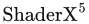, Charles River Media, 第 115–130 页, 2006。本书引用页：886, 887。

**[1421]** Pletinckx, Daniel，《作为计算机图形学基本工具的四元数演算》（Quaternion Calculus as a Basic Tool in Computer Graphics），The Visual Computer, 第 5 卷, 第 1 期, 第 2–13 页, 1989。本书引用页：102。

**[1422]** Pochanayon, Adisak，《在〈真人快打 X〉中捕获并可视化实时 GPU 性能》（Capturing and Visualizing RealTime GPU Performance in Mortal Kombat X），游戏开发者大会（Game Developers Conference）, 2016 年 3 月。本书引用页：790。

**[1423]** Pohl, Daniel, Gregory S. Johnson, and Timo Bolkart，《面向广角头戴式显示器的改进预变形》（Improved Pre-Warping for Wide Angle, Head Mounted Displays），载于 Proceedings of the 19th ACM Symposium on Virtual Reality Software and Technology, ACM, 第 259–262 页, 2013 年 10 月。本书引用页：628, 925, 926。

**[1424]** Policarpo, Fabio, Manuel M. Oliveira, and João L. D. Comba，《任意多边形表面上的实时浮雕映射》（Real-Time Relief Mapping on Arbitrary Polygonal Surfaces），载于 Proceedings of the 2005 Symposium on Interactive 3D Graphics and Games, ACM, 第 155–162 页, 2005 年 4 月。本书引用页：217, 218。

**[1425]** Policarpo, Fabio, and Manuel M. Oliveira，《非高度场表面细节的浮雕映射》（Relief Mapping of Non-Height-Field Surface Details），载于 Proceedings of the 2006 Symposium on Interactive 3D Graphics and Games, ACM, 第 55–62 页, 2006 年 3 月。本书引用页：566。

**[1426]** Policarpo, Fabio, and Manuel M. Oliveira，《浮雕映射的松弛圆锥步进》（Relaxed Cone Stepping for Relief Mapping），载于 Hubert Nguyen, 编, GPU Gems 3, Addison-Wesley, 第 409–428 页, 2007。本书引用页：219。

**[1427]** Pool, J., A. Lastra, and M. Singh，《GPU 上可变精度浮点缓冲区的无损压缩》（Lossless Compression of Variable-Precision Floating-Point Buffers on GPUs），载于 Proceedings of the ACM SIGGRAPH Symposium on Interactive 3D Graphics and Games, ACM, 第 47–54 页, 2012 年 3 月。本书引用页：1009, 1016。

**[1428]** Porcino, Nick，《〈失落的星球〉的并行渲染》（Lost Planet Parallel Rendering），Meshula.net 网站, 2007 年 10 月。本书引用页：538, 647。

**[1429]** Porter, Thomas, and Tom Duff，《数字图像合成》（Compositing Digital Images），Computer Graphics (SIGGRAPH ’84 Proceedings), 第 18 卷, 第 3 期, 第 253–259 页, 1984 年 7 月。本书引用页：149, 151, 153。

**[1430]** Pötzsch, Christian，《加速移动 VR 中基于 GPU 的桶形畸变校正》（Speeding up GPU Barrel Distortion Correction in Mobile VR），Imagination Blog, 2016 年 6 月 15 日。本书引用页：926。

**[1431]** Poynton, Charles，《数字视频与高清：算法和接口》（Digital Video and HD: Algorithms and Interfaces），第 2 版, Morgan Kaufmann, 2012。本书引用页：161, 163, 166。

**[1432]** Pranckevičius, Aras，《小型 G 缓冲区的紧凑法线存储》（Compact Normal Storage for Small G-Buffers），Aras’ 博客, 2010 年 3 月 25 日。本书引用页：715。

**[1433]** Pranckevičius, Aras, and Renaldas Zioma，《快速移动端着色器》（Fast Mobile Shaders），SIGGRAPH 工作室演讲（SIGGRAPH Studio Talk）, 2011 年 8 月。本书引用页：549, 803, 814。

**[1434]** Pranckevičius, Aras，《按深度粗略排序》（Rough Sorting by Depth），Aras’ 博客, 2014 年 1 月 16 日。本书引用页：803。

**[1435]** Pranckevičius, Aras, Jens Fursund, and Sam Martin，《Unity 中的高级光照技术》（Advanced Lighting Techniques in Unity），Unity DevDay, 游戏开发者大会（Game Developers Conference）, 2014 年 3 月。本书引用页：482。

**[1436]** Pranckevičius, Aras，《2014 年的跨平台着色器》（Cross Platform Shaders in 2014），Aras’ 博客, 2014 年 3 月 28 日。本书引用页：129。

**[1437]** Pranckevičius, Aras，《Unity 4.5 中的着色器编译》（Shader Compilation in Unity 4.5），Aras’ 博客, 2014 年 5 月 5 日。本书引用页：129。

**[1438]** Pranckevičius, Aras，《将 Unity 移植到新的 API》（Porting Unity to New APIs），SIGGRAPH 下一代 API 概览课程（SIGGRAPH An Overview of Next Generation APIs）, 2015 年 8 月。本书引用页：40, 806, 814。

**[1439]** Pranckevičius, Aras，《每一种可能的可扩展性极限都会被触及》（Every Possible Scalability Limit Will Be Reached），Aras’ 博客, 2017 年 2 月 5 日。本书引用页：128。

**[1440]** Pranckevičius, Aras，《字体渲染正变得有趣》（Font Rendering Is Getting Interesting），Aras’ 博客, 2017 年 2 月 15 日。本书引用页：677, 679。

**[1441]** Praun, Emil, Adam Finkelstein, and Hugues Hoppe，《搭接纹理》（Lapped Textures），载于 SIGGRAPH ’00: Proceedings of the 27th Annual Conference on Computer Graphics and Interactive Techniques, ACM Press/Addison-Wesley Publishing Co., 第 465–470 页, 2000 年 7 月。本书引用页：671。

**[1442]** Praun, Emil, Hugues Hoppe, Matthew Webb, and Adam Finkelstein，《实时排线》（Real-Time Hatching），载于 SIGGRAPH ’01 Proceedings of the 28th Annual Conference on Computer Graphics and Interactive Techniques, ACM, 第 581–586 页, 2001 年 8 月。本书引用页：670。

**[1443]** Preetham, Arcot J., Peter Shirley, and Brian Smitsc，《实用的日光解析模型》（A Practical Analytic Model for Daylight），载于 SIGGRAPH ’99: Proceedings of the 26th Annual Conference on Computer Graphics and Interactive Techniques, ACM Press/Addison-Wesley Publishing Co., 第 91–100 页, 1999 年 8 月。本书引用页：614。

**[1444]** Preparata, F. P., and M. I. Shamos，《计算几何导论》（Computational Geometry: An Introduction），Springer-Verlag, 1985。本书引用页：686, 967。

**[1445]** Preshing, Jeff，《育碧蒙特利尔如何为多核开发游戏：C++11 前后》（How Ubisoft Montreal Develops Games for Multicore—Before and After C++11），CppCon 2014, 2014 年 9 月。本书引用页：812, 815。

**[1446]** Press, William H., Saul A. Teukolsky, William T. Vetterling, and Brian P. Flannery，《C 语言数值计算方法》（Numerical Recipes in C），Cambridge University Press, 1992。本书引用页：948, 951, 957。

**[1447]** Proakis, John G., and Dimitris G. Manolakis，《数字信号处理：原理、算法与应用》（Digital Signal Processing: Principles, Algorithms, and Applications），第 4 版, Pearson, 2006。本书引用页：130, 133, 135, 136。

**[1448]** Purnomo, Budirijanto, Jonathan Bilodeau, Jonathan D. Cohen, and Subodh Kumar，《利用量化与简化实现硬件兼容的顶点压缩》（Hardware-Compatible Vertex Compression Using Quantization and Simplification），载于 Graphics Hardware 2005, Eurographics Association, 第 53–61 页, 2005 年 7 月。本书引用页：713。

**[1449]** Quidam，《Jade2 模型》（Jade2 model），由 wismo 发布, http://www.3dvia.com/wismo, 2017。本书引用页：653。

**[1450]** Quílez,Íñigo，《在 GPU 上以 4096 字节的光线追踪程序用两个三角形渲染世界》（Rendering Worlds with Two Triangles with Ray Tracing on the GPU in 4096 bytes），NVScene, 2008 年 8 月。本书引用页：454, 594, 752。

**[1451]** Quílez,Íñigo，《改进的纹理插值》（Improved Texture Interpolation），iquilezles.org, 2010。本书引用页：180。

**[1452]** Quílez,Íñigo，《正确的视锥体剔除》（Correct Frustum Culling），iquilezles.org, 2013。本书引用页：986。

**[1453]** Quílez,Íñigo，《高效的立体与 VR 渲染》（Efficient Stereo and VR Rendering），载于 Wolfgang Engel, 编,GPU Zen, Black Cat Publishing, 第 241–251 页, 2017。本书引用页：927, 928。

**[1454]** Ragan-Kelley, Jonathan, Charlie Kilpatrick, Brian W. Smith, and Doug Epps，《Lightspeed 自动交互式光照预览系统》（The Lightspeed Automatic Interactive Lighting Preview System），ACM Transactions on Graphics (SIGGRAPH 2007), 第 26 卷, 第 3 期, 25:1–25:11, 2007 年 7 月。本书引用页：547。

**[1455]** Ragan-Kelley, Jonathan, Jaakko Lehtinen, Jiawen Chen, Michael Doggett, and Frédo Durand，《图形流水线的解耦采样》（Decoupled Sampling for Graphics Pipelines），ACM Transactions on Graphics, 第 30 卷, 第 3 期, 第 17:1–17:17 页, 2011 年 5 月。本书引用页：910。

**[1456]** Rákos, Daniel，《利用分层渲染处理大量投射阴影的光源》（Massive Number of Shadow-Casting Lights with Layered Rendering），载于 Patrick Cozzi & Christophe Riccio, 编, OpenGL Insights, CRC Press, 第 259–278 页, 2012。本书引用页：246。

**[1457]** Rákos, Daniel，《可编程顶点拉取》（Programmable Vertex Pulling），载于 Patrick Cozzi & Christophe Riccio, 编, OpenGL Insights, CRC Press, 第 293–301 页, 2012。本书引用页：703。

**[1458]** Ramamoorthi, Ravi, and Pat Hanrahan，《辐照度环境贴图的高效表示》（An Efficient Representation for Irradiance Environment Maps），载于 SIGGRAPH ’01 Proceedings of the 28th Annual Conference on Computer Graphics and Interactive Techniques, ACM, 第 497–500 页, 2001 年 8 月。本书引用页：425, 427, 428, 429, 430。

**[1459]** Ramamoorthi, Ravi, and Pat Hanrahan，《频率空间中的环境贴图渲染》（Frequency Space Environment Map Rendering），ACM Transactions on Graphics, 第 21 卷, 第 3 期, 第 517–526 页, 2002。本书引用页：431。

**[1460]** Raskar, Ramesh, and Michael Cohen，《图像精度的轮廓边缘》（Image Precision Silhouette Edges），载于 Proceedings of the 1999 Symposium on Interactive 3D Graphics, ACM, 第 135–140 页, 1999。本书引用页：657, 658。

**[1461]** Raskar, Ramesh，《非真实感渲染的硬件支持》（Hardware Support for Non-photorealistic Rendering），载于 Graphics Hardware 2001, Eurographics Association, 第 41–46 页, 2001 年 8 月。本书引用页：658, 660。

**[1462]** Raskar, Ramesh, and Jack Tumblin，《计算摄影：掌握镜头、光照与传感器的新技术》（Computational Photography: Mastering New Techniques for Lenses, Lighting, and Sensors），A K Peters, Ltd., 2007。本书引用页：549。

**[1463]** Rasmusson, J., J. Hasselgren, and T. Akenine-Möller，《颜色缓冲区的精确压缩、解压缩及有误差界的近似压缩、解压缩》（Exact and Error-Bounded Approximate Color Buffer Compression and Decompression），载于 Graphics Hardware 2007, Eurographics Association, 第 41–48 页, 2007 年 8 月。本书引用页：997, 1009。

**[1464]** Rasmusson, J., J. Ström, and T. Akenine-Möller，《利用四叉树分解对浮点颜色缓冲区进行有误差界的有损压缩》（Error-Bounded Lossy Compression of Floating-Point Color Buffers Using Quadtree Decomposition），The Visual Computer, 第 26 卷, 第 1 期, 第 17–30 页, 2009。本书引用页：1009。

**[1465]** Ratcliff, John W.，《用于快速可见性剔除、光线追踪和范围搜索的球树》（Sphere Trees for Fast Visibility Culling, Ray Tracing, and Range Searching），载于 Mark DeLoura, 编, Game Programming Gems 2, Charles River Media, 第 384–387 页, 2001。本书引用页：821。

**[1466]** Rauwendaal, Randall, and Mike Bailey，《利用图形流水线的混合计算体素化》（Hybrid Computational Voxelization Using the Graphics Pipeline），Journal of Computer Graphics Techniques, 第 2 卷, 第 1 期, 第 15–37 页, 2013。本书引用页：582。

**[1467]** Ray, Nicolas, Vincent Nivoliers, Sylvain Lefebvre, and Bruno Lévy，《不可见的接缝》（Invisible Seams），载于 Proceedings of the 21st Eurographics Conference on Rendering, Eurographics Association, 第 1489–1496 页, 2010 年 6 月。本书引用页：486。

**[1468]** Reddy, Martin，《虚拟环境中受感知调节的细节层次》（Perceptually Modulated Level of Detail for Virtual Environments），博士学位论文，爱丁堡大学（University of Edinburgh）, 1997。本书引用页：864。

**[1469]** Reed, Nathan，《〈声名狼藉 2〉中的环境光遮蔽场与贴花》（Ambient Occlusion Fields and Decals in inFAMOUS 2），游戏开发者大会（Game Developers Conference）, 2012 年 3 月。本书引用页：452。

**[1470]** Reed, Nathan，《四边形插值，第 1 部分》（Quadrilateral Interpolation, Part 1），Nathan Reed 博客, 2012 年 5 月 26 日。本书引用页：688。

**[1471]** Reed, Nathan, and Dean Beeler，《VR Direct：NVIDIA 技术如何改善 VR 体验》（VR Direct: How NVIDIA Technology Is Improving the VR Experience），游戏开发者大会（Game Developers Conference）, 2015 年 3 月。本书引用页：928, 936, 937, 938。

**[1472]** Reed, Nathan，《深度精度可视化》（Depth Precision Visualized），Nathan Reed 博客, 2015 年 7 月 3 日。本书引用页：100, 1014。

**[1473]** Reed, Nathan，《GameWorks VR》（GameWorks VR），SIGGRAPH, 2015 年 8 月。本书引用页：927, 928, 929。

**[1474]** Reeves, William T.，《粒子系统：一类模糊物体的建模技术》（Particle Systems—A Technique for Modeling a Class of Fuzzy Objects），ACM Transactions on Graphics, 第 2 卷, 第 2 期, 第 91–108 页, 1983 年 4 月。本书引用页：567。

**[1475]** Reeves, William T., David H. Salesin, and Robert L. Cook，《使用深度图渲染抗锯齿阴影》（Rendering Antialiased Shadows with Depth Maps），Computer Graphics (SIGGRAPH ’87 Proceedings), 第 21 卷, 第 4 期, 第 283–291 页, 1987 年 7 月。本书引用页：247。

**[1476]** Rege, Ashu，《〈地铁 2033：最后的避难所〉中的 DX11 效果》（DX11 Effects in Metro 2033: The Last Refuge），游戏开发者大会（Game Developers Conference）, 2010 年 3 月。本书引用页：535。

**[1477]** Reimer, Jeremy，《Valve 迈向多核》（Valve Goes Multicore），ars technica 网站, 2006 年 11 月 5 日。本书引用页：812。

**[1478]** Reinhard, Erik, Mike Stark, Peter Shirley, and James Ferwerda，《数字图像的摄影式色调再现》（Photographic Tone Reproduction for Digital Images），ACM Transactions on Graphics (SIGGRAPH 2002), 第 21 卷, 第 3 期, 第 267–276 页, 2002 年 7 月。本书引用页：286, 288。

**[1479]** Reinhard, Erik, Greg Ward, Sumanta Pattanaik, and Paul Debevec，《高动态范围成像：采集、显示与基于图像的光照》（High Dynamic Range Imaging: Acquisition, Display, and Image-Based Lighting），Morgan Kaufmann, 2006。本书引用页：406, 435。

**[1480]** Reinhard, Erik, Erum Arif Khan, Ahmet Oguz Akyüz, and Garrett Johnson，《彩色成像：基础与应用》（Color Imaging: Fundamentals and Applications），A K Peters, Ltd., 2008。本书引用页：291。

**[1481]** Reis, Aurelio，《具有逐像素光照和光散射的烟雾》（Per-Pixel Lit, Light Scattering Smoke），载于 Wolfgang Engel, 编, , Charles River Media, 第 287–294 页, 2006。本书引用页：569。

**[1482]** Ren, Zhong Ren, Rui Wang, John Snyder, Kun Zhou, Xinguo Liu, Bo Sun, Peter-Pike Sloan, Hujun Bao, Qunsheng Peng, and Baining Guo，《利用球谐指数运算实现动态场景中的实时软阴影》（Real-Time Soft Shadows in Dynamic Scenes Using Spherical Harmonic Exponentiation），ACM Transactions on Graphics (SIGGRAPH 2006), 第 25 卷, 第 3 期, 第 977–986 页, 2006 年 7 月。本书引用页：456, 458, 467。

**[1483]** Reshetov, Alexander，《形态学抗锯齿》（Morphological Antialiasing），载于 High-Performance Graphics 2009, Eurographics Association, 第 109–116 页, 2009 年 8 月。本书引用页：146。

**[1484]** Reshetov, Alexander，《通过重采样减少走样伪影》（Reducing Aliasing Artifacts through Resampling），载于 High-Performance Graphics 2012, Eurographics Association, 第 77–86 页, 2012 年 6 月。本书引用页：148。

**[1485]** Reshetov, Alexander, and David Luebke，《无限分辨率纹理》（Infinite Resolution Textures），载于 High-Performance Graphics 2016, Eurographics Association, 第 139–150 页, 2016 年 6 月。本书引用页：677。

**[1486]** Reshetov, Alexander, and Jorge Jimenez，《2009 年至 2017 年的 MLAA》（MLAA from 2009 to 2017），High-Performance Graphics 研究影响回顾, 2017 年 7 月。本书引用页：143, 146, 148, 165。

**[1487]** Reuter, Patrick, Johannes Behr, and Marc Alexa，《用于快速构建三角形带的改进邻接数据结构》（An Improved Adjacency Data Structure for Fast Triangle Stripping），journal of graphics tools, 第 10 卷, 第 2 期, 第 41–50 页, 2016。本书引用页：692。

**[1488]** Revet, Burke, and Jon Riva，《庞大僵尸群的多样性与切割》（Immense Zombie Horde Variety and Slicing），游戏开发者大会（Game Developers Conference）, 2014 年 3 月。本书引用页：366。

**[1489]** Revie, Donald，《利用延迟着色实现毛皮》（Implementing Fur Using Deferred Shading），载于 Wolfgang Engel, 编, , A K Peters/CRC Press, 第 57–75 页, 2011。本书引用页：424。

**[1490]** Rhodes, Graham，《三维线段的快速稳健求交》（Fast, Robust Intersection of 3D Line Segments），载于 Mark DeLoura, 编, Game Programming Gems 2, Charles River Media, 第 191–204 页, 2001。本书引用页：990。

**[1491]** Ribardière, Mickaël, Benjamin Bringier, Daniel Meneveaux, and Lionel Simonot，《STD：基于微表面的 BSDF 所用斜率的 Student t 分布》（STD: Student’s t-Distribution of Slopes for Microfacet Based BSDFs），Computer Graphics Forum, 第 36 卷, 第 2 期, 第 421–429 页, 2017。本书引用页：343。

**[1492]** Rideout, Philip，《轮廓提取》（Silhouette Extraction），The Little Grasshopper 博客, 2010 年 10 月 24 日。本书引用页：47, 668。

**[1493]** Rideout, Philip, and Dirk Van Gelder，《曲面细分着色器入门》（An Introduction to Tessellation Shaders），载于 Patrick Cozzi & Christophe Riccio, 编, OpenGL Insights, CRC Press, 第 87–104 页, 2012。本书引用页：44, 46。

**[1494]** Riguer, Guennadi，《使用 DirectX 9.0 的 ATI 图形硬件性能优化技术》（Performance Optimization Techniques for ATI Graphics Hardware with DirectX 9.0），ATI 白皮书, 2002。本书引用页：702。

**[1495]** Riguer, Guennadi，《LiquidVR 的今天与明天》（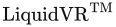 Today and Tomorrow），游戏开发者大会（Game Developers Conference）, 2016 年 3 月。本书引用页：928。

**[1496]** Ring, Kevin，《在万维网上渲染整个广阔世界》（Rendering the Whole Wide World on the World Wide Web），在 Analytical Graphics, Inc. 的讲座, 2013 年 12 月。本书引用页：708。

**[1497]** Risser, Eric, Musawir Shah, and Sumanta Pattanaik，《利用割线法加速浮雕映射》（Faster Relief Mapping Using the Secant Method），journal of graphics tools, 第 12 卷, 第 3 期, 第 17–24 页, 2007。本书引用页：218。

**[1498]** Ritschel, T., T. Grosch, M. H. Kim, H.-P. Seidel, C. Dachsbacher, and J. Kautz，《用于高效计算间接光照的不完美阴影贴图》（Imperfect Shadow Maps for Efficient Computation of Indirect Illumination），ACM Transactions on Graphics, 第 27 卷, 第 5 期, 第 129:1–129:8 页, 2008。本书引用页：492, 578。

**[1499]** Ritschel, Tobias, Thorsten Grosch, and Hans-Peter Seidel，《在图像空间中近似动态全局光照》（Approximating Dynamic Global Illumination in Image Space），载于 Proceedings of the 2009 Symposium on Interactive 3D Graphics and Games, ACM, 第 75–82 页, 2009。本书引用页：496。

**[1500]** Ritter, Jack，《高效的包围球》（An Efficient Bounding Sphere），载于 Andrew S. Glassner, 编, Graphics Gems, Academic Press, 第 301–303 页, 1990。本书引用页：950。

**[1501]** Robbins, Steven, and Sue Whitesides，《论三维三角形求交的可靠性》（On the Reliability of Triangle Intersection in 3D），载于 International Conference on Computational Science and Its Applications, Springer, 第 923–930 页, 2003。本书引用页：974。

**[1502]** Robinson, Alfred C.，《论四元数在刚体运动仿真中的应用》（On the Use of Quaternions in Simulation of Rigid-Body Motion），技术报告 58-17, Wright Air Development Center, 1958 年 12 月。本书引用页：76。

**[1503]** Rockenbeck, Bill，《〈声名狼藉：次子〉的粒子系统架构》（The inFAMOUS: Second Son Particle System Architecture），游戏开发者大会（Game Developers Conference）, 2014 年 3 月。本书引用页：568, 569, 571。

**[1504]** Rockwood, Alyn, and Peter Chambers，《交互式曲线与曲面：计算机辅助几何设计的多媒体教程》（Interactive Curves and Surfaces: A Multimedia Tutorial on CAGD），Morgan Kaufmann, 1996。本书引用页：718。

**[1505]** Rogers, David F.，《计算机图形学的过程式要素》（Procedural Elements for Computer Graphics），第 2 版, McGraw-Hill, 1998。本书引用页：685。

**[1506]** Rogers, David F.，《NURBS 导论：兼论历史沿革》（An Introduction to NURBS: With Historical Perspective），Morgan Kaufmann, 2000。本书引用页：781。

**[1507]** Rohleder, Pawel, and Maciej Jamrozik，《带有体积光线的阳光》（Sunlight with Volumetric Light Rays），载于 Wolfgang Engel, 编, , Charles River Media, 第 325–330 页, 2008。本书引用页：604。

**[1508]** Rohlf, J., and J. Helman，《IRIS Performer：面向实时三维图形的高性能多处理工具包》（IRIS Performer: A High Performance Multiprocessing Toolkit for Real-Time 3D Graphics），载于 SIGGRAPH ’94: Proceedings of the 21st Annual Conference on Computer Graphics and Interactive Techniques, ACM, 第 381–394 页, 1994 年 7 月。本书引用页：807, 809, 861。

**[1509]** Rosado, Gilberto，《作为后处理效果的运动模糊》（Motion Blur as a Post-Processing Effect），载于 Hubert Nguyen, 编, GPU Gems 3, Addison-Wesley, 第 575–581 页, 2007。本书引用页：538。

**[1510]** Rossignac, J., and M. van Emmerik, M.，《帧缓冲区上的隐藏轮廓》（Hidden Contours on a Frame-Buffer），载于 Proceedings of the Seventh Eurographics Conference on Graphics Hardware, Eurographics Association, 第 188–204 页, 1992 年 9 月。本书引用页：657。

**[1511]** Rossignac, Jarek, and Paul Borrel，《用于渲染复杂场景的多分辨率三维近似》（Multi-resolution 3D Approximations for Rendering Complex Scenes），载于 Bianca Falcidieno & Tosiyasu L. Kunii, 编 《计算机图形学中的建模：方法与应用》（Modeling in Computer Graphics: Methods and Applications）, Springer-Verlag, 第 455–465 页, 1993。本书引用页：709。

**[1512]** Rost, Randi J., Bill Licea-Kane, Dan Ginsburg, John Kessenich, Barthold Lichtenbelt, Hugh Malan, and Mike Weiblen，《OpenGL 着色语言》（OpenGL Shading Language），第 3 版, Addison-Wesley, 2009。本书引用页：55, 200。

**[1513]** Roth, Marcus, and Dirk Reiners，《排序流水线图像合成》（Sorted Pipeline Image Composition），载于 Eurographics Symposium on Parallel Graphics and Visualization, Eurographics Association, 第 119–126 页, 2006。本书引用页：1020, 1022。

**[1514]** Röttger, Stefan, Alexander Irion, and Thomas Ertl，《重访阴影体》（Shadow Volumes Revisited），Journal of WSCG (第 10 届中欧计算机图形学、可视化与计算机视觉国际会议（10th International Conference in Central Europe on Computer Graphics, Visualization and Computer Vision）), 第 10 卷, 第 1–3 期, 第 373–379 页, 2002 年 2 月。本书引用页：232。

**[1515]** Rougier, Nicolas P.，《更高质量的二维文本渲染》（Higher Quality 2D Text Rendering），Journal of Computer Graphics Techniques, 第 1 卷, 第 4 期, 第 50–64 页, 2013。本书引用页：676, 677。

**[1516]** Rougier, Nicolas P.，《基于着色器的抗锯齿虚线描边折线》（Shader-Based Antialiased, Dashed, Stroked Polylines），Journal of Computer Graphics Techniques, 第 2 卷, 第 2 期, 第 105–121 页, 2013。本书引用页：669。

**[1517]** de Rousiers, Charles, and Matt Pettineo，《带散景渲染的景深》（Depth of Field with Bokeh Rendering），载于 Patrick Cozzi & Christophe Riccio, 编, OpenGL Insights, CRC Press, 第 205–218 页, 2012。本书引用页：531, 536。

**[1518]** Ruijters, Daniel, Bart M. ter Haar Romeny, and Paul Suetens，《利用均匀 B 样条在 GPU 上进行高效纹理插值》（Efficient GPU-Based Texture Interpolation Using Uniform B-Splines），Journal of Graphics, GPU, and Game Tools, 第 13 卷, 第 4 期, 第 61–69 页, 2008。本书引用页：180, 733, 734。

**[1519]** Rusinkiewicz, Szymon, and Marc Levoy，《QSplat：面向大型网格的多分辨率点渲染系统》（QSplat: A Multiresolution Point Rendering System for Large Meshes），载于 SIGGRAPH ’00: Proceedings of the 27th Annual Conference on Computer Graphics and Interactive Techniques, ACM Press/Addison-Wesley Publishing Co., 第 343–352 页, 2000 年 7 月。本书引用页：573。

**[1520]** Rusinkiewicz, Szymon, Michael Burns, and Doug DeCarlo，《用于表现形状与细节的夸张着色》（Exaggerated Shading for Depicting Shape and Detail），ACM Transactions on Graphics, 第 25 卷, 第 3 期, 第 1199–1205 页, 2006 年 7 月。本书引用页：654。

**[1521]** Rusinkiewicz, Szymon, Forrester Cole, Doug DeCarlo, and Adam Finkelstein，SIGGRAPH《从三维模型生成线条画》（Line Drawings from 3D Models）课程, 2008 年 8 月。本书引用页：656, 678。

**[1522]** Ruskin, Elan，《〈日落过载〉开放世界的流式加载》（Streaming Sunset Overdrive’s Open World），游戏开发者大会（Game Developers Conference）, 2015 年 3 月。本书引用页：871。

**[1523]** Ryu, David，《五亿且仍在增加：〈料理鼠王〉的毛发渲染》（500 Million and Counting: Hair Rendering on Ratatouille），Pixar 技术备忘录 07-09, 2007 年 5 月。本书引用页：648。

**[1524]** 《S3TC DirectX 6.0 标准纹理压缩》（S3TC DirectX 6.0 Standard Texture Compression），S3 Inc. 网站, 1998。本书引用页：192。

**[1525]** Sadeghi, Iman, Heather Pritchett, Henrik Wann Jensen, and Rasmus Tamstorf，《美术人员友好的毛发着色系统》（An Artist Friendly Hair Shading System），载于 ACM SIGGRAPH 2010 论文集（ACM SIGGRAPH 2010 Papers）, ACM, 文章编号 56, 2010 年 7 月。本书引用页：359, 644。

**[1526]** Sadeghi, Iman, Oleg Bisker, Joachim De Deken, and Henrik Wann Jensen，《用于布料渲染的实用微圆柱外观模型》（A Practical Microcylinder Appearance Model for Cloth Rendering），ACM Transactions on Graphics, 第 32 卷, 第 2 期, 第 14:1–14:12 页, 2013 年 4 月。本书引用页：359。

**[1527]** Safdar, Muhammad, Guihua Cui, Youn Jin Kim, and Ming Ronnier Luo，《用于包含高动态范围与宽色域的图像信号的感知均匀颜色空间》（Perceptually Uniform Color Space for Image Signals Including High Dynamic Range and Wide Gamut），Optics Express, 第 25 卷, 第 13 期, 第 15131–15151 页, 2017 年 6 月。本书引用页：276。

**[1528]** Saito, Takafumi, and Tokiichiro Takahashi，《易于理解的三维形状渲染》（Comprehensible Rendering of 3-D Shapes），Computer Graphics (SIGGRAPH ’90 Proceedings), 第 24 卷, 第 4 期, 第 197–206 页, 1990 年 8 月。本书引用页：661, 883, 884。

**[1529]** Salvi, Marco，《利用指数阴影贴图渲染经过滤波的阴影》（Rendering Filtered Shadows with Exponential Shadow Maps），载于 Wolfgang Engel, 编, , Charles River Media, 第 257–274 页, 2008。本书引用页：256。

**[1530]** Salvi, Marco，《阴影贴图滤波的概率方法》（Probabilistic Approaches to Shadow Maps Filtering），游戏开发者大会（Game Developers Conference）, 2008 年 2 月。本书引用页：256。

**[1531]** Salvi, Marco, Kiril Vidimče, Andrew Lauritzen, and Aaron Lefohn，《自适应体积阴影贴图》（Adaptive Volumetric Shadow Maps），Computer Graphics Forum, 第 29 卷, 第 4 期, 第 1289–1296 页, 2010。本书引用页：258, 570。

**[1532]** Salvi, Marco, and Karthik Vaidyanathan，《多层 Alpha 混合》（Multi-layer Alpha Blending），载于 Proceedings of the 18th ACM SIGGRAPH Symposium on Interactive 3D Graphics and Games, ACM, 第 151–158 页, 2014。本书引用页：156, 642。

**[1533]** Salvi, Marco，《时间超采样探索》（An Excursion in Temporal Supersampling），游戏开发者大会（Game Developers Conference）, 2016 年 3 月。本书引用页：143。

**[1534]** Salvi, Marco，《深度学习：实时渲染的未来？》（Deep Learning: The Future of Real-Time Rendering?），SIGGRAPH 实时渲染中的开放问题课程（SIGGRAPH Open Problems in Real-Time Rendering）, 2017 年 8 月。本书引用页：1043。

**[1535]** Samet, Hanan，《空间数据结构的应用：计算机图形学、图像处理与 GIS》（Applications of Spatial Data Structures: Computer Graphics, Image Processing and GIS），Addison-Wesley, 1989。本书引用页：825。

**[1536]** Samet, Hanan，《空间数据结构的设计与分析》（The Design and Analysis of Spatial Data Structures），Addison-Wesley, 1989。本书引用页：825。

**[1537]** Samosky, Joseph，《SectionView：交互式指定并可视化三维医学图像数据截面的系统》（SectionView: A System for Interactively Specifying and Visualizing Sections through Three-Dimensional Medical Image Data），理学硕士学位论文，麻省理工学院电气工程与计算机科学系（Department of Electrical Engineering and Computer Science, Massachusetts Institute of Technology）, 1993。本书引用页：969。

**[1538]** Sanchez, Bonet, Jose Luis, and Tomasz Stachowiak，《解决现代延迟渲染引擎中的一些常见问题》（Solving Some Common Problems in a Modern Deferred Rendering Engine），Develop 大会（Develop conference）, 2012 年 7 月。本书引用页：570。

**[1539]** Sander, Pedro V., Xianfeng Gu, Steven J. Gortler, Hugues Hoppe, and John Snyder，《轮廓裁剪》（Silhouette Clipping），载于 SIGGRAPH ’00: Proceedings of the 27th Annual Conference on Computer Graphics and Interactive Techniques, ACM Press/Addison-Wesley Publishing Co., 第 327–334 页, 2000 年 7 月。本书引用页：667。

**[1540]** Sander, Pedro V., John Snyder, Steven J. Gortler, and Hugues Hoppe，《渐进网格的纹理映射》（Texture Mapping Progressive Meshes），载于 SIGGRAPH ’01 Proceedings of the 28th Annual Conference on Computer Graphics and Interactive Techniques, ACM, 第 409–416 页, 2001 年 8 月。本书引用页：710。

**[1541]** Sander, Pedro V., David Gosselin, and Jason L. Mitchell，《图形硬件上的实时皮肤渲染》（Real-Time Skin Rendering on Graphics Hardware），载于 ACM SIGGRAPH 2004 短篇报告集（ACM SIGGRAPH 2004 Sketches）, ACM, 第 148 页, 2004 年 8 月。本书引用页：635。

**[1542]** Sander, Pedro V., Natalya Tatarchuk, and Jason L. Mitchell，《用于高效流体流动模拟的显式 Early-Z 剔除》（Explicit Early-Z Culling for Efficient Fluid Flow Simulation），载于 Wolfgang Engel, 编, , Charles River Media, 第 553–564 页, 2006。本书引用页：53, 1016。

**[1543]** Sander, Pedro V., and Jason L. Mitchell，《渐进缓冲区：与视点相关的几何和纹理 LOD 渲染》（Progressive Buffers: View-Dependent Geometry and Texture LOD Rendering），SIGGRAPH 三维图形与游戏中的高级实时渲染课程（SIGGRAPH Advanced Real-Time Rendering in 3D Graphics and Games）, 2006 年 8 月。本书引用页：860。

**[1544]** Sander, Pedro V., Diego Nehab, and Joshua Barczak，《快速重排三角形以提高顶点局部性并减少过度绘制》（Fast Triangle Reordering for Vertex Locality and Reduced Overdraw），ACM Transactions on Graphics, 第 26 卷, 第 3 期, 第 89:1–89:9 页, 2007。本书引用页：701。

**[1545]** Sathe, Rahul P.，《通过可变精度像素着色提高能效》（Variable Precision Pixel Shading for Improved Power Efficiency），载于 Eric Lengyel, 编, Game Engine Gems 3, CRC Press, 第 101–109 页, 2016。本书引用页：814。

**[1546]** Scandolo, Leonardo, Pablo Bauszat, and Elmar Eisemann，《用于阴影贴图压缩的合并多分辨率层次结构》（Merged Multiresolution Hierarchies for Shadow Map Compression），Computer Graphics Forum, 第 35 卷, 第 7 期, 第 383–390 页, 2016。本书引用页：264。

**[1547]** Schäfer, H., J. Raab, B. Keinert, M. Meyer, M. Stamminger, and M. Nießner，《动态特征自适应细分》（Dynamic Feature-Adaptive Subdivision），载于 Proceedings of the 19th Symposium on Interactive 3D Graphics and Games, ACM, 第 31–38 页, 2014。本书引用页：779。

**[1548]** Schander, Thomas, and Clemens Musterle，《利用混合延迟方法进行实时路径追踪》（Real-Time Path Tracing Using a Hybrid Deferred Approach），GPU 技术大会（GPU Technology Conference）, 2017 年 10 月 18 日。本书引用页：510。

**[1549]** Schaufler, G., and W. Stürzlinger，《用于虚拟现实的三维图像缓存》（A Three Dimensional Image Cache for Virtual Reality），Computer Graphics Forum, 第 15 卷, 第 3 期, 第 227–236 页, 1996。本书引用页：561, 562。

**[1550]** Schaufler, Gernot，《钉板：用于动态场景图像缓存的渲染图元》（Nailboards: A Rendering Primitive for Image Caching in Dynamic Scenes），载于 Rendering Techniques ’97, Springer, 第 151–162 页, 1997 年 6 月。本书引用页：564, 565。

**[1551]** Schaufler, Gernot，《利用分层替身进行逐物体图像变形》（Per-Object Image Warping with Layered Impostors），载于 Rendering Techniques ’98, Springer, 第 145–156 页, 1998 年 6—7 月。本书引用页：565。

**[1552]** Scheib, Vincent，《利用 DirectX 命令缓冲区进行并行渲染》（Parallel Rendering with DirectX Command Buffers），Beautiful Pixels 博客, 2008 年 7 月 22 日。本书引用页：814。

**[1553]** Scheiblauer, Claus，《与巨型点云的交互》（Interactions with Gigantic Point Clouds），博士学位论文，维也纳工业大学（Vienna University of Technology）, 2016。本书引用页：575。

**[1554]** Schertenleib, Sebastien，《多线程三维渲染器》（A Multithreaded 3D Renderer），载于 Eric Lengyel, 编, Game Engine Gems, Jones and Bartlett, 第 139–147 页, 2010。本书引用页：814。

**[1555]** Scherzer, Daniel，《适用于大型环境的稳健阴影贴图》（Robust Shadow Maps for Large Environments），Central European Seminar on Computer Graphics, 2005 年 5 月。本书引用页：242。

**[1556]** Scherzer, D., S. Jeschke, and M. Wimmer，《利用时间重投影和阴影测试置信度实现像素正确的阴影贴图》（Pixel-Correct Shadow Maps with Temporal Reprojection and Shadow Test Confidence），载于 Proceedings of the 18th Eurographics Symposium on Rendering Techniques, Eurographics Association, 第 45–50 页, 2007。本书引用页：522, 523。

**[1557]** Scherzer, D., and M. Wimmer，《用于离散细节层次渲染的逐帧插值》（Frame Sequential Interpolation for Discrete Level-of-Detail Rendering），Computer Graphics Forum, 第 27 卷, 第 4 期, 1175–1181, 2008。本书引用页：856。

**[1558]** Scherzer, Daniel, Michael Wimmer, and Werner Purgathofer，《实时硬阴影映射方法综述》（A Survey of Real-Time Hard Shadow Mapping Methods），Computer Graphics Forum, 第 30 卷, 第 1 期, 第 169–186 页, 2011。本书引用页：265。

**[1559]** Scherzer, D., L. Yang, O. Mattausch, D. Nehab, P. Sander, M. Wimmer, and E. Eisemann，《实时渲染中的时间相干性方法综述》（A Survey on Temporal Coherence Methods in Real-Time Rendering），Computer Graphics Forum, 第 31 卷, 第 8 期, 第 2378–2408 页, 2011。本书引用页：523。

**[1560]** Scheuermann, Thorsten，《实用的实时毛发渲染与着色》（Practical Real-Time Hair Rendering and Shading），载于 ACM SIGGRAPH 2004 短篇报告集（ACM SIGGRAPH 2004 Sketches）, ACM, 第 147 页, 2004 年 8 月。本书引用页：641, 644, 645。

**[1561]** Schied, Christoph, and Carsten Dachsbacher，《利用延迟属性插值实现节省内存的延迟着色》（Deferred Attribute Interpolation for Memory-Efficient Deferred Shading），载于 Proceedings of the 7th Conference on High-Performance Graphics, ACM, 第 43–49 页, 2015 年 8 月。本书引用页：907。

**[1562]** Schied, Christoph, and Carsten Dachsbacher，《延迟属性插值着色》（Deferred Attribute Interpolation Shading），载于 Wolfgang Engel, 编, , CRC Press, 第 83–96 页, 2016。本书引用页：907。

**[1563]** Schied, Christoph, Anton Kaplanyan, Chris Wyman, Anjul Patney, Chakravarty R. Alla Chaitanya, John Burgess, Shiqiu Liu, Carsten Dachsbacher, and Aaron Lefohn，《时空方差引导滤波：路径追踪全局光照的实时重建》（Spatiotemporal Variance-Guided Filtering: Real-Time Reconstruction for Path-Traced Global Illumination），High Performance Graphics, 2017 年 7 月。本书引用页：511。

**[1564]** Schilling, Andreas, G. Knittel, and Wolfgang Straßer，《Texram：用于纹理处理的智能存储器》（Texram: A Smart Memory for Texturing），IEEE Computer Graphics and Applications, 第 16 卷, 第 3 期, 第 32–41 页, 1996 年 5 月。本书引用页：189。

**[1565]** Schilling, Andreas，《环境贴图的抗锯齿》（Antialiasing of Environment Maps），Computer Graphics Forum, 第 20 卷, 第 1 期, 第 5–11 页, 2001。本书引用页：372。

**[1566]** Schlag, John，《利用几何构造和四元数对朝向进行插值》（Using Geometric Constructions to Interpolate Orientations with Quaternions），载于 James Arvo, 编, Graphics Gems II, Academic Press, 第 377–380 页, 1991。本书引用页：102。

**[1567]** Schlag, John，《光栅图像数据上的快速浮雕效果》（Fast Embossing Effects on Raster Image Data），载于 Paul S. Heckbert, 编, Graphics Gems IV, Academic Press, 第 433–437 页, 1994。本书引用页：211。

**[1568]** Schlick, Christophe，《用于基于物理渲染的低成本 BRDF 模型》（An Inexpensive BRDF Model for Physically Based Rendering），Computer Graphics Forum, 第 13 卷, 第 3 期, 第 149–162 页, 1994。本书引用页：320, 351。

**[1569]** Schmalstieg, Dieter, and Robert F. Tobler，《快速计算三维包围盒的投影面积》（Fast Projected Area Computation for Three-Dimensional Bounding Boxes），journal of graphics tools, 第 4 卷, 第 2 期, 第 37–43 页, 1999. 亦收录于文献 [112]。本书引用页：863。

**[1570]** Schmalstieg, Dieter, and Tobias Hollerer，《增强现实：原理与实践》（Augmented Reality: Principles and Practice），Addison-Wesley, 2016。本书引用页：917, 940。

**[1571]** Schmittler, J. I. Wald, and P. Slusallek，《SaarCOR：光线追踪硬件架构》（SaarCOR: A Hardware Architecture for Ray Tracing），载于 Graphics Hardware 2002, Eurographics Association, 第 27–36 页, 2002 年 9 月。本书引用页：1039。

**[1572]** Schneider, Andrew, and Nathan Vos，《Nubis：利用 Decima 引擎创作实时体积云景》（Nubis: Authoring Realtime Volumetric Cloudscapes with the Decima Engine），SIGGRAPH 游戏实时渲染进展课程（SIGGRAPH Advances in Real-Time Rendering in Games）, 2017 年 8 月。本书引用页：619, 620。

**[1573]** Schneider, Jens, and Rüdiger Westermann，《GPU 友好的高质量地形渲染》（GPU-Friendly High-Quality Terrain Rendering），Journal of WSCG, 第 14 卷, 第 1-3 期, 第 49–56 页, 2006。本书引用页：879。

**[1574]** Schneider, Philip, and David Eberly，《计算机图形学的几何工具》（Geometric Tools for Computer Graphics），Morgan Kaufmann, 2003。本书引用页：685, 686, 716, 950, 966, 981, 987, 991。

**[1575]** Schollmeyer, Andre, Andrey Babanin, and Bernd Fro，《可编程延迟着色流水线的顺序无关透明》（Order-Independent Transparency for Programmable Deferred Shading Pipelines），Computer Graphics Forum, 第 34 卷, 第 7 期, 第 67–76 页, 2015。本书引用页：887。

**[1576]** Schorn, Peter, and Frederick Fisher，《检测多边形的凸性》（Testing the Convexity of Polygon），载于 Paul S. Heckbert, 编, Graphics Gems IV, Academic Press, 第 7–15 页, 1994。本书引用页：686。

**[1577]** Schott, Mathias, Vincent Pegoraro, Charles Hansen, Kévin Boulanger, and Kadi Bouatouch，《用于交互式直接体渲染的方向遮蔽着色模型》（A Directional Occlusion Shading Model for Interactive Direct Volume Rendering），载于 EuroVis’09, Eurographics Association, 第 855–862 页, 2009。本书引用页：607。

**[1578]** Schott, Mathias, A. V. Pascal Grosset, Tobias Martin, Vincent Pegoraro, Sean T. Smith, and Charles D. Hansen，《交互式直接体渲染的景深效果》（Depth of Field Effects for Interactive Direct Volume Rendering），Computer Graphics Forum, 第 30 卷, 第 3 期, 第 941–950 页, 2011。本书引用页：607。

**[1579]** Schröder, Peter, and Wim Sweldens，《球面小波：高效表示球面上的函数》（Spherical Wavelets: Efficiently Representing Functions on the Sphere），载于 SIGGRAPH ’95: Proceedings of the 22nd Annual Conference on Computer Graphics and Interactive Techniques, ACM, 第 161–172 页, 1995 年 8 月。本书引用页：402。

**[1580]** Schröder, Peter，《我们能测量什么？》（What Can We Measure?），SIGGRAPH 离散微分几何课程（SIGGRAPH Discrete Differential Geometry）, 2006 年 8 月。本书引用页：954。

**[1581]** Schroders, M. F. A., and R. V. Gulik，《四叉树浮雕映射》（Quadtree Relief Mapping），载于 Graphics Hardware 2006, Eurographics Association, 第 61–66 页, 2006 年 9 月。本书引用页：220。

**[1582]** Schroeder, Tim，《利用射线投射进行碰撞检测》（Collision Detection Using Ray Casting），Game Developer, 第 8 卷, 第 8 期, 第 50–56 页, 2001 年 8 月。本书引用页：976。

**[1583]** Schuetz, Markus，《Potree：在 Web 浏览器中渲染大型点云》（Potree: Rendering Large Point Clouds in Web Browsers），可视计算专业毕业论文，维也纳工业大学（Vienna University of Technology）, 2016。本书引用页：574, 575, 576。

**[1584]** Schüler, Christian，《无需预计算切线的法线映射》（Normal Mapping without Precomputed Tangents），载于 Wolfgang Engel, 编, , Charles River Media, 第 131–140 页, 2006。本书引用页：210。

**[1585]** Schüler, Christian，《梯度阴影贴图的多重采样扩展》（Multisampling Extension for Gradient Shadow Maps），载于 Wolfgang Engel, 编, , Charles River Media, 第 207–218 页, 2006。本书引用页：250。

**[1586]** Schüler, Christian，《高效且物理上合理的实时着色模型》（An Efficient and Physically Plausible Real Time Shading Model），载于 Wolfgang Engel, 编, , Charles River Media, 第 175–187 页, 2009。本书引用页：325。

**[1587]** Schüler, Christian，《用于大气散射的 Chapman 掠入射函数近似》（An Approximation to the Chapman Grazing-Incidence Function for Atmospheric Scattering），载于 Wolfgang Engel, 编, 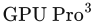, CRC Press, 第 105–118 页, 2012。本书引用页：616。

**[1588]** Schüler, Christian，《无分支的矩阵到四元数转换》（Branchless Matrix to Quaternion Conversion），The Tenth Planet 博客, 2012 年 8 月 7 日。本书引用页：81。

**[1589]** Schulz, Nicolas，《迈向下一代：〈Ryse〉的渲染技术》（Moving to the Next Generation—The Rendering Technology of Ryse），游戏开发者大会（Game Developers Conference）, 2014 年 3 月。本书引用页：371, 506, 892, 893, 904。

**[1590]** Schulz, Nicolas, and Theodor Mader，《〈Ryse：罗马之子〉中的渲染技术》（Rendering Techniques in Ryse: Son of Rome），SIGGRAPH 游戏实时渲染进展课程（SIGGRAPH Advances in Real-Time Rendering in Games）, 2014 年 8 月。本书引用页：234, 245, 246, 251, 252, 569, 864。

**[1591]** Schulz, Nicolas，《CRYENGINE 手册》（CRYENGINE Manual），Crytek GmbH, 2016。本书引用页：111, 113, 631。

**[1592]** Schumacher, Dale A.，《通用滤波图像缩放》（General Filtered Image Rescaling），载于 David Kirk, 编, Graphics Gems III, Academic Press, 第 8–16 页, 1992。本书引用页：184。

**[1593]** Schwarz, Michael, and Marc Stamminger，《位掩码软阴影》（Bitmask Soft Shadows），Computer Graphics Forum, 第 26 卷, 第 3 期, 第 515–524 页, 2007。本书引用页：252。

**[1594]** Schwarz, Michael, and Hans-Peter Seidel，《GPU 上快速并行的表面与实体体素化》（Fast Parallel Surface and Solid Voxelization on GPUs），ACM Transactions on Graphics, 第 29 卷, 第 6 期, 第 179:1–179:10 页, 2010 年 12 月。本书引用页：581。

**[1595]** Schwarz, Michael，《使用 Direct3D 11 的实用二值表面与实体体素化》（Practical Binary Surface and Solid Voxelization with Direct3D 11），载于 Wolfgang Engel, 编, , CRC Press, 第 337–352 页, 2012。本书引用页：581, 582。

**[1596]** Seetzen, Helge, Wolfgang Heidrich, Wolfgang Stuerzlinger, Greg Ward, Lorne Whitehead, Matthew Trentacoste, Abhijeet Ghosh, and Andrejs Vorozcovs，《高动态范围显示系统》（High Dynamic Range Display Systems），ACM Transactions on Graphics (SIGGRAPH 2004), 第 23 卷, 第 3 期, 第 760–768 页, 2004 年 8 月。本书引用页：1011。

**[1597]** Segal, M., C. Korobkin, R. van Widenfelt, J. Foran, and P. Haeberli，《利用纹理映射实现快速阴影与光照效果》（Fast Shadows and Lighting Effects Using Texture Mapping），Computer Graphics (SIGGRAPH ’92 Proceedings), 第 26 卷, 第 2 期, 第 249–252 页, 1992 年 7 月。本书引用页：173, 221, 229。

**[1598]** Segal, Mark, and Kurt Akeley，《OpenGL 图形系统：规范（4.5 版）》（The OpenGL Graphics System: A Specification (Version 4.5)），The Khronos Group, 2017 年 6 月. 编辑（v1.1）：Chris Frazier; 编辑（v1.2–4.5）：Jon Leech; 编辑（v2.0）：Pat Brown。本书引用页：845, 1033。

**[1599]** Seiler, L. D. Carmean, E. Sprangle, T. Forsyth, M. Abrash, P. Dubey, S. Junkins, A. Lake, J. Sugerman, R. Cavin, R. Espasa, E. Grochowski, T. Juan, and P. Hanrahan，《Larrabee：用于可视计算的众核 x86 架构》（Larrabee: A Many-Core x86 Architecture for Visual Computing），ACM Transactions on Graphics, 第 27 卷, 第 3 期, 第 18:1–18:15 页, 2008。本书引用页：230, 996, 1017。

**[1600]** Sekulic, Dean，《高效遮挡剔除》（Efficient Occlusion Culling），载于 Randima Fernando, 编, GPU Gems, Addison-Wesley, 第 487–503 页, 2004。本书引用页：524, 836。

## 参考文献 1601—1800

**[1601]** Selan, Jeremy。《利用查找表加速颜色变换》（原题：Using Lookup Tables to Accelerate Color Transformations）。载于 Matt Pharr, 编， GPU Gems 2, Addison-Wesley, 第381–408页, 2005. 本书引用页：289, 290。

**[1602]** Selan, Jeremy。《电影色彩：从你的显示器到大银幕》（原题：Cinematic Color: From Your Monitor to the Big Screen）。VES 白皮书, 2012. 本书引用页：166, 283, 289, 290, 291。

**[1603]** Selgrad, K., C. Dachsbacher, Q. Meyer，M. Stamminger。《通过过滤多层阴影贴图获得准确的软阴影》（原题：Filtering Multi-Layer Shadow Maps for Accurate Soft Shadows）。Computer Graphics Forum, 第34卷, 第1期, 第205–215页, 2015. 本书引用页：259。

**[1604]** Selgrad, K., J. Müller, C. Reintges，M. Stamminger。《面向多光源场景的快速阴影贴图渲染》（原题：Fast Shadow Map Rendering for Many-Lights Settings）。载于 Eurographics 渲染研讨会——实验性想法与实现（Eurographics Symposium on Rendering—Experimental Ideas & Implementations）, Eurographics Association, 第41–47页, 2016. 本书引用页：247。

**[1605]** Sellers, Graham, Patrick Cozzi, Kevin Ring, Emil Persson, Joel da Vahl，J. M. P. van Waveren。《SIGGRAPH“大规模虚拟世界渲染”课程》（原题：SIGGRAPH Rendering Massive Virtual Worlds course）。2013年7月. 本书引用页：102, 868, 874, 875, 876, 879。

**[1606]** Sellers, Graham, Richard S. Wright Jr.，Nicholas Haemel。《OpenGL 超级宝典：全面教程与参考手册》（原题：OpenGL Superbible: Comprehensive Tutorial and Reference）。第七版, Addison-Wesley, 2015. 本书引用页：55。

**[1607]** Sen, Pradeep, Mike Cammarano，Pat Hanrahan。《阴影轮廓贴图》（原题：Shadow Silhouette Maps）。ACM Transactions on Graphics (SIGGRAPH 2003), 第22卷, 第3期, 第521–526页, 2003. 本书引用页：259。

**[1608]** Senior, Andrew。《面向移动 GPU 的面部动画》（原题：Facial Animation for Mobile GPUs）。载于 Wolfgang Engel, 编， , Charles River Media, 第561–570页, 2009. 本书引用页：90。

**[1609]** Senior, Andrew。《iPhone 3GS 图形开发与优化策略》（原题：iPhone 3GS Graphics Development and Optimization Strategies）。载于 Wolfgang Engel, 编， GPU Pro, A K Peters, Ltd., 第385–395页, 2010. 本书引用页：702, 795, 804, 805。

**[1610]** Seymour, Mike。《Manuka：Weta Digital 的新渲染器》（原题：Manuka: Weta Digital’s New Renderer）。fxguide, 2014年8月6日. 本书引用页：280。

**[1611]** Shade, J., Steven Gortler, Li-Wei He，Richard Szeliski。《分层深度图像》（原题：Layered Depth Images）。载于 SIGGRAPH ’98：第25届计算机图形学与交互技术年会论文集（SIGGRAPH ’98: Proceedings of the 25th Annual Conference on Computer Graphics and Interactive Techniques）, ACM, 第231–242页, 1998年7月. 本书引用页：565。

**[1612]** Shamir, Ariel。《网格分割技术综述》（原题：A survey on Mesh Segmentation Techniques）。Computer Graphics Forum, 第27卷, 第6期, 第1539–1556页, 2008. 本书引用页：683。

**[1613]** Shankel, Jason。《使用天空盒渲染远处景物》（原题：Rendering Distant Scenery with Skyboxes）。载于 Mark DeLoura, 编， Game Programming Gems 2, Charles River Media, 第416–420页, 2001. 本书引用页：548。

**[1614]** Shankel, Jason。《快速高度场法线计算》（原题：Fast Heightfield Normal Calculation）。载于 Dante Treglia, 编， Game Programming Gems 3, Charles River Media, 第344–348页, 2002. 本书引用页：695。

**[1615]** Shanmugam, Perumaal，Okan Arikan。《GPU 上硬件加速的环境光遮蔽技术》（原题：Hardware Accelerated Ambient Occlusion Techniques on GPUs）。载于 2007年交互式三维图形与游戏研讨会论文集（Proceedings of the 2007 Symposium on Interactive 3D Graphics and Games）, ACM, 第73–80页, 2007. 本书引用页：458。

**[1616]** Shastry, Anirudh S.。《高动态范围渲染》（原题：High Dynamic Range Rendering）。GameDev.net, 2004. 本书引用页：527。

**[1617]** Sheffer, Alla, Bruno Lévy, Maxim Mogilnitsky，Alexander Bogomyakov。《ABF++：快速且稳健的基于角度的展平》（原题：ABF++: Fast and Robust Angle Based Flattening）。ACM Transactions on Graphics, 第24卷, 第2期, 第311–330页, 2005. 本书引用页：485。

**[1618]** Shemanarev, Maxim。《文本光栅化问题揭示》（原题：Texts Rasterization Exposures）。The AGG Project, 2007年7月. 本书引用页：676。

**[1619]** Shen, Hao, Pheng Ann Heng，Zesheng Tang。《使用有符号距离的快速三角形与三角形重叠测试》（原题：A Fast Triangle-Triangle Overlap Test Using Signed Distances）。journals of graphics tools, 第8卷, 第1期, 第17–24页, 2003. 本书引用页：974。

**[1620]** Shen, Li, Jieqing Feng，Baoguang Yang。《指数软阴影映射》（原题：Exponential Soft Shadow Mapping）。Computer Graphics Forum, 第32卷, 第4期, 第107–116页, 2013. 本书引用页：257。

**[1621]** Shene, Ching-Kuang。《计算直线与圆柱的交点》（原题：Computing the Intersection of a Line and a Cylinder）。载于 Paul S. Heckbert, 编， Graphics Gems IV, Academic Press, 第353–355页, 1994. 本书引用页：959。

**[1622]** Shene, Ching-Kuang。《计算直线与圆锥的交点》（原题：Computing the Intersection of a Line and a Cone）。载于 Alan Paeth, 编， Graphics Gems V, Academic Press, 第227–231页, 1995. 本书引用页：959。

**[1623]** Sherif, Tarek。《WebGL 2 示例》（原题：WebGL 2 Examples）。GitHub 代码仓库, 2017年3月17日. 本书引用页：122, 125。

**[1624]** Shewchuk, Jonathan Richard。《自适应精度浮点运算与快速稳健的几何谓词》（原题：Adaptive Precision Floating-Point Arithmetic and Fast Robust Geometric Predicates）。Discrete and Computational Geometry, 第18卷, 第3期, 第305–363页, 1997年10月. 本书引用页：974。

**[1625]** Shilov, Anton, Yaroslav Lyssenko，Alexey Stepin。《高清解析：ATI Radeon HD 2000 架构评述》（原题：Highly Defined: ATI Radeon HD 2000 Architecture Review）。Xbit Laboratories 网站, 2007年8月. 本书引用页：142。

**[1626]** Shirley, Peter。《计算机图形学中基于物理的光照计算》（原题：Physically Based Lighting Calculations for Computer Graphics）。博士学位论文, 伊利诺伊大学厄巴纳－香槟分校（University of Illinois at Urbana Champaign）, 1990年12月. 本书引用页：143, 351。

**[1627]** Shirley, Peter, Helen Hu, Brian Smits，Eric Lafortune。《从实践者角度评估光反射模型》（原题：A Practitioners’ Assessment of Light Reflection Models）。载于 Pacific Graphics ’97, IEEE Computer Society, 第40–49页, 1997年10月. 本书引用页：351。

**[1628]** Shirley, Peter。《一个周末学会光线追踪》（原题：Ray Tracing in One Weekend）。光线追踪小册子系列第1册（Ray Tracing Minibooks Book 1）, 2016. 本书引用页：512, 1047。

**[1629]** Shirley, Peter。《Andrew Kensler 提出的新型简洁射线与包围盒测试》（原题：New Simple Ray-Box Test from Andrew Kensler）。Pete Shirley 的图形学博客（Pete Shirley’s Graphics Blog）, 2016年2月14日. 本书引用页：961。

**[1630]** Shirman, Leon A.，Salim S. Abi-Ezzi。《用于快速处理曲面片的法线锥技术》（原题：The Cone of Normals Technique for Fast Processing of Curved Patches）。Computer Graphics Forum, 第12卷, 第3期, 第261–272页, 1993. 本书引用页：833。

**[1631]** Shishkovtsov, Oles。《S.T.A.L.K.E.R. 中的延迟着色》（原题：Deferred Shading in S.T.A.L.K.E.R.）。载于 Matt Pharr, 编， GPU Gems 2, Addison-Wesley, 第143–166页, 2005. 本书引用页：216, 888。

**[1632]** Shodhan, Shalin，Andrew Willmott。《Spore 中的风格化渲染》（原题：Stylized Rendering in Spore）。载于 Wolfgang Engel, 编， GPU Pro, A K Peters, Ltd., 第549–560页, 2010. 本书引用页：678。

**[1633]** Shoemake, Ken。《使用四元数曲线制作旋转动画》（原题：Animating Rotation with Quaternion Curves）。Computer Graphics (SIGGRAPH ’85 Proceedings), 第19卷, 第3期, 第245–254页, 1985年7月. 本书引用页：73, 76, 80, 82。

**[1634]** Shoemake, Ken。《四元数与  矩阵》（原题：Quaternions and  Matrices）。载于 James Arvo, 编， Graphics Gems II, Academic Press, 第351–354页, 1991. 本书引用页：80。

**[1635]** Shoemake, Ken。《矩阵的极分解》（原题：Polar Matrix Decomposition）。载于 Paul S. Heckbert, 编， Graphics Gems IV, Academic Press, 第207–221页, 1994. 本书引用页：74。

**[1636]** Shoemake, Ken。《欧拉角转换》（原题：Euler Angle Conversion）。载于 Paul S. Heckbert, 编， Graphics Gems IV, Academic Press, 第222–229页, 1994. 本书引用页：70, 73。

**[1637]** Shopf, J., J. Barczak, C. Oat，N. Tatarchuk。《Froblins 的行进：在 GPU 上模拟和渲染大规模智能精细生物群体》（原题：March of the Froblins: Simulation and Rendering of Massive Crowds of Intelligent and Details Creatures on GPU）。SIGGRAPH“三维图形与游戏中的实时渲染进展”课程（SIGGRAPH Advances in Real-Time Rendering in 3D Graphics and Games）, 2008年8月. 本书引用页：475, 848, 851。

**[1638]** Sigg, Christian，Markus Hadwiger。《快速三阶纹理过滤》（原题：Fast Third-Order Texture Filtering）。载于 Matt Pharr, 编， GPU Gems 2, Addison-Wesley, 第313–329页, 2005. 本书引用页：189, 517。

**[1639]** Sikachev, Peter, Vladimir Egorov，Sergey Makeev。《重新审视四元数》（原题：Quaternions Revisited）。载于 Wolfgang Engel, 编， , CRC Press, 第361–374页, 2014. 本书引用页：87, 210, 715。

**[1640]** Sikachev, Peter，Nicolas Longchamps。《Thief 中的反射系统》（原题：Reflection System in Thief）。SIGGRAPH“游戏中的实时渲染进展”课程（SIGGRAPH Advances in Real-Time Rendering in Games）, 2014年8月. 本书引用页：502。

**[1641]** Sikachev, Peter, Samuel Delmont, Uriel Doyon，Jean-Normand Bucci。《Thief 中的下一代渲染》（原题：Next-Generation Rendering in Thief）。载于 Wolfgang Engel, 编， , CRC Press, 第65–90页, 2015. 本书引用页：251, 252。

**[1642]** Sillion, François，Claude Puech。《辐射度与全局光照》（原题：Radiosity and Global Illumination）。Morgan Kaufmann, 1994. 本书引用页：442, 483。

**[1643]** Silvennoinen, Ari，Ville Timonen。《Quantum Break 中的多尺度全局光照》（原题：Multi-Scale Global Illumination in Quantum Break）。SIGGRAPH“游戏中的实时渲染进展”课程（SIGGRAPH Advances in Real-Time Rendering in Games）, 2015年8月. 本书引用页：488, 496。

**[1644]** Silvennoinen, Ari，Jaakko Lehtinen。《通过稀疏辐亮度探针的预计算局部重建实现实时全局光照》（原题：Real-Time Global Illumination by Precomputed Local Reconstruction from Sparse Radiance Probes）。ACM Transactions on Graphics (SIGGRAPH Asia 2017), 第36卷, 第6期, 第230:1–230:13页, 2017年11月. 本书引用页：484。

**[1645]** Sintorn, Erik, Elmar Eisemann，Ulf Assarsson。《使用无走样阴影贴图进行基于采样的软阴影可见性计算》（原题：Sample Based Visibility for Soft Shadows Using Alias-Free Shadow Maps）。Computer Graphics Forum, 第27卷, 第4期, 第1285–1292页, 2008. 本书引用页：261。

**[1646]** Sintorn, Erik，Ulf Assarsson。《利用占用贴图实现毛发自阴影和透明度深度排序》（原题：Hair Self Shadowing and Transparency Depth Ordering Using Occupancy Maps）。载于 2009年交互式三维图形与游戏研讨会论文集（Proceedings of the 2009 Symposium on Interactive 3D Graphics and Games）, ACM, 第67–74页, 2009年2月—3月. 本书引用页：645。

**[1647]** Sintorn, Erik, Viktor Kämpe, Ola Olsson，Ulf Assarsson。《紧凑的预计算体素化阴影》（原题：Compact Precomputed Voxelized Shadows）。ACM Transactions on Graphics, 第33卷, 第4期, 文章编号150, 2014年3月. 本书引用页：264, 586。

**[1648]** Sintorn, Erik, Viktor Kämpe, Ola Olsson，Ulf Assarsson。《使用视图采样簇层次结构的逐三角形阴影体》（原题：Per-Triangle Shadow Volumes Using a View-Sample Cluster Hierarchy）。载于 第18届ACM SIGGRAPH交互式三维图形与游戏研讨会论文集（Proceedings of the 18th Meeting of the ACM SIGGRAPH Symposium on Interactive 3D Graphics and Games）, ACM, 第111–118页, 2014年3月. 本书引用页：233, 259。

**[1649]** Skiena, Steven。《算法设计手册》（原题：The Algorithm Design Manual）。Springer-Verlag, 1997. 本书引用页：707。

**[1650]** Skillman, Drew，Pete Demoreuille。《摇滚演出视觉特效：让 Brütal Legend 栩栩如生》（原题：Rock Show VFX: Bringing Brütal Legend to Life）。游戏开发者大会（Game Developers Conference）, 2010年3月. 本书引用页：569, 572。

**[1651]** Sloan, Peter-Pike, Jan Kautz，John Snyder。《在动态低频光照环境中进行实时渲染的预计算辐射传输》（原题：Precomputed Radiance Transfer for Real-Time Rendering in Dynamic, Low-Frequency Lighting Environments）。ACM Transactions on Graphics (SIGGRAPH 2002), 第21卷, 第3期, 第527–536页, 2002年7月. 本书引用页：471, 479, 480。

**[1652]** Sloan, Peter-Pike, Jesse Hall, John Hart，John Snyder。《用于预计算辐射传输的聚类主成分》（原题：Clustered Principal Components for Precomputed Radiance Transfer）。ACM Transactions on Graphics (SIGGRAPH 2003), 第22卷, 第3期, 第382–391页, 2003. 本书引用页：480。

**[1653]** Sloan, Peter-Pike, Ben Luna，John Snyder。《局部可变形的预计算辐射传输》（原题：Local, Deformable Precomputed Radiance Transfer）。ACM Transactions on Graphics (SIGGRAPH 2005), 第24卷, 第3期, 第1216–1224页, 2005年8月. 本书引用页：431, 481。

**[1654]** Sloan, Peter-Pike。《用于预计算辐射传输的法线映射》（原题：Normal Mapping for Precomputed Radiance Transfer）。载于 2006年交互式三维图形与游戏研讨会论文集（Proceedings of the 2006 Symposium on Interactive 3D Graphics and Games）, ACM, 第23–26页, 2006. 本书引用页：404。

**[1655]** Sloan, Peter-Pike, Naga K. Govindaraju, Derek Nowrouzezahrai，John Snyder。《用于实时柔和全局光照的基于图像的代理累积》（原题：Image-Based Proxy Accumulation for Real-Time Soft Global Illumination）。载于 Pacific Graphics 2007, IEEE Computer Society, 第97–105页, 2007年10月. 本书引用页：456, 467。

**[1656]** Sloan, Peter-Pike。《简单的球谐函数（SH）技巧》（原题：Stupid Spherical Harmonics (SH) Tricks）。游戏开发者大会（Game Developers Conference）, 2008年2月. 本书引用页：395, 400, 401, 428, 429, 430, 431, 470。

**[1657]** Sloan, Peter-Pike。《高效的球谐函数求值》（原题：Efficient Spherical Harmonic Evaluation）。Journal of Computer Graphics Techniques, 第2卷, 第2期, 第84–90页, 2013. 本书引用页：400。

**[1658]** Sloan, Peter-Pike, Jason Tranchida, Hao Chen，Ladislav Kavan。《在 GPU 上烘焙环境遮暗》（原题：Ambient Obscurance Baking on the GPU）。载于 SIGGRAPH技术简报（ACM SIGGRAPH Asia 2013 Technical Briefs）, ACM, 文章编号32, 2013年11月. 本书引用页：453。

**[1659]** Sloan, Peter-Pike。《球谐函数去振铃》（原题：Deringing Spherical Harmonics）。载于 SIGGRAPH技术简报（SIGGRAPH Asia 2017 Technical Briefs）, ACM, 文章编号11, 2017. 本书引用页：401, 429。

**[1660]** Smedberg, Niklas，Daniel Wright。《Gears of War 2 中的渲染技术》（原题：Rendering Techniques in Gears of War 2）。游戏开发者大会（Game Developers Conference）, 2009年3月. 本书引用页：462。

**[1661]** Smith, Alvy Ray。《计算机图形学数字滤波教程》（原题：Digital Filtering Tutorial for Computer Graphics）。第27号技术备忘录, 修订于 1983年3月. 本书引用页：136。

**[1662]** Smith, Alvy Ray，James F. Blinn。《蓝幕抠像》（原题：Blue Screen Matting）。载于 SIGGRAPH ’96：第23届计算机图形学与交互技术年会论文集（SIGGRAPH ’96: Proceedings of the 23rd Annual Conference on Computer Graphics and Interactive Techniques）, ACM, 第259–268页, 1996年8月. 本书引用页：159, 160。

**[1663]** Smith, Alvy Ray。《梦想的素材》（原题：The Stuff of Dreams）。Computer Graphics World, 第21卷, 第27–29页, 1998年7月. 本书引用页：1042。

**[1664]** Smith, Ashley Vaughan，Mathieu Einig。《移动设备上基于物理的延迟着色》（原题：Physically Based Deferred Shading on Mobile）。载于 Wolfgang Engel, 编， , CRC Press, 第187–198页, 2016. 本书引用页：903。

**[1665]** Smith, Bruce G.。《随机粗糙表面的几何遮蔽》（原题：Geometrical Shadowing of a Random Rough Surface）。IEEE Transactions on Antennas and Propagation, 第15卷, 第5期, 第668–671页, 1967年9月. 本书引用页：334。

**[1666]** Smith, Ryan。《GPU Boost 3.0：更细粒度的时钟频率控制》（原题：GPU Boost 3.0: Finer-Grained Clockspeed Controls）。收录于《NVIDIA GeForce GTX 1080 与 GTX 1070 创始人版评测：开启 FinFET 世代》（The NVIDIA GeForce GTX 1080 & GTX 1070 Founders Editions Review: Kicking Off the FinFET Generation）的章节， AnandTech, 2016年7月20日. 本书引用页：163, 789。

**[1667]** Smits, Brian E.，Gary W. Meyer。《牛顿的颜色：在真实感图像合成中模拟干涉现象》（原题：Newton’s Colors: Simulating Interference Phenomena in Realistic Image Synthesis）。载于 Kadi Bouatouch & Christian Bouville, 编，Photorealism 载于 Computer Graphics, Springer, 第185–194页, 1992. 本书引用页：363。

**[1668]** Smits, Brian。《光线追踪的效率问题》（原题：Efficiency Issues for Ray Tracing）。journal of graphics tools, 第3卷, 第2期, 第1–14页, 1998. 亦收录于文献 [112]。 本书引用页：792, 961。

**[1669]** Smits, Brian。《为 WALL-E 和 Up 设计反射模型》（原题：Reflection Model Design for WALL-E and Up）。SIGGRAPH“影视与游戏制作中实用的基于物理的着色”课程（SIGGRAPH Practical Physically Based Shading in Film and Game Production）, 2012年8月. 本书引用页：324。

**[1670]** Snook, Greg。《使用互锁瓦片简化地形》（原题：Simplified Terrain Using Interlocking Tiles）。载于 Mark DeLoura, 编， Game Programming Gems 2, Charles River Media, 第377–383页, 2001. 本书引用页：876。

**[1671]** Snyder, John。《面向实时图形的面光源》（原题：Area Light Sources for Real-Time Graphics）。技术报告 MSR-TR-96-11, Microsoft Research, 1996年3月. 本书引用页：382。

**[1672]** Snyder, John，Jed Lengyel。《图像层分解中无需分割的可见性排序与合成》（原题：Visibility Sorting and Compositing without Splitting for Image Layer Decompositions）。载于 SIGGRAPH ’98：第25届计算机图形学与交互技术年会论文集（SIGGRAPH ’98: Proceedings of the 25th Annual Conference on Computer Graphics and Interactive Techniques）, ACM, 第219–230页, 1998年7月. 本书引用页：532, 551。

**[1673]** Soler, Cyril，François Sillion。《使用卷积快速计算软阴影纹理》（原题：Fast Calculation of Soft Shadow Textures Using Convolution）。载于 SIGGRAPH ’98：第25届计算机图形学与交互技术年会论文集（SIGGRAPH ’98: Proceedings of the 25th Annual Conference on Computer Graphics and Interactive Techniques）, ACM, 第321–332页, 1998年7月. 本书引用页：256。

**[1674]** Sousa, Tiago。《自适应眩光》（原题：Adaptive Glare）。载于 Wolfgang Engel, 编， , Charles River Media, 第349–355页, 2004. 本书引用页：288, 527。

**[1675]** Sousa, Tiago。《通用折射模拟》（原题：Generic Refraction Simulation）。载于 Matt Pharr, 编， GPU Gems 2, Addison-Wesley, 第295–305页, 2005. 本书引用页：628。

**[1676]** Sousa, Tiago。《Crysis 中植被的程序化动画与着色》（原题：Vegetation Procedural Animation and Shading in Crysis）。载于 Hubert Nguyen, 编， GPU Gems 3, Addison-Wesley, 第373–385页, 2007. 本书引用页：639。

**[1677]** Sousa, Tiago。《CryENGINE 中的抗锯齿方法》（原题：Anti-Aliasing Methods in CryENGINE）。SIGGRAPH“实时抗锯齿的滤波方法”课程（SIGGRAPH Filtering Approaches for Real-Time Anti-Aliasing）, 2011年8月. 本书引用页：145, 531。

**[1678]** Sousa, Tiago, Nickolay Kasyan，Nicolas Schulz。《CryENGINE 3 图形技术的秘密》（原题：Secrets of CryENGINE 3 Graphics Technology）。SIGGRAPH“三维图形与游戏中的实时渲染进展”课程（SIGGRAPH Advances in Real-Time Rendering in 3D Graphics and Games）, 2011年8月. 本书引用页：145, 234, 245, 252, 257, 262, 505。

**[1679]** Sousa, Tiago, Nickolay Kasyan，Nicolas Schulz。《CryENGINE 3：三年工作回顾》（原题：CryENGINE 3: Three Years of Work in Review）。载于 Wolfgang Engel, 编， , CRC Press, 第133–168页, 2012. 本书引用页：139, 234, 238, 245, 252, 257, 542, 786, 793, 932, 937。

**[1680]** Sousa, Tiago, Carsten Wenzel，Chris Raine。《Crysis 3 的渲染技术》（原题：The Rendering Technologies of Crysis 3）。游戏开发者大会（Game Developers Conference）, 2013年3月. 本书引用页：887, 889, 890, 895。

**[1681]** Sousa, Tiago, Nickolay Kasyan，Nicolas Schulz。《CryENGINE 3：图形精粹》（原题：CryENGINE 3: Graphics Gems）。SIGGRAPH“三维图形与游戏中的实时渲染进展”课程（SIGGRAPH Advances in Real-Time Rendering in 3D Graphics and Games）, 2013年7月. 本书引用页：531, 535, 539, 540, 542, 604, 888, 892。

**[1682]** Sousa, T.，J. Geoffroy。《DOOM：魔鬼藏在细节中》（原题：DOOM: the Devil is in the Details）。SIGGRAPH“三维图形与游戏中的实时渲染进展”课程（SIGGRAPH Advances in Real-Time Rendering in 3D Graphics and Games）, 2016年7月. 本书引用页：569, 629, 883, 901。

**[1683]** Spencer, Greg, Peter Shirley, Kurt Zimmerman，Donald Greenberg。《用于数字图像的基于物理的眩光效果》（原题：Physically-Based Glare Effects for Digital Images）。载于 SIGGRAPH ’95：第22届计算机图形学与交互技术年会论文集（SIGGRAPH ’95: Proceedings of the 22nd Annual Conference on Computer Graphics and Interactive Techniques）, ACM, 第325–334页, 1995年8月. 本书引用页：524。

**[1684]** Stachowiak, Tomasz。《随机屏幕空间反射》（原题：Stochastic Screen-Space Reflections）。SIGGRAPH“游戏中的实时渲染进展”课程（SIGGRAPH Advances in Real-Time Rendering in Games）, 2015年8月. 本书引用页：507, 508。

**[1685]** Stachowiak, Tomasz。《一种延迟材质渲染系统》（原题：A Deferred Material Rendering System）。在线文章, 2015年12月18日. 本书引用页：907。

**[1686]** Stam, Jos。《作为扩散过程的多重散射》（原题：Multiple Scattering as a Diffusion Process）。载于 Rendering Techniques ’95, Springer, 第41–50页, 1995年6月. 本书引用页：634。

**[1687]** Stam, Jos。《在任意参数值处精确求值 Catmull-Clark 细分曲面》（原题：Exact Evaluation of Catmull-Clark Subdivision Surfaces at Arbitrary Parameter Values）。载于 SIGGRAPH ’98：第25届计算机图形学与交互技术年会论文集（SIGGRAPH ’98: Proceedings of the 25th Annual Conference on Computer Graphics and Interactive Techniques）, ACM, 第395–404页, 1998年7月. 本书引用页：763。

**[1688]** Stam, Jos。《衍射着色器》（原题：Diffraction Shaders）。载于 SIGGRAPH ’99：第26届计算机图形学与交互技术年会论文集（SIGGRAPH ’99: Proceedings of the 26th Annual Conference on Computer Graphics and Interactive Techniques）, ACM Press/Addison-Wesley Publishing Co., 第101–110页, 1999年8月. 本书引用页：361。

**[1689]** Stam, Jos。《面向游戏的实时流体动力学》（原题：Real-Time Fluid Dynamics for Games）。游戏开发者大会（Game Developers Conference）, 2003年3月. 本书引用页：649。

**[1690]** Stamate, Vlad。《使用球谐函数减少光照计算》（原题：Reduction of Lighting Calculations Using Spherical Harmonics）。载于 Wolfgang Engel, 编， , Charles River Media, 第251–262页, 2004. 本书引用页：430。

**[1691]** Stamminger, Marc，George Drettakis。《透视阴影贴图》（原题：Perspective Shadow Maps）。ACM Transactions on Graphics (SIGGRAPH 2002), 第21卷, 第3期, 第557–562页, 2002年7月. 本书引用页：241。

**[1692]** St-Amour, Jean-François。《Assassin’s Creed III 的渲染》（原题：Rendering Assassin’s Creed III）。游戏开发者大会（Game Developers Conference）, 2013年3月. 本书引用页：453。

**[1693]** Steed, Paul。《实时游戏角色动画制作》（原题：Animating Real-Time Game Characters）。Charles River Media, 2002. 本书引用页：88。

**[1694]** Stefanov, Nikolay。《Tom Clancy’s The Division 中的全局光照》（原题：Global Illumination in Tom Clancy’s The Division）。游戏开发者大会（Game Developers Conference）, 2016年3月. 本书引用页：478, 483。

**[1695]** Steinicke, Frank Steinicke, Gerd Bruder，Scott Kuhl。《虚拟物体和环境的真实感透视投影》（原题：Realistic Perspective Projections for Virtual Objects and Environments）。ACM Transactions on Graphics, 第30卷, 第5期, 文章编号112, 2011年10月. 本书引用页：554。

**[1696]** Stemkoski, Lee。《气泡演示》（原题：Bubble Demo）。GitHub 代码仓库, 2013. 本书引用页：628。

**[1697]** Stengel, Michael, Steve Grogorick, Martin Eisemann，Marcus Magnor。《面向注视点相关实时渲染的自适应图像空间采样》（原题：Adaptive Image-Space Sampling for Gaze-Contingent Real-Time Rendering）。Computer Graphics Forum, 第35卷, 第4期, 第129–139页, 2016. 本书引用页：932。

**[1698]** Sterna, Wojciech。《实用的基于聚集的散景景深》（原题：Practical Gather-Based Bokeh Depth of Field）。载于 Wolfgang Engel, 编， GPU Zen, Black Cat Publishing, 第217–237页, 2017. 本书引用页：535。

**[1699]** Stewart, A. J.，M. S. Langer。《在漫射光照下由明暗准确恢复形状的探索》（原题：Towards Accurate Recovery of Shape from Shading Under Diffuse Lighting）。IEEE Trans. on Pattern Analysis and Machine Intelligence, 第19卷, 第9期, 第1020–1025页, 1997年9月. 本书引用页：450。

**[1700]** Stewart, Jason，Gareth Thomas。《分块渲染对决：Forward++ 与延迟渲染》（原题：Tiled Rendering Showdown: Forward++ vs. Deferred Rendering）。游戏开发者大会（Game Developers Conference）, 2013年3月. 本书引用页：896, 897, 914。

**[1701]** Stewart, Jason。《基于计算的分块剔除》（原题：Compute-Based Tiled Culling）。载于 Wolfgang Engel, 编， , CRC Press, 第435–458页, 2015. 本书引用页：894, 896, 914。

**[1702]** Stich, Martin, Carsten Wächter，Alexander Keller。《使用层次遮挡剔除和几何着色器实现高效稳健的阴影体》（原题：Efficient and Robust Shadow Volumes Using Hierarchical Occlusion Culling and Geometry Shaders）。载于 Hubert Nguyen, 编， GPU Gems 3, Addison-Wesley, 第239–256页, 2007. 本书引用页：233。

**[1703]** Stiles, W. S.，J. M. Burch。《提交国际照明委员会1955年苏黎世会议的关于国家物理实验室颜色匹配研究的中期报告（1955）》（原题：Interim Report to the Commission Internationale de l’Éclairage Zurich, 1955, on the National Physical Laboratory’s Investigation of Colour-Matching (1955)）。Optica Acta, 第2卷, 第4期, 第168–181页, 1955. 本书引用页：273。

**[1704]** Stokes, Michael, Matthew Anderson, Srinivasan Chandrasekar，Ricardo Motta。《互联网的标准默认色彩空间——sRGB》（原题：A Standard Default Color Space for the Internet—sRGB）。1.10 版, International Color Consortium, 1996年11月. 本书引用页：278。

**[1705]** Stone, Jonathan。《径向对称的反射贴图》（原题：Radially-Symmetric Reflection Maps）。载于 SIGGRAPH报告集（SIGGRAPH 2009 Talks）, ACM, 文章编号24, 2009年8月. 本书引用页：414。

**[1706]** Stone, Maureen。《数字色彩实用指南》（原题：A Field Guide to Digital Color）。A K Peters, Ltd., 2003年8月. 本书引用页：276。

**[1707]** Stone, Maureen。《用三个数字表示颜色》（原题：Representing Colors as Three Numbers）。IEEE Computer Graphics and Applications, 第25卷, 第4期, 第78–85页, 2005年7月—8月. 本书引用页：272, 276。

**[1708]** Storsjö, Martin。《通过高效的三角形重排序提高实时渲染中的顶点缓存利用率》（原题：Efficient Triangle Reordering for Improved Vertex Cache Utilisation in Real-time Rendering）。理学硕士学位论文, 奥博学术大学技术学院信息技术系（Department of Information Technologies, Faculty of Technology, Åbo Akademi University）, 2008. 本书引用页：701。

**[1709]** Story, Jon，Holger Gruen。《高质量的 Direct3D 10.0 与 10.1 加速技术》（原题：High Quality Direct3D 10.0 & 10.1 Accelerated Techniques）。游戏开发者大会（Game Developers Conference）, 2009年3月. 本书引用页：249。

**[1710]** Story, Jon。《DirectCompute 加速的可分离滤波》（原题：DirectCompute Accelerated Separable Filtering）。游戏开发者大会（Game Developers Conference）, 2011年3月. 本书引用页：54, 518。

**[1711]** Story, Jon。《现代游戏引擎中几何正确的高级阴影》（原题：Advanced Geometrically Correct Shadows for Modern Game Engines）。游戏开发者大会（Game Developers Conference）, 2016年3月. 本书引用页：224, 261, 262。

**[1712]** Story, Jon，Chris Wyman。《HFTS：The Division 中的混合视锥追踪阴影》（原题：HFTS: Hybrid Frustum-Traced Shadows in The Division）。载于 SIGGRAPH报告集（ACM SIGGRAPH 2016 Talks）, ACM, 文章编号13, 2016年7月. 本书引用页：261。

**[1713]** Strauss, Paul S.。《面向计算机动画师的真实感光照模型》（原题：A Realistic Lighting Model for Computer Animators）。IEEE Computer Graphics and Applications, 第10卷, 第6期, 第56–64页, 1990年11月. 本书引用页：324。

**[1714]** Ström, Jacob，Tomas Akenine-Möller。《iPACKMAN：面向手机的高质量低复杂度纹理压缩》（原题：iPACKMAN: High-Quality, Low-Complexity Texture Compression for Mobile Phones）。载于 Graphics Hardware 2006, Eurographics Association, 第63–70页, 2005年7月. 本书引用页：194。

**[1715]** Ström, Jacob，Martin Pettersson。《ETC2：使用无效组合的纹理压缩》（原题：ETC2: Texture Compression Using Invalid Combinations）。载于 Graphics Hardware 2007, Eurographics Association, 第49–54页, 2007年8月. 本书引用页：194。

**[1716]** Ström, J., P. Wennersten, J. Rasmusson, J. Hasselgren, J. Munkberg, P. Clarberg，T. Akenine-Möller。《统一编解码器架构中的浮点缓冲区压缩》（原题：Floating-Point Buffer Compression in a Unified Codec Architecture）。载于 Graphics Hardware 2008, Eurographics Association, 第75–84页, 2008年6月. 本书引用页：1009, 1018, 1038。

**[1717]** Ström, Jacob，Per Wennersten。《对已压缩纹理进行无损压缩》（原题：Lossless Compression of Already Compressed Textures）。载于 ACM SIGGRAPH/EUROGRAPHICS高性能图形学会议论文集（Proceedings of the ACM SIGGRAPH/EUROGRAPHICS Conference on High-Performance Graphics）, ACM, 第177–182页, 2011年8月. 本书引用页：870。

**[1718]** Ström, J., K. Åström，T. Akenine-Möller。《沉浸式线性代数》（原题：Immersive Linear Algebra）。http://immersivemath.com, 2015. 本书引用页：102, 1047。

**[1719]** Strothotte, Thomas，Stefan Schlechtweg。《非真实感计算机图形学：建模、渲染与动画》（原题：Non-Photorealistic Computer Graphics: Modeling, Rendering, and Animation）。Morgan Kaufmann, 2002. 本书引用页：652, 678。

**[1720]** Strugar, F.。《用于高度图渲染的连续距离相关细节层次》（原题：Continuous Distance-Dependent Level of Detail for Rendering Heightmaps）。Journal of Graphics, GPU, and Game Tools, 第14卷, 第4期, 第57–74页, 2009. 本书引用页：876, 877。

**[1721]** Sugden, B.，M. Iwanicki。《超大网格：由1000亿个多边形构成的世界的建模、渲染与光照》（原题：Mega Meshes: Modelling, Rendering and Lighting a World Made of 100 Billion Polygons）。游戏开发者大会（Game Developers Conference）, 2011年3月. 本书引用页：483, 868, 870。

**[1722]** Sun, Bo, Ravi Ramamoorthi, Srinivasa Narasimhan，Shree Nayar。《一种用于实时渲染的实用解析单次散射模型》（原题：A Practical Analytic Single Scattering Model for Real Time Rendering）。ACM Transactions on Graphics (SIGGRAPH 2005), 第24卷, 第3期, 第1040–1049页, 2005. 本书引用页：604。

**[1723]** Sun, Xin, Qiming Hou, Zhong Ren, Kun Zhou，Baining Guo。《用于实时全频双尺度渲染的辐射传输双聚类》（原题：Radiance Transfer Biclustering for Real-Time All-Frequency Biscale Rendering）。IEEE Transactions on Visualization and Computer Graphics, 第17卷, 第1期, 第64–73页, 2011. 本书引用页：402。

**[1724]** Sutherland, Ivan E., Robert F. Sproull，Robert F. Schumacker。《十种隐藏面算法的特征分析》（原题：A Characterization of Ten Hidden-Surface Algorithms）。Computing Surveys, 第6卷, 第1期, 第1–55页, 1974年3月. 本书引用页：1048。

**[1725]** Sutter, Herb。《免费午餐结束了》（原题：The Free Lunch Is Over）。Dr. Dobb’s Journal, 第30卷, 第3期, 2005年3月. 本书引用页：806, 815。

**[1726]** Svarovsky, Jan。《与视图无关的渐进网格生成》（原题：View-Independent Progressive Meshing）。载于 Mark DeLoura, 编， Game Programming Gems, Charles River Media, 第454–464页, 2000. 本书引用页：707, 711。

**[1727]** Swoboda, Matt。《PLAYSTATION 3 上的延迟光照与后处理》（原题：Deferred Lighting and Post Processing on PLAYSTATION 3）。游戏开发者大会（Game Developers Conference）, 2009年3月. 本书引用页：893。

**[1728]** Swoboda, Matt。《Frameranger 中的环境光遮蔽》（原题：Ambient Occlusion in Frameranger）。direct to video 博客, 2010年1月15日. 本书引用页：453。

**[1729]** Szeliski, Richard。《计算机视觉：算法与应用》（原题：Computer Vision: Algorithms and Applications）。Springer, 2011. 本书引用页：130, 200, 543, 549, 587, 661, 1048。

**[1730]** Szirmay-Kalos, László, Barnabás Aszódi, István Lazányi，Mátyás Premecz。《使用距离替身在 GPU 上进行近似光线追踪》（原题：Approximate Ray-Tracing on the GPU with Distance Impostors）。Computer Graphics Forum, 第24卷, 第3期, 第695–704页, 2005. 本书引用页：502。

**[1731]** Szirmay-Kalos, László，Tamás Umenhoffer。《GPU 上的位移映射——技术现状》（原题：Displacement Mapping on the GPU—State of the Art）。Computer Graphics Forum, 第27卷, 第6期, 第1567–1592页, 2008. 本书引用页：222, 933。

**[1732]** Szirmay-Kalos, László, Tamás Umenhoffer, Gustavo Patow, László Szécsi，Mateu Sbert。《GPU 上的镜面效果：技术现状》（原题：Specular Effects on the GPU: State of the Art）。Computer Graphics Forum, 第28卷, 第6期, 第1586–1617页, 2009. 本书引用页：435。

**[1733]** Szirmay-Kalos, László, Tamás Umenhoffer, Balázs Tóth, László Szécsi，Mateu Sbert。《面向实时渲染和游戏的体积环境光遮蔽》（原题：Volumetric Ambient Occlusion for Real-Time Rendering and Games）。IEEE Computer Graphics and Applications, 第30卷, 第1期, 第70–79页, 2010. 本书引用页：459。

**[1734]** Tabellion, Eric，Arnauld Lamorlette。《一种用于计算机生成电影的近似全局光照系统》（原题：An Approximate Global Illumination System for Computer Generated Films）。ACM Transactions on Graphics (SIGGRAPH 2004), 第23卷, 第3期, 第469–476页, 2004年8月. 本书引用页：26, 491。

**[1735]** Tadamura, Katsumi, Xueying Qin, Guofang Jiao，Eihachiro Nakamae。《使用多个日光深度缓冲区渲染最佳太阳阴影》（原题：Rendering Optimal Solar Shadows Using Plural Sunlight Depth Buffers）。载于 Computer Graphics International 1999, IEEE Computer Society, 第166–173页, 1999年6月. 本书引用页：242。

**[1736]** Takayama, Kenshi, Alec Jacobson, Ladislav Kavan，Olga Sorkine-Hornung。《一种基于射线投射的多边形网格面朝向纠正简易方法》（原题：A Simple Method for Correcting Facet Orientations in Polygon Meshes Based on Ray Casting）。Journal of Computer Graphics Techniques, 第3卷, 第4期, 第53–63页, 2014. 本书引用页：693。

**[1737]** Takeshige, Masaya。《GPU 体素化基础》（原题：The Basics of GPU Voxelization）。NVIDIA GameWorks 博客, 2015年3月22日. 本书引用页：582。

**[1738]** Tampieri, Filippo。《求多边形平面方程的 Newell 方法》（原题：Newell’s Method for the Plane Equation of a Polygon）。载于 David Kirk, 编， Graphics Gems III, Academic Press, 第231–232页, 1992. 本书引用页：685。

**[1739]** Tanner, Christopher C., Christopher J. Migdal，Michael T. Jones。《Clipmap：一种虚拟 Mipmap》（原题：The Clipmap: A Virtual Mipmap）。载于 SIGGRAPH ’98：第25届计算机图形学与交互技术年会论文集（SIGGRAPH ’98: Proceedings of the 25th Annual Conference on Computer Graphics and Interactive Techniques）, ACM, 第151–158页, 1998年7月. 本书引用页：570, 867, 872。

**[1740]** Tarini, Marco, Kai Hormann, Paolo Cignoni，Claudio Montani。《多立方体映射》（原题：PolyCube-Maps）。ACM Transactions on Graphics (SIGGRAPH 2004), 第23卷, 第3期, 第853–860页, 2004年8月. 本书引用页：171。

**[1741]** Tatarchuk, Natalya。《城市环境中可由美术师控制的实时雨景渲染》（原题：Artist-Directable Real-Time Rain Rendering in City Environments）。SIGGRAPH“三维图形与游戏中的高级实时渲染”课程（SIGGRAPH Advanced Real-Time Rendering in 3D Graphics and Games）, 2006年8月. 本书引用页：604。

**[1742]** Tatarchuk, Natalya。《带近似软阴影的动态视差遮蔽映射》（原题：Dynamic Parallax Occlusion Mapping with Approximate Soft Shadows）。SIGGRAPH“三维图形与游戏中的高级实时渲染”课程（SIGGRAPH Advanced Real-Time Rendering in 3D Graphics and Games）, 2006年8月. 本书引用页：217, 218, 222。

**[1743]** Tatarchuk, Natalya。《用于精细表面渲染的带近似软阴影的实用视差遮蔽映射》（原题：Practical Parallax Occlusion Mapping with Approximate Soft Shadows for Detailed Surface Rendering）。SIGGRAPH“三维图形与游戏中的高级实时渲染”课程（SIGGRAPH Advanced Real-Time Rendering in 3D Graphics and Games）, 2006年8月. 本书引用页：217, 218, 222。

**[1744]** Tatarchuk, Natalya，Jeremy Shopf。《使用 FireGL 进行实时医学可视化》（原题：Real-Time Medical Visualization with FireGL）。SIGGRAPH AMD 技术报告（SIGGRAPH AMD Technical Talk）, 2007年8月. 本书引用页：607, 753。

**[1745]** Tatarchuk, Natalya。《GPU 上的实时曲面细分》（原题：Real-Time Tessellation on GPU）。SIGGRAPH“三维图形与游戏中的高级实时渲染”课程（SIGGRAPH Advanced Real-Time Rendering in 3D Graphics and Games）, 2007年8月. 本书引用页：770。

**[1746]** Tatarchuk, Natalya, Christopher Oat, Jason L. Mitchell, Chris Green, Johan Andersson, Martin Mittring, Shanon Drone，Nico Galoppo。《SIGGRAPH“三维图形与游戏中的高级实时渲染”课程》（原题：SIGGRAPH Advanced Real-Time Rendering in 3D Graphics and Games course）。2007年8月. 本书引用页：1115。

**[1747]** Tatarchuk, Natalya, Chris Tchou，Joe Venzon。《Destiny：从神话科幻到实时渲染》（原题： Destiny: From Mythic Science Fiction to Rendering in Real-Time）。SIGGRAPH“游戏中的实时渲染进展”课程（SIGGRAPH Advances in Real-Time Rendering in Games）, 2013年7月. 本书引用页：568, 569, 892。

**[1748]** Tatarchuk, Natalya，Shi Kai Wang。《创建内容以驱动 Destiny 的成长玩法：一个统领全局的解决方案》（原题：Creating Content to Drive Destiny’s Investment Game: One Solution to Rule Them All）。SIGGRAPH 制作专场（SIGGRAPH Production Session）, 2014年8月. 本书引用页：366。

**[1749]** Tatarchuk, Natalya。《Destiny 的多线程渲染架构》（原题：Destiny’s Multithreaded Rendering Architecture）。游戏开发者大会（Game Developers Conference）, 2015年3月. 本书引用页：815。

**[1750]** Tatarchuk, Natalya，Chris Tchou。《Destiny 着色器流水线》（原题：Destiny Shader Pipeline）。游戏开发者大会（Game Developers Conference）, 2017年2月—3月. 本书引用页：128, 129, 815。

**[1751]** Taubin, Gabriel, André Guéziec, William Horn，Francis Lazarus。《渐进森林分裂压缩》（原题：Progressive Forest Split Compression）。载于 SIGGRAPH ’98：第25届计算机图形学与交互技术年会论文集（SIGGRAPH ’98: Proceedings of the 25th Annual Conference on Computer Graphics and Interactive Techniques）, ACM, 第123–132页, 1998年7月. 本书引用页：706。

**[1752]** Taylor, Philip。《逐像素光照》（原题：Per-Pixel Lighting）。Driving DirectX 网络专栏, 2001年11月13日. 本书引用页：432。

**[1753]** Tector, C.。《从零到每小时200英里：大规模环境的流式加载》（原题：Streaming Massive Environments from Zero to 200MPH）。游戏开发者大会（Game Developers Conference）, 2010年3月. 本书引用页：871。

**[1754]** Teixeira, Diogo。《在 GPU 上烘焙法线贴图》（原题：Baking Normal Maps on the GPU）。载于 Hubert Nguyen, 编， GPU Gems 3, Addison-Wesley, 第491–512页, 2007. 本书引用页：853。

**[1755]** Teller, Seth J.，Carlo H. Séquin。《交互式漫游的可见性预处理》（原题：Visibility Preprocessing for Interactive Walkthroughs）。Computer Graphics (SIGGRAPH ’91 Proceedings), 第25卷, 第4期, 第61–69页, 1991年7月. 本书引用页：837。

**[1756]** Teller, Seth J.。《密集遮挡的多面体环境中的可见性计算》（原题：Visibility Computations in Densely Occluded Polyhedral Environments）。博士学位论文, 伯克利大学计算机科学系（Department of Computer Science, University of Berkeley）, 1992. 本书引用页：837。

**[1757]** Teller, Seth，Pat Hanrahan。《用于光照计算的全局可见性算法》（原题：Global Visibility Algorithms for Illumination Computations）。载于 SIGGRAPH ’94：第21届计算机图形学与交互技术年会论文集（SIGGRAPH ’94: Proceedings of the 21st Annual Conference on Computer Graphics and Interactive Techniques）, ACM, 第443–450页, 1994年7月. 本书引用页：837。

**[1758]** Teschner, Matthias。《高级计算机图形学：采样》（原题：Advanced Computer Graphics: Sampling）。课程讲义, 弗赖堡大学计算机科学系（Computer Science Department, University of Freiburg）, 2016. 本书引用页：144, 165。

**[1759]** Tessman, Thant。《将阴影投射到平面上》（原题：Casting Shadows on Flat Surfaces）。Iris Universe, 第16–19页, 1989年冬季. 本书引用页：225。

**[1760]** Tevs, A., I. Ihrke，H.-P. Seidel。《用于快速、准确且可扩展的动态高度场渲染的最大值 Mipmap》（原题：Maximum Mipmaps for Fast, Accurate, and Scalable Dynamic Height Field Rendering）。载于 2008年交互式三维图形与游戏研讨会论文集（Proceedings of the 2008 Symposium on Interactive 3D Graphics and Games）, ACM, 第183–190页, 2008. 本书引用页：220。

**[1761]** Thibault, Aaron P.，Sean “Zoner” Cavanaugh。《将 Borderlands 的概念艺术化为现实》（原题：Making Concept Art Real for Borderlands）。SIGGRAPH“游戏中的风格化渲染”课程（SIGGRAPH Stylized Rendering in Games）, 2010年7月. 本书引用页：652, 661, 662, 664, 678。

**[1762]** Thibieroz, Nicolas。《利用多个渲染目标进行延迟着色》（原题：Deferred Shading with Multiple Render Targets）。载于 Wolfgang Engel, 编， : DirectX 9 入门与教程（Introductions & Tutorials with DirectX 9）, Wordware, 第251–269页, 2004. 本书引用页：882, 884。

**[1763]** Thibieroz, Nicolas。《在 DirectX 10 中通过反向深度剥离实现稳健的顺序无关透明》（原题：Robust Order-Independent Transparency via Reverse Depth Peeling in DirectX 10）。载于 Wolfgang Engel, 编， , Charles River Media, 第211–226页, 2008. 本书引用页：154。

**[1764]** Thibieroz, Nicolas。《DirectX 10 中结合多重采样抗锯齿的延迟着色》（原题：Deferred Shading with Multisampling Anti-Aliasing in DirectX 10）。载于 Wolfgang Engel, 编， , Charles River Media, 第225–242页, 2009. 本书引用页：888。

**[1765]** Thibieroz, Nicolas。《使用逐像素链表实现顺序无关透明》（原题：Order-Independent Transparency Using Per-Pixel Linked Lists）。载于 Wolfgang Engel, 编， , A K Peters/CRC Press, 第409–431页, 2011. 本书引用页：155。

**[1766]** Thibieroz, Nicolas。《延迟着色优化》（原题：Deferred Shading Optimizations）。游戏开发者大会（Game Developers Conference）, 2011年3月. 本书引用页：886, 887, 892, 900。

**[1767]** Thomas, Gareth。《基于计算的 GPU 粒子系统》（原题：Compute-Based GPU Particle Systems）。游戏开发者大会（Game Developers Conference）, 2014年3月. 本书引用页：572。

**[1768]** Thomas, Gareth。《基于分块的计算渲染的进展》（原题：Advancements in Tiled-Based Compute Rendering）。游戏开发者大会（Game Developers Conference）, 2015年3月. 本书引用页：803, 894, 896, 900, 901。

**[1769]** Thomas, Spencer W.。《将矩阵分解为简单变换》（原题：Decomposing a Matrix into Simple Transformations）。载于 James Arvo, 编， Graphics Gems II, Academic Press, 第320–323页, 1991. 本书引用页：72, 74。

**[1770]** Thürmer, Grit，Charles A. Wüthrich。《从多边形面片计算顶点法线》（原题：Computing Vertex Normals from Polygonal Facets）。journal of graphics tools, 第3卷, 第1期, 第43–46页, 1998. 亦收录于文献 [112]。 本书引用页：695。

**[1771]** Timonen, Ville。《线扫描环境遮暗》（原题：Line-Sweep Ambient Obscurance）。Eurographics 渲染研讨会（Eurographics Symposium on Rendering）, 2013年6月. 本书引用页：461。

**[1772]** Toisoul, Antoine，Abhijeet Ghosh。《表面反射中衍射效果的实用采集与渲染》（原题：Practical Acquisition and Rendering of Diffraction Effects in Surface Reflectance）。ACM Transactions on Graphics, 第36卷, 第5期, 第166:1–166:16页, 2017年10月. 本书引用页：361。

**[1773]** Toisoul, Antoine，Abhijeet Ghosh。《使用低秩分解实时渲染真实感表面衍射》（原题：Real-Time Rendering of Realistic Surface Diffraction with Low Rank Factorisation）。欧洲视觉媒体制作会议（European Conference on Visual Media Production，CVMP）, 2017年12月. 本书引用页：361。

**[1774]** Toksvig, Michael。《对法线贴图使用 Mipmap》（原题：Mipmapping Normal Maps）。journal of graphics tools, 第10卷, 第3期, 第65–71页, 2005. 本书引用页：369。

**[1775]** Tokuyoshi, Yusuke。《着色抗锯齿的误差降低与简化》（原题：Error Reduction and Simplification for Shading Anti-Aliasing）。技术报告, Square Enix, 2017年4月. 本书引用页：371。

**[1776]** Torborg, J.，J. T. Kajiya。《Talisman：面向 PC 的大众化实时三维图形》（原题：Talisman: Commodity Realtime 3D Graphics for the PC）。载于 SIGGRAPH ’96：第23届计算机图形学与交互技术年会论文集（SIGGRAPH ’96: Proceedings of the 23rd Annual Conference on Computer Graphics and Interactive Techniques）, ACM, 第353–363页, 1996年8月. 本书引用页：551。

**[1777]** Torchelsen, Rafael P., João L. D. Comba，Rui Bastos。《用于计算机游戏地形渲染的实用几何 Clipmap》（原题：Practical Geometry Clipmaps for Rendering Terrains in Computer Games）。载于 Wolfgang Engel, 编， , Charles River Media, 第103–114页, 2008. 本书引用页：612, 873。

**[1778]** Török, Balázs，Tim Green。《The Witcher 3: Wild Hunt 的渲染特性》（原题：The Rendering Features of The Witcher 3: Wild Hunt）。载于 SIGGRAPH报告集（ACM SIGGRAPH 2015 Talks）, ACM, 文章编号7, 2015年8月. 本书引用页：366, 420, 889。

**[1779]** Torrance, K.，E. Sparrow。《粗糙表面偏离镜面方向反射的理论》（原题：Theory for Off-Specular Reflection from Roughened Surfaces）。Journal of the Optical Society of America, 第57卷, 第9期, 第1105–1114页, 1967年9月. 本书引用页：314, 334。

**[1780]** Toth, Robert。《通过丢弃滤波采样点避免纹理接缝》（原题：Avoiding Texture Seams by Discarding Filter Taps）。Journal of Computer Graphics Techniques, 第2卷, 第2期, 第91–104页, 2013. 本书引用页：191。

**[1781]** Toth, Robert, Jon Hasselgren，Tomas Akenine-Möller。《消费级头戴式显示器中远处高光视差的感知》（原题：Perception of Highlight Disparity at a Distance in Consumer Head-Mounted Displays）。载于 第7届高性能图形学会议论文集（Proceedings of the 7th Conference on High-Performance Graphics）, ACM, 第61–66页, 2015年8月. 本书引用页：934。

**[1782]** Toth, Robert, Jim Nilsson，Tomas Akenine-Möller。《虚拟现实渲染投影方法的比较》（原题：Comparison of Projection Methods for Rendering Virtual Reality）。载于 High-Performance Graphics 2016, Eurographics Association, 第163–171页, 2016年6月. 本书引用页：930。

**[1783]** Tran, Ray。《面向大型动态游戏环境的分面阴影映射》（原题：Facetted Shadow Mapping for Large Dynamic Game Environments）。载于 Wolfgang Engel, 编， , Charles River Media, 第363–371页, 2009. 本书引用页：244。

**[1784]** Trapp, Matthias，Jürgen Döllner。《实时着色器程序的自动组合》（原题：Automated Combination of Real-Time Shader Programs）。载于 Eurographics 2007——短论文（Eurographics 2007—Short Papers）, Eurographics Association, 第53–56页, 2007年9月. 本书引用页：128。

**[1785]** Trebilco, Damian。《以光源为索引的延迟渲染》（原题：Light-Indexed Deferred Rendering）。载于 Wolfgang Engel, 编， , Charles River Media, 第243–258页, 2009. 本书引用页：893。

**[1786]** Treglia, Dante，编。《游戏编程精粹3》（原题：Game Programming Gems 3）。Charles River Media, 2002. 本书引用页：1089。

**[1787]** Trop, Oren, Ayellet Tal，Ilan Shimshoni。《用于碰撞检测的快速三角形与三角形相交测试》（原题：A Fast Triangle to Triangle Intersection Test for Collision Detection）。Computer Animation & Virtual Worlds, 第17卷, 第5期, 第527–535页, 2006. 本书引用页：974。

**[1788]** Trowbridge, T. S.，K. P. Reitz。《用于光线反射的粗糙表面平均不规则性表示》（原题：Average Irregularity Representation of a Roughened Surface for Ray Reflection）。Journal of the Optical Society of America, 第65卷, 第5期, 第531–536页, 1975年5月. 本书引用页：340。

**[1789]** Trudel, N.。《改进 Deus Ex: Mankind Divided 的几何剔除》（原题：Improving Geometry Culling for Deus Ex: Mankind Divided）。游戏开发者大会（Game Developers Conference）, 2016年3月. 本书引用页：850。

**[1790]** Tuft, David。《用于百分比渐近过滤的基于平面的深度偏移》（原题：Plane-Based Depth Bias for Percentage Closer Filtering）。Game Developer, 第17卷, 第5期, 第35–38页, 2010年5月. 本书引用页：249, 250。

**[1791]** Tuft, David。《级联阴影贴图》（原题：Cascaded Shadow Maps）。Windows 开发中心：DirectX 图形与游戏技术文章（Windows Dev Center: DirectX Graphics and Gaming Technical Articles）, 2011. 本书引用页：244, 245, 247, 265。

**[1792]** Tuft, David。《改进阴影深度贴图的常用技术》（原题：Common Techniques to Improve Shadow Depth Maps）。Windows 开发中心：DirectX 图形与游戏技术文章（Windows Dev Center: DirectX Graphics and Gaming Technical Articles）, 2011. 本书引用页：236, 239, 240, 265。

**[1793]** Turkowski, Ken。《常见重采样任务的滤波器》（原题：Filters for Common Resampling Tasks）。载于 Andrew S. Glassner, 编， Graphics Gems, Academic Press, 第147–165页, 1990. 本书引用页：136。

**[1794]** Turkowski, Ken。《表面法线变换的性质》（原题：Properties of Surface-Normal Transformations）。载于 Andrew S. Glassner, 编， Graphics Gems, Academic Press, 第539–547页, 1990. 本书引用页：68。

**[1795]** Turkowski, Ken。《高斯函数的增量计算》（原题：Incremental Computation of the Gaussian）。载于 Hubert Nguyen, 编， GPU Gems 3, Addison-Wesley, 第877–890页, 2007. 本书引用页：515。

**[1796]** Ulrich, Thatcher。《松散八叉树》（原题：Loose Octrees）。载于 Mark DeLoura, 编， Game Programming Gems, Charles River Media, 第444–453页, 2000. 本书引用页：826。

**[1797]** Ulrich, Thatcher。《使用分块细节层次控制渲染大规模地形》（原题：Rendering Massive Terrains Using Chunked Level of Detail Control）。SIGGRAPH“超大规模！扩展至大规模虚拟世界”课程（SIGGRAPH Super-Size It! Scaling up to Massive Virtual Worlds）, 2002年7月. 本书引用页：874, 875。

**[1798]** Uludag, Yasin。《Hi-Z 屏幕空间追踪》（原题：Hi-Z Screen-Space Tracing）。载于 Wolfgang Engel, 编， , CRC Press, 第149–192页, 2014. 本书引用页：507。

**[1799]** Umenhoffer, Tamás, Lázló Szirmay-Kalos，Gábor Szijártó。《球形公告板及其在爆炸渲染中的应用》（原题：Spherical Billboards and Their Application to Rendering Explosions）。载于 Graphics Interface 2006, Canadian Human-Computer Communications Society, 第57–63页, 2006. 本书引用页：559。

**[1800]** Umenhoffer, Tamás, László Szirmay-Kalos，Gábor Szíjártó。《用于体数据渲染的球形公告板》（原题：Spherical Billboards for Rendering Volumetric Data）。载于 Wolfgang Engel, 编， , Charles River Media, 第275–285页, 2006. 本书引用页：559。

## 参考文献 1801—1978

**[1801]** 《Unity 用户手册》（Unity User Manual）。Unity Technologies, 2017. 本书引用页：287。

**[1802]** 《Unreal Engine 4 文档》（Unreal Engine 4 Documentation）。Epic Games, 2017. 本书引用页：114, 126, 128, 129, 262, 287, 364, 611, 644, 920, 923, 932, 934, 939。

**[1803]** Upchurch, Paul, and Mathieu Desbrun，《提高透视渲染的精度》（Tightening the Precision of Perspective Rendering）。journal of graphics tools, 第 16 卷, 第 1 期, 第 40–56 页, 2012. 本书引用页：101。

**[1804]** Upstill, S.，《RenderMan 指南：程序员的真实感计算机图形指南》（The RenderMan Companion: A Programmer’s Guide to Realistic Computer Graphics）。Addison-Wesley, 1990. 本书引用页：37。

**[1805]** Vaidyanathan, K., M. Salvi, R. Toth, T. Foley, T. Akenine-Möller, J. Nilsson, J. Munkberg, J. Hasselgren, M. Sugihara, P. Clarberg, T. Janczak, and A. Lefohn，《粗粒度像素着色》（Coarse Pixel Shading）。载于 High Performance Graphics 2014, Eurographics Association, 第 9–18 页, 2014 年 6 月. 本书引用页：924, 1013。

**[1806]** Vaidyanathan, Karthik, Jacob Munkberg, Petrik Clarberg, and Marco Salvi，《用于离焦模糊的分层光场重建》（Layered Light Field Reconstruction for Defocus Blur）。ACM Transactions on Graphics, 第 34 卷, 第 2 期, 第 23:1–23:12 页, 2015 年 2 月. 本书引用页：536。

**[1807]** Vaidyanathan, K. T. Akenine-Möller, and M. Salvi，《降低精度条件下的无缝光线遍历》（Watertight Ray Traversal with Reduced Precision）。载于 High-Performance Graphics 2016, Eurographics Association, 第 33–40 页, 2016 年 6 月. 本书引用页：1039。

**[1808]** Vainio, Matt，《〈声名狼藉：次子〉的视觉特效》（The Visual Effects of inFAMOUS: Second Son）。游戏开发者大会（Game Developers Conference）, 2014 年 3 月. 本书引用页：572。

**[1809]** Valient, Michal，《〈杀戮地带 2〉中的延迟渲染》（Deferred Rendering in Killzone 2）。Develop 大会（Develop Conference）, 2007 年 7 月. 本书引用页：882, 885, 886, 887。

**[1810]** Valient, Michal，《级联阴影贴图的稳定渲染》（Stable Rendering of Cascaded Shadow Maps）。载于 Wolfgang Engel 编， , Charles River Media, 第 231–238 页, 2008. 本书引用页：239, 245, 247。

**[1811]** Valient, Michal，《阴影与游戏：实际考量》（Shadows + Games: Practical Considerations）。SIGGRAPH「高效实时阴影」课程（SIGGRAPH Efficient Real-Time Shadows）, 2012 年 8 月. 本书引用页：245, 246, 252。

**[1812]** Valient, Michal，《将〈杀戮地带：暗影坠落〉的图像质量带入下一代》（Taking Killzone: Shadow Fall Image Quality into the Next Generation）。游戏开发者大会（Game Developers Conference）, 2014 年 3 月. 本书引用页：148, 235, 245, 490, 506, 507, 509, 523, 608, 609。

**[1813]** Van Verth, Jim，《用 RGB（以及 A）进行数学运算》（Doing Math with RGB (and A)）。游戏开发者大会（Game Developers Conference）, 2015 年 3 月. 本书引用页：151, 208。

**[1814]** Vaxman, Amir, Marcel Campen, Olga Diamanti, Daniele Panozzo, David Bommes, Klaus Hildebrandt, and Mirela Ben-Chen，《方向场的合成、设计与处理》（Directional Field Synthesis, Design, and Processing）。Computer Graphics Forum, 第 35 卷, 第 2 期, 第 545–572 页, 2016. 本书引用页：672。

**[1815]** Veach, Eric，《用于光传输模拟的稳健蒙特卡洛方法》（Robust Monte Carlo Methods for Light Transport Simulation）。博士学位论文, 斯坦福大学（Stanford University）, 1997 年 12 月. 本书引用页：445。

**[1816]** Venkataraman, S.，《Fermi 异步纹理传输》（Fermi Asynchronous Texture Transfers）。载于 Patrick Cozzi & Christophe Riccio 编， OpenGL Insights, CRC Press, 第 415–430 页, 2012. 本书引用页：1034。

**[1817]** Villanueva, Alberto Jaspe, Fabio Marton, and Enrico Gobbetti，《SSVDAG：考虑对称性的稀疏体素有向无环图》（SSVDAGs: Symmetry-Aware Sparse Voxel DAGs）。载于 Proceedings of the 20th ACM SIGGRAPH Symposium on Interactive 3D Graphics and Games, ACM, 第 7–14 页, 2016. 本书引用页：586。

**[1818]** 《虚拟地形项目》（Virtual Terrain Project）。http://www.vterrain.org. 本书引用页：877。

**[1819]** Vlachos, Alex, Jörg Peters, Chas Boyd, and Jason L. Mitchell，《弯曲 PN 三角形》（Curved PN Triangles）。载于 Proceedings of the 2001 Symposium on Interactive 3D Graphics, ACM, 第 159–166 页, 2001. 本书引用页：744, 745, 746。

**[1820]** Vlachos, Alex, and John Isidoro，《基于四元数的光滑  漫游路径》（Smooth  Quaternion-Based Flythrough Paths）。载于 Mark DeLoura 编， Game Programming Gems 2, Charles River Media, 第 220–227 页, 2001. 本书引用页：102。

**[1821]** Vlachos, Alex，《〈橙盒〉中的后处理》（Post Processing in The Orange Box）。游戏开发者大会（Game Developers Conference）, 2008 年 2 月. 本书引用页：288, 538。

**[1822]** Vlachos, Alex，《〈求生之路 2〉中的伤口渲染》（Rendering Wounds in Left 4 Dead 2）。游戏开发者大会（Game Developers Conference）, 2010 年 3 月. 本书引用页：366。

**[1823]** Vlachos, Alex，《高级 VR 渲染》（Advanced VR Rendering）。游戏开发者大会（Game Developers Conference）, 2015 年 3 月. 本书引用页：371, 628, 922, 925, 926, 927, 933, 934, 939, 940, 1010。

**[1824]** Vlachos, Alex，《高级 VR 渲染性能》（Advanced VR Rendering Performance）。游戏开发者大会（Game Developers Conference）, 2016 年 3 月. 本书引用页：784, 805, 928, 930, 931, 936, 937, 938, 940。

**[1825]** Voorhies, Douglas，《空间填充曲线与一种连贯性度量》（Space-Filling Curves and a Measure of Coherence）。载于 James Arvo 编， Graphics Gems II, Academic Press, 第 26–30 页, 1991. 本书引用页：1018。

**[1826]** 《Vulkan 概览》（Vulkan Overview）。Khronos Group, 2016 年 2 月. 本书引用页：806。

**[1827]** Walbourn, Chuck 编，《Direct3D 10 入门》（SIGGRAPH Introduction to Direct3D 10）课程。2007 年 8 月. 本书引用页：798。

**[1828]** Wald, Ingo, William R. Mark, Johannes Günther, Solomon Boulos, Thiago Ize, Warren Hunt, Steven G. Parker, and Peter Shirley，《动画场景光线追踪的研究现状》（State of the Art in Ray Tracing Animated Scenes）。Computer Graphics Forum, 第 28 卷, 第 6 期, 第 1691–1722 页, 2009. 本书引用页：953。

**[1829]** Wald, Ingo, Sven Woop, Carsten Benthin, Gregory S. Johnsson, and Manfred Ernst，《Embree：用于高效 CPU 光线追踪的内核框架》（Embree: A Kernel Framework for Efficient CPU Ray Tracing）。ACM Transactions on Graphics, 第 33 卷, 第 4 期, 第 143:1–143:8 页, 2014. 本书引用页：452, 821。

**[1830]** Walker, R., and J. Snoeyink，《利用多边形的 CSG 表示进行实用的点在多边形内测试》（Using CSG Representations of Polygons for Practical Point-in-Polygon Tests）。载于 ACM SIGGRAPH ’97 Visual Proceedings, ACM, 第 152 页, 1997 年 8 月. 本书引用页：967。

**[1831]** Wallace, Evan，《在 WebGL 中渲染实时焦散》（Rendering Realtime Caustics in WebGL）。Medium 博客, 2016 年 1 月 7 日. 本书引用页：631。

**[1832]** Walter, Bruce, Sebastian Fernandez, Adam Arbree, Kavita Bala, Michael Donikian, and Donald P. Greenberg，《Lightcuts：一种可扩展的光照方法》（Lightcuts: A Scalable Approach to Illumination）。ACM Transactions on Graphics, 第 24 卷, 第 3 期, 第 1098–1107 页, 2005. 本书引用页：431, 901。

**[1833]** Walter, Bruce, Stephen R. Marschner, Hongsong Li, and Kenneth E. Torrance，《粗糙表面折射的微表面模型》（Microfacet Models for Refraction through Rough Surfaces）。Rendering Techniques 2007, Eurographics Association, 第 195–206 页, 2007 年 6 月. 本书引用页：334, 337, 339, 340, 369, 419。

**[1834]** Walton, Patrick，《Pathfinder：用 Rust 编写的快速 GPU 字体光栅化器》（Pathfinder, a Fast GPU-Based Font Rasterizer in Rust）。pcwalton 博客, 2017 年 2 月 14 日. 本书引用页：676。

**[1835]** Wan, Liang, Tien-Tsin Wong, and Chi-Sing Leung，《Isocube：利用立方体贴图硬件》（Isocube: Exploiting the Cubemap Hardware）。IEEE Transactions on Visualization and Computer Graphics, 第 13 卷, 第 4 期, 第 720–731 页, 2007 年 7 月. 本书引用页：412。

**[1836]** Wan, Liang, Tien-Tsin Wong, Chi-Sing Leung, and Chi-Wing Fu，《Isocube：纹素均匀分布且重要性相等的立方体贴图》（Isocube: A Cubemap with Uniformly Distributed and Equally Important Texels）。载于 Wolfgang Engel 编， , Charles River Media, 第 83–92 页, 2008. 本书引用页：412。

**[1837]** Wang, Beibei, and Huw Bowles，《稳健而灵活的实时闪烁效果》（A Robust and Flexible Real-Time Sparkle Effect）。载于 Proceedings of the Eurographics Symposium on Rendering: Experimental Ideas & Implementations, Eurographics Association, 第 49–54 页, 2016. 本书引用页：372。

**[1838]** Wang, Jiaping, Peiran Ren, Minmin Gong, John Snyder, and Baining Guo，《动态、空间变化反射率的全频渲染》（All-Frequency Rendering of Dynamic, Spatially-Varying Reflectance）。ACM Transactions on Graphics, 第 28 卷, 第 5 期, 第 133:1–133:10 页, 2009. 本书引用页：397, 398, 466, 472。

**[1839]** Wang, Niniane，《真实而快速的云渲染》（Realistic and Fast Cloud Rendering）。journal of graphics tools, 第 9 卷, 第 3 期, 第 21–40 页, 2004. 本书引用页：556。

**[1840]** Wang, Niniane，《要有云！》（Let There Be Clouds!）。Game Developer, 第 11 卷, 第 1 期, 第 34–39 页, 2004 年 1 月. 本书引用页：556。

**[1841]** Wang, Rui, Ren Ng, David P. Luebke, and Greg Humphreys，《用于环境贴图渲染的高效小波旋转》（Efficient Wavelet Rotation for Environment Map Rendering）。载于 17th Eurographics Symposium on Rendering, Eurographics Association, 第 173–182 页, 2006. 本书引用页：402。

**[1842]** Wang, R., X. Yang, Y. Yuan, Yazhen, W. Chen, K. Bala, and H. Bao，《利用表面信号近似自动简化着色器》（Automatic Shader Simplification Using Surface Signal Approximation）。ACM Transactions on Graphics, 第 33 卷, 第 6 期, 第 226:1–226:11 页, 2014. 本书引用页：853。

**[1843]** Wang, R., B. Yu, K. Marco, T. Hu, D. Gutierrez, and H. Bao，《功耗预算约束下的实时渲染》（Real-Time Rendering on a Power Budget）。ACM Transactions on Graphics, 第 335 卷 第 4 期, 第 111:1–111:11 页, 2016. 本书引用页：866。

**[1844]** Wang, X., X. Tong, S. Lin, S. Hu, B. Guo, and H.-Y. Shum，《广义位移贴图》（Generalized Displacement Maps）。载于 15th Eurographics Symposium on Rendering, Eurographics Association, 第 227–233 页, 2004 年 6 月. 本书引用页：219。

**[1845]** Wang, Yulan, and Steven Molnar，《第二深度阴影映射》（Second-Depth Shadow Mapping）。技术报告 TR94-019, 北卡罗来纳大学教堂山分校计算机科学系（Department of Computer Science, University of North Carolina at Chapel Hill）, 1994. 本书引用页：238。

**[1846]** Wanger, Leonard，《阴影质量对计算机生成图像中空间关系感知的影响》（The Effect of Shadow Quality on the Perception of Spatial Relationships in Computer Generated Imagery）。载于 Proceedings of the 1992 Symposium on Interactive 3D Graphics, ACM, 第 39–42 页, 1992. 本书引用页：225, 611。

**[1847]** Warren, Joe, and Henrik Weimer，《几何设计的细分方法：一种构造性方法》（Subdivision Methods for Geometric Design: A Constructive Approach）。Morgan Kaufmann, 2001. 本书引用页：718, 754, 756, 760, 761, 781。

**[1848]** Wasson, Ben，《探究 Maxwell 的动态超级分辨率》（Maxwell’s Dynamic Super Resolution Explored）。The Tech Report 网站, 2014 年 9 月 30 日. 本书引用页：139。

**[1849]** Watson, Benjamin, and David Luebke，《终极显示器：所有像素将从何而来？》（The Ultimate Display: Where Will All the Pixels Come From?）。Computer, 第 38 卷, 第 8 期, 第 54–61 页, 2005 年 8 月. 本书引用页：1, 808, 817。

**[1850]** Watt, Alan, and Fabio Policarpo，《使用可编程图形硬件的高级游戏开发》（Advanced Game Development with Programmable Graphics Hardware）。A K Peters, Ltd., 2005. 本书引用页：220, 222。

**[1851]** van Waveren, J. M. P.，《实时纹理流式传输与解压缩》（Real-Time Texture Streaming & Decompression）。技术报告, Id Software, 2006 年 11 月. 本书引用页：870。

**[1852]** van Waveren, J. M. P., and Ignacio Castaño，《实时 YCoCg-DXT 解压缩》（Real-Time YCoCg-DXT Decompression）。技术报告, Id Software, 2007 年 9 月. 本书引用页：198。

**[1853]** van Waveren, J. M. P., and Ignacio Castaño，《实时法线贴图 DXT 压缩》（Real-Time Normal Map DXT Compression）。技术报告, Id Software, 2008 年 2 月. 本书引用页：198。

**[1854]** van Waveren, J. M. P.，《id Tech 5 的挑战》（id Tech 5 Challenges）。SIGGRAPH「超越可编程着色」课程（SIGGRAPH Beyond Programmable Shading）, 2009 年 8 月. 本书引用页：812, 869。

**[1855]** van Waveren, J. M. P., and E. Hart，《使用虚拟纹理处理海量纹理数据》（Using Virtual Texturing to Handle Massive Texture Data）。GPU 技术大会（GPU Technology Conference，GTC）, 2010 年 9 月. 本书引用页：868, 870。

**[1856]** van Waveren, J. M. P.，《软件虚拟纹理》（Software Virtual Textures）。技术报告, Id Software, 2012 年 2 月. 本书引用页：868。

**[1857]** van Waveren, J. M. P.，《面向消费级硬件虚拟现实的异步时间扭曲》（The Asynchronous Time Warp for Virtual Reality on Consumer Hardware）。载于 Proceedings of the 22nd ACM Conference on Virtual Reality Software and Technology, ACM, 第 37–46 页, 2016 年 11 月. 本书引用页：936, 937。

**[1858]** Webb, Matthew, Emil Praun, Adam Finkelstein, and Hugues Hoppe，《硬件排线中的精细色调控制》（Fine Tone Control in Hardware Hatching）。载于 Proceedings of the 2nd International Symposium on Non-Photorealistic Animation and Rendering, ACM, 第 53–58 页, 2002 年 6 月. 本书引用页：671。

**[1859]** Weber, Marco, and Peter Quayle，《移动设备上的后处理效果》（Post-Processing Effects on Mobile Devices）。载于 Wolfgang Engel 编， , A K Peters/CRC Press, 第 291–305 页, 2011. 本书引用页：527。

**[1860]** Wei, Li-Yi，《基于图块的纹理映射》（Tile-Based Texture Mapping）。载于 Matt Pharr 编，GPU Gems 2, Addison-Wesley, 第 189–199 页, 2005. 本书引用页：175。

**[1861]** Wei, Li-Yi, Sylvain Lefebvre, Vivek Kwatra, and Greg Turk，《基于样例的纹理合成研究现状》（State of the Art in Example-Based Texture Synthesis）。载于 Eurographics 2009—State of the Art Reports, Eurographics Association, 第 93–117 页, 2009. 本书引用页：200。

**[1862]** Weidlich, Andrea, and Alexander Wilkie，《任意分层的微表面》（Arbitrarily Layered Micro-Facet Surfaces）。载于 GRAPHITE 2007, ACM, 第 171–178 页, 2007. 本书引用页：364。

**[1863]** Weidlich, Andrea, and Alexander Wilkie，《分层思考：使用分层材质建模》（SIGGRAPH Asia Thinking in Layers: Modeling with Layered Materials）课程。2011 年 8 月. 本书引用页：364。

**[1864]** Weier, M., M. Stengel, T. Roth, P. Didyk, E. Eisemann, M. Eisemann, S. Grogorick, A. Hinkenjann, E. Kruijff, M. Magnor, K. Myszkowski, and P. Slusallek，《感知驱动的加速渲染》（Perception-Driven Accelerated Rendering）。Computer Graphics Forum, 第 36 卷, 第 2 期, 第 611–643 页, 2017. 本书引用页：587, 940。

**[1865]** Weiskopf, D., and T. Ertl，《基于双深度层的阴影映射》（Shadow Mapping Based on Dual Depth Layers）。Eurographics 2003 简短报告（Eurographics 2003 Short Presentation）, 2003 年 9 月. 本书引用页：238。

**[1866]** Welsh, Terry，《带偏移限制的视差映射：凹凸表面的逐像素近似》（Parallax Mapping with Offset Limiting: A Per-Pixel Approximation of Uneven Surfaces）。技术报告, Infiscape Corp., 2004 年 1 月 18 日. 亦收录于 [429]。 本书引用页：215, 216。

**[1867]** Welzl, Emo，《最小包围圆盘（球与椭球）》（Smallest Enclosing Disks (Balls and Ellipsoids)）。载于 H. Maurer 编， New Results and New Trends in Computer Science, LNCS 555, Springer, 第 359–370 页, 1991. 本书引用页：950。

**[1868]** Wennersten, Per, and Jacob Ström，《基于查找表的 Alpha 压缩》（Table-Based Alpha Compression）。Computer Graphics Forum, 第 28 卷, 第 2 期, 第 687–695 页, 2009. 本书引用页：194。

**[1869]** Wenzel, Carsten，《〈孤岛惊魂〉与 DirectX》（Far Cry and DirectX）。游戏开发者大会（Game Developers Conference）, 2005 年 3 月. 本书引用页：528, 799。

**[1870]** Wenzel, Carsten，《游戏中的实时大气效果》（Real-Time Atmospheric Effects in Games）。SIGGRAPH「三维图形与游戏中的高级实时渲染」课程（SIGGRAPH Advanced Real-Time Rendering in 3D Graphics and Games）, 2006 年 8 月. 本书引用页：559。

**[1871]** Wenzel, Carsten，《重新审视游戏中的实时大气效果》（Real-Time Atmospheric Effects in Games Revisited）。游戏开发者大会（Game Developers Conference）, 2007 年 3 月. 本书引用页：551, 556, 601, 602, 614。

**[1872]** Weronko, S., and S. Andreason，《〈教团 1886〉中的实时变换》（Real-Time Transformations in The Order 1886）。载于 ACM SIGGRAPH 2015 Talks, ACM, 文章编号 8, 2015 年 8 月. 本书引用页：91。

**[1873]** Westin, Stephen H., Hongsong Li, and Kenneth E. Torrance，《BRDF 模型实用指南》（A Field Guide to BRDF Models）。研究札记 PCG-04-01, 康奈尔大学计算机图形学项目（Cornell University Program of Computer Graphics）, 2004 年 1 月. 本书引用页：329。

**[1874]** Westin, Stephen H., Hongsong Li, and Kenneth E. Torrance，《四种 BRDF 模型的比较》（A Comparison of Four BRDF Models）。研究札记 PCG-04-02, 康奈尔大学计算机图形学项目（Cornell University Program of Computer Graphics）, 2004 年 4 月. 本书引用页：329。

**[1875]** Wetzstein, Gordon，《调焦线索与具有调焦线索的计算式近眼显示器》（Focus Cues and Computational Near-Eye Displays with Focus Cues）。SIGGRAPH「视觉感知在虚拟现实中的应用」课程（SIGGRAPH Applications of Visual Perception to Virtual Reality）, 2017 年 8 月. 本书引用页：549, 923。

**[1876]** Whatley, David，《迈向虚拟植物的照片级真实感》（Towards Photorealism in Virtual Botany）。载于 Matt Pharr 编， GPU Gems 2, Addison-Wesley, 第 7–45 页, 2005. 本书引用页：207, 858。

**[1877]** White, John, and Colin Barré-Brisebois，《更高性能！来自〈战地 3〉和〈极品飞车：亡命狂飙〉的五个渲染思路》（More Performance! Five Rendering Ideas from Battlefield 3 and Need For Speed: The Run）。SIGGRAPH「游戏实时渲染进展」课程（SIGGRAPH Advances in Real-Time Rendering in Games）, 2011 年 8 月. 本书引用页：527, 804, 896, 898, 904。

**[1878]** Whiting, Nick，《将 Oculus Rift 集成到 Unreal Engine 4》（Integrating the Oculus Rift into Unreal Engine 4）。Gamasutra, 2013 年 6 月 11 日. 本书引用页：934。

**[1879]** Whitley, Brandon，《〈命运〉的粒子架构》（The Destiny Particle Architecture）。SIGGRAPH「游戏实时渲染进展」课程（SIGGRAPH Advances in Real-Time Rendering in Games）, 2017 年 8 月. 本书引用页：571。

**[1880]** Whittinghill, David，《Nasum Virtualis：减轻头戴式 VR 模拟器晕动症的简单技术》（Nasum Virtualis: A Simple Technique for Reducing Simulator Sickness in Head Mounted VR）。游戏开发者大会（Game Developers Conference）, 2015 年 3 月. 本书引用页：920。

**[1881]** Widmark, M.，《〈战地 3〉中的地形：现代、完整且可扩展的系统》（Terrain in Battlefield 3: A Modern, Complete and Scalable System）。游戏开发者大会（Game Developers Conference）, 2012 年 3 月. 本书引用页：869, 878。

**[1882]** Wiesendanger, Tobias，《Stingray 渲染器详解》（Stingray Renderer Walkthrough）。Autodesk Stingray 博客, 2017 年 2 月 1 日. 本书引用页：549, 803, 814。

**[1883]** Wihlidal, Graham，《利用计算优化图形流水线》（Optimizing the Graphics Pipeline with Compute）。游戏开发者大会（Game Developers Conference）, 2016 年 3 月. 本书引用页：54, 798, 834, 837, 840, 848, 849, 851, 908, 986。

**[1884]** Wihlidal, Graham，《利用计算优化图形流水线》（Optimizing the Graphics Pipeline with Compute）。载于 Wolfgang Engel 编， GPU Zen, Black Cat Publishing, 第 277–320 页, 2017. 本书引用页：54, 702, 784, 798, 812, 834, 837, 840, 848, 850, 851, 908, 986。

**[1885]** Wihlidal, Graham，《〈战地 1〉和〈质量效应：仙女座〉中的 4K 棋盘格渲染》（4K Checkerboard in Battlefield 1 and Mass Effect Andromeda）。游戏开发者大会（Game Developers Conference）, 2017 年 2–3 月. 本书引用页：143, 805, 906, 1042。

**[1886]** Wiley, Abe, and Thorsten Scheuermann，《Whiteout 的艺术与技术》（The Art and Technology of Whiteout）。SIGGRAPH AMD 技术讲座（SIGGRAPH AMD Technical Talk）, 2007 年 8 月. 本书引用页：427。

**[1887]** Williams, Amy, Steve Barrus, R. Keith Morley, and Peter Shirley，《高效而稳健的光线与包围盒求交算法》（An Efficient and Robust Ray-Box Intersection Algorithm）。journal of graphics tools, 第 10 卷, 第 1 期, 第 49–54 页, 2005. 本书引用页：961。

**[1888]** Williams, Lance，《在曲面上投射弯曲阴影》（Casting Curved Shadows on Curved Surfaces）。Computer Graphics (SIGGRAPH ’78 Proceedings), 第 12 卷, 第 3 期, 第 270–274 页, 1978 年 8 月. 本书引用页：234。

**[1889]** Williams, Lance，《金字塔参数化》（Pyramidal Parametrics）。Computer Graphics, 第 7 卷, 第 3 期, 第 1–11 页, 1983 年 7 月. 本书引用页：183, 185, 408。

**[1890]** Willmott, Andrew，《多属性网格的快速简化》（Rapid Simplification of Multi-attribute Meshes）。载于 Proceedings of the ACM SIGGRAPH Symposium on High-Performance Graphics, ACM, 第 151–158 页, 2011 年 8 月. 本书引用页：710。

**[1891]** Wilson, Timothy，《面向 VR 的高性能立体渲染》（High Performance Stereo Rendering for VR）。San Diego Virtual Reality Meetup, 2015 年 1 月 20 日. 本书引用页：927。

**[1892]** Wimmer, Michael, Peter Wonka, and François Sillion，《用于实时可视化的基于点的替身》（Point-Based Impostors for Real-Time Visualization）。载于 Rendering Techniques 2001, Springer, 第 163–176 页, 2001 年 6 月. 本书引用页：561。

**[1893]** Wimmer, Michael, Daniel Scherzer, and Werner Purgathofer，《光源空间透视阴影贴图》（Light Space Perspective Shadow Maps）。载于 Proceedings of the Fifteenth Eurographics Conference on Rendering Techniques, Eurographics Association, 第 143–151 页, 2004 年 6 月. 本书引用页：241。

**[1894]** Wimmer, Michael, and Jiří Bittner，《让硬件遮挡查询发挥作用》（Hardware Occlusion Queries Made Useful）。载于 Matt Pharr 编， GPU Gems 2, Addison-Wesley, 第 91–108 页, 2005. 本书引用页：844。

**[1895]** Wimmer, Michael, and Daniel Scherzer，《利用光源空间透视阴影贴图实现稳健的阴影映射》（Robust Shadow Mapping with Light-Space Perspective Shadow Maps）。载于 Wolfgang Engel 编， , Charles River Media, 第 313–330 页, 2005. 本书引用页：241。

**[1896]** Winnemöller, Holger，《XDoG：利用扩展高斯差分实现高级图像风格化》（XDoG: Advanced Image Stylization with eXtended Difference-of-Gaussians）。载于 ACM SIGGRAPH/Eurographics Symposium on Non-Photorealistic Animation and Rendering, ACM, 第 147–156 页, 2011 年 8 月. 本书引用页：665。

**[1897]** Wloka, Matthias，《批次、批次、批次：究竟意味着什么？》（Batch, Batch, Batch: What Does It Really Mean?）。游戏开发者大会（Game Developers Conference）, 2003 年 3 月. 本书引用页：796。

**[1898]** Wolff, Lawrence B.，《光滑电介质表面的漫反射率模型》（A Diffuse Reflectance Model for Smooth Dielectric Surfaces）。Journal of the Optical Society of America, 第 11 卷, 第 11 期, 第 2956–2968 页, 1994 年 11 月. 本书引用页：353。

**[1899]** Wolff, Lawrence B., Shree K. Nayar, and Michael Oren，《用于计算机视觉的改进漫反射模型》（Improved Diffuse Reflection Models for Computer Vision）。International Journal of Computer Vision, 第 30 卷, 第 1 期, 第 55–71 页, 1998. 本书引用页：354。

**[1900]** Woo, Andrew，《重新审视阴影深度贴图》（The Shadow Depth Map Revisited）。载于 David Kirk 编， Graphics Gems III, Academic Press, 第 338–342 页, 1992. 本书引用页：238。

**[1901]** Woo, Andrew, Andrew Pearce, and Marc Ouellette，《你看，这真不是渲染错误……》（It’s Really Not a Rendering Bug, You See...）。IEEE Computer Graphics and Applications, 第 16 卷, 第 5 期, 第 21–25 页, 1996 年 9 月. 本书引用页：688。

**[1902]** Woo, Andrew, and Pierre Poulin，《阴影算法数据挖掘》（Shadow Algorithms Data Miner）。A K Peters/CRC Press, 2011. 本书引用页：223, 265。

**[1903]** Woodland, Ryan，《填补间隙——使用拼接与蒙皮的高级动画》（Filling the Gaps—Advanced Animation Using Stitching and Skinning）。载于 Mark DeLoura 编， Game Programming Gems, Charles River Media, 第 476–483 页, 2000. 本书引用页：84, 85。

**[1904]** Woodland, Ryan，《使用纹理坐标生成的高级纹理映射》（Advanced Texturing Using Texture Coordinate Generation）。载于 Mark DeLoura 编， Game Programming Gems, Charles River Media, 第 549–554 页, 2000. 本书引用页：200, 221。

**[1905]** Woop, Sven, Jörg Schmittler, and Philipp Slusallek，《RPU：用于实时光线追踪的可编程光线处理单元》（RPU: A Programmable Ray Processing Unit for Realtime Ray Tracing）。ACM Transactions on Graphics, 第 24 卷, 第 3 期, 第 434–444 页, 2005 年 8 月. 本书引用页：1039。

**[1906]** Woop, Sven, Carsten Benthin, and Ingo Wald，《无缝的光线与三角形求交》（Watertight Ray/Triangle Intersection）。Journal of Computer Graphics Techniques, 第 2 卷, 第 1 期, 第 65–82 页, 2013 年 6 月. 本书引用页：962。

**[1907]** Worley, Steven，《一种细胞纹理基函数》（A Cellular Texture Basis Function）。载于 SIGGRAPH ’96: Proceedings of the 23rd Annual Conference on Computer Graphics and Interactive Techniques, ACM, 第 291–294 页, 1996. 本书引用页：620。

**[1908]** Wrenninge, Magnus，《生产级体渲染：设计与实现》（Production Volume Rendering: Design and Implementation）。A K Peters/CRC Press, 2012 年 9 月. 本书引用页：582, 594, 610。

**[1909]** Wrenninge, Magnus, Chris Kulla, and Viktor Lundqvist，《奥兹：伟大而体积化》（Oz: The Great and Volumetric）。载于 ACM SIGGRAPH 2013 Talks, ACM, 文章编号 46, 2013 年 7 月. 本书引用页：621。

**[1910]** Wright, Daniel，《使用有符号距离场实现动态遮挡》（Dynamic Occlusion with Signed Distance Fields）。SIGGRAPH「游戏实时渲染进展」课程（SIGGRAPH Advances in Real-Time Rendering in Games）, 2015 年 8 月. 本书引用页：454, 467。

**[1911]** Wronski, Bartlomiej，《〈刺客信条：黑旗〉——通往下一代图形之路》（Assassin’s Creed: Black Flag—Road to Next-Gen Graphics）。游戏开发者大会（Game Developers Conference）, 2014 年 3 月. 本书引用页：32, 218, 478, 571, 572, 801。

**[1912]** Wronski, Bartlomiej，《时间超采样与抗锯齿》（Temporal Supersampling and Antialiasing）。Bart Wronski 博客, 2014 年 3 月 15 日. 本书引用页：143, 540。

**[1913]** Wronski, Bartlomiej，《GDC 后续：屏幕空间反射的滤波与上采样》（GDC Follow-Up: Screenspace Reflections Filtering and Up-Sampling）。Bart Wronski 博客, 2014 年 3 月 23 日. 本书引用页：509。

**[1914]** Wronski, Bartlomiej，《GCN——两种延迟隐藏方式与波前占用率》（GCN—Two Ways of Latency Hiding and Wave Occupancy）。Bart Wronski 博客, 2014 年 3 月 27 日. 本书引用页：32, 801, 1005。

**[1915]** Wronski, Bartlomiej，《散景景深——疯狂起来！第 1 部分》（Bokeh Depth of Field—Going Insane! Part 1）。Bart Wronski 博客, 2014 年 4 月 7 日. 本书引用页：531。

**[1916]** Wronski, Bartlomiej，《时间超采样第 2 部分——SSAO 演示》（Temporal Supersampling pt. 2—SSAO Demonstration）。Bart Wronski 博客, 2014 年 4 月 27 日. 本书引用页：462。

**[1917]** Wronski, Bartlomiej，《体积雾：基于计算着色器的大气散射统一解决方案》（Volumetric Fog: Unified Compute Shader-Based Solution to Atmospheric Scattering）。SIGGRAPH「游戏实时渲染进展」课程（SIGGRAPH Advances in Real-Time Rendering in Games）, 2014 年 8 月. 本书引用页：610, 611。

**[1918]** Wronski, Bartlomiej，《设计下一代后处理效果流水线》（Designing a Next-Generation Post-Effects Pipeline）。Bart Wronski 博客, 2014 年 12 月 9 日. 本书引用页：514, 520, 527, 543。

**[1919]** Wronski, Bartlomiej，《变形镜头眩光与视觉特效》（Anamorphic Lens Flares and Visual Effects）。Bart Wronski 博客, 2015 年 3 月 9 日. 本书引用页：526。

**[1920]** Wronski, Bartlomiej，《修复屏幕空间延迟贴花》（Fixing Screen-Space Deferred Decals）。Bart Wronski 博客, 2015 年 3 月 12 日. 本书引用页：889, 890。

**[1921]** Wronski, Bartlomiej，《局部色调映射——全局曝光与全局色调映射算子对电子游戏是否足够？》（Localized Tonemapping—Is Global Exposure and Global Tonemapping Operator Enough for Video Games?）。Bart Wronski 博客, 2016 年 8 月 29 日. 本书引用页：286。

**[1922]** Wronski, Bartlomiej，《剔除那个锥体！面向分块与聚簇光照的改进锥体／聚光灯可见性测试》（Cull That Cone! Improved Cone/Spotlight Visibility Tests for Tiled and Clustered Lighting）。Bart Wronski 博客, 2017 年 4 月 13 日. 本书引用页：901。

**[1923]** Wronski, Bartlomiej，《可分离的类圆盘景深》（Separable Disk-Like Depth of Field）。Bart Wronski 博客, 2017 年 8 月 6 日. 本书引用页：518。

**[1924]** Wu, Kui, and Cem Yuksel，《实时纤维级布料渲染》（Real-Time Fiber-Level Cloth Rendering）。Symposium on Interactive 3D Graphics and Games, 2017 年 3 月. 本书引用页：359。

**[1925]** Wu, Kui, Nghia Truong, Cem Yuksel, and Rama Hoetzlein，《在 GPU 上利用稀疏体进行快速流体模拟》（Fast Fluid Simulations with Sparse Volumes on the GPU）。Computer Graphics Forum, 第 37 卷, 第 1 期, 第 157–167 页, 2018. 本书引用页：579。

**[1926]** Wu, Kui, and Cem Yuksel，《具有纤维级细节的实时布料渲染》（Real-Time Cloth Rendering with Fiber-Level Detail）。IEEE Transactions on Visualization and Computer Graphics, 待发表. 本书引用页：359。

**[1927]** Wyman, Chris，《邻近几何体的交互式图像空间折射》（Interactive Image-Space Refraction of Nearby Geometry）。载于 GRAPHITE 2005, ACM, 第 205–211 页, 2005 年 11 月. 本书引用页：630, 632。

**[1928]** Wyman, Chris，《利用图像空间技术实现交互式折射与焦散》（Interactive Refractions and Caustics Using Image-Space Techniques）。载于 Wolfgang Engel 编， , Charles River Media, 第 359–371 页, 2006. 本书引用页：632。

**[1929]** Wyman, Chris，《层次化焦散贴图》（Hierarchical Caustic Maps）。载于 Proceedings of the 2008 Symposium on Interactive 3D Graphics and Games, ACM, 第 163–172 页, 2008 年 2 月. 本书引用页：632。

**[1930]** Wyman, C., R. Hoetzlein, and A. Lefohn，《视锥追踪光栅阴影：重新审视不规则 Z 缓冲》（Frustum-Traced Raster Shadows: Revisiting Irregular Z-Buffers）。载于 Proceedings of the 19th Symposium on Interactive 3D Graphics and Games, ACM, 第 15–23 页, 2015 年 2–3 月. 本书引用页：261, 1001。

**[1931]** Wyman, Chris，《探索并扩展顺序无关透明度算法的连续谱系》（Exploring and Expanding the Continuum of OIT Algorithms）。载于 Proceedings of High-Performance Graphics, Eurographics Association, 第 1–11 页, 2016 年 6 月. 本书引用页：156, 159, 165。

**[1932]** Wyman, Chris, Rama Hoetzlein, and Aaron Lefohn，《视锥追踪的不规则 Z 缓冲：快速、亚像素精确的硬阴影》（Frustum-Traced Irregular Z-Buffers: Fast, Sub-pixel Accurate Hard Shadows）。IEEE Transactions on Visualization and Computer Graphics, 第 22 卷, 第 10 期, 第 2249–2261 页, 2016 年 10 月. 本书引用页：261。

**[1933]** Wyman, Chris, and Morgan McGuire，《哈希 Alpha 测试》（Hashed Alpha Testing）。Symposium on Interactive 3D Graphics and Games, 2017 年 3 月. 本书引用页：206, 208, 642。

**[1934]** Wyszecki, Günther, and W. S. Stiles，《色彩科学：概念与方法、定量数据与公式》（Color Science: Concepts and Methods, Quantitative Data and Formulae）。第 2 版, John Wiley & Sons, Inc., 2000. 本书引用页：276, 291。

**[1935]** Xia, Julie C., Jihad El-Sana, and Amitabh Varshney，《面向多边形物体的自适应实时细节层次渲染》（Adaptive Real-Time Level-of-Detail-Based Rendering for Polygonal Objects）。IEEE Transactions on Visualization and Computer Graphics, 第 3 卷, 第 2 期, 第 171–183 页, 1997 年 6 月. 本书引用页：772。

**[1936]** Xiao, Xiangyun, Shuai Zhang, and Xubo Yang，《大规模粒子流体的实时高质量表面渲染》（Real-Time High-Quality Surface Rendering for Large Scale Particle-Based Fluids）。Symposium on Interactive 3D Graphics and Games, 2017 年 3 月. 本书引用页：572, 753。

**[1937]** Xie, Feng, and Jon Lanz，《梦工场动画的基于物理的着色》（Physically Based Shading at DreamWorks Animation）。SIGGRAPH「基于物理的着色：理论与实践」课程（SIGGRAPH Physically Based Shading in Theory and Practice）, 2017 年 8 月. 本书引用页：336, 359, 364。

**[1938]** Xu, Ke，《〈神秘海域 4〉中的时间抗锯齿》（Temporal Antialiasing in Uncharted 4）。SIGGRAPH「游戏实时渲染进展」课程（SIGGRAPH Advances in Real-Time Rendering in Games）, 2016 年 7 月. 本书引用页：142, 143, 144, 492。

**[1939]** Xu, Kun, Yun-Tao Jia, Hongbo Fu, Shimin Hu, and Chiew-Lan Tai，《用于全频预计算辐射传输的球面分片常数基函数》（Spherical Piecewise Constant Basis Functions for All-Frequency Precomputed Radiance Transfer）。IEEE Transactions on Visualization and Computer Graphics, 第 14 卷, 第 2 期, 第 454–467 页, 2008 年 3–4 月. 本书引用页：402。

**[1940]** Xu, Kun, Wei-Lun Sun, Zhao Dong, Dan-Yong Zhao, Run-Dong Wu, and Shi-Min Hu，《各向异性球面高斯》（Anisotropic Spherical Gaussians）。ACM Transactions on Graphics, 第 32 卷, 第 6 期, 第 209:1–209:11 页, 2013. 本书引用页：398, 498。

**[1941]** Yan, Ling-Qi, and Hašan, Miloš, Wenzel Jakob, Jason Lawrence, Steve Marschner, and Ravi Ramamoorthi，《高分辨率法线贴图镜面表面上的闪光渲染》（Rendering Glints on High-Resolution Normal-Mapped Specular Surfaces）。ACM Transactions on Graphics (SIGGRAPH 2014), 第 33 卷, 第 4 期, 第 116:1–116:9 页, 2014 年 7 月. 本书引用页：372。

**[1942]** Yan, Ling-Qi, Miloš Hašan, Steve Marschner, and Ravi Ramamoorthi，《用于高效渲染镜面微结构的位置—法线分布》（Position-Normal Distributions for Efficient Rendering of Specular Microstructure）。ACM Transactions on Graphics (SIGGRAPH 2016), 第 35 卷, 第 4 期, 第 56:1–56:9 页, 2016 年 7 月. 本书引用页：372。

**[1943]** Yang, Baoguang, Zhao Dong, Jieqing Feng, Hans-Peter Seidel, and Jan Kautz，《方差软阴影映射》（Variance Soft Shadow Mapping）。Computer Graphics Forum, 第 29 卷, 第 7 期, 第 2127–2134 页, 2010. 本书引用页：257, 259。

**[1944]** Yang, Lei, Pedro V. Sander, and Jason Lawrence，《感知几何的帧缓冲细节层次》（Geometry-Aware Framebuffer Level of Detail）。载于 Proceedings of the Nineteenth Eurographics Symposium on Rendering, Eurographics Association, 第 1183–1188 页, 2008 年 6 月. 本书引用页：520。

**[1945]** Yang, L., Y.-C. Tse, P. Sander, J. Lawrence, D. Nehab, H. Hoppe, and C. Wilkins，《图像空间双向场景重投影》（Image-Space Bidirectional Scene Reprojection）。ACM Transactions on Graphics, 第 30 卷, 第 6 期, 第 150:1–150:10 页, 2011. 本书引用页：523。

**[1946]** Yang, L., and H. Bowles，《利用双向迭代重投影加速渲染流水线》（Accelerating Rendering Pipelines Using Bidirectional Iterative Reprojection）。SIGGRAPH「游戏实时渲染进展」课程（SIGGRAPH Advances in Real-Time Rendering in Games）, 2012 年 8 月. 本书引用页：523。

**[1947]** Ylitie, Henri, Tero Karras, and Samuli Laine，《通过压缩宽 BVH 在 GPU 上高效遍历非相干光线》（Efficient Incoherent Ray Traversal on GPUs Through Compressed Wide BVHs）。High Performance Graphics, 2017 年 7 月. 本书引用页：511。

**[1948]** Yoon, Sung-Eui, Peter Lindstrom, Valerio Pascucci, and Dinesh Manocha，《缓存无关的网格布局》（Cache-Oblivious Mesh Layouts）。ACM Transactions on Graphics, 第 24 卷, 第 3 期, 第 886–893 页, 2005 年 7 月. 本书引用页：828。

**[1949]** Yoon, Sung-Eui, and Dinesh Manocha，《包围体层次结构的缓存高效布局》（Cache-Efficient Layouts of Bounding Volume Hierarchies）。Computer Graphics Forum, 第 25 卷, 第 3 期, 第 853–857 页, 2006. 本书引用页：828。

**[1950]** Yoon, Sung-Eui, Sean Curtis, and Dinesh Manocha，《利用选择性重构对动态场景进行光线追踪》（Ray Tracing Dynamic Scenes Using Selective Restructuring）。载于 18th Eurographics Symposium on Rendering, Eurographics Association, 第 73–84 页, 2007 年 6 月. 本书引用页：821。

**[1951]** Yoshida, Akiko, Matthias Ihrke, Rafał Mantiuk, and Hans-Peter Seidel，《眩光错觉的亮度》（Brightness of the Glare Illusion）。Proceeding of the 5th Symposium on Applied Perception in Graphics and Visualization, ACM, 第 83–90 页, 2008 年 8 月. 本书引用页：524。

**[1952]** Yu, X., R. Wang, and J. Yu，《通过动态光场生成与滤波实现实时景深渲染》（Real-Time Depth of Field Rendering via Dynamic Light Field Generation and Filtering）。Computer Graphics Forum, 第 29 卷, 第 7 期, 第 2009–2107 页, 2010. 本书引用页：523。

**[1953]** Yuksel, Cem, and John Keyser，《深度不透明度贴图》（Deep Opacity Maps）。Computer Graphics Forum, 第 27 卷, 第 2 期, 第 675–680 页, 2008. 本书引用页：257, 645, 646。

**[1954]** Yuksel, Cem, and Sara Tariq，《实时毛发渲染与模拟的高级技术》（SIGGRAPH Advanced Techniques in Real-Time Hair Rendering and Simulation）课程。2010 年 7 月. 本书引用页：45, 642, 646, 649。

**[1955]** Yuksel, Cem，《网格颜色纹理》（Mesh Color Textures）。载于 High Performance Graphics 2017, Eurographics Association, 第 17:1–17:11 页, 2017. 本书引用页：191。

**[1956]** Yusov, E.，《利用 DirectX 11 实现实时可变形地形渲染》（Real-Time Deformable Terrain Rendering with DirectX 11）。载于 Wolfgang Engel 编， , Charles River Media, 第 13–39 页, 2004. 本书引用页：879。

**[1957]** Yusov, Egor，《室外光散射》（Outdoor Light Scattering）。游戏开发者大会（Game Developers Conference）, 2013 年 3 月. 本书引用页：615。

**[1958]** Yusov, Egor，《利用极线采样和一维最小／最大值二叉树实现光散射效果的实用方法》（Practical Implementation of Light Scattering Effects Using Epipolar Sampling and 1D Min/Max Binary Trees）。游戏开发者大会（Game Developers Conference）, 2013 年 3 月. 本书引用页：608。

**[1959]** Yusov, Egor，《利用预计算光照高性能渲染真实积云》（High-Performance Rendering of Realistic Cumulus Clouds Using Pre-computed Lighting）。载于 Proceedings of the Eurographics / ACM SIGGRAPH Symposium on High Performance Graphics, Eurographics Association, 第 127–136 页, 2014 年 8 月. 本书引用页：617, 618。

**[1960]** Zakarin, Jordan，《〈奇幻森林〉如何利用突破性的视觉特效让动物如此逼真》（How The Jungle Book Made Its Animals Look So Real with Groundbreaking VFX）。Inverse.com, 2016 年 4 月 15 日. 本书引用页：1042。

**[1961]** Zarge, Jonathan, and Richard Huddy，《利用 ATI 开发者性能工具和优化技术榨取游戏性能》（Squeezing Performance out of Your Game with ATI Developer Performance Tools and Optimization Techniques）。游戏开发者大会（Game Developers Conference）, 2006 年 3 月. 本书引用页：713, 786, 787。

**[1962]** Zhang, Fan, Hanqiu Sun, Leilei Xu, and Kit-Lun Lee，《用于大规模虚拟环境的平行分割阴影贴图》（Parallel-Split Shadow Maps for Large-Scale Virtual Environments）。载于 Proceedings of the 2006 ACM International Conference on Virtual Reality Continuum and Its Applications, ACM, 第 311–318 页, 2006 年 6 月. 本书引用页：242, 244。

**[1963]** Zhang, Fan, Hanqiu Sun, and Oskari Nyman，《可编程 GPU 上的平行分割阴影贴图》（Parallel-Split Shadow Maps on Programmable GPUs）。载于 Hubert Nguyen 编， GPU Gems 3, Addison-Wesley, 第 203–237 页, 2007. 本书引用页：242, 243, 244。

**[1964]** Zhang, Fan, Alexander Zaprjagaev, and Allan Bentham，《实用级联阴影贴图》（Practical Cascaded Shadow Maps）。载于 Wolfgang Engel 编， , Charles River Media, 第 305–329 页, 2009. 本书引用页：242, 245。

**[1965]** Zhang, Hansong，《用于任意模型交互式显示的有效遮挡剔除》（Effective Occlusion Culling for the Interactive Display of Arbitrary Models）。博士学位论文, 北卡罗来纳大学教堂山分校计算机科学系（Department of Computer Science, University of North Carolina at Chapel Hill）, 1998 年 7 月. 本书引用页：843。

**[1966]** Zhang, Long, Qian Sun, and Ying He，《线条喷溅：表现三维表面和体数据的高效方法》（Splatting Lines: An Efficient Method for Illustrating 3D Surfaces and Volumes）。载于 Proceedings of the 18th Meeting of the ACM SIGGRAPH Symposium on Interactive 3D Graphics and Games, ACM, 第 135–142 页, 2014 年 3 月. 本书引用页：665。

**[1967]** Zhao, Guangyuan, and Xianming Sun，《在蒙特卡洛辐射传输模拟中使用 Henyey-Greensterin 的误差分析》（Error Analysis of Using Henyey-Greensterin in Monte Carlo Radiative Transfer Simulations）。Electromagnetics Research Symposium, 2010 年 3 月. 本书引用页：598。

**[1968]** Zhdan, Dmitry，《分块着色：光源剔除——达到光速》（Tiled Shading: Light Culling—Reaching the Speed of Light）。游戏开发者大会（Game Developers Conference）, 2016 年 3 月. 本书引用页：894。

**[1969]** Zhou, Kun, Yaohua Hu, Stephen Lin, Baining Guo, and Heung-Yeung Shum，《动态场景的预计算阴影场》（Precomputed Shadow Fields for Dynamic Scenes）。ACM Transactions on Graphics (SIGGRAPH 2005), 第 24 卷, 第 3 期, 第 1196–1201 页, 2005. 本书引用页：466。

**[1970]** Zhukov, Sergei, Andrei Iones, and Grigorij Kronin，《一种环境光照明模型》（An Ambient Light Illumination Model）。载于 Rendering Techniques ’98, Springer, 第 45–56 页, 1998 年 6–7 月. 本书引用页：449, 454, 457。

**[1971]** Zink, Jason, Matt Pettineo, and Jack Hoxley，《Direct3D 11 实用渲染与计算》（Practical Rendering & Computation with Direct3D 11）。CRC Press, 2011. 本书引用页：47, 54, 90, 518, 519, 520, 568, 795, 813, 814, 914。

**[1972]** Zinke, Arno, Cem Yuksel, Weber Andreas, and John Keyser，《用于快速计算毛发多重散射的双重散射近似》（Dual Scattering Approximation for Fast Multiple Scattering in Hair）。ACM Transactions on Graphics (SIGGRAPH 2008), 第 27 卷, 第 3 期, 第 1–10 页, 2008. 本书引用页：645。

**[1973]** Zioma, Renaldas，《利用光照缓冲改进几何批处理》（Better Geometry Batching Using Light Buffers）。载于 Wolfgang Engel 编， , Charles River Media, 第 5–16 页, 2005. 本书引用页：893。

**[1974]** Zirr, Tobias, and Anton Kaplanyan，《程序化多尺度材质的实时渲染》（Real-Time Rendering of Procedural Multiscale Materials）。Symposium on Interactive 3D Graphics and Games, 2016 年 2 月. 本书引用页：372。

**[1975]** Zorin, Denis, Peter Schröder, and Wim Sweldens，《任意拓扑网格的插值细分》（Interpolating Subdivision for Meshes with Arbitrary Topology）。载于 SIGGRAPH ’96: Proceedings of the 23rd Annual Conference on Computer Graphics and Interactive Techniques, ACM, 第 189–192 页, 1996 年 8 月. 本书引用页：761。

**[1976]** Zorin, Denis，《平稳细分与多分辨率曲面表示》（Stationary Subdivision and Multiresolution Surface Representations）。博士学位论文, CS-TR-97-32, 加州理工学院（California Institute of Technology）, 1997. 本书引用页：759, 761。

**[1977]** Zorin, Denis, Peter Schröder, Tony DeRose, Leif Kobbelt, Adi Levin, and Wim Sweldens，《用于建模与动画的细分》（SIGGRAPH Subdivision for Modeling and Animation）课程。2000 年 7 月. 本书引用页：756, 760, 761, 762, 781。

**[1978]** Zou, Ming, Tao Ju, and Nathan Carr，《多个三维多边形的三角剖分算法》（An Algorithm for Triangulating Multiple 3D Polygons）。Computer Graphics Forum, 第 32 卷, 第 5 期, 第 157–166 页, 2013. 本书引用页：685。
