# Real-Time Rendering 第02章 图形渲染流水线 中文合集

> 依据用户提供的《Real-Time Rendering》第四版 PDF 完整翻译。原图配中文图注；复杂数学已排版为本地图片，简单符号直接显示。保留原书技术年代、公式编号与引用编号。

## 目录

- [2.1 架构](<Real-Time_Rendering_4th_中文/第02章/02.01_架构.md>)

- [2.2 应用阶段](<Real-Time_Rendering_4th_中文/第02章/02.02_应用阶段.md>)

- [2.3 几何处理](<Real-Time_Rendering_4th_中文/第02章/02.03_几何处理.md>)

- [2.4 光栅化](<Real-Time_Rendering_4th_中文/第02章/02.04_光栅化.md>)

- [2.5 像素处理](<Real-Time_Rendering_4th_中文/第02章/02.05_像素处理.md>)

- [2.6 贯穿流水线](<Real-Time_Rendering_4th_中文/第02章/02.06_贯穿流水线.md>)

## 章首导言

> 来源：Real-Time Rendering, Fourth Edition，书页 11—12（PDF 第32—33页）。

> “链条的强度取决于其中最薄弱的一环。”
>
> ——佚名

本章介绍实时图形的核心组成部分，即图形渲染流水线，也简称为“流水线”。给定虚拟相机、三维物体、光源等信息后，流水线的主要功能是生成——也就是渲染——一幅二维图像。因此，渲染流水线是实时渲染的基础工具。图 2.1 展示了使用流水线的过程。图像中物体的位置和形状，由其几何结构、环境特征以及相机在环境中的位置决定。物体的外观则受到材质属性、光源、纹理（应用于表面的图像）和着色方程的影响。

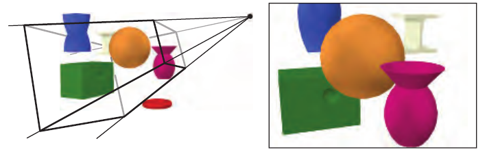

**图 2.1。** 左图中，虚拟相机位于棱锥的顶点，即四条线汇聚的位置。只有位于视景体内的图元才会被渲染。对于使用透视方式渲染的图像（如本图），视景体是一个视锥体（frustum，复数为 frusta），也就是底面为矩形、截去了顶部的棱锥。右图展示了相机“看到”的内容。注意，左图中的红色圆环没有出现在右侧渲染结果中，因为它位于视锥体之外。另外，左图中扭曲的蓝色棱柱受到了视锥体顶平面的裁剪。

我们将解释渲染流水线的各个阶段，重点讨论其功能而非实现。运用这些阶段时所需的相关细节，将在后续章节中介绍。

## 2.1 架构

来源：原书第 12—13 页（PDF 物理页第 33—34 页）。

在现实世界中，流水线这一概念有许多不同的表现形式，从工厂装配线到快餐店厨房，随处可见。它也适用于图形渲染。流水线由若干阶段组成 [715]，每个阶段完成一项较大任务中的一部分。

流水线中的各个阶段并行执行，每个阶段都依赖前一阶段的结果。理想情况下，将一个原本不采用流水线的系统划分为 n 个流水线阶段，可以获得 n 倍的加速。这种性能提升正是采用流水线的主要原因。例如，让一列人分工协作，就能快速制作大量三明治：一个人准备面包，另一个人放肉，再由另一个人添加配料。每个人都把自己的工作成果传给下一位，然后立即开始制作下一个三明治。如果每个人完成自己的任务都需要 20 秒，那么最高可以达到每 20 秒做出一个三明治，即每分钟三个。流水线中的各个阶段并行执行，但在最慢的阶段完成任务之前，它们会停顿下来。例如，假设放肉这个阶段变得更复杂，需要 30 秒，那么此时最高只能达到每分钟两个三明治。对这条流水线而言，放肉阶段就是*瓶颈*，因为它决定了整个生产过程的速度。在等待放肉阶段完成的这段时间里，添加配料的阶段被称为处于*饥饿*状态（顾客也是如此）。

这种流水线结构也出现在实时计算机图形学中。如图 2.2 所示，实时渲染流水线可以粗略划分为四个主要阶段：*应用、几何处理、光栅化和像素处理*。这一结构是实时计算机图形应用所使用的核心，也就是渲染流水线的引擎，因此也是后续各章讨论的重要基础。每个阶段通常本身又是一条流水线，也就是说，它由若干子阶段组成。我们要区分这里展示的功能阶段与其实现结构。一个功能阶段规定了需要完成的某项任务，但并不规定该任务在流水线中的执行方式。某种具体实现可能会将两个功能阶段合并到一个单元中，或使用可编程核心来执行，同时又将另一个更耗时的功能阶段拆分到多个硬件单元中。

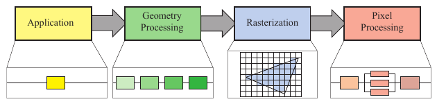

**图 2.2** 渲染流水线的基本结构，由应用、几何处理、光栅化和像素处理四个阶段组成。每个阶段本身都可能是一条流水线，如几何处理阶段下方所示；某个阶段也可能被（部分）并行化，如像素处理阶段下方所示。在这幅图中，应用阶段是单一处理过程，但这个阶段也可以采用流水线或并行化。注意，光栅化负责找出图元（例如三角形）内部的像素。

渲染速度可以用*每秒帧数*（frames per second，FPS）表示，即每秒渲染的图像数量。也可以用*赫兹*（Hertz，Hz）表示，它只是“每秒”（1/s）的记法，也就是更新频率。另一种常见的表达方式是直接给出渲染一幅图像所需的时间，以毫秒（ms）为单位。生成一幅图像所需的时间通常会变化，取决于每一帧所执行计算的复杂程度。每秒帧数既可以表示某一特定帧对应的速率，也可以表示一段使用时间内的平均性能。赫兹则用于显示器等设定为固定速率的硬件。

顾名思义，*应用*阶段由应用程序驱动，因此通常由运行在通用 CPU 上的软件实现。这些 CPU 通常包含多个核心，能够并行处理多个执行*线程*。这使得 CPU 可以高效运行应用阶段所负责的各种任务。传统上在 CPU 上执行的任务包括碰撞检测、全局加速算法、动画、物理模拟，以及随应用类型而定的许多其他任务。下一个主要阶段是*几何处理*，它负责变换、投影以及所有其他类型的几何操作。这个阶段计算要绘制什么、应当如何绘制，以及应当绘制在哪里。几何阶段通常在图形处理器（GPU）上执行，GPU 包含许多可编程核心以及执行固定操作的硬件。*光栅化*阶段通常接收构成一个三角形的三个顶点作为输入，找出所有被认为位于该三角形内部的像素，然后将这些像素传递给下一阶段。最后，*像素处理*阶段为每个像素执行程序，以确定其颜色，并且可能执行深度测试，以判断该像素是否可见。它还可能执行逐像素操作，例如将新计算出的颜色与先前的颜色混合。光栅化和像素处理阶段也完全在 GPU 上完成。接下来的四节将讨论所有这些阶段及其内部流水线。第 3 章将进一步介绍 GPU 如何处理这些阶段。

## 2.2 应用阶段

原书来源：第 13—14 页（PDF 第 34—35 页）。

开发者能够完全控制应用阶段中发生的事情，因为这一阶段通常在 CPU 上执行。因此，开发者可以完全决定其实现方式，并且可以在之后对其进行修改，以提高性能。这里的改动也可能影响后续阶段的性能。例如，应用阶段中的某种算法或设置可以减少需要渲染的三角形数量。

话虽如此，应用阶段的一部分工作也可以由 GPU 执行，所用的是一种称为*计算着色器*（compute shader）的独立模式。这种模式将 GPU 视为高度并行的通用处理器，而不使用它专门为图形渲染提供的特殊功能。

在应用阶段结束时，要渲染的几何数据会被送入几何处理阶段。这些数据就是*渲染图元*，即点、线和三角形，它们最终可能出现在屏幕上（或正在使用的其他输出设备上）。这是应用阶段最重要的任务。

由于这一阶段采用软件实现，它不像几何处理、光栅化和像素处理阶段那样被划分为若干子阶段。注1 不过，为了提高性能，这一阶段通常会在多个处理器核心上并行执行。在 CPU 设计中，这被称为*超标量结构*（superscalar construction），因为它能够在同一阶段同时执行多个处理过程。第 18.5 节介绍了利用多个处理器核心的各种方法。

通常在这一阶段实现的一项处理是*碰撞检测*。检测到两个物体之间发生碰撞后，可以生成一个响应，并将其反馈给发生碰撞的物体，同时也传递给力反馈设备。应用阶段还负责处理来自其他来源的输入，例如键盘、鼠标或头戴式显示器。根据这些输入，可以采取多种不同的动作。加速算法，例如某些剔除算法（第 19 章），也在这里实现；流水线其余部分无法处理的其他所有工作同样由这里承担。

**注1：** 由于 CPU 本身在小得多的尺度上采用了流水线，因此也可以说，应用阶段还被进一步细分成了若干流水线阶段，不过这一点与此处的讨论无关。

## 2.3 几何处理

来源：《Real-Time Rendering, Fourth Edition》，原书第 14—21 页（PDF 第 35—42 页）。

GPU 上的几何处理阶段负责大部分逐三角形和逐顶点操作。这一阶段进一步划分为以下功能阶段：顶点着色、投影、裁剪和屏幕映射（图 2.3）。

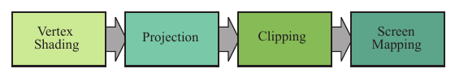

图 2.3. 几何处理阶段划分成由多个功能阶段组成的流水线。

### 2.3.1 顶点着色

顶点着色有两个主要任务：计算顶点的位置，以及求出程序员希望作为顶点输出数据的任何内容，例如法线和纹理坐标。传统上，物体的大部分着色计算是通过将光照应用于每个顶点的位置和法线来完成的，并且只在顶点处存储得到的颜色。随后，这些颜色会在整个三角形上进行插值。因此，这种可编程的顶点处理单元被命名为顶点着色器 [1049]。随着现代 GPU 的出现，以及部分或全部着色转为逐像素进行，这个顶点着色阶段变得更加通用；根据程序员的意图，它甚至可能完全不计算任何着色方程。如今，顶点着色器是一种更通用的单元，专门用于设置与每个顶点关联的数据。例如，顶点着色器可以使用第 4.4 节和第 4.5 节中的方法为物体制作动画。

我们首先说明如何计算顶点位置，这组坐标始终是必需的。在到达屏幕的过程中，模型会被变换到若干不同的空间或坐标系中。最初，模型位于自身的模型空间中，这仅仅意味着它尚未经过任何变换。每个模型都可以关联一个模型变换，用于确定其位置和朝向。一个模型可以关联多个模型变换。这样，同一模型的多个副本（称为实例）就能在同一场景中具有不同的位置、朝向和大小，而不必复制基础几何数据。

模型变换所变换的是模型的顶点和法线。物体的坐标称为模型坐标；在对这些坐标应用模型变换之后，就称该模型位于世界坐标系或世界空间中。世界空间是唯一的；在各个模型经过各自的模型变换之后，所有模型都存在于这个相同的空间中。

如前所述，只有摄像机（或观察者）看得到的模型才会被渲染。摄像机在世界空间中具有一个位置和一个方向，它们用于放置摄像机并确定其朝向。为了便于投影和裁剪，需要对摄像机和所有模型应用观察变换。观察变换的目的是把摄像机放在原点，并使它朝向 z 轴负方向，同时令 y 轴指向上方、x 轴指向右方。我们采用朝向 −z 轴的约定；某些文献更倾向于沿 +z 轴观察。两者的差别主要在于语义，因为相互转换很简单。应用观察变换后的实际位置和方向取决于底层应用程序编程接口（API）。由此定义的空间称为摄像机空间，更常见的名称是观察空间或眼空间。图 2.4 给出了观察变换如何影响摄像机和模型的示例。模型变换和观察变换都可以用 4×4 矩阵实现，这是第 4 章的主题。不过，必须认识到，程序员可以用自己喜欢的任何方式计算顶点的位置和法线。

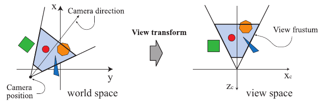

图 2.4. 左图以俯视视角展示摄像机按照用户希望的位置和朝向放置在世界中；在这个世界中，+z 轴向上。观察变换重新调整世界的朝向，使摄像机位于原点，沿自身 z 轴负方向观察，并使摄像机的 +y 轴向上，如右图所示。这样做是为了使裁剪和投影操作更简单、更快速。浅蓝色区域是视体。这里假设采用透视观察，因为视体是一个视锥台。类似的技术适用于任何类型的投影。

接下来，我们说明顶点着色的第二类输出。要生成逼真的场景，仅渲染物体的形状和位置是不够的，还必须对其外观建模。这种描述包括每个物体的材质，以及照射到物体上的所有光源所产生的效果。材质和光源可以用各种方式建模，从简单的颜色，到对物理描述的精细表示，不一而足。

确定光照对材质影响的操作称为着色。它涉及在物体的不同位置计算着色方程。通常，这些计算中的一部分在几何处理期间针对模型顶点进行，另一部分则可能在逐像素处理期间进行。每个顶点处可以存储各种材质数据，例如该点的位置、法线、颜色，或者计算着色方程所需的任何其他数值信息。顶点着色的结果可以是颜色、向量、纹理坐标以及任何其他类型的着色数据；这些结果随后被发送到光栅化和像素处理阶段，在那里进行插值，并用于计算表面的着色。

本书各处都会更深入地讨论以 GPU 顶点着色器形式实现的顶点着色，尤其是第 3 章和第 5 章。

作为顶点着色的一部分，渲染系统先进行投影，再进行裁剪，将视体变换为极端点位于 (−1,−1,−1) 和 (1,1,1) 的单位立方体。也可以采用不同的取值范围来定义同一个体积，而且实践中确实如此，例如 0≤ z≤1。这个单位立方体称为规范视体。投影先执行，在 GPU 上由顶点着色器完成。常用的投影方法有两种：正交投影（也称平行投影）和透视投影，见图 2.5。实际上，正交投影只是平行投影的一种。其他若干平行投影也有应用，特别是在建筑领域，例如斜投影和轴测投影。老式街机游戏 Zaxxon 的名字就源自后者。

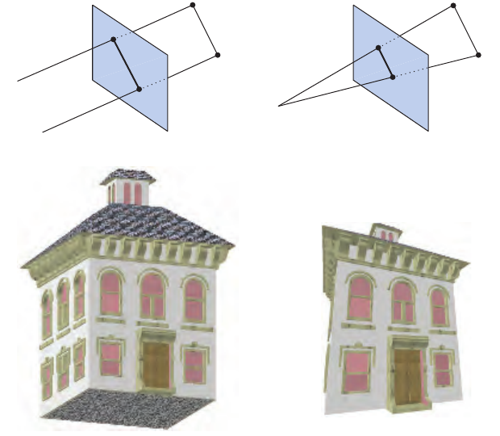

图 2.5. 左侧为正交投影，也称平行投影；右侧为透视投影。

注意，投影以矩阵表示（第 4.7 节），因此有时可以将它与几何变换的其余部分连接起来。

正交观察的视体通常是一个长方体，正交投影将这个视体变换为单位立方体。正交投影的主要特征是，平行线在变换之后仍然平行。这种变换是平移与缩放的组合。

透视投影稍微复杂一些。在这种投影中，物体离摄像机越远，投影后看起来就越小。此外，平行线可能会在地平线处会聚。因此，透视变换模拟了我们感知物体大小的方式。从几何上说，这种称为视锥台的视体，是一个底面为矩形、被截去顶端的棱锥。视锥台同样会被变换为单位立方体。正交变换和透视变换都可以用 4×4 矩阵构造（第 4 章）；在经过其中任意一种变换后，就称模型处于裁剪坐标中。这些实际上是第 4 章将讨论的齐次坐标，因此此时尚未进行除以 w 的运算。GPU 的顶点着色器必须始终输出这种类型的坐标，才能使下一个功能阶段——裁剪——正确工作。

虽然这些矩阵将一个体积变换为另一个体积，但它们仍被称为投影，因为显示之后，z 坐标不会存储在生成的图像中，而是存储在第 2.5 节介绍的 z 缓冲区中。通过这种方式，模型从三维被投影到二维。

### 2.3.2 可选的顶点处理

每条流水线都包含刚才描述的顶点处理。完成这些处理之后，GPU 上还可以按以下顺序执行几个可选阶段：曲面细分、几何着色和流输出。是否使用它们，既取决于硬件的能力——并非所有 GPU 都具备这些阶段——也取决于程序员的意愿。它们彼此独立，而且一般来说并不常用。第 3 章将对每个阶段作进一步介绍。

第一个可选阶段是曲面细分。设想有一个弹跳的小球物体。如果用一组固定的三角形表示它，可能会遇到质量或性能问题。你的小球在 5 米之外看起来也许不错，但近看时，各个三角形就会显现出来，轮廓处尤其如此。如果用更多三角形构造小球来提高质量，那么当球很远、在屏幕上只覆盖几个像素时，就可能浪费大量处理时间和内存。利用曲面细分，可以用适当数量的三角形生成曲面。

我们已经稍微谈到了一些三角形，但到流水线的这个位置为止，我们实际上只处理了顶点。这些顶点可以用于表示点、线、三角形或其他物体。顶点也可以用于描述曲面，例如球面。这类曲面可以由一组面片指定，每个面片由一组顶点构成。曲面细分阶段本身也包含一系列阶段：外壳着色器、细分器和域着色器。它们把这些面片顶点集合转换为通常更大的顶点集合，再用后者构造新的三角形集合。可以根据场景中的摄像机来确定生成多少三角形：面片近时生成得多，远时生成得少。

下一个可选阶段是几何着色器。这种着色器早于曲面细分着色器出现，因此在 GPU 上更为常见。它与曲面细分着色器类似，会接收各种类型的图元，并能够生成新的顶点。不过，它是一个简单得多的阶段，因为这种生成的规模有限，输出图元的类型也受到更多限制。几何着色器有多种用途，其中最常见的用途之一是生成粒子。设想要模拟一次烟花爆炸。每个火球可以用一个点、一个顶点来表示。几何着色器可以接收每个点，将其转换为一个朝向观察者、覆盖若干像素的正方形（由两个三角形组成），从而为我们提供一个更有说服力的图元来进行着色。

最后一个可选阶段称为流输出。这个阶段使我们可以把 GPU 用作几何引擎。此时，我们可以选择将处理后的顶点输出到一个数组中，以供进一步处理，而不是沿流水线的其余部分继续发送这些顶点、把它们渲染到屏幕上。这些数据可以在后续遍次中由 CPU 或 GPU 自身使用。这个阶段通常用于粒子模拟，例如前面所举的烟花例子。

这三个阶段按曲面细分、几何着色、流输出的顺序执行，而且每个阶段都是可选的。无论采用了哪些可选阶段，或者一个也没采用，只要继续沿流水线向下执行，我们就会得到一组带有齐次坐标的顶点，接下来将检查摄像机是否看得到它们。

### 2.3.3 裁剪

只有完全或部分位于视体内部的图元才需要传递给光栅化阶段（以及随后的像素处理阶段），然后由它们绘制到屏幕上。完全位于视体内部的图元会原样传递给下一阶段。完全位于视体外部的图元不会继续向后传递，因为它们不会被渲染。需要裁剪的是那些部分位于视体内部的图元。例如，对于一条一个顶点位于视体外、另一个位于视体内的线段，应针对视体进行裁剪，使外部顶点被一个新顶点替代，这个新顶点位于线段与视体的交点处。使用投影矩阵，意味着变换后的图元要针对单位立方体进行裁剪。在裁剪之前执行观察变换和投影的优点在于，这样可以让裁剪问题保持一致：图元始终针对单位立方体进行裁剪。

图 2.6 展示了裁剪过程。除了视体的六个裁剪平面，用户还可以定义额外的裁剪平面，以便在视觉上切开物体。这种称为剖切的可视化方式，其示例图见第 818 页的图 19.1。

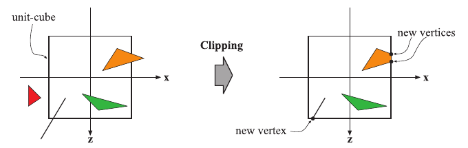

图 2.6. 经过投影变换后，只有单位立方体内部的图元（对应于视锥台内部的图元）才需要继续处理。因此，单位立方体外部的图元被丢弃，完全位于内部的图元被保留。与单位立方体相交的图元会针对单位立方体进行裁剪，由此生成新的顶点，并丢弃旧的顶点。

裁剪步骤使用投影产生的、包含四个分量的齐次坐标来执行裁剪。在透视空间中，各个值通常不会在三角形上呈线性插值。使用透视投影时，需要第四个坐标才能对数据进行正确的插值和裁剪。最后执行透视除法，将所得三角形的位置转换为三维归一化设备坐标。如前所述，这个视体的范围是从 (−1,−1,−1) 到 (1,1,1)。几何阶段的最后一步是从这个空间转换到窗口坐标。

### 2.3.4 屏幕映射

只有位于视体内部的、经过裁剪的图元才会传递到屏幕映射阶段；进入这个阶段时，坐标仍然是三维的。每个图元的 x 和 y 坐标经过变换，形成屏幕坐标。屏幕坐标连同 z 坐标也称为窗口坐标。假设要将场景渲染到一个窗口中，其最小角点为 (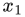,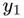)，最大角点为 (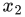,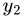)，其中 < 且 <。那么屏幕映射就是先平移、再缩放的操作。新的 x 和 y 坐标称为屏幕坐标。z 坐标（OpenGL 中为 [−1,+1]，DirectX 中为 [0,1]）也会被映射到 [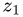,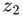]，其中默认值为 =0、=1。不过，可以通过 API 改变这些值。窗口坐标连同这个重新映射的 z 值被传递给光栅化器阶段。图 2.7 展示了屏幕映射过程。

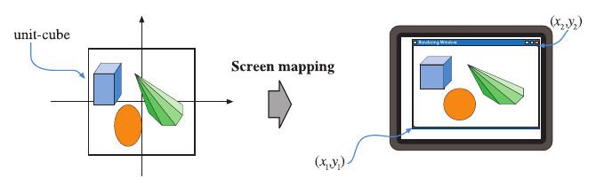

图 2.7. 经过投影变换后，图元位于单位立方体中，屏幕映射过程负责求出它们在屏幕上的坐标。

接下来，我们说明整数值和浮点值与像素（以及纹理坐标）之间的关系。给定一行水平排列的像素，并采用笛卡尔坐标，最左侧像素的左边缘在浮点坐标中为 0.0。OpenGL 一直采用这种方案，DirectX 10 及其后续版本也采用它。这个像素的中心位于 0.5。因此，范围为 [0,9] 的一组像素覆盖的区间是 [0.0,10.0)。转换很简单：

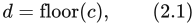

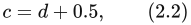

其中，d 是像素的离散（整数）索引，c 是像素内部的连续（浮点）值。

虽然所有 API 的像素位置值都从左向右递增，但在某些情况下，OpenGL 和 DirectX 对于上下边缘中哪一边对应零值的规定并不一致。注2 OpenGL 始终偏向使用笛卡尔坐标系，将左下角视为取值最小的元素；DirectX 则有时会根据具体情境，将左上角定义为这个元素。两者各有自己的道理，在存在差异的地方，并没有唯一正确的答案。例如，OpenGL 中图像的 (0,0) 位于左下角，而 DirectX 中则位于左上角。从一个 API 转到另一个 API 时，必须考虑这一差异。

**注2：** “Direct3D”是 DirectX 的三维图形 API 组成部分。DirectX 还包括其他 API 元素，例如输入和音频控制。我们没有在指明某个特定版本时使用“DirectX”、在讨论这个特定 API 时使用“Direct3D”来加以区分，而是遵循通常的用法，在全书中统一使用“DirectX”。

## 2.4 光栅化

来源：《Real-Time Rendering, 4th Edition》，书页 21—22（PDF 物理页 42—43）。

给定经过变换和投影的顶点及其关联的着色数据（这些全部来自几何处理），下一阶段的目标是找出位于正在渲染的图元（例如三角形）内部的所有像素。像素的英文名称 pixel 是 picture element（图像元素）的简称。我们将这一过程称为**光栅化**，并将其划分为两个功能子阶段：**三角形设置**（也称为**图元装配**）和**三角形遍历**。图 2.8 左侧展示了这两个子阶段。请注意，它们也能够处理点和线，但由于三角形最为常见，这两个子阶段的名称中都带有“三角形”。因此，光栅化也称为**扫描转换**，它将屏幕空间中的二维顶点转换为屏幕上的像素；每个顶点都关联着一个 z 值（深度值）以及各种着色信息。光栅化也可以看作几何处理与像素处理之间的一个同步点，因为三个顶点正是在这里组成三角形，并最终向下传递到像素处理阶段。

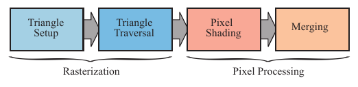

**图 2.8。** 左：光栅化分为两个功能阶段，称为三角形设置和三角形遍历。右：像素处理分为两个功能阶段，即像素处理和合并。

是否认为三角形与像素重叠，取决于 GPU 流水线的设置。例如，可以使用点采样来确定是否“位于内部”。最简单的情况是在每个像素的中心使用一个点样本，因此，如果该中心点位于三角形内部，就认为对应的像素也位于三角形内部。也可以使用超采样或多重采样抗锯齿技术，为每个像素使用多个样本（第 5.4.2 节）。还有一种方法是采用保守光栅化，其定义是：只要像素至少有一部分与三角形重叠，就认为该像素位于三角形“内部”（第 23.1.2 节）。

### 2.4.1 三角形设置

这一阶段会计算三角形的微分量、边方程以及其他数据。这些数据可用于三角形遍历（第 2.4.2 节），也可用于对几何阶段产生的各种着色数据进行插值。这项任务由固定功能硬件完成。

### 2.4.2 三角形遍历

在这里，会检查每个中心点（或一个样本）被三角形覆盖的像素，并为该像素与三角形重叠的部分生成一个**片元**。更复杂的采样方法见第 5.4 节。找出哪些样本或像素位于三角形内部，通常称为**三角形遍历**。每个三角形片元的属性，都利用在三角形三个顶点之间插值得到的数据生成（第 5 章）。这些属性包括片元的深度，以及来自几何阶段的各种着色数据。McCormack 等人 [1162] 提供了有关三角形遍历的更多信息。对三角形进行透视校正插值，也是在这里完成的 [694]（第 23.1.1 节）。随后，位于图元内部的所有像素或样本都会被送往下面介绍的像素处理阶段。

## 2.5 像素处理

来源：原书第 22—25 页（PDF 第 43—46 页）。

至此，通过前面所有阶段的共同作用，已经找到了所有被认为位于三角形或其他图元内部的像素。像素处理阶段分为像素着色和合并两部分，如图 2.8 右侧所示。像素处理阶段对图元内部的像素或样本执行逐像素或逐样本的计算与操作。

### 2.5.1 像素着色

所有逐像素的着色计算都在这里执行，以插值得到的着色数据作为输入。最终结果是一种或多种颜色，它们将被传递到下一阶段。三角形设置和遍历阶段通常由专用的硬连线芯片电路执行，而像素着色阶段则由可编程的 GPU 核心执行。为此，程序员需要提供一个像素着色器程序（在 OpenGL 中称为片元着色器），其中可以包含任何所需的计算。这里可以采用多种多样的技术，其中最重要的技术之一是纹理映射。第 6 章将更详细地介绍纹理映射。简单来说，给物体进行纹理映射，就是出于各种目的将一幅或多幅图像“粘贴”到该物体上。图 2.9 展示了这一过程的简单例子。图像可以是一维、二维或三维的，其中二维图像最为常见。在最简单的情况下，最终产物是每个片元的一个颜色值，这些颜色值将被传递到下一个子阶段。

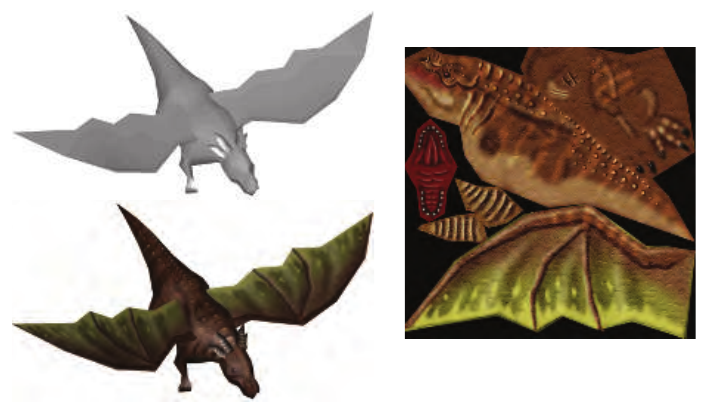

**图 2.9** 左上方显示了一个没有纹理的龙模型。图像纹理中的各个部分被“粘贴”到龙身上，结果如左下方所示。

### 2.5.2 合并

每个像素的信息存储在颜色缓冲区中，它是一个由颜色构成的矩形数组（每种颜色都包含红、绿、蓝三个分量）。合并阶段负责将像素着色阶段产生的片元颜色与当前存储在缓冲区中的颜色进行组合。这个阶段也称为 ROP；根据不同人的用法，这个缩写可以表示“光栅操作（流水线）”（raster operations (pipeline)），也可以表示“渲染输出单元”（render output unit）。与着色阶段不同，执行这一阶段的 GPU 子单元通常并非完全可编程。不过，它具有高度的可配置性，能够实现各种效果。

这一阶段还负责确定可见性。这意味着，当整个场景渲染完成时，颜色缓冲区中应当包含场景中从相机视点能够看见的图元的颜色。大多数乃至全部图形硬件都通过 z 缓冲区（也称为深度缓冲区）算法 [238] 来完成这一任务。z 缓冲区与颜色缓冲区的尺寸和形状相同，它为每个像素存储当前最近图元的 z 值。这意味着，在把一个图元渲染到某个像素时，会计算该图元在这个像素处的 z 值，并将其与 z 缓冲区中同一像素位置的内容进行比较。如果新的 z 值小于 z 缓冲区中的 z 值，那么正在渲染的图元就比此前在该像素处距离相机最近的图元更靠近相机。因此，该像素的 z 值和颜色将被更新为当前正在绘制的图元的 z 值和颜色。如果计算出的 z 值大于 z 缓冲区中的 z 值，则颜色缓冲区和 z 缓冲区都保持不变。z 缓冲区算法很简单，具有 O(n) 的收敛复杂度（其中 n 是正在渲染的图元数量），并且适用于能够为每个相关像素计算 z 值的任何绘制图元。还要注意，这个算法允许以任意顺序渲染大多数图元，这也是它广受欢迎的另一个原因。不过，z 缓冲区只在屏幕上的每个点存储一个深度，因此它不能用于部分透明的图元。这些图元必须在所有不透明图元之后，按从后到前的顺序渲染，或者使用一种单独的、与顺序无关的算法来渲染（第 5.5 节）。透明性是基本 z 缓冲区方法的主要弱点之一。

我们已经提到，颜色缓冲区用于存储颜色，而 z 缓冲区则为每个像素存储 z 值。不过，还有其他通道和缓冲区可以用来筛选和捕获片元信息。Alpha 通道与颜色缓冲区相关联，为每个像素存储一个对应的不透明度值（第 5.5 节）。在较早的 API 中，Alpha 通道还被用于通过 Alpha 测试功能有选择地丢弃像素。如今，可以在像素着色器程序中插入丢弃操作，并且可以用任何类型的计算来触发丢弃。这种测试可以确保完全透明的片元不会影响 z 缓冲区（第 6.6 节）。

模板缓冲区是一种离屏缓冲区，用于记录已渲染图元的位置。它通常为每个像素提供 8 位。可以使用各种函数将图元渲染到模板缓冲区中，随后利用该缓冲区的内容控制向颜色缓冲区和 z 缓冲区的渲染。例如，假设已经在模板缓冲区中绘制了一个实心圆。可以将它与某种操作结合起来，使后续图元只有在圆所在的区域内才允许被渲染到颜色缓冲区中。模板缓冲区是生成某些特殊效果的有力工具。流水线末端的所有这些功能都称为光栅操作（ROP）或混合操作。可以将颜色缓冲区中当前的颜色与三角形内部正在处理的像素颜色混合。这能够实现透明效果或颜色样本累积等效果。如前所述，混合通常可以通过 API 进行配置，但并非完全可编程。不过，一些 API 支持光栅顺序视图（raster order views），也称为像素着色器排序（pixel shader ordering），从而提供可编程的混合能力。

帧缓冲区通常由系统中的所有缓冲区组成。

当图元到达并通过光栅化器阶段之后，从相机视点可见的图元就会显示在屏幕上。屏幕显示的是颜色缓冲区的内容。为了避免让观看者看到图元被光栅化并发送到屏幕的过程，需要使用双缓冲。这意味着场景渲染在离屏的后缓冲区中进行。一旦场景在后缓冲区中渲染完成，后缓冲区的内容就会与此前显示在屏幕上的前缓冲区内容交换。交换通常发生在垂直回扫期间，此时进行交换是安全的。

关于不同缓冲区和缓冲方法的更多信息，请参阅第 5.4.2、23.6 和 23.7 节。

## 2.6 贯穿流水线

来源：原书第 25—27 页（PDF 第 46—48 页）。

点、线和三角形是构成模型或物体的渲染图元。设想我们正在使用一个交互式计算机辅助设计（CAD）应用程序，用户正在检查一台华夫饼机的设计。在这里，我们将跟随这个模型走过整个图形渲染流水线，其中包括四个主要阶段：应用、几何、光栅化和像素处理。场景以透视方式渲染到屏幕上的一个窗口中。在这个简单的例子中，华夫饼机模型既包含线（用于显示零件的边缘），也包含三角形（用于显示表面）。华夫饼机有一个可以打开的盖子。某些三角形使用一幅带有制造商标志的二维图像作为纹理。在这个例子中，除了纹理的应用发生在光栅化阶段之外，表面着色完全在几何阶段计算。

### 应用

CAD 应用程序允许用户选择和移动模型的部件。例如，用户可以选中盖子，然后移动鼠标将其打开。应用阶段必须把鼠标的移动转换为相应的旋转矩阵，然后确保在渲染盖子时正确地将这个矩阵应用于它。再举一个例子：播放一段动画，让摄像机沿着预先定义的路径移动，以便从不同视角展示华夫饼机。此时，应用程序必须随时间更新摄像机的位置和观察方向等参数。对于每个需要渲染的帧，应用阶段都会把摄像机位置、光照以及模型的图元提供给流水线的下一个主要阶段——几何阶段。

### 几何处理

对于透视观察，这里假设应用程序已经提供了一个投影矩阵。此外，对于每个物体，应用程序都已计算出一个矩阵，其中同时包含观察变换以及物体自身的位置和朝向。在我们的例子中，华夫饼机底座使用一个矩阵，盖子使用另一个矩阵。在几何阶段，物体的顶点和法线使用这个矩阵进行变换，将物体置于观察空间中。然后，可以利用材质和光源的属性，在顶点处执行着色或其他计算。接下来，使用用户单独提供的投影矩阵执行投影，将物体变换到一个单位立方体的空间中，该空间表示眼睛所能看到的内容。所有位于立方体之外的图元都会被丢弃。所有与这个单位立方体相交的图元都会依据立方体进行裁剪，以得到一组完全位于单位立方体内部的图元。随后，顶点被映射到屏幕上的窗口中。所有这些逐三角形和逐顶点操作完成后，得到的数据便传递给光栅化阶段。

### 光栅化

所有在上一阶段裁剪后保留下来的图元，接下来都会被光栅化，也就是找出位于图元内部的所有像素，并将它们沿流水线继续传递到像素处理阶段。

### 像素处理

这里的目标是计算每个可见图元的每个像素的颜色。对于关联了纹理（图像）的三角形，渲染时会按需要将这些图像应用到三角形上。可见性通过 z 缓冲算法以及可选的丢弃和模板测试来确定。每个物体依次得到处理，随后最终图像显示在屏幕上。

### 结论

这条流水线是 API 和图形硬件面向实时渲染应用、经过数十年演进的结果。需要注意的是，它并非唯一可能的渲染流水线；离线渲染流水线经历了不同的演进路径。电影制作中的渲染过去常使用微多边形流水线 [289, 1734]，但近年来光线追踪和路径追踪已取而代之。第 11.2.2 节介绍的这些技术，也可用于建筑和设计的预可视化。

多年以来，应用程序开发者使用这里所述处理过程的唯一方式，是通过所用图形 API 定义的固定功能流水线。固定功能流水线之所以这样命名，是因为实现它的图形硬件由无法灵活编程的部件组成。最后一个具有代表性的固定功能机器实例，是任天堂于 2006 年推出的 Wii。另一方面，可编程 GPU 使我们能够精确决定流水线各个子阶段所执行的操作。在本书第四版中，我们假定所有开发都使用可编程 GPU。

## 延伸阅读与资源

Blinn 的《A Trip Down the Graphics Pipeline》[165] 是一本较早的书，讲述如何从零开始编写软件渲染器。它是了解渲染流水线实现中某些微妙细节的良好资料，解释了裁剪、透视插值等关键算法。历史悠久但经常更新的《OpenGL Programming Guide》（也称“红宝书”）[885]，详细介绍了图形流水线及其使用所涉及的算法。本书网站 [realtimerendering.com](https://realtimerendering.com/) 提供了各种流水线图解、渲染引擎实现及其他内容的链接。
