# Real-Time Rendering 第06章 纹理 中文合集

> 依据用户提供的《Real-Time Rendering》第四版 PDF 完整翻译。原图配中文图注；复杂数学已排版为本地图片，简单符号直接显示。保留原书技术年代、公式编号与引用编号。

## 目录

- [6.1 纹理流水线](<Real-Time_Rendering_4th_中文/第06章/06.01.md>)

- [6.2 图像纹理](<Real-Time_Rendering_4th_中文/第06章/06.02.md>)

- [6.3 程序化纹理](<Real-Time_Rendering_4th_中文/第06章/06.03.md>)

- [6.4 纹理动画](<Real-Time_Rendering_4th_中文/第06章/06.04.md>)

- [6.5 材质映射](<Real-Time_Rendering_4th_中文/第06章/06.05.md>)

- [6.6 Alpha 映射](<Real-Time_Rendering_4th_中文/第06章/06.06.md>)

- [6.7 凹凸映射](<Real-Time_Rendering_4th_中文/第06章/06.07.md>)

- [6.8 视差映射](<Real-Time_Rendering_4th_中文/第06章/06.08.md>)

- [6.9 纹理光源](<Real-Time_Rendering_4th_中文/第06章/06.09.md>)


## 章首导言

来源：原书第 167—168 页（PDF 第 188—189 页）；本文件收录第 6 章标题、题辞和 6.1 节之前的完整导言。

> “只要渲染出来的图像看起来正确就够了。”
>
> ——Jim Blinn

表面的纹理，就是它给人的视觉和触觉感受——想想油画的肌理就明白了。在计算机图形学中，纹理处理是利用某种图像、函数或其他数据源，修改表面各个位置外观的过程。例如，我们不必精确表示砖墙的几何结构，而可以把一幅砖墙彩色图像应用到由两个三角形组成的矩形上。观察这个矩形时，彩色图像便出现在矩形所在的位置。除非观察者靠近墙面，否则不会察觉几何细节的缺失。

然而，有些带纹理的砖墙之所以显得不够真实，并不只是因为缺乏几何细节。例如，如果砂浆应当是哑光的，而砖块有光泽，观察者就会发现两种材质的粗糙度却完全相同。为了得到更可信的效果，可以在表面上再应用第二张图像纹理。它不改变表面的颜色，而是根据表面位置改变墙面的粗糙度。这样，砖块和砂浆既有来自图像纹理的颜色，也有来自这张新纹理的粗糙度值。

观察者现在可能看到，所有砖块都有光泽，而砂浆没有，但又会注意到每块砖的表面看起来完全平整。这不符合实际，因为砖块表面通常存在一些不规则起伏。通过应用**凹凸映射（bump mapping）**，可以改变砖块的着色法线，使它们渲染出来时不再显得完全光滑。这类纹理会扰动矩形原始表面法线的方向，以用于光照计算。

从贴近表面的掠射角度观察时，这种凹凸错觉可能会失效。砖块本应突出于砂浆之上，遮挡住砂浆。即使正面观察，砖块也应在砂浆上投下阴影。 **视差映射（parallax mapping）** 利用纹理，在渲染时让平坦表面看起来发生形变； **视差遮蔽映射（parallax occlusion mapping）** 则向高度场纹理投射射线，以增强真实感。 **置换映射（displacement mapping）** 通过修改构成模型的三角形的高度，真正移动表面。图 6.1 展示了一个结合颜色纹理和凹凸映射的例子。


**图 6.1** 纹理处理。为这条鱼应用颜色贴图和凹凸贴图，以提高视觉细节程度。（图片由 Elinor Quittner 提供。）

这些例子展示了纹理能够解决的问题类型，以及为此使用的越来越复杂的算法。本章将详细介绍纹理处理技术。首先给出纹理处理过程的通用框架。接着重点讨论如何利用图像为表面添加纹理，因为这是实时应用中最常用的纹理处理形式。之后简要介绍过程纹理，再说明几种让纹理影响表面的常用方法。


## 6.1 纹理流水线

来源：原书第 169—176 页（PDF 第 190—197 页）；从 6.1 节标题开始，至 6.2 节标题之前结束。

纹理处理是一种高效模拟表面材质及表面质感变化的技术。理解纹理处理的一种方式，是考察单个经过着色的像素会发生什么。正如上一章所见，着色结果需要综合材质颜色、光源以及其他因素来计算。如果存在透明性，它也会影响采样。纹理处理通过修改着色方程所使用的数值来发挥作用。这些数值如何变化，通常取决于表面上的位置。因此，在砖墙的例子中，表面任意一点的颜色都会根据其表面位置，替换为砖墙图像中对应位置的颜色。图像纹理中的像素通常称为**纹素（texel）**，以区别于屏幕上的像素。粗糙度纹理会修改粗糙度值，凹凸纹理则会改变着色法线的方向，因此两者都会改变着色方程的结果。

纹理处理可以用一条通用的纹理流水线来描述。接下来会引入不少术语，但不用担心：流水线的每个部分都会详细解释。

纹理处理的起点是空间中的一个位置。这个位置可以位于世界空间，但更常见的是位于模型自身的参考坐标系中，这样当模型移动时，纹理也会随之移动。按照 Kershaw 的术语 [884]，随后对这一空间点应用一个**投影函数（projector function）**，得到一组称为**纹理坐标**的数值，用于访问纹理。这个过程称为**映射**，由此便有了**纹理映射**这一说法。有时纹理图像本身也被称为纹理映射图（texture map），尽管严格来说这并不准确。

在使用这些新数值访问纹理之前，可以先用一个或多个**对应函数（corresponder function）**把纹理坐标变换到纹理空间。随后利用这些纹理空间位置从纹理中取得数值；例如，它们可以是图像纹理中的数组索引，用来读取一个像素。读出的数值还可能再次经过一个**数值变换函数**处理，最终用这些新数值修改表面的某种属性，例如材质或着色法线。图 6.2 详细展示了应用单个纹理时的这一过程。流水线之所以如此复杂，是因为每个步骤都为使用者提供了一种有用的控制手段。需要注意，并非任何时候都必须启用所有步骤。


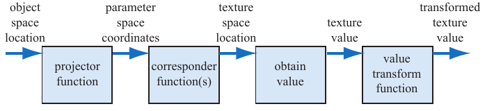

**图 6.2** 单个纹理的通用纹理流水线。

图中流程依次为：物体空间位置 → 投影函数 → 参数空间坐标 → 对应函数 → 纹理空间位置 → 获取数值 → 纹理值 → 数值变换函数 → 变换后的纹理值。


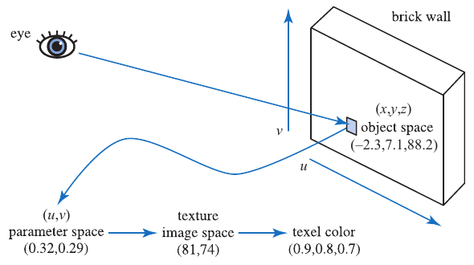

**图 6.3** 砖墙的流水线。

采用这条流水线时，当一个三角形具有砖墙纹理，并在其表面生成一个采样点，便会发生以下过程（见图 6.3）。首先求出该点在物体局部参考坐标系中的位置 (x, y, z)，假设为 (−2.3, 7.1, 88.2)。随后对这一位置应用投影函数。正如世界地图是把三维物体投影到二维一样，这里的投影函数通常会把向量 (x, y, z) 转换成一个含两个分量的向量 (u, v)。本例使用的投影函数相当于正交投影（第 2.3.1 节），其作用有些像一台幻灯机，把砖墙图像照射到三角形表面上。回到这面墙，表面上的一个点可以变换成两个取值范围为 0 到 1 的数值。假设得到的是 (0.32, 0.29)。这些纹理坐标将用于确定图像在此位置的颜色。假设砖墙纹理的分辨率为 256 × 256，那么对应函数将 u 和 v 分别乘以 256，得到 (81.92, 74.24)。去掉小数部分，就能找到砖墙图像中的像素 (81, 74)，其颜色为 (0.9, 0.8, 0.7)。纹理颜色位于 sRGB 颜色空间，因此如果要将它用于着色方程，就需将其转换到线性空间，得到 (0.787, 0.604, 0.448)（第 5.6 节）。

### 6.1.1 投影函数

纹理处理的第一步，是取得表面的位置，并将其投影到纹理坐标空间，通常是二维的 (u, v) 空间。建模软件通常允许美术人员为每个顶点定义 (u, v) 坐标。这些坐标可以通过投影函数或网格展开算法来初始化。美术人员可以像编辑顶点位置一样编辑 (u, v) 坐标。投影函数通常把空间中的一个三维点转换为纹理坐标。建模程序中常用的函数包括球面投影、圆柱投影和平面投影 [141, 884, 970]。


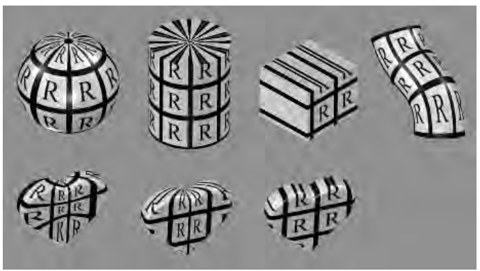

**图 6.4** 不同的纹理投影。从左到右依次为球面、圆柱、平面和自然 (u, v) 投影。下排展示了这些投影分别应用于同一个物体的结果（该物体没有自然投影）。

投影函数也可以使用其他输入。例如，可以根据表面法线，从六个平面投影方向中选择用于该表面的方向。在各个面相接的接缝处会出现纹理匹配问题；Geiss [521, 522] 讨论了一种在这些投影之间进行混合的技术。Tarini 等人 [1740] 描述了**多立方体映射（polycube maps）**：将模型映射到一组立方体投影上，让空间中不同的体积区域映射到不同的立方体。

还有一些投影函数根本不是投影，而是曲面创建和曲面细分过程中隐含的一部分。例如，参数曲面的定义中天然包含一组 (u, v) 值。见图 6.4。纹理坐标还可以根据各种不同参数生成，例如观察方向、表面温度，或任何可以想象到的其他量。投影函数的目标是生成纹理坐标，把纹理坐标作为位置的函数推导出来，只是实现这一目标的一种方式。

非交互式渲染器通常会在渲染过程本身中调用这些投影函数。一个投影函数有时就足以处理整个模型，但美术人员往往需要利用工具把模型划分成多个部分，再分别应用不同的投影函数 [1345]。见图 6.5。

在实时应用中，投影函数通常在建模阶段应用，投影结果保存在顶点上。但情况并非总是如此；有时在顶点着色器或像素着色器中应用投影函数会更有利。这可以提高精度，并有助于实现包括动画在内的各种效果（第 6.4 节）。某些渲染方法，例如环境映射（第 10.4 节），有各自专用的投影函数，并对每个像素进行求值。


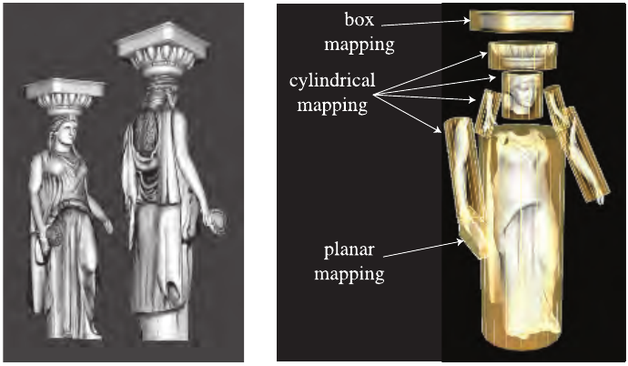

**图 6.5** 如何在同一个模型上使用各种纹理投影。盒式映射由六个平面映射组成，盒子的每个面各用一个。（图片由 Tito Pagán 提供。）

球面投影（图 6.4 最左侧）把点投到一个以某一点为中心的假想球面上。该投影与 Blinn 和 Newell 的环境映射方案（第 10.4.1 节）所用的投影相同，因此第 407 页的公式 10.30 描述了这一函数。这种投影方法也存在该节所述的顶点插值问题。

圆柱投影采用与球面投影相同的方法计算纹理坐标 u，而纹理坐标 v 则计算为沿圆柱轴线的距离。这种投影适用于具有天然轴线的物体，例如旋转曲面。当表面接近垂直于圆柱轴线时，就会发生畸变。

平面投影就像一束 X 射线，沿某个方向平行投射，并把纹理应用到所有表面。它使用正交投影（第 4.7.1 节）。这种投影方式适合应用贴花等用途（第 20.2 节）。

由于侧对投影方向的表面会出现严重畸变，美术人员往往必须手动把模型拆成一些近似平面的部分。也有一些工具通过展开网格、创建一组接近最优的平面投影，或以其他方式辅助这一过程，来尽量减小畸变。其目标是让每个多边形都获得更合理的一份纹理面积，同时尽可能保持网格的连通性。连通性很重要，因为纹理中不同部分相接的边缘可能产生采样伪影。良好的网格展开还能够减轻美术人员的工作量 [970, 1345]。第 16.2.1 节讨论了纹理畸变如何对渲染产生不利影响。图 6.6 展示了创建图 6.5 中雕像时使用的工作区。展开过程属于一个更大的研究领域，即**网格参数化**。感兴趣的读者可以参阅 Hormann 等人编写的 SIGGRAPH 课程讲义 [774]。


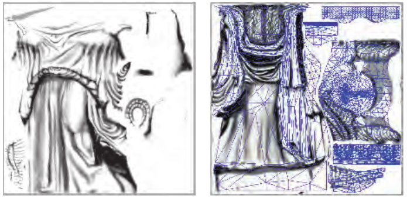

**图 6.6** 雕像模型的若干小纹理保存在两张较大的纹理中。右图展示了如何将三角形网格展开并显示在纹理上，以辅助纹理制作。（图片由 Tito Pagán 提供。）

纹理坐标空间并不总是二维平面；有时它是一个三维体积。在这种情况下，纹理坐标以三分量向量 (u, v, w) 表示，其中 w 是沿投影方向的深度。其他系统最多使用四个坐标，通常记为 (s, t, r, q) [885]；q 用作齐次坐标中的第四个值。这种方式的作用如同电影放映机或幻灯机，投射纹理的尺寸随距离增加而增大。例如，它适合把一种称为 gobo 的装饰性聚光灯图案投到舞台或其他表面上 [1597]。

另一种重要的纹理坐标空间是方向空间，其中每个点都通过一个输入方向来访问。可以把这样的空间想象成单位球面上的点；每一点的法线代表访问该位置纹理所使用的方向。采用方向参数化的纹理中，最常见的类型是**立方体贴图（cube map）**（第 6.2.4 节）。

一维纹理图像和函数也有其用途。例如，在地形模型上，可以根据海拔确定颜色，如低地为绿色、山峰为白色。线也可以使用纹理；一种用途是将雨渲染成一组长线，并在线上应用半透明图像纹理。这种纹理也可用于把一个数值转换成另一个数值，也就是充当查找表。

由于一个表面可以应用多个纹理，可能需要定义多组纹理坐标。无论这些坐标值如何应用，基本思想都是相同的：在整个表面上对这些纹理坐标进行插值，并用它们读取纹理值。不过，在插值之前，这些纹理坐标会先由对应函数进行变换。

### 6.1.2 对应函数

对应函数把纹理坐标转换成纹理空间位置。它们使纹理能够以灵活的方式应用到表面上。对应函数的一个例子，是使用 API 选择现有纹理的一部分来显示；后续操作只使用这幅子图像。

另一种对应函数是矩阵变换，可以在顶点着色器或像素着色器中应用。这使得表面上的纹理能够平移、旋转、缩放、错切或投影。正如第 4.1.5 节所讨论的，变换顺序很重要。出人意料的是，纹理的变换顺序必须与人们预期的顺序相反。这是因为纹理变换实际上影响的是决定图像显示位置的空间。图像本身并不是正在被变换的物体；变化的是定义图像位置的空间。

另一类对应函数控制图像的应用方式。我们知道，当 (u, v) 处于 [0, 1] 范围内时，图像会出现在表面上。但在此范围之外会发生什么？具体行为由对应函数决定。在 OpenGL 中，这类对应函数称为“环绕模式”（wrapping mode）；在 DirectX 中，称为“纹理寻址模式”（texture addressing mode）。常见的此类对应函数包括：

- **wrap（DirectX）、repeat（OpenGL）或 tile，重复／平铺**：图像在表面上重复出现；从算法上说，就是去掉纹理坐标的整数部分。这个函数适合让一幅材质图像重复覆盖表面，通常也是默认模式。
- **mirror，镜像**：图像在表面上重复出现，但每隔一次重复就进行镜像（翻转）。例如，0 到 1 之间图像正常显示，1 到 2 之间反向显示，2 到 3 之间又正常显示，然后再次反向，以此类推。这使纹理边缘具有一定的连续性。
- **clamp（DirectX）或 clamp to edge（OpenGL），钳制到边缘**：将 [0, 1] 范围之外的值钳制到这个范围内。结果是图像纹理的边缘不断重复。这个函数有助于避免在纹理边缘附近进行双线性插值时，意外从纹理的相对边缘取得采样 [885]。
- **border（DirectX）或 clamp to border（OpenGL），边框／钳制到边框**：纹理坐标超出 [0, 1] 时，使用单独定义的边框颜色渲染。例如，这个函数适合把贴花渲染到单色表面上，因为纹理边缘会与边框颜色平滑混合。


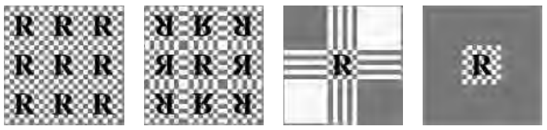

**图 6.7** 图像纹理的重复、镜像、钳制和边框函数的实际效果。

见图 6.7。可以为每条纹理轴分别指定不同的对应函数，例如沿 u 轴重复纹理，沿 v 轴则进行钳制。DirectX 还提供一种  **mirror once（镜像一次）** 模式：以纹理坐标的零值为界镜像一次，然后进行钳制。这适合对称贴花。

重复平铺纹理，是为场景增加视觉细节的一种低成本方法。然而，纹理重复约三次之后，这种技术往往就显得不够可信，因为人眼会识别出重复的图案。避免这种周期性问题的一种常见解决办法，是把纹理值与另一张不平铺的纹理结合。这种方法可以得到大幅扩展，Andersson [40] 描述的商业地形渲染系统就是一例。在该系统中，多张纹理根据地形类型、海拔、坡度等因素组合起来。纹理图像还与灌木、岩石等几何模型在场景中的放置位置关联。

避免周期性的另一种办法，是用着色器程序实现专用的对应函数，随机重组纹理图案或纹理块。 **王氏砖（Wang tiles）** 就是这种方法的一个例子。一组王氏砖由少量边缘相互匹配的正方形砖块组成。纹理处理过程中随机选择砖块 [1860]。Lefebvre 和 Neyret [1016] 利用依赖纹理读取和查找表实现了一种类似的对应函数，以避免图案重复。

最后应用的对应函数是隐式的，由图像尺寸决定。纹理通常应用在 u 和 v 均处于 [0, 1] 的范围内。如砖墙示例所示，将这一范围内的纹理坐标乘以图像分辨率，就可以得到像素位置。能够在 [0, 1] 范围内指定 (u, v) 值的好处，是可以替换成不同分辨率的图像纹理，而不必修改存储在模型顶点上的数值。

### 6.1.3 纹理值

使用对应函数生成纹理空间坐标之后，便利用这些坐标获取纹理值。对于图像纹理，这是通过访问纹理、从图像中读取纹素信息完成的。第 6.2 节将详细讨论这一过程。在实时应用中，图像纹理占纹理使用的绝大多数，但也可以采用过程函数。对于过程纹理，从纹理空间位置获取纹理值的过程不涉及内存查找，而是计算一个函数。第 6.3 节将进一步介绍过程纹理。

最直接的纹理值是一个 RGB 三元组，用于替换或修改表面颜色；类似地，也可以返回单个灰度值。另一种可以返回的数据是第 5.5 节所述的 RGBα。α（alpha）值通常表示颜色的不透明度，它决定这种颜色能够在多大程度上影响像素。不过，也可以存储任何其他值，例如表面粗糙度。图像纹理中还可以存储许多其他类型的数据，在详细讨论凹凸映射时（第 6.7 节）将会看到。

从纹理返回的数值，在使用之前可以选择进行变换。这些变换可以在着色器程序中完成。一个常见例子，是把数据从无符号范围（0.0 到 1.0）重新映射到有符号范围（−1.0 到 1.0）；存储在颜色纹理中的着色法线就会使用这种变换。


## 6.2 图像纹理

来源：《Real-Time Rendering, Fourth Edition》书页 176—198（PDF 物理页 197—219），从 6.2 “Image Texturing” 标题起，至 6.3 标题前；包括全部下级小节、图 6.8—6.23、表 6.1、公式（6.1）—（6.8）和原书脚注 1。技术与 API 陈述依原书出版时表述保留。

在图像纹理中，一幅二维图像实际上被“粘”到一个或多个三角形的表面上。我们已经介绍了计算纹理空间位置的过程；现在将讨论给定这个位置后，如何从图像纹理中取得纹理值，以及相关问题和算法。本章余下部分将把图像纹理简称为纹理。此外，这里提到一个像素的单元格时，指的是围绕该像素的屏幕网格单元。如 5.4.1 节所述，像素实际上是一个显示出来的颜色值，它可以受到所属网格单元以外的样本影响；为了获得更好的质量，也应该如此。

本节着重介绍快速采样和过滤纹理图像的方法。5.4.2 节讨论了混叠问题，尤其是渲染物体边缘时的混叠。纹理也可能出现采样问题，但这些问题发生在所渲染三角形的内部。

像素着色器通过向 `texture2D` 之类的调用传入纹理坐标值来访问纹理。这些值是 (u, v) 纹理坐标，由对应函数映射到 [0.0, 1.0] 范围。GPU 负责把它们转换成纹素坐标。不同 API 的纹理坐标系主要有两处差别。在 DirectX 中，纹理左上角为 (0, 0)，右下角为 (1, 1)。这与许多图像类型的数据存储方式相符，即图像最上面一行就是文件中最先存储的一行。在 OpenGL 中，纹素 (0, 0) 位于左下角，相当于把 DirectX 的 y 轴翻转。纹素具有整数坐标，但我们常常希望访问纹素之间的位置，并在它们之间混合。这样便产生了一个问题：像素中心的浮点坐标是什么？Heckbert [692] 讨论了两种可行的体系：截断和舍入。DirectX 9 将每个中心定义在 (0.0, 0.0)，采用的是舍入体系。这种体系有些令人困惑，因为左上方像素的左上角，即 DirectX 的原点，此时具有 (−0.5, −0.5) 的坐标值。从 DirectX 10 开始，改用 OpenGL 的体系：纹素中心的小数部分为 (0.5, 0.5)。这是截断，更准确地说是向下取整，即去掉小数部分。向下取整更加自然，也更符合通常的语言表述：例如像素 (5, 9) 定义的范围是 u 坐标从 5.0 到 6.0，v 坐标从 9.0 到 10.0。

这里值得解释的一个术语是**依赖纹理读取**（dependent texture read），它有两种定义。第一种特别适用于移动设备：通过 `texture2D` 或类似调用访问纹理时，只要像素着色器计算纹理坐标，而不是直接使用从顶点着色器传来的、未经修改的纹理坐标，就属于依赖纹理读取 [66]。注意，这包括对输入纹理坐标所做的任何修改，甚至只是交换 u、v 这样简单的操作。较老的移动 GPU，即不支持 OpenGL ES 3.0 的 GPU，在着色器没有依赖纹理读取时运行效率更高，因为这时可以预取纹素数据。另一个较早的定义对早期桌面 GPU 尤其重要：在这种语境中，如果某个纹理的坐标依赖于先前某次纹理取值的结果，就会发生依赖纹理读取。例如，一个纹理可能改变着色法线，继而改变访问立方体贴图时使用的坐标。在早期 GPU 上，这类功能受到限制，甚至根本不存在。如今，这种读取仍可能影响性能，具体取决于一个批次所计算的像素数量等因素。更多信息见 23.8 节。

GPU 使用的纹理图像尺寸通常为 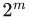 × 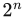 个纹素，其中 m、n 是非负整数。这类纹理称为**二次幂纹理**（power-of-two，POT）。现代 GPU 可以处理任意尺寸的**非二次幂纹理**（non-power-of-two，NPOT），因此生成的图像也可以作为纹理使用。不过，一些较老的移动 GPU 可能不支持 NPOT 纹理的 mipmapping（见 6.2.2 节）。不同图形加速器具有不同的纹理尺寸上限。例如，DirectX 12 允许最多 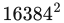 个纹素。

假设我们有一幅 256 × 256 纹素的纹理，希望把它贴在一个正方形上。只要这个正方形投影到屏幕后，其尺寸与纹理大致相同，正方形上的纹理看起来就会几乎和原图一样。但如果投影后的正方形覆盖的像素数是原图的十倍，即发生**放大**（magnification），或者只覆盖屏幕上一小部分，即发生**缩小**（minification），又会怎样？答案取决于你针对这两种不同情况选择了怎样的采样和过滤方法。

本章讨论的图像采样和过滤方法作用于从各个纹理中读出的值。然而，我们希望避免的是最终渲染图像中的混叠；理论上，这需要对最终像素颜色进行采样和过滤。这里的区别在于：过滤着色方程的输入，还是过滤它的输出。只要输入和输出之间具有线性关系，例如颜色输入就是如此，那么过滤各个纹理值就等价于过滤最终颜色。不过，存储在纹理中的许多着色器输入值，如表面法线和粗糙度，与输出具有非线性关系。标准纹理过滤方法可能无法很好地处理这类纹理，从而产生混叠。9.13 节将讨论针对这类纹理的改进过滤方法。

### 6.2.1 放大

图 6.8 中，一幅 48 × 48 纹素的纹理被贴到一个正方形上；相对于纹理尺寸，我们在相当近的距离观察这个正方形，因此底层图形系统必须放大纹理。最常见的放大过滤技术是**最近邻**（其实际滤波器称为盒式滤波器，见 5.4.1 节）和**双线性插值**。另一种技术是**三次卷积**，使用 4 × 4 或 5 × 5 纹素阵列的加权和，能够显著提高放大质量。虽然目前并不普遍提供三次卷积，也称双三次插值，的原生硬件支持，但可以在着色器程序中实现它。

图 6.8 左图使用最近邻方法。这种放大技术的一个特点是单个纹素可能变得清晰可见。这种现象称为**像素化**：放大时，该方法对每个像素中心取距离最近的纹素值，从而产生块状外观。尽管这种方法的质量有时较差，但每个像素只需读取一个纹素。

同图的中间图像使用双线性插值，有时也称线性插值。对每个像素，这种过滤方法找到相邻的四个纹素，并在两个维度上进行线性插值，得到该像素的混合值。结果更加模糊，但最近邻方法产生的大部分锯齿已经消失。可以做个实验：眯起眼睛观察左图。这大致具有低通滤波器的效果，可以让脸部稍微更容易辨认。


图 6.8：把 48 × 48 的图像放大到 320 × 320 像素。左：最近邻过滤，每个像素选择最近的纹素。中：双线性过滤，使用最近的四个纹素的加权平均。右：三次过滤，使用最近的 5 × 5 个纹素的加权平均。

回到书页 170 的砖墙纹理示例：不舍弃小数部分时，得到 (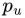, 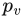) = (81.92, 74.24)。这里采用 OpenGL 的左下角原点纹素坐标系，因为它与标准笛卡尔坐标系一致。我们的目标是在最近的四个纹素之间插值，并以它们的纹素中心定义一个大小等于一个纹素的坐标系。见图 6.9。为了找出最近的四个像素，从采样位置减去像素中心的小数部分 (0.5, 0.5)，得到 (81.42, 73.74)。去掉小数部分后，最近的四个像素从 (x, y) = (81, 73) 延伸到 (x + 1, y + 1) = (82, 74)。小数部分，在本例中为 (0.42, 0.74)，就是采样点相对于四个纹素中心构成的坐标系的位置。将此位置记作 (u′, v′)。


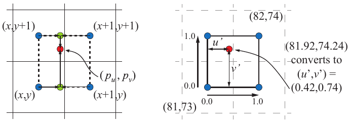

图 6.9：双线性插值。左侧四个方格表示参与插值的四个纹素，蓝色点表示纹素中心。右侧是由这四个纹素中心构成的坐标系。

定义纹理访问函数为 t(x, y)，其中 x、y 为整数，函数返回纹素颜色。任意位置 (u′, v′) 的双线性插值颜色可以分两步计算。首先，在水平方向使用 u′ 对底部纹素 t(x, y) 和 t(x + 1, y) 插值；同样，对顶部两个纹素 t(x, y + 1) 和 t(x + 1, y + 1) 插值。底部得到 (1 − u′)t(x, y) + u′t(x + 1, y)，即图 6.9 下方的绿色圆点；顶部得到 (1 − u′)t(x, y + 1) + u′t(x + 1, y + 1)，即上方绿色圆点。随后使用 v′ 在竖直方向对这两个值插值。因此，(, ) 处的双线性插值颜色 b 为


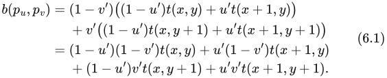


直观地说，离采样位置越近的纹素，对最终值的影响越大。这个方程确实体现了这一点。右上方 (x + 1, y + 1) 处纹素的影响为 u′v′。注意这种对称性：右上方纹素的影响等于左下角与采样点构成的矩形面积。回到示例，这意味着从该纹素取得的值要乘以 0.42 × 0.74，即 0.3108。从此纹素顺时针看，其他乘数依次是 0.42 × 0.26、0.58 × 0.26、0.58 × 0.74。这四个权重之和为 1.0。


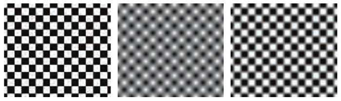

图 6.10：对同一幅 2 × 2 棋盘纹理分别使用最近邻、双线性插值，以及通过重映射得到的两者之间的效果。注意，最近邻采样产生的方格大小略有不同，因为纹理与图像网格并不完全匹配。

解决放大造成的模糊问题，一种常见方法是使用**细节纹理**。这种纹理表示精细的表面细节，例如手机上的划痕或地形上的灌木。以单独的纹理、不同的尺度将这些细节叠加到放大的纹理上。细节纹理的高频重复图案与低频的放大纹理组合后，产生的视觉效果类似于使用单张高分辨率纹理。

双线性插值在两个方向上进行线性插值，但插值并非一定要是线性的。假设纹理由棋盘式排列的黑白像素组成。双线性插值会在整个纹理中产生不同灰度的样本。通过重映射，例如令所有低于 0.4 的灰度都为黑色，所有高于 0.6 的灰度都为白色，并把中间部分拉伸以填满间隔，纹理就会重新更像棋盘，同时在纹素之间保留一定混合。见图 6.10。

使用更高分辨率的纹理也会产生类似效果。例如，设想每个棋盘格由 4 × 4 纹素组成，而不是 1 × 1。在每个格子的中心附近，插值颜色就会完全为黑色或白色。

图 6.8 的右图使用了双三次滤波器，剩余的块状感基本被消除了。应当注意，双三次滤波器比双线性滤波器更昂贵。不过，许多高阶滤波器可以表达为重复的线性插值 [1518]，另见 17.1.1 节。因此，可以通过多次查询利用 GPU 纹理单元中的线性插值硬件。

如果认为双三次滤波器太昂贵，Quílez [1451] 提出了一种简单技术：在一组 2 × 2 纹素之间用平滑曲线插值。我们先介绍曲线，再介绍技术。两条常用曲线是 smoothstep 曲线和五次曲线 [1372]：


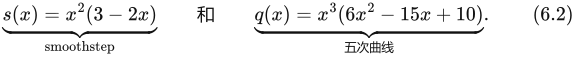


在许多需要从一个值平滑插值到另一个值的情形中，这些曲线也很有用。smoothstep 曲线满足 s′(0) = s′(1) = 0，并且在 0 到 1 之间平滑。五次曲线具有相同性质，还满足 q″(0) = q″(1) = 0，即曲线起点和终点的二阶导数也为 0。两条曲线见图 6.11。


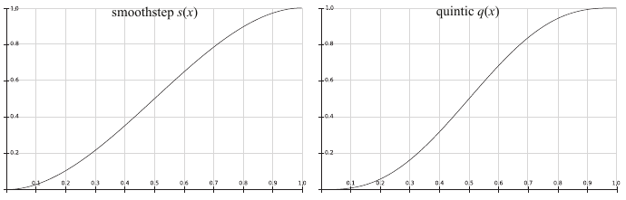

图 6.11：smoothstep 曲线 s(x)（左）和五次曲线 q(x)（右）。

该技术首先计算 (u′, v′)，与公式（6.1）及图 6.9 中使用的量相同：先将采样坐标乘以纹理尺寸，再加上 0.5。保留整数部分供后续使用，将小数部分存入 u′ 和 v′，它们位于 [0, 1] 范围内。然后将 (u′, v′) 变换为 (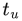, 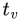) = (q(u′), q(v′))，仍然位于 [0, 1] 内。最后减去 0.5，并加回整数部分；将所得 u 坐标除以纹理宽度，对 v 也进行类似处理。此时，用新的纹理坐标执行 GPU 提供的双线性插值查询。注意，这种方法会在每个纹素处产生平台。这意味着，例如当纹素颜色在 RGB 空间中位于同一个平面上时，这种插值会产生平滑但仍带有阶梯状的外观，未必总是理想。见图 6.12。


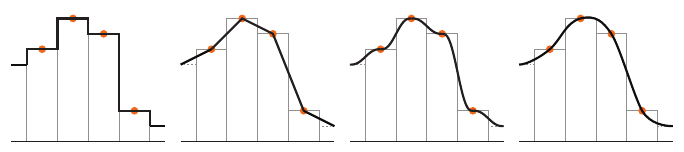

图 6.12：放大一维纹理的四种不同方法。橙色圆点表示纹素中心及其纹素值，高度表示数值。从左到右：最近邻、线性插值、在每对相邻纹素之间使用五次曲线，以及三次插值。

### 6.2.2 缩小


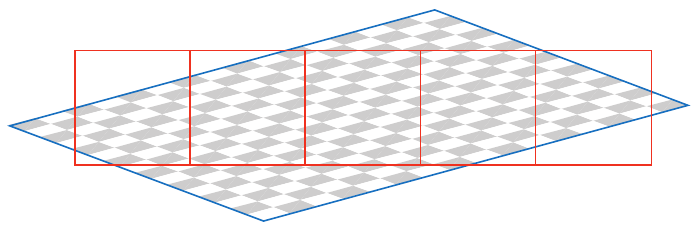

图 6.13：缩小。通过一行像素单元观察一个贴有棋盘纹理的正方形，粗略展示多个纹素如何影响每个像素。

纹理缩小时，多个纹素可能覆盖一个像素单元，如图 6.13 所示。要为每个像素得到正确颜色，应对影响该像素的纹素效果进行积分。然而，很难精确确定某个像素附近所有纹素的确切影响，实时地完美完成这一过程实际上是不可能的。

由于这种限制，GPU 采用了几种不同的方法。一种方法是最近邻，其工作方式与对应的放大滤波器完全相同，即选择在像素单元中心可见的纹素。这种滤波器可能造成严重混叠。图 6.14 最上方的图像采用最近邻方法。靠近地平线时出现了伪影，因为在影响一个像素的许多纹素中，只选择了一个来代表表面。当表面相对于观察者移动时，这类伪影会更显著，这是所谓**时间混叠**的一种表现。

另一种通常可用的滤波器是双线性插值，同样与用于放大的滤波器工作方式完全一致。对于缩小，它只比最近邻方法稍好。它混合四个纹素，而不是只使用一个，但当一个像素受到超过四个纹素的影响时，该滤波器很快就会失效并产生混叠。

还可以采用更好的解决方案。如 5.4.1 节所述，可以通过采样和过滤技术处理混叠。纹理信号的频率取决于其纹素在屏幕上排列得有多密。由于奈奎斯特极限，我们需要确保纹理信号频率不大于采样频率的一半。例如，一幅图像由间隔一个纹素的交替黑白线组成。那么波长为两个纹素宽，即从一条黑线到下一条黑线，频率为 ½。要在屏幕上正确显示这种纹理，采样频率至少应为 2 × ½，即每个纹素至少有一个像素。因此，对于一般纹理，每个像素至多对应一个纹素，才能避免混叠。

要实现这个目标，要么提高像素采样频率，要么降低纹理频率。上一章讨论的抗锯齿方法提供了提高像素采样率的途径，但所能实现的提高幅度有限。为了更充分地解决这个问题，人们开发了多种纹理缩小算法。


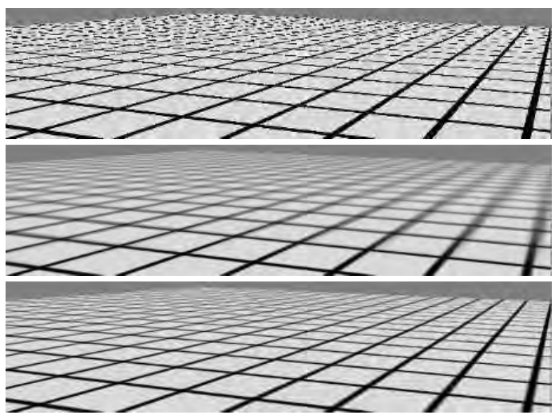

图 6.14：上图使用点采样，即最近邻，进行渲染；中图使用 mipmapping；下图使用区域求和表。

所有纹理抗锯齿算法的基本思想都相同：预处理纹理，建立有助于快速近似计算一组纹素对一个像素影响的数据结构。用于实时工作的这类算法具有执行时间和资源用量固定的特点。这样，每个像素采集固定数量的样本，再将其组合，以计算数量可能极其庞大的纹素所产生的影响。

#### Mipmapping（多级渐远纹理）

最流行的纹理抗锯齿方法称为 **mipmapping** [1889]。目前生产的所有图形加速器都以某种形式实现了它。“Mip” 来自拉丁语 multum in parvo，意思是“在很小的地方容纳许多东西”；对于这种把原始纹理反复过滤成更小图像的过程，这是一个很贴切的名字。

使用 mipmapping 缩小滤波器时，在真正开始渲染之前，要为原始纹理添加一组较小的纹理版本。将第 0 级纹理下采样到原面积的四分之一，每个新纹素值通常由原纹理中四个相邻纹素的平均值计算得到。新的第 1 级纹理有时称为原纹理的**子纹理**。不断递归执行缩小，直到纹理的一个或两个维度等于一个纹素。图 6.15 展示了这一过程。这一整组图像通常称为 **mipmap 链**。


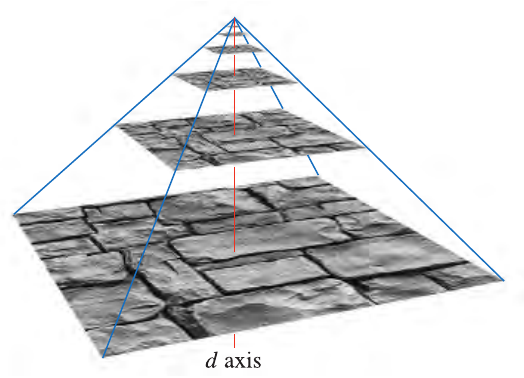

图 6.15：构造 mipmap 时，将原始图像放在金字塔底部，作为第 0 级；对每个 2 × 2 区域取平均，形成上一级的一个纹素值。竖直轴是第三个纹理坐标 d。在此图中，d 不是线性的；它用来衡量一个样本使用哪两个纹理层级进行插值。

生成高质量 mipmap 的两个重要要素是良好的过滤和伽马校正。构造 mipmap 某一级的常见方法是对每组 2 × 2 纹素取平均，得到 mip 纹素值。这样使用的就是盒式滤波器，它是效果最差的滤波器之一。这可能导致质量低下，因为它不必要地模糊了低频内容，同时保留了一些会产生混叠的高频内容 [172]。更好的做法是使用高斯、Lanczos、Kaiser 或类似滤波器。已有用于此任务的快速、免费源代码 [172, 1592]，一些 API 还支持直接在 GPU 上进行更好的过滤。在纹理边缘附近，过滤时要注意纹理是重复平铺，还是只出现一次。

对于在非线性空间中编码的纹理，例如大多数颜色纹理，如果过滤时忽略伽马校正，就会改变各 mipmap 层级的感知亮度 [173, 607]。随着观察者远离物体，未经校正的 mipmap 开始被使用，物体整体可能看起来更暗，对比度和细节也可能受到影响。因此，重要的是先将这些纹理从 sRGB 转换到线性空间（5.6 节），在线性空间中完成全部 mipmap 过滤，再把最终结果转换回 sRGB 颜色空间存储。大多数 API 支持 sRGB 纹理，因而会在线性空间中正确生成 mipmap，并将结果以 sRGB 存储。访问 sRGB 纹理时，其数值先转换到线性空间，从而正确执行放大和缩小。

如前所述，有些纹理与最终着色颜色之间本质上是非线性关系。虽然这对一般过滤就构成问题，但 mipmap 生成对此尤其敏感，因为它要过滤数百乃至数千个像素。为了获得最佳结果，往往需要专门的 mipmap 生成方法。9.13 节将详细介绍这些方法。


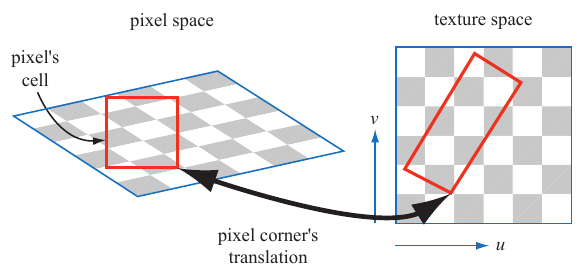

图 6.16：左侧是一个正方形像素单元及其看到的纹理。右侧是该像素单元在纹理本身上的投影。

在纹理处理中访问这一结构的基本过程很直接。屏幕像素在纹理本身上圈定了一块区域。把像素区域投影到纹理上时，如图 6.16，它会包含一个或多个纹素。严格来说，使用像素单元的边界并不正确，这里只是为了简化叙述。单元外的纹素也可能影响像素颜色，见 5.4.1 节。我们的目标是大致确定纹理中有多大区域影响这个像素。通常用两种度量计算 d，OpenGL 将其称为 λ，也称为**纹理细节层级**。一种方法使用像素单元形成的四边形的较长边来近似像素覆盖范围 [1889]；另一种方法使用四个微分 ∂u/∂x、∂v/∂x、∂u/∂y 和 ∂v/∂y 中的最大绝对值作为度量 [901, 1411]。每个微分都衡量纹理坐标相对于某条屏幕轴的变化量。例如，∂u/∂x 是沿屏幕 x 轴移动一个像素时，纹理 u 值的变化量。关于这些方程的更多说明，见 Williams 的原始论文 [1889]，或 Flavell [473]、Pharr [1411] 的文章。McCormack 等人 [1160] 讨论了最大绝对值方法引入的混叠，并给出了另一个公式。Ewins 等人 [454] 分析了几种质量相近的算法的硬件开销。

使用 Shader Model 3.0 或更高版本的像素着色器程序可以取得这些梯度值。由于它们基于相邻像素之间的数值差异，因此在像素着色器中受动态流程控制影响的代码段内无法取得（见 3.8 节）。如果要在这种代码段中执行纹理读取，例如在循环内部，就必须预先计算导数。注意，顶点着色器无法访问梯度信息，因此在使用顶点纹理时，需要在顶点着色器自身中计算梯度或细节层级，并将其提供给 GPU。

计算坐标 d 的目的是确定沿 mipmap 金字塔轴的采样位置。见图 6.15。目标是让像素与纹素的比例至少达到 1∶1，以满足奈奎斯特采样率。这里的重要原则是：随着像素单元包含的纹素越来越多，d 增大，就去访问更小、更模糊的纹理版本。三元组 (u, v, d) 用来访问 mipmap。d 类似纹理层级，但它不是整数，而是具有小数部分，表示层级之间的位置。分别对 d 所在位置上方和下方的纹理层级采样。在这两个层级中，用 (u, v) 位置各取得一个双线性插值样本；然后根据各纹理层级到 d 的距离，对得到的样本进行线性插值。整个过程称为**三线性插值**，对每个像素执行。

用户对 d 坐标的一项控制是**细节层级偏置**（LOD bias）。这个值加到 d 上，因此会影响纹理感知上的相对清晰程度。如果起点沿金字塔向上移动，即增大 d，纹理就会更模糊。对于给定纹理，合适的 LOD 偏置随图像类型和使用方式而变化。例如，原本就有些模糊的图像可以使用负偏置，而过滤不佳、带有混叠的合成图像用于纹理时可以使用正偏置。可以为整个纹理指定偏置，也可以在像素着色器中逐像素指定。要进行更精细的控制，用户可以直接提供 d 坐标或用于计算它的导数。

Mipmapping 的优点在于：不必逐一累加影响一个像素的所有纹素，而是访问预先合并的纹素集合并进行插值。不管缩小程度如何，这个过程都耗费固定时间。不过，mipmapping 有若干缺陷 [473]，一个主要缺陷就是过度模糊。设想一个像素单元在 u 方向覆盖大量纹素，而在 v 方向只覆盖少量纹素。当观察者几乎沿着带纹理表面的边缘方向观察时，这种情形很常见。实际上，甚至可能需要沿纹理的一条轴缩小，而沿另一条轴放大。访问 mipmap 的结果是取得纹理上的正方形区域，无法取得矩形区域。为了避免混叠，我们选择像素单元在纹理上近似覆盖范围的最大度量。这使得取得的样本常常相对模糊。图 6.14 的 mipmap 图像中可以看到这种效果：右侧向远处延伸的线条出现了过度模糊。

#### 区域求和表

另一种避免过度模糊的方法是**区域求和表**（summed-area table，SAT）[312]。使用此方法时，先建立一个与纹理尺寸相同的数组，但存储颜色时使用更高的位精度，例如红、绿、蓝每个通道各用 16 位或更多。在数组的每个位置，计算并存储由这个位置与纹素 (0, 0)，即原点，构成的矩形内所有对应纹素的总和。进行纹理处理时，用一个矩形包围像素单元在纹理上的投影。然后访问区域求和表，确定这个矩形的平均颜色，并将其作为该像素的纹理颜色返回。计算平均值所用的矩形纹理坐标见图 6.17，具体采用公式（6.3）：


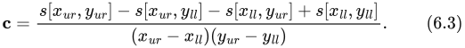


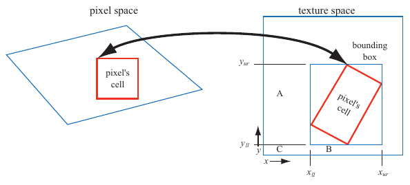

图 6.17：将像素单元反投影到纹理上，用矩形包围它；利用矩形的四个角访问区域求和表。

这里，x 和 y 是矩形的纹素坐标，s[x, y] 是该纹素处的区域求和值。这个方程先取右上角到原点的整个区域之和，再通过减去相邻角点的贡献，减掉区域 A 和 B。区域 C 被减去了两次，因此再通过左下角把它加回。注意，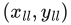 是区域 C 的右上角，即 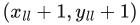 才是包围盒的左下角。

使用区域求和表的结果见图 6.14。靠近右边缘、伸向地平线的线条更加清晰，但中间斜向交叉的线条仍然过度模糊。问题在于：沿纹理对角方向观察时，会生成一个很大的矩形，其中许多纹素离正在计算的像素很远。例如，想象一个细长矩形代表像素单元的反投影，沿图 6.17 整张纹理的对角线横跨纹理。返回的将是整个纹理矩形的平均值，而不只是像素单元内部的平均值。

区域求和表是所谓**各向异性过滤**算法的一例 [691]。这类算法取得的纹素值来自非正方形区域。然而，SAT 主要在水平和竖直方向上才能最有效地做到这一点。还要注意，即使纹理尺寸为 16 × 16 或更小，区域求和表也至少需要两倍内存；更大的纹理需要更高精度。

区域求和表能够在合理的整体内存开销下提供更高质量，并且可以在现代 GPU 上实现 [585]。过滤的改进对高级渲染技术的质量可能至关重要。例如，Hensley 等人 [718, 719] 给出了一种高效实现，并展示区域求和采样如何改善光泽反射。其他使用区域采样的算法也可以通过 SAT 改进，例如景深 [585, 719]、阴影贴图 [988] 和模糊反射 [718]。

#### 无方向限制的各向异性过滤

对于当前图形硬件，进一步改善纹理过滤最常见的方法是复用现有的 mipmap 硬件。基本思想是：将像素单元反投影，在纹理上所得的四边形上采样多次，再合并样本。如前所述，每个 mipmap 样本都关联一个位置和一个大致呈正方形的区域。该算法不使用单个 mipmap 样本近似整个四边形的覆盖范围，而是用多个正方形覆盖它。可以用四边形的较短边确定 d；这与 mipmapping 通常使用较长边不同。这样，每个 mipmap 样本取平均的区域就更小，因而模糊更少。用四边形的较长边建立一条**各向异性线**，它与较长边平行，并穿过四边形中部。当各向异性程度介于 1∶1 和 2∶1 之间时，沿该线取两个样本（见图 6.18）。各向异性比例更高时，就沿该轴取更多样本。


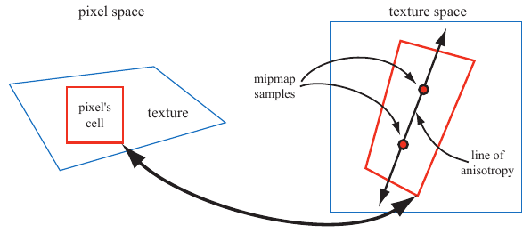

图 6.18：各向异性过滤。像素单元的反投影形成一个四边形。在较长的两条边之间建立一条各向异性线。

这种方案允许各向异性线沿任意方向，因此没有区域求和表的方向限制。它利用 mipmap 算法采样，所以所需纹理内存也不多于 mipmap。图 6.19 给出了各向异性过滤的示例。


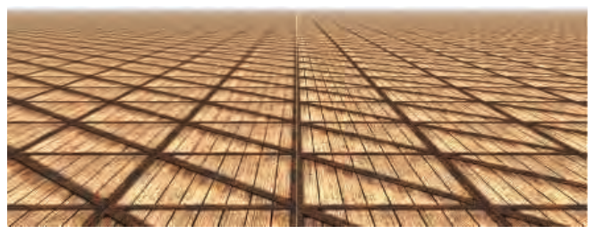

图 6.19：Mipmap 与各向异性过滤。左侧使用三线性 mipmapping，右侧使用 16∶1 各向异性过滤。靠近地平线时，各向异性过滤得到更清晰的结果，同时只有极少混叠。（图像来自 three.js 示例 `webgl_materials_texture_anisotropy` [218]。）

这种沿轴采样的思想最早由 Schilling 等人在 Texram 动态存储器器件中提出 [1564]。Barkans 描述了该算法在 Talisman 系统中的使用 [103]。McCormack 等人 [1161] 提出了一个名为 Feline 的类似系统。在 Texram 的最初形式中，沿各向异性轴的样本，也称为探针，具有相同权重。Talisman 将轴两端的两个探针赋予一半权重。Feline 使用高斯滤波核为整组探针加权。这些算法接近椭圆加权平均（Elliptical Weighted Average，EWA）滤波器等软件采样算法的高质量。EWA 将像素的影响区域变换为纹理上的椭圆，并用滤波核对椭圆内的纹素加权 [691]。Mavridis 和 Papaioannou 给出了数种利用 GPU 着色器代码实现 EWA 过滤的方法 [1143]。

### 6.2.3 体纹理

图像纹理的直接扩展是通过 (u, v, w)，或 (s, t, r)，访问的三维图像数据。例如，医学成像数据可以生成为三维网格；让一个多边形在网格中移动，就可以查看这些数据的二维切片。一个相关思想是用这种形式表示体积光源。要找到表面某点受到的照明，就查询该点在这个体积内所在位置的数值，再结合光的方向。

大多数 GPU 支持体纹理的 mipmapping。由于在体纹理单个 mipmap 层级内过滤就需要三线性插值，因此层级之间的过滤需要**四线性插值**。这涉及对 16 个纹素的结果取平均，可能产生精度问题，可以通过采用更高精度的体纹理解决。Sigg 和 Hadwiger [1638] 讨论了这些及其他与体纹理有关的问题，并提供执行过滤等操作的高效方法。

尽管体纹理的存储需求明显更高，过滤也更昂贵，但它确实有一些独特优点。由于可以直接将三维位置用作纹理坐标，因此不必为三维网格寻找良好的二维参数化方式，省去了这一复杂过程。这样可以避免二维参数化中常见的畸变和接缝问题。体纹理还可以表示木材或大理石等材质的体积结构。使用这种纹理的模型看起来就像从该材料中雕刻出来的一样。

将体纹理用于表面纹理处理极其低效，因为绝大多数样本都不会被使用。Benson 和 Davis [133] 以及 DeBry 等人 [334] 讨论了在稀疏八叉树结构中存储纹理数据的方法。这种方案非常适合交互式三维绘画系统，因为创建表面时不必为其显式分配纹理坐标，而且八叉树能够容纳细化到任意所需层级的纹理细节。Lefebvre 等人 [1017] 讨论了在现代 GPU 上实现八叉树纹理的细节。Lefebvre 和 Hoppe [1018] 讨论了一种把稀疏体积数据打包到显著更小的纹理中的方法。

### 6.2.4 立方体贴图

另一类纹理是**立方体纹理**或**立方体贴图**，它由六张正方形纹理构成，每张对应立方体的一个面。访问立方体贴图时，使用一个三分量纹理坐标向量，指定一条从立方体中心向外射出的射线方向。按下述方法确定射线与立方体相交的位置：绝对值最大的纹理坐标分量选择对应的面，例如向量 (−3.2, 5.1, −8.4) 选择 −z 面。把其余两个坐标除以绝对值最大的坐标分量的绝对值，即 8.4。它们现在处于 −1 到 1 之间，只需重映射到 [0, 1] 即可得到纹理坐标。例如，坐标 (−3.2, 5.1) 映射为 ((−3.2/8.4 + 1)/2, (5.1/8.4 + 1)/2) ≈ (0.31, 0.80)。立方体贴图适合表示以方向为自变量的数值，最常用于环境贴图（见 10.4.3 节）。

### 6.2.5 纹理表示

应用程序处理大量纹理时，可以通过几种方式改善性能。纹理压缩在 6.2.6 节介绍，而本小节聚焦于纹理图集、纹理数组和无绑定纹理，它们都旨在避免渲染时更换纹理的开销。19.10.1 和 19.10.2 节将介绍纹理流式传输和转码。

为了尽可能将更多工作批量交给 GPU，通常应尽量减少状态切换（18.4.2 节）。为此，可以把若干图像放进一张更大的纹理中，称为**纹理图集**。图 6.20 左侧展示了这一点。注意，子纹理的形状可以是任意的，如图 6.6 所示。Nöll 和 Stricker [1286] 介绍了图集中子纹理放置的优化。生成和访问 mipmap 时也需要小心，因为 mipmap 的上层可能包含几个彼此独立、互不相关的形状。Manson 和 Schaefer [1119] 提出一种考虑表面参数化的 mipmap 创建优化方法，能够产生明显更好的结果。Burley 和 Lacewell [213] 提出名为 Ptex 的系统，其中细分曲面的每个四边形都有自己的小纹理。其优点是无需为整个网格分配唯一纹理坐标，而且不会在纹理图集中不相连部分的接缝处出现伪影。为实现跨四边形过滤，Ptex 使用一种邻接数据结构。尽管最初面向影视制作渲染，Hillesland [746] 提出了打包 Ptex，将每个面的子纹理放入纹理图集，并用相邻面的填充内容避免过滤时的间接寻址。Yuksel [1955] 提出**网格颜色纹理**，进一步改进 Ptex。Toth [1780] 为类似 Ptex 的系统提供高质量跨面过滤：如果某个过滤采样点超出 [0, 1]² 范围，就舍弃该点。


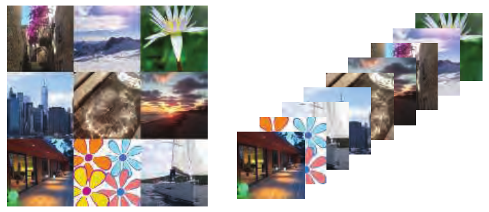

图 6.20：左：一张纹理图集，将九幅较小图像合成为单张大纹理。右：更现代的方式是将小图像设置为纹理数组，这是大多数 API 都具有的概念。

使用图集的一个难点是环绕／重复和镜像模式：它们不能正确作用于某个子纹理，只会作用于整个纹理。另一个问题发生在为图集生成 mipmap 时，一个子纹理可能渗入另一个子纹理。不过，可以在把各个子纹理放入大图集之前分别生成其 mipmap 层次结构，并令子纹理采用二次幂分辨率，从而避免这一问题 [1293]。

更简单的解决办法是使用 API 中称为**纹理数组**的构造，它完全避免了 mipmapping 和重复模式方面的问题 [452]。见图 6.20 右侧。纹理数组中的所有子纹理必须具有相同的尺寸、格式、mipmap 层次结构和 MSAA 设置。与纹理图集一样，纹理数组只需设置一次，之后就可以在着色器中用索引访问任意数组元素。其速度可以达到逐个绑定子纹理的五倍 [452]。

另一项有助于避免状态切换开销的特性，是 API 对**无绑定纹理**的支持 [1407]。没有无绑定纹理时，纹理通过 API 绑定到某个特定纹理单元。纹理单元数量存在上限，这会使程序员的工作复杂化。驱动负责确保纹理驻留在 GPU 一侧。使用无绑定纹理后，纹理数量没有这种上限，因为每个纹理只通过一个指向其数据结构的 64 位指针关联，这种指针有时称为句柄。可以通过多种途径访问这些句柄，例如统一变量、插值变化数据、其他纹理，或着色器存储缓冲对象（SSBO）。应用程序需要确保纹理驻留在 GPU 一侧。无绑定纹理避免了驱动中各种绑定开销，从而使渲染更快。

### 6.2.6 纹理压缩

一种直接解决内存、带宽和缓存问题的办法是**固定码率纹理压缩** [127]。让 GPU 即时解码压缩纹理，可以减少纹理占用的显存，进而增大有效缓存容量。至少同样重要的是，压缩纹理访问时消耗的内存带宽更少，因此使用效率更高。一个相关但不同的应用情形，是通过压缩来容纳更大的纹理。例如，一张每纹素使用 3 字节、分辨率为 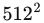 的未压缩纹理占用 768 kB。若采用 6∶1 的纹理压缩率，一张 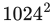 的纹理只需 512 kB。

JPEG、PNG 等图像文件格式采用了多种图像压缩方法，但用硬件实现这些格式的解码代价很高；关于纹理转码的信息，另见 19.10.1 节。S3 开发了一种名为 S3 Texture Compression（S3TC）的方案 [1524]，被选为 DirectX 的标准，并称为 DXTC；在 DirectX 10 中称为 BC，即 Block Compression，块压缩。此外，它也是 OpenGL 的事实标准，因为几乎所有 GPU 都支持它。这种方案的优点是压缩图像大小固定，各部分独立编码，并且解码简单，因而快速。图像中每个压缩部分可以独立于其他部分处理，没有共享查找表或其他依赖关系，从而简化了解码。

DXTC/BC 压缩方案有七个变体，它们具有一些共同性质。编码以 4 × 4 纹素块为单位，这些块也称为瓦片。每块独立编码。编码基于插值：对于每种待编码的量，存储两个参考值，例如颜色；为块中 16 个纹素中的每一个保存一个插值因子。它选择两个参考值连线上的某个值，例如直接等于某个存储颜色，或由两个存储颜色插值得到的颜色。压缩来自只存储两个颜色，以及每个像素一个较短的索引值。

表 6.1：纹理压缩格式。所有格式都压缩 4 × 4 纹素块。“存储”列给出每块字节数（B）以及每纹素位数（bpt）。参考颜色的记法先列通道，再列各通道位数。例如 RGB565 表示红、蓝各 5 位，绿通道 6 位。

| 名称 | 存储 | 参考颜色 | 索引 | Alpha | 说明 |
| --- | --- | --- | --- | --- | --- |
| BC1/DXT1 | 8 B / 4 bpt | RGB565 × 2 | 2 bpt | — | 1 条线 |
| BC2/DXT3 | 16 B / 8 bpt | RGB565 × 2 | 2 bpt | 4 bpt，原始值 | 颜色与 BC1 相同 |
| BC3/DXT5 | 16 B / 8 bpt | RGB565 × 2 | 2 bpt | 3 bpt，插值 | 颜色与 BC1 相同 |
| BC4 | 8 B / 4 bpt | R8 × 2 | 3 bpt | — | 1 个通道 |
| BC5 | 16 B / 8 bpt | RG88 × 2 | 2 × 3 bpt | — | 2 × BC4 |
| BC6H | 16 B / 8 bpt | 见正文 | 见正文 | — | 用于 HDR；1—2 条线 |
| BC7 | 8 B / 4 bpt | 见正文 | 见正文 | 可选 | 1—3 条线 |

> 译注：原表 BC7 的“存储”栏确实印为“8 B / 4 bpt”，而下文写明 BC7 存储 8 bpt，两处不一致。此处按原表保留，不作无说明的改写；对于 4 × 4 纹素块，正文所述 8 bpt 对应每块 16 B。

七种变体的确切编码方式各不相同，汇总见表 6.1。注意，“DXT” 表示 DirectX 9 中的名称，“BC” 表示 DirectX 10 及之后的名称。由表可见，BC1 有两个 16 位参考 RGB 值，红 5 位、绿 6 位、蓝 5 位；每个纹素有一个 2 位插值因子，用于从两个参考值或两个中间值中选择一个。¹ 与未压缩的 24 位 RGB 纹理相比，这相当于 6∶1 的纹理压缩率。BC2 的颜色编码方式与 BC1 相同，但每个纹素增加 4 位，用来存储量化的原始 alpha 值。BC3 的每块 RGB 数据采用与 DXT1 块相同的编码方式。此外，alpha 数据用两个 8 位参考值及每纹素 3 位插值因子编码。每个纹素可以选择一个参考 alpha 值，或者六个中间值之一。BC4 只有一个通道，其编码方式与 BC3 的 alpha 相同。BC5 包含两个通道，每个通道按 BC3 中的方式编码。

BC6H 用于高动态范围（HDR）纹理，其中每个纹素的 R、G、B 通道最初各具有一个 16 位浮点值。该模式使用 16 字节，因此为 8 bpt。它有一种使用单条线的模式，类似前述技术；另有一种使用两条线的模式，其中每块可以从一小组分区中选择。两个参考颜色还可以采用差分编码以获得更高精度，并且根据使用的模式不同，它们也可以具有不同精度。BC7 中，每块可以有一到三条线，存储 8 bpt。其目标是对 8 位 RGB 和 RGBA 纹理进行高质量压缩。它与 BC6H 具有许多共同性质，但它面向 LDR 纹理，而 BC6H 面向 HDR。注意，BC6H 和 BC7 在 OpenGL 中分别称为 `BPTC_FLOAT` 和 `BPTC`。这些压缩技术可以用于立方体纹理、体纹理，也可以用于二维纹理。

¹ 原书脚注 1：另一种 DXT1 模式将四种可能的插值因子之一保留给透明像素，使可用的插值结果数量限制为三个，即两个参考值及其平均值。

这些压缩方案的主要缺点是**有损**。也就是说，通常无法从压缩版本恢复原始图像。对于 BC1—BC5，只使用四个或八个插值值来表示 16 个像素。如果一个块中不同数值的数量更多，就会损失一些信息。实践中，只要使用得当，这些压缩方案通常能够提供可接受的图像保真度。

BC1—BC5 的一个问题是，每个块使用的所有颜色都位于 RGB 空间的一条直线上。例如，红、绿、蓝三种颜色不能同时表示在一个块中。BC6H 和 BC7 支持更多线，因此可以提供更高质量。


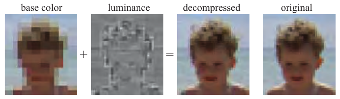

图 6.21：ETC（爱立信纹理压缩）对像素块的颜色进行编码，然后逐像素修改亮度，产生最终纹素颜色。（图像由 Jacob Ström 压缩。）图中从左到右为基础颜色、亮度、解压结果和原始图像。

OpenGL ES 选择了另一种压缩算法纳入 API，称为**爱立信纹理压缩**（Ericsson texture compression，ETC）[1714]。它具有与 S3TC 相同的特征：快速解码、随机访问、没有间接查询，以及固定码率。它把一个 4 × 4 纹素块编码为 64 位，即每纹素 4 位。图 6.21 展示其基本思想。每个 2 × 4 块，或 4 × 2 块，取决于哪种质量更好，存储一个基础颜色。每块还从一个小型静态查找表中选择一组四个常数，块中的每个纹素可以选择加上其中一个值，以此逐像素修改亮度。其图像质量与 DXTC 相当。

OpenGL ES 3.0 纳入的 ETC2 [1715] 利用未使用的位组合，为原有 ETC 算法添加了更多模式。未使用的位组合是指某种压缩表示，例如 64 位的表示，与另一种压缩表示解压后得到同一幅图像。例如在 BC1 中，将两个参考颜色设为相同是没有意义的，因为这表示一个恒定颜色块，而只要一个参考颜色包含这个恒定颜色，就已经可以得到同样结果。在 ETC 中，还可以用有符号数相对于第一个颜色对另一个颜色进行差分编码，因此计算可能发生上溢或下溢。这类情况被用来指示其他压缩模式。ETC2 添加了两种新模式，每块都有四个颜色，但推导方式不同；还添加了最后一种在 RGB 空间中为一个平面的模式，旨在处理平滑过渡。**爱立信 alpha 压缩**（Ericsson alpha compression，EAC）[1868] 对单分量图像，例如 alpha，进行压缩。它类似基本 ETC 压缩，但只有一个分量，所得图像每纹素存储 4 位。它可以选择与 ETC2 组合，还可以用两个 EAC 通道压缩法线，下文将进一步讨论。ETC1、ETC2 和 EAC 都属于 OpenGL 4.0 核心配置、OpenGL ES 3.0、Vulkan 和 Metal 的组成部分。

压缩法线贴图，见 6.7.2 节，需要谨慎处理。为 RGB 颜色设计的压缩格式通常不适合处理法线 xyz 数据。大多数方法利用法线已知为单位长度这一事实，并进一步假设 z 分量为正；对于切线空间法线，这是一个合理假设。这样只需存储法线的 x、y 分量，z 分量即时推导为


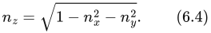


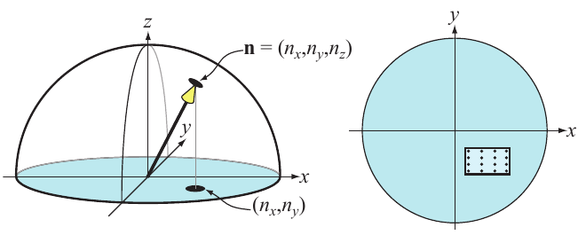

图 6.22：左：球面上的单位法线只需编码 x 和 y 分量。右：对于 BC4/3Dc，xy 平面上的一个盒子包围这些法线；对于每个 4 × 4 法线块，可以使用该盒内的 8 × 8 个法线。为清楚起见，图中只画出 4 × 4 个法线。

> 译注：图 6.22 原图注写作“BC4/3Dc”，本页正文写作“BC5/3Dc”，两处不一致。译文分别按原图注、原正文保留。

仅存储两个分量而不是三个，本身就带来一定程度的压缩。由于大多数 GPU 不原生支持三分量纹理，这也避免了浪费一个分量的可能性，或避免必须在第四个分量里打包其他量。通常通过将 x、y 分量存储在 BC5/3Dc 格式纹理中进一步压缩，见图 6.22。每块的参考值界定 x、y 分量的最小值和最大值，因此可以把它们看作在 xy 平面上定义一个包围盒。3 位插值因子允许每条轴选择八个值，因此包围盒被划分为一个包含可能法线的 8 × 8 网格。另一种方式是用 EAC 的两个通道存储 x、y，再按上式计算 z。

对于不支持 BC5/3Dc 或 EAC 格式的硬件，一种常见的回退办法 [1227] 是使用 DXT5 格式纹理，将两个分量存入绿色和 alpha 分量，因为这两个分量的存储精度最高。其余两个分量不使用。

PVRTC [465] 是 Imagination Technologies 的 PowerVR 硬件支持的纹理压缩格式，最广泛应用于 iPhone 和 iPad。它提供每纹素 2 位和 4 位两种方案，压缩 4 × 4 纹素块。其核心思想是提供图像的两个低频、平滑信号，它们通过相邻块的纹素数据及插值得到。然后每纹素使用 1 位或 2 位，在整幅图像的这两个信号之间进行插值。

**自适应可伸缩纹理压缩**（adaptive scalable texture compression，ASTC）[1302] 的不同之处在于，它将一个 n × m 纹素块压缩为 128 位。块尺寸从 4 × 4 到 12 × 12，对应不同码率，最低为每纹素 0.89 位，最高为 8 位。ASTC 使用多种技巧紧凑表示索引，线的数量和端点编码可以逐块选择。此外，ASTC 可以处理每张纹理 1—4 个通道，以及 LDR、HDR 两种纹理。ASTC 是 OpenGL ES 3.2 及更高版本的一部分。

上面介绍的所有纹理压缩方案都是有损的。压缩纹理时，可以投入不同时间。用几秒乃至几分钟压缩，可以获得明显更高的质量，因此通常将其作为离线预处理，存储结果供以后使用。另一种选择是只花几毫秒，结果质量较低，但可以接近实时地完成压缩并立即使用。例如，每隔大约两秒重新生成一次天空盒（13.3 节），因为云可能略有移动。解压缩极其快速，因为它由固定功能硬件执行。这种差异称为**数据压缩不对称性**：压缩可能，而且确实会，比解压缩耗费长得多的时间。

Kaplanyan [856] 提出了几种改善压缩纹理质量的方法。对于颜色纹理和法线贴图，都建议在制作时每分量使用 16 位。对于颜色纹理，随后对这 16 位数据进行**直方图重新归一化**，再在着色器中使用每纹理的缩放和偏置常量逆转其效果。直方图归一化将图像使用的数值展开，使其覆盖整个范围，实际上是一种对比度增强。每分量采用 16 位，可以确保重新归一化后直方图中没有未使用的空档，从而减少许多纹理压缩方案可能引入的色带伪影。图 6.23 展示了这种效果。此外，Kaplanyan 建议：如果 75% 的像素高于 116/255，就将纹理存储在线性颜色空间中，否则存储在 sRGB 中。对于法线贴图，他还指出，BC5/3Dc 通常独立于 y 压缩 x，这意味着未必总能找到最佳法线。因此，他建议使用下述法线误差度量：


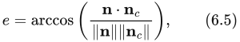


其中 **n** 是原始法线，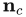 是该法线经过压缩、再解压缩后的结果。


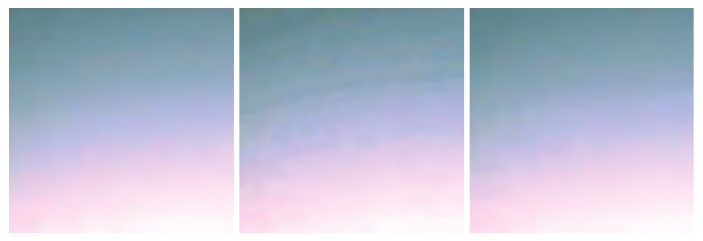

图 6.23：纹理压缩中使用每分量 16 位与 8 位的效果比较。从左到右：原始纹理；从每分量 8 位数据压缩得到的 DXT1；从每分量 16 位数据压缩得到的 DXT1，并在着色器中进行重新归一化处理。为更清楚地展示效果，纹理在强光照下渲染。（图片由 Anton Kaplanyan 惠允提供。）

还应注意，可以在不同颜色空间中压缩纹理，从而加快纹理压缩。一种常用变换是 RGB → YCoCg [1112]：


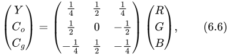


其中 Y 是亮度项，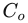 和 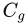 是色度项。逆变换的开销也很低：


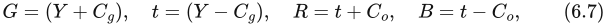


只需要少量加法。这两个变换是线性的；公式（6.6）是矩阵与向量相乘，其本身就是线性运算，见公式（4.1）和（4.2）。这一点很重要，因为可以在纹理中存储 YCoCg 而不是 RGB，纹理硬件仍能在 YCoCg 空间中执行过滤，再由像素着色器按需转换回 RGB。应当注意，这个变换本身有损，这一点是否重要取决于具体情况。

另有一种可逆的 RGB → YCoCg 变换，归纳如下：


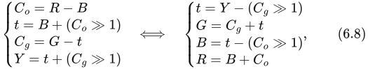


其中 ≫ 表示右移。这意味着，例如可以在一个 24 位 RGB 颜色和对应的 YCoCg 表示之间来回转换，而不产生任何损失。注意，如果 RGB 每个分量有 n 位，那么为了保证变换可逆， 和  各需要 n + 1 位，而 Y 只需 n 位。Van Waveren 和 Castaño [1852] 使用有损 YCoCg 变换，在 CPU 或 GPU 上实现了快速 DXT5/BC3 压缩。他们将 Y 存入 alpha 通道，因为它的精度最高，而将  和  存储在 RGB 的前两个分量中。由于 Y 单独存储和压缩，压缩速度变快。对于 、 分量，他们求出一个二维包围盒，再选择产生最佳结果的包围盒对角线。注意，对于在 CPU 上动态创建的纹理，最好也在 CPU 上压缩；对于通过 GPU 渲染创建的纹理，通常也最好在 GPU 上压缩。

YCoCg 变换以及其他亮度—色度变换常用于图像压缩，其中色度分量在 2 × 2 像素范围内取平均。这可以减少 50% 的存储量，而且通常效果良好，因为色度往往变化缓慢。Lee-Steere 和 Harmon [1015] 更进一步，将数据转换到色相—饱和度—明度（HSV）空间，在 x、y 方向上分别把色相和饱和度下采样为四分之一，并将明度存为单通道 DXT1 纹理。Van Waveren 和 Castaño 还介绍了快速压缩法线贴图的方法 [1853]。

Griffin 和 Olano [601] 的研究表明，当多个纹理通过复杂着色模型应用到一个几何模型上时，纹理质量往往可以降低而没有可察觉的差异。因此，根据具体应用，降低质量可能是可以接受的。Fauconneau [463] 给出了 DirectX 11 纹理压缩格式的一种 SIMD 实现。


## 6.3 程序化纹理

来源：《Real-Time Rendering》第四版，书页 198—200（PDF 第 219—221 页）；范围从第 6.3 节标题起，至第 6.4 节标题之前。

给定纹理空间中的一个位置，查询图像是生成纹理值的一种方法。另一种方法是计算一个函数的值，由此定义一种程序化纹理（procedural texture）。虽然程序化纹理常用于离线渲染应用，但在实时渲染中，图像纹理要常见得多。这是因为现代 GPU 中的图像纹理硬件效率极高，每秒能够执行数十亿次纹理访问。不过，GPU 架构正在朝着计算成本更低、内存访问成本相对更高的方向发展。这些趋势使程序化纹理在实时应用中得到了更广泛的使用。

考虑到体积图像纹理的存储成本很高，体积纹理是程序化纹理技术一个特别有吸引力的应用领域。这类纹理可以通过多种技术合成。最常见的方法之一是使用一个或多个噪声函数生成数值 [407, 1370, 1371, 1372]。见图 6.24。通常会以依次为 2 的幂次的频率对噪声函数采样，这些频率层次称为倍频层（octaves）。每个倍频层都被赋予一个权重，权重通常随频率升高而减小；这些加权采样值的和称为湍流函数（turbulence function）。


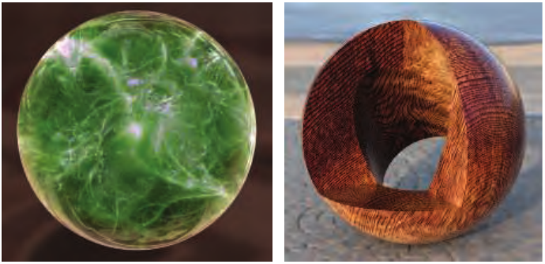

图 6.24：使用体积纹理进行实时程序化纹理处理的两个示例。左侧的弹珠是一种采用光线步进渲染的半透明体积纹理。右侧物体是使用复杂的程序化木材着色器 [1054] 生成的合成图像，并被合成到真实世界的环境之上。（左图来自 Shadertoy 作品“Playing marble”，由 Stéphane Guillitte 惠允提供。右图由 Autodesk, Inc. 的 Nicolas Savva 惠允提供。）

由于计算噪声函数的成本较高，通常会预先计算三维数组中格点处的值，并利用这些值插值得到纹理值。有多种方法使用颜色缓冲区混合来快速生成这些数组 [1192]。Perlin [1373] 提出了一种快速、实用的噪声函数采样方法，并展示了若干用途。Olano [1319] 提供了噪声生成算法，允许在存储纹理与执行计算之间进行权衡。McEwan 等人 [1168] 开发了无需任何查表操作、直接在着色器中计算经典噪声和单纯形噪声的方法，并提供了源代码。Parberry [1353] 使用动态规划，将计算成本分摊到多个像素上，从而加快噪声计算。Green [587] 给出了一种质量更高的方法，不过它更适合接近交互速率的应用，因为一次查询就需要使用 50 条像素着色器指令。Perlin [1370, 1371, 1372] 最初提出的噪声函数还可以改进。Cook 和 DeRose [290] 提出了一种称为小波噪声（wavelet noise）的替代表示，只需略微增加求值成本，就能避免走样问题。Liu 等人 [1054] 使用多种噪声函数模拟不同的木材纹理和表面饰面。我们还推荐阅读 Lagae 等人 [956] 关于这一主题的最新技术综述。

也可以采用其他程序化方法。例如，细胞纹理（cellular texture）是通过测量每个位置到散布在空间中的一组“特征点”的距离而形成的。对所得的最近距离以各种方式进行映射，例如改变颜色或着色法线，就可以生成类似细胞、石板铺地、蜥蜴皮肤以及其他自然纹理的图案。Griffiths [602] 讨论了如何在 GPU 上高效地寻找最近邻并生成细胞纹理。

另一类程序化纹理是物理模拟或其他交互过程的结果，例如水面涟漪或不断扩展的裂纹。在这些情况下，程序化纹理能够针对动态条件产生实际上近乎无限的变化。

生成程序化二维纹理时，参数化问题可能比制作纹理时更难处理；对于后者，拉伸或接缝伪影可以手工修补或设法规避。一种解决办法是直接在表面上合成纹理，从而完全避开参数化。在复杂表面上执行这一操作在技术上很有挑战性，也是一个活跃的研究领域。有关该领域的概述，参见 Wei 等人 [1861]。

对程序化纹理进行抗锯齿处理，既比对图像纹理进行抗锯齿处理更难，也比它更容易。一方面，无法使用 mipmapping 等预计算方法，因此这项负担落到了程序员身上。另一方面，程序化纹理的作者掌握着关于纹理内容的“内部信息”，因此可以有针对性地调整纹理以避免走样。对于将多个噪声函数相加而创建的程序化纹理，这一点尤其适用。每个噪声函数的频率都是已知的，因此可以舍弃任何会导致走样的频率，而这实际上还会降低计算成本。对于其他类型的程序化纹理，也有多种抗锯齿技术 [407, 605, 1392, 1512]。Dorn 等人 [371] 讨论了以往的工作，并给出了一些重新构造纹理函数的过程，以避免高频成分，也就是使函数带限（band-limited）。


## 6.4 纹理动画

来源：原书第 200 页（PDF 第 221 页）；已核对 PDF 第 222 页的下一节边界。

应用到表面上的图像不必是静态的。例如，可以把视频源用作随帧变化的纹理。

纹理坐标也不必是静态的。应用程序设计者可以逐帧显式改变纹理坐标，既可以直接修改网格数据本身，也可以通过在顶点着色器或像素着色器中应用函数来实现。设想我们已经建立了一个瀑布模型，并为它贴上了一幅看起来像下落水流的图像。假设 v 坐标方向就是水流方向。要让水流动起来，就必须在后续的每一帧中，从 v 坐标中减去一定的量。从纹理坐标中做减法，会使纹理本身看起来向前移动。

通过对纹理坐标应用矩阵，可以创造出更复杂的效果。除了平移之外，这还可以实现缩放、旋转和错切等线性变换 [1192, 1904]、图像扭曲和形变变换 [1729]，以及广义投影 [638]。通过在 CPU 上或着色器中应用函数，还可以创造出许多更复杂的效果。

使用纹理混合技术，可以实现其他动画效果。例如，先使用大理石纹理，再逐渐淡入肌肤纹理，就能让一座雕像活过来 [1215]。


## 6.5 材质映射

来源：《Real-Time Rendering, 4th Edition》书页201（PDF第222页）；并核对了书页202（PDF第223页）的下一节边界。本节包含正文三段及图6.25，无下级小节。

纹理的一种常见用途，是修改影响着色方程的某项材质属性。现实世界中，物体的材质属性通常会随表面位置而变化。为了模拟这样的物体，像素着色器可以从纹理中读取数值，并在求解着色方程之前，用这些数值修改材质参数。最常通过纹理修改的参数是表面颜色。这种纹理称为**反照率颜色贴图**（albedo color map）或**漫反射颜色贴图**（diffuse color map）。不过，任何参数都可以通过纹理来修改：可以用纹理值替换它、与它相乘，或者以其他方式改变它。例如，图6.25将三种不同的纹理应用于一个表面，替换原本的常量值。


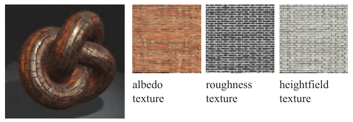

**图6.25**　金属质感的砖块和砂浆。右侧依次为表面颜色纹理、粗糙度纹理（越亮表示越粗糙）和凹凸贴图的高度纹理（越亮表示越高）。（图片来自 three.js 示例 webgl_tonemapping [218]。）

图内标签：albedo texture＝反照率纹理；roughness texture＝粗糙度纹理；heightfield texture＝高度场纹理。

纹理在材质中的用途还可以进一步扩展。纹理除了修改方程中的参数，还可以用来控制像素着色器本身的执行流程和功能。可以将具有不同着色方程和参数的两种或更多种材质应用于一个表面：用一张纹理指定表面的哪些区域采用哪种材质，从而针对各区域执行不同的代码。例如，对于部分区域生锈的金属表面，可以用一张纹理标明锈蚀的位置；根据对该纹理的查询结果，有条件地执行着色器中处理锈蚀的部分，否则执行光亮金属着色器（第9.5.2节）。

表面颜色等着色模型输入，与着色器最终输出的颜色之间存在线性关系。因此，包含此类输入的纹理可以使用标准技术进行滤波，从而避免走样。对于包含非线性着色输入的纹理，例如粗糙度纹理或用于凹凸映射的纹理（第6.7节），则需要更加谨慎地处理，才能避免走样。将着色方程纳入考虑的滤波技术，可以改善此类纹理的效果。第9.13节将讨论这些技术。


## 6.6 Alpha 映射

本节来源：原书第 202—208 页，对应 PDF 第 223—229 页；正文从 6.6 节标题开始，到 6.7 节标题之前结束。图 6.26 虽排在本节标题上方，属于本节引用的插图，亦完整收录。

利用 alpha 混合或 alpha 测试，alpha 值可以用于许多效果，例如高效地渲染植被、爆炸和远处的物体，这里仅举数例。本节讨论带有 alpha 的纹理的使用，并在讨论过程中指出各种限制及其解决办法。

一种与纹理有关的效果是贴花（decaling）。例如，假设你想把一幅花朵图片贴到茶壶上。你并不想要整张图片，而只要其中有花的部分。把某个纹素的 alpha 设为 0，就可以使它透明，从而不产生任何影响。因此，只要适当地设置贴花纹理的 alpha，就能用贴花替换底层表面，或与底层表面混合。通常，会把钳制对应函数与透明边框配合使用，从而将贴花的单个副本应用到表面上，而不是形成重复纹理。图 6.26 展示了一种贴花实现方式。关于贴花的更多信息，见第 20.2 节。


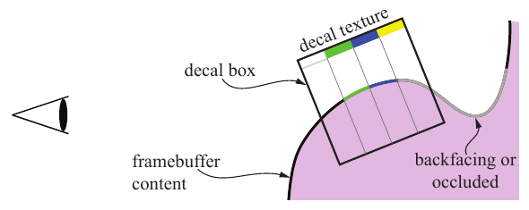

图 6.26　一种实现贴花的方法。首先将场景渲染到帧缓冲中，然后渲染一个盒子；对于盒子内部的所有点，把贴花纹理投影到帧缓冲内容上。最左边的纹素完全透明，因此不会影响帧缓冲。黄色纹素不可见，因为它会被投影到表面上被遮挡的部分。

alpha 的一种类似应用是制作镂空贴片（cutout）。假设你制作了一张灌木贴花图像，并把它应用到场景中的一个矩形上。原理与贴花相同，区别在于：灌木并不是紧贴在某个底层表面上，而是会绘制在它后面的任何几何体之上。这样，只用一个矩形就能渲染出具有复杂轮廓的物体。

对于灌木，如果让观察者绕着它转动，这种假象就会失效，因为灌木没有厚度。一种解决办法是复制这个灌木矩形，并绕树干旋转 90°。两个矩形就构成了一个成本很低的三维灌木，有时称为“十字树”（cross tree）[1204]；从地面高度观察时，这种假象相当有效。见图 6.27。Pelzer [1367] 讨论了一种类似的配置，用三个镂空贴片表示草。在第 13.6 节中，我们会讨论一种称为公告板（billboarding）的方法，它可以将这种渲染简化为单个矩形。如果观察者升到地面上方，这种假象便会破灭，因为从上方可以看出灌木只是两个镂空贴片。见图 6.28。为解决这个问题，可以采用不同方式添加更多贴片，例如切片、枝条或分层，以提供更可信的模型。第 13.6.5 节讨论了一种生成这类模型的方法；第 857 页的图 19.31 展示了另一种方法。最终效果的实例可见第 2 页和第 1049 页的图片。


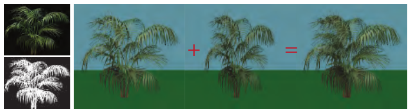

图 6.27　左侧为灌木纹理贴图，下方为其 1 位 alpha 通道贴图。右侧为渲染在单个矩形上的灌木；再添加一个旋转了 90° 的矩形副本，就构成了一个成本很低的三维灌木。


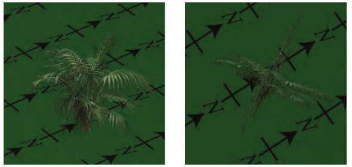

图 6.28　先从稍高于地面的位置观察“十字树”灌木，然后从更高的位置观察，此时这种假象便不再成立。

把 alpha 贴图与纹理动画结合起来，可以产生令人信服的特殊效果，例如闪烁的火把、植物生长、爆炸和大气效果。

渲染带有 alpha 贴图的物体时，有几种可选方法。alpha 混合（第 5.5 节）允许使用介于完全透明与完全不透明之间的透明度值，从而既能对物体边缘进行抗锯齿，也能表现部分透明的物体。但是，alpha 混合要求在不透明三角形之后渲染参与混合的三角形，而且必须按从后向前的顺序渲染。简单的十字树就是一个例子：它的两张镂空纹理不存在正确的渲染顺序，因为每个四边形都有一部分位于另一个四边形之前。即使理论上可以通过排序得到正确的顺序，通常这样做也很低效。例如，一片田野可能有数万片由镂空贴片表示的草叶。每个网格物体可能由许多独立草叶组成。对每片草叶逐一显式排序，极不现实。

渲染时，可以用几种不同的方式缓解这个问题。一种方式是使用 alpha 测试，即在像素着色器中，根据条件丢弃 alpha 值低于给定阈值的片元。其做法为：

```c
if (texture.a < alphaThreshold) discard;
```

（6.9）

其中，texture.a 是纹理查询得到的 alpha 值，参数 alphaThreshold 是用户提供的阈值，用来决定丢弃哪些片元。由于透明片元会被丢弃，这种二元可见性测试允许以任意顺序渲染三角形。通常，我们希望对 alpha 为 0.0 的所有片元执行这种处理。丢弃完全透明的片元还具有额外好处：节省后续着色器处理及合并的开销，并避免在 z 缓冲中把像素错误地标记为可见 [394]。对于镂空贴片，我们常把阈值设置为高于 0.0 的值，例如 0.5 或更高；然后进一步完全忽略 alpha 值，不再用它进行混合。这样可以避免顺序错误造成的伪影。不过，这种方式的质量较低，因为它只提供两个透明度等级，即完全不透明和完全透明。另一种解决办法是为每个模型执行两个遍次：一个遍次处理实心的镂空贴片，并写入 z 缓冲；另一个遍次处理半透明采样，而不写入 z 缓冲。

alpha 测试还存在另外两个问题，即过度放大 [1374] 和过度缩小 [234, 557]。当 alpha 测试与 mipmapping 一起使用时，如果不作特殊处理，效果可能并不可信。图 6.29 上部给出了一个例子：树叶变得比预期更加透明。可以用一个例子解释这种现象。假设有一个包含四个 alpha 值的一维纹理，其值为 (0.0, 1.0, 1.0, 0.0)。取平均值后，下一级 mipmap 变为 (0.5, 0.5)，再往上的顶级则为 (0.5)。现在假设采用 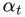 = 0.75。可以证明，访问 mipmap 第 0 级时，4 个纹素中有相当于 1.5 个纹素的范围能够通过丢弃测试。但是，访问后面两级时，由于 0.5 < 0.75，所有内容都会被丢弃。另一个例子见图 6.30。

Castaño [234] 提出了一种在创建 mipmap 时执行的简单方法，效果很好。对于 mipmap 第 k 级，覆盖率  定义为：


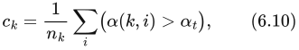


其中， 是 mipmap 第 k 级的纹素数量，α(k, i) 是 mipmap 第 k 级像素 i 处的 alpha 值，而  是式（6.9）中用户提供的 alpha 阈值。这里假定：α(k, i) >  为真时结果为 1，否则为 0。注意，k = 0 表示最低的 mipmap 层级，即原始图像。然后，对于每个 mipmap 层级，我们寻找一个新的 mipmap 阈值  来替代 ，使  等于 ，或者尽可能接近它。这可以通过二分搜索实现。最后，把 mipmap 第 k 级中所有纹素的 alpha 值乘以 。图 6.29 下部使用了这种方法，NVIDIA 的纹理工具也支持它。Golus [557] 给出了一种变体：不修改 mipmap，而是在着色器中随着 mipmap 层级的提高而放大 alpha 值。


图 6.29　上：结合 mipmapping 使用 alpha 测试，未进行任何修正。下：根据覆盖率重新缩放 alpha 值后进行 alpha 测试。（图片来自《The Witness》，由 Ignacio Castaño 提供。）


图 6.30　上排为叶片图案采用混合时的不同 mipmap 层级，较高层级已放大以便观察。下排显示这些 mipmap 在采用阈值为 0.5 的 alpha 测试时的处理结果，可以看到物体后退时所占像素越来越少。（图片由 Ben Golus [557] 提供。）

Wyman 和 McGuire [1933] 提出了一种不同的解决办法，在理论上，用以下代码替换式（6.9）中的那行代码：

```c
if (texture.a < random()) discard;
```

（6.11）

随机函数返回 [0, 1] 中均匀分布的值，这意味着从平均意义上说，该方法将得到正确结果。例如，如果纹理查询所得的 alpha 值为 0.3，那么该片元就会以 30% 的概率被丢弃。这是一种每像素只取一个样本的随机透明度方法 [423]。实际上，为避免时间和空间上的高频噪声，会用哈希函数替代随机函数：

> 译注：上文“以 30% 的概率被丢弃”忠实保留了原文，但它与式（6.11）不一致。若随机数在 [0, 1] 上均匀分布，α = 0.3 时，满足 0.3 < random() 的概率为 70%，即丢弃概率为 70%，保留概率为 30%。

```c
float hash2D(x,y) { return fract(1.0e4*sin(17.0*x+0.1*y) *
                               (0.1+abs(sin(13.0*y+x)))); }
```

（6.12）

通过嵌套调用上述函数，可以构造三维哈希函数，即：

```c
float hash3D(x,y,z) { return hash2D(hash2D(x,y),z); }
```

它返回 [0, 1) 中的数。哈希函数的输入为物体空间坐标除以这些物体空间坐标在屏幕空间 x 和 y 方向上的最大导数，再进行钳制。要在沿 z 方向运动时获得稳定性，还需要进一步的处理；这种方法最好与时间抗锯齿技术结合使用。该技术随距离增加而逐渐引入，因此近距离时完全不会产生随机效果。这种方法的优点是，每个片元从平均意义上说都是正确的；而 Castaño 的方法 [234] 为每个 mipmap 层级只生成一个 。然而，所需的这个值很可能在同一 mipmap 层级的不同位置有所变化，从而降低质量，并需要美术人员介入。

alpha 测试在放大时会出现波纹伪影，可以通过预先把 alpha 贴图计算为距离场来避免 [580]，另见第 677 页的讨论。


图 6.31　叶片纹理边缘具有部分 alpha 覆盖率时的不同渲染技术。从左至右：alpha 测试、alpha 混合、alpha 转覆盖率，以及边缘经过锐化的 alpha 转覆盖率。（图片由 Ben Golus [557] 提供。）

alpha 转覆盖率（alpha to coverage），以及与它类似的透明度自适应抗锯齿功能，会取得片元的透明度值，并将其转换为像素内部被覆盖的样本数量 [1250]。这个想法类似于第 5.5 节介绍的纱门透明度，但工作在子像素层面。假设每个像素有四个采样位置，一个片元覆盖了某个像素，但由于镂空纹理，它具有 25% 的透明度，即 75% 的不透明度。alpha 转覆盖率模式会使这个片元变为完全不透明，但让它只覆盖四个样本中的三个。例如，对于互相重叠的草叶所用的镂空纹理，这种模式很有用 [887, 1876]。由于绘制的每个样本都完全不透明，距离最近的叶片会沿着其边缘，以一致的方式遮住后面的物体。因为关闭了 alpha 混合，所以不需要排序也能正确混合半透明的边缘像素。

alpha 转覆盖率很适合为 alpha 测试提供抗锯齿，但用于 alpha 混合时可能会产生伪影。例如，两个参与 alpha 混合且具有相同 alpha 覆盖百分比的片元，会使用相同的子像素图案；这意味着一个片元会完全盖住另一个，而不是与其混合。Golus [557] 讨论了如何使用着色器指令 fwidth()，使内容具有更加清晰的边缘。见图 6.31。

无论如何使用 alpha 映射，都有必要理解双线性插值会怎样影响颜色值。设想两个相邻纹素：rgbα = (255, 0, 0, 255) 是不透明的红色，而其邻居 rgbα = (0, 0, 0, 2) 是几乎完全透明的黑色。在两个纹素正中间的位置，rgbα 是多少？简单插值得到 (127, 0, 0, 128)，单看所得的 rgb 值，会认为它是“更暗”的红色。然而，这个结果实际上并没有变暗，它是已经乘以自身 alpha 的纯红色。如果要对 alpha 值进行插值，为保证插值正确，需要确保参与插值的颜色在插值前就已经预乘了 alpha。举例来说，假设把那个几乎透明的相邻纹素改为 rgbα = (0, 255, 0, 2)，使它带有极微弱的绿色。这个颜色没有预乘 alpha，插值后会得到 (127, 127, 0, 128)：极微弱的绿色突然使结果变成了一个预乘后的黄色样本。这个相邻纹素的预乘版本为 (0, 2, 0, 2)，它会给出正确的预乘结果 (127, 1, 0, 128)。这个结果更加合理，因为所得的预乘颜色主要是红色，只带有几乎察觉不到的一丝绿色。

如果忽略双线性插值给出的是预乘结果，就可能在贴花和镂空物体周围出现黑色边缘。那个“更暗”的红色结果会在流水线的其余部分被当作未经预乘的颜色处理，使边缘变黑。即使使用 alpha 测试，也可能看到这种效果。最佳策略是在进行双线性插值之前预乘 [490, 648, 1166, 1813]。WebGL API 支持这一点，因为合成对于网页非常重要。不过，双线性插值通常由 GPU 执行，在它执行之前，着色器无法先对纹素值作相应操作。PNG 等文件格式中的图像也不采用预乘形式，因为那样会损失颜色精度。这两个因素结合起来，使得 alpha 映射在默认情况下会出现黑边。一种常见的变通办法是预处理镂空图像，用从附近不透明纹素取得的颜色，涂填那些透明的“黑色”纹素 [490, 685]。通常需要手动或自动地用这种方式重新涂填所有透明区域，才能使 mipmap 各层级也避免边缘问题 [295]。还应注意，生成带有 alpha 值的 mipmap 时应使用预乘值 [1933]。


## 6.7 凹凸映射

原书来源：《Real-Time Rendering, Fourth Edition》，书页 208—214（PDF 物理页 229—235）。本节从 6.7 标题开始，到 6.8 标题之前结束；包含 6.7.1、6.7.2、图 6.32—6.36 及式（6.13）—（6.16）。

本节介绍一大类小尺度细节表示技术，我们将它们统称为**凹凸映射**（bump mapping）。这些方法通常都通过修改逐像素着色过程来实现。与单独使用纹理映射相比，它们能够营造出更强的三维外观，却不需要增加任何几何体。

物体上的细节可以分为三种尺度：覆盖许多像素的宏观特征、横跨几个像素的中观特征，以及远小于一个像素的微观特征。这些分类的界限并不固定，因为在动画或交互过程中，观察者可能会从许多不同距离观察同一个物体。

宏观几何由顶点和三角形，或其他几何图元来表示。创建三维角色时，四肢和头部通常在宏观尺度上建模。微观几何则封装在着色模型中；着色模型通常在像素着色器中实现，并使用纹理贴图作为参数。所采用的着色模型模拟表面微观几何的相互作用，例如，有光泽的物体在微观上是平滑的，而漫反射表面在微观上是粗糙的。角色的皮肤和衣服看起来具有不同的材质，是因为它们使用了不同的着色器，或者至少在这些着色器中使用了不同的参数。

中观几何描述介于这两种尺度之间的所有内容。它包含的细节过于复杂，无法用一个个三角形高效地渲染，但又足够大，使观察者能够在几个像素的范围内分辨表面曲率的局部变化。角色面部的皱纹、肌肉细节，以及衣服上的褶皱和接缝，都属于中观尺度。中观尺度建模通常使用一系列统称为凹凸映射技术的方法。这些方法在像素层面调整着色参数，使观察者感觉到相对于基础几何的小幅扰动，而基础几何实际上仍然是平的。各种凹凸映射方法的主要区别在于如何表示细节特征。变化因素包括细节特征的真实程度和复杂程度。例如，数字美术师常常先在模型上雕刻细节，再使用软件把这些几何元素转换成一张或多张纹理，例如一张凹凸纹理，可能再加上一张用于使缝隙变暗的纹理。

Blinn 于 1978 年提出了在纹理中编码中观尺度细节的想法 [160]。他观察到，如果在着色时用一个稍加扰动的表面法线替代真实法线，表面就会显得具有小尺度细节。他把描述表面法线扰动的数据存储在数组中。

这里的关键思想是：不再使用纹理改变光照方程中的某个颜色分量，而是访问纹理来修改表面法线。表面的几何法线保持不变；我们仅修改光照方程使用的法线。这一操作没有物理上的对应过程：我们改变表面法线，但表面本身在几何意义上仍然是平滑的。正如每个顶点各有一条法线能够造成三角形之间的表面平滑过渡的错觉一样，逐像素修改法线也能改变人们对三角形表面本身的感知，而不修改其几何形状。

对于凹凸映射，法线必须相对于某个参考坐标系改变方向。为此，在每个顶点存储一个**切线标架**，也称**切线空间基**。这个参考坐标系用于把光源变换到表面某位置的空间中（或者反过来变换），以计算扰动法线产生的效果。对于应用了法线贴图的多边形表面，除了顶点法线，我们还要存储所谓的**切线向量**和**副切线向量**。副切线向量（bitangent）也常被错误地称为副法线向量（binormal）[1025]。

切线向量和副切线向量表示法线贴图自身的坐标轴在物体空间中的方向，因为我们的目标是把光源变换到相对于贴图的坐标系中。见图 6.32。


**图 6.32** 展示了一个球面三角形，并在它的每个角点画出了切线标架。球体和圆环这类形状具有天然的切线空间基，圆环上的经纬线展示了这一点。

法线 **n**、切线 **t** 和副切线 **b** 这三个向量组成一个基矩阵：


这个矩阵有时简称为 TBN，它把光源方向（针对给定顶点）从世界空间变换到切线空间。这些向量不一定真正彼此垂直，因为法线贴图自身可能已经发生形变，以便适配表面。不过，非正交基会给纹理引入斜切，这可能意味着需要更多存储空间，也可能影响性能；也就是说，这时无法仅通过简单的转置求出该矩阵的逆 [494]。一种节省内存的方法是在顶点只存储切线和副切线，然后取二者的叉积来计算法线。但是，只有当矩阵的手性始终相同时，这种技术才有效 [1226]。模型往往是对称的：飞机、人、文件柜，以及许多其他物体都是如此。由于纹理消耗大量内存，它们往往会以镜像方式映射到对称模型上。因此，只存储物体一侧的纹理，但纹理映射会把它放到模型的两侧。在这种情况下，两侧切线空间的手性不同，不能预先假定它们一致。此时，如果在每个顶点额外存储一位信息来指示手性，仍然可以避免存储法线。如果该位被置位，就将切线和副切线的叉积取反，以得到正确的法线。如果切线标架是正交的，还可以把这个基存储为四元数（第 4.3 节），这不仅更节省空间，还能减少一些逐像素计算 [494, 1114, 1154, 1381, 1639]。质量可能会有轻微损失，但实际中很少看得出来。

切线空间的概念对其他算法也很重要。正如下一章将讨论的那样，许多着色方程只依赖表面法线方向。但是，拉丝铝或天鹅绒这样的材质还需要知道观察者和光照相对于表面的方向。切线标架有助于定义材质在表面上的朝向。Lengyel [1025] 和 Mittring [1226] 的文章广泛讨论了这一领域。Schüler [1584] 提出了一种在像素着色器中即时计算切线空间基的方法，无须为每个顶点存储预先计算的切线标架。Mikkelsen [1209] 改进了这项技术，并推导出一种不需要任何参数化的方法，而是利用表面位置的导数和高度场的导数来计算扰动后的法线。然而，与使用标准切线空间映射相比，这类技术可能使显示出来的细节显著减少，还可能给美术制作流程带来问题 [1639]。

### 6.7.1 Blinn 的方法

Blinn 最初的凹凸映射方法在纹理的每个纹素中存储两个有符号数值  和 。这两个值对应于沿图像 u 轴和 v 轴改变法线的幅度。也就是说，用这些通常经过双线性插值的纹理值，分别缩放两个垂直于法线的向量。将这两个向量加到法线上，即可改变法线的方向。 和  这两个值描述了表面在该点处朝向哪一边。见图 6.33。这类凹凸贴图纹理称为**偏移向量凹凸贴图**，或**偏移贴图**。


**图 6.33** 左：利用从凹凸纹理中取得的（, ）值，沿 **u** 和 **v** 方向修改法线向量 **n**，得到 **n′**（尚未归一化）。右：展示了一个高度场及其对着色法线的影响。也可以在各高度之间对这些法线进行插值，以得到更平滑的外观。

另一种表示凹凸的方式，是使用**高度场**来修改表面法线的方向。每个单色纹理值表示一个高度，因此纹理中的白色表示高处，黑色表示低处（或者反过来）。图 6.34 给出了一个例子。这是初次创建或扫描凹凸贴图时常用的格式，同样由 Blinn 于 1978 年提出。高度场用于推导类似第一种方法中的 u 和 v 有符号数值。具体做法是：对相邻列取差，得到 u 方向的斜率；对相邻行取差，得到 v 方向的斜率 [1567]。一种变体是使用 Sobel 滤波器，它给直接相邻的邻居赋予更大的权重 [535]。


**图 6.34** 一幅波状高度场凹凸图像，以及它在球体上的应用。

### 6.7.2 法线映射

一种常见的凹凸映射方法是直接存储**法线贴图**。其算法和结果在数学上与 Blinn 的方法相同；改变的仅仅是存储格式和像素着色器中的计算。

法线贴图对映射到 [−1, 1] 范围内的（x, y, z）进行编码。例如，对于 8 位纹理，x 轴的数值 0 表示 −1.0，255 表示 1.0。图 6.35 给出了一个例子。对于图示的颜色映射，浅蓝色 [128, 128, 255] 表示平坦表面，也就是法线 [0, 0, 1]。

法线贴图表示最初以世界空间法线贴图的形式提出 [274, 891]，但实际中很少使用。对于这种映射，扰动的处理很直接：在每个像素处从贴图中获取法线，并将它与光源方向一起直接用于计算表面该位置的着色。法线贴图也可以定义在物体空间中，这样即使模型旋转，法线仍然有效。但是，世界空间和物体空间这两种表示都把纹理绑定到了特定朝向的特定几何体上，限制了纹理的重复利用。


**图 6.35** 使用法线贴图进行凹凸映射。每个颜色通道实际上都是一个表面法线坐标。红色通道表示 x 偏移；红色越多，法线就越朝右。绿色表示 y 偏移，蓝色表示 z。右侧是使用这张法线贴图生成的图像。注意立方体顶部看起来较为扁平。（图片由 Manuel M. Oliveira 和 Fabio Policarpo 提供。）

通常的做法是在切线空间中获取扰动后的法线，也就是相对于表面本身来定义法线。这样既允许表面变形，又能最大限度地复用法线纹理。切线空间法线贴图也能够很好地压缩，因为通常可以假定 z 分量（与未扰动表面法线对齐的分量）的符号为正。

法线映射能够有效地增强真实感，见图 6.36。


**图 6.36** 在类似游戏的场景中使用法线贴图进行凹凸映射的示例。左上：未应用右侧的两张法线贴图。左下：应用了法线贴图。右：法线贴图。（三维模型和法线贴图由 Dulce Isis Segarra López 提供。）

与对颜色纹理滤波相比，对法线贴图滤波是一个困难的问题。一般来说，法线与着色后的颜色之间的关系不是线性的，因此标准滤波方法可能产生令人难以接受的走样。设想你正在看一组由光亮的白色大理石块砌成的台阶。在某些角度，台阶的顶面或侧面会接收到光，并反射出明亮的镜面高光。但是，台阶的平均法线可能处于 45° 方向；它捕捉到高光的方向，与原始台阶完全不同。渲染具有尖锐镜面高光的凹凸贴图时，如果没有正确滤波，高光会随着采样点偶然落到的位置而忽明忽灭，产生分散注意力的闪烁效果。

朗伯表面是一个特例，法线贴图对其着色的影响近乎线性。朗伯着色几乎完全是一次点积，而点积是一种线性运算。对一组法线取平均，再用结果做点积，等价于先分别与各条法线做点积，再对结果取平均：


注意，平均向量在使用前不进行归一化。式（6.14）说明，对于朗伯表面，标准滤波和 mipmap **几乎**能够产生正确结果。结果并不完全正确，是因为朗伯着色方程并非单纯的点积，而是经过截断的点积，即 max(**l** · **n**, 0)。截断操作使它变成非线性运算。对于掠射光照方向，这会使表面过度变暗，不过在实践中通常不会造成明显问题 [891]。需要注意的是，一些通常用于法线贴图的纹理压缩方法（例如利用另外两个分量重建 z 分量）不支持非单位长度的法线，因此使用未归一化的法线贴图可能给压缩带来困难。

对于非朗伯表面，可以将着色方程的输入作为一个整体进行滤波，而不是单独对法线贴图滤波，从而产生更好的结果。实现这一点的技术将在第 9.13 节讨论。

最后，从高度贴图 h(x, y) 推导法线贴图可能很有用。其做法如下 [405]。首先，使用中心差分计算 x 和 y 方向导数的近似值：


然后，纹素（x, y）处未归一化的法线为


> 译注：已对照原书书页 214。式（6.16）原文的前两个分量均印为 −(x, y)，上式忠实保留原样。依据紧接在前的式（6.15）及高度场法线的构造，第二个分量疑应为 −(x, y)，即（−(x, y), −(x, y), 1）；此处明确说明疑点，不暗改原式。

必须小心处理纹理边界。

**地平线映射**（horizon mapping）[1027] 可以让凹凸在自身表面上投下阴影，从而进一步增强法线贴图。具体方法是预先计算额外的纹理，每张纹理对应于表面平面内的一个方向，并为每个纹素存储该方向的地平线角度。更多信息见第 11.4 节。


## 6.8 视差映射

原书来源：《Real-Time Rendering, Fourth Edition》，书页 214—220（PDF 物理页 235—241）；已检查下一页 PDF 242 的节边界。本节从“6.8 Parallax Mapping”起，包含 6.8.1 全部内容，止于 6.9 之前。图 6.43 属于下一节，不收入本节。

凹凸映射和法线映射存在一个问题：凹凸的位置从不随观察角度改变，也从不相互遮挡。例如，沿着一面真实的砖墙看去，在某些角度下，你将看不到砖块之间的砂浆。墙面的凹凸贴图永远无法表现这类遮挡，因为它仅仅改变法线。如果能让凹凸实际影响每个像素所渲染的表面位置，效果就会更好。


图 6.37．左图表示我们希望达到的目标：由观察向量穿入高度场的位置，找到实际的表面位置。视差映射采用一阶近似，取矩形上该位置的高度，并用它求出一个新位置 。（据 Welsh [1866] 改绘。）

视差映射（parallax mapping）的思想由 Kaneko [851] 于 2001 年提出，并由 Welsh [1866] 加以改进和推广。视差是指随着观察者移动，物体之间的相对位置也发生变化这一现象。当观察者移动时，凹凸应当呈现出高度感。视差映射的关键思想是：检查当前判定为可见位置的高度，据此对像素中应该看到什么作出有根据的估计。

对于视差映射，凹凸存储在高度场纹理中。观察给定像素处的表面时，先读取该位置的高度场值，再用它偏移纹理坐标，以读取表面的另一部分。偏移量取决于所读取的高度以及视线与表面之间的夹角，见图 6.37。高度场值可以存储在单独的纹理中，也可以打包到另一幅纹理中未使用的颜色通道或 alpha 通道内（将彼此无关的纹理打包在一起时必须谨慎，因为这可能损害压缩质量）。在用于偏移坐标之前，需要对高度场值进行缩放并加上偏置。缩放量决定高度场应当延伸到表面上方或下方多高的位置，而偏置给出不发生偏移时的“海平面”高度。给定纹理坐标位置 p、调整后的高度场高度 h，以及归一化的观察向量 v，其高度分量为 、水平分量为 ，经过视差调整的新纹理坐标  为


注意，与大多数着色方程不同，这里采用什么空间进行计算非常重要：观察向量必须位于切线空间中。

尽管这只是一个简单近似，但如果凹凸高度变化相对缓慢，这种偏移在实践中效果相当好 [1171]。这时，附近相邻纹素具有大致相同的高度，因此把原位置的高度作为新位置高度的估计是合理的。然而，在贴近表面的低角度观察时，该方法就会失效。当观察向量接近表面的地平线方向时，微小的高度变化就会导致纹理坐标的大幅偏移。由于读取到的新位置与原表面位置之间几乎没有高度相关性，甚至完全无关，这个近似便不再成立。


图 6.38．在视差偏移限制中，偏移后的位置与原位置的距离至多等于高度值，图中的虚线圆弧表示这一限制。灰色偏移表示原方法的结果，黑色偏移表示施加限制后的结果。右图是一面采用该技术渲染的墙。（图片由 Terry Welsh 提供。）

为缓解这一问题，Welsh [1866] 引入了偏移限制（offset limiting）的思想，即将偏移量限制为永远不大于所读取的高度。方程于是变为


注意，这个方程的计算速度比原方程更快。从几何上解释，高度定义了一个半径，位置不能偏移到这个半径之外，如图 6.38 所示。

当观察角度较陡、接近正视表面时，由于  几乎等于 1，这个方程与原方程几乎相同。在贴近表面的低角度下，偏移的作用则受到限制。从视觉上看，这会使低角度下的凹凸感减弱，但仍远好于对纹理进行随机采样。随着视点改变，纹理仍可能出现游动问题；立体渲染也仍存在问题，因为观察者会同时感知到两个视点，而它们必须提供一致的深度线索 [1171]。即使存在这些缺点，带偏移限制的视差映射也只需增加少量像素着色器程序指令，就能相对于基本法线映射显著改善图像质量。Shishkovtsov [1631] 通过沿凹凸贴图法线方向移动估计位置，改善了视差遮蔽的阴影效果。

### 6.8.1 视差遮蔽映射

凹凸映射不会根据高度场修改纹理坐标，而只改变某个位置的着色法线。视差映射对高度场的效果给出了一种简单近似，其工作假设是某个像素的高度与相邻位置的高度大致相同。这个假设很容易失效。凹凸也始终不能相互遮蔽，不能投射阴影。我们真正想求的是像素中可见的内容，也就是观察向量与高度场第一次相交的位置。

为了更好地解决这个问题，多位研究者提出沿观察向量进行光线步进（ray marching），直到找到一个近似交点。这项工作可以在像素着色器中完成，其中高度数据能够以纹理的形式访问。我们将这些方法的研究统归为视差映射技术的一个子类，它们以各种方式利用光线步进 [192, 1171, 1361, 1424, 1742, 1743]。


图 6.39．将绿色的视线光线投影到表面平面上，在平面上以固定间隔采样（紫色点），并读取高度。算法寻找视线光线与黑色线段之间的第一个交点，这些黑色线段近似表示弯曲的高度场。

这类算法称为视差遮蔽映射（parallax occlusion mapping，POM）或浮雕映射（relief mapping）等。其关键思想是先沿投影后的向量，测试固定数量的高度场纹理样本。对于掠射角的观察光线，通常会生成更多样本，以免错过最近的交点 [1742, 1743]。沿光线取得各个三维位置，将它们变换到纹理空间，并判断其位于高度场上方还是下方。一旦找到位于高度场下方的样本，就利用该样本低于高度场的距离，以及前一个样本高于高度场的距离，求得交点位置，见图 6.39。然后使用关联的法线贴图、颜色贴图以及其他纹理，对这个位置的表面进行着色。使用多层高度场，可以产生悬挑结构、相互独立且重叠的表面，以及使用浮雕映射的双面替身，见 13.7 节。高度场追踪方法还可以让凹凸表面对自身投射阴影，既包括硬阴影 [1171, 1424]，也包括软阴影 [1742, 1743]。图 6.40 给出了对比。


图 6.40．不使用光线步进的视差映射（左）与使用光线步进的视差映射（右）的比较。不使用光线步进时，立方体顶面的凹凸会变得扁平。使用光线步进还能产生自阴影效果。（图片由 Manuel M. Oliveira 和 Fabio Policarpo 提供。）

这一主题有大量文献。虽然所有这些方法都沿着光线步进，但它们之间存在多种差异。可以用简单纹理读取高度，也可以采用更先进的数据结构和更先进的求根方法。有些技术可能涉及在着色器中丢弃像素或写入深度缓冲区，这会损害性能。下面我们概述一大批方法，但请记住，随着 GPU 的发展，最佳方法也会变化。这个“最佳”方法取决于具体内容以及光线步进时所采用的步数。

确定两个规则采样点之间的实际交点，是一个求根问题。在实践中，高度场更多地被当作深度场处理，以矩形所在的平面作为表面的上界。这样，平面上的初始点便位于高度场上方。在找到高度场表面上方的最后一个点和下方的第一个点之后，Tatarchuk [1742, 1743] 使用一步割线法求出近似解。Policarpo 等人 [1424] 则在找到的两点之间进行二分搜索，逐步逼近更准确的交点。Risser 等人 [1497] 通过割线法迭代加快收敛。这里的权衡在于：规则采样可以并行进行，而迭代方法虽然总的纹理访问次数更少，却必须等待结果，并进行较慢的依赖纹理读取。总体而言，蛮力方法似乎表现良好 [1911]。

以足够高的频率对高度场进行采样至关重要。McGuire 和 McGuire [1171] 提出为 mipmap 查找添加偏置，并使用各向异性 mipmap，以确保能够正确采样高频高度场，例如表示尖刺或毛发的高度场。还可以让高度场纹理的存储分辨率高于法线贴图。最后，有些渲染系统甚至不存储法线贴图，而倾向于使用十字形滤波器，根据高度场即时推导法线 [40]。书页 696 的公式（16.1）给出了这一方法。

另一种同时提高性能和采样精度的途径，是最初不以固定间隔采样高度场，而是尝试跳过中间的空白空间。Donnelly [367] 将高度场预处理成一组体素，每个体素存储其到高度场表面的距离。这样就能快速跳过中间空间，代价是每个高度场需要更多存储空间。Wang 等人 [1844] 使用五维位移映射方案，存储从所有方向和位置到表面的距离。这能够支持复杂曲面、自阴影以及其他效果，但代价是显著增加内存用量。Mehra 和 Kumar [1195] 使用方向距离贴图实现类似目的。Dummer [393] 提出了锥步进映射（cone step mapping）的思想，Policarpo 和 Oliveira [1426] 又对其进行了改进。这里的概念是，为高度场的每个位置额外存储一个圆锥半径。这个半径定义了光线上的一个区间，在该区间内光线至多与高度场相交一次。利用这一性质，可以沿光线快速跳跃，而不会遗漏任何可能的交点，代价则是需要进行依赖纹理读取。另一个缺点是创建锥步进贴图需要预计算，因此这种方法无法用于动态变化的高度场。Schroders 和 Gulik [1581] 提出了四叉树浮雕映射，这是一种在遍历期间跳过体积区域的层次方法。Tevs 等人 [1760] 使用“最大值 mipmap”，既允许跳跃，又尽量降低预计算成本。Drobot [377] 同样利用存储在 mipmap 中的类似四叉树的结构来加速遍历，并给出了一种在不同高度场之间混合的方法，使一种地形类型能够过渡到另一种。


图 6.41．法线映射与浮雕映射。法线映射不会发生自遮蔽。对于重复纹理，浮雕映射在轮廓处存在问题，因为矩形更像是观察高度场的一个窗口，而不是真正的边界定义。（图片由 NVIDIA Corporation 提供。）

上述所有方法都有一个问题：在物体的轮廓边缘处，这种视觉错觉会失效，因为那里仍然显示原始表面的平滑外轮廓，见图 6.41。关键思想在于：渲染出的三角形决定哪些像素应当由像素着色器程序求值，而不是决定表面实际位于何处。此外，对于曲面，轮廓问题会更复杂。Oliveira 和 Policarpo [1325, 1850] 描述并发展了一种方法，使用二次轮廓近似技术。Jeschke 等人 [824] 和 Dachsbacher 等人 [323] 都给出了更通用、更稳健的方法，以正确处理轮廓和曲面，并回顾了先前的研究。其总体思想最早由 Hirche [750] 探索，即将网格中的每个三角形向外挤出，形成一个棱柱。渲染这个棱柱，就会强制对所有可能出现高度场的像素求值。这类方法称为壳映射（shell mapping），因为扩张后的网格会在原模型外形成一个独立的壳层。在棱柱与光线求交时保留棱柱的非线性特性，便有可能对高度场进行无伪影渲染，不过计算代价较高。图 6.42 展示了这类技术的一个令人印象深刻的应用。


图 6.42．在道路上使用视差遮蔽映射，又称浮雕映射，使石块看起来更加真实。地面实际上只是一组应用了高度场的简单三角形。（图片来自《孤岛危机》（Crysis），由 Crytek 提供。）


## 6.9 纹理光源

来源：《Real-Time Rendering》第4版，书页221（PDF第242页）；图6.43位于本节标题之前，属于本节。章末“延伸阅读与资源”另存于《06.99_延伸阅读与资源.md》。

纹理也可以用来丰富光源的视觉表现，并实现复杂的强度分布或聚光灯函数。对于照明完全局限在一个圆锥或截锥体内的光源，可以使用投影纹理来调制光强 [1192, 1597, 1904]。这样便能实现具有特定形状的聚光灯、带图案的灯光，甚至“幻灯机”效果（图6.43）。这类光源通常称为 gobo 或 cookie 光源，这些名称来自专业舞台和电影照明中所用镂空遮光片的术语。第7.2节讨论了以类似方式使用投影映射来投射阴影。


**图6.43** 投影纹理光源。纹理投影到茶壶和地面平面上，用于调制投影截锥体内的光源贡献（截锥体外的贡献设为0）。（图片由 NVIDIA Corporation 提供。）

对于不局限于某个截锥体、而是向所有方向照明的光源，可以使用立方体贴图代替二维投影纹理来调制强度。一维纹理可以用来定义任意的距离衰减函数。将其与二维角度衰减贴图结合，便能形成复杂的体积光照分布 [353]。一种更通用的做法是使用三维（体积）纹理来控制光源的衰减 [353, 535, 1192]。这样就能产生包括光束在内、任意形状的作用体积。该技术会占用大量内存（所有体积纹理都是如此）。如果光源的作用体积沿三个轴均具有对称性，就可以通过将数据镜像到各个卦限，把内存占用降至原来的八分之一。

任何类型的光源都可以添加纹理，以实现额外的视觉效果。纹理光源使美术师能够轻松控制照明，只需编辑所使用的纹理即可。


## 延伸阅读与资源

来源：《Real-Time Rendering》第4版，第6章章末，书页222（PDF第243页）；本部分在原书中未编号。

Heckbert 对纹理映射理论撰写了一篇很好的综述 [690]，以及一份更深入的专题报告 [691]。Szirmay-Kalos 和 Umenhoffer 对视差遮挡映射和位移方法作了出色而全面的综述 [1731]。关于法线表示的更多信息，可参阅 Cigolle 等人 [269] 以及 Meyer 等人 [1205] 的工作。

《使用 OpenGL 进行高级图形编程》（Advanced Graphics Programming Using OpenGL）[1192] 广泛介绍了使用纹理算法的各种可视化技术。关于三维程序化纹理的全面介绍，可参阅《纹理与建模：程序化方法》（Texturing and Modeling: A Procedural Approach）[407]。《使用可编程图形硬件进行高级游戏开发》（Advanced Game Development with Programmable Graphics Hardware）[1850] 包含许多实现视差遮挡映射技术的细节；Tatarchuk 的演讲资料 [1742, 1743] 以及 Szirmay-Kalos 和 Umenhoffer 的综述 [1731] 也提供了这方面的丰富细节。

在程序化纹理（及建模）方面，我们最喜欢的网站是 Shadertoy。该网站展示了许多值得研究且引人入胜的程序化纹理函数，你可以轻松修改任何示例并查看结果。

请访问本书网站 [realtimerendering.com](https://realtimerendering.com)，获取更多其他资源。
