# Real-Time Rendering 第07章 阴影 中文合集

> 依据用户提供的《Real-Time Rendering》第四版 PDF 完整翻译。原图配中文图注；复杂数学已排版为本地图片，简单符号直接显示。保留原书技术年代、公式编号与引用编号。

## 目录

- [7.1 平面阴影](<Real-Time_Rendering_4th_中文/第07章/07.01.md>)

- [7.2 曲面上的阴影](<Real-Time_Rendering_4th_中文/第07章/07.02.md>)

- [7.3 阴影体](<Real-Time_Rendering_4th_中文/第07章/07.03.md>)

- [7.4 阴影贴图](<Real-Time_Rendering_4th_中文/第07章/07.04.md>)

- [7.5 百分比渐近过滤](<Real-Time_Rendering_4th_中文/第07章/07.05.md>)

- [7.6 百分比渐近软阴影](<Real-Time_Rendering_4th_中文/第07章/07.06.md>)

- [7.7 可滤波阴影贴图](<Real-Time_Rendering_4th_中文/第07章/07.07.md>)

- [7.8 体积阴影技术](<Real-Time_Rendering_4th_中文/第07章/07.08.md>)

- [7.9 不规则 Z 缓冲阴影](<Real-Time_Rendering_4th_中文/第07章/07.09.md>)

- [7.10 其他应用](<Real-Time_Rendering_4th_中文/第07章/07.10.md>)

## 章首导言

来源：《Real-Time Rendering, Fourth Edition》，书页 223—225（PDF 第 244—246 页）；本文件收录章首标题、题辞及 7.1 节之前的全部导言。

> “生活的一切变化、一切魅力、一切美，都是由光与影构成的。”
>
> ——托尔斯泰

阴影对于创建逼真的图像，以及向用户提供有关物体位置的视觉线索，都十分重要。本章着重介绍阴影计算的基本原理，并描述其中最重要、最常用的实时算法。我们也会简要讨论一些不那么普及、但体现了重要原理的方法。本章不打算逐一介绍所有选择和方法，因为已有两本内容全面的著作对阴影领域进行了极为深入的研究 [412, 1902]。我们将重点放在这两本书出版之后出现的文章和报告上，并偏重那些经过实战检验的技术。

图 7.1 说明了本章使用的术语：遮挡物（occluder）是向接收物（receiver）投射阴影的物体。无面积光源（punctual light source），即不具有面积的光源，只会产生完全处于阴影之中的区域，有时称为硬阴影。如果使用面光源或体光源，则会产生软阴影。每个阴影此时都可能包含一个完全处于阴影中的区域，称为本影（umbra），以及一个部分处于阴影中的区域，称为半影（penumbra）。软阴影的特征是阴影边缘模糊。不过，需要注意的是，通常不能仅仅用低通滤波器模糊硬阴影的边缘，就正确地渲染出软阴影。如图 7.2 所示，在正确的软阴影中，投射阴影的几何体离接收物越近，阴影就越锐利。软阴影的本影区域并不等同于无面积光源产生的硬阴影。相反，随着光源变大，软阴影的本影区域会缩小；如果光源足够大，并且接收物离遮挡物足够远，本影甚至可能消失。软阴影通常更可取，因为半影边缘能让观看者认出这确实是一片阴影。边缘锐利的阴影通常显得不够真实，有时还可能被误认为实际的几何特征，例如表面上的一道折痕。不过，硬阴影的渲染速度比软阴影快。

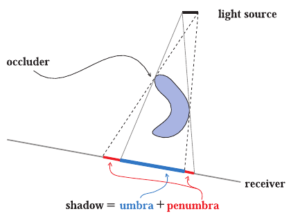

图 7.1：阴影术语：光源（light source）、遮挡物（occluder）、接收物（receiver）、阴影（shadow）、本影（umbra）和半影（penumbra）。图中关系为：阴影＝本影＋半影。

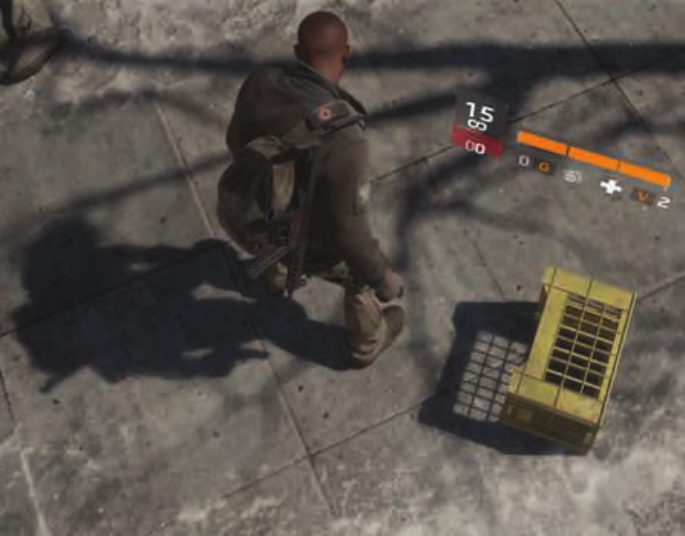

图 7.2：硬阴影与软阴影的混合。箱子的阴影很锐利，因为遮挡物靠近接收物。人物的阴影在接触点处很锐利，随着到遮挡物的距离增大而逐渐变软。远处的树枝产生软阴影 [1711]。（图片出自《汤姆·克兰西：全境封锁》，由育碧提供。）

比有没有半影更重要的是，至少要有阴影。如果没有任何阴影作为视觉线索，场景往往缺乏说服力，也更难以感知。正如 Wanger 所展示的那样 [1846]，不准确的阴影通常也好过完全没有阴影，因为人眼对阴影形状的容忍度相当高。例如，在地板上贴一张模糊的黑色圆形纹理，就能让角色看起来立足于地面。

在接下来的各节中，我们将超越这些简单的人工构造阴影，介绍根据场景中的遮挡物自动、实时计算阴影的方法。第一节处理阴影投射到平面表面上的特殊情况，第二节介绍更一般的阴影算法，即将阴影投射到任意表面上。硬阴影与软阴影都会涉及。最后，我们介绍一些适用于多种阴影算法的优化技术。

## 7.1 平面阴影

来源：《Real-Time Rendering, Fourth Edition》，书页 225—229（PDF 第 246—250 页）；范围从 7.1 标题起，到 7.2 标题之前，包含全部下级小节及图 7.3—7.6。

物体将阴影投射到平面表面上，是一种简单的阴影情形。本节介绍几类平面阴影算法，它们所产生的阴影在柔和程度和真实感方面各不相同。

### 7.1.1 投影阴影

在这种方案中，将三维物体再渲染一次以生成阴影。可以推导出一个矩阵，将物体的顶点投影到一个平面上 [162, 1759]。考虑图 7.3 中的情形：光源位于 **l**，待投影的顶点位于 **v**，投影后的顶点位于 **p**。我们先针对接收阴影的平面为 y = 0 这一特殊情况推导投影矩阵，然后将结果推广到任意平面。

首先推导 x 坐标的投影。根据图 7.3 左侧的相似三角形，可得

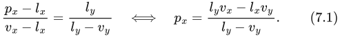

z 坐标可以用同样的方法得到：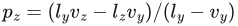，而 y 坐标为零。现在可将这些方程转换成投影矩阵 **M**：

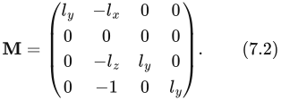

很容易验证 **Mv** = **p**，这意味着 **M** 确实是所求的投影矩阵。

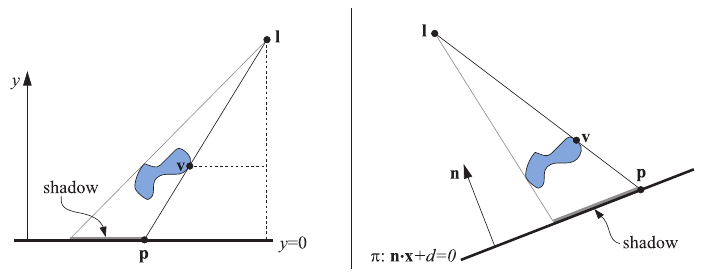

图 7.3：左：位于 **l** 的光源向平面 y = 0 投射阴影。顶点 **v** 被投影到该平面上，投影点记为 **p**。利用相似三角形可推导投影矩阵。右：阴影被投射到平面 π：**n** · **x** + d = 0 上。

一般情况下，接收阴影的平面不是 y = 0，而是 π：**n** · **x** + d = 0。图 7.3 右侧展示了这种情况。目标仍然是找到一个矩阵，将 **v** 投影到 **p**。为此，让从 **l** 出发、经过 **v** 的射线与平面 π 求交，得到投影点 **p**：

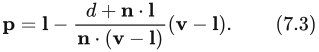

这个方程也可以转换为式（7.4）所示的投影矩阵，它满足 **Mv** = **p**：

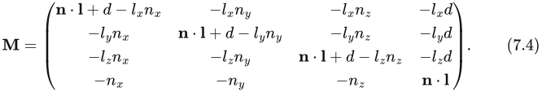

正如预期的那样，如果平面为 y = 0，即 **n** = (0, 1, 0) 且 d = 0，这个矩阵就变成式（7.2）中的矩阵。

要渲染阴影，只需将这个矩阵应用于应当向平面 π 投射阴影的物体，然后用深色、在不进行光照计算的情况下渲染投影后的物体。实际操作中，必须采取措施，避免投影三角形被渲染到接收它们的表面下方。一种方法是给投影所用的平面加上一些偏移，使阴影三角形始终被渲染在该表面前方。

更稳妥的方法是先绘制地面平面，再关闭 z 缓冲绘制投影三角形，最后照常渲染其余几何体。由于不进行深度比较，投影三角形总会绘制在地面平面之上。

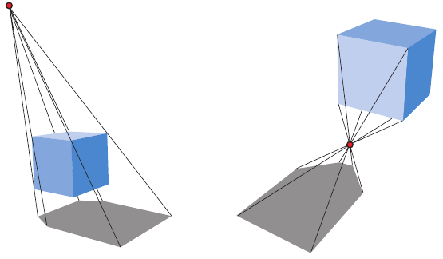

图 7.4：左图显示正确的阴影；右图中，由于光源低于物体最高的顶点，出现了反阴影。

如果地面平面有边界，例如它是一个矩形，投影阴影就可能落到它的范围之外，破坏真实感。为解决这个问题，可以使用模板缓冲。首先，将接收物绘制到屏幕和模板缓冲中。然后关闭 z 缓冲，只在接收物已经绘制的位置绘制投影三角形，最后正常渲染场景的其余部分。

另一种阴影算法是先将三角形渲染到一张纹理中，再把它应用到地面平面上。这种纹理是一种光照贴图，即调制其下方表面亮度的纹理（第 11.5.1 节）。后文将看到，将阴影投影渲染到纹理中的这一思路，还能实现半影以及曲面上的阴影。该技术的一个缺点是纹理可能被放大，以至于单个纹素覆盖多个像素，从而破坏真实感。

如果阴影情况在帧与帧之间没有变化，即光源和阴影投射物之间没有相对运动，就可以复用这张纹理。对于大多数阴影技术，只要情况没有变化，跨帧复用中间计算结果都能带来好处。

所有阴影投射物都必须位于光源与接收阴影的地面平面之间。如果光源低于物体的最高点，就会产生反阴影（antishadow）[162]，因为每个顶点都是沿着穿过光源所在点的方向进行投影的。正确的阴影与反阴影如图 7.4 所示。如果投影的物体位于接收平面下方，同样会产生错误，因为它本来也不应投下阴影。

当然，可以显式地剔除并裁剪阴影三角形，以避免这些伪影。接下来介绍一种更简单的方法：利用已有的 GPU 流水线，在投影时完成裁剪。

### 7.1.2 软阴影

利用多种技术，也可以让投影阴影变软。这里介绍 Heckbert 和 Herf 提出的一种生成软阴影的算法 [697, 722]。该算法的目标是生成一张显示软阴影的地面纹理。随后，我们介绍准确性较低、但速度更快的方法。

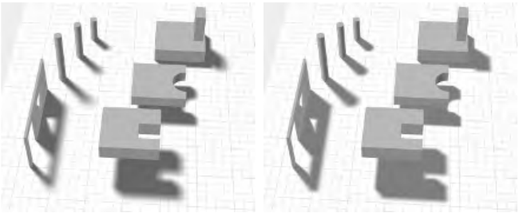

图 7.5：左图采用 Heckbert 和 Herf 的方法渲染，使用了 256 遍渲染。右图采用 Haines 的方法，只需一遍渲染。Haines 方法产生的本影过大，这一点在门口和窗户周围尤其明显。

只要光源具有面积，就会出现软阴影。近似面光源效果的一种方法，是在其表面上放置多个无面积光源进行采样。对于每一个这样的光源，渲染一幅图像并累加到缓冲中。将这些图像取平均，就得到一幅具有软阴影的图像。注意，从理论上说，任何生成硬阴影的算法都可以结合这种累加技术来生成半影。实际上，由于所需执行时间过长，要以交互速率这样做通常并不可行。

Heckbert 和 Herf 使用一种基于视锥体的方法生成阴影。其思路是把光源看作观察者，并让地面平面成为视锥体的远裁剪平面。视锥体需要足够宽，以包含所有遮挡物。

通过生成一系列地面纹理，便可形成软阴影纹理。在面光源表面上进行采样，每个采样位置都用来对表示地面的图像进行着色，然后将阴影投射物投影到这幅图像上。将所有这些图像相加并取平均，便得到地面阴影纹理。图 7.5 左侧给出了一个例子。

面光源采样方法的一个问题是，结果往往会暴露出它的本质：来自多个无面积光源的若干阴影相互叠加。此外，进行 n 遍阴影渲染只能生成 n + 1 种不同的明暗层次。大量渲染遍次可以得到准确的结果，但代价过高。这种方法适合获取用于检验其他更快算法质量的“真实基准”图像（ground-truth；在这里按字面也可理解为“地面上的真值”）。

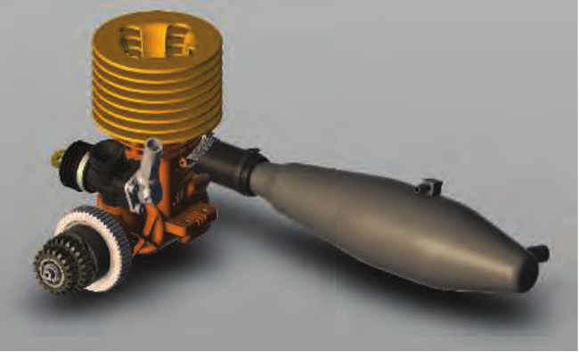

图 7.6：下落投影（drop shadow）。先从上方渲染阴影投射物，再模糊该图像，由此生成阴影纹理，最后将它渲染到地面平面上。（图像由 Autodesk 的 A360 查看器生成，模型来自 Autodesk 的 Inventor 示例。）

一种更高效的做法是使用卷积，也就是滤波。在某些情况下，对从单个点生成的硬阴影进行模糊就已足够；还可以由此生成半透明纹理，与真实世界内容合成。见图 7.6。不过，在物体与地面接触的位置附近，均匀模糊可能显得不够真实。

还有许多方法能够以额外开销换取更好的近似。例如，Haines [644] 从投影得到的硬阴影出发，再沿轮廓边缘渲染渐变：从中央的深色过渡到边缘的白色，以生成看似可信的半影。见图 7.5 右侧。不过，这些半影并不符合物理规律，因为半影也应当延伸到轮廓边缘以内的区域。Iwanicki [356, 806] 借鉴球谐函数的思路，用椭球体近似作为遮挡物的角色，以生成软阴影。所有这些方法都存在各自的近似和缺点，但与对大量下落投影图像取平均相比，它们的效率高得多。

## 7.2 曲面上的阴影

来源：原书第 229—230 页（PDF 第 250—251 页）；范围从 7.2 节标题开始，到 7.3 节标题之前。

将平面阴影的思想扩展到曲面的一种简单方法，是把生成的阴影图像用作投影纹理 [1192, 1254, 1272, 1597]。可以从光源的视角来理解阴影：光源能看到的地方受到照明，看不到的地方则处于阴影中。假设从光源的视点出发，将遮挡物以黑色渲染到一张其余部分为白色的纹理中。随后，就可以将这张纹理投影到需要接收阴影的表面上。实际上，我们会为接收物上的每个顶点计算一个纹理坐标 (u, v)，并将纹理应用到它上面。这些纹理坐标可以由应用程序显式计算。这与上一节中的地面阴影纹理略有不同：上一节将物体投影到一个特定的物理平面上，而这里的图像则是从光源视点观察得到的，就像投影仪中的一帧胶片。

渲染时，投影的阴影纹理会改变接收表面的外观。它还可以与其他阴影方法结合使用，有时主要用于帮助人们判断物体的位置。例如，在平台跳跃类电子游戏中，即使主角完全处于阴影中，也可能始终在其正下方添加一个落影 [1343]。更精细的算法可以获得更好的结果。例如，Eisemann 和 Décoret [411] 假设物体上方有一个矩形光源，为物体的水平切片创建一叠阴影图像，然后将这些图像转换为 mipmap 或类似表示。通过各个切片的 mipmap，按照与该切片到接收物的距离成比例的范围，访问切片中的相应区域；这意味着，距离越远的切片投下的阴影越柔和。

纹理投影方法存在一些严重的缺点。首先，应用程序必须确定哪些物体是遮挡物，以及哪些物体是对应的阴影接收物。程序必须保证接收物比遮挡物离光源更远，否则阴影就会“反向投射”。此外，遮挡物无法在自身上产生阴影。接下来的两节将介绍能够生成正确阴影的算法，它们不需要这样的干预，也不受这些限制。

注意，使用预先制作的投影纹理，可以得到多种照明图案。聚光灯只需使用一张正方形的投影纹理，在其中用一个圆形定义光照区域。由水平线组成的投影纹理则可以产生百叶窗效果。这类纹理称为光照衰减遮罩（light attenuation mask）、cookie 纹理或 gobo 贴图。只需将两张纹理相乘，就能把预先制作的图案与实时创建的投影纹理结合起来。第 6.9 节将进一步讨论这类光源。

## 7.3 阴影体

来源：《Real-Time Rendering, Fourth Edition》，书页 230—233（PDF 物理页 251—254）；本节从 7.3 标题开始，到书页 234（PDF 第 255 页）的 7.4 标题之前结束。

Heidmann 于 1991 年提出了一种方法 [701]，它基于 Crow 的阴影体（shadow volumes）[311]，通过巧妙使用模板缓冲区，能够把阴影投射到任意物体上。这种方法可用于任何 GPU，因为它唯一的要求就是具有模板缓冲区。它不是基于图像的方法（这与接下来介绍的阴影贴图算法不同），因而避免了采样问题，可以在各处生成正确且边缘锐利的阴影。有时，这也会成为缺点。例如，角色衣服上的褶皱可能产生细窄的硬阴影，造成严重的走样。由于开销难以预测，如今很少使用阴影体 [1599]。这里简要介绍这一算法，因为它展示了一些重要原理，而且基于这些原理的研究仍在继续。

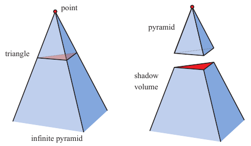

**图 7.7** 左：从一个点光源出发、穿过三角形各顶点的直线继续延伸，形成一个无限长的棱锥。右：上半部分是一个棱锥，下半部分是一个无限长的截头棱锥，也称为阴影体。位于阴影体内部的所有几何体都处于阴影中。

首先，想象一个点和一个三角形。把从这个点出发、经过三角形各顶点的直线延伸到无穷远，就会得到一个无限长的三棱锥。三角形下方的部分，也就是不包含该点的部分，是一个无限长的截头棱锥；上方的部分则只是一个普通棱锥。图 7.7 展示了这一构造。现在假设这个点实际上是一个点光源。那么，物体中位于这个截头棱锥体积内部（三角形下方）的任何部分都处于阴影中。这个体积称为阴影体。

假设我们正在观察一个场景，并沿着一条从眼睛出发、穿过某个像素的射线前进，直到射线碰到要显示在屏幕上的物体。在射线前往这个物体的途中，每当它穿过阴影体的一个正面朝向的面（即朝向观察者的面），我们就将一个计数器加一。因此，每次射线进入阴影时，计数器都会加一。同样，每当射线穿过截头棱锥的一个背面朝向的面，我们就将同一个计数器减一；此时，射线正在离开一个阴影区域。我们继续前进，不断增减计数器，直到射线碰到该像素处要显示的物体。如果计数器大于零，该像素就在阴影中；否则就不在阴影中。当投射阴影的三角形不止一个时，这一原理同样成立。参见图 7.8。

使用射线完成这些操作很费时。但有一种巧妙得多的解决办法 [701]：让模板缓冲区代替我们计数。首先，清空模板缓冲区。其次，仅使用材质未受光照部分的颜色，将整个场景绘制到帧缓冲区中，从而将这些着色分量写入颜色缓冲区，并将深度信息写入 z 缓冲区。第三，关闭 z 缓冲区更新和颜色缓冲区写入（但仍然进行 z 缓冲区测试），然后绘制阴影体中正面朝向的三角形。在这一过程中，将模板操作设置为：只要绘制了三角形，就递增模板缓冲区相应位置的值。第四，使用模板缓冲区再执行一个遍次，这次只绘制阴影体中背面朝向的三角形。在这一遍中，绘制三角形时递减模板缓冲区中的值。只有当所渲染阴影体表面的像素可见时（即没有被任何实际几何体遮挡时），才执行递增和递减。此时，模板缓冲区保存着每个像素的阴影状态。最后，再次渲染整个场景，这次仅渲染当前材质中受该光源影响的分量，而且只在模板缓冲区值为 0 的位置显示这些分量。值为 0 表示射线离开阴影的次数与进入阴影体的次数相同，也就是说，该位置受到这个光源的照明。

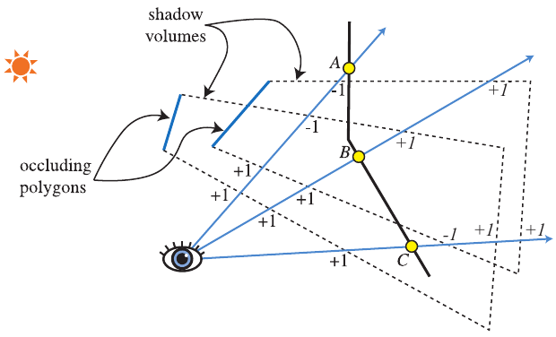

**图 7.8** 用两种不同计数方法统计阴影体穿越次数的二维侧视图。在 z-pass 体积计数中，射线穿过阴影体的正面三角形时计数加一，穿过背面三角形离开时计数减一。因此，对于点 A，射线进入两个阴影体，计数为 +2，随后又离开这两个阴影体，最终净计数为零，所以该点受到光照。在 z-fail 体积计数中，计数从表面之后开始（这些计数在图中以斜体表示）。对于点 B 处的射线，z-pass 方法穿过两个正面三角形，得到 +2 的计数；z-fail 方法穿过两个背面三角形，得到相同的计数。点 C 展示了为什么 z-fail 阴影体必须封口。从点 C 出发的射线先碰到一个正面三角形，计数为 −1。随后它离开两个阴影体（穿过它们的端盖；要使该方法正确工作，这些端盖是必需的），最终净计数为 +1。计数不为零，所以该点处于阴影中。对于所观察表面上的所有点，两种方法始终给出相同的计数结果。

这种计数方法就是阴影体背后的基本思想。图 7.9 给出了用阴影体算法生成阴影的示例。有一些高效方法，可以在单个遍次中实现该算法 [1514]。但是，当物体穿过相机的近裁剪平面时，就会出现计数问题。解决办法称为 z-fail，它统计隐藏在可见表面后方的交叉次数，而不是表面前方的交叉次数 [450, 775]。图 7.8 简要说明了这种替代方法。

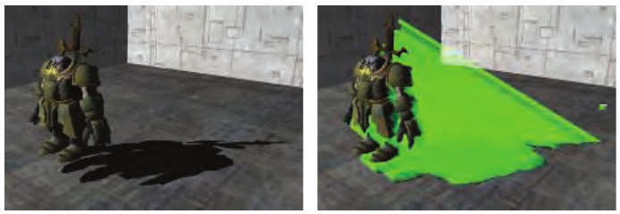

**图 7.9** 阴影体。左图中，一个角色投射出阴影。右图展示了从模型挤出的三角形。（图片来自 Microsoft SDK [1208] 的“ShadowVolume”示例。）

为每个三角形创建四边形，会造成大量过度绘制。也就是说，每个三角形都会产生三个必须渲染的四边形。一个由一千个三角形组成的球体会产生三千个四边形，而每个四边形都可能横跨整个屏幕。一种解决办法是，只绘制沿物体轮廓边生成的四边形。例如，这个球体可能只有五十条轮廓边，因此只需要五十个四边形。可以使用几何着色器自动生成这些轮廓边 [1702]。也可以使用剔除和限制范围的技术来降低填充开销 [1061]。

然而，阴影体算法仍然有一个严重缺点：开销变化极大。想象视野中只有一个小三角形。如果相机与光源恰好位于同一位置，阴影体的开销就最小。生成的四边形由于侧边正对视线，不会覆盖任何像素。只有三角形本身起作用。现在假设观察者绕着三角形移动，并始终使其保持在视野中。当相机逐渐远离光源时，阴影体四边形会变得更加可见，覆盖更多屏幕区域，从而需要进行更多计算。如果观察者恰好进入这个三角形的阴影，阴影体就会完全填满屏幕，与最初的视角相比，求值会耗费相当多的时间。正是这种变化，使阴影体无法用于那些十分重视稳定帧率的交互式应用。朝着光源方向观察可能使算法开销出现巨大且不可预测的跃升，其他一些情形也会如此。

由于这些原因，大多数应用已经放弃了阴影体。然而，随着 GPU 上各种新的数据访问方式不断演进，以及研究人员巧妙地将这些功能用于新的用途，阴影体或许有一天会重新得到广泛使用。例如，Sintorn 等人 [1648] 概述了一些提高效率的阴影体算法，并提出了他们自己的层次化加速结构。

接下来介绍的算法——阴影映射——具有可预测得多的开销，而且非常适合 GPU，因此成为许多应用生成阴影的基础。

## 7.4 阴影贴图

来源：《Real-Time Rendering》第 4 版，书页 234—247（PDF 物理页 255—268）。本节从 7.4 标题开始，至 7.5 标题之前结束，包含 7.4.1、图 7.10—7.21、公式（7.5）及原书脚注 1。

1978 年，Williams [1888] 提出，可以利用普通的基于 z 缓冲的渲染器，快速为任意物体生成阴影。其思路是：从需要投射阴影的光源位置出发，使用 z 缓冲渲染场景。光源“看见”的一切都受到照明，其余部分则处于阴影中。生成这幅图像时，只需要进行 z 缓冲处理；可以关闭光照计算、纹理处理以及向颜色缓冲写入数值的操作。

此时，z 缓冲中的每个像素都包含离光源最近的物体的 z 深度。我们把 z 缓冲的全部内容称为**阴影贴图**（shadow map），有时也称为阴影深度贴图（shadow depth map）或阴影缓冲（shadow buffer）。使用阴影贴图时，再次渲染场景，但这次从观察者的视角出发。渲染每个绘制图元时，将它在每个像素处的位置与阴影贴图进行比较。如果渲染点到光源的距离比阴影贴图中的对应值更远，该点就处于阴影中；否则不在阴影中。这项技术通过纹理映射实现，见图 7.10。阴影贴图是一种流行的算法，因为它的开销相对可预测。建立阴影贴图的开销与所渲染图元的数量大致呈线性关系，而访问时间为常数。对于光源和物体都不移动的场景，例如计算机辅助设计中的场景，可以只生成一次阴影贴图，并在每一帧中复用。

生成单个 z 缓冲时，光源像相机一样，只能“看向”一个特定方向。对于太阳这样的远处方向光，应将光源的视图设置为涵盖所有会向观察者所见视见体内投射阴影的物体。光源采用正交投影，其视图在 x 和 y 方向上必须足够宽、足够高，以便看到这组物体。对于局部光源，也应尽可能进行类似调整。如果局部光源距离投影物体足够远，单个视锥体就可能足以涵盖所有这些物体。另一种情况是局部光源为聚光灯：它自然具有一个与之对应的视锥体，视锥体之外的一切都被认为没有受到照明。

如果局部光源位于场景内部，且周围都是投影物体，典型的解决方案是采用六个视图组成的立方体，类似于立方体环境映射 [865]。这种贴图称为**全向阴影贴图**（omnidirectional shadow maps）。全向贴图的主要难点，是避免两张独立贴图接合处出现接缝伪影。King 和 Newhall [895] 深入分析了这些问题并给出解决方案，Gerasimov [525] 则提供了一些实现细节。Forsyth [484, 486] 提出了一种适用于全向光源的通用多视锥体划分方案，还能在需要的地方提供更高的阴影贴图分辨率。Crytek [1590, 1678, 1679] 根据点光源六个视图各自投影视锥体在屏幕空间中的覆盖范围，为每个视图设置分辨率，并将所有贴图存储在一个纹理图集中。

不必将场景中的所有物体都渲染到光源的视见体中。首先，只需渲染能够投射阴影的物体。例如，如果已知地面只能接收阴影而不能投射阴影，就不必把它渲染到阴影贴图中。

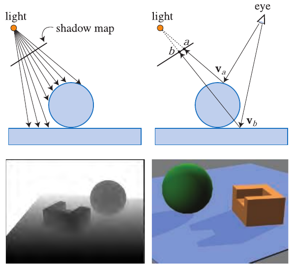

图 7.10．阴影贴图。左上：通过存储视图中各表面的深度形成阴影贴图。右上：观察者看向两个位置。在点 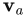 处看见球体，确定该点位于阴影贴图的纹素 a 处。这里存储的深度并不比点  到光源的距离小（很多），因此该点受到照明。在点 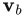 处命中的矩形，到光源的距离比纹素 b 中存储的深度大（很多），因此处于阴影中。左下是从光源视角看到的场景，白色表示距离更远。右下是使用这张阴影贴图渲染的场景。

按照定义，阴影投射物体位于光源的视锥体内。可以通过若干方式扩展或收紧这个视锥体，从而安全地忽略某些投影物体 [896, 1812]。考虑观察者可见的阴影接收物体集合：沿光源视线方向，这组物体都位于某个最大距离以内。超过这个距离的任何物体，都不可能向可见的接收物体投射阴影。同样，可见接收物体集合的范围也很可能小于光源原本的 x、y 视图边界，见图 7.11。另一个例子是，如果光源位于观察者的视锥体内，那么这个额外视锥体之外的物体不可能向接收物体投射阴影。只渲染相关物体不仅能节省渲染时间，还能缩小光源所需的视锥体，从而提高阴影贴图的有效分辨率，改善质量。此外，尽可能让光源视锥体的近裁剪面远离光源、远裁剪面靠近光源，也会有所帮助。这样可以提高 z 缓冲的有效精度 [1792]（第 4.7.2 节）。

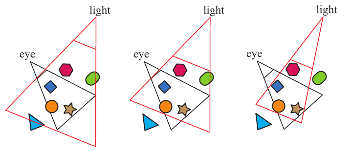

图 7.11．左：光源的视图涵盖观察者的视锥体。中：将光源的远裁剪面拉近，只纳入可见的接收物体，因此将三角形从投影物体中剔除；近裁剪面也作了调整。右：调整光源视锥体的侧面，使其包围可见接收物体，从而剔除绿色胶囊体。

阴影贴图的一个缺点，是阴影质量取决于阴影贴图的分辨率（以像素计）以及 z 缓冲的数值精度。深度比较时需要对阴影贴图采样，因此该算法容易出现走样问题，尤其是在物体接触点附近。一种常见问题是**自阴影走样**（self-shadow aliasing），通常称为“表面痤疮”（surface acne）或“阴影痤疮”（shadow acne），即错误地认为某个三角形给自身投下了阴影。这个问题有两个来源。其一只是处理器数值精度的限制；另一个是几何方面的原因，即用一个点样本的数值代表一片区域的深度。也就是说，为光源生成的样本位置几乎从来不会与屏幕样本位置相同（例如，像素通常在中心位置采样）。将光源存储的深度值与所观察表面的深度比较时，光源的数值可能略小于表面深度，导致自阴影。图 7.12 展示了这些误差的效果。

一种有助于避免各种阴影贴图伪影的常见方法，是引入偏移因子，但它并不总能消除伪影。将阴影贴图中的距离与待测试位置的距离进行比较时，从接收物体的距离中减去一个很小的偏移，见图 7.13。这个偏移可以是常数 [1022]，但当接收物体并非大致朝向光源时，这种做法可能失效。更有效的方法是采用与接收物体相对于光源的角度成比例的偏移。表面越倾斜、越背离光源，偏移就越大，以避免这个问题。这种偏移称为**斜率缩放偏移**（slope scale bias）。可以使用 OpenGL 的 `glPolygonOffset` 这样的命令，将每个多边形向远离光源的方向移动，从而同时应用这两种偏移。注意，如果一个表面直接朝向光源，斜率缩放偏移完全不会将它向后偏移。因此，通常将常量偏移与斜率缩放偏移一起使用，以避免可能的精度误差。斜率缩放偏移也经常被限制在某个最大值以内，因为当表面从光源看去几乎呈侧面时，正切值可能非常大。

> 译注：原书书页 236 将该命令排为 `glPolygonOffset)`，含一个未配对的右括号；这里保留 API 名称并注明这一排印问题。

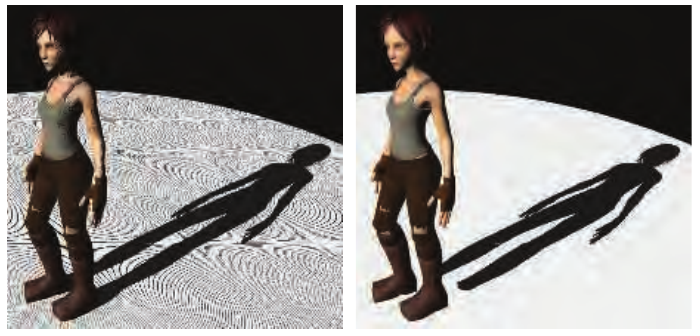

图 7.12．阴影贴图的偏移伪影。左：偏移过小，因此产生自阴影。右：偏移过大，导致鞋子没有投下接触阴影。阴影贴图的分辨率也过低，因此阴影呈现块状外观。（图像使用 Christoph Peters 的阴影演示程序生成。）

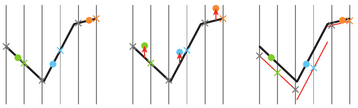

图 7.13．阴影偏移。将各表面渲染到一个位于上方的光源的阴影贴图中，竖线表示阴影贴图的像素中心。遮挡物深度记录在 × 标记的位置。我们希望知道三个圆点样本所在的表面是否受到照明。每个样本所对应的最近阴影贴图深度值，以相同颜色的 × 表示。左：如果不添加偏移，蓝色与橙色样本会被错误地判定为处于阴影中，因为它们到光源的距离大于对应的阴影贴图深度。中：从每个样本中减去一个常量深度偏移，使各样本更靠近光源。蓝色样本仍被认为处于阴影中，因为它没有比用于比较的阴影贴图深度更靠近光源。右：将每个多边形按与其斜率成比例的量向远离光源的方向移动，再生成阴影贴图。现在所有样本深度都比对应的阴影贴图深度更近，所以都受到照明。

Holbert [759, 760] 引入了**法线偏移**（normal offset bias）：首先将接收物体在世界空间中的位置沿表面法线方向稍作移动，移动量与光照方向和几何法线夹角的正弦成比例。见书页 250 的图 7.24。这不仅改变深度，还改变在阴影贴图上测试样本时使用的 x、y 坐标。光线相对于表面的角度越趋于掠射，这个偏移就越大，期望样本能够充分高于表面，以避免自阴影。可以把这种方法想象为将样本移到接收物体上方的一层“虚拟表面”。该偏移是一个世界空间距离，因此 Pettineo [1403] 建议根据阴影贴图的深度范围对它进行缩放。Pesce [1391] 提出了沿相机观察方向施加偏移的想法，它同样通过调整阴影贴图坐标来发挥作用。第 7.5 节讨论其他偏移方法，因为那里介绍的阴影方法还需要测试若干相邻样本。

偏移过大会引发称为**漏光**（light leaks）或 **Peter Panning** 的问题，使物体看起来略微悬浮在下面的表面之上。这种伪影的成因是，物体接触点下方的区域，例如脚下的地面，被过度向前推移，因此没有接收到阴影。

避免自阴影问题的一种方式，是只将背面渲染到阴影贴图中。这种方案称为**第二深度阴影贴图**（second-depth shadow mapping）[1845]，在许多情况下效果很好，尤其适合不允许手工微调偏移的渲染系统。问题会出现在双面、很薄或彼此接触的物体上。如果模型的网格两面都可见，例如棕榈叶或一张纸，那么由于背面与正面处于同一位置，仍可能出现自阴影。同样，如果不施加偏移，轮廓边缘附近或薄物体也可能出现问题，因为这些区域的背面接近正面。添加偏移有助于避免表面痤疮，但这种方案更容易漏光，因为在接触点处，接收物体与遮挡物背面之间没有间隔。见图 7.14。选择哪一种方案可能取决于具体情况。例如，Sousa 等人 [1679] 发现，在他们的应用中，太阳阴影采用正面、室内光源采用背面效果最好。

注意，对于阴影贴图，物体必须是“水密”的（流形且闭合，即为实体；第 16.3.3 节），或者必须将正面和背面都渲染到贴图中，否则物体可能无法完整地投射阴影。Woo [1900] 提出了一种通用方法，试图在仅使用正面或仅使用背面生成阴影之间，按字面意义取一个恰当的“中间值”。其思路是把实体物体渲染到阴影贴图，并记录最靠近光源的两个表面。这一过程可以通过深度剥离或其他与透明度相关的技术完成。两个物体之间的平均深度形成一个中间层，用这个层的深度作为阴影贴图，有时称为**双重阴影贴图**（dual shadow map）[1865]。如果物体足够厚，自阴影和漏光伪影就可以减至很少。Bavoil 等人 [116] 讨论了应对潜在伪影的方法以及其他实现细节。主要缺点是使用两张阴影贴图所带来的额外开销。Myers [1253] 讨论了位于遮挡物和接收物体之间、由美术人员控制的深度层。

> 译注：上述平均深度处，原文使用 “the two objects”（两个物体），承接前文最近的两个表面；这里保留原文措辞，其操作对象仍是所记录的两个深度。书页 239 的 “occlude” 按上下文译为遮挡物。

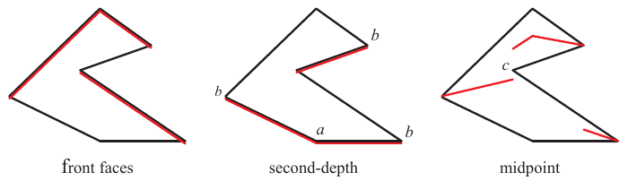

图 7.14．上方光源所用的阴影贴图表面。左：将以红色标出的朝向光源的表面送入阴影贴图。这些表面可能被错误地判定为遮挡自身（“痤疮”），因此需要将它们向远离光源的方向偏移。中：仅将背向光源的三角形渲染到阴影贴图中。将这些遮挡物向下推的偏移可能使光漏到 a 点附近的地平面上；向前偏移则可能让标为 b 的轮廓边界附近本来受到照明的位置被认为处于阴影中。右：在阴影贴图每个位置找到最近的正面和背面三角形，在二者之间的中点处形成中间表面。c 点附近可能漏光（第二深度阴影贴图也会出现这种情况），因为最近的阴影贴图样本可能落在该位置左侧的中间表面上，于是这个点会比样本更靠近光源。

随着观察者移动，阴影投射物体集合不断变化，光源视见体的大小也常常随之改变。这种变化又会使阴影在相邻帧之间发生轻微位移。原因是光源阴影贴图采样了从光源出发的一组不同方向，而这组方向没有与之前的方向对齐。对于方向光，解决方案是强制后续生成的每张阴影贴图，在世界空间中保持相同的相对纹素光束位置 [927, 1227, 1792, 1810]。也就是说，可以把阴影贴图理解为在整个世界上施加一个二维网格参照系，每个网格单元代表贴图上的一个像素样本。移动时，阴影贴图只是改为针对这些相同网格单元中的另一组单元生成。换句话说，将光源的视图投影强制对齐到这个网格，以保持帧间一致性。

### 7.4.1 分辨率增强

与纹理的使用方式类似，理想情况下，我们希望阴影贴图的一个纹素大约覆盖图像的一个像素。如果光源与观察者位于同一位置，那么阴影贴图就与屏幕空间像素完美地一一对应（而且没有可见阴影，因为光源照亮的恰好就是观察者看到的内容）。一旦光源方向发生变化，这种逐像素的比例就会改变，可能引发伪影。图 7.15 展示了一个例子。阴影呈块状，轮廓不清晰，因为阴影贴图中的每个纹素都对应前景中的大量像素。这种不匹配称为**透视走样**（perspective aliasing）。如果表面从光源看去几乎呈侧面，却朝向观察者，那么单个阴影贴图纹素同样可能覆盖许多像素。这种问题称为**投影走样**（projective aliasing）[1792]，见图 7.16。提高阴影贴图分辨率可以减轻块状现象，但代价是增加内存和处理开销。

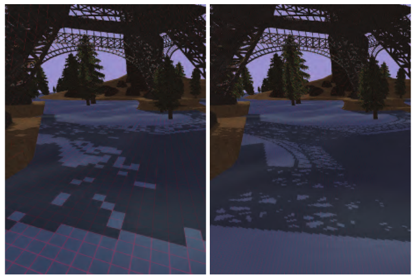

图 7.15．左图使用标准阴影贴图生成，右图使用 LiSPSM。图中显示了各阴影贴图纹素的投影。两张阴影贴图分辨率相同，区别在于 LiSPSM 重新构造光源的矩阵，在更靠近观察者的位置提供更高的采样率。（图像由维也纳工业大学 Daniel Scherzer 提供。）

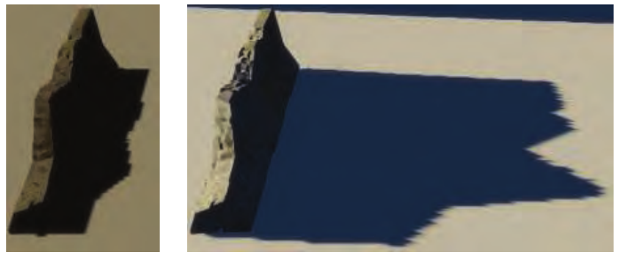

图 7.16．左：光源几乎位于正上方。与观察者的视图相比，阴影贴图分辨率较低，因此阴影边缘略显参差。右：光源接近地平线，每个阴影纹素在水平方向覆盖的屏幕区域大得多，因此边缘锯齿更加明显。（图像由 GitHub 上 TheRealMJP 的 “Shadows” 程序生成。）

还有另一种构造光源采样模式的方法，可以使它更接近相机的采样模式。这是通过改变场景向光源投影的方式来实现的。通常我们认为视图是对称的，观察向量位于视锥体中央。然而，观察方向只是定义一个观察平面，并没有规定对哪些像素采样。定义视锥体的窗口可以在这个平面上平移、倾斜或旋转，形成一个四边形，从而给出不同的世界空间到观察空间的映射。四边形仍然按规则间隔采样，这是线性变换矩阵及 GPU 使用该矩阵的性质所决定的。通过改变光源观察方向和观察窗口的边界，可以改变采样率，见图 7.17。

从光源视图映射到观察者视图有 22 个自由度 [896]。对这个解空间的探索产生了若干不同算法，试图使光源的采样率更好地匹配观察者的采样率。这些方法包括**透视阴影贴图**（perspective shadow maps，PSM）[1691]、**梯形阴影贴图**（trapezoidal shadow maps，TSM）[1132] 和**光空间透视阴影贴图**（light space perspective shadow maps，LiSPSM）[1893, 1895]。实例见图 7.15 以及书页 254 的图 7.26。这一类技术称为**透视扭曲**（perspective warping）方法。

这些矩阵扭曲算法的一个优点是，除了修改光源的矩阵之外，不需要额外工作。每种方法都有自己的优缺点 [484]：在某些几何形状和光照条件下，它们有助于匹配采样率；而在另一些情况下，却会使采样率更不匹配。Lloyd 等人 [1062, 1063] 分析了 PSM、TSM 和 LiSPSM 之间的等价关系，对这些方法中的采样与走样问题作了出色的综述。当光照方向与观察方向垂直时（例如光源位于上方），这些方案效果最好，因为此时可以调整透视变换，将更多样本布置在更靠近观察者的位置。

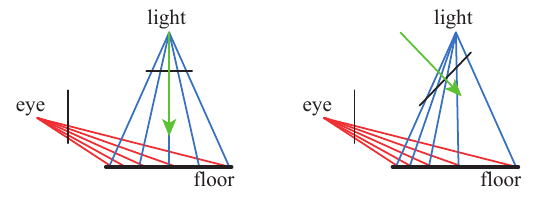

图 7.17．对于上方光源，左图地板上的采样率与观察者的采样率不匹配。右图通过改变光源的观察方向与投影窗口，使采样率偏向于在靠近观察者的地方具有更高的纹素密度。

有一种光照情形，矩阵扭曲技术无法提供帮助：光源位于相机前方并朝向相机。这种情况称为**视锥体对抗**（dueling frusta），更通俗的说法是“车灯前的鹿”。观察者附近需要更多阴影贴图样本，但线性扭曲只能让情况变得更糟 [1555]。这一问题以及其他问题，例如质量突然变化 [430]、相机移动时阴影显得“神经质”而不稳定 [484, 1227]，使这些方法逐渐失宠。

在观察者附近增加样本的思路很好，由此产生了为一个给定视图生成多张阴影贴图的算法。Carmack 在 Quakecon 2004 的主题演讲中描述这一思路时，它首次引起明显关注。Blow 独立实现了这样的系统 [174]。其思路很简单：生成固定的一组阴影贴图（分辨率可以不同），覆盖场景的不同区域。在 Blow 的方案中，四张阴影贴图围绕观察者嵌套布置。这样，近处物体能使用高分辨率贴图，远处物体则采用较低分辨率。Forsyth [483, 486] 提出了一种相关思路，为不同的可见物体集合生成不同的阴影贴图。在他的配置中，每个物体都只关联唯一一张阴影贴图，因此避免了物体跨越两张阴影贴图边界时如何处理过渡的问题。Flagship Studios 开发了一种融合这两种思路的系统：一张阴影贴图用于附近的动态物体，另一张用于观察者附近某个网格区域内的静态物体，第三张用于整个场景的静态物体。第一张阴影贴图每帧生成；另外两张因为光源和几何体都是静态的，可以只生成一次。虽然这些具体系统如今已相当老旧，但针对不同物体和情形使用多张贴图，其中一些预先计算、另一些动态生成，这一思路是此后各种算法的共同主题。

2006 年，Engel [430]、Lloyd 等人 [1062, 1063] 以及 Zhang 等人 [1962, 1963] 独立研究了同一个基本思路。¹ 该思路是沿观察方向进行平行切分，将视锥体的体积分成若干块，见图 7.18。随着深度增加，后一个体积的深度范围约为前一个的两到三倍 [430, 1962]。对于每个视见体，光源可以构造一个紧密包围它的视锥体，再生成一张阴影贴图。使用纹理图集或纹理数组，可以将不同的阴影贴图当作一个大的纹理对象，从而尽量减少缓存访问延迟。图 7.19 对比了由此获得的质量改善。Engel 为该算法所取的名字——**级联阴影贴图**（cascaded shadow maps，CSM）——比 Zhang 使用的术语“平行分割阴影贴图”（parallel-split shadow maps）更常见，但两者都出现在文献中，实际上相同 [1964]。

> 原书脚注 1：Tadamura 等人 [1735] 早在七年前就提出了这一思路，但直到其他研究者探索其实用性时，它才产生影响。

> 译注：原文写作 “slicing it parallel to the view direction”。图 7.18 显示各切分平面彼此平行、垂直于观察方向，沿观察深度形成前后排列的子视见体；上文“沿观察方向进行平行切分”据此理解，并保留原文措辞供核对。

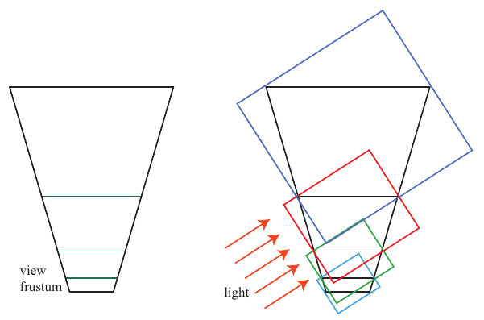

图 7.18．左：观察者的视锥体分成四个体积。右：为这些体积建立包围盒，由它们决定方向光的四张阴影贴图各自渲染的体积。（根据 Engel [430] 绘制。）

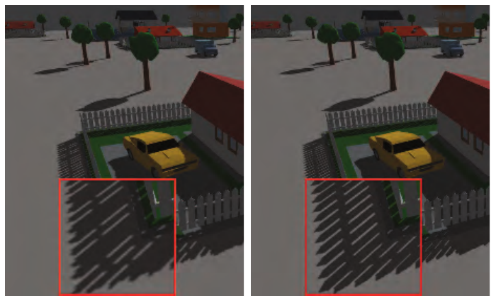

图 7.19．左：场景可见区域很宽广，导致分辨率为 2048 × 2048 的单张阴影贴图出现透视走样。右：沿观察轴布置四张 1024 × 1024 的阴影贴图，显著改善了质量 [1963]。内嵌红框中显示了围栏前角的放大图。（图像由香港中文大学 Fan Zhang 提供。）

这类算法实现直接，能够覆盖很大的场景区域并获得合理结果，而且很稳健。通过在靠近观察者的地方提高采样率，可以处理视锥体对抗问题，也不会出现严重的最坏情况。由于这些优点，级联阴影贴图被用于许多应用。

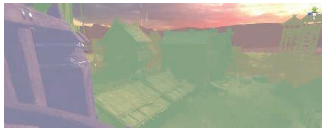

图 7.20．阴影级联的可视化。紫色、绿色、黄色和红色依次表示从最近到最远的级联。（图像由 Unity Technologies 提供。）

虽然可以使用透视扭曲，将更多样本打包到单张阴影贴图的细分区域中 [1783]，但通常是为每一级联使用一张单独的阴影贴图。如图 7.18 所示，以及图 7.20 从观察者视角所展示的，每张贴图覆盖的区域可以不同。近处阴影贴图采用更小的视见体，就能在需要的地方提供更多样本。确定各张贴图如何划分 z 深度范围，这项工作称为 **z 分区**（z-partitioning），可以非常简单，也可以很复杂 [412, 991, 1791]。一种方法是**对数分区**（logarithmic partitioning）[1062]，使每一级联贴图的远、近裁剪面距离之比都相同：

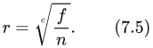

其中，n 和 f 分别是整个场景的近、远裁剪面距离，c 是贴图数量，r 是计算得到的比值。例如，如果场景中最近的物体距离为 1 米，最大距离为 1000 米，并且有三张级联贴图，那么 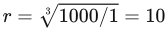。最近视图的近、远裁剪面距离分别是 1 和 10；为了保持同样的比值，下一区间为 10 到 100，最后一个区间为 100 到 1000 米。起始近端深度对这种分区影响很大。如果近端深度只有 0.1 米，那么 10000 的立方根为 21.54，比值高出许多，例如各边界依次为 0.1、2.154、46.42、1000。这意味着生成的每张阴影贴图都必须覆盖更大的区域，从而降低精度。在实践中，这种分区会把相当多的分辨率分配给靠近近裁剪面的区域，如果那里没有物体，这些分辨率就浪费了。避免这种不匹配的一种方法，是将分区距离设为对数分布和等距离分布的加权混合 [1962, 1963]；不过，如果能够确定紧密包围场景的视图边界，效果会更好。

难点在于设置近裁剪面。如果它离观察者太远，物体可能被这个平面裁掉，这是一种极其糟糕的伪影。对于过场动画，美术人员可以提前精确设置这个值 [1590]，但交互环境中的问题更具挑战性。Lauritzen 等人 [991, 1403] 提出了**样本分布阴影贴图**（sample distribution shadow maps，SDSM），使用上一帧的 z 深度值，通过以下两种方法之一确定更好的分区。

第一种方法是在 z 深度中寻找最小值和最大值，并用它们设置近、远裁剪面。这通过 GPU 上所谓的**归约**（reduce）操作完成：使用计算着色器或其他着色器分析一系列越来越小的缓冲，把输出缓冲重新作为输入，直到只剩下一个 1 × 1 的缓冲。通常会将这些边界值稍微向外扩展，以适应场景中物体的移动速度。除非采取修正措施，否则从屏幕边缘进入的近处物体仍可能在一帧中造成问题，不过下一帧就会很快纠正。

第二种方法同样分析深度缓冲的数值，构造称为**直方图**（histogram）的图表，记录 z 深度沿整个范围的分布。除了找出紧密的近、远裁剪面之外，图中还可能出现根本没有物体的空隙。通常会放入这种区域的分区平面，都可以吸附到实际存在物体的位置，使这组级联贴图获得更高的 z 深度精度。

在实践中，第一种方法通用、快速（通常每帧约 1 毫秒），而且效果良好，因此已被若干应用采用 [1405, 1811]。见图 7.21。

与单张阴影贴图一样，光源样本在相邻帧之间移动所引起的闪烁伪影仍是一个问题；当物体在级联之间移动时，这个问题甚至可能更严重。有各种方法可以维持世界空间中稳定的采样点，各有优势 [41, 865, 1381, 1403, 1678, 1679, 1810]。物体跨越两张阴影贴图之间的边界时，阴影质量可能突然变化。一种解决方案是让视见体略有重叠。在这些重叠区域采样时，收集相邻两张阴影贴图的结果并进行混合 [1791]。也可以使用抖动，在这种区域只取一个样本 [1381]。

由于级联阴影贴图广受欢迎，人们投入了大量工作来提高其效率和质量 [1791, 1964]。如果某张阴影贴图的视锥体内部没有变化，就不必重新计算该贴图。对于每个光源，可以先找出哪些物体对光源可见，再从中找出哪些能够向接收物体投射阴影，从而预先计算阴影投射物体列表 [1405]。由于人们很难察觉阴影是否正确，可以采取一些适用于级联及其他算法的简化措施。一种技术是用低细节层次模型作为代理，实际投射阴影 [652, 1812]。另一种是排除很小的遮挡物 [1381, 1811]。还可以让远处阴影贴图的更新频率低于每帧一次，其理由是这些阴影不那么重要。这个思路存在大型移动物体引发伪影的风险，因此应谨慎使用 [865, 1389, 1391, 1678, 1679]。Day [329] 提出了让远处贴图在相邻帧之间“滚动”的思路：每张静态阴影贴图的大部分内容都可以逐帧复用，只有边缘可能变化，因此只需要渲染这些边缘。《DOOM》（2016）这样的游戏维护着一个大型阴影贴图图集，只重新生成其中物体发生移动的贴图 [294]。更远的级联贴图还可以设为完全忽略动态物体，因为这些阴影对场景的贡献可能很小。在某些环境中，可以用一张高分辨率静态阴影贴图代替这些较远的级联，从而显著减少工作量 [415, 1590]。对于单张静态阴影贴图会非常庞大的世界，可以采用稀疏纹理系统（第 19.10.1 节）[241, 625, 1253]。级联阴影贴图可以与烘焙的光照贴图纹理，或更适合特定情形的其他阴影技术相结合 [652]。Valient 的报告 [1811] 值得关注，因为它介绍了众多不同电子游戏对阴影系统所作的定制和采用的技术。第 11.5.1 节详细讨论了预计算光照与阴影算法。

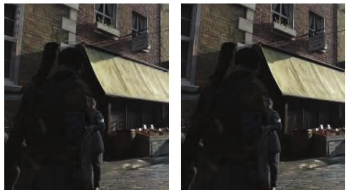

图 7.21．深度边界的影响。左：没有采用特殊处理来调整近、远裁剪面。右：使用 SDSM 找到更紧密的边界。请注意每幅图像左边缘附近的窗框、二楼花箱下方的区域以及一楼的窗户：过于宽松的视图边界造成欠采样，从而产生伪影。这些图像使用指数阴影贴图渲染，但改善深度精度的思路对所有阴影贴图技术都有用。（图像由 Ready at Dawn Studios 提供，版权归 Sony Interactive Entertainment 所有。）

创建多张独立阴影贴图，意味着每张都要遍历某一组几何体。一些提高效率的方法建立在这样的思路上：在单个渲染通道中，将遮挡物渲染到一组阴影贴图中。可以使用几何着色器复制物体数据，并将其发送到多个视图 [41]。实例化几何着色器允许把一个物体输出到最多 32 张深度纹理 [1456]。多视口扩展可以执行诸如将物体渲染到指定纹理数组切片的操作 [41, 154, 530]。第 21.3.1 节结合虚拟现实中的应用，更详细地讨论了这些技术。视口共享技术的一个潜在缺点是，必须把所有要生成的阴影贴图的遮挡物都送入流水线，而不是仅发送与每张阴影贴图相关的那一组物体 [1791, 1810]。

此时此刻，你自己就处在世界各地数十亿个光源的阴影中。只有其中少数光源的光能够到达你。在实时渲染中，如果所有光源始终处于活动状态，具有多个光源的大型场景就可能被计算量淹没。如果某个空间体积位于视锥体内，却不为观察者所见，那么就不必评估遮挡这个接收体积的物体 [625, 1137]。Bittner 等人 [152] 从观察者出发使用遮挡剔除（第 19.7 节），找出所有可见的阴影接收物体，然后从光源视角将所有潜在的阴影接收物体渲染到模板缓冲掩码中。该掩码编码了哪些可见阴影接收物体能够从光源处看见。生成阴影贴图时，他们从光源出发，使用遮挡剔除渲染物体，并利用掩码剔除没有接收物体区域中的物体。各种剔除策略也可以用于光源。由于辐照度随距离的平方衰减，一种常见技术是在超过某个距离阈值后剔除光源。例如，第 19.5 节的入口剔除技术可以找出哪些光源影响哪些单元。这是一个活跃的研究领域，因为它可能带来相当可观的性能收益 [1330, 1604]。

## 7.5 百分比渐近过滤

本节来源：原书第 247—250 页（PDF 第 268—271 页）；图 7.25 及完整图注续排于原书第 251 页（PDF 第 272 页）。正文范围自 7.5 节标题起，至 7.6 节标题前。

对阴影贴图技术作一个简单扩展，就可以得到伪软阴影。当一个光源采样单元覆盖许多屏幕像素时，分辨率问题会使阴影呈现块状；这种方法也有助于缓解这一问题。解决办法类似于纹理放大（第 6.2.1 节）：不再从阴影贴图中只取一个样本，而是读取最近的四个样本。这项技术并不对深度值本身进行插值，而是对它们与表面深度的比较结果进行插值。也就是说，将表面深度分别与四个纹素的深度比较，针对每个阴影贴图样本，判定该点处于光照中还是阴影中。然后，对这些结果——阴影为 0，光照为 1——进行双线性插值，计算光源实际对该表面位置产生多大贡献。这种过滤得到的是人为柔化的阴影。其半影会随阴影贴图的分辨率、摄像机位置等因素而变化。例如，较高的分辨率会使边缘柔化的范围变窄。不过，有一点半影和平滑效果，总比完全没有好。

这种从阴影贴图读取多个样本并混合结果的思路，称为**百分比渐近过滤**（percentage-closer filtering，PCF）[1475]。面光源会产生软阴影。到达表面某一位置的光量，取决于从该位置能看到的光源面积占总面积的比例。PCF 通过反转这一过程，尝试为点状光源（或方向光源）近似出软阴影：它不从一个表面位置求光源的可见面积，而是在原位置附近的一组表面位置上，求点状光源的可见性。见图 7.22。“百分比渐近过滤”这个名称指的是其最终目标：求出所取样本中对光源可见的样本所占的百分比。随后就按这个百分比确定用于表面着色的光量。

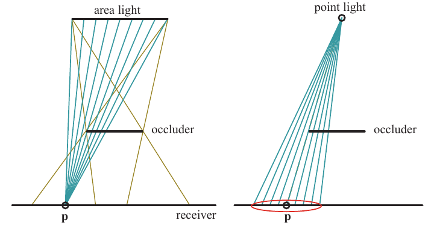

**图 7.22。** 左图中，从面光源发出的棕色线条展示了半影形成的位置。对于接收面上的单个点 p，可以测试面光源表面上的一组点，找出其中哪些点未被任何遮挡物挡住，从而计算该点接收到的照明量。右图中，点光源不会投射半影。PCF 通过反转这一过程来近似面光源的效果：对于给定位置，在阴影贴图上一个相应大小的区域内采样，求出受光样本所占的百分比。红色椭圆表示阴影贴图上的采样区域。理想情况下，这个圆盘的宽度与接收面和遮挡物之间的距离成正比。

在 PCF 中，会在某个表面位置附近生成若干位置；它们的深度大致相同，但对应于阴影贴图中不同的纹素位置。检查每个位置的可见性，再混合所得的布尔值——受光或不受光——以获得软阴影。注意，这一过程并不符合物理规律：它并不直接采样光源，而是依赖对表面本身进行采样的思路。到遮挡物的距离不会影响结果，因此各处阴影的半影大小相近。尽管如此，这种方法在许多情况下仍能提供合理的近似。

一旦确定了待采样区域的宽度，就应采用能够避免混叠伪影的方式采样，这一点很重要。对于如何采样和过滤阴影贴图上的邻近位置，存在许多变体。可变因素包括采样区域有多宽、使用多少个样本、采样模式，以及如何对结果加权。在功能较弱的 API 中，可以通过一种类似于双线性插值的特殊纹理采样模式加速采样过程。这种模式访问四个相邻位置，但不混合采样值，而是将四个样本分别与给定值比较，再返回通过测试的样本比例 [175]。不过，按规则网格模式进行最近邻采样，可能产生明显的伪影。使用联合双边滤波器，在模糊结果的同时保留物体边缘，可以提升质量，并避免阴影泄漏到其他表面上 [1343]。关于这种过滤技术的更多内容，见第 12.1.1 节。

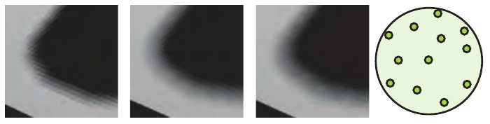

**图 7.23。** 最左图展示了使用最近邻采样、按 4×4 网格模式进行 PCF 采样的结果。最右图展示了圆盘上的一种 12 采样点泊松采样模式。用这种模式采样阴影贴图，可得到中间偏左图所示的改进结果，但仍能看到伪影。中间偏右图中，各个像素所用的采样模式围绕其中心作随机旋转。结构化的阴影伪影由此转变成噪声，而噪声远没有前者那么令人不适。（图片由 ATI Research, Inc. 的 John Isidoro 提供。）

DirectX 10 引入了对 PCF 的单指令双线性过滤支持，能够给出更平滑的结果 [53, 412, 1709, 1790]。与最近邻采样相比，这带来了显著的视觉改善，但规则采样造成的伪影仍然是个问题。尽量减轻网格图案的一种解决办法，是使用预先计算的泊松分布模式对区域进行采样，如图 7.23 所示。这种分布将样本散布开来，使它们既不会彼此靠得太近，也不会排列成规则模式。众所周知，无论采用哪种分布，每个像素都使用相同的采样位置，仍可能产生图案 [288]。将采样分布围绕中心随机旋转，便可避免这种伪影，把混叠转化为噪声。Castaño [235] 发现，对于他们那种平滑、风格化的内容，泊松采样产生的噪声尤其明显。他提出了一种基于双线性采样的高效高斯加权采样方案。

使用 PCF 时，自阴影问题和漏光，也就是阴影痤疮与彼得潘现象，可能变得更严重。斜率缩放偏移仅根据表面与光线之间的夹角，将表面推向远离光源的方向；它假定样本在阴影贴图上的距离不超过一个纹素。当从表面上的单个位置出发，在更宽的区域内采样时，一些测试样本可能被真实表面挡住。

人们提出了几种不同的附加偏移因子，用于降低出现自阴影的风险，并取得了一定成功。Burley [212] 描述了**偏移锥**（bias cone）：将每个样本向光源方向移动，移动量与它到原始样本的距离成正比。Burley 建议采用 2.0 的斜率，再加上一个较小的常量偏移。见图 7.24。

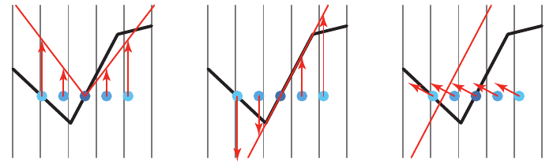

**图 7.24。** 附加的阴影偏移方法。对于 PCF，在原始采样位置，也就是五个圆点的中心点周围，取得若干样本。这些样本本来都应受光。左图构造了一个偏移锥，并将样本向上移动到锥面上。可以增大锥面的陡峭程度，将右边的样本拉到足够接近光源、能够受光的位置；但这样做存在风险：其他位置上真正处于阴影中的样本（图中未画出），可能产生更多漏光。中图将所有样本调整到接收面所在的平面上。这对凸表面很有效，但在凹陷处可能适得其反，如其左侧所示。右图中的法线偏移沿表面法线方向移动样本，移动量与法线和光照方向夹角的正弦成正比。对于中心样本，可以将其理解为移动到了原表面上方的一个假想表面上。这种偏移不仅影响深度，还会改变测试阴影贴图时使用的纹理坐标。

Schüler [1585]、Isidoro [804] 和 Tuft [1790] 提出的技术基于这样一个观察：应使用接收面本身的斜率，调整其余样本的深度。在这三者中，Tuft 的表述 [1790] 最容易应用于级联阴影贴图。Dou 等人 [373] 进一步完善并扩展了这一概念，考虑了 z 深度如何以非线性方式变化。这些方法假定邻近采样位置位于三角形所确定的同一平面上。这项技术称为**接收平面深度偏移**（receiver plane depth bias），或其他类似名称；它在许多情况下都相当精确，因为这个假想平面上的位置确实位于表面上，或者在模型为凸形时位于表面前方。如图 7.24 所示，凹陷附近的样本可能被遮住。人们已经将常量偏移、斜率缩放偏移、接收平面偏移、视图偏移和法线偏移组合起来，用以解决自阴影问题，不过仍可能需要针对每个环境进行手动微调 [235, 1391, 1403]。

PCF 的一个问题是，采样区域的宽度保持不变，因此阴影看起来会均匀柔化，所有半影的宽度都相同。在某些情况下，这或许可以接受；但当遮挡物与接收面在地面处接触时，这种效果看起来就不正确了。见图 7.25。

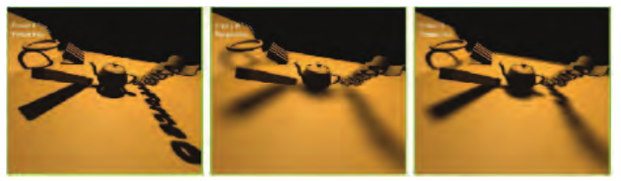

**图 7.25。** 百分比渐近过滤与百分比渐近软阴影。左图为经过少量 PCF 过滤的硬阴影。中图为宽度恒定的软阴影。右图为宽度可变的软阴影，在物体与地面接触的位置具有正确的硬度。（图片由 NVIDIA Corporation 提供。）

## 7.6 百分比渐近软阴影

本节来源：《Real-Time Rendering, Fourth Edition》书页 250—252（PDF 第 271—273 页）。正文从 7.6 节标题开始，至 7.7 节标题之前结束；本节无下级小节。图 7.25 位于书页 251。

2005 年，Fernando [212, 467, 1252] 发表了一种影响深远的方法，称为**百分比渐近软阴影**（percentage-closer soft shadows，PCSS）。它尝试通过搜索阴影贴图上的邻近区域，找出所有可能的遮挡物，以解决上述问题。这些遮挡物相对于该位置的平均距离，被用来确定采样区域的宽度：

其中， 是接收面到光源的距离， 是遮挡物到光源的平均距离。换句话说，随着遮挡物平均而言离接收面更远、离光源更近，待采样表面区域的宽度就会增大。观察图 7.22，并考虑移动遮挡物所产生的影响，便可以理解这一现象。图 7.2（书页 224）、图 7.25 和图 7.26 展示了一些例子。

图 7.25 见本章前文。

如果没有找到遮挡物，那么该位置就完全受光，无须进一步处理。同样，如果该位置被完全遮挡，也可以结束处理。否则，就对所关注的区域进行采样，并计算光源的近似贡献。为了节省处理开销，可以根据采样区域的宽度改变所取样本的数量。还可以采用其他技术，例如，对远处那些不太可能很重要的软阴影，使用较低的采样率。

这种方法的一个缺点是，为了找到遮挡物，需要对阴影贴图中一块相当大的区域进行采样。使用旋转的泊松圆盘采样模式，有助于掩盖欠采样产生的伪影 [865, 1590]。Jimenez [832] 指出，泊松采样在运动时可能不稳定；他发现，使用一种介于抖动与随机之间的函数形成螺旋模式，可以获得更好的帧间效果。

Sikachev 等人 [1641] 详细讨论了一种更快的 PCSS 实现，它利用了 SM 5.0 中的功能。该实现由 AMD 推出，通常使用 AMD 为其起的名字，称为**接触硬化阴影**（contact hardening shadows，CHS）。这一新版本还解决了基本 PCSS 的另一个问题：半影的大小会受到阴影贴图分辨率的影响。参见图 7.25。为了尽量减小这一问题，首先为阴影贴图生成 mipmap，然后选择最接近用户所定义的世界空间核尺寸的 mip 层级。对一个 8 × 8 的区域进行采样，以求得平均遮挡物深度，只需要 16 次 `GatherRed()` 纹理调用。一旦得到半影的估计值，就将分辨率较高的 mip 层级用于阴影中边缘锐利的区域，而将分辨率较低的 mip 层级用于较柔和的区域。

CHS 已用于大量电子游戏 [1351, 1590, 1641, 1678, 1679]，相关研究仍在继续。例如，Buades 等人 [206] 提出了**可分离软阴影映射**（separable soft shadow mapping，SSSM）：把 PCSS 对网格进行采样的过程拆分成可分离的部分，并尽可能在像素之间复用其中的元素。

对于每个像素需要多个样本的算法，一种已被证明有助于加速的概念是**分层最小值／最大值阴影贴图**。尽管阴影贴图的深度通常不能取平均值，但各个 mipmap 层级上的最小值和最大值可能很有用。也就是说，可以构建两套 mipmap：一套保存各区域中找到的最大 z 深度（有时称为 HiZ），另一套保存最小值。给定纹素的位置、深度和待采样区域，就可以使用这些 mipmap 快速判断完全受光和完全处于阴影中的情况。例如，如果纹素的 z 深度大于 mipmap 对应区域中存储的最大 z 深度，那么该纹素必定处于阴影中，无须再取更多样本。这类阴影贴图使光源可见性的判定高效得多 [357, 415, 610, 680, 1064, 1811]。

PCF 等方法通过对接收面上的邻近位置进行采样来工作。PCSS 则通过求取邻近遮挡物的平均深度来工作。这些算法并未直接考虑光源的面积，而是对邻近表面进行采样，因此会受到阴影贴图分辨率的影响。PCSS 的一个主要假设是：平均遮挡物能够合理地估计半影大小。当两个遮挡物，例如一盏路灯和一座远山，在某个像素处部分遮挡同一表面时，这一假设就不再成立，并可能导致伪影。理想情况下，我们希望确定从接收面上的单个位置能够看见面光源的多少面积。一些研究者探索了使用 GPU 进行**反向投影**的方法。其思路是将接收面上的每个位置视为一个视点，将面光源视为视平面的一部分，再把遮挡物投影到这个平面上。Schwarz 和 Stamminger [1593] 以及 Guennebaud 等人 [617] 都总结了先前的工作，并提出了各自的改进。Bavoil 等人 [116] 则采取了另一种方法，利用深度剥离创建多层阴影贴图。反向投影算法能够产生出色的结果，但每像素的高昂开销意味着，迄今为止，它们尚未被交互式应用采用。

## 7.7 可滤波阴影贴图

本节来源：《Real-Time Rendering, Fourth Edition》书页 252—257（PDF 物理页 273—278），从 7.7 节标题开始，到 7.8 节标题之前结束。

Donnelly 和 Lauritzen 提出的方差阴影贴图（variance shadow map，VSM）[368]，是一种允许对生成的阴影贴图进行滤波的算法。该算法在一张贴图中存储深度，在另一张贴图中存储深度的平方。生成这些贴图时，可以使用 MSAA 或其他抗锯齿方案。这些贴图可以进行模糊处理、生成 mipmap、存入求和面积表 [988]，或者采用其他处理方法。能够把这些贴图当作可滤波的纹理来处理，是一个巨大的优势：从中读取数据时，可以运用整套采样与滤波技术。

这里我们将较深入地介绍 VSM，让读者了解这一过程的工作原理；此外，这一类算法中的所有方法都采用同类的测试。希望进一步了解这个领域的读者应查阅相关参考文献。我们也推荐 Eisemann 等人的著作 [412]，该书用了多得多的篇幅来讨论这一主题。

首先，VSM 在接收面的位置对深度贴图采样（仅一次），返回距离光源最近的遮挡物的平均深度。这个平均深度  称为一阶矩；如果它大于阴影接收面的深度 t，就认为接收面完全受光。如果平均深度小于接收面的深度，则使用下式：

其中， 是受光样本的最大百分比， 是方差，t 是接收面的深度， 是阴影贴图中的平均期望深度。深度平方阴影贴图中的样本  称为二阶矩，用来计算方差：

 是接收面可见百分比的上界。实际的受光百分比 p 不可能大于这个值。这个上界来自切比雪夫不等式的单侧形式。该方程试图利用概率论，估计表面位置处的遮挡物分布中，有多大比例位于比该表面到光源的距离更远的地方。Donnelly 和 Lauritzen 证明，对于深度固定的平面遮挡物和平面接收面，有 ，因此公式（7.7）可以很好地近似许多真实的阴影情形。

Myers [1251] 对这一方法为何有效建立了直观解释。一个区域内的方差会在阴影边缘增大。深度差越大，方差越大。这时， 这一项就成为决定可见百分比的重要因素。如果这个值仅略大于零，就意味着遮挡物的平均深度只比接收面稍微靠近光源一些，此时  接近 1（完全受光）。这种情况会发生在半影中完全受光的那条边缘上。向半影内部移动时，遮挡物的平均深度变得更靠近光源，因此这一项增大， 随之下降。与此同时，半影内部的方差本身也在变化：沿着边缘时几乎为零，而在不同深度的遮挡物各占该区域一半的位置，方差达到最大。这些项相互平衡，使阴影在整个半影范围内线性变化。与其他算法的比较见图 7.26。

方差阴影贴图的一个显著特点，是能够优雅地处理由几何形状引起的表面偏移问题。Lauritzen [988] 推导了如何利用表面的斜率来修改二阶矩的值。由数值稳定性引起的偏移及其他问题，可能给方差阴影贴图带来麻烦。例如，公式（7.8）从一个较大的数值中减去另一个与它相近的数值。这类计算往往会放大底层数值表示精度不足的影响。使用浮点纹理有助于避免这一问题。

图 7.26：左上为标准阴影贴图。右上为透视阴影贴图，它提高了观察者附近的阴影贴图纹素密度。左下为百分比渐近软阴影，随着遮挡物与接收面之间的距离增大，阴影变得更柔和。右下为方差阴影贴图，其软阴影宽度恒定，每个像素只需对方差贴图采样一次便可完成着色。（图片由 Nico Hempe、Yvonne Jung 和 Johannes Behr 提供。）

总体而言，相对于花费的处理时间，VSM 能带来明显的质量提升，因为它高效利用了 GPU 优化过的纹理功能。PCF 在生成更柔和的阴影时，需要更多样本，也就需要更多时间，才能避免噪声；VSM 则只需一个高质量的样本，就能确定整个区域的影响，并生成平滑的半影。这种能力意味着，在算法自身的限制范围内，可以让阴影任意柔和，而不增加额外开销。

图 7.27：方差阴影贴图，从左到右，与光源的距离逐渐增大。（图片来自 NVIDIA SDK 10 [1300] 的示例，由 NVIDIA Corporation 提供。）

与 PCF 一样，滤波核的宽度决定半影的宽度。通过求出接收面与最近遮挡物之间的距离，可以改变核的宽度，从而产生令人信服的软阴影。对于宽度缓慢增大的半影，mipmap 采样无法很好地估计覆盖率，会产生方块状伪影。Lauritzen [988] 详细介绍了如何使用求和面积表来获得好得多的阴影。图 7.27 给出了一个例子。

当两个或更多遮挡物覆盖同一个接收面，且其中一个遮挡物靠近接收面时，方差阴影贴图会在半影区域失效。概率论中的切比雪夫不等式会给出一个最大受光值，而这个值与正确的受光百分比并不相符。最近的遮挡物只遮住部分光线，却破坏了方程的近似关系。这会导致漏光（light bleeding，也称 light leaks）：完全被遮挡的区域仍然接收到光。参见图 7.28。通过在更小的区域内取更多样本，可以解决这一问题，但这也使方差阴影贴图变成了 PCF 的一种形式。与 PCF 一样，需要在速度与表现之间权衡；不过，对于阴影深度复杂度较低的场景，方差阴影贴图效果很好。Lauritzen [988] 给出了一种由美术人员控制的改进办法：把较低的百分比视为完全处于阴影中，再把剩余的百分比范围重新映射到 0%—100%。这种方法能使漏光变暗，代价是整体上缩窄半影。虽然漏光是一项严重限制，但 VSM 很适合生成地形阴影，因为这类阴影很少涉及多个遮挡物 [1227]。

能够利用滤波技术快速生成平滑阴影的前景，使可滤波阴影贴图受到了广泛关注；主要挑战在于解决各种漏光问题。Annen 等人 [55] 提出了卷积阴影贴图（convolution shadow map）。它扩展了 Soler 和 Sillion 针对平面接收面的算法 [1673] 背后的思想：将阴影深度编码为傅里叶展开。与方差阴影贴图一样，这类贴图也可以滤波。这一方法会收敛到正确结果，因此能减轻漏光问题。

图 7.28：左图为将方差阴影贴图应用于茶壶的结果。右图中，一个三角形（未显示）在茶壶上投下阴影，导致地面阴影中出现令人难以接受的伪影。（图片由 Marco Salvi 提供。）

卷积阴影贴图的一个缺点是需要计算和访问多个项，大幅增加了执行与存储开销 [56, 117]。Salvi [1529, 1530] 与 Annen 等人 [56] 几乎同时、彼此独立地想到了使用一个基于指数函数的单独项。这种方法称为指数阴影贴图（exponential shadow map，ESM）或指数方差阴影贴图（exponential variance shadow map，EVSM），把深度的指数值及其二阶矩存入两个缓冲区。指数函数能更贴近地近似阴影贴图所执行的阶跃函数（即是否受光），因此可以显著减少漏光伪影。它也避免了卷积阴影贴图的另一个问题，即振铃（ringing）：在刚刚超过原遮挡物深度的某些特定深度处，可能出现轻微漏光。

存储指数值的一项限制是，二阶矩的数值可能变得极其巨大，超出浮点数能够表示的范围。为了提高精度，并使指数函数能够更陡峭地下降，可以生成线性的 z 深度 [117, 258]。

指数阴影贴图的质量优于 VSM，相比卷积贴图又具有更低的存储开销和更好的性能，因此，它在这三种滤波方法中引起了最多的关注。Pettineo [1405] 提到了若干其他改进，例如可以用 MSAA 改善结果并获得一定程度的透明效果；他还介绍了如何利用计算着色器提高滤波性能。

较近些时候，Peters 和 Klein [1398] 提出了矩阴影贴图（moment shadow mapping）。它能提供更好的质量，但代价是要使用四个或更多的矩，从而增加存储开销。可以使用 16 位整数存储这些矩，以降低开销。Pettineo [1404] 实现了这一新方法并将其与 ESM 进行了比较，同时提供了用于探索许多变体的代码库。

级联阴影贴图技术也可以应用于可滤波贴图，以提高精度 [989]。与标准级联阴影贴图相比，级联 ESM 的一个优点是可以为所有级联层级设置同一个偏移因子 [1405]。Chen 和 Tatarchuk [258] 详细讨论了级联 ESM 中遇到的各种漏光问题及其他伪影，并提出了几种解决方法。

可滤波贴图可以看作一种开销较低的 PCF，只需要少量样本。与 PCF 一样，这类阴影具有恒定的宽度。这些滤波方法都可以与 PCSS 结合，产生宽度可变的半影 [57, 1620, 1943]。矩阴影贴图的一项扩展还能够提供光散射和透明效果 [1399]。

## 7.8 体积阴影技术

本节来源：《Real-Time Rendering, Fourth Edition》书页 257—259（PDF 物理页 278—280）；范围从 7.8 节标题起，到 7.9 节标题之前，包含图 7.29。

透明物体会使光衰减，并改变光的颜色。对于某些透明物体集合，可以使用类似于第 5.5 节所讨论的技术来模拟这些效果。例如，在某些情况下，可以生成第二种阴影贴图。将透明物体渲染到这张贴图中，并存储最近的深度，以及颜色或 α 覆盖率。如果接收物没有被不透明物体的阴影贴图判定为遮挡，就接着测试透明物体的深度贴图；如果被遮挡，则按需取出颜色或覆盖率 [471, 1678, 1679]。这一思路让人联想到第 7.2 节中的阴影与光的投影，不过这里存储的深度可以避免把效果投影到位于透明物体与光源之间的接收物上。这类技术无法应用于透明物体自身。

对于毛发和云这类物体，其组成部分或者很小，或者是半透明的；要对它们进行真实感渲染，自阴影至关重要。仅存储单个深度的阴影贴图不适用于这些情况。Lokovic 和 Veach [1066] 最早提出了 **深度阴影贴图（deep shadow maps）** 的概念：每个阴影贴图纹素都存储一个描述光如何随深度衰减的函数。通常用位于不同深度的一系列样本来近似这个函数，每个样本都具有一个不透明度值。对于给定位置的深度，使用贴图中将其夹在中间的两个样本，来确定阴影的影响。在 GPU 上，难点在于如何高效地生成这些函数并求值。这些算法采用的思路，与某些顺序无关透明度算法（第 5.5 节）相似，遇到的困难也相似，例如，如何紧凑地存储忠实表示每个函数所需的数据。

Kim 和 Neumann [894] 最早提出了一种基于 GPU 的方法，他们称之为**不透明度阴影贴图（opacity shadow maps）**。该方法在一组固定深度处生成仅存储不透明度的贴图。Nguyen 和 Donnelly [1274] 给出了这一方法的更新版本，可以生成类似于第 719 页图 17.2 的图像。然而，这些深度切片全都彼此平行且均匀分布，因此需要很多切片，才能掩盖线性插值在切片之间产生的不透明度伪影。Yuksel 和 Keyser [1953] 通过创建更贴合模型形状的不透明度贴图，提高了效率与质量。这样可以减少所需的层数，因为对每一层的求值对于最终图像都有更大的影响。

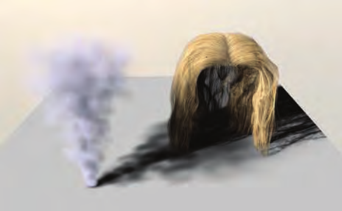

图 7.29. 使用自适应体积阴影贴图渲染的毛发与烟雾 [1531]。（经 Marco Salvi 和 Intel Corporation 许可转载，版权归 Intel Corporation 所有，2010 年。）

为了避免依赖固定的切片配置，研究者提出了适应性更强的技术。Salvi 等人 [1531] 引入了**自适应体积阴影贴图（adaptive volumetric shadow maps）**，其中每个阴影贴图纹素同时存储不透明度和层深度。在数据流（表面不透明度）被光栅化的过程中，使用像素着色器操作对其进行有损压缩。这样就不必为了收集全部样本并将它们作为一个集合进行处理，而使用没有上限的内存。这项技术类似于深度阴影贴图 [1066]，不过压缩步骤是在像素着色器中即时完成的。将函数的表示限制为少量、固定数量的已存储不透明度/深度对，可以使 GPU 上的压缩与检索都更加高效 [1531]。其开销高于简单的混合，因为需要读取、更新并写回曲线；开销还取决于用来表示一条曲线的点数。在这种情况下，该技术还需要支持 UAV 和 ROV 功能的较新硬件（见第 3.8 节末尾）。示例见图 7.29。

自适应体积阴影贴图方法曾用于游戏《GRID2》的真实感烟雾渲染，平均开销低于每帧 2 毫秒 [886]。Fürst 等人 [509] 介绍了他们为一款电子游戏实现的深度阴影贴图，并提供了代码。他们使用链表存储深度和 α 值，并使用指数阴影贴图，使受光区域与阴影区域之间形成柔和的过渡。

对阴影算法的探索仍在继续，将多种算法与技术结合起来的做法也越来越普遍。例如，Selgrad 等人 [1603] 研究了使用链表存储多个透明样本，并利用带有散布写入的计算着色器来构建贴图。他们的工作将深度阴影贴图的概念与经过滤波的贴图及其他要素结合起来，为生成高质量软阴影提供了一种更通用的解决方案。

## 7.9 不规则 Z 缓冲阴影

来源：《Real-Time Rendering, Fourth Edition》，书页 259—262（PDF 物理页 280—283）。本节从 7.9 标题起，至 7.10 标题前止，包含跨页续文及图 7.30、图 7.31 的完整图注。

各种阴影贴图方法之所以流行，有几个原因。它们的开销可以预测，并且能够很好地适应不断扩大的场景规模，最坏情况下也只是与图元数量呈线性关系。它们很适合在 GPU 上实现，因为它们依靠光栅化，对光源视角下的世界进行规则采样。然而，这种离散采样会带来问题，因为眼睛看到的位置与光源看到的位置并非一一对应。当光源对表面的采样频率低于眼睛时，就会出现各种走样问题。即使两者的采样率相近，也会出现偏置问题，因为表面被采样的位置与眼睛看到的位置略有不同。

阴影体提供了一种精确的解析解法：光源与表面的相互作用产生一组三角形，用来界定任意给定位置是受光还是处于阴影中。这种算法在 GPU 上实现时开销不可预测，是一个严重缺点。近年来探索的改进 [1648] 很有吸引力，但尚未出现被商业应用采用的“存在性证明”。

另一种解析阴影测试方法从长远来看可能颇有潜力，那就是光线追踪。第 11.2.2 节会详细介绍它；其基本思想相当简单，尤其是在处理阴影时。从接收表面的位置向光源发射一条射线。如果发现任何物体阻挡了这条射线，那么该接收位置就处于阴影中。高效光线追踪器中的大量代码都用于生成和使用层次数据结构，以尽量减少每条射线所需的物体测试次数。对于动态场景，如何在每一帧构建并更新这些结构，是一个已有数十年历史、至今仍在持续研究的课题。

另一种方法是利用 GPU 的光栅化硬件观察场景，但在光源的每个网格单元中，除了存储 z 深度，还存储遮挡物边缘的额外信息 [1003, 1607]。例如，可以设想在阴影贴图的每个纹素中存储一个列表，列出所有与该网格单元重叠的三角形。这类列表可以通过保守光栅化生成：只要三角形的任何部分与一个像素重叠，而不只是覆盖像素中心，就会产生一个片元（第 23.1.2 节）。这类方案的一个问题是，通常必须限制每个纹素的数据量，而这又可能导致无法准确判断每个接收位置的状态。借助现代 GPU 链表技术 [1943]，每个像素当然可以存储更多数据。然而，除了物理内存的限制之外，在每个纹素的列表中存储数量可变的数据还存在一个问题：GPU 处理效率可能变得极低，因为同一个线程束（warp）中可能只有少数片元线程需要检索和处理大量条目，而其余线程却无事可做，处于空闲状态。组织着色器代码，避免动态 if 语句和循环引起线程分歧，对于性能至关重要。

与其在阴影贴图中存储三角形或其他数据，再用它们测试接收位置，不如把问题反过来：存储接收位置，然后逐一用三角形对这些位置进行测试。Johnson 等人 [839] 以及 Aila 和 Laine [14] 最早探索了这种保存接收位置的思想，它被称为不规则 z 缓冲（irregular z-buffer，IZB）。这个名称稍有误导性，因为缓冲区本身具有普通阴影贴图那样的规则形状。不规则的其实是缓冲区的内容：每个阴影贴图纹素中会存储一个或多个接收位置，也可能一个都没有。见图 7.30。

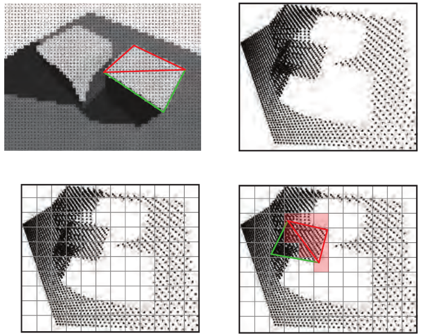

**图 7.30** 不规则 z 缓冲。左上：从眼睛视角在各像素中心生成一组点，图中展示了构成立方体一个面的两个三角形。右上：从光源视角观察这些点。左下：叠加阴影贴图网格；为每个纹素生成一个列表，记录其网格单元内的所有点。右下：对红色三角形进行保守光栅化，以执行阴影测试。对于每个被触及的纹素（以浅红色显示），将其列表中的所有点与该三角形进行测试，判断这些点对光源是否可见。（底层光栅图像由 Timo Aila 和 Samuli Laine 提供 [14]。）

采用 Sintorn 等人 [1645] 和 Wyman 等人 [1930, 1932] 提出的方法，可以用多遍算法创建 IZB，并测试其中的内容从光源看来是否可见。首先，从眼睛视角渲染场景，找出眼睛所见表面的 z 深度。将这些点变换到光源观察场景的视角，并根据这组点为光源视锥体构造紧致边界。随后把这些点存入光源的 IZB，每个点都放入其对应纹素处的列表中。注意，有些列表可能为空：它们对应光源能看到、却没有任何眼睛可见表面的空间区域。对遮挡物进行保守光栅化，将其投向光源的 IZB，以确定是否有点被遮挡、因而处于阴影中。保守光栅化确保，即使三角形没有覆盖光源纹素的中心，仍然会用它测试可能与之重叠的点。

可见性测试在像素着色器中进行。测试本身可以理解为一种光线追踪。从一个图像点的位置向光源生成一条射线。如果某个点位于三角形内部，并且比三角形所在平面更远，那么它就被遮挡了。所有遮挡物完成光栅化之后，便使用相对于光源的可见性结果对表面进行着色。这种测试也称为视锥体追踪（frustum tracing），因为可以把三角形看作定义了一个视锥体，用它检查各点是否落在该体积之内。

要让这种方法在 GPU 上良好运行，精心编写代码至关重要。Wyman 等人 [1930, 1932] 指出，他们的最终版本比最初的原型快了两个数量级。一部分性能提升来自直接的算法改进，例如剔除表面法线背向光源的图像点（因此它们始终不受光），以及避免为空纹素生成片元。其他性能收益则来自针对 GPU 改进数据结构，以及尽量让每个纹素中的点列表较短且长度相近，从而尽可能减少线程分歧。为了便于说明，图 7.30 展示的是分辨率较低、列表较长的阴影贴图。理想情况是每个列表只有一个图像点。提高分辨率可以缩短列表，但也会增加遮挡物生成的、需要求值的片元数量。

从图 7.30 的左下图可以看出，由于透视效应，地平面上可见点的密度在左侧明显高于右侧。使用级联阴影贴图，将更多光源贴图分辨率集中在靠近眼睛的区域，有助于减小这些区域中的列表长度。

这种方法避免了其他方法的采样和偏置问题，并能提供完全锐利的阴影。出于美观和感知方面的原因，人们通常希望得到软阴影，但当遮挡物距离很近时，软阴影可能出现偏置问题，例如阴影悬浮（Peter Panning）。Story 和 Wyman [1711, 1712] 探索了混合阴影技术。其核心思想是利用遮挡物距离混合 IZB 阴影与 PCSS 阴影：遮挡物较近时使用硬阴影结果，较远时使用软阴影结果。见图 7.31。对于近处物体，阴影质量通常最为重要，因此可以只对选定的一部分物体使用 IZB 技术，以降低其开销。这种解决方案已经成功用于电子游戏。本章开头就展示了这样一幅图像，即书页 224 的图 7.2。

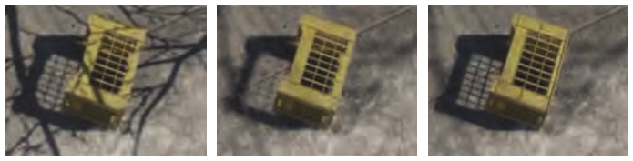

**图 7.31** 左：PCF 为所有物体生成软化程度一致的阴影。中：PCSS 根据距遮挡物的距离软化阴影，但与箱子左角重叠的树枝阴影产生了伪影。右：将 IZB 的锐利阴影与 PCSS 的软阴影混合，得到更好的结果 [1711]。（图像出自《汤姆·克兰西：全境封锁》，由 Ubisoft 提供。）

## 7.10 其他应用

本节来源：《Real-Time Rendering, Fourth Edition》，书页 262—264（PDF 物理页 283—285）；从 7.10 标题开始，至“延伸阅读与资源”标题之前。章末延伸阅读另见 07.99_延伸阅读与资源.md。

将阴影贴图视为定义了一个把明暗分隔开的空间体积，也有助于确定物体的哪些部分应当处于阴影中。Gollent [555] 介绍了 CD Projekt 的地形阴影系统如何为每个区域计算仍然受到遮挡的最大高度；随后，不仅地形，场景中的树木和其他元素也可以利用这一高度来生成阴影。为求出各处的高度，首先从太阳的视角为可见区域渲染一张阴影贴图。接着，检查地形高度场中每个位置从太阳看去是否可见。如果该位置处于阴影中，就以固定步长不断增加世界空间高度，直到太阳进入视野，再进行二分搜索，以估计首次能够看见太阳的高度。换句话说，我们沿着一条竖直线步进，并通过迭代缩小范围，确定该线与阴影贴图所定义的明暗分界表面的交点位置。对相邻的高度进行插值，即可得到任意位置的这一遮挡高度。图 7.32 展示了将这种技术用于地形高度场软阴影的示例。第 14 章还会介绍更多在明暗区域中进行光线步进的应用。

最后还有一种值得一提的方法：渲染*屏幕空间阴影*。由于分辨率有限，阴影贴图往往无法对细小特征产生准确的遮挡。渲染人脸时，这个问题尤其严重，因为我们特别容易注意到人脸上的任何视觉瑕疵。例如，无意中渲染出发光的鼻孔，就会显得十分突兀。使用更高分辨率的阴影贴图，或者为感兴趣的区域单独设置一张阴影贴图，固然有所帮助，但还有一种可能的办法是利用已经存在的数据。在大多数现代渲染引擎中，渲染期间都可以使用来自先前预处理通道的、摄像机视角下的深度缓冲区。它所存储的数据可以视为一个高度场。通过迭代采样这个深度缓冲区，我们可以执行光线步进过程（第 6.8.1 节），检查朝向光源的方向是否未被遮挡。尽管这种方法需要反复采样深度缓冲区，开销较大，但它能够为过场动画中的特写提供高质量结果；在这种场合，多花几毫秒往往是值得的。这一方法由 Sousa 等人 [1678] 提出，如今已在许多游戏引擎中得到普遍应用 [384, 1802]。

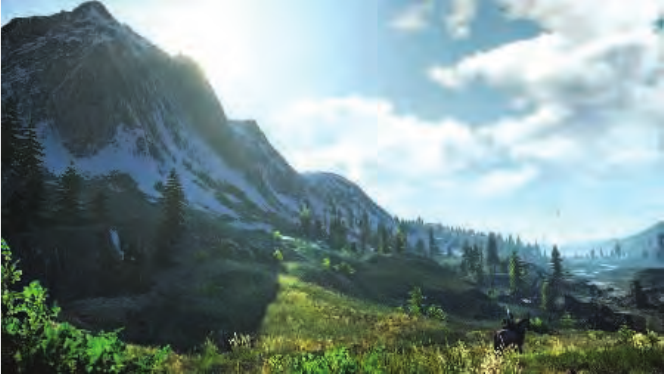

**图 7.32。** 为高度场中的每个位置计算首次能够看见太阳的高度，并据此对地形进行光照计算。注意，沿阴影边缘分布的树木也获得了正确的阴影 [555]。（CD PROJEKT®、The Witcher® 是 CD PROJEKT Capital Group 的注册商标。《巫师》游戏 © CD PROJEKT S.A.。由 CD PROJEKT S.A. 开发。保留所有权利。《巫师》游戏改编自 Andrzej Sapkowski 的文学作品。所有其他版权和商标均归各自所有者所有。）

总结本章，对于投射到任意表面形状上的阴影，某种形式的阴影贴图迄今仍是使用最普遍的算法。当阴影覆盖较大区域（例如室外场景）时，级联阴影贴图可以提高采样质量。通过 SDSM 为近裁剪面找到一个合适的最大距离，还能进一步提高精度。百分比渐近滤波（PCF）能够为阴影赋予一定的柔和度；百分比渐近软阴影（PCSS）及其变体可以产生接触硬化效果；不规则 z 缓冲区则能够提供精确的硬阴影。经过滤波的阴影贴图可以快速计算软阴影，并且在遮挡物远离接收面的情况下（例如地形）效果尤其好。最后，屏幕空间技术可以用于进一步提高精度，不过需要付出明显的代价。

本章重点介绍了目前应用程序所采用的关键概念和技术。每种方法都有自己的优势；具体选择取决于世界规模、场景构成（静态内容还是动画内容）、材质类型（不透明、透明、毛发或烟雾），以及光源的数量和类型（静态还是动态；局部还是远处；点光源、聚光灯还是面光源），还取决于底层纹理能够在多大程度上掩盖瑕疵等因素。GPU 的能力在不断发展和提高，因此我们预计，未来几年仍会不断出现适合硬件的新算法。例如，第 19.10.1 节介绍的稀疏纹理技术已经被用于阴影贴图存储，以提高分辨率 [241, 625, 1253]。在一种富有创意的方法中，Sintorn、Kämpe 等人 [850, 1647] 探索了将某个光源的二维阴影贴图转换为三维体素集合的思路（体素即小盒子；见第 13.10 节）。使用体素的一个优点是，可以将每个体素归类为受光或处于阴影中，因此所需存储量极小。高度压缩的稀疏体素八叉树表示能够存储大量光源和静态遮挡物的阴影。Scandolo 等人 [1546] 将他们的压缩技术与一种使用双阴影贴图的区间方案结合起来，进一步提高了压缩率。Kasyan [865] 使用体素锥体追踪（第 13.10 节）来生成面光源的软阴影。图 7.33 给出了一个示例。书页 585 的图 13.33 展示了更多通过锥体追踪生成的阴影。

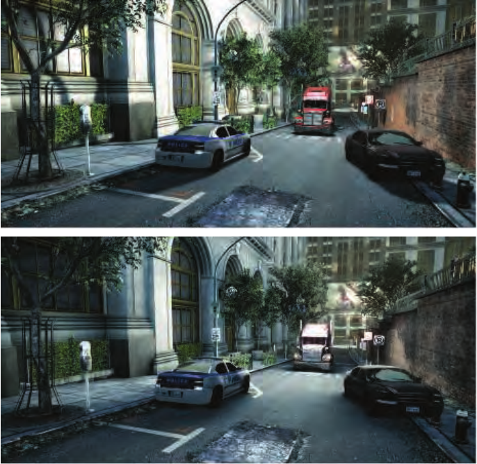

**图 7.33。** 上图是使用基础软阴影近似方法生成的图像。下图是在场景的体素化表示上使用锥体追踪，计算基于体素的面光源阴影的结果。注意，汽车的阴影明显更加弥散。由于一天中的时刻发生了变化，光照也有所不同。（图片由 Crytek 提供 [865]。）

## 第 7 章 延伸阅读与资源

本篇来源：《Real-Time Rendering, Fourth Edition》，书页 265（PDF 物理页 286）的“Further Reading and Resources”，以及随后 PDF 物理页 287 的出版方标识页。此标题在原书中未编号。

本章着重讨论基本原理，以及一种阴影算法要适用于交互式渲染所必须具备的性质：可预测的质量和性能。我们没有对这一渲染领域的研究作穷尽式分类，因为已有两本书专门讨论这个主题。Eisemann 等人所著的《Real-Time Shadows》（《实时阴影》）[412] 直接聚焦于交互式渲染技术，讨论了种类广泛的算法及其优势与开销。SIGGRAPH 2012 的一门课程提供了这本书的节选，同时补充了对较新工作的引用 [413]。他们在 SIGGRAPH 2013 课程中的演示资料可以在其网站 [www.realtimeshadows.com](https://www.realtimeshadows.com) 上找到。Woo 和 Poulin 的《Shadow Algorithms Data Miner》（《阴影算法数据挖掘》）[1902] 概述了用于交互式渲染和批处理渲染的多种阴影算法。这两本书都提供了该领域数百篇研究文章的参考文献。

Tuft 的两篇文章 [1791, 1792] 对常用阴影贴图技术及其相关问题作了出色的概述。Bjørge [154] 介绍了一系列适用于移动设备的常用阴影算法，并附有比较不同算法的图像。Lilley 的演示报告 [1046] 对实用阴影算法作了扎实而广泛的综述，重点是 GIS 系统中的地形渲染。Pettineo [1403, 1404] 和 Castaño [235] 的博客文章尤其有价值，它们提供了实用技巧、解决方案以及演示代码库。如果希望阅读一篇专门针对硬阴影工作的较短综述，可参见 Scherzer 等人 [1558] 的文章。Hasenfratz 等人 [675] 的软阴影算法综述虽然已经较为陈旧，但对大量早期工作进行了相当深入的介绍。

出版方标识页（PDF 物理页 287）：Taylor & Francis（泰勒与弗朗西斯）；Taylor & Francis Group（泰勒与弗朗西斯出版集团）；[http://taylorandfrancis.com](http://taylorandfrancis.com)。该页无其他正文。
