# Real-Time Rendering 第10章 局部光照 中文合集

> 依据用户提供的《Real-Time Rendering》第四版 PDF 完整翻译。原图配中文图注；复杂数学已排版为本地图片，简单符号直接显示。保留原书技术年代、公式编号与引用编号。

## 目录

- [10.1 面光源](<Real-Time_Rendering_4th_中文/第10章/10.01.md>)

- [10.2 环境光照](<Real-Time_Rendering_4th_中文/第10章/10.02.md>)

- [10.3 球面函数与半球面函数](<Real-Time_Rendering_4th_中文/第10章/10.03.md>)

- [10.4 环境映射](<Real-Time_Rendering_4th_中文/第10章/10.04.md>)

- [10.5 基于图像的镜面光照](<Real-Time_Rendering_4th_中文/第10章/10.05.md>)

- [10.6 辐照度环境映射](<Real-Time_Rendering_4th_中文/第10章/10.06.md>)

- [10.7 误差来源](<Real-Time_Rendering_4th_中文/第10章/10.07.md>)

## 章首导言

来源：《Real-Time Rendering》第4版，第10章章首导言，书页375—377（PDF第396—398页）；止于10.1节标题之前。

> “光，使一切恰如其分。”
> ——Andrew Glassner

第9章讨论了基于物理的材质理论，以及如何在点状光源下计算这些材质的响应。借助这些内容，我们可以模拟光与表面的相互作用来执行着色计算，从而测定有多少辐亮度沿给定方向射向虚拟相机。这一光谱辐亮度就是以场景为参照的像素颜色；它会经过转换（第8.2节），成为最终图像中给定像素所具有的、以显示设备为参照的颜色。

在现实中，我们需要考虑的相互作用从来都不是点状的。第9.13.1节已经说明，为了正确计算着色，必须求解表面BRDF响应在整个像素足迹上的积分；像素足迹就是像素面积投影到表面上所覆盖的区域。这一积分过程也可以视为一种抗锯齿方案。我们对着色函数进行预积分，而不是直接采样一个频率分量没有上界的着色函数。

到目前为止，我们只介绍了点光源和平行光源的效果，这将表面接收光线的方向限制为少量离散方向。这样的光照描述并不完整。实际上，表面会接收来自所有入射方向的光。室外场景并非仅由太阳照亮。如果真是如此，所有处于阴影中或背向太阳的表面都会是黑色。天空是一个重要光源，其光来自大气对太阳光的散射。观察月球照片就能看出天空光的重要性：月球没有大气，因此也没有天空光。见图10.1。

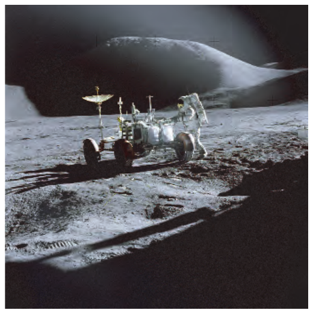

图10.1　在月球上拍摄的照片。由于缺少散射太阳光的大气，月球没有天空光。这张图展示了场景仅受一个直接光源照亮时的样子。请注意漆黑的阴影，以及背向太阳的表面完全没有细节。照片中，宇航员James B. Irwin站在阿波罗15号任务的月球车旁。前景中的阴影来自登月舱。照片由任务指令长、宇航员David R. Scott拍摄。（图片来自NASA馆藏。）

阴天以及黄昏、黎明时，室外光照完全来自天空光。即便在晴天，从地球观察太阳时，它也张成一个圆锥，因此并不是无穷小的。有趣的是，尽管太阳与月球的实际尺寸相差悬殊——太阳的半径比月球大两个数量级——它们所张的角度却相近，都在半度左右。

现实中的光照从来都不是点状的。无穷小实体在某些情形下可以充当低成本近似，也可以作为构建更完整模型的基本部件。为了建立更真实的光照模型，我们需要对表面整个入射方向半球上的BRDF响应进行积分。在实时渲染中，我们倾向于寻找封闭形式的解或其近似，来求解渲染方程（第11.1节）所包含的积分。我们通常避免对多个样本（光线）取平均，因为这种方法往往慢得多。见图10.2。

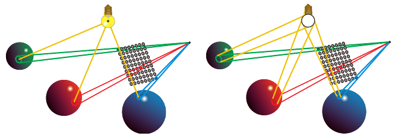

图10.2　左图是第9章已经介绍过的积分：表面区域以及点状光源。右图表示本章的目标：扩展着色的数学体系，使其能够考虑光源表面上的积分。

本章专门探讨这类解法。具体来说，我们希望通过计算各种非点状光源下的BRDF响应，扩展着色模型。为了找到低成本的解法——或者仅仅是找到某种解法——往往需要近似发光体、BRDF，或者同时近似两者。应当从感知的角度评估最终着色结果，弄清哪些要素对最终图像最重要，并据此将更多精力投入这些要素。

本章首先给出解析面光源的积分公式。这类发光体是场景中的主要光源，承担大部分直接光照强度，因此处理它们时，需要保留所选材质的全部属性。还应为这些发光体计算阴影，因为漏光会产生明显的瑕疵。随后，我们将研究如何表示更一般的光照环境，即入射半球上任意分布的光照。在这些情况下，通常可以接受近似程度更高的解。环境光照用于表示尺寸大、结构复杂、但强度也较低的光源，例如天空和云层散射的光、场景中大型物体反弹的间接光，以及较暗的直接面光源。这些发光体对于获得正确的图像明暗平衡非常重要，否则图像会显得过暗。即使考虑了间接光源的影响，这里仍不属于全局光照（第11章）的范畴；全局光照依赖于对场景中其他表面的明确了解。

## 10.1 面光源

来源：《Real-Time Rendering》第4版，书页377—391（PDF第398—412页）；从10.1节标题起，包含10.1.1和10.1.2的全部内容，止于10.2节标题之前。章首导言另见10.00_章首导言.md。

第9章介绍了理想化的无穷小光源：点状光源和平行光源。图10.3展示了表面上一点处的入射半球，以及无穷小光源与尺寸非零的面光源之间的区别。左侧光源采用第9.4节讨论过的定义，从单一方向  照亮表面。其亮度由颜色 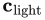 表示，定义为朝向光源的白色朗伯表面的反射辐亮度。点光源或平行光源对方向 v 上出射辐亮度 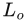(v) 的贡献为 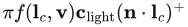（注意，第1.2节引入的  记号表示将负数钳制为零）。与之对应，右侧面光源的亮度由其辐亮度  表示。从表面位置观察，面光源张成立体角 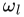。它对方向 v 上出射辐亮度的贡献，是 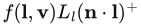 在  上的积分。

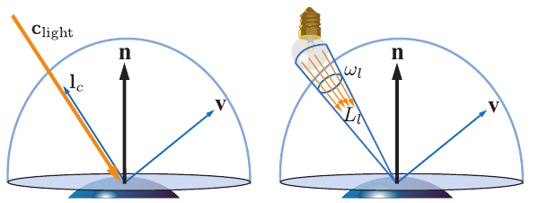

图10.3　光源照亮一个表面，这里考虑由表面法线 n 定义的可能入射光方向半球。左图中，光源是无穷小的；右图中，它被建模为面光源。

无穷小光源所依据的基本近似可以用下式表示：

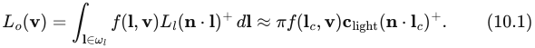

面光源对某个表面位置的光照贡献，同时取决于自身辐亮度  和从该位置看到的大小 。正如第9.4节所述，点光源和平行光源都是现实中无法实现的近似，因为零立体角意味着无穷大的辐亮度。了解这种近似引入的视觉误差，有助于判断何时可以使用它，以及不能使用时应采取什么方法。这些误差取决于两个因素：光源有多大——用它从着色点所覆盖的立体角衡量——以及表面有多光滑。

图10.4说明，表面镜面高光的大小与形状同时取决于材质粗糙度和光源尺寸。若光源很小，所张立体角相对于观察角很小，误差就很小。粗糙表面也往往比抛光表面更不容易显露光源尺寸的影响。一般而言，面光源朝向某个表面点的发光分布，以及表面BRDF的镜面波瓣，都是球面函数。考虑这两个函数各自贡献显著的方向集合，就得到两个立体角。决定误差的因素与发光角相对于BRDF镜面高光立体角的大小成比例。

最后请注意，使用点状光源并增加表面粗糙度，可以近似面光源产生的高光。这一观察有助于推导成本更低的面光源积分近似。它也解释了为什么许多实时渲染系统在实践中仅用点状光源就能产生可信的结果：美术师补偿了误差。不过，这样做也有弊端，因为它将材质属性与特定的光照配置耦合起来。照明情形发生变化时，以这种方式制作的内容就会显得不对。

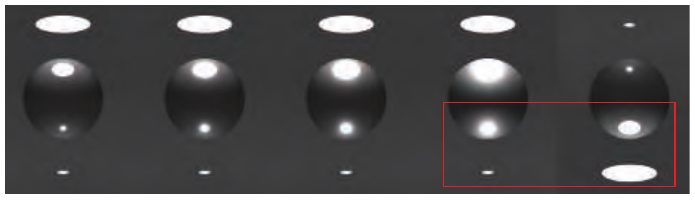

图10.4　从左到右，使用GGX BRDF的球体材质表面粗糙度逐渐增加。最右侧图像是序列第一幅图像的副本，并做了上下翻转。请注意，大圆盘光源在低粗糙度材质上产生的高光与着色，可以看起来类似于较小光源在粗糙得多的材质上产生的高光。

对于朗伯表面这一特殊情况，用点光源替代面光源可以完全精确。对这类表面，出射辐亮度与辐照度成正比：

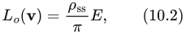

其中，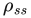 是表面的次表面反照率，或称漫反射颜色（第9.9.1节）。利用这一关系，可以采用式（10.1）的等价形式计算辐照度，形式简单得多：

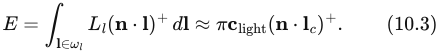

矢量辐照度的概念有助于理解存在面光源时辐照度的行为。Gershun [526] 首先提出矢量辐照度，并称其为光矢量；Arvo [73] 随后进一步扩展了这一概念。借助矢量辐照度，可以把任意尺寸和形状的面光源准确转换为点光源或平行光源。

设空间中的一点 p 接收到辐亮度分布 ，见图10.5。暂时假设  与波长无关，因而可以用一个标量表示。对每一个以入射方向 l 为中心的无穷小立体角 dl，构建一个与 l 同向的矢量，其长度等于来自该方向的标量辐亮度乘以 dl。最后，将所有矢量相加，得到矢量辐照度 e：

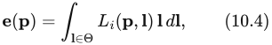

其中，Θ 表示对整个方向球面积分。

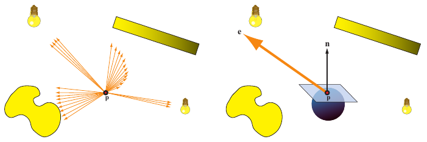

图10.5　矢量辐照度的计算。左图：点 p 周围分布着形状、尺寸和辐亮度分布各异的光源。黄色的明暗表示发出的辐亮度大小。橙色箭头是指向所有存在入射辐亮度方向的矢量，每个矢量的长度等于该方向传来的辐亮度乘以箭头覆盖的无穷小立体角。原则上应有无穷多个箭头。右图：矢量辐照度（橙色大箭头）是所有这些矢量的和。它可用于计算经过点 p 的任意平面的净辐照度。

通过点积运算，可以用矢量辐照度 e 求出点 p 处通过任意朝向平面的净辐照度：

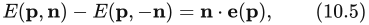

其中 n 是平面法线。通过平面的净辐照度，是流经平面“正面”（由平面法线 n 定义）的辐照度与流经“反面”的辐照度之差。净辐照度本身并不能直接用于着色。然而，如果没有辐亮度从“反面”射入——也就是说，所分析的光照分布不存在 l 与 n 夹角超过90°的部分——则 E(p, −n) = 0，且有

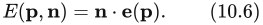

将单个面光源的矢量辐照度代入式（10.6），即可照亮具有任意法线 n 的朗伯表面，条件是 n 与面光源任意部分的方向夹角都不超过90°。见图10.6。

如果  与波长无关的假设不成立，一般就无法再定义单一矢量 e。不过，彩色光源往往在所有点都具有相同的相对光谱分布，因此可以把  分解为颜色 c′ 与不依赖波长的辐亮度分布 L′ᵢ 的乘积。在这种情况下，可以对 L′ᵢ 计算 e，再把 n · e 乘以 c′，以扩展式（10.6）。得到的方程与计算平行光源辐照度的方程相同，只需作如下替换：

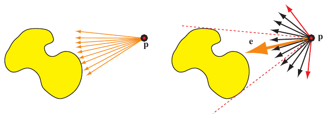

图10.6　单个面光源的矢量辐照度。左侧箭头表示用来计算矢量辐照度的各个矢量。右侧的橙色大箭头是矢量辐照度 e。红色虚线表示光源的范围；红色矢量各自垂直于其中一条红色虚线，界定了表面法线集合的边界。处于这一集合之外的法线，会与面光源某部分的方向形成大于90°的夹角。这样的法线不能用 e 正确计算辐照度。

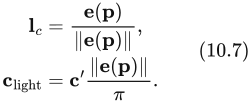

这样，我们实际上已经把一个任意形状、任意尺寸的面光源转换成了平行光源，而且没有引入任何误差。

对于简单情况，求矢量辐照度的式（10.4）可以解析求解。例如，设一个球形光源的中心为 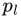、半径为 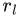。它从球面上的每一点向所有方向发射恒定的辐亮度 。对于这样的光源，式（10.4）和式（10.7）给出：

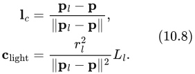

该方程与全向光源（第5.2.2节）的方程相同，其中 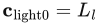、 = ，并使用标准的距离平方反比衰减函数。注1 可以调整这一衰减函数，以处理球体内部的点，并将光源的影响限制在给定的最大距离内。关于这类调整，详见第5.2.2节。

**注1：** 注意，对于球形光源，衰减的确采用通常的距离平方反比形式（这里距离从光源表面而非中心量起），但这并不普遍适用于所有面光源形状。尤其是，圆盘光源的衰减正比于 1/( + 1)。

> 译注：以上脚注按原文保留。脚注所说的“从光源表面量起”与式（10.8）中明确采用的球心距离 ‖ − p‖ 不一致；不要据此把式（10.8）的距离擅自改为到球面的距离。

以上结论仅在不存在来自“反面”的辐照度时成立。另一种理解方式是：面光源不能有任何部分处于“地平线以下”，即不能被表面遮挡。这个结论还可以推广：对于朗伯表面，面光源与点光源之间的所有差异都来自遮挡差异。只要点光源未被遮挡，对于所有满足这一条件的法线，点光源的辐照度都服从余弦定律。Snyder推导了考虑遮挡的球形光源解析表达式 [1671]。这一表达式相当复杂；不过，它仅取决于两个量：r/，以及 n 与  之间的夹角 ，因此可以预计算到二维纹理中。Snyder还给出了两个适用于实时渲染的函数近似。

图10.4表明，面光源在粗糙表面上的影响不那么明显。这一观察使我们还可以用一种物理依据较弱但依然有效的方法来模拟面光源对朗伯表面的影响：包裹光照。该技术在把 n · l 钳制到0之前，先对其进行简单修改。Forsyth [487] 给出的一种包裹光照形式是：

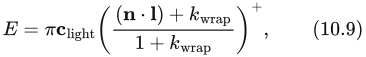

其中 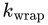 的取值从0到1，0对应点光源，1对应覆盖整个半球的面光源。Valve [1222] 使用另一种形式来模拟大型面光源的效果：

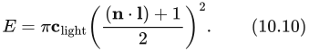

通常，在计算面光源照明时，也应调整阴影计算，以考虑非点状光源。如果不这样做，生硬的阴影可能会抵消一部分视觉效果 [193]。正如第7章所讨论的，软阴影可能是面光源最显著的视觉效果。

### 10.1.1 光泽材质

面光源对非朗伯表面的影响更为复杂。Snyder推导了球形光源的解 [1671]，但它仅适用于最初基于反射矢量的Phong材质模型，而且极其复杂。在当前实践中，仍需要采用近似。

面光源在光泽表面上最主要的视觉效果是高光，见图10.4。高光的大小和形状与面光源相似，而高光边缘会随表面粗糙度产生相应的模糊。这一观察催生了若干经验近似，在实践中可以相当可信。例如，可以修改高光计算结果，引入一个截断阈值，从而产生一大片平坦的高光区域 [606]。这能有效营造出球形光源镜面反射的错觉，如图10.7。

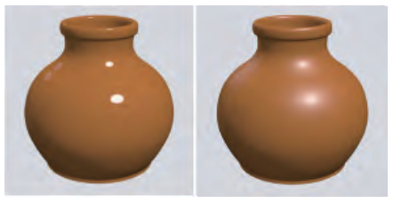

图10.7　光滑物体上的高光，是对光源形状的清晰反射。左图通过对Blinn-Phong着色器的高光值应用阈值来近似这一外观。右图使用未修改的Blinn-Phong着色器渲染同一物体，以供比较。（图片由Larry Gritz提供。）

实时渲染中大多数实用的面光源效果近似，都基于这样的思路：对每个着色点，寻找一套等价的点状光源配置，来模拟非无穷小光源的效果。这种方法在实时渲染中经常被用于解决各种问题。它与第9章处理表面像素足迹上的BRDF积分时采用的原理相同。得到的近似通常开销不大，因为全部工作只是改变着色方程的输入，不会引入额外的复杂性。由于除此以外没有改变数学形式，我们往往可以保证在某些条件下恢复为原来的着色计算，从而保留其全部性质。典型系统的大部分着色代码都基于点状光源，因此用它们处理面光源只需局部修改代码。

较早开发的一种近似，是Mittring在虚幻引擎“Elemental演示”中采用的粗糙度修改方法 [1229]。首先寻找一个圆锥，在表面的入射方向半球上包围光源的大部分辐照度。然后围绕镜面波瓣拟合一个类似的圆锥，包围BRDF的“大部分”。见图10.8。这两个圆锥分别代替半球上的两个函数，包含各函数值大于某个任意给定截断阈值的方向集合。接下来，可以通过寻找一个粗糙度不同的新BRDF波瓣，来近似光源与材质BRDF的卷积：该波瓣所对应圆锥的立体角，等于光源波瓣与材质波瓣的立体角之和。

Karis [861] 展示了将Mittring原理用于GGX/Trowbridge-Reitz BRDF（第9.8.1节）和球形面光源的实例，得到对GGX粗糙度参数 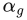 的简单修改：

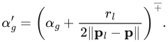

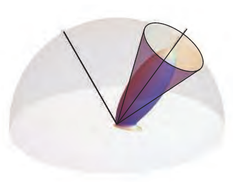

图10.8　GGX BRDF，以及拟合出的圆锥。圆锥包围了镜面波瓣反射大部分入射光辐亮度的方向集合。

注意，这里使用第1.2节引入的 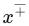 记号，将数值钳制在0与1之间。这一近似效果相当不错，而且极其便宜，但对于有光泽、几乎像镜子的材质会失效。原因在于，镜面波瓣始终是平滑的，无法模拟面光源在表面上形成清晰反射时产生的高光。另外，大多数微表面BRDF模型的波瓣并不“紧致”（不局限在局部），而是具有宽广的衰减区域，即镜面尾部，使得粗糙度重映射的效果下降。见图10.9。

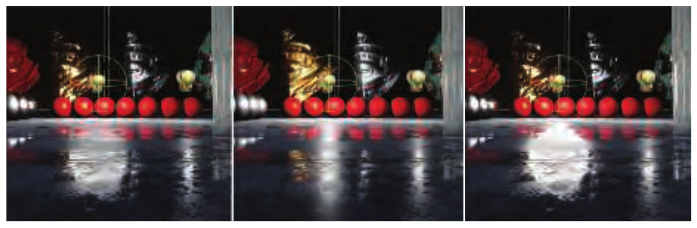

图10.9　球形光源照明。从左到右：数值积分计算的参考解、粗糙度修改技术，以及代表点技术。（图片由Epic Games公司的Brian Karis提供。）

另一种思路是不改变材质粗糙度，而是用一个随着色点变化的光照方向来表示面光源。这称为最具代表性点解法：修改光矢量，使其指向面光源表面上对着色表面产生最大能量贡献的点，见图10.9。Picott [1415] 选取光源上与反射光线形成最小夹角的点。Karis [861] 改进了Picott的表达式：为提高效率，用球面上到反射光线距离最短的点，近似夹角最小的点。他还给出一个成本很低的光强缩放公式，尝试保留总体发射能量，见图10.10。最具代表性点解法很方便，也已针对多种光源几何形状得到发展，因此有必要理解其理论基础。这类方法类似于蒙特卡洛积分中的重要性采样：在积分域内对样本取平均，以数值方式求出定积分的值。为了更高效，可以优先选取那些对总体平均值贡献较大的样本。

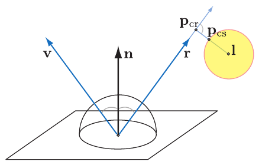

图10.10　Karis针对球体的代表点近似。首先计算反射光线上最接近球心 l 的点：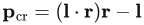。然后，球面上最接近 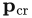 的点为 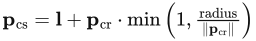。

> 译注：图10.10的叙述按原书保留。其公式给出的  实际是从球心 l 指向反射射线最近点的位移矢量；最近点的位置为 (l · r)r。原图和文字把它称作“点”，应留意这一位置与位移的区别。

定积分的中值定理为这类方法的有效性提供了更严格的依据。它允许用同一函数的一次求值来替代函数积分：

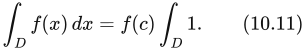

如果 f(x) 在 D 上连续，则 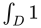 是积分域的面积，而点 c ∈ D 位于该函数在 D 内最小值与最大值之间的连线上。对于光照，我们考虑的积分是BRDF与光源辐照度的乘积在光源覆盖的半球区域上的积分。通常假定光源均匀照射，因此只需考虑光的衰减；多数近似还假设区域 D 从着色点完全可见。即便有这些假设，确定点 c 和归一化因子  仍可能过于昂贵，因此还要采用进一步近似。

> 译注：原书关于中值定理中“点位于最小值与最大值之间的连线上”的表述不够严谨。中值定理所保证的是存在使函数值等于积分平均值的点；这里保留原文说法，避免将其误当作一般的几何定位算法。式（10.11）右侧的面积积分也依照原书省略微分符号。

还可以从代表点解法对高光形状的影响来理解它。在表面的某个区域，如果反射矢量位于面光源所张方向圆锥之外，使代表点保持不变，那么实际效果就是点光源照明。此时，高光形状仅由底层镜面波瓣的形状决定。另一种情况是，所着色表面点的反射矢量命中面光源，此时代表点会连续变化，始终指向最大贡献方向。这实际上延展了镜面波瓣的峰部，使其“变宽”，效果类似图10.7中的硬阈值处理。

这一宽阔且数值恒定的高光峰部，也是近似中仍然存在的误差来源之一。在较粗糙的表面上，面光源反射看起来比真值解——即通过蒙特卡洛积分获得的解——更“锐利”；这种视觉缺陷与粗糙度修改技术造成的过度模糊恰好相反。为解决这一问题，Iwanicki和Pesce [807] 将BRDF波瓣、软阈值、代表点参数和用于能量守恒的缩放因子，拟合到通过数值积分计算的球形面光源照明结果，从而得到近似。拟合函数形成一个参数表，其索引包括材质粗糙度、球体半径，以及光源中心方向与表面法线和视线矢量的夹角。在着色器中直接使用这种多维查找表成本很高，因此他们还提供了封闭形式的近似。近期，de Carpentier [231] 推导了一种改进表达式，可在采用微表面BRDF时，更好地保留球形面光源在掠射角下产生的高光形状。该方法寻找令 n · h 最大的代表点，即使表面法线与光照—视线半矢量的点积最大，而不是采用原始表达式中的 n · r；原始表达式是针对Phong BRDF推导的。

### 10.1.2 一般光源形状

到目前为止，已经介绍了若干计算均匀发光的球形面光源与任意光泽BRDF着色结果的方法。多数方法为了得到可在实时条件下快速求值的数学公式，都采用了各种近似，因此与问题的真值解相比，会显示出不同程度的误差。然而，即便拥有足够计算能力来推导精确解，仍然会犯一个很大的错误：这个错误已经隐含在光照模型的假设中。现实中的光源通常不是球体，也很难是完全均匀的发光体，见图10.11。球形面光源在实践中仍有用，因为它提供了最简单的方法，打破点状光源引入的光照与表面粗糙度之间的错误关联。不过，通常只有实际灯具相对较小时，球形光源才是对大多数灯具的良好近似。

基于物理的实时渲染旨在生成令人信服、合乎情理的图像；若把自己限制在理想化情形中，沿这个方向能够走多远就很有限。这是计算机图形学中反复出现的一种取舍。通常，可以选择对采用简化假设的较容易问题求精确解，也可以选择对更贴近现实、更一般的问题求近似解。

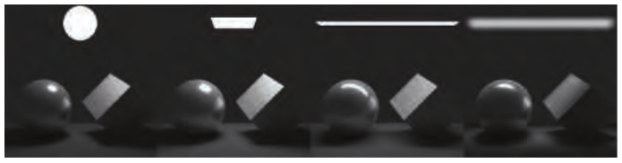

图10.11　常用光源形状。从左到右：球体、矩形（卡片）、管状（线状），以及发光方向集中的管状光源（光沿光源表面法线集中发射，而不是均匀分布在半球内）。请注意它们产生的不同高光。

球形光源最简单的扩展之一是“管状”光源，也称“胶囊”光源，可用于表示现实中的荧光灯管，见图10.12。对于朗伯BRDF，Picott [1415] 给出了光照积分的封闭形式公式，等价于计算线性光源线段两端的两个点光源的照明，并采用适当的衰减函数：

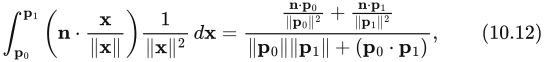

其中 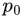 和  是线性光源的两个端点，n 是表面法线。Picott还针对Phong镜面BRDF推导了这一积分的代表点解：在光源线段上选取一点，使其与所考虑表面点的连线同反射矢量形成最小夹角，再用放置于该处的点光源照明来近似。这个代表点解会动态地把线性光源转换为点光源，因此接下来可以采用任意球形光源近似，把灯具“加粗”为胶囊形。

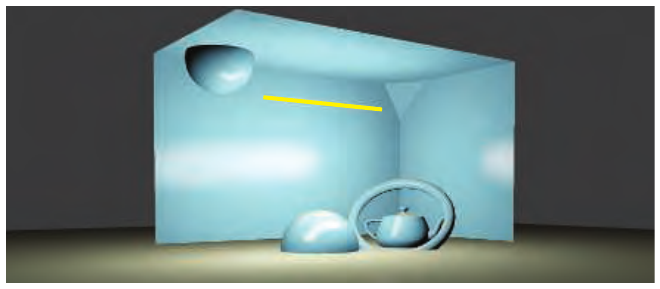

图10.12　管状光源。图像采用代表点解法计算 [807]。

与球形光源的情况类似，Karis [861] 给出了Picott原始解法的一种更高效、但略不准确的变体：使用直线上距反射矢量距离最小的点，而非夹角最小的点，并给出一个试图恢复能量守恒的缩放公式。

对于许多其他光源形状，例如圆环和Bézier曲线段，也能相当容易地获得代表点近似，但通常不希望着色器中出现太多分支。好的光源形状，应当能够表示场景中许多现实光源。表现力最强的形状类别之一是平面面光源：它是平面上由给定几何形状围成的区域，例如矩形（此时也称卡片光源）、圆盘，或更一般的多边形。这些图元可以用来表示广告牌和电视屏幕之类的发光面板，代替常用的摄影照明设备（柔光箱、反光板），模拟许多更复杂灯具的出光口，或者表示场景中墙壁和其他大型表面反射的光照。

Drobot [380] 推导了较早的一种实用卡片光源近似，也适用于圆盘。这仍是代表点解法，但有两个特别值得关注的方面：一是将这种方法扩展到平面二维区域的复杂性，二是求解的整体思路。Drobot从中值定理出发，首先近似认为，用于光照求值的良好候选点应位于光照积分全局最大值附近。

对于朗伯BRDF，该积分为

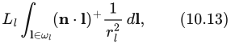

其中， 是光源发出的恒定辐亮度， 是光源几何形状张成的立体角， 是从表面沿 l 方向射向光源平面的射线长度，而  是通常的朗伯钳制点积。令一条射线从表面出发，沿法线方向与光源平面相交，得到点 p′。光源区域边界上最接近 p′ 的点 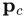，就是使  达到最大的位置。类似地，令 p″ 为光源平面上最接近着色表面点的位置，那么光源边界上最接近 p″ 的点 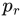，就是使 1/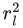 达到最大的位置。见图10.13。于是，被积函数的全局最大值位于连接  和  的线段上某处：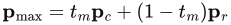，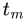 ∈ [0, 1]。Drobot先用数值积分寻找许多不同配置下的最佳代表点，再找到一个在平均意义上效果最好的单一 。

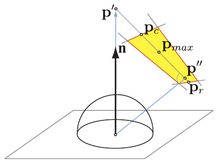

图10.13　Drobot矩形面光源代表点近似的几何构造。

Drobot的最终解法对漫反射与镜面光照都采用了进一步近似，这些近似均以同数值求得的真值解进行比较为依据。他还为带纹理的卡片光源这一重要情况推导了算法：不再假设发光恒定，而是在光源矩形区域上用纹理调制发光。该过程使用一个三维查找表，其中存储发光纹理在不同半径圆形足迹上的预积分版本。Mittring [1228] 对光泽反射采用类似方法：将反射光线与带纹理的矩形广告牌求交，再根据光线交点距离，索引预先计算的模糊纹理版本。这项工作早于Drobot的研究，方法更依赖经验、理论依据较少，但确实尝试匹配真值积分解。

对于更一般的平面多边形面光源，Lambert [967] 最早针对完全漫反射表面推导出精确的封闭形式解。Arvo [74] 改进了这种方法，使其适用于以Phong镜面波瓣建模的光泽材质。Arvo将矢量辐照度概念扩展为更高维的辐照度张量，并利用斯托克斯定理，把面积积分转化为沿积分域轮廓的、更简单的积分。他的方法仅有两个假设：光源从着色表面点完全可见（这是常见假设，可通过用表面的切平面裁剪光源多边形来绕开这一限制），以及BRDF是径向对称的余弦波瓣。遗憾的是，Arvo的解析解在实际实时渲染中相当昂贵，因为对于面光源多边形的每一条边，都需要计算一个公式，其时间复杂度与所用Phong波瓣的指数呈线性关系。近期，Lecocq [1004] 找到了轮廓积分函数的O(1)近似，并将解法扩展到一般的基于半矢量的BRDF，使这一方法更加实用。

到目前为止，所介绍的所有实用实时面光源照明方法，都既采用某些简化假设来推导解析构造，也采用近似来处理由此得到的积分。Heitz等人 [711] 采用另一种思路：线性变换余弦（linearly transformed cosines，LTC），由此得到一种实用、准确且通用的技术。他们首先设计一类球面函数，既具有很强的表达能力——也就是可以呈现许多形状——又容易在任意球面多边形上积分，见图10.14。LTC仅使用一个经3×3矩阵变换的余弦波瓣，因此可以在半球上改变尺寸、拉伸和旋转，适配各种形状。对一个简单余弦波瓣——不同于Blinn-Phong，这里不取幂——在球面多边形上的积分，早已有成熟方法，可追溯至Lambert [74, 967]。Heitz等人的关键观察是：用一个变换矩阵扩展积分中的波瓣，不会改变积分的复杂度。可以用该矩阵的逆变换多边形积分域，消去积分内部的矩阵，使被积函数重新变为简单的余弦波瓣，见图10.15。对于一般的BRDF和面光源形状，剩下的工作仅是寻找把球面BRDF函数表示为一个或多个LTC的方法（近似）。这项工作可以离线完成，并制成查找数组，以粗糙度、入射角等BRDF参数为索引。

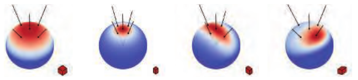

图10.14　线性变换余弦技术的核心思想是：一个简单的余弦波瓣（左侧），可以通过3×3变换矩阵轻松缩放、拉伸和错切。这样，余弦波瓣就能在球面上呈现许多不同形状。（图片由Eric Heitz提供。）

图10.15　给定一个LTC和一个球面多边形积分域（左侧），可以用LTC矩阵的逆同时变换两者，得到一个简单的余弦波瓣和新的积分域（右侧）。余弦波瓣在变换后积分域上的积分，等于LTC在原始积分域上的积分。（图片由Eric Heitz提供。）

基于线性变换余弦的解法，既可针对一般的带纹理多边形面光源推导，也可针对卡片、圆盘和线光源等计算成本更低的特殊形状推导。LTC的开销可能高于代表点解法，但精确得多。

## 10.2 环境光照

来源：《Real-Time Rendering》第4版，书页391—392（PDF第412—413页）。本节从10.2标题开始，到10.3标题之前结束。

原则上，反射（式9.3）并不区分直接来自光源的光，以及经天空或场景中物体散射而来的间接光。所有入射方向都具有辐亮度，反射方程对所有这些方向进行积分。不过，在实践中，直接光通常集中在相对较小的立体角内，且辐亮度很高；间接光则往往以中等到较低的辐亮度，弥散地覆盖半球的其余部分。这种划分为分别处理两者提供了充分的实际理由。

到目前为止，所讨论的面光源技术，都是对光源形状所发出的恒定辐亮度进行积分。这样，对于每一个接受着色的表面点，就得到一组具有恒定、非零入射辐亮度的方向。现在我们要考察的方法，则是对所有可能的入射方向上、由一个变化函数所定义的辐亮度进行积分。见图10.16。

虽然这里主要讨论间接光照和“环境”光照，但我们并不打算探究全局光照算法。关键区别在于，本章中所有着色计算的数学过程，都不依赖场景中其他表面的信息，而是依赖一小组光源图元。因此，举例来说，我们可以用一个面光源来模拟光线从墙壁上的反弹；尽管这是一种全局效应，着色算法却不需要知道这面墙的存在。它掌握的唯一信息是一个光源的相关信息，所有着色都在局部完成。全局光照（第11章）往往与本章的概念密切相关，因为许多解决方案都可以看作是在设法计算：对于每个物体或表面位置，应使用哪一组合适的局部光源图元，才能模拟光在场景中反复反弹所产生的相互作用。

图10.16 不同环境光照情形下的场景渲染。

环境光是最简单的环境光照模型，其辐亮度不随方向变化，而是具有恒定值 。即使是这样一种基本的环境光照模型，也能显著改善视觉质量。如果场景没有考虑从物体间接反弹的光，看起来就会非常不真实。在这样的场景里，处于阴影中或背向光源的物体会完全漆黑，这与现实中的任何场景都不一样。第376页图10.1中的月面景观接近这种情况，但即使在这样的场景中，附近物体也会反射一些间接光。

环境光的具体效果取决于BRDF。对于朗伯表面，固定的辐亮度  会对出射辐亮度产生恒定的贡献，与表面法线  或观察方向  无关：

着色时，将这一恒定的出射辐亮度贡献加到直接光源的贡献上。对于任意BRDF，对应的方程为

这个方程中的积分与方向反照率  相同（第9.3节的式9.9），因此该方程等价于 。较早的实时渲染应用有时会假定  为一个常量，称为环境光颜色 。这就把方程进一步简化为 。

反射方程忽略了遮挡，也就是说，许多表面点会受到其他物体或同一物体其他部分的阻挡，从而无法“看到”某些入射方向。这种简化通常会降低真实感，但对于环境光照尤其明显：忽略遮挡时，环境光照会显得极其平淡、缺乏立体感。解决这个问题的方法将在第11.3节讨论，尤其是第11.3.4节。

## 10.3 球面函数与半球面函数

本节来源：《Real-Time Rendering, Fourth Edition》书页392—404（PDF物理页413—425），自10.3节标题起，止于10.4节标题之前；包含全部下级小节。图中英文标签保留，图注完整译出。

为了将环境光照扩展到常量项之外，我们需要一种方法来表示从任意方向到达物体的入射辐亮度。首先，我们只把辐亮度视为所积分方向的函数，而不考虑表面位置。这种做法基于一个假设：光照环境位于无穷远处。

到达给定点的辐亮度，对于每个入射方向都可能不同。光照可能从左侧射来时是红色，从右侧射来时是绿色；也可能上方的光被遮挡，侧面的光却没有被遮挡。这类量可以用球面函数表示，其定义域是单位球面，或者说中的方向空间。我们把这个定义域记作S。函数输出一个值还是多个值，并不影响这些函数的工作方式。例如，通过为每个颜色通道分别存储一个标量函数，存储标量函数的同一种表示也能用来编码颜色值。

假设表面是朗伯表面，那么可以通过存储预计算的辐照度函数来使用球面函数计算环境光照，例如，对每一种可能的表面法线方向，存储辐亮度与余弦瓣卷积的结果。更复杂的方法则存储辐亮度，并在运行时为每个需要着色的表面点计算它与BRDF的积分。球面函数也广泛用于全局光照算法（第11章）。

与球面函数相关的还有半球面函数，它们适用于只定义了一半方向取值的情况。例如，当表面下方没有光线射来时，就会用这些函数描述表面处的入射辐亮度。我们将这些表示统称为“球面基”，因为它们是定义在球面上的函数向量空间的基。尽管环境光/高光/方向表示（10.3.3节）严格说来并不是数学意义上的基，为了简便，我们也用这个术语称呼它。把函数转换为某种给定表示称为“投影”，从给定表示求出函数值则称为“重建”。

每种表示都有自身的取舍。我们可能希望一种基具备以下性质：

- 高效的编码（投影）与解码（查找）。
- 仅用少量系数、以较低重建误差表示任意球面函数的能力。
- 投影的旋转不变性，即旋转函数投影所得的结果，与先旋转函数再投影所得的结果相同。这种等价性意味着，例如用球谐函数近似表示的函数，在旋转时不会发生变化。
- 容易计算已编码函数的和与积。
- 容易计算球面积分与卷积。

### 10.3.1 简单查表表示

表示球面函数（或半球面函数）最直接的方法，是选择若干方向，并为每个方向存储一个值。求函数值时，先找到求值方向周围的若干样本，再通过某种插值形式重建该值。

这种表示既简单，又具有很强的表达能力。对这样的球面函数做加法或乘法，只需对相应表项做加法或乘法。按需增加样本，就能以任意低的误差编码许多不同的球面函数。

图10.17　在球面上分布点的几种不同方法。从左到右：随机点、立方体网格点、球面t设计（spherical t-design）。

要在球面上分布样本（见图10.17），使其既能高效检索，又能相对均等地表示各个方向，并不容易。最常用的技术是先把球面展开到矩形定义域，再用规则点网格对该定义域采样。二维纹理所表示的恰好就是矩形上的点网格（纹素），因此可以用纹素作为样本值的底层存储。这使我们能够借助GPU加速的双线性纹理过滤，实现快速查找（重建）。本章稍后将讨论环境贴图（10.5节），它们正是采用这种形式的球面函数；届时还会讨论展开球面的不同方案。

查表表示也有不足。在低分辨率下，硬件过滤提供的质量往往无法接受。卷积是处理光照时常见的运算，其计算复杂度与样本数量成正比，开销可能高得难以承受。此外，这种投影不具有旋转不变性，在某些应用中会造成问题。例如，设想把一组方向射来、照到物体表面的光的辐亮度进行编码。当物体旋转时，编码结果的重建可能发生变化。这会导致编码所表示的辐射能量变化，在场景动画中表现为脉动伪影。在投影和重建时，为每个样本采用精心构造的核函数，可以减轻这些问题。不过，更常见的做法是直接采用足够密集的采样，以掩盖这些问题。

通常，当需要存储复杂的高频函数，而且只有使用大量数据点才能以低误差编码时，我们会使用查表表示。如果需要只用少量参数紧凑地编码球面函数，就可以使用更复杂的基。

一种常用的基是环境立方体（ambient cube，AC）。它是最简单的查表形式之一，由沿主要坐标轴定向的六个平方余弦瓣构成[1193]。之所以称为环境“立方体”，是因为它等价于在立方体各面中存储数据，并在从一个方向移向另一个方向时进行插值。对于任何给定方向，只有三个瓣与之相关，因此不必从内存中读取另外三个瓣的参数[766]。在数学上，环境立方体可定义为

其中，和包含立方体六个面的六个值；(, , d)是一个向量函数，其每个分量根据d中相应分量是否为正，从或中选取值。译注：式中的dd表示逐分量相乘。

环境立方体类似于每个立方体面上只有一个纹素的立方体贴图（10.4节）。在某些系统中，针对这一特例用软件执行重建，可能比使用GPU对立方体贴图进行双线性过滤更快。Sloan[1656]推导了一种简单公式，用于在环境立方体与球谐基（10.3.2节）之间转换。

环境立方体的重建质量相当低。若改为存储并插值对应立方体顶点的八个值，而非六个值，结果会稍好一些。较近的时候，Iwanicki和Sloan[808]提出了一种名为环境骰子（ambient dice，AD）的替代方案。它的基由沿二十面体顶点方向定向的平方余弦瓣和四次方余弦瓣构成。重建时需要读取所存十二个值中的六个；确定读取哪六个值的逻辑，比环境立方体的相应逻辑稍复杂，但结果质量要高得多。

### 10.3.2 球面基

把函数投影（编码）到使用固定数量数值（系数）的表示中，有无穷多种方法。我们只需要一个带有可调参数、覆盖球面定义域的数学表达式。随后就可以通过拟合来近似任何给定的目标函数，也就是找到使该表达式与给定函数之间误差最小的参数值。

最简的选择是使用一个常量：

通过在单位球面的整个面积上求平均，可以得到给定函数f在这个基上的投影：

周期函数的平均值c也称为直流分量（DC component）。这个基的优点是简单，而且也满足我们所希望的部分性质（容易重建、相加、相乘，以及旋转不变性）。但是，它只是用平均值替换原函数，因此不能很好地表达大多数球面函数。利用两个系数a和b，可以构造稍复杂的近似：

这种表示能够精确编码两极处的值，并在球面上对二者插值。这种选择的表达能力更强，但投影也变得更复杂，而且不再对所有旋转保持不变。实际上，这个基也可以看成只有两个样本、分别位于两极的查表形式。

图10.18　基函数的一个基本示例。这里的空间是“输入在0到5之间、取值在0到1之间的函数”。左图给出这种函数的一个例子。中图是一组基函数（每种颜色代表一个不同的函数）。右图把各基函数乘以权重后求和，形成对目标函数的近似。图中的基函数已经按各自权重缩放。黑线表示求和结果，即对原函数的近似；原函数以灰色显示，以便比较。

一般而言，谈到函数空间的基时，我们指的是一组函数，它们的线性组合（加权求和）可用于表示给定定义域上的其他函数。图10.18给出了这一概念的例子。本节余下部分将探讨一些可用于近似球面函数的基。

#### 球面径向基函数

利用GPU硬件过滤的查表形式，其重建质量低，至少在一定程度上是由样本插值采用的双线性形函数造成的。重建时，也可以用其他函数为样本加权。这些函数可能比双线性过滤产生更高质量的结果，还可能具备其他优点。常用于这一目的的一类函数是球面径向基函数（spherical radial basis functions，SRBF）。它们具有径向对称性，因此只依赖一个自变量：定向轴与求值方向之间的夹角。由分布在球面上的一组这样的函数（称为瓣）构成基。一个函数的表示由各瓣的一组参数组成。这组参数可以包含瓣的方向，但那会使投影困难得多（需要非线性全局优化）。因此，通常假设瓣的方向固定，并均匀分布在球面上，而使用其他参数，例如各瓣的幅度或展宽，即所覆盖的角度。重建时，在给定方向上对所有瓣求值，然后将结果相加。

#### 球面高斯函数

球面高斯函数（spherical Gaussian，SG）是SRBF瓣的一种特别常见的选择，在方向统计学中也称为von Mises-Fisher分布。需要指出，von Mises-Fisher分布通常包含一个归一化常数，而我们的公式省略了它。单个瓣可以定义为

其中，v是求值方向（单位向量），d是瓣的方向轴（分布的均值，同样已归一化），λ ≥ 0是瓣的锐度，用于控制其角宽，也称为集中参数或展宽[1838]。

随后，使用给定数量球面高斯函数的线性组合来构造球面基：

将球面函数投影到这种表示中，需要找到使重建误差最小的参数集合{, , }。这一过程通常通过数值优化完成，经常使用非线性最小二乘优化算法（例如Levenberg-Marquardt算法）。注意，如果优化过程中允许全部参数变化，就不再是在使用函数的线性组合，因此式10.18并不表示一个基。只有选定一组固定的瓣（方向与展宽），使其良好覆盖整个定义域[1127]，并且仅通过拟合权重进行投影，才能得到真正的基。这样也大大简化了优化问题，因为此时可以将其写成普通最小二乘优化。如果需要在不同数据集（已投影函数）之间插值，这也是一个很好的方案。在这种情况下，允许瓣的方向和锐度变化是不利的，因为这些参数具有很强的非线性。

这种表示的一个优点是，SG上的许多运算都具有简单的解析形式。两个球面高斯函数的乘积仍是球面高斯函数（见[1838]）：

其中

球面高斯函数在球面上的积分也可以解析计算：

这意味着两个球面高斯函数乘积的积分也具有简单的表达式。

> 译注（原书公式疑点）：以上乘积与积分均按书页397的排印保留。按式10.17的定义，乘积右端还需乘以幅度因子exp(λ′ −  − )；积分分子中的指数应为−2λ，原书印为2λ。λ = 0时积分取极限4π；若 + 或d′的长度为零，乘积的方向归一化也须按退化情况处理。此处未暗改原式。

图10.19　各向异性球面高斯函数。左：球面上的一个ASG及其对应的俯视图。右：另外四种ASG配置示例，展示了这一表达式的表达能力。（图片由Xu Kun提供。）

如果能用球面高斯函数表示光的辐亮度，就可以对它与采用同样表示编码的BRDF之积进行积分，从而完成光照计算[1408, 1838]。基于这些原因，SG已用于许多研究项目[582, 1838]以及工业应用[1268]。

与平面上的高斯分布一样，von Mises-Fisher分布也可以推广到各向异性的情况。Xu等人[1940]引入了各向异性球面高斯函数（anisotropic spherical Gaussian，ASG；见图10.19）。其定义是在单个方向d之外增加两个辅助轴t和b，三者共同形成一个标准正交切线标架：

其中，λ, μ ≥ 0控制瓣沿切线标架两个轴的展宽，而S(v, d) = 是平滑项。这个项是方向统计学中使用的Fisher-Bingham分布与计算机图形学所用ASG之间的主要区别。Xu等人还给出了积分、乘积和卷积算子的解析近似。

SG虽然具有许多理想性质，但也有一个缺点：与查表形式以及一般具有有限范围（带宽）的核不同，它们具有全局支撑。每个瓣在整个球面上都非零，尽管其衰减相当迅速。这种全局范围意味着，若用N个瓣表示一个函数，则在任何方向上重建时都需要全部N个瓣。

#### 球谐函数

球谐函数（spherical harmonics，SH）注2是球面上的一组正交基函数。一组基函数正交，是指集合中任意两个不同函数的内积都为零。内积是比点积更一般、但与之类似的概念。两个向量的内积就是点积，即对应分量两两相乘后求和。同样，通过考虑两个函数相乘后的积分，可以得到函数内积的定义：

其中，积分在相应定义域上进行。对于图10.18中的函数，定义域是x轴上的0到5（注意，这一特定函数集合并不正交）。球面函数的形式稍有不同，但基本概念相同：

其中，n ∈ Θ表示积分在单位球面上进行。

标准正交集合是在正交集合的基础上，再要求集合中任意函数与自身的内积等于1。更形式化地，函数集合{()}为标准正交集合的条件是

图10.20　标准正交基函数。本例使用与图10.18相同的空间和目标函数，但把基函数修改为标准正交函数。左图显示目标函数，中图显示标准正交基函数集合，右图显示缩放后的基函数。对目标函数的最终近似用黑色点线表示，原函数用灰色显示以便比较。

图10.20给出了与图10.18类似的例子，只是基函数是标准正交的。注意，图10.20中的标准正交基函数彼此不重叠。对于由非负函数构成的标准正交集合，这一条件是必需的，因为任何重叠都会意味着非零内积。如果函数在部分取值范围内为负，那么它们可以重叠，仍然构成标准正交集合。这种重叠通常能带来更好的近似，因为它允许基保持平滑。定义域互不相交的基往往会造成不连续。

**注2：** 这里讨论的基函数更准确地说应称为“实球谐函数”，因为它们表示复值球谐函数的实部。

标准正交基的优点是，寻找与目标函数最接近的近似这一过程非常直接。投影时，每个基函数的系数，就是目标函数与相应基函数的内积：

实践中，这一积分必须用数值方法计算，通常采用蒙特卡洛采样，对均匀分布在球面上的n个方向取平均。

标准正交基在概念上类似于4.2.4节介绍的三维向量“标准基”。标准基的目标不是一个函数，而是点的位置。标准基由三个向量（每维一个）组成，而非一组函数。按照式10.22采用的定义，标准基也是标准正交的。把点投影到标准基的方法也相同，因为系数就是位置向量与各基向量的点积。一个重要区别在于，标准基能精确复现每个点，而有限个基函数只能近似目标函数。结果不能始终精确：标准基使用三个基向量表示三维空间，而函数空间有无穷多个维度，因此有限个基函数不可能完美表示整个函数空间。

球谐函数既正交又标准正交，而且还有其他一些优点。它们具有旋转不变性，SH基函数的求值开销也很低。它们是单位长度向量的x、y、z坐标的简单多项式。然而，与球面高斯函数一样，它们具有全局支撑，所以重建时必须对全部基函数求值。基函数表达式可在多份参考资料中找到，包括Sloan的一份演讲材料[1656]。这份材料尤其值得关注，因为它讨论了许多使用球谐函数的实用技巧，包括公式，以及某些情况下的着色器代码。后来，Sloan还推导了执行SH重建的高效方法[1657]。

SH基函数按频带排列。第一个基函数是常量，接下来三个是在球面上缓慢变化的线性函数，再接下来五个是变化稍快的二次函数。见图10.21。低频函数（即在球面上变化缓慢的函数），例如辐照度值，可以用相对少量的SH系数准确表示（10.6.1节将会说明）。

投影到球谐函数时，得到的系数表示被投影函数中各个频率的幅度，也就是它的频谱。在这个频谱域中，一个基本性质成立：两个函数乘积的积分，等于这两个函数投影系数的点积。这一性质使我们能够高效计算光照积分。

图10.21　球谐函数的前五个频带。每个球谐函数都有正值区域（绿色）与负值区域（红色），接近零时颜色渐变为黑色。（球谐函数可视化图片由Robin Green提供。）

球谐函数的许多运算在概念上很简单，归结为对系数向量进行矩阵变换[583]。其中的重要情况包括：计算投影到球谐函数的两个函数的乘积、旋转已投影函数，以及计算卷积。在实践中，SH中的矩阵变换意味着这些运算的复杂度与所用系数数量的平方成正比，成本可能相当高。幸运的是，这些矩阵往往具有特殊结构，可以利用它们设计更快的算法。Kautz等人[869]提出了一种优化旋转计算的方法，把旋转分解为绕x轴和z轴的旋转。Hable[633]给出了一种常用的低阶SH投影快速旋转方法。Green的综述[583]讨论了如何利用旋转矩阵的分块结构加快计算。当前最先进的方法，是Nowrouzezahrai等人[1290]提出的分解为带谐函数（zonal harmonics）的做法。

球谐函数以及下文介绍的H基等频谱变换，有一个常见问题：可能出现称为振铃（也称吉布斯现象）的视觉伪影。如果原始信号包含带限近似无法表示的快速变化，重建就会出现振荡。在极端情况下，重建函数甚至可能产生负值。可以采用各种预过滤方法来应对这一问题[1656, 1659]。

#### 其他球面表示

还有许多其他表示，可以用有限个系数编码球面函数。线性变换余弦（10.1.2节）就是一例，它可以高效近似BRDF函数，同时具备容易在球面的多边形区域上积分的性质。

球面小波[1270, 1579, 1841]是一种兼顾空间局部性（具有紧支撑）与频率局部性（平滑性）的基，可以对高频函数进行压缩表示。将球面划分为常值区域的球面分段常数基函数[1939]，以及依赖矩阵分解的双聚类近似[1723]，也已经用于环境光照。

### 10.3.3 半球面基

尽管上述基可用于表示半球面函数，但会造成浪费：一半信号始终等于零。在这种情况下，通常更倾向于使用直接建立在半球面定义域上的表示。对于定义在表面上的函数，这一点尤其重要：BRDF、入射辐亮度，以及到达物体给定点的辐照度，都是常见例子。这些函数天然局限于以给定表面点为中心、沿表面法线定向的半球面；对于指向物体内部的方向，它们没有取值。

#### 环境光/高光/方向

这类表示中最简单的一种，是把常量函数与半球面上信号最强的单一方向结合起来。它通常称为环境光/高光/方向（ambient/highlight/direction，AHD）基，最常用于存储辐照度。AHD这个名称说明了各组成部分所表示的含义：恒定的环境光，加上一盏用于近似“高光”方向辐照度的方向光，以及大部分入射光集中的方向。AHD基通常需要存储八个参数：方向向量用两个角度，环境光与方向光的强度用两个RGB颜色。它最早引人注目的应用是在游戏《雷神之锤III》中，动态物体的体积光照就是以这种方式存储的。此后，它被用于多款游戏，例如《使命召唤》系列中的作品。

投影到这种表示有些棘手。由于它是非线性的，寻找近似给定输入的最优参数，计算成本很高。实践中会改用启发式方法。首先把信号投影到球谐函数，再用最优线性方向为余弦瓣定向。给定方向后，环境光值与高光值可以通过最小二乘最小化计算。Iwanicki和Sloan[809]说明了如何在强制非负约束的同时完成这一投影。

#### 辐射度法线贴图/《半条命2》基

Valve在《半条命2》系列游戏中使用了一种新颖表示，在辐射度法线贴图的语境下表达方向性辐照度[1193, 1222]。它最初为存储预计算漫反射光照、同时允许使用法线贴图而设计，现在通常称为《半条命2》基。它通过采样切线空间中的三个方向，表示表面上的半球面函数。见图10.22。这三个互相垂直的基向量在切线空间中的坐标为

图10.22　《半条命2》的光照基。三个基向量与切平面的仰角约为26°，它们在切平面上的投影绕法线以120°等间隔分布。它们都是单位长度，并且每个向量都与另外两个垂直。

> 译注（原书图注疑点）：图注的“约26°”照原文保留，但由式10.24的法线分量1/√3计算，仰角应约为35.26°。下文文字使用方向d，而公式使用n，亦保留原书符号。

重建时，给定切线空间方向d，我们可以对沿三个基向量的值、和进行插值：注3

Green[579]指出，如果改为针对切线空间方向d预计算下面三个值，就能显著降低式10.25的成本：

其中k = 0, 1, 2。式10.25于是简化为

Green还介绍了这种表示的其他一些优点，其中部分将在11.4节讨论。

《半条命2》基对方向性辐照度表现良好。Sloan[1654]发现，这种表示产生的结果优于低阶半球谐函数。

**注3：** GDC 2004演讲材料给出的公式有误。式10.25的形式来自SIGGRAPH 2007的一份演讲材料[579]。

#### 半球谐函数/H基

Gautron等人[518]将球谐函数专门化到半球面定义域，称之为半球谐函数（hemispherical harmonics，HSH）。实现这种专门化有多种方法。

例如，Zernike多项式与球谐函数一样是正交函数，但定义在单位圆盘上。与SH一样，它们可用于将函数变换到频域（频谱），从而获得一些方便的性质。由于能将单位半球面变换为圆盘，因此可以用Zernike多项式表达半球面函数[918]。不过，用它们执行重建相当昂贵。Gautron等人的方案既更经济，又允许通过对系数向量做矩阵乘法，实现相对快速的旋转。

不过，HSH基的求值仍比球谐函数昂贵，因为它是通过把球面的负极移到半球面的外缘来构造的。这种偏移操作使基函数不再是多项式，需要计算除法和平方根，而这些运算在GPU硬件上通常较慢。此外，基在半球边缘始终为常量，因为边缘在偏移之前映射到球面上的同一个点。边缘附近的近似误差可能很大，尤其是在只使用少量系数（球谐频带）时。

Habel[627]引入了H基，经度参数化采用一部分球谐基，纬度参数化采用一部分HSH基。这个基混合了偏移与未偏移的SH版本，在允许高效求值的同时，仍然保持正交。

## 10.4 环境映射

来源：《Real-Time Rendering, Fourth Edition》，书页 404—414（PDF 物理页 425—435）。本节从 10.4 标题起，到 10.5 标题前止，包含 10.4.1—10.4.4；原图内英文标签保留，图注完整翻译。

将球面函数记录在一幅或多幅图像中，称为**环境映射**（environment mapping），因为我们通常借助纹理映射来实现表中的查找。这种表示是环境光照中最强大、最常用的形式之一。与其他球面表示相比，它消耗更多内存，但在实时运行时解码简单而快速。此外，它能够表示频率任意高的球面信号（通过提高纹理分辨率），并准确捕获任意范围的环境辐亮度（通过增加每个通道的位数）。这种精度是有代价的。与其他常用纹理中存储的颜色和着色器属性不同，环境贴图中存储的辐亮度值通常具有高动态范围。每个纹素需要更多位，意味着环境贴图往往比其他纹理占用更多空间，访问速度也可能更慢。

对于任何全局球面函数，也就是用于场景中所有物体的球面函数，我们有一项基本假设：入射辐亮度  仅取决于方向。这个假设要求被反射的物体和光源位于远处，并且反射体不会反射自身。

依赖环境映射的着色技术，通常并不是以其表示环境光照的能力来区分，而是以我们能够多好地将它们与给定材质结合并完成积分来区分。也就是说，为了完成积分，我们必须对 BRDF 采用哪些近似和假设？**反射映射**（reflection mapping）是环境映射最基本的情形，在这里我们假设 BRDF 对应一面理想镜子。光学上平坦的表面或镜子，将入射光线反射到该光线的反射方向 （第 9.5 节）。类似地，出射辐亮度只包含来自一个方向的入射辐亮度，这个方向就是反射后的视线向量 **r**。该向量的计算方式与  相同（式 9.15）：

镜子的反射方程大大简化为：

其中 F 是菲涅耳项（第 9.5 节）。注意，与基于半向量的 BRDF 中的菲涅耳项不同，后者使用半向量 **h** 与 **l** 或 **v** 之间的夹角，而式 10.29 中的菲涅耳项使用表面法线 **n** 与反射向量 **r** 之间的夹角（它等于 **n** 与 **v** 之间的夹角）。

由于入射辐亮度  只取决于方向，因此可以将其存入二维表。这种表示使我们能够利用任意入射辐亮度分布，高效地照亮任意形状的镜面表面。具体做法是为每个点计算 **r**，并在表中查找辐亮度。这张表称为**环境贴图**（environment map），由 Blinn 和 Newell [158] 提出。见图 10.23。

反射映射算法的步骤如下：

- 生成或载入表示环境的纹理。
- 对于每个包含反射物体的像素，计算该物体表面对应位置处的法线。
- 根据视线向量与法线，计算反射后的视线向量。
- 利用反射后的视线向量，计算环境贴图中的索引，所指位置表示反射视线方向上的入射辐亮度。
- 将环境贴图中的纹素数据用作式 10.29 中的入射辐亮度。

**图 10.23。** 反射映射。观察者看到一个物体，根据 **v** 和 **n** 计算反射后的视线向量 **r**。反射后的视线向量用于访问环境的表示。访问所需的信息，是通过某个投影函数，将反射后视线向量的 (x, y, z) 转换为纹理坐标而算出的；随后使用该纹理坐标取得已存储的环境辐亮度。

环境映射有一个潜在障碍值得说明：将它用于平坦表面时，效果通常不佳。平坦表面的问题在于，经其反射的光线方向通常只相差几度。这种紧密聚集会使环境表中的一小部分映射到相对较大的表面上。第 11.6.1 节讨论的技术还利用辐亮度发出位置的信息，可以取得更好的结果。此外，如果我们假设表面完全平坦，例如地板，也可以使用平面反射的实时技术（第 11.6.2 节）。

使用纹理数据照亮场景的思想，也称为**基于图像的光照**（image-based lighting，IBL）。通常，这一名称用于这样的情形：环境贴图来自真实世界场景，由相机拍摄 360 度全景高动态范围图像而获得 [332, 1479]。

环境映射与法线映射结合尤其有效，能够产生丰富的视觉效果。见图 10.24。这两种功能的结合也具有历史意义：一种受限制的凹凸环境映射形式，是消费级图形硬件首次使用相关纹理读取（第 6.2 节）的实例，促使这种能力成为像素着色器的一部分。

**图 10.24。** 一个光源（位于相机处）与凹凸映射、环境映射相结合。从左至右：不使用环境映射、不使用凹凸映射、相机处没有光源，以及三者全部结合。（图像由 three.js 示例 webgl_materials_displacementmap [218] 生成，模型来自 AMD GPU MeshMapper。）

将反射后的视线向量映射到一幅或多幅纹理的投影函数有很多种。下面讨论较流行的映射，并说明各自的优点。

### 10.4.1 经纬度映射

1976 年，Blinn 和 Newell [158] 开发了第一个环境映射算法。他们采用的映射，就是地球仪上熟悉的经纬度系统，因此这种技术通常称为**经纬度映射**（latitude-longitude mapping，简称 lat-long mapping）。不过，他们的方案并不像从外部观看的地球仪，而更像夜空的星座图。正如地球仪上的信息可以展平为墨卡托投影地图或其他投影地图一样，围绕空间中某一点的环境也能映射到纹理。当为某个表面位置计算出反射后的视线向量时，会将这个向量转换为球面坐标 (ρ, φ)。这里 φ 相当于经度，取值范围是 0 到 2π 弧度；ρ 是纬度，取值范围是 0 到 π 弧度。坐标对 (ρ, φ) 由式 10.30 计算，其中 **r** = (, , ) 是归一化的反射视线向量，+z 方向朝上：

关于 atan2 的说明见书页 8。随后利用这些值访问环境贴图，取得沿反射视线方向所见的颜色。注意，经纬度映射并不等同于墨卡托投影。它保持纬线之间的距离不变，而墨卡托投影在两极处趋于无穷。

将球面展开为平面总是需要引入一些畸变，尤其是在不允许多次切割的情况下。每一种投影都会在保持面积、距离与局部角度之间作出自己的取舍。这种映射的一个问题是，信息密度远非均匀。如图 10.25 顶部与底部的极度拉伸所示，靠近两极的区域得到的纹素远多于靠近赤道的区域。这种畸变之所以有问题，不仅是因为它没有实现最高效的编码，还因为使用硬件纹理过滤时可能产生伪影，在两个极点奇异处尤其明显。过滤核不会跟随纹理一起拉伸，因此在纹素密度较高的区域，实际上会缩小。还应注意，虽然投影的数学运算很简单，但其执行未必高效，因为反余弦等超越函数在 GPU 上代价很高。

**图 10.25。** 具有等间距纬线和经线的地球，与传统的墨卡托投影不同。（图像来自 NASA 的“Blue Marble”系列。）

### 10.4.2 球面映射

**球面映射**（sphere mapping）最初由 Williams [1889] 提及，并由 Miller 和 Hoffman [1212] 独立开发，是第一种获得通用商用图形硬件支持的环境映射技术。纹理图像来自正交观察一个完美反射球体时所看到的环境外观，因此这种纹理称为**球面贴图**（sphere map）。制作真实环境球面贴图的一种方法，是拍摄一个光亮球体，例如圣诞树上的球形饰物。见图 10.26。

**图 10.26。** 球面贴图（左）及其对应的经纬度格式贴图（右）。

得到的圆形图像也称为**光照探针**（light probe），因为它捕获了球体所在位置的光照状况。即使运行时采用其他编码，拍摄球形探针也仍然是捕获基于图像的光照的一种有效方法。只要捕获的分辨率足以克服不同方法之间的畸变差异，我们总能在球面投影与其他形式之间相互转换，例如后面讨论的立方体映射（第 10.4.3 节）。

一个反射球体仅用其正面，就能显示整个环境。它把每个反射视线方向映射到球体二维图像上的一个点。假如我们想反过来处理：给定球面贴图上的一个点，求出反射视线方向。为此，可以取球面上该点的表面法线，再生成反射视线方向。因此，要逆转这一过程，根据反射后的视线向量求出球面上的位置，就需要推导球面上的表面法线；由此便能得到访问球面贴图所需的 (u, v) 参数。

球体的法线，是反射后的视线向量 **r** 与原始视线向量 **v** 之间的半角向量；在球面贴图空间中，原始视线向量为 (0, 0, 1)。见图 10.27。这个法线向量 **n** 是原始视线向量与反射后视线向量的和，即 (, ,  + 1)。将这个向量归一化，便得到单位法线：

**图 10.27。** 给定球面贴图空间中恒定的观察方向 **v** 和反射后的视线向量 **r**，球面贴图的法线 **n** 位于两者正中间。对于位于原点的单位球体，交点 **h** 与单位法线 **n** 具有相同的坐标。图中还展示了 （从原点量起）与球面贴图纹理坐标 v（不要与视线向量 **v** 混淆）之间的关系。

如果球体位于原点且半径为 1，那么单位法线的坐标也是该法线在球面上所在的位置 **h**。我们不需要 ，因为 (, ) 已描述了球体图像上的一个点，每个值都处于区间 [−1, 1]。为了将该坐标映射到区间 [0, 1)，以访问球面贴图，只需将每个分量除以二，再加上二分之一：

与经纬度映射相比，球面映射的计算简单得多，并且只有一个奇异处，位于图像圆周的边缘。缺点是，球面贴图纹理捕获的环境视图只对单一观察方向有效。这个纹理确实捕获了整个环境，因此也可以针对新的观察方向计算纹理坐标。然而，这样做可能产生视觉伪影，因为球面贴图的某些小区域会因新视图而被放大，边缘一圈的奇异性也会变得明显。实践中，通常假设球面贴图跟随相机，在观察空间中工作。

由于球面贴图是针对固定观察方向定义的，原则上其中每一个点不仅定义了一个反射方向，也定义了一条表面法线。见图 10.27。可以对任意各向同性 BRDF 求解反射方程，并将结果存储在球面贴图中。这个 BRDF 可以包含漫反射、镜面反射、逆向反射及其他项。只要光照和观察方向固定，球面贴图就是正确的。甚至可以使用真实光照下实际球体的照片，只要该球体的 BRDF 均匀且各向同性即可。

也可以分别索引两张球面贴图，一张用反射向量，另一张用表面法线，以模拟镜面反射与漫反射的环境效果。如果对球面贴图中存储的值进行调制，将表面材质的颜色和粗糙度考虑进去，就得到了一种成本低廉、能够产生可信材质效果的技术（尽管这种效果与视图无关）。雕刻软件 Pixologic ZBrush 以“MatCap”着色之名推广了这种方法。见图 10.28。

**图 10.28。** “MatCap”渲染示例。左侧物体使用右侧的两张球面贴图着色。上方贴图以观察空间中的法线向量进行索引，下方贴图则使用观察空间中的反射向量，并将两者取得的值相加。得到的效果相当可信，但移动视点便会发现，光照环境跟随相机的坐标系。

### 10.4.3 立方体映射

1986 年，Greene [590] 提出了**立方体环境贴图**（cubic environment map），通常简称**立方体贴图**（cube map）。如今，这种方法的普及程度远远超过其他方法，现代 GPU 在硬件中直接实现了它的投影。创建立方体贴图时，将环境投影到一个立方体的各个侧面，立方体的中心位于相机所在位置。随后把立方体各个面上的图像用作环境贴图。见图 10.29 和图 10.30。立方体贴图常以“十字形”图示来展示，也就是把立方体展开并铺平到一个平面上。然而，在硬件上，立方体贴图存储为六张正方形纹理，而不是单张矩形纹理，所以不会浪费空间。

**图 10.29。** Greene 的环境贴图示意图，其中标出了关键点。左侧立方体展开后成为右侧的环境贴图。

**图 10.30。** 将图 10.26 所用的同一环境贴图转换为立方体贴图格式。

可以通过合成渲染创建立方体贴图：将相机置于立方体中心，以 90° 视角分别朝向各个面，把场景渲染六次。见图 10.31。若要由真实环境生成立方体贴图，通常是将通过拼接或专用相机取得的球面全景图，投影到立方体贴图的坐标系中。

**图 10.31。** 《Forza Motorsport 7》中的环境贴图光照会随着赛车位置变化而更新。（图像由 Microsoft 的 Turn 10 Studios 提供。）

与球面映射不同，立方体环境映射与视图无关。它的采样特性也远比经纬度映射均匀，后者对两极的采样相对于赤道而言过于密集。Wan 等人 [1835, 1836] 提出了一种称为 isocube 的映射，其采样率差异比立方体映射还小，同时仍然利用立方体映射纹理硬件来获得性能优势。

访问立方体贴图很直接。任意向量都可以直接用作三分量纹理坐标，取得其所指方向上的数据。因此，对于反射，我们只需把反射后的视线向量 **r** 传给 GPU，甚至不必将其归一化。在较老的 GPU 上，双线性过滤可能使立方体边缘显露接缝，因为纹理硬件无法正确地跨不同立方体面进行过滤（这种操作的执行成本较高）。人们为避开这个问题开发了一些技术，例如略微扩大观察投影的范围，使单个面也包含相邻的纹素。如今，所有现代 GPU 都能正确地跨边缘执行这种过滤，因此不再需要这些方法。

### 10.4.4 其他投影

如今，立方体贴图因其通用性、准确再现高频细节的能力以及在 GPU 上的执行速度，成为环境光照最流行的查表表示。不过，另外几种已经开发出的投影也值得一提。

Heidrich 和 Seidel [702, 704] 提议使用两张纹理进行**双抛物面环境映射**（dual paraboloid environment mapping）。其思想与球面映射类似，但不是通过记录球体反射出的环境来生成纹理，而是使用两个抛物面投影。每个抛物面都生成一张类似球面贴图的圆形纹理，各自覆盖环境的一个半球。

与球面映射一样，反射后的视线射线是在贴图的基底中，也就是其参考坐标系中计算的。利用反射后视线向量的 z 分量符号，决定访问两张纹理中的哪一张。对于前方图像，访问函数为：

对于后方图像，使用同样的公式，但将  的符号反转。

与球面贴图相比，甚至与立方体贴图相比，抛物面贴图对环境的纹素采样都更加均匀。不过，必须小心处理两个投影接缝处的采样与插值，这使得访问双抛物面贴图的代价更高。

**八面体映射**（octahedral mapping）[434] 是另一种值得关注的投影。它将周围的球面映射到八面体，而不是立方体（见图 10.32）。为了将这个几何体展平为纹理，会把它的八个三角形面切开，并排列在一个平面上。既可以采用正方形布局，也可以采用矩形布局。如果采用正方形布局，访问八面体贴图的数学运算就相当高效。给定反射方向 **r**，使用绝对值  范数计算归一化后的向量：

当 r′ᵧ 为正时，就可以通过下式索引正方形纹理：

当 r′ᵧ 为负时，需要用下面的变换，将八面体的另一半向外“折叠”：

> 译注：以上按书页 414 原样保留。原文以 r′ᵧ 的正负区分半球，式 10.35 使用 x、z 分量，但式 10.34 的第二个坐标却写作 r′ᵧ，前后存在分量不一致的排印疑点。若以 y 轴划分半球，未折叠平面的两个分量通常应为 x、z，此时式 10.34 的第二项应对应 ；这里不将这一推断替换进原式。原文也未说明 r′ᵧ 等于零的边界分支。

**图 10.32。** 球面的立方体贴图展开（左）与八面体展开（右）的比较。（根据 Nimitz 的一个 Shadertoy 示例制作。）

八面体映射不会遇到双抛物面映射的过滤问题，因为参数化的接缝与所用纹理的边缘相对应。纹理的“环绕”采样模式能够自动访问另一侧的纹素，并执行正确的插值。虽然投影所需的数学运算稍微复杂一些，但实际性能更好。它引入的畸变量与立方体贴图类似，因此在没有立方体贴图纹理硬件时，八面体贴图可以成为不错的替代方案。另一项值得注意的用途，是仅用两个坐标来表示三维方向（归一化向量），从而进行压缩（第 16.6 节）。

对于围绕某条轴呈径向对称的环境贴图这一特殊情形，Stone [1705] 提出了一种简单的分解方法：只用一张一维纹理，存储沿从对称轴出发的任意一条子午线的辐亮度值。他将这一方案扩展到二维纹理，在每一行中存储一张用不同 Phong 波瓣预先卷积过的环境贴图。这种编码能够模拟多种材质，并曾用于编码晴朗天空发出的辐亮度。

## 10.5 基于图像的镜面光照

来源：《Real-Time Rendering》第 4 版，书页 414—424（PDF 物理页 435—445）；从 10.5 节标题开始，至 10.6 节标题之前，包含 10.5.1—10.5.3 全部下级内容。图内英文标签保留原图，图注完整译为中文。

环境映射最初是为渲染镜面般的表面而开发的技术，但也可以扩展到有光泽的反射。当用来模拟无限远光源产生的一般镜面效果时，环境贴图也称为**镜面光照探针**。之所以使用这个术语，是因为它们在场景中的一个给定点捕获来自所有方向的辐亮度（也就是进行探测），并利用这些信息求值一般的 BRDF，而不只局限于理想镜面或朗伯表面这两种特殊情况。对于将环境光照存储在立方体贴图中，并对贴图进行处理以模拟有光泽材质反射的常见情况，也使用**镜面立方体贴图**这一名称。

为了模拟表面粗糙度，可以对纹理中的环境表示进行**预过滤** [590]。通过模糊环境贴图纹理，我们可以呈现比理想镜面反射看起来更粗糙的镜面反射。这种模糊应以非线性的方式进行，也就是说，纹理的不同部分应采用不同的模糊方式。之所以需要这种调整，是因为环境贴图的纹理表示与理想的球面方向空间之间是非线性映射。两个相邻纹素中心之间的角距离不是常数，单个纹素所覆盖的立体角也不是常数。专门用于预处理立方体贴图的工具，例如 AMD 的 CubeMapGen（现已开源），在过滤时会考虑这些因素。它们会使用其他面上的相邻样本来创建 mipmap 链，并把每个纹素的角范围考虑在内。图 10.33 给出了一个例子。

**图 10.33** 上排：原始环境贴图（左）及其应用于球体的着色结果（右）。下排：用高斯核模糊同一幅环境贴图，以模拟粗糙材质的外观。

模糊环境贴图虽然在经验上接近粗糙表面的外观，但与实际的 BRDF 并没有联系。更有理论依据的方法，是考虑在给定表面法线和观察方向时，BRDF 函数在球面上呈现的形状，然后利用这一分布过滤环境贴图。见图 10.34。用镜面波瓣过滤环境贴图并不简单，因为 BRDF 会随粗糙度参数以及观察向量、法线向量的不同而呈现各种形状。至少有五个维度的输入值控制最终的波瓣形状：粗糙度，以及观察方向和法线方向各自的两个极坐标角。针对这些输入的每一种选择都存储若干幅环境贴图，是不可行的。

### 10.5.1 预过滤环境映射

将环境光照预过滤用于有光泽材质的实际实现，需要近似所使用的 BRDF，使生成的纹理独立于观察向量和法线向量。如果把 BRDF 的形状变化限制为仅由材质光泽度决定，就可以计算并存储少量对应不同粗糙度参数选择的环境贴图，在运行时选择合适的一幅。实际上，这意味着把所使用的模糊核，也就是波瓣形状，限制为围绕反射向量径向对称。

**图 10.34** 左图展示一条视线光线在物体上反射，从环境纹理（这里是立方体贴图）取得理想镜面反射。右图展示反射视线光线的镜面波瓣，用它对环境纹理进行采样。绿色正方形表示立方体贴图的一个截面，红色刻线表示纹素之间的边界。

设想有一些光从某个给定的反射视线方向附近入射。恰好来自反射视线方向的光贡献最大；入射光方向与反射视线方向的差异越大，其贡献越小。环境贴图纹素的面积乘以该纹素的 BRDF 贡献，给出该纹素的相对影响。将这一加权贡献乘以环境贴图纹素的颜色，再把结果相加，得到 **q**。同时计算加权贡献的总和 s。最终结果 **q**/s 是在反射视线方向的波瓣上积分得到的总体颜色，并被存入生成的反射贴图。

如果采用 Phong 材质模型，径向对称假设自然成立，因此几乎可以精确计算环境光照。Phong [1414] 通过经验推导出了他的模型；与我们在第 9.8 节看到的 BRDF 不同，这个模型没有物理依据。Phong 模型和第 9.8.1 节讨论的 Blinn-Phong [159] BRDF，都是余弦波瓣的幂，但在 Phong 着色中，余弦由反射向量（式 9.15）与观察向量的点积构成，而不是半程向量（见式 9.33）与法线的点积。这使反射波瓣具有旋转对称性。见书页 338 的图 9.35。

在采用径向对称镜面波瓣时，仍无法处理的唯一效果是**地平线裁剪**，因为它会使波瓣形状依赖观察方向。想象观察一个有光泽、但不是镜面的球体。看向球体表面的中心附近时，得到的可以是一个对称的 Phong 波瓣。而观察接近球体轮廓的表面时，实际上必须切去波瓣的一部分，因为地平线以下的光不可能到达眼睛。见图 10.35。这与此前讨论区域光照近似（第 10.1 节）时遇到的是同一个问题，实际的实时方法常常忽略它。这样做可能导致掠射角处的着色过亮。

**图 10.35** 两位观察者观察一个有光泽的球体。球体上的不同位置为两位观察者给出相同的反射视线方向。左侧观察者对应的表面反射采样一个对称波瓣。右侧观察者对应的反射波瓣必须被表面自身的地平线截断，因为光不可能从表面地平线以下反射出来。

Heidrich 和 Seidel [704] 以这种方式使用一幅反射贴图，模拟表面的模糊程度。为了适应不同粗糙度，通常使用环境立方体贴图的 mipmap（第 6.2.2 节）。各层存储入射辐亮度的模糊版本，较高的 mip 层存储较粗糙表面对应的结果，也就是较宽的 Phong 波瓣 [80, 582, 1150, 1151]。运行时，可以使用反射向量访问立方体贴图，并根据所需的 Phong 指数（材质粗糙度）强制选择指定的 mip 层。见图 10.36。

**图 10.36** 环境贴图预过滤。将一幅立方体贴图与不同粗糙度的 GGX 波瓣卷积，并将结果存储在纹理的 mip 链中。从左到右粗糙度逐渐降低；下方显示生成的纹理 mip 层，上方则是沿反射向量方向访问这些层后渲染出的球体。

较粗糙材质使用的较宽过滤区域会去除高频，因此只需较低分辨率就能得到足够好的结果，这与 mipmap 结构完全吻合。此外，借助 GPU 硬件的三线性过滤，可以在预过滤的 mip 层之间采样，模拟没有精确存储表示的粗糙度值。结合菲涅耳项后，这样的反射贴图能够为有光泽表面产生相当可信的效果。

出于性能和走样方面的考虑，选择使用哪个 mipmap 层时，不仅应考虑着色点的材质粗糙度，还应考虑正在着色的屏幕像素足迹所覆盖表面区域内，法线与粗糙度的变化。Ashikhmin 和 Ghosh [80] 指出，为获得最佳结果，应比较两个候选 mipmap 层的索引：一个是纹理硬件计算的缩小层级，另一个是当前过滤宽度对应的层级，并使用其中分辨率较低的 mipmap 层索引。更准确的做法是考虑表面方差造成的波瓣展宽效果，使用一个新的粗糙度级别，使其对应的 BRDF 波瓣最贴近像素足迹内各个波瓣的平均值。这个问题与 BRDF 抗锯齿（第 9.13.1 节）完全相同，也适用相同的解决方法。

前述过滤方案假设，对于给定的反射视线方向，所有波瓣都具有相同的形状和高度。这一假设也意味着波瓣必须径向对称。除了地平线处的问题，大多数 BRDF 并非在所有角度下都具有均匀的径向对称波瓣。例如，在掠射角下，波瓣往往变得更尖、更细。此外，波瓣的长度通常会随仰角变化。

在曲面上，这种效果通常不易察觉。然而，对于地板等平面表面，径向对称过滤器可能引入明显的误差。（见书页 338 的图 9.35。）

#### 对环境贴图进行卷积

生成预过滤环境贴图，意味着对每个对应方向 **v** 的纹素，计算环境辐亮度与镜面波瓣 D 的积分：

这个积分是一个**球面卷积**，通常无法用解析方法完成，因为对于环境贴图，我们只知道  的表格形式。一种常用的数值解决方法是采用蒙特卡洛方法：

其中，k = 1, 2, …, N 时的  是单位球面上的离散样本（方向）， 是与生成方向  上样本相关的概率函数。如果对球面均匀采样，那么始终有 。虽然这个求和对每个需要积分的方向 **v** 都成立，但把结果存入环境贴图时，还必须考虑投影施加的畸变，按照每个计算所得纹素所张的立体角对其加权（见 Driscoll [376]）。

> 译注：原文保留了式（10.36）中的“≈”与极限并用，以及均匀采样时 p = 1 的写法。若 p 指相对于通常立体角测度的单位球面概率密度，则应为 1/(4π)；p = 1 需要采用归一化球面测度。这里不暗改原式，使用时需统一积分测度与概率密度的归一化约定。

蒙特卡洛方法虽然简单而且正确，却可能需要大量样本才能收敛到积分的数值，即使作为离线过程也可能很慢。这对于 mipmap 的最初几层尤其明显，这些层编码较窄的镜面波瓣（Blinn-Phong 对应高指数，Cook-Torrance 对应低粗糙度）。我们不仅有更多纹素需要计算，因为需要足够分辨率来存储高频细节，而且对于不接近理想反射方向的方向，波瓣值可能几乎为零。大多数样本都被“浪费”了，因为对它们而言，。

为了避免这种现象，可以采用重要性采样，按照尽量匹配镜面波瓣形状的概率分布生成方向。这是蒙特卡洛积分中常见的**方差缩减**技术，大多数常用波瓣都有相应的重要性采样策略 [279, 878, 1833]。为得到效率更高的采样方案，还可以将环境贴图中的辐亮度分布与镜面波瓣形状联合考虑 [270, 819]。不过，所有依赖点采样的技术通常都只用于离线渲染和真值模拟，因为一般需要数百个样本。

为了进一步降低采样方差（也就是噪声），还可以估计样本之间的距离，使用一组圆锥的求和来积分，而不是使用单个方向。对环境贴图进行圆锥采样，可以近似为对某个 mip 层进行点采样：选择纹素尺寸所张立体角与圆锥立体角相近的层级 [280]。这样做会引入偏差，却可以显著减少得到无噪声结果所需的样本数。借助 GPU，这种采样可以达到交互速度。

McGuire 等人 [1175] 同样利用面积样本，开发了一种旨在实时近似镜面波瓣卷积结果、无需预计算的技术。它通过巧妙混合未经预过滤的环境立方体贴图的多个 mipmap 层，重建 Phong 波瓣形状。类似地，Hensley 等人 [718, 719, 720] 使用求和区域表（第 6.2.2 节）快速完成这种近似。严格来说，McGuire 等人和 Hensley 等人的技术都并非完全不需要预计算：渲染环境贴图之后，前者仍需生成 mip 层，后者仍需生成前缀和。两种情况都有高效算法，因此所需预计算远快于执行完整的镜面波瓣卷积。这两种技术都足够快，甚至可以实时用于环境光照下的表面着色，但其精度不如依赖专门预过滤的其他方法。

Kautz 等人 [868] 提出了另一个变体，即快速生成经过过滤的抛物面反射贴图的层次化技术。较近时期，Manson 和 Sloan [1120] 使用高效的二次 B 样条过滤方案生成环境贴图的 mip 层，显著推进了当时的技术水平。然后，以类似 McGuire 等人和 Kautz 等人技术的方式，将这些专门计算的 B 样条过滤 mip 层中的少量样本组合起来，得到快速而准确的近似。这样便可以实时生成与使用重要性采样蒙特卡洛技术计算的真值无法区分的结果。

快速卷积技术允许实时更新预过滤立方体贴图；当待过滤环境贴图是动态渲染的时，这是必需的。使用环境贴图往往会使物体难以在不同光照条件之间移动，例如从一个房间移到另一个房间。立方体环境贴图可以逐帧（或每隔几帧）即时重新生成，因此，如果采用高效过滤方案，换入新的镜面反射贴图就相对廉价。

除了重新生成完整环境贴图，还可以把动态光源产生的镜面高光叠加到静态的基础环境贴图上。新增高光可以是预过滤的“光斑”，叠加到预过滤的基础环境贴图上。这样就无需在运行时进行任何过滤。其局限来自环境映射的假设：光源和被反射物体都在远处，因此不会随被观察物体的位置而变化。这些要求意味着局部光源不容易使用。

如果几何体是静态的，但某些光源（例如太阳）会移动，那么一种低成本的探针更新技术，是将表面属性（位置、法线、材质）存储在 **G 缓冲环境贴图**中，它不需要把场景动态渲染到立方体贴图。第 20.1 节将详细讨论 G 缓冲。然后利用这些属性计算表面出射辐亮度，并写入环境贴图。《使命召唤：无限战争》[384]、《巫师 3》[1778] 和《孤岛惊魂 4》[1154] 等游戏都使用过这一技术。

### 10.5.2 微表面 BRDF 的分离积分近似

环境光照非常有用，因此人们开发了许多技术，以减轻立方体贴图预过滤固有的 BRDF 近似问题。

到目前为止，我们描述的近似方法都是假设一个 Phong 波瓣，然后再乘上理想镜面的菲涅耳项：

其中，对每个 **r** 预计算 ，并存入环境立方体贴图。如果考虑书页 337 式 9.34 给出的镜面微表面 BRDF ，为方便起见在这里重复列出：

就会注意到，即使假设  成立，我们仍从光照积分中移除了 BRDF 的重要部分：阴影项 ，以及基于半程向量的菲涅耳项 ，而将后者放在积分外应用并没有理论依据。Lazarov [998] 表明，使用依赖 **n**·**v** 的理想镜面菲涅耳项，来代替微表面 BRDF 中依赖 **n**·**h** 的项，所产生的误差甚至比完全不使用菲涅耳项更大。Gotanda [573]、Lazarov [999] 和 Karis [861] 各自独立推导出相似的**分离积分近似**：

> 译注：以上公式按原书符号保留。式（10.37）后的积分简写省略了被积函数的其余部分和微分；式（10.38）明确写的是 F(h, l)，而随后的原文文字却写 n·h，二者不一致。微表面菲涅耳项通常使用 h·l（等于 h·v）。此处仅指出原文疑点，未替换正文中的原书陈述。式（10.39）为便于阅读换行，以乘号明确连接原式右侧两个积分。

注意，虽然这一方案通常称为“分离积分”，我们并没有把积分分解成两个互不相交的项，因为那样并不是好的近似。记住  包含镜面波瓣 D，就会发现 D 和 **n**·**l** 项实际上在两边都重复出现。在分离积分近似中，对于环境贴图中围绕反射向量对称的所有项，我们都会将它们包含在两个积分中。Karis 将他的推导称为**分离求和**，因为推导是在预计算使用的重要性采样数值积分器（式 10.36）上进行的，但本质上是同一个方案。

得到的两个积分都可以高效预计算。第一个积分在假设 D 波瓣径向对称的情况下，只依赖表面粗糙度和反射向量。实际上，可以使用任何波瓣，只需强制令 **n** = **v** = **r**。与通常做法一样，这个积分可以预计算并存储在立方体贴图的 mip 层中。将基于半程向量的 BRDF 转换为围绕反射向量的波瓣时，为使环境光照和解析光源产生相似的高光，径向对称波瓣应使用经过修改的粗糙度。例如，从纯粹基于 Phong 的反射向量镜面项转换到使用半角的 Blinn-Phong BRDF 时，将指数除以四可以得到良好拟合 [472, 957]。

第二个积分是镜面项的半球—方向反射率（第 9.3 节），即 。 函数依赖仰角 θ、粗糙度 α 和菲涅耳项 F。通常，F 使用 Schlick 近似（式 9.16）实现，它只由单个值  参数化，因此  成为三个参数的函数。Gotanda 数值预计算 ，并将结果存储在三维查找表中。Karis 和 Lazarov 注意到， 的值可以从  中提出，得到两个因子，而每个因子只依赖两个参数：仰角与粗糙度。Karis 利用这一点，把  的预计算查找降为二维表，可以存入一幅双通道纹理；Lazarov 则通过函数拟合，为这两个因子分别推导解析近似。后来，Iwanicki 和 Pesce [807] 推导出了更准确、更简单的解析近似。注意， 也能用于提高漫反射 BRDF 模型的准确性（见书页 352 的式 9.65）。如果在同一应用中实现这两种技术，那么  的实现就可以供两者共用，从而提高效率。

**图 10.37** Karis 的“分离求和”近似。从左到右：材质粗糙度逐渐增大。第一行：参考解。第二行：分离积分近似。第三行：在分离积分中，为镜面波瓣加上所要求的径向对称性（**n** = **v** = **r**）。最后这一要求引入了最多误差。（图片由 Epic Games Inc. 的 Brian Karis 惠供。）

对于恒定的环境贴图，分离积分方案是精确的。立方体贴图部分提供用于缩放镜面反射率的光照强度，而镜面反射率就是均匀光照下正确的 BRDF 积分。经验上，Karis 和 Lazarov 都观察到，该近似对一般环境贴图也成立，特别是在频率成分相对较低时，而这在室外场景中并不少见。见图 10.37。与真值相比，这项技术最大的误差来源，是预过滤环境立方体贴图被限制使用径向对称、未经裁剪的镜面波瓣（图 10.35）。Lagarde [960] 建议根据表面粗糙度，将读取预过滤环境贴图所用的向量从反射方向向法线方向偏移，因为经验表明这样可以减小相对真值的误差。这样做具有合理性，因为它部分补偿了没有按照表面的入射辐亮度半球裁剪波瓣的问题。

### 10.5.3 非对称与各向异性波瓣

到目前为止，我们看到的方案都限制为各向同性镜面波瓣，也就是说，当入射方向与出射方向绕表面法线旋转时，波瓣不变（第 9.3 节）；同时还要求波瓣围绕反射向量径向对称。微表面 BRDF 波瓣围绕半程向量 （式 9.33）定义，因此即使在各向同性情况下，也不具备我们所需的对称性。半程向量依赖光照方向 **l**，而环境光照中并没有唯一定义的光照方向。因此，按照 Karis [861] 的方法，对于这些 BRDF，我们强制令 **n** = **v** = **r**，并推导一个恒定的粗糙度校正因子，使镜面高光大小与原始半程向量公式匹配。这些假设都是相当大的误差来源（见图 10.38）。

**图 10.38** 从两个视角比较 GGX BRDF（红色）与经过调整、围绕反射向量径向对称的 GGX NDF 波瓣（绿色）。后者经过缩放，使其峰值与 GGX 镜面波瓣匹配，但请注意，它无法表现基于半程向量的 BRDF 的各向异性形状。在右侧，注意这两个波瓣在球体上产生的高光差异。（图片使用 Disney 的开源软件 BRDF Explorer 生成。）

第 10.5.1 节提到的一些方法，可以按交互速度计算任意 BRDF 下的环境光照，例如 Luksch 等人 [1093] 以及 Colbert 和 Křivánek [279, 280] 的方法。不过，由于这些方法需要数十个样本，因此很少用于表面的实时着色。它们更适合被视为蒙特卡洛积分的快速重要性采样技术。

如果通过强制镜面波瓣径向对称来创建预过滤环境贴图，再使用简单直接的逻辑访问当前表面镜面粗糙度所对应的预过滤波瓣，那么只有在正面观察表面（**n** = **v**）时，才保证结果正确。其他情况下都没有这样的保证；在掠射角下，无论 BRDF 波瓣形状如何，都会出现误差，因为我们忽略了真实波瓣不能伸到着色表面点的地平线以下这一事实。一般来说，精确镜面反射方向上的数据很可能并不是与真实情况最吻合的数据。

Kautz 和 McCool 通过对预过滤环境贴图中存储的径向对称波瓣采用更好的采样方案，改进了朴素的预积分方法 [867]。他们提出两种方法。第一种只使用一个样本，但尝试寻找最适合近似当前观察方向 BRDF 的波瓣，而不是依赖恒定校正因子。第二种对来自不同波瓣的多个样本求平均。第一种方法能更好地模拟掠射角下的表面。他们还推导出一个校正因子，用于补偿径向对称波瓣近似与原始 BRDF 之间反射总能量的差异。第二种方案扩展了结果，使其包含半程向量模型典型的拉长高光。在两种情况下，都使用优化技术计算参数表，以控制预过滤波瓣的采样。Kautz 和 McCool 的技术使用贪心拟合算法与抛物面环境贴图。

较近时期，Iwanicki 和 Pesce [807] 使用称为 Nelder-Mead 最小化的方法，为 GGX BRDF 与环境立方体贴图推导了类似近似。他们还分析了利用现代 GPU 硬件的各向异性过滤能力来加速采样的想法。

Revie [1489] 在结合延迟着色（第 20.1 节）的毛发渲染中，也探索了从预过滤立方体贴图中取单个样本、但使采样位置适应更复杂镜面 BRDF 峰值的思路。在这一背景下，限制并不直接来自环境映射，而是来自需要在 G 缓冲中编码尽可能少的参数。McAuley [1154] 扩展了这一思路，将这项技术用于延迟渲染系统中的所有表面。

McAllister 等人 [1150, 1151] 利用 Lafortune BRDF 的性质，开发了一种能够渲染各向异性、逆向反射等多种效果的技术。这个 BRDF [954] 本身就是基于物理渲染的一种近似。它由多个在反射方向周围扰动的 Phong 波瓣构成。Lafortune 通过将这些波瓣拟合到 He-Torrance 模型 [686]，以及测角反射计测得的真实材质数据，展示了这个 BRDF 表现复杂材质的能力。McAllister 的技术依据以下观察：既然 Lafortune 波瓣是广义的 Phong 波瓣，就可以使用常规的预过滤环境贴图，让其 mip 层编码不同的 Phong 指数。Green 等人 [582] 提出了类似方法，用高斯波瓣代替 Phong 波瓣。此外，他们的方法还可以扩展，以支持环境贴图的方向性阴影（第 11.4 节）。

## 10.6 辐照度环境映射

来源：《Real-Time Rendering》第 4 版，书页 424—433（PDF 物理页 445—454）。本节从 10.6 标题开始，包含 10.6.1、10.6.2 及其全部内容，止于 10.7 标题之前；图 10.39—10.45，公式（10.40）—（10.43）。

上一节讨论了使用经过滤波的环境贴图来实现有光泽的镜面反射。这些贴图也可以用于漫反射 [590, 1212]。用于镜面反射的环境贴图具有一些共同性质，无论它们是未经滤波、用于理想镜面反射，还是经过滤波、用于有光泽的反射，都是如此。在这两种情况下，镜面环境贴图都以反射后的观察向量进行索引，存储的都是辐亮度值。未经滤波的环境贴图包含入射辐亮度值，而经过滤波的环境贴图包含出射辐亮度值。

**图 10.39** 辐照度环境贴图的计算。围绕表面法线的半球按余弦加权，从环境纹理（这里是立方体贴图）中采样并求和，得到与视角无关的辐照度。绿色正方形表示立方体贴图的一个截面，红色刻度线表示纹素之间的边界。虽然图中画的是立方体贴图表示，但可以使用任意环境表示法。

相比之下，用于漫反射的环境贴图只以表面法线 **n** 进行索引，存储的是辐照度值。因此，它们被称为*辐照度环境贴图* [1458]。图 10.35 表明，使用环境贴图的有光泽反射在某些情况下会因为其固有的歧义而出现误差：同一个反射后的观察向量可能对应不同的反射情形。辐照度环境贴图没有这个问题。表面法线包含了漫反射所需的全部相关信息。由于辐照度环境贴图相对于原始照明极为模糊，因此可以用低得多的分辨率存储。通常会使用预滤波镜面环境贴图中最低的几个 mip 层级之一来存储辐照度数据。此外，与之前研究的有光泽反射不同，这里并不是对一个需要裁剪到表面法线周围半球范围内的 BRDF 波瓣进行积分。环境照明与截断余弦波瓣的卷积是精确的，而非近似。

对于贴图中的每个纹素，我们需要将影响朝向给定法线方向的表面的所有照明贡献进行余弦加权求和。创建辐照度环境贴图时，要对原始环境贴图应用一个作用范围很广、覆盖整个可见半球的滤波器。这个滤波器包含余弦因子。参见图 10.39。第 408 页图 10.26 中的球面贴图所对应的辐照度贴图如图 10.40 所示。图 10.41 给出了使用辐照度贴图的实例。

辐照度环境贴图与镜面环境贴图或反射贴图分开存储、分开访问，通常使用立方体贴图这类与视角无关的表示法，参见图 10.42。访问立方体贴图、取得辐照度时，使用的是表面法线，而不是反射后的观察向量。从辐照度环境贴图中取出的值乘以漫反射率，从镜面环境贴图中取出的值乘以镜面反射率。也可以对菲涅耳效应进行建模，使掠射角处的镜面反射率增大，并可能同时减小漫反射率 [704, 960]。

**图 10.40** 由格雷斯大教堂球面贴图生成的辐照度贴图。左图是原始球面贴图。右图通过对每个像素上方半球内的颜色加权求和而得到。（左图由 Paul Debevec 提供，debevec.org；右图由斯坦福大学计算机图形实验室的 Ravi Ramamoorthi 提供。）

**图 10.41** 使用辐照度贴图完成的角色照明。（图片由游戏《Dead or Alive® 3》提供，Tecmo, Ltd.，2001 年。）

由于辐照度环境贴图使用极宽的滤波器，很难通过采样高效地即时生成它们。King [897] 讨论了如何在 GPU 上执行卷积以创建辐照度贴图。他把环境贴图变换到频域，在 2004 年左右的硬件上便能够以超过 300 FPS 的速率生成辐照度贴图。

**图 10.42** 立方体贴图（左）及其对应的经过滤波的辐照度贴图（右）。（经 Microsoft Corporation 许可转载。）

用于漫反射表面或粗糙表面的滤波环境贴图可以以低分辨率存储，有时也可以从相对较小的场景反射贴图生成，例如每个面只有 64 × 64 个纹素的立方体贴图。这种方法的一个问题是，渲染到如此小的纹理中的面光源可能“落在纹素之间”，使光照发生闪烁，甚至完全消失。为避免这一问题，Wiley 和 Scheuermann [1886] 建议在渲染动态环境贴图时，用较大的“卡片”（带纹理的矩形）来表示这些光源。

与有光泽反射的情况一样，动态光源也可以加入预滤波的辐照度环境贴图。Brennan [195] 给出了一种低开销的方法。设想一张只对应单个光源的辐照度贴图。在光源方向上，辐亮度达到最大值，因为光线正面照射表面。对于给定表面法线方向（即给定纹素），辐亮度随该方向与光源方向夹角的余弦而衰减，在表面背对光源时为零。可以渲染一个表示余弦波瓣的半球，以观察者为中心，使半球的极轴沿着光源方向，从而利用 GPU 将这一贡献快速地直接加到已有的辐照度贴图中。

> 译注：上一段原文在解释辐照度贴图时两次使用 radiance（辐亮度）。译文保留原词；按上下文，随法线与光源夹角的余弦变化的是该光源的辐照度贡献。

### 10.6.1 球谐辐照度

虽然到目前为止，我们只讨论了用立方体贴图等纹理来表示辐照度环境贴图，但也存在其他表示法，第 10.3 节已经介绍过。特别是球谐函数，作为辐照度环境贴图的表示法相当流行，因为来自环境照明的辐照度是平滑的。将辐亮度与余弦波瓣卷积，会去除环境贴图中的所有高频分量。

Ramamoorthi 和 Hanrahan [1458] 表明，只用前九个球谐（SH）系数，就能以约 1% 的误差精度表示辐照度环境贴图（每个系数是一个 RGB 向量，所以需要存储 27 个浮点数）。于是，任何辐照度环境贴图都可以被看作一个球面函数 E(**n**)，并使用公式（10.21）和（10.23）投影为九个 RGB 系数。这种形式比立方体贴图或抛物面贴图更加紧凑，而且在渲染时，可以通过计算一些简单多项式来重建辐照度，无须访问纹理。如果辐照度环境贴图表示的是间接光照，往往不需要那么高的精度，而这在交互式应用中很常见。在这种情况下，对应常量基函数和三个线性基函数的四个系数通常就能产生良好结果，因为间接光照往往属于低频信号，即随角度的变化较为缓慢。

Ramamoorthi 和 Hanrahan [1458] 还表明，将入射辐亮度函数 L(**l**) 的每个 SH 系数乘以一个常量，就能转换为辐照度函数 E(**n**) 的系数。这样便得到一种将环境贴图快速滤波为辐照度环境贴图的方法：先将它们投影到 SH 基上，再将每个系数乘以一个常量。例如，King [897] 的快速辐照度滤波实现便是这样工作的。其思路是，由辐亮度计算辐照度，等价于对入射辐亮度函数 L(**l**) 与截断余弦函数 cos 执行球面卷积。由于截断余弦函数关于球面的 z 轴旋转对称，它在 SH 中具有一种特殊形式：其投影在每个频带中只有一个非零系数。这些非零系数对应于第 401 页图 10.21 中间一列的基函数，它们也称为*带谐函数*（zonal harmonics）。

将一个一般球面函数与一个旋转对称函数（例如截断余弦函数）做球面卷积，得到的仍是一个定义在球面上的函数。这个卷积可以直接在函数的 SH 系数上高效地进行。卷积结果的 SH 系数等于两个函数系数的乘积，再乘以缩放因子 ，其中 l 是频带索引。因此，辐照度函数 E(**n**) 的 SH 系数等于辐亮度函数 L(**l**) 的系数乘以截断余弦函数 cos 的系数，再按各频带常量进行缩放。cos 在前九个系数之后的系数值很小，这解释了为什么只用九个系数就足以表示辐照度函数 E(**n**)。通过这种方式可以快速求出 SH 辐照度环境贴图。Sloan [1656] 描述了一种高效的 GPU 实现。

这里存在一种固有的近似，因为 E(**n**) 的高阶系数虽小，却并不为零，参见图 10.43。这个近似非常接近原函数。不过，在 π/2 与 π 之间本该为零的区域，曲线出现了“摆动”，这在信号处理中称为*振铃*（ringing）。正如第 10.3.2 节所见，用少量基函数近似一个包含高频的函数时，通常就会发生这种现象。在 π/2 处截断为零是一种急剧变化，这意味着我们的截断余弦函数所包含的信号频率延伸到无穷大。在大多数情况下，振铃不明显，但在极端照明条件下，可以在物体处于阴影的一侧看到颜色偏移或明亮的“斑块”。如果辐照度环境贴图只用于存储间接光照（实际中经常如此），振铃一般不会成为问题。一些预滤波方法可以尽量减轻这个问题 [1656, 1659]，参见图 10.44。

**图 10.43** 截断余弦函数（红色）与使用九个系数的球谐近似（蓝色）的比较。近似相当接近原函数。注意，在 π/2 与 π 之间，近似曲线先略微降到零以下，再升到零以上。

图 10.40 比较了直接求得的辐照度贴图与使用九项函数合成的贴图。这种 SH 表示可以在渲染时根据当前表面法线 **n** 求值 [1458]，也可以用于快速创建立方体贴图或抛物面贴图，供以后使用。这种照明开销很低，并且在漫反射情况下能够提供良好的视觉效果。

> 译注：上一段对图 10.40 的描述沿用原文，但该图实际图注将左图标为原始球面贴图、右图标为辐照度贴图，并未标为“直接求得”与“九项函数合成”两个辐照度结果。这是原文正文与图注之间的不一致，未擅自改换图号或图像。

**图 10.44** 左：振铃造成的视觉伪影示例。右：一种可行的解决方法是使原函数更加平滑，从而能够在不产生振铃的情况下表示它，这一过程称为“加窗”（windowing）。（图片由 Peter-Pike Sloan 提供。）

动态渲染的立方体环境贴图可以投影到 SH 基上 [871, 897, 1458]。由于立方体环境贴图是入射辐亮度函数的一种离散表示，公式（10.21）中对球面的积分就变成了对立方体贴图纹素的求和：

其中，t 是当前立方体贴图纹素的索引，**r**[t] 是指向当前纹素的方向向量，(**r**[t]) 是第 j 个 SH 基函数在 **r**[t] 处的值，L[t] 是该纹素中存储的辐亮度，dω[t] 是该纹素所张的立体角。Kautz [871]、King [897] 和 Sloan [1656] 描述了如何计算 dω[t]。

要将辐亮度系数  转换为辐照度系数，需要把它们乘以截断余弦函数 cos 经过缩放的系数：

其中， 是辐照度函数 E(**n**) 的第 j 个系数， 是入射辐亮度函数 L(**l**) 的第 j 个系数， 是截断余弦函数 cos 的第 j 个系数乘以  后的结果（l 是频带索引）。给定 t 和立方体贴图的分辨率后，对于每个基函数 ()，因子  都是常量。这些基函数因子可以离线预计算并存入立方体贴图；这些贴图的分辨率应与将要渲染的动态环境贴图相同。在每个颜色通道中分别打包一个基函数因子，可以减少使用的纹理数量。要计算动态立方体贴图的一个辐照度系数，只需将相应基函数因子贴图的纹素与动态立方体贴图的纹素相乘，再对结果求和。除了动态辐照度立方体贴图的信息之外，King [897] 还提供了 GPU 上 SH 投影的实现细节。

动态光源可以加入已有的 SH 辐照度环境贴图中。合并的方法是计算这些光源的辐照度贡献所对应的 SH 系数，再将其加到已有系数上。这样就不必重新计算整张辐照度环境贴图。这一过程很直接，因为点光源、圆盘光源和球形光源的系数都有简单的解析表达式 [583, 871, 1656, 1690]。系数相加与辐照度相加具有相同的效果。通常，这些表示都先针对沿 z 轴的光源，以带谐函数形式给出，然后通过旋转将光源朝向任意方向。带谐函数旋转是 SH 旋转（第 10.3.2 节）的一种特殊情况，效率高得多，只需要一次点积，而不需要完整的矩阵变换。对于形状更复杂的光源，可以先将它们绘制到图像中，再通过数值方法把图像投影到 SH 基上，以此计算系数 [1690]。对于物理天空模型这一特殊情况，Habel [626] 展示了 Preetham 天空光在球谐函数中的直接展开。

常见解析光源能够很容易地投影到 SH 中，这一点很重要，因为环境照明经常被用来代替远处或强度较低的光源。补光灯是一个重要例子。在渲染中，设置这类光源是为了模拟场景中的间接光，即在表面之间反弹的光。通常不会为补光灯计算镜面反射贡献，尤其是因为相对于被着色物体，这些光源的实际尺寸可能很大，而相对于场景中的其他照明源，它们又比较暗。这些因素使其镜面高光分布得更广，也更不明显。现实世界中的影视照明也有与之对应的光源：常常使用实际的补光灯，向阴影中添加照明。

在球谐空间中，反向推导也很简单，即从投影到 SH 中的辐亮度提取解析光源。在其 SH 技术综述中，Sloan [1656] 展示了：给定一个轴向已知的方向光源，很容易从 SH 辐照度表示中求出该光源应有的强度，使它与所编码辐照度之间的误差最小。Sloan 在此前的工作 [1653] 中还展示了如何只使用第一阶（线性）频带的系数来选择一个接近最优的方向。这篇综述也包含提取多个方向光源的方法。这些工作表明，球谐函数是汇总光源的一种实用基底。我们可以将多个光源投影到 SH 中，再提取出数量较少的方向光源，来紧密近似已投影的光源集合。lightcuts [1832] 框架为聚合较不重要的光源提供了一种有理论依据的方法。

虽然 SH 投影最常用于辐照度，但它也可以用来模拟有光泽、依赖视角的 BRDF 照明。Ramamoorthi 和 Hanrahan [1459] 描述了一种这样的技术。他们在立方体贴图中存储的不是单个颜色，而是编码环境贴图视角依赖性的球谐投影系数。不过，在实践中，这种技术所需的空间远多于前面看到的预滤波环境贴图方法。Kautz 等人 [869] 利用 SH 系数的二维表推导出了一种更节省空间的方案，但该方法只能用于频率相当低的照明。

### 10.6.2 其他表示法

虽然立方体贴图和球谐函数是辐照度环境贴图最常用的表示法，但还可以使用其他表示法，参见图 10.45。许多辐照度环境贴图有两种主导颜色：上方的天空颜色和下方的地面颜色。受到这一观察的启发，Parker 等人 [1356] 提出了只使用两种颜色的*半球照明*模型。假设上半球发出均匀的辐亮度 ，下半球发出均匀的辐亮度 ，则此时的辐照度积分为

**图 10.45** 辐照度的不同编码方式。从左到右：环境贴图，以及通过蒙特卡洛积分求辐照度而计算得到的漫反射照明；使用环境立方体编码的辐照度；球谐函数；球面高斯函数；H 基（只能表示一个半球范围内的方向，所以没有对背向法线进行着色）。（图片使用 Yuriy O’Donnell 和 David Neubelt 的开源软件 Probulator 计算得到。）

其中，θ 是表面法线与天空半球轴线之间的夹角。Baker 和 Boyd 提出了一种更快的近似（由 Taylor [1752] 描述）：

它是在天空与地面之间进行线性插值，使用 (cos θ + 1)/2 作为插值因子。cos θ 一般可以通过点积快速计算；而在天空半球轴线恰好是某一坐标轴（例如 y 轴或 z 轴）的常见情况下，甚至完全不需要计算，因为它就等于 **n** 在世界空间中的某个坐标分量。这个近似足够接近原表达式，速度又显著更快，因此对于大多数应用，它比完整表达式更合适。

Forsyth [487] 提出了一种低开销而灵活的照明模型，称为 *trilight*（三光照明），方向照明、双向照明、半球照明和包裹照明都可以视为它的特殊情况。

Valve 最初引入环境立方体表示法（第 10.3.1 节）就是为了表示辐照度。一般而言，第 10.3 节中介绍的所有球面函数表示法都可用于预计算辐照度。对于辐照度函数所表示的低频信号，我们知道 SH 是一种很好的近似。我们往往会设计专门的方法，以便比球谐函数更简单，或者占用更少的存储空间。如果要计算遮挡和其他全局光照效果，或者要加入有光泽反射（第 10.1.1 节），就需要能够表示高频的更复杂表示法。通过预计算照明来考虑所有相互作用，这一总体思想称为*预计算辐亮度传输*（precomputed radiance transport，PRT），将在第 11.5.3 节讨论。为有光泽照明捕捉高频也称为*全频照明*。在这一背景下，经常使用小波表示 [1059] 来压缩环境贴图，并以类似于前面球谐函数的方式设计高效算子。Ng 等人 [1269, 1270] 展示了如何用 *Haar 小波*推广辐照度环境映射，以便对自阴影建模。他们将环境贴图和随物体表面位置变化的阴影函数都存储在小波基中。这种表示值得注意，因为它相当于对环境立方体贴图进行一种变换：对立方体的每个面分别执行二维小波投影。因此，它可以被看作一种立方体贴图压缩技术。

## 10.7 误差来源

原书来源：第 433—435 页（PDF 第 454—456 页）。本节从“10.7 Sources of Error”标题开始，止于“Further Reading and Resources”之前；第 435 页上方的图 10.47 及其图注属于本节。

为了正确地进行着色，我们必须对非点状光源求积分。在实践中，这意味着我们可以根据所考虑光源的性质，采用许多不同的技术。实时引擎通常会以解析方式对少数重要光源建模，近似计算光源面积上的积分，并通过阴影贴图计算遮挡。其余所有光源——远处的照明、天空、补光灯，以及在表面之间反弹的光——往往用环境立方体贴图表示其镜面反射分量，而用球面基表示其漫反射辐照度。

混合使用多种照明技术，意味着我们从来都不是直接使用给定的 BRDF 模型，而是在使用具有不同程度误差的近似。有时，对 BRDF 的近似是显式的，因为我们会拟合中间模型，以便计算光照积分；线性变换余弦分布（LTC）就是一个例子。有时，我们构造的近似对于某个给定 BRDF，在特定条件下（这些条件往往很少出现）是精确的，但通常会存在误差；预滤波立方体贴图就属于这一类。

开发实时着色模型时，需要考虑的一个重要方面，是确保不同照明形式之间的差异不明显。从视觉上看，让不同表示方法产生一致的照明结果，甚至可能比各自引入的绝对近似误差更为重要。

遮挡对于真实感渲染也至关重要，因为光“泄漏”到本不该有光的地方，往往比本该有光的地方没有光更引人注意。对于大多数面光源表示方法，生成阴影并不简单。目前已有的实时阴影技术，即便考虑了“柔化”效果（第 7.6 节），也没有一种能够准确地考虑光源的形状。当物体投下阴影时，我们会计算一个标量因子，通过相乘来减小某一光源的贡献，但这种做法并不正确；我们应该在对 BRDF 求积分时就把这种遮挡考虑进去。环境照明尤其难处理，因为我们没有一个确定的、占主导地位的光照方向，因此无法使用针对点状光源的阴影技术。

虽然我们已经介绍了一些相当先进的照明模型，但必须记住，它们并不是现实世界光源的精确表示。例如，在环境照明中，我们假设辐亮度源位于无穷远处，而这在现实中是不可能的。我们介绍过的所有解析光源，都基于一个更强的假设：光源表面上的每一点都向出射半球均匀地发出辐亮度。在实践中，这一假设可能成为误差来源，因为真实光源往往具有很强的方向性。在摄影和电影照明中，经常会使用专门制作的遮光片和滤光片来营造艺术效果，它们被称为 gobo、cuculoris 或 cookie。例如，图 10.46 展示了摄影师 Gregory Crewdson 精心布置的电影式照明。为了在保持较大发光面积的同时限制照明角度，可以在大型发光面板（即所谓的柔光箱，softbox）前加装由黑色遮光材料构成的网格，称为蜂巢格栅（honeycomb）。灯具外壳内还可以使用复杂的镜面和反射器配置，例如室内灯具、汽车前照灯和手电筒，见图 10.47。这些光学系统会形成一个或多个远离实际发光物理中心的虚拟发光体，计算衰减时应当考虑这种偏移。

图 10.46．拍摄现场照明。（《拖车公园 5》（Trailer Park 5）。档案级颜料印相，17 × 22 英寸。Gregory Crewdson 的《玫瑰之下》（Beneath the Roses）系列拍摄现场照片。© Gregory Crewdson。由高古轩画廊（Gagosian）提供。）

请注意，始终应当在以感知为基础、以结果为导向的框架中评估这些误差，除非我们的目标是进行预测性渲染，也就是可靠地模拟表面在现实世界中的外观。在艺术家手中，某些简化即使不符合现实，仍然可以成为有用且富有表现力的基本工具。当物理模型能够让艺术家更容易创作出视觉上可信的图像时，它们就是有用的；但物理模型本身并不是目标。

图 10.47．同一个圆盘光源采用两种不同的发射分布。左：圆盘上的每一点都向出射半球均匀发光。右：发射集中在围绕圆盘法线的一个波瓣内。

## 第10章 延伸阅读与资源

原书来源：第 435 页（PDF 第 456 页）“Further Reading and Resources”及章末未编号尾部；PDF 第 457 页为出版方标识页，没有续接正文。

Hunter 的《光的科学与魔法：摄影照明导论》（Light Science and Magic: An Introduction to Photographic Lighting）[791]，是理解现实摄影灯光的优秀参考书。对于电影照明，《片场灯光技术员手册：电影照明设备、实践与配电》（Set Lighting Technician’s Handbook: Film Lighting Equipment, Practice, and Electrical Distribution）[188] 是一本很好的入门书。

对于任何需要从真实场景中采集环境贴图的人来说，Debevec 在基于图像的照明领域所开创的工作都非常值得关注。这些工作的大部分内容都在一门 SIGGRAPH 2003 课程 [333] 中有所介绍，Reinhard 等人的《高动态范围成像：采集、显示与基于图像的照明》（High Dynamic Range Imaging: Acquisition, Display, and Image-Based Lighting）[1479] 一书也涵盖了这些内容。

有助于进行模拟的一类资源是光源分布数据。照明工程学会（Illuminating Engineering Society，IES）出版了有关照明测量的手册和文件格式标准 [960, 961]。许多制造商通常都提供这种格式的数据。IES 标准的局限在于，它仅用光源的角向发射分布来描述光源。它既不能完整地描述光学系统对衰减的影响，也不能完整地描述光源表面区域上的发射情况。

Szirmay-Kalos 关于镜面反射效果的技术现状报告 [1732]，包含大量与环境映射技术有关的参考文献。

---

章末出版方标识（PDF 第 457 页）：Taylor & Francis（泰勒与弗朗西斯）；Taylor & Francis Group（泰勒与弗朗西斯出版集团）；http://taylorandfrancis.com。
