# Real-Time Rendering 第11章 全局光照 中文合集

> 依据用户提供的《Real-Time Rendering》第四版 PDF 完整翻译。原图配中文图注；复杂数学已排版为本地图片，简单符号直接显示。保留原书技术年代、公式编号与引用编号。

## 目录

- [11.1 渲染方程](<Real-Time_Rendering_4th_中文/第11章/11.01.md>)

- [11.2 通用全局光照](<Real-Time_Rendering_4th_中文/第11章/11.02.md>)

- [11.3 环境光遮蔽](<Real-Time_Rendering_4th_中文/第11章/11.03.md>)

- [11.4 方向性遮蔽](<Real-Time_Rendering_4th_中文/第11章/11.04.md>)

- [11.5 漫反射全局光照](<Real-Time_Rendering_4th_中文/第11章/11.05.md>)

- [11.6 镜面全局光照](<Real-Time_Rendering_4th_中文/第11章/11.06.md>)

- [11.7 统一方法](<Real-Time_Rendering_4th_中文/第11章/11.07.md>)

## 章首导言

书页来源：《Real-Time Rendering》第 4 版，书页 437（PDF 第 458 页），章首标题、题辞及 11.1 节之前的导言。

> “如果它看起来像计算机图形，
> 那就不是好的计算机图形。”
>
> ——Jeremy Birn

辐亮度是渲染过程最终计算的量。到目前为止，我们一直使用反射方程来计算它：

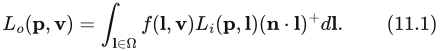

其中， 是从表面位置 p 沿观察方向 v 出射的辐亮度；Ω 是 p 上方的方向半球；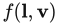 是针对 v 和当前入射方向 l 求得的 BRDF 值；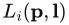 是从 l 方向入射到 p 的辐亮度； 是 l 与 n 的点积，并将负值钳制为零。

## 11.1 渲染方程

书页来源：《Real-Time Rendering》第 4 版，书页 437—440（PDF 第 458—461 页）。已核对 PDF 第 462 页的边界；该页图 11.3 及正文属于 11.2 节。

反射方程是完整渲染方程的一个受限特例。渲染方程由 Kajiya 于 1986 年提出 [846]。人们使用过不同形式的渲染方程。我们将采用以下版本：

其中新增的元素是 ，即从表面位置 p 沿方向 v 发射的辐亮度，以及下面这项替换：

这一项表示，从方向 l 入射到位置 p 的辐亮度，等于从另一个点沿相反方向 −l 出射的辐亮度。在这里，“另一个点”由光线投射函数 r(p, l) 定义。该函数返回从 p 沿方向 l 投射的光线所击中的第一个表面点的位置。见图 11.1。

**图 11.1** 待着色的表面位置 p、光照方向 l、光线投射函数 r(p, l)，以及入射辐亮度 ；后者也表示为 。

渲染方程的含义很直观。为了对表面位置 p 着色，我们需要知道从 p 沿观察方向 v 离开的出射辐亮度 。它等于发射辐亮度  加上反射辐亮度。前面的章节已经研究过光源的发射，也研究过反射。甚至光线投射算子也没有看起来那么陌生。例如，z 缓冲就为从眼睛投射到场景中的光线计算这个算子。

唯一的新项是 ，它明确表达了这样一个事实：入射到某个点的辐亮度，必然是从另一个点出射的。不幸的是，这是一个递归项。也就是说，要计算它，就又要对各个位置  的出射辐亮度求和。而这些位置又需要计算位置  的出射辐亮度，如此无穷无尽。真实世界竟然能够实时计算所有这些，实在令人惊叹。

我们凭直觉就知道，灯光照亮场景，光子在其中四处弹射，每次碰撞时都会以各种方式被吸收、反射和折射。渲染方程的重要之处在于，它用一个看似简单的方程概括了所有可能的路径。

渲染方程的一个重要性质是：它相对于发射的光照是线性的。如果把灯光的强度加倍，着色结果的亮度也会加倍。材质对每盏灯的响应也独立于其他光源。也就是说，一盏灯的存在不会影响另一盏灯与材质之间的相互作用。

在实时渲染中，通常只使用局部光照模型。计算光照只需要可见点处的表面数据，而这恰好是 GPU 能够最高效地提供的数据。各个图元被独立处理并光栅化，随后便被丢弃。在 b 点执行计算时，无法访问 a 点处的光照计算结果。透明、反射和阴影都是全局光照算法的例子。它们使用被照亮物体以外的其他物体的信息。这些效果能够大幅提高渲染图像的真实感，并提供帮助观察者理解空间关系的线索。同时，它们的模拟也很复杂，可能需要预计算，或者进行多个渲染遍次来计算一些中间信息。

**图 11.2** 一些到达眼睛的路径及其等价记法。注意，图中有两条路径从网球继续延伸。

思考光照问题的一种方式，是考虑光子所走的路径。在局部光照模型中，光子从光源传播到一个表面（忽略中间的物体），然后到达眼睛。阴影技术会考虑这些中间物体造成的直接遮挡效果。环境贴图捕获从光源传播到远处物体的光照，然后将其应用于局部的光亮物体；这些物体通过镜面反射把光送入眼睛。辐照度贴图也捕获光照对远处物体的影响，并针对每个方向在一个半球上进行积分。从所有这些物体反射的光经过加权求和，用来计算某个表面的光照，而这个表面又被眼睛看到。

以更形式化的方式思考光传输路径的不同类型和组合，有助于理解现有的各种算法。Heckbert [693] 提出了一种记法，可用于描述某种技术所模拟的路径。光子从光源（L）到眼睛（E）的旅途中，每次相互作用都可以标记为漫反射（D）或镜面反射（S）。还可以增加其他表面类型，进一步细化分类，例如“光泽”（glossy），表示表面光亮但并非镜面。见图 11.2。可以用正则表达式简要概括算法，表明它们模拟哪些类型的相互作用。基本记法汇总见表 11.1。

光子可以沿各种路径从光源到达眼睛。最简单的路径是 LE，此时眼睛直接看到光源。基本的 z 缓冲对应 L(D∣S)E，或等价地写成 LDE∣LSE。光子离开光源，到达漫反射或镜面反射表面，然后到达眼睛。注意，在基本渲染系统中，点光源没有实体表示。为光源赋予几何形状，就会得到 L(D∣S)?E 系统，在这样的系统中，光也可以直接到达眼睛。

**表 11.1** 正则表达式记法。

| 运算符 | 描述 | 示例 | 解释 |
| --- | --- | --- | --- |
| ∗ | 零次或多次 | S∗ | 零次或多次镜面反射弹射 |
| + | 一次或多次 | D+ | 一次或多次漫反射弹射 |
| ? | 零次或一次 | S? | 零次或一次镜面反射弹射 |
| ∣ | 二者择一 | D∣SS | 一次漫反射弹射，或两次镜面反射弹射 |
| () | 分组 | (D∣S)∗ | 零次或多次漫反射或镜面反射 |

如果在渲染器中加入环境映射，紧凑的表达式就不那么显而易见了。虽然 Heckbert 的记法是从光源向眼睛读的，但沿相反方向构造表达式通常更容易。眼睛首先会看到镜面反射或漫反射表面，即 (S∣D)E。如果该表面是镜面反射表面，那么它还可以选择性地反射一个已经渲染到环境贴图中的（远处的）镜面反射或漫反射表面。因此，就增加了一条可能的路径：((S∣D)?S∣D)E。为了计入眼睛直接看到光源的路径，在这个中间表达式后加上一个 ?，使其成为可选项，再在开头加上光源本身：L((S∣D)?S∣D)?E。

这个表达式可以展开为 LE∣LSE∣LDE∣LSSE∣LDSE，逐一显示所有可能的路径；也可以写成更短的 L(D∣S)?S?E。每一种形式都有助于理解其中的关系与限制。这种记法的一部分用途，在于表达算法的效果，并能够在此基础上继续构建。例如，生成环境贴图时编码的是 L(S∣D)，而随后访问这张贴图的部分则是 SE。

渲染方程本身可以概括为简单的表达式 L(D∣S)∗E，也就是说，来自光源的光子在到达眼睛之前，可以击中零个到近乎无穷多个漫反射或镜面反射表面。

全局光照研究关注的是，如何计算沿其中某些路径发生的光传输。将其用于实时渲染时，我们通常愿意牺牲一些质量或正确性，以换取高效的求值。最常见的两种策略是简化和预计算。例如，我们可以假设，除了最终到达眼睛的那一次弹射之外，之前所有的光线弹射都是漫反射；这种简化在某些环境中能够很好地发挥作用。我们也可以离线预先计算一些物体之间相互影响的信息，例如生成记录表面光照水平的纹理；然后在实时阶段，仅依赖这些存储值进行基本计算。本章将展示如何利用这些策略实时实现各种全局光照效果的例子。

## 11.2 通用全局光照

本节来源：《Real-Time Rendering, Fourth Edition》书页 441—445（PDF 第 462—466 页）；已检查 PDF 第 467 页的下一节边界。包含 11.2.1、11.2.2 及本节位于标题上方的图 11.3。

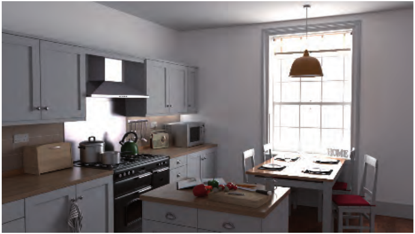

**图 11.3。** 路径追踪可以生成照片级真实感图像，但计算成本很高。上图每个像素使用了两千多条路径，每条路径最长包含 64 个线段。渲染耗时超过两小时，仍然可见少量噪声。（“Country Kitchen”模型由 Jay-Artist 制作，来自 Benedikt Bitterli Rendering Resources，采用 CC BY 3.0 许可 [149]。使用 Mitsuba 渲染器渲染。）

前面的章节重点讨论了求解反射方程的各种方法。我们假定入射辐亮度  具有某种分布，并分析它如何影响着色。本章介绍的算法旨在求解完整的渲染方程。二者的区别在于，前者忽略了辐亮度来自何处——它只是一个给定量；后者则明确说明了这一点：到达某一点的辐亮度，就是其他点发射或反射出的辐亮度。

求解完整渲染方程的算法能够生成令人惊叹的照片级真实感图像（图 11.3）。然而，这些方法的计算开销过大，无法用于实时应用。那么，为什么还要讨论它们呢？第一个原因是，在静态或部分静态的场景中，可以将这类算法作为预处理步骤运行，存储结果，以便之后在渲染时使用。例如，这在游戏中是一种常见做法；我们将讨论此类系统的不同方面。

第二个原因是，全局光照算法建立在严谨的理论基础之上。它们直接从渲染方程推导而来，对所采用的每一种近似都会进行细致分析。在设计实时解决方案时，也可以而且应该运用类似的推理方式。即使我们采取某些简化手段，也应当了解这样做的后果，以及正确的做法是什么。随着图形硬件变得更加强大，我们能够减少折中，生成更加接近正确物理结果的实时渲染图像。

求解渲染方程的两种常见途径是有限元方法和蒙特卡洛方法。辐射度算法基于第一种途径；各种形式的光线追踪则使用第二种。二者之中，光线追踪远为普及。这主要是因为，它能够在同一个框架内高效处理一般的光传输，包括体积散射等效果。它也更容易扩展和并行化。

我们将简要介绍这两种途径；有兴趣的读者可以参考详细介绍非实时条件下渲染方程求解方法的优秀著作 [400, 1413]。

### 11.2.1 辐射度

辐射度（radiosity）[566] 是计算机图形学中最早用于模拟漫反射表面之间光线反弹的技术。它的名称来自该算法所计算的物理量。经典形式的辐射度算法能够计算相互反射，以及面光源产生的软阴影。已有整部著作专门介绍这种算法 [76, 275, 1642]，不过其基本思想相对简单。光在环境中不断反弹。打开一盏灯，光照就会迅速达到平衡。在这种稳定状态下，可以将每个表面本身视为一个光源。基本的辐射度算法作出了一项简化假设：所有间接光都来自漫反射表面。对于有抛光大理石地面或墙上装有大镜子的场所，这一前提并不成立，但对许多建筑环境而言，它是合理的近似。辐射度可以追踪实际上不受次数限制的漫反射反弹。使用本章开头介绍的记法，其光传输集合为 LD*E。

辐射度假定每个表面由一定数量的面片组成。对于每一个较小的区域，它计算一个单一的平均辐射度值，因此这些面片必须足够小，才能捕捉光照的所有细节（例如阴影边缘）。不过，它们不必与底层表面三角形一一对应，甚至不必具有相同大小。

从渲染方程出发，可以推导出面片 i 的辐射度为

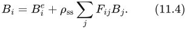

其中，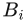 表示面片 i 的辐射度，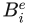 是辐射出射度，也就是面片 i 自身发出的辐射度； 是次表面反照率（第 9.3 节）。只有光源的发射量才非零。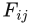 是面片 i 与 j 之间的形状因子（form factor）。形状因子的定义为

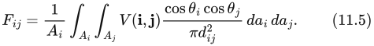

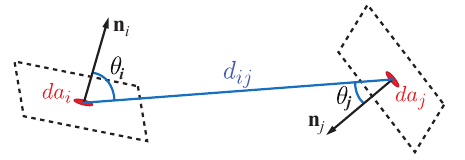

**图 11.4。** 两个表面点之间的形状因子。

其中，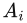 是面片 i 的面积，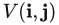 是点 **i** 与 **j** 之间的可见性函数：两点之间没有任何物体阻挡光时，函数值为 1，否则为 0。 和 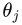 分别是两个面片的法线与连接点 **i**、**j** 的射线之间的夹角。最后，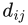 是该射线的长度。参见图 11.4。

形状因子是一个纯几何项。它表示离开面片 i 的均匀漫射辐射能量中，入射到面片 j 的那一部分所占的比例 [399]。两个面片的面积、距离和朝向，以及位于二者之间的任何表面，都会影响形状因子的值。设想用一台计算机显示器来代表一个面片。房间内的其他每个面片，都会直接接收到显示器发出的光中的某个比例。如果一个表面位于显示器背后，或者无法“看见”显示器，这个比例就可能为零。所有这些比例相加等于 1。辐射度算法的重要工作之一，就是准确确定场景中各对面片之间的形状因子。

计算出形状因子之后，将所有面片的方程（式 11.4）组合成一个线性方程组。随后求解该方程组，得到每个面片的辐射度值。随着面片数量增加，由于计算复杂度很高，对这种矩阵进行消元的成本相当可观。

由于该算法的扩展性较差，而且还有其他局限，经典辐射度算法已经很少用于生成光照解。不过，预计算形状因子，并在运行时利用它们执行某种光传播的思想，在现代实时全局光照系统中仍然很流行。本章稍后将讨论这些途径（第 11.5.3 节）。

### 11.2.2 光线追踪

光线投射（ray casting）是从某个位置发出一条射线，以确定特定方向上有哪些物体的过程。光线追踪（ray tracing）利用射线确定场景中各个元素之间的光传输。在最基本的形式中，射线从相机出发，穿过像素网格射入场景。对于每条射线，先找出它遇到的最近物体。随后，从交点向每个光源发射一条射线，查明中间是否存在任何物体，从而判断该交点是否处于阴影中。不透明物体会阻挡光，透明物体则会使光衰减。交点还可以生成其他射线。如果表面有光泽，就沿反射方向生成一条射线。这条射线获取其首先相交物体的颜色，而在那个交点处又要进行阴影检测。对于透明的实体物体，还可以沿折射方向生成射线，同样递归地进行求值。这种基本机制十分简单，以至于有人写出了可以印在一张名片背面的、具有实际功能的光线追踪器 [696]。

经典光线追踪只能提供有限的一组效果：清晰的反射和折射，以及硬阴影。然而，同样的基本原理也可以用于求解完整的渲染方程。Kajiya [846] 意识到，发射射线并计算它们携带多少光的机制，可以用于计算式 11.2 中的积分。该方程是递归的，这意味着对于每条射线，都需要在另一个位置重新计算积分。幸运的是，处理这个问题所需的坚实数学基础早已存在。蒙特卡洛方法是在曼哈顿计划期间为物理实验而发展起来的，专门用于处理这一类问题。它不通过求积规则直接计算每个着色点处的积分值，而是在积分域内若干随机点处求被积函数的值，再利用这些值估计积分值。采样点越多，精度越高。这种方法最重要的性质是，只需要在离散点处计算被积函数的值。只要时间足够，就能以任意精度计算积分。在渲染的语境下，光线追踪恰好提供了这种能力。发射射线时，我们就在对式 11.2 的被积函数进行点采样。即使交点处还有另一个积分需要计算，我们也不需要它的最终值，只需再对它进行一次点采样即可。当射线在场景中反弹时，就构建出了一条路径。沿每条路径传输的光，为被积函数提供一次求值。这个过程称为路径追踪（path tracing，图 11.5）。

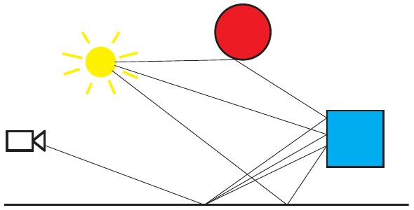

**图 11.5。** 路径追踪算法生成的示例路径。这三条路径都经过成像平面上的同一个像素，用于估计该像素的亮度。图底部的地板具有很强的光泽，会将射线反射到一个较小的立体角范围内。蓝色方盒和红色球体是漫反射表面，因此会将射线均匀地散射到交点法线周围。

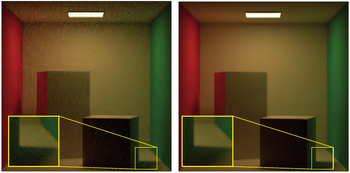

**图 11.6。** 使用蒙特卡洛路径追踪时，样本数不足所产生的噪声。左图每个像素使用 8 条路径渲染，右图每个像素使用 1024 条路径渲染。（“Cornell Box”模型来自 Benedikt Bitterli Rendering Resources，采用 CC BY 3.0 许可 [149]。使用 Mitsuba 渲染器渲染。）

追踪路径是一个极其强大的概念。路径可以用于渲染光泽材质或漫反射材质。借助路径，我们可以生成软阴影，渲染透明物体及焦散效果。将路径追踪扩展为对体积内部的点进行采样，而不只对表面采样之后，它还能处理雾和次表面散射效果。

路径追踪唯一的缺点，是达到高视觉保真度所需的计算复杂度。为了得到电影质量的图像，可能需要追踪数十亿条路径。这是因为，我们从未计算出积分的实际值，而只是在估计它。如果使用的路径太少，这种近似就会不精确，有时误差会相当大。此外，即使相邻两点的光照按理应当几乎相同，计算结果也可能相差悬殊。我们称这样的结果具有高方差。在视觉上，它表现为图像中的噪声（图 11.6）。人们已经提出许多方法，力求在不增加所追踪路径数量的情况下抑制这种现象。一种常用技术是重要性采样。其思想是：朝贡献了大部分光的那些方向发射更多射线，就能大幅降低方差。

关于路径追踪及相关方法，已有大量论文和书籍出版。Pharr 等人 [1413] 对基于光线追踪的现代离线技术作了很好的入门介绍。Veach [1815] 则为现代光传输算法的推理奠定了数学基础。本章末尾的第 11.7 节将讨论以交互速率进行的光线追踪和路径追踪。

## 11.3 环境光遮蔽

来源：《Real-Time Rendering》第 4 版，书页 446—465（PDF 物理页 467—486）。范围从 11.3 标题起，到 11.4 标题前止，包含全部下级小节；图号、公式编号和文献编号沿用原书。

上一节介绍的通用全局光照算法计算开销很大。它们能够产生种类繁多的复杂效果，但生成一幅图像可能需要数小时。我们对实时替代方案的探索，将从最简单、但视觉上仍然可信的方案开始，并在本章中逐步深入到更复杂的效果。

一种基本的全局光照效果是环境光遮蔽（ambient occlusion，AO）。这项技术由工业光魔公司的 Landis [974] 于 21 世纪初开发，用来改善电影《珍珠港》中计算机生成飞机的环境光照质量。尽管这种效果的物理基础包含相当多的简化，其结果却出人意料地可信。当光照缺乏方向变化、无法显现物体细节时，这种方法能以很低的代价提供有关形状的视觉线索。

### 11.3.1 环境光遮蔽理论

环境光遮蔽的理论基础可以直接由反射方程推导出来。为简单起见，我们首先只考虑朗伯表面。这类表面的出射辐亮度  与表面辐照度 E 成正比。辐照度是入射辐亮度经过余弦加权后的积分。一般而言，它取决于表面位置 **p** 和表面法线 **n**。同样为了简化，我们假设对于所有入射方向 **l**，入射辐亮度均为常量，即 (**l**) = 。由此得到计算辐照度的下式：

这里的积分在所有可能入射方向所构成的半球 Ω 上进行。假设照明恒定且均匀，辐照度（因此也包括出射辐亮度）就不依赖表面位置或法线，而在整个物体上保持不变。这会使物体呈现平板的外观。

式 11.6 完全没有考虑可见性。有些方向可能被物体的其他部分或场景中的其他物体挡住。这些方向的入射辐亮度将不同于 。为简单起见，我们假设被遮挡方向的入射辐亮度为零。这忽略了所有可能从场景中其他物体反弹、最终沿这些被遮挡方向到达点 **p** 的光，但大大简化了推理。于是得到下面这个最早由 Cook 和 Torrance [285, 286] 提出的方程：

其中 v(**p**, **l**) 是可见性函数：若从 **p** 沿 **l** 方向发射的射线被挡住，它等于零；否则等于一。

图 11.7　只使用恒定环境光照渲染的物体（左），以及使用环境光遮蔽渲染的物体（右）。即使光照恒定，环境光遮蔽也能显现物体细节。（“Dragon”模型由 Delatronic 制作，来自 Benedikt Bitterli Rendering Resources，采用 CC BY 3.0 许可 [149]。使用 Mitsuba 渲染器渲染。）

可见性函数经过归一化的余弦加权积分，称为环境光遮蔽：

它表示未被遮挡的半球所占的余弦加权比例。其值从零到一：完全被遮挡的表面点为零，完全没有遮挡的位置为一。需要注意，球体或盒子等凸物体不会造成自遮蔽。如果场景中没有其他物体，凸物体各处的环境光遮蔽值都为一。如果物体存在凹陷，那么这些区域的遮蔽值就会小于一。

定义  之后，存在遮蔽时的环境辐照度方程为：

注意，现在辐照度确实会随表面位置变化，因为  会变化。这会产生真实得多的结果，如图 11.7 右图所示。尖锐褶皱中的表面位置会很暗，因为这些位置的  很低。请比较图 11.8 中的表面位置  与 。表面朝向也有影响，因为可见性函数 v(**p**, **l**) 在积分时用余弦因子加权。请比较该图左侧的  与 。两者未被遮挡的立体角大小大致相同，但  的大部分未遮挡区域位于其表面法线附近，因此余弦因子较高，这从箭头的明暗可以看出。相比之下， 的大部分未遮挡区域偏向表面法线的一侧，对应的余弦因子较低。因此， 处的  较低。从这里开始，为简洁起见，我们不再显式写出对表面位置 **p** 的依赖。

图 11.8　环境照明下的一个物体。图中标出三个点（、 和 ）。左图中，被挡住的方向用终止于交点（黑色圆点）的黑色射线表示。未被挡住的方向用箭头表示，并按余弦因子着色，因此越接近表面法线的箭头越亮。右图中，每个蓝色箭头都表示平均未遮挡方向，即弯曲法线。

除  外，Landis [974] 还计算平均未遮挡方向，称为弯曲法线（bent normal）。这一方向向量通过对未遮挡的入射光方向求余弦加权平均得到：

记号 ‖**x**‖ 表示向量 **x** 的长度。将积分结果除以它自身的长度，就得到归一化结果。参见图 11.8 右图。在着色时，可以用得到的向量替代几何法线，以提供更准确的结果，而不增加性能开销（第 11.3.7 节）。

### 11.3.2 可见性与遮暗

用来计算环境光遮蔽因子 （式 11.8）的可见性函数 v(**l**) 需要仔细定义。对于角色或车辆这样的物体，可以很直接地根据从某个表面位置沿 **l** 方向发射的射线是否与同一物体的其他部分相交来定义 v(**l**)。但这没有计入附近其他物体造成的遮蔽。在照明计算中，通常可以假定该物体放在一个平面上。将这个平面包含在可见性计算中，就能得到更真实的遮蔽。另一个好处是，物体对地平面的遮蔽可以用作接触阴影 [974]。

遗憾的是，这种可见性函数方法对封闭几何体会失效。设想一个由封闭房间及其中各种物体组成的场景。所有表面的  都为零，因为从表面发出的所有射线都会碰到某个东西。对于这类场景，尝试复现环境光遮蔽外观、但不一定模拟物理可见性的经验方法往往效果更好。其中一些方法受到 Miller 的可达性着色（accessibility shading）概念 [1211] 的启发；它模拟表面角落和缝隙如何积聚污垢或受到腐蚀。

图 11.9　环境光遮蔽与遮暗之间的区别。左侧飞船的遮蔽使用无限长射线计算，右图使用有限长度的射线。（“4060.b Spaceship”模型由 thecali 制作，来自 Benedikt Bitterli Rendering Resources，采用 CC BY 3.0 许可 [149]。使用 Mitsuba 渲染器渲染。）

Zhukov 等人 [1970] 引入了遮暗（obscurance）的概念：将可见性函数 v(**l**) 替换为距离映射函数 ρ(**l**)，从而修改环境光遮蔽的计算：

v(**l**) 只有两个有效值，无交点时为 1，有交点时为 0；与之不同，ρ(**l**) 是一个连续函数，取决于射线在与表面相交前所行进的距离。当交点距离为 0 时，ρ(**l**) 为 0；当交点距离大于指定距离 ，或者完全没有交点时，其值为 1。无需检测  之外的交点，这能显著加快  的计算。图 11.9 展示了环境光遮蔽与环境遮暗的区别。注意，使用环境光遮蔽渲染的图像明显更暗。这是因为即使很远处的交点也会被检测到，进而影响  的值。

尽管有人尝试从物理角度为它提供依据，遮暗并不符合物理规律。不过，它常常能给出符合观看者预期的可信结果。一个缺点是，必须手动设定  才能得到令人满意的效果。计算机图形学中经常会出现这种折中：一种技术没有直接的物理基础，却“在感知上令人信服”。目标通常是可信的图像，因此使用这样的技术没有问题。话虽如此，基于理论的方法也有一些优势：它们能够自动工作，而且可以通过推理真实世界的运作方式来进一步改进。

### 11.3.3 计入相互反射

图 11.10　不考虑与考虑相互反射时的环境光遮蔽差异。左图只使用可见性信息。右图还使用了一次反弹的间接光照。（“Victorian Style House”模型由 MrChimp2313 制作，来自 Benedikt Bitterli Rendering Resources，采用 CC BY 3.0 许可 [149]。使用 Mitsuba 渲染器渲染。）

尽管环境光遮蔽产生的结果在视觉上可信，它们仍比完整全局光照模拟的结果更暗。请比较图 11.10 中的图像。

环境光遮蔽与完整全局光照之间的一个重要差异来源是相互反射。式 11.8 假定被遮挡方向的辐亮度为零，而实际上相互反射会让这些方向产生非零辐亮度。与图 11.10 右侧模型相比，这种影响表现为左侧模型褶皱和凹坑中的变暗。可以通过增大  来弥补这一差异。使用遮暗的距离映射函数替代可见性函数（第 11.3.2 节）也能缓解这一问题，因为遮暗函数对于被遮挡方向的取值通常大于零。

更准确地跟踪相互反射很昂贵，因为这需要求解一个递归问题。要对一个点着色，就必须先对其他点着色，以此类推。计算  比完整全局光照计算便宜得多，但通常仍希望以某种形式补上这部分缺失的光，以免过度变暗。Stewart 和 Langer [1699] 提出一种低成本、却出人意料地准确的相互反射近似方法。它依据这样的观察：对于漫射照明下的朗伯场景，从给定位置能够看到的表面位置往往具有相近的辐亮度。假定来自被遮挡方向的辐亮度  等于当前着色点的出射辐亮度 ，就可以打破递归，并得到解析表达式：

其中  是次表面反照率，也就是漫反射率。这等价于用一个新的因子  替换环境光遮蔽因子 ：

这个方程倾向于提高环境光遮蔽因子，使视觉结果更接近包含相互反射的完整全局光照解。其效果高度依赖  的值。底层近似假定着色点附近的表面颜色相同，从而产生一种有些类似颜色渗透的效果。Hoffman 和 Mitchell [755] 使用这种方法，以天空光照亮地形。

Jimenez 等人 [835] 提出了另一种方案。他们对若干场景执行完整的离线路径追踪，每个场景都由均匀白色、位于无限远处的环境贴图照明，以获得正确计入相互反射的遮蔽值。根据这些示例，他们拟合三次多项式来近似函数 f；该函数将环境光遮蔽值  和次表面反照率  映射为受相互反射光提亮后的遮蔽值 。他们的方法也假定反照率在局部恒定，因此可以根据给定点的反照率推导入射反弹光的颜色。

### 11.3.4 预计算环境光遮蔽

计算环境光遮蔽因子可能很耗时，因此常在渲染之前离线执行。预先计算任何与光照有关的信息，包括环境光遮蔽，这一过程通常称为烘焙（baking）。

预计算环境光遮蔽最常见的方法是蒙特卡洛方法。发射射线并检查它们与场景的交点，对式 11.8 进行数值求值。例如，设我们在法线 **n** 周围的半球上选取 N 个均匀分布的随机方向 **l**，并沿这些方向追踪射线。根据相交结果求出可见性函数 v。于是环境光遮蔽可计算为：

> 译注：式 11.14 忠实保留原书。按照正文所述“在半球上均匀分布”的采样以及式 11.8 的归一化，蒙特卡洛估计的前因子应为 2/N；原式的 1/N 疑似漏了因子 2。此处不暗改原式。

计算环境遮暗时，可以把发射射线限制在最大距离内，并根据找到的交点距离确定 v 的值。

环境光遮蔽或遮暗因子的计算包含余弦加权因子。虽然可以像式 11.14 那样直接把它乘进去，但更有效的方式是通过重要性采样引入该权重。与其在半球上均匀发射射线，再对结果进行余弦加权，不如直接对射线方向的分布进行余弦加权。换言之，射线更可能沿接近表面法线的方向发射，因为这些方向的结果往往更重要。这种采样方案称为 Malley 方法。

环境光遮蔽的预计算既可以在 CPU 上执行，也可以在 GPU 上执行。两种平台都有能加速复杂几何体射线投射的库。其中最流行的两个是面向 CPU 的 Embree [1829] 和面向 GPU 的 OptiX [951]。过去也曾使用 GPU 流水线的结果，例如深度图 [1412] 或遮挡查询 [493]，来计算环境光遮蔽。随着更通用的 GPU 射线投射方案越来越普及，如今这些方法的使用已减少。大多数商业建模与渲染软件都提供预计算环境光遮蔽的选项。

物体上每个点的遮蔽数据都是独有的。它们通常存储在纹理、体数据或网格顶点中。无论存储哪一种信号，各种存储方法的特点和问题都相似。相同的方法也可以用来存储环境光遮蔽、方向性遮蔽或预计算光照，详见第 11.5.4 节。

预计算数据还可以用来模拟物体彼此之间的环境光遮蔽效果。Kontkanen 和 Laine [924, 925] 把物体对周围环境的遮蔽效果存储在立方体贴图中，称为环境光遮蔽场（ambient occlusion field）。他们用一个二次多项式的倒数，描述环境光遮蔽值随到物体距离的变化。其系数存储在立方体贴图中，以模拟遮蔽随方向的变化。运行时，根据遮挡物的距离和相对位置提取合适的系数，并重建遮蔽值。

Malmer 等人 [1111] 将环境光遮蔽因子以及可选的弯曲法线存储在一个称为环境光遮蔽体（ambient occlusion volume）的三维网格中，获得了更好的结果。计算需求更低，因为环境光遮蔽因子直接从纹理读取，而无需计算。相比 Kontkanen 和 Laine 的方法，它存储的标量更少；两种方法使用的纹理分辨率都较低，因此总体存储需求相近。Hill [737] 和 Reed [1469] 描述了 Malmer 等人的方法在商业游戏引擎中的实现。他们讨论了算法的多种实际问题及有用的优化。这两种方法都面向刚性物体，但也可以扩展到只有少量活动部件的关节式物体，只需把每个部件看作独立物体。

无论选择哪种方法存储环境光遮蔽值，都必须意识到，我们处理的是连续信号。从空间某一点发射射线时，我们在进行采样；在着色之前根据这些结果插值出一个值时，我们在进行重建。信号处理领域的所有工具都可以用于提高采样与重建过程的质量。Kavan 等人 [875] 提出一种称为最小二乘烘焙（least-squares baking）的方法。先在整个网格上均匀采样遮蔽信号，再推导顶点值，使插值结果与采样结果之间的总差异在最小二乘意义下达到最小。他们专门在顶点数据存储的背景下讨论该方法，但同样的推理也可以用于推导要存储到纹理或体数据中的值。

图 11.11　《命运》在间接光照计算中使用预计算环境光遮蔽。这一方案用于两个不同硬件世代的游戏版本，兼顾了高质量与高性能。（图像 ©2013 Bungie, Inc.，保留所有权利。）

《命运》是一款备受好评的游戏，它以预计算环境光遮蔽作为间接光照方案的基础（图 11.11）。该游戏在两代主机硬件交替时期发行，需要一种既满足新平台高质量预期、又适应旧平台性能及内存限制的方案。游戏中一天内的时间动态变化，因此任何预计算方案都必须正确考虑这一点。开发者因环境光遮蔽外观可信且成本低而选择了它。由于环境光遮蔽把可见性计算与光照分离，无论一天中的哪个时间都可以使用同一份预计算数据。Sloan 等人 [1658] 描述了完整系统，包括基于 GPU 的烘焙流水线。

育碧的《刺客信条》[1692] 与《孤岛惊魂》[1154] 系列，也使用某种形式的预计算环境光遮蔽来补充其间接光照方案。它们从俯视视角渲染世界，并处理得到的深度图，计算大尺度遮蔽。通过各种启发式方法，根据邻近深度样本的分布估计遮蔽值。把物体的世界空间位置投影到纹理空间，就能将得到的世界空间 AO 贴图应用于所有物体。他们把这种方法称为 World AO。Swoboda [1728] 也描述了一种类似的方法。

### 11.3.5 动态计算环境光遮蔽

对于静态场景，环境光遮蔽因子  和弯曲法线  可以预计算。但对于物体正在移动或改变形状的场景，即时计算这些因子能得到更好的结果。这类方法可以分成两组：在物体空间中工作的方法，以及在屏幕空间中工作的方法。

离线环境光遮蔽计算方法通常从每个表面点向场景发射大量射线，数量从几十条到几百条不等，并检查是否相交。这是一项昂贵的操作，因此实时方法重点研究如何近似或避免其中的大部分计算。

Bunnell [210] 把表面建模为放置在网格顶点上的一组圆盘状元素，从而计算环境光遮蔽因子  和弯曲法线 。选择圆盘，是因为一个圆盘对另一个圆盘的遮蔽可以解析计算，从而无需投射射线。简单地将其他所有圆盘对某个圆盘的遮蔽因子相加，会因重复阴影而得到过暗的结果。也就是说，如果一个圆盘位于另一个圆盘后面，两者都会被计为遮挡表面，尽管本来只应计入较近的圆盘。Bunnell 使用一种巧妙的两遍方法来避免这一问题。第一遍计算包含重复阴影的环境光遮蔽；第二遍根据第一遍算出的每个圆盘所受的遮蔽，降低该圆盘的贡献。这是一种近似，但实际结果令人信服。

计算每一对元素之间的遮蔽，是  量级的操作，除最简单的场景外，开销都过高。对远处表面使用简化表示可以降低成本。Bunnell 为元素构建一棵层次树，其中每个节点都是一个圆盘，代表树中其下方圆盘的聚合。计算圆盘之间的遮蔽时，对更远处的表面使用更高层节点。这将计算量降低到合理得多的 O(n log n)。Bunnell 的技术相当高效，并能产生高质量结果。例如，它曾用于《加勒比海盗》系列电影的最终渲染 [265]。

Hoberock [751] 对 Bunnell 的算法提出若干修改，以更高的计算开销换取质量提升。他还给出一个距离衰减因子，产生的结果与 Zhukov 等人 [1970] 提出的遮暗因子相似。

Evans [444] 描述了一种基于有符号距离场（signed distance field，SDF）的动态环境光遮蔽近似方法。在这种表示中，物体嵌入一个三维网格。网格的每个位置存储到物体最近表面的距离。处于任意物体内部的点取负值，处于所有物体外部的点取正值。Evans 为场景创建 SDF，并将其存储在体纹理中。为了估计物体上某个位置的遮蔽，他使用一种启发式方法，组合沿法线、距离表面逐渐增大的一些采样点的值。当 SDF 以解析形式表示（第 17.3 节）、而非存储在三维纹理中时，也能采用相同的方法，Quílez [1450] 对此进行了介绍。虽然该方法不符合物理规律，但结果在视觉上令人满意。

Wright [1910] 进一步扩展了将有符号距离场用于环境光遮蔽的方法。他没有使用临时设计的启发式规则来生成遮蔽值，而是执行锥体追踪。锥体起于正在着色的位置，并与距离场中编码的场景表示进行相交测试。锥体追踪通过沿轴线前进若干步来近似：每一步都检查 SDF 与一个半径不断增大的球体是否相交。如果到最近遮挡物的距离（从 SDF 采样得到的值）小于球体半径，锥体的这一部分便被遮挡（图 11.12）。只追踪单个锥体不够精确，而且无法纳入余弦项。因此，Wright 追踪一组覆盖整个半球的锥体，以估计环境光遮蔽。为了提高视觉保真度，他的方案不仅使用场景的全局 SDF，还使用表示单个物体或逻辑上相连的一组物体的局部 SDF。

图 11.12　通过让场景几何体与半径逐渐增大的球体执行一系列相交测试，来近似锥体追踪。球体的大小对应于距追踪起点给定距离处的锥体半径。每一步都减小锥角，以计入场景几何体造成的遮蔽。最终遮蔽因子估计为裁剪后锥体所张立体角与原始锥体立体角之比。

Crassin 等人 [305] 在场景体素表示的背景下描述了类似方法。他们使用稀疏体素八叉树（第 13.10 节）存储场景体素化的结果。他们的环境光遮蔽计算算法，是一种用于渲染完整全局光照效果的更通用方法的特殊情况（第 11.5.7 节）。

图 11.13　环境光遮蔽效果是模糊的，不会显现遮挡物的细节。AO 计算可以使用简单得多的几何表示，仍然产生可信效果。犰狳模型（左）用一组球体（右）近似。两个模型在身后墙面上投下的遮蔽几乎没有区别。（模型由斯坦福计算机图形学实验室提供。）

Ren 等人 [1482] 把遮挡几何体近似为球体集合（图 11.13）。表面点被单个球体遮挡时的可见性函数用球谐函数表示。被一组球体遮挡时的总可见性函数，是各个球体可见性函数相乘的结果。遗憾的是，计算球谐函数乘积是一项昂贵的操作。他们的关键思路是，将各个球谐可见性函数的对数相加，再对结果求指数。这样得到的最终结果与可见性函数直接相乘相同，但球谐函数求和的成本远低于相乘。论文表明，采用合适的近似后，对数与指数运算可以快速完成，从而实现整体加速。

这种方法计算的不只是环境光遮蔽因子，而是以球谐函数表示的完整球面可见性函数（第 10.3.2 节）。第一个系数（0 阶）可以用作环境光遮蔽因子 ，接下来的三个系数（1 阶）可以用来计算弯曲法线 。更高阶的系数可以用于环境贴图或圆形光源的阴影。由于几何体近似为包围球，褶皱和其他细小细节造成的遮蔽不会被模拟。

Sloan 等人 [1655] 在屏幕空间中累加 Ren 所描述的可见性函数。对于每个遮挡物，他们考虑到其中心的世界空间距离位于指定范围内的一组像素。可以通过渲染一个球体，并在着色器中执行距离测试或使用模板测试，来实现这一操作。对于所有受影响的屏幕区域，将适当的球谐值加到离屏缓冲区。在累加完所有遮挡物的可见性后，对缓冲区中的值求指数，便得到每个屏幕像素最终的组合可见性函数。Hill [737] 使用相同的方法，但将球谐可见性函数限制为仅使用二阶系数。在这一假设下，球谐乘积只需少量标量乘法，甚至可以由 GPU 的固定功能混合硬件执行。因此，即使性能有限的主机硬件也能使用该方法。由于采用低阶球谐函数，它无法生成边界更清晰的硬阴影，而只能产生大体没有方向性的遮蔽。

### 11.3.6 屏幕空间方法

物体空间方法的开销与场景复杂度成正比。不过，仅凭已经可用的屏幕空间数据，例如深度和法线，也能推断出某些遮蔽信息。这类方法的成本恒定，与场景有多少细节无关，只取决于渲染分辨率。注1

**注1：** 实际上，执行时间仍取决于深度或法线缓冲区中数据的分布，因为这种分布会影响遮蔽计算逻辑利用 GPU 缓存的效率。

Crytek 开发了一种动态屏幕空间环境光遮蔽（screen-space ambient occlusion，SSAO）方法，用于《孤岛危机》[1227]。他们在一个全屏处理遍中计算环境光遮蔽，唯一的输入是 z 缓冲区。通过对像素位置周围一个球体内分布的一组点与 z 缓冲区进行测试，估计该像素的环境光遮蔽因子 。 是位于相应 z 缓冲值前方的样本数量的函数。通过测试的样本越少， 就越低。参见图 11.14。样本的权重随到该像素的距离增加而减小，类似于遮暗因子 [1970]。注意，由于样本没有用  因子加权，得到的环境光遮蔽并不正确。它没有只考虑表面位置上方半球内的样本，而是将全部样本统计并计入。这一简化意味着表面下方本不该参与的样本也被计入，导致平坦表面变暗，而边缘比周围更亮。尽管如此，其结果通常仍然具有令人满意的视觉效果。参见图 11.15。

图 11.14　将 Crytek 的环境光遮蔽方法应用于三个表面点（黄色圆点）。为清楚起见，图中以二维形式展示算法，摄像机（未画出）位于图的上方。本例在每个表面点周围的圆盘内分布十个样本（实际是在球体内分布）。未通过 z 测试的样本，即位于已存储 z 缓冲值之后的样本，显示为红色；通过的样本显示为绿色。 是通过测试样本数占总样本数比例的函数。为简化说明，这里忽略可变的样本权重。左侧点的 10 个样本中有 6 个通过测试，比值为 0.6，据此计算 。中间的点有三个通过测试的样本；另一个样本虽位于物体外部，却未通过 z 测试，如红色箭头所示。由此得到  为 0.3。右侧点只有一个样本通过，因此  为 0.1。

图 11.15　左上展示屏幕空间环境光遮蔽效果。右上展示没有环境光遮蔽的反照率（漫反射颜色）。左下将两者组合。再加入镜面着色与阴影，就得到右下的最终图像。（《孤岛危机》图像由 Crytek 提供。）

Shanmugam 和 Arikan [1615] 同期开发了一种类似方法。他们的论文描述了两种方案：一种从附近的小细节生成精细的环境光遮蔽，另一种从较大的物体生成粗略的环境光遮蔽。将两者结果组合，得到最终环境光遮蔽因子。他们的细尺度环境光遮蔽方法使用一个全屏处理遍，访问 z 缓冲区以及另一个包含可见像素表面法线的缓冲区。对于每个待着色像素，从 z 缓冲区采样附近像素。把采样像素表示为球体，并在考虑待着色像素法线的情况下，为其计算遮蔽项。它没有处理重复阴影，因此结果有些偏暗。他们的粗尺度遮蔽方法与书页 456 讨论的 Ren 等人 [1482] 的物体空间方法相似，都把遮挡几何体近似为球体集合。但 Shanmugam 和 Arikan 在屏幕空间中累加遮蔽，使用与屏幕对齐的公告板覆盖每个遮挡球的“影响区域”。与 Ren 等人的方法不同，粗尺度遮蔽方法同样没有处理重复阴影。

这两种方法极为简单，很快就引起工业界与学术界的注意，催生了大量后续研究。许多方法，例如 Filion 等人 [471] 用于《星际争霸 II》的方法，以及 McGuire 等人 [1174] 的可扩展环境遮暗（scalable ambient obscurance），都使用特设的启发式规则来生成遮蔽因子。这类方法性能良好，并提供一些可手动调节的参数，以获得预期的艺术效果。

另一些方法则试图为遮蔽计算提供更有理论依据的方式。Loos 和 Sloan [1072] 注意到，Crytek 的方法可以解释为蒙特卡洛积分。他们将计算得到的值称为体积遮暗（volumetric obscurance），定义为：

其中 X 是该点周围的三维球形邻域，ρ 是类似于式 11.11 的距离映射函数，d 是距离函数，o(**x**) 是占据函数：**x** 未被占据时为零，否则为一。他们指出，ρ(d) 函数对最终视觉质量影响很小，因此使用常量函数。在这一假设下，体积遮暗就是在一点的邻域内对占据函数求积分。Crytek 的方法通过随机采样三维邻域来计算该积分。Loos 和 Sloan 则通过随机采样像素的屏幕空间邻域，在 x、y 维度上进行数值积分，而在 z 维度上进行解析积分。如果该点的球形邻域内没有任何几何体，积分就等于射线与表示 X 的球体相交所形成线段的长度。存在几何体时，将深度缓冲区用作占据函数的近似，并只在每条线段未被占据的部分求积分。参见图 11.16 左图。该方法生成的结果质量与 Crytek 的方法相当，但所需样本更少，因为其中一个维度上的积分是精确的。如果有表面法线可用，还能扩展该方法，将法线考虑在内。在这一版本中，线积分的求值范围截断于求值点法线定义的平面。

> 译注：原书式 11.15 及紧随其后的定义令 o 在“被占据”时为 1，但后文及图 11.16 描述的却是对“未被占据”部分积分，两处约定不一致。这里分别按原文保留；若按后文计算未占据体积，应使用占据函数的补函数 1 − o。

Szirmay-Kalos 等人 [1733] 提出另一种利用法线信息的屏幕空间方案，称为体积环境光遮蔽（volumetric ambient occlusion）。式 11.6 在法线周围的半球上积分，并包含余弦项。他们提出，可以从被积函数中去掉余弦项，再用余弦分布限制积分范围，从而近似这类积分。这会把半球上的积分变成球体上的积分：这个球体半径减半，并沿法线平移，使其完全位于原半球内部。其未占据部分的体积按照 Loos 和 Sloan 的方法计算，即随机采样像素邻域，并在 z 维度上对占据函数作解析积分。参见图 11.16 右图。

图 11.16　体积遮暗（左）利用线积分，估计点周围未占据体积的积分。体积环境光遮蔽（右）也使用线积分，不过是计算与着色点相切的球体的占据情况，从而模拟反射方程中的余弦项。两种情况下，积分均由球体未占据体积（绿色实线所标）与球体总体积之比估计；总体积是未占据体积与被占据体积之和，后者用红色虚线标出。两图的摄像机均从上方观察。绿色圆点表示从深度缓冲区读取的样本，黄色圆点是正在计算遮蔽的样本。

Bavoil 等人 [119] 针对局部可见性估计问题提出另一种方法，其灵感来自 Max [1145] 的地平线映射技术。他们的方法称为基于地平线的环境光遮蔽（horizon-based ambient occlusion，HBAO），假设 z 缓冲区的数据表示一个连续高度场。可以通过确定地平线角来估计一点的可见性；地平线角就是邻域在切平面上方遮挡到的最大角度。也就是说，从一点沿给定方向观察，记录可见最高物体的角度。如果忽略余弦项，环境光遮蔽因子可以通过对地平线上方未遮挡部分积分得到，或者等价地，以一减去地平线下方被遮挡部分的积分：

其中 h(φ) 是切平面上方的地平线角，t(φ) 是切平面与视向量之间的切线角，W(ω) 是衰减函数。参见图 11.17。1/(2π) 项对积分归一化，使结果位于零与一之间。

> 译注：式 11.16 的内层积分下限原书印为 α = t(φ)，而积分变量写作 θ；二者不一致，疑似排印问题。此处保留原式。该式中的 cos(θ) 是此坐标参数化的积分权重，不应与前文所说忽略的表面法线余弦加权项混同。

对于给定 φ，按到定义地平线的点的距离采用线性衰减，就可以解析计算内层积分：

剩余积分通过采样若干方向并求取地平线角来进行数值计算。

图 11.17　基于地平线的环境光遮蔽（左）寻找切平面上方的地平线角 h，并对它们之间未遮挡的角度积分。切平面与视向量之间的角记为 t。真值环境光遮蔽（右）使用相同的地平线角  和 ，但还利用法线与视向量之间的夹角 γ，把余弦项纳入计算。两图中摄像机均从上方观察场景。图中展示的是截面；地平线角是 φ 的函数，φ 是绕观察方向的角度。绿色圆点表示从深度缓冲区读取的样本；黄色圆点表示正在计算遮蔽的样本。

Jimenez 等人 [835] 也采用基于地平线的思路，并将其方法称为真值环境光遮蔽（ground-truth ambient occlusion，GTAO）。他们的目标是在唯一可用信息为 z 缓冲数据所形成高度场的假设下，得到与射线追踪结果一致的真值结果。HBAO 的定义没有包含余弦项，还加入了式 11.8 中不存在的特设衰减，因此它的结果虽然接近射线追踪，却并不相同。GTAO 补入缺少的余弦因子，去掉衰减函数，并在围绕视向量的参考系中表述遮蔽积分。遮蔽因子定义为：

其中  和  是给定 φ 时左右两侧的地平线角，γ 是法线与观察方向之间的夹角。由于包含余弦项，归一化项 1/π 与 HBAO 不同；余弦项使开放半球上的积分等于 π，而不包含余弦项时积分等于 2π。在高度场假设下，这一表述与式 11.8 完全一致。参见图 11.17。内层积分仍可解析求解，因此只需数值计算外层积分。积分方式与 HBAO 相同，即在给定像素周围采样若干方向。

在基于地平线的方法中，开销最大的部分是沿屏幕空间直线采样深度缓冲区，以确定地平线角。Timonen [1771] 提出一种专门改善这一步性能的方法。他指出，对于沿屏幕空间直线排列的像素，用来估计给定方向地平线角的样本可以大量复用。他将遮蔽计算分成两步。首先，在整个 z 缓冲区上进行直线追踪。沿直线前进的每一步，他都在考虑指定最大影响距离的同时更新地平线角，并将信息写入缓冲区。对于地平线映射采用的每个屏幕空间方向，都建立这样一个缓冲区。这些缓冲区不必与原深度缓冲区大小相同。其大小取决于直线间距以及沿线步进间距；选择这些参数时有一定灵活性，不同设置会影响最终质量。

第二步，根据缓冲区存储的地平线信息计算遮蔽因子。Timonen 使用 HBAO 定义的遮蔽因子（式 11.17），但也可以替换成其他遮蔽估计器，例如 GTAO（式 11.18）。

深度缓冲区并不是场景的完美表示，因为它只记录给定方向上最近的物体，我们不知道物体后面是什么。许多方法使用各种启发式规则，尝试推断可见物体的厚度信息。这些近似足以应付许多情况，而且人眼能够容忍一定误差。虽然也有使用多层深度来缓解问题的方法，但由于与渲染引擎集成复杂、运行成本高，它们始终未能广泛普及。

屏幕空间方法依靠反复采样 z 缓冲区，为给定点周围的几何体构建某种简化模型。实验表明，要达到较高视觉质量，可能需要多达几百个样本。然而，为了用于交互式渲染，通常最多只能采用 10—20 个样本，往往还更少。Jimenez 等人 [835] 报告，为了满足 60 FPS 游戏的性能预算，他们每像素只能负担一个样本！为了缩小理论与实践的差距，屏幕空间方法通常采用某种空间抖动。最常见的形式是每个屏幕像素使用略有不同的一组随机样本，对样本作旋转或径向位移。在 AO 主计算阶段之后，再执行一次全屏滤波。采用联合双边滤波（第 12.1.1 节），避免跨越表面不连续处进行滤波，并保留锐利边缘。它利用已有的深度或法线信息，把参与滤波的样本限制为属于同一表面的样本。有些方法使用随机变化的采样模式以及通过实验选出的滤波核；另一些方法则在固定大小的屏幕空间模式（例如 4 × 4 像素）中重复使用样本集，并将滤波器限制在这一邻域内。

环境光遮蔽计算还经常沿时间进行超采样 [835, 1660, 1916]。通常的做法是每帧采用不同采样模式，并对遮蔽因子进行指数平均。利用上一帧的 z 缓冲区、摄像机变换以及动态物体运动信息，将上一帧数据重投影到当前视图，再与当前帧的结果混合。通常采用基于深度、法线或速度的启发式规则，检测上一帧数据不可靠、应予丢弃的情况，例如新物体进入视野。第 5.4.2 节在更一般的背景下解释了时间超采样与抗锯齿技术。时间滤波成本低，也容易实现；虽然它并非始终完全可靠，但实际中大多数问题并不明显。这主要是因为环境光遮蔽从不直接显示，而只是光照计算的一个输入。将这种效果与法线贴图、反照率纹理以及直接光照组合之后，细小伪影会被掩盖，不再可见。

### 11.3.7 使用环境光遮蔽着色

尽管我们是在恒定、远距离照明的背景下推导环境光遮蔽值，也可以将它应用于更复杂的光照情形。再次考虑反射方程：

上式包含第 11.3.1 节引入的可见性函数 v(**l**)。如果处理的是漫反射表面，可以用朗伯 BRDF 替换 f(**l**, **v**)，它等于次表面反照率  除以 π。于是得到：

对上式改写，可得：

利用式 11.8 中环境光遮蔽的定义，上式简化为：

其中：

这种形式为理解这一过程提供了新的角度。式 11.22 的积分可以看作向入射辐亮度  应用方向性滤波核 K。滤波器 K 随空间位置与方向发生复杂变化，但具有两个重要性质。第一，由于点积被截断，它最多只覆盖点 **p** 处法线周围的半球。第二，由于分母的归一化因子，它在半球上的积分等于一。

为了着色，需要计算两个函数乘积的积分，这两个函数分别为入射辐亮度  和滤波函数 K。在某些情况下，可以简化描述滤波器，以较低成本计算这一双函数乘积积分，例如  和 K 都用球谐函数表示时（第 10.3.2 节）。处理该方程复杂性的另一种方式，是用性质相近、但更简单的滤波器进行近似。最常见的选择是归一化余弦核 H：

当没有任何东西阻挡入射光照时，这一近似是准确的。它覆盖的角度范围也与被近似的滤波器相同。它完全忽略可见性，但式 11.22 中仍然存在环境光遮蔽项 ，因此着色表面上仍会出现一定程度的、取决于可见性的变暗。

选择这一滤波核后，式 11.22 变为：

这意味着，最简单形式的环境光遮蔽着色，只需计算辐照度，再乘以环境光遮蔽值。辐照度可以来自任何来源，例如从辐照度环境贴图采样（第 10.6 节）。这种方法的准确性只取决于近似滤波器对正确滤波器的拟合程度。对于在球面上平滑变化的光照，该近似能够给出可信结果。如果所有可能方向上的  都相同，也就是场景仿佛被一幅全白的环境贴图照明，那么它也完全准确。

这一表述也有助于理解，为什么环境光遮蔽不能很好地近似点状光源或小面积光源的可见性。它们在表面上只张成很小的立体角；对点状光源而言，立体角为无穷小。可见性函数会对光照积分值产生重要影响。它几乎以二值方式控制光的贡献，即要么完全启用，要么完全禁用。像式 11.25 那样忽略可见性，是一种相当大的近似，通常无法产生预期结果。阴影缺乏清晰度，也没有预期的方向性，也就是说，它们看起来不像由某个特定光源产生。环境光遮蔽并不适合模拟这类光源的可见性，应改用阴影贴图等其他方法。不过，有时会用小型局部光源来模拟间接照明，在这种情况下，用环境光遮蔽值调制其贡献是合理的。

到目前为止，我们都假定正在为朗伯表面着色。当处理更复杂、非常量的 BRDF 时，就不能像式 11.20 那样把该函数移到积分之外。对于镜面材质，K 不仅依赖可见性和法线，还依赖观察方向。典型微表面 BRDF 的波瓣在定义域内变化显著。用一个预先确定的单一形状近似它过于粗糙，无法产生可信结果。这就是为什么环境光遮蔽最适合用于漫反射 BRDF 着色。接下来各节讨论的其他方法，更适合复杂的材质模型。

使用弯曲法线（参见书页 448 的式 11.10）可以看作更精确地近似滤波器 K 的方式。滤波器中仍然没有可见性项，但它的最大值方向与平均未遮挡方向一致，因此总体上对式 11.23 的近似稍好一些。当几何法线与弯曲法线不一致时，使用后者会得到更准确的结果。Landis [974] 不仅将它用于环境贴图着色，还将它用于某些直接光源，替代常规阴影技术。

对于环境贴图着色，Pharr [1412] 提出另一种方案，利用 GPU 的纹理滤波硬件动态执行滤波。滤波器 K 的形状即时确定：其中心位于弯曲法线方向，大小取决于  的值。这能更精确地匹配式 11.23 中的原始滤波器。

## 11.4 方向性遮蔽

来源：原书第 465—472 页（PDF 第 486—493 页）；图 11.21 及图注续见原书第 473 页（PDF 第 494 页）。正文从 11.4 标题起，止于 11.5 标题前。

尽管仅使用环境光遮蔽就能极大地提高图像的视觉质量，但它仍是一个大幅简化的模型。即使面对大型面光源，它对可见性的近似也很差，更不用说小型光源或点状光源了。它也无法正确处理光泽 BRDF 或更复杂的光照配置。设想一个表面受到远处穹顶光源的照射，穹顶上的颜色从红色逐渐变为绿色。这可以表示天空光照亮地面的情形；考虑到这些颜色，这大概发生在某颗遥远的行星上。见图 11.18。虽然环境光遮蔽会使 a 点和 b 点的光照变暗，但这两点仍然都会受到天空红色部分与绿色部分的照射。使用弯曲法线有助于缓解这一现象，但也不完美。前面介绍的简单模型不够灵活，无法应对这种情形。一种解决办法是用表达能力更强的方式描述可见性。

我们将着重讨论对整个球面或半球面可见性进行编码的方法，也就是描述哪些方向会阻挡入射辐亮度的方法。虽然这些信息可以用于为点状光源生成阴影，但这并非其主要用途。专门针对这些光源类型的方法（第 7 章已详细讨论）能够获得好得多的质量，因为它们只需对光源的一个位置或一个方向编码可见性。这里介绍的方案主要用于大型面光源或环境光照的遮蔽；在这些情况下，产生的阴影较柔和，近似可见性所造成的瑕疵并不明显。此外，在常规阴影技术不可行时，也可以用这些方法提供遮蔽，例如凹凸贴图细节的自阴影，或者极大场景中的阴影；对于后一种情形，阴影贴图的分辨率往往不足。

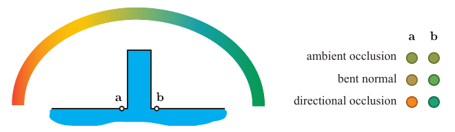

**图 11.18**　在复杂光照条件下，a 点和 b 点处辐照度的近似颜色。环境光遮蔽不建模任何方向性，因此两点的颜色相同。使用弯曲法线实际上会把余弦波瓣移向天空中未被遮挡的部分，但由于积分范围未受到任何限制，这仍不足以给出准确结果。方向性方法能够正确地剔除来自天空被遮挡部分的光照。图内标签自上而下为：环境光遮蔽、弯曲法线、方向性遮蔽。

### 11.4.1 预计算方向性遮蔽

Max [1145] 引入了地平线映射（horizon mapping）的概念，用来描述高度场表面的自遮蔽。在地平线映射中，对表面上的每一点，沿一组方位方向确定地平线的仰角。例如，可以使用八个方向：北、东北、东、东南，依此绕行一周。

除了存储若干给定罗盘方向上的地平线角，也可以将所有未被遮挡的三维方向作为一个整体，用椭圆形 [705, 866] 或圆形 [1306, 1307] 孔径来建模。后一种技术称为环境孔径光照（ambient aperture lighting，图 11.19）。这些技术的存储需求比地平线贴图低，但如果未被遮挡的方向集合不像椭圆或圆，就可能产生错误的阴影。例如，一个平坦平面上以固定间隔伸出高耸尖刺时，其方向集合应当是星形的，这就无法很好地映射到上述表示方式。

遮蔽技术有许多变体。Wang 等人 [1838] 使用球面有符号距离函数（spherical signed distance function，SSDF）表示可见性。它编码的是球面上到被遮挡区域边界的有符号距离。第 10.3 节讨论的任何球面或半球面基，也都可以用于编码可见性 [582, 632, 805, 1267]。与环境光遮蔽一样，方向性可见性信息可以存储在纹理、网格顶点或体积中 [1969]。

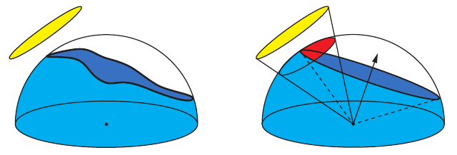

**图 11.19**　环境孔径光照用圆锥近似着色点上方未被遮挡区域的实际形状。左图中，面光源以黄色表示，表面位置处的可见地平线以蓝色表示。右图中，地平线被简化为一个圆，它是从该表面位置向右上方投射的圆锥的边缘，圆锥以虚线表示。随后，通过将面光源对应的圆锥与遮蔽圆锥相交，估计面光源的遮蔽情况，得到红色所示的区域。

### 11.4.2 方向性遮蔽的动态计算

许多用于生成环境光遮蔽的方法也可以用来生成方向性可见性信息。Ren 等人 [1482] 的球谐指数运算，以及 Sloan 等人 [1655] 提出的屏幕空间变体，生成的可见性采用球谐系数向量的形式。如果使用不止一个 SH 频带，这些方法便天然提供方向性信息。使用更多频带，可以更精确地编码可见性。

圆锥追踪方法，例如 Crassin 等人 [305] 和 Wright [1910] 的方法，每次追踪提供一个遮蔽值。出于质量考虑，即使估计环境光遮蔽也要执行多次追踪，因此已有信息本身就具有方向性。如果只需要某个特定方向上的可见性，就可以追踪更少的圆锥。

Iwanicki [806] 同样使用圆锥追踪，但将其限制在一个方向上。其结果用于生成动态角色投射到静态几何体上的软阴影；这些角色用一组球体近似，与 Ren 等人 [1482] 和 Sloan 等人 [1655] 的方法类似。在此方案中，静态几何体的光照使用 AHD 编码存储（第 10.3.3 节）。环境分量与方向分量的可见性可以独立处理。环境部分的遮蔽通过解析方式计算；通过追踪一个圆锥并让它与球体相交，计算方向分量的衰减因子。

许多屏幕空间方法也可以扩展为提供方向性遮蔽信息。Klehm 等人 [904] 使用 z 缓冲数据计算屏幕空间弯曲圆锥（screen-space bent cones），它们实际上是圆形孔径，与 Oat 和 Sander [1307] 离线预计算的孔径非常相似。在采样一个像素的邻域时，他们把未被遮挡的方向相加。所得向量的长度可用于估计可见性圆锥的顶角，其方向则定义该圆锥的轴。Jimenez 等人 [835] 根据地平线角估计圆锥轴的方向，并从环境光遮蔽因子推导圆锥角。

### 11.4.3 使用方向性遮蔽进行着色

方向性遮蔽的编码方式如此之多，我们无法给出一种通用的着色办法。具体方案取决于我们想达到的特定效果。

再次考虑反射方程，这一次把入射辐亮度分成远处光照  及其可见性 v：

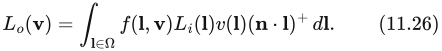

我们能够执行的最简单操作，是利用可见性信号为点状光源生成阴影。由于大多数可见性编码方式比较简单，结果的质量往往不能令人满意，但这个基础示例有助于我们理解推理过程。在传统阴影方法因分辨率不足而失效，并且获得某种形式的遮蔽比结果精度更重要的情况下，也可以使用这种方法。例如，极大规模的地形模型，或以凹凸贴图表示的小尺度表面细节。

按照第 9.4 节的讨论，当处理点状光源时，式 11.26 变为：

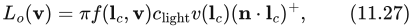

其中，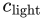 是正对光源的白色朗伯表面反射出的辐亮度，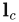 是指向光源的方向。我们可以把上式理解为：先计算材质对未被遮挡的光的响应，再将结果乘以可见性函数的值。如果光源方向落在地平线下方（使用地平线映射时）、可见性圆锥外部（使用环境孔径光照时），或 SSDF 的负值区域，那么可见性函数等于零，因此不应计入该光源的任何贡献。值得一提的是，虽然可见性被定义为二值函数，注2 但许多表示方法能够返回整个范围的数值，而不只是零或一。这些数值表示部分遮蔽。由于振铃，球谐函数或 H 基甚至可能重建出负值。这些行为可能并非我们所愿，却是编码方式固有的性质。

**注2：** 至少在大多数情况下如此。有些情况下，我们希望可见性函数取零和一以外、但仍处于两者之间的值。例如，在编码半透明材质造成的遮蔽时，我们可能希望使用小数形式的遮蔽值。

对面光源光照也可以作类似推理。此时，除了光源所张的立体角以内， 在其余所有方向上都等于零；在该立体角内，它等于光源发出的辐亮度。我们把它记作 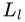，并假设它在光源的整个立体角上为常数。于是，可以把对整个球面 Ω 的积分替换成对光源立体角 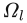 的积分：

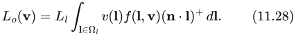

如果假设 BRDF 为常数，也就是说处理的是朗伯表面，那么也可以将其移出积分号：

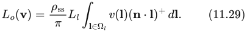

为了确定受遮蔽后的光照，需要在光源所张的立体角上，计算可见性函数与余弦项乘积的积分。有些情况下可以解析地完成这一计算。Lambert [967] 推导出了在球面多边形上计算余弦积分的公式。如果面光源是多边形，而且可以用可见性表示对它进行裁剪，那么只需使用 Lambert 公式就能得到精确结果（图 11.20）。例如，当我们选择用地平线角表示可见性时，这便是可行的。然而，如果出于某种原因采用了另一种编码，例如弯曲圆锥，那么裁剪会产生圆弧段，此时便无法再使用 Lambert 公式。如果要使用非多边形面光源，也会遇到同样的问题。

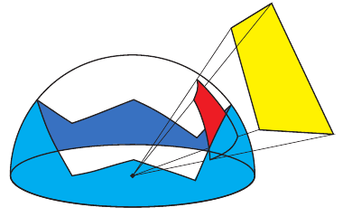

**图 11.20**　黄色多边形光源可以投影到着色点上方的单位半球上，形成一个球面多边形。如果使用地平线映射描述可见性，就可以据此裁剪该多边形。裁剪后红色多边形的余弦加权积分，可使用 Lambert 公式解析地计算。

另一种办法是假设余弦项在整个积分域内为常数。如果面光源的尺寸较小，这个近似相当精确。为简便起见，可以使用朝向面光源中心的方向上求得的余弦值。这样，剩下的就只是可见性项在光源立体角上的积分。下一步如何处理，再次取决于选用的可见性表示和面光源类型。如果使用球形光源，并以弯曲圆锥表示可见性，那么积分值就是可见性圆锥与光源所张圆锥相交部分的立体角。Oat 和 Sander [1307] 说明了如何解析地计算这一结果。尽管精确公式很复杂，他们提供了一种在实践中效果很好的近似。如果可见性使用球谐函数编码，也可以解析地计算该积分。

对于环境光照，我们无法限制积分范围，因为照明来自所有方向。需要找到计算式 11.26 完整积分的方法。先考虑朗伯 BRDF：

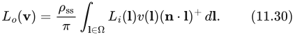

此式中的积分类型称为三重乘积积分（triple product integral）。如果各个函数采用某些特定方式表示，例如球谐函数或小波，就能够解析地计算它。遗憾的是，这对于典型的实时应用而言代价过高，尽管已有方案在简单配置下达到了交互帧率 [1270]。

不过，我们的具体情况稍微简单一些，因为其中一个函数是余弦。因此可以把式 11.30 改写成：

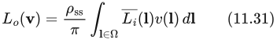

或：

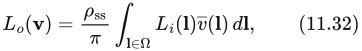

其中：

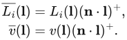

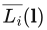 和 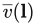 都是球面函数，与  和 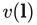 一样。我们不再尝试直接计算三重乘积积分，而是先把余弦乘以 （式 11.31）或 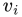（式 11.32）。译注1 这样，被积函数就只包含两个函数的乘积。虽然这看起来只是一个数学技巧，却能显著简化计算。如果各因子使用球谐函数这样的标准正交基表示，那么二重乘积积分的计算就非常简单：它就是两者系数向量的点积（第 10.3.2 节）。

我们仍需计算  或 ，但由于其中涉及余弦，这比完全一般的情况更简单。如果使用球谐函数表示这些函数，余弦会投影为带谐函数（zonal harmonics，ZH），它是球谐函数的一个子集，每个频带中只有一个系数非零（第 10.3.2 节）。这一投影的系数具有简单的解析公式 [1656]。计算 SH 与 ZH 的乘积，比计算 SH 与另一个 SH 的乘积高效得多。

如果决定先把余弦乘以 v（式 11.32），就可以离线执行，并改为只存储可见性。译注2 这是 Sloan 等人 [1651] 所描述的预计算辐亮度传输（precomputed radiance transfer）的一种形式（第 11.5.3 节）。不过，在这种形式下无法对法线作任何细尺度修改，因为由法线控制的余弦项已经与可见性融合在一起。如果想建模细尺度法线细节，可以先把余弦乘以 （式 11.31）。由于无法预先知道法线方向，可以针对不同法线预计算这一乘积 [805]，也可以在运行时相乘 [809]。离线预计算  与余弦的乘积，也就意味着光照的任何变化都会受到限制；若允许光照随空间位置变化，所需内存量将大得难以接受。另一方面，在运行时计算乘积的计算成本很高。Iwanicki 和 Sloan [809] 描述了降低这一成本的办法：以较低的采样密度计算乘积，在他们的方案中是在顶点上计算。将结果与余弦项卷积，投影到更简单的表示（AHD），再进行插值，并使用逐像素法线重建。该方法使他们能够将这一技术用于性能要求很高的 60 FPS 游戏中。

Klehm 等人 [904] 提出了一种方案，以环境贴图表示光照，以圆锥编码可见性。他们用不同大小的核对环境贴图进行滤波；这些核表示不同圆锥开口下，可见性与光照乘积的积分。他们将圆锥角逐渐增大时的结果存储到纹理的各个 mip 层级。之所以可以这样做，是因为较大圆锥角对应的预滤波结果在球面上变化平滑，不必用很高的角分辨率存储。在预滤波过程中，他们假设可见性圆锥的方向与法线一致。虽然这是一个近似，但在实践中能产生合理的结果。他们还分析了这种近似对最终质量的影响。

如果要处理光泽 BRDF 和环境光照，情况就更复杂了。由于 BRDF 不是常数，不能再将其移出积分号。为解决这一问题，Green 等人 [582] 建议用一组球面高斯函数近似 BRDF 本身。这些函数径向对称，只需三个参数便可紧凑地表示：方向（或均值）d、标准差 μ 和幅度 w。近似 BRDF 定义为多个球面高斯函数之和：

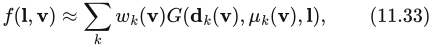

其中，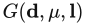 是沿方向 d、锐度为 μ 的球面高斯波瓣（第 10.3.2 节）， 是第 k 个波瓣的幅度。译注3 对于各向同性 BRDF，波瓣形状只取决于法线与观察方向之间的夹角。可以将这些近似结果存储在一维查找表中，并进行插值。

采用这一近似后，可以把式 11.26 写为：

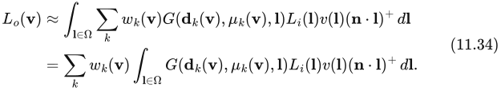

Green 等人还假设，可见性函数在每个球面高斯函数的整个支撑域内为常数，因此可以将其移出积分号。他们沿波瓣中心方向求可见性函数的值：

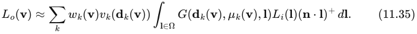

剩余的积分表示入射光照与一个具有给定方向和给定标准差的球面高斯函数的卷积。这类卷积的结果可以预计算并存储在环境贴图中；较大 μ 所对应的卷积存储在较低的 mip 层级。可见性使用低阶球谐函数编码，不过也可以使用任何其他表示，因为这里只对它进行单点求值。

Wang 等人 [1838] 以类似方式近似 BRDF，但对可见性的处理更加精确。他们的表示方式能够计算单个球面高斯函数在可见性函数支撑域上的积分。他们利用该值引入一个新的球面高斯函数，它具有相同的方向和标准差，但幅度不同。在光照计算中，他们使用这个新函数。

对于某些应用，这种方法的代价可能过高。它需要从预滤波环境贴图中进行多次采样，而纹理采样本身往往已经是渲染瓶颈。Jimenez 等人 [835] 和 El Garawany [414] 提出了更简单的近似。为了计算遮蔽因子，他们用一个圆锥表示整个 BRDF 波瓣，忽略波瓣对观察角度的依赖，只考虑材质粗糙度等参数（图 11.21）。他们将可见性近似为一个圆锥，并计算可见性圆锥与 BRDF 圆锥相交部分的立体角，与环境孔径光照的做法非常相似。所得标量结果用于衰减光照。尽管这是很大的简化，结果仍然可信。

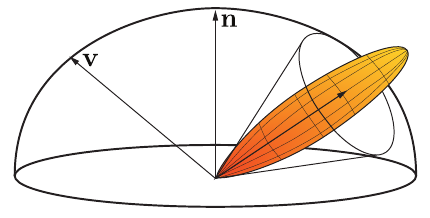

**图 11.21**　为了计算遮蔽，可以把光泽材质的镜面波瓣表示为一个圆锥。如果也把可见性近似为另一个圆锥，就能以两者相交部分的立体角计算遮蔽因子，方式与环境孔径光照相同（图 11.19）。图中展示了用圆锥表示 BRDF 波瓣的一般原理，但仅作示意。实践中，要得到合理的遮蔽结果，圆锥需要更宽。

**译注1：** 原书此处正文印作 ，但式 11.32 及随后定义使用的是无下标的可见性函数 v。本译文保留原文记号并指出这一排印不一致。

**译注2：** 原书此处写作“改为只存储可见性”。结合式 11.32 和紧接着关于余弦项已融合的解释，实际存储对象应理解为乘入余弦后的可见性，而非原始二值可见性；此处保留原文表述。

**译注3：** 原书前段称 μ 为“标准差”，此处又称其为“锐度”，后文再次采用“标准差”的说法。本译文保留这一术语不一致，未擅自更换参数或改写公式。式 11.35 中可见性函数的下标 k 也按原式保留。

## 11.5 漫反射全局光照

来源：《Real-Time Rendering, Fourth Edition》，书页 472—497（PDF 物理页 493—518）。范围从 11.5 标题起，至 11.6 标题前，包含 11.5.1—11.5.9。图 11.21 属于前节；本节原图为 11.22—11.35。技术陈述保留原书出版时的语境。

接下来的几节介绍各种实时模拟方法，它们不仅模拟遮挡，还模拟完整的光线反弹。这些算法大致可以分为两类：一类假设光线到达眼睛前的最后一次反弹发生在漫反射表面上，另一类则假设发生在镜面反射表面上。相应的光线路径分别可以写成 L(D|S)∗DE 和 L(D|S)∗SE，其中许多方法还会对更早的反弹类型施加某些限制。第一类解决方案假设，着色点上方半球内的入射光照变化平缓，或者干脆忽略这种变化。第二类算法则假设光照随入射方向的变化率很高。它们利用的是这样一个事实：只会在相对较小的立体角范围内访问光照。由于两类方法的约束截然不同，将其分开处理很有益。本节介绍漫反射全局光照方法，下一节介绍镜面反射全局光照，最后一节则介绍有前景的统一方法。

### 11.5.1 表面预光照

辐射度和路径追踪都面向离线使用。虽然人们曾尝试将它们用于实时场景，但结果仍然不够成熟，尚不能用于生产。目前最常见的做法，是用它们预计算与光照有关的信息。先执行开销高昂的离线过程，把结果存储下来，随后在显示时使用，以提供高质量光照。如 11.3.4 节所述，对静态场景进行这样的预计算称为烘焙。

这种做法有一些限制。如果提前执行光照计算，就不能在运行时改变场景配置。场景中的所有几何体、光源和材质都必须保持不变。我们不能改变一天中的时间，也不能在墙上炸出一个洞。在许多情况下，这种限制是可以接受的取舍。建筑可视化可以假定用户只是在虚拟环境中走动。游戏同样会限制玩家的行为。在这类应用中，可以把几何体分为静态物体和动态物体。静态物体参与预计算过程，并与光照充分交互。静态墙壁投射阴影，静态红地毯反弹红光。动态物体则仅作为接收者，不遮挡光，也不产生间接光照效果。在这些场景中，动态几何体通常被限制为相对较小的物体，这样便可以忽略它对其余光照的影响，或使用其他技术加以模拟，而质量损失很小。例如，动态几何体可以使用屏幕空间方法产生遮挡。典型的动态物体包括角色、装饰性几何体和车辆。

可以预计算的最简单光照信息是辐照度。对于平坦的朗伯表面，辐照度与表面颜色结合，就能完整描述材质对光照的响应。由于一个照明源的影响独立于其他照明源，因此可以在预计算辐照度之上叠加动态光源（图 11.22）。

图 11.22。对于法线已知的朗伯表面，可以预计算其辐照度。运行时，将此值与实际表面颜色相乘（例如来自纹理的颜色），便得到反射辐亮度。根据表面颜色的具体形式，可能还需要额外除以 π，才能确保能量守恒。

1996 年的《Quake》和 1997 年的《Quake II》是最早使用预计算辐照度值的商业交互式应用。《Quake》预计算静态光源的直接贡献，主要目的是提高性能。《Quake II》还加入了间接分量，成为首款使用全局光照算法生成更真实光照的游戏。它采用了基于辐射度的算法，因为这一技术非常适合计算朗伯环境中的辐照度。此外，当时的内存限制要求光照的分辨率相对较低，这也与辐射度解典型的模糊、低频阴影相吻合。

预计算辐照度值通常与存储在另一组纹理中的漫反射颜色或反照率贴图相乘。虽然理论上可以将辐射出射度（辐照度乘以漫反射颜色）预计算并存储在同一组纹理中，但许多实际因素使得这种选择在大多数情况下不可行。颜色贴图通常具有相当高的频率，会采用各种平铺方式，而且其局部经常在模型上重复使用，这些都是为了使内存占用保持合理。辐照度值的频率通常低得多，也不容易重复使用。将光照与表面颜色分开，消耗的内存要少得多。

如今，除了限制最严格的硬件平台之外，已经很少直接使用预计算辐照度。按定义，辐照度是针对给定法线方向计算的，因此不能使用法线映射提供高频细节。这也意味着，只能为平坦表面预计算辐照度。如果需要把烘焙光照用于动态几何体，就需要其他存储方法。这些限制促使人们寻找带有方向分量的预计算光照存储方式。

### 11.5.2 带方向的表面预光照

要在朗伯表面上同时使用预光照和法线映射，就需要一种表示辐照度如何随表面法线变化的方法。为了给动态几何体提供间接光照，还需要知道每一种可能的表面朝向所对应的辐照度值。幸运的是，我们已经有了表示这类函数的工具。10.3 节介绍了确定依赖于法线方向的光照的各种方法。其中包括一些专门用于半球函数定义域的方案：在这类情况下，球体下半部的值无关紧要，不透明表面就是如此。

最通用的方法是存储完整的球面辐照度信息，例如使用球谐函数。这种方案最初由 Good 和 Taylor [564] 在加速光子映射的背景下提出，Shopf 等人 [1637] 则将它用于实时环境。两者都把带方向的辐照度存储在纹理中。如果使用九个球谐系数（三阶 SH），质量非常出色，但存储和带宽成本都很高。仅使用四个系数（二阶 SH）开销较低，但会丢失许多微妙细节，光照对比度降低，法线贴图的效果也不那么明显。

Chen [257] 在《Halo 3》中采用了这一方法的变体，目的是以较低成本达到三阶 SH 的质量。他从球面信号中提取出最主要的光源，将其颜色和方向单独存储。剩余部分使用二阶 SH 编码。这样就把系数数量从 27 降到了 18，而质量损失很小。Hu [780] 描述了进一步压缩这些数据的方法。Chen 和 Tatarchuk [258] 还提供了关于其生产中使用的 GPU 烘焙流水线的更多信息。

Habel 等人 [627] 的 H 基是另一种可选方案。因为它只编码半球信号，所以能够以更少的系数获得与球谐函数相同的精度。仅用六个系数，就能得到接近三阶 SH 的质量。由于该基仅定义在半球上，因此需要表面上的某个局部坐标系来正确确定它的朝向。通常使用由 uv 参数化得到的切线标架。如果将 H 基分量存储在纹理中，纹理分辨率应足够高，以适应底层切线空间的变化。如果切线空间差异显著的多个三角形覆盖同一个纹素，重建信号就不准确。

球谐函数和 H 基都有一个问题，即可能产生振铃（10.6.1 节）。虽然预滤波可以减轻这一现象，但它也会平滑光照，而这未必总是我们希望的。此外，即使是开销较低的变体，在存储和计算方面仍有相对较高的成本。在限制更加严格的情况下，例如低端平台或虚拟现实渲染，这种开销可能无法承受。

正因为成本问题，简单的替代方案仍然很流行。《Half-Life 2》使用了一种自定义半球基（10.3.3 节），存储三个颜色值，每个样本共九个系数。环境／高光／方向（ambient/highlight/direction，AHD）基（10.3.3 节）虽然简单，也是很受欢迎的选择。它已用于《Call of Duty》系列 [809, 998] 和《The Last of Us》[806] 等游戏，见图 11.23。

图 11.23。《Call of Duty: WWII》使用 AHD 表示法，在光照贴图中编码光照随方向的变化。调试模式下用网格可视化光照贴图的密度。每个方格对应一个光照贴图纹素。（图片由 Activision Publishing, Inc. 提供，2018。）

Crytek 在《Far Cry》中采用了一个变体 [1227]。Crytek 的表示由切线空间中的平均光照方向、平均光照颜色和一个标量方向性因子组成。最后这个值用于在环境分量和方向分量之间混合，两者使用同一种颜色。这样，每个样本只需存储六个系数：三个颜色值、两个方向值和一个方向性因子。Unity 引擎在其一种模式中也采用了类似方法 [315]。

这类表示是非线性的。严格来说，无论在纹素之间还是顶点之间，对各分量做线性插值，在数学上都不正确。如果主光源方向变化很快，例如在阴影边界处，着色中可能出现视觉伪影。尽管存在这些不准确之处，结果在视觉上仍然令人满意。环境光区域与方向光照亮区域之间具有较高对比度，因此法线贴图的效果会得到强化，而这往往是所希望的。此外，在计算 BRDF 的镜面响应时，也可以使用方向分量，为低光泽材质提供一种成本低廉的环境贴图替代方案。

另一端则是为高视觉质量设计的方法。Neubelt 和 Pettineo [1268] 在游戏《The Order: 1886》中使用存储球面高斯系数的纹理贴图（图 11.24）。他们存储的是入射辐亮度，而非辐照度，并将其投影到一组在切线标架中定义的高斯波瓣上（10.3.2 节）。根据特定场景中光照的复杂程度，他们使用五到九个波瓣。为了产生漫反射响应，将球面高斯与沿表面法线方向的余弦波瓣卷积。该表示的精度也足以通过将高斯与镜面 BRDF 波瓣卷积，提供低光泽的镜面效果。Pettineo 详细描述了整个系统 [1408]，并提供了一个能够烘焙和渲染不同光照表示的应用程序的源代码。

图 11.24。《The Order: 1886》在光照贴图中存储投影到一组球面高斯波瓣上的入射辐亮度。运行时，将辐亮度与余弦波瓣卷积来计算漫反射响应（左），与形状适当的各向异性球面高斯卷积来生成镜面响应（右）。（图片由 Ready at Dawn Studios 提供，版权归 Sony Interactive Entertainment 所有。）

如果需要任意方向的光照信息，而不仅是表面上方一个半球内的信息，例如为了给动态几何体提供间接光照，可以采用编码完整球面信号的方法。球谐函数在此非常合适。内存不是主要顾虑时，三阶 SH（每个颜色通道九个系数）是常见选择；否则使用二阶 SH（每个颜色通道四个系数，恰好与 RGBA 纹理的分量数相同，因此一张贴图就能存储一个颜色通道的系数）。球面高斯同样能用于完整球面，因为波瓣既可以分布在整个球面上，也可以只分布在法线周围的半球上。不过，完整球面技术需要用波瓣覆盖的立体角是半球的两倍，因此可能需要更多波瓣才能保持相同质量。

如果想避免处理振铃，又无法承担大量波瓣的开销，环境立方体 [1193]（10.3.1 节）是一种可行替代。它由沿主坐标轴定向的六个截断  波瓣组成。余弦波瓣具有局部支撑，也就是仅在球面定义域的一个子集上非零，因此每个波瓣只覆盖一个半球。正因如此，重建时在存储的六个值中只需要三个可见波瓣。这限制了光照计算的带宽成本。重建质量与二阶球谐函数相近。

环境骰子 [808]（同见 10.3.1 节）可以提供比环境立方体更高的质量。它采用沿正二十面体顶点方向定向的十二个波瓣，各波瓣是  和  波瓣的线性组合。重建时使用十二个存储值中的六个。质量与三阶球谐函数相当。这些以及其他类似表示，例如由三个  波瓣和一个经变形以覆盖整个球面的余弦波瓣组成的基，已在许多商业上成功的游戏中使用，其中包括《Half-Life 2》[1193]、《Call of Duty》系列 [766, 808]、《Far Cry 3》[533]、《Tom Clancy’s The Division》[1694] 和《Assassin’s Creed 4: Black Flag》[1911]，等等。

### 11.5.3 预计算传输

预计算光照虽然可以非常出色，但本质上是静态的。几何体或光照的任何变化，都可能使整个解失效。就像现实世界中，拉开窗帘（场景几何体的局部变化）可能让整个房间充满光（光照的全局变化）。人们投入了大量研究精力，寻找允许某些类型变化的解决方案。

如果假设场景几何体保持不变，只有光照变化，就可以预计算光与模型的交互方式。在不处理实际辐亮度值的情况下，可以预先在一定程度上分析物体间的相互反射或次表面散射等效果，并存储结果。把入射光照转换为整个场景中辐亮度分布描述的函数，称为传输函数。预计算该函数的解决方案，称为预计算传输或预计算辐亮度传输（precomputed radiance transfer，PRT）方法。

与完全离线烘焙光照不同，这些技术在运行时确实有明显的开销。把场景显示到屏幕上时，需要计算特定光照配置下的辐亮度值。为此，首先将实际数量的直接光“注入”系统，然后应用传输函数，将它传播到整个场景。有些方法假定直接光照来自环境贴图，另一些方案则允许任意配置光照，并灵活地改变它。

Sloan 等人 [1651] 把预计算辐亮度传输的概念引入了图形学。他们用球谐函数描述它，但这一方法并不一定要使用 SH。基本思想很简单：如果用一定数量（最好较少）的“构件”光源描述直接光照，就可以预计算场景受到每个构件照明时的结果。设想一个有三台计算机显示器的房间，假定每台显示器只能显示单一颜色，但亮度可以变化。令各屏幕的最大亮度等于 1，也就是归一化的“单位”亮度。我们可以分别预计算每台显示器对房间的影响，方法可使用 11.2 节所介绍的那些。由于光传输是线性的，三台显示器同时照明场景的结果，等于各显示器直接或间接产生的光的总和。每台显示器的照明不影响其他解，因此把其中一块屏幕的亮度减半，只会改变它自身对总光照的贡献。这样便可以快速计算整个房间中包含反弹的完整光照。取每个预计算光照解，乘以该屏幕的实际亮度，再把结果相加。我们可以开关显示器，使其变亮或变暗，甚至改变颜色；得到最终光照所需的只是这些乘法和加法（图 11.25）。

图 11.25。使用预计算辐亮度传输进行渲染的例子。分别预计算三台显示器中每一台产生的完整光传输，得到“单位”响应。由于光传输的线性性质，可以将这些独立的解分别乘以屏幕颜色（本例为粉红、黄和蓝），得到最终光照。

可以写成

其中，L(𝐩) 是点 𝐩 处的最终辐亮度，(𝐩) 是来自屏幕 i 的预计算单位贡献， 是该屏幕当前的亮度。从数学意义上讲，这个方程定义了一个向量空间， 是该空间的基向量。任何可能的光照都可以由各光源贡献的线性组合产生。

Sloan 等人的原始 PRT 论文 [1651] 使用了同样的推理，不过背景是用球谐函数表示的无限远光照环境。他们存储的并非场景对显示器屏幕的响应，而是场景对周围光照的响应，其分布由球谐基函数定义。对一定数量的 SH 频带执行这一过程后，就可以渲染被任意光照环境照亮的场景。他们将该光照投影到球谐函数上，把得到的各系数分别乘以对应的归一化“单位”贡献，再全部相加，就像前面显示器的例子一样。

注意，用于向场景“注入”光的基，与用于表示最终光照的表示法，可以独立选择。例如，可以用球谐函数描述场景如何被照亮，同时选择另一种基来存储任意给定点接收到的辐亮度。假设使用环境立方体来存储，就要计算有多少辐亮度来自上方、有多少来自侧面。每个方向的传输都将分别存储，而不是以表示总传输的单个标量值来存储。

Sloan 等人的 PRT 论文 [1651] 分析了两种情况。第一种情况是，接收端的基只是表面的一个标量辐照度值。这要求接收者为完全漫反射表面，并且法线预先确定，意味着它不能使用法线贴图表现精细细节。传输函数表现为输入光照的 SH 投影与预计算传输向量的点积，而这个传输向量在场景中随空间位置而变化。

如果要渲染非朗伯材质，或者允许法线映射，可以使用所提出的第二种变体。在这种情况下，周围光照的 SH 投影被变换成给定点入射辐亮度的 SH 投影。这一操作提供了完整球面上的辐亮度分布；对于静态不透明物体，则是半球上的分布。因此，可以正确地将其与任意 BRDF 卷积。传输函数把 SH 向量映射到另一 SH 向量，形式为矩阵乘法。无论计算还是内存，这种乘法操作的开销都很高。如果源端和接收端都采用三阶 SH，就需要为场景中的每个点存储一个 9 × 9 矩阵，而且这些数据仅表示单色传输。如果需要颜色，就需要三个这样的矩阵，每点所需的内存量惊人。

一年后，Sloan 等人 [1652] 针对这一问题提出了处理方法。他们不直接存储传输向量或矩阵，而是使用主成分分析（principal component analysis，PCA）技术分析其整个集合。可以把传输系数看成多维空间中的点，例如 9 × 9 矩阵对应 81 维空间中的点，但这些点的集合并不是均匀分布在该空间中的，而是形成维度较低的簇。这就像沿一条直线分布的三维点，实际上都处在三维空间的一个一维子空间中。PCA 能有效发现这类统计关系。发现子空间后，可以使用少得多的坐标来表示这些点，因为能够以较少的维数存储其在子空间中的位置。继续以直线为例：不必用三个坐标存储点的完整位置，只需存储它沿直线的距离。Sloan 等人用这种方法，把传输矩阵的维度从 625 维（25 × 25 的传输矩阵）降到了 256 维。虽然这对典型实时应用来说仍然过高，但后来的许多光传输算法都采用了 PCA 压缩数据。

这种降维本质上是有损的。少数情况下，数据形成一个完美的子空间，但通常只近似如此，因此把数据投影到该子空间会造成一定退化。为了提高质量，Sloan 等人把传输矩阵集合划分成多个簇，并对每个簇分别执行 PCA。该过程还包含一个优化步骤，确保簇边界上没有不连续。他们还提出了一种允许物体有限形变的扩展，称为局部可变形预计算辐亮度传输（local deformable precomputed radiance transfer，LDPRT）[1653]。

PRT 已以不同形式用于若干游戏。对于玩法主要集中于室外区域，并且一天中的时间与天气条件动态变化的游戏，它尤其流行。《Far Cry 3》和《Far Cry 4》使用的 PRT，其源端基为二阶 SH，接收端基则是一个自定义的四方向基 [533, 1154]。《Assassin’s Creed 4: Black Flag》以一个基函数作为源（太阳颜色），但会针对一天中的不同时刻预计算传输。这种表示可以理解为源端基函数定义在时间维度上，而非方向上。其接收端基与《Far Cry》系列所用的相同。

SIGGRAPH 2005 关于预计算辐亮度传输的课程 [870] 很好地概述了这一领域的研究。Lehtinen [1019, 1020] 给出了一个数学框架，可用于分析不同算法之间的差异和开发新算法。

原始 PRT 方法假设周围光照来自无限远处。虽然这能较好地模拟室外场景的光照，但对室内环境而言限制过强。不过，正如前面所说，这一概念本身完全不依赖最初的照明源。Kristensen 等人 [941] 描述了一种为分散在整个场景中的一组光源计算 PRT 的方法，相当于具有大量“源端”基函数。随后把光源合并成簇，并把接收几何体分成区域，每个区域受到不同光源子集的影响。这一过程大幅压缩了传输数据。运行时，通过对预计算光源集合中最近的光源数据插值，近似任意位置光源产生的照明。Gilabert 和 Stefanov [533] 用这种方法在游戏《Far Cry 3》中生成间接光照。其基本形式只能处理点光源。虽然可以扩展为支持其他类型，但成本会随着每个光源自由度的数量呈指数增长。

前面讨论的 PRT 技术，都是预计算来自一定数量元素的传输，再用这些元素模拟光源。另一类流行方法则预计算表面之间的传输。在这种系统中，实际照明源不再重要。任何光源都可以使用，因为这类方法的输入是一组表面的出射辐亮度，或其他相关量；例如，如果方法假设表面只有漫反射，就可以使用辐照度。这些直接光照计算可以使用阴影（第 7 章）、辐照度环境贴图（10.6 节），或者本章前面讨论的环境遮挡与方向遮挡方法。还可以非常容易地将任意表面的出射辐亮度设为所需值，使其自发光，成为面光源。

按照这些原理工作的系统中，最受欢迎的是 Geomerics 的 Enlighten（图 11.26）。虽然算法的具体细节从未完全公开，但众多演讲与报告已经准确呈现了该系统的原理 [315, 1101, 1131, 1435]。

图 11.26。Geomerics 的 Enlighten 能够实时生成全局光照效果。图中展示了它与 Unity 引擎集成的一个例子。用户可以自由改变一天中的时间，也可以开关光源。所有间接光照都会相应地实时更新。（Courtyard 演示，© Unity Technologies，2015。）

系统假设场景为朗伯场景，但这一假设仅用于光传输。使用 Heckbert 记法，它处理的路径集合是 LD∗(D|S)E，因为到达眼睛前的最后一个表面不必仅有漫反射。系统定义一组“源”元素和另一组“接收”元素。源元素位于表面上，并共享表面的某些属性，例如漫反射颜色和法线。预处理步骤计算光如何在源元素与接收元素之间传输。这些信息的具体形式取决于源元素是什么，以及接收端用什么基收集光照。最简单的形式中，源元素可以是点，而我们希望在接收位置生成辐照度。此时，传输系数只是源与接收者之间的相互可见性。运行时，将所有源元素的出射辐亮度提供给系统。根据这些信息，结合预计算可见性以及源与接收者的位置、朝向信息，就能对反射方程（式 11.1）进行数值积分，以此完成一次光线反弹。由于大多数间接光照来自第一次反弹，仅执行一次就足以产生可信的照明。不过，还可以使用这次得到的光，再运行一次传播步骤，生成第二次反弹。通常这会跨若干帧进行，将一帧的输出作为下一帧的输入。

把点用作源元素会产生大量连接。为了提高性能，还可以把代表法线与颜色相近区域的点簇用作源集合。此时，传输系数与辐射度算法中的形状因子相同（11.2.1 节）。注意，尽管两者相似，该算法仍与经典辐射度不同，因为它每次仅计算一次反弹，不涉及求解线性方程组。它借鉴了渐进辐射度的思想 [275, 1642]。在该系统中，单个面片可以通过迭代过程确定自己从其他面片收到多少能量。将辐亮度传输到接收位置的过程称为收集（gathering）。

接收元素处的辐亮度可以以不同形式收集。向接收元素的传输可以使用前面介绍的任何方向基。在这种情况下，单个系数变为一组值构成的向量，维度等于接收端基中函数的数量。使用方向表示进行收集时，结果与 11.5.2 节介绍的离线方案相同，因此可以与法线映射配合，也可以提供低光泽的镜面响应。

许多变体都采用了相同的总体思路。为了节省内存，Sugden 和 Iwanicki [1721] 使用 SH 传输系数，对其量化，并以调色板条目索引的形式间接存储。Jendersie 等人 [820] 为源面片建立层次结构；当子元素张成的立体角太小时，便存储对树中更高层元素的引用。Stefanov [1694] 引入了一个中间步骤：先将表面元素的辐亮度传播到场景的体素化表示中，随后由该表示作为传输源。

从某种意义上说，将表面划分为源面片的理想方式取决于接收者的位置。对于远处元素，将其视为独立实体会带来不必要的存储开销，但近距离观察时又应分别处理。源面片层次结构能够在一定程度上缓解这一问题，但无法彻底解决。有些面片对于某些接收者本可以合并，却可能在空间中相距太远，无法进行这样的合并。Silvennoinen 和 Lehtinen [1644] 提出了一种新方法：不显式创建源面片，而是为每个接收位置生成一组不同的源面片。将物体渲染到分布在场景中的一组稀疏环境贴图里，把每张贴图投影到球谐函数上，再将这个低频版本“虚拟地”投影回环境。接收点记录自己能看到多少投影内容，并对各发送端的每一个 SH 基函数分别执行这一过程。这样，根据环境探针和接收点两者的可见性信息，为每个接收者创建不同的源元素集合。

由于源端基由投影到 SH 上的环境贴图生成，因此自然会将较远的表面合并。为了选择要用的探针，接收者采用偏向附近探针的启发式方法，使接收者以相近尺度“看到”环境。为了限制所需存储的数据量，传输信息使用分簇 PCA 压缩。

Lehtinen 等人 [1021] 描述了另一种预计算传输形式。在这种方法中，源元素和接收元素都不位于网格上，而是体积式的，可以在三维空间中的任意位置查询。这种形式很适合让静态与动态几何体之间保持一致的光照，但计算成本相当高。

Loos 等人 [1073] 针对不同侧壁配置，在模块化单位单元内预计算传输。随后将多个这样的单元拼接并变形，以近似场景几何体。辐亮度首先传播到充当接口的单元边界，再使用预计算模型传播到相邻单元。该方法足够快，甚至能在移动平台上高效运行，但其结果质量可能无法满足要求更高的应用。

### 11.5.4 存储方法

无论希望使用完整的预计算光照，还是预计算传输信息并允许光照发生某些变化，得到的数据都必须以某种形式存储。格式必须适合 GPU 使用。

光照贴图是存储预计算光照最常见的方法之一。它们是存放预计算信息的纹理。虽然有时会用“辐照度贴图”等术语指明所存数据的具体类型，但“光照贴图”是所有这些贴图的统称。运行时使用 GPU 内置的纹理机制。通常会对值进行双线性滤波，对某些表示来说，这可能不完全正确。例如，使用 AHD 表示时，经插值滤波后的 D（方向）分量不再是单位长度，因此需要重新归一化。使用插值还意味着 A（环境）和 H（高光）并不精确等于在采样点直接计算所得到的值。尽管如此，即使表示是非线性的，结果通常也可以接受。

多数情况下，光照贴图不使用 mipmapping。相较于典型的反照率贴图或法线贴图，光照贴图的分辨率很小，因此通常不需要它。即使在高质量应用中，一个光照贴图纹素覆盖的面积至少也大约为 20 × 20 厘米，而且往往更大。在这种纹素尺寸下，几乎从不需要额外的 mip 层级。

为了把光照存入纹理，物体需要提供唯一参数化。将漫反射颜色纹理映射到模型上时，网格的不同部分使用纹理中的相同区域通常没有问题，尤其是采用通用重复图案为模型贴纹理时。然而，要复用光照贴图，即使在最好的情况下也很困难。网格上每一点的光照都是独特的，所以每个三角形都需要在光照贴图上占有自己独一无二的区域。创建参数化时，先把网格拆分为较小的块。可以使用某些启发式方法自动完成 [1036]，也可以在创作工具中手工完成。通常会沿用为其他纹理映射已有的划分。接着，分别对每一块参数化，确保其各部分在纹理空间中不重叠 [1057, 1617]。在纹理空间中得到的元素称为图表（charts）或壳（shells）。最后，把所有图表打包到一张公共纹理中（图 11.27）。不仅要确保图表不重叠，还必须使其滤波足迹相互分离。渲染某个图表时可能访问的所有纹素，都应标记为已使用，避免其他图表与它们重叠；双线性滤波会访问四个相邻纹素。否则，图表之间可能出现渗漏，一个图表的光照会在另一个图表上显现。虽然光照贴图系统经常提供一个由用户控制的“沟槽”（gutter）宽度，用来设置图表之间的间隔，但这种额外间隔并非必需。可以使用一组特殊规则，在光照贴图空间中光栅化图表，自动确定其正确的滤波足迹，见图 11.28。只要按这种方式光栅化得到的壳不重叠，就能保证不会发生渗漏。

图 11.27。烘焙到场景中的光照，以及应用于这些表面的光照贴图。光照映射采用唯一参数化：将场景分成若干元素，展开后打包到同一张纹理中。例如，左下方区域对应地面平面，其中可以看到两个立方体的阴影。（来自 three.js 示例 webgl_materials_lightmap [218]。）

图 11.28。要准确确定图表的滤波足迹，需要找出渲染时可能访问的全部纹素。如果图表与四个相邻纹素中心围成的正方形相交，那么这四个纹素都会参与双线性滤波。左图中，实线表示纹素网格，蓝点表示纹素中心，粗实线表示要光栅化的图表。首先，对图表执行保守光栅化，所用网格偏移半个纹素，图中以虚线表示（中）。与标记单元接触的任何纹素，都被视为已占用（右）。

避免渗漏是光照贴图很少使用 mipmapping 的另一个原因。图表的滤波足迹必须在所有 mip 层级上都保持分离，这会要求壳之间留出过大的间隔。

把图表最优地打包到纹理中是一个 NP 完全问题，也就是说，目前没有已知算法能以多项式复杂度生成理想解。实时应用在单张纹理中可能包含数十万个图表，因此所有实际方案都使用精心调整的启发式方法和仔细优化的代码，快速生成打包结果 [183, 233, 1036]。如果随后还要对光照贴图进行块压缩（6.2.6 节），则可能向打包器加入额外约束，确保单个块只包含相近的值，从而改善压缩质量。

光照贴图的一个常见问题是接缝（图 11.29）。网格被拆分为图表，每个图表独立参数化，因此无法保证分割边缘两侧的光照完全相同。这会表现为视觉不连续。如果手工拆分网格，可以选择在不直接可见的区域分割，从而在一定程度上避免这一问题。不过，这是一个费力的过程，也无法用于自动生成参数化的情况。Iwanicki [806] 对最终光照贴图执行后处理，修改分割边缘沿线的纹素，使两侧插值结果的差异最小。Liu、Ferguson 等人 [1058] 通过等式约束强制边缘沿线的插值值相匹配，并求解能最好保持平滑性的纹素值。另一种方法是在创建参数化和打包图表时就考虑该约束。Ray 等人 [1467] 展示了如何使用保持网格的参数化，创建不会出现接缝伪影的光照贴图。

图 11.29。为了给环面创建唯一参数化，需要将其切开并展开。左侧环面采用简单映射，创建时没有考虑切口在纹理空间中的位置。请注意左侧表示纹素的网格存在不连续。使用更先进的算法，可以创建如右图所示的参数化，确保纹素网格线在三维网格上保持连续。这类展开方法非常适合光照映射，因为所得到的光照不会出现不连续。

预计算光照也可以存储在网格顶点上。缺点是，光照质量取决于网格细分得有多密。由于这一决定通常在创作的早期阶段做出，很难确保网格上有足够顶点，能在所有预期的光照情况下都呈现良好效果。此外，曲面细分可能开销很高。如果网格细分很密，就会对光照信号过度采样。如果采用带方向的光照存储方法，GPU 必须在顶点之间插值整个表示，并将其传给像素着色器阶段，以执行光照计算。在顶点着色器与像素着色器之间传递如此多参数并不常见，产生的工作负载也并非现代 GPU 的优化对象，因此会造成低效和性能下降。基于这些原因，很少采用在顶点上存储预计算光照的方法。

虽然所需的是表面上的入射辐亮度信息，体积渲染除外（第 14 章），但仍可以用体积形式预计算和存储它。这样，便能查询空间中任意点的光照，为预计算阶段并不存在于场景中的物体提供照明。不过需要注意，这些物体不会正确地反射或遮挡光照。

Greger 等人 [594] 提出了辐照度体（irradiance volume），通过对辐照度环境贴图进行稀疏空间采样，表示五维辐照度函数（三个空间维度、两个方向维度）。也就是说，在空间中建立一个三维网格，每个网格点都有一张辐照度环境贴图。动态物体从最近的贴图中插值得到辐照度值。Greger 等人使用两级自适应网格进行空间采样，也可以采用八叉树等其他体积数据结构 [1304, 1305]。

在最初的辐照度体中，Greger 等人把每个采样点处的辐照度存储在一张小纹理里，但这种表示无法在 GPU 上高效滤波。如今，体积光照数据最常存储在三维纹理中，因此体积采样能够利用 GPU 加速滤波。采样点处辐照度函数最常见的表示包括：

- 二阶和三阶球谐函数（SH），其中二阶更常见，因为单个颜色通道所需的四个系数，能方便地装入典型纹理格式的四个通道。
- 球面高斯。
- 环境立方体或环境骰子。

AHD 编码虽然在技术上能够表示球面辐照度，却会产生明显扰人的伪影。如果使用 SH，球谐梯度 [54] 可以进一步改善质量。上述所有表示都已在许多游戏中成功使用 [766, 808, 1193, 1268, 1643]。

Evans [444] 描述了《LittleBigPlanet》辐照度体中采用的一项技巧。它不使用完整的辐照度贴图表示，而是在每个点存储平均辐照度。由辐照度场的梯度，即场变化最快的方向，计算近似的方向性因子。并不显式计算梯度，而是对辐照度场取两个样本：一个位于表面点 𝐩，另一个沿表面法线 𝐧 的方向稍作偏移，再将二者相减，以此计算梯度与法线 𝐧 的点积。之所以采用这种近似表示，是因为《LittleBigPlanet》的辐照度体是动态计算的。

辐照度体也可以为静态表面提供光照。优点是无需为光照贴图单独提供参数化，也不会产生接缝。静态和动态物体可以使用同一种表示，使两类几何体的光照保持一致。体积表示很适合用于延迟着色（20.1 节），可以在单个通道中完成全部光照。主要缺点是内存消耗：光照贴图占用的内存随分辨率的平方增长，而规则体积结构则按立方增长。因此，基于网格的体积表示会采用低得多的分辨率。自适应、层次化的光照体具有更好的特性，但存储的数据仍多于光照贴图。它们也比规则间隔的网格更慢，因为额外的间接寻址会在着色器代码中产生读取依赖，从而导致停顿和执行速度下降。

在体积结构中存储表面光照有些棘手。多个表面可能占据同一个体素，而这些表面的光照特征有时截然不同，因此该存储什么数据并不明确。从这类体素采样时，光照经常不正确。明亮室外和昏暗室内之间的墙壁附近尤其容易出现这种问题，表现为室外的暗斑或室内的亮斑。解决办法是让体素足够小，永远不跨越这种边界，但所需数据量使它通常不切实际。最常见的处理方式，是把采样位置沿法线偏移一定距离，或调整插值时使用的三线性混合权重。这往往并不完善，有时还需要手工调整几何体来掩盖问题。Hooker [766] 为辐照度体添加额外裁剪平面，将其影响限制在一个凸多胞体内部。Kontkanen 和 Laine [926] 讨论了减少渗漏的各种策略。

存储光照的体积结构不一定是规则的。一种流行选择是在不规则点云中存储光照，再连接这些点，形成 Delaunay 四面体剖分（图 11.30）。Cupisz [316] 推广了这一方法。查询光照时，首先找到采样位置所在的四面体。这是一个迭代过程，成本可能不低。我们遍历网格，在相邻单元之间移动。根据查询点相对于当前四面体各角点的重心坐标，选择下一步访问哪个邻居（图 11.31）。典型场景可能包含数千个存储光照的位置，因此这个过程可能相当耗时。为了加速，可以在可能时记录上一帧查询所用的四面体，或者使用简单的体积数据结构，为场景中的任意点提供合适的“起始四面体”。

图 11.30。Unity 引擎使用四面体网格，对一组探针的光照进行插值。（Book of the Dead，© Unity Technologies，2018。）

找到正确的四面体后，利用已经得到的重心坐标，对其角点上存储的光照进行插值。GPU 不会加速这一操作，但它只需四个值，而规则网格上的三线性插值需要八个值。

图 11.31。用二维图示说明四面体网格中的查询过程。步骤顺序从左到右、从上到下。给定一个起始单元（蓝色标记），计算查询点（蓝点）相对于该单元各角点的重心坐标。下一步，跨过最负坐标所对应角点的对边，移动到相邻单元。

预计算并存储光照的位置，可以手工放置 [134, 316]，也可以自动放置 [809, 1812]。它们通常称为光照探针（lighting probes 或 light probes），因为它们探测，也就是采样光照信号。不要把这里的术语与 10.4.2 节的“光探针”（light probe）混淆，后者指环境贴图中记录的远处光照。

从四面体网格采样得到的光照质量，很大程度上取决于网格结构，而不只是探针的总体密度。如果探针分布不均匀，得到的网格可能包含又薄又长的四面体，产生视觉伪影。如果手工放置探针，就能容易地修正问题，但这仍是一个手工过程。四面体的结构与场景几何体的结构没有关联，因此如果处理不当，光照会穿过墙壁插值，像辐照度体那样产生渗漏伪影。对于手工放置探针的情况，可以要求用户添加额外探针来防止这一问题。如果自动放置探针，则可以向探针或四面体添加某种形式的可见性信息，将其影响限制在相关区域 [809, 1184, 1812]。

静态和动态几何体使用不同的光照存储方法，是一种常见做法。例如，静态网格使用光照贴图，动态物体则从体积结构获取光照信息。虽然这种方案很流行，但它可能导致不同类型几何体的外观不一致。可以通过正则化消除其中一些差异，也就是在不同表示之间对光照信息取平均。

烘焙光照时，要注意只在光照值真正有效的位置计算它。网格往往并不完美：某些顶点可能位于几何体内部，或者网格的部分区域可能自相交。如果在这类有缺陷的位置计算入射辐亮度，结果就会不正确，导致不必要的变暗，或者本应被阴影遮挡的光照错误地渗漏进来。Kontkanen 和 Laine [926] 以及 Iwanicki 和 Sloan [809] 讨论了可用于丢弃无效样本的不同启发式方法。

环境遮挡和方向遮挡信号，与漫反射光照有许多相同的空间特征。如 11.3.4 节所述，以上所有方法也都可以用于存储它们。

### 11.5.5 动态漫反射全局光照

尽管预计算光照可以产生令人印象深刻的结果，其主要优势同时也是主要弱点：它需要预计算。这种离线过程可能很漫长。对典型游戏关卡进行光照烘焙，耗时数小时并不少见。由于光照计算如此耗时，美术人员通常被迫同时处理多个关卡，以避免等待烘焙完成时无事可做。这又常常给渲染资源造成过重负载，让烘焙耗时更长。这一循环会严重影响生产效率，令人沮丧。有些情况下甚至无法预计算光照，因为几何体会在运行时变化，或者在某种程度上由用户创建。

人们已经开发出若干方法，在动态环境中模拟全局光照。它们要么不需要任何预处理，要么准备阶段足够快，可以每帧执行。

在完全动态环境中模拟全局光照的最早方法之一，是基于“即时辐射度”（Instant Radiosity）[879] 的方法。尽管名称如此，它与辐射度算法几乎没有共同之处。它从光源向外发射射线，在每个射线命中的位置放置一个光源，用来表示来自该表面元素的间接光照。这些光源称为虚拟点光源（virtual point lights，VPL）。借鉴这一想法，Tabellion 和 Lamorlette [1734] 开发了用于《Shrek 2》制作的方法：对场景表面执行直接光照通道，并将结果存入纹理。随后在渲染时追踪射线，使用缓存光照生成一次反弹的间接光照。Tabellion 和 Lamorlette 表明，许多情况下只需一次反弹，就足以产生可信的结果。这是一种离线方法，但启发了 Dachsbacher 和 Stamminger [321] 提出的反射阴影贴图（reflective shadow maps，RSM）方法。

与普通阴影贴图（7.4 节）相似，反射阴影贴图也是从光源视点渲染的。除深度外，它还存储可见表面的其他信息，例如反照率、法线和直接光照（通量）。最终着色时，把 RSM 的纹素视为点光源，以提供一次反弹的间接光照。典型 RSM 包含数十万个像素，因此会采用基于重要性的启发式方法，仅选取其中的一个子集。Dachsbacher 和 Stamminger [322] 后来展示了如何通过反转过程来优化这一方法：不再为每个着色点从 RSM 中挑选相关纹素，而是根据整张 RSM 创建一定数量的光源，再将它们泼溅到屏幕空间（13.9 节）。

该方法的主要缺点，是不提供间接光照的遮挡。虽然这是一项很大的近似，但结果看起来可信，对许多应用而言可以接受。

要获得高质量结果，并在光源移动时保持时间稳定性，需要创建大量间接光源。创建得太少时，随着 RSM 重新生成，这些光源的位置往往会迅速变化，引起闪烁伪影。另一方面，间接光源过多又会带来性能挑战。Xu [1938] 描述了该方法在游戏《Uncharted 4》中的实现。为了满足性能约束，他为每个像素仅使用少量光源（16 个），但跨若干帧循环使用不同的光源集合，并对结果进行时间滤波（图 11.32）。

图 11.32。《Uncharted 4》使用反射阴影贴图，提供来自玩家手电筒的间接光照。左图展示不包含间接贡献的场景，右图则启用了该贡献。插图展示了关闭时间滤波（上）和启用时间滤波（下）时渲染帧的局部特写。时间滤波用来增加每个图像像素实际使用的 VPL 有效数量。（UNCHARTED 4 A Thief’s End，©/TM 2016 SIE。由 Naughty Dog LLC 创作与开发。）

针对缺少间接遮挡的问题，人们提出了不同方法。Laine 等人 [962] 为间接光源使用双抛物面阴影贴图，但以增量方式将其加入场景，因此每一帧只渲染少量阴影贴图。Ritschel 等人 [1498] 使用一种简化的、基于点的场景表示，渲染大量不完美阴影贴图（imperfect shadow maps）。这些贴图很小，直接使用时有许多缺陷，但经过简单滤波后，就能提供足够的保真度，为间接光照产生恰当的遮挡效果。

一些游戏采用了与这些方案相关的方法。《Dust 514》渲染世界的俯视图，需要时最多使用四个独立层 [1110]。得到的纹理用于收集间接光照，与 Tabellion 和 Lamorlette 的方法很相似。用于展示 Unreal Engine 的 Kite 演示也使用了类似方法，提供来自地形的间接光照 [60]。

### 11.5.6 光传播体

辐射传输理论是一种模拟电磁辐射如何在介质中传播的通用方式，考虑了散射、发射与吸收。实时图形虽然力求表现所有这些效果，但除了最简单的情况，模拟它们的方法通常比直接用于渲染所能承受的成本高出多个数量级。不过，这一领域中的某些技术已被证明对实时图形很有用。

Kaplanyan [854] 提出的光传播体（light propagation volumes，LPV）借鉴了辐射传输中的离散纵标法。在他的方法中，把场景离散为由三维单元组成的规则网格。每个单元保存流经它的辐亮度方向分布。他使用二阶球谐函数表示这些数据。第一步，将光照注入包含直接受光表面的单元。通过访问反射阴影贴图找出这些单元，但也可以使用其他任何方法。注入的光照是受光表面反射出的辐亮度，因此其分布围绕法线、朝向表面外侧，其颜色来自材质颜色。接着传播光照：每个单元分析相邻单元的辐亮度场，再修改自身分布，计入从各个方向到达的辐亮度。单步只能将辐亮度传播一个单元的距离。要将其分布到更远处，需要多次迭代（图 11.33）。

图 11.33。光照分布在体积网格中传播的三个步骤。左图展示方向光源照亮几何体后，几何体反射出的光照分布。注意，只有与几何体直接相邻的单元具有非零分布。在后续步骤中，收集相邻单元的光，并将其传播到网格中。

这一方法的重要优点，是为每个单元生成完整的辐亮度场。这意味着着色时可以使用任意 BRDF，尽管采用二阶球谐函数时，光泽 BRDF 的反射质量会相当低。Kaplanyan 展示了同时包含漫反射表面和反射表面的例子。

为了让光照传播得更远、扩大体积覆盖范围，同时维持合理的内存消耗，Kaplanyan 和 Dachsbacher [855] 开发了级联变体。不再只用一个由等尺寸单元组成的体积，而是使用一组相互嵌套、单元尺寸逐渐增大的体积。将光照注入所有层级，并分别传播。查询时，选择给定位置可用的最精细层级。

原始实现完全没有考虑间接光照的遮挡。改进方案使用反射阴影贴图中的深度信息，以及摄像机位置的深度缓冲，向体积中添加遮光体信息。这些信息并不完整，不过也可以在预处理时将场景体素化，使用更精确的表示。

该方法与其他体积方法存在相同的问题，其中最严重的是渗漏。不幸的是，提高网格分辨率来解决渗漏，又会引起其他问题。单元尺寸缩小时，需要更多迭代才能将光传播相同的世界空间距离，使成本显著提高。在网格分辨率与性能之间取得平衡并不容易。该方法还存在走样问题：网格分辨率有限，加上辐亮度方向表示较粗糙，会导致信号在相邻单元之间移动时退化。多次迭代之后，结果中可能出现对角条纹等空间伪影。在传播通道之后进行空间滤波，可以去除其中一些问题。

### 11.5.7 基于体素的方法

Crassin [304] 提出的体素锥追踪全局光照（voxel cone tracing global illumination，VXGI）同样以体素化场景表示为基础。几何体本身以稀疏体素八叉树的形式存储，见 13.10 节。关键在于，这种结构提供了类似 mipmap 的场景表示，因此可以快速测试某个空间体积，例如判断遮挡。体素还包含它所表示的几何体反射光量的信息。信息以方向形式存储，即向六个主方向反射的辐亮度。借助反射阴影贴图，先将直接光照注入八叉树的最底层，再向层次结构上方传播。

八叉树用于估计入射辐亮度。理想情况下，会追踪一条射线，估计从特定方向入射的辐亮度。但是，这样做需要很多射线，因此改为使用沿平均方向追踪的一个锥体，近似整束射线，并只返回单个值。精确测试锥体与八叉树的相交并不简单，所以沿锥轴执行一系列树查询来近似这一操作。每次查询都读取树中一个层级，其节点尺寸对应锥体在该点的横截面。查询返回朝锥体原点方向反射的已滤波辐亮度，以及查询足迹被几何体占据的百分比。以类似 alpha 混合的方式，用这些信息衰减后续点的光照。算法持续跟踪整个锥体的遮挡情况，并在每一步依据当前样本被几何体占据的百分比减小该值。累积辐亮度时，先将辐亮度乘以合成的遮挡因子（图 11.34）。这种策略无法检测由多次部分遮挡共同造成的完全遮挡，但结果仍然可信。

> 译注：原文在此将逐步减小、用于衰减后续辐亮度的量称为“occlusion”。从计算作用看，它对应尚可透过的比例（剩余可见性）；译文保留原文“遮挡因子”的称呼，不将其暗改为另一个算法。

图 11.34。体素锥追踪用对体素树的一系列滤波查询，近似精确的锥体追踪。左侧是三维追踪的二维类比。右侧展示体素化几何体的层次表示，每一列对应逐渐变粗的一个树层级。每一行展示为某个样本提供覆盖所使用的层次节点。选择层级时，使较粗层的节点尺寸大于查询尺寸，较细层的节点尺寸小于查询尺寸。再使用类似三线性滤波的过程，在这两个选定层级之间插值。

为计算漫反射光照，要追踪若干个锥体。生成并发射多少锥体，是性能与精度之间的折中。追踪更多锥体能够得到更高质量的结果，但耗时更长。这里假设余弦项在整个锥体范围内保持常数，因此可以将其移出反射方程的积分。这样，计算漫反射光照就简化为对锥体追踪返回的值求加权和。

Mittring [1229] 描述了该方法在 Unreal Engine 某个原型版本中的实现。他给出了开发者为使它成为完整渲染流水线一部分所需的若干优化，包括以更低分辨率执行追踪，以及在空间上分配锥体。这样，每个像素只追踪一个锥体。通过在屏幕空间滤波结果，获得用于漫反射响应的完整辐亮度。

使用稀疏八叉树存储光照的一个主要问题是查询成本高。寻找包含给定位置的叶节点，需要一系列内存查询，期间穿插简单逻辑，决定接下来遍历哪棵子树。一次典型内存读取可能花费几百个周期。GPU 通过并行执行多个着色器线程组（warp 或 wavefront）来隐藏这种延迟（第 3 章）。虽然任一时刻只有一个组执行 ALU 运算，但它需要等待内存读取时，另一个组就会接替它。能够同时活动的 warp 数量由不同因素决定，但都与单个组所使用的资源数量有关（23.3 节）。遍历层次数据结构时，大部分时间用于等待下一个节点从内存中取出。然而，在等待期间执行的其他 warp 很可能也要读取内存。由于相较于内存访问次数，ALU 工作很少，而且同时在途的 warp 总数有限，因此经常出现所有组都在等待内存、没有实际工作的情况。

大量 warp 停顿会使性能不理想，人们为此开发了缓解这些低效现象的方法。McLaren [1190] 用一组级联三维纹理替代八叉树，很像级联光传播体 [855]（11.5.6 节）。它们具有相同的纹理尺寸，但覆盖的区域逐级扩大。这样，读取数据只需一次普通纹理查询，不需要依赖读取。纹理中存储的数据与稀疏体素八叉树相同，包括反照率、占据情况，以及六个方向的反弹光照信息。由于级联的位置随摄像机移动而改变，物体会不断进入或离开高分辨率区域。内存限制使我们无法一直保留这些体素化版本，因此会在需要时按需进行体素化。McLaren 还描述了若干优化，使该技术能够用于以 30 FPS 运行的游戏《The Tomorrow Children》（图 11.35）。

图 11.35。《The Tomorrow Children》使用体素锥追踪渲染间接光照效果。（© 2016 Sony Interactive Entertainment Inc.。The Tomorrow Children 是 Sony Interactive Entertainment America LLC 的商标。）

### 11.5.8 屏幕空间方法

与屏幕空间环境遮挡（11.3.6 节）类似，仅使用存储在屏幕位置上的表面值，就能模拟某些漫反射全局光照效果 [1499]。这类方法不如 SSAO 流行，主要是因为可用数据有限所导致的伪影更加明显。颜色渗透等效果，来自强烈直接光照亮了大面积、颜色相当一致的区域。这类表面通常无法全部容纳在视野中，使反弹光量强烈依赖当前取景，并随摄像机移动而波动。因此，屏幕空间方法仅用于在细小尺度上补充其他方案，补足主算法分辨率无法达到的细节。游戏《Quantum Break》[1643] 使用了这类系统：辐照度体模拟大尺度全局光照效果，屏幕空间方案则提供有限距离内的反弹光。

### 11.5.9 其他方法

Bunnell 用于计算环境遮挡的方法 [210]（11.3.5 节）也可以动态计算全局光照效果。在基于点的场景表示（11.3.5 节）中，额外为每个圆盘存储反射辐亮度信息。在收集步骤中，不再只收集遮挡，而是在每个收集位置构造完整的入射辐亮度函数。与环境遮挡一样，必须执行后续步骤，消除来自被遮挡圆盘的光照。

## 11.6 镜面全局光照

来源：《Real-Time Rendering》第4版，书页497—509（PDF物理页518—530）；范围自11.6节标题起，至11.7节标题前，包含11.6.1—11.6.5全部下级小节。

前面几节介绍的方法主要针对漫反射全局光照的模拟。现在，我们将考察能够用来渲染视点相关效果的各种方法。对于光泽材质，镜面波瓣远比漫反射光照所使用的余弦波瓣狭窄。如果希望显示一种极其光亮、镜面波瓣很窄的材质，就需要能够提供这类高频细节的辐亮度表示。另一方面，这些条件也意味着，计算反射方程时只需要来自有限立体角内的入射光照，而不像朗伯BRDF那样反射整个半球的光照。这与漫反射材质提出的要求截然不同。这些特征说明了为什么要实时实现此类效果，就必须作出不同的取舍。

存储入射辐亮度的方法可以用来提供粗略的视点相关效果。使用AHD编码或HL2基时，可以把光照当作来自编码方向的方向光，计算镜面响应；对于HL2基，则是来自三个方向的光。该方法确实能够从间接光照中产生一些镜面高光，但精度相当有限。这一思路用于AHD编码时尤其容易出现问题，因为其方向分量可能在很短的距离内发生剧烈变化。这种变化会使镜面高光以不自然的方式变形。对方向进行空间滤波可以减轻这些瑕疵[806]。使用HL2基时，如果相邻三角形之间的切线空间变化很快，也会出现类似的问题。

提高入射光照表示的精度也能减轻瑕疵。Neubelt和Pettineo在游戏《教团：1886》中使用球面高斯波瓣表示入射辐亮度[1268]。为了渲染镜面效果，他们采用Xu等人[1940]的方法；后者为典型微表面BRDF（第9.8节）的镜面响应提出了一种高效近似。如果用一组球面高斯表示光照，并假设菲涅耳项和遮蔽—阴影函数在各自的支撑域上保持常量，则反射方程可以近似为

其中，是表示入射辐亮度的第k个球面高斯，M是合并了菲涅耳函数和遮蔽—阴影函数的因子，D是法线分布函数（NDF）。Xu等人引入了各向异性球面高斯（ASG），用于建模NDF。他们还给出了计算球面高斯（SG）与ASG乘积积分的高效近似，如式（11.37）所示。

Neubelt和Pettineo用9到12个高斯波瓣表示光照，因此只能对具有中等光泽的材质进行建模。他们能够用这种方法表示游戏中的大部分光照，是因为游戏发生在19世纪的伦敦，高度抛光的材质、玻璃以及反光表面都很少见。

### 11.6.1 局部化环境贴图

迄今讨论的方法还不足以令人信服地渲染抛光材质。这些技术中的辐亮度场过于粗糙，无法精确编码入射辐亮度的细微细节，因而反射显得暗淡。如果同一种材质上还使用了解析光源，所产生的结果也会与这些光源形成的镜面高光不一致。一种解决办法是使用更多的球面高斯，或阶数高得多的球谐函数（SH），以获得所需细节。这是可行的，但很快就会遇到性能问题：SH和SG都具有全局支撑。每个基函数在整个球面上都非零，这意味着，要计算某个方向上的光照，就需要使用全部基函数。要渲染清晰的反射，需要数千个基函数，而在数量还远未达到这一要求时，计算开销就已经高得无法承受。此外，也不可能在漫反射光照通常采用的分辨率下存储这么多数据。

**图11.36** 配置了局部化反射探针的简单场景。反光球体代表探针位置。黄色线条表示盒状反射代理。注意这些代理如何近似场景的整体形状。

在实时环境中，为全局光照提供镜面分量最流行的解决方案是局部化环境贴图。它们解决了前面两个问题。入射辐亮度用环境贴图表示，因此只需读取少量数值就能求出辐亮度。它们还稀疏地分布在场景中，因此牺牲了入射辐亮度的空间精度，换取更高的角分辨率。这种在场景中特定位置渲染的环境贴图通常称为反射探针。图11.36给出了一个例子。

环境贴图天然适合渲染理想反射，即镜面间接光照。人们已经提出了许多使用纹理实现各种镜面效果的方法（第10.5节）。所有这些方法都可以与局部化环境贴图结合，用来渲染对间接光照的镜面响应。

《半衰期2》是最早将环境贴图与空间中特定点关联起来的游戏之一[1193, 1222]。在其系统中，美术人员首先在场景各处布置采样位置。预处理步骤从每个位置渲染一张立方体贴图。随后，物体在计算镜面光照时，使用最近采样位置的结果表示入射辐亮度。相邻物体可能使用不同的环境贴图，造成视觉不匹配，不过美术人员可以手动覆盖立方体贴图的自动分配结果。

如果物体很小，并且环境贴图是从其中心渲染的——先隐藏物体，以免它出现在纹理中——结果就相当精确。遗憾的是，这种情况很少见。更多时候，同一个反射探针用于多个物体，而这些物体有时会占据很大的空间范围。镜面表面的位置离环境贴图中心越远，结果就可能越偏离真实情况。

Brennan[194]和Bjorke[155]提出了一种解决方法。他们不再把入射光照看成来自无穷远处的包围球面，而是假定它来自半径由用户指定、大小有限的球面。查找入射辐亮度时，不直接使用方向索引环境贴图，而是把该方向视为一条从待求值表面位置出发的射线，并求它与这个球面的交点。接着，计算从环境贴图中心指向交点的新方向，用这个向量作为查找方向。见图11.37。这个过程相当于将环境贴图“固定”在空间中，通常称为视差校正。同样的方法也可以用于其他图元，例如盒子[958]。用于射线求交的形状通常称为反射代理。所使用的代理物体应当代表环境贴图中所渲染几何体的大致形状和大小。虽然通常无法做到，但如果两者完全吻合，例如用盒子表示矩形房间，这种方法就能提供完全局部化的反射。

这项技术在游戏中非常流行。它易于实现，运行时速度快，而且既能用于前向渲染，也能用于延迟渲染。美术人员可以直接控制外观和内存用量。如果某些区域需要更精确的光照，就可以增加反射探针，并让代理更好地贴合场景。如果环境贴图占用的内存过多，也很容易删减探针。使用光泽材质时，可以用着色点到代理形状交点之间的距离来决定预滤波环境贴图应使用哪一级（图11.38）。这模拟了随着离着色点的距离增大，BRDF波瓣覆盖范围随之扩大的现象。

当多个探针覆盖同一区域时，可以建立直观的组合规则。例如，为探针设置用户指定的优先级参数，让数值较高的探针优先于数值较低的探针，或者让它们之间平滑混合。

遗憾的是，这种方法过于简单，会引发多种瑕疵。反射代理很少与底层几何体完全吻合，从而使某些区域的反射发生不自然的拉伸。这主要影响反射能力很强的抛光材质。此外，渲染到环境贴图中的反光物体，其BRDF是从贴图所在位置求值的。访问环境贴图的表面位置观察这些物体时，视角并不完全相同，因此纹理中存储的结果并不完全正确。

**图11.37** 使用反射代理在空间中局部化环境贴图（EM）的效果。两种情况下，我们都希望在黑色圆的表面渲染环境的反射。左图是常规环境映射，用蓝色圆表示；实际可以采用任意表示形式，例如立方体贴图。对于黑色圆上的一点，使用反射后的观察方向r访问环境贴图，确定其效果。由于只使用该方向，蓝色圆所代表的EM被视为无限大且位于无穷远处。对于黑色圆上的任意一点，都好像EM以该点为中心。右图中，我们希望EM把周围的黑色房间表示为局部环境，而不是无穷远处的环境。蓝色圆EM从房间中心生成。为了像访问一个房间那样访问此EM，从位置p沿反射后的观察方向追踪反射射线，并在着色器中求它与简单代理物体的交点；代理是包围房间的红色盒子。随后利用交点和EM中心形成方向r′，再像通常那样仅凭一个方向访问EM。通过求出r′，这个过程将EM当作具有实体形状的对象，即红色盒子。由于代理形状不符合实际房间的几何形状，这种代理盒假设在该房间下面的两个角落处会失效。

**图11.38** 点a和点b处的BRDF相同，观察向量v与v′也相同。由于点a到反射代理的距离d小于点b到反射代理的距离d′，BRDF波瓣在反射代理侧面上的覆盖范围（红色标出）更小。采样预滤波环境贴图时，可以结合这个距离与反射点处的粗糙度来影响mip层级。

代理还会造成漏光，有时非常严重。简化的射线投射可能遗漏本应造成遮挡的局部几何体，导致查找返回环境贴图中明亮区域的数值。有时可以使用方向性遮蔽方法（第11.4节）减轻这个问题。另一种流行策略是使用预计算漫反射光照，它通常以更高的分辨率存储。首先，将环境贴图中的数值除以渲染该贴图的位置处的平均漫反射光照。这相当于从环境贴图中移除平滑的漫反射贡献，只保留较高频率的分量。进行着色时，再将反射乘以着色位置处的漫反射光照[384, 999]。这样可以部分缓解反射探针空间精度不足的问题。

已有一些解决方案使用更复杂的表示来描述反射探针捕获的几何体。Szirmay-Kalos等人[1730]为每个反射探针存储深度图，并在查找时针对深度图进行射线追踪。这能产生更准确的结果，但会带来额外开销。McGuire等人[1184]提出了一种针对探针深度缓冲区进行射线追踪的更高效方法。他们的系统存储多个探针。如果最初选中的探针不包含足够的信息，无法可靠确定命中位置，就选择一个后备探针，使用新的深度数据继续追踪。

使用光泽BRDF时，通常会对环境贴图进行预滤波，每个mipmap存储的是入射辐亮度与逐渐增大的核卷积后的结果。预滤波步骤假设这个核具有径向对称性（第10.5节）。但是，使用视差校正时，BRDF波瓣在反射代理形状上的覆盖范围会随着色点的位置而变化，使预滤波出现轻微偏差。Pesce和Iwanicki分析了这个问题的不同方面，并讨论了可能的解决方案[807, 1395]。

反射代理不必是封闭的凸形状。也可以使用简单的平面矩形，既可以替代盒状或球状代理，也可以给它们补充高质量细节[1228, 1640]。

### 11.6.2 环境贴图的动态更新

使用局部化反射探针时，每张环境贴图都需要渲染和滤波。这项工作通常离线完成，但在某些情况下可能必须在运行时进行。对于一天中时间不断变化的开放世界游戏，或者世界几何体动态生成的情况，离线处理所有贴图可能耗时过长，影响生产效率。在需要很多变体的极端情况下，甚至可能无法将它们全部存到磁盘上。

实践中，一些游戏会在运行时渲染反射探针。这类系统需要仔细调整，以免显著影响性能。除非场景极其简单，否则无法每帧重新渲染所有可见探针，因为现代游戏的典型一帧可能使用数十甚至数百个探针。幸运的是，没有必要这样做。我们很少要求反射探针始终准确描绘周围的全部几何体。通常确实希望它们能够正确响应一天中时间的变化，但动态几何体的反射可以用其他手段近似，例如后面介绍的屏幕空间方法（第11.6.5节）。这些假设允许我们在加载时渲染少量探针，然后随着其他探针进入视野，逐个渐进地渲染。

即使确实希望反射探针中渲染动态几何体，几乎肯定也能接受以更低的帧率更新探针。我们可以规定每帧愿意花多少时间渲染反射探针，每帧只更新固定数量的探针。根据每个探针到相机的距离、距上次更新经过的时间及类似因素建立启发式规则，就能决定更新次序。如果时间预算特别紧，甚至可以将单张环境贴图的渲染拆分到多帧，例如每帧只渲染立方体贴图的一个面。

离线进行卷积时，通常采用高质量滤波。这种滤波需要多次采样输入纹理，在高帧率下无法承担其开销。Colbert和Křivánek[279]提出一种使用重要性采样的方法，以相对较少的样本数——约64个——达到相近的滤波质量。为了消除大部分噪声，他们从具有完整mip链的立方体贴图采样，并使用启发式规则确定每个样本应该读取哪一mip层级。这种方法是运行时快速预滤波环境贴图的常见选择[960, 1154]。Manson和Sloan[1120]利用基函数构造所需的滤波核。构造特定核的精确系数必须通过优化过程求得，但对于给定形状，这只需进行一次。卷积分两阶段完成：首先，对环境贴图降采样，同时用简单的核进行滤波；然后，组合所得mip链中的样本，构造最终环境贴图。

为限制光照处理阶段使用的带宽以及内存用量，压缩生成的纹理是有益的。Narkowicz[1259]描述了一种高效方法，将高动态范围反射探针压缩成能够存储半精度浮点值的BC6H格式（第6.2.6节）。

对CPU而言，即使一次只渲染立方体贴图的一个面，复杂场景的渲染也可能过于昂贵。一种解决方案是离线为环境贴图准备G缓冲区，在运行时只计算对CPU要求低得多的光照和卷积[384, 1154]。如果需要，甚至可以在预先生成的G缓冲区上叠加渲染动态几何体。

### 11.6.3 基于体素的方法

在性能限制最严格的场景中，局部化环境贴图是一种优秀方案。不过，其质量往往多少有些不尽如人意。实践中，必须采用补救措施，掩盖探针空间密度不足或者代理对实际几何体近似过于粗糙所产生的问题。如果每帧有更多时间可用，就可以采用更复杂的方法。

体素锥追踪，包括稀疏八叉树版本[307]和级联版本[1190]（第11.5.7节），也可以用于镜面分量。这种方法针对存储在稀疏体素八叉树中的场景表示进行锥追踪。一次锥追踪仅提供一个值，表示来自该锥体所张立体角内的平均辐亮度。对于漫反射光照，需要追踪多个锥体，因为只用一个锥体并不准确。

将锥追踪用于光泽材质，效率明显更高。对于镜面光照，BRDF波瓣很窄，只需考虑来自较小立体角内的辐亮度。不再需要追踪多个锥体，很多情况下一个就足够了。只有较粗糙材质的镜面效果才可能需要追踪多个锥体，但由于这些反射比较模糊，此时退回使用局部化反射探针通常就足够，完全不必进行锥追踪。

另一个极端是高度抛光的材质。这些材质的镜面反射几乎像镜子一样清晰，使锥体非常细，近似一条射线。如此精确的追踪可能使底层场景表示的体素特征在反射中显露出来：看到的是体素化过程产生的立方块，而不是多边形几何体。这种瑕疵在实践中很少成为问题，因为反射几乎从不直接呈现。它的贡献会受到纹理调制，纹理往往能掩盖缺陷。当需要理想镜面反射时，可以使用其他运行时开销更低的方法。

### 11.6.4 平面反射

另一种选择是复用场景的常规表示，重新渲染场景以生成反射图像。如果反射表面数量有限，而且都是平面，就可以使用常规GPU渲染流水线，生成场景经这些表面反射的图像。这些图像不仅能够提供准确的镜面反射，通过对每张图像进行一些额外处理，还能渲染出可信的光泽效果。

理想反射体遵循反射定律，即入射角等于反射角。换言之，入射射线与法线的夹角等于反射射线与法线的夹角。见图11.39。图中还显示了被反射物体的“像”。根据反射定律，物体的反射像就是该物体自身相对于平面对称后的结果。也就是说，无须沿反射射线前进，我们可以沿入射射线穿过反射体，在镜像物体上命中同一个对应点。

**图11.39** 平面中的反射，展示了入射角、反射角、被反射的几何体和反射体。

由此得到一个原则：可以创建物体的副本，将它变换到反射位置，再从那里渲染，从而生成反射。为了获得正确的光照，光源的位置和方向也必须相对于平面进行反射[1314]。一个等效方法是，将观察者的位置和朝向穿过镜面反射到反射体的另一侧。这种反射可以通过对投影矩阵作简单修改来实现。

位于反射平面远侧，即平面后方的物体不应被反射。可以利用反射体的平面方程解决这个问题。最简单的方法是在像素着色器中定义一个裁剪平面，并让它与反射体平面重合[654]。渲染反射场景时使用这个裁剪平面，将裁掉与视点位于同一侧的所有反射后几何体，也就是原先位于镜面后方的所有物体。

### 11.6.5 屏幕空间方法

与环境光遮蔽和漫反射全局光照一样，一些镜面效果也可以完全在屏幕空间中计算。由于镜面波瓣较尖锐，这样做比漫反射情形略微精确。只需要反射后的观察向量周围有限立体角内的辐亮度信息，而不是整个半球的信息，因此屏幕数据更有可能包含所需内容。这类方法最早由Sousa等人[1678]提出，其他开发者也在同一时期独立发现了它。整个方法族称为屏幕空间反射（SSR）。

给定待着色点的位置、观察向量和法线，就可以沿观察向量关于法线反射后的方向追踪射线，并测试其与深度缓冲区的相交情况。测试过程沿射线迭代前进，将位置投影到屏幕空间，再从该位置读取z缓冲区深度。如果射线上的点比深度缓冲区所表示的几何体离相机更远，就意味着射线进入了几何体内部，检测到一次命中。随后可以从颜色缓冲区读取对应值，得到从所追踪方向入射的辐亮度。该方法假设射线命中的表面是朗伯表面，不过这种近似在许多方法中都很常见，在实践中很少构成限制。可以在世界空间中以均匀步长追踪射线。这种方式相当粗糙，因此检测到命中后可以进行一次细化处理。在有限距离内，通过二分搜索能够准确定位交点。

McGuire和Mara[1179]指出，由于透视投影，在世界空间中等间隔前进会使采样点沿射线在屏幕空间中分布不均。靠近相机的射线部分采样不足，可能错过一些命中事件；较远的部分则过度采样，同一个深度缓冲区像素被重复读取，造成不必要的内存流量和冗余计算。他们建议改为在屏幕空间中，使用可用于直线光栅化的数字微分分析器（DDA）进行射线步进。

首先，将待追踪射线的起点和终点投影到屏幕空间。依次检查这条线上的每个像素，从而保证均匀的精度。这一方法还意味着，相交测试不必为每个像素完整重建观察空间深度。观察空间深度的倒数，也就是典型透视投影情况下z缓冲区中存储的值，在屏幕空间中呈线性变化。这意味着，可以在实际追踪之前计算它相对于屏幕空间x、y坐标的导数，再通过简单的线性插值求出屏幕空间线段上任意位置的值。计算出的值可以直接与深度缓冲区数据比较。

屏幕空间反射的基本形式只追踪一条射线，只能提供理想镜面反射。然而，完美镜面表面相当少见。在现代基于物理的渲染流水线中，更常需要的是光泽反射，而SSR也能用于渲染这类效果。

在简单的临时性方案中[1589, 1812]，仍然沿反射方向只追踪一条射线。结果存入离屏缓冲区，供后续步骤处理。应用一系列滤波核，通常还结合对缓冲区的降采样，创建一组模糊程度各不相同的反射缓冲区。计算光照时，由BRDF波瓣宽度决定采样哪个反射缓冲区。尽管滤波器形状通常被选为与BRDF波瓣形状匹配，这依然只是粗略近似，因为屏幕空间滤波没有考虑不连续性、表面朝向以及其他对结果精度至关重要的因素。最后还要加入专门的启发式规则，让屏幕空间光泽反射在视觉上与其他来源的镜面贡献一致。虽然这是一种近似，其结果仍然具有说服力。

Stachowiak[1684]以更有理论依据的方式处理这个问题。屏幕空间反射计算是射线追踪的一种形式，因此同样可以用来进行正确的蒙特卡洛积分。他不再只使用反射后的观察方向，而是对BRDF进行重要性采样，随机发射射线。受性能限制，追踪以一半分辨率进行，每个像素只追踪少量射线，介于1到4条之间。这么少的射线不足以产生无噪声图像，因此相邻像素之间会共享相交结果。这里假设一定范围内各像素的局部可见性可以视为相同。如果从点沿方向发出的射线在点与场景相交，就可以假设：从点沿同样经过的方向发射射线，也会在命中几何体，而在此之前不会发生其他相交。这样，只需适当修改这条射线对相邻像素积分的贡献，就可以利用它，而不必真正追踪。从形式上说，对于从相邻像素发出的射线，若相对于当前像素BRDF的概率分布函数计算，其方向会具有不同的概率。

为了进一步增加有效射线数量，还会对结果进行时间滤波。另外，离线计算积分中与场景无关的部分，并将其存入由BRDF参数索引的查找表，也能降低最终积分的方差。当反射射线所需的全部信息都可以在屏幕空间中获得时，这些策略能够产生精确、无噪声的结果，接近路径追踪的真值图像（图11.40）。

在屏幕空间中追踪射线通常开销很高。它需要反复采样深度缓冲区，可能多次读取同一处，并对查找结果执行一些运算。由于读取的相干性较差，缓存利用率可能很低，使着色器执行因等待内存事务完成而长时间停顿。必须格外精心地实现，才能尽可能提高速度。屏幕空间反射通常以降低的分辨率计算[1684, 1812]，再使用时间滤波弥补质量下降。

Uludag[1798]描述了一种利用层次深度缓冲区（第19.7.2节）加速追踪的优化。首先创建层次结构。逐步对深度缓冲区降采样，每一步在两个方向上都缩小为原来的一半。较高层的一个像素存储下一层对应四个像素的最小深度值。然后在层次结构中追踪射线。如果某一步中，射线没有命中所经过单元中存储的几何体，就让它前进到单元边界，并在下一步使用分辨率更低的缓冲区。如果射线在当前单元中命中，就让它前进到命中位置，并在下一步使用分辨率更高的缓冲区。在最高分辨率缓冲区中检测到命中时，追踪终止（图11.41）。

**图11.40** 这幅图像中的全部镜面效果均使用随机屏幕空间反射算法渲染[1684]。注意垂直方向的拉伸，这是微表面模型反射的特征。（图片由Tomasz Stachowiak提供。场景由Joacim Lunde建模并制作纹理。）

该方案特别适合长距离追踪，因为它既确保不会漏掉任何特征，又允许射线以大步长前进。它的缓存访问表现也很好，因为读取深度缓冲区时，访问的是局部邻域，而不是随机且相距很远的位置。Grenier[599]介绍了实现该方法的许多实用技巧。

**图11.41** 在层次深度缓冲区中追踪射线。如果射线经过一个像素时未命中几何体，下一步就使用更粗的分辨率。如果检测到命中，后续步骤就使用更细的分辨率。这个过程使射线能够以大步长穿过空白区域，从而提高性能。

另一些方法完全避免了射线追踪。Drobot[384]复用与反射代理的交点位置，从那里查找屏幕空间辐亮度。Cichocki[266]假定反射体为平面，不去追踪射线，而是把过程反过来，运行一次全屏处理，让每个像素将其数值写到它应该被反射到的位置。

与其他屏幕空间方法一样，反射也会因可用数据有限而出现瑕疵。反射射线经常在命中之前就离开屏幕区域，或者命中没有可用光照信息的几何体背面。必须妥善处理这些情况，因为即使相邻像素，追踪的有效性也往往不同。可以使用空间滤波器，部分填补追踪缓冲区中的空缺[1812, 1913]。

SSR的另一个问题是深度缓冲区中缺少物体厚度信息。由于只存储一个数值，射线走到深度数据描述的表面后方时，无法判断它是否命中了任何东西。Cupisz[315]讨论了各种低成本方法，用来减轻因不知道深度缓冲区中物体的厚度而产生的瑕疵。Mara等人[1123]介绍了深层G缓冲区，它存储多层数据，因而拥有更多关于表面和环境的信息。

屏幕空间反射非常适合提供一组特定效果，例如附近物体在大体平坦表面上的局部反射。它们显著改善了实时镜面光照的质量，但不能提供完整解决方案。本章描述的不同方法经常叠加使用，以构建完整而稳健的系统。屏幕空间反射作为第一层；如果无法提供准确结果，就使用局部化反射探针作为后备；如果给定区域没有任何适用的探针，就使用全局默认探针[1812]。这种配置提供了一种一致且稳健的方式，得到可信的间接镜面贡献，对于营造令人信服的外观尤其重要。

## 11.7 统一方法

来源：《Real-Time Rendering》第4版，书页509—511（PDF物理页530—532）。本节从书页509的“11.7 Unified Approaches”标题开始；章末“延伸阅读与资源”另见独立文档。以下关于“目前”和未来的技术判断均保留原书出版时的语境。

前面介绍的方法可以组合成一个协调一致的系统，渲染出精美的图像。不过，它们缺少路径追踪的优雅性和概念上的简洁性。渲染方程的各个方面分别采用不同的方式处理，每种方式都作出了各种折中。即使最终图像看起来很逼真，在许多情况下，这些方法仍会失效，使真实感的幻象破灭。正因如此，实时路径追踪一直是大量研究工作的重点。

要用路径追踪渲染出质量可以接受的图像，所需的计算量远远超出了即便是高速CPU所能提供的能力，因此人们转而使用GPU。GPU极高的速度和计算单元的灵活性，使其成为执行这项任务的良好选择。实时路径追踪的应用包括建筑漫游，以及电影渲染的预可视化。对于这些用途，较低且有所波动的帧率是可以接受的。当相机静止时，可以采用渐进式细化（第13.2节）等技术来提高图像质量。高端系统可以预期使用多个GPU。

相比之下，游戏必须以最终质量渲染每一帧，而且必须始终在规定的时间预算内完成。GPU可能还需要执行渲染本身以外的任务。例如，粒子模拟等系统常常会交给GPU处理，以释放一部分CPU处理能力。所有这些因素综合起来，使得在目前的游戏渲染中采用路径追踪并不实际。

图形学界有这样一句话：“光线追踪是未来的技术，而且永远都会是！”这句调侃意味着，问题如此复杂，即使硬件速度和算法都不断进步，处理渲染流水线中特定部分时，也总会有更高效的方法。付出额外代价，在包括初级可见性判定在内的所有环节都只使用光线投射，可能很难说得通。这句话目前确实有相当的道理，因为GPU从来就不是为高效执行光线追踪而设计的。它们的主要目标始终是对三角形进行光栅化，而且已经非常擅长这项任务。虽然可以把光线追踪映射到GPU上，但目前的方案没有任何固定功能硬件的直接支持。用一个实质上运行于GPU计算单元上的软件方案，始终击败硬件光栅化，即便往乐观了说，也很困难。

一种更加合理、不那么追求纯粹性的做法，是对那些难以在光栅化框架内处理的效果采用路径追踪方法。对相机可见的三角形进行光栅化，但在计算反射时，追踪路径，而不再依赖近似的反射代理体或不完整的屏幕空间信息。不要试图用临时拼凑的模糊方法模拟面光源阴影，而是向光源追踪光线，计算正确的遮挡。发挥GPU的长处，对于那些无法由硬件高效处理的部分，则采用更通用的解决方案。这样的系统仍然会带有一些拼凑的痕迹，也缺少路径追踪的简洁性，但实时渲染从来就离不开折中。如果为了多争取几毫秒而必须舍弃一些优雅性，那就是正确的选择，因为帧率是不容妥协的。

虽然我们也许永远无法把实时渲染称为一个“已经解决的问题”，但更多地使用路径追踪将有助于拉近理论与实践的距离。随着GPU日益提速，在不久的将来，这种混合方案应该能够适用于要求最苛刻的应用。基于这些原则构建的系统已经开始出现最初的实例[1548]。

光线追踪系统依赖某种加速方案，例如使用包围体层次结构（bounding volume hierarchy，BVH）来加速可见性测试。关于这个主题的更多信息，请参阅第19.1.1节。朴素的BVH实现并不能很好地映射到GPU上。如第3章所述，GPU原生以线程组的方式执行，这些线程组称为warp或wavefront。一个warp以锁步方式处理，其中每个线程都执行相同的操作。如果某些线程不执行代码的某些部分，它们就会被暂时禁用。因此，编写GPU代码时，应尽量减少同一wavefront内各线程之间的控制流分歧。假设每个线程处理一条光线，这种安排通常会导致线程之间出现很大的分歧。不同光线会执行遍历代码的不同分支，沿途与不同的包围体进行相交测试。有些光线会比其他光线更早完成树的遍历。这种行为使我们偏离了理想状态：warp中的所有线程都在利用GPU的计算能力。为了消除这些低效之处，研究人员开发了能够尽量减少分歧、并重新利用那些提前完成任务的线程的遍历方法[15, 16, 1947]。

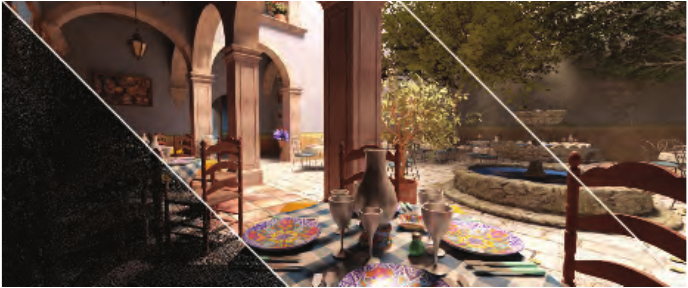

图11.42：时空方差引导滤波可以对每像素一个样本的路径追踪图像（左）进行去噪，生成平滑且没有伪影的图像（中）。其质量可与每像素使用2048个样本渲染的参考图像（右）相媲美。（图片由NVIDIA公司提供。）

为了生成高质量图像，每个像素可能需要追踪数百条乃至数千条光线。即使拥有最优的BVH、高效的树遍历算法和高速GPU，目前也只有最简单的场景才可能实时完成这样的计算。在现有性能约束下生成的图像噪声极其严重，并不适合直接显示。不过，可以用去噪算法对其进行处理，生成基本没有噪声的图像。请参见图11.42，以及第1044页的图24.2。近年来，这个领域取得了令人瞩目的进展：已有算法能够以每像素仅追踪一条路径所生成的图像为输入，生成在视觉上接近高质量路径追踪参考图的图像[95, 200, 247, 1124, 1563]。

2014年，PowerVR公布了其Wizard GPU[1158]。除了通常的功能之外，它还包含能够在硬件中构建和遍历加速结构的单元（第23.11节）。这个系统证明，人们既有兴趣，也有能力，专门设计固定功能单元来加速光线投射。未来的发展令人期待！

## 第11章 延伸阅读与资源

来源：《Real-Time Rendering》第4版，书页512（PDF物理页533），章末未编号的“Further Reading and Resources”全部内容。文中关于资源是否免费等表述保留原书出版时的语境。

Pharr等人的《基于物理的渲染》（Physically Based Rendering）[1413]是一本介绍非交互式全局光照算法的优秀指南。他们的工作尤为可贵之处，在于深入描述了那些经他们实践发现确实行之有效的方法。Glassner的《数字图像合成原理》（Principles of Digital Image Synthesis）[543, 544]如今已可免费获取，该书讨论了光与物质相互作用的物理层面。Dutré等人的《高级全局光照》（Advanced Global Illumination）[400]介绍了辐射度量学基础，以及求解Kajiya渲染方程的方法（主要是离线方法）。McGuire的《图形学宝典》（Graphics Codex）[1188]是一部电子参考资料，收录了大量与计算机图形学有关的方程和算法。Dutré的参考资料《全局光照汇编》（Global Illumination Compendium）[399]虽然年代已久，但可以免费获取。Shirley的一系列短篇书籍[1628]则为学习光线追踪提供了一条花费不多、入门快捷的途径。
