# Real-Time Rendering 第12章 图像空间效果 中文合集

> 依据用户提供的《Real-Time Rendering》第四版 PDF 完整翻译。原图配中文图注；复杂数学已排版为本地图片，简单符号直接显示。保留原书技术年代、公式编号与引用编号。

## 目录

- [12.1 图像处理](<Real-Time_Rendering_4th_中文/第12章/12.01.md>)

- [12.2 重投影技术](<Real-Time_Rendering_4th_中文/第12章/12.02.md>)

- [12.3 镜头光晕与泛光](<Real-Time_Rendering_4th_中文/第12章/12.03.md>)

- [12.4 景深](<Real-Time_Rendering_4th_中文/第12章/12.04.md>)

- [12.5 运动模糊](<Real-Time_Rendering_4th_中文/第12章/12.05.md>)

## 章首导言

来源：原书第 513 页（PDF 第 534 页），第 12 章章首标题、题辞及第 12.1 节之前的导言。

> “世界不再天旋地转了。它只是十分清晰、明亮，边缘却有些模糊。”
>
> ——欧内斯特·海明威

制作图像所涉及的事情，不只是描绘物体。让图像显得具有照片级真实感，其中一部分就是让它看起来像照片。正如摄影师会调整最终作品一样，我们也可能希望修改诸如色彩平衡之类的属性。在渲染图像中加入胶片颗粒、暗角及其他细微变化，可以使渲染结果更具说服力。另一方面，镜头光晕和辉光等更强烈的效果，可以营造戏剧感。表现景深与运动模糊既能增强真实感，也可用于艺术表达。

GPU 可以高效地采样和处理图像。本章首先讨论使用图像处理技术修改渲染图像。深度和法线等附加数据可以增强这些操作，例如在平滑噪声区域的同时仍然保留锐利边缘。重投影方法可以节省着色计算，或快速创建缺失帧。最后，我们将介绍多种基于采样的技术，用以产生镜头光晕、辉光、景深、运动模糊及其他效果。

## 12.1 图像处理

来源：原书第 513—522 页（PDF 第 534—543 页）。本节自“12.1 Image Processing”起，止于“12.2 Reprojection Techniques”之前；章首标题、题辞和导言另见《12.00_章首导言》。

图形加速器通常着眼于根据几何与着色描述创建人工场景。图像处理则有所不同：我们取得一幅输入图像，以各种方式对其进行修改。可编程着色器与将输出图像用作输入纹理的能力相结合，为利用 GPU 实现各种图像处理效果铺平了道路。这些效果可以与图像合成结合使用。通常，先生成一幅图像，再对其执行一次或多次图像处理操作。在渲染之后修改图像，称为**后处理**。即使只渲染一帧，也可以执行大量访问图像、深度及其他缓冲区的处理遍次 [46, 1918]。例如，游戏《战地 4》拥有五十多种不同类型的渲染遍次 [1313]，尽管不会在同一帧中全部使用。

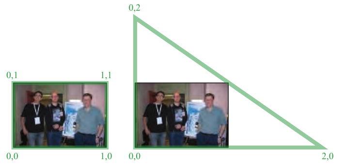

**图 12.1** 左图是一个铺满屏幕的四边形，标出了其（u, v）纹理坐标。右图用单个三角形铺满屏幕，并适当调整其纹理坐标，以获得相同的映射。

使用 GPU 进行后处理有几项关键技术。首先，以某种形式把场景渲染到离屏缓冲区，例如颜色图像、z 深度缓冲区，或同时生成两者。随后将得到的图像视为纹理，并把该纹理应用于一个铺满屏幕的四边形。通过渲染这个四边形来执行后处理，因为像素着色器程序会针对每个像素被调用。大多数图像处理效果都需要在相应像素处取得图像中对应纹素的信息。根据系统限制与算法的不同，可以通过从 GPU 获取像素位置来实现，也可以给四边形分配 [0, 1] 范围内的纹理坐标，再按输入图像的尺寸进行缩放。

实际使用时，铺满屏幕的三角形可能比四边形更高效。例如，在 AMD GCN 架构上，用单个三角形代替由两个三角形组成的四边形，能够改善缓存一致性，使图像处理速度提升近 10% [381]。只需把三角形做得足够大，使它覆盖整个屏幕 [146]，如图 12.1 所示。无论使用哪一种图元，目的都是相同的：让屏幕上的每个像素都执行像素着色器。这种渲染称为**全屏遍次**。如果系统支持，也可以使用计算着色器执行图像处理操作。这样做有几项优点，后文将加以说明。

使用传统流水线时，现在已经具备了让像素着色器访问图像数据的条件。着色器取回所有相关的邻近样本，并对其执行操作。每个邻居的贡献乘上一个权重，其数值取决于该邻居相对于当前所计算像素的位置。有些操作，例如边缘检测，使用固定大小的邻域（如 3 × 3 像素），并为每个邻居以及像素本身的原始值赋予不同的权重，有时权重为负。将各个纹素值乘以相应权重，再将结果相加，就得到最终结果。

如第 5.4.1 节所述，可以使用各种滤波核重建信号。类似地，也可以用滤波核模糊图像。**旋转不变滤波核**为每个参与计算的纹素分配权重时，不依赖于径向角度。也就是说，这类滤波核完全由纹素到滤波操作中心像素的距离来描述。第 135 页式（5.22）中的 sinc 滤波器就是一个简单例子。高斯滤波器呈现为熟知的钟形曲线，是一种常用的滤波核：

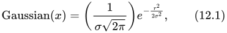

其中，r 是距纹素中心的距离，σ 是标准差；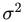 称为方差。标准差越大，钟形曲线就越宽。一条粗略的经验法则是，初始时可把**支撑范围**（即滤波器的大小）设为 3σ 像素宽或更大 [1795]。支撑范围越宽，模糊越强，但代价是更多的内存访问。

> 译注：原式左侧写作 Gaussian(x)，右侧及随后的文字使用 r 表示距离；此处保留原书记号，未将 x 暗改为 r。

e 前面的因子使连续曲线下方的面积保持为 1。不过，在构造离散滤波核时，这个因子无关紧要。我们将区域内为各个纹素计算的数值相加，然后用这个总和去除所有数值，使最终权重之和等于 1。由于存在这一归一化过程，常数因子没有作用，因此在滤波核的描述中常常将其省去。图 12.2 中的二维和一维高斯滤波器就是这样构造的。

sinc 和高斯滤波器的一个问题在于，它们的函数会无限延伸。一种权宜方法是把滤波器截断在指定直径或正方形区域内，直接将范围之外的所有值视为 0。其他滤波核则针对不同性质进行设计，例如易于控制、平滑性，或计算简单。Bjorke [156] 和 Mitchell 等人 [1218] 给出了一些常见的旋转不变滤波器，以及在 GPU 上进行图像处理的其他信息。

任何全屏滤波操作都会尝试采样显示区域边界之外的像素。例如，如果为屏幕左上角像素收集 3 × 3 个样本，就会试图读取不存在的纹素。一种基本解决方法是把纹理采样器设为边缘钳制：请求屏幕外不存在的纹素时，改为读取距离它最近的边缘纹素。这会在图像边缘引入滤波误差，但这些误差通常不明显。另一种方法是以略高于显示区域的分辨率生成待滤波图像，使屏幕外的这些纹素实际存在。

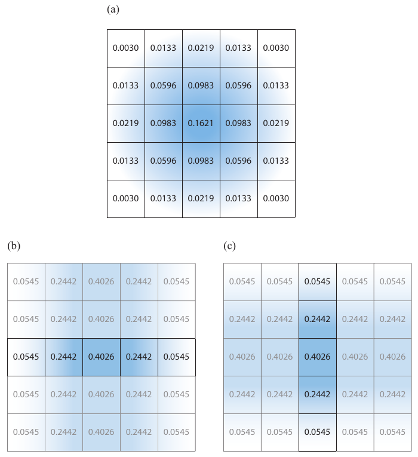

**图 12.2** 一种执行高斯模糊的方法是对 5 × 5 区域进行采样，对每项贡献加权并求和。图（a）展示了 σ = 1 时模糊核的这些权重。第二种方法是使用可分离滤波器：依次执行（b）和（c）所示的两个一维高斯模糊，最终结果相同。（b）以 5 个独立行展示了第一遍操作：使用每个像素所在行的 5 个样本，对该像素进行水平模糊。第二遍操作（c）对（b）的输出图像应用一个含 5 个样本的垂直模糊滤波器，得到最终结果。将（b）中的权重与（c）中的权重相乘，就得到（a）中的相同权重，说明两种滤波等价，因此这个滤波器是可分离的。（a）需要 25 个样本，而（b）与（c）实际各自只需每像素 5 个样本，合计 10 个样本。

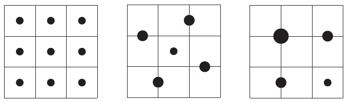

**图 12.3** 左图通过执行 9 次纹理采样并对各项贡献取平均，应用盒式滤波器。中图使用由 5 个样本组成的对称模式，外围样本各代表两个纹素，因此其权重均为中心样本的两倍。这种模式对其他滤波核也可能有用：在外围样本所对应的两个纹素之间移动采样位置，可以改变各纹素的相对贡献。右图则采用更高效的 4 样本模式。左上方样本在 4 个纹素的值之间插值；右上方和左下方样本各在两个纹素的值之间插值。每个样本的权重与它所代表的纹素数量成正比。

使用 GPU 的一个优点是，可以利用内置的插值和 mipmap 硬件来尽量减少纹素访问次数。例如，假设目标是使用盒式滤波器，即对给定纹素周围构成 3 × 3 网格的 9 个纹素求平均，并显示这个模糊结果。像素着色器对这 9 个纹理样本加权、求和，随后把模糊结果输出到像素。

然而，并不需要显式地执行 9 次采样。利用纹理的双线性插值，单次纹理访问就能取得最多 4 个相邻纹素的加权和 [1638]。根据这个思路，只需 4 次纹理访问就能采样整个 3 × 3 网格，见图 12.3。对于权重相等的盒式滤波器，可以将单个采样点放在 4 个纹素的正中间，得到四者的平均值。对于高斯等滤波器，其权重的差异可能导致在 4 个样本之间进行双线性插值不够准确；此时仍然可以把每个采样点放在两个纹素之间，只是让它更靠近其中一个。例如，假设一个纹素的权重为 0.01，相邻纹素的权重为 0.04。那么，可以把采样点放在距第一个纹素 0.8、距相邻纹素 0.2 的位置，从而让每个纹素取得正确的贡献比例。这个单一样本的权重等于两个纹素权重之和，即 0.05。另一种做法是，每 4 个纹素使用一次双线性插值采样，并寻找最接近理想权重的偏移量，以此近似高斯滤波器。

某些滤波核是**可分离的**，高斯滤波器和盒式滤波器就是两个例子。这意味着可以通过两次独立的一维模糊来应用它们，从而大幅减少总纹素访问量。成本从 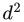 降为 2d，其中 d 是滤波核直径或支撑范围 [815, 1218, 1289]。例如，假设要对图像中每个像素的 5 × 5 区域应用盒式滤波器。首先可沿水平方向滤波：将每个像素左边两个相邻纹素、右边两个相邻纹素以及像素本身的值，都乘以相同权重 0.2 后求和。接着沿垂直方向模糊结果图像，将中心像素与其上、下各两个相邻纹素取平均。这样就不必在一遍中访问 25 个纹素，而是在两遍中总共访问 10 个纹素。见图 12.2。滤波核越宽，收益就越大。

圆盘滤波器可用于散景效果（第 12.4 节），通常计算代价较高，因为它们在实数域内不可分离。不过，使用复数可以得到一大类可分离函数。Wronski [1923] 讨论了这种可分离滤波器的实现细节。

计算着色器很适合执行滤波，而且滤波核越大，相对于像素着色器的性能优势就越明显 [1102, 1710]。例如，可以利用线程组内存，在不同像素的滤波计算之间共享图像访问结果，从而减少带宽需求 [1971]。利用计算着色器的分散写入，可以以恒定成本执行任意半径的盒式滤波器。对于水平与垂直两遍操作，先计算一行或一列中第一个像素的滤波核结果。随后每个像素的结果，都由加入滤波核前进边缘处的下一个样本、减去后方远端被移出窗口的样本来确定。这种“移动平均”技术能够在恒定时间内近似任意大小的高斯模糊 [531, 588, 817]。

**下采样**是模糊处理中另一种常用的 GPU 相关技术。其思路是创建一份尺寸更小的图像供处理，例如将两个轴上的分辨率都减半，得到屏幕四分之一大小的图像。根据输入数据与算法要求，可以对原始图像进行滤波缩小，也可以直接以较低分辨率创建图像。当读取这幅图像并将其混合到最终全分辨率图像中时，纹理放大会使用双线性插值在样本间混合，从而进一步产生模糊效果。在原图的较小版本上执行操作，能够显著减少纹素访问总量。此外，施加于较小图像的任何滤波器，都会产生增大滤波核相对尺寸的效果。例如，在缩小的图像上使用宽度为 5 的滤波核（即中心像素两侧各两个纹素），其效果类似于在原图上使用宽度为 9 的滤波核。质量会有所下降，但对颜色相近的大区域进行模糊时，大多数伪影都很轻微；许多眩光效果及其他现象就属于这种常见情形 [815]。减少每像素的位数，也是降低内存访问成本的一种方法。下采样还可以用于其他缓慢变化的现象，例如许多粒子系统可以用一半分辨率渲染 [1391]。还可以进一步扩展这一思路，为图像创建 mipmap 并从多个层级采样，以加快模糊处理 [937, 1120]。

### 12.1.1 双边滤波

使用某种形式的**双边滤波器**，可以改善上采样结果及其他图像处理操作 [378, 1355]。其思路是，对于那些看起来与中心样本所在表面无关的样本，舍弃它们或降低其影响。这种滤波器用于保留边缘。想象一下，把相机对焦在一个红色物体上；它位于远处的蓝色物体前方，背景为灰色。蓝色物体应当模糊，红色物体则应保持清晰。一个简单的双边滤波器会检查像素颜色：如果为红色，则不进行模糊，使该物体保持清晰；否则，就模糊该像素。所有非红色样本都会用于模糊这个像素。见图 12.4。

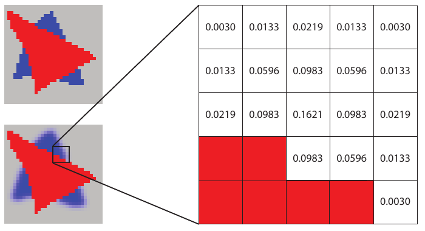

**图 12.4** 双边滤波器。左上方为原始图像。左下方进行模糊，只使用非红色像素的样本。右侧展示了某个像素的滤波核。计算高斯模糊时忽略红色像素。其余像素的颜色乘以相应滤波权重并求和，同时也计算这些权重的总和。在这个例子中，权重总和为 0.8755，因此计算所得的颜色要除以该值。

在这个例子中，可以通过检查颜色来判断应该忽略哪些像素。**联合双边滤波器**（也称**交叉双边滤波器**）使用额外信息，例如深度、法线、标识值、速度或其他数据，来确定是否使用邻近样本。例如，Ownby 等人 [1343] 展示了阴影映射仅使用少量样本时可能出现的图案。模糊这些结果可以显著改善视觉效果。然而，一个物体上的阴影不应该影响另一个无关模型，而模糊会使阴影渗出物体边缘。他们使用双边滤波器，通过比较给定像素与其邻居的深度，舍弃位于不同表面上的样本。以这种方式降低区域内的变化程度，称为**去噪**；它常用于屏幕空间环境光遮蔽算法（第 11.3.6 节），例如文献 [1971]。

仅使用到相机的距离来寻找边缘，往往并不充分。例如，一片软阴影跨过立方体两个面之间形成的棱边时，可能只落在其中一个面上，另一个面则背向光源。只使用深度，可能会在模糊时让阴影从一个面渗到另一个面，因为这条边缘没有被检测出来。为解决这一问题，可以只使用深度与表面法线都与中心样本相近的邻居。这样就能限制跨越共享边缘的样本，因此这类双边滤波器也称为**保边滤波器**。是否削弱或忽略邻近样本的影响，以及削弱多少，由开发者决定，并取决于模型、渲染算法与观察条件等因素。

除检查邻居和累加权重所花费的额外时间之外，双边滤波还有其他性能成本。两遍可分离滤波和双线性插值加权采样等滤波优化手段更难使用。我们事先不知道哪些样本应被舍弃或降低影响，因此无法使用让 GPU 在一次“采样”（tap）中收集多个图像纹素的技术。尽管如此，可分离的两遍滤波器所具有的速度优势，仍促成了一些近似方法 [1396, 1971]。

Paris 等人 [1355] 讨论了双边滤波器的许多其他应用。凡是既要保留边缘、又可通过复用样本来降低噪声的地方，都能应用双边滤波器。它们也用于将着色频率与几何体的渲染频率解耦。例如，Yang 等人 [1944] 先以较低分辨率执行着色，再利用法线与深度，在上采样期间执行双边滤波，生成最终帧。另一种方法是**最近深度滤波**：取出低分辨率图像中的 4 个样本，选用深度最接近高分辨率图像相应深度的那个样本 [816]。Hennessy [717] 和 Pesce [1396] 对这些以及其他图像上采样方法进行了对照比较。低分辨率渲染的一个问题是可能丢失精细细节。Herzog 等人 [733] 利用时间连贯性和重投影进一步改善质量。注意，双边滤波器不可分离，因为每个像素的样本数可能不同。Green [589] 指出，将它当作可分离滤波器所产生的伪影，可以被其他着色效果掩盖。

实现后处理流水线的一种常见方法是使用**乒乓缓冲区** [1303]。这个思路很简单：在两个离屏缓冲区之间施加操作，两者各自用于保存中间结果或最终结果。在第一遍中，第一个缓冲区是输入纹理，输出写入第二个缓冲区。下一遍中两者角色互换：第二个缓冲区作为输入纹理，第一个缓冲区被复用来接收输出。在这第二遍中，第一个缓冲区的原始内容被覆盖；它是**瞬态资源**，用作某一处理遍次的临时存储。管理与复用瞬态资源，是设计现代渲染系统的关键要素 [1313]。从架构角度看，让每个独立遍次执行一种特定效果很方便。不过，为了提高效率，最好在单个遍次中尽可能合并更多效果 [1918]。

在前面的章节中，能够访问邻居的像素着色器已经用于形态学抗锯齿、软阴影、屏幕空间环境光遮蔽及其他技术。后处理效果通常作用于最终图像，可以模拟热成像 [734]，再现胶片颗粒 [1273] 和色差 [539]，执行边缘检测 [156, 506, 1218]，生成热浪扰动 [1273] 和涟漪 [58]，对图像进行色调分离 [58]，辅助渲染云 [90]，以及执行大量其他操作 [156, 539, 814, 1216, 1217, 1289]。第 15.2.3 节介绍了几种用于非真实感渲染的图像处理技术。图 12.5 仅展示其中少量例子。这些方法都只使用一幅颜色图像作为输入。

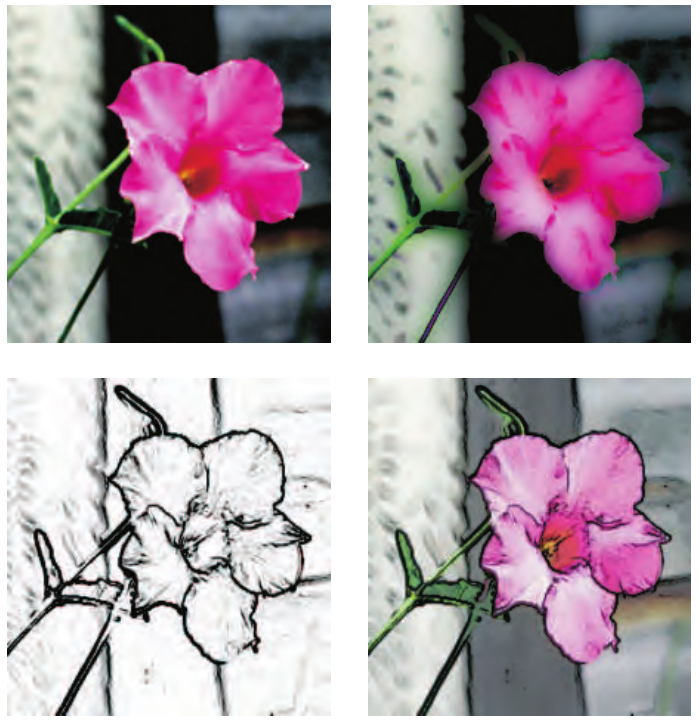

**图 12.5** 使用像素着色器进行图像处理。左上角的原始图像经过了几种不同处理。右上角为高斯差分操作，左下角为边缘检测，右下角则是将边缘检测结果与原始图像混合而成的合成图。（图片由 NVIDIA 公司提供。）

我们不再继续穷尽所有可能的算法，作出一份详尽却也令人疲惫的长篇罗列，而将在本章余下部分介绍一些通过各种公告板和图像处理技术实现的效果。

## 12.2 重投影技术

来源：《Real-Time Rendering, Fourth Edition》，书页 522—523（PDF 第 543—544 页）；边界核对至 PDF 第 545 页的 12.3 节标题之前。

重投影的基本思想是复用先前帧中计算出的样本。顾名思义，在观察位置和朝向发生变化后，仍尽可能复用这些样本。重投影方法的一个目标，是将渲染成本分摊到多个帧上，也就是利用时间连贯性。因此，它也与第 5.4.2 节介绍的时间抗锯齿有关。另一个目标，是在应用程序未能及时完成当前帧的渲染时，生成一个近似结果。这种做法对于虚拟现实应用尤为重要，可以避免模拟器眩晕症（第 21.4.1 节）。

重投影方法分为**反向重投影**和**正向重投影**。反向重投影 [1264, 1556] 的基本思想如图 12.6 所示。在时刻 t 渲染一个三角形时，同时计算当前帧（t）和前一帧（t − 1）的顶点位置。利用顶点着色得到的 z 和 w，像素着色器可以分别计算 t 和 t − 1 时刻的插值 z/w；如果二者足够接近，就可以在前一帧的颜色缓冲区中，在 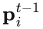 处进行双线性查找，并使用查得的着色值，而无须计算新的着色值。对于先前被遮挡、随后变为可见的区域（例如图 12.6 中的深绿色区域），没有可用的已着色像素。这种情况称为**缓存未命中**。此时，我们通过重新计算像素着色来填补这些空洞。由于复用着色值的前提，是这些值与任何类型的运动（物体、相机、光源的运动）都无关，因此不宜在过多的帧中持续复用着色值。Nehab 等人 [1264] 建议，在复用若干帧之后，始终应进行一次自动刷新。一种实现方法是将屏幕划分为 n 组，每组由伪随机选取的 2 × 2 像素区域构成。每帧更新其中一组，这样就能避免像素值被复用过久。反向重投影的另一种变体，是存储一个速度缓冲区，并在屏幕空间中完成所有测试，从而避免对顶点进行两次变换。

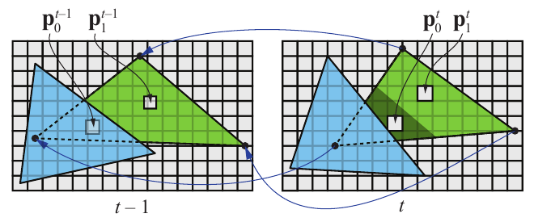

**图 12.6**　在时刻 t − 1 以及紧随其后的时刻 t，绿色三角形和蓝色三角形的状态。绿色三角形上位于两个像素中心的三维点 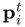，连同像素覆盖的面积，一起反向重投影到点 。可以看到，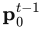 被遮挡，而 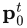 可见，此时无法复用已有的着色结果。不过， 在 t − 1 和 t 时刻都可见，因此该点的着色结果有可能被复用。（插图根据 Nehab 等人 [1264] 的图绘制。）

为了获得更好的质量，还可以使用**运行平均滤波器** [1264, 1556]，逐渐减弱旧值的影响。对于空间抗锯齿、软阴影和全局光照，尤其推荐使用这类滤波器。该滤波器可表示为：

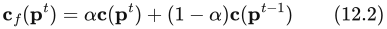

其中，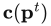 是在 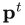 处新计算的像素着色值，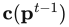 是从前一帧反向重投影得到的颜色，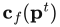 则是应用滤波器后的最终颜色。Nehab 等人在一些使用场景中采用 α = 3/5，但建议根据所渲染的内容尝试不同的取值。

正向重投影则从第 t − 1 帧的像素出发，将它们投影到第 t 帧，因此无须进行两次顶点着色。这意味着第 t − 1 帧的像素被**散射**到第 t 帧，而反向重投影方法则从第 t − 1 帧**收集**像素值，供第 t 帧使用。这些方法同样需要处理原先被遮挡、随后变为可见的区域，通常采用各种启发式空洞填补方法，即根据周围像素推断缺失区域中的值。Yu 等人 [1952] 使用正向重投影，以较低的成本计算景深效果。Didyk 等人 [350] 没有采用传统的空洞填补，而是根据运动向量，在第 t − 1 帧上自适应地生成一个网格，以避免出现空洞。该网格被投影到第 t 帧，并在启用深度测试的情况下进行渲染；这意味着，在对自适应网格的三角形进行带深度测试的光栅化时，遮挡和折叠重叠也一并得到处理。Didyk 等人用这种方法将左眼图像重投影为右眼图像，从而为虚拟现实生成一对立体图像；这两幅图像之间通常具有很高的连贯性。后来，Didyk 等人 [351] 又提出了一种基于感知的方法来进行时间上采样，例如将帧率从 40 Hz 提升到 120 Hz。

Yang 和 Bowles [185, 1945, 1946] 提出了一些方法，将 t 和 t + 1 时刻的两帧投影到二者之间 t + δt 时刻的一帧，即 δt ∈ [0, 1]。由于使用两帧而非仅一帧，这些方法更有可能妥善处理遮挡情况。这类方法已用于游戏中，将帧率从 30 FPS 提升到 60 FPS；其方法的运行时间不足 1 ms，因此能够实现这样的提升。我们推荐阅读他们的课程讲义 [1946]，以及 Scherzer 等人 [1559] 对时间连贯性方法所作的广泛综述。Valient [1812] 也在《Killzone: Shadow Fall》中使用重投影来加速渲染。关于将重投影用于时间抗锯齿的实现细节，可参阅第 5.4.2 节末尾附近列出的众多参考文献。

## 12.3 镜头光晕与泛光

来源：《Real-Time Rendering》第4版，书页 524—527（PDF 物理页 545—548）；本节图 12.9 及其完整图注位于书页 528（PDF 物理页 549）。正文范围从 12.3 标题起，到 12.4 标题前止。

*镜头光晕*（lens flare）是一种现象：光通过镜头系统或人眼时，沿间接反射或其他非预期路径传播，从而产生这种现象。光晕可按不同现象加以分类，其中最显著的是光环（halo）和睫状光冠（ciliary corona）。光环由晶状体结构中的径向纤维造成。它看起来像围绕光源的一圈环，外缘略带红色，内缘略带紫色。无论光源距离多远，光环的视大小都保持不变。睫状光冠来自晶状体内的密度起伏，看起来像从一个点向外辐射的光线，并且可能延伸到光环之外 [1683]。

当镜头的某些部分在内部反射或折射光线时，相机镜头还会产生次生效果。例如，相机的光圈叶片可能造成多边形图案。挡风玻璃上也能看到横向拖开的光条，这是玻璃中细小沟槽造成的 [1303]。*泛光*（bloom）由晶状体和人眼其他部分中的散射引起，它在光源周围形成辉光，并降低场景其他区域的对比度。摄像机使用*电荷耦合器件*（charge-coupled device，CCD）将光子转换为电荷，从而捕获图像。当 CCD 中的一个电荷存储单元饱和，电荷溢出到相邻单元时，摄像机中就会出现泛光。光环、光冠和泛光统称为*眩光效果*（glare effects）。

实际上，随着相机技术的改进，这类伪影中的大多数已越来越少见。更好的设计、遮光罩和抗反射镀膜能够减少或消除这些杂散鬼影伪影 [598, 786]。然而，如今人们经常以数字方式把这些效果添加到真实照片中。由于计算机显示器能够产生的光强有限，我们可以通过向图像中添加这类效果，让人感觉场景或物体的亮度有所增加 [1951]。由于使用得十分普遍，泛光效果和镜头光晕在照片、电影与交互式计算机图形中几乎已成了陈词滥调。尽管如此，运用得当时，这些效果仍能为观看者提供强烈的视觉线索。

为了产生令人信服的效果，镜头光晕应当随光源位置改变。King [899] 创建了一组带有不同纹理的正方形来表示镜头光晕。然后沿一条从光源的屏幕位置穿过屏幕中心的直线布置这些正方形。当光源远离屏幕中心时，这些正方形较小、较透明；随着光源向内移动，它们逐渐变大、变得更不透明。Maughan [1140] 利用 GPU 计算屏幕内面光源受到遮挡的程度，以此改变镜头光晕的亮度。他生成一张单像素的强度纹理，然后用它来衰减该效果的亮度。Sekulic [1600] 将光源渲染为一个多边形，利用遮挡查询硬件给出可见区域的像素数（第 19.7.1 节）。为了避免等待查询向 CPU 返回数值而导致 GPU 停顿，他在下一帧使用查询结果来确定衰减量。由于强度很可能以相当连续且可预测的方式变化，一帧的延迟几乎不会造成感知上的混乱。Gjøl 和 Svendsen [539] 首先生成深度缓冲区（他们也将其用于其他效果），然后在镜头光晕将要出现的区域中，按螺旋模式对其采样 32 次，并利用结果衰减光晕纹理。这种可见性采样在渲染光晕几何体时由顶点着色器完成，因此避免了硬件遮挡查询引起的延迟。

**图 12.7.** 镜头光晕、星形眩光和泛光效果，以及景深和运动模糊 [1208]。注意，一些运动小球上存在因累积多幅独立图像而产生的频闪伪影。（图片来自 Masaki Kawase 的“Rthdribl”。）

场景中明亮物体或光源产生的光条，也可以采用类似方式实现：绘制半透明公告板，或者直接对明亮像素进行后处理滤波。《侠盗猎车手 V》（Grand Theft Auto V）等游戏使用一组应用于公告板的纹理来实现这些及其他效果 [293]。

Oat [1303] 讨论了使用*可转向滤波器*（steerable filter）产生光条效果的方法。这类滤波器并非在某个区域上进行对称滤波，而是被赋予一个方向。沿该方向累加纹素值，便产生光条效果。将图像下采样至原宽度和高度的四分之一，再利用乒乓缓冲区执行两个遍次，就能获得令人信服的光条效果。图 12.7 展示了这种技术的一个例子。

**图 12.8.** 游戏《巫师 3》（The Witcher 3）中生成太阳光晕的过程。首先，对输入图像应用一条高对比度校正曲线，以分离出太阳未被遮挡的部分。接着，对图像应用以太阳为中心的径向模糊。如左侧所示，这些模糊操作依次执行，每次都作用于上一次的输出。这样可以生成平滑、高质量的模糊，同时在每个遍次中仅使用有限数量的采样，以提高效率。所有模糊操作均在半分辨率下执行，以降低运行时开销。最终的光晕图像通过加法与原始场景渲染结果合成。（CD PROJEKT®、The Witcher® 是 CD PROJEKT Capital Group 的注册商标。《巫师》游戏 © CD PROJEKT S.A.。由 CD PROJEKT S.A. 开发。保留所有权利。《巫师》游戏根据 Andrzej Sapkowski 的文学作品改编。其他所有版权及商标均归其各自所有者所有。）

此外还有许多变体和技术，其方法远远超出了公告板。Mittring [1229] 使用图像处理分离明亮部分，对其下采样，并在多张纹理中进行模糊。随后，通过复制、缩放、镜像翻转和着色，将这些纹理重新合成到最终图像之上。采用这种方法时，美术人员无法独立控制每个光晕源的外观：每个光晕都会经过同样的处理。不过，图像中的任何明亮部分都可以产生镜头光晕，例如镜面反射、表面的自发光部分，或明亮的火花粒子。Wronski [1919] 描述了变形宽银幕镜头光晕（anamorphic lens flares），这是 20 世纪 50 年代所用电影摄影设备的一种副产物。Hullin 等人 [598, 786] 为各种鬼影伪影提供了一个物理模型，通过追踪光线束来计算效果。该方法根据镜头系统的设计产生可信的结果，并可在精度与性能之间进行权衡。Lee 和 Eisemann [1012] 在此工作基础上，采用一种线性模型来避免昂贵的预处理。Hennessy [716] 给出了实现细节。图 12.8 展示了一个在实际制作中使用的典型镜头光晕系统。

泛光效果使极亮区域向相邻像素溢出，可以通过组合前面介绍过的几种技术来实现。其主要思路是，创建一张只包含那些将要“过曝”的明亮物体的泛光图像，对它进行模糊，再将其合成回正常图像。通常采用高斯模糊 [832]，不过近期与参考照片的匹配表明，这种分布更接近尖峰形状 [512]。生成这张图像的一种常用方法是*亮通滤波*（bright-pass filter）：保留所有明亮像素，将所有暗淡像素设为黑色，并且往往在过渡点处做一些混合或缩放 [1616, 1674]。如果只需要对少数几个小物体施加泛光，可以计算一个屏幕包围盒，以限制后处理模糊和合成遍次的作用范围 [1859]。

这张泛光图像可以按较低分辨率渲染，例如宽度和高度分别为原图的二分之一到八分之一。这样既能节省时间，也有助于增强滤波效果。对这张低分辨率图像进行模糊，然后与原图合成。许多后处理效果都采用了这种降低分辨率的方法，也使用压缩或以其他方式降低颜色分辨率的技术 [1877]。泛光图像可以被多次下采样，然后从生成的这组图像中重新采样，从而在尽量降低采样开销的同时得到范围更广的模糊效果 [832, 1391, 1918]。例如，一个在屏幕上移动的明亮像素可能引起闪烁，因为某些帧中可能没有采样到它。

由于目标是让图像的明亮区域看起来过曝，因此可以按需缩放这张图像的颜色值，再将其加到原图上。加法混合会使颜色达到饱和，随后变为白色，这通常正是我们希望得到的结果。图 12.9 展示了一个例子。也可以使用 Alpha 混合，以获得更多艺术控制 [1859]。采用高动态范围图像进行滤波，而不是进行阈值截断，可以得到更好的结果 [512, 832]。还可以分别计算低动态范围和高动态范围泛光，再将其合成，以更令人信服的方式表现不同现象 [539]。其他变体也可行，例如还可以将前一帧的结果加到当前帧，使运动物体产生带拖尾的辉光 [815]。

**图 12.9.** 高动态范围色调映射与泛光。下方图像是在原图上进行色调映射并添加后处理泛光而得到的 [1869]。（图片来自《孤岛惊魂》（Far Cry），由 Ubisoft 提供。）

图内文字：bright-pass filter and downsample＝亮通滤波并下采样；two-pass blur＝两遍次模糊；tone map＝色调映射；add original and magnified blur＝将原图与放大后的模糊图相加。

## 12.4 景深

来源：《Real-Time Rendering, Fourth Edition》，书页 527—536（PDF 物理页 548—557）。本节自“12.4 Depth of Field”开始，至“12.5 Motion Blur”之前结束；PDF 第 549 页的图 12.9 属于上一节，不收录于此。

相机镜头在给定设置下，有一个能使物体清晰成像的范围，这就是它的景深（depth of field）。范围之外的物体是模糊的，离这个范围越远，就越模糊。在摄影中，这种模糊程度与光圈大小和焦距有关。缩小光圈会增大景深，也就是说，能清晰成像的深度范围会更宽，但形成图像的光量会减少（第 9.2 节）。白天在室外场景拍摄的照片通常具有较大的景深，因为光线充足，可以使用较小的光圈，理想情形是针孔相机。在光照不足的室内，景深会显著变窄。因此，控制景深效果的一种方法是将它与色调映射关联起来，让失焦物体随着光照水平降低而变得更加模糊。另一种方法是允许美术人员手动控制，根据需要改变焦点、增大景深，以获得戏剧性效果。图 12.10 给出了一个例子。

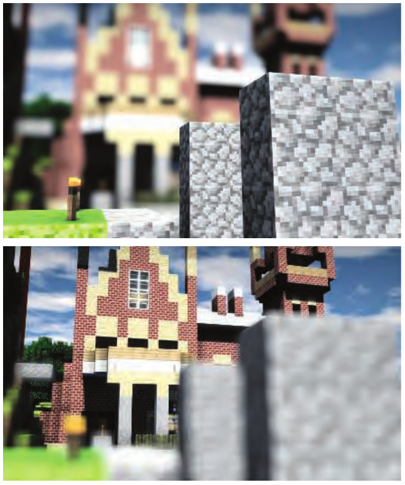

**图 12.10** 景深取决于相机的焦点。（图像使用 G3D 渲染，由 Morgan McGuire 提供 [209, 1178]。）

累积缓冲区可以用来模拟景深 [637]，见图 12.11。改变镜头上的观察位置，同时保持焦点固定，物体就会根据其与该焦点的距离而被渲染得更加模糊。不过，与其他累积效果一样，这种方法代价高昂，每张图像都需要多次渲染。尽管如此，它确实会收敛到正确的基准真值图像，这对于测试很有用。光线追踪也能得到收敛于物理正确结果的图像，方法是改变视线光线在光圈上的位置。为提高效率，许多方法可以对失焦物体使用较低的细节层次。

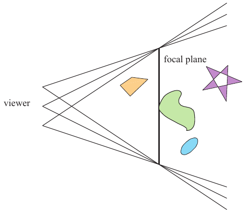

**图 12.11** 通过累积生成景深。观察者的位置发生少量移动，同时保持观察方向指向焦点。将每次渲染的图像相加，并显示所有图像的平均值。图内标记：viewer 为观察者，focal plane 为焦平面。

虽然对交互式应用而言并不实用，但这种在镜头上移动观察位置的累积技术，为理解每个像素应记录什么提供了一种合理思路。可以将表面分成三个区域：焦点距离附近、处于合焦状态的表面，即合焦区或中场（focus field 或 mid-field）；更远处的表面，即远场（far field）；以及更近处的表面，即近场（near field）。对于位于对焦距离处的表面，每个像素都显示一个清晰合焦的区域，因为所有参与累积的图像在这里都具有近似相同的结果。合焦区是一个深度范围，其中的物体只有轻微失焦，例如模糊程度小于半个像素 [209, 1178]。摄影师所说的景深就是这个范围。在交互式计算机图形学中，我们默认使用完全合焦的针孔相机，因此“景深”指的是使近场和远场内容模糊的效果。平均后图像中的每个像素，都是不同视图所看到的所有表面位置的混合；在失焦区域，这些位置可能变化很大，因此会产生模糊。

解决这个问题的一种有局限的方法是创建独立的图像层。分别渲染一张仅包含合焦物体的图像、一张包含更远物体的图像，以及一张包含更近物体的图像。这可以通过改变近、远裁剪平面的位置来实现。对近场和远场图像进行模糊，然后按从后到前的顺序将三张图像合成 [1294]。这种方法称为 2.5 维方法，因为它给二维图像赋予深度并将其组合起来；在某些情况下，它能得到合理结果。当物体跨越多张图像时，这种方法就会出问题：物体会从模糊突然变为合焦。此外，所有经过滤波的物体都具有一致的模糊程度，不会随距离变化 [343]。

理解这一过程的另一种方式，是思考景深如何影响表面上的一个位置。想象表面上有一个很小的点。当表面合焦时，这个点通过单个像素显现。如果表面失焦，那么根据不同的视图，这个点还会出现在附近的像素中。在极限情况下，这个点会在像素网格上形成一个实心圆。这就称为弥散圆（circle of confusion）。

在摄影中，合焦区之外区域的美学品质称为散景（bokeh），该词源于日语中表示“模糊”的词。（这个词读作“bow-ke”；其中“bow”的发音与“bow and arrow”中的“bow”相同，“ke”的发音与“kettle”中的“ke”相同。）通过光圈的光通常是均匀散布的，而不是服从某种高斯分布 [1681]。弥散区域的形状与光圈叶片的数量、形状及光圈大小有关。便宜的相机会产生五边形而非正圆形的模糊。当前大多数新相机使用七片叶片，较高端型号则有九片或更多。更好的相机采用圆弧形叶片，使散景呈圆形 [1915]。夜间拍摄时，光圈较大，其形状可能更接近圆形。与为了强化效果而放大镜头光晕和泛光类似，我们有时会将弥散圆渲染成六边形，以暗示正在使用真实相机拍摄。六边形恰好特别容易用可分离的两遍后处理模糊生成，因此被许多游戏采用，Barré-Brisebois [107] 对此作了解释。

计算景深效果的一种方法，是取每个像素在表面上的位置，将其着色值散布到这个圆或多边形内的相邻像素。见图 12.12 左图。散布（scatter）这一思路并不适合像素着色器的能力。像素着色器能够高效并行运行，正是因为它们不会把结果传播到相邻像素。一种解决办法是为每个近场和远场像素渲染一个精灵（第 13.5 节）[1228, 1677, 1915]。每个精灵都被渲染到单独的场图层中，精灵的大小由弥散圆半径决定。每一层存储所有重叠精灵的混合总和的平均值，然后将这些图层逐层合成。这种方法有时称为正向映射（forward mapping）技术 [343]。即使使用图像降采样，这类方法也可能很慢；更糟糕的是，它们所需的时间会变化，尤其是在合焦区很浅时 [1517, 1681]。性能的变化意味着帧预算，即分配给全部渲染操作的时间，很难管理。这种不可预测性可能造成丢帧，使用户体验不均匀。

另一种理解弥散圆的方式，是假设像素附近的局部邻域具有大致相同的深度。有了这个假设，就可以执行聚集（gather）操作，见图 12.12 右图。像素着色器针对聚集先前渲染遍次的结果进行了优化。因此，实现景深效果的一种方式，是根据每个像素的深度对该处表面进行模糊 [1672]。深度定义了一个弥散圆，它决定应在多大的区域内采样。这类聚集方法称为后向映射或逆向映射（backward mapping 或 reverse mapping）方法。

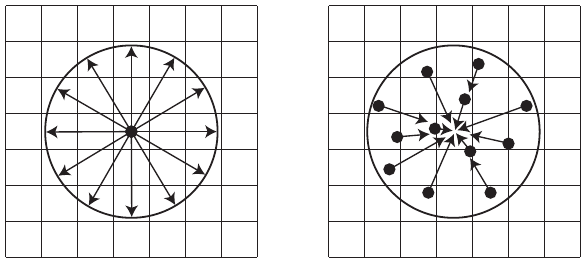

**图 12.12** 散布操作取一个像素的值，并将其分散到相邻区域，例如通过渲染一个圆形精灵来实现。在聚集中，则对相邻值采样，并用它们影响某个像素。GPU 的像素着色器针对通过纹理采样执行聚集操作进行了优化。

大多数实用算法都从单个视点的一张初始图像开始。这意味着从一开始就缺少某些信息。场景的其他视图会看到这个单一视图中不可见的表面部分。正如 Pesce 指出的，我们应当利用已有的可见样本，尽可能做到最好 [1390]。

聚集技术经过多年的发展，每一种都在之前工作的基础上有所改进。这里介绍 Bukowski 等人 [209, 1178] 的方法，以及它针对所遇问题的解决方案。他们的方法根据深度，为每个像素生成一个表示弥散圆半径的带符号值。这个半径可以根据相机的设置和特性推导出来，但美术人员通常希望控制效果，因此也可以选择手动指定近场、合焦区和远场的范围。半径的符号指明像素处于近场还是远场；−0.5 < r < 0.5 表示处于合焦区，此处将半个像素的模糊视为合焦。

随后，利用存有弥散圆半径的缓冲区将图像分成两张：近场图像和其余部分图像；分别对它们降采样，并使用可分离滤波器分两遍进行模糊。分离图像是为了解决一个关键问题：近场物体的边缘应当是模糊的。如果仅根据每个像素的半径进行模糊，再输出到一张图像，前景物体可能内部模糊，边缘却很锐利。例如，从前景物体跨过轮廓边缘进入合焦物体时，采样半径会降至零，因为合焦物体不需要模糊。这会导致前景物体对其周围像素的影响突然下降，从而产生锐利边缘。见图 12.13。

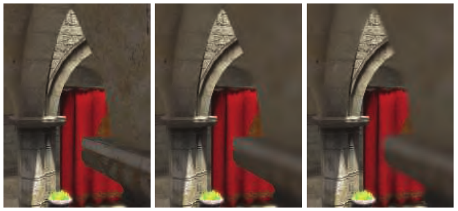

**图 12.13** 近场模糊。左图为没有景深效果的原始图像。中图对近场像素进行了模糊，但它们与合焦区相邻的边缘仍然锐利。右图展示了使用独立近场图像，并将它合成到更远内容之上的效果。（图像使用 G3D 生成 [209, 1178]。）

我们希望近场物体能平滑地模糊，并且在其边界之外也产生影响。为实现这一点，可以将近场像素写入单独的图像，再对其进行模糊。此外，还给这张近场图像的每个像素指定一个表示混合因子的 α 值，并对它进行模糊。创建这两张独立图像时，会使用联合双边滤波和其他测试；具体细节见相关论文 [209, 1178] 及其提供的代码。这些测试有多种用途，例如在远场模糊中，丢弃那些比被采样像素远得多的相邻物体。

完成图像分离和基于弥散圆半径的模糊之后，就进行合成。使用弥散圆半径，在原始合焦图像与远场图像之间进行线性插值。半径越大，模糊的远场结果所占比重就越大。然后使用近场图像中的 α 覆盖率值，将近场图像混合到这个插值结果之上。这样，近场的模糊内容就能正确地扩散到后方场景之上。见图 12.10 和图 12.14。

这个算法通过若干简化和调整使结果看起来合理。粒子可能适合用其他方式处理，而透明度会造成问题，因为这些现象在每个像素中涉及多个 z 深度。尽管如此，这种方法仅以颜色缓冲区和深度缓冲区为输入，且只使用三个后处理遍次，因此简单而且相对稳健。根据弥散圆进行采样，以及将近场和远场分离为独立图像（或多组图像）的思路，是许多景深模拟算法共同采用的主题。接下来将讨论几种用于电子游戏的较新方法（前述方法也用于电子游戏），因为这类方法需要高效、稳健，而且成本可预测。

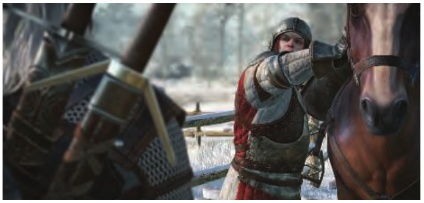

**图 12.14** 《巫师 3》中的景深。近场和远场的模糊与合焦区融合得令人信服。（CD PROJEKT®、The Witcher® 是 CD PROJEKT Capital Group 的注册商标。《巫师》游戏 © CD PROJEKT S.A.。由 CD PROJEKT S.A. 开发。保留所有权利。《巫师》游戏根据 Andrzej Sapkowski 的文学作品改编。所有其他版权和商标均归其各自所有者所有。）

第一种方法采用了一种我们将在下一节“运动模糊”中再次讨论的思路。回到弥散圆的概念，想象将图像中的每个像素都变成它所对应的弥散圆，其强度与圆的面积成反比。按排序后的顺序渲染这组圆，会得到最佳结果。这又回到了散布的思路，所以一般并不实用。这里有价值的是这种思维模型。给定一个像素，我们希望确定覆盖其位置的所有弥散圆，并按排序后的顺序将它们混合。见图 12.15。利用场景中最大的弥散圆半径，可以对每个像素检查此半径范围内的每个相邻像素，判断后者的弥散圆是否包含当前位置。随后，将所有这些会影响该像素的重叠邻域样本排序并混合 [832, 1390]。

这种方法是理想情况，但在 GPU 上对找到的片元排序，代价会过高。因此，实际使用的是称为“边聚集边散布”（scatter as you gather）的方法：通过找出哪些相邻像素会向当前像素位置散布，来进行聚集。选择 z 深度最小（距离最近）的重叠相邻样本，代表较近的图像。其他在 z 深度上与它足够接近的重叠相邻样本，其 α 混合贡献也会被加入，随后取平均值，并将颜色和 α 存入一个“前景”图层。这种混合不需要排序。对所有其他重叠相邻样本同样求和并取平均，将结果放入独立的“背景”图层。这里的前景和背景图层并不对应近场和远场，它们取决于在每个像素区域中实际找到了什么。然后将前景图像合成到背景图像之上，产生近场模糊效果。虽然这种方法听起来复杂，但应用多种采样和滤波技术后，它可以很高效。不同实现可参阅 Jimenez [832]、Sousa [1681]、Sterna [1698] 和 Courrèges [293, 294] 的演讲资料，并查看图 12.16 中的例子。

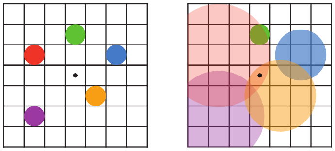

**图 12.15** 相互重叠的弥散圆。左图是包含五个点的场景，所有点都合焦。假设红点距观察者最近，位于近场，其次是橙点；绿点位于合焦区；蓝点和紫点依次位于远场。右图展示应用景深后得到的弥散圆，圆越大，对每个像素的影响越小。绿点保持不变，因为它处于合焦状态。中心像素只被红色和橙色弥散圆覆盖，因此将两者混合，让红色覆盖在橙色之上，得到该像素的颜色。

还有一种在少数较老电子游戏中使用的方法，基于计算热扩散（heat diffusion）的思路。将图像视为向外扩散的热量分布，每个弥散圆代表该像素的导热性。合焦区域是完全绝热的，不发生扩散。Kass 等人 [864] 介绍了如何将一维热扩散系统表示为三对角矩阵，从而能够以每个样本恒定时间的代价求解。存储和求解这类矩阵很适合计算着色器，因此实践者开发了多种实现，沿每个坐标轴将图像分解成这类一维系统 [612, 615, 1102, 1476]。弥散圆的可见性问题依然存在，通常通过根据深度生成独立图层并进行合成来解决。这项技术即使能够处理弥散圆的不连续性，效果也不好，因此如今主要只是一个有趣的研究思路。

画面中的明亮光源或反射会产生一种特殊的景深效果。即使光源或镜面反射由于分散到一个区域而变暗，它的弥散圆仍可能比画面中附近的物体明亮得多。虽然将每个模糊像素都渲染成精灵代价高昂，但这些明亮光源的对比度更高，因此能更清楚地显现出光圈的形状。其余像素之间的差异较小，因此形状就没那么重要。有时人们会（错误地）用“散景”一词专指这些明亮区域。检测高对比度区域，仅将这些少量明亮像素渲染成精灵，同时对其余像素使用聚集技术，就能高效地产生散景形状鲜明的结果 [1229, 1400, 1517]。见图 12.16。计算着色器也能发挥作用，为聚集式景深创建高质量的求和面积表，并为散景进行高效的泼溅绘制（splatting）[764]。

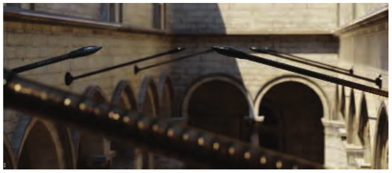

**图 12.16** 近场和远场景深，前景中明亮的反光杆上出现了五边形散景。（图像使用 BakingLab 演示程序生成，由 Matt Pettineo 提供 [1408]。）

我们仅介绍了众多景深与明亮散景渲染方法中的几种，并说明了一些提高处理效率的技术。随机光栅化、光场处理以及其他方法也已得到探索。Vaidyanathan 等人 [1806] 的文章总结了此前的工作，McGuire [1178] 则概述了一些实现。

## 12.5 运动模糊

来源：《Real-Time Rendering》第4版，书页 536—542（PDF 物理页 557—563）。本节从“12.5 Motion Blur”标题开始；章末“延伸阅读与资源”另存于《12.99_延伸阅读与资源》。

要渲染令人信服的图像序列，帧率保持稳定且足够高十分重要。平滑、连续的运动更为理想，而帧率过低会让人感觉运动不连贯。电影以每秒 24 帧（24 FPS）放映，但影院很暗，人眼的时间响应在暗光下对闪烁不那么敏感。此外，电影放映机虽然以 24 FPS 更换图像，却会在显示下一幅图像之前将每幅图像重复显示 2—4 次，以减少闪烁。也许最重要的是，电影的每一帧通常都是经过运动模糊的图像；交互式图形的图像默认情况下却不是。

在电影中，运动模糊来自一帧期间物体在屏幕上的移动，或来自相机运动。这种效果的成因是：每帧占用 1/24 秒，而相机快门在其中开放 1/40 至 1/60 秒。我们习惯于在电影中看到这种模糊，并认为它是正常的，因此也期望在电子游戏中看到它。将快门开放时间缩短为 1/500 秒或更短，可以产生一种异常急促、激烈的运动感；这种效果最早见于《角斗士》和《拯救大兵瑞恩》等电影。

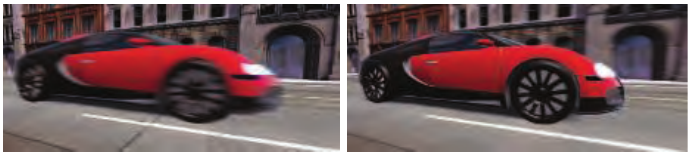

图 12.17：左图中，相机固定，汽车呈现模糊。右图中，相机追踪汽车，于是背景呈现模糊。（图片由 Morgan McGuire 等人提供 [1173]。）

没有运动模糊时，快速移动的物体会显得不连贯，在相邻帧之间“跳过”许多像素。这可以看作一种混叠，与锯齿类似，但本质上发生在时间维度而非空间维度。运动模糊可以看作时间域中的抗锯齿。正如提高显示分辨率能够减少却不能消除锯齿，提高帧率也不能消除对运动模糊的需要。电子游戏的一个特点是相机和物体运动迅速，因此运动模糊可以显著改善其视觉效果。事实上，带有运动模糊的 30 FPS 往往比不带运动模糊的 60 FPS 看起来更好 [51, 437, 584]。

运动模糊取决于相对运动。如果一个物体从左向右穿过屏幕，它就会在屏幕水平方向上变得模糊。如果相机正在追踪一个运动物体，模糊的就不是物体，而是背景。见图 12.17。现实世界中的相机就是这样工作的，而优秀的导演知道如何安排镜头，让观众感兴趣的区域对焦清晰且不产生运动模糊。

与景深类似，累积一系列图像是产生运动模糊的一种方法 [637]。一帧之内有一段快门开放的持续时间。在这段时间中的不同时刻渲染场景，每次都重新设置相机和物体的位置。将得到的图像混合在一起，就能使相对于相机视图移动的物体呈现模糊。对实时渲染而言，这种过程通常适得其反，因为它可能大幅降低帧率。另外，如果物体移动得很快，只要能够分辨出各张独立图像，就会出现可见的伪影。书页 525 的图 12.7 也展示了这一问题。随机光栅化能够避免混合多张图像时产生的重影伪影，但会代之以噪声 [621, 832]。

如果希望表现的是运动感，而非纯粹的真实感，就可以巧妙地利用累积这个概念。设想已经生成一个运动模型的八帧图像，并将它们求和存入高精度缓冲区，随后取平均并显示。到了第九帧，再次渲染模型并累加；与此同时，重新渲染第一帧，并从求和结果中减去它。此时，缓冲区里包含的是第 2 至第 9 帧，共八帧模型图像形成的模糊结果。下一帧时，减去第 2 帧并加入第 10 帧，又得到八帧之和，即第 3 至第 10 帧。这样能产生高度模糊的艺术效果，代价是每一帧都要渲染场景两次 [1192]。

实时图形需要比多次渲染一帧更快的技术。景深和运动模糊都能通过对一组视图取平均来渲染，这说明了两种现象的相似性。要高效地渲染它们，两种效果都需要将样本散布到相邻像素，但我们通常会采用收集方式。它们还需要处理具有不同模糊程度的多个层，并根据单张起始帧的内容重建被遮挡的区域。

运动模糊有几种不同的来源，每种来源都有相应的处理方法。大致按复杂度递增的顺序，可以分为相机朝向变化、相机位置变化、物体位置变化和物体朝向变化。如果相机的位置不变，就可以将整个世界看作包围观察者的天空盒（第 13.3 节）。仅改变朝向，会在整幅图像上产生带有方向性的模糊。给定方向和速率后，我们在每个像素处沿这个方向采样，并由速率决定滤波器的宽度。这种定向模糊称为线积分卷积（line integral convolution，LIC）[219, 703]，也用于流体流动的可视化。Mitchell [1221] 讨论了如何针对给定的运动方向，对立方体环境贴图进行运动模糊。如果相机绕观察轴旋转，则使用圆周模糊；每个像素处的方向和速率会随其相对于旋转中心的位置而变化 [1821]。

如果相机的位置发生变化，视差就会起作用，例如远处物体移动得较慢，因此模糊程度也较低。当相机向前移动时，可以忽略视差。径向模糊可能已经足够，而且可以夸大它来增强戏剧效果。图 12.18 给出了一个例子。

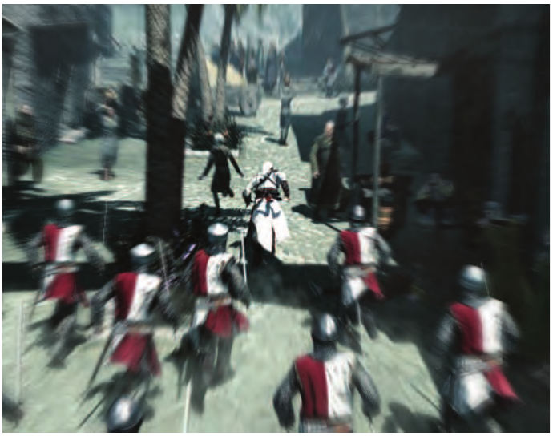

图 12.18：使用径向模糊增强运动感。（图片来自《刺客信条》，由 Ubisoft 提供。）

要提高真实感，例如用于赛车游戏，我们需要一种能够正确计算每个物体运动的模糊方法。如果在朝前观察的同时横向移动，在计算机图形学中这称为平移（pan）¹，深度缓冲区就能告诉我们各个物体应当模糊多少。物体越近，模糊越强。如果向前移动，运动量的计算就更复杂。Rosado [1509] 介绍了使用前一帧的相机视图矩阵即时计算速度的方法。其思路是将像素的屏幕位置和深度逆变换回世界空间位置，再用前一帧的相机将这个世界空间点变换到屏幕位置。这两个屏幕空间位置之差就是速度向量，用于计算该像素的图像模糊。用于合成的物体可以按四分之一屏幕大小渲染，既节省像素处理开销，又能滤除采样噪声 [1428]。

> ¹ 原书脚注 1：在电影摄影中，pan 指的是保持位置不变、让相机向左或向右转动。横向移动称为“truck”，竖直移动称为“pedestal”。

如果各个物体彼此独立地运动，情况就更复杂。一种直接但有局限的方法，是对模糊本身进行建模和渲染。这就是用线段表示运动粒子的依据。这个概念也可以推广到其他物体。设想一把剑划过空中：沿剑刃边缘，在剑刃前后添加两个多边形。它们可以预先建模，也可以即时生成。这些多边形为每个顶点设置一个 α 不透明度值，使多边形与剑相接处完全不透明，而多边形外侧边缘的 α 值对应完全透明。其思路是让模型沿运动方向具有透明性，模拟剑在（想象中的）快门开放期间只在一部分时间里覆盖这些像素的效果。

这种方法适用于挥动的剑刃等简单模型，但纹理、高光及其他特征也应当模糊。每个运动表面都可以看作一组独立样本。我们希望把这些样本散布出去，早期运动模糊方法就是这样做的：沿运动方向扩展几何体 [584, 1681]。这种几何操作代价高昂，因此后来发展出了“在收集时实现散布”的方法。对于景深，我们将每个样本扩展到其弥散圆的半径；对于运动样本，我们则沿它在这一帧中经过的路径拉伸每个样本，这与 LIC 类似。快速运动的样本覆盖更大的区域，因此在各个位置上的影响也更小。理论上，我们可以取场景中的所有样本，按排序顺序将它们绘制为半透明线段。图 12.19 给出了示意图。随着样本数增加，生成的模糊在前缘和后缘会呈现平滑的透明度渐变，就像前面的剑的例子一样。

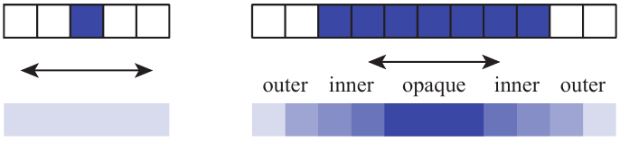

图 12.19：左图中，一个水平运动的样本产生透明的结果。右图中，七个样本产生渐弱效果，因为覆盖外侧区域的样本较少。中间区域是不透明的，因为在整帧期间，它始终被某个样本覆盖。（据 Jimenez [832] 改绘。）图内标签：outer 为外侧，inner 为内侧，opaque 为不透明。

要使用这个思路，需要知道每个像素处表面的速度。一种得到广泛采用的工具是速度缓冲区 [584]。创建这种缓冲区时，对模型各顶点的屏幕空间速度进行插值。速度可以通过将两个建模矩阵应用于模型来计算，一个对应前一帧，一个对应当前帧。顶点着色器程序计算位置之差，并将该向量变换到相对的屏幕空间坐标。图 12.20 给出了可视化结果。Wronski [1912] 讨论了速度缓冲区的推导，以及如何将运动模糊与时间抗锯齿结合。Courrèges [294] 简要介绍了《DOOM》（2016）如何实现这种组合，并比较了结果。

速度缓冲区形成之后，就知道了每个像素处各物体的速率。同时，还要渲染未经模糊的图像。注意，我们在运动模糊中遇到了与景深类似的问题：仅凭一幅图像，无法获得计算该效果所需的全部数据。对于景深，理想情况是对多个视图取平均，其中一些视图包含在其他视图中看不到的物体。对于交互式运动模糊，我们从一个时间序列中取出单帧，并将其用作代表图像。我们会尽可能利用这些数据，但必须认识到，所需数据并不总是全部存在，这会产生伪影。

给定这一帧和速度缓冲区后，可以使用“在收集时实现散布”的运动模糊系统，重建哪些物体会影响每个像素。先来看 McGuire 等人 [208, 1173] 介绍、并由 Sousa [1681] 和 Jimenez [832] 进一步发展的方法（Pettineo [1408] 提供了代码）。在第一遍处理中，计算屏幕每个区块的最大速度，例如每个 8 × 8 像素的图块（第 23.1 节）。结果是一个为每个图块存储最大速度的缓冲区，所存的是具有方向和大小的向量。在第二遍处理中，对每个图块检查这个图块结果缓冲区中的一个 3 × 3 区域，以找出这些最大值中的最高者。这一遍处理保证：某图块内快速运动的物体也会被相邻图块考虑在内。也就是说，我们最初的场景静态视图将变成一幅物体呈现模糊的图像。这些模糊可能延伸并覆盖相邻图块，因此这些图块必须检查足够宽的区域，才能找到这些运动物体。

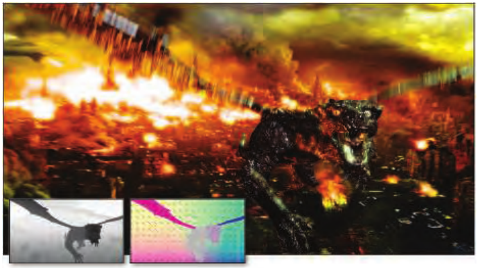

图 12.20：物体和相机运动造成的运动模糊。嵌入的小图展示了深度缓冲区和速度缓冲区的可视化结果。（图片由 Morgan McGuire 等人提供 [1173]。）

最后一遍处理计算运动模糊图像。与景深类似，需要检查每个像素的邻域，寻找可能快速移动并覆盖该像素的样本。不同之处在于，每个样本都有自己的速度，并沿自己的路径运动。人们已经发展了不同方法来滤波和混合相关样本。一种方法利用最大速度的大小来确定核的方向和宽度。如果这个速度小于半个像素，就不需要运动模糊 [1173]。否则，就沿最大速度的方向对图像采样。注意，这里的遮挡与景深中的遮挡同样重要。位于静止物体后方的快速运动模型，其模糊效果不应渗透到这个物体上方。如果相邻样本的距离与该像素的 z 深度足够接近，就认为它是可见的。将这些样本混合在一起，形成前景的贡献。

图 12.19 中，运动模糊的物体分成三个区域。不透明区域完全由前景物体覆盖，因此不需要进一步混合。外侧模糊区域在原图中（最上方那一行七个蓝色像素）具有可用的背景颜色，可以将前景混合到这些像素的背景之上。但内侧模糊区域不包含背景，因为原图只显示前景。对于这些像素，通过滤波采样到的、不属于前景的相邻像素来估计背景，理由是对背景作出任何估计都好过完全没有背景。图 12.20 展示了一个例子。

有若干采样与滤波方法可以改善这种方法的外观。为避免重影，采样位置会随机抖动半个像素 [1173]。在外侧模糊区域，我们具有正确的背景，但将它略微模糊，可以避免它与内侧模糊区域的估计背景之间出现突兀的不连续 [832]。某个像素处的物体，其运动方向可能不同于所在 3 × 3 图块集合中的主导速度方向，因此在这种情况下可以采用另一种滤波方法 [621]。Bukowski 等人 [208] 提供了其他实现细节，并讨论了如何针对不同平台调整这一方法的规模。

这种方法处理运动模糊的效果相当不错，但当然也可以采用其他系统，在质量和性能之间作不同取舍。例如，Andreev [51] 利用速度缓冲区和运动模糊，在以 30 FPS 渲染的帧之间插值，从而实际上获得 60 FPS 的帧率。另一个概念是把运动模糊与景深结合为单一系统。其关键思路是将速度向量和弥散圆结合起来，得到统一的模糊核 [1390, 1391, 1679, 1681]。

其他方法也已经得到探索，而随着 GPU 能力和性能的提升，相关研究还会继续。例如，Munkberg 等人 [1247] 使用随机采样与交错采样，以低采样率渲染景深和运动模糊。在后续一遍处理中，他们利用快速重建技术 [682] 减少采样伪影，并恢复运动模糊和景深的平滑特性。

电子游戏中，玩家的体验通常不像观看电影，而是直接控制游戏，视图会以不可预测的方式变化。在这种情况下，如果完全从相机的角度处理运动模糊，有时会用得不恰当。例如，在第一人称射击游戏中，一些用户觉得旋转产生的模糊令人分心，或会引起晕动症。从《使命召唤：高级战争》开始，游戏提供了关闭相机旋转所致运动模糊的选项，使这一效果仅应用于运动物体。美术团队在游戏操作过程中去掉旋转模糊，而在某些电影式过场中打开它。平移运动模糊仍然保留，因为它有助于传达奔跑时的速度感。另一种方式是通过美术指导，按实体电影摄影机无法模拟的方式，改变哪些内容会发生运动模糊。假设一艘飞船进入用户视野，而相机并不追踪它，也就是说，玩家没有转头。使用标准运动模糊时，即使玩家的眼睛正在追踪飞船，飞船也会变得模糊。如果假定玩家会追踪某个物体，就可以相应调整算法，在观众眼睛跟随该物体时模糊背景，同时保持物体清晰。

眼动追踪设备和更高帧率可能有助于改进运动模糊的应用，或者彻底消除对它的需要。不过，这种效果能营造电影感，因此可能继续以这种方式使用，或出于其他原因而使用，例如暗示不适或眩晕。运动模糊很可能会继续得到运用，而运用它既可以是一门科学，也可以是一门艺术。

## 第12章 延伸阅读与资源

来源：《Real-Time Rendering》第4版，书页 543（PDF 物理页 564）；章末未编号出版商标识位于 PDF 物理页 565（对应未印书页号的书页 544）。

有几本教科书专门讲解传统图像处理，例如 Gonzalez 和 Woods 的著作 [559]。我们尤其想提到 Szeliski 的《计算机视觉：算法与应用》（Computer Vision: Algorithms and Applications）[1729]，因为它讨论了图像处理以及许多其他主题，并说明了它们与合成渲染之间的关系。这本书的电子版可以免费下载；相关链接请见我们的网站 realtimerendering.com。Paris 等人的课程讲义 [1355] 对双边滤波器作了正式介绍，还给出了许多应用实例。

McGuire 等人 [208, 1173] 和 Guertin 等人 [621] 的文章清楚阐述了他们各自在运动模糊方面的工作，并提供了实现代码。Navarro 等人 [1263] 针对交互式应用与批处理应用中的运动模糊给出了全面的报告。Jimenez [832] 通过详尽而图文并茂的说明，介绍了散景、运动模糊、泛光及其他电影式效果中涉及的滤波和采样问题，以及相应解决方案。Wronski [1918] 讨论了如何重组复杂的后处理流水线，以提高效率。关于模拟多种光学镜头效果的更多内容，请参见 Gotanda [575] 组织的 SIGGRAPH 课程中的各场讲座。

<!-- 以下为原书章末未编号出版商标识，不属于12.5正文。 -->

章末出版商标识：Taylor & Francis（泰勒与弗朗西斯）；Taylor & Francis Group（泰勒与弗朗西斯出版集团）；http://taylorandfrancis.com。
