# Real-Time Rendering 第15章 非真实感渲染 中文合集

> 依据用户提供的《Real-Time Rendering》第四版 PDF 完整翻译。原图配中文图注；复杂数学已排版为本地图片，简单符号直接显示。保留原书技术年代、公式编号与引用编号。

## 目录

- [15.1 卡通着色](<Real-Time_Rendering_4th_中文/第15章/15.01.md>)

- [15.2 轮廓渲染](<Real-Time_Rendering_4th_中文/第15章/15.02.md>)

- [15.3 笔触式表面风格化](<Real-Time_Rendering_4th_中文/第15章/15.03.md>)

- [15.4 线条](<Real-Time_Rendering_4th_中文/第15章/15.04.md>)

- [15.5 文本渲染](<Real-Time_Rendering_4th_中文/第15章/15.05.md>)

## 章首导言

来源：原书第651—652页（PDF第672—673页），本章标题、题辞及15.1节之前的全部导言。

> “使用‘非线性科学’这样的术语，就像把动物学的大部分内容称为‘对非大象动物的研究’。”
>
> ——斯坦尼斯拉夫·乌拉姆（Stanislaw Ulam）

照片级真实感渲染试图使图像与照片无法区分。非真实感渲染（non-photorealistic rendering，NPR），也称风格化渲染，具有范围广泛的目标。某些形式的NPR以创建类似技术插图的图像为目标之一。应当显示的，只是与特定应用目标有关的那些细节。例如，一张光亮的法拉利发动机照片可能有助于向顾客推销汽车；但若要维修发动机，一幅突出显示相关部件的简化线描图可能更有意义（而且印刷成本也更低）。

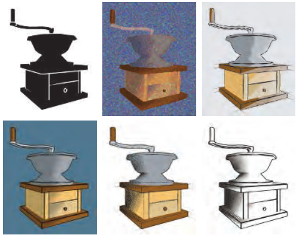

图15.1 将多种非真实感渲染风格应用于一台咖啡研磨机。（使用Viewpoint DataLabs的LiveArt生成。）

NPR的另一个领域是模拟绘画风格和自然媒材，例如钢笔与墨水、炭笔和水彩。这是一个庞大的领域，也相应地催生了种类繁多的算法，试图捕捉各种媒材的感觉。图15.1展示了其中一些例子。两本较早的书介绍了面向技术插图和绘画风格的NPR算法[563, 1719]。鉴于这一领域如此广泛，我们在此着重介绍笔触和线条的渲染技术。我们的目标是让读者领略一些用于实时NPR的算法。本章首先详细讨论实现卡通渲染风格的方法，随后讨论NPR领域中的其他主题，最后介绍多种线条渲染技术。

## 15.1 卡通着色

来源：原书第652—654页（PDF第673—675页），从15.1节标题起，至15.2节标题之前；包括图15.2、图15.3及完整图注。

正如改变字体会给文字带来不同的感觉，不同的渲染风格也有各自的情绪、含义与表达语汇。有一种特定的NPR形式获得了大量关注，即赛璐珞渲染（cel rendering），也称卡通渲染（toon rendering）。由于这种风格与卡通动画联系在一起，它带有幻想与童年的意味。在最简单的形式中，物体由实线勾画，实线将不同纯色的区域分隔开来。这种风格之所以流行，其中一个原因就是McCloud在其经典著作《理解漫画》（Understanding Comics）[1157]中所说的“通过简化来强化”。通过简化并去除杂乱内容，可以强化与表达目的有关的信息所产生的效果。对于卡通角色而言，采用简洁风格绘制的角色能够让更广泛的观众产生认同感。

几十年来，计算机图形学一直使用卡通渲染风格，将三维模型与二维赛璐珞动画融合起来。与其他NPR风格相比，这种风格容易定义，因此很适合由计算机自动生成。许多电子游戏都使用它取得了良好的效果[250, 1224, 1761]。见图15.2。

图15.2 游戏《大神》（Okami）中的一个实时NPR渲染示例。（图片由Capcom Entertainment, Inc.提供。）

物体的外轮廓通常渲染为黑色，以强化卡通外观。如何寻找并渲染这些外轮廓，将在下一节讨论。卡通表面着色有几种不同的方法。最常见的两种方法是用纯色（不受光照影响）填充网格区域，或者采用双色调方法，分别表示受光区域与阴影区域。双色调方法有时也称为硬着色（hard shading），用像素着色器实现起来很简单：当着色法线与光源方向的点积大于某个值时，使用较浅的颜色；否则使用较深的色调。当光照更加复杂时，另一种方法是对最终图像本身进行量化。这一过程也称为色调分离（posterization），即将连续的数值范围转换成少数几个色调，各色调之间发生突变。见图15.3。对RGB值进行量化可能会造成令人不悦的色相偏移，因为各个独立通道的变化方式与其他通道并无紧密关联。更好的选择是在保持色相的颜色空间中进行处理，例如HSV、HSL或Y′CbCr。另一种做法是定义一维函数或纹理，将强度级别重新映射到特定的明暗色调或颜色。还可以使用量化或其他滤波器对纹理进行预处理。第665页的图15.16展示了另一个采用更多颜色级别的例子。

图15.3 对最左侧的基础渲染，依次应用纯色填充、色调分离和铅笔着色技术。图中从左至右的标签为：基础渲染（basic）、纯色填充（solid）、色调分离（posterization）、铅笔着色（pencil）。（Jade2模型由Quidam制作，由wismo发布[1449]，采用知识共享署名2.5许可协议。）

Barla等人[104]使用二维映射代替一维明暗纹理，从而加入依赖视点的效果。第二个维度通过表面的深度或朝向来访问。例如，这使物体在距离较远或快速运动时，其对比度能够平滑地减弱。游戏《军团要塞2》（Team Fortress 2）将这一算法与多种其他着色方程及绘制的纹理结合使用，形成卡通风格与写实风格的融合[1224]。卡通着色器的变体也可以用于其他目的，例如在将表面或地形上的特征可视化时夸大对比度[1520]。

## 15.2 轮廓渲染

来源：《Real-Time Rendering, Fourth Edition》，书页 654—669（PDF 物理页 675—690）。本节从 15.2 标题开始，止于 15.3 标题之前，包含 15.2.1—15.2.5 全部下级小节。为区分原书概念，contour edge 译为“轮廓边”，silhouette edge 译为“剪影边”。

用于赛璐珞边线渲染的算法，体现了非真实感渲染（NPR）中的一些主要主题与技术。这里的目标是介绍若干算法，让读者领略这个领域。所采用的方法大致可分为基于表面着色、过程式几何、图像处理、几何边检测的方法，以及这些方法的混合。

卡通渲染可以使用几种不同类型的边：

- **边界边（boundary edge 或 border edge）**：不是由两个三角形共享的边，例如一张纸的边缘。实体物体通常没有边界边。
- **折痕边（crease edge）、硬边（hard edge）或特征边（feature edge）**：由两个三角形共享，并且这两个三角形之间的夹角（称为二面角）大于某个预先定义值的边。折痕角采用 60° 作为默认值是一个不错的选择 [972]。例如，立方体具有折痕边。折痕边还可进一步分成凸脊边（ridge edge）和凹谷边（valley edge）。
- **材质边（material edge）**：当共享这条边的两个三角形具有不同材质，或者由于其他原因导致着色发生变化时，就会出现材质边。它也可以是艺术家希望始终显示的边，例如额头上的皱纹线，或用来区分同色裤子与衬衫的线。
- **轮廓边（contour edge）**：相对于某个方向向量，其两个相邻三角形朝向不同的边；该方向向量通常是从眼睛出发的方向。
- **剪影边（silhouette edge）**：沿物体外轮廓分布的轮廓边，也就是说，在图像平面上将物体与背景分隔开来的边。

参见图 15.4。这种分类以文献中的常见用法为基础，但也存在一些变体。例如，我们这里称为折痕边和材质边的边，在其他文献中有时被称为边界边。

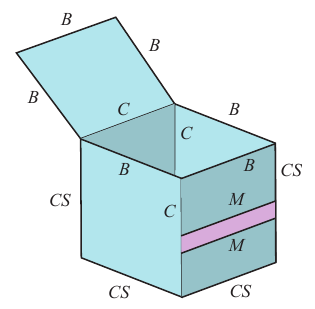

**图 15.4** 顶部打开、正面带有一条条纹的盒子。图中标出了边界边（B）、折痕边（C）、材质边（M）和剪影边（S）。按照这里给出的定义，所有边界边都不算剪影边，因为这些边只与一个多边形相邻。

这里区分轮廓边与剪影边。这两种边都有这样的性质：边一侧的表面面向观察者，另一侧背向观察者。剪影边是轮廓边的一个子集，即将物体与另一个物体或背景分开的那些边。例如，从侧面观察头部时，耳朵会形成轮廓边，尽管它们出现在头部的剪影外轮廓内部。图 15.3 中还有其他例子，包括鼻子、两根弯曲的手指，以及头发分开的地方。在一些早期文献中，轮廓边被称为剪影，但通常指的是整个轮廓边类别。另外，不应将这里的轮廓边与地形图上使用的等高线混淆。

注意，边界边不同于轮廓边或剪影边。轮廓边与剪影边由观察方向定义，而边界边与视点无关。**暗示轮廓（suggestive contours）** [335] 由从原始视点看几乎已经成为轮廓的位置构成。它们提供额外的边，帮助传达物体形状。参见图 15.5。虽然这里主要关注轮廓边的检测与渲染，但针对其他类型笔画也已有大量研究 [281, 1014, 1521]。我们也主要关注如何为多边形模型寻找这样的边。Bénard 等人 [132] 讨论了如何寻找由细分曲面或其他高阶定义构成的模型的轮廓。

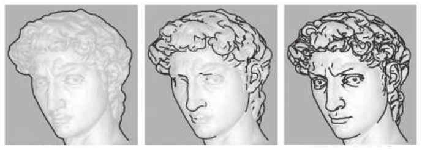

**图 15.5** 从左至右：剪影边、轮廓边、轮廓边加暗示轮廓边。（图片由 Doug DeCarlo、Adam Finkelstein、Szymon Rusinkiewicz 和 Anthony Santella 提供。）

### 15.2.1 利用着色法线生成轮廓边

与 15.1 节中的表面着色器类似，可以利用着色法线与指向眼睛的方向之间的点积，生成轮廓边 [562]。如果这个值接近零，表面就几乎以侧边朝向眼睛，因此很可能接近轮廓边。将这样的区域着为黑色，并随着点积增大逐渐过渡到白色。参见图 15.6。在可编程着色器出现之前，这种算法通过带黑色圆环的球形环境贴图实现，或者将 mipmap 金字塔纹理最顶端的若干层着为黑色 [448]。如今，这类着色直接在像素着色器中实现：当屏幕空间法线变得垂直于观察方向时，让颜色趋向黑色。

从某种意义上说，这种着色与轮缘光正好相反：轮缘光用光照亮物体的外轮廓；而这里从眼睛所在的位置照亮场景，并夸大衰减，使边缘变暗。它也可以被看作图像处理中的阈值滤波：凡是表面亮度低于某个强度的位置，都在图像中转为黑色，否则转为白色。

这个方法的一个特点，也可能是缺点，是所绘制的轮廓线宽度会随表面曲率变化。它适用于没有折痕边的曲面模型。例如，在剪影附近的区域，通常会有像素的法线近乎垂直于观察方向。

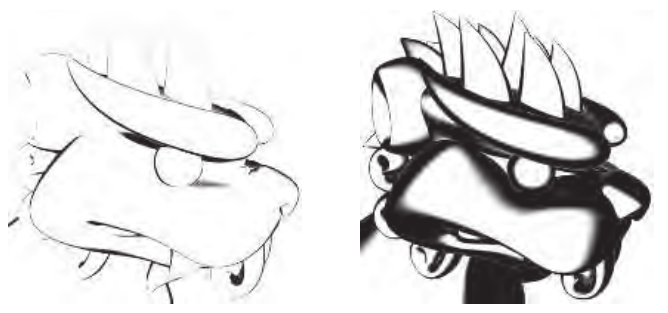

**图 15.6** 当表面的着色法线变得垂直于观察方向时，使表面变暗，以此对轮廓边着色。加宽衰减角范围，会显示更粗的边。（图片由 Kenny Hoff 提供。）

该算法在立方体这样的模型上会失效，因为折痕边附近的表面区域不具有这一性质。即使在曲面上，它也可能产生断裂而显得难看：例如物体较远时，在轮廓边附近采样到的某些法线可能并不近乎垂直。Goodwin 等人 [565] 指出，这个基本概念作为视觉线索仍然具有合理性，并讨论了如何结合光照、曲率与距离来确定笔画粗细。

### 15.2.2 用过程式几何生成剪影

最早的实时轮廓边渲染技术之一由 Rossignac 和 van Emmerik [1510] 提出，后来由 Raskar 和 Cohen [1460] 改进。总体思路是先正常渲染正面，再以某种方式渲染背面，使其轮廓边显现出来。渲染这些背面的方法有多种，各有优缺点。每种方法的第一步都是绘制正面。然后开启正面剔除、关闭背面剔除，从而只渲染背面。

一种渲染轮廓的方法，是仅绘制背面多边形的边，而不绘制其面。使用偏移或其他技术（15.4 节），确保其中一些线恰好绘制在正面前方。这样，只有正面与背面相接处的边是可见的 [969, 1510]。

让这些线变粗的一种方式，是将背面本身渲染为黑色，同样向前施加偏移。Raskar 和 Cohen 给出了几种偏移方法，例如平移固定距离，或平移一个能够补偿 z 深度非线性性质的距离，或者使用 OpenGL 的 `glPolygonOffset` 之类的深度斜率偏移调用。Lengyel [1022] 讨论了如何修改透视矩阵，以实现更精细的深度控制。所有这些方法的一个问题是无法生成宽度均匀的线。要做到这一点，向前移动的距离不仅取决于背面，还取决于相邻的一个或多个正面。参见图 15.7。可以根据背面斜率将多边形向前偏移，但线的粗细还会取决于正面的角度。

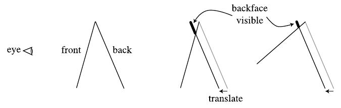

**图 15.7** 通过将背面向前平移来生成剪影的 z 偏移方法。如果正面的角度不同，如右图所示，露出的背面面积也会不同。（示意图改绘自 Raskar 和 Cohen [1460]。）图中 eye 为眼睛，front 为正面，back 为背面，backface visible 为背面可见部分，translate 为平移。

Raskar 和 Cohen [1460, 1461] 通过另一种方式解决了这种相邻面依赖问题：沿每个背面三角形的边将其向外加宽，加宽量以能看到粗细一致的线为准。也就是说，三角形的斜率和它到观察者的距离决定了三角形的扩张程度。一种方法是沿三角形所在平面向外扩展其三个顶点。更安全的绘制方法，是将三角形的每条边向外移动，然后连接这些边。这样可以避免顶点伸到远离原始三角形的位置。参见图 15.8。注意，这种方法不需要偏移，因为背面扩张后会超出正面的边缘。三种方法的结果见图 15.9。这种加宽技术更容易控制、结果更一致，已经成功用于《波斯王子》（Prince of Persia）[1138] 和《爆炸头武士》（Afro Samurai）[250] 等电子游戏中的角色描边。

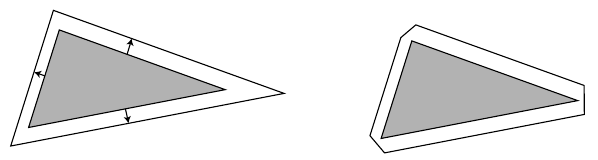

**图 15.8** 三角形加宽。左图中，一个背面三角形沿其所在平面扩张。各条边在世界空间中移动的距离不同，从而使最终的边在屏幕空间具有相同粗细。对于细长的三角形，这种技术会出问题，因为一个角会被拉得很长。右图中，将三角形的各条边向外扩展并连接，形成斜接角，以避免这个问题。

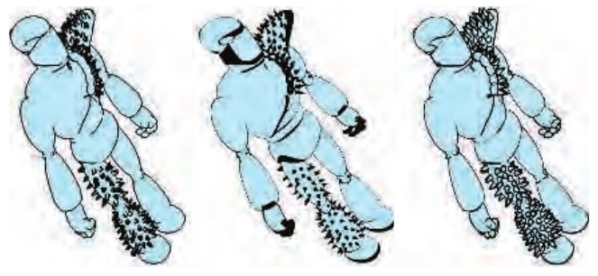

**图 15.9** 分别用背面粗线边绘制、z 偏移，以及三角形加宽算法渲染的轮廓边。背面边绘制技术在线段连接处效果不佳，而且小特征上的偏移问题会导致线条不均匀。z 偏移技术由于依赖正面的角度，会产生不均匀的边宽。（图片由 Raskar 和 Cohen [1460] 提供。）

在刚才的方法中，背面三角形沿其原始平面扩张。另一种方法是沿共享的顶点法线移动顶点，将背面向外移，移动量与顶点到眼睛的 z 方向距离成正比 [671]。这种方法称为**外壳（shell）或光晕（halo）方法**，因为移动后的背面会在原物体外围形成一个壳。设想一个球体。先正常渲染球体，再增大球的半径，增加的量以球心位置为基准对应 5 像素的宽度。也就是说，如果将球心移动 1 像素等价于在世界空间移动 3 毫米，就将球的半径增加 15 毫米。仅以黑色渲染扩张后版本的背面，轮廓边就会宽 5 像素。参见图 15.10。沿法线向外移动顶点，非常适合由顶点着色器完成。这类扩张有时称为外壳映射（shell mapping）。该方法实现简单、高效、稳健，而且性能稳定。参见图 15.11。进一步扩张这些背面，并根据它们的角度着色，还可以产生力场或光晕效果。

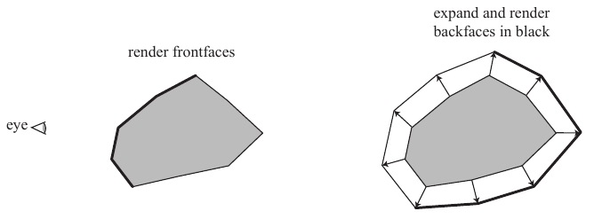

**图 15.10** 三角形外壳技术沿顶点法线移动表面，创建第二层表面。图中 eye 为眼睛，render frontfaces 为渲染正面，expand and render backfaces in black 为扩张背面并以黑色渲染。

这种外壳技术存在若干潜在陷阱。设想正对一个立方体观察，只能看到一个面。形成轮廓边的四个背面中的每一个，都会沿其对应的立方体面的方向移动，因此角部会留下缝隙。发生这种情况，是因为每个角虽然只有一个位置顶点，各个面却具有不同的顶点法线。问题在于，扩张后的立方体并未真正形成一个壳，因为每个角顶点正沿不同方向扩张。一种解决办法是强制位于同一位置的顶点共享一个新的平均顶点法线。另一种技术是在折痕处创建退化几何，然后使它扩张成具有面积的三角形。Lira 等人 [1053] 使用额外的阈值纹理，控制每个顶点的移动量。

外壳和加宽技术都会浪费一定的填充能力，因为所有背面都会被送入流水线。所有这些技术的其他局限包括：对边线外观的控制很少；而半透明表面能否被正确渲染则比较棘手，取决于使用的透明度算法。

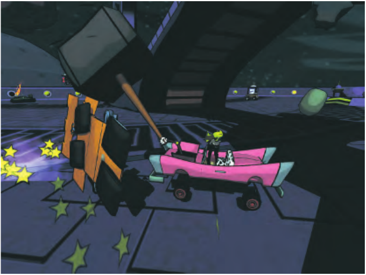

**图 15.11** 游戏《Cel Damage》中的实时卡通风格渲染示例：通过背面外壳扩张形成轮廓边，同时显式绘制折痕边。（图片由 Pseudo Interactive Inc. 提供。）

整类几何技术有一个值得重视的特点：渲染时不需要连通性信息或边列表。每个三角形都独立于其他三角形处理，因此这类技术很适合在 GPU 上实现 [1461]。

这类算法只渲染轮廓边。Raskar [1461] 给出了一个巧妙方案，用于在变形模型上绘制凸脊折痕边，无须创建和访问边连通性数据结构。其思路是沿正在渲染的三角形的每条边生成一个额外多边形。将这些边多边形从三角形平面向外弯折，弯折角采用用户定义的临界二面角；这个角度决定了折痕何时应该可见。如果在某一时刻，两个相邻三角形之间的夹角大于这个折痕角，边多边形就会显露出来，否则会被三角形遮住。参见图 15.12。类似技术也可以生成凹谷边，不过需要模板缓冲和多个通道。

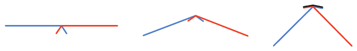

**图 15.12** 两个三角形沿一条边相接的侧视图，每个三角形都附有一个小“鳍片”。随着这两个三角形沿公共边弯折，鳍片逐渐趋于可见。右图中，鳍片已经露出。将其涂黑，就会呈现为凸脊边。

### 15.2.3 通过图像处理检测边

上一小节中的算法有时被归为基于图像的方法，因为屏幕分辨率决定了它们如何执行。另一类算法则更直接地基于图像：它完全操作存储在图像缓冲中的数据，不修改场景中的几何，甚至不直接了解这些几何。

Saito 和 Takahashi [1528] 首先引入了这种 G 缓冲（G-buffer）概念，它也用于延迟着色（20.1 节）。Decaudin [336] 扩展了 G 缓冲的用途，用它执行卡通渲染。基本思路很简单：对存放各种信息的缓冲执行图像处理算法，就能进行 NPR。通过寻找相邻 z 缓冲值的不连续处，可以找到许多轮廓边的位置。相邻表面法线值的不连续，常常标示着轮廓边和边界边的位置。使用环境颜色或者物体标识值渲染场景，可以检测材质边、边界边，以及真正的剪影边。

检测和渲染这些边包括两个部分。首先渲染场景几何，像素着色器按需要将深度、法线、物体 ID 或其他数据保存到不同的渲染目标中。然后执行后处理通道，方式类似 12.1 节所述。后处理通道会采样每个像素周围的邻域，并根据这些样本输出结果。例如，假设我们为场景中每个物体设置了唯一的标识值。对于每个像素，可以采样它的 ID，并将其与位于测试像素四个角处的四个相邻像素 ID 值比较。如果任意 ID 与测试像素的 ID 不同，就输出黑色，否则输出白色。采样全部八个邻居像素更可靠，但采样开销更大。这种简单测试可以绘制大多数物体的边界边与外轮廓边，也就是真正的剪影。材质 ID 则可用于寻找材质边。

在法线和深度缓冲上使用各种滤波器，可以找到轮廓边。例如，如果相邻像素的深度差大于某个阈值，就很可能存在轮廓边，于是将该像素设为黑色。这里需要的不是简单判断邻居像素是否与当前样本相同，而是其他更精细的边检测算子。我们不在这里讨论 Roberts 交叉、Sobel、Scharr 等各种边检测滤波器的优缺点，因为图像处理文献对此已有广泛论述 [559, 1729]。这些算子的结果不一定是布尔值，因此可以调整它们的阈值，或在某个区间内使结果在黑白之间渐变。注意，法线缓冲也可以检测折痕边，因为法线间的较大差异既可能代表轮廓，也可能代表折痕。Thibault 和 Cavanaugh [1761] 讨论了他们如何在游戏《无主之地》（Borderlands）中结合深度缓冲使用这项技术。在多项技术中，他们修改了 Sobel 滤波器，使之创建单像素宽的外轮廓，并修改深度计算来提高精度。参见图 15.13。也可以反过来，仅在阴影周围添加外轮廓：忽略那些相邻深度差异很大的边即可 [1138]。

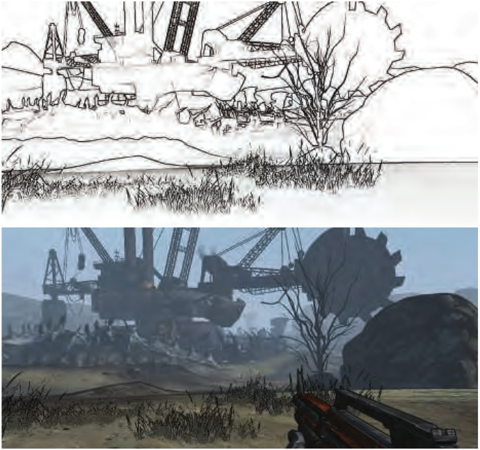

**图 15.13** 游戏《无主之地》中修改后的 Sobel 边检测。最终发行版本（此处未展示）进一步通过屏蔽前景草地的边线来改善外观 [1761]。（图片由 Gearbox Software, LLC 提供。）

**膨胀算子（dilation operator）** 是一种形态学算子，用来加粗检测到的边 [226, 1217]。生成边图像后，再执行一个单独的通道。在每个像素处，检查该像素值以及某个半径范围内的周围像素值，将找到的最暗像素值作为输出。这样，一条细黑线就会被加粗，增粗的量由搜索区域的直径决定。可以执行多个通道来进一步加粗线条；这里的权衡是，额外通道的开销可由每个通道大幅减少的采样数量来抵消。不同的结果可以采用不同粗细，例如可以让剪影边比其他轮廓边更粗。与之相关的**腐蚀算子（erosion operator）** 可用来细化线条或产生其他效果。部分结果见图 15.14。

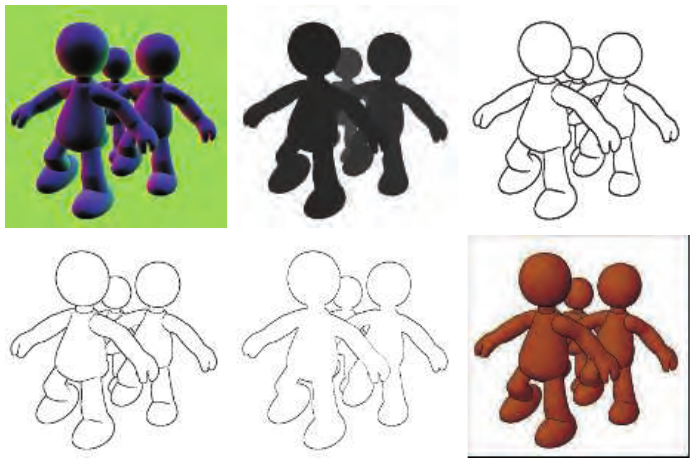

**图 15.14** 对法线图（左上）和深度图（上中）的数值应用 Sobel 边检测，结果分别显示在左下和下中。右上图是使用膨胀进行加粗后的合成图像。右下的最终渲染通过对图像应用 Gooch 着色，再合成边线得到。（图片由 ATI Technologies Inc. 的 Drew Card 和 Jason L. Mitchell 提供。）

这类算法有若干优点。与大多数其他技术不同，它能处理各种类型的表面，无论平面还是曲面。由于方法基于图像，网格不必连通，甚至不必保持一致。

这类技术的缺陷相对较少。对于几乎以侧边朝向观察者的表面，z 深度比较滤波器可能会把横跨表面的某个像素误判为轮廓边像素。z 深度比较的另一个问题是，如果深度差很小，就可能漏掉轮廓边。例如，放在桌子上的一张纸，其边缘通常会被漏掉。同样，法线图滤波器也会漏掉这张纸的边，因为法线完全相同。这种方法仍然并非万无一失：例如，一张对折的纸会在边缘重叠处产生无法检测的边 [725]。生成的线会出现阶梯状锯齿，但 5.4.2 节介绍的各种形态学抗锯齿技术，能够很好地处理这种高对比度输出，也适用于色调分层等技术，从而改善边缘质量。

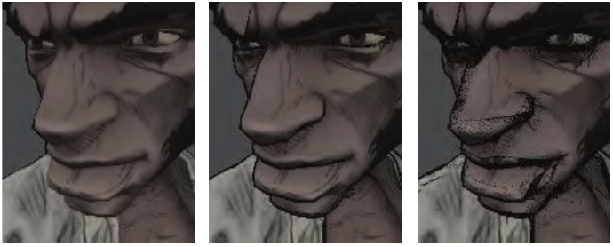

**图 15.15** 多种边线方法。皱纹等特征边属于纹理本身，由艺术家预先添加。角色的剪影通过背面挤出生成。轮廓边通过图像处理边检测生成，并采用不同权重。左图使用的权重太小，因此这些边很淡。中图展示了外轮廓线，尤其是鼻子和嘴唇处的轮廓边。右图展示了权重过大产生的伪影 [250]。（Afro Samurai ® & ©2006 TAKASHI OKAZAKI, GONZO / SAMURAI PROJECT。程序 ©2009 BANDAI NAMCO Entertainment America Inc.。）

检测也可能朝相反的方向出错，在本不该有边的地方生成边。判断什么构成一条边，并不是万无一失的操作。例如，设想玫瑰的茎，也就是一个细圆柱。近距离观察时，样本像素相邻位置的茎部法线变化不大，因此不会检测出边。当我们远离玫瑰时，像素之间的法线变化会越来越快，直到某个时刻，这些差异可能导致在边缘附近误检出边。利用深度图检测边时也可能发生类似问题，此外还需要补偿透视对深度的影响。Decaudin [336] 给出了一种改进的变化检测方法：处理法线图和深度图的梯度，而不仅是数值本身。决定如何将各种像素差异转化为颜色变化，通常需要针对具体内容调节 [250, 1761]。参见图 15.15。

笔画生成后，可以按需要执行进一步的图像处理。由于笔画可以创建在独立缓冲中，因此能够单独修改，再合成到表面之上。例如，可以使用噪声函数分别使线条和表面产生毛糙与摆动，在两者之间制造细小间隙，从而形成手绘外观。还可以利用纸张的高度场影响渲染，使木炭之类的固体材料沉积在凸起顶部，或使水彩颜料积聚在凹谷中。图 15.16 给出了一个例子。

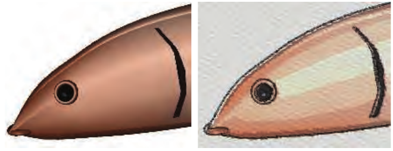

**图 15.16** 左边的鱼模型在右图中通过边检测、色调分层、噪声扰动、模糊，以及在纸张之上混合等操作进行渲染。（图片由 Autodesk, Inc. 提供。）

这里一直关注的是使用几何数据或其他非图像数据检测边，例如法线、深度和 ID。图像处理技术本来就是为图像而开发的，因此这些边检测技术自然也可以应用于颜色缓冲。一种方法称为**高斯差分（difference of Gaussians，DoG）**：使用两个不同的高斯滤波器分别处理图像，然后将一个结果从另一个结果中减去。人们发现，这种边检测方法在 NPR 中能产生尤其令人满意的结果，可用于生成铅笔明暗、粉彩等多种艺术风格的图像 [949, 1896, 1966]。

在模拟水彩、丙烯颜料等艺术媒介的许多 NPR 技术中，图像后处理算子占据突出地位。这个领域已有大量研究；对于交互式应用，主要挑战之一是如何以最少的纹理采样完成尽可能多的处理。可以在 GPU 上使用双边、均值漂移和 Kuwahara 滤波器，保留边缘并平滑区域，使之呈现绘画效果 [58, 948]。Kyprianidis 等人 [949] 对该领域的图像处理效果作了全面综述并给出了分类。Montesdeoca 等人 [1237] 的工作是一个很好的例子：将若干简单直接的技术组合成一种能以交互速率运行的水彩效果。图 15.17 展示了以水彩风格渲染的模型。

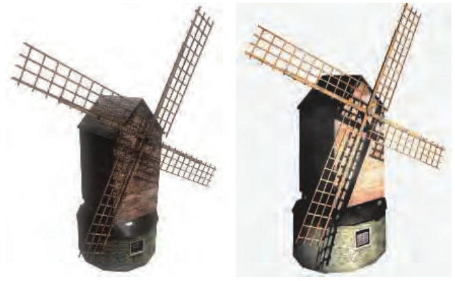

**图 15.17** 左图是标准的真实感渲染。右图的水彩风格通过均值漂移颜色匹配柔化纹理，并采用提高对比度与饱和度等技术。（水彩图像由 Autodesk, Inc. 提供。）

### 15.2.4 几何轮廓边检测

目前介绍的方法有一个问题：它们对边线风格化的支持至多也很有限。我们很难轻易地把线画成虚线，更不用说让它们看起来像手绘线条或画笔笔触。要实现这样的操作，就需要找到轮廓边并直接渲染它们。拥有彼此独立的边实体，还可以创造其他效果，例如让轮廓因惊讶而跳动，而网格本身则因震惊而僵在原地。

轮廓边的两个相邻三角形中，一个面向观察者，另一个背向观察者。测试条件为

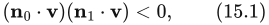

其中，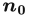 和 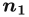 是两个三角形的法线，**v** 是从眼睛指向该边（即任一端点）的观察方向。为了让这个测试正确工作，表面的朝向必须一致（16.3 节）。

寻找模型轮廓边的暴力方法，是遍历边列表并执行这一测试 [1130]。Lander [972] 指出，一项值得采用的优化是识别并忽略平面多边形内部的边。也就是说，给定一个连通的三角网格，如果一条边的两个相邻三角形位于同一平面上，这条边就不可能成为轮廓边。在一个简单的时钟模型上实现这一测试后，边数从 444 条降到了 256 条。此外，如果模型定义了一个实体物体，凹边就永远不可能成为轮廓边。Buchanan 和 Sousa [207] 复用每个单独面的点积测试结果，从而避免为每条边分别执行点积测试。

> 译注：原书“实体物体的凹边永远不可能成为轮廓边”这一表述按原文保留。严格按本节此前的正背面异号定义，凹边也可能满足轮廓边判据，但其局部轮廓会被实体自身遮挡；若将该句理解为可见轮廓边的筛除条件，则更为准确。

每帧都从头检测轮廓边，开销可能很大。如果相机视图和物体在帧间移动很小，就可以合理地假设：前几帧的轮廓边可能仍是有效轮廓边。Aila 和 Miettinen [13] 为每条边关联一个有效距离，即观察者移动多远之后，这条轮廓边仍能保持其状态。在任意实体模型中，每条独立轮廓总是由一条闭合曲线组成，称为**剪影环（silhouette loop）**，更准确的名称是**轮廓环（contour loop）**。对于物体边界范围内部的轮廓，环的一部分可能被遮住。即使是真正的剪影，也可能由几个环组成，其中一部分位于外轮廓内部，或者被其他表面遮挡。由此可知，每个顶点必须连接偶数条轮廓边 [23]。参见图 15.18。注意，当这些环沿网格边延伸时，在三维中往往十分锯齿化，z 深度有明显变化。如果希望边组成更平滑的曲线，例如为了随距离改变线宽 [565]，可以执行额外处理，在三角形的法线之间插值，近似求出三角形内部的真实轮廓边 [725, 726]。

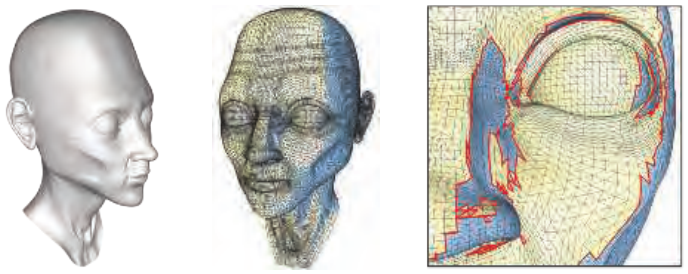

**图 15.18** 轮廓环。左图是相机观察到的模型。中图以蓝色表示背向相机的三角形。右图是脸部某一区域的特写。注意其复杂性，以及某些轮廓环如何隐藏在鼻子后面。（模型由 Chris Landreth 提供，图片由 Pierre Bénard 和 Aaron Hertzmann [132] 提供。）

逐帧跟踪环的位置，可能比从头重建环更快。Markosian 等人 [1125] 从一组环出发，在相机移动时使用随机化搜索算法更新这组环。随着模型朝向变化，轮廓环也会产生或消失。Kalnins 等人 [848] 指出，当两个环合并时，必须采取纠正措施，否则从一帧到下一帧会出现明显跳变。他们使用像素搜索与“投票”算法，尝试维持逐帧轮廓的连贯性。

这类技术可以显著提高性能，但可能并不精确。线性遍历方法是精确的，却代价高昂。借助相机信息访问轮廓边的层次化方法，则兼顾速度与精度。对于没有动画的模型的正交视图，Gooch 等人 [562] 使用高斯映射的层次结构来确定轮廓边。Sander 等人 [1539] 使用由法线锥组成的 n 叉树（19.3 节）。Hertzmann 和 Zorin [726] 使用模型的对偶空间表示，从而能为模型的边建立层次结构。

所有这些显式边检测方法都需要大量 CPU 运算，而且缓存局部性较差，因为构成一个轮廓的边分散在整个边列表中。为避免这些开销，可以使用顶点着色器检测并渲染轮廓边 [226]。其思路是将模型的每条边作为两个三角形送入流水线，这两个三角形构成一个退化四边形，并在每个顶点附带两个相邻三角形的法线。当发现一条边属于轮廓时，就移动四边形的顶点，使它不再退化，也就是变得可见。然后绘制这个薄四边形鳍片。这项技术与创建阴影体时寻找轮廓边的方法基于同一思路（7.3 节）。如果流水线中有几何着色器，这些额外的鳍片四边形就不需要事先存储，而可以即时生成 [282, 299]。朴素实现会在鳍片之间留下裂隙和空隙，可以通过修改鳍片的形状来纠正 [723, 1169, 1492]。

### 15.2.5 隐藏线消除

找到轮廓之后，就要渲染线条。显式寻找边的一个优点是，可以将这些边风格化为钢笔笔画、颜料笔触，或者任何所需媒介的效果。笔画可以是基本线条、带纹理的替代体（13.6.4 节）、一组图元，或任何你想尝试的形式。

尝试使用几何边时，还有一个复杂之处：并非所有这些边实际上都可见。渲染表面以建立 z 缓冲，可以遮住隐藏的几何边；对于点线之类的简单风格，这可能已经足够。Cole 和 Finkelstein [282] 对表示线条的四边形扩展了这一方法，沿线条自身的中轴采样 z 深度。不过，这些方法独立渲染线上的每个点，因此无法事先知道明确的起点和终点位置。对于轮廓环或其他边，如果线段是为了定义画笔笔触或其他连续对象，就需要知道每个笔画从哪里开始出现、到哪里消失。确定每条线段可见性的过程称为**隐藏线渲染（hidden line rendering）**：对一组线段进行可见性处理，返回数量更少的一组线段，它们可能已经被裁剪。

Northrup 和 Markosian [1287] 处理这一问题的方法，是渲染物体的全部三角形和轮廓边，并为每个三角形和轮廓边分配不同的标识编号。将这个 ID 缓冲读回，再据此确定可见轮廓边。接着检查这些可见线段是否重叠，并将它们连接起来形成平滑的笔画路径。如果屏幕上的线段较短，这种方法能够奏效，但它不包含对线段本身的裁剪。随后沿这些重建路径渲染风格化笔画。笔画本身可采用许多不同方式进行风格化，包括渐细、张开、摆动、出头和淡出等效果，以及深度与距离线索。图 15.19 展示了一个例子。

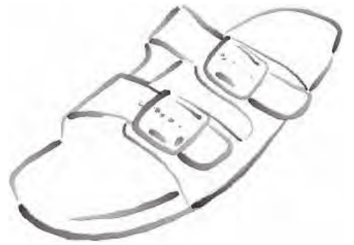

**图 15.19** 使用 Northrup 和 Markosian 的混合技术生成的图像。先找到轮廓边，将它们构造成链，再渲染为笔画。（图片由 Lee Markosian 提供。）

Cole 和 Finkelstein [282] 提出了一种针对一组边的可见性计算方法。他们把每条线段保存为两个世界空间坐标值。一系列通道会对整组线段运行像素着色器，进行裁剪并确定每条线段的像素长度；接着，为这些潜在像素位置创建一个图集并确定可见性；然后使用该图集创建可见笔画。虽然过程复杂，但它在 GPU 上运行相对较快，而且能提供起点和终点位置已知的一组可见笔画。

风格化通常包括将一个或多个预制纹理应用到表示线条的四边形上。Rougier [1516] 讨论了一种不同的方法，即过程式渲染虚线图案。每条线段访问一个存储所有所需虚线图案的纹理。每种图案编码为一组命令，指定虚线图案，以及所使用的端帽和连接类型。借助四边形的纹理坐标，每种图案控制着色器执行一系列测试，判断四边形上每个位置处线条覆盖像素的程度。

确定轮廓边、将其连接成连贯的链，再确定每条链的可见性以形成笔画，这一过程很难完全并行化。生成高质量线条风格化效果时还有一个问题：下一帧会重新绘制每个笔画，其长度可能变化，也可能是首次出现。Bénard 等人 [130] 综述了为沿边笔画和表面图案提供时间连贯性的渲染方法。这还不是一个已经解决的问题，而且计算可能十分复杂，因此研究仍在继续 [131]。

## 15.3 笔触式表面风格化

来源：《Real-Time Rendering》第 4 版，书页 669—673（PDF 物理页 690—694）。本节从 15.3 标题开始，至 15.4 标题之前结束，包含图 15.20—15.23。

尽管卡通渲染是一种人们经常尝试模拟的流行风格，但可应用于表面的其他风格还有无穷多种。这些效果可以从修改写实纹理 [905, 969, 973]，一直延伸到让算法逐帧以程序化方式生成几何装饰 [853, 1126]。本节将简要综述与实时渲染有关的技术。

Lake 等人 [966] 讨论了利用漫反射着色项来选择表面所用纹理的方法。随着漫反射项变暗，就使用视觉上更暗的纹理。纹理采用屏幕空间坐标进行映射，以营造手绘外观。为了进一步强化素描感，还在屏幕空间中为所有表面应用一张纸张纹理。见图 15.20。这类算法的一大问题是“淋浴门效应”（shower door effect）：在动画中，物体看起来仿佛是隔着带有图案的玻璃观看的，给人的感觉就像物体在纹理中游动。Breslav 等人 [196] 通过确定哪一种图像变换最能匹配底层模型上某些位置的运动，来维持纹理的二维外观。这样既能保留填充图案基于屏幕的特性，又能使它与物体之间建立更紧密的联系。

图 15.20．使用一组纹理、纸张纹理以及轮廓边渲染生成的图像。（经英特尔公司的 Adam Lake 和 Carl Marshall 许可转载，版权归英特尔公司所有，2002 年。）

一个显而易见的解决办法是：将纹理直接应用到表面上。难点在于，基于笔触的纹理必须保持相对均匀的笔触粗细和密度，才能显得可信。如果纹理被放大，笔触就会显得过粗；如果纹理被缩小，笔触要么被模糊掉，要么变得纤细且充满噪声，具体取决于是否使用 mipmapping。Praun 等人 [1442] 提出了一种实时方法，用于生成笔触纹理的 mipmap，并将其平滑地应用到表面上。这样，当物体距离发生变化时，就能维持屏幕上的笔触密度。第一步是构造要使用的纹理，称为色调艺术贴图（tonal art maps，TAM）。其做法是在各个 mipmap 层级中绘制笔触，见图 15.21。

图 15.21．色调艺术贴图（TAM）。笔触被绘制到各个 mipmap 层级中。每个 mipmap 层级都包含其左侧和上方纹理中的全部笔触。这样，mip 层级之间以及相邻纹理之间的插值就是平滑的。（图片由普林斯顿大学 Emil Praun 提供。）

Klein 等人 [905] 在他们的“艺术贴图”（art maps）中采用了相关思路，以维持非真实感渲染（NPR）纹理的笔触尺寸。准备好这些纹理后，通过在每个顶点所需的色调之间进行插值来渲染模型。这项技术能够生成具有手绘感的图像 [1441]，见图 15.22。

图 15.22．使用色调艺术贴图（TAM）渲染的两个模型。小样展示了渲染各模型时所用的搭接纹理图案。（图片由普林斯顿大学 Emil Praun 提供。）

Webb 等人 [1858] 提出了两种能够改善结果的 TAM 扩展方法：一种使用体纹理，从而允许使用颜色；另一种采用阈值判定方案，以改善抗锯齿效果。Nuebel [1291] 给出了一种相关的炭笔画渲染方法。他使用的噪声纹理也沿一个轴从暗变亮。利用强度值沿该轴访问纹理。Lee 等人 [1009] 使用 TAM 及其他技术，生成了效果出色、看起来像铅笔绘制的图像。

对于笔触，除了已经讨论的操作之外，还有许多其他可能的操作。为了产生素描效果，可以让边缘发生抖动 [317, 972, 1009]，或者使其延伸超出原来的位置，书页 651 上图 15.1 的右上图和下排中图展示了这种效果。

Girshick 等人 [538] 讨论了沿表面主曲率方向线渲染笔触的方法。也就是说，对于表面上任意一个给定点，都存在一个第一主方向切向量，它指向曲率最大的方向。第二主方向则是与第一个向量垂直的切向量，给出表面弯曲最小的方向。这些方向线对于感知曲面十分重要。它们还有一个优点：对于静态模型，只需生成一次，因为这类笔触与光照和着色无关。Hertzmann 和 Zorin [726] 讨论了如何整理和平滑主方向。大量研究与开发工作探索了如何利用这些方向及其他数据，将纹理应用于任意表面、驱动仿真动画，以及用于其他应用。可从 Vaxman 等人 [1814] 的报告入手了解。

嫁接元素（graftals）[372, 853, 1126] 的思想是，可以按需向表面添加几何体或贴花纹理，以产生特定效果。它们可以由所需的细节层次、表面相对于观察者的朝向，或其他因素来控制。这些元素也可用于模拟钢笔或画笔笔触。图 15.23 给出了一个例子。几何嫁接元素是程序化建模的一种形式 [407]。

图 15.23．使用两种不同的嫁接元素风格渲染斯坦福兔子。（图片由犹他大学 Bruce Gooch 和 Matt Kaplan 提供。）

本章仅仅浅尝了 NPR 研究已经探索过的几个方向。若要了解更多信息，可参阅章末的“延伸阅读与资源”部分。在这一领域，通常很少存在、甚至根本不存在可用作真值基准的、物理上正确的根本答案。这既带来了问题，也使我们摆脱了束缚。各种技术需要在速度、质量以及实现成本之间进行权衡。在交互式渲染速率所要求的严格时间限制下，大多数方案都会在某些条件下表现不佳，甚至失效。判断哪些方法在你的应用中效果良好，或者已经足够好，正是这个领域充满魅力的挑战所在。

我们此前的大部分篇幅都集中在一个特定主题上，即轮廓边检测与渲染。最后，我们将把注意力转向线条和文字。这两种非真实感图元使用频繁，也各有自身的难点，因此值得单独讨论。

## 15.4 线条

来源：原书第 673—675 页（PDF 第 694—696 页）。范围从 15.4 节标题起，至 15.5 节标题前，包含全部下级小节及图 15.24、图 15.25。

简单的实心“硬”线条的渲染，常被认为是相对乏味的事情。然而，在 CAD 等领域，它们对于看清底层模型的各个面片、辨认物体形状都十分重要。它们也可以用来突出显示选中的物体，并用于技术插图等领域。此外，其中涉及的一些技术也适用于其他问题。

### 15.4.1 三角形边的渲染

在填充三角形之上正确渲染边，比乍看之下更困难。如果一条线与一个三角形恰好处于同一位置，我们怎样才能确保这条线始终绘制在前面？一个简单的办法是用固定偏移量渲染所有线条 [724]。也就是说，把每条线绘制得比其真实位置稍微靠近观察者一些，让它位于表面之上。如果固定偏移量太大，本应隐藏的部分边就会显露出来，破坏效果。如果偏移量太小，几乎以侧边朝向观察者的三角形表面就可能遮住部分乃至全部边。如第 15.2.2 节所述，可以使用 OpenGL 的 `glPolygonOffset` 等 API 调用，根据表面的斜率，将线条下方的表面向后移。这种方法的效果相当不错，但并不完美。

Herrell 等人 [724] 提出了一种完全不使用偏移量的方案。它通过一系列步骤标记和清除模板缓冲区，使边能够正确地绘制在三角形之上。除非三角形集合非常小，否则这种方法并不实用，因为每个三角形都必须单独绘制，而且每绘制一个三角形都必须清除模板缓冲区，使整个过程极其耗时。

Bærentzen 等人 [86, 1295] 提出了一种很适合在 GPU 上实现的方法。他们使用像素着色器，根据三角形的重心坐标确定到最近一条边的距离。如果像素靠近某条边，就用边的颜色绘制它。边的粗细可以设为任意所需的值，可以随距离变化，也可以保持不变。见图 15.24。主要缺点是，轮廓边的粗细只有内部线条的一半，因为每个三角形只绘制每条线宽度的一半。在实际使用中，这种不一致往往并不明显。

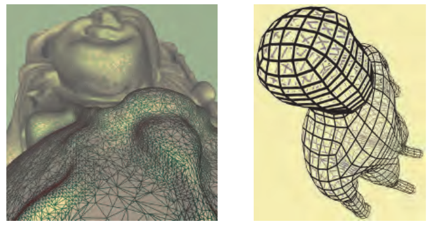

图 15.24. 像素着色器生成的线条。左图为经过抗锯齿处理、宽度为单像素的边；右图为带有晕圈、粗细可变的线条。（图片由 J. Andreas Bærentzen 提供。）

Celes 和 Abraham [242] 对这一思路进行了扩展和简化，同时还对以往的工作作了全面总结。他们的思路是，为三角形的每条边使用一组一维纹理坐标：定义该边的两个顶点取 1.0，另一个顶点取 0.0。他们利用纹理映射和 mip 层级链，得到宽度恒定的边。这种方法易于编写代码，并提供了一些有用的控制手段。例如，可以设定最大密度，以免稠密网格完全被边填满，变成一整片纯色。

### 15.4.2 被遮挡线条的渲染

在普通线框绘制中，由于不绘制表面，模型的所有边都是可见的。要避免绘制被表面挡住的线条，可以先将所有填充三角形仅绘制到 z 缓冲区中，然后正常绘制边 [1192]。如果无法先绘制全部表面、再绘制全部线条，那么另一种成本略高的解决方法是，用与背景相同的纯色绘制表面。

线条也可以绘制成部分遮蔽的样式，而不必完全隐藏。例如，被隐藏的线条可以显示为浅灰色，而不是完全不绘制。适当设置 z 缓冲区的状态，就能实现这一效果。先按前述方式绘制，然后反转 z 缓冲区的比较方向，使得只有位于当前像素 z 深度之后的线条才会被绘制。同时关闭对 z 缓冲区的修改，使这些绘制出来的线条不会改变任何深度值。再用被遮蔽的样式绘制一遍线条。这样就只会绘制那些原本会被隐藏的线条。对于风格化的线条，可以使用完整的隐藏线消除流程 [282]。

### 15.4.3 晕圈

当两条线相交时，一种常见的惯例是擦去较远那条线的一部分，使前后顺序一目了然。将每条线绘制两次，其中一次带有晕圈，就能相对容易地实现这一效果 [1192]。这种方法用背景色覆盖重叠区域，从而将它擦除。首先，将所有线条绘制到 z 缓冲区中，并将每条线表示为一个宽四边形，用来代表晕圈。几何着色器可以帮助创建这样的四边形。然后，按正常方式将每条线绘制到颜色缓冲区中。先前绘制到 z 缓冲区中的区域会形成遮罩，挡住绘制在其后的线条。必须使用偏移量或其他方法，确保每条细黑线都位于 z 缓冲区中相应的宽四边形之上。

在顶点处相接的线条，可能被相互竞争的晕圈部分遮住。缩短用于生成晕圈的四边形可能有所帮助，但也可能导致其他伪影。Bærentzen 等人 [86, 1295] 的线条渲染技术也可用于生成晕圈。见图 15.24。由于晕圈按三角形分别生成，因此不存在相互干扰的问题。另一种方法是利用图像后处理（第 15.2.3 节）检测并绘制晕圈。

图 15.25 展示了这里讨论的几种不同线条渲染方法的结果。

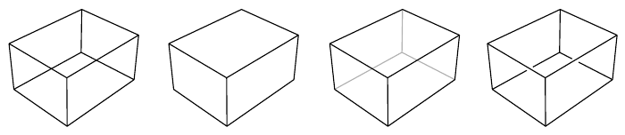

图 15.25. 四种线条渲染样式。从左到右依次为：线框、隐藏线消除、被遮蔽线条以及带晕圈的线条。

## 15.5 文本渲染

来源：《Real-Time Rendering, 4th Edition》书页 675—678（PDF 第 696—699 页）。正文从书页 675 的 15.5 节标题开始，到书页 677 末结束；属于本节的图 15.28 及其完整图注位于书页 678。章末“延伸阅读与资源”另存。

鉴于阅读文字对文明至关重要，人们投入大量心力来把文字渲染好，也就不足为奇了。与许多其他对象不同，单个像素的改变就可能造成显著差异，例如把“l”变成“1”。本节概述文本渲染所采用的主要算法方法。

人眼对强度差异的敏感程度高于对颜色差异的敏感程度。至少从 Apple II 时代起，人们就利用这一事实来提高感知到的空间分辨率 [527]。微软的 ClearType 技术是这一思路的一种应用，它利用了液晶显示器（LCD）的一项特性。LCD 显示器的每个像素都由红、绿、蓝三个竖直的彩色矩形组成——拿放大镜观察一下 LCD 显示器，你就能亲眼看到。如果不考虑这些子像素矩形的颜色，这种排列就能提供三倍于像素数量的水平分辨率。使用不同色调可以填充不同的子像素，因此这种技术有时称为**子像素渲染**。人眼会将这些颜色融合在一起，使偏红和偏蓝的边缘变得难以察觉。见图 15.26。这项技术于 1998 年首次公布，对尺寸大而 DPI 较低的 LCD 显示器帮助很大。微软在 Word 2013 中停止使用 ClearType，显然是因为文字与不同背景色混合时会出现问题。Excel 和各种网页浏览器仍在使用这一技术，Adobe 的 CoolType、Apple 的 Quartz 2D，以及 FreeType、SubLCD 等库也采用了它。Shemanarev 的一篇文章 [1618] 虽然年代较早，却详尽讨论了这种方法的各种微妙之处及相关问题。

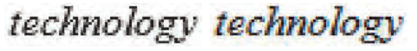

图 15.26。同一个单词采用灰度抗锯齿和子像素抗锯齿后的放大图。当 LCD 屏幕显示一个彩色像素时，构成该像素的相应颜色的竖直子像素矩形就会亮起。这样便能提供额外的水平空间分辨率。（图像由 Steve Gibson 的“Free & Clear”程序生成。）

这项技术是一个极好的例子，表明人们为了清晰地渲染文字付出了多少努力。字体中的字符称为**字形**（glyph），通常由一系列线段以及二次或三次 Bézier 曲线描述。书页 726 的图 17.9 给出了一个例子。所有字体渲染系统都要确定字形对其所覆盖像素的影响。FreeType 和 Anti-Grain Geometry 等库会为每个字形生成一张小纹理，并根据需要重复使用。每一种字号和强调样式，也就是斜体或粗体，都会生成不同的纹理。

这些系统假设每张纹理都与像素对齐，一个纹素对应一个像素，文档通常就是这种情况。当文字应用到三维表面上时，这些假设可能不再成立。使用包含一组字形的纹理是一种简单而常用的方法，但它也有一些潜在缺点。应用程序仍然可以让文字朝向观察者，不过缩放和旋转会破坏一个纹素对应一个像素的假设。即使文字与屏幕对齐，也可能没有考虑**字体微调**（font hinting）。微调是调整字形轮廓、使之与像素单元对齐的过程。例如，若字母“I”的竖干宽度为一个纹素，那么最好让它覆盖一整列像素，而不是分别覆盖相邻两列像素的一半。见图 15.27。所有这些因素都意味着，光栅纹理可能出现模糊或走样问题。Rougier [1515] 详尽介绍了纹理生成算法涉及的问题，并展示了如何在基于 OpenGL 的字形渲染系统中使用 FreeType 的微调功能。

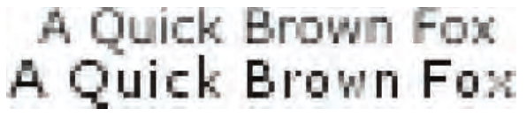

图 15.27。Verdana 字体未经微调（上）和经过微调（下）的渲染结果。（图片由 Nicolas Rougier 提供 [1515]。）

Pathfinder 库 [1834] 是近期利用 GPU 生成字形的一项工作。它的准备时间短，内存占用极少，性能超过了与之竞争的基于 CPU 的引擎。它使用曲面细分和计算着色器，生成并累加曲线对每个像素的影响；对于能力较弱的 GPU，则回退到几何着色器和 OpenCL。与 FreeType 一样，这些字形会被缓存并重复使用。它的高质量抗锯齿与高像素密度显示器相结合，使字体微调几乎不再必要。

无需复杂的 GPU 支持，也可以把文字以不同大小和朝向应用到任意表面上，同时仍提供合理的抗锯齿效果。Green [580] 提出了这样一个系统，Valve 最早在《军团要塞 2》（Team Fortress 2）中使用了它。该算法采用 Frisken 等人 [495] 提出的**采样距离场**数据结构。每个纹素保存到字形最近边缘的有符号距离。距离场尝试在纹理描述中编码每个字形的精确边界。然后，双线性插值便可在每个采样点对字母的 α 覆盖率给出良好的近似。图 15.28 给出了一个例子。双线性插值可能会使尖角变圆滑，但可以通过在四个独立通道中编码更多距离值来保留尖角 [263]。这种方法的一个局限是，生成这些有符号距离纹理很耗时，因此需要预先计算并存储。尽管如此，已有多个字体渲染库基于这项技术 [1440]，而且它很适合移动设备 [3]。Reshetov 和 Luebke [1485] 总结了沿着这一思路开展的工作，并给出了他们自己的方案：在放大时调整采样点的纹理坐标。

即便不考虑缩放和旋转，例如，使用汉字的语言所用的字体，也可能需要数千个甚至更多字形。一个高质量的大字符需要更大的纹理。如果从斜角观察字形，可能还需要对纹理进行各向异性过滤。直接根据字形的边缘和曲线描述来渲染它，可以避免对任意大纹理的需求，也能避免采样网格带来的瑕疵。Loop–Blinn 方法 [1068, 1069] 使用像素着色器直接求值 Bézier 曲线，第 17.1.2 节将讨论这种方法。这项技术需要一个曲面细分步骤，如果在加载时执行，开销可能很大。Dobbie [360] 通过为每个字符的包围盒绘制一个矩形，并在单次绘制中对字形的全部轮廓求值，避开了这一问题。Lengyel [1028] 提出了一种稳健的求值方法，用来判断一个点是否位于字形内部；这对避免瑕疵至关重要。他还讨论了求值优化，以及发光、投影和多种颜色（例如用于表情符号）等效果。

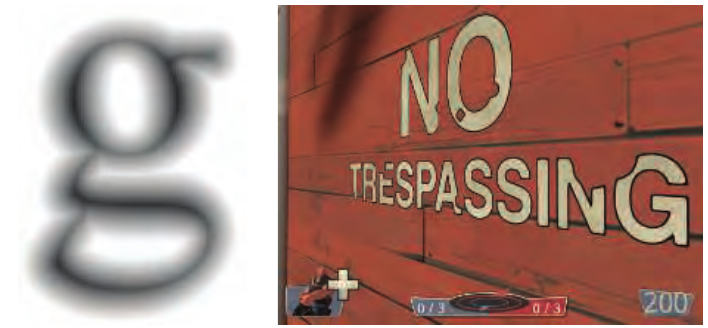

图 15.28。矢量纹理。左图是字母“g”的距离场表示 [3]。右图的“禁止擅入”（no trespassing）标牌由距离场渲染而成。文字周围的描边是通过将特定的距离范围映射为描边颜色而添加的 [580]。（左图由 ARM Ltd. 提供。右图来自《军团要塞 2》，由 Valve Corp. 提供。）

## 第15章 延伸阅读与资源

来源：《Real-Time Rendering, 4th Edition》书页 678—679（PDF 第 699—700 页），从“Further Reading and Resources”标题开始，包含书页 679 的跨页续文及章末最后一段。PDF 第 701 页为出版商标识页，其文字附于文末。

若想获得非真实感渲染和卡通渲染方面的灵感，可以阅读 Scott McCloud 的《理解漫画》（Understanding Comics）[1157]。若想了解研究者的视角，可以参阅 Hertzmann 的文章 [728]，其中讨论了如何利用 NPR 技术来帮助建立关于艺术和插图的科学理论。

《使用 OpenGL 进行高级图形编程》（Advanced Graphics Programming Using OpenGL）[1192] 一书虽然写于固定功能硬件时代，但其中仍有值得一读的章节，介绍了多种技术插图和科学可视化技术。Gooch 夫妇的著作 [563] 和 Strothotte 的著作 [1719] 也都有些年头了，但仍是学习 NPR 算法的良好起点。Isenberg 等人 [799] 和 Hertzmann [727] 对轮廓边缘及笔划渲染技术作了综述。Rusinkiewicz 等人的 SIGGRAPH 2008 课程讲义 [1521] 也详细讨论了笔划渲染，包括较新的工作；Bénard 等人 [130] 则综述了帧间连贯性算法。对于艺术化图像处理效果，有兴趣的读者可以参阅 Kyprianidis 等人的综述 [949]。国际非真实感动画与渲染研讨会（International Symposium on Non-Photorealistic Animation and Rendering，NPAR）的会议论文集专注于这一领域的研究。

Mitchell 等人 [1223] 提供了一项案例研究，介绍工程师与美术人员如何协作，为游戏《军团要塞 2》（Team Fortress 2）赋予独特的图形风格。Shodhan 和 Willmott [1632] 讨论了游戏《孢子》（Spore）中的后处理系统，并给出了实现油画、老电影以及其他效果的像素着色器。SIGGRAPH 2010 课程“游戏中的风格化渲染”（Stylized Rendering in Games）也是获取实用示例的一个宝贵来源。特别是，Thibault 和 Cavanaugh [1761] 展示了《无主之地》（Borderlands）美术风格的演变，并介绍了这一过程中的技术挑战。Evans 的演讲 [446] 引人入胜地探索了多种渲染和建模技术，说明如何借此实现特定的媒介风格。

Pranckevičius [1440] 对加速文本渲染技术作了综述，其中提供了大量资源链接。

出版商标识页文字（PDF 第 701 页）：Taylor & Francis（泰勒与弗朗西斯）；Taylor & Francis Group（泰勒与弗朗西斯集团）；[出版商网站](http://taylorandfrancis.com)。
