# Real-Time Rendering 第17章 曲线与曲面 中文合集

> 依据用户提供的《Real-Time Rendering》第四版 PDF 完整翻译。原图配中文图注；复杂数学已排版为本地图片，简单符号直接显示。保留原书技术年代、公式编号与引用编号。

## 目录

- [17.1 参数曲线](<Real-Time_Rendering_4th_中文/第17章/17.01.md>)

- [17.2 参数曲面](<Real-Time_Rendering_4th_中文/第17章/17.02.md>)

- [17.3 隐式曲面](<Real-Time_Rendering_4th_中文/第17章/17.03.md>)

- [17.4 细分曲线](<Real-Time_Rendering_4th_中文/第17章/17.04.md>)

- [17.5 细分曲面](<Real-Time_Rendering_4th_中文/第17章/17.05.md>)

- [17.6 高效曲面细分](<Real-Time_Rendering_4th_中文/第17章/17.06.md>)

## 章首导言

来源：《Real-Time Rendering》第4版，第17章章首，书页717—718（PDF物理页738—739）；止于17.1节标题之前。

> “有物质的地方，就有几何。”
> ——约翰内斯·开普勒（Johannes Kepler）

三角形是一种基本的、原子级的渲染图元。图形硬件经过专门优化，能够迅速将它转换成经过着色的片元，并写入帧缓冲。然而，在建模系统中创建的物体与动画路径，其底层可以采用许多不同的几何描述。曲线和曲面能够用方程精确描述。对这些方程求值之后，便可生成一组三角形，再将其送入流水线进行渲染。

采用曲线和曲面的妙处至少有四点：（1）它们的表示比一组三角形更加紧凑；（2）它们提供了可伸缩的几何图元；（3）与直线和平面三角形相比，它们提供的图元更平滑、更连续；（4）动画与碰撞检测可能变得更简单、更快速。

紧凑的曲线表示为实时渲染带来了若干好处。首先，它节省了模型存储所需的内存，因此也能在一定程度上提高内存缓存的效率。这对游戏主机尤其有用，因为它们通常没有个人计算机那么多的内存。对曲面进行变换，所需的矩阵乘法一般比对表示同一曲面的网格进行变换更少。如果图形硬件能够直接接受这种曲面描述，那么主机CPU需要传给图形硬件的数据量，通常远少于传送三角形网格时的数据量。

PN三角形和细分曲面等曲面模型描述具有一个很有价值的性质：它们能够让多边形数量较少的模型显得更可信、更真实。各个多边形被视为曲面，从而可以在表面上创建更多顶点。顶点密度提高的结果，是表面的光照效果更好，轮廓边缘的质量也更高。图17.1给出了一个例子。

图17.1．《使命召唤：高级战争》中的一个场景，其中角色Ilona的面部采用Catmull–Clark细分曲面，并使用17.6.3节中的自适应四叉树算法进行渲染。（图片出自《使命召唤》，由Activision Publishing, Inc.提供，2018年。）

曲面的另一个重要优点是可伸缩性。同一份曲面描述可以转换成2个三角形，也可以转换成2000个三角形。曲面天然适合即时进行细节层次建模：当曲面物体靠近时，更密集地采样其解析表示，生成更多三角形。在动画方面，曲面的优势在于需要驱动的点要少得多。这些点可用于构成曲面，然后生成平滑的曲面细分结果。此外，碰撞检测也有可能更加高效、更加精确[939, 940]。

曲线与曲面这个主题已经有多部专著讨论[458, 777, 1242, 1504, 1847]。我们在这里的目标，是介绍实时渲染中经常使用的曲线与曲面。

## 17.1 参数曲线

来源：《Real-Time Rendering》第4版，书页718—734（PDF物理页739—755）；从17.1节标题开始，至17.2节标题之前，包括全部下级小节。章首导言与图17.1另见17.00_章首导言.md。

本节将介绍参数曲线。它们用于许多不同的场合，也有大量不同的实现方法。在实时图形中，参数曲线常用于让观察者或某个物体沿预先定义的路径移动。这可能涉及位置和朝向的同时改变。不过，本章仅考虑位置路径。关于朝向插值的信息，请参见4.3.2节。参数曲线的另一项用途是渲染头发，如图17.2所示。

假设你希望让相机在一定时间内从一个点移动到另一个点，而不受底层硬件性能的影响。例如，假设相机应该在1秒内完成两点之间的移动，而渲染一帧需要50毫秒。这意味着，在这一秒内，我们可以沿途渲染20帧。在更快的计算机上，一帧可能只需要25毫秒，即每秒40帧，因此我们会希望把相机移动到40个不同的位置。利用参数曲线，可以求出这两种情况下所需的点集。

图17.2．使用经过曲面细分的三次曲线渲染头发[1274]。（图片出自“Nalu”演示，由NVIDIA Corporation提供。）

参数曲线使用某个公式，把点描述成参数t的函数。数学上将其写作p(t)，意味着对于t的每一个取值，这个函数都会给出一个点。参数t可以属于某个区间，称为定义域，例如t ∈ [a, b]。生成的点是连续的，即当ε → 0时，p(t + ε) → p(t)。粗略地说，如果ε是一个极小的数，那么p(t)和p(t + ε)就是彼此极为接近的两个点。

下一小节将从直观的几何描述入手，介绍一种常见的参数曲线——Bézier曲线，再将其置于数学框架中。随后讨论如何使用分段Bézier曲线，并解释曲线连续性的概念。在17.1.4和17.1.5节，我们将介绍另外两种有用的曲线，即三次Hermite曲线和Kochanek–Bartels样条。最后，17.1.2节介绍使用GPU渲染Bézier曲线。

> 译注：上一句中的“最后”与17.1.2的编号顺序不一致，原书如此；实际GPU渲染内容位于17.1.2节。

### 17.1.1 Bézier曲线

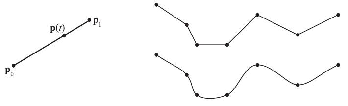

图17.3．两点之间的线性插值形成一条直线路径（左）。对于七个点，右上显示线性插值，右下显示某种较平滑的插值。采用线性插值时最令人不满意的，是各直线段接合处的不连续变化，也就是突然的顿挫。

线性插值在和两点之间描出一条直线路径。这已经是最简单的情况，见图17.3左图。给定这两个点，下列函数描述线性插值得到的点p(t)，其中t为曲线参数，且t ∈ [0, 1]：

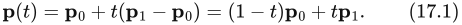

参数t控制点p(t)落在直线上的什么位置：p(0) = ，p(1) = ，而0 < t < 1则给出与之间直线上的点。因此，如果希望在1秒内用20步将相机从线性移动到，就使用 = i/(20 − 1)，其中i是帧编号，从0开始，到19结束。

只在两个点之间插值时，线性插值可能已经足够；但对于路径上的更多点，它往往不够。例如，对多个点进行插值时，在连接两个线段的点（也称接合点）处突然发生的变化就难以接受，如图17.3右侧所示。

为解决这一问题，我们将线性插值的思路再推进一步，反复进行线性插值。这样便得到Bézier曲线（读作beh-zee-eh）的几何构造。顺便介绍一下历史：Paul de Casteljau和Pierre Bézier分别独立开发了Bézier曲线，用于法国汽车工业。之所以称其为Bézier曲线，是因为Bézier先于de Casteljau公开发表了研究成果，尽管de Casteljau撰写技术报告的时间更早[458]。

首先，要能重复进行插值，就必须加入更多的点。例如，可以使用三个点a、b、c，称为控制点。假设要找p(1/3)，也就是t = 1/3时曲线上的点。我们使用t = 1/3，分别在a与b之间、b与c之间进行线性插值，算出两个新点d和e，见图17.4。最后，再用t = 1/3在d与e之间进行线性插值，得到f。定义p(t) = f。利用这一方法，可得到下列关系：

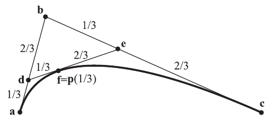

图17.4．反复进行线性插值可得到Bézier曲线。这条曲线由a、b、c三个控制点定义。假设要找参数t = 1/3对应的曲线点，首先在a与b之间线性插值得到d，再由b与c插值得到e。最后，在d与e之间插值，得到p(1/3) = f。

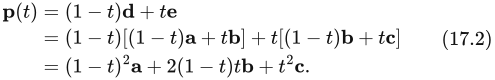

由于t的最高次数为2，所以这是一条抛物线。事实上，给定n + 1个控制点，所得到曲线的次数为n。这意味着更多控制点赋予曲线更多自由度。一次曲线是直线，称为线性曲线；二次曲线称为quadratic，三次曲线称为cubic，四次曲线称为quartic，依此类推。

这种重复的或递归的线性插值，通常称为de Casteljau算法[458, 777]。图17.5显示了使用五个控制点时的例子。为便于推广，不再像前例那样使用a到f，而采用如下记号：控制点记为，因此前例中的 = a、 = b、 = c。线性插值进行了k次之后，得到中间控制点。在前例中，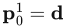、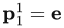、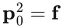。具有n + 1个控制点的Bézier曲线可用下列递推公式描述，其中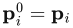是初始控制点：

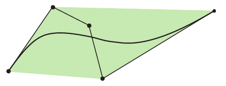

图17.5．对五个点反复进行线性插值，得到一条四次Bézier曲线。曲线位于控制点的凸包（绿色区域）内，控制点用黑点标出。此外，在第一个点处，曲线与第一、第二个点之间的直线相切；曲线的另一端也有同样的性质。

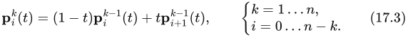

注意，曲线上的点由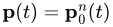描述。它并没有看起来那么复杂。再考虑由、、三个点构造Bézier曲线的过程，它们等同于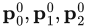。三个控制点意味着n = 2。为简化公式，有时会省去p后面的“(t)”。第一步k = 1，给出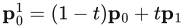和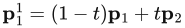。最后，当k = 2时，得到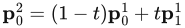，这就是所求的p(t)。图17.6展示了一般情况下的工作方式。

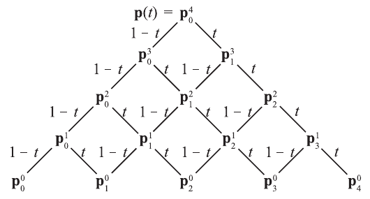

图17.6．Bézier曲线重复线性插值的工作原理示意。本例展示四次曲线的插值，因此共有五个控制点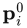，i = 0、1、2、3、4，显示于底部。此图应从下向上读：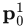由权重为1 − t的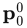与权重为t的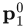相加得到。过程不断继续，直到在顶端得到曲线点p(t)。（示意图据Goldman [551]绘制。）

理解了Bézier曲线的基本工作方式之后，现在可以对同样的曲线给出更数学化的描述。

#### 使用Bernstein多项式的Bézier曲线

如式17.2所示，二次Bézier曲线可以用代数公式描述。事实上，每条Bézier曲线都可以用这样的代数公式描述，因此不必进行重复插值。下面的式17.4给出的曲线，与式17.3描述的曲线相同。这种Bézier曲线描述称为Bernstein形式：

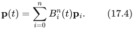

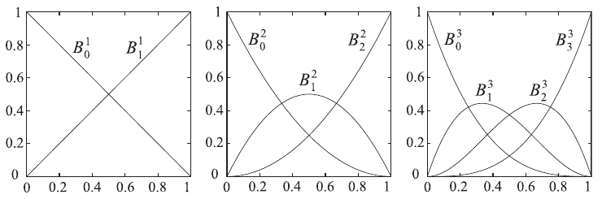

图17.7．从左至右分别为n = 1、n = 2、n = 3的Bernstein多项式。左图是线性插值，中图是二次插值，右图是三次插值。它们是Bézier曲线Bernstein形式所采用的混合函数。因此，要在某个t值处求二次曲线（中图）的值，只需在横轴上找到这个t值，再竖直向上直到与三条曲线相交，即得到三个控制点的权重。注意，当t ∈ [0, 1]时，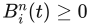；这些混合函数还具有对称性：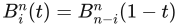。

这一函数包含Bernstein多项式，有时也称为Bézier基函数：

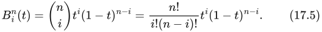

式中的第一项是二项式系数，其定义见第1章式1.6。Bernstein多项式有以下两个基本性质：

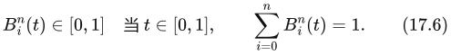

第一条公式表示，当t在0到1之间时，Bernstein多项式的值也位于0到1之间。第二条公式表示，对于任意次数的曲线，式17.4中的所有Bernstein多项式项之和均为1，这在图17.7中可以看出。粗略地说，这意味着曲线会保持在控制点“附近”。事实上，整个Bézier曲线都位于控制点的凸包内（参见本书在线线性代数附录），这一点可以由式17.4和17.6推出。计算曲线的包围区域或包围体时，这个性质很有用。图17.5给出了一个例子。

图17.7显示n = 1、n = 2、n = 3时的Bernstein多项式，它们也称为混合函数。n = 1，即线性插值的情况很直观，因为它显示的是y = 1 − t和y = t两条曲线。这意味着，t = 0时p(0) = ；随着t增大，的混合权重减小，的混合权重以相同幅度增大，使权重总和保持为1。最后，当t = 1时，p(1) = 。一般而言，所有Bézier曲线都有p(0) = 和p(1) = 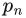，即对端点进行插值，端点位于曲线上。并且，曲线在t = 0处与向量 − 相切，在t = 1处与向量 − 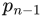相切。另一个有用性质是：不必先计算Bézier曲线上的点再旋转曲线，而可以先旋转控制点，再计算曲线上的点。控制点通常少于生成的曲线点，因此先变换控制点更高效。

以n = 2，即二次曲线为例，说明Bernstein形式的Bézier曲线如何工作。此时式17.4为：

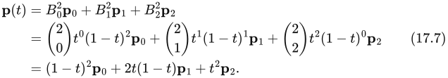

这与式17.2相同。注意，上述混合函数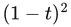、2t(1 − t)和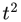，正是图17.7中图所显示的函数。类似地，三次曲线可以化简为：

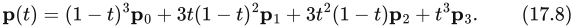

此式可改写为矩阵形式：

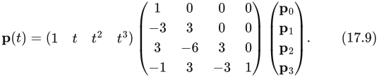

在进行数学化简时，这种形式有时很有用。

将式17.4中具有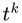形式的项合并，可以看出每条Bézier曲线都能写成下面的形式，称为幂形式，其中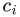是合并同类项后得到的点：

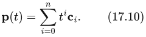

对式17.4求导，便可得到Bézier曲线的导数，过程很直接。整理并合并同类项后，结果如下[458]：

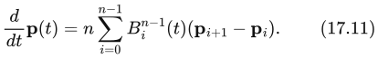

实际上，这个导数也是一条Bézier曲线，只是比p(t)低一次。

Bézier曲线一个潜在缺点，是它们不会经过所有控制点，端点除外。另一个问题是，曲线次数随控制点数量增多而升高，求值开销因而越来越大。一种解决办法是在每对相邻控制点之间使用简单的低次曲线，并保证这种分段插值有足够高的连续性。这是17.1.3—17.1.5节的主题。

#### 有理Bézier曲线

虽然Bézier曲线用途很多，但自由度并没有那么多——只有控制点的位置可以自由选择。此外，并非所有曲线都能由Bézier曲线描述。例如，圆通常被认为是一种简单形状，却无法用一条或一组Bézier曲线定义。一种替代方案是有理Bézier曲线。这类曲线由式17.12描述：

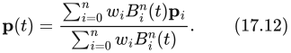

分母是Bernstein多项式的加权和，分子则是标准Bézier曲线（式17.4）的加权版本。对于这类曲线，用户还可以把权重作为额外的自由度。更多内容可见Hoschek和Lasser的著作[777]以及Farin的著作[458]。Farin还介绍了如何用三条有理Bézier曲线描述一个圆。

### 17.1.2 GPU上的有界Bézier曲线

这里介绍一种在GPU上渲染Bézier曲线的方法[1068, 1069]。具体而言，目标是“有界Bézier曲线”：填充曲线与首尾控制点连线之间的区域。采用专门的像素着色器渲染一个三角形，就能以一种出乎意料的简单方式完成这件事。

我们使用一条二次Bézier曲线，控制点为、和。如果把这些顶点的纹理坐标设置为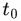 = (0, 0)、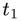 = (0.5, 0)、 = (1, 1)，那么在渲染三角形△  时，纹理坐标会像通常一样进行插值。我们还要对三角形内每个像素计算以下标量函数，其中u和v为插值得到的纹理坐标：

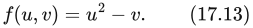

像素着色器据此判断像素是在内部，即f(u, v) < 0，还是在外部，见图17.8。使用此像素着色器渲染一个经过透视投影的三角形，就会得到相应的投影Bézier曲线。Loop和Blinn给出了证明[1068, 1069]。

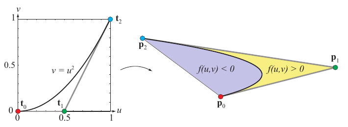

图17.8．有界Bézier曲线的渲染。左：曲线显示在规范纹理空间中。右：曲线渲染在屏幕空间中。如果用条件f(u, v) ≥ 0剔除像素，渲染结果就是浅蓝色区域。

这种技术可以用于渲染TrueType字体等，如图17.9所示。Loop和Blinn还展示了如何渲染有理二次曲线和三次曲线，以及如何利用这种表示进行抗锯齿。由于文本渲染十分重要，这一领域的研究仍在继续。相关算法见15.5节。

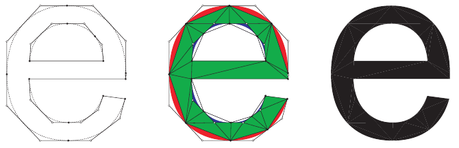

图17.9．字母e由若干直线和二次Bézier曲线表示（左）。中图将此表示“细分”为若干有界Bézier曲线（红色和蓝色）以及三角形（绿色）。右侧显示最终字母。（经Microsoft Corporation许可转载。）

### 17.1.3 连续性与分段Bézier曲线

假设有两条三次Bézier曲线，即每条均由四个控制点定义。第一条曲线由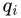定义，第二条由定义，i = 0、1、2、3。为了连接曲线，可以令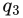 = 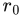。这个点称为接合点。不过，如图17.10所示，采用这种简单方法，接合点不会平滑。由多个曲线片段（此处是两个）构成的复合曲线称为分段Bézier曲线，这里记为p(t)。进一步假设希望p(0) = 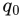、p(1) =  = 、p(3) = 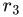。因此，到达、 = 、的时刻分别为 = 0.0、 = 1.0和 = 3.0。记号见图17.10。

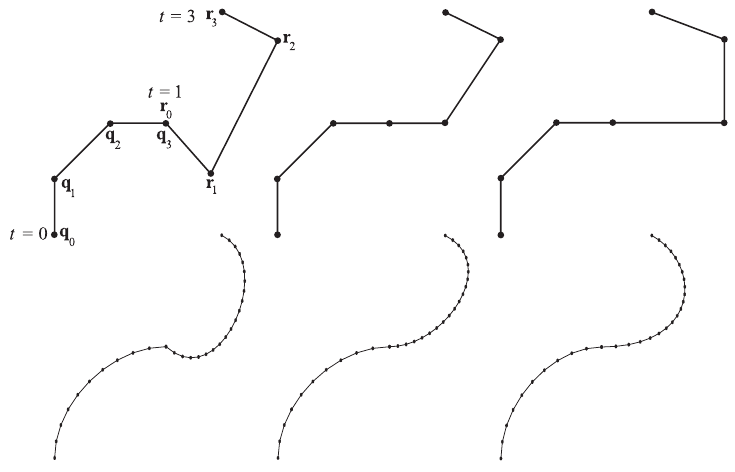

图17.10．从左至右显示两条三次Bézier曲线（各有四个控制点）之间的、和连续性。上排显示控制点，下排显示曲线，其中左段曲线取10个采样点，右段取20个。本例使用如下时间—点配对：(0.0, )、(1.0, )、(3.0, )。连续时，接合处（ = ）有突然的顿挫。令接合处的切向量平行（并且等长），实现连续，就能改善这种情况。但由于3.0 − 1.0 ≠ 1.0 − 0.0，这并不能得到连续。接合处采样点突然加速的现象体现了这一点。要达到连续，接合处右侧切向量的长度必须是左侧的两倍。

由上一节可知，Bézier曲线定义于t ∈ [0, 1]，因此由定义的第一段曲线没有问题，因为处的时间是0.0，处的时间是1.0。但1.0 < t ≤ 3.0时怎么办？答案很简单：必须使用第二段曲线，然后对参数区间进行平移和缩放，将[, ]映射到[0, 1]。这可以用下式完成：

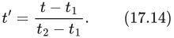

因此，输入由定义的Bézier曲线段的，是t′。将此推广到多条Bézier曲线的拼接也很简单。

连接曲线的一种更好方法，是利用如下事实：在Bézier曲线的第一个控制点处，切线平行于 − （17.1.1节）。类似地，在最后一个控制点处，三次曲线与 − 相切。图17.5展示了这一性质。因此，要让两条曲线在接合点处相切连接，第一条与第二条曲线在此处的切向量应当平行。更正式地说，应满足：

这只是说，接合点处的入切向量 − ，应与出切向量 − 方向相同。

将式17.16定义的c代入式17.15，还可以得到更高的连续性[458]：

图17.10也显示了这种情况。如果改令 = 2.0，那么c = 1.0；也就是说，各段曲线的时间间隔相等时，入切向量和出切向量应该完全相同。但当 = 3.0时，这种做法就不成立。曲线看起来仍然相同，但p(t)沿复合曲线移动的速度不会平滑。式17.16中的常数c解决了这个问题。

使用分段曲线的一些优点是：可以采用低次曲线，而且最终曲线能够经过一组点。在上述例子中，两段曲线各自采用三次。三次曲线常用于此，因为它们是能够描述S形曲线、即具有拐点的最低次曲线。得到的曲线p(t)插值，即经过、 = 和这些点。

到这里，我们已经通过例子介绍了两种重要的连续性度量。下面对曲线连续性的概念作稍微数学化的说明。对于一般曲线，我们采用记号区分接合点处不同种类的连续性。这意味着前n阶导数在整条曲线上都应该连续且非零。连续表示曲线段应该在同一个点相接，因此线性插值满足此条件。本节第一个例子就是这种情况。连续表示，如果在曲线上任意一点（包括接合点）处求一次导数，结果也应连续。本节采用式17.16的第三个例子就是这种情况。

> 译注：此处“非零”按原文保留。通常连续性的定义要求到n阶的导数连续，并不要求它们非零；非零切向量是讨论正则曲线及其切线方向时的额外条件。

还有一种记为的度量。以（几何）连续为例：在接合点相遇的曲线段，其切向量应该平行且同向，但不对长度作任何假设。换言之，比弱；一条曲线总是连续，例外是两条曲线在连接点的速度都趋于零，而在到达连接点之前的切线又不同。几何连续性的概念还可以推广到更高维度。图17.10中间的示意图显示连续。

### 17.1.4 三次Hermite插值

图17.11．三次Hermite插值的混合函数。注意切向量混合函数的不对称性。若将式17.17中的混合函数 − 以及同时取负，外观就会对称。

Bézier曲线很适合说明构造平滑曲线的理论，但使用时有时不太容易预测结果。本节介绍三次Hermite插值，这些曲线往往更容易控制。原因在于：三次Bézier曲线由四个控制点描述，而三次Hermite曲线由起点和终点、，以及起点和终点的切向量、定义。Hermite插值函数p(t)，其中t ∈ [0, 1]，为：

我们也将p(t)称为Hermite曲线段或三次样条段。这是三次插值函数，因为上式混合函数中的最高幂为。此曲线满足：

这意味着Hermite曲线插值和，并且在这两点处的切向量为和。式17.17中的混合函数见图17.11，它们可以由式17.4和17.18推导出来。图17.12给出若干三次Hermite插值的例子。所有例子都插值相同的点，但切向量不同。还要注意，切向量长度不同也会得到不同结果；较长的切向量对整体形状影响更大。

图17.12．Hermite插值。一条曲线由、两个点，以及各点处的切向量、定义。

Nalu演示使用三次Hermite插值渲染头发[1274]，见图17.2。使用粗略的控制发丝进行动画和碰撞检测，计算切向量，再对三次曲线进行细分与渲染。

### 17.1.5 Kochanek–Bartels曲线

在多于两个点之间进行插值时，可以连接多条Hermite曲线。不过，在此过程中，选择共享切向量仍有自由度，不同选择会产生不同特性。这里介绍一种计算这些切向量的方法，称为Kochanek–Bartels曲线。假设有n个点, …, ，要用n − 1段Hermite曲线插值。我们假设每个点处只有一个切向量，首先考察“内部”切向量, …, 。处的切向量可以由两条弦 − 和 − 组合而成[917]，如图17.13左侧所示。

首先，引入张力参数a，用以修改切向量的长度。这控制接合处曲线的尖锐程度。切向量计算如下：

图17.13右上排显示不同的张力参数。默认值是a = 0；更大的值会产生更尖锐的转弯（如果a > 1，接合处会出现环），负值则使接合点附近的曲线更松弛。其次，引入偏置参数b，它影响切向量的方向，并间接影响其长度。同时使用张力与偏置，可得到：

图17.13．计算切向量的一种方法，是组合两条弦（左）。右上排显示张力参数a不同的三条曲线。左边曲线a ≈ 1，表示高张力；中间曲线a ≈ 0，是默认张力；右边曲线a ≈ −1，表示低张力。右下排的两条曲线显示不同偏置参数。左曲线的偏置为负，右曲线的偏置为正。

其中默认值为b = 0。正偏置使弯曲更朝向弦 − ，负偏置使弯曲更朝向另一条弦 − ，如图17.13右下排所示。用户可以设置张力和偏置参数，也可以保留默认值，后者产生的就是通常所说的Catmull–Rom样条[236]。首点和末点的切向量也可以用这些公式计算，只需将其中一条弦的长度设为零。

还可以在切向量方程中加入另一个控制接合处行为的参数[917]。不过，这需要在每个接合点引入两个切向量：入切向量记为（source），出切向量记为（destination），见图17.14。注意，与之间的曲线段使用切向量和。切向量计算如下，其中c是连续性参数：

同样，c = 0是默认值，此时 = 。设置c = −1可得 =  − 、 =  − ，从而在接合处产生尖角，仅为连续。增大c值会使和越来越相似。c = 0时， = 。当c达到1时，得到 =  − 、 =  − 。因此，连续性参数c是为用户提供更多控制的另一种方式，需要时可以在接合处制造尖角。

> 译注：“增大c值会使二者越来越相似”应结合前文从−1增大到0理解；继续从0增大到1时，两切向量又会逐渐分离。这里保留原书叙述。

图17.14．Kochanek–Bartels曲线的入切向量与出切向量。每个控制点处还显示了对应时间，其中对所有i均有 > 。

将张力、偏置和连续性组合起来，默认参数值为a = b = c = 0，得到：

式17.20和17.22都只适用于所有曲线段采用相同长度时间间隔的情况。为了考虑不同曲线段的时间长度差异，必须调整切向量，类似于17.1.3节的做法。调整后的切向量记为′和′，其值为：

其中 =  − 。

### 17.1.6 B样条

这里简要介绍B样条，重点讨论三次均匀B样条。一般而言，B样条与Bézier曲线十分相似，可表示为关于t、基函数及控制点的函数，其中基函数经平移后由控制点加权。例如：

此例的曲线以t为横轴，以(t)为纵轴，控制点就是横向等间距位置上的y值。更全面的介绍可参见“Killer B’s”的著作[111]、Farin [458]以及Hoschek和Lasser [777]的著作。

图17.15．左：粗黑曲线为基函数(t)，由两个分段三次函数（红色与绿色）构成。当|t| < 1时使用绿色曲线，当1 ≤ |t| < 2时使用红色曲线，其余位置取零。右：使用四个控制点，k ∈ {i − 1, i, i + 1, i + 2}创建一段曲线时，只得到的t坐标与 + 1之间的曲线。将α输入w函数对基函数求值，再将这些值乘以相应控制点。最后将所有值相加，就得到曲线上一个点，见图17.16。（右图据Ruijters等人[1518]绘制。）

> 译注：图17.15原图注写作“ + 1”，结合控制点标号与式17.26，应理解为对应的位置，而不是把控制点的纵坐标加1。

这里遵循Ruijters等人[1518]的讲解，介绍均匀三次B样条这一特殊情况。基函数(t)由三部分拼接而成：

图17.15左图显示这一基函数的构造。此函数处处连续，因此如果将多段B样条曲线拼接起来，复合曲线也会是连续的。三次曲线具有连续性；一般而言，n次曲线具有连续性。通常，基函数构造如下：(t)是一个“方形”函数，即|t| < 0.5时取1，|t| = 0.5时取0.5，其他位置取0。下一个基函数(t)通过对(t)积分生成，得到帐篷函数。再下一个基函数通过对(t)积分生成，得到更平滑、具有连续性的函数。重复这一过程，便得到连续的函数，依此类推。

> 译注：本段的连续性陈述针对这里的均匀B样条及其简单结点，不是任意n次分段曲线都自动达到连续。原书将基函数递推简称为“积分”；若理解为普通不定积分，则方形函数不会变成帐篷函数。准确的构造是与方形基函数卷积，等价于对一个移动的单位宽区间积分。正文保留原书说法。

图17.15右图显示曲线段如何求值，公式为：

注意，任何时刻只用到四个控制点，这意味着曲线具有局部支撑性，即只需要有限数量的控制点。函数(α)用()定义为：

图17.16．本例中，控制点（绿色圆圈）定义一条均匀三次样条。只有两条粗曲线属于分段B样条曲线。左边的绿色曲线由最左侧四个控制点定义，右边的红色曲线由最右侧四个控制点定义。两曲线在t = 1处以连续性相接。

Ruijters等人[1518]表明，这些函数可改写为：

图17.16展示了将两段均匀三次B样条曲线拼接成一条曲线的结果。其主要优势是，曲线连续，并具有与基函数β(t)相同的连续性；对三次B样条来说，就是连续。如图所示，并不能保证曲线经过任何控制点。注意，也可以为x坐标创建一条B样条，从而得到平面上的一般曲线，而不仅是一个函数。此时生成的二维点为，也就是分别针对x和y对式17.26进行两次不同的求值。

我们展示的仅是均匀B样条的使用方法。如果控制点之间的间隔不均匀，方程会稍微复杂一些，但也更加灵活[111, 458, 777]。

## 17.2 参数曲面

来源：原书第 734—749 页（PDF 第 755—770 页）；图 17.33 及其图注续见原书第 750 页（PDF 第 771 页）。本节从“17.2 Parametric Curved Surfaces”标题开始，到“17.3 Implicit Surfaces”标题前结束，另收入跨节漂移的图 17.33。

参数曲线的自然扩展是参数曲面。可以作这样的类比：三角形或多边形是线段的扩展，使我们从一维进入二维。参数曲面可以用来为具有弯曲表面的物体建模。参数曲面由少量控制点定义。参数曲面的曲面细分，是在若干位置对曲面表示求值，并把所得位置连接成三角形，以近似真实曲面的过程。这样做是因为图形硬件能够高效地渲染三角形。在运行时，可以根据需要把曲面细分成任意多的三角形。因此，参数曲面非常适合在质量与速度之间作权衡：三角形越多，渲染所需时间越长，但着色效果和轮廓越好。参数曲面的另一个优点是，可以先为控制点制作动画，再对曲面进行细分。相比之下，直接为大型三角网格制作动画可能更昂贵。

本节首先介绍 Bézier 曲面片，即定义域为矩形的曲面。它们也称为张量积 Bézier 曲面。随后介绍具有三角形定义域的 Bézier 三角形，并在 17.2.3 节讨论连续性。17.2.4 节和 17.2.5 节介绍两种把每个输入三角形替换为一个 Bézier 三角形的方法，分别称为 PN 三角形和 Phong 曲面细分。最后，17.2.6 节介绍 B 样条曲面片。

### 17.2.1 Bézier 曲面片

17.1.1 节介绍的 Bézier 曲线概念，可以从使用一个参数扩展到使用两个参数，从而形成曲面而非曲线。先从把线性插值扩展为双线性插值开始。现在使用四个点 a、b、c 和 d，而不再只使用两个点，如图 17.17 所示。也不再只使用一个名为 t 的参数，而是使用两个参数 (u, v)。用 u 分别对 a 与 b、c 与 d 进行线性插值，得到 e 和 f：

**图 17.17** 使用四个点进行双线性插值。

接下来，使用 v 在另一个方向上，对线性插值得到的点 e 和 f 再作线性插值。这就得到双线性插值：

注意，这与纹理映射中双线性插值所用的方程属于同一类型（第 179 页的公式 6.1）。公式 17.30 描述了最简单的非平面参数曲面，使用不同的 (u, v) 值，可以生成曲面上的不同点。定义域，即有效取值的集合，是 (u, v) ∈ [0, 1] × [0, 1]，这意味着 u 和 v 都应属于 [0, 1]。当定义域为矩形时，得到的曲面通常称为曲面片。

为了从线性插值扩展出 Bézier 曲线，我们增加了更多点，并重复执行插值。同样的策略也适用于曲面片。假设使用按 3 × 3 网格排列的九个点，如图 17.18 所示，图中也给出了所用记号。要从这些点构造双二次 Bézier 曲面片，首先需要进行四次双线性插值，生成四个中间点，图 17.18 也展示了这些点。然后，再对先前生成的点进行双线性插值，得到曲面上的最终点。

**图 17.18** 左：由九个控制点  定义的双二次 Bézier 曲面。右：为了生成 Bézier 曲面上的一个点，首先由最近的控制点进行双线性插值，生成四个点 。最后，由这些新生成的点进行双线性插值，得到曲面上的点 。

上述重复双线性插值，是 de Casteljau 算法向曲面片的扩展。这里需要定义一些记号。曲面的次数为 n。控制点记为 ,ⱼ，其中 i 和 j 属于 [0…n]。因此，n 次曲面片使用  个控制点。注意，控制点本应带有为零的上标，即 ，但通常会省略；在不会产生混淆时，有时也用下标 ij 代替 i,j。使用 de Casteljau 算法的 Bézier 曲面片，由下式描述。

**de Casteljau［曲面片］：**

与 Bézier 曲线类似，Bézier 曲面片在 (u, v) 处的点为 。Bézier 曲面片也可以使用 Bernstein 多项式，写成 Bernstein 形式，如公式 17.32 所示。

**Bernstein［曲面片］：**

> 译注：原书公式 17.31 中 u 沿 j 方向、v 沿 i 方向递推；公式 17.32 则把 u 与 i、v 与 j 对应。两式的参数与控制点索引方向约定不一致，此处分别保留原书写法，实际实现时应统一约定。

注意，公式 17.32 中有两个表示曲面次数的参数 m 和 n。“复合”次数有时记为 m × n。通常 m = n，这能使实现略为简化。假如 m > n，就先进行 n 次双线性插值，然后再进行 m − n 次线性插值，如图 17.19 所示。把公式 17.32 改写成下面的形式，还可以得到另一种解释：

**图 17.19** 不同方向上的次数不同。

其中，，i = 0…m。由公式 17.33 的最后一部分可以看出，当固定 v 值时，这就是一条 Bézier 曲线。假设 v = 0.35，则可以通过 Bézier 曲线计算点 (0.35)，于是公式 17.33 就描述了 Bézier 曲面上 v = 0.35 处的一条 Bézier 曲线。

下面介绍 Bézier 曲面片的一些有用性质。在公式 17.32 中分别令 (u, v) = (0, 0)、(0, 1)、(1, 0) 和 (1, 1)，就很容易证明：Bézier 曲面片会插值，也就是经过角部控制点 ,₀、,ₙ、,₀ 和 ,ₙ。此外，曲面片的每条边界，都由边界控制点组成的一条 n 次 Bézier 曲线描述。因此，角部控制点处的切线由这些边界 Bézier 曲线定义。每个角部控制点有两条切线，分别沿 u 方向和 v 方向。与 Bézier 曲线一样，曲面片也位于其控制点的凸包之内，并且有

其中 (u, v) ∈ [0, 1] × [0, 1]。最后，先旋转控制点，再生成曲面片上的点，在数学上等价于先生成曲面片上的点，再旋转这些点，不过前者通常更快。

> 译注：上述角点索引和“每条边界均为 n 次”的说法对应常用的 m = n 情形。若采用公式 17.32 的一般 m × n 次形式，角点应为 ,₀、,ₙ、,₀、,ₙ，两组边界的次数分别为 m 和 n。

对公式 17.32 求偏导，可得下列方程 [458]。

**导数［曲面片］：**

可以看到，在求导的方向上，曲面片的次数降低了一次。由此构造的未归一化法向量为

图 17.20 同时展示了控制网格和实际 Bézier 曲面片。移动一个控制点的效果见图 17.21。

**图 17.20** 左：具有 4 × 4 个控制点、次数为 3 × 3 的 Bézier 曲面片的控制网格。中：实际在曲面上生成的四边形。右：着色后的 Bézier 曲面片。

**图 17.21** 这组图像展示了移动一个控制点时 Bézier 曲面片会发生什么变化。大部分变化都出现在被移动控制点的附近。

#### 有理 Bézier 曲面片

正如可以把 Bézier 曲线扩展为有理 Bézier 曲线（17.1.1 节），从而引入更多自由度一样，Bézier 曲面片也可以扩展为有理 Bézier 曲面片：

有关这类曲面片的信息，可参阅 Farin 的著作 [458] 以及 Hochek 和 Lasser 的著作 [777]。类似地，有理 Bézier 三角形是 Bézier 三角形的一种扩展，下一小节将介绍后者。

### 17.2.2 Bézier 三角形

尽管三角形通常被认为是比矩形更简单的几何图元，但在 Bézier 曲面中并非如此：Bézier 三角形没有 Bézier 曲面片那么直观。仍然值得介绍这种曲面片，因为它用于构造快速而简单的 PN 三角形和 Phong 曲面细分。注意，一些游戏引擎，例如 Unreal Engine、Unity 和 Lumberyard，支持 Phong 曲面细分和 PN 三角形。

控制点位于三角形网格中，如图 17.22 所示。Bézier 三角形的次数为 n，这意味着每条边有 n + 1 个控制点。这些控制点记为 ，有时简写为 。注意，对于全部控制点都有 i + j + k = n，且 i, j, k ≥ 0。因此，控制点总数为

**图 17.22** 三次 Bézier 三角形的控制点。

Bézier 三角形也以重复插值为基础，这并不奇怪。不过，由于定义域为三角形，插值必须使用重心坐标（22.8 节）。回顾一下，三角形    内的点可以写成 p(u, v) =  + u( − ) + v( − ) = (1 − u − v) +  + ，其中 (u, v) 是重心坐标。对于三角形内部的点，必须满足 u ≥ 0、v ≥ 0，以及 1 − (u + v) ≥ 0 ⇔ u + v ≤ 1。在此基础上，Bézier 三角形的 de Casteljau 算法为：

**de Casteljau［三角形］：**

Bézier 三角形在 (u, v) 处的最终点为 。Bézier 三角形的 Bernstein 形式为：

**Bernstein［三角形］：**

此时 Bernstein 多项式同时依赖 u 和 v，因此计算方式有所不同，如下所示：

其偏导数为 [475]：

**导数［三角形］：**

Bézier 三角形有一些不出所料的性质：它会插值，也就是经过三个角部控制点；每条边界都是由该边界上的控制点描述的一条 Bézier 曲线。此外，曲面位于控制点的凸包之内。图 17.23 展示了一个 Bézier 三角形。

**图 17.23** 左：经过曲面细分的 Bézier 三角形的线框。右：着色后的曲面及其控制点。

### 17.2.3 连续性

使用 Bézier 曲面构造复杂物体时，通常希望把多个不同的 Bézier 曲面拼接成一个复合曲面。要获得美观的结果，必须注意确保各曲面之间具有适当的连续性。这与 17.1.3 节中曲线的处理思路相同。

假设要拼接两个双三次 Bézier 曲面片，它们各自有 4 × 4 个控制点。图 17.24 展示了这一情形，左侧曲面片的控制点为 ，右侧为 ，其中 0 ≤ i, j ≤ 3。要保证  连续，曲面片必须在边界上共享相同的控制点，即  = 。

**图 17.24** 如何把两个 Bézier 曲面片拼接为  连续。所有位于粗线上的控制点都必须共线，而且两段线段长度之比必须相同。注意， = ，从而使曲面片具有公共边界。图 17.25 的右侧也展示了这一点。

然而，这还不足以得到外观良好的复合曲面。下面介绍一种可获得  连续性的简单技术 [458]。为此，必须约束最靠近共享控制点的两行控制点的位置。这两行为  和 。对于每个 j，点 、 和  必须共线，即位于一条直线上。此外，它们还必须具有相同的比值，也就是说，‖ − ‖ = k‖ − ‖。这里 k 是常数，对所有 j 都必须相同。图 17.24 和图 17.25 给出了示例。

> 译注：原书将上述恒定长度比条件称为  连续。严格按两个曲面片均使用单位参数区间、并沿拼接方向直接对应的参数化来比较， 要求边界两侧导数相等，因此这里应取 k = 1。一般恒定正比值表示导数成比例，可通过调整参数尺度实现 ；此处保留原文表述，并说明这一参数化前提。

这种构造会占用设置控制点时的许多自由度。在拼接四个共享一个角点的曲面片时，这一点更加明显。图 17.26 展示了这种构造。该图最右侧给出结果，显示了共享控制点周围八个控制点的位置。这九个点必须位于同一平面，并且必须形成一个双线性曲面片，如图 17.17 所示。如果只要求角点处（仅限角点）具有  连续性，那么让这九个点共面就足够了，这占用的自由度更少。

Bézier 三角形的连续性通常更复杂，Bézier 曲面片和 Bézier 三角形的  条件也同样如此 [458, 777]。使用许多 Bézier 曲面构造复杂物体时，往往很难保证所有边界都具有适当的连续性。一种解决办法是改用细分曲面，17.5 节将介绍它们。

注意，要在边界两侧得到外观良好的纹理映射，需要  连续性。对于反射和着色， 连续性就能得到合理结果； 或更高的连续性会带来更好的效果。图 17.25 给出了一个示例。

**图 17.25** 左列展示两个仅以  连续性连接的 Bézier 曲面片。显然，曲面片之间存在着色不连续。右列展示以  连续性连接的类似曲面片，外观更好。上排中的虚线表示两个相连曲面片之间的边界。右上图中的黑线展示了相连曲面片控制点的共线性。

**图 17.26** (a) 要把 F、G、H 和 I 四个曲面片拼接起来，所有曲面片共享一个角点。(b) 在竖直方向上，每条粗线上的三个点构成一组，三组点都必须使用相同的比值 k。这里没有画出这一比例关系；请参见最右图。(c) 在水平方向上进行类似处理，两个曲面片必须使用相同的比值 l。(d) 拼接后，全部四个曲面片必须在竖直方向上使用比值 k，在水平方向上使用比值 l。(e) 最终结果，其中最靠近共享控制点的九个控制点（包括共享点本身）的比值均已正确计算。

接下来的两个小节介绍两种方法，它们利用三角形顶点处的法线，为每个输入的平面三角形构造一个 Bézier 三角形。

### 17.2.4 PN 三角形

给定一个每个顶点都带有法线的输入三角网格，Vlachos 等人 [1819] 提出的 PN 三角形方案，旨在构造出比仅使用三角形更美观的曲面。“PN”是“point and normal”（点与法线）的缩写，因为生成这些曲面只需要这两类数据。它们也称为 N 曲面片。这一方案通过创建曲面来替代每个三角形，尝试改善三角网格的着色和轮廓。曲面细分硬件能够即时生成每个曲面，因为细分仅依据每个三角形的点和法线，不需要邻接信息。图 17.27 给出了示例。这里介绍的算法建立在 van Overveld 和 Wyvill 的工作 [1341] 之上。

**图 17.27** 各列显示同一模型的不同细节层次。左侧为原始三角形数据，共有 414 个三角形。中间的模型有 3,726 个三角形，右侧有 20,286 个三角形，全部由这里介绍的算法生成。注意轮廓和着色如何得到改善。下排以线框形式显示模型，可以看出每个原始三角形都生成了相同数量的子三角形。（模型由 id Software 提供。图像来自 ATI Technologies Inc. 的演示程序。）

假设一个三角形的顶点为 、 和 ，对应法线为 、 和 。基本思路是利用这些信息，为每个原始三角形创建一个三次 Bézier 三角形，然后根据需要从该 Bézier 三角形生成任意多的三角形。

为了简化记号，使用 w = 1 − u − v。三次 Bézier 三角形可写为

> 译注：对照 PDF 原页，公式 17.43 的展开式将  项的控制点印为 ，造成  重复、 缺失。按照该式第一行的求和定义及公式 17.41，这一项应为  。上式保留原书排印，应用时应使用此处指出的正确索引。

参见图 17.22。为了保证两个 PN 三角形之间边界上的  连续性，边上的控制点可以由角部控制点及这些角点处的法线确定（假设相邻三角形共享法线）。

假设要用控制点 、 以及  处的法线  来计算 ，如图 17.28 所示。只需取点 ，沿法线  的方向，把它投影到由  和  定义的切平面上 [457, 458, 1819]。假定法线已经归一化，点  计算如下：

**图 17.28** 如何用  处的法线 ，以及 、 两个角点，计算 Bézier 点 。

其他边界控制点也可以用类似方法计算，因此只剩下内部控制点 。它按下式计算，这种选取遵循一个二次多项式 [457, 458]：

Vlachos 等人 [1819] 没有使用公式 17.42 计算曲面上的两个切向量、再由它们计算法线，而是选择用以下二次方案插值法线：

这可以看作一个二次 Bézier 三角形，其控制点是六个不同的法线。在公式 17.46 中，把次数选为二次是很自然的，因为导数比实际 Bézier 三角形低一次，而且法线的线性插值无法描述拐曲。参见图 17.29。

**图 17.29** 本图说明为什么需要对法线进行二次插值，以及为什么线性插值不够。左列显示使用法线线性插值时的情况。法线描述凸曲面时，这样做没有问题（上）；但当曲面出现拐曲时就会失效（下）。右列展示二次插值。（插图参考 van Overveld 和 Wyvill [1342]。）

为了使用公式 17.46，需要计算法线控制点 、 和 。一种直观但存在缺陷的办法，是使用  和 （原始三角形顶点处的法线）的平均值来计算 。然而，当  =  时，又会遇到图 17.29 左下方的问题。因而，构造  时，先取  和  的平均值，再把这一法线关于图 17.30 所示的平面 π 作镜像反射。该平面的法线平行于端点  与  的差向量。由于仅对法向量作关于 π 的反射，而法向量与平面上的位置无关，因此可以假定 π 经过原点。还应注意，每个法线都应归一化。从数学上看， 的未归一化形式为 [1819]

最初，van Overveld 和 Wyvill 在这个方程中使用的系数是 3/2，而不是 2。仅通过观察图像，很难判断哪一个值更好；但使用 2 可以得到一个漂亮的解释，即它是真正关于该平面的镜像反射。

**图 17.30** PN 三角形中  的构造。虚线法线是  与  的平均值， 则是这一法线关于平面 π 的镜像反射。平面 π 的法线平行于  − 。

至此，三次 Bézier 三角形的全部 Bézier 点，以及二次插值所需的全部法向量，都已经计算完毕。剩下的工作只是在 Bézier 三角形上创建三角形，以便进行渲染。这种方法的优点是，能够以相对较低的代价，为曲面带来更好的轮廓和形状。

一种指定细节层次的方式如下：把原始三角形数据视为 LOD 0。之后，LOD 编号随三角形每条边上新增加的顶点数而递增。因此，LOD 1 在每条边上引入一个新顶点，从而在 Bézier 三角形上生成四个子三角形；LOD 2 在每条边上引入两个新顶点，生成九个子三角形。一般而言，LOD n 生成  个子三角形。为防止 Bézier 三角形之间出现裂缝，网格中的每个三角形都必须按相同的 LOD 进行细分。这是一个严重的缺点，因为很小的三角形也会被细分到与大三角形相同的程度。自适应曲面细分（17.6.2 节）和分数曲面细分（17.6.1 节）等技术，可以用来避免这些问题。

PN 三角形的一个问题是折痕难以控制，通常需要在希望产生折痕的位置附近插入额外三角形。Bézier 三角形之间只有  连续性，但在很多情况下外观仍然可以接受。这主要是因为法线跨三角形连续，使一组 PN 三角形能够模拟  曲面的外观。Boubekeur 等人 [181] 提出了更好的解决办法：允许一个顶点具有两个法线，而两个这样的顶点连接起来就会产生折痕。注意，要获得外观良好的纹理映射，三角形（或曲面片）之间的边界必须具有  连续性。还应知道，如果两个相邻三角形不共享相同的法线，就会出现裂缝。Grün [614] 描述了一种进一步改善 PN 三角形之间连续性质量的技术。Dyken 等人 [401] 提出了一种受 PN 三角形启发的技术，只对观察者所见的轮廓进行自适应细分，从而使它们更加弯曲。这些轮廓曲线以类似 PN 三角形曲线的方式推导。为了得到平滑过渡，他们在粗糙轮廓与细分轮廓之间进行混合。为了改善连续性，Fünfzig 等人 [505] 提出了 PNG1 三角形，它是 PN 三角形的改进形式，处处具有  连续性。McDonald 和 Kilgard [1164] 介绍了另一种 PN 三角形扩展，能够处理相邻三角形具有不同法线的情况。

### 17.2.5 Phong 曲面细分

Boubekeur 和 Alexa [182] 提出了一种称为 Phong 曲面细分的曲面构造方法。它与 PN 三角形有许多相似之处，但求值更快，实现更简单。把基础三角形的顶点记为 、 和 ，对应的归一化法线为 、 和 。首先回顾一下，基础三角形上重心坐标为 (u, v) 的点计算如下：

在 Phong 着色中，法线是在平面三角形上插值的，也使用上述方程，只是把点替换成法线。Phong 曲面细分尝试通过重复插值，构造 Phong 着色法线插值的几何版本，结果是一个 Bézier 三角形。这里的讨论请参照图 17.31。第一步是创建一个函数，把基础三角形上的点 q 投影到由一个点和一个法线定义的切平面上。这一步为

不再使用三角形顶点来进行线性插值（公式 17.48），而是使用函数  的结果来进行线性插值，得到

为了增加一些灵活性，引入形状因子 α，在基础三角形与公式 17.50 之间进行插值，从而得到 Phong 曲面细分的最终公式：

其中推荐的设置为 α = 0.75 [182]。生成该曲面所需的全部信息，只包括基础三角形的顶点和法线，以及用户提供的 α，因此这种曲面求值很快。所得三角曲面片是二次的，即次数低于 PN 三角形。法线仅作线性插值，与标准 Phong 着色相同。图 17.32 给出了对网格应用 Phong 曲面细分的效果示例。

> 译注：原书公式 17.50 将复合函数 (p(u, v)) 简写为 (u, v)；应先用公式 17.48 求基础三角形上的点，再代入公式 17.49。原书此处“triangular path”按上下文译为“三角曲面片”。

**图 17.31** 用曲线而非曲面展示 Phong 曲面细分的构造。这意味着 p(u) 只是 u 的函数，而不是 (u, v) 的函数； 也类似。注意，先把 p(u) 投影到切平面，生成  和 。随后，对  与  进行线性插值，生成 。最后，使用形状因子 α 在基础三角形与  之间混合。本例使用 α = 0.75。

**图 17.32** 将 Phong 曲面细分应用于怪物青蛙。从左到右：使用平面着色的基础网格、使用 Phong 着色的基础网格，以及对基础网格应用 Phong 曲面细分。注意轮廓的改善。本例使用 α = 0.6。（图像使用 Tamy Boubekeur 的演示程序生成。）

### 17.2.6 B 样条曲面

17.1.6 节简要介绍了 B 样条曲线，这里同样简要介绍 B 样条曲面。第 732 页的公式 17.24 可以推广为 B 样条曲面片：

它与 Bézier 曲面片公式（公式 17.32）十分相似。注意，(u, v) 是曲面上的一个三维点。如果把这个函数用于纹理过滤，那么公式 17.52 表示的是高度场，,ₗ 就是一维的，也就是高度值。

对于双三次 B 样条曲面片，需要在公式 17.52 中使用公式 17.25 的 (t) 函数。总共需要 4 × 4 个控制点 ,ₗ，而公式 17.52 所描述的实际曲面片位于最内侧的 2 × 2 个控制点之间，如图 17.33 所示。注意，双三次 B 样条曲面片对 Catmull-Clark 细分曲面（17.5.2 节）也至关重要。许多优秀著作包含有关 B 样条曲面的更多信息 [111, 458, 777]。

**图 17.33** 双三次 B 样条曲面片的配置，具有 4 × 4 个控制点 ,ₗ。(u, v) 的定义域是右侧所示的单位正方形。

## 17.3 隐式曲面

来源：《Real-Time Rendering, Fourth Edition》，书页749—753（PDF物理页770—774）。本节从17.3标题开始，到17.4标题之前结束；图17.33属于上一节，不收入本节。

到目前为止，我们只讨论了参数曲线和参数曲面。隐式曲面是另一类用于表示模型的有用曲面。它不使用某些参数（例如u和v）来显式描述曲面上的点，而是采用以下称为隐式函数的形式：

其含义如下：将点p代入隐式函数f后，如果结果为零，那么p就在隐式曲面上。隐式曲面常用于与射线进行相交测试（第22.6—22.9节），因为与对应的参数曲面（如果存在）相比，它们的求交可能更简单。隐式曲面的另一个优点是，构造实体几何算法很容易应用于它们，也就是说，可以让物体彼此相减，或者进行逻辑与、逻辑或运算。此外，物体也很容易混合和变形。

以下是一些位于原点的隐式曲面的例子：

这些表达式需要解释一下。球面的函数就是p到原点的距离减去半径，所以，如果p位于半径为r的球面上，(p,r)就等于0。否则，它会返回一个有符号距离：负值表示p在球内，正值表示p在球外。因此，这些函数有时也称为有符号距离函数（signed distance functions，SDF）。平面函数就是p的y坐标，即其正侧为y轴正方向一侧。对于圆角盒的表达式，我们假定向量的绝对值（|p|）和最大值运算均逐分量进行。另外，d是由盒子各边长的一半组成的向量。图17.34给出了圆角盒的示意，公式的解释见图注。若要得到没有圆角的盒子，只需令r = 0。

图17.34。左：没有圆角的盒子，其有符号距离函数为，其中p是待测试点，d的各分量是图示的各边长的一半。注意，|p|使后续计算都在右上象限中进行（二维情况下）。减去d意味着：如果p在x方向上处于盒内，那么|| − 为负，其他坐标轴同理。只保留正值，负值由max()钳制为零。因此，计算的是到盒子边的最近距离；这意味着，在求出max()之后，如果有多于一个分量为正，盒外的有符号距离场就会呈现圆角。右：从非圆角盒的距离函数中减去r，就得到圆角盒；这相当于将盒子向各个方向扩张r。

> 译注：原文将上述非圆角盒函数称为“有符号距离函数”，但按原式计算，盒内各点的值均为0，而非负的内部距离；它准确给出的是盒外距离。这里保留原式及原文称谓。式17.54中的圆角盒函数在基础盒内部恒为−r，因此也并非处处给出到圆角盒边界的精确有符号距离。

隐式曲面的法线由偏导数描述，这些偏导数组成的向量称为梯度，记作∇f：

要能够精确求出它，式17.55中的f必须可微，因此也必须连续。在实践中，人们常使用一种称为中心差分的数值技术，对场景函数f进行采样[495]：

∇和也类似。回顾一下， = (1, 0, 0)、 = (0, 1, 0)、，ε是一个很小的数。

> 译注：式17.56按原书保留。若将其作为偏导数的数值近似，通常还应除以2ε；若三个分量采用相同ε，并且最后将梯度归一化为单位法线，则省略这个共同因子不会改变方向。

要用式17.54中的图元构建场景，可以使用并集运算符∪。例如，就是由一个球和一个平面组成的场景。并集运算符通过取两个操作数中较小者来实现，因为我们希望找到距离p最近的曲面。平移是通过在调用有符号距离函数之前平移p来完成的；也就是说，表示平移了t的球。旋转及其他变换也可以采用同样的思路，即对p施加逆变换。要让一个物体在整个空间中重复也很直接：用代替p，作为有符号距离函数的参数即可。

隐式曲面的混合是一项很好的特性，可以用于通常所说的团块建模（blobby modeling）[161]、软物体（soft objects）或元球（metaballs）[67, 558]。图17.35展示了一些例子。基本思想是使用若干简单图元，例如球、椭球或其他可用图元，并将它们平滑地混合起来。每个物体都可以看成一个原子，混合后便得到由这些原子组成的分子。混合有许多不同的实现方法。对于两个距离和，使用混合半径进行混合的一种常用方法[1189, 1450]为：

图17.35。左：多组球对采用不同的混合半径进行混合，半径从左到右逐渐增大；地面由重复的圆角盒组成。右：三个球混合在一起。

其中，d是混合后的距离。虽然这个函数只混合到两个物体的最短距离，但可以重复使用它来混合更多物体（见图17.35右侧）。

> 译注：原页式17.57最后一项明确印为加号，此处照录。它与通常用于平滑并集的多项式平滑最小值形式所用的减号存在差异；例如当 = 时，原式给出d =  + /4。此处仅标记原式疑点，不擅自改式。

要将一组隐式函数可视化，通常采用射线步进（ray marching）[673]。一旦能够在场景中进行射线步进，也就可以生成阴影、反射、环境光遮蔽以及其他效果。图17.36展示了有符号距离场中的射线步进过程。在射线上的第一个点p处，我们求出到场景的最短距离d。这个距离表明，以p为中心、半径为d的球内没有其他物体比d更近，因此可以沿射线方向前进d个单位。如此继续，直到在某个ε容差内到达曲面，或者达到预先规定的射线步进次数；后一种情况下，可以认为射线击中了背景。图17.37给出了两个出色的例子。

图17.36。使用有符号距离场进行射线步进。虚线圆表示从圆心到最近曲面的距离。当前位置可以沿射线前进到前一个位置所对应圆的边界。

图17.37。使用有符号距离函数和射线步进，以程序化方式创建的雨林（左）和蜗牛（右）。树木由经过程序化噪声位移的椭球生成。（图像在Shadertoy中使用Iñigo Quilez的程序生成。）

每一个隐式曲面也都可以转换为由三角形组成的曲面。有多种算法可以完成这一操作[67, 558]。一个著名的例子是第13.10节介绍的行进立方体（marching cubes）算法。使用Wyvill和Bloomenthal算法进行多边形化的代码可以在网上找到[171]；de Araújo等人[67]则综述了近年来隐式曲面多边形化的技术。Tatarchuk和Shopf[1744]介绍了一种称为行进四面体（marching tetrahedra）的技术，可以使用GPU寻找三维数据集中的等值面。第48页的图3.13展示了使用几何着色器提取等值面的例子。Xiao等人[1936]提出了一个流体模拟系统，由GPU计算10万个粒子的位置，再利用这些粒子显示等值面；整个过程都以交互速率运行。

## 17.4 细分曲线

来源：《Real-Time Rendering》第4版，书页753—756（PDF物理页774—777）。本节范围从17.4标题起，至17.5标题前。

细分技术用于创建光滑的曲线和曲面。在建模中使用这类技术的一个原因是，它们在离散曲面（三角形网格）与连续曲面（例如一组Bézier曲面片）之间架起了桥梁，因此可用于细节层次技术（第19.9节）。这里，我们先介绍细分曲线的工作原理，再讨论一些更常用的细分曲面方案。

解释细分曲线，最好使用一个切角的例子。参见图17.38。将最左侧多边形的各个角切掉，就会得到一个顶点数加倍的新多边形。然后再将这个新多边形的角切掉，如此无限重复下去（更实际的做法是，重复到我们看不出任何差别为止）。得到的曲线称为**极限曲线**；由于所有角都被切掉了，它是光滑的。这个过程也可以看作一种低通滤波，因为所有尖角（高频成分）都被移除了。这个过程通常写成  →  →  ⋯ → P∞，其中  是起始多边形，也称为**控制多边形**，P∞ 则是极限曲线。

**图17.38**　Chaikin细分方案的执行过程。初始控制多边形  经一次细分成为 ，再次细分成为 。可以看到，细分过程中每个多边形  的角都会被切掉。经过无限次细分后，就得到极限曲线 P∞。这是一个逼近型方案，因为曲线不经过初始点。

这个细分过程可以用许多不同方式实现，每一种方式都由一个**细分方案**来刻画。图17.38所示的方法称为 **Chaikin方案** [246]，其工作方式如下。设一个多边形的 n 个顶点为 ，其中上标表示细分层级。对于原多边形中每一对相邻顶点，例如  和 ，Chaikin方案在它们之间创建两个新顶点：

可以看到，上标从 k 变为 k + 1，表示我们从一个细分层级进入下一层级，即 。执行这样一步细分后，原顶点会被丢弃，新点则被重新连接起来。图17.38展示了这种行为：沿原顶点指向相邻顶点的方向，在距原顶点为两点间距离的1/4处创建新点。细分方案的美妙之处，在于能够以简单的方式快速生成光滑曲线。不过，你并不能立即得到像第17.1节那样的曲线参数形式，尽管可以证明，Chaikin算法生成的是一条二次B样条 [111, 458, 777, 1847]。到目前为止，所介绍的方案适用于（闭合）多边形，但大多数方案也可以扩展到开放折线。对于Chaikin方案，唯一的区别是，在每一步细分中都保留折线的两个端点（而不是将其丢弃）。这样，曲线就会经过端点。

细分方案有两个不同类别，即**逼近型**和**插值型**。Chaikin方案属于逼近型，因为一般而言，极限曲线并不经过初始多边形的顶点。这是由于顶点被丢弃了（对于某些方案，则是被更新了）。相反，插值型方案保留上一步细分中的所有点，因此极限曲线 P∞ 会经过 、、 等的所有点。这意味着该方案对初始多边形进行插值。图17.39给出了一个例子，使用的多边形与图17.38相同。这个方案利用最近的四个点创建一个新点 [402]：

**图17.39**　四点细分方案的执行过程。这是一个插值型方案，因为曲线经过初始点，而且一般而言，曲线  经过  的各个点。注意，这里使用的控制多边形与图17.38相同。

公式（17.59）的第一行仅表示保留上一步的点而不改变它们（即插值），第二行则用于在  与  之间创建一个新点。权重 w 称为**张力参数**。当 w = 0 时，结果是线性插值；而当 w = 1/16 时，就得到图17.39所示的行为。可以证明 [402]，当 0 < w < 1/8 时，所得曲线具有  连续性。对于开放折线，端点处会出现问题，因为我们需要在新点的两侧各有两个点，而在端点一侧却只有一个。将紧邻端点的那个点关于端点作反射，即可解决这个问题。因此，在折线的起始处，将  关于  反射，得到 。随后便可在细分过程中使用这个点。图17.40展示了  的构造方法。

**图17.40**　为开放折线创建反射点 。反射点计算如下：** =  − ( − ) =  − **。

另一种逼近型方案采用以下细分规则：

第一行更新已有的点，第二行计算两个相邻点之间线段的中点。该方案生成一条三次B样条曲线（第17.1.6节）。关于这些曲线的更多信息，可查阅SIGGRAPH细分课程 [1977]、《The Killer B’s》一书 [111]、Warren与Weimer关于细分的著作 [1847]，或Farin的CAGD著作 [458]。

给定一个点 **p** 及其相邻点，就可以直接将该点“推”到极限曲线上，即确定 **p** 在 P∞ 上的坐标。切向量也可以用类似方式求得。例如，可参阅Joy关于这一主题的在线入门资料 [843]。

细分曲线的许多概念同样适用于细分曲面，下面将介绍细分曲面。

## 17.5 细分曲面

来源：原书第 756—767 页，对应 PDF 第 777—788 页；范围从 17.5 标题开始，到 17.6 标题之前，包含全部下级小节。

细分曲面是一种强大的方法，可以从具有任意拓扑结构的网格定义光滑、连续、没有裂缝的曲面。与本章其他所有曲面一样，细分曲面也提供无限的细节层次。也就是说，你可以生成任意多的三角形或多边形，而原始曲面表示依然紧凑。图 17.41 展示了曲面细分的例子。另一个优点是，细分规则简单，易于实现。其缺点是，曲面连续性的分析在数学上往往很复杂。不过，这类分析通常只有希望创建新细分方案的人才会感兴趣，超出了本书范围。相关细节请参阅 Warren 和 Weimer 的著作 [1847]，以及 SIGGRAPH 关于细分的课程 [1977]。

一般来说，曲面（以及曲线）的细分可以看作分为两个阶段的过程 [915]。从称为**控制网格**或**控制笼**的多边形网格出发，第一个阶段称为**细化阶段**，它创建新顶点，并重新连接，生成更小的新三角形。第二个阶段称为**平滑阶段**，通常为网格中的部分或全部顶点计算新位置。图 17.42 展示了这一过程。正是这两个阶段的具体细节决定了一种细分方案的特征。在第一阶段，多边形可以按照不同方式分割；在第二阶段，细分规则的选择会带来不同特性，例如连续性的级别，以及曲面是逼近型还是插值型。这些性质已在 17.4 节介绍。

**图 17.41** 左上图显示控制网格，即原始网格，它是描述最终细分曲面的唯一几何数据。后续图像分别进行了 1 次、2 次和 3 次细分。可以看到，生成的多边形越来越多，曲面也越来越光滑。这里使用的是 17.5.2 节介绍的 Catmull-Clark 方案。

**图 17.42** 将细分视为细化与平滑。细化阶段创建新顶点并重新连接，生成新三角形；平滑阶段为顶点计算新位置。

细分方案可以按以下特征分类：平稳或非平稳，均匀或非均匀，以及基于三角形或基于多边形。平稳方案在每个细分步骤使用相同的细分规则，而非平稳方案可能根据当前处理的步骤改变规则。下文介绍的方案都是平稳的。均匀方案对每个顶点或边使用相同规则，而非均匀方案可能对不同顶点或边采用不同规则。例如，曲面边界上的边通常使用另一套规则。基于三角形的方案只处理三角形，因此也只生成三角形；基于多边形的方案则处理任意多边形。

下面将介绍几种不同的细分方案。随后介绍两种扩展细分曲面用途的技术，以及细分法线、纹理坐标和颜色的方法。最后还将介绍一些实用的细分与渲染算法。

### 17.5.1 Loop 细分

Loop 方法 [767, 1067] 是第一个针对三角形的细分方案。它与 17.4 节最后一种方案类似，是逼近型的：更新每个已有顶点，并为每条边创建一个新顶点。该方案的连接关系见图 17.43。可以看到，每个三角形被细分为 4 个新三角形，因此经过 n 次细分之后，一个三角形就被细分为  个三角形。

**图 17.43** Loop 方法等方案在两次细分中的连接关系。每个三角形生成 4 个新三角形。

首先，考虑一个已有顶点 ，其中 k 是细分次数。这意味着  是控制网格中的顶点。

经过一次细分， 变成 。一般地， →  →  → ⋯ → p∞，其中 p∞ 是极限点。如果  有 n 个相邻顶点 ，i ∈ {0, 1, …, n − 1}，就称  的**价数**为 n。上述记号见图 17.44。此外，价数为 6 的顶点称为**规则顶点**或**普通顶点**，否则称为**不规则顶点**或**非普通顶点**。

下面给出 Loop 方案的细分规则。第一个公式将已有顶点  更新为 ；第二个公式在  与每个  之间创建新顶点 。这里 n 仍是  的价数：

**图 17.44** Loop 细分方案使用的记号。左侧邻域经过细分成为右侧邻域。中心点  被更新并替换为 ；对于  与  之间的每条边，创建一个新点（，i ∈ 1, …, n）。

> 译注：此图注原文的索引写作 i ∈ 1, …, n，而正文及图内采用从 0 到 n − 1 的索引；这里保留原文差异。

注意，这里假设索引按模 n 计算，因此当 i = n − 1 时，i + 1 使用索引 0；同样，当 i = 0 时，i − 1 使用索引 n − 1。这些细分规则很容易用**掩模**（mask，也称 stencil）可视化，见图 17.45。其主要用途是，仅用一幅简单示意图，就能传达几乎完整的细分方案。注意，两种掩模中的权重之和都等于 1。这是所有细分方案都具有的特征，其理由是新点应当位于参与加权的点的邻域中。在式（17.61）中，常数 β 实际上是 n 的函数，定义为

Loop 提出的 β 函数 [1067] 使曲面在每个规则顶点处具有  连续性，而在其他位置，即所有不规则顶点处，具有  连续性 [1976]。由于细分过程中只生成规则顶点，因此曲面仅在控制网格原有不规则顶点所在的位置为  连续。图 17.46 展示了用 Loop 方案细分网格的例子。Warren 和 Weimer [1847] 给出了式（17.62）的一个变体，可避免使用三角函数：

**图 17.45** Loop 细分方案的掩模（黑色圆点指示被更新或生成的顶点）。掩模显示参与计算的每个顶点的权重。例如，更新已有顶点时，该顶点使用权重 1 − nβ，所有相邻顶点使用权重 β；这些相邻顶点称为一环邻域（1-ring）。

**图 17.46** 使用 Loop 细分方案对一条蠕虫进行三次细分。

对于规则价数，这会得到  曲面，其他位置为 。得到的曲面与常规 Loop 曲面很难区分。对于不闭合的网格，不能使用上述细分规则，而必须针对边界采用特殊规则。Loop 方案可以采用式（17.60）的反射规则。17.5.3 节也将讨论这一点。

经过无限次细分之后的曲面称为**极限曲面**。极限曲面上的点与极限切向量可以用闭式表达式计算。顶点的极限位置可使用式（17.61）第一行的公式计算 [767, 1977]，只需将 β(n) 替换为

顶点  的两个极限切向量，可以通过对其直接相邻顶点，也就是一环邻域（1-ring 或 1-neighborhood）加权来计算，如下所示 [767, 1067]：

法线于是为 。注意，这通常比 16.3 节所述方法的开销更小 [1977]，后者需要计算相邻三角形的法线。更重要的是，这种方法给出了该点的精确法线。

**图 17.47** 分别用 Loop、√3 和改进蝶形（modified butterfly，MB）方案，对一个四面体细分 5 次 [1975]。Loop 和 √3 方案 [915] 都是逼近型的，而 MB 是插值型的；后者意味着初始顶点位于最终曲面上。由于逼近型方案在游戏和离线渲染中应用广泛，本书只介绍这一类方案。

逼近型细分方案的一个主要优点是，生成的曲面往往具有较好的**光顺性**。粗略地说，光顺性与曲线或曲面弯曲得有多平滑有关 [1239]。光顺性越高，曲线或曲面就越平滑。另一个优点是，逼近型方案比插值型方案收敛更快。然而，这意味着形状经常会收缩。这种现象在较小的凸网格上最明显，例如图 17.47 所示的四面体。减轻这一效应的一种办法是在控制网格中使用更多顶点，也就是说，建模时必须仔细处理。Maillot 和 Stam 提出了组合细分方案的框架，使收缩可以受到控制 [1106]。Loop 曲面具有一项有时非常有用的特征：它包含在原始控制点的凸包内 [1976]。

Loop 细分方案生成一种广义的三方向四次箱样条。注1 因此，对于完全由规则顶点组成的网格，实际上可以将曲面描述为某类样条曲面。然而，对于不规则情形，这种描述就不适用了。能够从任意顶点网格生成光滑曲面，是细分方案的一大优势。关于使用 Loop 方案的细分曲面的不同扩展，另见 17.5.3 和 17.5.4 节。

**注1：** 这些样条曲面超出了本书范围。请参阅 Warren 的著作 [1847]、SIGGRAPH 课程 [1977] 或 Loop 的学位论文 [1067]。

### 17.5.2 Catmull-Clark 细分

能够处理多边形网格（而不仅仅是三角形）的两种最著名细分方案，是 Catmull-Clark [239] 和 Doo-Sabin [370]。注2 这里只简要介绍前者。Catmull-Clark 曲面曾用于 Pixar 的短片《棋逢敌手》（Geri’s Game）[347]、《玩具总动员 2》，以及 Pixar 此后的所有长篇电影。这种细分方案也常用于制作游戏模型，可能是最流行的一种。正如 DeRose 等人 [347] 指出的，Catmull-Clark 曲面倾向于生成更对称的曲面。例如，长方体会得到对称的类椭球曲面，这符合直觉。相比之下，基于三角形的细分方案会把立方体的每个面看作两个三角形，因此得到的结果取决于如何分割正方形。

**注2：** 巧合的是，这两种方案发表在同一期刊的同一期中。

**图 17.48** Catmull-Clark 细分的基本思想。每个多边形生成一个新点，每条边也生成一个新点，然后按照右图所示方式连接它们。图中未显示原始点的加权过程。

Catmull-Clark 曲面的基本思想见图 17.48，实际细分例子见第 757 页的图 17.41。可以看到，该方案只生成有 4 个顶点的面。事实上，第一次细分之后，只会生成价数为 4 的顶点，因此这类顶点称为普通顶点或规则顶点（相比之下，三角形方案的规则价数为 6）。

沿用 Halstead 等人 [655] 的记号，考虑一个顶点 ，以及它周围的 n 个边点 ，其中 i = 0, …, n − 1，见图 17.49。现在，对每个面计算一个新面点 ，取面重心，也就是该面各点的平均值。由此得到以下细分规则 [239, 655, 1977]：

可以看到，顶点  通过对当前考虑的顶点、边点的平均值以及新生成面点的平均值进行加权计算。另一方面，新边点由当前考虑的顶点、边点，以及与该边相邻的两个新面点取平均得到。

Catmull-Clark 曲面描述一种广义双三次 B 样条曲面。因此，对于完全由规则顶点组成的网格，实际上可以将曲面描述为双三次 B 样条曲面（17.2.6 节）[1977]。但对于不规则网格，这样的描述就不成立；能够用细分曲面处理这些情形，是该方案的优势之一。极限位置和切向量也可以计算，甚至可以用显式公式在任意参数值处计算 [1687]。Halstead 等人 [655] 介绍了另一种计算极限点和法线的方法。

**图 17.49** 细分之前，有蓝色顶点及相应的边和面。经过一次 Catmull-Clark 细分之后，得到红色顶点，所有新面都是四边形。（插图据 Halstead 等人 [655]。）

关于利用 GPU 渲染 Catmull-Clark 细分曲面的一组高效技术，见 17.6.3 节。

### 17.5.3 分片光滑细分

从某种意义上说，曲面可能显得乏味，因为它们缺少细节。改善这类曲面的两种方式是使用凹凸贴图或位移贴图（17.5.4 节）。这里介绍第三种方式：**分片光滑细分**。其基本思想是改变细分规则，以便使用尖褶端点（dart）、角点（corner）和折痕（crease）。这扩大了能够建模和表示的曲面种类。Hoppe 等人 [767] 最早针对 Loop 细分曲面介绍了这种方法。标准 Loop 细分曲面与分片光滑细分的比较见图 17.50。

为了能在曲面上实际使用这些特征，首先标记希望保持锐利的边，以便知道哪些地方需要使用不同的细分方式。与某顶点相接的锐边数记为 s。顶点据此分类为：光滑点（s = 0）、尖褶端点（s = 1）、折痕点（s = 2）和角点（s > 2）。因此，折痕是曲面上的一条曲线，跨越该曲线的连续性为 。尖褶端点是一个非边界顶点，折痕在此终止并平滑地融入曲面。最后，角点是 3 条或更多折痕汇合的顶点。将每条边界边标记为锐边，就可以定义边界。

对不同顶点类型进行分类后，Hoppe 等人使用一张表来确定不同组合应采用哪种掩模。他们还展示了如何计算极限曲面上的点和极限切向量。Biermann 等人 [142] 提出了若干改进的细分规则。例如，当非普通顶点位于边界上时，原先的规则可能产生缝隙，而新规则避免了这一问题。此外，他们的规则允许指定顶点处的法线，得到的曲面会相应调整，使该点具有指定法线。DeRose 等人 [347] 提出了创建柔和折痕的技术。他们允许先将一条边按锐边细分若干次（包括小数次数），此后再使用标准细分。

**图 17.50** 上排显示一个控制网格，以及使用标准 Loop 细分方案得到的极限曲面。下排显示使用 Loop 方案的分片光滑细分。左下图显示控制网格，其中被标记为锐边的边以浅灰色表示。右下图显示所得曲面，并标出了角点、尖褶端点和折痕。（图片由 Hugues Hoppe 提供。）

### 17.5.4 位移细分

凹凸映射（6.7 节）是在原本光滑的曲面上添加细节的一种方式。不过，这只是改变每个像素处的法线或局部遮蔽、制造视觉错觉的技巧。无论是否使用凹凸映射，物体轮廓看起来都一样。凹凸映射的自然扩展是**位移映射** [287]，它会实际移动曲面。这通常沿法线方向进行。因此，若曲面点为 p，其归一化法线为 n，那么位移后曲面上的点为

标量 d 是点 p 处的位移量。位移也可以取向量值 [938]。

本节介绍**位移细分曲面** [1006]。总体思想是：用一个粗控制网格描述位移曲面，先将其细分为光滑曲面，再利用标量场沿法线进行位移。在位移细分曲面的语境下，式（17.67）中的 p 是（粗控制网格所对应的）细分曲面上的极限点，n 是 p 处的归一化法线，计算为

在式（17.68）中， 和  是细分曲面的一阶导数，因此它们描述了 p 处的两个切向量。Lee 等人 [1006] 对粗控制网格使用 Loop 细分曲面，其切向量可以通过式（17.65）计算。注意，这里的记号略有不同：我们使用  和 ，而不是  和 。式（17.67）描述了所得曲面上经过位移的位置，但为了正确渲染，还需要位移细分曲面上的法线 。它按以下解析方式计算 [1006]：

为简化计算，Blinn [160] 建议：若位移较小，可以忽略第三项。否则，可以使用以下表达式计算 （ 的计算类似）[1006]：

注意， 并非什么新记号，只是计算中的一个“临时”变量。对于普通顶点（价数 n = 6），一阶和二阶导数尤其简单，其掩模见图 17.51。对于非普通顶点（价数 n ≠ 6），省略式（17.69）第一行和第二行中的第三项。图 17.52 展示了在 Loop 细分中使用位移映射的例子。

> 译注：原文这里写“式（17.69）第一行和第二行中的第三项”。结合公式可知，它指的是两个导数展开式各自的第三项，即位移量与法线导数的乘积；原书版面把两个导数展开式排在同一行。

**图 17.51** Loop 细分方案中普通顶点的掩模。注意，使用这些掩模之后，所得加权和还应按图示进行除法。（插图据 Lee 等人 [1006]。）

当位移曲面距离观察者很远时，可以采用标准凹凸映射来制造位移的错觉，从而节省几何处理。一些凹凸映射方案需要顶点处的切线空间坐标系，可以使用 (b, t, n)，其中 ，b = n × t。

Nießner 和 Loop [1281] 提出了与上述 Lee 等人方法类似的技术，但他们使用 Catmull-Clark 曲面，并直接求值位移函数的导数，因此速度更快。他们还利用硬件曲面细分流水线（3.6 节）进行快速曲面细分。

**图 17.52** 左图是粗网格；中图是使用 Loop 细分方案细分后的结果；右图显示位移细分曲面。（图片由 Aaron Lee、Henry Moreton 和 Hugues Hoppe 提供。）

### 17.5.5 法线、纹理和颜色插值

本节介绍处理逐顶点法线、纹理坐标和颜色的不同策略。

如 17.5.1 节针对 Loop 方案所示，可以显式计算极限切向量，进而计算极限法线。这涉及三角函数，求值开销可能较大。Loop 和 Schaefer [1070] 提出了一种近似技术，始终用双三次 Bézier 曲面（17.2.1 节）近似 Catmull-Clark 曲面。对于法线，推导出两个切向量曲面片，一个对应 u 方向，另一个对应 v 方向，再将这些向量叉乘求出法线。通常，Bézier 曲面片的导数用式（17.35）计算。然而，由于推导出的 Bézier 曲面片只是近似 Catmull-Clark 曲面，这些切向量曲面片不会形成连续法线场。关于如何克服这些问题，请参阅 Loop 和 Schaefer 的论文 [1070]。Alexa 和 Boubekeur [29] 认为，从单位计算量所获得的质量来看，同时对法线进行细分可能更高效，并可使着色具有更好的连续性。有关如何细分法线的细节，请参阅他们的论文。Ni 等人的 SIGGRAPH 课程 [1275] 还介绍了更多类型的近似方法。

假设网格中的每个顶点都有纹理坐标和颜色。为了将它们用于细分曲面，还必须为每个新生成的顶点创建颜色和纹理坐标。最直接的做法，是使用与细分多边形网格相同的细分方案。例如，可以把颜色视为四维向量（RGBA），对其进行细分，为新顶点生成新颜色。这是一种合理的方法，因为颜色将具有连续导数（假设细分方案至少为 ），从而避免曲面上颜色的突变。纹理坐标当然也可以如此处理 [347]。不过，当纹理空间存在边界时，就必须小心。例如，假设两个曲面片共享一条边，但沿这条边的纹理坐标不同。几何仍应照常用曲面规则细分，而纹理坐标在这种情况下应当使用边界规则细分。

Piponi 和 Borshukov [1419] 给出了一种为细分曲面添加纹理的精巧方案。

## 17.6 高效曲面细分

来源：原书书页 767—780（PDF 第 788—801 页），从 17.6 标题开始，至章末“延伸阅读与资源”之前。边界页上的 17.5.5 不属于本节。

要在实时渲染环境中显示曲面，通常需要建立该曲面的三角形网格表示。这个过程称为**曲面细分**（tessellation）。最简单的形式称为**均匀曲面细分**。假设有一个如式（17.32）所述的参数 Bézier 曲面片 p(u, v)。我们希望在曲面片每一边计算 11 个点来进行细分，得到 10 × 10 × 2 = 200 个三角形。最简单的做法是在 uv 空间中均匀采样。因此，对所有  求取 p(u, v)，其中 k 和 l 都可以取 0 到 10 之间的任意整数。这可以用两层嵌套的 for 循环完成。对于四个曲面点 、、 和 ，可以建立两个三角形。

图 17.53．带有硬件曲面细分的流水线，新增阶段位于中间三个蓝色方框中。这里使用 DirectX 的命名约定，括号中给出对应的 OpenGL 名称。外壳着色器（控制着色器）计算控制点的新位置，同时计算曲面细分因子，规定后续步骤应生成多少三角形。曲面细分器在 uv 空间中生成点，这里是一个单位正方形，并将这些点连接成三角形。最后，域着色器（求值着色器）利用控制点计算每个 uv 坐标处的位置。图中的前后阶段分别是顶点着色器和几何着色器。

这种做法当然很直接，但还有更快的方法。与其通过总线把包含大量三角形的已细分曲面从 CPU 发送到 GPU，不如把曲面表示发送到 GPU，让 GPU 负责数据扩展。回顾一下，第 3.6 节介绍了曲面细分阶段；图 17.53 可供快速复习。

曲面细分器可以使用分数曲面细分技术，下一小节将对此加以介绍。随后介绍自适应曲面细分，最后说明如何使用曲面细分硬件来渲染 Catmull-Clark 曲面和采用位移映射的曲面。

### 17.6.1 分数曲面细分

为了让参数曲面的细节层次过渡更加平滑，Moreton 引入了**分数曲面细分因子** [1240]。由于参数曲面的不同边可以使用不同的曲面细分因子，这些因子能够实现一种有限形式的自适应曲面细分。这里概述这些技术的工作原理。

图 17.54 左侧所示的行和列各自使用恒定的细分因子，右侧的四条边则使用相互独立的因子。注意，一条边的曲面细分因子等于在该边上生成的点数减一。对于右侧的曲面片，在内部为上下两边采用这两边因子中的较大值，左右两边也同样采用二者中的较大值。因此，基本细分率为 4 × 8。对于因子较小的边，则沿边缘补上三角形。Moreton [1240] 更详细地描述了这一过程。

图 17.54．左：普通曲面细分，行使用一个因子，列使用另一个因子。右：四条边分别使用独立的曲面细分因子。（插图据 Moreton [1240]。）

图 17.55 用一条边说明分数曲面细分因子的概念。对于整数细分因子 n，在 k/n 处生成 n + 1 个点，其中 k = 0, …, n。对于分数细分因子 r，在 k/r 处生成 ⌈r⌉ 个点，其中 k = 0, …, ⌊r⌋。这里，⌈r⌉ 表示对 r 向上取整，即朝 +∞ 方向最近的整数；⌊r⌋ 表示向下取整，即朝 −∞ 方向最近的整数。然后，把最右侧的点直接“吸附”到最右端点。如图 17.55 中间所示，这种排列并不对称。这会带来问题，因为相邻曲面片可能从相反方向生成这些点，从而在曲面之间产生裂缝。Moreton 通过建立对称的点排列解决了这个问题，如图 17.55 下方所示。另一个例子见图 17.56。

图 17.55．上：整数曲面细分。中：分数曲面细分，分数部分位于右侧。下：分数曲面细分，分数部分位于中间。这种配置可避免相邻曲面片之间出现裂缝。

图 17.56．对矩形参数域的曲面片进行分数曲面细分。（插图据 Moreton [1240]。）

图 17.57．三角形的分数曲面细分，图中标明了细分因子。注意，这些因子未必与实际曲面细分硬件所产生的结果完全对应。（插图据 Tatarchuk [1745]。）

到目前为止，我们介绍的都是矩形参数域曲面的细分方法，例如 Bézier 曲面片。不过，三角形也可以采用分数细分 [1745]，如图 17.57 所示。与四边形类似，三角形的每条边也可以指定独立的分数细分率。如前所述，这使自适应曲面细分成为可能（第 17.6.2 节）；图 17.58 展示了采用位移映射的地形渲染示例。三角形或四边形一旦建立，就可以传递给流水线的下一步骤，下一小节将对此加以讨论。

图 17.58．使用自适应分数曲面细分渲染位移地形。从右侧放大的网格可以看出，红色三角形的各条边采用独立的分数细分率，从而实现自适应曲面细分。（图片由 Advanced Micro Devices, Inc. 的 Game Computing Applications Group 提供。）

### 17.6.2 自适应曲面细分

只要采样率足够高，均匀曲面细分就能得到良好结果。然而，曲面某些区域对高细分程度的需求可能不如其他区域强烈。例如，某一区域的曲面弯曲得更急，因而需要更高的细分程度；而曲面的其他部分几乎平坦，或者距离很远，只需要少量三角形就能近似。解决生成多余三角形这一问题的方法是**自适应曲面细分**，即根据某种度量调整细分率的算法，例如曲率、三角形边长或某种屏幕尺寸度量。图 17.58 给出了地形自适应曲面细分的例子。

图 17.59．左侧两个区域之间出现了裂缝，这是因为右侧的细分率高于左侧。问题在于，右侧区域在黑圆点所在位置求取了曲面，而左侧没有。右图展示了标准解决方法。

必须注意避免不同细分区域之间可能出现的裂缝，见图 17.59。使用分数曲面细分时，通常仅依据边本身的信息来确定边的细分因子，因为连接的两个曲面片所共享的只有边数据。这是一个良好的起点，但浮点误差仍可能造成裂缝。Nießner 等人 [1279] 讨论了如何使计算达到完全水密，例如确保对一条边，无论从  到  进行细分，还是反向进行细分，都返回完全相同的点。

本小节介绍一些通用技术，用来计算分数细分率，或决定何时停止进一步细分，以及何时把较大的曲面片分割为一组较小的曲面片。

#### 终止自适应曲面细分

要实现自适应曲面细分，需要确定何时停止细分；等价地，也就是如何计算分数曲面细分因子。可以仅使用一条边的信息来决定是否终止细分，也可以使用整个三角形的信息，或将二者结合。

还应注意，如果某条边的细分因子在相邻帧之间变化过大，自适应曲面细分可能产生游移或突跳伪影。计算细分因子时，也可以将这一点纳入考虑。给定一条边 (a, b) 及其对应的曲线，即曲面片的边界曲线，我们可以尝试估计 a 与 b 之间的曲线有多平坦，见图 17.60。首先找到 a 与 b 之间在参数空间中的中点，并计算其对应的三维点 c。最后，计算 c 到其在 a、b 所在直线上投影点 d 的距离 l。利用这个距离 l 判断该边上的曲线段是否足够平坦。如果 l 足够小，就认为它是平坦的。注意，这种方法可能把 S 形曲线段误认为平坦。一个解决办法是对参数采样点施加随机扰动 [470]。除了单独使用 l，也可以使用比值 l/‖a − b‖，得到一个相对度量 [404]。这项技术也可以扩展到三角形：只需计算三角形中间的曲面点，再求这个点到三角形所在平面的距离。为确保这类算法能够终止，通常会给细分次数设置上限，达到上限就结束细分。对于分数曲面细分，可以将从 c 指向 d 的向量投影到屏幕上，并把其经过缩放的长度用作细分率。

图 17.60．曲面上已经生成了点 a 和 b。问题是：是否应在曲面上再生成一个新点，即 c？

到目前为止，我们讨论的都是仅根据曲面形状确定细分率的方法。即时曲面细分通常还会考虑顶点的局部邻域是否满足以下条件 [769, 1935]：

1. 位于视锥体内部。
2. 朝向正面。
3. 在屏幕空间中占据较大面积。
4. 接近物体的轮廓线。

下面依次讨论这些因素。对于视锥体剔除，可以放置一个包围该边的球体，再对该球体进行视锥体测试。如果它位于视锥体外，就不再进一步细分这条边。

对于面剔除，可以根据曲面描述计算 a、b 以及可能的 c 处的法线。这些法线与 a、b、c 一起定义三个平面。如果它们全部背向观察者，那么这条边很可能无需继续细分。

实现屏幕空间覆盖度的方法有很多种，另见第 19.9.2 节。所有方法都将某个简单对象投影到屏幕上，估计其在屏幕空间中的长度或面积。较大的面积或长度意味着应继续细分。图 17.61 展示了快速估计从 a 到 b 的线段在屏幕空间中投影的方法。首先平移线段，使其中点位于视线上。然后假设该线段平行于近裁剪平面 n，并由此计算屏幕空间投影 s。使用图右侧线段的端点 a′ 和 b′，屏幕空间投影为：

图 17.61．估计线段的屏幕空间投影 s。

分子就是线段长度，再除以视点 e 到线段中点的距离。将计算得到的屏幕空间投影 s 与阈值 t 比较，t 代表屏幕空间中的最大边长。改写上式以避免计算平方根后，如果以下条件成立，就应继续细分：

注意， 是常数，因此可以预先计算。对于分数曲面细分，可以将式（17.71）中的 s 用作细分率，也可以再施加一个缩放因子。另一种衡量投影边长的方法是在边的中心放置一个球体，令半径为边长的一半，再用球体的投影作为这条边的细分因子 [1283]。这种测试与面积成正比，而前一种测试与边长成正比。

提高轮廓线处的细分率很重要，因为轮廓线对物体的感知质量具有首要影响。要判断一个三角形是否接近轮廓边，可以测试 a 处的法线与从视点指向 a 的向量之间的点积是否接近零。如果 a、b、c 中任一点满足这一条件，就应继续细分。

对于带位移的细分曲面，Nießner 和 Loop [1281] 针对基础网格中的每个顶点 v 使用以下因子之一。该顶点连接着 n 个边向量 ，其中 i ∈ {0, 1, …, n − 1}：

其中，循环索引 i 遍历与 v 相连的全部 n 条边 ，c 是相机位置， 是用户提供的常数。这里， 仅基于相机到顶点的距离， 计算与 v 相连的四边形的面积， 则使用最大的边长。然后，一个顶点的曲面细分因子取该边两个基础顶点细分因子的最大值。内部细分因子取相对两条边细分因子的最大值，分别对应 u 和 v 方向。这种方法可以与本节介绍的任意一种边细分因子计算方法结合使用。

> 译注：式（17.73）按原书保留；其中  的根号下直接写叉积求和，没有标出向量模长，标量面积的具体取法在此式中未明确。紧接其后的原文写的是“一个顶点的细分因子”，但随后的定义取一条边两端顶点因子的最大值，按上下文应是在描述边因子。这里保留原文措辞并指出疑点，未暗改公式或正文。

值得注意的是，Nießner 等人 [1279] 建议对角色使用一个全局细分因子，它取决于到角色的距离。细分次数随后为 ⌈ f⌉，其中 f 是每个角色的细分因子，可以用上述任意一种方法计算。

很难断言哪些方法适用于所有应用。最好的建议是测试这里介绍的多种启发式方法以及它们的组合。

#### 分割与切分方法

Cook 等人 [289] 提出了一种名为**分割与切分**（split and dice）的方法，目标是将曲面细分到每个三角形约为一个像素大小，从而避免几何走样。用于实时渲染时，应将这一细分尺寸阈值增大到 GPU 能够处理的程度。首先递归地把每个曲面片分割为一组子曲面片，直到估计对某个子曲面片进行均匀细分后，得到的三角形会具有所需大小。因此，这也是一种自适应曲面细分。

设想用单个很大的曲面片表示一片地形。一般而言，分数曲面细分无法适应这样的要求：例如靠近相机处采用较高细分率，远处采用较低细分率。因此，分割与切分的核心思想可能对实时渲染有用，即使在我们的情形中，目标细分率所对应的三角形大于像素尺寸。

接下来介绍实时图形环境中分割与切分的一般方法。假设使用矩形曲面片。首先对整个参数域启动递归过程，即从 (0, 0) 到 (1, 1) 的正方形。使用刚才介绍的自适应终止准则，测试曲面是否已经充分细分。如果是，就终止细分。否则，将该参数域分成四个大小相等的正方形，再对每一个子正方形递归调用这一过程。不断递归，直到曲面充分细分，或者达到预先设定的递归层数。这种算法的性质意味着，细分过程中会递归建立一棵四叉树。然而，如果相邻子正方形细分到不同层级，就会出现裂缝。标准解决方案是确保任意两个相邻子正方形的层级最多相差一级，这称为**受限四叉树**。然后使用图 17.59 右侧所示的方法填补裂缝。这种方法的缺点是，相关管理工作更加复杂。

Liktor 等人 [1044] 提出了面向 GPU 的分割与切分变体。需要解决的问题是：当相机向曲面靠近等原因使算法突然决定再多分割一次时，如何避免游移伪影和突跳。为此，他们受到分数曲面细分启发，采用了一种分数分割方法，见图 17.62。由于分割从一侧平滑地向曲线中心或曲面片边的中心引入，因此能够避免游移和突跳伪影。在达到自适应曲面细分的终止准则后，GPU 同样使用分数曲面细分对各个剩余子曲面片进行细分。

图 17.62．将分数分割应用于一条三次 Bézier 曲线。图中为每条曲线标出了细分率 t。大黑圆点是分割点，它从曲线右端向曲线中心移动。要对三次曲线进行分数分割，就将黑点平滑地移向曲线中心，并用两段三次 Bézier 曲线替换原曲线，两段曲线共同生成原来的曲线。右侧用曲面片说明同一个概念：曲面片被分成四个较小的子曲面片，1.0 表示分割点位于边的中点，0.0 表示分割点位于曲面片的角点。（插图据 Liktor 等人 [1044]。）

### 17.6.3 快速 Catmull-Clark 曲面细分

Catmull-Clark 曲面（第 17.5.2 节）经常用于建模软件和电影长片渲染，因此，能够使用图形硬件高效地渲染这些曲面也很有吸引力。近年来，Catmull-Clark 曲面的快速细分方法一直是一个活跃的研究领域。这里介绍其中的几种方法。

#### 近似方法

Loop 和 Schaefer [1070] 提出了一种技术，将 Catmull-Clark 曲面转换为一种能够在域着色器中快速求值的表示，且无需知道多边形的邻接多边形。

如第 17.5.2 节所述，当所有顶点都是普通顶点时，Catmull-Clark 曲面可以描述为许多小型 B 样条曲面。Loop 和 Schaefer 将原始 Catmull-Clark 细分网格中的一个四边形多边形转换为双三次 Bézier 曲面（第 17.2.1 节）。非四边形多边形无法这样转换，因此这里假设不存在这样的多边形；回顾一下，第一次细分后就只剩四边形多边形了。当某个顶点的价数不是 4 时，无法建立一个与 Catmull-Clark 曲面完全一致的双三次 Bézier 曲面片。因此，他们提出了一种近似表示：对于所有顶点价数均为 4 的四边形，表示是精确的；对于其他情况，则接近 Catmull-Clark 曲面。为此需要同时使用**几何曲面片**和**切向曲面片**，下面将进行介绍。

几何曲面片就是一个具有 4 × 4 个控制点的双三次 Bézier 曲面片。我们将说明如何计算这些控制点。完成计算后，就可以细分曲面片，并由域着色器在任意参数坐标 (u, v) 处快速求取 Bézier 曲面片。因此，假设网格完全由四边形组成，并且所有顶点的价数均为 4，我们希望针对网格中某个四边形计算对应 Bézier 曲面片的控制点。为此，需要这个四边形周围的邻域信息。图 17.63 展示了标准方法，其中给出三种不同的掩模。对这些掩模进行旋转和镜像，就可以生成全部 16 个控制点。注意，在实际实现中，各掩模的权重之和应为 1；为使图示清晰，这里省略了归一化过程。

图 17.63．左：四边形网格的一部分，我们希望为灰色四边形计算一个 Bézier 曲面片。注意，灰色四边形的所有顶点价数均为 4。蓝色顶点是相邻四边形的顶点，绿色圆点是 Bézier 曲面片的控制点。后面的三幅图展示了计算绿色控制点所用的不同掩模。例如，要计算某个内部控制点，就使用中间偏右的掩模，并按照掩模所示的权重对四边形顶点加权。

上述技术针对普通情况计算 Bézier 曲面片。当至少存在一个奇异顶点时，我们计算一个奇异曲面片 [1070]。所用掩模见图 17.64，其中灰色四边形的左下顶点是奇异顶点。

图 17.64．左：为网格的灰色四边形生成一个 Bézier 曲面片。灰色四边形的左下顶点是奇异顶点，因为它的价数 n ≠ 4。蓝色顶点是相邻四边形的顶点，绿色圆点是 Bézier 曲面片的控制点。后面的三幅图展示了计算这些绿色控制点所用的不同掩模。

注意，得到的曲面片是对 Catmull-Clark 细分曲面的近似，而且在带有奇异顶点的边上只有  连续性。加入着色后，这往往会产生很显眼的瑕疵，因此建议采用与 N 曲面片（第 17.2.4 节）类似的技巧。不过，为降低计算复杂度，这里推导两个切向曲面片：一个对应 u 方向，另一个对应 v 方向。随后通过这两个向量的叉积求取法线。一般而言，Bézier 曲面片的导数使用式（17.35）计算。然而，由于推导出的 Bézier 曲面片只是对 Catmull-Clark 曲面的近似，切向曲面片不会形成连续的法线场。关于如何克服这些问题，请参阅 Loop 和 Schaefer 的论文 [1070]。图 17.65 展示了可能出现的伪影类型。

图 17.65．左：网格的四边形结构。白色四边形是普通四边形，绿色四边形含有一个奇异顶点，蓝色四边形含有不止一个奇异顶点。中左：几何曲面片近似。中右：几何曲面片配合切向曲面片。注意，明显的着色伪影（红圈内）已经消失。右：真正的 Catmull-Clark 曲面。（图片由 Charles Loop 和 Scott Schaefer 提供，经 Microsoft Corporation 许可转载。）

Kovacs 等人 [931] 介绍了如何扩展上述方法，使其也能够处理折痕和角点（第 17.5.3 节），并在 Valve 的 Source 引擎中实现了这些扩展。

#### 特征自适应细分与 OpenSubdiv

Pixar 推出了名为 OpenSubdiv 的开源系统，实现了一组称为**特征自适应细分**（feature adaptive subdivision，FAS）的技术 [1279, 1280, 1282]。其基本方法与刚才讨论的技术颇为不同。这项工作的基础在于，对于规则面，细分等价于双三次 B 样条曲面片（第 17.2.6 节）。规则面就是所有顶点都规则的四边形，也就是说，每个顶点的价数都为 4。因此，只对不规则面继续递归细分，直到达到某个最大细分层级。图 17.66 左侧展示了这一过程。FAS 也能够处理折痕和半光滑折痕 [347]，算法同样需要在这些折痕周围细分，如图 17.66 右侧所示。双三次 B 样条曲面片可以直接使用曲面细分流水线渲染。

该方法首先使用 CPU 建立一张表。表中编码了细分到指定层级期间需要访问的顶点索引。由于这些索引与顶点位置无关，基础网格可以进行动画。一旦生成双三次 B 样条曲面片，就无需继续递归，因此这张表通常相对较小。基础网格以及包含索引、附加价数数据和折痕数据的表只需上传到 GPU 一次。

图 17.66．左：在奇异顶点周围递归细分，中间的顶点有三条相连的边。随着递归继续，会留下一圈规则曲面片，即每个曲面片有四个顶点，且每个顶点均连接四条边。右：围绕一条光滑折痕进行细分，折痕用中间的粗线表示。（插图据 Nießner 等人 [1279]。）

要对网格执行一步细分，先计算新的面点，接着计算新的边点，最后更新顶点，每一类操作分别使用一个计算着色器。渲染时，区分完整曲面片和过渡曲面片。**完整曲面片**（full patch，FP）仅与相同细分层级的曲面片共享边，规则 FP 可以利用 GPU 曲面细分流水线直接作为双三次 B 样条曲面片渲染。其他情况则继续细分。自适应细分过程确保相邻曲面片的细分层级最多相差一级。**过渡曲面片**（transition patch，TP）与至少一个邻接曲面片的细分层级不同。为获得无裂缝的渲染结果，将每个 TP 分割成若干子曲面片，如图 17.67 所示。这样，每条边两侧经过细分的顶点便会相互匹配。每种子曲面片使用不同的外壳着色器和域着色器来渲染，这些着色器实现不同的插值变体。例如，图 17.67 最左侧的情况会渲染为三个三角形 B 样条曲面片。在奇异顶点周围使用另一个域着色器，利用 Halstead 等人的方法 [655] 计算极限位置和极限法线。图 17.68 给出了使用 OpenSubdiv 渲染 Catmull-Clark 曲面的例子。

图 17.67．红色正方形是过渡曲面片，每个都有四个直接邻接曲面片，其颜色为蓝色（当前细分层级）或绿色（下一细分层级）。图中展示了可能出现的五种配置以及它们的拼接方式。（插图据 Nießner 等人 [1279]。）

图 17.68．左：用绿色和红色线条表示的控制网格，以及经过一步细分生成的灰色曲面（8 千个顶点）。中：再额外细分两步的网格（10.2 万个顶点）。右：使用自适应曲面细分生成的曲面（2.8 万个顶点）。（图片使用 OpenSubdiv 的 dxViewer 生成。）

FAS 算法能够处理折痕、半光滑折痕、层次细节和自适应细节层次。更多细节请参阅 FAS 论文 [1279] 和 Nießner 的博士论文 [1282]。Schäfer 等人 [1547] 提出了称为 DFAS 的 FAS 变体，速度更快。

#### 自适应四叉树

Brainerd 等人 [190] 提出了称为**自适应四叉树**的方法。它与 Loop 和 Schaefer [1070] 的近似方案类似，都是针对原始基础网格中的每个四边形提交一个曲面细分图元。此外，它会预先计算一份细分计划：这是一棵四叉树，用来编码从输入面开始、直到某个最大细分层级的层次细分，类似于特征自适应细分。细分计划还包含一份控制点模板掩模列表，提供细分后的面所需的控制点。

渲染期间遍历四叉树，从而可以将 (u, v) 坐标映射到细分层次中的一个曲面片，并对它直接求值。四叉树的叶节点对应原始面参数域中的一个子区域，该子区域内的曲面可以利用模板中的控制点直接求值。域着色器通过迭代循环遍历四叉树，输入是一个参数坐标 (u, v)。遍历必须持续进行，直到到达包含该 (u, v) 坐标的叶节点。根据到达的四叉树节点类型，执行不同的操作。例如，当到达一个能够直接求值的子区域时，取出对应双三次 B 样条曲面片的 16 个控制点，然后着色器继续对该曲面片求值。

书页 718 的图 17.1 展示了使用这种技术渲染的例子。这是截至本书撰写时精确渲染 Catmull-Clark 细分曲面的最快方法，并且能够处理折痕和其他拓扑特征。与 FAS 相比，使用自适应四叉树的另一项优势见图 17.69，图 17.70 进一步展示了这一点。由于每个提交的四边形与一个曲面细分图元一一对应，自适应四叉树还能提供更加均匀的曲面细分。

图 17.69．左：按照特征自适应细分（FAS）进行层次细分，每个三角形和四边形分别作为独立的曲面细分图元渲染。右：使用自适应四叉树进行层次细分，整个四边形作为单个曲面细分图元渲染。（插图据 Brainerd 等人 [190]。）

图 17.70．使用自适应四叉树的细分曲面片。每个曲面片对应基础网格的一个面，在曲面上以黑色曲线围起，内部以层次结构展示细分步骤。可以看到，中央有一个颜色均匀的曲面片，说明它被作为双三次 B 样条曲面片渲染；其他带有奇异顶点的曲面片则清楚地显示出底层的自适应四叉树。（图片由 Wade Brainerd 提供。）

## 第17章 延伸阅读与资源

来源：原书书页 781（PDF 第 802 页）的“Further Reading and Resources”及 PDF 第 803 页的章后出版标识页；本文件与第 17.6 节正文分开保存。

曲线与曲面是一个庞大的主题。要了解更多信息，最好查阅专门讨论这一主题的书籍。Mortenson 的著作 [1242] 是几何建模方面很好的综合入门读物。Farin 的著作 [458, 460] 以及 Hoschek 和 Lasser 的著作 [777] 内容广泛，讨论了计算机辅助几何设计（Computer Aided Geometric Design，CAGD）的许多方面。关于隐式曲面，请参阅 Gomes 等人的书 [558] 和 de Araújo 等人较新的文章 [67]。要深入了解细分曲面，请参阅 Warren 和 Heimer 的著作 [1847]，以及 Zorin 等人的 SIGGRAPH 课程讲义《用于建模与动画的细分》（Subdivision for Modeling and Animation）[1977]。Ni 等人介绍细分曲面替代方案的课程 [1275] 同样是有用的资源。关于使用 GPU 实时渲染细分曲面，Nießner 等人的综述 [1283] 和 Nießner 的博士论文 [1282] 都是很好的资料。

关于样条插值，除上述 Farin [458] 以及 Hoschek 和 Lasser [777] 的著作外，有兴趣的读者还可以参阅《Killer B’s》一书 [111]。Goldman [554] 介绍了用于曲线和曲面的 Bernstein 多项式的许多性质。关于三角形 Bézier 曲面，几乎所有需要了解的知识都可以在 Farin 的文章 [457] 中找到。另一类有理曲线和曲面是非均匀有理 B 样条（nonuniform rational B-spline，NURBS）[459, 1416, 1506]，它们常用于 CAD。

## 章后出版标识

PDF 第 803 页没有正文续文，仅有出版标识：Taylor & Francis（泰勒与弗朗西斯）；Taylor & Francis Group（泰勒与弗朗西斯集团）；网址 [taylorandfrancis.com](http://taylorandfrancis.com)。
