# Real-Time Rendering 第19章 加速算法 中文合集

> 依据用户提供的《Real-Time Rendering》第四版 PDF 完整翻译。原图配中文图注；复杂数学已排版为本地图片，简单符号直接显示。保留原书技术年代、公式编号与引用编号。

## 目录

- [19.1 空间数据结构](<Real-Time_Rendering_4th_中文/第19章/19.01.md>)

- [19.2 剔除技术](<Real-Time_Rendering_4th_中文/第19章/19.02.md>)

- [19.3 背面剔除](<Real-Time_Rendering_4th_中文/第19章/19.03.md>)

- [19.4 视锥体剔除](<Real-Time_Rendering_4th_中文/第19章/19.04.md>)

- [19.5 门户剔除](<Real-Time_Rendering_4th_中文/第19章/19.05.md>)

- [19.6 细节剔除与小三角形剔除](<Real-Time_Rendering_4th_中文/第19章/19.06.md>)

- [19.7 遮挡剔除](<Real-Time_Rendering_4th_中文/第19章/19.07.md>)

- [19.8 剔除系统](<Real-Time_Rendering_4th_中文/第19章/19.08.md>)

- [19.9 细节层次](<Real-Time_Rendering_4th_中文/第19章/19.09.md>)

- [19.10 大规模场景渲染](<Real-Time_Rendering_4th_中文/第19章/19.10.md>)


## 章首导言

来源：《Real-Time Rendering》第4版，书页817—818（PDF物理页838—839）；本文件包括章首标题、题辞、导言与图19.1，止于19.1节标题之前。以下技术现状均按原书出版时的叙述保留。

> “你瞧，在这里，你必须拼尽全力奔跑，才能留在原地。要想到别的地方去，你至少得跑得比这再快一倍！”
>
> ——刘易斯·卡罗尔（Lewis Carroll）

关于计算机的一大迷思是：总有一天，我们会拥有足够的处理能力。即使在文字处理这样相对简单的应用中，我们也发现，额外的计算能力可以用于各种功能，例如实时拼写与语法检查、抗锯齿文字显示以及口述输入。

在实时渲染中，我们至少有四个性能目标：每秒更多的帧数、更高的分辨率与采样率、更逼真的材质与光照，以及更高的几何复杂度。通常认为，每秒60—90帧已经足够快。即使运动模糊可以降低达到某种图像质量所需的帧率，为了尽量减少与场景交互时的延迟，仍然需要较高的帧率[1849]。

如今，我们已有分辨率为3840×2160的4K显示器；分辨率为7680×4320的8K显示器也已出现，但尚不普遍。4K显示器通常约为每英寸140—150点（DPI），有时也称每英寸像素数（PPI）。手机显示屏的这一数值最高可达约400 DPI。目前许多打印机厂商提供1200 DPI的分辨率，相当于4K显示器像素数量的64倍。即使屏幕分辨率存在上限，抗锯齿仍会增加生成高质量图像所需的样本数。如23.6节所述，每个颜色通道的位数也可以增加，这又会推动对更高精度、因而成本更高的计算的需求。

前面各章已经表明，描述和求值物体的材质可能具有很高的计算复杂度。对光与表面的相互作用进行建模，可以消耗任意多的计算能力。原因在于，图像最终应由光从照明源沿无数条路径传播至眼睛所产生的贡献共同形成。

帧率、分辨率与着色总能变得更复杂，但提高其中任何一项，都多少存在收益递减的问题。然而，场景复杂度并没有真正的上限。一个用于渲染的波音777模型包含132,500种独立零件和超过3,000,000个紧固件，由此形成的多边形模型拥有超过500,000,000个多边形[310]。见图19.1。即使其中大多数物体因尺寸太小或所在位置而不可见，也必须做一些工作才能确定这一点。如果不采用减少庞大计算量的技术，z缓冲和光线追踪都无法处理这类模型。我们的结论是：加速算法永远都是必需的。


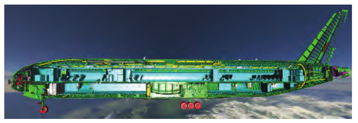

图19.1　一个经过“精简”、仅含3.5亿个三角形的波音模型，使用光线追踪渲染。通过用户定义的裁剪平面进行剖切。（图片由萨尔大学计算机图形学组提供。原始三维数据由波音公司提供，并经其许可使用。）

本章介绍各种用于加速计算机图形渲染的算法，尤其着重于大量几何体的渲染。许多这类算法的核心建立在空间数据结构之上，下一节将介绍这些结构。在此基础上，我们接着讨论剔除技术。这些算法试图迅速确定哪些物体可见、需要进一步处理。细节层次技术则降低渲染其余物体的复杂度。本章最后讨论用于渲染超大模型的系统，包括虚拟纹理、流式传输、转码和地形渲染。


## 19.1 空间数据结构

来源：《Real-Time Rendering》第4版，书页818—830（PDF物理页839—851）。范围从19.1节标题开始，到19.2节标题之前，包含19.1.1—19.1.5全部正文、图19.2—19.8及公式（19.1）；章首导言与图19.1另存。

空间数据结构是在某个n维空间中组织几何体的结构。本书只使用二维和三维结构，但这些概念往往很容易推广到更高维度。这些数据结构可用于加速关于几何实体是否重叠的查询。这类查询应用于各种操作，例如剔除算法、相交测试与光线追踪，以及碰撞检测。

空间数据结构通常按层次组织。大致说来，这意味着最高层包含一些子节点，每个子节点都定义自己的空间体积，并进一步包含自己的子节点。因此，这种结构是嵌套的，具有递归性质。层次结构中的某些元素引用几何体。使用层次结构的主要原因是，各类查询都能显著加快，典型情况下可从O(n)改善为O(log n)。也就是说，在执行诸如寻找给定方向上最近物体这样的操作时，我们只访问一小部分物体，而不必搜索全部n个物体。空间数据结构的构建时间可能很长，既取决于其中的几何体数量，也取决于所要求的数据结构质量。不过，这一领域的重要进展已大幅缩短构建时间，在某些情况下甚至可以实时完成。通过惰性求值和增量更新，还能进一步缩短构建时间。

常见的空间数据结构类型包括包围体层次结构、二叉空间划分（BSP）树的各种变体、四叉树和八叉树。BSP树和八叉树是基于空间细分的数据结构。这意味着，场景的整个空间被细分，并编码到数据结构中。例如，所有叶节点所表示空间的并集等于场景的整个空间。通常，叶节点的体积互不重叠，但松散八叉树等较少见的结构除外。BSP树的大多数变体是不规则的，即空间可以用更任意的方式细分。八叉树则是规则的，也就是说，空间以均匀方式划分。这种均匀性虽然限制更多，却往往也是效率的来源。另一方面，包围体层次结构并不是空间细分结构。它包围的是几何物体周围的空间区域，因此BVH在每一层都不必覆盖整个空间。

下面各节将介绍BVH、BSP树和八叉树，同时也介绍场景图。场景图这种数据结构更关注模型之间的关系，而不是高效渲染。

### 19.1.1 包围体层次结构

包围体（bounding volume，BV）是包住一组物体的体积。其基本思想是：BV应具有比被包围物体简单得多的几何形状，从而使针对BV的测试比针对物体本身的测试快得多。BV的例子包括球体、轴对齐包围盒（AABB）、定向包围盒（OBB）和k-DOP。定义见22.2节。BV在视觉上不对渲染图像作出贡献。它代替被包围物体充当代理，以加速渲染、选择、查询以及其他计算。

在三维场景的实时渲染中，包围体层次结构经常用于层次式视锥体剔除（19.4节）。场景被组织成由一组相互连接的节点构成的层次树结构。最上面的节点称为根节点，没有父节点。内部节点具有指向其子节点的指针，子节点也是节点。因此，除非根节点是树中唯一的节点，否则它也是内部节点。叶节点保存实际需要渲染的几何体，没有任何子节点。树中的每个节点，包括叶节点，都有一个包围体，包住其整个子树中的几何体。也可以决定不在叶节点中保存BV，而将BV放到每个叶节点正上方的内部节点中。这种组织方式就是“包围体层次结构”这个名称的由来。每个节点的BV都包住其子树中所有叶节点的几何体。这意味着，根节点的BV包含整个场景。图19.2给出了BVH的例子。注意，图中某些较大的包围圆还可以收得更紧，因为每个节点只需包含其子树中的几何体，不必包含后代节点的BV。对于包围圆或包围球，形成这样更紧的节点可能成本较高，因为每个节点都必须检查其子树中的全部几何体。实际中，通常沿树“自底向上”构造节点的BV：创建一个能包含所有子节点BV的BV。


图19.2　左图展示一个包含五个物体的简单场景，以及右侧包围体层次结构所使用的包围圆。一个圆包住所有物体，随后以递归方式在大圆内包含更小的圆。右图展示用于表示左侧物体层次关系的包围体层次结构（树）。

BVH的底层结构是一棵树，而计算机科学领域关于树形数据结构的文献极为丰富。这里只提及几个重要结果。更多信息可参阅Cormen等人的《算法导论》[292]等书籍。

考虑一棵k叉树，即每个内部节点都有k个子节点的树。只有一个节点（根节点）的树被称为高度为0的树。根节点的叶子子节点位于高度1，依此类推。平衡树是指所有叶节点都位于高度h或h−1的树。一般而言，平衡树的高度h为⌊ n⌋，其中n是树中节点的总数，包括内部节点和叶节点。注意，k越大，树的高度越低，这意味着遍历树所需的步数越少，但每个节点所需的工作也更多。二叉树通常是最简单的选择，并能提供合理的性能。不过，有证据表明，对某些应用而言，更大的k值，例如k＝4或k＝8，会带来更好的性能[980, 1829]。使用k＝2、k＝4或k＝8时，树的构造很简单：k＝2时只沿最长轴细分，k＝4时沿最长的两个轴细分，k＝8时沿所有轴细分。对于其他k值，构造良好的树要困难一些。从性能角度看，每个节点拥有较多子节点，例如k＝8，的树往往更受青睐，因为它们降低了平均树深度，也减少了需要跟随的间接引用次数，即从父节点到子节点的指针跳转次数。

> 译注：原文将此处平衡k叉树的一般高度写为⌊ n⌋，并将n定义为全部节点数。按紧邻文字所给的平衡树定义，该等式并非对任意k及任意平衡形态都成立；这里忠实保留原式。

BVH非常适合执行各种查询。例如，假设要让一条射线与场景求交，并返回找到的第一个交点，阴影射线就是这种情况。使用BVH时，测试从根节点开始。如果射线没有击中其BV，那么它也不会击中BVH中包含的任何几何体。否则，递归继续测试，即测试根节点各子节点的BV。一旦射线没有击中某个BV，就可以终止对该BVH子树的测试。如果射线击中叶节点的BV，则进一步用射线测试该节点的几何体。性能收益部分来自射线与BV之间的测试很快。这也是使用球体和盒体等简单物体作为BV的原因。另一个原因是BV的嵌套使我们能够提前终止树的遍历，从而避免测试大片空间区域。

我们通常需要的是最近交点，而不是最先找到的交点。为此唯一需要增加的数据，是遍历过程中已找到的最近物体的距离和标识。当前最近距离还用于在遍历过程中对树进行剔除。如果射线与某个BV相交，但交点距离大于目前找到的最近距离，就可以丢弃该BV。检查父包围盒时，我们对所有子节点的BV求交，并找出最近的一个。如果在这个BV的后代中找到交点，就利用新的最近距离判断其他子节点是否还需要遍历。后面将会看到，BSP树相对于普通BVH的一个优势是，它能保证从前向后的顺序，而BVH只能提供这种粗略排序。

BVH也可用于动态场景[1465]。当BV内的一个物体移动时，只需检查它是否仍被父节点的BV包含。如果仍被包含，BVH依旧有效；否则，就移除该物体节点并重新计算父节点的BV，然后从根节点开始，以递归方式将该节点重新插入树中。另一种方法是扩大父节点的BV，使其能包含子节点，并按需向上递归扩展。无论采用哪一种方法，随着编辑次数增多，树都可能变得不平衡且低效。另一种做法是，用BV包围物体在一段时间内的运动范围。这称为时间包围体[13]。例如，可以为摆锤设置一个包围盒，包住它运动时扫过的整个体积。还可以进行自底向上的重新拟合[136]，或选择树的某些部分进行重新拟合或重建[928, 981, 1950]。

要创建BVH，首先必须能够为一组物体计算紧致的BV。22.3节将讨论这个问题。随后，必须创建真正的BV层次结构。有关BV构建策略的更多内容，请参阅realtimerendering.com上的碰撞检测章节。

### 19.1.2 BSP树

二叉空间划分树，简称BSP树，在计算机图形学中存在两种明显不同的变体，我们称之为轴对齐型和多边形对齐型。构造这类树时，先用一个平面把空间一分为二，再把几何体分配到这两个空间中，并递归进行这种划分。一个很有价值的性质是：以特定方式遍历BSP树，可以从任意视点对树中的几何内容进行从前向后的排序。对于轴对齐BSP树，这种排序是近似的；对于多边形对齐BSP树，则是精确的。注意，轴对齐BSP树也称为k-d树。

#### 轴对齐BSP树（k-d树）

轴对齐BSP树的构造如下。首先，用轴对齐包围盒（AABB）包住整个场景。接下来的思路是，递归地把这个盒子细分成更小的盒子。现在，考虑任意递归层级中的一个盒子。选取盒子的一条轴，并生成一个与其垂直的平面，将空间划分为两个盒子。有些方案固定划分平面的位置，使其恰好把盒子一分为二；另一些则允许平面的位置变化。允许平面位置变化的方法称为非均匀细分，可使得到的树更加平衡。固定平面位置的方法称为均匀细分，此时节点的内存位置可由它在树中的位置隐式确定。

对于与平面相交的物体，可以采用多种处理方式。例如，可以把它存储在树的当前层级，也可以让它同时成为两个子盒子的成员，或真正用平面把它分成两个独立物体。存储在树的当前层级的优点是，树中只保留该物体的一个副本，使物体删除操作很直接。不过，被划分平面穿过的小物体会滞留在树的高层，通常导致效率降低。将相交物体放入两个子节点，可以让较大物体得到更紧的界限，因为所有物体都会逐层下沉到一个或多个叶节点中，但只进入与它们重叠的叶节点。每个子盒子包含若干物体，随后重复这个平面划分过程，递归细分各个AABB，直至满足某个终止条件。图19.3给出了轴对齐BSP树的例子。

粗略的从前向后排序是轴对齐BSP树的一种用途。它可用于遮挡剔除算法（19.7节和23.7节），也可以通过尽量减少像素的重复绘制，普遍降低像素着色器成本。假设当前遍历到一个名为N的节点；在遍历开始时，N是根节点。检查N的划分平面，然后在观察者所在的平面一侧递归继续遍历。这样，只有遍历完树的这一整半边之后，才会开始遍历另一边。由于叶节点中的内容没有排序，而且物体可能出现在树的多个节点中，因此这种遍历不能给出精确的从前向后排序。不过，它能够提供一种通常很有用的粗略排序。如果从节点平面相对于观察者的另一侧开始遍历，就能得到粗略的从后向前排序。这对透明物体排序很有用。BSP遍历也可用于测试射线与场景几何体的相交情况，只需用射线原点替代观察者位置。


图19.3　轴对齐BSP树。在此例中，空间划分可以位于轴上的任意位置，而不限于中点。形成的空间区域标记为A至E。右侧的树展示底层BSP数据结构。每个叶节点代表一个区域，该区域的内容显示在其下方。注意，三角形同时出现在C和E两个区域的物体列表中，因为它与这两个区域都重叠。

#### 多边形对齐BSP树

另一种BSP树是多边形对齐形式[4, 500, 501]。这种数据结构特别适合按精确排序的顺序渲染静态几何体或刚性几何体。在还没有硬件z缓冲的年代，这种算法曾广泛用于《DOOM》（2016）一类游戏。如今它仍偶有应用，例如用于碰撞检测和相交测试。

> 译注：原页确实印为“DOOM (2016)”，却又将其置于“没有硬件z缓冲”的年代；这两处表述存在明显的年代语境疑点。这里保留原书年份，不擅自替换。

在这种方案中，选择一个多边形作为分割者，将空间划分为两个半空间。也就是说，在根节点处选取一个多边形，用该多边形所在的平面将场景中其余多边形分成两组。任何与划分平面相交的多边形，都沿交线切成两个独立部分。然后，在划分平面的每个半空间中，再选择一个多边形作为分割者，只划分该半空间中的多边形。递归进行，直至所有多边形都进入BSP树。创建高效的多边形对齐BSP树是一个耗时过程，因此通常只计算一次并存储下来供重复使用。图19.4展示这种BSP树。一般最好构造平衡树，即所有叶节点深度相同，或最多相差1。


图19.4　多边形对齐BSP树。图中从上方观察多边形A至G。先用多边形A划分空间，再分别用B和C划分两个半空间。由多边形B形成的划分平面与左下角的多边形相交，将其切成独立的多边形D和E。右侧展示形成的BSP树。

多边形对齐BSP树具有一些有用的性质。其中之一是，对于给定视图，可以严格按从后向前或从前向后的顺序遍历该结构。相比之下，轴对齐BSP树通常只能提供粗略排序。先确定相机位于根平面的哪一侧。该平面远侧的多边形集合位于近侧集合的后面。然后，在远侧集合中，取下一层的划分平面，再确定相机位于哪一侧。远侧子集又是距离相机最远的子集。递归继续这个过程，就能确立严格的从后向前顺序，并使用画家算法渲染场景。画家算法不需要z缓冲。如果所有物体都按从后向前的顺序绘制，每个更近的物体都会绘制在其后方所有内容的前面，因此不需要比较z深度。

例如，考虑图19.4中的观察者v所看到的情况。无论观察方向和视锥体如何，v都位于A形成的划分平面左侧，因此C、F和G都在B、D和E后面。把v与C的划分平面比较，可知G位于该平面的另一侧，因此先显示G。对B的平面进行测试，可确定E应在D之前显示。于是，从后向前的顺序为G、C、F、A、E、B、D。注意，这个顺序并不保证某个物体一定比另一个物体更靠近观察者；它提供的是严格的遮挡顺序，两者存在细微区别。例如，多边形F比多边形E更靠近v，但在遮挡顺序中却位于更后面。

### 19.1.3 八叉树

八叉树与轴对齐BSP树相似。它同时沿全部三个轴划分盒子，而且划分点必须是盒子的中心。这会创建八个新盒子，因此称为八叉树。这使得结构具有规则性，可以让某些查询更高效。


图19.5　四叉树的构建。从左侧开始，先用一个包围盒包住全部物体。然后递归地把盒子划分为四个大小相同的盒子，直至每个盒子在本例中为空，或只包含一个物体。

构建八叉树时，先用一个最小轴对齐包围盒包住整个场景。其余过程具有递归性质，并在满足某个停止条件时结束。与轴对齐BSP树一样，这些条件可以包括达到最大递归深度，或使盒子中的图元数达到某个数量[1535, 1536]。如果满足条件，算法便把图元关联到该盒子，并终止递归。否则，用三个平面沿主轴细分盒子，形成八个同样大小的盒子。对每个新盒子进行测试，必要时再次细分为2×2×2个更小的盒子。图19.5用二维情况说明这一过程，此时的数据结构称为四叉树。四叉树是八叉树的二维对应形式，忽略了第三条轴。当沿全部三个轴对数据分类并没有多少好处时，四叉树就很有用。

八叉树可以像轴对齐BSP树一样使用，因此能够处理相同类型的查询。事实上，BSP树可以给出与八叉树相同的空间划分。例如，先沿x轴中点划分一个单元，再沿y轴中点划分两个子单元，最后沿z轴中点划分这些子单元，就会形成八个大小相同的单元，与执行一次八叉树划分所得的结果相同。八叉树的一个效率来源是：它无需存储更灵活的BSP树结构所需要的信息。例如，划分平面的位置是已知的，因此不必显式描述。这种更紧凑的存储方式还通过减少遍历时访问的内存位置数量来节省时间。不过，轴对齐BSP树仍可能更高效，因为更好的平面位置带来的节省，可能超过读取划分平面位置所需的额外内存成本和遍历时间。没有一种方案在所有情况下效率最高；影响因素包括底层几何体的性质、访问结构的使用模式，以及运行代码的硬件架构等。通常，内存布局的局部性和缓存友好程度是最重要的因素，下一节将重点讨论这一点。


图19.6　普通八叉树与松散八叉树的比较。圆点表示第一次细分后各盒子的中心。左图中，星形穿过普通八叉树的一个划分平面，因此一种选择是把星形放入最大的盒子，即根节点的盒子。右图展示k＝1.5的松散八叉树，即盒子增大50%。为便于辨认，各盒子略有错开。现在，星形可以完整放入左上方的红色盒子。

在上面的描述中，物体总是存储在叶节点中。因此，某些物体必须存储在不止一个叶节点里。另一种选择是，把物体放入能够包含整个物体的最小盒子中。例如，图中的星形物体应放入从左数第二幅图右上方的盒子中。这种做法有一个明显缺点：例如，一个位于八叉树中心的小物体会被放入最上层、也就是最大的节点。这很低效，因为一个微小物体此时被包围整个场景的盒子包住。一种解决方法是切分物体，但这会引入更多图元。另一种方法是在物体所处的每个叶盒子中都放入指向它的指针，但会降低效率，也让八叉树的编辑更加困难。

> 译注：此段“从左数第二幅图右上方”的描述对应图19.5的细分序列；紧邻上方的图19.6用蓝色星形说明跨划分面的另一种情形。原文未在此句明确写出图号。

Ulrich提出了第三种解决方案：松散八叉树[1796]。其基本思想与普通八叉树相同，但放宽了各盒子尺寸的选择。若普通盒子的边长为l，就改用kl，其中k＞1。图19.6以k＝1.5为例，并与普通八叉树进行比较。注意，各盒子的中心点相同。使用更大的盒子，会减少跨越划分平面的物体数量，从而使物体能够放到八叉树更深的位置。一个物体始终只插入一个八叉树节点，因此从树中删除它很简单。使用k＝2还有一些好处。首先，物体的插入和删除都是O(1)。知道物体的尺寸，就能立即知道它可以成功插入八叉树的哪一层，并完全装入该层的一个松散盒子。实际中，有时还能将物体放入更深层的盒子。另外，如果k＜2，而物体装不下，就可能需要把它上移到树的更高层。

物体的质心决定了应将它放入哪个松散八叉树盒子。由于这些性质，该结构非常适合包围动态物体，代价是牺牲一些BV效率，并在遍历结构时失去严格排序能力。另外，物体通常每帧只移动一点，因此上一帧的盒子在下一帧仍有效。于是，松散八叉树中每帧只需更新一部分动画物体。Cozzi[302]指出，将各物体或图元分配到松散八叉树之后，可以围绕每个节点中的物体计算一个最小AABB，此时该结构本质上就变成了BVH。这种方法避免了跨节点切分物体。

### 19.1.4 缓存无关与缓存感知表示

由于内存系统带宽与CPU计算能力之间的差距逐年增大，在设计算法和空间数据结构表示时考虑缓存至关重要。本节将介绍缓存感知（cache-aware，也称cache-conscious）与缓存无关（cache-oblivious）空间数据结构。缓存感知表示假定缓存块的大小已知，因此可以针对特定架构进行优化。相比之下，缓存无关算法旨在适应各种缓存大小，因此具有平台独立性。

要创建缓存感知数据结构，首先必须确定目标架构的缓存块大小，例如64字节。然后尽量缩小数据结构。例如，Ericson[435]展示了如何仅用32位表示一个k-d树节点。其做法之一是借用节点32位数值中最低的两位。这两位可表示四种类型：叶节点，或分别沿三个轴之一划分的内部节点。对于叶节点，高30位保存指向物体列表的指针；对于内部节点，则表示精度略低的浮点划分值。这样，就能在一个64字节缓存块中存放一棵具有15个节点、深四层的二叉树。第16个节点用来指示哪些子节点存在，以及它们的位置。细节请参阅他的著作。关键思想是：确保结构能够整齐地装入缓存边界以内，可以显著改善数据访问。

一种常见而简单的树节点缓存无关排序是van Emde Boas布局[68, 422, 435]。假设有一棵高度为h的树，目标是计算树中节点的缓存无关布局或排列顺序。关键思想在于：递归地将层次结构拆成越来越小的块，那么在某一层级，一组块就能装入缓存。这些块在树中彼此接近，因此与简单地从最高层向下逐层列出全部节点相比，缓存中的数据能在更长时间内保持有效。那种朴素的排列方式会造成内存位置之间的大幅跳转。

把树的van Emde Boas布局记为v()。该结构以递归方式定义，一棵只有一个节点的树的布局就是节点本身。如果中有多个节点，就在高度的一半，即⌊h/2⌋处划分树。最上面的⌊h/2⌋层放入记为的树中，从叶节点处开始的子树记为、…、。树的递归性质描述如下：


注意，所有子树（0≤i≤n）也由上述递归定义。例如，这意味着也必须在其高度的一半处分割，依此类推。图19.7给出了一个例子。


图19.7　树的van Emde Boas布局通过将树的高度h一分为二来构造。这会生成子树、、…、；再以相同方式递归划分每棵子树，直至每棵子树只剩一个节点。

一般来说，创建缓存无关布局包括两个步骤：聚类，以及对簇排序。对于van Emde Boas布局，聚类由子树给出，排序则隐含在创建顺序中。Yoon等人[1948, 1949]开发了专门面向高效包围体层次结构和BSP树的技术。他们建立了一个概率模型，同时考虑父节点与子节点之间的局部性以及空间局部性。其思想是确保访问子节点的成本很低，从而在父节点已被访问的情况下尽量减少缓存未命中。此外，彼此接近的节点在排序中也被放得更近。他们开发了一种贪心算法，将概率最高的节点聚为一簇。不改变底层算法，仅改变BVH中节点的排列顺序，就取得了大幅性能提升。

### 19.1.5 场景图

BVH、BSP树和八叉树都以某种树作为基本数据结构，区别在于如何划分空间以及存储几何体。它们也都以层次方式存储几何物体，而不存储其他东西。然而，渲染三维场景所涉及的远不止几何体。动画、可见性以及其他元素的控制，通常通过场景图完成；它在glTF中称为节点层次结构。这是一种面向用户的树结构，加入了纹理、变换、细节层次、渲染状态（例如材质属性）、光源以及其他适用内容。它用树来表示，并按某种顺序遍历这棵树，以渲染场景。例如，可以把一个光源放在内部节点中，使其只影响该节点子树中的内容。另一个例子是在遍历树时遇到材质：该材质可以应用于该节点子树中的全部几何体，也可能被子节点的设置覆盖。有关如何在场景图中支持不同细节层次，另见书页861的图19.34。从某种意义上说，每个图形应用都会使用某种形式的场景图，即使它只是一个根节点加上一张待显示子节点列表。


图19.8　一个场景图，将不同变换M和N应用于内部节点及其各自的子树。注意，这两个内部节点还指向同一个物体，但由于变换不同，会出现两个不同的物体，其中一个经过旋转和缩放。

实现物体动画的一种方法是改变树中内部节点的变换。场景图实现随后会变换该节点子树中的全部内容。由于变换可以放在任意内部节点中，因此能够实现层次动画。例如，汽车的车轮可以旋转，而整辆汽车可以向前移动。

当多个节点可以指向同一个子节点时，这种树结构称为有向无环图（DAG）[292]。“无环”表示它不能包含任何环路或循环。“有向”表示两个节点通过边连接时，这种连接具有确定的顺序，例如从父节点指向子节点。场景图通常是DAG，因为它们允许实例化，即在不复制几何数据的情况下，为物体创建多个副本（实例）。图19.8展示一个例子，其中两个内部节点对各自子树施加不同的变换。使用实例可以节省内存，而GPU可以通过API调用迅速渲染一个实例的多个副本（18.4.2节）。

当物体需要在场景中移动时，必须更新场景图。这可以通过对树结构进行递归调用完成。在从根节点向叶节点行进的过程中更新变换；在此遍历中，相乘各矩阵，并将结果存储到相关节点。然而，变换更新后，任何附带的BV就都失效了。因此，在从叶节点返回根节点的过程中更新BV。过于宽松的树结构会使这些任务极为复杂，所以常常避免使用DAG，或采用只有叶节点共享的受限DAG。更多信息见Eberly的著作[404]。还要注意，使用WebGL等基于JavaScript的API时，尽可能将更多工作转移到GPU，并尽可能减少返回CPU的反馈，极其重要[876]。

场景图本身也可带来一定的计算效率。场景图中的节点通常有一个包围体，因此与BVH非常相似。场景图的叶节点存储几何体。重要的是要认识到，完全无关的效率优化方案也能与场景图并用。这就是空间化的思想：用一个为不同任务创建的独立数据结构，例如BSP树或BVH，来补充用户的场景图，以实现更快的剔除或拾取等。大多数模型位于叶节点，而这些叶节点是共享的，因此额外增加一个用于空间效率优化的结构，成本相对较低。


## 19.2 剔除技术

本节来源：原书第 830—831 页（PDF 第 851—852 页），从 19.2 节标题起至 19.3 节标题前，包含图 19.9。

“剔除”（cull）的意思是“从群体中移除”，在计算机图形学中，剔除技术所做的事情正是如此。这里的群体是我们希望渲染的整个场景，而移除的对象仅限于场景中被认为不会对最终图像作出贡献的部分。场景的其余部分则送入渲染流水线。因此，在渲染的语境中，也经常使用“可见性剔除”（visibility culling）这一术语。不过，剔除也可以应用于程序的其他部分，例如碰撞检测（对屏幕之外或被隐藏的物体采用精度较低的计算）、物理计算以及人工智能。这里仅介绍与渲染有关的剔除技术。此类技术的例子包括背面剔除、视锥体剔除和遮挡剔除，如图 19.9 所示。背面剔除会排除背向观察者的三角形。视锥体剔除会排除位于视锥体之外的三角形组。遮挡剔除会排除被其他物体组遮住的物体。遮挡剔除是最复杂的剔除技术，因为它需要计算物体之间如何相互影响。

理论上，实际的剔除可以发生在渲染流水线的任何阶段；对于某些遮挡剔除算法，甚至可以预先计算。对于在 GPU 上实现的剔除算法，我们有时只能启用或禁用剔除功能，或者设置其中的某些参数。渲染速度最快的三角形，就是根本没有送到 GPU 的三角形。其次，在流水线中越早进行剔除越好。剔除通常通过几何计算实现，但绝不限于这种方式。例如，算法也可以利用帧缓冲区中的内容。


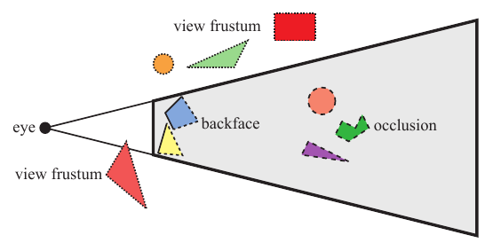

图 19.9　不同的剔除技术。被剔除的几何体以虚线表示。（插图参照 Cohen-Or 等人 [277] 绘制。）图内标签：eye 为视点，view frustum 为视锥体，backface 为背面，occlusion 为遮挡。

理想的剔除算法只会将图元的精确可见集（exact visible set，EVS）送入流水线。本书将 EVS 定义为所有部分可见或完全可见的图元。其中一种能够实现理想剔除的数据结构是视相图（aspect graph）：给定任意视点，都可以从中提取 EVS [532]。建立这类数据结构在理论上是可行的，但在实践中却不可行，因为其最坏时间复杂度可能高达 O(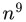) [277]。实际算法转而尝试寻找一个称为潜在可见集（potentially visible set，PVS）的集合，用它来预测 EVS。如果 PVS 完全包含 EVS，也就是说，只丢弃不可见的几何体，那么这个 PVS 就称为保守的。PVS 也可以是近似的，此时它并不完全包含 EVS。因此，这种 PVS 可能生成错误的图像，目标是让这些错误尽可能小。由于保守的 PVS 总能生成正确图像，因此通常认为它更有用。对 EVS 进行高估或近似的出发点，是希望能快得多地计算出 PVS。难点在于，应当如何进行这些估计，才能提升整体性能。例如，算法可以按不同的粒度处理几何体，即三角形、整个物体或物体组。找到 PVS 后，就使用 z 缓冲区进行渲染，由它确定最终逐像素的可见性。

请注意，有些算法会对网格中的三角形重新排序，以便在提供更好的遮挡剔除效果（即减少过度绘制）的同时，改善顶点缓存局部性。虽然这些算法与剔除有一定关系，但这里请感兴趣的读者参阅文献 [256, 659]。

第 19.3—19.8 节将分别讨论背面剔除、视锥体剔除、入口剔除、细节剔除、遮挡剔除以及剔除系统。


## 19.3 背面剔除

来源：原书第 831—835 页（PDF 第 852—856 页）；范围从 19.3 节标题起，到 19.4 节标题之前，包含图 19.10—19.13。

想象你正在观察场景中的一个不透明球体。大约一半球体是不可见的。从这一观察可以得出结论：不可见的部分不必渲染，因为它对图像没有贡献。因此，无须处理球体的背面，这就是背面剔除的思想。这种剔除也可以一次针对一整组进行，因而称为成簇背面剔除（clustered backface culling）。

假设摄像机位于物体之外，而且没有穿入物体（即近裁剪面没有切入物体），那么，属于实体不透明物体的所有背向三角形都可以剔除，不再进行后续处理。对于朝向一致的三角形（第 16.3 节），如果已知其投影后的三角形在屏幕空间中呈现例如顺时针的顶点绕序，就可以判定它背向观察者。这项测试可以通过计算三角形在二维屏幕空间中的有符号面积来实现。有符号面积为负，意味着应当剔除该三角形。这项测试可以紧接在屏幕映射过程之后执行。


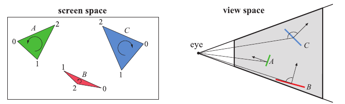

图 19.10. 判断三角形是否背向观察者的两种不同测试。左图展示如何在屏幕空间中测试。左侧两个三角形朝向观察者，右侧三角形背向观察者，可以省去后续处理。右图展示如何在观察空间中进行背面测试。三角形 A 和 B 朝向观察者，C 背向观察者。

判断三角形是否背向观察者的另一种方法，是从三角形所在平面上的任意一点（最简单的选择是其中一个顶点），构造一个指向观察者位置的向量。对于正交投影，用观察方向的反方向代替指向视点的向量；对整个场景而言，这一向量是常量。计算该向量与三角形法线的点积。点积为负，意味着两个向量的夹角大于 π/2 弧度，因此三角形没有朝向观察者。这项测试等价于计算从观察者位置到三角形所在平面的有符号距离。若符号为正，三角形便朝向观察者。注意，只有法线经过归一化，得到的值才是距离；不过这里并不重要，因为我们只关心符号。另一种做法是在应用投影矩阵之后，在裁剪空间中构造顶点 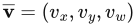，并计算行列式 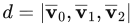 [1317]。如果 d ≤ 0，就可以剔除该三角形。这些剔除技术如图 19.10 所示。

Blinn 指出，这两种测试在几何上是相同的 [165]。理论上，二者的唯一区别只是执行测试的空间。实践中，屏幕空间测试通常更稳妥，因为那些几乎以侧边朝向观察者、在观察空间中看起来略微背向观察者的三角形，在屏幕空间中可能变成略微朝向观察者。这是由于观察空间坐标在转换为屏幕空间的亚像素坐标时发生了舍入。

使用 OpenGL 或 DirectX 这样的 API 时，通常通过几个函数控制背面剔除：启用背面剔除、启用正面剔除，或者禁用所有剔除。要注意，镜像变换（即负缩放操作）会把背向三角形变成正向三角形，反之亦然 [165]（第 4.1.3 节）。最后，还可以在像素着色器中判断三角形是否正向。在 OpenGL 中，这通过测试 `gl_FrontFacing` 完成；在 DirectX 中，它称为 `SV_IsFrontFace`。在加入这一功能之前，正确显示双面物体的主要方法是渲染两遍：先剔除背面，然后剔除正面并反转法线。


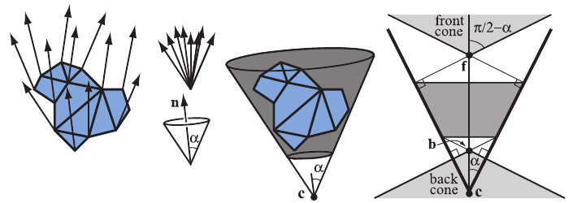

图 19.11. 左：一组三角形及其法线。中左：将法线集中到一起（上），并构造一个由法线 **n** 和半角 α 定义的最小圆锥（下）。中右：将圆锥锚定在点 **c**，并将其截断，使它同时包含三角形上的所有点。右：截断圆锥的剖面。上方浅灰色区域是正向锥，下方浅灰色区域是背向锥。点 **f** 和 **b** 分别是正向锥和背向锥的顶点。

对于标准背面剔除，一种常见误解是它会把待渲染的三角形数量减少大约一半。虽然对于许多物体，背面剔除确实能移除大约一半三角形，但对某些类型的模型，它几乎没有收益。例如，室内场景的墙壁、地板和天花板通常都朝向观察者，因此这类场景中可剔除的背面相对较少。同样，渲染地形时，大多数三角形往往可见，只有山丘或沟壑背面的三角形能从这项技术中受益。

背面剔除是一项简单技术，可以避免对单个三角形进行光栅化；但如果能用一次测试判断整组三角形是否可以剔除，速度就会更快。这类技术称为成簇背面剔除算法，这里将介绍其中一些。许多这类算法采用的基本概念是法线锥（normal cone）[1630]。对于曲面的某一部分，构造一个包含所有法线方向和所有点的截断圆锥。注意，需要沿法线方向的两个距离来截断圆锥。示例见图 19.11。可以看出，圆锥由法线 **n**、半角 α、锚点 **c**，以及沿法线方向用于截断圆锥的若干偏移距离定义。图 19.11 右侧展示了法线锥的剖面。Shirman 和 Abi-Ezzi [1630] 证明，如果观察者位于正向锥中，那么锥内的所有面都朝向观察者；对于背向锥，也有类似结论。Engel [433] 将一种称为排除体（exclusion volume）的类似概念用于 GPU 剔除。

对于静态网格，Haar 和 Aaltonen [625] 建议在 n 个三角形周围计算一个最小立方体，并把立方体每个面划分成 r × r 个“像素”，每个像素编码一个 n 位掩码，用来指示各个对应三角形是否在该“像素”范围内可见。如图 19.12 所示。如果摄像机位于立方体外部，找出摄像机所在的相应视锥，就可以立即查找其位掩码，保守地判断哪些三角形背向观察者。如果摄像机位于立方体内部，则认为所有三角形都可见（除非希望进行进一步计算）。Haar 和 Aaltonen 对立方体每个面只使用一个位掩码，每次编码 n = 64 个三角形。统计位掩码中已置位的位数，就能高效地为未被剔除的三角形分配内存。这项工作已经用于《刺客信条：大革命》（Assassin’s Creed Unity）。


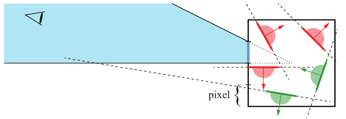

图 19.12. 在二维中，用正方形包围一组从侧边观察的五个静态三角形。正方形左侧的边分成了 4 个“像素”，这里关注从上往下数第二个像素；它在方框外对应的视锥被涂成蓝色。三角形所在平面形成的正半空间用半圆表示（红色和绿色）。对于某个三角形，如果蓝色视锥的任何部分都不在它的正半空间中，那么从视锥中的所有点观察，它都可以被保守地判定为背向（标为红色）。绿色表示正向的三角形。

接下来，与图 19.11 不同，我们使用一个未截断的法线锥，因此只需中心点 **c**、法线 **n** 和角度 α 来定义它。要为若干三角形计算这样的法线锥，先取所有三角形平面的法线，把它们放到同一个位置，然后在单位球面上计算包含所有这些法线的最小圆 [101]。首先，假设要从点 **e** 对锥内所有共用原点 **c** 的法线进行背面测试。当下式成立时，法线锥从 **e** 看是背向的 [1883, 1884]：


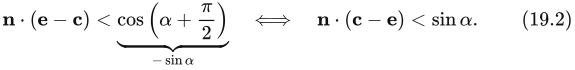


不过，这项测试只有在所有几何体都位于 **c** 时才有效。接下来，我们假设所有几何体都位于一个中心点为 **c**、半径为 r 的球体内。测试于是变为


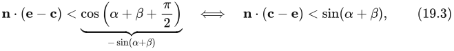


其中 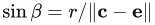。推导这项测试所涉及的几何关系如图 19.13 所示。量化后的法线可以存储在 8 × 4 位中，这对于某些应用可能已经足够。


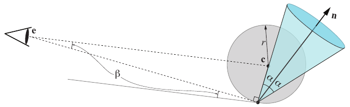

图 19.13. 图中展示一种临界情形：从以 **c** 为中心、半径为 r 的圆内最关键的点出发，由 **c**、**n** 和 α 定义的法线锥即将对 **e** 变得可见。当从 **e** 指向圆上一点的向量与圆相切，且这一向量与法线锥侧边之间的夹角为 π/2 弧度时，就会出现这种情况。注意，法线锥已从 **c** 向下平移，使其原点与球体边界重合。

作为本节的结尾，我们要指出：对于带运动模糊的三角形，如果每个顶点在一帧内做线性运动，背面剔除并不像想象中那么简单。一个顶点随时间线性运动的三角形，可以在一帧开始时背向观察者，随后转为正向，再转回背向，所有这些变化都发生在同一帧内。因此，如果仅因为一个带运动模糊的三角形在一帧的开始和结束时都背向观察者，就将其剔除，会产生错误结果。Munkberg 和 Akenine-Möller [1246] 提出一种方法，把标准背面测试中的顶点替换为线性运动的三角形顶点。将测试改写成 Bernstein 形式，并利用 Bézier 曲线的凸包性质进行保守测试。对于景深，如果整个镜头都位于三角形的负半空间（换言之，位于它的背后），就可以安全地剔除该三角形。

> 译注：式（19.2）和（19.3）忠实保留原书印刷形式。两式在“⇔”右侧仍使用“<”，但由左侧取负进行代数变形时，不等号应反向为“>”。此外，原式直接将位置差的点积与三角函数值比较，未显式写出视线方向的归一化；若 **e**、**c** 为一般位置坐标，实现时还需核实这一前提。这里仅标明原书疑点，未暗改原式。


## 19.4 视锥体剔除

来源：原书第 835—837 页（PDF 第 856—858 页），从 19.4 节标题起，到 19.5 节标题前止。

如第 2.3.3 节所述，只有完全或部分位于视锥体内的图元才需要渲染。加快渲染过程的一种方法，是将每个物体的包围体与视锥体进行比较。如果包围体（BV）位于视锥体之外，那么它所包围的几何体就可以不参与渲染。如果包围体位于视锥体之内，或与视锥体相交，那么其中的内容就可能可见，必须送入渲染流水线。各种包围体与视锥体之间的相交测试方法，参见第 22.14 节。

利用空间数据结构，可以按层次执行这种剔除 [272]。对于包围体层次结构（BVH），从根节点开始进行先序遍历 [292] 即可。对每个带有包围体的节点，都将其包围体与视锥体进行测试。如果节点的包围体位于视锥体之外，就不再进一步处理该节点。由于这个包围体的内容及其子节点都位于视野之外，因此可以对树进行剪枝。如果包围体完全位于视锥体之内，那么其中的内容也必然全部位于视锥体之内。遍历仍继续进行，但对这棵子树的其余部分，不再需要做任何视锥体测试。如果包围体与视锥体相交，则继续遍历，并测试其子节点。当发现叶节点相交时，就把它的内容（即几何体）送入流水线。叶节点中的图元并不保证位于视锥体之内。图 19.14 展示了一个视锥体剔除的例子。还可以对一个物体或单元进行多种包围体测试。例如，如果发现包围某个单元的球形包围体与视锥体重叠，而又已知该单元的有向包围盒（OBB）比这个球小得多，那么进一步执行更精确（但开销也更大）的 OBB 与视锥体测试，可能是值得的 [1600]。


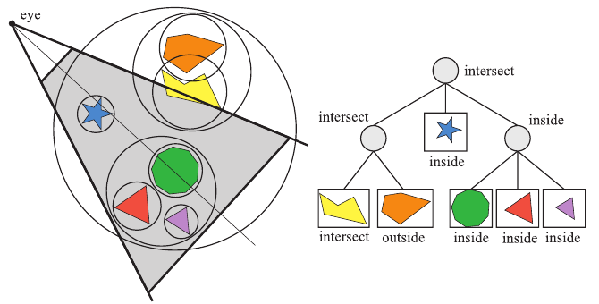

**图 19.14。** 左图显示了一组几何体及其包围体（球）。从眼睛所在的位置观察，使用视锥体剔除来渲染这个场景。右图显示了相应的 BVH。根节点的包围体与视锥体相交，因此遍历继续，测试其子节点的包围体。左子树的包围体与视锥体相交，该子树的一个子节点的包围体也与视锥体相交（因而会被渲染），另一个子节点的包围体则位于视锥体之外，因此不会送入流水线。根节点中间子树的包围体完全位于视锥体之内，所以立即渲染。根节点右子树的包围体也完全位于视锥体之内，因此无需进一步测试，就可以渲染整棵子树。

对于“与视锥体相交”的情况，一项有用的优化是记录包围体完全位于哪些视锥体平面的内侧 [148]。这些信息通常存储为位掩码，可以随相交测试器一起传递，用来测试该包围体的子节点。这种技术有时称为平面掩码（plane masking），因为只需要用那些与父包围体相交的平面来测试子节点。最初，根包围体要针对全部 6 个视锥体平面进行测试；但随着测试逐级进行，每个子节点所需的平面与包围体测试次数会减少。Assarsson 和 Möller [83] 指出，还可以利用时间相干性。可以将使某个包围体被剔除的视锥体平面与该包围体一起存储，然后在下一帧中首先用这个平面进行剔除测试。Wihlidal [1883, 1884] 指出，如果在 CPU 上按物体执行视锥体剔除，而在 GPU 上执行更细粒度的剔除，那么 CPU 端只需针对左、右、下、上四个平面进行视锥体剔除。此外，为了提高性能，还可以使用一种称为顶点映射（apex point map）的构造，得到更紧致的包围体。第 22.13.4 节对此有更详细的介绍。有时会在远处使用雾，避免物体在远平面处突然消失所造成的视觉效果。

对于大型场景或某些相机视角，可能只有场景的一小部分可见，而只有这一小部分需要送入渲染流水线。在这些情况下，可以预期获得大幅的速度提升。视锥体剔除技术利用了场景中的空间相干性，因为彼此靠近的物体可以包围在同一个包围体中，而邻近的包围体又可以按层次聚集起来。

需要指出的是，有些游戏引擎并不使用层次化的 BVH，而只是使用一个包围体的线性列表，场景中的每个物体对应一个包围体 [283]。主要原因是，这样更容易使用 SIMD 和多线程实现算法，从而获得更好的性能。不过，对于某些应用，例如 CAD，大部分或全部几何体都位于视锥体之内，此时应当避免使用这类算法。层次化视锥体剔除仍然可以采用，因为只要一个节点位于视锥体之内，就可以立即绘制其几何体。


## 19.5 门户剔除

来源：《Real-Time Rendering, 4th Edition》，书页 837—839（PDF 物理页 858—860）。本节自“19.5 Portal Culling”标题起，至“19.6 Detail and Small Triangle Culling”标题前止。

对于建筑模型，有一类算法统称为**门户剔除**（portal culling）。最早的此类算法由 Airey 等人提出 [17, 18]。后来，Teller 与 Séquin [1755, 1756]，以及 Teller 与 Hanrahan [1757]，构建了效率更高、也更复杂的门户剔除算法。所有门户剔除算法的依据都是：在室内场景中，墙壁往往充当大型遮挡物。因此，门户剔除属于下一节将讨论的遮挡剔除的一种。这种遮挡算法针对每个门户（例如门或窗）采用视锥体剔除机制。穿过一个门户时，视锥体会缩小，使其紧密包围该门户。因此，也可以把这个算法看作视锥体剔除的一种扩展。位于视锥体之外的门户会被丢弃。

> 译注：原文此处写作“下一节”，但遮挡剔除实际在第 19.7 节讨论；紧接本节的是第 19.6 节“细节剔除与小三角形剔除”。

门户剔除方法会以某种方式预处理场景。场景被划分为若干**单元**（cell），通常对应建筑物中的房间和走廊。连接相邻房间的门和窗称为**门户**（portal）。单元中的每个物体以及单元的墙壁，都存储在与该单元关联的数据结构中。此外，我们还用邻接图存储相邻单元以及连接这些单元的门户信息。Teller 给出了计算这种图的算法 [1756]。虽然这项技术在 1992 年提出时可以奏效，但对于现代复杂场景，要使这个过程自动化极其困难。因此，目前仍采用手工方式定义单元并创建这张图。


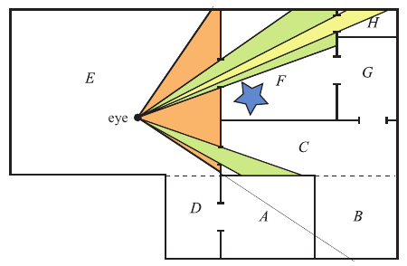

**图 19.15** 门户剔除：单元从 A 到 H 编号，门户是连接各单元的开口。只渲染通过门户能够看到的几何体。例如，单元 F 中的星形物体会被剔除。（图内 eye 表示视点。）

Luebke 与 Georges [1090] 采用了一种简单方法，只需要少量预处理。所需的信息仅为前面所述的、与每个单元关联的数据结构。其核心思想是：每个门户都限定了看向其房间以及更远区域的视野。设想你正透过一道门口，看向一个有三扇窗户的房间。门口定义了一个视锥体，你用它剔除房间中不可见的物体，并渲染那些能够看到的物体。其中两扇窗户无法透过门口看到，因此可以忽略通过这两扇窗户可见的单元。第三扇窗户可以看到，但被门框部分遮挡。只有同时透过门口和这扇窗户可见的单元内容，才需要送入流水线。单元渲染过程依赖于以递归方式跟踪这种可见性。

图 19.15 通过一个例子说明了门户剔除算法。观察者或视点位于单元 E 中，因此先渲染单元 E 及其内容。相邻单元为 C、D 和 F。原始视锥体无法看到通向单元 D 的门户，因此不再对它进行后续处理。单元 F 可见，于是缩小视锥体，使其穿过连接 F 的门户。随后使用这个缩小后的视锥体渲染 F 的内容。接下来检查 F 的相邻单元：从缩小后的视锥体看不到 G，因此忽略 G；H 则可见。再次用 H 的门户缩小视锥体，然后渲染 H 的内容。H 没有尚未访问的相邻单元，因此遍历到此结束。此时，递归返回到通向单元 C 的门户。缩小视锥体，使其贴合 C 的门户，然后使用视锥体剔除，渲染 C 中的物体。没有更多可见门户，渲染至此完成。

每个物体渲染之后都可以加上标记，以避免被重复渲染。例如，如果有两扇窗户通向同一个房间，就要分别用两个视锥体对房间的内容进行剔除。如果不加标记，一个透过两扇窗户都可见的物体就会被渲染两次。这既低效，也可能造成渲染错误，例如物体是透明的情况。为了避免每帧都清空这组标记，可以在访问物体时，用当前帧编号标记该物体。只有存储着当前帧编号的物体，才是已经访问过的物体。


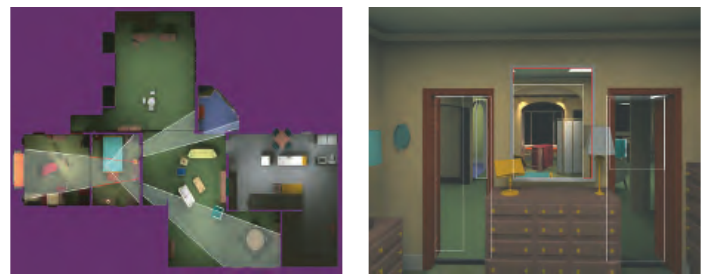

**图 19.16** 门户剔除。左图是 Brooks House 的俯视图，右图是从主卧室中看到的视图。门户的剔除框以白色表示，镜面的剔除框以红色表示。（图片由北卡罗来纳大学教堂山分校的 David Luebke 与 Chris Georges 提供。）

一种很值得实现的优化，是使用模板缓冲进行更精确的剔除。实际中通常用轴对齐包围盒（AABB）对门户作偏大的估计；真实门户很可能更小。模板缓冲可以用于屏蔽真实门户之外的渲染。类似地，也可以为 GPU 设置一个包围门户的剪裁矩形（scissor rectangle），以提高性能 [13]。使用模板与剪裁功能，还可以省去标记操作：透明物体虽然可能被渲染两次，但对每个门户内可见像素的影响都只会发生一次。

图 19.16 展示了门户应用的另一个视图。这种形式的门户剔除也可以用于裁减平面反射中的内容（第 11.6.2 节）。左图展示了从上方观察的建筑物；白线表示视锥体经过每个门户时如何缩小。红线则由视锥体在镜面处反射而产生。右图展示了实际视图，其中白色矩形表示门户，镜面以红色表示。注意，只有位于这些视锥体中任意一个内部的物体才会被渲染。还可以使用其他变换来创建其他效果，例如简单的折射。


## 19.6 细节剔除与小三角形剔除

来源：原书第 839—840 页（PDF 第 860—861 页）。本节从 19.6 标题开始，至 19.7 标题之前结束。

细节剔除是一种以质量换取速度的技术。其依据是：当观察者正在移动时，场景中的细小细节对渲染图像的贡献很少，甚至没有贡献。当观察者停止移动时，通常会禁用细节剔除。考虑一个具有包围体的物体，将该包围体（BV）投影到投影平面上，然后以像素为单位估算投影面积；如果像素数低于用户定义的阈值，就不再对该物体进行后续处理。因此，细节剔除有时也称为屏幕尺寸剔除。细节剔除还可以在场景图上按层次进行。这类技术经常用于游戏引擎 [283]。

当每个像素的中心只有一个采样点时，小三角形很有可能落在采样点之间。此外，小三角形的光栅化效率也很低。有些图形硬件实际上会剔除落在采样点之间的三角形，不过，当通过 GPU 上的代码执行剔除时（第 19.8 节），加入一些剔除小三角形的代码可能仍然有益。Wihlidal [1883, 1884] 提出了一种简单的方法：首先计算三角形的轴对齐包围盒（AABB）。如果下式为真，就可以在着色器中剔除这个三角形：


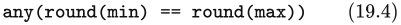


其中，min 和 max 表示包围三角形的二维 AABB 的最小、最大坐标。只要向量的任意一个分量为真，函数 any 就返回真。还应记住，像素中心位于 (x + 0.5, y + 0.5)，这意味着，只要 x 坐标或 y 坐标中的任意一组，或者两组，都分别舍入为相同的坐标，式（19.4）就为真。图 19.17 给出了一些例子。


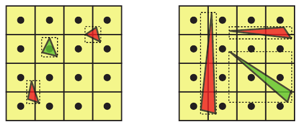

**图 19.17** 使用 any(round(min) == round(max)) 进行小三角形剔除。红色三角形被剔除，而绿色三角形需要渲染。左：绿色三角形覆盖了一个采样点，因此不能剔除。对于两个红色三角形，各自 AABB 的所有坐标经舍入后都落到同一个像素角点。右：红色三角形可以被剔除，因为 AABB 在某一个坐标轴上的最小、最大坐标被舍入为相同的整数。绿色三角形没有覆盖任何采样点，但不能通过这个测试将其剔除。


## 19.7 遮挡剔除

来源：《Real-Time Rendering, Fourth Edition》，书页 840—850（PDF 物理页 861—871）。范围从 19.7 标题开始，到 19.8 标题之前，包含全部下级小节；边界页中属于相邻节的内容不计入本节。

正如前面所见，可见性可以通过 z 缓冲来解决。虽然 z 缓冲能够正确解决可见性问题，但它是一种相对简单的蛮力方法，因此并非总是最高效的解决方案。例如，设想观察者沿着一条直线观看，而这条直线上放着 10 个球体，如图 19.18 所示。从这一视点渲染出的图像只会显示一个球体，但全部 10 个球体仍然都要进行光栅化，与 z 缓冲比较，然后还可能写入颜色缓冲和 z 缓冲。图 19.18 中间部分显示了这一场景从给定视点看去的深度复杂度。深度复杂度是一个像素所覆盖的表面数量。对于这 10 个球体，假设已开启背面剔除，中央像素的深度复杂度就是 10，因为全部 10 个球体都位于该像素处。如果按照从后向前的顺序渲染场景，中央像素就会执行 10 次像素着色，也就是说有 9 次不必要的像素着色器执行。即使按照从前向后的顺序渲染，全部 10 个球体的三角形仍然都要光栅化，计算深度并与 z 缓冲中的深度比较，而最终生成的却只有一个球体的图像。现实中不太可能出现这样一个乏味的场景，但它描述了一个从给定视点看去十分密集的模型。雨林、发动机、城市以及摩天大楼内部等真实场景中，都存在此类情况。图 19.19 给出了一个例子。


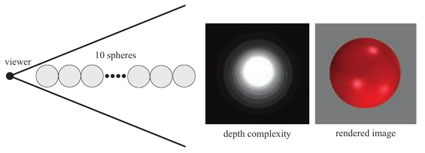

图 19.18：说明遮挡剔除为何有用。10 个球体沿一条直线摆放，观察者沿这条直线以透视方式观看（左）。中间的深度复杂度图显示，某些像素被写入了多次，尽管最终图像（右）只显示一个球体。

从上一段的例子可以看出，采用算法来避免这类低效工作，很可能带来性能收益。这些方法统称为遮挡剔除算法，因为它们试图剔除被遮挡的物体，也就是被场景中其他物体隐藏起来的物体。理想的遮挡剔除算法应当只选择可见物体。从某种意义上说，z 缓冲也只选择并渲染可见物体，但它仍然必须把视锥体内的所有物体送过流水线的大部分阶段。高效遮挡剔除算法的思想，是尽早执行一些简单测试，以剔除成组的隐藏物体。从某种意义上说，背面剔除就是一种简单的遮挡剔除。如果预先知道物体是实心且不透明的，那么它的背面会被正面遮挡，因而无须渲染。


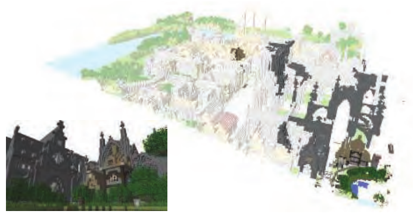

图 19.19：名为 Neu Rungholt 的 Minecraft 场景，以及遮挡剔除的可视化，观察者位于右下角。浅色几何体被剔除，较深色几何体则被渲染。最终图像显示在左下角。（经 Jon Hasselgren、Magnus Andersson、Tomas Akenine-Möller 和 Intel Corporation 许可转载，版权归 Intel Corporation 所有，2016 年。Neu Rungholt 地图由 kescha 提供。）

遮挡剔除算法主要有两种形式，即基于点和基于单元的算法，如图 19.20 所示。基于点的可见性就是渲染中通常使用的可见性：从单个观察位置能够看见什么。另一方面，基于单元的可见性针对的是一个单元，即包含一组观察位置的空间区域，通常是一个盒体或球体。在基于单元的可见性中，一个不可见物体必须从该单元内部的所有点看去都不可见。基于单元的可见性的优点是：一旦针对某个单元计算完成，只要观察者仍处于该单元内部，通常就可以连续使用若干帧。不过，它通常比基于点的可见性更耗时，因此往往作为预处理步骤执行。基于点和基于单元的可见性，在性质上类似于点光源和面光源，可以把光源想象成正在观察场景。物体不可见，相当于它处于本影区域中，即完全位于阴影之内。


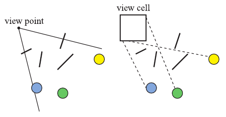

图 19.20：左图显示基于点的可见性，右图显示基于单元的可见性，其中单元是一个盒体。可以看到，左图中的圆形从该视点看去被遮挡；但在右图中，这些圆形是可见的，因为可以从单元内部的某些位置向圆形发出射线，而不与任何遮挡物相交。

还可以根据算法工作的空间，将遮挡剔除算法分为图像空间、物体空间和射线空间算法。图像空间算法在某种投影之后，以二维方式进行可见性测试；物体空间算法则使用原始三维物体。射线空间方法 [150, 151, 923] 在对偶空间中执行测试。每个感兴趣的点（通常是二维点）都转换为该对偶空间中的一条射线。对于实时图形，这三种方法中使用最广泛的是图像空间遮挡剔除算法。

一种遮挡剔除算法的伪代码见图 19.21。其中，函数 isOccluded 检查一个物体是否被遮挡，这通常称为可见性测试。G 是要渲染的几何物体集合，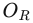 是遮挡表示，P 是可以合并到  中的一组潜在遮挡物。根据具体算法的不同， 表示某种遮挡信息。开始时将  设为空，之后处理所有通过视锥体剔除测试的物体。


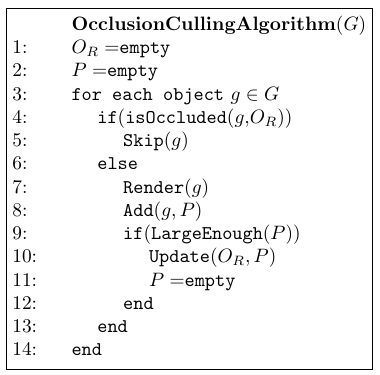

```text
遮挡剔除算法(G)
 1: OR = 空
 2: P = 空
 3: 对 G 中的每个物体 g
 4:     如果 isOccluded(g, OR)（g 被遮挡）
 5:         Skip(g)（跳过 g）
 6:     否则
 7:         Render(g)（渲染 g）
 8:         Add(g, P)（把 g 加入 P）
 9:         如果 LargeEnough(P)（P 已足够大）
10:             Update(OR, P)（用 P 更新 OR）
11:             P = 空
12:         结束条件分支
13:     结束条件分支
14: 结束循环
```

图 19.21：通用遮挡剔除算法的伪代码。G 包含场景中的所有物体， 是遮挡表示。P 是一组潜在遮挡物，当它包含足够多的物体时，就将它们合并到  中。（据 Zhang [1965]。）译注：可复制伪代码中的 OR 对应原图中 O 加下标大写 R 的遮挡表示变量。

考虑某个具体物体。首先，我们根据遮挡表示  测试该物体是否被遮挡。如果被遮挡，就不再进一步处理，因为我们已经知道它不会对图像产生贡献。如果无法确定该物体被遮挡，就必须渲染它，因为在渲染过程的当前时刻，它可能对图像有所贡献。随后将该物体加入 P；如果 P 中的物体数量足够多，就值得把这些物体的遮挡能力合并到  中。因此，P 中的每个物体都可以用作遮挡物。

注意，对于大多数遮挡剔除算法，性能取决于物体的绘制顺序。例如，考虑一辆内部装有发动机的汽车。如果先绘制汽车的发动机罩，那么发动机很可能就会被剔除。反之，如果先绘制发动机，就不会剔除任何东西。按大致从前向后的顺序排序并渲染，可以带来可观的性能提升。还要注意，小物体也可能是出色的遮挡物，因为与遮挡物的距离决定了它能够遮挡多大范围。例如，只要观察者离火柴盒足够近，一个火柴盒就可以遮住金门大桥。

### 19.7.1 遮挡查询

GPU 通过一种特殊的渲染模式来支持遮挡剔除。用户可以查询 GPU，判断一组三角形与 z 缓冲的当前内容比较时是否可见。这些三角形通常构成某个更复杂物体的包围体，例如盒体或 k-DOP。如果这些三角形没有任何一个可见，该物体就可以被剔除。GPU 对查询中的三角形进行光栅化，并将它们的深度与 z 缓冲比较，也就是说，它工作在图像空间中。查询会生成这些三角形可见的像素数量 n，但实际上既不修改像素，也不修改任何深度。如果 n 为零，则所有三角形都被遮挡或被裁剪。

不过，仅凭计数为零，还不足以判定包围体不可见。更确切地说，相机视锥体可见近裁剪面的任何部分都不应位于该包围体内部。假设满足这一条件，则整个包围体完全被遮挡，其中包含的物体可以安全地丢弃。如果 n > 0，则有一部分像素未通过遮挡测试。如果 n 小于某个像素数阈值，可以认为该物体不太可能对最终图像产生显著贡献，因而将其丢弃 [1894]。这样便能以可能损失画质为代价来换取速度。另一种用途是让 n 帮助确定物体的细节层次（LOD，见 19.9 节）。如果 n 很小，则物体潜在可见的部分较少，因此可以使用细节较少的 LOD。

当发现包围体被遮挡时，我们通过避免将一个可能很复杂的物体送入渲染流水线来获得性能收益。不过，如果遮挡测试失败，性能实际上会略有下降，因为我们额外花时间测试了包围体，却没有获得收益。

这种测试还有一些变体。对于剔除而言，并不需要可见片元的精确数量，只要一个布尔值，指示是否至少有一个片元通过深度测试即可。OpenGL 3.3、DirectX 11 及其后续版本支持这种遮挡查询；它在 OpenGL 中的枚举名为 ANY_SAMPLES_PASSED [1598]。这种测试可能更快，因为只要发现一个片元可见，就可以终止查询。OpenGL 4.3 及后续版本还允许使用更快的查询变体，称为 ANY_SAMPLES_PASSED_CONSERVATIVE。实现可以选择精度较低的测试，只要它是保守的，并且误差方向正确即可。例如，硬件厂商可以只针对粗粒度深度缓冲（23.7 节）执行深度测试，而不是针对逐像素深度进行测试。

查询延迟往往相对较长。在这段时间内，通常可以渲染数百甚至数千个三角形；关于延迟的更多内容见 23.3 节。因此，当包围盒中包含大量物体，并且遮挡量相对较大时，这种基于 GPU 的遮挡剔除方法才值得使用。GPU 使用的遮挡查询模型允许 CPU 向 GPU 发出任意数量的查询，然后定期检查是否已有结果可用，即查询模型是异步的。GPU 则执行每个查询，并把结果放入队列。CPU 检查队列极快，可以继续提交查询或实际需要渲染的物体，而无须停顿等待。DirectX 和 OpenGL 都支持谓词式／条件式遮挡查询：同时提交查询和对应绘制调用的 ID。只有当查询表明其几何体可见时，GPU 才会自动处理对应的绘制调用。这使该模型实用得多。

一般而言，应当对最有可能被遮挡的物体执行查询。Kovalčík 和 Sochor [932] 在应用程序运行时，为每个物体收集连续若干帧的查询统计。某物体被判定为隐藏的帧数，会影响此后对它进行遮挡测试的频率。也就是说，可见物体很可能继续可见，因此可以降低测试频率。如果可能，隐藏物体则每帧都进行测试，因为这些物体最有可能从遮挡查询中获益。Mattausch 等人 [1136] 提出了几种不使用谓词式／条件式渲染的遮挡查询（OC）优化。他们对 OC 进行批处理，把几个 OC 合并为一个 OC，使用多个包围盒代替单个较大的包围盒，并通过时间抖动采样来安排此前可见物体的测试时机。

这里讨论的方案展示了遮挡剔除方法的潜力及其问题。何时使用遮挡查询，乃至一般而言何时使用大多数遮挡方案，往往并不明确。如果所有东西都可见，遮挡算法就只会增加耗时，绝不可能节省时间。一项挑战是迅速确定算法没有帮助，进而减少那些徒劳的节时尝试。另一个问题是决定使用哪一组物体作为遮挡物。最前方且位于视锥体内的物体必然可见，因此把查询花在它们身上是一种浪费。在实现大多数遮挡剔除算法时，确定渲染顺序以及何时测试遮挡，都是棘手的问题。

### 19.7.2 层次 z 缓冲

层次 z 缓冲（HZB）[591, 593] 对遮挡剔除研究产生了重大影响。虽然最初在 CPU 端运行的形式已经很少使用，但该算法是 GPU 硬件 z 剔除方法（23.7 节）的基础，也是运行于 GPU 或 CPU 上的软件自定义遮挡剔除的基础。我们先介绍基本算法，再说明各种渲染引擎如何采用这项技术。

该算法以八叉树保存场景模型，并把一帧的 z 缓冲保存为图像金字塔，称为 z 金字塔。因此，该算法工作在图像空间中。八叉树能够以层次方式剔除场景中被遮挡的区域，z 金字塔则能够对图元进行层次 z 缓冲处理。因此，z 金字塔就是该算法的遮挡表示。图 19.22 给出了这些数据结构的示例。

z 金字塔最精细、分辨率最高的一层，就是标准的 z 缓冲。在其他各层，每个 z 值都是相邻更精细一层中相应 2 × 2 窗口内最远的 z 值。因此，每个 z 值表示屏幕上某个正方形区域内最远的 z。每当 z 缓冲中的某个 z 值被覆盖时，就把它向 z 金字塔的更粗层级传播。这个过程递归进行，直到到达图像金字塔顶部，那里只剩一个 z 值。图 19.23 展示了金字塔的形成过程。

八叉树节点的层次剔除过程如下。按大致从前向后的顺序遍历八叉树节点，使用扩展的遮挡查询（19.7.1 节）将八叉树的包围盒与 z 金字塔进行测试。测试从能够包住盒体屏幕投影的最粗 z 金字塔单元开始。随后把盒体在该单元内的最近深度 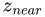 与 z 金字塔值比较；如果  更远，就知道盒体被遮挡。测试沿 z 金字塔递归向下进行，直到发现盒体被遮挡，或到达 z 金字塔的最底层，此时便知道盒体可见。对于可见的八叉树盒体，继续沿八叉树递归向下测试，最终把潜在可见的几何体渲染到层次 z 缓冲中。这样，后续测试就可以利用此前已渲染物体的遮挡能力。


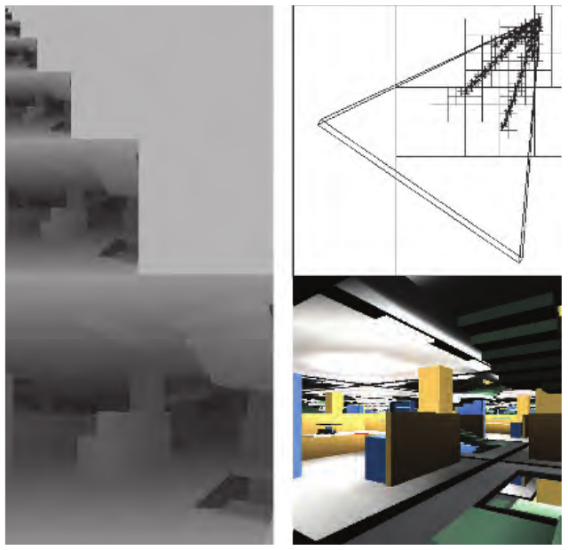

图 19.22：使用 HZB 算法 [591, 593] 进行遮挡剔除的示例，展示了一个深度复杂度较高的场景（右下），以及相应的 z 金字塔（左）和八叉树划分（右上）。通过从前向后遍历八叉树，并在遇到被遮挡节点时将其剔除，该算法只访问可见的八叉树节点及其子节点（右上所画出的节点），而且只渲染可见盒体中的三角形。在此例中，剔除被遮挡的八叉树节点使深度复杂度从 84 降至 2.5。（图片由 Ned Greene／Apple Computer 提供。）


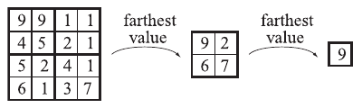

图 19.23：左侧显示 z 缓冲中的一个 4 × 4 区块，其中的数值就是实际 z 值。将它下采样为一个 2 × 2 区域，每个值取自左侧四个 2 × 2 区域中对应区域的最远值，即最大值。最后，求出剩下四个 z 值中的最远值。这三幅图组成一个图像金字塔，称为层次 z 缓冲。

如今已不再使用完整的 HZB 算法，而是对其进行简化和调整，使它适用于 GPU 上通过计算通道执行的自定义剔除，或 CPU 上的软件光栅化。一般而言，大多数基于 HZB 的遮挡剔除算法按如下方式工作：

1. 使用某种遮挡物表示，生成完整的层次 z 金字塔。
2. 为测试一个物体是否被遮挡，将其包围体投影到屏幕空间，并估计 z 金字塔中的 mip 层级。
3. 针对所选 mip 层级测试遮挡。如果结果不明确，可选择在更精细的 mip 层级继续测试。

大多数实现不使用八叉树，也不使用任何包围体层次结构（BVH），并且不会在每个物体渲染完成后更新 z 金字塔，因为这种操作被认为代价过高。

第 1 步可以使用“最佳”遮挡物 [1637]：它们可以是距离最近的 n 个物体 [625]、美术人员生成的简化遮挡图元，或根据上一帧可见物体集合的统计信息选出的物体。也可以直接使用上一帧的 z 缓冲 [856]，不过这不是保守方法：错误剔除有时会导致物体突然出现，尤其是在相机或物体快速运动时。Haar 和 Aaltonen [625] 既渲染最佳遮挡物，又将其与上一帧深度的 1/16 低分辨率重投影结果结合。随后使用 GPU 构建 z 金字塔，如图 19.23 所示。有些实现使用 AMD GCN 架构的 HTILE（23.10.3 节）来加速 z 金字塔的生成 [625]。

第 2 步把物体的包围体投影到屏幕空间。常用包围体包括球体、轴对齐包围盒（AABB）和有向包围盒（OBB）。使用投影后包围体的最长边 l（以像素为单位）来计算 mip 层级 λ [738, 1637, 1883, 1884]：


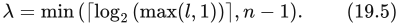


其中，n 是 z 金字塔中 mip 层级的最大数量。max 运算用来避免得到负的 mip 层级，min 则避免访问不存在的 mip 层级。公式（19.5）选择满足以下条件的最小整数 mip 层级：投影后的包围体最多覆盖 2 × 2 个深度值。如此选择是为了使代价可预测，最多只需读取并测试四个深度值。此外，Hill 和 Collin [738] 认为，这种测试在某种意义上可以视为“概率式”的：大物体比小物体更有可能可见，因此在这些情况下没有理由读取更多深度值。

到达第 3 步时，我们知道投影后的包围体被该 mip 层级上某组至多 2 × 2 个深度值所包围。对于一个给定大小的包围体，它可能完全落在该 mip 层级的一个深度纹素内部；不过，根据它与网格的相对位置，也可能覆盖全部四个纹素。需要精确或保守地计算包围体的最小深度。对于观察空间中的 AABB，这就是盒体的最小深度；对于 OBB，可以把所有顶点投影到观察向量上，并选择最小距离。对于球体，Shopf 等人 [1637] 将球体上的最近点计算为 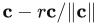，其中 c 是观察空间中的球心向量，r 是球体半径。注意，如果相机位于包围体内部，则包围体覆盖整个屏幕，此时会渲染该物体。把包围体的最小深度  与层次 z 缓冲中至多 2 × 2 个深度值比较；如果  始终更大，则包围体被遮挡。可以到这里就停止测试；只要没有检测出被遮挡，就直接渲染该物体。

也可以继续针对金字塔下一层、分辨率更高的层级进行测试。可以利用另一个存储最小深度的 z 金字塔，判断是否值得继续测试。把到包围体的最大距离 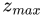 与这个新缓冲中的对应深度进行比较。如果  小于所有这些深度，那么包围体肯定可见，可以立即渲染。否则，包围体的  和  与两个层次 z 缓冲的深度范围相重叠，在这种情况下，Kaplanyan [856] 建议在分辨率更高的 mip 层级继续测试。注意，将层次 z 缓冲中的 2 × 2 个纹素与单个深度进行比较，非常类似于百分比渐近滤波（percentage-closer filtering，PCF，见 7.5 节）。实际上，可以采用带双线性滤波的 PCF 完成这项测试；如果测试返回正值，就表示至少有一个纹素可见。

Haar 和 Altonen [625] 还提出了一种双通道方法，保证至少渲染所有可见物体。首先，根据上一帧的 z 金字塔对所有物体进行遮挡剔除，并渲染那些“可见”物体。也可以使用上一帧的可见性列表来直接渲染 z 金字塔。虽然这是近似方法，但所有已渲染的物体都能很好地估计当前帧的“最佳”遮挡物，尤其是在帧间相干性较高的场景中。第二个通道获取这些已渲染物体的深度缓冲，并创建新的 z 金字塔。随后，对第一个通道中被遮挡剔除的物体再次进行遮挡测试，如果没有被剔除，就渲染它们。即使相机快速移动，或物体在屏幕上快速运动，这种方法仍能生成完全正确的图像。Kubisch 和 Tavenrath [944] 使用了类似方法。

Doghramachi 和 Bucci [363] 将待遮挡测试物体的有向包围盒进行光栅化，与经过下采样及重投影的上一帧深度缓冲比较。他们强制着色器使用 early-z（23.7 节）；对于每个盒体，可见片元会在缓冲中的某个位置将该物体标记为可见，这个位置由物体 ID 唯一确定 [944]。这种方法使用有向盒体并执行逐像素测试，而不是使用公式（19.5）针对某个 mip 层级执行自定义测试，因此能够达到更高的剔除率。

Collin [283] 使用一个 256 × 144 的浮点 z 缓冲（不是层次缓冲），并对美术人员生成的低复杂度遮挡物进行光栅化。这通过高度优化的 SIMD 代码在软件中完成，执行设备可以是 CPU，也可以是 PLAYSTATION 3 上的 SPU。为进行遮挡测试，先计算物体的屏幕空间 AABB，再把其  与这个小型 z 缓冲中所有相关深度比较。只有未被剔除的物体才会送往 GPU。这种方法可以奏效，但并不保证保守正确，因为它采用的分辨率低于最终帧缓冲的分辨率。Wihlidal [1883] 建议还可以利用这个低分辨率 z 缓冲，将  值载入 GPU 的 HiZ（23.7 节），例如预先填充 AMD GCN 的 HTILE 结构。或者，如果使用 HZB 进行计算通道剔除，也可以使用软件 z 缓冲来生成 z 金字塔。这样，算法就能利用软件生成的全部信息。

Hasselgren 等人 [683] 提出了另一种方法，其中每个 8 × 4 图块为每个像素保存 1 位，并保存两个  值 [50]，总开销为每像素 3 位。使用两个  值可以更好地处理深度不连续，因为背景物体可以使用其中一个  值，而前景物体使用另一个。这种表示称为掩码层次深度缓冲（masked hierarchical depth buffer，MHDB），它是保守的，也可以用于  剔除。在软件三角形光栅化期间，每个图块只生成覆盖掩码和单个最大深度值，因此向 MHDB 光栅化既快速又高效。将三角形光栅化到 MDHB 的同时，也可以根据 MDHB 对三角形执行遮挡测试，从而优化光栅器。MDHB 会针对每个三角形更新，这是其他方法很少具备的优点。作者评估了两种使用模式。第一种使用专门的遮挡网格，通过软件光栅器将其渲染到 MDHB 中。随后遍历待遮挡测试物体的 AABB 树，并以层次方式对照 MDHB 进行测试。这可能非常有效，特别是场景中有许多小物体时。第二种方法将整个场景存储在 AABB 树中，利用堆按大致从前向后的顺序遍历场景。每一步都执行视锥体剔除，并针对 MDHB 执行遮挡查询。每当渲染一个物体时，MDHB 也会更新。图 19.19 中的场景就是采用这种方法渲染的。其开源代码针对 AVX2 做了大量优化 [683]。

还有一些专门用于剔除，尤其是遮挡剔除的中间件包。Umbra 就是这样一种框架，它已与多种游戏引擎进行了广泛集成 [13, 1789]。

译注：原文前面将 masked hierarchical depth buffer 缩写为 MHDB，后文多次写作 MDHB；此处保留原文的缩写变化，两者指同一表示。原文前面作者名为 Aaltonen，双通道方法一段写作 Altonen，此处亦保留该拼写差异。


## 19.8 剔除系统

来源：Real-Time Rendering, Fourth Edition，第 19.8 节；书页 850—851（PDF 第 871—872 页）。已检查 PDF 第 873 页的章节边界；该页图 19.26 属于第 19.9 节。

多年来，剔除系统已经有了长足的发展，而且仍在继续演进。本节介绍一些总体思路，具体细节则请参阅相关文献。有些系统实际上在 GPU 的计算着色器中执行全部剔除工作，另一些系统则先在 CPU 上进行粗略剔除，再在 GPU 上进行更精细的剔除。

典型的剔除系统会在多种粒度上工作，如图 19.24 所示。物体的一个簇（cluster）或块（chunk），就是该物体三角形集合的一个子集。例如，可以采用包含 64 个顶点的三角形带 [625]，或者由 256 个三角形组成的分组 [1884]。在每个步骤中，都可以组合使用多种剔除技术。El Mansouri [415] 对物体采用小三角形剔除、细节剔除、视锥体剔除和遮挡剔除。由于簇的几何范围小于物体，更有可能被剔除，因此对簇同样采用这些剔除技术是合理的。例如，可以对簇采用细节剔除、视锥体剔除、成簇背面剔除和遮挡剔除。


**图 19.24** 一个在三种不同粒度上工作的剔除系统示例。首先，在逐物体层级进行剔除。然后，对未被剔除的物体在逐簇层级进行剔除。最后，进行三角形剔除，图 19.25 对此作了进一步说明。

图内标签：object/instance culling＝物体／实例剔除；cluster/chunk culling＝簇／块剔除；triangle culling＝三角形剔除。


**图 19.25** 三角形剔除系统。首先，对所有单独的三角形应用一系列剔除算法。为了能够使用间接绘制，也就是无需在 GPU 与 CPU 之间往返传递数据，随后将未被剔除的三角形紧缩为一个更短的列表。GPU 使用间接绘制来渲染这个列表。

图内标签：culling＝剔除；compaction＝紧缩；indirect drawing＝间接绘制。

完成逐簇层级的剔除后，还可以增加一个步骤，在逐三角形层级进行剔除。为了使这一过程完全在 GPU 上进行，可以采用图 19.25 所示的方法。三角形的剔除技术包括：除以 w 之后进行视锥体剔除，即将三角形的范围与 ±1 比较；背面测试；退化三角形剔除；小三角形剔除；还可能包括遮挡剔除。通过所有剔除测试后留下的三角形，随后被紧缩为一个最小列表，以便在下一步中只处理未被剔除的三角形 [1884]。其思路是，在这一步指示执行剔除的计算着色器，让 GPU 向自身发送一条绘制命令。这通过一条间接绘制命令来完成。这些调用在 OpenGL 中称为“multi-draw indirect”（多次间接绘制），在 DirectX 中称为“execute indirect”（间接执行）[433]。三角形数量被写入 GPU 缓冲区中的某个位置，GPU 可以结合这个数量和紧缩后的列表，渲染该三角形列表。

剔除算法的组合方式有很多种，执行位置也可以选择 CPU 或 GPU，而且每种剔除算法本身也有许多变体。最理想的组合尚未找到，但可以肯定的是，最佳方法取决于目标体系结构和待渲染的内容。接下来，我们列举 CPU/GPU 剔除系统领域中一些产生了重大影响的重要工作。Shopf 等人 [1637] 在 GPU 上完成了角色的全部 AI 模拟，因此，每个角色的位置只存在于 GPU 内存中。这促使他们探索利用计算着色器进行剔除和细节层次（LOD）管理，后来的大多数系统都深受其工作的影响。Haar 和 Aaltonen [625] 介绍了他们为《刺客信条：大革命》（Assassin’s Creed Unity）开发的系统。Wihlidal [1883, 1884] 解释了 Frostbite 引擎中使用的剔除系统。Engel [433] 提出了一种剔除系统，有助于改进使用可见性缓冲区的流水线（第 20.5 节）。Kubisch 和 Tavenrath [944] 介绍了渲染包含大量部件的庞大模型的方法，并通过不同的剔除方法和 API 调用进行优化。他们用于对包围盒进行遮挡剔除的一种方法值得注意：利用几何着色器生成包围盒的可见面，然后让提前深度测试（early-z）快速剔除被遮挡的几何体。


## 19.9 细节层次

本节来源：《Real-Time Rendering》第4版，书页852—866（PDF物理页873—887）。包含19.9.1—19.9.3；图19.26虽排在本节标题之前，仍归入本节。正文止于19.10标题之前。

细节层次（levels of detail，LOD）的基本思想是：当一个物体对渲染图像的贡献越来越小时，使用它的更简单版本。例如，考虑一辆可能包含100万个三角形的精细汽车。当观察者靠近汽车时，可以使用这种表示。当物体较远，例如只覆盖200个像素时，就不需要全部100万个三角形了。我们可以改用一个简化模型，例如只包含1000个三角形。由于距离较远，简化版本看起来与更精细的版本基本相同。见图19.26。这样就有望显著提高性能。为了减少应用LOD技术所涉及的总工作量，最好在剔除技术之后应用LOD技术。例如，只对视锥体内的物体计算LOD选择。


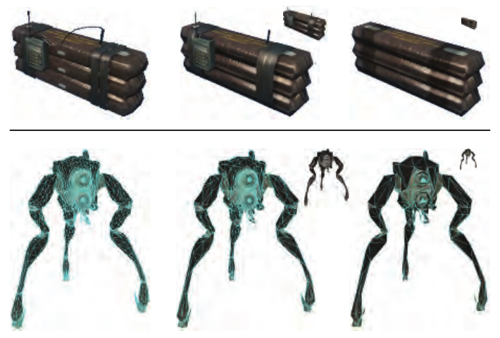

图19.26：这里展示C4炸药模型（上）和Hunter模型（下）的三个不同细节层次。较低的细节层次会简化元素，或者完全删除它们。小插图按简化模型可能使用时的相对尺寸显示它们。（上排图片由Crytek提供；下排由Valve Corp.提供。）

LOD技术还可以让应用程序在性能不同的一系列设备上以期望的帧率运行。在较慢的系统上，可以使用细节较少的LOD来提高性能。注意，虽然LOD技术首先有助于减少顶点处理，但它也会降低像素着色开销。这是因为模型所有三角形边长的总和会减少，从而减少四像素组过度着色（第18.2节和第23.1节）。

第14章介绍的雾和其他参与介质可以与LOD配合使用。例如，当物体进入完全不透明的雾中时，就可以完全跳过它的渲染。此外，雾化机制也可以用来实现有严格时间限制的渲染（第19.9.3节）。将远平面移近观察者，可以更早剔除更多物体，从而提高帧率。另外，在雾中通常可以使用较低的LOD。

某些物体，例如球面、Bézier曲面和细分曲面，其几何描述本身就包含细节层次。底层几何是弯曲的，由独立的LOD控制决定如何将它曲面细分为可以显示的三角形。有关自适应调整参数曲面和细分曲面细分质量的算法，见第17.6.2节。

一般来说，LOD算法由三个主要部分组成，即生成、选择和切换。LOD生成是产生模型不同表示的过程，这些表示具有不同的细节量。可以使用第16.5节讨论的简化方法，生成所需数量的LOD。另一种方法是手工制作三角形数量不同的模型。选择机制根据某种准则，例如估计的屏幕面积，选择一个细节层次模型。最后，我们需要从一个细节层次改为另一个，这一过程称为LOD切换。本节将介绍不同的LOD切换和选择机制。

虽然本节着重讨论如何在不同几何表示之间选择，但LOD背后的思想也可以应用于模型的其他方面，甚至所使用的渲染方法。较低细节层次的模型也可以使用较低分辨率的纹理，从而进一步节省内存，并可能改善缓存访问[240]。着色器本身也可以根据距离、重要性或其他因素进行简化[688, 1318, 1365, 1842]。Kajiya [845]给出了一个尺度层级，展示表面光照模型如何与纹理映射方法发生重叠，而纹理映射方法又如何与几何细节发生重叠。另一种技术是对远处物体的蒙皮运算使用较少的骨骼。

当静态物体相对较远时，公告板和替身图像（第13.6.4节）是以很小开销表示它们的自然选择[1097]。其他表面渲染方法，例如凹凸映射或浮雕映射，也可以用来简化模型的表示。图19.27给出了一个例子。Teixeira [1754]讨论了如何使用GPU将法线贴图烘焙到表面上。这种简化技术最明显的缺陷是轮廓会失去曲率。Loviscach [1085]给出了一种沿轮廓边挤出鳍片、从而生成弯曲轮廓的方法。


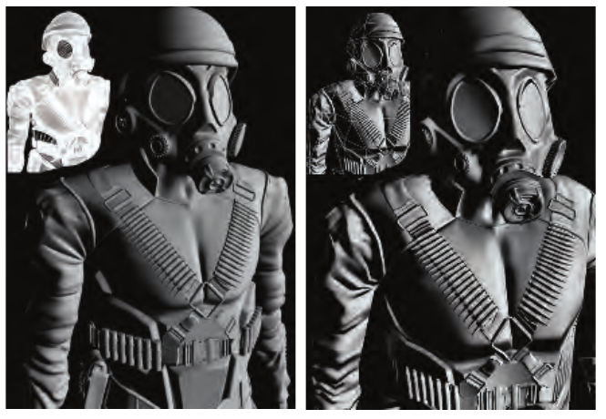

图19.27：左边的原始模型包含150万个三角形。右边的模型包含1100个三角形，表面细节存储为高度场纹理，并使用浮雕映射渲染。（图片由ATI Research, Inc.的Natalya Tatarchuk提供。）

Lengyel等人[1030, 1031]的研究展示了可以用于表示物体的一系列技术。在这项研究中，极近距离的毛皮使用几何表示；稍远时使用经过alpha混合的折线；再远时与体纹理“壳层”混合；最后在远处使用纹理贴图。见图19.28。如何判断何时以及怎样最好地从一组建模和渲染技术切换到另一组，以最大限度提高帧率和质量，仍然是一门艺术，也是有待探索的开放领域。


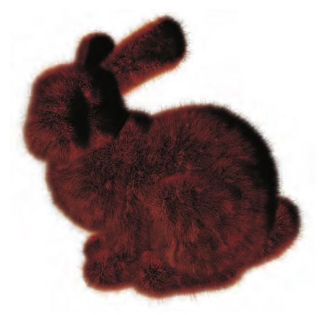

图19.28：从远处看，兔子的毛皮使用体纹理渲染。当兔子靠近时，毛发使用经过alpha混合的折线渲染。在近距离，沿轮廓的毛皮使用graftal鳍片渲染。（图片由Microsoft Research的Jed Lengyel和Michael Cohen提供。）

### 19.9.1 LOD切换

从一个LOD切换到另一个LOD时，突然替换模型往往会被注意到，并分散注意力。这种差异称为跳变（popping）。这里将介绍几种不同的切换方法，它们各自具有不同的跳变特征。

#### 离散几何LOD

最简单的一类LOD算法中，各种表示是同一物体的模型，它们包含不同数量的图元。这种算法非常适合现代图形硬件[1092]，因为这些独立的静态网格可以存储在GPU内存中并重复使用（第16.4.5节）。细节更多的LOD具有更多图元。图19.26和图19.29展示了物体的三个LOD。前一幅图还展示了这些LOD处于距观察者不同距离时的样子。


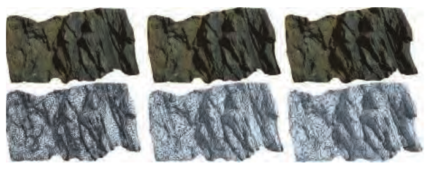

图19.29：一部分悬崖的三个不同细节层次，从左到右分别包含72,200、13,719和7,713个三角形。（图片由Quixel Megascans提供。）

从一个LOD到另一个LOD的切换是突然发生的。也就是说，当前帧使用某个LOD，下一帧选择机制选中另一个LOD后，就立即用它渲染。这类LOD方法的跳变通常最严重，但是，如果在两个LOD渲染差异几乎不可见的距离进行切换，也能取得良好效果。下面介绍更好的替代方法。

#### 混合LOD

从概念上说，一种简单的切换方法是在很短的时间内对两个LOD进行线性混合。这样肯定会使切换更平滑。为一个物体渲染两个LOD，自然比只渲染一个更昂贵，因此这在一定程度上违背了LOD的初衷。不过，LOD切换通常只持续很短时间，而且场景中的物体往往不会同时切换，所以质量的改善很可能值得付出这项开销。

假设希望在两个LOD之间过渡，例如LOD1和LOD2，且LOD1是当前渲染的LOD。问题在于如何以合理的方式渲染并混合两个LOD。如果让两个LOD都变成半透明，最终屏幕上会渲染出一个半透明的物体（虽然会稍微更不透明一些），看起来很奇怪。

Giegl和Wimmer [528]提出了一种实际效果良好且易于实现的混合方法。首先，将LOD1作为不透明物体绘制到帧缓冲区，同时写入颜色和z。然后使用“over”混合模式，将LOD2的alpha值从0增加到1，使其淡入。当LOD2淡入到完全不透明时，将它设为当前LOD，然后使LOD1淡出。正在淡入或淡出的LOD应开启z测试、关闭z写入。为避免随后绘制的远处物体覆盖渐隐LOD的渲染结果，只需像通常处理透明物体一样，在全部不透明内容之后按排序顺序绘制所有渐隐LOD。注意，在过渡中间，两个LOD都以不透明方式渲染，一个叠在另一个上面。保持较短的过渡区间时，这种技术效果最好，同时也有助于控制渲染额外开销。Mittring [1227]讨论了一种相似方法，只不过使用纱门透明（可能在子像素层次）使两个版本之间产生溶解过渡。

Scherzer和Wimmer [1557]通过每帧只更新一个LOD、重用上一帧的另一个LOD，避免同时渲染两个LOD。他们对上一帧执行反投影，并结合一个使用可见性纹理的合成通道。主要结果是渲染更快，过渡行为更好。

某些物体适合其他切换技术。例如，SpeedTree软件包[887]会平滑移动或缩放树木LOD模型的部分结构，以避免跳变。图19.30给出了一个例子。图19.31展示了一组LOD，以及用于远处树木的公告板LOD技术。


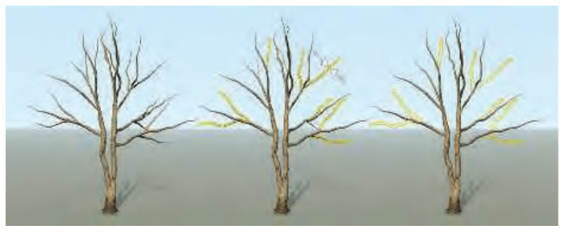

图19.30：当观察者远离树木模型时，树枝（以及未画出的树叶）先缩小，然后被移除。（图片由SpeedTree提供。）


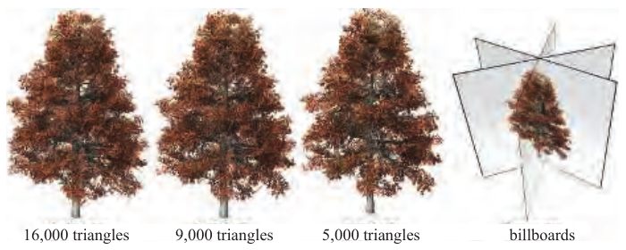

图19.31：从近到远的树木LOD模型，依次为16,000、9,000、5,000个三角形以及公告板。当树木位于远处时，用右侧所示一组公告板中的一张表示它。每张公告板都是从不同视角渲染树木得到的，由颜色贴图和法线贴图组成。选择最朝向观察者的公告板。实际中会生成8到12张公告板（这里显示6张），并裁掉透明部分，避免花费时间丢弃完全透明的像素（第13.6.2节）。（图片由SpeedTree提供。）

#### Alpha LOD

一种可以完全避免跳变的简单方法是使用我们所称的alpha LOD。这种技术可以单独使用，也可以与其他LOD切换技术结合。它应用于最简单的可见LOD；如果只有一个LOD，也可以直接应用于原始模型。随着LOD选择所用度量（例如到该物体的距离）增大，物体整体透明度增加（α减小），并最终在完全透明时（α = 0.0）消失。当度量值大于用户定义的不可见阈值时，就会出现这种情况。一旦达到不可见阈值，只要度量值保持在阈值以上，物体就完全不必送入渲染流水线。当一个原本不可见的物体，其度量值降到不可见阈值以下时，它会降低透明度并开始重新显现。另一种选择是使用第19.9.2节介绍的滞回方法。


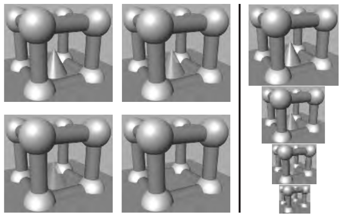

图19.32：中间的圆锥使用alpha LOD渲染。随着与它的距离增加，圆锥的透明度增加，最后消失。为方便观察，左侧图像均以相同距离显示，而分隔线右侧图像以不同大小显示。

单独使用这种技术的优点是，与离散几何LOD方法相比，人们感觉它连续得多，因此可以避免跳变。另外，由于物体最终完全消失，不再需要渲染，因此有望显著提速。缺点是物体会彻底消失，而且只有到这个时刻才能获得性能提升。图19.32展示了alpha LOD的例子。

使用alpha透明的一个问题是，需要按深度排序，才能确保透明物体正确混合。为了使远处植被淡出，Whatley [1876]讨论了如何使用噪声纹理实现纱门透明。这会产生溶解效果：距离越大，物体上消失的纹素越多。虽然质量不如真正的alpha渐隐，但纱门透明不需要排序或混合。

#### 连续LOD与几何变形LOD

网格简化过程可以从一个复杂物体生成各种LOD模型。执行这种简化的算法见第16.5.1节。一种做法是创建一组离散LOD，并按前面的方法使用它们。不过，边折叠方法具有一种性质，允许以其他方式实现LOD之间的过渡。这里介绍两种利用这类信息的方法。它们有助于理解背景，但目前在实践中很少使用。

每执行一次边折叠，模型就减少两个三角形。边折叠的过程是将一条边不断缩短，直到两个端点相遇，边随之消失。如果将这一过程做成动画，原始模型与其稍微简化的版本之间就会平滑过渡。每次边折叠都将一个顶点合并到另一个顶点。经过一系列边折叠，一组顶点会移动并与其他顶点合并。保存边折叠序列后，就可以逆转该过程，使简化模型随时间变得更复杂。边折叠的逆过程称为顶点分裂。因此，改变物体细节层次的一种方式，是精确地依据LOD选择值确定可见三角形数量。在100米外，模型可能包含1000个三角形；移动到101米外时，可能降到998个。这种方案称为连续细节层次（continuous level of detail，CLOD）技术。此时可供显示的不是一组离散模型，而是数量庞大的模型集合，每个模型都比相邻的更复杂模型少两个三角形。

这种方案虽然吸引人，但实际使用存在一些缺点。CLOD序列中的模型并非全部都好看。三角形网格的渲染远快于单独的三角形，但与静态模型相比，CLOD技术更难使用三角形网格。如果场景中同一物体存在多个实例，那么每个CLOD物体都需要指定自己特有的三角形集合，因为它不与其他任何实例匹配。Forsyth [481]讨论了这些问题以及其他问题的解决方法。大多数CLOD技术本质上具有较强的串行性，因此它们并不天然适合在GPU上实现。Hu等人[780]为此提出了一种更符合GPU并行特性的CLOD改进方法。他们的技术也具有视点依赖性：例如，当物体与视锥体左侧相交时，视锥体外部可以使用较少三角形，并连接到内部密度更高的网格。

顶点分裂将一个顶点变成两个。这意味着，复杂模型的每个顶点都源自某个更简单版本上的顶点。几何变形LOD（geomorph LOD）[768]是一组通过简化生成的离散模型，同时保留顶点之间的关联关系。从复杂模型切换到简单模型时，将复杂模型的顶点在原始位置与简单版本的对应位置之间插值。过渡完成后，就使用较简单的细节层次模型表示物体。图19.33展示了过渡的例子。几何变形有几个优点。可以预先挑选质量高的独立静态模型，也容易将它们组织成三角形网格。与CLOD一样，平滑过渡还可以避免跳变。主要缺点是每个顶点都需要插值；CLOD技术通常不使用插值，因此顶点位置集合本身始终不变。另一个缺点是物体看起来总在变化，可能分散注意力，对于带纹理的物体尤其如此。Sander和Mitchell [1543]描述了一个将几何变形与驻留GPU的静态顶点缓冲区、索引缓冲区结合的系统。还可以将前面介绍的Mittring [1227]纱门透明方法与几何变形结合，获得更平滑的过渡。


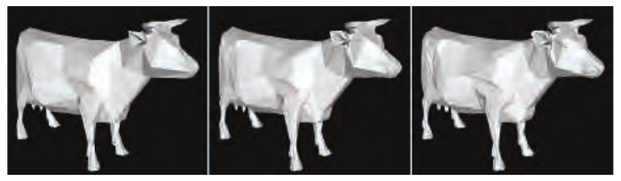

图19.33：左图和右图分别显示低细节模型和较高细节模型。中间图像显示一个几何变形模型，约位于左右两个模型之间插值的一半位置。注意，中间的牛与右侧模型具有相同数量的顶点和三角形。（图像使用Melax的“Polychop”简化演示程序生成[1196]。）

GPU支持一种相关思想，称为分数曲面细分。在此类方案中，曲面的细分因子可以设为任意浮点数，因此能够避免跳变。例如，分数曲面细分可以用于Bézier曲面片和位移映射图元。更多内容见第17.6.1节。

### 19.9.2 LOD选择

假定一个物体已有不同的细节层次，就必须决定渲染哪一个，或者混合哪几个。这就是LOD选择的任务，这里将介绍几种不同的相关技术。这些技术也可以用于为遮挡剔除算法选择良好的遮挡体。

一般而言，根据当前视点和物体位置计算一种度量，也称为收益函数，并由该度量的数值选取适当的LOD。例如，该度量可以基于物体包围体的投影面积，或者视点到物体的距离。这里将收益函数的值记为r。有关如何快速估计一条线在屏幕上的投影，也可参见第17.6.2节。

#### 基于距离范围

一种常见的LOD选择方法，是把物体的不同LOD与不同距离范围关联起来。细节最多的LOD对应从零到某个用户定义值的范围，这意味着当物体距离小于时，该LOD可见。下一个LOD的范围为到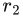，其中 > 。如果到物体的距离大于或等于而小于，就使用该LOD，依此类推。图19.34展示了四个不同LOD及其范围的例子，以及场景图中使用的对应LOD节点。


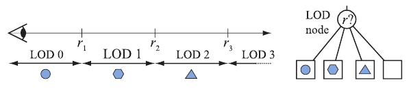

图19.34：左侧展示基于距离范围的LOD如何工作。注意，第四个LOD是一个空物体，因此当物体距离大于时，什么也不绘制，因为它对图像的贡献不足以值得付出渲染成本。右侧展示场景图中的LOD节点。依据r，只会向下遍历LOD节点的一个子节点。

如果决定使用哪个LOD的度量在相邻帧中围绕某个值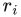波动，就可能产生不必要的跳变，细节层次可能快速来回切换。可以通过在附近引入一定滞回解决这一问题[898, 1508]。图19.35以基于距离范围的LOD展示了这种方法，但它适用于任何类型。这里，只有当r增加时才使用上排LOD范围；当r减小时，使用下排范围。


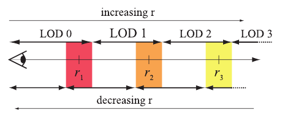

图19.35：着色区域表示LOD技术中的滞回区间。

图19.36展示了在过渡区间混合两个LOD的做法。不过，这并不理想，因为物体的距离可能长时间停留在过渡区间内，使混合两个LOD带来的渲染负担持续增加。Mittring [1227]则在物体到达某个过渡区间时，在有限的一段时间内完成LOD切换。为获得最佳结果，应将其与上述滞回方法结合。


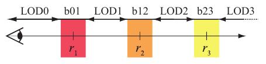

图19.36：着色区域表示在两个最邻近LOD之间进行混合的距离范围。例如，b01表示LOD0与LOD1之间的混合，LOD k则表示在相应范围内仅渲染LOD k。

#### 基于投影面积

另一种常见的LOD选择度量是包围体的投影面积，或其估计值。这里将介绍如何在透视观察下，估计球体和盒体的该面积所占像素数，即屏幕空间覆盖量。

先从球体开始。估计基于这样一个事实：物体沿观察方向到观察者的距离越大，其投影尺寸越小。图19.37展示了这一点：距离加倍时，投影尺寸减半，这对正对观察者的平面物体成立。我们用中心点**c**和半径r定义一个球体。观察者位于**v**，沿单位方向向量**d**观察。沿观察方向从**c**到**v**的距离，就是球心在观察向量上的投影：**d** · (**v** − **c**)。还假设观察者到视锥体近平面的距离为n。估计中使用近平面，是为了让位于近平面上的物体返回其原始尺寸。球体投影半径的估计值于是为


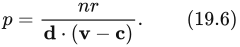


因此，以像素计的投影面积为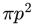wh，其中w × h是屏幕分辨率。较大的值会选择细节更多的LOD。这只是近似。实际上，三维球体的投影是椭圆，Mara和McGuire [1122]对此作了展示。他们还推导出一种计算保守包围多边形的方法，即使球体与近平面相交也能使用。

> 译注：原文将**d**定义为观察方向，却将投影距离写成**d** · (**v** − **c**)。按通常“从观察者指向前方”的方向约定，前方球心的正距离应为**d** · (**c** − **v**)。本译文保留原文及式（19.6）的符号，不作暗改；投影面积的尺度归一化也照原文保留。


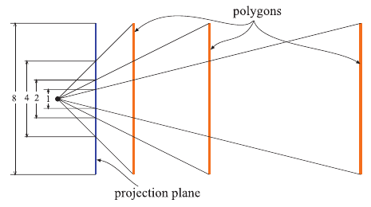

图19.37：这幅图展示了没有厚度的物体在距离加倍时，投影尺寸如何减半。

常见做法是直接使用物体包围盒外的包围球。另一种估计方式是使用包围盒在屏幕上的边界。不过，细长或扁平物体实际覆盖的投影面积可能差异很大。例如，想象一根意大利面条，一端位于屏幕左上角，另一端位于右下角。它的包围球会覆盖整个屏幕，其包围盒的二维屏幕最小、最大边界也同样覆盖整个屏幕。

Schmalstieg和Tobler [1569]给出了一个快速计算盒体投影面积的程序。其思想是根据相机视点相对于盒体的位置进行分类，并利用分类结果确定哪些投影顶点属于盒体投影的轮廓。这通过查找表完成。利用这些顶点，就可以计算视野中的面积。分类主要分为三种情况，如图19.38所示。实际操作中，通过判断视点位于包围盒各平面的哪一侧来分类。为提高效率，将视点变换到盒体坐标系中，这样分类只需要比较操作。比较结果放入一个位掩码，并用它作为查找表（LUT）的索引。这个LUT确定从视点看去，轮廓中有多少个顶点。然后再进行一次查找，得到实际的轮廓顶点。将它们投影到屏幕后，就可以计算轮廓面积。为避免有时相当严重的估计误差，值得将形成的多边形裁剪到视锥体侧面之内。网上可以获得源代码。Lengyel [1026]给出了这种方案的一项优化，使用更紧凑的LUT。


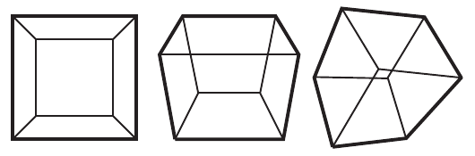

图19.38：立方体投影的三种情况，从左到右分别显示一个、两个和三个正面。轮廓分别由四个、六个和六个顶点构成，对所形成的每个多边形计算其轮廓面积。（示意图依据Schmalstieg和Tobler [1569]。）

仅依据距离或投影来选择LOD并不总是好主意。例如，一个物体具有某个轴对齐包围盒（AABB），其中既有一些大三角形，也有一些小三角形；小三角形可能产生严重走样，并因四像素组过度着色而降低性能。如果另一个物体具有完全相同的AABB，但包含的是中等和较大的三角形，那么基于距离范围和基于投影的选择方法都会选出相同的LOD。为避免这种情况，Schulz和Mader [1590]使用几何平均数g辅助选择LOD：


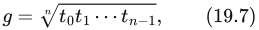


其中是物体各三角形的大小。使用几何平均数而不是算术平均数（平均值）的原因是，即使存在少数大三角形，大量小三角形也会使g变小。这个值针对最高分辨率模型离线计算，并用于预先计算第一次切换应发生的距离。后续切换距离是第一次距离的简单函数。这使他们的系统能够更频繁地使用较低LOD，从而提高性能。

另一种方法是计算每个离散LOD的几何误差，即估计简化模型相对于原始模型的最大偏离有多少米。然后将这一距离投影，以确定使用该LOD在屏幕空间中的影响。接着选择满足用户定义屏幕空间误差要求的最低LOD。

#### 其他选择方法

基于距离范围和基于投影面积的LOD选择，通常是最常见的度量。不过还存在许多其他可能，这里介绍几种。除投影面积外，Funkhouser和Séquin [508]还建议使用物体的重要性（例如，墙壁比墙上的时钟更重要）、运动、滞回（切换LOD时，降低收益）和注意焦点。最后一项，即观察者注意力的焦点，可能是重要因素。例如，在体育游戏中，控制球的角色是用户最关注的地方，因此其他角色可以使用相对较低的细节层次[898]。类似地，虚拟现实应用使用眼动追踪时，应在观察者注视的位置使用较高LOD。

根据应用不同，其他策略也可能有效。可以使用整体可见程度，例如透过浓密枝叶看到的近处物体可以使用较低LOD渲染。也可以采用更全局的度量，例如限制使用的高细节LOD总数，使其不超过给定三角形预算[898]。有关这一主题的更多内容见下一节。其他因素包括可见性、颜色和纹理。还可以使用感知度量来选择LOD [1468]。

McAuley [1154]介绍了一个植被系统，其中树干和叶片簇在变为替身图像之前具有三个LOD。他为每个物体预处理不同视点、不同距离下簇之间的可见性。由于树木背面的簇可能被较近的簇遮住很多，因此即使树木很近，也可以为这些簇选择较低LOD。对于草地渲染，常见做法是观察者附近使用几何，稍远处使用公告板，很远处使用简单的地面纹理[1352]。

### 19.9.3 有严格时间限制的LOD渲染

恒定帧率通常是渲染系统的一项理想特性。实际上，这通常被称为“硬实时”或有严格时间限制的渲染。这样的系统被分配特定时间，例如16毫秒，必须在这段时间内完成任务（例如渲染图像）。时间耗尽时，系统就必须停止处理。在硬实时渲染系统中，如果场景物体由LOD表示，那么相较于在分配时间内只绘制少量高度精细的模型，它能够在每帧向用户显示更多乃至全部场景。

Funkhouser和Séquin [508]提出了一种启发式算法，通过调整场景中所有可见物体的细节层次选择，满足恒定帧率的要求。这个算法是预测式的，因为它根据期望帧率和哪些物体可见来选择可见物体的LOD。与之相对的是反应式算法，它根据上一帧渲染所花的时间作出选择。

将物体记为O，渲染它的细节层次记为L，于是物体的每个LOD可以表示为(O, L)。然后定义两个启发式量。一个估计以某细节层次渲染物体的开销：Cost(O, L)。另一个估计以某细节层次渲染物体的收益：Benefit(O, L)。收益函数估计某个LOD物体对图像的贡献。

假设位于视锥体内部或与之相交的物体集合记为S。算法的核心思想是利用启发式选取的函数，优化S中物体的LOD选择。具体来说，我们希望最大化


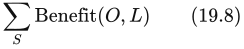


同时满足约束


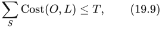


其中T为目标帧时间。

换句话说，我们希望为物体选择恰当的细节层次，以在期望帧率内获得“最佳图像”。下面先介绍如何估计开销函数和收益函数，再给出上述方程的优化算法。

开销函数和收益函数都很难定义得在所有情况下都有效。可以在不同观察参数下，多次测量某个LOD的渲染时间，以估计开销函数。不同收益函数见第19.9.2节。实际中，物体包围体（BV）的投影面积可能就足以作为收益函数。

最后，讨论如何为场景中的物体选择细节层次。首先注意：对某些视点，场景可能过于复杂，无法维持期望帧率。为解决这一问题，可以为每个物体定义一个最低细节层次的LOD，它只是一个没有任何图元的物体，也就是不渲染该物体[508]。利用这个技巧，我们只渲染最重要的物体，跳过不重要的物体。

要为场景选择“最佳”LOD，必须在式（19.9）约束下优化式（19.8）。这是一个NP完全问题，意味着要正确求解，唯一的办法是测试所有不同组合并选出最佳者。显然，对任何实际算法来说这都不可行。一种更简单、更可行的方法，是使用贪心算法，尝试对每个物体最大化Value = Benefit(O, L) / Cost(O, L)。该算法处理视锥体内的全部物体，按价值降序选择要渲染的物体，也就是价值最高者优先。如果某个物体的多个LOD具有相同价值，就选择并渲染收益最高的LOD。这种方法能获得最多的“单位投入回报”。对于视锥体内的n个物体，算法运行时间为O(n log n)，得到的解至少具有最优解一半的质量[507, 508]。也可以利用帧间连贯性加速价值排序。

> 译注：上段关于NP完全问题“唯一的办法是测试所有不同组合”的表述为原书说法，按原意保留；NP完全性本身不表示所有实例都只能穷举。

有关LOD管理，以及LOD管理与入口剔除结合的更多内容，可参阅Funkhouser的博士论文[507]。Maciel和Shirley [1097]将LOD与替身图像结合，提出一种近似恒定时间的室外场景渲染算法。总体思想是使用物体不同表示的层级结构，例如一组LOD和分层替身图像，然后以某种方式遍历树，以便在给定时间内产生最佳图像。Mason和Blake [1134]提出了一种增量式分层LOD选择算法。同样，物体的不同表示可以是任意的。Eriksson等人[441]提出了分层细节层次（HLOD）。使用它们，也可以以恒定帧率渲染场景，或者在渲染误差受限的条件下渲染。与此相关的是功耗预算下的渲染。Wang等人[1843]提出了一个优化框架，选择合适的参数以降低功耗，这对于手机和平板电脑非常重要。

另一组适用于静态模型的技术也与严格时间限制渲染有关。当相机不动时，渲染完整模型，并可使用累积缓冲进行抗锯齿、景深和软阴影处理，通过渐进方式更新。然而，当相机移动时，可以降低全部物体的细节层次，并使用细节剔除完全剔除小物体，以达到某个帧率。


## 19.10 大规模场景渲染

来源：《Real-Time Rendering, Fourth Edition》，书页 866—879（PDF 物理页 887—900）；从本节标题开始，至“Further Reading and Resources”之前。章末延伸阅读另存。本节保留原书出版时的技术陈述。

到目前为止，我们一直隐含地假定待渲染场景能够放入计算机的主存，但实际情况未必如此。例如，某些游戏主机只有 8 GB 内部内存，而某些游戏世界可能包含数百 GB 数据。因此，本节介绍纹理的流式传输与转码方法、一些通用流式传输技术，最后介绍地形渲染算法。注意，这些方法几乎总是与本章前面介绍的剔除技术和细节层次方法结合使用。

### 19.10.1 虚拟纹理与流式传输

设想为了渲染一个巨大的地形数据集，你想使用一张分辨率极高的纹理，而它大到无法放入 GPU 内存。例如，游戏《RAGE》中的某些虚拟纹理分辨率为 128k × 128k，需要占用 64 GB GPU 内存 [1309]。当 CPU 一侧的内存有限时，操作系统使用虚拟内存来管理内存，按需将数据从驱动器换入 CPU 内存 [715]。稀疏纹理（sparse textures）[109, 248] 提供了类似功能，使分配巨大虚拟纹理成为可能；这种纹理也称为巨型纹理（megatexture）。这一组技术有时称为虚拟纹理技术（virtual texturing），或部分驻留纹理技术（partially resident texturing）。应用程序决定每个 mipmap 层级中的哪些区域（图块）应驻留在 GPU 内存中。一个图块通常为 64 kB，其纹理分辨率取决于纹理格式。这里介绍虚拟纹理与流式传输技术。

对于使用 mipmapping 的高效纹理系统，关键观察是：理想情况下，所需纹素数量应正比于最终渲染图像的分辨率，而与纹理自身的分辨率无关。因此，我们只要求可见纹素位于物理 GPU 内存中。与整个游戏世界的全部纹素相比，这个集合相当有限。图 19.39 展示了主要概念：整个 mipmap 链在虚拟内存和物理内存中都被划分成图块。这些结构有时称为虚拟 mipmap 或 clipmap [1739]，后一个术语表示从较大的 mipmap 中裁出较小部分供使用。物理内存远小于虚拟内存，因此只能容纳虚拟纹理图块中的一小部分。几何体通过全局 uv 参数化映射到虚拟纹理。在像素着色器使用这样的 uv 坐标之前，必须先将其转换为指向物理纹理内存的纹理坐标。这一转换可以通过 GPU 支持的页表（图 19.39）完成；若以 GPU 上的软件方式实现，则使用间接寻址纹理。任天堂 GameCube 的 GPU 已支持虚拟纹理。较近时期的 PLAYSTATION 4、Xbox One 以及许多其他 GPU，也支持硬件虚拟纹理。图块映射到物理内存或解除映射时，需要用正确的偏移量更新间接寻址纹理。使用巨大虚拟纹理和小型物理纹理之所以有效，是因为远处几何体只需将少量较高层级的 mipmap 图块载入物理内存，而靠近相机的几何体可以载入少量较低层级的 mipmap 图块。注意，虚拟纹理不仅可用于从磁盘流式传输巨大纹理，还可用于稀疏阴影映射 [241] 等。


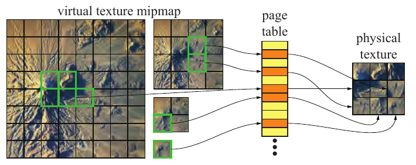

图 19.39：在虚拟纹理技术中，大型虚拟纹理及其 mipmap 层次结构被划分为图块（左），例如每块 128 × 128 像素。物理内存（右）只能容纳其中很少一部分，本例为 3 × 3 个图块。要找到虚拟纹理图块的位置，必须将虚拟地址转换成物理地址；这里通过页表完成。注意，为减少图面杂乱，并未给物理内存中的所有图块都画出来自虚拟纹理的箭头。（纹理图像为伊朗巴兹曼火山，来自 NASA 的“Visible Earth”项目。）

由于物理内存有限，所有采用虚拟纹理的引擎都需要一种方法，确定哪些图块应该驻留，即位于物理内存中，哪些不应该驻留。这类方法有多种。Sugden 和 Iwanicki [1721] 使用反馈渲染：第一次渲染通道写出确定片元将访问哪个纹理图块所需的全部信息。完成该通道后，将纹理回读至 CPU 并分析，以找出需要的图块。读取尚未驻留的图块并映射到物理内存，同时解除物理内存中不再需要的图块的映射。他们的方法不适用于阴影、反射和透明效果。不过，透明效果可以使用纱门技术（第 5.5 节），其效果相当不错。van Waveren 和 Hart [1855] 也使用反馈渲染。注意，这种通道既可单独执行，也可与 z 预通道合并。单独执行时，可以用仅 80 × 60 像素的分辨率进行近似，以减少处理时间。Hollemeersch 等人 [761] 使用计算通道，替代将反馈缓冲回读至 CPU 的做法。其结果是在 GPU 上生成一个紧凑的图块标识符列表，再发送回 CPU 进行映射。

当 GPU 支持虚拟纹理时，驱动程序负责创建和销毁资源、映射和解除映射图块，并确保物理分配具有对应的虚拟分配作为支撑 [1605]。在 GPU 硬件虚拟纹理中，一次 `sparseTexture` 查询除了返回过滤后的数值（对于驻留图块），还返回一个代码，表明相应图块是否驻留 [1605]。对于软件支持的虚拟纹理，这些任务都由开发者负责。有关该主题的更多信息，可参阅 van Waveren 的报告 [1856]。


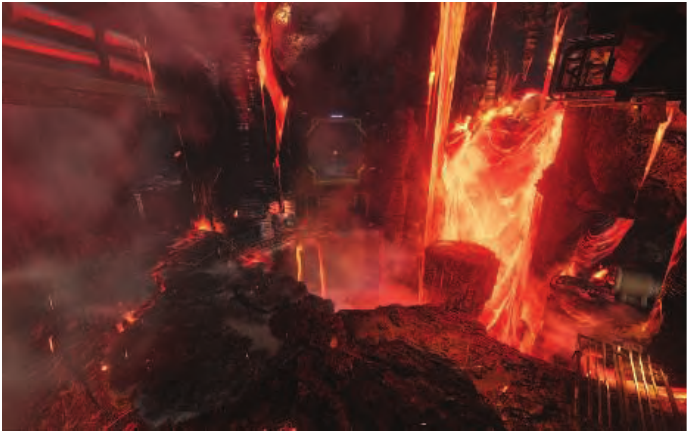

图 19.40：《DOOM》（2016）利用纹理流式传输访问庞大图像数据库，实现高分辨率纹理映射。（图像来自游戏《DOOM》，由 id Software 提供。）

为了确保全部所需内容能够放入物理内存，van Waveren 调整一个全局纹理 LOD 偏置，直到工作集能够容纳为止 [1854]。此外，如果当前只有比所需层级更高的 mipmap 图块可用，就必须先使用这个较高层级图块，直到较低层级图块准备好。在这种情况下，可以立即放大较高层级图块并使用它；当新图块可用时，再随时间逐渐将其混入，实现平滑过渡。

Barb [99] 则始终加载所有大小不超过 64 kB 的纹理。因此，总能进行某种程度的纹理映射；只是当较高分辨率的 mipmap 层级尚未载入时，质量会低一些。他采用离线反馈渲染，在标称纹理分辨率和屏幕分辨率下，针对不同位置，预计算每种材质的各个 mipmap 层级在玩家周围覆盖多大的立体角。运行时，流式载入这些信息，并根据使用该材质的每张纹理的分辨率，以及最终屏幕分辨率进行调整。由此得到每张纹理、每个 mipmap 层级的重要性值。随后将每个重要性值除以相应 mipmap 层级的纹素数量，得到一个合理的最终度量；即使将纹理细分为更小、映射完全相同的纹理，该度量也保持不变。更多信息见 Barb 的演讲 [99]。图 19.40 展示了渲染示例。

Widmark [1881] 描述了如何将流式传输与程序化纹理生成相结合，以产生更丰富、细节更多的纹理。Chen 扩展了 Widmark 的方案，使其能够处理大一个数量级的纹理 [259]。

### 19.10.2 纹理转码


图 19.41：一个使用虚拟纹理和转码的纹理流式传输系统。（示意图依据 van Waveren 和 Hart [1855]。）

为了让虚拟纹理系统工作得更好，可以将其与转码（transcoding）结合。转码是指从磁盘读取通常采用 JPEG 等可变码率压缩方案压缩的图像，对其解码，再使用一种 GPU 支持的纹理压缩方案（第 6.2.6 节）重新编码。图 19.41 展示了这样的系统。反馈渲染通道的目的是确定当前帧需要哪些图块；这里可以使用第 19.10.1 节介绍的任一种方法。获取步骤通过存储层次取得数据：从光学存储设备或硬盘驱动器（HDD）出发，经过可选的磁盘缓存，再经过由软件管理的内存缓存。解除映射是指释放一个驻留图块的分配。读入新数据后，对其转码，最后映射到新的驻留图块。

转码的优点在于：纹理数据存储在磁盘上时可采用更高的压缩比，而通过纹理采样器访问纹理数据时，使用的是 GPU 支持的纹理压缩格式。这要求可变码率压缩格式能够快速解压，也要求能够快速压缩为 GPU 支持的格式 [1851]。也可以对已经压缩的纹理再压缩，以进一步缩小文件 [1717]。这样做的优点是，从磁盘读入纹理并解压后，它已经处于 GPU 可以直接使用的纹理压缩格式。提供免费源代码的 crunch 库 [523] 使用类似方法，能够达到每纹素 1—2 位。图 19.42 给出示例。其后继者 basis 是一种对块使用可变位数压缩的专有格式，能够快速转码为纹理压缩格式 [792]。目前已有在 GPU 上快速压缩为 BC1/BC4 [1376]、BC6H/BC7 [933, 935, 1259] 和 PVRTC [934] 的方法。Sugden 和 Iwanicki [1721] 使用 Malvar 压缩方案 [1113] 的一种变体，在磁盘上实现可变码率压缩。对于法线，他们达到 40∶1 的压缩比；对于反照率纹理，借助 YCoCg 变换（书页 197 的公式 6.6）达到 60∶1。Khronos 正在制定标准的通用纹理压缩文件格式。


图 19.42：转码质量示例。从左至右：原始鹦鹉图像的一部分、原图眼睛部位的放大图（每像素 24 位）、ETC 压缩图像（每像素 4 位），以及经 crunch 压缩的 ETC 图像（每像素 1.21 位）。（图像由 Unity 压缩。）

当要求较高纹理质量、又需要较短纹理加载时间时，Olano 等人 [1321] 使用可变码率压缩算法，将压缩纹理存储在磁盘上。纹理在 GPU 内存中也保持压缩状态，直到需要使用；届时 GPU 使用自己的算法解压，随后以未压缩形式使用。

### 19.10.3 通用流式传输

在游戏或其他实时渲染应用中，如果模型大于物理内存，那么实际几何体、脚本、粒子以及 AI 等也需要流式传输系统。使用正凸多边形铺满一个平面时，可以选择正三角形、正方形或正六边形。因此，它们也是流式传输系统常用的构建单元，每个多边形与其内部的全部资源关联。图 19.43 展示了这一点。需要指出，正方形和正六边形最常用 [134, 1522]，可能是因为它们的直接邻居比三角形少。观察者位于图 19.43 中深蓝色多边形内，流式传输系统确保直接相邻的多边形（浅蓝色和绿色）已载入内存。这样既能确保周围几何体可供渲染，也能保证观察者进入相邻多边形时，数据已经存在。注意，三角形和正方形有两类邻居：共用一条边的邻居，以及仅共用一个顶点的邻居。


图 19.43：使用正三角形（左）、正方形（中）和正六边形（右）铺满二维平面。铺砌通常叠加在游戏世界的俯视图上，多边形内所有资源均与该多边形关联。假设观察者位于深蓝色多边形内，相邻多边形的资源也会被加载。

Ruskin [1522] 使用六边形，每个六边形都有一个低分辨率和一个高分辨率几何 LOD。由于低分辨率 LOD 占用内存很少，整个世界的低分辨率 LOD 始终全部保持加载。因此，只有高分辨率 LOD 和纹理在内存中流式载入与移出。Bentley [134] 使用正方形，每个正方形覆盖 100 × 100  的区域。高分辨率 mipmap 与其他资源分开进行流式传输。该系统在近距离至中距离使用 1—3 个 LOD，而远距离使用烘焙的替身图像。对于赛车游戏，Tector [1753] 则随着车辆前进沿赛道加载数据。他使用 zip 格式将数据压缩后存储在磁盘上，再将数据块加载至一个保存压缩数据的软件缓存。之后按需解压这些块，供 CPU 和 GPU 的存储层次使用。

在某些应用中，可能需要铺满三维空间，而不能只采用上面描述的二维铺砌。注意，立方体是唯一也能铺满三维空间的正多面体，因此是这类应用的自然选择。

### 19.10.4 地形渲染

地形渲染是许多游戏和应用的重要组成部分，例如 Google Earth，以及用于大世界渲染的开源引擎 Cesium [299, 300]。图 19.44 给出一个示例。我们将介绍几种在当前 GPU 上表现良好的常用方法。注意，这些方法都可以加入分形噪声，从而在放大地形时提供丰富细节。此外，许多系统会在加载游戏或关卡时，即时以程序化方式生成地形。


图 19.44：通过航空摄影测量采集的钱伯林山地形，地形分辨率为 50 cm，影像分辨率为 25 cm。（图像由 Cesium 和 Fairbanks Fodar 提供。）

其中一种方法是几何 clipmap [1078]。它与纹理 clipmap [1739] 类似，使用与 mipmapping 相关的层次结构，即将几何体过滤成一个金字塔，越靠近顶部，层级越粗。图 19.45 展示了这一结构。渲染巨大地形数据集时，每个层级只在内存中缓存观察者周围 n × n 个样本，即高度值。观察者移动时，图 19.45 中的窗口随之移动，加载新数据，并可能逐出旧数据。为了避免层级之间出现裂缝，每两个相邻层级之间都设置一个过渡区域。在这样的过渡区域中，几何体和纹理都平滑插值到下一个更粗层级。这通过顶点着色器和像素着色器实现。Asirvatham 和 Hoppe [82] 提出了一种高效的 GPU 实现，将地形数据存储为顶点纹理。顶点着色器访问这些纹理，以获取地形高度。可以使用法线贴图增强地形的视觉细节；在近距离放大时，Losasso 和 Hoppe [1078] 还加入分形噪声位移，以补充更多细节。图 19.46 给出示例。Gollent 在《巫师 3》中使用了几何 clipmap 的一种变体 [555]。Pangerl [1348] 和 Torchelsen 等人 [1777] 提供了相关的几何 clipmap 方法，它们同样适合 GPU 的能力。


图 19.45：左：几何 clipmap 结构，在每个分辨率层级缓存大小相同的正方形窗口。右：几何体的俯视图，观察者位于中央的紫色区域。注意，最精细的层级渲染其整个正方形，而其他层级内部是空的。（示意图依据 Asirvatham 和 Hoppe [82]。）


图 19.46：几何 clipmapping。左：线框渲染，不同 mipmap 层级清晰可见。右：蓝色过渡区域表明层级之间发生插值的位置。（图像由 Microsoft 的“Rendering of Terrains Using Geometry Clipmaps”程序生成。）

若干方案着重于创建并渲染图块。一种做法是将高度场数组划分成图块，例如每块包含 17 × 17 个顶点。对于高细节视图，可以渲染整个图块，而不是向 GPU 发送单个三角形或小型三角扇。图块可以具有多个细节层次。例如，在每个方向上每隔一个顶点取一个，可以形成 9 × 9 的图块；每隔四个顶点取一个，得到 5 × 5 的图块；每隔八个取一个，得到 2 × 2；最后只保留四个角点，得到由两个三角形构成的 1 × 1 图块。注意，原始 17 × 17 顶点缓冲可以存储在 GPU 上并复用；只需提供不同的索引缓冲，就能改变渲染的三角形数量。下面介绍一种使用这种数据布局的方法。

> 译注：原文在此混用了顶点数与网格单元数。对每边 17 个顶点的网格按步长 8 采样，应得到每边 3 个顶点、2 个单元；仅保留四角时则为 2 × 2 个顶点、1 × 1 个单元。正文保留原书给出的 2 × 2 和 1 × 1，避免静默改写。

另一种在 GPU 上快速渲染大型地形的方法称为分块 LOD（chunked LOD）[1797]。其思想是用 n 个离散细节层次表示地形，每个更精细的 LOD 相对于父级分成 4 块，如图 19.47 所示。随后将此结构编码为四叉树，并从根节点开始遍历以进行渲染。访问一个节点时，如果其屏幕空间误差（下面介绍）低于某个像素误差阈值 τ，就渲染该节点；否则，递归访问四个子节点。由此可在需要的地方，例如观察者附近，获得更高分辨率。在更高级的变体中，地形四边形块按需从磁盘加载 [1605, 1797]。遍历与上述方法类似，但只有子节点已经从磁盘加载到内存时，才递归访问它们。如果尚未加载，就将它们加入加载队列，同时渲染当前节点。


图 19.47：地形的分块 LOD 表示。（图像由 Thatcher Ulrich 提供。）

Ulrich [1797] 将屏幕空间误差计算为


其中 w 为屏幕宽度，d 为相机到地形图块的距离，θ 为以弧度表示的水平视场角，ε 为与 d 使用相同单位的几何误差。几何误差项通常使用两个网格之间的 Hausdorff 距离 [906, 1605]。对于原始网格上的每个点，找到简化网格上距离它最近的点，并将这些距离中的最小值记为 。然后对简化网格上的每个点执行相同步骤，找出原始网格上距离它最近的点，并将这些距离的最小值记为 。Hausdorff 距离为 。图 19.48 展示了这一点。注意，简化网格上距离 o 最近的点为 s，而原始网格上距离 s 最近的点为 a；这就是必须按两个方向测量的原因，即从原始网格到简化网格，以及反方向。直观地说，Hausdorff 距离就是用简化网格替代原始网格时产生的误差。如果应用无法承担计算 Hausdorff 距离的开销，可以为每种简化手动调整一个常量，或者在简化过程中求出误差 [1605]。

> 译注：原文上述两处确实写作“smallest”（最小值），与 Hausdorff 距离定义不符。应先对每个点求到另一网格的最短距离，再在这些最短距离中取最大值，分别得到两个方向的 、，最后取二者最大值。正文保留原文措辞，供与原页核对。

为了避免从一个 LOD 切换到另一个时发生跳变，Ulrich [1797] 提出一种简单的变形技术：将高分辨率图块中的顶点 (x, y, z)，与从父图块近似得到的顶点 (x, y′, z) 进行线性插值；该近似可使用双线性插值等方法。线性插值因子计算为 2sτ − 1，并钳制到 [0, 1]。注意，变形期间只需要较高分辨率图块，因为下一较低分辨率图块的顶点也包含在较高分辨率图块中。

> 译注：原页插值因子印为 2sτ − 1，正文照录。若按前文 s 为屏幕像素误差、τ 为像素误差阈值，且希望在 s 从 τ/2 到 τ 时将因子从 0 变为 1，则应使用 2s/τ − 1；原式疑有排印错误。


图 19.48：原始网格与简化网格之间的 Hausdorff 距离。（示意图依据 Sellers 等人 [1605]。）


图 19.49：使用 Strugar [1720] 的分块 LOD 系统避免裂缝。左上为较高分辨率图块，它逐渐变形为右上的较低分辨率地形图块。中间展示了两个经过插值和变形的中间状态。实际过程中，随着 LOD 改变，这一变化平滑发生，如下方截图所示。（下图由 Filip Strugar 的程序 [1720] 生成。）

可以使用公式 19.10 之类的启发式方法，决定每个图块采用的细节层次。分块方案的主要挑战是修补裂缝。例如，一个图块的分辨率为 33 × 33，相邻图块为 9 × 9，它们相接的边缘就会产生裂缝。一种修正措施是移除边缘上高细节的三角形，再构造若干组三角形，正确连接两个图块之间的间隙 [324, 1670]。两个相邻区域的细节层次不同时，就会出现裂缝。Ulrich 描述了一种使用额外带状几何体的方法；当 τ 设为小于 5 像素时，这是合理的解决办法。Cozzi 和 Bagnell [300] 则使用屏幕空间后处理通道填补裂缝，利用高斯核对裂缝周围而非裂缝内部的片元加权。Strugar [1720] 提供了一种巧妙的裂缝避免方法，无须屏幕空间方法或额外几何体。图 19.49 展示了该方法，它可以通过一个简单的顶点着色器实现。

为提高性能，Sellers 等人 [1605] 将分块 LOD 与视锥体剔除、地平线剔除相结合。Kang 等人 [852] 提出了一种与分块 LOD 类似的方案，最大的区别是利用 GPU 曲面细分来细分节点，并确保边缘曲面细分因子匹配，从而避免裂缝。他们还展示了如何利用带有特征保持映射的几何图像，渲染具有悬垂部分的地形；基于高度场的地形无法处理这种形状。Strugar [1720] 提出了分块 LOD 方案的一种扩展，使三角形分布更好、更灵活。Ulrich 的方法为每个节点使用一个 LOD，而 Strugar 使用逐顶点变形，每个顶点具有各自的细节层次。虽然他只使用距离作为确定 LOD 的度量，但也可以使用其他因素，例如邻域中的深度变化幅度，从而生成更好的轮廓。

原始地形数据通常由均匀高度场网格表示。可以对这些数据采用与视点无关的简化方法，如书页 705 的图 16.16 所示。不断简化模型，直到达到某个限制条件 [514]。细小的表面细节可以由颜色纹理或凹凸贴图捕获。生成的静态网格通常称为不规则三角网（triangulated irregular network，TIN）；当地形范围较小、各区域相对平坦时，这是一种有用的表示 [1818]。

Andersson [40] 使用受限四叉树连接间隙，并减少大型地形所需的绘制调用总数。他使用图块四叉树，替代以不同分辨率渲染的均匀图块网格。每个图块都有相同的基础分辨率 33 × 33，但覆盖的面积可以不同。受限四叉树的思想是，每个图块与其邻居的细节层次之差不能超过一级。见图 19.50。这一限制意味着，相邻图块分辨率不同的情形只有有限种。该方法不先产生间隙、再用额外索引缓冲进行绘制来填补，而是存储所有可能的索引缓冲组合，使构成图块的三角形已经包含间隙过渡三角形。每个索引缓冲由全分辨率边（每边 33 个顶点）和较低细节层次的边构成；由于四叉树受限，后者每边只有 17 个顶点。图 19.51 给出了这种现代地形渲染的示例。Widmark [1881] 描述了 Frostbite 2 引擎使用的完整地形渲染系统。它具有许多实用功能，例如贴花、水体、地形装饰、使用美术人员生成或程序化生成的遮罩来组合不同材质着色器 [40]，以及程序化地形位移。


图 19.50：地形图块的受限四叉树，其中每个图块只能与细节层次最多高一级或低一级的图块相邻。每个图块有 5 × 5 个顶点；左上角则由 2 × 2 个较高分辨率图块组成。其余地形由三个较低分辨率图块填充。左图中，左上方图块边缘上的一些顶点，与相邻较低分辨率图块的顶点不匹配，会造成裂缝。右图修改了较高细节图块的边缘，避免这一问题。每个图块都通过一次绘制调用渲染。（示意图依据 Andersson [40]。）


图 19.51：实际运行中的多细节层次地形渲染。（由 DICE 提供，© 2016 Electronic Arts Inc.）

一种可用于海洋渲染的简单技术是使用均匀网格，每帧将其变换到相机空间 [749]，如图 19.52 所示。Bowles [186] 提供了许多克服某些质量问题的技巧。


图 19.52：左：均匀网格。右：变换到相机空间后的网格。注意，变换后的网格能够在靠近观察者的位置提供更高细节。

上述地形技术通常旨在减少任意时刻必须保留在内存中的数据量；除此之外，还可以使用压缩技术。Yusov [1956] 借助四叉树数据结构压缩顶点，使用一种简单的预测方案，仅对差值编码，并使用少量位。Schneider 和 Westermann [1573] 使用由顶点着色器解码的压缩格式，并研究在细节层次间进行几何变形，同时尽量提高缓存一致性。Lindstrom 和 Cohen [1051] 使用带线性预测和残差编码的流式编解码器，实现无损压缩。此外，他们还通过量化进一步提高压缩率，但此时结果就变为有损。解压可在 GPU 上完成，压缩比为 3∶1 至 12∶1。

地形渲染还有许多其他方法。Kloetzli [909] 在《文明 V》中使用自定义计算着色器，为地形创建自适应细分，再将结果送入 GPU 渲染。另一种技术是使用 GPU 的曲面细分器，对每个面片处理曲面细分 [466]。注意，许多地形渲染技术也可用于水体渲染。例如，Gonzalez-Ochoa 和 Holder [560] 在《神秘海域 3》中使用了针对水体调整的几何 clipmap 变体。他们通过在层级之间动态添加三角形来避免 T 形接点。随着 GPU 发展，这个主题的研究仍将继续。


## 19.99 延伸阅读与资源

来源：《Real-Time Rendering, Fourth Edition》，第 19 章章末“Further Reading and Resources”，书页 879（PDF 物理页 900）；并检查 PDF 物理页 901 的未编号尾页。19.99 为译文文件的整理编号，原书此标题未编号。

Ericson 的书 [435] 虽然主要讨论碰撞检测，但也包含与各种空间划分方案的构造和使用相关的内容。

关于遮挡剔除，已有丰富文献。若想了解早期算法研究，Cohen-Or 等人 [277] 和 Durand [398] 的可见性综述是两个很好的起点。Aila 和 Miettinen [13] 描述了一种面向动态场景的商用剔除系统架构。Nießner 等人 [1283] 综述了针对位移细分曲面的现有背向面片剔除、视锥体剔除和遮挡剔除方法。了解 LOD 使用方法的一部有价值资料，是 Luebke 等人的《Level of Detail for 3D Graphics》（《三维图形的细节层次》）[1092]。

Dietrich 等人 [352] 概述了海量模型渲染领域的研究。Gobbetti 等人 [547] 也提供了一篇出色的海量模型渲染综述。Sellers 等人 [1605] 的 SIGGRAPH 课程是较新的资料，内容非常优秀。Cozzi 和 Ring 的书 [299] 介绍了地形渲染、大规模数据集管理技术，以及处理精度问题的方法。Cesium 博客 [244] 提供了许多实现细节，以及用于大世界与地形渲染的其他加速技术。

原书下一张未编号尾页（PDF 物理页 901）仅印有出版社标志及文字：“Taylor & Francis”（泰勒与弗朗西斯）、“Taylor & Francis Group”（泰勒与弗朗西斯集团），以及网址 http://taylorandfrancis.com；没有其他章节正文。
