# Real-Time Rendering 第20章 高效着色 中文合集

> 依据用户提供的《Real-Time Rendering》第四版 PDF 完整翻译。原图配中文图注；复杂数学已排版为本地图片，简单符号直接显示。保留原书技术年代、公式编号与引用编号。

## 目录

- [20.1 延迟着色](<Real-Time_Rendering_4th_中文/第20章/20.01.md>)

- [20.2 贴花渲染](<Real-Time_Rendering_4th_中文/第20章/20.02.md>)

- [20.3 分块着色](<Real-Time_Rendering_4th_中文/第20章/20.03.md>)

- [20.4 聚簇着色](<Real-Time_Rendering_4th_中文/第20章/20.04.md>)

- [20.5 延迟纹理处理](<Real-Time_Rendering_4th_中文/第20章/20.05.md>)

- [20.6 物体空间与纹理空间着色](<Real-Time_Rendering_4th_中文/第20章/20.06.md>)

## 章首导言

来源：《Real-Time Rendering, Fourth Edition》，书页 881—883（PDF 物理页 902—904）；本文件包含章首标题、题辞及 20.1 节之前的全部导言。

> “凡是后天做也一样能做好的事，千万别只推到明天。”
>
> ——马克·吐温

对于简单场景，也就是几何体相对较少、材质基本、光源不多的场景，我们可以使用标准 GPU 流水线渲染图像，不必担心能否维持帧率。只有当一个或多个要素变得开销高昂时，我们才需要使用更复杂的技术来控制成本。上一章重点讨论了如何剔除三角形和网格，避免对其进行流水线下游的进一步处理。本章则着重介绍在计算材质和光源时降低成本的技术。其中许多方法需要额外的处理开销，希望由此节省的成本能够抵偿这些开销。另一些方法则在带宽与计算之间进行权衡，往往会改变瓶颈所在。与所有这类方案一样，哪一种最好，取决于硬件、场景结构以及许多其他因素。

对材质执行像素着色器可能十分昂贵。正如 19.9 节所述，可以通过各种着色器细节层次简化技术降低这一成本。当多个光源影响同一表面时，可以采用两种不同策略。一种是构建支持多个光源的着色器，这样只需一次通道。另一种是多通道着色：针对一个光源创建简单的单光源像素着色器并执行它，将每次得到的结果累加到帧缓冲中。因此，对于三个光源，我们会绘制图元三次，每次计算时更换光源。第二种方法的总体效率可能高于单通道系统，因为所用的每个着色器都更简单、更快。如果渲染器具有许多不同类型的光源，那么单通道像素着色器就必须包含所有类型，并检查每一种是否被使用，从而使着色器变得复杂。

在 18.4.5 节中，我们讨论了通过尽量减少或消除过度绘制来避免不必要的像素着色器计算。如果能够高效地确定某个表面对最终图像没有贡献，就能省去对它着色的时间。一种技术是执行 z 预通道：渲染不透明几何体，但只写入 z 深度。随后再次渲染几何体并执行完整着色，同时使用第一次通道的 z 缓冲剔除所有不可见片元。这种通道试图将“找出哪些几何体可见”的过程，与随后对这些几何体着色的操作解耦。将这两个过程分离的思想，是贯穿本章的重要概念，也被若干其他渲染方案采用。

例如，使用 z 预通道的一个问题是必须渲染几何体两次。相对于标准渲染，这是一项额外开销，所花的时间可能比节省的还多。如果网格是通过曲面细分、蒙皮或其他复杂过程生成的，那么新增通道的成本可能相当可观 [992, 1177]。对于使用 alpha 值进行镂空裁切的物体，每次通道都需要取得其纹理的 alpha 值，从而增加开销；或者，在第一个通道中完全忽略这些物体，只在第二个通道中渲染它们，但这样又可能浪费像素着色器计算。由于这些原因，有时初始通道只绘制较大的遮挡体，大小可以在屏幕空间或世界空间中衡量。其他屏幕空间效果，例如环境光遮蔽或反射，也可能需要执行完整的预通道 [1393]。本章介绍的某些加速技术需要准确的 z 预通道结果，随后用它来辅助剔除光源列表中的光源。

即使没有过度绘制，为可见表面计算大量动态光源也可能产生显著开销。假设场景中有 50 个光源。多通道系统能够成功渲染这个场景，但代价是每个物体要经过 50 次顶点处理与着色通道。一种降低成本的技术，是把每个局部光源的影响范围限制在某个半径的球体、某个高度的圆锥体，或其他有限形状之内 [668, 669, 1762, 1809]。其假设是，每个光源的贡献在超过一定距离后就会变得微不足道。在本章余下部分，我们将把光源体积统称为球体，同时应理解也可以使用其他形状。通常，光源强度是确定其半径的唯一因素。Karis [860] 讨论了为什么具有光泽镜面反射的材质会使这一半径增大：光源对这类表面的影响更加明显。对于极其光滑的表面，这一距离可能趋于无穷，此时可能需要改用环境贴图或其他技术。

一种简单的预处理方式，是为每个网格创建影响它的光源列表。可以把这个过程看作网格与光源之间的碰撞检测，找出可能与网格重叠的光源 [992]。对网格着色时使用这份列表，就能减少参与计算的光源数量。这类方法存在一些问题。如果物体或光源移动，这些变化就会影响列表的组成。为提高性能，共享相同材质的几何体经常被合并为较大的网格（18.4.2 节），这可能导致单个网格的列表中包含场景里的许多光源，甚至全部光源 [1327, 1330]。不过，也可以先合并网格，再按空间进行划分，以得到较短的列表 [1393]。

另一种方法是将静态光源烘焙到世界空间数据结构中。例如，《Just Cause 2》的光照系统使用世界空间中的俯视网格来存储场景光源信息。一个网格单元代表 4 米 × 4 米的区域。每个单元以 RGBα 纹理中的一个纹素存储，因此可以保存最多四个光源的列表。渲染一个像素时，取出它所在区域的列表，并应用相关光源 [1379]。缺点在于，对于影响某个区域的光源数量，存储空间有固定上限。这种方式虽然可能适用于精心设计的室外场景，但具有多层楼面的建筑很快就会超出这一存储方案的承受能力。

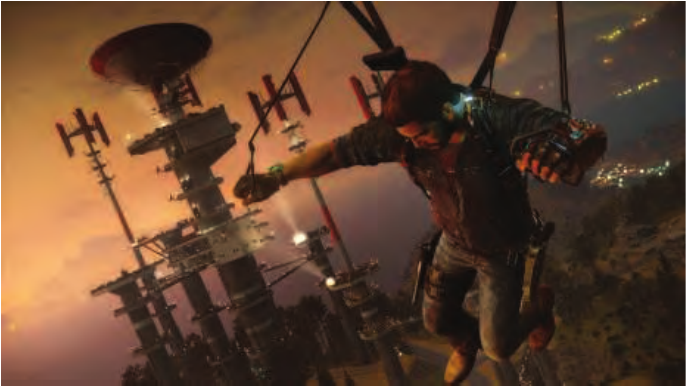

图 20.1：一种复杂的光照情形。请注意，肩膀上的小灯，以及建筑结构上的每一个亮点，都是光源。右上方远处的灯光也都是光源，在那个距离上以点精灵渲染。（图像出自《Just Cause 3》，由 Avalanche Studios 提供 [1387]。）

我们的目标是高效处理动态网格和光源。同样重要的是性能应当可预测，也就是视图或场景的微小变化不会导致渲染成本发生巨大变化。《DOOM》（2016）的某些关卡具有 300 个可见光源 [1682]；《Ashes of the Singularity》的某些场景则有 10,000 个。参见图 20.1，以及第 913 页的图 20.15。在某些渲染器中，大量粒子中的每一个都可以被视为小光源。其他技术使用光照探针（11.5.4 节）照亮附近表面，这些探针也可以被看作短作用距离的光源。

## 20.1 延迟着色

来源：《Real-Time Rendering, Fourth Edition》，书页 883—888（PDF 物理页 904—909）；范围自 20.1 标题起，至 20.2 标题之前。

本书到目前为止描述的都是前向着色：每个三角形被送入流水线，在行程结束时，用其着色结果更新屏幕上的图像。延迟着色的思想，则是在进行任何材质光照计算之前，先完成全部可见性测试和表面属性求值。这一概念于 1988 年首次在一种硬件架构中提出 [339]，后来被纳入实验性的 PixelFlow 系统 [1235]，还曾作为离线软件方案，通过图像处理辅助生成非照片真实感风格 [1528]。Calver 在 2003 年年中发表的详尽文章 [222] 阐述了在 GPU 上使用延迟着色的基本思想。Hargreaves 和 Harris [668, 669] 以及 Thibieroz [1762] 在次年推广了它的使用，当时，向多个渲染目标写入数据的能力正变得日益普及。

在前向着色中，我们使用着色器和代表物体的网格，通过单次通道计算最终图像。这个通道先获取材质属性，包括常量、插值参数或纹理中的值，再将一组光源应用于这些值。前向渲染的 z 预通道方法，可以看作几何体渲染与着色之间的一种轻度解耦：第一次几何体通道只负责确定可见性，而包括材质参数读取在内的全部着色工作，都推迟到第二次几何体通道中执行，以便对全部可见像素着色。对于交互式渲染，延迟着色有特定含义：与可见物体相关的所有材质参数都由初始几何体通道生成并存储，随后使用后处理将光源应用于这些已存储的表面数值。第一次通道保存的数值包括位置（以 z 深度存储）、法线、纹理坐标以及各种材质参数。这个通道为像素确立全部几何与材质信息，因此不再需要物体本身；也就是说，模型几何体的贡献已与光照计算完全解耦。

请注意，这个初始通道仍可能发生过度绘制，区别在于，此时着色器的执行工作只是把数值传送到缓冲区，其开销远小于计算一组光源对材质的影响。前向着色还会产生一种额外开销，而在延迟着色中，这项开销也会减少：有时 2 × 2 像素四元组中的像素并非全部位于三角形边界内，却仍必须全部执行完整着色 [1393]（23.8 节）。这听起来似乎影响不大，但设想一个网格，其中每个三角形只覆盖一个像素。前向着色会生成四个完整着色的样本，再丢弃其中三个。使用延迟着色时，每次着色器调用的开销更低，因此丢弃样本造成的影响就小得多。

用于存储表面属性的缓冲区通常称为 G 缓冲 [1528]，是“几何缓冲区”（geometric buffers）的简称。这类缓冲区偶尔也称为深度信息缓冲区（deep buffers），但这一术语还可能表示为每个像素存储多个表面（片元）的缓冲区，因此本书避免使用它。图 20.2 展示了一些 G 缓冲的典型内容。G 缓冲可以存储程序员希望它包含的任何东西，也就是完成后续所需光照计算的一切必要数据。每个 G 缓冲都是单独的渲染目标。通常会使用三到五个渲染目标作为 G 缓冲，但有些系统使用的数量曾达到八个 [134]。更多的目标会消耗更多带宽，从而增加这一缓冲环节成为瓶颈的可能性。

在创建 G 缓冲的通道之后，使用另一个独立过程来计算光照效果。一种方法是逐一应用各个光源，利用 G 缓冲计算其作用。对于每个光源，我们绘制一个覆盖整个屏幕的四边形（12.1 节），并将 G 缓冲作为纹理访问 [222, 1762]。在每个像素处，可以确定最近表面的位置，以及它是否位于光源影响范围之内。如果在范围内，就计算该光源的作用，并将结果放入输出缓冲区。依次对每个光源执行这一过程，通过混合累加其贡献。最后，便应用了全部光源的贡献。

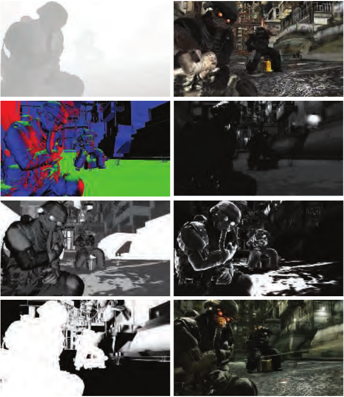

图 20.2：用于延迟着色的几何缓冲，其中一些为便于可视化而转换成了颜色。左列从上到下依次为：深度图、法线缓冲、粗糙度缓冲和阳光遮蔽。右列依次为：纹理颜色（亦称反照率纹理）、光照强度、镜面反射强度，以及接近最终结果的图像（不含运动模糊）。（图像出自《Killzone 2》，由 Guerrilla BV 提供 [1809]。）

这一过程几乎是使用 G 缓冲效率最低的方式，因为对每个光源都要访问每个已存储像素，类似于基本前向渲染将所有光源应用于全部表面片元的做法。由于写入和读取 G 缓冲会带来额外成本，这种方法最终可能比前向着色更慢 [471]。作为性能改进的起点，我们可以确定光源体积（球体）的屏幕边界，并据此绘制一个只覆盖较小图像区域的屏幕空间四边形 [222, 1420, 1766]。这样可以减少像素处理工作，通常降幅相当显著。绘制代表该球体的椭圆，可以进一步削减光源体积外的像素处理 [1122]。我们还可以利用第三个屏幕维度，即 z 深度。通过绘制一个包围该体积的粗略球形网格，可以进一步缩减球体的影响区域 [222]。例如，如果球体被深度缓冲遮挡，说明光源体积位于最近表面之后，因此没有影响。更一般地说，如果球体在某个像素处的最小深度和最大深度所界定的范围与最近表面不重叠，那么该光源就无法影响这个像素。Hargreaves [668] 和 Valient [1809] 讨论了高效且正确地确定这种重叠关系的各种选择和注意事项，以及其他优化。后面的若干算法还会使用这种测试表面与光源在深度上是否重叠的思想。哪种方法最高效，要视具体情况而定。

对于传统的前向渲染，顶点与像素着色器程序取得各个光源及材质的参数，再计算光源对材质的作用。前向着色或者需要一套覆盖所有可能材质与光源组合的复杂顶点着色器和像素着色器，或者需要较短的专用着色器来处理特定组合。带有动态分支的长着色器往往运行得慢得多 [414]，因此，大量较小的着色器可能更高效，但也需要更多生成和管理工作。由于前向着色在单次通道中执行全部着色功能，渲染下一个物体时更有可能需要更换着色器，从而因着色器切换而降低效率（18.4.2 节）。

延迟着色这种渲染方法，使光照与材质定义得以清晰分离。每个着色器专注于参数提取或光照中的一项，而不同时处理两者。较短的着色器运行更快，既是因为长度较短，也因为更容易优化。着色器使用的寄存器数量决定了占用率（23.3 节），而占用率是决定有多少个着色器实例能够并行运行的关键因素。光照与材质的这种解耦，也简化了着色器系统的管理。例如，这种拆分让试验变得容易：对于一种新的光源或材质类型，只需向系统添加一个新着色器，而不必为每种组合都添加一个 [222, 927]。之所以能够这样做，是因为材质求值在第一次通道中完成，随后在第二次通道中将光照应用于这组已存储的表面参数。

对于单通道前向渲染，通常必须同时备齐所有阴影贴图，因为全部光源会一同参与计算。延迟着色在单次通道中完整处理一个光源，因此允许内存中每次只保留一张阴影贴图 [1809]。不过，在后面将介绍的更复杂的光源分配方案中，这项优势便消失了，因为光源会成组计算 [1332, 1387]。

基本的延迟着色只支持一个具有固定参数集的材质着色器，这限制了能够表现的材质模型。支持不同材质描述的一种办法，是在某个指定字段中为每个像素存储一个材质 ID 或掩码。着色器随后便可依据 G 缓冲的内容执行不同计算。这种方法还可以根据该 ID 或掩码值，改变 G 缓冲存储的内容 [414, 667, 992, 1064]。例如，一种材质可能在 G 缓冲中使用 32 位存储第二层颜色和混合因子，另一种材质则用同样的位存储它所需的两个切向量。这些方案需要使用更复杂的着色器，因此可能影响性能。

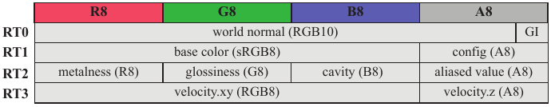

图 20.3：《Rainbow Six Siege》中使用的一种可能的 G 缓冲布局示例。除了深度缓冲和模板缓冲，还使用了四个渲染目标（RT）。如图所示，这些缓冲区中可以放入任何数据。RT0 中的“GI”字段是“GI 法线偏移（A2）”。（据 El Mansouri [415] 的插图绘制。）

图内字段译文：通道标题为 R8、G8、B8、A8；RT0 为世界空间法线（RGB10）和 GI；RT1 为基础颜色（sRGB8）和配置（A8）；RT2 为金属度（R8）、光泽度（G8）、凹腔（B8）和复用值（A8，原文 aliased value）；RT3 为速度的 x、y 分量（RGB8）和速度的 z 分量（A8）。

基本的延迟着色还有其他一些缺点。G 缓冲所需的显存可能相当可观，反复访问这些缓冲区所产生的相关带宽成本也一样 [856, 927, 1766]。可以通过存储精度较低的数值或压缩数据来缓解这些成本 [1680, 1809]。图 20.3 展示了一个例子。16.6 节讨论过网格世界空间数据的压缩。根据渲染引擎的需要，G 缓冲可以包含世界空间坐标或屏幕空间坐标中的数值。Pesce [1394] 讨论了为 G 缓冲压缩屏幕空间法线与世界空间法线时的取舍，并提供了相关资源的线索。世界空间法线的八面体映射是一种常见方案，因为它精度高，而且编码与解码都很快。

延迟着色的两个重要技术限制涉及透明效果与抗锯齿。基本的延迟着色系统不支持透明效果，因为每个像素只能存储一个表面。一种解决办法是，先用延迟着色渲染不透明表面，再用前向渲染绘制透明物体。对于早期的延迟系统，这意味着必须将场景中的全部光源应用于每个透明物体，这个过程开销很大；否则就必须采取其他简化措施。正如接下来几节将讨论的那样，GPU 能力的提升促成了同时适用于延迟着色和前向着色的光源剔除方法的发展。虽然如今已经可以为像素存储透明表面列表 [1575]，并采用纯延迟方法，但通常仍会按透明效果和其他效果的需求混用延迟着色与前向着色 [1680]。

前向方法的一个优势是易于支持 MSAA 等抗锯齿方案。对于 N× MSAA，前向技术每个像素只需存储 N 个深度样本和颜色样本。延迟着色可以为 G 缓冲中的每个元素存储全部 N 个样本来进行抗锯齿，但内存开销、填充率需求和计算量的增加会使这种做法代价高昂 [1420]。为克服这一限制，Shishkovtsov [1631] 使用边缘检测方法来近似边缘覆盖率计算。其他用于抗锯齿的形态学后处理方法（5.4.2 节）也可以采用 [1387]，时间抗锯齿同样如此。若干延迟 MSAA 方法通过检测哪些像素或分块包含边缘，避免对每个样本都计算着色 [43, 990, 1064, 1299, 1764]。只有包含边缘的像素或分块才需要对多个样本求值。Sousa [1681] 在这类方法的基础上，使用模板操作来识别具有多个样本、需要更复杂处理的像素。Pettineo [1407] 描述了一种更新的跟踪这些像素的方法：使用计算着色器，将边缘像素移到线程组内存中的列表，以便高效地进行流式处理。

Crassin 等人 [309] 的抗锯齿研究着眼于高质量结果，并总结了这一领域的其他研究。他们的技术先执行一个生成深度和法线的几何体预通道，将相似的子样本分组。随后生成 G 缓冲，并通过统计分析确定每组子样本应采用的最佳数值。接着使用这些深度边界值对各组着色，再将结果混合。尽管在本书撰写时，对大多数应用而言，以交互速率进行这样的处理还不切实际，但这种方法让我们得以了解，为提高图像质量，现在能够以及未来将会投入多大的计算能力。

即便存在这些限制，延迟着色仍是一种已用于商业程序的实用渲染方法。它自然地将几何体与着色分离，将光照与材质分离，这意味着每个要素都可以独立优化。一个特别值得关注的领域是贴花渲染，它会对任何渲染流水线产生影响。

## 20.2 贴花渲染

来源：《Real-Time Rendering》第4版，书页 888—891（PDF 物理页 909—912）；本节从 20.2 标题起，到 PDF 第 913 页的 20.3 标题前结束。

贴花（decal）是施加在表面之上的某种设计元素，例如图片或其他纹理。在电子游戏中，贴花通常表现为轮胎印、弹孔，或玩家喷涂在表面上的标记。在其他应用中，贴花用于添加标志、注释或其他内容。例如，对于地形系统或城市，贴花可以让美术人员通过叠加细节纹理，或以不同方式重新组合各种图案，避免明显的重复。

贴花可以采用多种方式与下层材质混合。它可能像文身一样，修改下层颜色而不改变凹凸贴图。反过来，它也可能只替换凹凸映射，例如浮雕式标志。它还可以定义一种完全不同的材质，例如在车窗上贴一张贴纸。同一几何体上可以施加多张贴花，例如小径上的脚印。单张贴花也可能跨越多个模型，例如地铁车厢各个表面上的涂鸦。这些不同情况会影响前向着色和延迟着色系统存储与处理贴花的方式。

首先，贴花必须像其他纹理一样映射到表面。由于每个顶点可以存储多组纹理坐标，因此能够把几张贴花绑定到同一个表面上。这种方法有其局限，因为每个顶点能够保存的数值数量相对较少。每张贴花都需要自己的一组纹理坐标。如果在一个表面上施加大量小贴花，就意味着要在每个顶点保存这些纹理坐标，即使每张贴花实际上只影响网格中的少数几个三角形。

要渲染附着在网格上的贴花，一种方法是让像素着色器对每张贴花采样，再依次逐层混合。这样会使着色器变得复杂；如果贴花数量随时间变化，还可能需要频繁重新编译或采取其他措施。另一种能让着色器独立于贴花系统的方法，是为每张贴花重新渲染一次网格，把每一遍的结果叠加并混合到前一遍之上。如果某张贴花只覆盖少数几个三角形，就可以创建一个独立且更短的索引缓冲区，仅渲染该贴花对应的子网格。还有一种贴花方法是修改材质的纹理。如果该纹理只用于一个网格，例如地形系统中的情况，那么修改这张纹理便是一种简单的“一次设置，后续无须操心”的解决方案 [447]。如果该材质纹理用于几个物体，则需要创建一张将材质与贴花合成在一起的新纹理。这种烘焙方案避免了着色器复杂性和无谓的过度绘制，但代价是纹理管理以及内存占用 [893, 1393]。通常会单独渲染贴花，因为这样能够在同一表面上使用不同的分辨率，而且基础纹理可以复用和重复平铺，无须在内存中额外保留修改后的副本。

对于计算机辅助设计软件，这些方案可能是合理的，因为用户也许只会添加一个标志，几乎不添加其他内容。它们也用于施加在动画模型上的贴花；在这种情况下，必须在变形之前投影贴花，使它随物体一起拉伸。然而，当贴花数量超过少数几张时，这些技术就会变得低效且繁琐。

对于静态或刚体物体，一种常用方案是把贴花视为一张通过有限体积进行正交投影的纹理 [447, 893, 936, 1391, 1920]。在场景中放置一个定向盒，像电影放映机那样，将贴花从盒子的一个面投影到相对的面。参见图 20.4。对盒子的各个面进行光栅化，以此驱动像素着色器执行。凡是位于该体积内的几何体，都会在其材质之上施加贴花。具体做法是将表面的深度和屏幕位置转换为该体积中的位置，再由此得到贴花的纹理坐标 (u, v)。另一种选择是让贴花本身成为真正的体积纹理 [888, 1380]。通过分配 ID [900]、分配一个模板位 [1778]，或依靠渲染顺序，可以使贴花只影响体积内的某些物体。还经常依据表面与投影方向之间的夹角，使贴花淡出或限制其作用范围，以避免表面相对于投影方向越来越侧向时，贴花发生拉伸或扭曲 [893]。

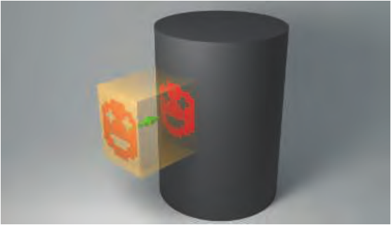

图 20.4：一个盒体定义贴花投影，盒体内部的表面会被施加该贴花。图中夸大了盒体的厚度，以展示投影器及其效果。实际使用时，会使盒体尽可能薄且紧贴表面，从而尽量减少施加贴花时需要测试的像素数量。

延迟着色非常擅长渲染这类贴花。它可以把贴花的效果施加到 G 缓冲区，而不必像标准前向着色那样，对每张贴花分别进行光照计算和着色。例如，如果一张轮胎胎纹印迹贴花替换了表面上的着色法线，就直接在相应的 G 缓冲区中完成这些修改。随后，各个像素只依据 G 缓冲区中的数据进行光源着色，从而避免前向着色中出现的着色过度绘制 [1680]。由于贴花的效果能够完全记录在 G 缓冲区中，因此在着色时就不再需要贴花本身。这种整合还避免了多遍前向着色的一个问题：某一遍的表面参数可能需要影响另一遍的光照计算或着色 [1380]。例如，这种简洁性就是 Frostbite 2 引擎决定从前向着色转向延迟着色的重要因素 [43]。可以把贴花看成与光源相同的东西，因为二者都是通过渲染一个空间体积，来确定其对内部表面的影响。如第 20.4 节将会看到的，利用这一点，一种经过修改的前向着色方式也能获得类似的效率，同时还具有其他优点。

Lagarde 和 de Rousiers [960] 描述了延迟着色环境中贴花存在的几个问题。混合只能使用流水线合并阶段所支持的操作 [1680]。如果材质与贴花都具有法线贴图，要得到正确混合的结果可能很困难；如果还使用了某种凹凸纹理过滤技术，难度会更大 [106, 888]。还可能出现第 6.5 节所述的黑色或白色边缘伪影。可以使用有符号距离场之类的技术，清晰地划分这些材质 [263, 580]，但这样又可能引发走样问题。另一个问题是贴花轮廓边缘处的边缘伪影，其成因是使用屏幕空间信息反投影到世界空间时产生的梯度误差。一种解决方案是限制或忽略这类贴花的 mipmap 映射；Wronski [1920] 讨论了更为复杂的解决方案。

贴花既可用于刹车印或弹孔之类的动态元素，也可用于为不同地点增添变化。图 20.5 展示了一个在建筑墙面及其他位置施加贴花的场景。墙面纹理可以复用，而贴花则提供定制的细节，赋予每栋建筑独特的风貌。

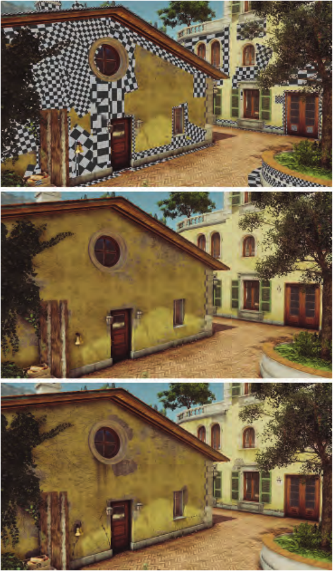

图 20.5：上图用棋盘格标出了叠加颜色贴花和凹凸贴花的区域。中图展示未施加任何贴花的建筑。下图展示施加了约 200 张贴花后的场景。（图片由 IO Interactive 提供。）

## 20.3 分块着色

来源：《Real-Time Rendering, 4th Edition》第 20.3 节“Tiled Shading”，书页 892—898（PDF 第 913—919 页）。本节正文截止于 20.4 节标题之前；包含图 20.6—20.9。文中  和  分别表示最小和最大 z 深度。

在基本的延迟着色中，每个光源都单独求值，再将结果加到输出缓冲区中。对于早期 GPU，这是一项优势：由于着色器复杂度的限制，同时计算超过少数几个光源可能根本无法实现。延迟着色能够处理任意数量的光源，代价是每次都要访问 G 缓冲区。当光源达到数百乃至数千个时，基本延迟着色的开销就会很高，因为对于每个被光源覆盖的像素，都必须处理所有覆盖它的光源，而且在一个像素上计算每个光源，都涉及一次单独的着色器调用。在一次着色器调用中计算多个光源会更高效。在接下来的几节中，我们将讨论几种算法，它们能以交互速率快速处理大量光源，既适用于延迟着色，也适用于前向着色。

多年来，人们开发了各种混合式 G 缓冲区系统，在材质存储和光照存储之间取得平衡。例如，设想一个包含漫反射项和镜面反射项的简单着色模型，其中材质纹理只影响漫反射项。我们不必为每个光源都从 G 缓冲区中读取纹理颜色，而可以先分别计算每个光源的漫反射项和镜面反射项，并保存这些结果。这些项在基于光照的 G 缓冲区中累加，这类缓冲区有时称为 L 缓冲区。最后，我们只读取一次纹理颜色，将它乘以漫反射项，再加上镜面反射项。纹理的影响被从方程中提取出来，因为对于所有光源，它总共只使用一次。这样，每个光源需要访问的 G 缓冲区数据就更少，从而节省带宽。一种典型的存储方案是累加漫反射颜色和镜面反射强度，这意味着可以通过加法混合，将四个数值输出到同一个缓冲区中。Engel [431, 432] 讨论了几种这样的早期延迟光照技术，它们也称为预光照（pre-lighting）或光照预通道（light prepass）方法。Kaplanyan [856] 比较了不同方法，目标是尽量减少 G 缓冲区的存储和访问。Thibieroz [1766] 也强调减少 G 缓冲区所存的数据量，并对比了几种算法的优缺点。Kircher [900] 描述了使用较低分辨率的 G 缓冲区和 L 缓冲区进行光照计算的方法：在最后的前向着色通道中，对它们进行上采样和双边滤波。这种方法对某些材质效果很好，但如果光照效果变化得很快，例如反射表面应用了粗糙度贴图或法线贴图，就可能产生瑕疵。Sousa 等人 [1681] 将子采样的思想与反照率纹理的 Y′CbCr 颜色编码结合起来，以降低存储成本。反照率影响漫反射分量，而漫反射分量较少出现高频变化。

还有许多这样的方案 [892, 1011, 1351, 1747]，它们在多方面有所不同，例如存储和提取哪些分量、执行哪些通道，以及如何渲染阴影、透明效果、抗锯齿和其他现象。所有这些方案的一个主要目标都是相同的：高效地渲染光源。这类技术至今仍在使用 [539]。某些方案的一个局限是，它们可能需要对材质模型和光照模型施加更严格的限制 [1332]。例如，Shulz [1589] 指出，转向基于物理的材质模型后，就需要存储镜面反射率，以计算光照中的菲涅耳项。光照预通道的要求因此增加，这促使他的团队从光照预通道转向完全延迟着色系统。

即使每个光源只访问少量 G 缓冲区，也可能产生显著的带宽开销。更快的方法是在一个通道中，只计算影响各个像素的光源。Zioma [1973] 是最早探索为前向着色建立光源列表的人之一。在他的方案中，先渲染光源体积，并为每个被覆盖的像素存储光源的相对位置、颜色和衰减因子。对于覆盖相同像素的多个光源，使用深度剥离来存储它们的信息。随后渲染场景几何体，并使用已存储的光源表示。这个方案虽然可行，但会受到每个像素可重叠光源数量的限制。Trebilco [1785] 进一步发展了为每个像素建立光源列表的思想。他先执行 z 预通道，以避免重复绘制并剔除隐藏的光源。光源体积被渲染，并以逐像素 ID 值的形式存储，随后在前向渲染通道中访问。他给出了几种在单个缓冲区中存储多个光源的方法，其中包括一种位移与混合技术，无须多个深度剥离通道，就能存储四个光源。

分块着色（tiled shading）最早由 Balestra 和 Engstad [97] 于 2008 年介绍，用于游戏《Uncharted: Drake’s Fortune》。此后不久，也出现了介绍其在 Frostbite 引擎 [42]、PhyreEngine [1727] 等系统中应用的报告。分块着色的核心思想是，将光源分配给像素块，同时限制每个表面需要计算的光源数量，以及所需的工作量和存储量。然后在一次着色器调用中访问这些逐块光源列表，而不是像延迟着色那样为每个光源调用一次着色器 [990]。

用于光源分类的块，是屏幕上一组正方形排列的像素，例如大小为 32 × 32 像素。注意，交互式渲染中还有其他使用屏幕分块的方式：例如，移动处理器通过处理图块来渲染图像 [145]，GPU 架构也使用屏幕图块来完成各种任务（第 23 章）。这里的块是由开发者选定的一种构造，通常与底层硬件关系相对不大。对光源体积进行分块渲染，有些类似于低分辨率的场景渲染；这项任务可以在 CPU 上执行，也可以例如在 GPU 的计算着色器中执行 [42, 43, 139, 140, 1589]。

可能影响某个块的光源会被记录在一个列表中。进行渲染时，某个块内的像素着色器使用该块对应的光源列表对表面进行着色。图 20.6 左侧展示了这一点。可以看到，并非所有光源都与每个块重叠。块在屏幕空间中的边界构成一个非对称视锥体，用来判断是否存在重叠。可以在 CPU 上或计算着色器中，快速测试每个光源的球形影响体积是否与各个块的视锥体重叠。只有存在重叠时，我们才需要针对该块内的像素进一步处理这个光源。按块而非按像素存储光源列表，是在判断上采取保守策略：光源体积未必覆盖整个块；作为交换，处理、存储和带宽成本都大幅降低 [1332]。

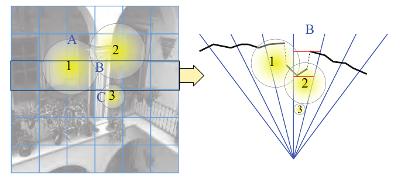

图 20.6. 分块示意。左：屏幕被划分为 6 × 6 个块，三个光源 1—3 为场景提供照明。观察块 A—C，可以看到块 A 可能受到光源 1 和 2 的影响，块 B 可能受到光源 1—3 的影响，而块 C 可能受到光源 3 的影响。右：从上方观察左图中用黑色边框标出的那一行块。对于块 B，红线表示深度边界。在屏幕上，块 B 看起来与所有光源都重叠，但同时与深度范围重叠的只有光源 1 和 2。

要判断一个光源是否与某个块重叠，可以采用第 22.14 节介绍的球体与视锥体测试。那里所述的测试假定视锥体较大、较宽，而球体相对较小。然而，这里的视锥体来自屏幕空间中的一个块，因此往往又长又细，而且不对称。这会降低剔除效率，因为被报告为相交的情况可能增加，即出现误报。参见图 20.7 左侧。一种替代办法是在对视锥体各平面进行测试后，再增加一次球体／盒体测试（第 22.13.2 节）[1701, 1768]，如图 20.7 右侧所示。Mara 和 McGuire [1122] 逐一介绍了针对投影球体的其他测试，包括他们自己提出的 GPU 高效版本。Zhdan [1968] 指出，这种方法对聚光灯效果不佳，并讨论了利用层次剔除、光栅化和代理几何体的优化技术。

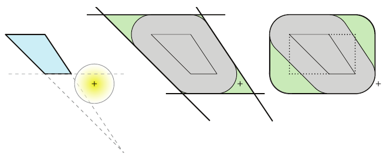

图 20.7. 左：采用朴素的球体／视锥体测试时，这个圆会被报告为相交，因为它与视锥体的下侧平面和右侧平面重叠。中：左侧测试的示意图，其中视锥体被扩大，仅使用粗黑线表示的平面对圆的原点（加号）进行测试。绿色区域会报告错误的相交结果。右：在视锥体外放置一个用点线表示的盒体，并在中图的平面测试之后增加球体／盒体测试，得到图中粗轮廓线围成的形状。注意，这一测试也会在它的绿色区域中产生其他错误相交，但同时应用两种测试后，这些区域会缩小。由于球心位于该形状之外，因此测试会正确报告球体不与视锥体重叠。

这种光源分类过程既可用于延迟着色，也可用于前向渲染，Olsson 和 Assarsson [1327] 对其作了详细描述。对于分块延迟着色，照常建立 G 缓冲区，将每个光源的体积记录到它所覆盖的块中，然后将这些列表应用于 G 缓冲区，计算最终结果。在基本延迟着色中，通过渲染四边形之类的代理对象来应用每个光源，以强制像素着色器对该光源求值。采用分块着色时，使用计算着色器，或者为整个屏幕或每个块渲染一个四边形，来驱动每个像素上的着色器求值。随后对某个片元求值时，会应用该块列表中的全部光源。采用光源列表有几个优点，包括：

- 对于每个像素，G 缓冲区总共最多只读取一次，而不是每个重叠光源都读取一次。
- 输出图像缓冲区只写入一次，而不是逐个累加每个光源的结果。
- 着色器代码可以提取渲染方程中的公共项，只计算一次，而不是为每个光源都计算一次 [990]。
- 块内每个片元都计算同一个光源列表，从而保证 GPU 线程束（warp）执行的一致性。
- 渲染完所有不透明对象后，可以使用相同的光源列表，通过前向着色处理透明对象。
- 由于所有光源的效果都在单个通道中计算，因此有需要时可以采用低精度帧缓冲区。

最后一点，即帧缓冲区精度，在传统延迟着色引擎中可能很重要 [1680]。每个光源都在独立通道中应用，因此，如果结果累加到每个颜色通道只有 8 位的帧缓冲区中，最终结果可能出现色带和其他瑕疵。话虽如此，对于许多现代渲染系统，能否使用较低精度并不重要，因为它们需要较高精度的输出，以便执行色调映射和其他操作。

分块光源分类也可以用于前向渲染。这类系统称为分块前向着色 [144, 1327] 或 forward+ [665, 667]。首先对几何体执行 z 预通道，既避免最终通道中的重复绘制，也允许进一步剔除光源。计算着色器按块对光源进行分类。随后，第二个几何体通道执行前向着色，各着色器根据片元在屏幕空间中的位置访问光源列表。

分块前向着色已用于《The Order: 1886》等游戏 [1267, 1405]。Pettineo [1401] 提供了一个开源测试套件，用来比较分块着色的延迟 [990] 和前向分类实现。在使用延迟着色时，为了抗锯齿，每个采样都会被存储下来。测试结果各有胜负，在不同测试条件下，两种方案都曾优于对方。不使用抗锯齿时，随着光源数量增加到 1024，延迟方案在许多 GPU 上往往更有优势；而随着抗锯齿级别提高，前向方案表现更好。Stewart 和 Thomas [1700] 对一个 GPU 型号进行了范围更广的测试分析，也发现了类似结果。

z 预通道还可以用于另一个目的：根据深度剔除光源。图 20.6 右侧展示了这一思想。第一步是找出块内对象的最小和最大 z 深度，即  和 。二者分别通过归约（reduce）操作确定：将着色器应用于块内数据，在一个或多个通道中通过采样计算  和  [43, 1701, 1768]。例如，Harada 等人 [667] 使用计算着色器和无序访问视图，高效执行视锥体剔除和块内归约。随后可以利用这些值，快速剔除不与该块这一深度范围重叠的光源。空块，例如只看得到天空的块，也可以忽略 [1877]。场景类型和应用会影响计算并使用最小值、最大值或两者是否值得 [144]。这种剔除方式也可以用于分块延迟着色，因为 G 缓冲区中已有深度值。

由于深度边界是根据不透明表面确定的，必须单独考虑透明效果。为了处理透明表面，Neubelt 和 Pettineo [1267] 额外渲染一组通道来建立逐块光源列表，仅用于透明表面的光照和着色。首先，在不透明几何体的 z 预通道缓冲区基础上渲染透明表面。保留透明表面的 ，同时使用不透明表面的  来限制视锥体的远端。第二个通道执行一次独立的光源分类，生成新的逐块光源列表。第三个通道只将透明表面送入渲染器，其方式与分块前向着色类似。所有这些表面都使用新的光源列表进行着色和光照计算。

对于包含大量光源的场景，有效的 z 值范围对于剔除其中大多数光源、避免后续处理至关重要。不过，对于一种常见情况——深度不连续——这项优化几乎没有好处。假设一个块包含近处的人物，背景则是远处的山。两者之间的 z 范围极大，因此基本无法用于剔除光源。这种深度范围问题可能影响场景中很大一部分区域，如图 20.8 所示。这个例子并非极端情况。在森林、有高草或其他植被的场景中，出现深度不连续的块可能占更高比例 [1387]。

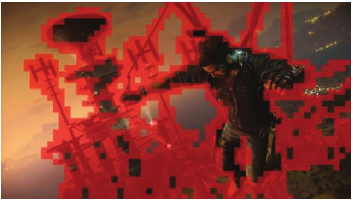

图 20.8. 存在较大深度不连续的块的可视化。（图像来自《Just Cause 3》，由 Avalanche Studios 提供 [1387]。）

一种解决办法是在  和  的中间位置进行一次划分。这种测试称为双峰簇（bimodal clusters）[992] 或 HalfZ [1701, 1768]，它相对于中点，将相交光源分为与较近范围重叠、与较远范围重叠或与整个范围重叠三类。这直接针对一个块中存在一近一远两个对象的情况。不过，它不能解决所有问题，例如光源体积与两个对象都不重叠，或者有两个以上的对象在不同深度上重叠。即便如此，它仍能显著减少整体光照计算量。

Harada 等人 [666, 667] 提出了一种更精细的算法，称为 2.5D 剔除。它将每个块从  到  的深度范围，沿深度方向分成 n 个单元。图 20.9 展示了这一过程。建立一个 n 位的几何体位掩码；有几何体存在的单元，其对应位设为 1。出于效率考虑，他们采用 n = 32。随后遍历所有光源，为每个与块视锥体重叠的光源建立一个光源位掩码。光源位掩码表示该光源位于哪些单元中。将几何体位掩码与光源掩码进行按位与（AND）运算。如果结果为零，该光源就不会影响这个块中的任何几何体，如图 20.9 右侧所示。否则，将该光源追加到块的光源列表中。对于一种 GPU 架构，Stewart 和 Thomas [1700] 发现，当光源数量增加到超过 512 时，HalfZ 开始优于基本分块延迟着色；当光源数量超过 2300 时，2.5D 剔除开始占优，不过优势并不显著。

Mikkelsen [1210] 利用不透明对象的像素位置进一步精简光源列表。为每个 16 × 16 像素块生成一个列表，其中包含每个光源的屏幕空间包围矩形，以及用于剔除的几何体边界  和 。然后，让 64 个计算着色器线程中的每个线程，将块内四个像素与每个光源进行比较，以进一步剔除列表中的光源。如果一个块中没有任何像素的世界空间位置处在某个光源体积内部，就将该光源从列表中剔除。得到的光源集合可以相当准确，因为只保留确定会影响至少一个像素的光源。Mikkelsen 发现，对于他的场景，利用 z 轴进行进一步剔除反而降低了整体性能。

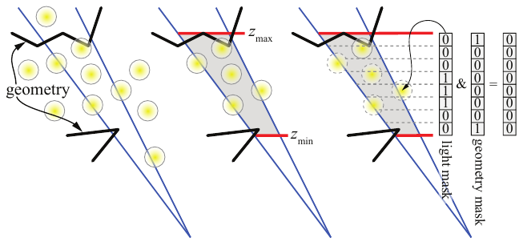

图 20.9. 左：蓝色表示一个块的视锥体，黑色表示一些几何体，黄色圆形表示一组光源。中：在分块剔除中，使用红色标出的  和  值，剔除不与灰色区域重叠的光源。右：采用聚簇剔除时，将  和  之间的区域分为 n 个单元，本例中 n = 8。根据像素深度计算几何体位掩码（10000001），并为每个光源计算一个光源位掩码。如果二者按位与的结果为 0，那么对于该块就不再考虑该光源。最上方光源的掩码为 11000000，因此只有它会被用于光照计算，因为 11000000 AND 10000001 得到 10000000，结果非零。

> 译注：图 20.9 的原图注使用“clustered culling（聚簇剔除）”，此处依原文保留；正文介绍的是 2.5D 剔除。原图中  和  的上下位置也按原图保留，不另行改动。

当光源被放入列表并作为一个集合求值时，延迟系统的着色器可能变得相当复杂。单个着色器必须能够处理所有材质和所有光源类型。分块有助于降低这种复杂度。其思想是在每个像素中存储一个位掩码，每一位对应材质在该像素上使用的一项着色器功能。对于每个块，将这些位掩码按位或（OR），就能确定该块所需的最少功能集合。也可以将位掩码按位与（AND），找出所有像素都使用的功能，这意味着着色器无须通过“if”测试来检查是否应当执行相应代码。然后，为该块的所有像素使用一个满足这些要求的着色器 [273, 414, 1877]。这种着色器特化很重要，不仅因为需要执行的指令更少，还因为得到的着色器可能获得更高的占用率（第 23.3 节）；否则，着色器就必须为最坏情况的代码路径分配寄存器。除了材质和光源，还可以跟踪其他属性，并用它们影响着色器。例如，在游戏《Split/Second》中，Knight 等人 [911] 根据 4 × 4 像素块是完全处于阴影中还是部分处于阴影中、是否包含需要抗锯齿的多边形边缘，以及其他测试结果，对这些块进行分类。

## 20.4 聚簇着色

来源：《Real-Time Rendering, Fourth Edition》，书页 898—905（PDF 物理页 919—926）；范围从 20.4 节标题开始，至 20.5 节标题之前，包含跨页续文、图 20.10、图 20.11 和表 20.1。

分块光源分类利用分块的二维空间范围，也可以选择利用几何体的深度边界。**聚簇着色**（clustered shading）将视锥体划分成一组三维单元，称为**簇**（cluster）。与分块着色中采用 z 深度的方法不同，这种划分针对整个视锥体进行，与场景中的几何体无关。所得算法的性能随相机位置产生的变化较小 [1328]，当一个分块包含深度不连续处时，表现也更好 [1387]。聚簇着色既可用于前向着色系统，也可用于延迟着色系统。

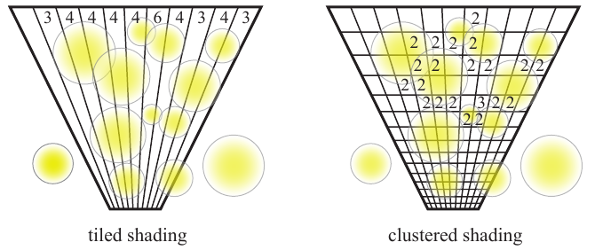

**图 20.10。** 以二维形式表示的分块着色与聚簇着色。视锥体被细分，场景中的光源体积根据其重叠的区域进行分类。分块着色在屏幕空间中细分，而聚簇着色还按 z 深度切片进一步划分。每个体积区域都包含一个光源列表；图中标出了长度为两个或更多光源的列表所对应的数值。如果分块着色没有根据场景几何体计算 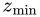 和 （图中未示出），光源列表中就可能包含大量不需要的光源。聚簇着色无需渲染后的几何体即可剔除列表中的光源，尽管这样的处理遍可能有所帮助。（据 Persson [1387] 的图改绘。）

由于透视的作用，分块的横截面积随着到相机距离的增加而增大。均匀划分方案会在分块的视锥体中产生扁平或狭长的体素，这并不理想。为了补偿这一点，Olsson 等人 [1328, 1329] 在观察空间中以指数方式对几何体进行聚簇，完全不依赖几何体的  和 ，使簇的形状更接近立方体。例如，《正当防卫 3》（Just Cause 3）的开发者采用 64 × 64 像素的分块和 16 个深度切片，并且试验过提高各轴方向的分辨率，以及不论分辨率如何都采用固定数量的屏幕分块 [1387]。虚幻引擎使用相同大小的分块，通常采用 32 个深度切片 [38]。见图 20.10。

光源按其所重叠的簇分类，并组成列表。由于不依赖场景几何体的 z 深度，仅根据视图和光源集合就能计算这些簇 [1387]。随后，每个表面，无论不透明还是透明，都根据自己的位置获取相关的光源列表。聚簇提供了一种高效、统一的光照解决方案，适用于场景中的所有物体，包括透明物体和体积物体。

与分块方法一样，使用聚簇的算法可以与前向着色或延迟着色结合。例如，《极限竞速：地平线 2》（Forza Horizon 2）在 GPU 上计算簇，然后使用前向着色，因为这样无需任何额外工作就能支持 MSAA [344, 1002, 1387]。虽然在单遍前向着色中可能出现过度绘制，但其他方法，例如大致按从前到后的顺序排序 [892, 1766]，或只对一部分物体执行预处理遍 [145, 1768]，可以在不进行第二次完整几何处理遍的情况下避免大量过度绘制。话虽如此，Pettineo [1407] 发现，即便使用这些优化，采用单独的 z 预处理遍仍然更快。另一种做法是对不透明表面进行延迟着色，随后利用同一套光源列表结构对透明表面进行前向着色。《正当防卫 3》采用的就是这种方法，它在 CPU 上创建光源列表 [1387]。Dufresne [390] 也在 CPU 上并行生成簇的光源列表，因为这一过程不依赖场景中的几何体。

与分块方法相比，聚簇光源分配得到的每个列表包含更少的光源，对视图的依赖也更弱 [1328, 1332]。分块所定义的狭长视锥体，其内部包含的内容可能仅因相机的微小移动就发生显著变化。例如，一条直线上的路灯可能恰好对齐，全部落入一个分块 [1387]。即使使用 z 深度细分方法，根据每个分块内表面求得的近、远距离，也可能由于单个像素的变化而剧烈变动。聚簇较不容易受到这些问题的影响。

Olsson 等人 [1328, 1329] 以及下文提到的其他研究者探索了多种聚簇着色优化。一项技术是为光源建立包围体层次结构（BVH），然后利用它快速确定哪些光源体积与给定簇重叠。只要有至少一个光源移动，就需要重建这个 BVH。另一种可用于延迟着色的方案，是利用簇内表面的量化法线方向进行剔除。Olsson 等人按方向对表面法线进行分类，将其放入一个在立方体每个面上保存 3 × 3 组方向、总计 54 个位置的结构中，以形成法线锥（第 19.3 节）。随后，在创建簇的列表时，可以利用这个结构进一步剔除光源，也就是剔除那些位于簇内所有表面背后的光源。光源数量很多时，排序的代价可能很高，van Oosten [1334] 探索了各种策略和优化。

如果能够获得可见几何体的位置，例如在延迟着色中，或通过 z 预处理遍获得，就可以进行其他优化。不包含几何体的簇可以从处理过程中排除，得到需要较少处理和存储的稀疏网格。这样做意味着必须先处理场景，找出哪些簇被占用。由于需要访问深度缓冲区数据，簇的构建此时必须在 GPU 上执行。与簇的体积相比，同该簇重叠的几何体可能只占很小的范围。利用这些样本构造紧密的轴对齐包围盒（AABB）并进行测试，就可以剔除更多光源 [1332]。经过优化的系统能够处理超过一百万个光源，并且随着光源数量增加仍具有良好的扩展性，同时在只有少量光源时也能保持高效。

并不一定要使用指数函数细分屏幕 z 轴，对于包含大量远处光源的场景，这样的细分还可能产生负面影响。在指数分布下，簇的体积随深度增大，可能导致远处簇的光源列表过长。一种解决方法是限制簇集合的最大距离，即光源聚簇的“远平面”，并将更远处的光源逐渐淡出、表示成粒子或眩光，或者烘焙进去 [293, 432, 1768]。也可以使用更简单的着色器、lightcuts [1832] 或其他细节层次技术。反过来，最靠近观察者的体积中可能内容相对稀少，却被过度细分。一种方法是将分类视锥体的“近平面”强制设在某个合理距离处，并将比这一深度更近的光源归入第一个深度切片 [1387]。

在《毁灭战士》（DOOM，2016）中，开发者 [294, 1682] 结合 Olsson 等人 [1328] 和 Persson [1387] 的聚簇方法实现了前向着色系统。他们首先执行一次 z 预处理遍，耗时约 0.5 毫秒。他们的列表构建方案可以理解为裁剪空间中的体素化。通过逐一测试光源、环境光探针和贴花与代表各单元的 AABB 是否相交，将它们插入相应单元。加入贴花是一项显著改进，因为聚簇前向系统由此获得了延迟着色处理这类实体时所具有的优势。在前向着色期间，引擎遍历单元内找到的所有贴花。如果某个贴花与表面位置重叠，就获取其纹理值并进行混合。贴花可以按任何需要的方式与下方表面混合，而不像延迟着色那样，仅限于混合阶段所支持的操作。聚簇前向着色还可以把贴花渲染到透明表面上。随后，再应用单元中的全部相关光源。

可以使用 CPU 构建光源列表，因为这不需要场景几何体，而且用解析方法测试光源体积的球体与簇的盒体是否重叠，成本很低。不过，当涉及聚光灯或其他形状的光源体积时，使用包围它的球形包围体，可能导致把该光源加入许多它实际上不起作用的簇，而精确的解析相交测试又可能十分昂贵。在这方面，Persson [1387] 给出了一种将球体快速体素化到一组簇中的方法。

可以利用 GPU 的光栅化流水线对光源体积进行分类，以避免这些问题。Örtegren 和 Persson [1340] 描述了一种构建光源列表的两遍处理流程。在**外壳遍**（shell pass）中，每个光源都由一个包围它的低分辨率网格表示。使用保守光栅化（第 23.1.2 节）将每个这样的外壳渲染到簇网格中，记录其重叠的最小和最大簇位置。在**填充遍**（fill pass）中，计算着色器把光源加入这些边界之间每个簇的链表。使用网格代替包围球，能为聚光灯提供更紧密的边界，而且几何体可以直接遮挡光源的可见区域，从而进一步剔除列表中的光源。当不支持保守光栅化时，Pettineo [1407] 描述了一种利用表面梯度，保守估计三角形在每个像素处 z 边界的方法。例如，如果需要求像素处的最远距离，就利用 x 和 y 方向的深度梯度，选择像素中最远的角点，并计算该点的深度。由于这些点可能位于三角形外，他还将结果钳制到整个光源的 z 深度范围，以避免某个几乎侧面对着视线的三角形让估计的 z 深度严重偏离。Wronski [1922] 探索了多种解决方案，最后选定的方法是在网格单元外放置一个包围球，再对它与圆锥执行相交测试。这种测试计算很快；当单元近似立方体时效果很好，而单元狭长时效果较差。

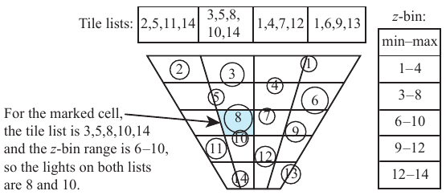

**图 20.11。** 使用 z 分箱时，根据每个光源的 z 深度为其赋予一个 ID，并为每个分块生成一个列表。每个 z 分箱保存一个最小 ID 和一个最大 ID，它们构成可能与该切片重叠的光源的保守范围。对于标记单元中的任意像素，获取两个列表并求出它们的交集。

图中文字：Tile lists 为“分块列表”；z-bin 为“z 分箱”；min–max 为“最小值—最大值”。对于标记的单元，分块列表为 3、5、8、10、14，z 分箱范围为 6—10，因此两个列表共有的光源是 8 和 10。

Drobot [385] 描述了《使命召唤：无限战争》（Call of Duty: Infinite Warfare）如何使用网格插入光源。考虑一盏静态聚光灯。它在空间中形成一个体积，例如圆锥。如果不做进一步处理，这个圆锥可能延伸相当远，直到场景边界，或为该光源定义的某个最大距离。现在设想利用场景中的静态几何体，为这盏聚光灯生成一张阴影贴图。这张贴图定义了光源照射的每个方向上的最大距离。在烘焙过程中，将这张阴影贴图转变为一个低分辨率网格，随后用它作为光源的有效体积。该网格是保守的：它利用阴影贴图各区域的最大深度构建，因此完全包围光源照亮的空间体积。与原始圆锥体积相比，这种聚光灯表示很可能与更少的簇重叠。

独立于上述过程，称为 **z 分箱**（z-binning）的光源列表存储与访问方法，所需内存远少于聚簇着色。在这种方法中，按屏幕 z 深度对光源排序，并依据这些深度赋予它们 ID。随后，使用一组 z 切片对这些光源分类，各切片的深度厚度相同，而非采用指数分布。每个 z 切片仅存储与其重叠的光源的最小和最大 ID。见图 20.11。同时还会生成分块着色列表，也可以选择进行几何体剔除。然后，每个表面位置访问这个二维分块结构，以及各切片的一维 z 分箱 ID 范围。分块列表给出该分块中所有可能影响该像素的光源。像素深度用于获取可能与对应 z 切片重叠的 ID 范围。即时计算两者的交集，就得到该簇的有效光源列表。

这种算法无需为三维网格中的每个簇创建并存储一个列表，而是只需为每个二维分块保存一个列表，再用一个固定大小的小数组保存 z 切片集合。它所需的存储、带宽使用量和预计算都更少，代价是在每个像素处确定相关光源时，需要多做一点工作。使用 z 分箱可能导致某些光源被错误分类，但 Drobot 发现，对于人造环境，光源在屏幕 xy 坐标和 z 深度上往往很少同时重叠。借助像素着色器和计算着色器，该方案能够在存在深度不连续处的分块中实现近乎完美的剔除。

用于访问物体的三维数据结构，通常可以分为与体积相关的结构，即在空间中施加网格或八叉树；与物体相关的结构，即建立包围体层次结构；以及混合结构，例如在网格单元内的内容周围使用一个包围体。Bezrati [139, 140] 在计算着色器中执行分块着色，生成增强的光源列表，其中每个光源都包含自己的最小和最大 z 深度。这样，片元就能快速排除任何与其不重叠的光源。O’Donnell 和 Chajdas [1312] 提出了**分块光源树**（tiled light trees），并在 CPU 端构建它。他们使用为每个光源保存深度边界的分块光源列表，建立包围区间层次结构。也就是说，他们没有像 Olsson 等人 [1328] 那样，为所有光源建立一个单独的三维层次结构，而是根据分块内每个光源的 z 范围，建立一个更简单的一维层次结构。这种结构非常适合 GPU 架构，也更能应对大量光源落入同一分块的情况。他们还给出了一种混合算法，可在将分块划分为单元——也就是常规聚簇着色方法——和使用光源树之间做出选择。当一个单元与其光源的平均重叠程度较低时，光源树效果最好。

局部光源列表的思路也可以用于移动设备，不过限制条件和可利用的机会有所不同。例如，在移动设备上，以传统延迟方式每次渲染一个光源，可能是最高效的方法，因为移动设备具有将 G 缓冲区保留在本地内存中的独特性质。分块前向着色可以在支持 OpenGL ES 2.0 的设备上实现，而移动 GPU 几乎都具备这种支持。利用 OpenGL ES 3.0 和名为**像素本地存储**（pixel local storage）的扩展，可以使用 ARM GPU 中的分块渲染系统，高效地生成和应用光源列表。更多信息见 Billeter 的演示文稿 [145]。Nummelin [1292] 讨论了将寒霜（Frostbite）引擎从桌面平台移植到移动平台的过程，其中包括光源分类方案的权衡，因为移动硬件对计算着色器的支持较少。由于移动设备使用分块渲染，为延迟着色生成的 G 缓冲区数据可以保留在本地内存中。Smith 和 Einig [1664] 描述了如何使用**帧缓冲区读取**（framebuffer fetch）和像素本地存储实现这一点，并发现这些机制将总体带宽成本降低了一半以上。

总的来说，分块、聚簇或其他光源列表剔除技术，都可以与延迟着色或前向着色结合，也都可以应用于贴花。光源体积剔除算法着重减少每个片元需要求值的光源数量，而将几何处理与着色解耦的思路，则可以用于平衡处理成本与带宽成本，使效率最大化。正如当所有物体始终位于视野内时，视锥体剔除只会增加耗时而没有收益一样，某些技术在各种特定条件下也可能收益甚微。如果太阳是唯一光源，就不需要进行光源剔除预处理。如果表面过度绘制很少，光源也很少，那么延迟着色的总体耗时可能更高。对于具有许多作用范围有限的照明光源的场景，无论使用前向着色还是延迟着色，花时间创建局部光源列表都是值得的。当几何体处理复杂，或者表面渲染成本很高时，延迟着色提供了一种方法，可以避免过度绘制，尽量降低程序切换和状态切换等驱动成本，并通过较少的调用渲染合并后的较大网格。应当记住，渲染同一帧时可以使用上述多种方法。最佳技术组合不仅取决于场景，也可能因物体或光源而异 [1589]。

| 比较项 | 传统前向着色 | 传统延迟着色 | 分块／聚簇延迟着色 | 分块／聚簇前向着色 |
| --- | --- | --- | --- | --- |
| 几何处理遍数 | 1 | 1 | 1 | 1—2 |
| 光照处理遍数 | 0 | 每个光源 1 遍 | 1 | 1 |
| 光源剔除 | 逐网格 | 逐像素 | 逐体积 | 逐体积 |
| 透明效果 | 容易 | 不支持 | 配合前向着色 → | 容易 |
| MSAA | 内置支持 | 困难 | 困难 | 内置支持 |
| 带宽 | 低 | 高 | 中等 | 低 |
| 改变着色模型 | 简单 | 困难 | 较复杂 | 简单 |
| 小三角形 | 慢 | 快 | 快 | 慢 |
| 寄存器压力 | 可能较高 | 低 | 可能较低 | 可能较高 |
| 阴影贴图复用 | 不支持 | 支持 | 不支持 | 不支持 |
| 贴花 | 成本高 | 成本低 | 成本低 | 成本高 |

**表 20.1。** 对于典型的桌面 GPU，比较传统单遍前向着色、延迟着色，以及分别使用延迟着色和前向着色的分块／聚簇光源分类方法。（据 Olsson [1332] 整理。）

在本节结尾，我们用表 20.1 汇总各种方法的主要差异。“透明效果”一行中的右箭头表示，对不透明表面应用延迟着色，而透明表面需要使用前向着色。“小三角形”一项指出了延迟着色的一项优势：前向渲染时，四像素组着色（第 23.1 节）可能效率不高，因为四个样本都会被完整求值。“寄存器压力”指所涉及着色器的总体复杂度。着色器使用大量寄存器可能意味着能够形成的线程更少，导致 GPU 的线程束未被充分利用 [134]。对于分块和聚簇延迟技术，如果使用着色器精简方法，寄存器压力可以变低 [273, 414, 1877]。与过去 GPU 内存更受限制的时期相比，阴影贴图复用往往已不再那么关键 [1589]。

当存在大量光源时，阴影会成为难题。一种应对方式是，仅为最近和最亮的光源以及太阳计算阴影，忽略其余光源的阴影计算，但这样会带来较次要光源漏光的风险。Harada 等人 [667] 讨论了如何在分块前向系统中使用光线投射：从每个可见表面像素向每个邻近光源发出一条光线。Olsson 等人 [1330, 1331] 讨论了用被占用的网格单元作为几何体的替代表示来生成阴影贴图，并按需创建样本。他们还提出了一种混合系统，将这些范围受限的阴影贴图与光线投射结合。

采用世界空间而非屏幕空间生成光源列表，是为聚簇着色组织空间的另一种方式。这种方法在某些情况下可能合理，但对于大型场景，可能应当避免使用，一方面是由于内存限制 [385]，另一方面是因为远处的簇将只有像素大小，从而损害性能。Persson [1386] 提供了一个基础聚簇前向系统的代码，其中静态光源存储在三维世界空间网格中。

## 20.5 延迟纹理处理

来源：《Real-Time Rendering》第4版，书页905—908（PDF物理页926—929）。本节从20.5标题开始，到20.6标题之前结束。

延迟着色避免了过度绘制，也避免了先计算片元的着色结果、随后又丢弃这些结果所产生的开销。然而，在构建G缓冲区时，过度绘制依然存在。一个物体被光栅化，并且它的全部参数都被取回，在此过程中会进行数次纹理访问。如果随后绘制的另一个物体遮挡了这些已存储的样本，那么渲染第一个物体所消耗的全部带宽就都浪费了。一些延迟着色系统会执行部分或完整的z预通道，以免为后来被另一个物体覆盖的表面访问纹理[38, 892, 1401]。不过，许多系统都尽可能避免增加一个几何通道。除了纹理读取，顶点数据访问及其他数据访问也会消耗带宽。对于细节丰富的几何体，额外通道消耗的带宽可能超过它在纹理访问方面节省的带宽。

构建和访问的G缓冲区越多，内存与带宽开销就越高。在某些系统中，带宽可能不是问题，因为瓶颈可能主要位于GPU的处理器内部。正如第18章详细讨论过的，瓶颈始终存在，而且它可能、也确实会随时变化。之所以有如此多的效率优化方案，一个主要原因是每种方案都是针对某个特定平台和场景类型开发的。其他因素，例如系统实现与优化的难度、内容制作的便利程度，以及各种各样的人为因素，也会决定最终构建什么样的系统。

虽然GPU的计算能力和带宽能力都在不断提升，但二者的增长速度不同，计算能力增长得更快。这一趋势加上GPU新增的功能，意味着要使系统更能适应未来，可以把目标设为让瓶颈落在GPU计算上，而不是缓冲区访问上[217, 1332]。

目前已经开发出几种不同的方案，它们只使用一个几何通道，并把纹理读取推迟到真正需要时。Haar和Aaltonen[625]介绍了《刺客信条：大革命》（Assassin’s Creed Unity）如何使用虚拟延迟纹理处理（virtual deferred texturing）。他们的系统维护一张8192 × 8192的局部纹理图集，其中的可见纹理从一个大得多的集合中选出，每张纹理的分辨率为128 × 128。这样的图集尺寸允许存储能够访问图集中任意纹素的纹理坐标(u, v)。每个坐标用16位存储；8192个位置需要13位，因此剩下3位，也就是8个等级，用来提供亚纹素精度。系统还存储一个32位切线基，并把它编码为四元数[498]（第16.6节）。这样就只需要一个64位G缓冲区。由于几何通道完全不进行纹理访问，过度绘制的开销可以极低。建立这个G缓冲区之后，才在着色时访问虚拟纹理。mipmap处理需要梯度，但系统并不存储梯度，而是检查每个像素的相邻像素，使用(u, v)值最接近的那些像素实时计算梯度。材质ID也可以通过确定访问的是纹理图集中的哪个图块来推导：将纹理坐标值除以128，也就是纹理的分辨率即可。

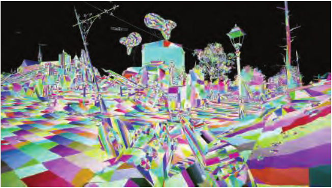

图20.12　在可见性缓冲区[217]的第一个通道中，只渲染三角形ID和实例ID，并将它们存储在单个G缓冲区内。这里为每个三角形赋予不同颜色，以便可视化。（图片由Electronic Arts的Graham Wihlidal提供[1885]。）

这款游戏还采用了另一种降低着色开销的技术：以四分之一分辨率渲染，并使用一种特殊形式的MSAA。在采用AMD GCN的游戏主机上，或者使用OpenGL 4.5、OpenGL ES 3.2或其他扩展[2, 1406]的系统上，可以按需要设置MSAA采样模式。Haar和Aaltonen为4× MSAA设置了网格模式，使每个网格样本都直接对应全分辨率屏幕中的一个像素中心。以四分之一分辨率渲染，就能利用MSAA的多重采样特性。纹理坐标(u, v)和切线基可以在表面上无损插值，也可以使用8× MSAA（相当于每个像素采用2× MSAA）。渲染枝叶和树木等存在大量过度绘制的场景时，他们的技术可以显著减少着色器调用次数以及G缓冲区的带宽开销。

只存储纹理坐标和基已经相当精简了，但还可以采用其他方案。Burns和Hunt[217]介绍了一种他们称为可见性缓冲区（visibility buffer）的方法，其中存储两项数据：三角形ID和实例ID。参见图20.12。几何通道着色器速度极快，因为它不访问纹理，只需存储这两个ID值。所有三角形和顶点数据，包括位置、法线、颜色、材质等，都保存在全局缓冲区中。在延迟着色通道中，利用为每个像素存储的三角形ID和实例ID取回这些数据。将像素对应的视线射线与三角形求交，得到重心坐标，再用它们对三角形各顶点的数据进行插值。通常执行频率较低的其他计算，例如顶点着色器计算，现在也必须逐像素执行。纹理梯度值也需要为每个像素从头计算，而不是通过插值得到。随后使用所有这些数据对像素着色，并采用任意所需的分类方案来应用光源。

虽然这一切听起来开销很大，但要记住，计算能力的增长速度快于带宽能力。这项研究倾向于采用计算密集的流水线，以尽量减少过度绘制造成的带宽浪费。如果场景中的网格少于64k个，并且每个网格包含的三角形少于64k个，那么每个ID的长度就是16位，G缓冲区可以小到每像素32位。更大的场景则会使它增加到48位或64位。

Stachowiak[1685]介绍了一种可见性缓冲区的变体，它使用了GCN架构提供的一些能力。在初始通道中，还会逐像素计算并存储三角形上对应位置的重心坐标。与之后为每个像素单独进行射线与三角形求交相比，GCN片元（即像素）着色器能够以很低的开销计算重心坐标。虽然需要额外的存储空间，这种方法却有一个重要优势。对于带动画的网格，原始可见性缓冲区方案需要将修改后的网格数据流式输出到缓冲区，以便在延迟着色时取回修改后的顶点位置。保存变换后的网格坐标会消耗额外带宽。在第一个通道中存储重心坐标后，顶点位置就已经完成了使命，不必再次取回，从而避免了原始可见性缓冲区的这个缺点。不过，如果需要到摄像机的距离，也必须在第一个通道中存储这个值，因为以后无法再重建它。

与前面的方案类似，这种流水线适合将几何处理频率与着色频率解耦。Aaltonen[2]指出，MSAA网格采样方法可以应用于各个方案，从而进一步减少所需的平均内存量。他还讨论了这三种方案在存储布局上的变化，以及计算开销和能力上的差异。Schied和Dachsbacher[1561, 1562]则选择了另一个方向：在可见性缓冲区的基础上，利用MSAA功能减少高质量抗锯齿所需的内存消耗和着色计算量。

Pettineo[1407]指出，无绑定纹理功能（第6.2.5节）的出现，使延迟纹理处理的实现更加简单。他的延迟纹理处理系统建立了一个较大的G缓冲区，存储深度、单独的材质ID和深度梯度。在渲染Sponza模型时，将这个系统的性能与采用z预通道和不采用z预通道的聚类前向方案进行了比较。关闭MSAA时，延迟纹理处理总是比前向着色更快；启用MSAA时，它则会变慢。正如第5.4.2节所述，随着屏幕分辨率提高，大多数电子游戏已经逐渐放弃MSAA，转而依赖时间抗锯齿，因此从实际使用角度看，对MSAA的支持并没有那么重要。

Engel[433]指出，DirectX 12和Vulkan开放的API功能使可见性缓冲区这一概念更具吸引力。利用计算着色器执行三角形集合剔除（第19.8节）及其他移除技术，可以减少被光栅化的三角形数量。DirectX 12的ExecuteIndirect命令可以创建相当于优化后索引缓冲区的效果，使其只显示未被剔除的三角形。他的分析表明，当它与先进的剔除系统[1883, 1884]配合使用时，在San Miguel场景的所有分辨率和抗锯齿设置下，可见性缓冲区的性能都优于延迟着色。随着屏幕分辨率提高，性能差距也随之增大。未来GPU的API和能力发生变化，很可能会进一步提高性能。Lauritzen[993]讨论了可见性缓冲区，并指出有必要推动GPU演进，以改进在延迟处理环境中访问和处理材质着色器的方式。

Doghramachi和Bucci[363]详细讨论了他们称为deferred+的延迟纹理处理系统。他们的系统在早期就集成了积极的剔除技术。例如，对上一帧的深度缓冲区进行降采样和重投影，为当前场景中的每个像素提供保守的剔除深度。这些深度有助于在渲染视锥内所有可见网格的包围体时进行遮挡测试，第19.7.2节对此有过简要讨论。他们指出，如果存在用于镂空的alpha纹理，那么任何初始通道中都必须访问它（任何z预通道中也同样如此），以免镂空部分后面的物体被隐藏。他们的剔除和光栅化过程生成一组G缓冲区，其中包含深度、纹理坐标、切线空间、梯度和材质ID，随后用这些数据对像素着色。虽然这种方法的G缓冲区数量多于其他延迟纹理处理方案，但它确实避免了不必要的纹理访问。对于《杀出重围：人类分裂》（Deus Ex: Mankind Divided）中的两个简化场景模型，他们发现deferred+比聚类前向着色运行得更快，并认为更复杂的材质和光照还会进一步拉大差距。他们还指出，线程束的利用情况显著改善，这意味着微小三角形造成的问题更少，因此GPU曲面细分的表现更好。与延迟着色相比，他们的延迟纹理处理实现还有其他一些优势，例如能够更高效地处理更广泛的材质。它的主要缺点则与大多数延迟方案相同，涉及透明度和抗锯齿。

## 20.6 物体空间与纹理空间着色

来源：《Real-Time Rendering, Fourth Edition》，书页 908—913（PDF 物理页 929—934）。范围从 20.6 标题起，到“Further Reading and Resources”标题之前；章末延伸阅读另存。

将几何体的采样速率与着色值的计算速率解耦，是本章反复出现的主题。这里介绍几种不容易归入前面各类的替代方法。特别是，我们要讨论一些混合方法，它们借鉴了最早出现在 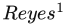 批处理渲染器 [289] 中的概念。皮克斯及其他公司多年来一直使用它制作电影。如今，制片工作室主要使用某种形式的光线追踪或路径追踪进行渲染；不过在当时，Reyes 以创新而高效的方式解决了若干渲染问题。

Reyes 的关键概念是微多边形。每个表面都被切分成极其精细的四边形网格。在最初的系统中，切分是相对于视点进行的，目标是使每个微多边形的宽和高都约为一个像素的一半，从而满足奈奎斯特极限（5.4.1 节）。位于视锥体之外或背向视点的四边形会被剔除。在该系统中，每个微多边形经过着色后被赋予一个单一颜色。这项技术后来发展为对微多边形网格的顶点进行着色 [63]。为了说明其中探索的思想，我们这里主要讨论原始系统。

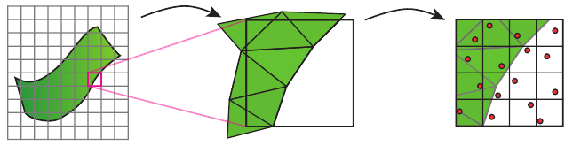

**图 20.13** Reyes 渲染流水线。每个物体先被曲面细分为微多边形，然后分别着色。将每个像素的一组抖动采样点（红色）与微多边形进行比较，并利用结果渲染图像。

每个微多边形都被插入像素内一个经过抖动的 4 × 4 采样网格中，也就是一个超采样的 z 缓冲区。抖动通过以噪声代替混叠来避免混叠。由于着色依据微多边形的覆盖范围、在光栅化之前完成，这类技术称为**基于物体的着色**。与之相比，前向着色在光栅化期间于屏幕空间中进行着色，而延迟着色则在光栅化之后进行。见图 20.13。

在物体空间中着色的一个优点是，材质纹理通常与其微多边形直接相关。也就是说，可以对几何物体进行细分，使每个微多边形内的纹素数量为 2 的幂。着色时便能为微多边形取得精确的、经过滤波的 mipmap 样本，因为它与被着色的表面面积直接对应。原始 Reyes 系统还意味着对纹理的访问具有缓存一致性，因为微多边形是按顺序访问的。这项优势并不适用于所有纹理；例如，用作反射贴图的环境纹理仍必须以传统方式采样和滤波。

运动模糊和景深效果也很适合这种组织方式。对于运动模糊，在一帧的时间区间内为每个微多边形选取一个经过抖动的时刻，并赋予它在该时刻沿运动路径所处的位置。这样，每个微多边形沿运动方向的位置就会有所不同，从而形成模糊。景深以类似方式实现，根据弥散圆来分布微多边形。

Reyes 算法也有一些缺点。所有物体都必须能够进行曲面细分，并且必须切分得非常精细。着色发生在 z 缓冲区中的遮挡测试之前，因此可能因过度绘制而浪费。按奈奎斯特极限采样并不意味着能够捕捉尖锐镜面高光之类的高频现象，而只是意味着采样足以重建较低的频率。

通常，每个物体都必须能够“展开为参数图”，换句话说，其顶点必须具有 (u, v) 纹理坐标，使模型上每个不同的区域都对应唯一的纹素。示例见第 23 页的图 2.9 和第 173 页的图 6.6。可以把基于物体的着色理解为首先烘焙着色结果，用摄像机确定与视点有关的效果，并可能限制在每块表面区域上投入的工作量。在 GPU 上执行基于物体的着色，一种简单方法是把物体曲面细分到精细的亚像素级别，然后对网格的每个顶点着色。这可能代价高昂，因为每个三角形的设置成本无法分摊到多个像素上。四像素组渲染（23.1 节）又进一步加重了开销：一个单像素大小的三角形会产生四次像素着色器调用。GPU 针对覆盖相当数量像素的三角形做了优化，例如覆盖 16 个或更多像素的三角形（23.10.3 节）。

Burns 等人 [216] 探索了在确定物体的哪些位置可见之后，再执行物体空间着色的方法。他们通过物体的“多边形网格”确定这些位置：先切分，尽可能剔除，再光栅化。随后使用独立的物体空间“着色网格”对可见区域着色，其中每个纹素对应一块表面区域。着色网格可以采用不同于多边形网格的分辨率。他们发现，经过精细曲面细分的几何表面带来的收益很小，因此将二者解耦能够更高效地利用资源。他们只在模拟器中实现了这项工作，但其技术影响了较新的研究和开发。

大量受 Reyes 启发的研究，考察了针对各种现象在 GPU 上进行更快着色的方法。Ragan-Kelley 等人 [1455] 提出一种基于解耦采样的硬件扩展，并将其想法应用于运动模糊和景深。样本有五个维度：两个表示亚像素位置，两个表示镜头上的位置，一个表示时间。可见性和着色分别采样。“解耦映射”确定给定可见性样本所需的着色样本。Liktor 和 Dachsbacher [1042, 1043] 提出了一种思路相近的延迟着色系统，在计算着色样本时将其缓存，并在随机光栅化期间使用。运动模糊和景深等效果不需要很高的采样率，因此着色计算可以复用。Clarberg 等人 [271] 提出了在纹理空间中计算着色的硬件扩展。这些扩展消除了四像素组过量着色问题，因而允许使用更小的三角形。由于着色是在纹理空间中计算的，像素着色器从纹理中查询着色结果时，可以使用双线性滤波器或更复杂的滤波器。这样就能通过降低纹理分辨率减少着色成本。对于低频项，由于可以使用滤波，这项技术通常效果很好。

Andersson 等人 [48] 采用另一种方法，称为**纹理空间着色**。每个三角形都要经过视锥体剔除和背面剔除测试，然后将其展开后的表面映射到输出目标的相应区域，依据其 (u, v) 参数化对该三角形着色。同时，利用几何着色器计算每个可见三角形在摄像机视图中的大小。这个大小值用于确定应将三角形放入哪个类似 mipmap 的层级。通过这种方式，为物体执行的着色工作量与其屏幕覆盖范围关联起来。见图 20.14。他们使用随机光栅化来渲染最终图像。生成的每个片元都从纹理中查询它的着色颜色。同样，计算出的着色值可以在运动模糊和景深效果中复用。

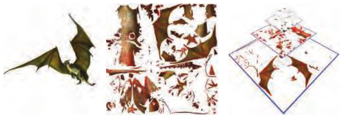

**图 20.14** 物体空间纹理着色。左侧是包含运动模糊的最终渲染图像。中间显示参数图中的可见三角形。右侧根据每个三角形的屏幕覆盖范围，将其放入适当的 mipmap 层级，供最终基于摄像机的光栅化遍使用。（经 M. Andersson [48] 和 Intel Corporation 许可转载；版权归 Intel Corporation 所有，2014 年。）

Hillesland 和 Yang [747, 748] 在纹理空间着色概念的基础上进一步构建系统，并采用了与 Liktor 和 Dachsbacher 类似的缓存概念。他们将几何体绘制到最终视图，使用计算着色器填充一种类似 mipmap 的结构，其中存储基于物体的着色结果；随后再次渲染几何体，以访问该纹理并显示最终着色。第一遍还会保存一个三角形 ID 可见性缓冲区，使计算着色器之后能够访问顶点属性以进行插值。他们的系统考虑了时间上的一致性。由于着色位于物体空间中，同一区域在每一帧都关联同一个输出纹理位置。如果某块表面区域在给定 mipmap 层级上的着色结果先前已经计算过，而且还不算太旧，就会复用它，而不是重新计算。结果会随材质、光照及其他因素而变化，但他们发现，以 60 FPS 运行时隔帧复用一次着色样本，产生的误差可以忽略不计。他们还确定，mipmap 层级不仅可以依据屏幕尺寸选择，也可以依据其他因素的变化选择，例如一个区域内法线方向的变化。更高的 mipmap 层级意味着每个屏幕片元需要计算的着色更少，他们发现这可以带来可观的节省。

Baker [94] 介绍了 Oxide Games 为游戏《奇点灰烬》（Ashes of the Singularity）开发的渲染器。它受到 Reyes 的启发，尽管实现细节有很大差异；它以每个模型整体为单位使用纹理空间着色。物体表面可以覆盖任意数量的材质，并通过遮罩区分。其流程如下：

- 分配若干张大型“主”纹理用于着色，尺寸为 4k × 4k，每通道 16 位。
- 评估所有物体。如果物体位于视图中，就计算它在屏幕上的估计面积。
- 使用该面积为每个物体分配主纹理的一定比例。如果请求的总面积超过可用纹理空间，就按比例缩小分配，使所有请求都能容纳。
- 在计算着色器中执行基于纹理的着色，依次应用模型上的每一种材质。各材质的结果累积到分配给它的主纹理中。
- 根据需要为主纹理计算 mipmap 层级。
- 然后对物体进行光栅化，使用主纹理对它们着色。

每个物体使用多种材质，就能实现这样的效果：一个地形模型同时包含泥土、道路、地表覆盖物、水、雪和冰，各自具有自己的材质 BRDF。需要时，抗锯齿可以同时在像素层面和着色器层面发挥作用，因为着色期间能够访问物体表面面积及其与主纹理关系的完整信息。例如，这使系统可以稳定处理镜面反射指数极高的模型。由于着色结果附着于整个物体，而与可见性无关，因此着色还可以采用不同于光栅化的帧率进行计算。研究发现，以 30 FPS 进行着色已经足够，而光栅化以 60 FPS 运行，虚拟现实系统则以 90 FPS 运行。异步着色意味着，即使着色器负载变得过高，仍能维持几何体的帧率。

实现这样的系统存在若干挑战。与典型游戏引擎相比，整体发送的批次数大约翻倍，因为在物体着色步骤中，每个物体的“材质四边形”都要由计算着色器处理，随后光栅化时还要绘制该物体。不过，多数批次很简单，而 DirectX 12 和 Vulkan 之类的 API 有助于消除额外开销。依据物体大小为其分配主纹理的方式，会显著影响图像质量。在屏幕上很大的物体，或者像地形这样纹素密度存在变化的物体，可能出现问题。为使主纹理中不同分辨率的地形块之间保持平滑过渡，需要额外执行拼接处理。环境光遮蔽之类的屏幕空间技术实现起来很有挑战。与原始可见性缓冲区一样，影响物体形状的动画必须执行两次，分别用于着色和光栅化。物体先被着色、随后才被判定为受遮挡，这会造成浪费。对于即时战略游戏这样深度复杂度较低的应用，这项成本可以相对较低。与复杂的延迟着色器不同，每种材质都很容易求值，而且着色是在整个物体的参数图上完成的。采用简单着色器的物体，例如粒子和树木，从这项技术中获益很少。为了性能，可以改用前向着色渲染这些效果。如图 20.15 所示，能够处理大量光源可以使渲染场景更加丰富。

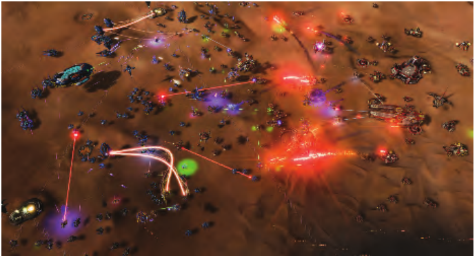

**图 20.15** 《奇点灰烬》中的一个场景，由大约一千个光源照亮。其中，每辆载具和每颗子弹都至少有一个光源。（图片由 Oxide Games 和 Stardock Entertainment 提供。）

关于高效着色的讨论到此结束。对于不同应用中用于提升速度和结果质量的众多专门技术，我们只作了初步介绍。这里的目标是呈现用于加速着色的常用算法，并解释它们如何以及为何出现。随着图形硬件能力和 API 的演进，以及屏幕分辨率、美术工作流程和其他要素随时间变化，高效着色技术仍将继续以新的、很可能出乎预料的方式得到研究和发展。

如果你已经从本书开头读到这里，现在就已经具备了现代交互式渲染引擎所用主要算法的实用知识。我们的目标之一，是帮助你掌握必要知识，使你能够读懂本领域当前的文章和演讲。如果你希望了解这些要素如何协同工作，我们强烈推荐阅读 Courrèges [293, 294] 和 Anagnostou [38] 关于不同商业渲染器的优秀文章。从这里开始，后续章节将深入若干领域，例如面向虚拟现实与增强现实的渲染、相交与碰撞检测算法，以及图形硬件的体系结构特性。

¹ **原书脚注 1：** “Reyes”这个名称受到雷耶斯角半岛（Point Reyes peninsula）的启发，有时也全大写为“REYES”，作为“Renders Everything You Ever Saw”（渲染你曾见过的一切）的首字母缩写。

## 第20章 延伸阅读与资源

来源：《Real-Time Rendering, Fourth Edition》，书页 913—914（PDF 物理页 934—935），章末“Further Reading and Resources”及其全部续文。

那么，这些方法的各种组合——延迟、前向、分块、分簇、可见性——究竟哪种更好？每一种都有自己的优势，答案是“视情况而定”。平台、场景特征、光照模型和设计目标等因素都可能发挥作用。作为起点，我们推荐 Pesce 关于各种方案的有效性与权衡的广泛讨论 [1393, 1397]。

SIGGRAPH 课程“Real-Time Many-Light Management and Shadows with Clustered Shading”（使用分簇着色进行实时多光源管理与阴影处理）[145, 1331, 1332, 1387] 全面介绍了分块与分簇着色技术，以及它们如何与延迟着色和前向着色配合使用，还讨论了阴影映射、在移动设备上实现光源分类等相关主题。Stewart 和 Thomas 较早的一次演讲 [1700] 解释了分块着色，并给出大量计时结果，展示各种因素如何影响性能。Pettineo 的开源框架 [1401] 比较了分块前向系统与延迟系统，并包含广泛的 GPU 测试结果。

关于实现细节，Zink 等人关于 DirectX 11 的书 [1971] 用了大约 50 页讨论延迟着色，并提供众多代码示例。NVIDIA GameWorks 代码示例 [1299] 包含一种用于延迟着色的 MSAA 实现。Mikkelsen [1210] 以及 Örtegren 和 Persson [1340] 在《GPU Pro 7》中的文章，介绍了现代基于 GPU 的分块与分簇着色系统。Billeter 等人 [144] 给出了实现分块前向着色的编码细节，Stewart [1701] 则逐步讲解了在计算着色器中执行分块剔除的代码。Lauritzen [990] 提供了分块延迟着色的完整实现，Pettineo [1401] 构建了一个框架，将其与分块前向着色进行比较。Dufresne [390] 提供了分簇前向着色的演示代码。Persson [1386] 提供了一种基础的世界空间分簇前向渲染方案的代码。最后，van Oosten [1334] 讨论了各种优化，并给出附带代码的演示系统，实现不同形式的分簇、分块及普通前向渲染，展示它们之间的性能差异。
