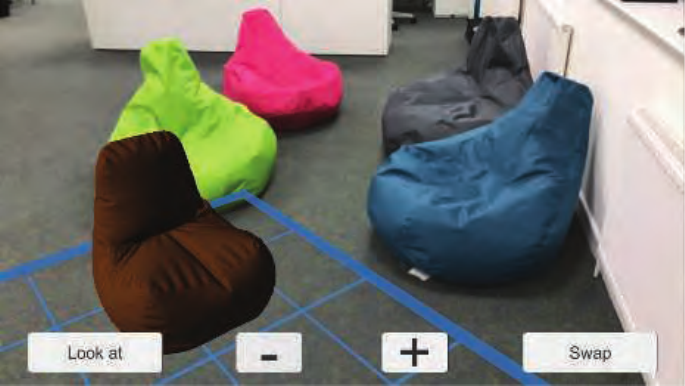
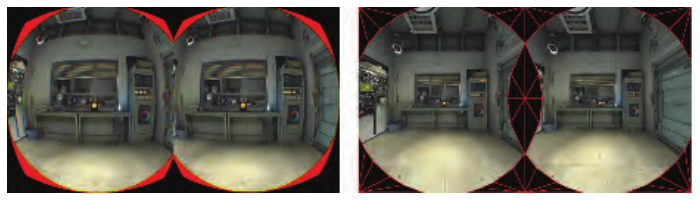
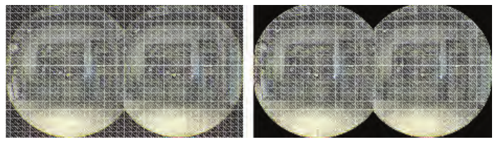
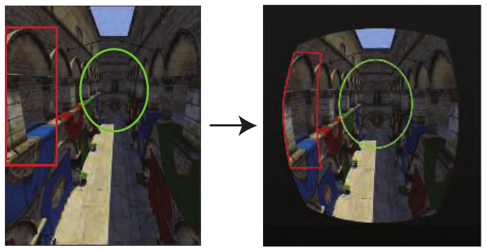
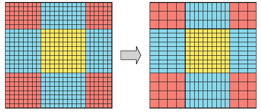
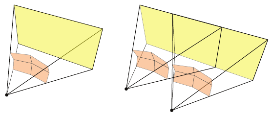
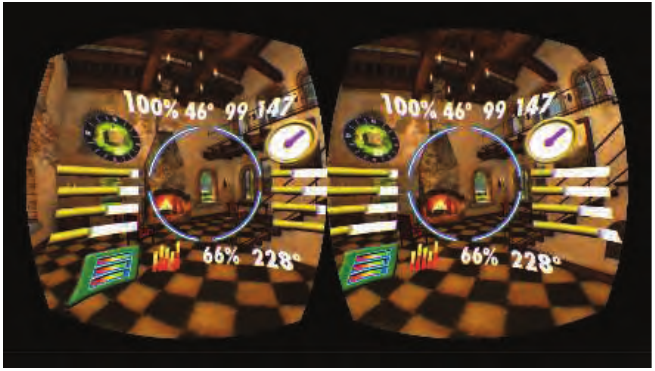
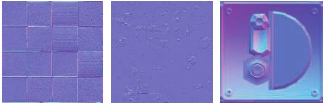
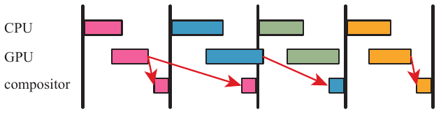
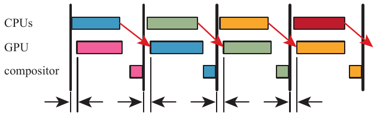

# Real-Time Rendering 第21章 虚拟现实与增强现实 中文合集

> 依据用户提供的《Real-Time Rendering》第四版 PDF 完整翻译。原图配中文图注；复杂数学已排版为本地图片，简单符号直接显示。保留原书技术年代、公式编号与引用编号。

## 目录

- [21.1 设备与系统概览](<Real-Time_Rendering_4th_中文/第21章/21.01.md>)

- [21.2 物理要素](<Real-Time_Rendering_4th_中文/第21章/21.02.md>)

- [21.3 API 与硬件](<Real-Time_Rendering_4th_中文/第21章/21.03.md>)

- [21.4 渲染技术](<Real-Time_Rendering_4th_中文/第21章/21.04.md>)

## 章首导言

来源：《Real-Time Rendering, 4th Edition》第21章章首导言，书页915—916（PDF物理页936—937）；正文截至21.1节标题之前。

> “现实就是那种即使你不再相信它，它也不会消失的东西。”
>
> ——菲利普·K. 迪克（Philip K. Dick）

虚拟现实（VR）与增强现实（AR）是试图以真实世界刺激感官的相同方式来刺激你的感官的技术。在计算机图形学领域，增强现实将合成物体融入我们周围的世界；虚拟现实则完全替代这个世界。见图21.1。本章重点介绍这两种技术特有的渲染技术。它们有时被统称为“XR”，其中的X可以代表任意字母。这里的大部分内容将侧重虚拟现实技术，因为在本书写作时，这项技术应用得更为广泛。

渲染只是这些领域的一小部分。从硬件角度来看，系统会使用某种GPU，而这是系统中人们已经相当了解的一部分。系统开发者面临的挑战还包括：制造精确且使用舒适的头部跟踪传感器[994, 995]、有效的输入设备（可能带有触觉反馈或眼动跟踪控制）、舒适的头戴装置和光学器件，以及令人信服的音频效果。在性能、舒适度、活动自由度、价格等因素之间取得平衡，使这一领域的设计极具挑战性。

图21.1　本书前三位作者使用不同的VR系统。Tomas正在使用HTC Vive；Eric身处Birdly仿鸟飞行模拟器中；Naty正在使用Oculus Rift。

我们关注交互式渲染，以及这些技术如何影响图像的生成方式。首先简要介绍当时可用的各种虚拟现实与增强现实系统，随后讨论一些系统的SDK和API所具备的能力及其目标。最后介绍为了获得最佳用户体验，应当避免使用或需要修改的特定计算机图形学技术。

## 21.1 设备与系统概览

来源：《Real-Time Rendering, 4th Edition》第21.1节，书页916—919（PDF物理页937—940）；从本节标题起，至21.2节标题前止。保留原书写作时的技术陈述。

除了CPU和GPU之外，用于图形的虚拟现实与增强现实设备可以分为传感器和显示器两类。传感器包括检测用户旋转和位置的跟踪器，以及各种各样的输入方法和设备。在显示方面，一些系统依靠手机屏幕，并在逻辑上将其分为两半。专用系统通常具有两个独立的显示器。在虚拟现实系统中，显示器就是用户能够看到的全部内容。对于增强现实，则通过专门设计的光学器件，将虚拟内容与真实世界的视野结合起来。

虚拟现实与增强现实都是历史悠久的领域，近年来却涌现出大量成本更低的新系统。这在很大程度上直接或间接得益于各种移动设备与游戏主机技术的普及[995]。手机可以用来提供沉浸式体验，有时效果好得令人惊讶。手机可以装入头戴式显示器（HMD）中：这类装置既包括Google Cardboard这样的简易观看器，也包括GearVR这样无需手持、并提供额外输入设备的装置。手机通过感知重力、磁北方向及其他机制的方向传感器，确定显示器的朝向。朝向也称为姿态，具有三个自由度，例如第4.2.1节讨论过的偏航、俯仰和滚转。¹ API可以将朝向作为一组欧拉角、一个旋转矩阵或一个四元数返回。固定视点的全景图和视频等真实世界内容，可以在这些设备上获得良好的效果，因为根据用户朝向呈现正确二维视图的开销相对较低。

移动设备的计算能力相对有限，而且长时间使用GPU和CPU硬件需要消耗电力，这些因素限制了它们能够完成的工作。有线连接的虚拟现实设备通过一组线缆将用户的头戴装置连接到固定的计算机，虽然限制了活动范围，却能够使用更强大的处理器。

这里仅简要介绍Oculus Rift和HTC Vive这两个系统的传感器。两者都提供六自由度（6-DOF）跟踪，即朝向与位置跟踪。Rift通过最多三个独立的红外摄像头，跟踪头戴式显示器和控制器的位置。当头戴装置的位置由固定的外部传感器确定时，这种方式称为由外向内跟踪（outside-in tracking）。头戴装置外侧的一组红外LED使其能够被跟踪。Vive使用一对“灯塔”，以很短的时间间隔向房间内发射不可见光；头戴装置和控制器中的传感器检测这些光，从而通过三角测量确定各自的位置。这是由内向外跟踪（inside-out tracking）的一种形式，其中传感器是头戴式显示器的一部分。

手持控制器是一种标准设备，因为它可以被跟踪，并能随用户一起移动，这与鼠标和键盘不同。人们还基于多种技术，为VR开发了许多其他类型的输入设备。这些设备包括手套或其他肢体、身体跟踪装置，眼动跟踪设备，以及模拟原地运动的设备，例如压力垫、单向或全向跑步机、固定式自行车和可容纳人的巨型仓鼠球等，这里仅列举了其中少数几种。除了光学系统，人们还探索了基于磁、惯性、机械、深度检测和声学现象的跟踪方法。

增强现实的定义是：将计算机生成的内容与用户看到的真实世界结合起来。任何在图像上叠加文本数据、提供抬头显示（HUD）的应用，都是增强现实的一种基本形式。2009年推出的Yelp Monocle在摄像头视图上叠加商家的用户评分和距离。移动版Google Translate可以用翻译后的内容替换标牌文字。Pokémon GO等游戏在真实环境中叠加想象出来的生物。Snapchat能够检测面部特征，并添加装扮元素或动画。

对于合成渲染而言，更值得关注的是混合现实（MR）。它是增强现实的一个子集，真实世界与三维虚拟内容在其中实时融合并相互作用[1570]。混合现实的一种经典应用是在外科手术中，将患者器官的扫描数据与摄像头拍摄的身体外部视图融合。这一应用场景假定系统通过线缆连接，具有相当强大的计算能力和很高的精度。另一个例子是与虚拟袋鼠玩“捉人”游戏，房屋中的真实墙壁可以遮住你的对手。在这种情况下，活动自由度更为重要，而配准或其他影响质量的因素则没有那么关键。

这个领域使用的一种技术是在头戴式显示器前方安装摄像头。例如，每台HTC Vive都有一个可供开发者访问的前置摄像头。摄像头拍到的世界视图被送至双眼，合成图像可以与之合成。这有时称为视频透视式AR或VR（pass-through AR or VR），或中介现实（mediated reality）[489]，用户并不是直接观察环境。使用这种视频流的一个优点是，能够更充分地控制虚拟物体与真实物体的融合。缺点是，用户感知到的真实世界存在一定延迟。Vrvana的Totem和Occipital的Bridge就是采用这种头戴式显示器配置的AR系统。

在本书写作时，微软的HoloLens是最知名的混合现实系统。它是一种无需线缆连接的系统，CPU、GPU以及微软所称的HPU（全息处理单元）都内置于头戴装置中。HPU是一种定制芯片，由24个数字信号处理核心组成，功耗低于10瓦。这些核心用于处理一个类似Kinect的摄像头所采集的环境数据。摄像头观察环境，其视图与加速度计等其他传感器一起完成由内向外跟踪；额外的优点是不需要灯塔、二维码（也称为基准标记）或其他外部要素。HPU用于识别一组数量有限的手势，这意味着基本交互不需要额外的输入设备。在扫描环境时，HPU还提取深度并推导几何数据，例如表示真实世界表面的平面和多边形。这些几何数据随后可用于碰撞检测，例如让虚拟物体放置在真实世界的桌面上。

利用HPU进行跟踪时，系统会创建称为“空间锚点”的真实世界定位点，从而支持更大的活动范围，实际上几乎可以延伸到世界上的任何地方。虚拟物体的位置随后相对于某个特定的空间锚点设置[1207]。设备对这些锚点位置的估计也能够随时间推移而改善。这类数据可以共享，因此多个用户能够在同一位置看到相同的内容。还可以通过定义锚点，让位于不同地点的用户协作处理同一个模型。

一对透明屏幕让用户在看到真实世界的同时，也能看到投影到这些屏幕上的内容。请注意，这与手机使用增强现实的方式不同，手机是用摄像头捕获真实世界的视图。使用透明屏幕的一个优点是，真实世界本身不会出现延迟或显示问题，也不消耗处理能力。这类显示系统的缺点是，虚拟内容只能增加用户所见世界的亮度。例如，一个较暗的虚拟物体无法遮挡其后方更亮的真实物体，因为光只能增加。这可能使虚拟物体呈现出半透明的感觉。HoloLens还配备了LCD调光器，有助于避免这一效果。经过适当调整，这种系统能够有效地呈现与现实融合的三维虚拟物体。

苹果的ARKit和谷歌的ARCore帮助开发者为手机和平板电脑创建增强现实应用。通常的做法是显示单个视图（非立体视图），设备由用户手持，并与双眼保持一定距离。由于物体被叠加在摄像头拍摄的真实世界视图上，因此可以完全不透明。见图21.2。ARKit结合设备的运动感知硬件，以及摄像头能够看到的一组显著特征，实现由内向外跟踪。逐帧跟踪这些特征点，有助于精确确定设备当前的位置和朝向。与HoloLens一样，系统会发现水平和垂直表面，并确定它们的范围，再将这些信息提供给开发者[65]。

图21.2　一幅来自ARKit的图像。地面平面被检测出来，并显示为蓝色网格。距离最近的豆袋椅是添加在地面平面上的虚拟物体。它缺少阴影，不过可以为该物体添加阴影，并将阴影混合叠加到场景上。（图片由Autodesk, Inc.提供。）

英特尔的Project Alloy是一种无需线缆连接的头戴式显示器。与HoloLens一样，它拥有传感器阵列，用于检测房间中的大型物体和墙壁。与HoloLens不同，这种头戴式显示器不允许用户直接观察真实世界。然而，它感知周围环境的能力带来了英特尔所称的“融合现实”（merged reality），在其中，真实物体能够在虚拟世界里具有令人信服的存在感。例如，用户可以伸手触及虚拟世界中的控制台，同时触碰到真实世界中的一张桌子。

虚拟现实与增强现实的传感器和控制器正在快速演进，各种引人入胜的技术以惊人的速度涌现。这些技术有望带来更少干扰用户的头戴装置、更大的活动自由度和更好的体验。例如，谷歌的Daydream VR与高通的Snapdragon VR头戴装置都无需线缆连接，并使用不需要外部传感器或设备的由内向外位置跟踪。HP、Zotac和MSI的一些系统将计算机背在用户背上，从而在无需固定线缆连接的同时提供更强的计算能力。英特尔的WiGig无线网络技术使用短距离的90 GHz无线电，将图像从PC发送到头戴装置。另一种方法是在云端执行开销高昂的光照计算，再将压缩后的这些信息发送至头戴装置，由其中更轻便、计算能力较弱的GPU完成渲染[1187]。采集点云、将点云体素化，并以交互速率渲染体素化表示等软件方法[930]，为虚拟与现实的融合开辟了新的途径。

本章大部分内容关注显示器及其在VR与AR中的使用。我们首先简要介绍图像如何显示在屏幕上的一些物理机制，以及其中涉及的若干问题。接下来介绍SDK与硬件系统提供了哪些功能，以简化编程并增强用户对场景的感知。随后说明这些不同因素如何影响图像生成，并讨论某些图形技术应当如何修改，或者为何可能需要完全避免使用。最后讨论能够提高效率、改善参与者体验的渲染方法与硬件增强功能。

¹ 原书脚注1：许多手机的惯性测量单元具有六个自由度，但位置跟踪误差可能迅速累积。

译注：原书书页919将WiGig的无线电频率写为“90 GHz”，此处按原文保留；该数值疑有误，未在译文中擅自改动。

## 21.2 物理要素

来源：《Real-Time Rendering, Fourth Edition》，书页 919—924（PDF 物理页 940—945）。范围从 21.2 标题起，至 21.3 标题前，包含全部下级小节及图 21.3、图 21.4。

本节讨论现代 VR 和 AR 系统的各种组成部分与特性，尤其是与图像显示有关的部分。这些信息提供了一个框架，帮助我们理解厂商所提供工具背后的逻辑。

### 21.2.1 延迟

在 VR 和 AR 系统中，减轻延迟的影响尤其重要，往往是最关键的考虑因素 [5, 228]。第 3 章讨论过 GPU 如何隐藏内存延迟。那种由纹理读取等操作引起的延迟，只涉及整个系统中的一小部分。这里所说的则是整个系统的“运动到光子”（motion-to-photon）延迟。也就是说，假设你开始向左转头：从头部转到朝向某个特定方向的那一刻，到根据该方向生成的视图显示出来，中间经过了多长时间？从检测到用户输入（例如头部朝向）到作出响应（显示新图像），整条链路中每个硬件环节的处理和通信开销累加起来，会产生数十毫秒的延迟。

对于使用普通显示器（即并非贴在脸上的显示器）的系统，延迟最糟糕的后果也不过是令人烦躁，破坏交互感与关联感。对于增强现实和混合现实应用，降低延迟有助于提高“像素黏着性”（pixel stick），也就是场景中的虚拟物体保持附着于现实世界的程度。系统延迟越大，虚拟物体相对于现实世界中对应物体的游移或漂浮感就越明显。对于沉浸式虚拟现实，由于显示画面是唯一的视觉输入，延迟可能引发严重得多的一系列反应。这种反应虽然不是真正的疾病，却被称为模拟器晕动症（simulation sickness），可能导致出汗、头晕、恶心以及更严重的症状。如果你开始感到不适，应立即摘下头戴式显示器（HMD）——你无法靠“硬撑”克服这种不适，只会变得更加难受 [1183]。引用 Carmack 的话 [650]：“别勉强自己。我们可不想在演示室里清理呕吐物。”实际发生呕吐的情况很少，但这些影响仍可能十分严重，使人无力正常活动，而且可能持续长达一天。

在 VR 中，当显示图像与用户的预期，或与其他感官的感知不一致时，就会出现模拟器晕动症；其他感官的一个例子是内耳负责平衡与运动感知的前庭系统。头部运动与正确匹配的显示图像之间的滞后越小越好。一些研究指出，15 ms 的延迟无法被察觉。超过 20 ms 的滞后则肯定能够被感知，并会产生不良影响 [5, 994, 1311]。作为比较，电子游戏从鼠标移动到画面显示，通常有 50 ms 或更长的延迟；关闭垂直同步（vsync）时为 30 ms（第 23.6.2 节）。VR 系统常采用 90 FPS 的显示速率，对应每帧时间为 11.1 ms。在典型的桌面系统上，通过线缆将一帧扫描传输至显示器约需 11 ms，因此，即使能够在 1 ms 内完成渲染，仍然会有 12 ms 的延迟。

应用程序层面有许多技术可以预防或减轻不适 [1089, 1183, 1311, 1802]。这些技术既包括尽量减少视觉流动，例如在向前移动时不要诱导用户向侧面看，以及避免上楼梯；也包括更偏向心理层面的方法，例如播放环境音乐，或渲染一个代表用户鼻子的虚拟物体 [1880]。更加柔和的色彩和较暗的光照也有助于避免模拟器晕动症。让系统的响应符合用户的动作和预期，是提供愉快 VR 体验的关键。举几个指导原则：让所有物体都对头部运动作出响应；不要对相机进行变焦，或以其他方式改变视野；为虚拟世界设置恰当的尺度；不要从用户手中夺走相机控制权。在用户周围设置固定的视觉参照物，例如汽车或飞机的驾驶舱，也能减轻模拟器晕动症。施加给用户的视觉加速度可能造成不适，因此最好采用恒定速度。硬件解决方案也可能有用。例如，三星的 Entrim 4D 耳机会发出微弱的电脉冲，影响前庭系统，从而有可能使用户看到的内容与平衡感所传达的信息相匹配。这项技术是否有效，还有待时间检验，但它说明，为了减轻模拟器晕动症的影响，人们正在开展大量研究与开发工作。

跟踪位姿（tracking pose），或简称位姿（pose），指观看者头部在现实世界中的朝向，以及在能够获取时的位置。位姿用于构造渲染所需的相机矩阵。在一帧开始时，可以使用粗略的位姿预测执行模拟，例如检测角色与环境要素之间的碰撞。在渲染即将开始时，可以获取此时更新的位姿预测，并用它更新相机视图。这一预测会更加准确，因为它获取得更晚，预测的时间跨度也更短。在图像即将显示时，还可以获取另一个更加准确的位姿预测，并利用它对图像进行扭曲变换，使之更好地匹配用户的位置。每一次更晚的预测，都无法完全弥补基于先前不准确预测所作计算的误差；不过，尽可能使用这些更新的预测，可以显著改善整体体验。各种设备中的硬件增强功能，使系统能够在需要的时刻迅速查询并取得更新的头部位姿。

除了视觉以外，还有其他要素能够让与虚拟环境的交互令人信服；但如果图形出现问题，用户即使在最好的情况下，也注定只能得到不愉快的体验。在应用程序中尽量降低延迟、提高真实感，有助于实现沉浸感（immersion）或临场感（presence）：此时，界面的存在感消失，参与者会觉得自己的身体已成为虚拟世界的一部分。

### 21.2.2 光学

要设计精确的物理光学系统，将头戴式显示器上的内容映射到视网膜上的相应位置，成本十分高昂。虚拟现实显示系统之所以能变得经济实惠，是因为 GPU 生成的图像随后会在独立的后处理过程中进行畸变处理，使它们正确地到达我们的眼睛。

VR 系统的透镜向用户呈现具有宽视野的图像，但会产生枕形畸变（pincushion distortion），即图像边缘看起来向内弯曲。通过对每幅生成的图像施加桶形畸变（barrel distortion），就可以抵消这种效应，如图 21.3 右侧所示。光学系统通常还存在色差（chromatic aberration）：透镜像棱镜一样，使各种颜色相互分离。厂商的软件也能补偿这个问题，方法是生成具有反向颜色分离的图像。这相当于施加“反方向”的色差。当这些分离的颜色通过 VR 系统的光学部件显示时，它们会正确地重新组合。在那一对经过畸变处理的图像边缘，可以看到这种校正产生的橙色彩边。

图 21.3：用于在 HTC Vive 上显示的原始渲染目标（左），以及经过畸变处理的版本（右）[1823]。（图片由 Valve 提供。）

显示器可分为滚动式（rolling）和全局式（global）两种 [6]。这两种显示器的图像都通过串行数据流发送。滚动式显示器在接收到数据流时，立即逐条扫描线显示。全局式显示器则在收到整幅图像之后，以一次短暂的闪现显示它。虚拟现实系统中两种类型都有应用，各有优势。全局式显示器必须等待整幅图像到齐后才能显示；与之相比，滚动式显示器能够在结果一旦可用时就将其显示出来，因此可以尽量降低延迟。例如，如果按条带生成图像，就可以在即将显示之前，将刚渲染好的各条带发送出去，这就是“与扫描光束赛跑”（racing the beam）[1104]。其缺点是不同像素在不同时间发光，因此，取决于视网膜与显示器之间的相对运动，看到的图像可能显得摇晃。这类不匹配在增强现实系统中尤其可能令人不适。好在合成器通常会在一组扫描线之间对预测的头部位姿进行插值，以补偿这一问题。这基本上解决了头部快速转动时原本会出现的摇晃或剪切变形，但无法校正场景内运动物体造成的问题。

全局式显示器没有这种时序问题，因为图像在显示之前必须已经完整形成。它面临的挑战在技术层面：要求在一个短促、定时的发光脉冲中完成显示，会排除若干种显示方案。目前，有机发光二极管（OLED）显示器是全局式显示器的最佳选择，因为它们的速度足以跟上 VR 应用中常见的 90 FPS 显示速率。

### 21.2.3 立体视觉

如图 21.3 所示，两幅图像彼此错开，每只眼睛看到不同的视图。这样做会激发立体视觉（stereopsis），即利用双眼产生的深度感知。虽然这是一种重要的效应，但立体视觉会随距离增大而减弱，而且并不是我们感知深度的唯一方式。例如，在普通显示器上观看一幅图像时，我们根本不使用立体视觉。物体大小、纹理图案的变化、阴影、相对运动（视差），以及其他视觉深度线索，仅用一只眼睛也能发挥作用。

图 21.4：双眼为了看见某个物体而转动的程度称为辐辏（vergence）。集合（convergence）是双眼为了对准物体而向内转动的运动，如左图所示。散开（divergence）则是双眼改为观看远处物体时向外转动的运动；这里的远处物体位于页面右边缘之外。观看远处物体时，两条视线实际上近似平行。

为了使某个物体清晰成像，眼睛必须调整形状的程度，称为调节需求（accommodative demand）。例如，Oculus Rift 的光学效果，相当于观看位于用户前方约 1.3 米处的屏幕。双眼为了对准某个物体而需要向内转动的程度，称为辐辏需求（vergence demand），见图 21.4。在现实世界中，双眼改变晶状体形状和向内转动这两件事会同步发生，这种现象称为调节—集合反射（accommodation-convergence reflex）。使用显示器时，调节需求保持恒定，但辐辏需求会随着双眼注视不同感知深度处的物体而变化。这种不匹配可能引起眼疲劳，因此 Oculus 建议，将用户会长时间观看的物体放置在大约 0.75 至 3.5 米远的位置 [1311, 1802]。在某些 AR 系统中，这种不匹配还可能影响感知。例如，用户可能先对现实世界中的远处物体对焦，随后又必须重新对焦，以看清与该物体相关联、却位于眼睛附近固定深度处的虚拟公告牌。能够根据用户眼球运动调整感知焦距的硬件，有时称为自适应对焦（adaptive focus）或变焦（varifocal）显示器，目前有多个团队正在开展相关研发 [976, 1186, 1875]。

为 VR 和 AR 生成立体图像对的规则，与单显示器系统不同；后者通过某种技术（偏振镜片、快门眼镜或多视图显示光学系统），从同一块屏幕向每只眼睛呈现不同的图像。在 VR 中，每只眼睛都有独立的显示器，因此各显示器都必须放置在恰当的位置，使投射到视网膜上的图像与现实情况紧密吻合。两眼之间的距离称为瞳距（interpupillary distance，IPD）。一项针对 4000 名美国陆军士兵的研究发现，瞳距在 52 mm 到 78 mm 之间，平均为 63.5 mm [1311]。VR 和 AR 系统具备用于确定用户瞳距并据此调整的校准方法，从而改善图像质量与舒适度。系统的 API 控制着包含这一瞳距参数的相机模型。最好避免为了实现某种效果而改变用户感知到的瞳距。例如，增大双眼间距可能增强深度感，但也可能造成眼疲劳。

从零开始正确实现头戴式显示器的立体渲染，是一项颇具挑战的工作。好消息是，为每只眼睛设置并使用正确相机变换的过程，大部分都由 API 负责，而这正是下一节的主题。

## 21.3 API 与硬件

来源：《Real-Time Rendering, Fourth Edition》，书页 924—932（PDF 物理页 945—953）。本节从 21.3 标题开始，止于 21.4 标题之前，包含 21.3.1、21.3.2 和图 21.5—21.9。

一开始就要强调：除非有极其充分的理由，否则始终应使用系统提供商提供的 VR 软件开发工具包（SDK）和应用程序编程接口（API）。例如，你可能认为自己编写的畸变着色器更快，而且看起来也差不多正确。然而，在实际使用中，它很可能使用户产生严重不适；不进行大量测试，你未必能知道是否存在这种问题。出于这一原因及其他原因，所有主要 API 都已移除了由应用程序控制畸变处理的功能；正确实现 VR 显示是一项系统级任务。系统已经替你完成了大量细致的工程工作，以优化性能并保持质量。本节讨论不同厂商的 SDK 和 API 提供的支持。

把三维场景的渲染图像发送到头戴式设备的流程很直接。这里我们以大多数虚拟现实和增强现实 API 共有的要素来说明，并在过程中指出厂商特有的功能。首先，确定即将渲染的这一帧将在什么时刻显示。通常，系统会提供辅助功能，帮助你估计这一时间延迟。SDK 需要这一数值，才能估算这一帧被看到时，眼睛将处于什么位置、朝向哪个方向。根据估计的延迟，向 API 查询姿态（pose），其中包含每只眼睛的相机设置。最少也会包含头部朝向；如果传感器还跟踪头部位置，那么也会包含位置信息。OpenVR API 还需要知道用户是站立还是坐着，因为这会影响采用哪个位置作为原点，例如跟踪区域的中心或用户头部的位置。如果预测完全准确，渲染图像就会恰好在头部到达预测位置和朝向时显示出来。这样便能尽量减小延迟的影响。

获得每只眼睛的预测姿态后，通常将场景渲染到两个独立的目标中。注2 这些目标以纹理的形式发送给 SDK 的合成器。合成器负责把这些图像转换成最适合在头戴式设备上观看的形式。合成器也可以把不同图层组合起来。例如，如果需要单目平视显示（HUD），即双眼看到的视图相同，那么可以把包含这一元素的单张纹理作为独立图层提供，再合成到每只眼睛的视图上。纹理可以具有不同的分辨率和格式，由合成器负责转换到最终的眼睛缓冲区。这支持一些优化，例如动态降低三维场景图层的分辨率，以节省渲染时间 [619, 1357, 1805]，同时保持其他图层的高分辨率与高质量 [1311]。每只眼睛的图像合成完成后，由 SDK 执行畸变处理、色差处理及其他必要过程，然后显示结果。

**注2：** 某些 API 接收的是分成两个视图的单个目标。

图 21.5. 左图中，显示图像里的红色区域表示已经渲染并经过扭曲、却无法被 HMD 用户看到的像素。注意，黑色区域位于变换后的渲染图像边界之外。右图中，在渲染开始时就用红色边线的网格预先屏蔽这些红色区域，因此这幅渲染图像（扭曲之前）需要着色的像素更少 [1823]。可将右图与图 21.3 左侧的原始图像比较。（图片由 Valve 提供。）

如果依靠 API，你不必完全理解其中某些步骤背后的算法，因为厂商已经替你完成了大部分工作。不过，稍微了解这一领域仍然很有价值，至少可以认识到，最显而易见的方案并不总是最佳方案。先考虑合成。最高效的方式是先把所有图层合并，再对这张图像应用各种校正措施。然而，Oculus 会先分别对每个图层执行这些校正，再把畸变后的图层合成为最终显示图像。这样做的一个优点是，每个图层的图像都按自身分辨率进行扭曲。例如，这可以改善文字质量，因为单独处理文字意味着畸变过程中的重采样和滤波只针对文字内容 [1311]。

用户感知到的视野近似为圆形。这意味着，每幅图像外围靠近角落的一些像素不必渲染。虽然这些像素会出现在显示屏上，但观看者几乎无法察觉。为了避免浪费时间生成这些像素，可以先渲染一个网格，把它们在我们生成的原始图像中遮住。这个网格可以作为掩模写入模板缓冲区，也可以写入 z 缓冲区的最前方。随后在这些区域渲染的片元会在求值前就被丢弃。Vlachos [1823] 报告，在 HTC Vive 上，这能使填充率需求降低约 17%。见图 21.5。Valve 的 OpenVR API 将这种预先渲染的掩模称为“隐藏区域网格”（hidden area mesh）。

得到渲染图像之后，需要对其进行扭曲，以补偿系统光学元件造成的畸变。其基本思想是定义一种重映射，把原始图像变成显示所需的形状，如图 21.3 所示。换句话说，给定输入渲染图像上的一个像素采样，它会移动到显示图像中的什么位置？光线投射方法可以给出精确答案，并按波长进行调整 [1423]，但对于大多数硬件而言并不实用。一种方法是把渲染图像作为纹理，绘制一个覆盖屏幕的四边形来运行后处理。像素着色器计算与输出显示像素对应的纹理精确位置 [1430]。但这种方法可能开销较大，因为着色器必须在每个像素处求解畸变方程。

图 21.6. 左图展示了最终显示图像所用的网格。实际中，可以把这个网格裁剪成右图所示的剔除后版本，因为绘制黑色三角形不会给最终图像增加任何内容 [1823]。（图片由 Valve 提供。）

把纹理应用到三角形网格上更加高效。可以用畸变方程修改网格形状，然后渲染它。仅对网格扭曲一次无法校正色差。扭曲图像时要使用三组独立的 (u, v) 坐标，每个颜色通道各用一组 [1423, 1823]。也就是说，网格中的每个三角形只渲染一次，但对于每个像素，会在略有不同的三个位置对渲染图像采样三次。取得的红、绿、蓝通道值再组成输出像素的颜色。

我们可以把规则间隔的网格应用到渲染图像上，再扭曲到显示图像，也可以反过来。把网格应用到显示图像上，再反向映射到渲染图像，其优点是可能生成更少的 2 × 2 片元块，因为不会显示狭长三角形。在这种情况下，网格位置不发生扭曲，而是按规则网格渲染；只调整顶点的纹理坐标，从而使应用到网格上的图像产生畸变。典型网格为每只眼睛使用 48 × 48 个四边形。见图 21.6。通过各通道各自的显示图像到渲染图像变换，一次性计算出该网格的纹理坐标。将这些数值保存在网格中之后，着色器执行时就不再需要复杂变换。还可以利用 GPU 对纹理各向异性采样与滤波的支持，产生清晰的可显示图像。

图 21.5 右侧渲染的立体图像对会被显示网格扭曲。该图像中间移除的窄条区域，对应于扭曲变换生成可显示图像的方式；注意，在图 21.5 左侧显示版本的两幅图像交接处，这条区域并不存在。把显示用的扭曲网格裁剪到只保留可见区域，如图 21.6 右侧所示，可以使最终畸变处理遍的开销降低约 15%。

总结上述优化：先绘制隐藏区域网格，避免对已知无法被察觉或不会被使用的区域（例如中间窄条）中的片元求值。然后为双眼渲染场景。接着，把渲染图像应用到一个已裁剪、仅覆盖相关渲染区域的格状网格上。将该网格渲染到新目标，便得到需要显示的图像。虚拟现实和增强现实系统提供的 API 支持中，已经内置了上述部分或全部优化。

### 21.3.1 立体渲染

渲染两个独立视图，工作量似乎会是渲染单个视图的两倍。但正如 Wilson [1891] 所指出的，即使采用最朴素的实现也并非如此。阴影贴图生成、模拟与动画以及其他一些要素，都与视图无关。像素着色器调用次数不会翻倍，因为显示屏本身被两个视图各分去一半。同样，后处理效果取决于分辨率，因此这些开销也不改变。不过，与视图有关的顶点处理确实会翻倍，所以许多人研究了降低这一开销的方法。

视锥剔除通常在任何网格送入 GPU 流水线之前执行。可以使用一个视锥包围双眼的两个视锥 [453, 684, 1453]。由于剔除发生在渲染之前，实际渲染要使用的精确视图可能在剔除完成后才取得。然而，这意味着剔除时必须留出安全余量，否则后来取得的这一对视图就可能看到已被视锥剔除的模型。Vlachos [1823] 建议，预测性剔除应将视场角扩大约 5°。Johansson [838] 讨论了如何结合视锥剔除以及实例化、遮挡剔除查询等其他策略，以便在 VR 中显示大型建筑模型。

渲染两个立体视图的一种方法是依次进行：完整渲染一个视图，再渲染另一个。它的实现非常简单，但有一个明显缺点，即状态变更次数也会翻倍，而这正是应当避免的（第 18.4.2 节）。对于基于分块的渲染器，频繁改变视图和渲染目标（或裁剪矩形）会使性能变得非常糟糕。更好的替代方案是在处理每个物体时连续绘制两次，并在两次之间切换相机变换。然而，API 绘制调用的数量仍然翻倍，产生额外工作。一种容易想到的方法是用几何着色器复制几何体，为每个视图生成三角形。例如，DirectX 11 支持几何着色器将生成的三角形发送到不同目标。遗憾的是，实践中发现这种技术会使几何吞吐量降至原来的三分之一甚至更低，因此实际中不使用它。更好的方案是采用实例化，通过一次绘制调用将每个物体的几何体绘制两次 [838, 1453]。设置用户定义的裁剪平面，使每只眼睛的视图保持分离。实例化比几何着色器快得多，在没有额外 GPU 支持的情况下是很好的方案 [1823, 1891]。另一种方法是在渲染一只眼睛的图像时形成命令列表（第 18.5.4 节），把引用的常量缓冲区切换到另一只眼睛的变换，然后重放这个列表，渲染第二只眼睛的图像 [453, 1473]。

有若干扩展可以避免把几何体沿流水线发送两次或更多次。在某些手机上，名为多视图（multi-view）的 OpenGL ES 3.0 扩展支持只发送一次几何体，就把它渲染到两个或更多视图，并相应调整屏幕顶点位置以及所有与视图有关的变量 [453, 1311]。这一扩展为立体渲染器的实现提供了大得多的自由度。例如，最简单的扩展实现可能在驱动程序中使用实例化，提交两次几何体；而需要 GPU 支持的实现，则可以将每个三角形发送到各个视图。不同实现各有优点，但由于 API 开销始终能够降低，任何一种方法都有助于受 CPU 限制的应用程序。更复杂的实现还能够提高纹理缓存效率 [678]，并且只对与视图无关的属性执行一次顶点着色等。理想情况下，每个视图都可以设置完整的矩阵，而且任何逐顶点属性都可以为每个视图分别着色。为了让硬件实现使用更少的晶体管，GPU 可以只实现这些特性的一个子集。

AMD 和 NVIDIA 都提供了针对 VR 立体渲染优化的多 GPU 方案。使用两个 GPU 时，每个 GPU 渲染一只眼睛的视图。CPU 通过亲和性掩码，为所有应接收特定 API 调用的 GPU 设置对应的位。这样就可以把调用发送给一个或多个 GPU [1104, 1453, 1473, 1495]。使用亲和性掩码时，如果某个调用在左右眼视图间不同，仍需要调用 API 两次。

厂商提供的另一种渲染方式，NVIDIA 称之为广播（broadcasting）：仅用一次绘制调用就为双眼进行渲染，即把调用广播给所有 GPU。常量缓冲区用于向不同 GPU 发送不同数据，例如眼睛位置。广播生成双眼图像时，CPU 开销几乎不比单视图更多，因为唯一增加的开销是设置第二个常量缓冲区。

不同 GPU 意味着不同的渲染目标，但合成器往往需要一张渲染图像。有一种专门的子矩形传输命令，可在一毫秒或更短时间内把渲染目标数据从一个 GPU 转移到另一个 GPU [1471]。它是异步的，意味着传输可以在 GPU 执行其他工作的同时发生。当两个 GPU 并行运行时，它们还可能各自创建渲染所需的阴影缓冲区。这是重复工作，但比尝试把这一过程并行化并在 GPU 之间传输数据更简单，而且通常更快。这整套双 GPU 配置使渲染速度提高约 30%—35% [1824]。对于已经针对单 GPU 调优的应用程序，也可以让多个 GPU 将额外算力用于增加采样数，获得更好的抗锯齿结果。

立体观看带来的视差对于附近模型很重要，但对远处物体则可以忽略。Palandri 和 Green [1346] 在移动 GearVR 平台上利用这一点，使用一个垂直于观察方向的分隔平面。他们发现，约 10 米的平面距离是不错的默认值。近于此平面的不透明物体采用立体渲染；远于此平面的物体，则使用位于两个立体相机之间的单目相机渲染。为了尽量减少过度绘制，先绘制立体视图，然后用其深度缓冲区的交集初始化单目渲染所用的 z 缓冲区。随后，将这幅远处物体图像与每个立体视图合成。最后分别为每个视图渲染透明内容。虽然此方法更复杂，而且跨越分隔平面的物体需要增加一个渲染遍，但它能稳定地节省约 25% 的总开销，同时不损失画质或深度感。

图 21.7. 左侧是一只眼睛的渲染图像，右侧是用于显示的扭曲后图像。注意，中心绿色椭圆的面积基本保持相同。在外围，渲染图像中较大的区域（红色轮廓）对应于显示图像中较小的区域 [1473]。（图片由 NVIDIA Corporation 提供。）

如图 21.7 所示，由于光学系统所需的畸变，每只眼睛图像外围生成的像素密度更高。此外，外围通常也不那么重要，因为用户在相当多的时间里都看向屏幕中心。出于这些原因，人们开发了多种技术，减少每只眼睛视图外围像素所需的工作。

一种降低外围分辨率的方法，NVIDIA 称为多分辨率着色（multi-resolution shading），AMD 称为可变速率着色（variable rate shading）。基本思想是把屏幕划分成例如 3 × 3 个区域，并以较低分辨率渲染外围区域 [1473]，如图 21.8 所示。NVIDIA 从 Maxwell 架构起就支持这种划分方案，而从 Pascal 开始，则支持一种更通用的投影方式，称为同时多重投影（simultaneous multi-projection，SMP）。几何体最多可以由 16 个独立投影乘以 2 个不同的眼睛位置来处理，使网格最多复制 32 次，而不增加应用程序一侧的开销。第二只眼睛的位置必须等于第一只眼睛的位置沿 x 轴偏移后的结果。每个投影都可以独立地倾斜，或绕某个轴旋转 [1297]。

图 21.8. 假设要渲染左侧视图，并在外围采用较低分辨率。任何区域的分辨率都可以按需降低，但通常最好让共享边上的分辨率保持一致。右图展示了蓝色区域的像素数量减少 50%、红色区域减少 75% 的情形。视场保持不变，但外围区域所用的分辨率降低了。

利用 SMP 可以实现透镜匹配着色（lens matched shading），其目标是让渲染分辨率更好地匹配实际显示内容。见图 21.7。它渲染四个具有倾斜平面的视锥，如图 21.9 左侧所示。这些修改后的投影使图像中心具有更高的像素密度，而外围的像素密度更低。与多分辨率着色相比，这使各区域之间的过渡更平滑。它也存在一些缺点，例如泛光等效果需要重新设计才能正确显示。Unity 和 Unreal Engine 4 已将这项技术集成进各自系统 [1055]。Toth 等人 [1782] 正式比较并分析了这些以及其他多视图投影算法的异同，并为每只眼睛最多使用 3 × 3 个视图，以进一步减少像素着色。注意，SMP 可以同时用于双眼，如图 21.9 右侧所示。

图 21.9. 左：同时多重投影（SMP）为一只眼睛使用四个投影平面。右：SMP 为两只眼睛分别使用四个投影平面。

为了节省片元处理，一种称为径向密度掩模（radial density masking）的应用程序级方法，按片元块组成的棋盘格模式渲染外围像素。换句话说，每隔一个 2 × 2 片元块就跳过一个，不予渲染。随后执行一个后处理遍，利用邻近像素重建缺失像素 [1824]。对于只有一个低端 GPU 的系统，这项技术可能尤其有价值。用此方法渲染会减少像素着色器调用次数，但如果跳过片元以及随后执行重建滤波的开销过高，也可能毫无收益。索尼伦敦工作室将这一过程进一步扩展：在一组 2 × 2 个片元块中丢弃一个、两个或三个块，越靠近图像边缘，丢弃的数量越多。缺失块采用类似方式补齐，并且每帧改变抖动模式。应用时间抗锯齿也有助于掩盖阶梯状伪影。索尼的系统可节省约 25% 的 GPU 时间 [59]。

另一种方法是为每只眼睛渲染两幅独立图像，一幅覆盖中心圆形区域，另一幅覆盖构成外围的环形区域。再把这两幅图像合成并扭曲，形成该眼睛的显示图像。外围图像可以用较低分辨率生成，以节省像素着色器调用，代价是必须提交几何体来形成四幅不同的图像。这项技术与 GPU 向多个视图发送几何体的支持十分契合，也为双 GPU 或四 GPU 系统提供了自然的任务划分。虽然该技术旨在减少 HMD 光学系统造成的外围像素过度着色，Vlachos 仍将它称为固定注视点渲染（fixed foveated rendering）[1824]。这个名称来自一种更先进的概念：注视点渲染。

### 21.3.2 注视点渲染

为了理解这项渲染技术，需要进一步了解眼睛。中央凹（fovea）是每只眼睛视网膜上的一个小凹陷，其中密集分布着视锥细胞，即与色觉相关的光感受器。我们在这一区域的视敏度最高，因此会转动眼睛来利用这种能力，例如追踪飞行中的鸟，或阅读纸页上的文字。视敏度下降得很快：在偏离中央凹中心的前 30° 内，每偏离 2.5° 约下降 50%，更远处下降得更陡。双眼视觉（两只眼睛都能看到同一物体）的水平视场角为 114°。第一代消费级头戴式设备的视场略小，双眼水平视场角约为 80°—100°，以后很可能增大。对于 2016 年的 HMD，中央 20° 视野内的区域约占显示区域的 3.6%；对于预计在 2020 年前后出现的设备，这一比例会降至 2% [1357]。在此期间，显示分辨率很可能提高一个数量级 [8]。

显示屏绝大多数像素被眼睛视敏度较低的区域看到，因此可以利用注视点渲染减少工作量 [619, 1358]。其思想是对眼睛所指向的区域以高分辨率、高质量渲染，而对其他所有区域投入较少工作。问题在于眼睛会移动，因此需要渲染哪个区域也会改变。例如，在仔细观察一个物体时，眼睛会进行一系列称为扫视（saccades）的快速跳转，速度可达每秒 900°；也就是说，在 90 FPS 的系统中，每帧可能移动 10°。精确的眼动跟踪硬件通过减少中央凹区域以外的渲染工作，有可能大幅提升性能，但这种传感器在技术上很有挑战 [8]。此外，在外围渲染“更大的”像素，往往会加重走样问题。尝试保持对比度，并避免随时间出现大幅变化，可能改善低分辨率外围区域的渲染，使这些区域在感知上更容易接受 [1357]。Stengel 等人 [1697] 讨论了以往通过注视点渲染减少着色器调用次数的方法，并提出了自己的方法。

## 21.4 渲染技术

来源：《Real-Time Rendering, Fourth Edition》，书页 932—939（PDF 物理页 953—960），自 21.4 标题起至“Further Reading and Resources”标题前；包含 21.4.1、21.4.2。章末延伸阅读另见《21.99_延伸阅读与资源.md》。

适用于世界的单个视图的方法，不一定适用于两个视图。即使同属立体显示，适用于单个固定屏幕的技术，与适用于随观察者移动的屏幕的技术，也存在相当大的差异。这里讨论一些具体算法：它们在单个屏幕上可能运作良好，但用于 VR 和 AR 时却会遇到问题。我们借鉴了 Oculus、Valve、Epic Games、Microsoft 等公司的专业经验。这些公司的研究成果不断被纳入用户手册，也不断在博客中得到讨论，因此我们建议访问它们的网站，了解当前的最佳实践 [1207, 1311, 1802]。

正如上一节强调的，厂商希望你理解其 SDK 和 API，并恰当地使用它们。视图至关重要，因此应遵循厂商提供的头部模型，并确保摄像机投影矩阵完全正确。应避免使用频闪灯之类的效果，因为闪烁可能导致头痛和眼疲劳。视野边缘附近的闪烁可能引发模拟器眩晕症。闪烁效果以及细条纹等高频纹理，还可能诱发某些人的癫痫发作。

基于显示器的电子游戏经常使用平视显示器（HUD），把生命值、弹药或剩余燃料等数据叠加在画面上。然而，在 VR 和 AR 中，双眼视觉意味着：物体越靠近观察者，在两眼图像之间的位移就越大——这与辐辏有关（第 21.2.3 节）。如果把 HUD 放在两眼屏幕的相同区域，产生的知觉线索就意味着 HUD 必定在很远的地方，如书页 923 的图 21.4 所示。然而，HUD 又绘制在一切物体的前面。这种知觉上的不一致，使用户很难融合两幅图像并理解自己所见的内容，还可能造成不适 [684, 1089, 1311]。将 HUD 内容作适当位移，使其按靠近眼睛的深度来渲染，可以解决这一问题，但仍然要占用屏幕空间。见图 21.10。不过，深度冲突的风险依然存在：例如附近的墙壁比准星更近，而准星图标仍以某个给定深度绘制在最上层。可以投射一条射线，求出给定方向上最近表面的深度，再以各种方式利用它来调整这一深度，例如直接采用该深度，或在必要时平滑地将其移近 [1089, 1679]。

**图 21.10。** 一个信息繁杂、占据主要视野的平视显示器。注意，为避免产生令人困惑的深度线索，HUD 元素必须针对每只眼睛分别位移。更好的解决办法，是考虑把这些信息放到虚拟世界本身所包含的设备或显示屏上，或者放到玩家化身上，因为用户可以倾斜或转动头部 [1311]。要观察这里的立体效果，请靠近图像，在两幅图像之间放置一小片硬纸，使其垂直于书页，让每只眼睛各看一幅图像。（图片由 Oculus VR, LLC 提供。）

在某些情况下，凹凸映射在任何立体观看系统中的效果都不好，因为人们会看穿它的本质：那只是绘制在平坦表面上的着色。它可以用于细小的表面细节和远处的物体，但如果法线贴图表示的是较大的几何形状，而且用户能够走近，那么这种错觉很快就会失效。见图 21.11。基本视差映射的纹理游移问题在立体观看中更为明显，不过可以用一个简单的校正因子加以改善 [1171]。某些情况下，可能必须使用代价更高的技术，如陡峭视差映射、视差遮蔽映射（第 6.8.1 节）或置换映射 [1731]，才能产生可信的效果。

**图 21.11。** 表现较小表面特征的法线贴图，如左侧和中间的两幅纹理，在 VR 中可以取得相当不错的效果。表示较大几何特征的凹凸纹理，如右图，在近距离立体观看时则缺乏说服力 [1823]。（图片由 Valve 提供。）

公告板和替身有时在立体观看中也会显得不可信，因为它们缺少表面的 z 深度。体积技术或网格可能更合适 [1191, 1802]。天空盒的尺寸需要设置得足够大，使其被渲染在“无穷远”或近似无穷远的位置，也就是说，眼睛位置的差异不应影响天空盒的渲染。如果使用色调映射，应对两幅渲染图像同等应用，以免造成眼疲劳 [684]。屏幕空间环境光遮蔽和反射技术可能产生不正确的立体视差 [344]。同样，泛光或眩光等后处理效果的生成，也必须考虑每只眼睛视图中的 z 深度，使图像能够正确融合。水下或热扰动的扭曲效果也可能需要重新处理。屏幕空间反射技术产生的反射可能难以相互匹配，因此反射探针可能更有效 [1802]。甚至镜面高光也可能需要修改，因为立体视觉会影响人们对光泽材质的感知。两眼图像中的高光位置可能相差很大。研究人员发现，调整这种视差，可以让图像更容易融合，也更加可信。换句话说，在计算光泽分量时，可以让两眼的位置略微靠近。反过来，远处物体在两幅图像中的高光差异可能无法察觉，因此有可能共享着色计算 [1781]。如果在纹理空间中完成并存储计算结果，就可以在两眼图像之间共享着色 [1248]。

VR 对显示技术的要求极高。例如，使用水平视野为 50° 的显示器，每度可能约有 50 个像素；而 VR 显示器的视野为 110°，对于 Vive 每眼 1080 × 1200 像素的显示屏，每度约为 15 个像素 [1823]。从渲染图像到显示图像的变换，也使正确重采样和滤波的过程变得更加复杂。用户的头部始终在运动，即使只是轻微运动，也会加重时间走样。出于这些原因，要改善图像质量和两眼图像融合，高质量抗锯齿几乎是必需的。由于时间抗锯齿可能造成模糊，通常不建议使用它 [344]，不过 Sony 至少有一个团队成功地使用了这项技术 [59]。他们发现这其中确实存在取舍，但消除闪烁像素比提供更锐利的图像更重要。然而，对于大多数 VR 应用，仍然更倾向于 MSAA 所提供的清晰画面 [344]。注意，4× MSAA 很好，8× 更好；如果负担得起，采用抖动采样的超采样还要更好。对 MSAA 的这种偏好，不利于采用各种延迟渲染方法，因为这些方法在每像素使用多个样本时，代价很高。

颜色在着色表面上缓慢变化所产生的色带（第 23.6 节），在 VR 显示器上可能格外明显。加入少量抖动噪声，可以掩盖这种伪影 [1823]。

不应使用运动模糊效果，因为除了眼睛运动本身造成的伪影之外，它们还会进一步使图像浑浊。这类效果与以 90 FPS 运行的 VR 显示器的低持续发光特性相矛盾。我们的眼睛确实会转动，以观察宽广的视野，而且往往移动得很快，即眼跳；因此也应避免景深技术。这些方法会无缘无故地使场景周边内容显得模糊，并可能引发模拟器眩晕症 [1802, 1878]。

混合现实系统还带来了额外挑战，例如为虚拟物体施加与真实环境相似的照明。在某些情形下，可以控制真实世界的光照，并预先将其转换为虚拟光照。当无法这样做时，可以使用各种光照估计技术，实时捕获并近似环境的光照条件。Kronander 等人 [942] 对各种光照捕获和表示方法进行了深入综述。

### 21.4.1 画面抖动

即使跟踪完美，虚拟世界与真实世界之间的对应关系也维持得恰当，延迟仍然是一个问题。各种 VR 设备的更新率为 45—120 FPS；要以这些速率生成图像，仍需要一定的时间 [125]。

当一幅图像没能及时生成、送往合成器并显示出来时，就发生了丢帧。对 Oculus Rift 早期首发作品的检查表明，它们大约丢失了 5% 的帧 [125]。丢帧会增强人们对画面抖动（judder）的感知。这是 VR 头显中的一种拖影与频闪伪影，在眼睛相对于显示屏运动时最为明显。见图 21.12。如果像素在整帧期间都保持发光，眼睛的视网膜上就会产生拖影。降低持续发光时间，也就是显示屏在一帧中点亮像素的时间长度，可以减轻拖影。不过，这反而可能导致频闪：如果帧与帧之间的变化很大，人们就会看到多个彼此分离的图像。Abrash [7] 深入讨论了画面抖动及其与显示技术的关系。

**图 21.12。** 画面抖动。图中横向排列了四帧，CPU 和 GPU 尝试为每帧计算一幅图像。第一帧的图像用粉色表示，它及时完成计算，能够在这一帧送交合成器。下一幅蓝色图像没能及时完成，无法在第二帧显示，因此必须再次显示第一幅图像。第三幅绿色图像也没能及时准备好，因此在第三帧中，送交合成器的是此时已经完成的第二幅图像。第四幅橙色图像及时完成，因此得以显示。注意，第三帧的渲染计算结果始终没有被显示出来。（插图依据 Oculus [1311] 绘制。）图中 compositor 指合成器。

厂商提供了一些方法，有助于把延迟和画面抖动效应降到最低。其中一组技术被 Oculus 称为时间扭曲（timewarp）和空间扭曲（spacewarp），它们对生成的图像进行扭曲或修改，使其更好地匹配用户的朝向和位置。首先，假设没有丢帧，而且检测到用户正在转头。我们利用检测到的旋转，预测每只眼睛的位置和观察方向。如果预测完全准确，生成的图像就恰好符合需要。

现在假设用户虽然在转头，但正在减速。在这种情况下，预测就会超前，生成图像所对应的姿态会略微超过显示时实际应有的姿态。除了角速度之外，再估计旋转的角加速度，有助于改善预测 [994, 995]。

更严重的情况是发生丢帧。这时，由于屏幕上总得显示些什么，我们必须使用上一帧的图像。根据对用户视图所作的最佳预测，可以修改这幅图像，近似得到缺失帧的图像。可以执行的一种操作是二维图像扭曲，Oculus 称之为时间扭曲。它仅补偿头部姿态中的旋转。这种扭曲操作是一项快速补救措施，比什么都不做好得多。Van Waveren [1857] 讨论了各种时间扭曲实现的取舍，包括在 CPU 和数字信号处理器（DSP）上运行的实现，得出的结论是：GPU 执行这项任务的速度遥遥领先。大多数 GPU 能在不到半毫秒内完成这种图像扭曲处理 [1471]。旋转先前显示的图像，可能会使显示图像的黑色边缘进入用户的周边视野。避免这一问题的一种办法，是渲染比当前帧所需范围更大的图像。不过在实践中，这一边缘区域几乎不引人注意 [228, 1824, 1857]。

除了速度之外，纯旋转扭曲还有一个优点：场景中的其他元素都保持一致。用户实际上位于环境天空盒（第 13.3 节）的中心，只改变观察方向和朝向。这项技术速度快，并且在其能力范围内效果很好。丢帧本来就已很糟糕，而间歇性丢帧导致的可变、不可预测的延迟，似乎会更快引发模拟器眩晕症 [59, 1311]。为了提供更平稳的帧率，Valve 在检测到丢帧时，会启用其交错重投影系统，将渲染率降至 45 FPS，并每隔一帧进行一次扭曲。类似地，PLAYSTATION 上的一个 VR 版本采用 120 Hz 刷新率，其中渲染以 60 Hz 进行，再用重投影补齐交替出现的中间帧 [59]。

只校正旋转并不总是足够。即使用户没有移动或挪动身体位置，当头部旋转或倾斜时，眼睛的位置也会改变。例如，仅使用图像扭曲时，两眼之间的距离看起来会缩小，因为新图像采用的是眼睛朝向另一方向时的眼间距生成的 [1824]。这是一个次要效应，但如果没有正确补偿位置变化，当观察者附近有物体，或者观察者向下看着带纹理的地面时，就可能使用户失去方向感并感到眩晕。要调整位置变化，可以执行完整的三维重投影（第 12.2 节）。图像中的所有像素都有对应的深度，因此可以把这一过程理解为：将这些像素投射到其在世界中的位置，移动眼睛位置，然后再将这些点重新投影回屏幕。Oculus 把这一过程称为位置时间扭曲（positional timewarp）[62]。除了代价本身高昂以外，这一过程还有几个缺点。其中一个问题是，当眼睛移动时，某些表面可能进入或离开视野。这可以以不同方式发生：例如，立方体的一个面可能变得可见；或者视差导致前景物体相对于背景移动，从而遮住或显露背景中的细节。重投影算法尝试识别处于不同深度的物体，并利用局部图像扭曲填补发现的空隙 [1679]。这类技术可能造成解除遮挡拖尾：当物体从远处细节的前方经过时，扭曲会使这些细节看起来发生位移并动起来。基本重投影无法处理透明性，因为只知道一个表面的深度。例如，这一限制会影响粒子系统的外观 [652, 1824]。

图像扭曲和重投影技术共有的一个问题是，片元颜色是相对于旧位置计算的。我们可以改变这些片元的位置和可见性，但镜面高光或反射都不会随之改变。即使表面本身的位移处理得完美无缺，丢帧仍可能在这些表面高光上表现为画面抖动。即使头部完全没有运动，这些方法的基本版本也无法补偿场景中的物体运动或动画 [62]。已知的只有表面的位置，而没有它们的速度。因此，在外推得到的图像中，物体并不会逐帧表现出自身的运动。如第 12.5 节所述，可以用速度缓冲区记录物体的运动。这样一来，重投影技术也就能够针对这些变化进行调整。

旋转补偿和位置补偿技术常常都在一个独立的异步进程中运行，作为应对丢帧的保险措施。Valve 将其称为异步重投影，Oculus 则称为异步时间扭曲和异步空间扭曲。空间扭曲通过分析先前的帧来外推缺失帧，同时考虑摄像机和头部的平移，以及动画和控制器运动。空间扭曲不使用深度缓冲区。在正常渲染的同时，还会独立计算一幅外推图像。由于基于图像，这一过程所需的时间相当可预测，也就是说，如果渲染不能及时完成，通常仍有一幅重投影图像可用。因此，无须在继续尝试完成当前帧与改用时间扭曲或空间扭曲重投影之间作出选择：两者同时执行。如果这一帧没有及时完成，就可以采用已经准备好的空间扭曲结果。硬件要求并不高，这些扭曲技术主要用于辅助性能较弱的系统。Reed 和 Beeler [1471] 讨论了实现 GPU 共享的不同方式，以及如何有效使用异步扭曲；Hughes 等人 [783] 也讨论了这些内容。

旋转技术和位置技术相互补充，各自带来不同的改善。观看远处的静态场景或图像时，旋转扭曲可以完美适应头部旋转。位置重投影则适合附近的动画物体 [126]。朝向变化通常比位置偏移造成更严重的配准问题，因此即使只进行旋转校正，也能带来相当大的改善 [1857]。

这里的讨论介绍了这些补偿过程背后的基本思想。关于这些方法的技术挑战和局限性，当然还有许多论述；感兴趣的读者可以参阅相关文献 [62, 125, 126, 228, 1311, 1824]。

### 21.4.2 时序

虽然异步时间扭曲和空间扭曲技术有助于避免画面抖动，但要维持质量，最好的建议仍是应用程序本身应尽可能避免丢帧 [59, 1824]。即使没有画面抖动，我们也提到过：用户在显示时刻的实际姿态，可能与预测姿态不同。因此，一种称为晚期朝向扭曲（late orientation warping）的技术，可能有助于更好地匹配用户应当看到的画面。其思想是，像往常一样获取姿态并生成这一帧，然后在该帧较晚的时刻获取更新后的姿态预测。如果这一新姿态与渲染场景时采用的原始姿态不同，就对这一帧执行旋转扭曲，即时间扭曲。由于扭曲通常耗时不到半毫秒，这种投入往往值得。在实践中，这项技术通常由合成器本身负责。

利用一种称为晚期锁存（late latching）的技术，让这一过程在独立 CPU 线程上运行，就可以尽量减少获取较晚朝向数据所需的时间 [147, 1471]。该 CPU 线程定期将预测姿态发送到 GPU 专用的缓冲区，而 GPU 则在扭曲图像之前的最后可能时刻，获取最新设置。晚期锁存可以用于将所有头部姿态数据直接提供给 GPU。这样做的局限在于：由于只有 GPU 得到了这些信息，应用程序在当时无法获得每只眼睛的视图矩阵。AMD 提供了一个改进版本，称为最新数据锁存（latest data latch），使 GPU 能在需要这些数据的时刻获取最新姿态 [1104]。

你可能已经注意到，在图 21.12 中，CPU 和 GPU 有相当多的空闲时间，因为直到合成器完成工作，CPU 才开始处理。这是单 CPU 系统的简化示意，所有工作都在一帧中完成。如第 18.5 节所述，大多数系统都有多个 CPU，可以通过多种方式使其持续工作。在实践中，CPU 往往会进行碰撞检测、路径规划或其他任务，并准备好供 GPU 在下一帧渲染的数据。系统采用流水线处理：GPU 处理 CPU 在前一帧中已准备好的内容 [783]。要有效运行，每帧的 CPU 工作和 GPU 工作各自都应在不到一帧的时间内完成。见图 21.13。合成器通常采用一种机制来获知 GPU 何时完成工作。这种机制称为栅栏（fence）：应用程序将其作为命令发出，当它之前的所有 GPU 调用都已执行完毕时，栅栏便进入已触发状态。栅栏有助于判断 GPU 何时用完各种资源。

**图 21.13。** 流水线处理。为最大限度地利用资源，CPU 在某一帧期间执行任务，GPU 则在下一帧用于渲染。通过使用提前启动／自适应提前排队，可以把底部所示的空隙时间转而增加到每一帧的 GPU 执行时间中。图中 CPUs 指多个 CPU，compositor 指合成器。

图中所示的 GPU 持续时间，表示渲染图像所用的时间。一旦合成器完成最终帧的创建和显示，GPU 就可以开始渲染下一帧。CPU 必须等到合成完成，才能向 GPU 发出下一帧的命令。然而，如果等到图像显示之后才开始，应用程序在 CPU 上生成新命令、驱动程序解释这些命令，以及最终向 GPU 发出命令，都要花费时间。在这一段最长可达 2 ms 的时间里，GPU 处于空闲状态。Valve 和 Oculus 分别提供称为提前启动（running start）和自适应提前排队（adaptive queue ahead）的支持，以避免这段停工时间。这类技术可以在任何系统上实现。其目标是估计前一帧预计完成的时刻，并在它之前不久发出命令，让 GPU 在完成前一帧之后立即开始工作。大多数 VR API 都提供某种隐式或显式机制，以稳定节奏允许应用程序开始处理下一帧，并留出足够时间，使吞吐量最大化。本节对流水线和这一空隙作了简化说明，目的是让读者理解这种优化的益处。有关流水线和时序策略的深入讨论，请参见 Vlachos [1823] 和 Mah [1104] 的演讲。

我们对虚拟现实和增强现实系统的讨论到此结束。考虑到写作与出版之间的时间差，我们预期会有许多新技术出现，并取代这里介绍的技术。我们的主要目标，是让读者了解这一快速发展领域所涉及的渲染问题及解决办法。近期研究探索的一个引人入胜的方向，是使用射线投射进行渲染。例如，Hunt [790] 讨论了其中的可能性，并提供了一种开源 CPU/GPU 混合射线投射器，每秒能够计算超过一百亿条射线。射线投射可以直接应对基于光栅化器的系统面临的许多问题，例如宽视野和透镜畸变，同时也很适合注视点渲染。McGuire [1186] 指出，可以在滚动显示器即将显示某些像素之前，才向这些像素投射射线，从而把系统这一部分的延迟降到几乎为零。结合这一点以及许多其他研究计划，他得出结论：我们未来会使用 VR，却不会再把它称为 VR，因为它将成为每个人使用计算机的界面。

## 第21章 延伸阅读与资源

来源：《Real-Time Rendering, Fourth Edition》，书页 939—940（PDF 物理页 960—961），自“Further Reading and Resources”标题起至第21章结束。本段无原始节号，文件名中的 21.99 仅供排序。

Abrash 的博客 [5] 中，有一些值得阅读的文章，介绍虚拟现实显示、延迟、画面抖动等基础知识及其他相关主题。关于有效的应用设计和渲染技术，Oculus 的最佳实践网站 [1311] 和博客 [994] 提供了大量有用信息，Epic Games 的 Unreal VR 页面 [1802] 也是如此。你也可以研究 OpenXR，将它作为跨平台虚拟现实开发中具有代表性的 API 和架构。Ludwig 将《军团要塞2》（Team Fortress 2）改造为 VR 的案例研究 [1089]，涵盖了一系列用户体验问题及解决办法。

McGuire [1186, 1187] 概述了 NVIDIA 在 VR 和 AR 多个领域的研究工作。Weier 等人 [1864] 提供了一份全面的前沿技术报告，讨论人类视觉感知，以及如何在计算机图形学中利用其局限性。由 Patney [1358] 组织的 SIGGRAPH 2017 课程，包含了与视觉感知有关的虚拟现实和增强现实研究演讲。Vlachos 的 GDC 演讲 [1823, 1824] 讨论了高效渲染的具体策略，并针对我们仅简略介绍过的几项技术提供了更多细节。NVIDIA 的 GameWorks 博客 [1055] 中，有一些值得阅读的文章，介绍面向 VR 的 GPU 改进，以及如何最佳地利用它们。Hughes 等人 [783] 提供了一篇深入教程，介绍如何使用 XPerf、ETW 和 GPUView 工具来调优 VR 渲染系统，使其表现良好。Schmalstieg 和 Hollerer 近期出版的《增强现实》（Augmented Reality）[1570]，涵盖了与该领域有关的广泛概念、方法和技术。
