# 1.2 符号与定义

来源：《Real-Time Rendering》第 4 版，书页 5—9（PDF 第 26—30 页）。

首先，我们解释本书使用的数学符号。若想更全面地了解本节以及全书使用的许多术语，请从 realtimerendering.com 获取我们的线性代数附录。

## 1.2.1 数学符号

表 1.1 汇总了我们将使用的大多数数学符号。这里会对其中一些概念作较为详细的说明。

注意，表中的规则也有一些例外，主要是着色方程中使用的、在文献中已经形成牢固惯例的符号，例如，用 L 表示辐亮度，用 E 表示辐照度，用  表示散射系数。

角度和标量的取值来自 ℝ，即它们都是实数。向量和点用小写粗体字母表示，其分量按如下方式表示：

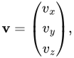

也就是采用计算机图形学领域常用的列向量形式。在正文的某些地方，我们使用 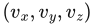，而不用形式上更严谨的 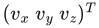，因为前者更容易阅读。

| 类型 | 记法 | 示例 |
| --- | --- | --- |
| 角度 | 小写希腊字母 | 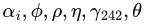 |
| 标量 | 小写斜体字母 | 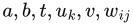 |
| 向量或点 | 小写粗体字母 | 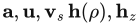 |
| 矩阵 | 大写粗体字母 | 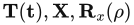 |
| 平面 | π：一个向量和一个标量 | 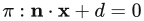，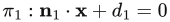 |
| 三角形 | △ 后接 3 个点 | 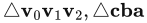 |
| 线段 | 两个点 | 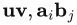 |
| 几何实体 | 大写斜体字母 | 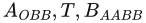 |

表 1.1　本书使用的符号汇总。

使用齐次记法时，一个坐标由四个值表示，即 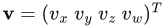；其中，向量表示为 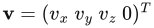，点表示为 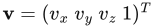。有时我们只使用三分量向量和点，但会尽量避免使所用类型产生歧义。在矩阵运算中，为向量和点采用相同的记法极为有利。更多信息请参见讨论变换的第 4 章。在某些算法中，用数字下标代替 x,y,z 会更方便，例如 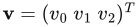。所有这些关于向量和点的规则也适用于二分量向量；这种情况下，只需省略三分量向量的最后一个分量。

矩阵值得再作一些说明。我们常用的矩阵大小为 2×2、3×3 和 4×4。下面回顾如何访问一个 3×3 矩阵 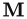 中的元素，这一过程很容易推广到其他大小的矩阵。 的元素（标量）记为 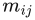，其中 0 ≤ (i,j) ≤ 2，i 表示行，j 表示列，如式（1.1）所示：

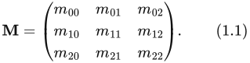

下面的记法用于从矩阵  中单独取出向量，式（1.2）以一个 3×3 矩阵为例：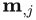 表示第 j 个列向量，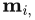 表示第 i 个行向量（以列向量形式表示）。与向量和点一样，如果更方便，也可以使用 x,y,z，有时还包括 w，作为列向量的下标：

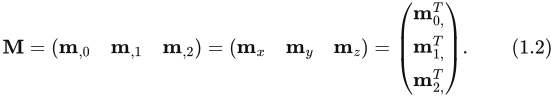

平面记为 ，这一记法包含了它的数学方程、平面法线  和标量 d。法线是描述平面朝向的向量。更一般地说（例如对于曲面），法线描述表面上某个特定点处的朝向。对于平面，恰好同一条法线适用于它的所有点。π 是表示平面的常用数学符号。我们说平面 π 将空间分成了一个正半空间，其中 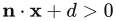，以及一个负半空间，其中 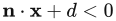。其余所有点都称为位于平面上。

三角形可以由三个点 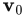、 和  定义，记为 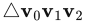。

表 1.2 列出了另外一些数学运算符及其记法。点积、叉积、行列式和长度运算符在可从 realtimerendering.com 下载的线性代数附录中有解释。转置运算符将列向量转换为行向量，反之亦然。因此，在一段正文中，列向量可以紧凑地写成 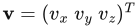。运算符 4 在《Graphics Gems IV》[735] 中被引入，是作用于二维向量的一元运算符。将它作用于向量 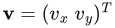，会得到一个与 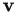 垂直的向量，即 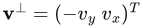。我们使用 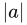 表示标量 a 的绝对值，而  表示矩阵 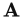 的行列式。有时，我们也使用 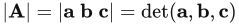，其中 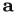、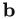 和 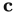 是矩阵  的列向量。

| 编号 | 运算符 | 说明 |
| --- | --- | --- |
| 1 | · | 点积 |
| 2 | × | 叉积 |
| 3 | 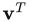 | 向量  的转置 |
| 4 | ⊥ | 一元垂直点积运算符 |
| 5 | 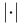 | 矩阵的行列式 |
| 6 |  | 标量的绝对值 |
| 7 | ‖·‖ | 参数的长度（或范数） |
| 8 | 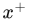 | 将 x 的下限钳制为 0 |
| 9 |  | 将 x 钳制在 0 与 1 之间 |
| 10 | n! | 阶乘 |
| 11 | 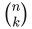 | 二项式系数 |

表 1.2　一些数学运算符的记法。

运算符 8 和 9 是钳制运算符，常用于着色计算。运算符 8 将负值钳制为 0：

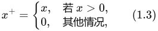

而运算符 9 将数值钳制在 0 与 1 之间：

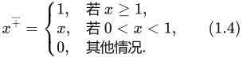

第十个运算符是阶乘，定义如下，注意 0!=1：

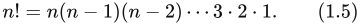

第十一个运算符是二项式系数，其定义如式（1.6）所示：

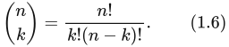

| 编号 | 函数 | 说明 |
| --- | --- | --- |
| 1 | atan2(y,x) | 双参数反正切 |
| 2 | log(n) | 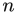 的自然对数 |

表 1.3　一些专用数学函数的记法。

在后文中，我们将常见的平面 x=0、y=0 和 z=0 称为坐标平面或轴对齐平面。轴 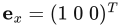、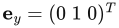 和 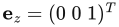 称为主轴或主方向，分别称为 x 轴、y 轴和 z 轴。这组轴通常称为标准基。除非另有说明，我们都使用标准正交基（由相互垂直的单位向量组成）。

包含 a、b 以及两者之间所有数的区间记为 [a,b]。如果我们需要 a 与 b 之间的所有数，但不包括 a 和 b 本身，就写成 (a,b)。这两种记法也可以组合，例如，[a,b) 表示 a 与 b 之间包括 a、但不包括 b 的所有数。

本书经常使用 C 语言数学函数 atan2(y,x)，因此值得加以说明。它是数学函数 arctan(x) 的扩展。两者的主要区别在于：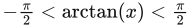，而 0 ≤ atan2(y,x) < 2π，并且后者多了一个参数。arctan 的一种常见用途是计算 arctan(y/x)，但当 x=0 时，会发生除以零的情况。atan2(y,x) 增加的参数避免了这一问题。

在本书中，记号 log(n) 始终表示自然对数 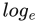(n)，而不是以 10 为底的对数 (n)。

我们使用右手坐标系，因为它是计算机图形学领域三维几何的标准坐标系。

颜色由三分量向量表示，例如（红、绿、蓝），每个分量的取值范围都是 [0,1]。

## 1.2.2 几何定义

几乎所有图形硬件使用的基本渲染图元（也称绘制图元）都是点、线和三角形。注1

在全书中，我们将几何实体的集合称为模型或对象。场景是模型的集合，包含待渲染环境中的一切。场景还可以包含材质描述、光照和观察设定。

汽车、建筑物，甚至一条线，都是对象的例子。在实践中，对象通常由一组绘制图元组成，但并非总是如此；对象可能采用更高级的几何表示，例如贝塞尔曲线或曲面，或者细分曲面。此外，对象也可以由其他对象组成，例如，一个汽车对象包含四个车门对象、四个车轮对象，等等。

**注1：** 我们所知的例外只有能够绘制球体的 Pixel-Planes [502]，以及能够绘制椭球体的 NVIDIA NV1 芯片。

## 1.2.3 着色

遵循计算机图形学中已经确立的用法，本书中由“着色”（shading）、“着色器”（shader）及相关词语派生的术语，用来指代两个不同但相关的概念：计算机生成的视觉外观（例如“着色模型”“着色方程”“卡通着色”），或渲染系统中的可编程组件（例如“顶点着色器”“着色语言”）。在这两种情况下，其具体含义都应当可以从上下文中明确判断。
