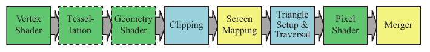

# 3.2 GPU流水线概览

来源：原书书页 34（PDF 第 55 页）；本节截至书页 35 的第 3.3 节标题之前。

GPU 实现了第 2 章所描述的概念上的几何处理、光栅化和像素处理流水线阶段。这些阶段被划分为若干硬件阶段，各自具有不同程度的可配置性或可编程性。图 3.2 用不同颜色标出了各个阶段的可编程或可配置程度。请注意，这些物理阶段的划分与第 2 章介绍的功能阶段略有不同。

**图 3.2** 渲染流水线的 GPU 实现。各阶段按照用户对其操作的控制程度用不同颜色表示。绿色阶段完全可编程。虚线表示可选阶段。黄色阶段可配置，但不可编程，例如，可以为合并阶段设置各种混合模式。蓝色阶段的功能完全固定。

这里描述的是 GPU 的*逻辑模型*，即 API 向作为程序员的你呈现的模型。如第 18 章和第 23 章所讨论的，这条逻辑流水线的实现，也就是*物理模型*，由硬件厂商决定。在逻辑模型中功能固定的某个阶段，可能通过向相邻的可编程阶段添加命令而在 GPU 上执行。流水线中的单个程序可能被拆成若干部分，由不同的子单元执行，也可能完全通过单独的一遍处理来执行。逻辑模型可以帮助你推断哪些因素会影响性能，但不应将其误认为 GPU 实际实现流水线的方式。

顶点着色器是一个完全可编程的阶段，用于实现几何处理阶段。几何着色器也是一个完全可编程的阶段，它操作的是一个图元（点、线或三角形）的各个顶点。它可以用于执行逐图元的着色操作、销毁图元，或创建新图元。曲面细分阶段和几何着色器都是可选的，并非所有 GPU 都支持它们，尤其是在移动设备上。

裁剪、三角形设置和三角形遍历阶段由固定功能硬件实现。屏幕映射受窗口和视口设置的影响，在内部形成简单的缩放和位置调整。像素着色器阶段完全可编程。合并阶段虽然不可编程，但具有很高的可配置性，可以设置为执行多种不同的操作。它实现了“合并”这一功能阶段，负责修改颜色缓冲区、z 缓冲区、混合缓冲区、模板缓冲区，以及任何其他与输出相关的缓冲区。像素着色器的执行与合并阶段一起，构成了第 2 章介绍的概念上的像素处理阶段。

随着时间推移，GPU 流水线逐渐摆脱硬编码操作，朝着更高的灵活性和更强的控制能力发展。可编程着色器阶段的引入，是这一演进过程中最重要的一步。下一节将介绍各个可编程阶段共有的特性。
