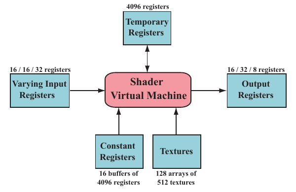

# 3.3 可编程着色器阶段

原书来源：书页 35—37（PDF 物理页 56—58）。

现代着色器程序采用统一着色器设计。这意味着顶点着色器、像素着色器、几何着色器以及与曲面细分相关的着色器共享同一种编程模型。在内部，它们具有相同的指令集架构（instruction set architecture，ISA）。实现这一模型的处理器在 DirectX 中称为通用着色器核心（common-shader core），而具有这类核心的 GPU 则被称为采用了统一着色器架构。这类架构背后的思想是：着色器处理器可以承担多种不同的角色，GPU 能够根据需要对其进行分配。例如，相比于每个仅由两个三角形组成的大正方形，一组包含许多微小三角形的网格需要更多的顶点着色器处理。如果 GPU 将顶点着色器核心和像素着色器核心分成彼此独立的资源池，那么，要使所有核心都保持忙碌，所需的理想工作分配比例就已经被固定下来。使用统一着色器核心后，GPU 可以自行决定如何平衡这些负载。

完整介绍着色器编程模型远远超出了本书的范围，而且已经有许多文档、书籍和网站对此进行了介绍。着色器使用类似 C 的着色语言编写，例如 DirectX 的高级着色语言（High-Level Shading Language，HLSL）和 OpenGL 着色语言（OpenGL Shading Language，GLSL）。DirectX 的 HLSL 可以编译成虚拟机字节码，也称为中间语言（intermediate language，IL 或 DXIL），从而实现硬件无关性。中间表示还可以使着色器程序能够离线编译和存储。驱动程序会将这种中间语言转换成特定 GPU 的 ISA。游戏主机编程通常会省去中间语言这一步，因为该系统只有一种 ISA。

基本数据类型是 32 位单精度浮点标量和向量。不过，如前文所述，向量只是着色器代码中的一部分，硬件本身并不支持向量。现代 GPU 还原生支持 32 位整数和 64 位浮点数。浮点向量通常包含位置（xyzw）、法线、矩阵的行、颜色（rgba）或纹理坐标（uvwq）等数据。整数最常用来表示计数器、索引或位掩码。结构体、数组和矩阵等聚合数据类型也受到支持。

绘制调用（draw call）通过调用图形 API 来绘制一组图元，从而使图形流水线执行并运行其中的着色器。每个可编程着色器阶段都有两类输入：一致输入（uniform input），其值在一次绘制调用期间保持不变，但可以在不同绘制调用之间改变；变化输入（varying input），其数据来自三角形的顶点或光栅化过程。例如，像素着色器可以将光源颜色作为一致值，而三角形表面上的位置会逐像素变化，因此属于变化值。纹理是一种特殊的一致输入：过去，它始终是应用于表面的彩色图像，而如今可以将它视为任意大型数据数组。

底层虚拟机为不同类型的输入和输出提供专用寄存器。可供一致输入使用的常量寄存器数量，远多于可供变化输入或输出使用的寄存器数量。这是因为变化输入和输出需要为每个顶点或像素分别存储，因此所需的数量自然存在一个上限。一致输入只存储一次，并在一次绘制调用的所有顶点或像素之间重复使用。虚拟机还具有通用的临时寄存器，用作暂存空间。所有类型的寄存器都可以使用临时寄存器中的整数值进行数组索引。图 3.3 展示了着色器虚拟机的输入和输出。

**图 3.3**　在 Shader Model 4.0 下的统一虚拟机架构和寄存器布局。每种资源旁均标出了可用数量的最大值。以斜杠分隔的三个数字，从左到右分别表示顶点着色器、几何着色器和像素着色器的限制。

现代 GPU 能够高效执行图形计算中常见的运算。着色语言通过 `*` 和 `+` 等运算符提供最常用的运算，例如加法和乘法。其余运算则通过针对 GPU 优化的内建函数提供，例如 `atan()`、`sqrt()`、`log()` 以及许多其他函数。对于更复杂的运算，也有相应的函数可用，例如向量归一化与反射、叉积，以及矩阵转置和行列式计算。

流程控制（flow control）是指使用分支指令改变代码的执行流程。与流程控制相关的指令用于实现高级语言中的 `if`、`case` 语句等结构，以及各种类型的循环。着色器支持两种流程控制。静态流程控制的分支基于一致输入的值。这意味着在一次绘制调用期间，代码的执行流程保持不变。静态流程控制的主要好处是允许同一个着色器用于多种不同情形，例如不同数量的光源。由于所有着色器调用都走相同的代码路径，因此不会出现线程分歧。动态流程控制基于变化输入的值，这意味着每个片元都可以以不同的方式执行代码。它比静态流程控制强大得多，但可能会付出性能代价，尤其是当不同着色器调用之间的代码执行流程变化不规则时。
