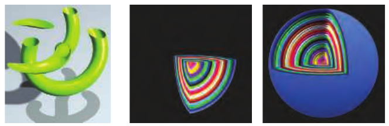
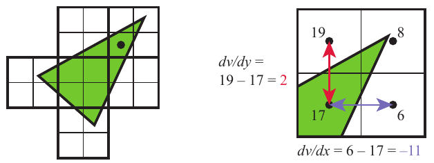

# 3.8 像素着色器

来源：*Real-Time Rendering, Fourth Edition*，书页 49—52（PDF 第 70—73 页）。

在顶点着色器、曲面细分着色器和几何着色器完成各自的操作后，图元会被裁剪，并完成光栅化的准备工作，如上一章所述。流水线这一部分的处理步骤相对固定，也就是说，它不可编程，但在一定程度上可以配置。系统会遍历每个三角形，以确定它覆盖了哪些像素。光栅器还可能粗略计算三角形覆盖每个像素单元面积的比例（第 5.4.2 节）。三角形中与像素部分或完全重叠的这一块称为**片元**（fragment）。

三角形顶点处的各个值，包括用于 z 缓冲的 z 值，都会沿三角形表面为每个像素进行插值。这些值被传给**像素着色器**（pixel shader），再由它处理片元。在 OpenGL 中，像素着色器称为**片元着色器**（fragment shader），这或许是更合适的名称。为保持一致，本书始终使用“像素着色器”这一名称。传入流水线的点图元和线图元也会为它们覆盖的像素产生片元。

三角形上的插值类型由像素着色器程序指定。通常，我们使用透视校正插值，使得随着物体向远处退去，各像素对应的表面位置之间的世界空间距离逐渐增大。一个例子是渲染延伸至地平线的铁轨。铁轨越远，枕木的间距看起来就越小，因为越接近地平线，每前进一个像素所跨越的距离就越大。还可以选择其他插值方式，例如不考虑透视投影的屏幕空间插值。DirectX 11 对何时以及如何进行插值提供了进一步的控制 [530]。

从编程角度看，顶点着色器程序的输出经过三角形（或线）上的插值后，实际上就成为像素着色器程序的输入。随着 GPU 的发展，又有其他输入被开放出来。例如，在 Shader Model 3.0 及以后的版本中，像素着色器可以获得片元的屏幕位置。此外，还有一个输入标志指示三角形的哪一面可见。在单个遍次中为每个三角形的正面和背面渲染不同材质时，这一信息很重要。

有了这些输入，像素着色器通常会计算并输出片元的颜色。它还可能生成不透明度值，并可选择修改片元的 z 深度。在合并过程中，这些值用于修改像素处存储的内容。光栅化阶段生成的深度值也可以由像素着色器修改。模板缓冲的值通常不可修改，而是直接传递到合并阶段。DirectX 11.3 允许着色器改变这个值。在 SM 4.0 中，雾计算和 alpha 测试等操作已从合并操作转为像素着色器中的计算 [175]。

像素着色器还具有一种独特的能力：丢弃传入的片元，也就是不产生任何输出。图 3.14 展示了片元丢弃的一种用法。裁剪平面功能最初是固定功能流水线中的一个可配置部分，后来改为在顶点着色器中指定。有了丢弃片元的能力之后，就可以在像素着色器中按任意所需方式实现这一功能，例如决定应当对各裁剪体执行逻辑与（AND）还是逻辑或（OR）运算。

**图 3.14.** 用户定义的裁剪平面。左图中，一个水平裁剪平面切开了物体。中图中，嵌套的球体被三个平面裁剪。右图中，只有当球体表面位于所有三个裁剪平面之外时，才会被裁剪。（出自 three.js 示例 `webgl_clipping` 和 `webgl_clipping_intersection` [218]。）

最初，像素着色器只能向合并阶段输出，以便最终显示。随着时间推移，像素着色器能够执行的指令数量显著增长。这一增长催生了**多渲染目标**（multiple render targets，MRT）的概念。像素着色器程序的结果不再仅仅送入颜色缓冲和 z 缓冲，而是可以为每个片元生成多组值，并将它们保存到不同的缓冲中，每个这样的缓冲称为一个**渲染目标**。各渲染目标通常具有相同的 x 和 y 尺寸；某些 API 允许尺寸不同，但渲染区域将取其中最小的范围。有些架构要求各渲染目标具有相同的位深，甚至可能要求数据格式也完全相同。可用渲染目标的数量取决于 GPU，为四个或八个。

即使存在这些限制，MRT 功能仍是更高效地执行渲染算法的有力帮助。单个渲染遍次就可以在一个目标中生成彩色图像，在另一个目标中生成物体标识符，并在第三个目标中生成世界空间距离。这一能力还催生了一种不同类型的渲染流水线，称为**延迟着色**（deferred shading），其中可见性判定和着色在不同的遍次中进行。第一个遍次在每个像素处存储物体的位置和材质数据，后续遍次便能高效地应用光照及其他效果。第 20.1 节介绍了这一类渲染方法。

像素着色器的限制在于，它通常只能在传给它的片元位置向渲染目标写入，并且不能读取相邻像素的当前结果。也就是说，像素着色器程序执行时，既不能把输出直接送到相邻像素，也不能访问其他像素刚刚发生的改变。它计算出的结果只影响它自己的像素。不过，这一限制并不像听起来那么严重。在一个遍次中生成的输出图像，其任意数据都可以在后续遍次中由像素着色器访问。相邻像素可以使用第 12.1 节介绍的图像处理技术来处理。

像素着色器无法得知或影响相邻像素结果的这条规则也有例外。其中一种是，在计算梯度或导数信息时，像素着色器可以立即访问相邻片元的信息，尽管这种访问是间接的。像素着色器可以获得任意插值值沿屏幕 x 轴和 y 轴每移动一个像素时的变化量。这些值对各种计算和纹理寻址都很有用。对于纹理过滤（第 6.2.2 节）等操作，这些梯度尤其重要，因为我们希望知道图像中多大的一块区域覆盖一个像素。所有现代 GPU 都通过以 2×2 为一组处理片元来实现这一功能，这样的一组称为一个 **quad（四像素组）**。当像素着色器请求一个梯度值时，返回的就是相邻片元之间的差值，见图 3.15。统一核心具有访问相邻数据的能力，这些数据保存在同一线程束（warp）的不同线程中，因此它可以计算供像素着色器使用的梯度。这种实现方式带来的一个结果是：在着色器中受动态流程控制影响的部分，即 `if` 语句或迭代次数可变的循环内，无法访问梯度信息。同一组中的所有片元都必须使用同一套指令进行处理，这样四个像素的结果才对梯度计算有意义。这是一项根本性的限制，即使在离线渲染系统中也存在 [64]。

**图 3.15.** 左图中，一个三角形被光栅化为若干四像素组，每组包含 2×2 个像素。右图展示了以黑点标出的那个像素的梯度计算。四像素组中四个像素位置各自的 v 值均已标出。注意，其中三个像素并未被三角形覆盖，但 GPU 仍然会处理它们，以便求出梯度。利用左下角像素在四像素组中的两个相邻像素，可以计算它沿屏幕 x 和 y 方向的梯度。

DirectX 11 引入了一种允许向任意位置写入的缓冲类型，即**无序访问视图**（unordered access view，UAV）。最初只有像素着色器和计算着色器能够使用 UAV，DirectX 11.1 则把 UAV 的访问能力扩展到了所有着色器 [146]。OpenGL 4.3 将其称为**着色器存储缓冲对象**（shader storage buffer object，SSBO）。这两个名称分别从各自的角度描述了它的特点。像素着色器以任意顺序并行运行，并共享这一存储缓冲。

通常需要某种机制来避免**数据竞争条件**（data race condition，也称为**数据冒险**，data hazard）：两个着色器程序“争抢”着影响同一个值，可能导致不确定的结果。例如，如果像素着色器的两次调用几乎同时尝试对取出的同一个值进行加法操作，就可能发生错误。两者都会取出原始值，并分别在本地修改它，但最后写入结果的那次调用会抹去另一次调用的贡献，最终只执行了一次加法。GPU 通过提供着色器可以访问的专用原子操作单元来避免这一问题 [530]。不过，原子操作意味着某些着色器可能会停顿，因为它们需要等待访问某个内存位置，而另一个着色器正在对该位置执行读取、修改和写入。

虽然原子操作可以避免数据冒险，但许多算法要求特定的执行顺序。例如，你可能希望先绘制较远的蓝色透明三角形，然后再在其上叠加红色透明三角形，将红色混合到蓝色之上。对于一个像素，可能有两次像素着色器调用，每个三角形各对应一次，而它们的执行方式可能使红色三角形的着色器先于蓝色三角形的着色器完成。在标准流水线中，片元结果会先在合并阶段排序，然后再被处理。DirectX 11.3 引入了**光栅器顺序视图**（rasterizer order views，ROV），以强制保证执行顺序。它们类似于 UAV，着色器可以用相同的方式对其进行读写。关键区别在于，ROV 保证按照正确的顺序访问数据。这大大提高了这些着色器可访问缓冲的实用性 [327, 328]。例如，ROV 使像素着色器能够编写自己的混合方法，因为像素着色器可以直接访问并写入 ROV 中的任意位置，因此不再需要合并阶段 [176]。其代价是，如果检测到乱序访问，某次像素着色器调用可能会停顿，直到较早绘制的三角形处理完毕。
