# 4.5 变形

来源：原书第 87—91 页（PDF 物理页 108—112）；本节结束于第 92 页的 4.6 节标题之前。

在制作动画时，将一个三维模型变形为另一个三维模型会很有用 [28, 883, 1000, 1005]。设想在时刻  显示一个模型，而我们希望到时刻  时，它已经变成另一个模型。对于  与  之间的所有时刻，可以利用某种插值方法，得到一个连续变化的“混合”模型。图 4.14 展示了一个变形的例子。

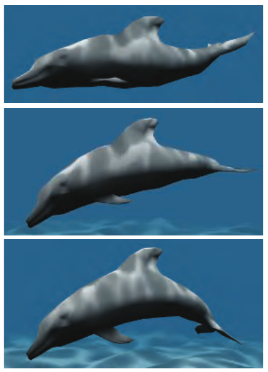

**图 4.14** 顶点变形。为每个顶点定义两个位置和两个法线。在每一帧中，顶点着色器通过线性插值得到中间的位置与法线。（图片由 NVIDIA Corporation 提供。）

变形需要解决两个主要问题，即*顶点对应问题*和*插值问题*。给定两个任意模型，它们可能具有不同的拓扑结构、不同的顶点数量以及不同的网格连接关系，因此通常必须先建立这些顶点之间的对应关系。这是一个困难的问题，该领域已经有大量研究。感兴趣的读者可以参阅 Alexa 的综述 [28]。

不过，如果两个模型之间已经存在一一对应的顶点关系，就可以逐顶点进行插值。也就是说，第一个模型中的每个顶点，在第二个模型中必须有且仅有一个对应顶点，反之亦然。这使得插值成为一项容易完成的任务。例如，可以直接对顶点进行线性插值（其他插值方法见第 17.1 节）。为了计算时刻 t∈[,] 的变形后顶点，我们首先计算 s=(t−)/(−)，然后进行线性顶点混合：

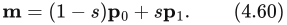

其中，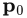 和 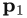 对应于同一个顶点，只是分别处于不同的时刻  和 。

一种能让用户进行更直观控制的变形方法称为*变形目标*（morph targets），或*混合形状*（blend shapes）[907]。可以借助图 4.15 说明其基本思想。我们从一个中性模型开始，这里是一张人脸。将这个模型记为 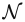。此外，我们还有一组不同的面部姿态。示意图中只有一种姿态，即微笑的面孔。一般而言，我们可以允许 k≥1 种不同的姿态，将它们记为 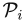，i∈[1,…,k]。作为预处理，计算“差分面孔”：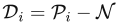，也就是从每种姿态中减去中性模型。

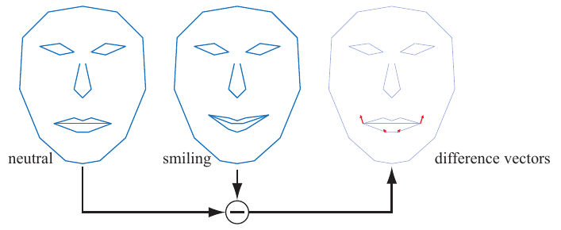

**图 4.15** 给定两种嘴部姿态，可以计算出一组差分向量，以控制插值，甚至外推。在变形目标方法中，利用差分向量将动作“添加”到中性面孔上。为差分向量赋予正权重，会得到微笑的嘴形；负权重则可以产生相反的效果。

此时，我们有一个中性模型 ，以及一组差分姿态 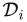。于是，可以用下式得到变形后的模型 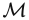：

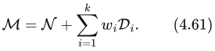

这以中性模型为基础，再通过权重 ，按需要将不同姿态的特征添加到它上面。对于图 4.15，设定 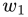=1，得到的恰好就是示意图中间的微笑面孔。使用 =0.5，会得到一张半微笑的面孔，依此类推。也可以使用负权重以及大于一的权重。

对于这个简单的人脸模型，我们还可以添加一张眉毛呈现“悲伤”表情的面孔。随后，为眉毛使用负权重，就可以产生“快乐”的眉毛。由于位移是相加的，因此可以将这一眉毛姿态与微笑嘴部的姿态结合使用。

变形目标是一项强大的技术，能为动画师提供很大的控制空间，因为模型的不同特征可以彼此独立地操纵。Lewis 等人 [1037] 提出了*姿态空间变形*（pose-space deformation），将顶点混合与变形目标结合起来。Senior [1608] 使用预先计算的顶点纹理，存储并读取目标姿态之间的位移。支持流输出（stream-out）和逐顶点 ID 的硬件，允许在单个模型中使用多得多的目标，并且完全在 GPU 上计算这些效果 [841, 1074]。先使用低分辨率网格，再通过曲面细分阶段和位移映射生成高分辨率网格，可以避免对高精细度模型的每一个顶点都执行蒙皮所产生的开销 [1971]。

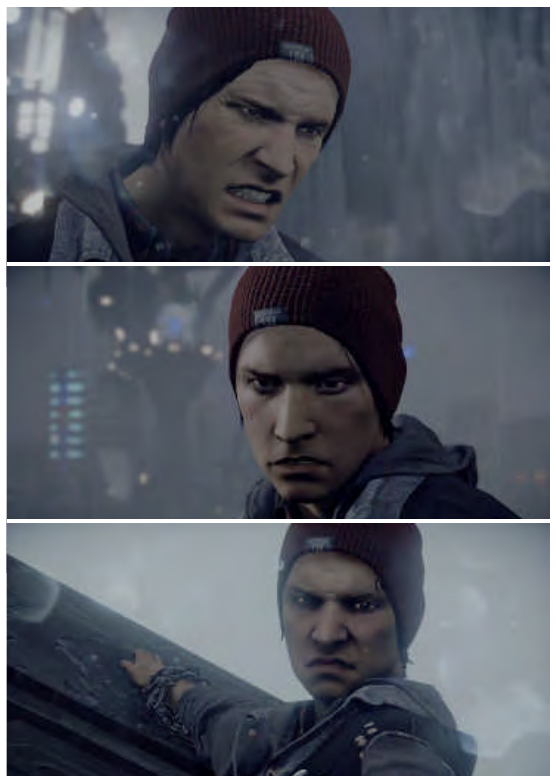

**图 4.16** 《inFAMOUS Second Son》中角色 Delsin 的面部使用混合形状制作动画。所有这些画面都使用同一张处于静止姿态的面孔，然后通过修改不同的权重，使面孔呈现不同的样貌。（图片由 Naughty Dog LLC 提供。《inFAMOUS Second Son》© 2014 Sony Interactive Entertainment LLC。inFAMOUS Second Son 是 Sony Interactive Entertainment LLC 的商标。由 Sucker Punch Productions LLC 开发。）

图 4.16 展示了一个同时使用蒙皮与变形的实际例子。Weronko 和 Andreason [1872] 在《The Order: 1886》中使用了蒙皮与变形。
