# 4.7 投影

来源：《Real-Time Rendering, Fourth Edition》，书页 92—102（PDF 物理页 113—123）。本节包含 4.7.1 和 4.7.2；不含章末“延伸阅读与资源”。

在真正渲染场景之前，必须将场景中所有相关对象投影到某种平面上，或变换到某种简单的体积中。此后再进行裁剪和渲染（第 2.3 节）。

本章到目前为止介绍的变换都不影响第四个坐标，即 w 分量。也就是说，点和向量在变换之后仍保持各自的类型。此外，4×4 矩阵的最下面一行始终为 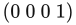。透视投影矩阵在这两点上都是例外：最下面一行包含会改变向量和点的数值，而且往往需要进行齐次归一化。也就是说，w 往往不等于 1，因此需要除以 w 才能得到非齐次点。本节首先讨论的正交投影是一种较简单、同样常用的投影。它不影响 w 分量。

本节假定观察者沿着相机的 z 轴负方向观察，y 轴向上，x 轴向右。这是一个右手坐标系。有些文献和软件（例如 DirectX）使用左手坐标系，观察者沿相机的 z 轴正方向观察。两种坐标系都有效，最终能够获得相同的效果。

## 4.7.1 正交投影

正交投影的一个特征是，平行线在投影后仍然平行。使用正交投影观察场景时，无论对象距相机多远，其大小都保持不变。下面给出的矩阵 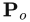 是一个简单的正交投影矩阵：它保持点的 x 和 y 分量不变，同时将 z 分量置为零，也就是正交投影到平面 z=0 上：

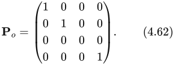

这种投影的效果如图 4.17 所示。显然， 不可逆，因为其行列式 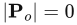。换句话说，这一变换将三维降为二维，而被丢弃的维度无法恢复。使用这种正交投影进行观察时存在一个问题：它会将 z 值为正和为负的点都投影到投影平面上。通常，将 z 值（以及 x 和 y 值）限制在某个区间内会很有用，例如从 n（近平面）到 f（远平面）。注4 这就是接下来这个变换的目的。

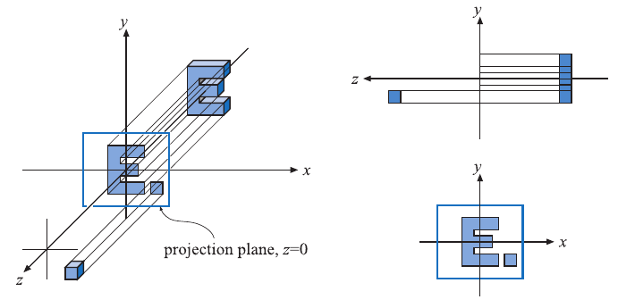

**图 4.17**　式（4.62）生成的简单正交投影的三个不同视图。可以将此投影理解为观察者沿 z 轴负方向观察，这意味着投影只是忽略 z 坐标（或将其置为零），同时保留 x 和 y 坐标。注意，位于 z=0 两侧的对象都会被投影到投影平面上。

一种更常用的正交投影矩阵由六元组 (l,r,b,t,n,f) 表示，这六个值分别表示左、右、下、上、近、远六个平面。该矩阵对这些平面构成的轴对齐包围盒（AABB；定义见第 22.2 节）进行缩放和平移，将其变为以原点为中心、与坐标轴对齐的立方体。AABB 的最小角点为 (l,b,n)，最大角点为 (r,t,f)。必须认识到，这里 n>f，因为我们沿 z 轴负方向看向这块空间体积。直觉会告诉我们，近处的数值应小于远处，因此可以允许用户按这种方式提供数值，然后在内部将它们取负。

在 OpenGL 中，这个轴对齐立方体的最小角点为 (−1,−1,−1)，最大角点为 (1,1,1)；在 DirectX 中，其边界从 (−1,−1,0) 到 (1,1,1)。这个立方体称为**规范视体**，其中的坐标称为**归一化设备坐标**。变换过程如图 4.18 所示。之所以要变换到规范视体，是因为在其中进行裁剪更有效率。

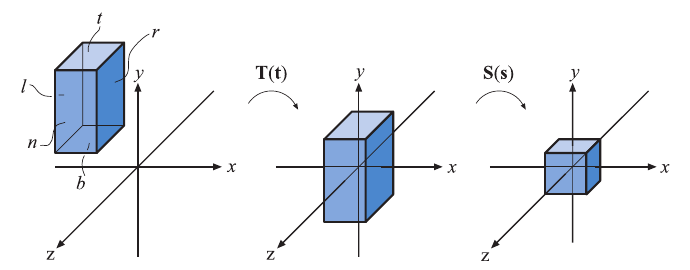

**图 4.18**　将轴对齐包围盒变换到规范视体。首先平移左侧的盒子，使其中心与原点重合。然后对其缩放，使其具有右侧所示规范视体的大小。

变换到规范视体之后，待渲染几何体的顶点相对于该立方体进行裁剪。最终，将剩余的单位正方形映射到屏幕上，渲染不在立方体外部的几何体。这个正交变换如下：

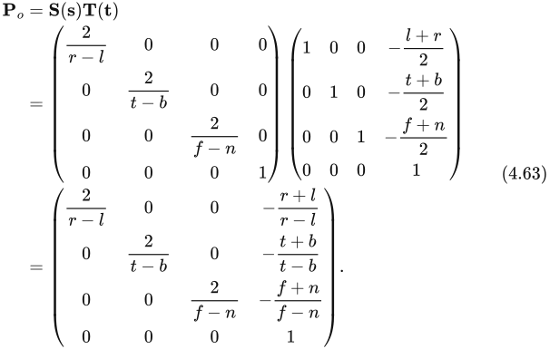

如该式所示， 可以写成平移 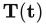 与随后执行的缩放矩阵 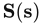 的级联，其中 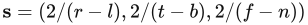，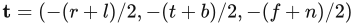。该矩阵可逆，注5 即 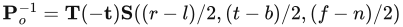。

在计算机图形学中，投影之后通常使用左手坐标系，也就是说，对于视口，x 轴向右，y 轴向上，z 轴指向视口内部。按照我们定义 AABB 的方式，远平面的值小于近平面的值，因此正交变换总会包含一个镜像变换。为了看清这一点，假定原始 AABB 的大小与目标（规范视体）相同。那么，AABB 的 (l,b,n) 坐标为 (−1,−1,1)，(r,t,f) 坐标为 (1,1,−1)。将它们代入式（4.63），得到

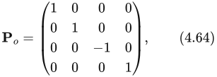

这是一个镜像矩阵。正是这一镜像操作，将右手观察坐标系（沿 z 轴负方向观察）转换为左手的归一化设备坐标。

DirectX 将 z 深度映射到 [0,1] 范围，而 OpenGL 使用 [−1,1]。只需在正交矩阵之后应用一个简单的缩放和平移矩阵，即可实现这一点，也就是

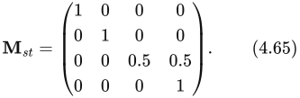

因此，DirectX 使用的正交矩阵为

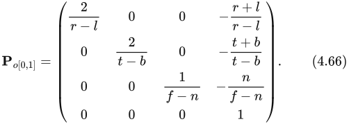

该矩阵通常以转置形式给出，因为 DirectX 采用行主序形式书写矩阵。

**注4：** 近平面也称为前平面（front plane）或 hither；远平面也称为后平面（back plane）或 yon。

**注5：** 当且仅当 n≠ f、l≠ r 且 t≠ b 时可逆；否则不存在逆矩阵。

## 4.7.2 透视投影

透视投影是一种比正交投影更复杂的变换，在大多数计算机图形学应用中广泛使用。在这里，平行线在投影之后通常不再平行，而是可能在无限延伸处汇聚于一点。透视更接近我们感知世界的方式，即越远的对象看起来越小。

首先，我们给出一个有助于理解的透视投影矩阵推导，它将点投影到平面 z=−d（d>0）上。我们从世界空间开始推导，以便更容易理解从世界空间到观察空间的转换过程。随后再给出更常规的矩阵，例如 OpenGL 中使用的矩阵 [885]。

假定相机（视点）位于原点，我们希望将点 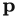 投影到平面 z=−d（d>0）上，得到新点 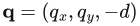。这一情形如图 4.19 所示。根据图中的相似三角形，可以得到针对 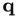 的 x 分量的下述推导：

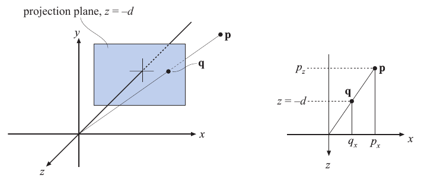

**图 4.19**　推导透视投影矩阵时使用的记号。点  被投影到平面 z=−d（d>0）上，得到投影点 。投影以相机位置为视点进行，本例中的相机位于原点。右侧给出了推导 x 分量时使用的相似三角形。

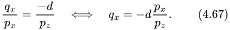

 的其他分量为 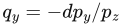（以与 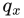 类似的方式得到）以及 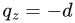。将它们与上式结合，可得如下透视投影矩阵 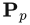：

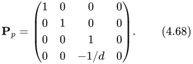

通过下式可以验证，这个矩阵确实产生了正确的透视投影：

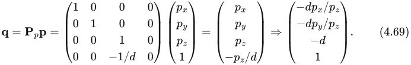

最后一步将整个向量除以 w 分量（本例中为 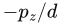），从而使最后一个位置的值为 1。所得的 z 值始终为 −d，因为我们正是投影到这个平面上。

从直观上不难理解为什么齐次坐标能够实现投影。对齐次归一化过程的一种几何解释是：它将点 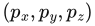 投影到平面 w=1 上。

与正交变换类似，也存在一种透视变换，它并不真正投影到一个平面上（那样的变换不可逆），而是将视锥体变换到前面所述的规范视体中。这里假定视锥体从 z=n 开始，到 z=f 结束，且 0>n>f。位于 z=n 处的矩形，其最小角点为 (l,b,n)，最大角点为 (r,t,n)。如图 4.20 所示。

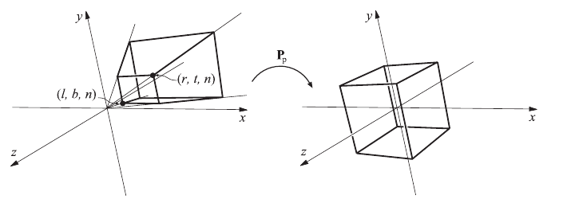

**图 4.20**　矩阵  将视锥体变换为称作规范视体的单位立方体。

参数 (l,r,b,t,n,f) 决定了相机的视锥体。水平视场角由视锥体左、右平面之间的夹角决定（这两个平面由 l 和 r 决定）。同样，垂直视场角由上、下平面之间的夹角决定（这两个平面由 t 和 b 决定）。视场角越大，相机“看到”的范围就越大。令 r≠−l 或 t≠−b，便可创建非对称视锥体。例如，非对称视锥体可用于立体观察和虚拟现实（第 21.2.3 节）。

视场角是营造场景感受的重要因素。相对于计算机屏幕，人眼本身有一个实际的视场角。其关系为

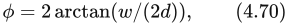

其中 φ 为视场角，w 为物体在垂直于视线方向上的宽度，d 为到物体的距离。例如，25 英寸显示器的宽度约为 22 英寸。在距离 12 英寸处，水平视场角为 85 度；在 20 英寸处为 58 度；在 30 英寸处为 40 度。同一个公式也可以将相机镜头焦距换算为视场角，例如，35 毫米相机（画幅宽度为 36 毫米）配备标准 50 毫米镜头时，有 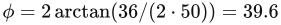 度。

如果采用的视场角比实际观察设置的视场角更窄，透视效果就会减弱，因为观察者看到的是放大后的场景。设置更宽的视场角会使物体显得失真（如同使用广角镜头），屏幕边缘附近尤其明显，而且会夸大近处对象的尺度。不过，更宽的视场角会让观察者觉得对象更大、更具震撼力，同时还能向用户提供更多周围环境的信息。

将视锥体变换为单位立方体的透视变换矩阵由式（4.71）给出：

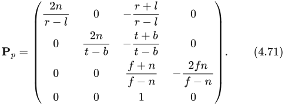

对一个点应用这个变换后，会得到另一个点 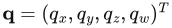。这个点的 w 分量 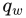 通常既不为零，也不等于 1。要得到投影后的点 ，需要除以 ，即

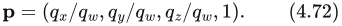

矩阵  始终保证将 z=f 映射为 +1，将 z=n 映射为 −1。

远平面之外的对象会被裁剪，因此不会出现在场景中。透视投影可以处理位于无穷远处的远平面，此时式（4.71）变为

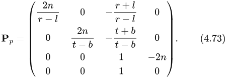

总的来说，先应用透视变换 （无论采用哪种形式），然后进行裁剪和齐次归一化（除以 w），最终得到归一化设备坐标。

为了得到 OpenGL 使用的透视变换，首先乘以 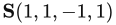，原因与正交变换相同。这只是将式（4.71）第三列中的数值取负。应用这一镜像变换之后，近、远平面的值以正数输入，满足 0<n′<f′，与通常向用户提供的方式一致。不过，它们仍然表示沿世界坐标系 z 轴负方向的距离，而该方向正是观察方向。作为参考，下面给出 OpenGL 的公式：

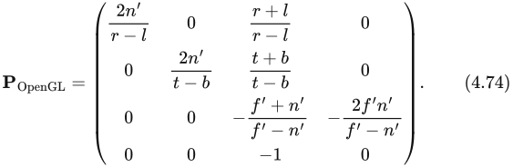

一种更简单的设置方式是只提供垂直视场角 φ、宽高比 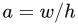（其中 w× h 为屏幕分辨率）、n′ 和 f′。这样得到

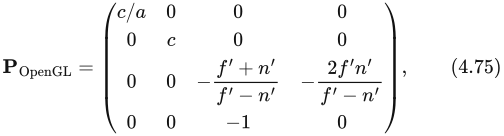

其中 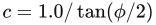。该矩阵的作用与旧的 `gluPerspective()` 完全相同，后者属于 OpenGL 实用库（GLU）。

有些 API（例如 DirectX）将近平面映射到 z=0（而不是 z=−1），将远平面映射到 z=1。此外，DirectX 使用左手坐标系定义其投影矩阵。这意味着 DirectX 沿 z 轴正方向观察，并将近、远平面的值表示为正数。下面是 DirectX 的公式：

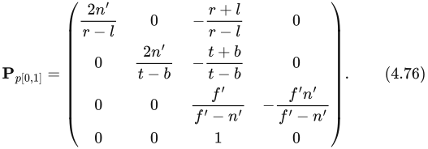

DirectX 的文档使用行主序形式，因此这个矩阵通常以转置形式给出。

使用透视变换的一个结果是，计算出的深度值不会随输入的 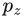 值线性变化。将式（4.74）至（4.76）中的任一个矩阵与点  相乘，可以看到

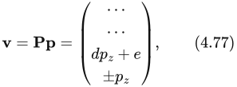

其中省略了 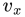 和 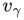 的具体表达式，常数 d 和 f 取决于所选矩阵。例如，若使用式（4.74），则 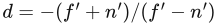、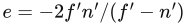，且 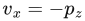。译注1 为了得到归一化设备坐标（NDC）中的深度，需要除以 w 分量，结果为

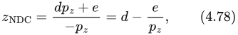

对于 OpenGL 投影，。可以看到，输出深度  与输入深度  成反比。译注1

例如，若 n′=10、f′=110（使用 OpenGL 的术语），当  位于沿 z 轴负方向 60 个单位处（即中点）时，归一化设备坐标中的深度值为 0.833，而不是 0。图 4.21 展示了改变近平面到原点距离的效果。近、远平面的位置会影响 z 缓冲的精度。第 23.7 节将进一步讨论这一影响。

**图 4.21**　改变近平面到原点距离的效果。距离 f′−n′ 保持为 100。当近平面越来越接近原点时，靠近远平面的点在归一化设备坐标（NDC）深度空间中占用的范围越来越小。这会降低 z 缓冲在较远距离处的精度。

有几种方法可以提高深度精度。一种常用方法称为**反向 z**（reversed z），它使用浮点深度或整数存储  [978]。图 4.22 给出了比较。Reed [1472] 通过模拟表明，将浮点缓冲与反向 z 配合使用能够得到最佳精度；对于整数深度缓冲（通常每个深度值使用 24 位），这也是优先采用的方法。对于标准映射（即非反向 z），正如 Upchurch 和 Desbrun [1803] 所建议的那样，在变换中将投影矩阵单独应用，可以降低出错率。例如，使用  可能比使用  更好，其中 。此外，在 [0.5,1.0] 范围内，fp32 和 int24 的精度十分接近，因为 fp32 有 23 位尾数。让  与  成正比的原因在于，这样可以简化硬件，并使深度压缩更有效；第 23.7 节将对此作进一步讨论。

**图 4.22**　使用 DirectX 变换（即 ）设置深度缓冲的不同方式。左上：标准整数深度缓冲，这里展示的是 4 位精度（因此 y 轴上有 16 个标记）。右上：将远平面设置为 ∞，两个坐标轴上的微小偏移表明，这样做不会损失太多精度。左下：浮点深度使用 3 位指数和 3 位尾数。注意，y 轴上的分布是非线性的，这使 x 轴上的分布变得更加糟糕。右下：反向浮点深度，即 ，所得分布好得多。（插图由 Nathan Reed 提供。）

Lloyd [1063] 提出对深度值取对数，以提高阴影贴图的精度。Lauritzen 等人 [991] 使用前一帧的 z 缓冲来确定尽可能大的近平面值和尽可能小的远平面值。对于屏幕空间深度，Kemen [881] 提议逐顶点使用以下重新映射：

其中，w 是顶点经投影矩阵变换之后的 w 值，z 是顶点着色器输出的 z 值。常数 ，其中 f 是远平面。如果只在顶点着色器中应用这个变换，GPU 仍会在三角形上，对经过非线性变换的各顶点深度之间进行线性插值（式（4.79））。由于对数是单调函数，只要分段线性插值与准确的非线性变换深度值之间的差异足够小，遮挡剔除硬件和深度压缩技术仍然能够工作。对于经过充分曲面细分的几何体，大多数情况下都满足这一条件。不过，也可以逐片元应用该变换。做法是为每个顶点输出一个值 e=1+w，然后由 GPU 在三角形上对其插值。像素着色器随后将片元深度修改为 ，其中  是 e 的插值结果。当 GPU 不支持浮点深度，且渲染涉及很大的深度距离范围时，这种方法是一个很好的替代方案。

Cozzi [1605] 提出使用多个视锥体，这实际上可以将精度提高到任意所需程度。沿深度方向，将视锥体划分为若干互不重叠的较小子视锥体，它们的并集恰好等于原视锥体。按照从后向前的顺序，对这些子视锥体进行渲染。首先清空颜色缓冲和深度缓冲，并将所有待渲染对象归入与其重叠的各个子视锥体。对于每一个子视锥体，设置其投影矩阵，清空深度缓冲，然后渲染与该子视锥体重叠的对象。

**译注1：** 译注：此处按原书第 100 页保留。原文写作“常数 d 和 f”及“”，按式（4.77）应分别为“d 和 e”及“”。原书式（4.78）右端印为 ，但按其左端和前文对 d 的定义，代数化简应为 。这里所谓“成反比”描述的是深度包含  项的非线性关系，另有常数偏移。
