# 5.1 着色模型

来源：原书第 103—106 页（PDF 第 124—127 页）。本节从“5.1 Shading Models”开始，到“5.2 Light Sources”之前结束；章首导言及其图 5.1 另存于本章导言文件。

确定渲染物体外观的第一步，是选择一个**着色模型**，用它描述物体的颜色应如何随表面朝向、观察方向和光照等因素而变化。

这里，我们以 Gooch 着色模型 [561] 的一种变体为例。这属于非真实感渲染，第 15 章将讨论这一主题。Gooch 着色模型旨在提高技术插图中细节的可辨识性。

Gooch 着色的基本思想，是比较表面法线与光源位置的关系。如果法线指向光源，就使用较暖的色调为表面着色；如果法线背向光源，则使用较冷的色调。在这两种朝向之间的角度处，对这两种色调进行插值；它们都以用户提供的表面颜色为基础。在这个示例中，我们还向模型加入一种风格化的“高光”效果，使表面呈现光亮的外观。图 5.2 展示了这一着色模型的实际效果。

着色模型通常具有一些用于控制外观变化的属性。设置这些属性的值，是确定物体外观的下一步。我们的示例模型只有一个属性，即表面颜色，如图 5.2 下图所示。

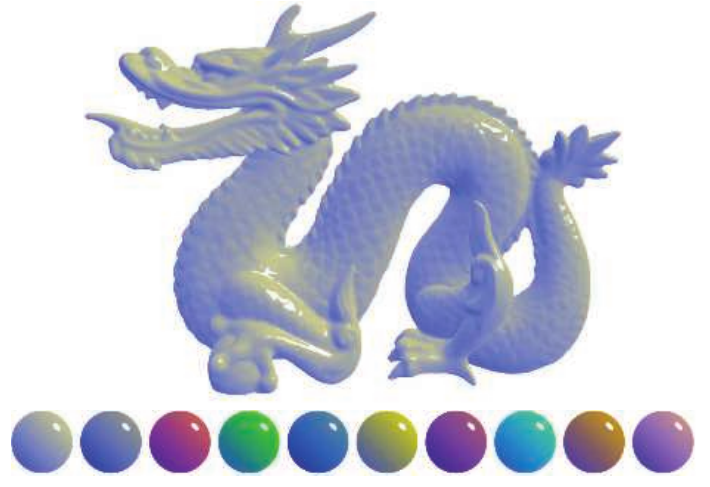

**图 5.2** 一种将 Gooch 着色与高光效果相结合的风格化着色模型。上图展示了一个表面颜色为中性色的复杂物体。下图展示了具有各种不同表面颜色的球体。（中国龙网格来自 Computer Graphics Archive [1172]，原始模型来自 Stanford 3D Scanning Repository，即斯坦福三维扫描模型库。）

与大多数着色模型一样，这个示例也受到表面相对于观察方向和光照方向的朝向影响。用于着色时，这些方向通常表示为归一化的（单位长度）向量，如图 5.3 所示。

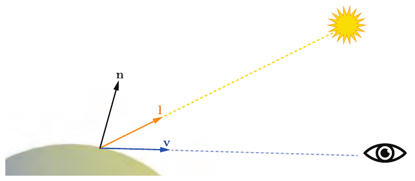

**图 5.3** 示例着色模型（以及大多数其他着色模型）的单位长度向量输入：表面法线 **n**、观察向量 **v** 和光照方向 **l**。

现在，我们已经定义了着色模型的所有输入，可以看看模型本身的数学定义了：

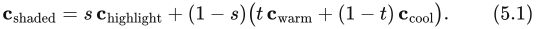

在这个方程中，我们使用了以下中间计算：

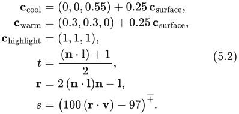

这一定义中的若干数学表达式，也经常出现在其他着色模型中。钳制操作在着色中很常见，通常是将数值的下限钳制为 0，或者将数值钳制在 0 与 1 之间。这里，我们使用第 1.2 节介绍的  记号，表示计算高光混合因子 s 时所用的、将数值钳制在 0 与 1 之间的操作。点积运算符出现了三次，每次都是对两个单位长度向量求点积；这是一种极其常见的模式。两个向量的点积等于它们的长度乘积，再乘以它们夹角的余弦。因此，两个单位长度向量的点积就是夹角的余弦，可以用来有效衡量两个向量方向一致的程度。在着色模型中，为了描述两个方向之间的关系，例如光照方向与表面法线之间的关系，由余弦构成的简单函数往往是效果最令人满意、也最准确的数学表达式。

另一种常见的着色操作，是根据一个介于 0 与 1 之间的标量值，在两种颜色之间进行线性插值。这种操作的形式为 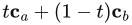：当 t 的值从 1 变到 0 时，结果相应地从 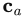 插值到 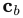。这种模式在本着色模型中出现了两次：第一次在 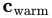 与 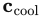 之间插值；第二次则在前一次插值的结果与 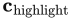 之间插值。线性插值在着色器中出现得如此频繁，以至于我们见过的每一种着色语言，都将它作为名为 `lerp` 或 `mix` 的内置函数。

“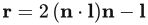”这一行计算反射光向量，也就是将 **l** 关于 **n** 反射。虽然它不像前两种操作那样常见，但使用频率也足够高，因此大多数着色语言同样提供了内置的 `reflect` 函数。

通过以不同方式组合这些操作，并配合各种数学表达式和着色参数，就能定义出产生极其丰富的风格化外观与真实感外观的着色模型。
