# 5.2 光源

来源：英文原书《Real-Time Rendering, Fourth Edition》，书页106—116（PDF物理页127—137）；从5.2节标题开始，止于5.3节标题之前。PDF物理页138用于核对下一节边界。

光照对我们示例中的着色模型所起的作用相当简单：它为着色提供了一个主导方向。当然，现实世界中的光照可能非常复杂。场景中可能有多个光源，每个光源都有自己的大小、形状、颜色和强度；间接光照又会增加更多变化。正如我们将在第9章看到的，基于物理的照片级真实感着色模型需要考虑所有这些参数。

相比之下，风格化着色模型可以用许多不同方式使用光照，具体取决于应用的需求和视觉风格。有些高度风格化的模型可能完全没有光照概念，或者像我们的Gooch着色示例那样，只用它来提供某种简单的方向性。

光照复杂度的下一步，是让着色模型以二元方式对有光或无光作出反应。使用这种模型着色的表面，在受到光照时具有一种外观，在不受光照影响时则具有另一种外观。这意味着需要某些标准来区分这两种情况：与光源的距离、阴影遮挡（将在第7章讨论）、表面是否背向光源（即表面法线 **n** 与光照向量 **l** 之间的夹角是否大于90°），或者这些因素的某种组合。

从有光或无光的二元状态，进一步过渡到连续的光强尺度，只需很小的一步。可以将其表示为完全无光与完全有光之间的简单插值，这意味着光强具有一个有界范围，例如0到1；也可以将其表示为一个无界量，以其他方式影响着色。对于后一种情况，一种常见做法是把着色模型分成受光部分与未受光部分，并用光强 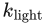 对受光部分进行线性缩放：

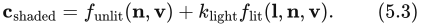

这很容易扩展到RGB光源颜色 ：

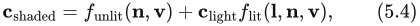

还可以扩展到多个光源：

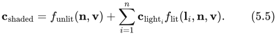

未受光部分 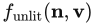 对应于把光照视作二元状态的着色模型中“不受光照影响时的外观”。根据所需的视觉风格和应用需求，它可以具有各种形式。例如，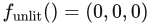 会使任何不受光源影响的表面呈现为纯黑色。或者，未受光部分也可以表达未受光物体的某种风格化外观，类似于Gooch模型为背向光源的表面赋予冷色。通常，着色模型的这一部分表达的是某种并非直接来自显式放置光源的光照，例如来自天空的光，或由周围物体反弹的光。这些其他形式的光照将在第10章和第11章讨论。

前面提到，如果光照方向 **l** 与表面法线 **n** 的夹角超过90°，光源便不会影响该表面点，实际上这相当于光从表面下方照来。这可以看作一种更普遍关系的特殊情况：光相对于表面的方向，与它对着色的影响之间存在关系。虽然这一关系具有物理依据，但它可以由简单的几何原理推导出来，而且也适用于许多非物理的风格化着色模型。

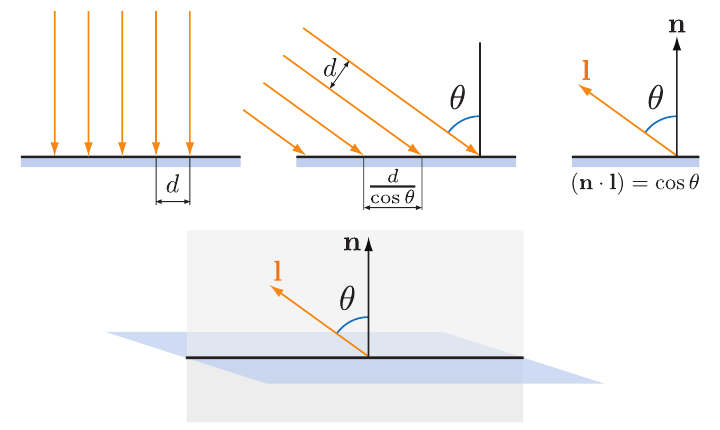

图5.4　上排图示给出了光照射到表面时的剖面视图。左图中光线正面垂直射向表面，中图中光线斜着射向表面，右图展示如何利用向量点积计算夹角的余弦。下图展示了剖面平面（其中包含光照向量和视线向量）相对于完整表面的位置关系。

> 译注：图注原文将下图剖面平面描述为包含“光照向量和视线向量”；原图实际标出的向量是 **l** 与 **n**（光照方向与法线）。这里保留原图注的表述，并标明这一疑点。

光对表面的作用可以可视化为一组光线，照到表面上的光线密度对应于表面着色所使用的光强。图5.4展示了一个受光表面的剖面。沿着该剖面，入射光线在表面上的间距与 **l** 和 **n** 夹角的余弦成反比。因此，照到表面上的总体光线密度与 **l** 和 **n** 夹角的余弦成正比；前面已经看到，这个余弦等于这两个单位长度向量的点积。这也说明了为什么把光照向量 **l** 定义为与光传播方向相反会很方便；否则，在计算点积之前，我们还必须先对它取负。

更准确地说，当点积为正时，光线密度（因而也包括该光对着色的贡献）与点积成正比。负值对应于从表面背后射来的光线，它们不产生影响。因此，在把光的着色贡献乘以光照点积之前，需要先将点积的下限钳制为0。使用第1.2节介绍的记号 ，即把负值钳制为零，可得：

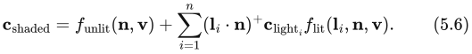

支持多个光源的着色模型通常采用式（5.5）或式（5.6）中的一种结构：前者更一般，后者则是基于物理的模型所必需的。式（5.6）也可能有利于风格化模型，因为它有助于确保光照在整体上保持一致，尤其是对于背向光源或处于阴影中的表面。不过，某些模型并不适合这种结构；这些模型会使用式（5.5）的结构。

函数 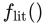 最简单的选择是令其为一个恒定颜色：

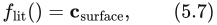

这样就得到以下着色模型：

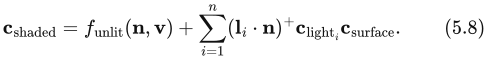

这个模型的受光部分对应于朗伯着色模型（Lambertian shading model），该模型以约翰·海因里希·朗伯（Johann Heinrich Lambert）[967]命名，他早在1760年就发表了它！这个模型适用于理想漫反射表面，也就是完全哑光的表面。我们在这里对朗伯模型作了略为简化的解释，第9章将对它进行更严格的讨论。朗伯模型既可以单独用于简单着色，也是许多着色模型的重要组成部分。

从式（5.3）—（5.6）可以看出，光源通过两个参数与着色模型发生联系：指向光源的向量 **l**，以及光源颜色 。光源有多种不同类型，它们的主要区别在于这两个参数如何随场景中的位置变化。

接下来我们将讨论几种常用的光源类型，它们具有一个共同点：在给定的表面位置，每个光源都只从一个方向 **l** 照亮表面。换言之，从正在着色的表面位置看去，光源是一个无穷小的点。对于现实世界中的光源，这并不严格成立，但大多数光源的尺寸相对于它们与受光表面的距离都很小，因此这是一种合理的近似。在第7.1.2节和第10.1节，我们将讨论从一系列方向照亮同一表面位置的光源，也就是“面光源”。

## 5.2.1 方向光

方向光是最简单的光源模型。**l** 与  在整个场景中都保持不变，唯一的例外是  可能因阴影遮挡而衰减。方向光没有位置。当然，实际光源在空间中都有特定位置。方向光是一种抽象，当光源距离相对于场景尺寸很大时，这种抽象就能很好地工作。例如，距离20英尺、照亮一个小型桌面立体模型的泛光灯，可以表示为方向光。另一个例子几乎就是所有由太阳照亮的场景，除非所讨论的场景大到类似太阳系内侧行星区域的尺度。

方向光的概念可以作一定扩展：让光照方向 **l** 保持不变，同时允许  的值变化。这样做通常出于性能或创作方面的原因，以便把光的影响限制在场景的某个特定部分。例如，可以用两个嵌套的盒状体积（一个位于另一个内部）定义一个区域：在外层盒子之外， 等于(0, 0, 0)，即纯黑色；在内层盒子之内，它等于某个恒定值；而在两个盒子之间的区域内，则在这两个极值之间平滑插值。

## 5.2.2 局部点状光源

“Punctual light”并不是说光源赴约很准时，而是说这种光源与方向光不同，它具有位置。这类光源也没有几何尺寸，没有形状或大小，与现实世界中的光源不同。这里使用“punctual”一词，其词源是意为“点”的拉丁语 punctus，用它来指代所有从单一局部位置发出的光源构成的类别。我们用“点光源”（point light）一词表示其中一种特定的发光体：它向所有方向均匀发光。因此，点光源和聚光灯是局部点状光源的两种不同形式。光照方向向量 **l** 随当前着色表面点  相对于局部点状光源位置  的位置而变化：

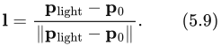

这个等式是向量归一化的一个例子：将向量除以它的长度，得到一个指向相同方向的单位长度向量。这也是一种常见的着色运算；与上一节介绍的着色运算一样，大多数着色语言都将它作为内置函数提供。不过，有时我们需要这一运算中的某个中间结果，这就要求使用更基本的运算，分多个步骤显式执行归一化。将这种做法应用于局部点状光源方向的计算，可得：

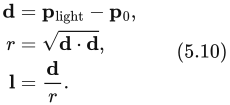

由于两个向量的点积等于它们的长度之积乘以夹角余弦，而0°的余弦为1.0，因此一个向量与自身的点积就是其长度的平方。所以，要计算任意向量的长度，只需计算它与自身的点积，再对结果开平方。

我们需要的中间值是 r，即局部点状光源与当前着色点之间的距离。除了用于归一化光照向量以外，r 还用于计算光源颜色  随距离变化的衰减（变暗）。下一部分将进一步讨论这一点。

### 点光源／全向光源

向所有方向均匀发光的局部点状光源称为点光源或全向光源（omni light）。对于点光源， 是距离 r 的函数，唯一的变化来源就是前面提到的距离衰减。图5.5用与图5.4中说明余弦因子类似的几何推理，展示了这种变暗现象为何发生。在给定表面上，来自点光源的光线间距与表面到光源的距离成正比。与图5.4中的余弦因子不同，这种间距增大在表面的两个维度上都会发生，因此光线密度（以及光源颜色 ）与距离的平方倒数1/成正比。这样，我们就可以用单个光源属性 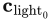 来指定  的空间变化；它被定义为在固定参考距离  处的  值：

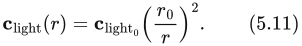

式（5.11）通常称为光照的平方反比衰减。虽然从技术上说，这是点光源正确的距离衰减规律，但有一些问题使这个等式在实际着色中不够理想。

第一个问题发生在距离较小时。当 r 趋近于0， 的值就会无界增大。当 r 达到0时，会出现除以零的奇点。为了解决这个问题，一种常见的修改是在分母中加入一个小值 ε [861]：

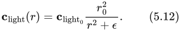

ε 的具体取值取决于应用；例如，Unreal游戏引擎使用 ε = 1 cm [861]。

> 译注：原书此处确实写作“ε = 1 cm”。按式（5.12）中  + ε 的量纲，ε 应与距离平方具有相同量纲。这里保留原文单位，不擅自更正。

CryEngine [1591]和Frostbite [960]游戏引擎采用另一种修改方式：将 r 的下限钳制为最小值 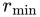：

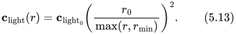

前一种方法中 ε 的取值带有一定任意性，与之不同， 有明确的物理解释：它是发光实体的半径。r 小于  意味着着色表面穿入了实体光源内部，这是不可能的。

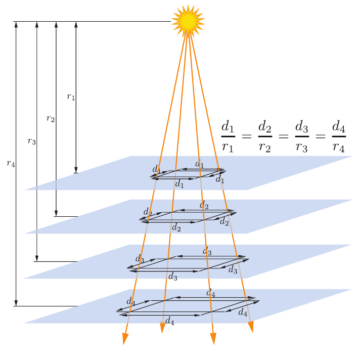

图5.5　来自点光源的光线间距随距离 r 成比例增大。由于这种间距增大发生在两个维度上，光线密度（因而也包括光强）便按1/的比例减小。

相比之下，平方反比衰减的第二个问题发生在距离较大时。问题不在视觉效果，而在性能。虽然光强随距离不断减小，但它永远不会降到0。为了高效渲染，我们希望光强在某个有限距离处达到0（第20章）。有许多方法可以修改平方反比等式来实现这一目标。理想情况下，这种修改应尽可能少地改变原来的规律。为了避免光源影响范围的边界出现突兀的截断，最好让修改后函数的导数和函数值在同一距离处都达到0。一种解决方案是将平方反比等式乘以一个具有所需性质的窗函数。Unreal Engine [861]和Frostbite [960]游戏引擎都使用下面这样的函数[860]：

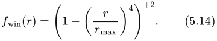

上标 +2 表示：如果括号内的值为负，先将其钳制为0，然后再平方。图5.6展示了一条平方反比曲线、式（5.14）中的窗函数，以及两者相乘后的结果。

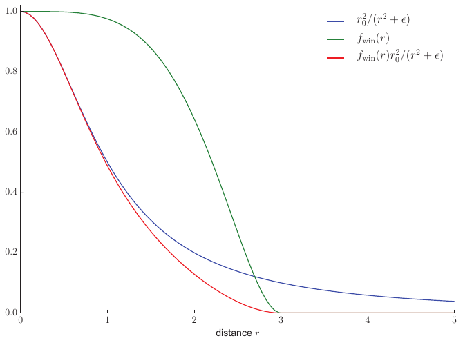

图5.6　此图展示了一条平方反比曲线（采用 ε 方法避免奇点，ε 的取值为1）、式（5.14）描述的窗函数（将 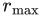 设为3），以及加窗后的曲线。

应用需求会影响方法的选择。例如，当距离衰减函数以较低的空间频率采样时（例如在光照贴图中，或逐顶点计算时），让导数在  处等于0尤为重要。CryEngine不使用光照贴图或顶点光照，所以它采用了更简单的调整：在 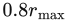 到  的范围内，切换为线性衰减[1591]。

对于某些应用，匹配平方反比曲线并不是优先事项，因此它们会使用完全不同的函数。实际上，这相当于将式（5.11）—（5.14）推广为：

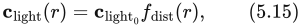

其中 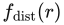 是某个距离函数。这类函数称为距离衰减函数。在某些情况下，采用非平方反比衰减函数是出于性能限制。例如，游戏《正当防卫2》（Just Cause 2）需要计算成本极低的光源。因此，其衰减函数既要计算简单，又必须足够平滑，以避免逐顶点光照产生伪影[1379]：

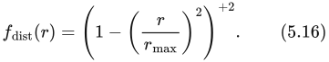

在其他情况下，衰减函数的选择可能由创作上的考虑决定。例如，既用于写实游戏也用于风格化游戏的Unreal Engine提供了两种光照衰减模式：一种是式（5.12）所描述的平方反比模式；另一种是指数衰减模式，可以通过调整得到多种衰减曲线[1802]。游戏《古墓丽影》（Tomb Raider，2013）的开发者使用样条编辑工具制作衰减曲线[953]，从而对曲线形状获得更大的控制力。

### 聚光灯

与点光源不同，现实世界中几乎所有光源的光照都会同时随方向和距离变化。这种方向变化可以表示为方向衰减函数 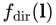；它与距离衰减函数相结合，定义光强的总体空间变化：

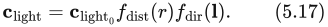

为  选择不同形式，可以产生各种光照效果。其中一种重要效果是聚光灯，它在一个圆锥体内投射光。聚光灯的方向衰减函数绕其方向向量 **s** 旋转对称，因此可以表示为角度 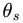 的函数； 是 **s** 与指向表面的反向光照向量 −**l** 之间的夹角。之所以要反转光照向量，是因为我们将表面处的 **l** 定义为指向光源，而这里需要的是背离光源的向量。

大多数聚光灯函数采用由 cos  组成的表达式；如前所述，这也是着色中表示角度最常见的形式。聚光灯通常具有本影角 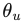，它限定光的范围，使得对所有  ≥  都有 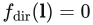。这个角度可以用于剔除，其方式类似于前面介绍的最大衰减距离 。聚光灯通常还具有半影角 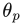，它定义了一个光照保持全强度的内锥体。见图5.7。

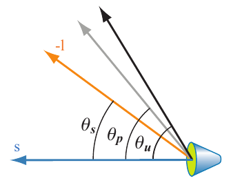

图5.7　一个聚光灯： 是光源所定义的方向 **s** 与向量 −**l**（指向表面的方向）之间的夹角； 和  分别表示为光源定义的半影角与本影角。

聚光灯使用的方向衰减函数有许多种，但往往大致相似。例如，Frostbite游戏引擎[960]使用函数 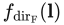，而three.js浏览器图形库[218]使用函数 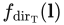：

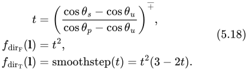

回顾第1.2节介绍的记号 ，它表示把 x 钳制在0与1之间。smoothstep函数是一个三次多项式，常用于着色中的平滑插值。大多数着色语言都将它作为内置函数提供。图5.8展示了目前为止我们讨论过的几种光源类型。

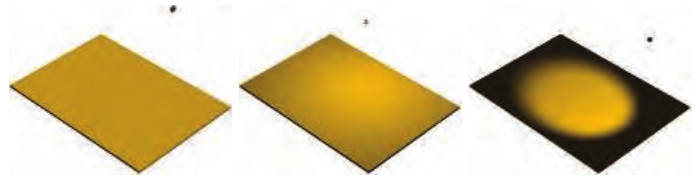

图5.8　几种光源类型。从左到右：方向光、没有衰减的点光源，以及具有平滑过渡的聚光灯。注意，由于光照方向与表面之间的夹角发生变化，点光源照明在靠近边缘时会变暗。

### 其他局部点状光源

局部点状光源的  值还可以通过许多其他方式变化。 函数并不限于前面讨论的简单聚光灯衰减函数；它可以表示任何类型的方向变化，包括从现实世界光源测量得到、以复杂表格记录的分布模式。照明工程学会（Illuminating Engineering Society，IES）为这类测量定义了一种标准文件格式。许多灯具制造商都提供IES光度配置文件，它们已被用于游戏《杀戮地带：暗影坠落》（Killzone: Shadow Fall）[379, 380]，以及Unreal [861]和Frostbite [960]等游戏引擎。Lagarde对解析和使用这种文件格式的相关问题给出了很好的总结[961]。

游戏《古墓丽影》（2013）[953]有一种局部点状光源，沿世界坐标系的 x、y 和 z 轴分别对距离应用独立的衰减函数。在《古墓丽影》中，还可以应用曲线让光强随时间变化，例如生成闪烁的火炬效果。

第6.9节将讨论如何利用纹理来改变光强与颜色。

## 5.2.3 其他光源类型

方向光和局部点状光源的主要特征是光照方向 **l** 的计算方式。采用其他方式计算光照方向，就可以定义不同类型的光源。例如，除了前面提到的光源类型，《古墓丽影》还有胶囊光源，它使用线段而不是点作为光源[953]。对于每个着色像素，取指向该线段上最近点的方向作为光照方向 **l**。

只要着色器拥有可用于计算着色方程的 **l** 和  值，就可以用任何方法来计算这些值。

到目前为止讨论的光源类型都是抽象模型。现实中的光源具有大小和形状，并从多个方向照亮表面点。在渲染中，这类光源称为面光源，它们在实时应用中的使用正在稳步增加。面光源渲染技术分为两类：一类模拟面光源被部分遮挡时产生的阴影边缘软化（第7.1.2节）；另一类模拟面光源对表面着色的影响（第10.1节）。第二类光照效果在平滑、类似镜面的表面上最为显著，因为可以在反射中清楚辨认光源的形状和大小。虽然方向光和局部点状光源不像过去那样无处不在，但它们不太可能被弃用。人们已经开发出一些考虑光源面积、实现成本又相对较低的近似方法，因此这些方法正得到更广泛的应用。GPU性能的提高，也使得采用比过去更精细的技术成为可能。
