# 5.3 实现着色模型

本节来源：《Real-Time Rendering, Fourth Edition》书页 117—130（PDF 物理页 138—151）。范围包括 5.3.1—5.3.3，截止于 5.4 标题之前；插图按所属内容就近安排。

这些着色和光照方程当然必须用代码实现，才能发挥作用。本节将介绍设计和编写这些实现时的一些关键考虑因素，并逐步讲解一个简单的实现示例。

## 5.3.1 求值频率

设计着色实现时，需要根据求值频率划分各项计算。首先，判断某项计算的结果在整个绘制调用期间是否始终不变。如果是，这项计算就可以由应用程序完成，通常在 CPU 上执行；不过，对于代价特别高的计算，也可以使用 GPU 计算着色器。计算结果通过 uniform 着色器输入传给图形 API。

即使在这一类别内部，可能的求值频率也有很大的跨度，最低是“总共只计算一次”。最简单的例子是着色方程中的常量子表达式，但任何基于硬件配置、安装选项等很少变化的因素的计算，也都可能属于这种情况。这类着色计算可以在编译着色器时完成，此时甚至不必设置 uniform 着色器输入。另一种做法是在离线预计算阶段、安装时，或者应用程序加载时完成计算。

另一种情况是，着色计算的结果在应用程序运行期间会变化，但变化得很慢，没有必要每一帧都更新。例如，依赖虚拟游戏世界中一天内时刻的光照因素。如果计算代价很高，可以考虑将其分摊到多个帧中完成。

还有一些计算每帧执行一次，例如将观察矩阵与透视矩阵连接起来；一些每个模型执行一次，例如更新依赖位置的模型光照参数；还有一些每次绘制调用执行一次，例如更新一个模型中各个材质的参数。按求值频率对 uniform 着色器输入分组，有助于提高应用程序效率，也可以通过尽量减少常量更新来改善 GPU 性能 [1165]。

如果某项着色计算的结果会在一次绘制调用内部变化，就不能通过 uniform 着色器输入传递给着色器，而必须由第 3 章所述的某个可编程着色器阶段计算；必要时，再通过 varying 着色器输入传给其他阶段。理论上，任何可编程阶段都可以执行着色计算，而各阶段分别对应不同的求值频率：

- 顶点着色器：对曲面细分前的每个顶点求值。
- 外壳着色器：对每个曲面片求值。
- 域着色器：对曲面细分后的每个顶点求值。
- 几何着色器：对每个图元求值。
- 像素着色器：对每个像素求值。

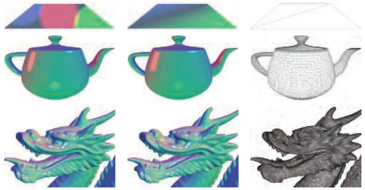

图 5.9。对三个顶点密度不同的模型，比较式 5.19 所示示例着色模型的逐像素求值与逐顶点求值。左列显示逐像素求值的结果，中列显示逐顶点求值的结果，右列则给出各模型的线框渲染，以展示顶点密度。（中国龙网格来自 Computer Graphics Archive [1172]，原始模型来自 Stanford 3D Scanning Repository。）

实际中，大多数着色计算都逐像素执行。它们通常在像素着色器中实现，但使用计算着色器的实现也越来越常见；第 20 章将讨论几个例子。其他阶段主要用于变换、变形等几何操作。为了理解其中的原因，我们将比较逐顶点与逐像素着色求值的结果。在较早的文献中，它们有时分别被称为 Gouraud 着色 [578] 和 Phong 着色 [1414]，不过如今这些术语已经不常使用。这里用于比较的着色模型与式 5.1 有些相似，但经过修改，可以处理多个光源。稍后详细介绍实现示例时，将给出完整模型。

图 5.9 展示了在顶点密度相差很大的模型上，逐像素与逐顶点着色的结果。龙模型的网格极为密集，因此两者差别很小。但是，在茶壶模型上，逐顶点着色求值会产生棱角分明的高光等明显错误；在仅由两个三角形构成的平面上，逐顶点着色版本显然是错误的。这些错误的原因在于，着色方程中的某些部分，尤其是高光，其数值在网格表面上呈非线性变化。因此它们不适合放在顶点着色器中计算，因为顶点着色器的结果会先在三角形上进行线性插值，再送入像素着色器。

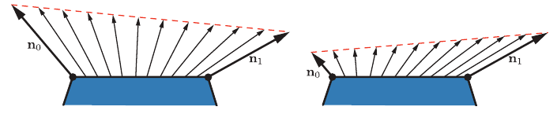

图 5.10。左图表明，在表面上对单位法线进行线性插值，得到的插值向量长度会小于 1。右图表明，对长度差异显著的法线进行线性插值，会使插值后的方向偏向两条法线中较长的一条。

原则上，可以只在像素着色器中计算着色模型的镜面高光部分，而把其余部分放在顶点着色器中计算。这很可能不会产生视觉伪影，理论上也可以节省一些计算。但实际中，这种混合实现往往并非最优。着色模型中线性变化的部分，通常恰好是计算代价最低的部分；以这种方式拆分着色计算，往往会引入足够多的额外开销，例如重复计算和新增的 varying 输入，使其抵消原本的收益。

如前所述，在大多数实现中，顶点着色器负责几何变换、变形等非着色操作。由此得到的几何表面属性会被变换到合适的坐标系，由顶点着色器输出，在三角形上进行线性插值，再作为 varying 着色器输入传入像素着色器。这些属性通常包括表面位置、表面法线；如果法线映射需要，还可以包括表面切向量。

注意，即使顶点着色器始终生成单位长度的表面法线，插值仍然可能改变其长度，见图 5.10 左侧。因此，需要在像素着色器中重新归一化法线，即将长度缩放为 1。不过，顶点着色器生成的法线长度仍然很重要。如果顶点之间的法线长度差异显著，例如受到顶点混合副作用的影响，插值就会发生偏斜，见图 5.10 右侧。由于这两种影响，实现中往往会在插值之前和之后都对被插值的向量归一化，也就是在顶点着色器和像素着色器中都进行归一化。

与表面法线不同，指向特定位置的向量，例如观察向量、点状光源的光照向量，通常不进行插值。相反，像素着色器使用插值后的表面位置来计算这些向量。除归一化以外，每个向量只需要一次很快的向量减法；而我们已经看到，无论如何都必须在像素着色器中进行归一化。如果出于某种原因必须对这些向量进行插值，不要事先将它们归一化，否则会得到错误结果，如图 5.11 所示。

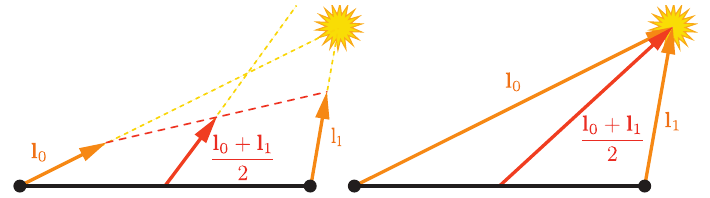

图 5.11。两个光照向量之间的插值。左图中，在插值前将它们归一化，导致插值后的方向错误。右图中，对未经归一化的向量进行插值，得到正确结果。

前面提到，顶点着色器把表面几何变换到“合适的坐标系”中。通过 uniform 变量传给像素着色器的相机位置和光源位置，通常也由应用程序变换到同一坐标系。这可以尽量减少像素着色器为把着色模型的全部向量统一到同一坐标空间而执行的工作。但是，哪个坐标系才“合适”呢？可选项包括全局世界空间、相机的局部坐标系，以及较少采用的当前所渲染模型的局部坐标系。通常会基于性能、灵活性、简洁性等系统层面的考虑，为整个渲染系统作出统一选择。例如，如果预计所渲染的场景将包含数量极多的光源，可以选择世界空间，以避免变换光源位置。也可以优先选择相机空间，以便更好地优化像素着色器中与观察向量有关的操作，并可能提高精度，见 16.6 节。

虽然大多数着色器实现，包括接下来要讨论的示例，都遵循上述总体框架，但当然也存在例外。例如，一些应用程序出于风格考虑，选择逐图元着色求值产生的分面外观。这种风格通常称为平面着色。图 5.12 给出了两个例子。

原则上，平面着色可以在几何着色器中完成，但近来的实现通常使用顶点着色器。具体做法是将每个图元的属性关联到其第一个顶点，并禁用顶点值的插值。禁用插值可以分别针对每一个顶点值进行设置；这样，第一个顶点的值就会传递到该图元内的所有像素。

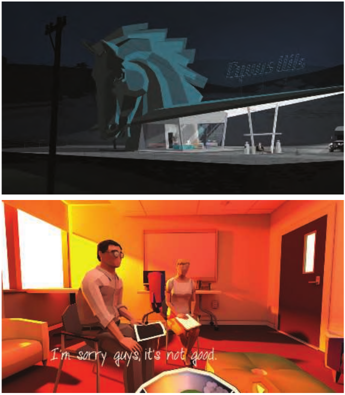

图 5.12。两款将平面着色作为风格选择的游戏：上图是《Kentucky Route Zero》，下图是《That Dragon, Cancer》。（上图由 Cardboard Computer 提供，下图由 Numinous Games 提供。）

## 5.3.2 实现示例

现在介绍一个着色模型的实现示例。如前所述，我们要实现的着色模型类似于式 5.1 中的扩展 Gooch 模型，但经过修改以支持多个光源。其表达式为：


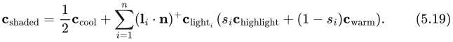


其中包含以下中间计算：


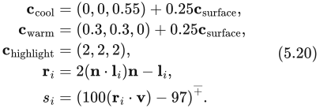


这一表达式符合式 5.6 的多光源结构，为方便起见，在此重列：


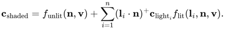


此时，受光项和不受光项为：


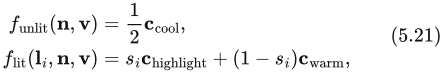


这里调整了冷色的不受光贡献，使结果在外观上更接近原始方程。

在大多数典型渲染应用程序中，表面颜色 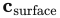 等材质属性的可变值存储在顶点数据中，或者更常见地存储在纹理中，见第 6 章。不过，为了使这个实现示例保持简单，我们假定  在整个模型上恒定。

这个实现将使用着色器的动态分支能力，循环遍历所有光源。对于相当简单的场景，这种直接的方法能够很好地工作；但它不能很好地扩展到包含大量光源、几何复杂的大场景。第 20 章将介绍高效处理大量光源的渲染技术。另外，为简单起见，我们只支持一种光源：点光源。虽然实现很简单，但仍遵循前面介绍的最佳实践。

着色模型并不是孤立实现的，而是处于一个更大的渲染框架中。本例在一个简单的 WebGL 2 应用程序中实现，修改自 Tarek Sherif 的 WebGL 2 示例“Phong-shaded Cube”[1623]；相同原则也适用于更复杂的框架。

我们将讨论应用程序中的一些 GLSL 着色器代码和 JavaScript WebGL 调用。目的不是讲授 WebGL API 的具体用法，而是展示通用的实现原则。我们将按“由内向外”的顺序介绍：先看像素着色器，再看顶点着色器，最后看应用程序端的图形 API 调用。

在正式的着色器代码之前，着色器源码包含输入与输出的定义。如 3.3 节所述，按 GLSL 的术语，着色器输入分为两类。一类是 uniform 输入，由应用程序设置数值，在一次绘制调用中保持不变。另一类是 varying 输入，其数值可以在不同的着色器调用之间变化，也就是在像素或顶点之间变化。下面给出像素着色器的 varying 输入及输出定义；在 GLSL 中，这些输入用 `in` 标记：

```glsl
in vec3 vPos;
in vec3 vNormal;
out vec4 outColor;
```

这个像素着色器只有一个输出，即最终的着色颜色。像素着色器输入与顶点着色器输出相匹配，后者先在三角形上进行插值，然后才送入像素着色器。该像素着色器有两个 varying 输入：表面位置和表面法线，两者都位于应用程序的世界空间坐标系中。uniform 输入的数量要多得多，因此为简洁起见，我们只展示其中两个的定义，它们都与光源有关：

```glsl
struct Light {
    vec4 position;
    vec4 color;
};
uniform LightUBlock {
    Light uLights[MAXLIGHTS];
};
uniform uint uLightCount;
```

由于这些是点光源，每个光源的定义都包含位置和颜色。它们被定义为 `vec4` 而不是 `vec3`，以符合 GLSL 的 `std140` 数据布局标准的限制。虽然 `std140` 布局可能像本例一样浪费一些空间，但它简化了确保 CPU 与 GPU 数据布局一致的工作，这就是本例采用它的原因。`Light` 结构体数组定义在一个具名 uniform 块内部；这是 GLSL 的一项功能，用来将一组 uniform 变量绑定到缓冲区对象，以加快数据传输。数组长度设为应用程序允许在一次绘制调用中使用的最大光源数量。后面将看到，应用程序在编译着色器之前，会将着色器源码中的字符串 `MAXLIGHTS` 替换为正确的数值，本例中为 10。uniform 整数 `uLightCount` 则是这次绘制调用中实际启用的光源数量。

接下来看像素着色器代码：

```glsl
vec3 lit(vec3 l, vec3 n, vec3 v) {
    vec3 r_l = reflect(-l, n);
    float s = clamp(100.0 * dot(r_l, v) - 97.0, 0.0, 1.0);
    vec3 highlightColor = vec3(2,2,2);
    return mix(uWarmColor, highlightColor, s);
}
void main() {
    vec3 n = normalize(vNormal);
    vec3 v = normalize(uEyePosition.xyz - vPos);
    outColor = vec4(uFUnlit, 1.0);
    for (uint i = 0u; i < uLightCount; i++) {
        vec3 l = normalize(uLights[i].position.xyz - vPos);
        float NdL = clamp(dot(n, l), 0.0, 1.0);
        outColor.rgb += NdL * uLights[i].color.rgb * lit(l,n,v);
    }
}
```

这里定义了一个计算受光项的函数，由 `main()` 调用。总体而言，这是式 5.20 和式 5.21 的直接 GLSL 实现。注意，不受光函数 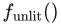 的值和暖色  通过 uniform 变量传入。由于它们在整个绘制调用中恒定，可以由应用程序计算，从而节省一些 GPU 周期。

该像素着色器使用了几个 GLSL 内置函数。`reflect()` 将一个向量相对于由第二个向量定义的平面进行反射；本例中，前者是光照向量，后者是表面法线。由于我们希望光照向量和反射向量都指向远离表面的方向，必须在传入 `reflect()` 之前将光照向量取负。`clamp()` 有三个输入，其中两个定义一个范围，将另一个输入限制在这个范围内。在大多数 GPU 上，将数值限制到 0—1 范围这一特殊情况，对应 HLSL 的 `saturate()` 函数，执行很快，往往实际上没有额外代价。因此我们在这里使用它，尽管对于已知不会超过 1 的值，只需限制下限为 0。`mix()` 也有三个输入：它根据第三个输入，也就是 0—1 之间的混合参数，对另外两个输入进行线性插值；本例中，被插值的是暖色和高光颜色。在 HLSL 中，此函数称为 `lerp()`，即“线性插值”的缩写。最后，`normalize()` 将向量除以其长度，使其长度缩放为 1。

现在看顶点着色器。由于已经看过像素着色器中 uniform 定义的例子，这里不再展示顶点着色器的 uniform 定义，但值得看看 varying 输入和输出的定义：

```glsl
layout(location=0) in vec4 position;
layout(location=1) in vec4 normal;
out vec3 vPos;
out vec3 vNormal;
```

注意，如前所述，顶点着色器输出与像素着色器的 varying 输入相匹配。输入中还包含指定数据在顶点数组中如何布局的指令。接下来是顶点着色器代码：

```glsl
void main() {
    vec4 worldPosition = uModel * position;
    vPos = worldPosition.xyz;
    vNormal = (uModel * normal).xyz;
    gl_Position = viewProj * worldPosition;
}
```

这些是顶点着色器中的常见操作。着色器将表面位置和法线变换到世界空间，并传给像素着色器用于着色。最后，将表面位置变换到裁剪空间，再传给 `gl_Position`。它是供光栅化器使用的特殊系统定义变量，也是任何顶点着色器都必须提供的那个输出。

注意，顶点着色器没有将法线向量归一化。这里不需要归一化，因为原始网格数据中的法线长度为 1，而且本应用程序没有执行顶点混合、非均匀缩放等会不均匀地改变其长度的操作。模型矩阵可以包含均匀缩放因子，但这会成比例地改变所有法线的长度，因此不会产生图 5.10 右侧所示的问题。

应用程序使用 WebGL API 完成各种渲染和着色器设置。每个可编程着色器阶段分别设置，然后全部绑定到一个程序对象。以下是像素着色器的设置代码：

```javascript
var fSource = document.getElementById("fragment").text.trim();
var maxLights = 10;
fSource = fSource.replace(/MAXLIGHTS/g, maxLights.toString());
var fragmentShader = gl.createShader(gl.FRAGMENT_SHADER);
gl.shaderSource(fragmentShader, fSource);
gl.compileShader(fragmentShader);
```

注意代码中对“fragment shader”（片元着色器）的引用。这是 WebGL 以及作为其基础的 OpenGL 使用的术语。如本书前面所述，虽然“pixel shader”（像素着色器）在某些方面不够精确，但它的使用更普遍，所以本书沿用这一术语。字符串 `MAXLIGHTS` 也在这里被替换为合适的数值。大多数渲染框架都会执行类似的编译前着色器处理。

应用程序端还有设置 uniform、初始化顶点数组、清除、绘制等更多代码，可以查看程序 [1623]；许多 API 指南也有相应解释。这里的目标，是让读者了解着色器如何被当作独立的处理器对待，并拥有各自的编程环境。因此，我们的逐步讲解到此结束。

## 5.3.3 材质系统

渲染框架很少像我们的简单示例那样只实现一个着色器。通常需要一个专用系统，处理应用程序使用的各种材质、着色模型和着色器。

如前几章所述，着色器是运行于 GPU 某个可编程着色器阶段的程序。因此，它是低层图形 API 资源，而不是美术人员会直接交互的对象。相比之下，材质是面向美术人员、对表面视觉外观的封装。有时材质还描述碰撞属性等非视觉方面，但这些超出了本书范围，不再深入讨论。

虽然材质通过着色器实现，但两者并非简单的一一对应关系。在不同渲染情形下，同一个材质可能使用不同的着色器；一个着色器也可能被多个材质共享。最常见的情况是参数化材质。在最简单的形式中，材质参数化需要两类材质实体：材质模板和材质实例。每个材质模板描述一类材质，并包含一组参数；根据参数类型，可以为其赋予数值、颜色或纹理值。每个材质实例则对应一个材质模板，加上该模板所有参数的一组具体取值。一些渲染框架，例如 Unreal Engine [1802]，允许更复杂的层次结构，使材质模板可以在多个层级上从其他模板派生。

参数可以在运行时通过向着色器程序传入 uniform 输入来确定，也可以在编译时通过在着色器编译前替换数值来确定。一种常见的编译时参数是布尔开关，用于控制某项材质功能是否启用。美术人员可以通过材质用户界面中的复选框设置它，材质系统也可以以程序化方式设置。例如，对于某功能的视觉效果可以忽略的远处物体，将其关闭以降低着色器开销。

材质参数可能与着色模型参数一一对应，但并非总是如此。材质可以把某个着色模型参数，例如表面颜色，固定为常量。另一种情况是，通过一系列复杂操作，以多个材质参数以及插值后的顶点值或纹理值为输入，计算出一个着色模型参数。有时，表面位置、表面朝向，甚至时间，也会参与计算。基于表面位置和朝向的着色在地形材质中尤其常见。例如，可以利用高度和表面法线控制积雪效果，在高海拔的水平和接近水平的表面上混入白色表面颜色。基于时间的着色则常见于动画材质，例如闪烁的霓虹灯招牌。

材质系统最重要的任务之一，是把各种着色器功能划分为独立元素，并控制它们如何组合。在很多情况下，这类组合都很有用，包括：

- 将表面着色与几何处理组合，例如刚体变换、顶点混合、变形、曲面细分、实例化和裁剪。这些功能彼此独立变化：表面着色依赖材质，几何处理依赖网格。因此，分别编写它们，再由材质系统按需组合，会很方便。
- 将表面着色与像素丢弃、混合等合成操作组合。这对移动 GPU 尤其相关，因为它们通常在像素着色器中执行混合。通常希望能够独立于表面着色所用的材质来选择这些操作。
- 将计算着色模型参数的操作与着色模型本身的计算组合。这样只需编写一次着色模型实现，就可以将它与各种不同的着色模型参数计算方法组合使用。
- 将可以单独选择的材质功能彼此组合，并与选择逻辑及着色器其余部分组合。这样就可以分别编写各项功能的实现。
- 将着色模型及其参数计算与光源求值组合，也就是在着色点为每个光源计算光照颜色  和光照方向 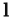。延迟渲染等技术，见第 20 章，会改变这种组合的结构。在支持多种此类技术的渲染框架中，这又增加了一层复杂性。

如果图形 API 能把这种着色器代码模块化作为核心功能提供，事情就会很方便。遗憾的是，与 CPU 代码不同，GPU 着色器不允许在编译之后链接代码片段。每个着色器阶段的程序都作为一个整体编译。不同着色器阶段之间的分离确实提供了有限的模块化，在一定程度上符合上述列表的第一项：将通常在像素着色器中执行的表面着色，与通常在其他着色器阶段执行的几何处理组合起来。但这种对应并不完美，因为每个着色器还执行其他操作，而其他类型的组合仍需要处理。鉴于这些限制，材质系统要实现所有这些组合类型，唯一的方法就是在源码层面完成。这主要涉及连接、替换等字符串操作，往往通过 C 风格的预处理指令执行，例如 `#include`、`#if` 和 `#define`。

早期渲染系统的着色器变体相对较少，而且通常逐个手工编写。这有一些好处，例如可以在充分了解最终着色器程序的情况下优化每个变体。但是，随着变体数量增长，这种方法很快就不再实际。考虑所有不同的组成部分和选项之后，可能出现的着色器变体数量极其庞大。这就是模块化和可组合性如此重要的原因。

设计处理着色器变体的系统时，首先需要解决的问题是：不同选项之间的选择，是在运行时通过动态分支完成，还是在编译时通过条件预处理完成。在较早的硬件上，动态分支往往无法实现，或者极为缓慢，因此运行时选择不可行。当时所有变体都在编译时处理，包括不同光源类型数量的所有可能组合 [1193]。

相比之下，当今的 GPU 能够很好地处理动态分支，尤其是在一次绘制调用中所有像素的分支行为都相同时。如今，光源数量等许多功能差异都在运行时处理。然而，向一个着色器中加入大量功能变化，会带来另一种代价：寄存器数量增加，占用率随之下降，性能也因而降低。详见 18.4.5 节。因此，编译时变体仍然很有价值：它可以避免包含永远不会执行的复杂逻辑。

举例来说，假设一个应用程序支持三种不同类型的光源。其中两种很简单：点光源和平行光源。第三种是广义聚光灯，支持表格化照明分布和其他复杂功能，需要大量着色器代码才能实现。但假设这种广义聚光灯用得相对较少，占应用程序中全部光源的比例不到 5%。过去，为了避免动态分支，会针对三种光源数量的每一种可能组合分别编译一个着色器变体。如今虽然不再需要这样做，但编译两个独立变体可能仍然有益：一个用于广义聚光灯数量大于或等于 1 的情况，另一个用于其数量恰好为 0 的情况。第二个变体的代码更简单，而且最常使用，因此很可能占用更少的寄存器，从而具有更高性能。

现代材质系统同时采用运行时和编译时着色器变体。虽然全部负担已不再仅由编译时处理承担，但总体复杂度和变化数量仍在持续增长，因此仍需编译大量着色器变体。例如，在游戏《Destiny: The Taken King》的某些区域，单帧使用的已编译着色器变体超过 9000 个 [1750]。可能的变体数量还可以大得多，例如 Unity 渲染系统中的某些着色器有接近 1000 亿种可能的变体。只有实际使用的变体才会被编译，但仍不得不重新设计着色器编译系统，以处理数量如此庞大的可能变体 [1439]。

材质系统设计者采用不同策略来实现这些设计目标。虽然有时这些策略被描述为彼此排斥的系统架构 [342]，但它们可以，而且通常确实会，在同一个系统中结合使用。这些策略包括：

- **代码复用**：在共享文件中实现函数，使用 `#include` 预处理指令，让任何需要这些函数的着色器都能访问它们。
- **减法式**：用一个常被称为 übershader 或 supershader，即超级着色器的着色器 [1170, 1784]，汇集大量功能，再结合编译时预处理条件和动态分支，去掉不使用的部分，并在相互排斥的选项之间切换。
- **加法式**：将各种功能片段定义为具有输入、输出连接端口的节点，再将这些节点组合起来。这类似于代码复用策略，但结构更明确。可以通过文本 [342] 或可视化图编辑器组合节点。后者旨在让技术美术等非工程人员更容易创建新的材质模板 [1750, 1802]。通常只有着色器的一部分允许通过可视化图编写。例如，在 Unreal Engine 中，图编辑器只能影响着色模型输入的计算 [1802]，见图 5.13。
- **基于模板**：定义一个接口，只要符合接口，就可以接入不同的实现。这比加法式策略更加正式一些，通常用于较大的功能块。一个常见的接口例子，是将着色模型参数的计算与着色模型本身的计算分离。Unreal Engine [1802] 有不同的“材质域”，包括用于计算着色模型参数的 Surface 域，以及 Light Function 域；后者计算一个标量，用于调制给定光源的光照颜色 。Unity 中也存在类似的“表面着色器”结构 [1437]。注意，第 20 章讨论的延迟着色技术强制采用类似结构，其中 G 缓冲区充当接口。

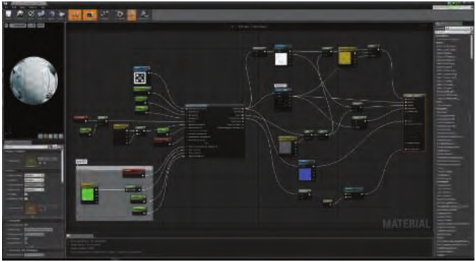

图 5.13。Unreal Engine 材质编辑器。请注意节点图右侧那个高大的节点。该节点的输入连接端口对应渲染引擎使用的各种着色输入，其中包括全部着色模型参数。（材质示例由 Epic Games 提供。）

若要了解更多具体例子，可以阅读《WebGL Insights》[301]，这本书如今已免费开放；其中若干章讨论了各种引擎如何控制自己的着色器流水线。除了组合之外，现代材质系统还有其他一些重要的设计考虑，例如需要在尽量不重复着色器代码的情况下支持多个平台。这包括为适应平台、着色语言和 API 之间的性能与能力差异而作出的功能变化。《Destiny》的着色器系统 [1750] 是解决这类问题的代表性方案。它使用专有的预处理器层，接收用定制着色语言方言编写的着色器。这使开发者能够编写平台无关的材质，并自动将其翻译为不同的着色语言和实现。Unreal Engine [1802] 和 Unity [1436] 也有类似系统。

材质系统还需要保证良好的性能。除了对着色变体进行专门编译之外，材质系统还可以执行其他几种常见优化。《Destiny》着色器系统和 Unreal Engine 会自动检测在一次绘制调用中恒定的计算，例如前述实现示例中的暖色与冷色计算，并将它们移到着色器之外。另一个例子是《Destiny》使用的作用域系统，它区分以不同频率更新的常量，例如每帧一次、每个光源一次、每个物体一次，并在合适的时机更新各组常量，以减少 API 开销。

我们已经看到，实现一个着色方程，需要决定哪些部分可以简化、各种表达式应以什么频率计算，以及用户能够如何修改和控制外观。渲染流水线最终输出颜色值和混合值。接下来有关抗锯齿、透明和图像显示的各节，将详细介绍这些值如何组合并修改，以供显示。
