# 5.4 走样与抗锯齿

来源：《Real-Time Rendering, Fourth Edition》，书页 130—148（PDF 物理页 151—169）。本节从 5.4 标题开始，至 5.5 标题之前结束，包含 5.4.1、5.4.2 及其全部下级内容。技术表述保留原书出版时的背景。

设想一个很大的黑色三角形在白色背景上缓慢移动。当三角形覆盖一个屏幕网格单元时，代表该单元的像素值，其强度应当平滑下降。然而，在各种类型的基础渲染器中，通常发生的情况却是：网格单元中心一被覆盖，像素颜色便立即从白色变为黑色。标准 GPU 渲染也不例外。见图 5.14 最左一列。

三角形在像素中的表现只有“存在”或“不存在”两种状态。绘制线条时也有类似问题。因此，边缘看起来呈锯齿状，这种视觉伪影被称为“锯齿”（jaggies）；在动画中，它们又变成了“爬动的锯齿”（crawlies）。更正式地说，这一问题称为**走样**（aliasing），旨在避免它的措施称为**抗锯齿技术**（antialiasing techniques）。

采样理论与数字滤波的内容足以单独写成一本书 [559, 1447, 1729]。由于这是渲染中的一个关键领域，我们将介绍采样与滤波的基本理论，然后着重讨论当前能够实时执行、用于减轻走样伪影的方法。

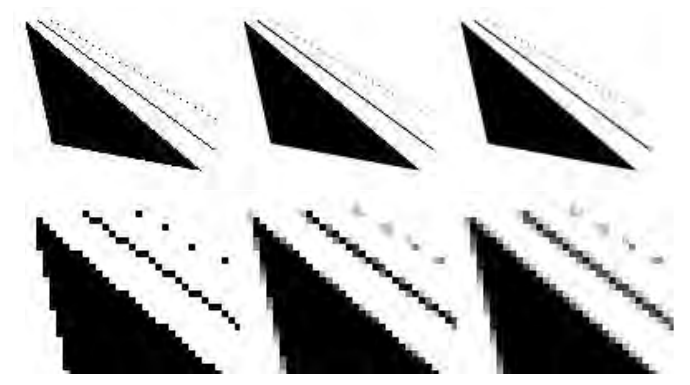

**图 5.14** 上排显示三角形、一条线以及一些点在三种不同抗锯齿程度下的图像。下排是上排图像的放大版本。最左列每个像素仅使用一个样本，也就是没有使用抗锯齿。中间一列每个像素使用四个样本，以网格模式排列；最右列每个像素使用八个样本，采用 4 × 4 棋盘格，在其中一半格子内采样。

## 5.4.1 采样与滤波理论

渲染图像的过程，本质上是一项采样任务。这是因为，生成图像就是对三维场景进行采样，以获得图像中每个像素的颜色值，而图像是一个离散像素数组。使用纹理映射时（第 6 章），必须对纹素重新采样，才能在各种条件下取得良好结果。为了生成动画中的图像序列，通常还会按均匀的时间间隔对动画采样。本节介绍采样、重建与滤波。为简单起见，大部分内容将以一维情况说明。这些概念可以自然推广到二维，因此也可用于处理二维图像。

图 5.15 显示了如何以均匀间隔对连续信号采样，也就是将其离散化。这一采样过程的目标是以数字形式表示信息。在此过程中，信息量会减少。不过，为了恢复原始信号，必须对采样后的信号进行**重建**。这是通过对采样信号进行**滤波**实现的。

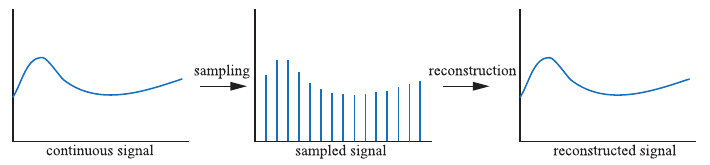

**图 5.15** 对连续信号（左）进行采样（中），然后通过重建恢复原始信号（右）。

只要进行采样，就可能发生走样。这是不希望出现的伪影，我们必须抑制走样，才能生成赏心悦目的图像。老西部片中一个经典例子，是电影摄影机拍摄旋转的车轮。由于辐条运动速度远高于摄影机记录图像的速度，车轮可能看起来在缓慢旋转，方向或向后、或向前，甚至看起来完全没有转动。图 5.16 展示了这一现象。这种效应源于车轮图像是在一系列离散时间步上拍摄的，称为**时间走样**（temporal aliasing）。

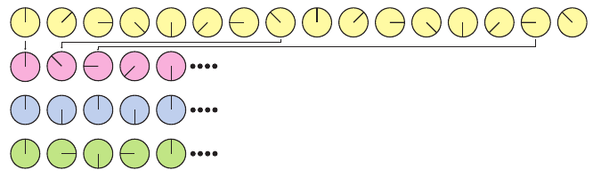

**图 5.16** 第一排显示旋转的车轮，即原始信号。第二排对它的采样不足，使车轮看起来沿相反方向运动，这是采样率过低造成走样的一个例子。第三排的采样率恰好是每转两次采样，我们无法确定车轮朝哪个方向旋转。这就是奈奎斯特极限。第四排的采样率高于每转两次采样，于是我们突然能够看出车轮正沿正确方向旋转。

计算机图形学中常见的走样例子包括：光栅化线条或三角形边缘上的“锯齿”、被称为“萤火虫”的闪烁高光，以及棋盘格纹理缩小时出现的现象（6.2.2 节）。

当信号以过低的频率采样时，就会发生走样。此时，采样后的信号看起来像是一个比原信号频率更低的信号，图 5.17 对此作了说明。为了正确采样一个信号，也就是说，能够从样本中重建原始信号，采样频率必须高于被采样信号最高频率的两倍。这通常称为**采样定理**，这一采样频率称为**奈奎斯特率** [1447] 或**奈奎斯特极限**，以瑞典科学家 Harry Nyquist（1889—1976）的名字命名；他于 1928 年发现了这一规律。图 5.16 也展示了奈奎斯特极限。定理中使用“最高频率”一词，意味着信号必须是**带限的**，也就是不存在高于某个界限的频率。换句话说，相对于相邻样本之间的间距，信号必须足够平滑。

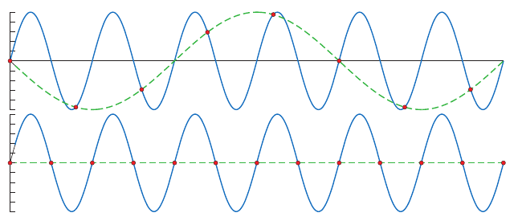

**图 5.17** 蓝色实线是原始信号，红色圆点是均匀分布的采样点，绿色虚线是重建信号。上图的采样率过低，因此重建信号看起来具有更低的频率，也就是原始信号的一个混叠信号。下图的采样率恰好为原始信号频率的两倍，此时重建信号是一条水平线。可以证明，只要再把采样率提高哪怕一点点，就能够进行完美重建。

使用点样本渲染时，三维场景通常并不是带限的。三角形边缘、阴影边界等现象会产生不连续变化的信号，因此其频率可延伸至无穷高 [252]。而且，无论样本排得多密，物体仍然可能小到根本没有被采到。因此，使用点样本渲染场景时，不可能完全避免走样，而我们几乎总是在使用点采样。不过，有时可以判断信号是否带限。一个例子是把纹理应用到表面上：可以计算纹理样本的频率相对于像素采样率的关系。如果该频率低于奈奎斯特极限，就不必采取特殊措施，也能正确采样纹理。如果频率过高，则可用多种算法对纹理进行带限处理（6.2.2 节）。

### 重建

给定一个带限的采样信号，我们现在讨论如何从采样信号重建原始信号。为此必须使用滤波器。图 5.18 展示了三种常用滤波器。注意，滤波器的面积应始终为 1，否则重建信号的幅值可能会增大或缩小。

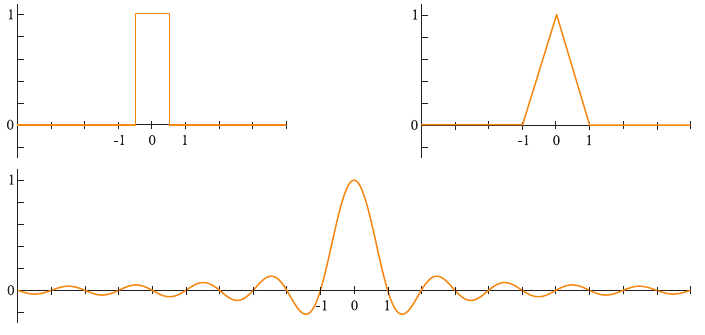

**图 5.18** 左上是盒式滤波器，右上是帐篷滤波器。下方是 sinc 滤波器，此处沿 x 轴截取了有限的显示范围。

图 5.19 使用盒式滤波器，即最近邻滤波器，重建采样信号。这是效果最差的滤波器，因为生成的信号是不连续的阶梯形。尽管如此，它因简单而经常用于计算机图形学。如图所示，将盒式滤波器放到每个采样点上，再进行缩放，使滤波器顶部与采样点重合。所有这些经过缩放、平移的盒函数相加，就得到右侧的重建信号。

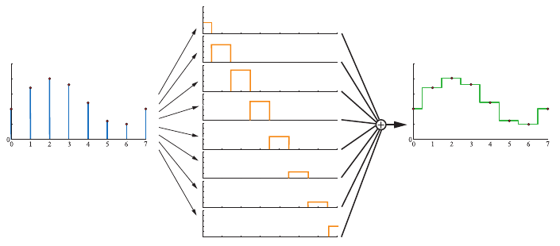

**图 5.19** 使用盒式滤波器重建采样信号（左）。方法是在每个采样点处放置盒式滤波器，并沿 y 方向缩放，使滤波器高度与该采样点相同。求和后得到重建信号（右）。

盒式滤波器可以替换为其他任何滤波器。图 5.20 使用帐篷滤波器，也称三角形滤波器，重建采样信号。注意，这个滤波器在相邻采样点之间实现线性插值，因此优于盒式滤波器，因为此时重建信号是连续的。

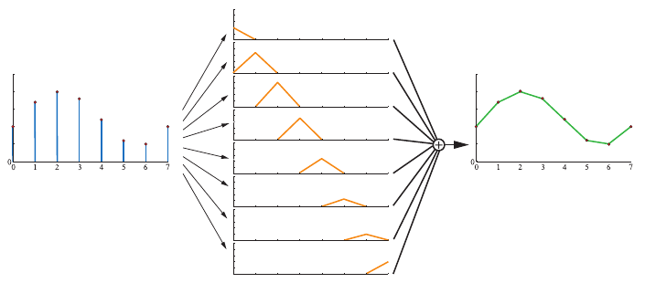

**图 5.20** 使用帐篷滤波器重建采样信号（左），重建结果显示在右侧。

然而，帐篷滤波器重建信号的平滑性仍然较差；在采样点处，斜率会突然变化。这是因为帐篷滤波器并不是完美的重建滤波器。要实现完美重建，必须使用**理想低通滤波器**。信号的一个频率分量是一条正弦波 sin(2πf)，其中 f 是该分量的频率。由此，低通滤波器会去除频率高于滤波器所定义某一频率的所有分量。直观而言，低通滤波器会移除信号中的尖锐特征，也就是对其进行模糊。理想低通滤波器就是 sinc 滤波器（图 5.18 下方）：

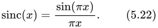

> 译注：上文正弦波的写法 sin(2πf) 忠实保留原文，原书此处未显式写出时间或空间自变量。式（5.22）在 x = 0 处按连续延拓取值 1。

傅里叶分析理论 [1447] 解释了为什么 sinc 滤波器是理想低通滤波器。简而言之，理由如下：理想低通滤波器在频域中是一个盒式滤波器；将它与信号相乘，就能去除超出滤波器宽度的所有频率。把这个盒式滤波器从频域变换到空间域，就会得到 sinc 函数。与此同时，乘法运算变换成卷积运算；本节一直在使用这种运算，只是尚未正式介绍“卷积”这个术语。

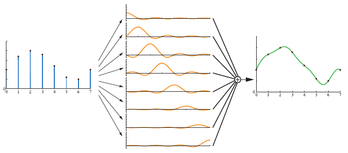

**图 5.21** 此处使用 sinc 滤波器重建信号。sinc 滤波器是理想低通滤波器。

使用 sinc 滤波器重建信号会得到更平滑的结果，如图 5.21 所示。采样过程向信号中引入高频分量，即突变，而低通滤波器的任务就是将其去除。实际上，sinc 滤波器会消除频率高于采样率一半的所有正弦波。当采样频率为 1.0 时，式（5.22）给出的 sinc 函数是完美重建滤波器，也就是说，被采样信号的最高频率必须小于 ½。更一般地，假设采样频率为 ，也就是相邻样本之间的间隔为 1/。在这种情况下，完美重建滤波器为 sinc(x)，它会消除高于 /2 的所有频率。这在对信号重新采样时很有用，下一部分会讨论。然而，sinc 的滤波器宽度是无限的，而且某些区间内取负值，因此在实践中很少能直接使用。

在低质量的盒式、帐篷滤波器与不切实际的 sinc 滤波器之间，存在有用的折中。大多数广泛使用的滤波函数 [1214, 1289, 1413, 1793] 都处于这两个极端之间。这些滤波函数在某种程度上近似 sinc 函数，但限制了其影响的像素数量。最接近 sinc 函数的滤波器，在其定义域的一部分上会取负值。对于不希望出现负滤波值、或无法实际处理负值的应用，通常使用没有负瓣的滤波器；这些滤波器常被统称为高斯滤波器，因为它们或由高斯曲线推导而来，或与其形状相似 [1402]。12.1 节将更详细地讨论滤波函数及其使用。

使用任何一种滤波器之后，都能得到连续信号。不过，在计算机图形学中，我们不能直接显示连续信号，却可以利用它对信号重新采样，得到不同大小的结果，也就是放大或缩小信号。下面讨论这个问题。

### 重采样

重采样用于放大或缩小采样信号。假设原始采样点位于整数坐标 0、1、2、……处，也就是采样间隔为一个单位。进一步假设，重采样后，希望新采样点均匀分布，相邻间隔为 a。a > 1 时发生缩小，即下采样；a < 1 时发生放大，即上采样。

两种情况中，放大较简单，所以先从它开始。假设按照上一部分介绍的方法重建采样信号。直观而言，既然现在信号已经被完美重建并且连续，只需按所需间隔对重建信号重新采样即可。图 5.22 展示了这一过程。

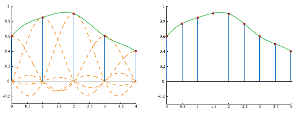

**图 5.22** 左侧为采样信号及其重建信号。右侧以两倍采样率对重建信号重新采样，也就是进行了放大。

然而，缩小时这种技术不适用。相对于新的采样率，原始信号的频率过高，无法避免走样。已有研究表明，此时应使用 sinc(x/a) 滤波器，将采样信号转为连续信号 [1447, 1661]，然后才能按所需间隔重新采样，见图 5.23。换句话说，此处使用 sinc(x/a) 作为滤波器，相当于增大低通滤波器的宽度，从而去除更多高频内容。如图所示，各个 sinc 滤波器的宽度加倍，以便将重采样率降为原采样率的一半。对应到数字图像，这类似于先将图像模糊以移除高频，再以较低分辨率对图像重新采样。

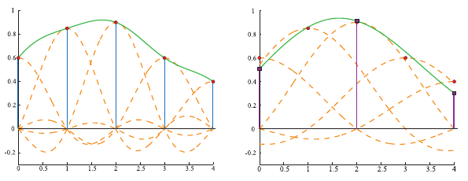

**图 5.23** 左侧为采样信号及其重建信号。右侧将滤波器宽度加倍，以便把样本间隔加倍，也就是进行了缩小。

以采样和滤波理论作为框架，下面讨论实时渲染中用于减轻走样的各种算法。

## 5.4.2 基于屏幕的抗锯齿

如果没有妥善采样和滤波，三角形边缘就会产生明显伪影。阴影边界、镜面高光，以及其他颜色快速变化的现象也会引发类似问题。本节讨论的算法有助于改善这些情况下的渲染质量。它们的共同点是都基于屏幕，也就是说，只对流水线输出的样本进行操作。不存在一种最佳抗锯齿技术，因为各种技术在质量、捕捉清晰细节或其他现象的能力、运动时的外观、内存成本、GPU 要求以及速度等方面，各有优势。

在图 5.14 的黑色三角形例子中，一个问题就是采样率低。每个像素网格单元仅在中心取得一个样本，因此，对该单元所掌握的信息，最多只是其中心是否被三角形覆盖。通过在每个屏幕网格单元内使用更多样本，并以某种方式混合它们，就能计算出更好的像素颜色。图 5.24 对此作了说明。

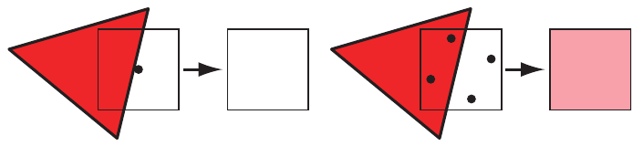

**图 5.24** 左侧在像素中心使用一个样本渲染红色三角形。由于三角形没有覆盖该样本，像素会是白色，尽管像素的相当一部分已被红色三角形覆盖。右侧每个像素使用四个样本，其中两个被红色三角形覆盖，因此得到粉红色像素。

基于屏幕的抗锯齿方案，其一般策略是为屏幕选择一种采样模式，再对样本加权求和，生成像素颜色 **p**：

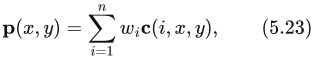

其中 n 是为一个像素取得的样本数。函数 **c**(i, x, y) 是样本颜色； 是一个位于 [0, 1] 范围内的权重，表示该样本对最终像素颜色的贡献。采样位置取决于它在序列 1、……、n 中是第几个样本；函数还可以选择使用像素位置 (x, y) 的整数部分。换句话说，每个样本在屏幕网格上的采样位置不同，采样模式还可以因像素而异。在实时渲染系统中，样本通常是点样本；实际上，大多数其他渲染系统也是如此。因此，可以把函数 **c** 看成两个函数。首先，函数 **f**(i, n) 获取屏幕上需要采样的浮点位置 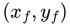。然后，对屏幕上的这个位置采样，也就是取得该精确位置的颜色。选择采样方案并配置渲染流水线之后，便可在特定亚像素位置计算样本；这通常依据每帧或每个应用的设置进行。

抗锯齿中的另一个变量是每个样本的权重 。这些权重之和为 1。实时渲染系统中的大多数方法为样本赋予均匀权重，即 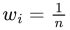。图形硬件的默认模式是在像素中心取一个样本，它是上述抗锯齿方程最简单的情况：只有一项，该项的权重为 1，采样函数 **f** 始终返回待采样像素的中心。

每个像素计算多个完整样本的抗锯齿算法，称为**超采样**（supersampling，或 oversampling）方法。概念上最简单的**全场景抗锯齿**（FSAA），也称**超采样抗锯齿**（SSAA），先以更高分辨率渲染场景，再对相邻样本滤波，生成图像。例如，希望得到一幅 1280 × 1024 像素的图像，可以先在屏幕外渲染 2560 × 2048 图像，再对每个 2 × 2 像素区域求平均，得到所需图像。这样，每个最终像素使用四个样本，并采用盒式滤波器滤波。注意，这对应于图 5.25 中的 2 × 2 网格采样。这种方法成本很高，因为所有子样本都必须完成完整的着色和填充，而且每个样本都要保存一个 z 缓冲深度。FSAA 的主要优点是简单。这种方法还有一些质量较低的版本，只在屏幕一个轴向上采用两倍采样率，因而称为 1 × 2 或 2 × 1 超采样。为了简单起见，通常采用二的幂次分辨率缩放及盒式滤波器。NVIDIA 的动态超级分辨率功能是一种更复杂的超采样形式：以某个更高分辨率渲染场景，再使用一个 13 样本的高斯滤波器生成显示图像 [1848]。

另一种与超采样相关的采样方法，基于**累积缓冲区**的思想 [637, 1115]。它不使用一个很大的离屏缓冲区，而使用与目标图像分辨率相同、但每个颜色通道位数更多的缓冲区。为了对场景实现 2 × 2 采样，需要生成四幅图像，并根据需要在屏幕 x 或 y 方向上将视图移动半个像素。每幅生成的图像都对应网格单元内的不同采样位置。每帧多次重新渲染场景并把结果复制到屏幕的额外成本，使这一算法对实时渲染系统而言代价很高。在性能不重要时，它却很适合生成高质量图像，因为每个像素可以使用任意数量、任意位置的样本 [1679]。累积缓冲区过去是一个独立的硬件部件，OpenGL API 曾直接支持它，但在 3.0 版中将其列为弃用功能。在现代 GPU 上，可以为输出缓冲区使用更高精度的颜色格式，在像素着色器中实现累积缓冲区的概念。

当物体边缘、镜面高光或锐利阴影等现象导致颜色突变时，就需要额外样本。常常可以把阴影做得更柔和、高光做得更平滑，以避免走样。某些类型的物体，例如电线，可以增大尺寸，以保证沿其全长的每个位置至少覆盖一个像素 [1384]。物体边缘的走样仍然是主要采样问题。也可以使用解析方法，在渲染过程中检测物体边缘，并把边缘的影响纳入计算，但这些方法往往比单纯增加样本更昂贵、稳健性更差。不过，保守光栅化、光栅器顺序视图等 GPU 功能打开了新的可能性 [327]。

超采样、累积缓冲等技术会生成具有完整信息的样本，每个样本都单独计算着色结果与深度。总体收益相对有限，而成本很高，因为每个样本都必须执行像素着色器。

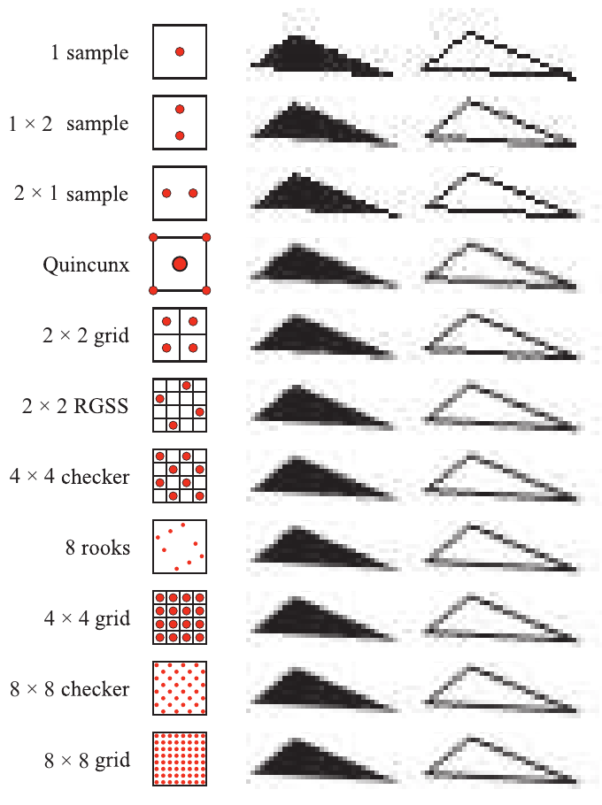

**图 5.25** 一些像素采样方案的比较，按每个像素的样本数由少到多排列。Quincunx 共享角点样本，并使中心样本占最终像素颜色的一半权重。对于近乎水平的边缘，2 × 2 旋转网格比常规 2 × 2 网格能够捕捉更多灰度级。同样，对于这类线条，8 车模式虽然样本更少，却比 4 × 4 网格能捕捉更多灰度级。

**多重采样抗锯齿**（MSAA）通过对每个像素只计算一次表面着色，并在样本之间共享结果，减轻高昂的计算成本。例如，一个片元在某个像素中可以具有四个 (x, y) 采样位置，每个位置有自己的颜色和 z 深度，但对作用于该像素的每个物体片元，像素着色器只执行一次。如果所有 MSAA 位置样本都被片元覆盖，则在像素中心计算着色样本。如果片元覆盖的位置样本较少，可以移动着色样本的位置，以更好地代表被覆盖的位置。例如，这样能够避免在纹理边缘之外进行着色采样。这种位置调整称为**质心采样**或**质心插值**；启用后，由 GPU 自动完成。质心采样避免了采样点落在三角形外的问题，但可能使导数计算返回错误结果 [530, 1041]。见图 5.26。

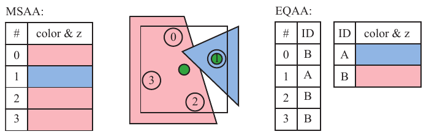

**图 5.26** 中间显示两个物体与同一个像素重叠。红色物体覆盖三个样本，蓝色物体仅覆盖一个。像素着色器的求值位置用绿色表示。由于红色三角形覆盖像素中心，因此在中心计算着色器。蓝色物体的像素着色器在其样本位置求值。对于 MSAA，四个位置都分别存储颜色与深度。右侧显示 EQAA 的 2f4x 模式。现在，四个样本各有一个 ID 值，用于索引存有两组颜色与深度的表。

由于片元只着色一次，MSAA 比纯超采样方案更快。它将计算量集中用于以更高采样率估计片元的像素覆盖情况，并共享计算出的着色结果。进一步解耦采样与覆盖率还能节省更多内存，进而进一步加快抗锯齿：访问的内存越少，渲染越快。NVIDIA 于 2006 年推出**覆盖采样抗锯齿**（CSAA），AMD 随后推出**增强质量抗锯齿**（EQAA）。这些技术仅以更高采样率存储片元覆盖信息。例如，EQAA 的“2f4x”模式存储两组颜色和深度值，由四个采样位置共享。颜色和深度不再针对特定位置存储，而是存入一张表中。于是，四个样本中的每个只需要一位，就能指明其位置对应两个存储值中的哪一个。见图 5.26。覆盖样本决定每个片元对最终像素颜色的贡献。如果所需颜色数量超过存储容量，就会淘汰一个已存储颜色，并将它的样本标为未知。这些样本不再贡献最终颜色 [382, 383]。多数场景中，同一个像素内出现三个或更多着色差异显著、可见且不透明的片元的情况相对较少，因此该方案在实践中表现良好 [1405]。不过，为了获得最高质量，游戏《极限竞速：地平线 2》最终采用了 4× MSAA，尽管 EQAA 在性能上有优势 [1002]。

全部几何体渲染到多样本缓冲区后，会执行一次**解析**（resolve）操作。这一过程将样本颜色平均，确定像素的颜色。需要注意，当多重采样与高动态范围颜色值结合使用时，可能出现问题。此时，为了避免伪影，通常需要在解析之前对这些值进行色调映射 [1375]。这可能很昂贵，因此可以使用更简单的色调映射函数近似或其他方法 [862, 1405]。

默认情况下，MSAA 使用盒式滤波器进行解析。2007 年 ATI 推出**自定义滤波抗锯齿**（CFAA）[1625]，能够使用窄、宽两种帐篷滤波器，略微延伸到其他像素单元中。此后，这种模式被 EQAA 支持所替代。在现代 GPU 上，像素着色器或计算着色器可以访问 MSAA 样本，并使用任何所需的重建滤波器，包括从周围像素的样本中取样的滤波器。更宽的滤波器能够减轻走样，但会损失清晰细节。Pettineo [1402, 1405] 发现，宽度为 2 或 3 个像素的三次 smoothstep 和 B 样条滤波器，整体上效果最好。不过，这也有性能成本：即使用自定义着色器模拟默认的盒式滤波解析，也会耗时更长；更宽的滤波核意味着更高的样本访问成本。

NVIDIA 内置的 TXAA 支持同样在大于单个像素的区域上使用更好的重建滤波器，以获得更好结果。它与更新的 MFAA，即多帧抗锯齿方案，都使用了**时间抗锯齿**（TAA）。这是一大类利用前几帧结果来改善图像的技术。其中一部分技术之所以能够实现，是因为提供了允许程序员逐帧设置 MSAA 采样模式的功能 [1406]。这些技术能够应对旋转车轮之类的走样问题，也能改善边缘渲染质量。

设想“手动”实现一种采样模式：生成一系列图像，每次渲染都在像素内不同的位置取样。这个偏移通过在投影矩阵上附加一个很小的平移来实现 [1938]。生成并平均的图像越多，结果越好。时间抗锯齿算法使用了这种结合多幅偏移图像的概念。先生成一幅图像，可能使用 MSAA 或其他方法，然后混入先前的图像。通常只使用二至四帧 [382, 836, 1405]。较旧图像的权重可以按指数衰减 [862]，但如果观察者和场景都不动，这可能使画面产生闪烁，因此常常只对上一帧和当前帧赋予相同权重。每帧样本位于不同的亚像素位置，对这些样本加权求和，就能比单帧更好地估计边缘覆盖率。因此，将最近两帧平均的系统能够得到更好结果。每帧都不需要增加样本，这正是此类方法如此吸引人的原因。甚至可以借助时间采样，生成低分辨率图像，再将其放大到显示器的分辨率 [1110]。此外，原本需要许多样本才能获得良好结果的照明方法或其他技术，也可以每帧使用较少样本，因为结果会跨多帧混合 [1938]。

虽然这类算法无需额外采样成本便能为静态场景提供抗锯齿，但用于时间抗锯齿时也存在几个问题。如果各帧权重不相等，静态场景中的物体可能出现闪烁。快速运动的物体或快速移动的相机可能造成**重影**，即由于先前帧的贡献，在物体后方留下拖尾。一种解决方法是只对缓慢移动的物体执行这种抗锯齿 [1110]。另一个重要方法是使用**重投影**（12.2 节），更好地对应前后两帧中的物体。在这类方案中，物体生成运动向量，并将其存储在独立的“速度缓冲区”中（12.5 节）。这些向量用于将上一帧与当前帧关联起来：从当前像素位置减去该向量，就能找到上一帧中对应这一物体表面位置的颜色像素。不太可能属于当前帧该表面的样本会被舍弃 [1912]。

由于时间抗锯齿不需要额外样本，额外工作量也相对较小，近年来这类算法引起了广泛兴趣，并得到更广泛采用。部分关注也源于延迟着色技术（20.1 节）与 MSAA 及其他多重采样支持不兼容 [1486]。各种方法有所不同；根据应用内容和目标，人们开发出一系列避免伪影、改善质量的技术 [836, 1154, 1405, 1533, 1938]。例如，Wihlidal 的演讲 [1885] 展示了如何将 EQAA、时间抗锯齿，以及作用于棋盘格采样模式的各种滤波技术结合，在降低像素着色器调用次数的同时保持质量。Iglesias-Guitian 等人 [796] 总结了以往工作，并提出利用像素历史与预测来最大限度减少滤波伪影的方案。Patney 等人 [1357] 将 Karis 和 Lottes 在 Unreal Engine 4 实现中的 TAA 工作 [862] 扩展到虚拟现实应用，加入可变大小采样及眼球运动补偿（21.3.2 节）。

### 采样模式

有效的采样模式，是减轻时间走样及其他走样的关键因素。Naiman [1257] 表明，人类最容易受到近乎水平、近乎垂直边缘上的走样干扰，其次是接近 45° 的边缘。**旋转网格超采样**（RGSS）使用旋转过的正方形模式，在像素内部提供更高的垂直与水平分辨能力。图 5.25 展示了这种模式的一个例子。

RGSS 模式是**拉丁超立方体采样**或 **N 车采样**（N-rooks sampling）的一种形式：把 n 个样本放入 n × n 网格中，每行、每列各有一个样本 [1626]。在 RGSS 中，四个样本分别位于 4 × 4 亚像素网格的不同列、不同行。与规则 2 × 2 采样模式相比，这类模式特别擅长捕捉近乎水平、近乎垂直的边缘；在规则模式中，这类边缘很可能一次覆盖偶数个样本，因此有效覆盖级数较少。

N 车采样是创建良好采样模式的起点，但还不充分。例如，所有样本都可以沿亚像素网格的一条对角线排列；对于几乎平行于该对角线的边缘，这样的结果就很差。见图 5.27。

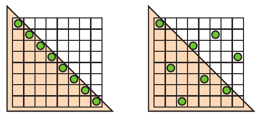

**图 5.27** N 车采样。左侧是合法的 N 车模式，但在捕捉沿样本连线方向的对角三角形边缘时表现不佳，因为当三角形移动时，所有采样位置会一起位于三角形内部或一起位于外部。右侧的模式能够更有效地捕捉这条边缘及其他方向的边缘。

为了更好地采样，我们希望避免让两个样本彼此过近，也希望样本均匀分布，均匀铺开在整个区域中。为形成这类模式，可以把拉丁超立方体采样等**分层采样**技术，与抖动、Halton 序列、泊松圆盘采样等方法结合 [1413, 1758]。

实际中，GPU 厂商通常把这类采样模式固定实现于多重采样抗锯齿硬件中。图 5.28 展示了一些实际使用的 MSAA 模式。对于时间抗锯齿，程序员可以任意选择覆盖采样模式，因为采样位置能够逐帧变化。例如，Karis [862] 发现，一个基本的 Halton 序列就比 GPU 提供的任何 MSAA 模式更好。Halton 序列生成的空间样本看似随机，却具有**低差异性**，也就是说，它们在空间中分布良好，不会聚集成团 [1413, 1938]。

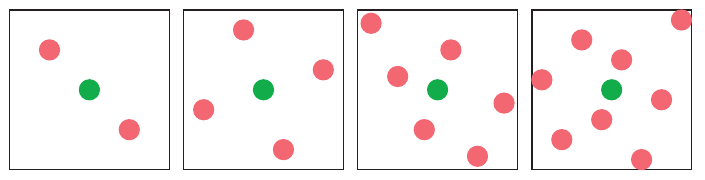

**图 5.28** AMD 与 NVIDIA 图形加速器的 MSAA 采样模式。绿色方块是着色样本的位置，红色方块是计算并保存的位置样本。从左至右分别是 2×、4×、6×（AMD）和 8×（NVIDIA）采样。（由 D3D FSAA Viewer 生成。）

> 译注：原图注使用“方块”（square）一词，但本版图中的绿色和红色标记实际绘为圆点，此处保留原图注措辞。

亚像素网格模式虽然能更好地近似每个三角形对网格单元的覆盖情况，但并不理想。场景中的物体在屏幕上可以任意小，这意味着任何采样率都无法完美捕捉它们。如果这些微小物体或特征形成规律图案，按固定间隔采样就可能产生摩尔纹及其他干涉图案。超采样所用的网格模式尤其容易发生走样。

一种解决方法是使用**随机采样**（stochastic sampling），让模式更加随机化。图 5.28 那样的模式当然也符合这一思路。设想远处一把细齿梳子，每个像素覆盖几个梳齿。规则模式会在采样模式与梳齿频率时而同相、时而异相的过程中产生严重伪影。采用较不规则的采样模式可以打散这些图案。随机化倾向于把重复性的走样效应替换成噪声，而人类视觉系统对噪声宽容得多 [1413]。结构性较弱的模式会有帮助，但如果每个像素都重复相同模式，仍然可能发生走样。一种办法是在每个像素使用不同采样模式，或随时间改变每个采样位置。在过去数十年中，硬件偶尔曾支持**交错采样**：一组像素中的每个像素使用不同采样模式。例如，ATI 的 SMOOTHVISION 允许每个像素最多 16 个样本，以及最多 16 种用户自定义采样模式；这些模式可混合成重复图案，例如一个 4 × 4 像素块。Molnar [1234] 以及 Keller 和 Heidrich [880] 发现，采用交错随机采样，可以最大限度减少每个像素都使用同一模式时产生的走样伪影。

> 译注：原书此段在“Interleaved sampling”之后混入了“indexsampling!interleaved”索引标记，属于排印残留，不是正文内容。

还有几种 GPU 支持的算法值得一提。NVIDIA 较早的 Quincunx 方法 [365] 是一种允许样本影响多个像素的实时抗锯齿方案。“Quincunx”意指五个物体的排列方式：四个构成正方形，第五个位于中心，就像六面骰子上五点那一面的图案。Quincunx 多重采样抗锯齿采用这种模式，把四个外侧样本放在像素角点。见图 5.25。每个角点样本值分配给其四个相邻像素。它不像大多数其他实时方案那样给各个样本相同权重，而是让中心样本权重为 ½，每个角点样本权重为 ⅛。由于这种共享，平均每个像素只需要两个样本，结果却明显优于双样本 FSAA 方法 [1678]。这种模式近似二维帐篷滤波器；如前一部分所述，它优于盒式滤波器。

Quincunx 采样也可以在每个像素只取一个样本的条件下，用于时间抗锯齿 [836, 1677]。每帧相对前一帧沿两个轴各偏移半个像素，偏移方向在帧间交替。上一帧提供像素角点样本，利用双线性插值快速计算其对每个像素的贡献，再将结果与当前帧平均。各帧权重相同，意味着静态视图不会出现闪烁伪影。运动物体的对齐问题仍然存在，但该方案本身编码简单，在每帧每像素只使用一个样本的同时，能显著改善外观。

在单帧中使用时，Quincunx 借助像素边界上的样本共享，将成本降低到每像素仅两个样本。而 RGSS 模式更擅长捕捉近水平、近垂直边缘上的更多渐变级。最初为移动图形开发的 FLIPQUAD 模式，将这两个优点结合起来 [22]。它的优势是每个像素只需两个样本，而质量接近每像素四个样本的 RGSS。图 5.29 展示了这一采样模式。Hasselgren 等人 [677] 还研究了其他利用样本共享的低成本采样模式。

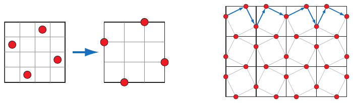

**图 5.29** 左侧显示 RGSS 采样模式，其成本为每个像素四个样本。把这些位置移到像素边缘后，就能跨边缘共享样本。不过，为了实现共享，必须让交替相邻的像素采用镜像反射后的采样模式，如右图所示。得到的采样模式称为 FLIPQUAD，成本为每像素两个样本。

与 Quincunx 一样，双样本 FLIPQUAD 模式也可以结合时间抗锯齿，将两个样本分布在两帧中。Drobot [382, 383, 1154] 在其**混合重建抗锯齿**（HRAA）工作中，研究了哪种双样本模式最佳的问题。他探索不同的时间抗锯齿采样模式，发现 FLIPQUAD 是所测试五种模式中最好的。棋盘格模式也曾用于时间抗锯齿。El Mansouri [415] 讨论了使用双样本 MSAA 创建棋盘格渲染，在解决走样问题的同时降低着色器成本。Jimenez [836] 使用 SMAA、时间抗锯齿及多种其他技术，给出了一种能根据渲染引擎负载调整抗锯齿质量的方案。Carpentier 和 Ishiyama [231] 在边缘上采样，将采样网格旋转 45°。他们把这种时间抗锯齿方案与后面讨论的 FXAA 结合，高效地面向更高分辨率显示器进行渲染。

### 形态学方法

走样往往源于边缘，例如几何体、锐利阴影或明亮高光形成的边缘。知道走样具有一定结构，就可以利用这一点取得更好的抗锯齿结果。2009 年，Reshetov [1483] 提出一种遵循这一思路的算法，称为**形态学抗锯齿**（MLAA）。“形态学”意指“与结构或形状有关”。此前该领域已有相关工作 [830]，最早可以追溯到 Bloomenthal 于 1983 年的研究 [170]。Reshetov 的论文重新激发了对多重采样替代方法的研究兴趣，着重强调搜索并重建边缘 [1486]。

这种抗锯齿以**后处理**形式执行：先按通常方式完成渲染，再把结果交给一个生成抗锯齿结果的处理过程。2009 年以来，人们开发出许多技术。依赖深度、法线等额外缓冲区的方法能够提供更好的结果，例如**亚像素重建抗锯齿**（SRAA）[43, 829]，但这些方法只能用于几何边缘的抗锯齿。**几何缓冲区抗锯齿**（GBAA）和**边缘距离抗锯齿**（DEAA）等解析方法，让渲染器额外计算三角形边缘位置的信息，例如边缘距离像素中心有多远 [829]。

最通用的方案只需颜色缓冲区，因此也能改善阴影、高光以及之前各种后处理技术产生的边缘，例如轮廓边缘渲染（15.2.3 节）。例如，**方向局部化抗锯齿**（DLAA）[52, 829] 基于以下观察：近乎垂直的边缘应沿水平方向模糊；同样，近乎水平的边缘应与其相邻像素沿垂直方向模糊。

更复杂的边缘检测方法试图找到可能含有任意角度边缘的像素，并确定其覆盖率。它们检查潜在边缘周围的邻域，尽可能重建原始边缘的位置。随后，利用该边缘对像素的影响，将相邻像素的颜色混合进来。图 5.30 展示了这一过程的概念。

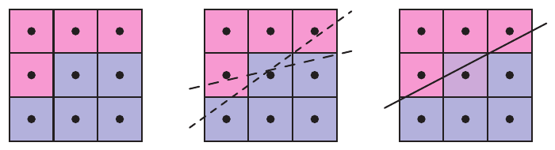

**图 5.30** 形态学抗锯齿。左侧是有走样的图像，目标是确定形成它的边缘可能具有的方向。中间，算法检查相邻像素，判断存在边缘的可能性；根据已有样本，图中显示两个可能的边缘位置。右侧使用最可能的边缘估计，按估算覆盖率将相邻颜色混入中心像素。对图像中的每个像素重复这一过程。

Iourcha 等人 [798] 通过检查像素内的 MSAA 样本改善边缘搜索，从而计算出更好的结果。注意，边缘预测与混合能够获得比基于样本的算法更高精度的结果。例如，每个像素使用四个样本的技术，对于一个物体边缘只能给出五个混合级：零个、一个、两个、三个或四个样本被覆盖。估计的边缘位置可以有更多取值，因此能够提供更好的结果。

基于图像的算法可能以多种方式出错。首先，如果两个物体的颜色差异低于算法阈值，就可能检测不到边缘。三个或更多不同表面重叠的像素，很难解释。含有高对比度或高频元素、颜色在像素间快速变化的表面，会导致算法漏掉边缘。尤其是，对文字应用形态学抗锯齿时，质量通常会下降。物体拐角也是挑战，有些算法会让它们看起来变圆。假设边缘是直线，也可能对曲线产生不利影响。单个像素的变化就可能导致边缘重建方式大幅改变，从而产生明显的帧间伪影。一种减轻这一问题的方法，是利用 MSAA 覆盖掩码改善边缘判断 [1484]。

形态学抗锯齿方案只能使用提供给它的信息。例如，一个宽度小于像素的物体，如电线或绳索，在没有恰好覆盖像素中心位置的地方，屏幕上就会出现缺口。在这些情况下，增加样本能够改善质量，仅靠基于图像的抗锯齿则无能为力。此外，执行时间可能随所看内容变化。例如，对一片草地视图进行抗锯齿的耗时，可能是天空视图的三倍 [231]。

尽管如此，基于图像的方法以适中的内存与处理成本提供抗锯齿支持，因此被许多应用采用。仅使用颜色的版本还与渲染流水线解耦，便于修改或禁用，甚至可以作为 GPU 驱动选项提供。最流行的两种算法是**快速近似抗锯齿**（FXAA）[1079, 1080, 1084] 和**亚像素形态学抗锯齿**（SMAA）[828, 830, 834]；部分原因是两者都为多种机器提供了可靠且免费的源代码实现。两种算法都仅需要颜色输入，而 SMAA 还具有能够访问 MSAA 样本的优势。各自都有多种设置，可在速度与质量之间权衡。成本通常在每帧 1 至 2 毫秒范围内，主要因为这就是电子游戏愿意付出的预算。最后，两种算法都可以利用时间抗锯齿 [1812]。Jimenez [836] 给出了一个比 FXAA 更快的改进版 SMAA 实现，并介绍了一种时间抗锯齿方案。作为结尾，我们推荐读者阅读 Reshetov 和 Jimenez [1486] 对形态学技术及其在电子游戏中应用的广泛综述。
