# 6.7 凹凸映射

原书来源：《Real-Time Rendering, Fourth Edition》，书页 208—214（PDF 物理页 229—235）。本节从 6.7 标题开始，到 6.8 标题之前结束；包含 6.7.1、6.7.2、图 6.32—6.36 及式（6.13）—（6.16）。

本节介绍一大类小尺度细节表示技术，我们将它们统称为**凹凸映射**（bump mapping）。这些方法通常都通过修改逐像素着色过程来实现。与单独使用纹理映射相比，它们能够营造出更强的三维外观，却不需要增加任何几何体。

物体上的细节可以分为三种尺度：覆盖许多像素的宏观特征、横跨几个像素的中观特征，以及远小于一个像素的微观特征。这些分类的界限并不固定，因为在动画或交互过程中，观察者可能会从许多不同距离观察同一个物体。

宏观几何由顶点和三角形，或其他几何图元来表示。创建三维角色时，四肢和头部通常在宏观尺度上建模。微观几何则封装在着色模型中；着色模型通常在像素着色器中实现，并使用纹理贴图作为参数。所采用的着色模型模拟表面微观几何的相互作用，例如，有光泽的物体在微观上是平滑的，而漫反射表面在微观上是粗糙的。角色的皮肤和衣服看起来具有不同的材质，是因为它们使用了不同的着色器，或者至少在这些着色器中使用了不同的参数。

中观几何描述介于这两种尺度之间的所有内容。它包含的细节过于复杂，无法用一个个三角形高效地渲染，但又足够大，使观察者能够在几个像素的范围内分辨表面曲率的局部变化。角色面部的皱纹、肌肉细节，以及衣服上的褶皱和接缝，都属于中观尺度。中观尺度建模通常使用一系列统称为凹凸映射技术的方法。这些方法在像素层面调整着色参数，使观察者感觉到相对于基础几何的小幅扰动，而基础几何实际上仍然是平的。各种凹凸映射方法的主要区别在于如何表示细节特征。变化因素包括细节特征的真实程度和复杂程度。例如，数字美术师常常先在模型上雕刻细节，再使用软件把这些几何元素转换成一张或多张纹理，例如一张凹凸纹理，可能再加上一张用于使缝隙变暗的纹理。

Blinn 于 1978 年提出了在纹理中编码中观尺度细节的想法 [160]。他观察到，如果在着色时用一个稍加扰动的表面法线替代真实法线，表面就会显得具有小尺度细节。他把描述表面法线扰动的数据存储在数组中。

这里的关键思想是：不再使用纹理改变光照方程中的某个颜色分量，而是访问纹理来修改表面法线。表面的几何法线保持不变；我们仅修改光照方程使用的法线。这一操作没有物理上的对应过程：我们改变表面法线，但表面本身在几何意义上仍然是平滑的。正如每个顶点各有一条法线能够造成三角形之间的表面平滑过渡的错觉一样，逐像素修改法线也能改变人们对三角形表面本身的感知，而不修改其几何形状。

对于凹凸映射，法线必须相对于某个参考坐标系改变方向。为此，在每个顶点存储一个**切线标架**，也称**切线空间基**。这个参考坐标系用于把光源变换到表面某位置的空间中（或者反过来变换），以计算扰动法线产生的效果。对于应用了法线贴图的多边形表面，除了顶点法线，我们还要存储所谓的**切线向量**和**副切线向量**。副切线向量（bitangent）也常被错误地称为副法线向量（binormal）[1025]。

切线向量和副切线向量表示法线贴图自身的坐标轴在物体空间中的方向，因为我们的目标是把光源变换到相对于贴图的坐标系中。见图 6.32。

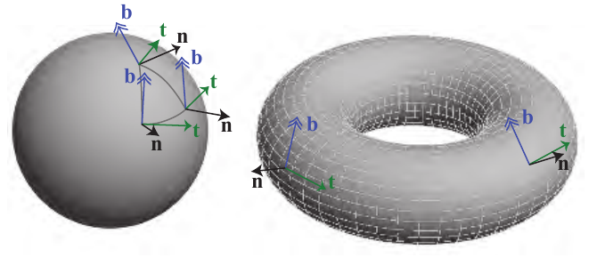

**图 6.32** 展示了一个球面三角形，并在它的每个角点画出了切线标架。球体和圆环这类形状具有天然的切线空间基，圆环上的经纬线展示了这一点。

法线 **n**、切线 **t** 和副切线 **b** 这三个向量组成一个基矩阵：

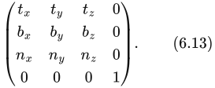

这个矩阵有时简称为 TBN，它把光源方向（针对给定顶点）从世界空间变换到切线空间。这些向量不一定真正彼此垂直，因为法线贴图自身可能已经发生形变，以便适配表面。不过，非正交基会给纹理引入斜切，这可能意味着需要更多存储空间，也可能影响性能；也就是说，这时无法仅通过简单的转置求出该矩阵的逆 [494]。一种节省内存的方法是在顶点只存储切线和副切线，然后取二者的叉积来计算法线。但是，只有当矩阵的手性始终相同时，这种技术才有效 [1226]。模型往往是对称的：飞机、人、文件柜，以及许多其他物体都是如此。由于纹理消耗大量内存，它们往往会以镜像方式映射到对称模型上。因此，只存储物体一侧的纹理，但纹理映射会把它放到模型的两侧。在这种情况下，两侧切线空间的手性不同，不能预先假定它们一致。此时，如果在每个顶点额外存储一位信息来指示手性，仍然可以避免存储法线。如果该位被置位，就将切线和副切线的叉积取反，以得到正确的法线。如果切线标架是正交的，还可以把这个基存储为四元数（第 4.3 节），这不仅更节省空间，还能减少一些逐像素计算 [494, 1114, 1154, 1381, 1639]。质量可能会有轻微损失，但实际中很少看得出来。

切线空间的概念对其他算法也很重要。正如下一章将讨论的那样，许多着色方程只依赖表面法线方向。但是，拉丝铝或天鹅绒这样的材质还需要知道观察者和光照相对于表面的方向。切线标架有助于定义材质在表面上的朝向。Lengyel [1025] 和 Mittring [1226] 的文章广泛讨论了这一领域。Schüler [1584] 提出了一种在像素着色器中即时计算切线空间基的方法，无须为每个顶点存储预先计算的切线标架。Mikkelsen [1209] 改进了这项技术，并推导出一种不需要任何参数化的方法，而是利用表面位置的导数和高度场的导数来计算扰动后的法线。然而，与使用标准切线空间映射相比，这类技术可能使显示出来的细节显著减少，还可能给美术制作流程带来问题 [1639]。

## 6.7.1 Blinn 的方法

Blinn 最初的凹凸映射方法在纹理的每个纹素中存储两个有符号数值 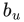 和 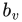。这两个值对应于沿图像 u 轴和 v 轴改变法线的幅度。也就是说，用这些通常经过双线性插值的纹理值，分别缩放两个垂直于法线的向量。将这两个向量加到法线上，即可改变法线的方向。 和  这两个值描述了表面在该点处朝向哪一边。见图 6.33。这类凹凸贴图纹理称为**偏移向量凹凸贴图**，或**偏移贴图**。

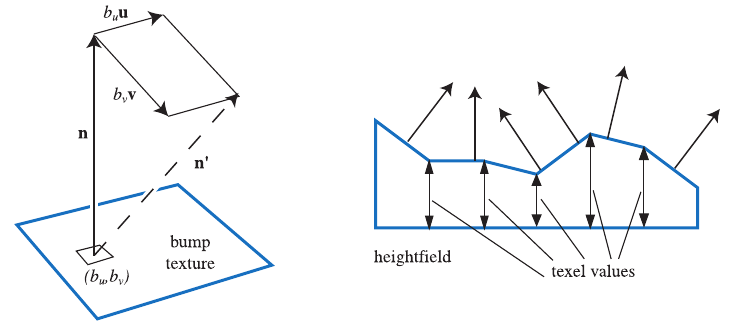

**图 6.33** 左：利用从凹凸纹理中取得的（, ）值，沿 **u** 和 **v** 方向修改法线向量 **n**，得到 **n′**（尚未归一化）。右：展示了一个高度场及其对着色法线的影响。也可以在各高度之间对这些法线进行插值，以得到更平滑的外观。

另一种表示凹凸的方式，是使用**高度场**来修改表面法线的方向。每个单色纹理值表示一个高度，因此纹理中的白色表示高处，黑色表示低处（或者反过来）。图 6.34 给出了一个例子。这是初次创建或扫描凹凸贴图时常用的格式，同样由 Blinn 于 1978 年提出。高度场用于推导类似第一种方法中的 u 和 v 有符号数值。具体做法是：对相邻列取差，得到 u 方向的斜率；对相邻行取差，得到 v 方向的斜率 [1567]。一种变体是使用 Sobel 滤波器，它给直接相邻的邻居赋予更大的权重 [535]。

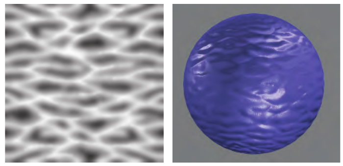

**图 6.34** 一幅波状高度场凹凸图像，以及它在球体上的应用。

## 6.7.2 法线映射

一种常见的凹凸映射方法是直接存储**法线贴图**。其算法和结果在数学上与 Blinn 的方法相同；改变的仅仅是存储格式和像素着色器中的计算。

法线贴图对映射到 [−1, 1] 范围内的（x, y, z）进行编码。例如，对于 8 位纹理，x 轴的数值 0 表示 −1.0，255 表示 1.0。图 6.35 给出了一个例子。对于图示的颜色映射，浅蓝色 [128, 128, 255] 表示平坦表面，也就是法线 [0, 0, 1]。

法线贴图表示最初以世界空间法线贴图的形式提出 [274, 891]，但实际中很少使用。对于这种映射，扰动的处理很直接：在每个像素处从贴图中获取法线，并将它与光源方向一起直接用于计算表面该位置的着色。法线贴图也可以定义在物体空间中，这样即使模型旋转，法线仍然有效。但是，世界空间和物体空间这两种表示都把纹理绑定到了特定朝向的特定几何体上，限制了纹理的重复利用。

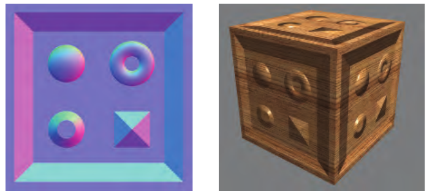

**图 6.35** 使用法线贴图进行凹凸映射。每个颜色通道实际上都是一个表面法线坐标。红色通道表示 x 偏移；红色越多，法线就越朝右。绿色表示 y 偏移，蓝色表示 z。右侧是使用这张法线贴图生成的图像。注意立方体顶部看起来较为扁平。（图片由 Manuel M. Oliveira 和 Fabio Policarpo 提供。）

通常的做法是在切线空间中获取扰动后的法线，也就是相对于表面本身来定义法线。这样既允许表面变形，又能最大限度地复用法线纹理。切线空间法线贴图也能够很好地压缩，因为通常可以假定 z 分量（与未扰动表面法线对齐的分量）的符号为正。

法线映射能够有效地增强真实感，见图 6.36。

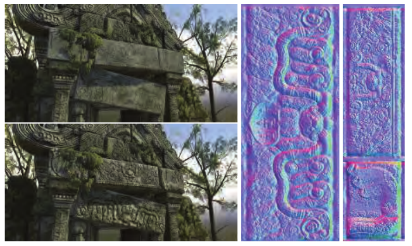

**图 6.36** 在类似游戏的场景中使用法线贴图进行凹凸映射的示例。左上：未应用右侧的两张法线贴图。左下：应用了法线贴图。右：法线贴图。（三维模型和法线贴图由 Dulce Isis Segarra López 提供。）

与对颜色纹理滤波相比，对法线贴图滤波是一个困难的问题。一般来说，法线与着色后的颜色之间的关系不是线性的，因此标准滤波方法可能产生令人难以接受的走样。设想你正在看一组由光亮的白色大理石块砌成的台阶。在某些角度，台阶的顶面或侧面会接收到光，并反射出明亮的镜面高光。但是，台阶的平均法线可能处于 45° 方向；它捕捉到高光的方向，与原始台阶完全不同。渲染具有尖锐镜面高光的凹凸贴图时，如果没有正确滤波，高光会随着采样点偶然落到的位置而忽明忽灭，产生分散注意力的闪烁效果。

朗伯表面是一个特例，法线贴图对其着色的影响近乎线性。朗伯着色几乎完全是一次点积，而点积是一种线性运算。对一组法线取平均，再用结果做点积，等价于先分别与各条法线做点积，再对结果取平均：

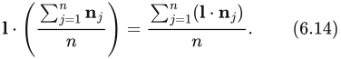

注意，平均向量在使用前不进行归一化。式（6.14）说明，对于朗伯表面，标准滤波和 mipmap **几乎**能够产生正确结果。结果并不完全正确，是因为朗伯着色方程并非单纯的点积，而是经过截断的点积，即 max(**l** · **n**, 0)。截断操作使它变成非线性运算。对于掠射光照方向，这会使表面过度变暗，不过在实践中通常不会造成明显问题 [891]。需要注意的是，一些通常用于法线贴图的纹理压缩方法（例如利用另外两个分量重建 z 分量）不支持非单位长度的法线，因此使用未归一化的法线贴图可能给压缩带来困难。

对于非朗伯表面，可以将着色方程的输入作为一个整体进行滤波，而不是单独对法线贴图滤波，从而产生更好的结果。实现这一点的技术将在第 9.13 节讨论。

最后，从高度贴图 h(x, y) 推导法线贴图可能很有用。其做法如下 [405]。首先，使用中心差分计算 x 和 y 方向导数的近似值：

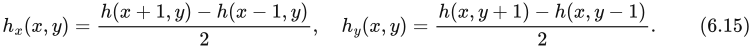

然后，纹素（x, y）处未归一化的法线为

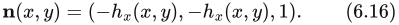

> 译注：已对照原书书页 214。式（6.16）原文的前两个分量均印为 −(x, y)，上式忠实保留原样。依据紧接在前的式（6.15）及高度场法线的构造，第二个分量疑应为 −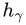(x, y)，即（−(x, y), −(x, y), 1）；此处明确说明疑点，不暗改原式。

必须小心处理纹理边界。

**地平线映射**（horizon mapping）[1027] 可以让凹凸在自身表面上投下阴影，从而进一步增强法线贴图。具体方法是预先计算额外的纹理，每张纹理对应于表面平面内的一个方向，并为每个纹素存储该方向的地平线角度。更多信息见第 11.4 节。
