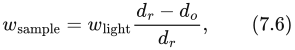
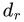
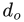
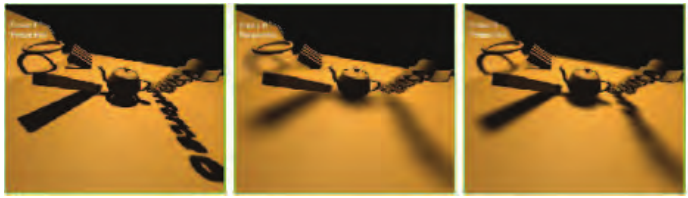

# 7.6 百分比渐近软阴影

本节来源：《Real-Time Rendering, Fourth Edition》书页 250—252（PDF 第 271—273 页）。正文从 7.6 节标题开始，至 7.7 节标题之前结束；本节无下级小节。图 7.25 位于书页 251。

2005 年，Fernando [212, 467, 1252] 发表了一种影响深远的方法，称为**百分比渐近软阴影**（percentage-closer soft shadows，PCSS）。它尝试通过搜索阴影贴图上的邻近区域，找出所有可能的遮挡物，以解决上述问题。这些遮挡物相对于该位置的平均距离，被用来确定采样区域的宽度：

其中， 是接收面到光源的距离， 是遮挡物到光源的平均距离。换句话说，随着遮挡物平均而言离接收面更远、离光源更近，待采样表面区域的宽度就会增大。观察图 7.22，并考虑移动遮挡物所产生的影响，便可以理解这一现象。图 7.2（书页 224）、图 7.25 和图 7.26 展示了一些例子。

**图 7.25** 百分比渐近过滤与百分比渐近软阴影。左：施加少量 PCF 过滤的硬阴影。中：宽度恒定的软阴影。右：宽度可变的软阴影，在物体与地面接触处具有恰当的硬度。（图片由 NVIDIA Corporation 惠供。）

如果没有找到遮挡物，那么该位置就完全受光，无须进一步处理。同样，如果该位置被完全遮挡，也可以结束处理。否则，就对所关注的区域进行采样，并计算光源的近似贡献。为了节省处理开销，可以根据采样区域的宽度改变所取样本的数量。还可以采用其他技术，例如，对远处那些不太可能很重要的软阴影，使用较低的采样率。

这种方法的一个缺点是，为了找到遮挡物，需要对阴影贴图中一块相当大的区域进行采样。使用旋转的泊松圆盘采样模式，有助于掩盖欠采样产生的伪影 [865, 1590]。Jimenez [832] 指出，泊松采样在运动时可能不稳定；他发现，使用一种介于抖动与随机之间的函数形成螺旋模式，可以获得更好的帧间效果。

Sikachev 等人 [1641] 详细讨论了一种更快的 PCSS 实现，它利用了 SM 5.0 中的功能。该实现由 AMD 推出，通常使用 AMD 为其起的名字，称为**接触硬化阴影**（contact hardening shadows，CHS）。这一新版本还解决了基本 PCSS 的另一个问题：半影的大小会受到阴影贴图分辨率的影响。参见图 7.25。为了尽量减小这一问题，首先为阴影贴图生成 mipmap，然后选择最接近用户所定义的世界空间核尺寸的 mip 层级。对一个 8 × 8 的区域进行采样，以求得平均遮挡物深度，只需要 16 次 `GatherRed()` 纹理调用。一旦得到半影的估计值，就将分辨率较高的 mip 层级用于阴影中边缘锐利的区域，而将分辨率较低的 mip 层级用于较柔和的区域。

CHS 已用于大量电子游戏 [1351, 1590, 1641, 1678, 1679]，相关研究仍在继续。例如，Buades 等人 [206] 提出了**可分离软阴影映射**（separable soft shadow mapping，SSSM）：把 PCSS 对网格进行采样的过程拆分成可分离的部分，并尽可能在像素之间复用其中的元素。

对于每个像素需要多个样本的算法，一种已被证明有助于加速的概念是**分层最小值／最大值阴影贴图**。尽管阴影贴图的深度通常不能取平均值，但各个 mipmap 层级上的最小值和最大值可能很有用。也就是说，可以构建两套 mipmap：一套保存各区域中找到的最大 z 深度（有时称为 HiZ），另一套保存最小值。给定纹素的位置、深度和待采样区域，就可以使用这些 mipmap 快速判断完全受光和完全处于阴影中的情况。例如，如果纹素的 z 深度大于 mipmap 对应区域中存储的最大 z 深度，那么该纹素必定处于阴影中，无须再取更多样本。这类阴影贴图使光源可见性的判定高效得多 [357, 415, 610, 680, 1064, 1811]。

PCF 等方法通过对接收面上的邻近位置进行采样来工作。PCSS 则通过求取邻近遮挡物的平均深度来工作。这些算法并未直接考虑光源的面积，而是对邻近表面进行采样，因此会受到阴影贴图分辨率的影响。PCSS 的一个主要假设是：平均遮挡物能够合理地估计半影大小。当两个遮挡物，例如一盏路灯和一座远山，在某个像素处部分遮挡同一表面时，这一假设就不再成立，并可能导致伪影。理想情况下，我们希望确定从接收面上的单个位置能够看见面光源的多少面积。一些研究者探索了使用 GPU 进行**反向投影**的方法。其思路是将接收面上的每个位置视为一个视点，将面光源视为视平面的一部分，再把遮挡物投影到这个平面上。Schwarz 和 Stamminger [1593] 以及 Guennebaud 等人 [617] 都总结了先前的工作，并提出了各自的改进。Bavoil 等人 [116] 则采取了另一种方法，利用深度剥离创建多层阴影贴图。反向投影算法能够产生出色的结果，但每像素的高昂开销意味着，迄今为止，它们尚未被交互式应用采用。
