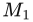
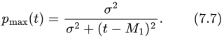
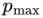
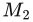
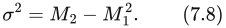
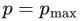
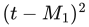
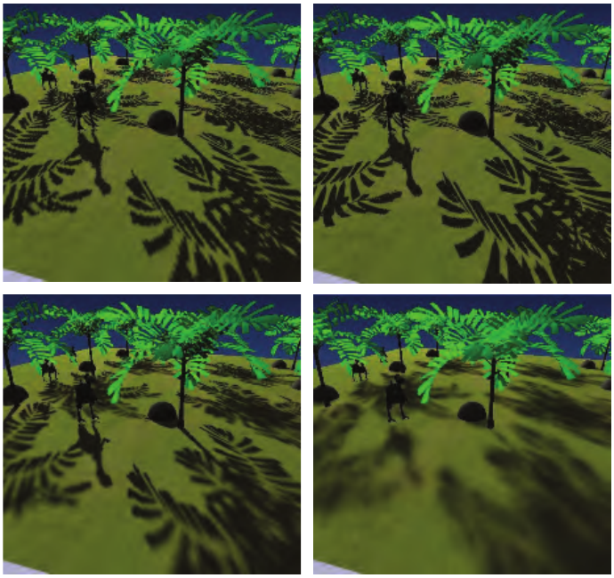
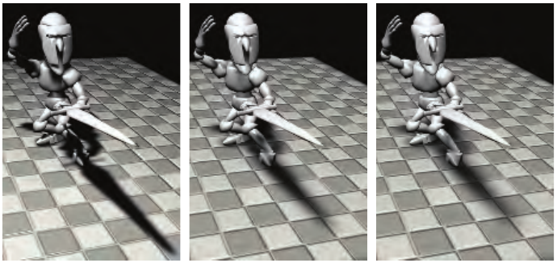
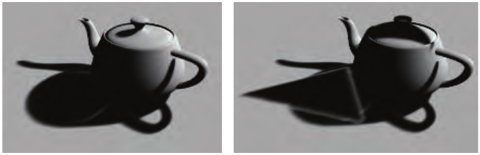

# 7.7 可滤波阴影贴图

本节来源：《Real-Time Rendering, Fourth Edition》书页 252—257（PDF 物理页 273—278），从 7.7 节标题开始，到 7.8 节标题之前结束。

Donnelly 和 Lauritzen 提出的方差阴影贴图（variance shadow map，VSM）[368]，是一种允许对生成的阴影贴图进行滤波的算法。该算法在一张贴图中存储深度，在另一张贴图中存储深度的平方。生成这些贴图时，可以使用 MSAA 或其他抗锯齿方案。这些贴图可以进行模糊处理、生成 mipmap、存入求和面积表 [988]，或者采用其他处理方法。能够把这些贴图当作可滤波的纹理来处理，是一个巨大的优势：从中读取数据时，可以运用整套采样与滤波技术。

这里我们将较深入地介绍 VSM，让读者了解这一过程的工作原理；此外，这一类算法中的所有方法都采用同类的测试。希望进一步了解这个领域的读者应查阅相关参考文献。我们也推荐 Eisemann 等人的著作 [412]，该书用了多得多的篇幅来讨论这一主题。

首先，VSM 在接收面的位置对深度贴图采样（仅一次），返回距离光源最近的遮挡物的平均深度。这个平均深度  称为一阶矩；如果它大于阴影接收面的深度 t，就认为接收面完全受光。如果平均深度小于接收面的深度，则使用下式：

其中， 是受光样本的最大百分比， 是方差，t 是接收面的深度， 是阴影贴图中的平均期望深度。深度平方阴影贴图中的样本  称为二阶矩，用来计算方差：

 是接收面可见百分比的上界。实际的受光百分比 p 不可能大于这个值。这个上界来自切比雪夫不等式的单侧形式。该方程试图利用概率论，估计表面位置处的遮挡物分布中，有多大比例位于比该表面到光源的距离更远的地方。Donnelly 和 Lauritzen 证明，对于深度固定的平面遮挡物和平面接收面，有 ，因此公式（7.7）可以很好地近似许多真实的阴影情形。

Myers [1251] 对这一方法为何有效建立了直观解释。一个区域内的方差会在阴影边缘增大。深度差越大，方差越大。这时， 这一项就成为决定可见百分比的重要因素。如果这个值仅略大于零，就意味着遮挡物的平均深度只比接收面稍微靠近光源一些，此时  接近 1（完全受光）。这种情况会发生在半影中完全受光的那条边缘上。向半影内部移动时，遮挡物的平均深度变得更靠近光源，因此这一项增大， 随之下降。与此同时，半影内部的方差本身也在变化：沿着边缘时几乎为零，而在不同深度的遮挡物各占该区域一半的位置，方差达到最大。这些项相互平衡，使阴影在整个半影范围内线性变化。与其他算法的比较见图 7.26。

方差阴影贴图的一个显著特点，是能够优雅地处理由几何形状引起的表面偏移问题。Lauritzen [988] 推导了如何利用表面的斜率来修改二阶矩的值。由数值稳定性引起的偏移及其他问题，可能给方差阴影贴图带来麻烦。例如，公式（7.8）从一个较大的数值中减去另一个与它相近的数值。这类计算往往会放大底层数值表示精度不足的影响。使用浮点纹理有助于避免这一问题。

图 7.26：左上为标准阴影贴图。右上为透视阴影贴图，它提高了观察者附近的阴影贴图纹素密度。左下为百分比渐近软阴影，随着遮挡物与接收面之间的距离增大，阴影变得更柔和。右下为方差阴影贴图，其软阴影宽度恒定，每个像素只需对方差贴图采样一次便可完成着色。（图片由 Nico Hempe、Yvonne Jung 和 Johannes Behr 提供。）

总体而言，相对于花费的处理时间，VSM 能带来明显的质量提升，因为它高效利用了 GPU 优化过的纹理功能。PCF 在生成更柔和的阴影时，需要更多样本，也就需要更多时间，才能避免噪声；VSM 则只需一个高质量的样本，就能确定整个区域的影响，并生成平滑的半影。这种能力意味着，在算法自身的限制范围内，可以让阴影任意柔和，而不增加额外开销。

图 7.27：方差阴影贴图，从左到右，与光源的距离逐渐增大。（图片来自 NVIDIA SDK 10 [1300] 的示例，由 NVIDIA Corporation 提供。）

与 PCF 一样，滤波核的宽度决定半影的宽度。通过求出接收面与最近遮挡物之间的距离，可以改变核的宽度，从而产生令人信服的软阴影。对于宽度缓慢增大的半影，mipmap 采样无法很好地估计覆盖率，会产生方块状伪影。Lauritzen [988] 详细介绍了如何使用求和面积表来获得好得多的阴影。图 7.27 给出了一个例子。

当两个或更多遮挡物覆盖同一个接收面，且其中一个遮挡物靠近接收面时，方差阴影贴图会在半影区域失效。概率论中的切比雪夫不等式会给出一个最大受光值，而这个值与正确的受光百分比并不相符。最近的遮挡物只遮住部分光线，却破坏了方程的近似关系。这会导致漏光（light bleeding，也称 light leaks）：完全被遮挡的区域仍然接收到光。参见图 7.28。通过在更小的区域内取更多样本，可以解决这一问题，但这也使方差阴影贴图变成了 PCF 的一种形式。与 PCF 一样，需要在速度与表现之间权衡；不过，对于阴影深度复杂度较低的场景，方差阴影贴图效果很好。Lauritzen [988] 给出了一种由美术人员控制的改进办法：把较低的百分比视为完全处于阴影中，再把剩余的百分比范围重新映射到 0%—100%。这种方法能使漏光变暗，代价是整体上缩窄半影。虽然漏光是一项严重限制，但 VSM 很适合生成地形阴影，因为这类阴影很少涉及多个遮挡物 [1227]。

能够利用滤波技术快速生成平滑阴影的前景，使可滤波阴影贴图受到了广泛关注；主要挑战在于解决各种漏光问题。Annen 等人 [55] 提出了卷积阴影贴图（convolution shadow map）。它扩展了 Soler 和 Sillion 针对平面接收面的算法 [1673] 背后的思想：将阴影深度编码为傅里叶展开。与方差阴影贴图一样，这类贴图也可以滤波。这一方法会收敛到正确结果，因此能减轻漏光问题。

图 7.28：左图为将方差阴影贴图应用于茶壶的结果。右图中，一个三角形（未显示）在茶壶上投下阴影，导致地面阴影中出现令人难以接受的伪影。（图片由 Marco Salvi 提供。）

卷积阴影贴图的一个缺点是需要计算和访问多个项，大幅增加了执行与存储开销 [56, 117]。Salvi [1529, 1530] 与 Annen 等人 [56] 几乎同时、彼此独立地想到了使用一个基于指数函数的单独项。这种方法称为指数阴影贴图（exponential shadow map，ESM）或指数方差阴影贴图（exponential variance shadow map，EVSM），把深度的指数值及其二阶矩存入两个缓冲区。指数函数能更贴近地近似阴影贴图所执行的阶跃函数（即是否受光），因此可以显著减少漏光伪影。它也避免了卷积阴影贴图的另一个问题，即振铃（ringing）：在刚刚超过原遮挡物深度的某些特定深度处，可能出现轻微漏光。

存储指数值的一项限制是，二阶矩的数值可能变得极其巨大，超出浮点数能够表示的范围。为了提高精度，并使指数函数能够更陡峭地下降，可以生成线性的 z 深度 [117, 258]。

指数阴影贴图的质量优于 VSM，相比卷积贴图又具有更低的存储开销和更好的性能，因此，它在这三种滤波方法中引起了最多的关注。Pettineo [1405] 提到了若干其他改进，例如可以用 MSAA 改善结果并获得一定程度的透明效果；他还介绍了如何利用计算着色器提高滤波性能。

较近些时候，Peters 和 Klein [1398] 提出了矩阴影贴图（moment shadow mapping）。它能提供更好的质量，但代价是要使用四个或更多的矩，从而增加存储开销。可以使用 16 位整数存储这些矩，以降低开销。Pettineo [1404] 实现了这一新方法并将其与 ESM 进行了比较，同时提供了用于探索许多变体的代码库。

级联阴影贴图技术也可以应用于可滤波贴图，以提高精度 [989]。与标准级联阴影贴图相比，级联 ESM 的一个优点是可以为所有级联层级设置同一个偏移因子 [1405]。Chen 和 Tatarchuk [258] 详细讨论了级联 ESM 中遇到的各种漏光问题及其他伪影，并提出了几种解决方法。

可滤波贴图可以看作一种开销较低的 PCF，只需要少量样本。与 PCF 一样，这类阴影具有恒定的宽度。这些滤波方法都可以与 PCSS 结合，产生宽度可变的半影 [57, 1620, 1943]。矩阴影贴图的一项扩展还能够提供光散射和透明效果 [1399]。
