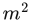
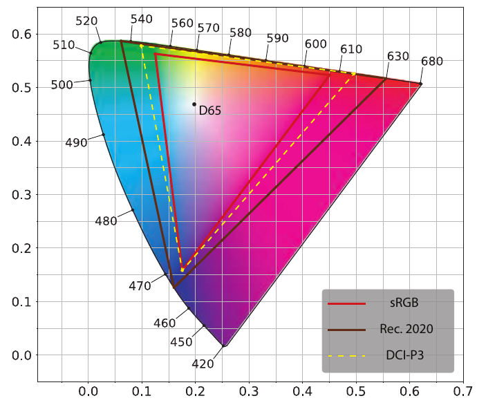
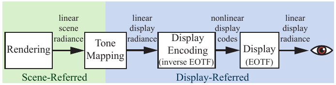
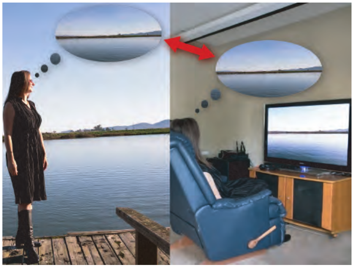
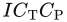
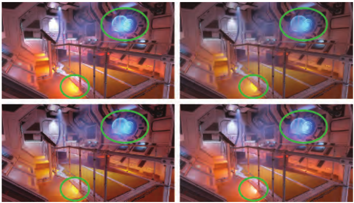
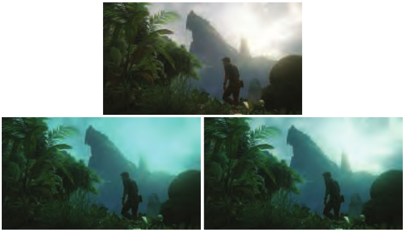

# 8.2 从场景到屏幕

来源：《Real-Time Rendering》第 4 版，书页 281—290（PDF 第 302—311 页）。本节包含 8.2.1—8.2.3 及其全部下级内容；章末“延伸阅读与资源”另见 08.99_延伸阅读与资源.md。技术现状均按原书写作时的表述保留。

本书接下来的几章将集中讨论基于物理的渲染问题。给定一个虚拟场景，基于物理的渲染旨在计算：假如这个场景真实存在，其中会有怎样的辐亮度。然而，工作到这一步还远未结束。最终结果，也就是显示器帧缓冲区中的像素值，仍然有待确定。本节将介绍确定这些值时需要考虑的一些问题。

## 8.2.1 高动态范围显示编码

本节内容建立在介绍显示编码的第 5.6 节之上。我们决定把高动态范围（HDR）显示器的讨论推迟到本节，因为它需要色域等方面的背景知识，而本书前面相应位置尚未讨论这些主题。

第 5.6 节讨论了标准动态范围（SDR）监视器和 SDR 电视机的显示编码：前者通常使用 sRGB 显示标准，后者使用 Rec. 709 和 Rec. 1886 标准。这两套标准的 RGB 色域和白点（D65）相同，非线性显示编码曲线也有些相似，但并不完全一致。它们的参考白亮度也大致相近：sRGB 为 80 cd/，Rec. 709/1886 为 100 cd/。监视器和电视机制造商并未严格遵守这些亮度规定；实际生产的显示器往往具有更亮的白电平 [1081]。

HDR 显示器采用 Rec. 2020 和 Rec. 2100 标准。Rec. 2020 定义的颜色空间具有明显更宽的色域，如图 8.12 所示，其白点与 Rec. 709 和 sRGB 颜色空间相同，都是 D65。Rec. 2100 定义了两种非线性显示编码：感知量化器（perceptual quantizer，PQ）[1213] 和混合对数伽马（hybrid log-gamma，HLG）。HLG 编码在渲染场合中使用不多，因此这里主要讨论 PQ；它定义的峰值亮度为 10,000 cd/。

虽然峰值亮度和色域的规定对于编码十分重要，但就实际显示器而言，这些指标在一定程度上仍是理想目标。在本书写作时，消费级 HDR 显示器中，峰值亮度能够超过 1500 cd/ 的都很少。实际显示器的色域也更接近 DCI-P3，而不是 Rec. 2020；图 8.12 同时画出了 DCI-P3 色域。因此，HDR 显示器会在内部进行色调映射和色域映射，把标准规定的范围映射到显示器的实际能力范围。应用程序可以传递元数据，指出内容的实际动态范围和色域，从而影响这种映射 [672, 1082]。

图 8.12：CIE 1976 UCS 色度图，显示了 Rec. 2020 与 sRGB/Rec. 709 颜色空间的色域和白点（D65）。图中还给出了 DCI-P3 颜色空间的色域以供比较。

从应用程序一侧来看，将图像传递给 HDR 显示器有三条路径，不过具体取决于显示器和操作系统，不一定三条都可用：

1. **HDR10**：得到 HDR 显示器以及 PC、游戏主机操作系统的广泛支持。帧缓冲区格式为每像素 32 位，每个 RGB 通道使用 10 位无符号整数，alpha 使用 2 位。它采用 PQ 非线性编码和 Rec. 2020 颜色空间。每种型号的 HDR10 显示器都会执行自己的色调映射；这种映射既没有标准化，也没有文档说明。
2. **scRGB（线性变体）**：只受 Windows 操作系统支持。名义上使用 sRGB 基色和白电平，不过两者都可以被超出，因为该标准支持小于 0 和大于 1 的 RGB 值。帧缓冲区格式为每通道 16 位，存储线性 RGB 值。由于驱动程序会将其转换为 HDR10，它可以与任何 HDR10 显示器配合使用。其主要价值在于使用方便，以及与 sRGB 的向后兼容性。
3. **Dolby Vision（杜比视界）**：一种专有格式；在本书写作时，它尚未得到显示器的广泛支持，也没有任何游戏主机支持。它采用自定义的每通道 12 位帧缓冲区格式，使用 PQ 非线性编码和 Rec. 2020 颜色空间。显示器内部的色调映射在不同型号之间已经标准化，但没有文档说明。

Lottes [1083] 指出，实际上还有第四种选择。如果仔细调整曝光和颜色，那么通过普通的 SDR 信号路径驱动 HDR 显示器，也能获得良好效果。

除了 scRGB，其他各条路径都要求应用程序在显示编码阶段，把像素 RGB 值从渲染工作空间转换为 Rec. 2020，这需要一次 3 × 3 矩阵变换；随后还要应用 PQ 编码，其开销略高于 Rec. 709 或 sRGB 编码函数 [497]。Patry [1360] 给出了 PQ 曲线的一种低成本近似。在 HDR 显示器上合成用户界面（UI）元素时，需要特别注意，确保界面清晰可读，而且亮度让人感到舒适 [672]。

## 8.2.2 色调映射

在第 5.6 节和第 8.2.1 节中，我们讨论了显示编码，即将线性辐亮度值转换成供显示硬件使用的非线性码值。显示编码应用的函数是显示器电光传递函数（EOTF）的逆函数，从而确保输入的线性值与显示器发出的线性辐亮度相匹配。前面的讨论略过了渲染与显示编码之间一个重要的步骤，现在可以来研究它了。

**色调映射**（tone mapping），或称**色调再现**（tone reproduction），是将场景辐亮度值转换为显示辐亮度值的过程。这一步应用的变换称为**端到端传递函数**（end-to-end transfer function），或**场景到屏幕变换**（scene-to-screen transform）。理解色调映射的关键在于**图像状态**（image state）这一概念 [1602]。有两种基本图像状态：**场景参照**（scene-referred）图像相对于场景辐亮度值定义；**显示参照**（display-referred）图像则相对于显示辐亮度值定义。图像状态与编码无关，处于任何一种状态的图像都可以采用线性编码或非线性编码。图 8.13 展示了图像状态、色调映射和显示编码如何在**成像流水线**中协同工作；这条流水线处理从最初渲染到最终显示的颜色值。

图 8.13：合成图像（渲染图像）的成像流水线。首先渲染出线性的场景参照辐亮度值，色调映射将其转换成线性的显示参照值。显示编码应用 EOTF 的逆函数，将线性显示值转换成非线性编码值（码值），并传递给显示器。最后，显示硬件应用 EOTF，把非线性显示值转换为从屏幕发出并进入眼睛的线性辐亮度。

关于色调映射的目标，存在几种常见的误解。它的目标不是确保场景到屏幕变换为恒等变换，从而在显示器上完美复现场景辐亮度值；也不是把场景高动态范围中的每一点信息都“挤进”显示器较低的动态范围，尽管考虑场景与显示器动态范围之间的差异确实是其中的重要部分。

要理解色调映射的目标，最好把它看作**图像再现**（image reproduction）的一个实例 [757]。图像再现的目标，是生成一幅显示参照图像，使其在给定的显示器特性和观看条件下，尽可能接近地再现观看者直接观察原始场景时所获得的感知印象。见图 8.14。

图 8.14：图像再现的目标，是确保再现图像（右）唤起的感知印象尽可能接近原始场景（左）所产生的感知印象。

还有一类图像再现的目标略有不同。**偏好图像再现**（preferred image reproduction）旨在生成一幅显示参照图像，使其在某种意义上比原始场景看起来更好。第 8.2.3 节将进一步讨论偏好图像再现。

考虑到典型场景的亮度范围比显示器的能力高出几个数量级，要再现与原始场景相似的感知印象，是一个很有挑战性的目标。场景中至少一部分颜色的饱和度（纯度）也很可能远远超出显示器的能力。然而，摄影、电视和电影确实能够产生令人信服、在感知上近似于原始场景的图像，文艺复兴时期的画家也做到了这一点。这之所以可能，是因为利用了人类视觉系统的某些特性。

视觉系统可以补偿绝对亮度的差异，这种能力称为**适应**（adaptation）。正因为有这种能力，即使在昏暗房间的屏幕上显示的室外场景再现图像，其亮度不到原始场景的 1%，仍能产生与原始场景相似的感知。不过，适应所提供的补偿并不完美。在较低亮度下，感知到的对比度会降低，这称为 **Stevens 效应**；感知到的“色彩丰富程度”也会降低，这称为 **Hunt 效应**。

还有一些因素会影响再现图像的实际对比度或感知对比度。显示器的**周围环境**（surround），也就是显示矩形之外的亮度水平，例如房间照明的亮度，可能会提高或降低感知对比度，这称为 **Bartleson–Breneman 效应**。**显示杂散光**（display flare）是由显示器缺陷或屏幕反射给显示图像额外带来的不需要的光，它会降低图像的实际对比度，而且降低幅度往往相当大。这些效应意味着，如果希望保持与原始场景相似的感知效果，就必须提高显示参照图像值的对比度和饱和度 [1418]。

然而，这种对比度提升会加剧一个已经存在的问题。由于场景的动态范围通常远大于显示器的动态范围，我们必须选择一个狭窄的亮度值窗口来再现；超出窗口上下界的值会被裁剪为白色或黑色。提高对比度又会进一步缩窄这个窗口。为了部分抵消暗部和亮部值被裁剪造成的影响，可以使用柔和的渐变压缩，找回一部分阴影和高光细节。

所有这些因素最终产生了一条 sigmoid（S 形）色调再现曲线，与光化学胶片提供的曲线相似 [1418]。这并非巧合。柯达及其他公司的研究人员仔细调整了光化学胶片乳剂的特性，以获得有效且悦目的图像再现。正因如此，讨论色调映射时经常会出现“胶片式”（filmic）这一形容词。

**曝光**（exposure）这一概念对于色调映射至关重要。在摄影中，曝光是指控制落到胶片或传感器上的光量。但在渲染中，曝光是在应用色调再现变换之前，对场景参照图像执行的线性缩放操作。曝光的棘手之处在于确定应采用什么缩放系数。色调再现变换与曝光密切相关：设计色调变换时，通常会预期输入是已经按某种方式完成曝光的场景参照图像。

先按曝光进行缩放、再应用色调再现变换的过程，属于**全局色调映射**（global tone mapping），它对所有像素应用相同的映射。与之相对，**局部色调映射**（local tone mapping）会依据周围像素和其他因素，为不同像素使用不同的映射。实时应用几乎一直使用全局色调映射，只有少数例外 [1921]，因此我们将重点讨论这种类型，先介绍色调再现变换，再讨论曝光。

必须牢记，场景参照图像与显示参照图像有着根本区别。只有在场景参照数据上执行的物理运算才有效。由于显示器的限制以及前面讨论的各种感知效应，这两种图像状态之间始终需要一个非线性变换。

### 色调再现变换

色调再现变换通常表示为一维曲线，将场景参照输入值映射为显示参照输出值。这些曲线既可以分别独立地应用于 R、G、B 值，也可以应用于亮度。在前一种情况下，结果会自动位于显示器色域内，因为显示参照 RGB 的每个通道值都介于 0 和 1 之间。不过，对 RGB 通道执行非线性操作，尤其是裁剪，除了带来所需的亮度变化，也可能引起饱和度和色相偏移。Giorgianni 和 Madden [537] 指出，饱和度的变化在感知上可能有益。大多数再现变换会提高对比度，以抵消 Stevens 效应以及周围环境和观看时杂散光的影响；这种提升也会相应提高饱和度，从而同时抵消 Hunt 效应。然而，色相偏移通常被认为是不理想的，因此现代色调变换会在应用色调曲线后额外调整 RGB，尝试减小这种偏移。

将色调曲线应用于亮度，可以避免或至少减小色相和饱和度偏移。不过，得到的显示参照颜色可能超出显示器的 RGB 色域，此时需要将其映射回色域内。

色调映射的一个潜在问题是，对场景参照像素颜色应用非线性函数，可能使某些抗锯齿技术出现问题。第 5.4.2 节讨论了这一问题及其解决办法。

Reinhard 色调再现算子 [1478] 是较早用于实时渲染的色调变换之一。它使较暗的值基本保持不变，而较亮的值渐近趋向白色。Drago 等人 [375] 提出了一种有些相似的色调映射算子，可以根据输出显示器的亮度进行调整，因此可能更适合 HDR 显示器。Duiker 为电子游戏创建了柯达胶片响应曲线的一种近似 [391, 392]。后来，Hable [628] 修改了这条曲线，增加用户控制，并将其用于游戏《神秘海域 2》（Uncharted 2）。Hable 关于这条曲线的演讲颇具影响力，促使“Hable 胶片曲线”被多个游戏采用。之后 Hable [634] 又提出了一条新曲线，相比他早先的工作具有多项优势。

Day [330] 介绍了一条 S 形色调曲线，它用于 Insomniac Games 的游戏，以及《使命召唤：高级战争》（Call of Duty: Advanced Warfare）。Gotanda [571, 572] 创建了模拟胶片和数字相机传感器响应的色调变换，用于《星之海洋 4》（Star Ocean 4）等游戏。Lottes [1081] 指出，显示杂散光对显示器有效动态范围的影响很大，并且强烈依赖房间的照明条件。因此，为用户提供色调映射调节功能很重要。他提出了一种支持此类调节的色调再现变换，既适用于 SDR 显示器，也适用于 HDR 显示器。

**学院色彩编码系统**（Academy Color Encoding System，ACES）由美国电影艺术与科学学院的科学技术委员会创建，作为电影和电视行业色彩管理的拟议标准。ACES 系统将场景到屏幕变换分成两部分。第一部分是**参考渲染变换**（reference rendering transform，RRT），它把场景参照值转换为一个标准、设备中立的输出空间中的显示参照值，该空间称为**输出色彩编码规范**（output color encoding specification，OCES）。第二部分是**输出设备变换**（output device transform，ODT），它把 OCES 中的颜色值转换成最终显示编码。ODT 有许多种，每一种都为特定显示设备和观看条件设计。将 RRT 与适当的 ODT 串接起来，就形成了完整变换。这种模块化结构便于应对各种显示器类型和观看条件。对于需要同时支持 SDR 与 HDR 显示器的应用，Hart [672] 推荐使用 ACES 色调映射变换。

虽然 ACES 是为电影和电视设计的，但它的变换正越来越多地用于实时应用。Unreal Engine 默认启用 ACES 色调映射 [1802]，Unity 引擎也支持它 [1801]。Narkowicz 给出了针对 ACES RRT 与 SDR、HDR ODT 所拟合的低成本曲线 [1260, 1261]，Patry [1359] 也做了类似工作。Hart [672] 则给出了 ACES ODT 的参数化版本，以支持一系列设备。

使用 HDR 显示器进行色调映射需要谨慎，因为显示器本身也会应用一些色调映射。Fry [497] 介绍了 Frostbite 游戏引擎使用的一组色调映射变换。对于 SDR 显示器，它们应用较强的色调再现曲线；对于使用 HDR10 信号路径的显示器，应用较弱的曲线，并根据显示器峰值亮度作一定调整；对于使用 Dolby Vision 路径的显示器，则不应用色调映射，换句话说，依赖显示器执行内置的 Dolby Vision 色调映射。Frostbite 色调再现变换被设计为中性，不显著改变对比度或色相，目的是让所有期望的对比度或色相修改都通过调色来完成，见第 8.2.3 节。为此，色调再现变换在 （ICtCp）颜色空间中执行 [364]；该空间的设计目标是感知均匀性，以及色度轴和亮度轴之间的正交性。Frostbite 变换对亮度进行色调映射，并随着亮度逐渐压缩至显示白色而越来越多地降低色度的饱和程度。这样就能获得不产生色相偏移的干净变换。

颇具讽刺意味的是，一些资源（例如火焰效果）在制作时特意利用了原先变换中的色相偏移，因此新变换使这些资源出现了问题。Frostbite 团队最终修改了变换，让用户能够重新向显示参照颜色中引入一定程度的色相偏移。图 8.15 将 Frostbite 变换与本节提到的其他几种变换进行了比较。

图 8.15：对同一场景应用四种不同的色调变换。差异主要出现在圈出的区域，其中场景像素值特别高。左上：裁剪，外加 sRGB OETF；右上：Reinhard [1478]；左下：Duiker [392]；右下：Frostbite 的保持色相版本 [497]。Reinhard、Duiker 和 Frostbite 变换都保留了裁剪会丢失的高光信息。不过，Reinhard 曲线倾向于降低图像较暗部分的饱和度 [628, 629]，而 Duiker 变换会提高暗部区域的饱和度；有时这种特性被认为是理想的 [630]。Frostbite 变换按设计同时保持饱和度与色相，避免了其他三幅图中左下圆圈处可见的强烈色相偏移。（图片由 ©2018 Electronic Arts Inc. 提供。）

### 曝光

一类常用的曝光计算技术依赖于分析场景参照亮度值。为避免引入停顿，这种分析通常通过采样前一帧来完成。

遵循 Reinhard 等人 [1478] 的建议，早期实现使用的一种度量是场景的对数平均亮度。通常，通过计算一帧的对数平均值来确定曝光 [224, 1674]。计算时执行一系列下采样后处理通道，直到最后得到代表整帧的单一数值。

使用平均值往往对离群值过于敏感；例如，少量明亮像素就可能影响整帧的曝光。后续实现改用亮度值直方图，缓解了这一问题。直方图允许计算比平均值更稳健的中位数。利用直方图中的其他数据点还可以进一步改善结果。例如，Valve 的《橙盒》（The Orange Box）使用基于第 95 百分位数与中位数的启发式方法确定曝光 [1821]。Mittring 描述了如何利用计算着色器生成亮度直方图 [1229]。

以上技术的问题在于，用像素亮度来驱动曝光，度量本身就选错了。如果考察摄影实践，例如 Ansel Adams 的区域曝光系统（Zone System）[10]，以及如何利用入射式测光表设置曝光，就会明白，更好的方式是仅根据照明确定曝光，排除表面反照率的影响 [757]。这种方式之所以奏效，是因为在一阶近似下，摄影曝光的作用是抵消照明的影响。这样得到的照片主要呈现物体的表面颜色，对应于人类视觉系统的**颜色恒常性**（color constancy）。按这种方式处理曝光，还能确保向色调变换传入正确的数值。例如，电影或电视行业使用的大多数色调变换，设计为将曝光后的场景参照值 0.18 映射为显示参照值 0.1，并预期 0.18 表示场景主导照明下的一张 18% 灰卡 [1418, 1602]。

虽然这种方法在实时应用中还不普遍，但已经开始得到使用。例如，游戏《合金装备 V：原爆点》（Metal Gear Solid V: Ground Zeroes）采用了基于照明强度的曝光系统 [921]。在许多游戏中，开发者会依据已知的场景照明值，为环境的不同区域手动设置静态曝光水平。这样可以避免曝光发生意料之外的动态变化。

## 8.2.3 调色

第 8.2.2 节提到了偏好图像再现的概念，即生成一幅在某种意义上比原始场景看起来更好的图像。这通常涉及对图像颜色进行创造性处理，这个过程称为**调色**（color grading）。电影行业使用数字调色已有一段时间，早期实例包括《逃狱三王》（O Brother, Where Art Thou?，2000）和《天使爱美丽》（Amélie，2001）。调色通常通过交互方式修改一幅示例场景图像的颜色，直到获得想要的创意“风格”。随后，将同一套操作重新应用于一个镜头或序列中的全部图像。调色从电影传播到游戏，如今已被广泛采用 [392, 424, 756, 856, 1222]。

Selan [1601] 展示了如何把调色或图像编辑应用程序中的任意颜色变换“烘焙”进三维颜色查找表（LUT）。使用这种表时，以输入的 R、G、B 值分别作为 x、y、z 坐标，在表中查找新的颜色。因此，在 LUT 分辨率所允许的范围内，它可以实现任意输入颜色到输出颜色的映射。Selan 的烘焙过程首先取一个恒等 LUT，也就是将每个输入颜色映射为其自身的 LUT，将它“切片”成二维图像。随后，把这个切片 LUT 图像载入调色应用程序，对它应用定义所需创意风格的各项操作。必须注意，只能对 LUT 施加颜色操作，不能使用模糊等空间操作。然后保存编辑后的 LUT，将其“打包”为三维 GPU 纹理，并在渲染应用程序中实时对渲染像素施加同样的颜色变换。Iwanicki [806] 提出了一种巧妙的方法，利用最小二乘最小化来减小将颜色变换存入 LUT 时的采样误差。

图 8.16：游戏《神秘海域 4》（Uncharted 4）中的一个场景。上方截图没有调色，另外两张截图分别应用了调色操作。为了说明问题，这里选择了极端的调色操作，即乘以一个高饱和度的青色。左下截图是在显示参照图像上调色，也就是色调映射之后；右下截图是在场景参照图像上调色，也就是色调映射之前。（UNCHARTED 4 A Thief’s End ©/TM 2016 SIE。由 Naughty Dog LLC 创作并开发。）

在后来的出版物中，Selan [1602] 区分了两种调色方式。一种是在显示参照图像数据上执行调色；另一种是在场景参照数据上执行调色操作，并通过显示变换预览结果。虽然显示参照调色方式更容易搭建，但对场景参照数据调色可以获得更高保真度的结果。

实时应用最初采用调色时，以显示参照方式为主 [756, 856]。不过，场景参照方式凭借更高的视觉质量，后来逐渐受到重视 [198, 497, 672]，见图 8.16。对场景参照数据应用调色，还可以把色调映射曲线烘焙进调色 LUT，从而节省一些计算 [672]，游戏《神秘海域 4》就采用了这种做法 [198]。

在进行 LUT 查找之前，必须把场景参照数据重新映射到区间 [0, 1] [1601]。Frostbite 引擎 [497] 为此使用感知量化器 OETF，不过也可以使用更简单的曲线。Duiker [392] 使用对数曲线；Hable [635] 则建议执行一次或两次平方根运算。

Hable [635] 对常见调色操作及实现时需要考虑的问题作了很好的概述。

