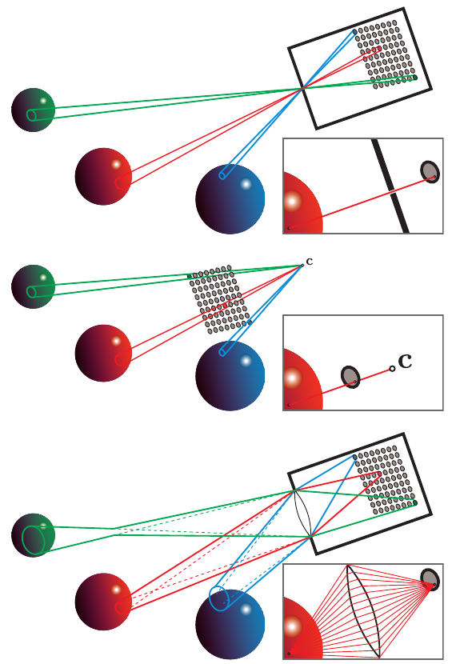

# 9.2 相机

原书来源：书页 307—308（PDF 第 328—329 页）；图 9.16 及其完整图注位于书页 309（PDF 第 330 页）。

如第 8.1.1 节所述，在渲染中，我们计算从被着色的表面点射向相机位置的辐亮度。这是在模拟胶片相机、数码相机或人眼等成像系统的简化模型。

这类系统包含一个由许多离散的小型传感器组成的感光面。例如，人眼中的视杆细胞和视锥细胞、数码相机中的光电二极管，以及胶片中的染料颗粒，都属于这样的传感器。每个传感器检测其表面上的辐照度值，并产生一个颜色信号。辐照度传感器本身无法生成图像，因为它们会对来自所有入射方向的光线求平均。因此，完整的成像系统包含一个不透光的外壳，其上只有一个小孔径（开口），用来限制光能够进入并照射到传感器上的方向。在孔径处放置透镜，可以使光聚焦，从而让每个传感器仅接收来自一小组入射方向的光。外壳、孔径和透镜共同作用，使传感器具有方向选择性。它们对一小块区域和一小组入射方向上的光求平均。这些传感器测量的并非平均辐照度——正如我们在第 8.1.1 节中所见，辐照度量化的是来自所有方向的光通量的面密度——而是平均辐亮度，后者量化的是单条光线的亮度和颜色。

过去，渲染一直采用一种特别简单的成像传感器模型，称为针孔相机，如图 9.16 的上图所示。针孔相机的孔径极小——理想情况下是一个大小为零的数学点——并且没有透镜。这个点状孔径使感光面上的每个点只能收集一条光线，而一个离散传感器收集的是一个狭窄光锥中的光线：光锥的底面覆盖该传感器表面，顶点位于孔径处。渲染系统以略有不同（但等价）的方式对针孔相机建模，如图 9.16 的中图所示。针孔孔径的位置由点 **c** 表示，通常称为“相机位置”或“视点位置”。这个点也是透视变换的投影中心（第 4.7.2 节）。

渲染时，每个着色样本对应一条光线，因而也对应感光面上的一个采样点。抗锯齿过程（第 5.4 节）可以解释为重建每个离散传感器表面上所收集的信号。不过，由于渲染不受物理传感器的限制，我们可以更一般地将这一过程视为从离散样本重建连续图像信号。

虽然人们确实制造过真正的针孔相机，但对于实际使用的大多数相机以及人眼而言，针孔相机都不是很好的模型。图 9.16 的下图展示了一个使用透镜的成像系统模型。加入透镜后就可以采用更大的孔径，从而大幅增加成像系统收集到的光量。不过，这也会使相机的景深受到限制（第 12.4 节），使过近或过远的物体变得模糊。

除了限制景深之外，透镜还会产生另一种影响。即使对于完全合焦的点，每个传感器位置接收到的仍然是一个光锥中的光线。在理想化模型中，每个着色样本代表一条视线，这有时会引入数学奇点、数值不稳定性或视觉混叠。在渲染图像时牢记物理模型，有助于我们识别并解决这类问题。

**图 9.16。** 这里的每幅相机模型图都包含一个像素传感器阵列。实线界定了其中三个传感器从场景中收集的光线集合。每幅图中的插图展示了像素传感器上的单个点样本所收集的光线。上图是针孔相机；中图是典型渲染系统对同一针孔相机的建模方式，其中相机点为 **c**；下图是带有透镜、在物理上更准确的相机。红色球体合焦，另外两个球体失焦。
