# 9.3 双向反射分布函数（BRDF）

原书来源：书页 308—315（PDF 物理页 329—336），从 9.3 节标题开始，至 9.4 节标题之前；书页 309 的图 9.16 属于 9.2 节。本节无下级小节。

归根结底，基于物理的渲染就是计算沿某一组观察射线进入相机的辐亮度。采用第 8.1.1 节引入的入射辐亮度记号，对于给定的观察射线，我们需要计算的量是 (**c**, −**v**)，其中 **c** 是相机位置，−**v** 是沿观察射线的方向。这里使用 −**v**，源于两项记号约定。首先，() 中的方向向量始终指向远离给定点的方向，此处给定点就是相机位置。其次，观察向量 **v** 始终指向相机。

在渲染中，场景通常被建模为一组物体，以及存在于物体之间的介质（“media”一词实际上源自表示“在中间”或“在两者之间”的拉丁语）。所讨论的介质往往是适量且相对洁净的空气，它不会明显影响射线的辐亮度，因此在渲染时可以忽略。有时，射线经过的介质会通过吸收或散射，对其辐亮度产生显著影响。这类介质称为**参与介质**，因为它们参与了光在场景中的传输。第 14 章将详细介绍参与介质。本章假设不存在参与介质，因此，进入相机的辐亮度等于最近物体表面朝相机方向离开的辐亮度：

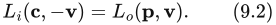

其中，**p** 是观察射线与最近物体表面的交点。

根据公式（9.2），我们的新目标是计算 (**p**, **v**)。这一计算是第 5.1 节所讨论的着色模型求值的基于物理版本。有时，辐亮度由表面直接发射。更常见的情况是，离开表面的辐亮度源自其他地方，并通过第 9.1 节所述的物理相互作用，被表面反射到观察射线中。本章暂不考虑透明现象（第 5.5 节和第 14.5.2 节）以及全局次表面散射（第 14.6 节）。换言之，我们关注局部反射现象：把照到当前着色点上的光重新向外改变方向。这些现象包括表面反射和局部次表面散射，并且只依赖于入射光方向 **l** 与出射观察方向 **v**。局部反射由**双向反射分布函数**（bidirectional reflectance distribution function，BRDF）量化，记为 f(**l**, **v**)。

在最初的推导 [1277] 中，BRDF 是针对均匀表面定义的。也就是说，假定整个表面上的 BRDF 都相同。然而，现实世界中（以及渲染场景中）的物体，其表面材质属性很少处处均匀。即使一个物体只由一种材质构成，例如一尊银制雕像，也会有划痕、失去光泽的斑点、污渍及其他变化，使其视觉属性随表面位置而改变。严格来说，描述 BRDF 随空间位置变化的函数称为**空间变化 BRDF**（spatially varying BRDF，SVBRDF），或**空间 BRDF**（spatial BRDF，SBRDF）。不过，这种情况在实际应用中非常普遍，因此通常仍使用较短的名称 BRDF，并默认它依赖于表面位置。

入射方向和出射方向各有两个自由度。一种常用的参数化方式使用两个角度：相对于表面法线 **n** 的仰角 θ，以及绕 **n** 的方位角（水平旋转角）φ。一般情况下，BRDF 是四个标量变量的函数。**各向同性 BRDF** 是一种重要的特殊情况。当入射方向和出射方向绕表面法线旋转、同时保持两者之间的相对夹角不变时，这类 BRDF 保持不变。图 9.17 展示了这两种情况下使用的变量。各向同性 BRDF 是三个标量变量的函数，因为只需要一个角度 φ 来表示光与相机之间的相对旋转。这意味着，如果把均匀的各向同性材质放在转台上旋转，那么在光源和相机固定时，它在所有旋转角度下看起来都相同。

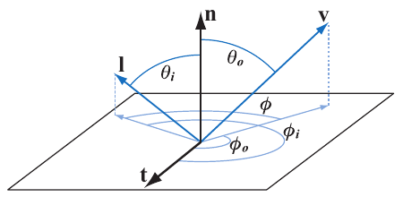

**图 9.17.** BRDF。方位角 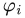 和 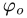 是相对于给定切向量 **t** 定义的。用于各向同性 BRDF、取代  和  的相对方位角 φ，不需要参考切向量。

由于我们忽略了荧光和磷光等现象，因此可以假定：给定波长的入射光，在反射后仍保持同一波长。反射光的量可能随波长而变化，这可以用两种方式之一建模：将波长作为 BRDF 的额外输入变量，或者让 BRDF 返回一个具有光谱分布的值。第一种方式有时用于离线渲染 [660]，而实时渲染始终使用第二种方式。由于实时渲染器用 RGB 三元组表示光谱分布，这实际上就意味着 BRDF 返回一个 RGB 值。

为了计算 (**p**, **v**)，我们将 BRDF 纳入**反射方程**：

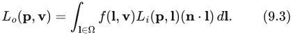

积分号的下标 **l** ∈ Ω 表示，对位于表面上方单位半球内的 **l** 向量进行积分（该半球以表面法线 **n** 为中心方向）。注意，**l** 连续遍历整个入射方向半球；它不是某个特定的“光源方向”。这里的含义是：任何入射方向都可能有与之对应的辐亮度，而且通常确实如此。我们用 d**l** 表示 **l** 周围的微分立体角（立体角见第 8.1.1 节）。

总之，反射方程表明：出射辐亮度等于入射辐亮度、BRDF 与 **n** 和 **l** 的点积三者乘积的积分，积分范围是 Ω 内的 **l**。

为简洁起见，本章后文将从 ()、() 和反射方程中省略表面点 **p**：

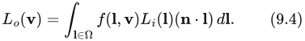

计算反射方程时，常用球面坐标 φ 和 θ 对半球进行参数化。在这种参数化下，微分立体角 d**l** 等于 sin 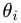 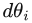 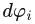。使用这种参数化，可以推导出公式（9.4）的球面坐标二重积分形式（回顾一下，**n** · **l** = cos ）：

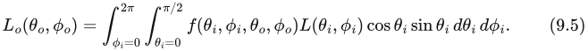

角度 、、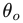 和  如图 9.17 所示。

在某些情况下，使用略有不同的参数化更方便：以仰角的余弦 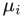 = cos  和  = cos  为变量，替代角度  和  本身。在这种参数化下，微分立体角 d**l** 等于 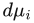 。采用（μ, φ）参数化可得到如下积分形式：

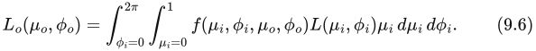

BRDF 仅在光方向和观察方向都位于表面上方时才有定义。对于光方向位于表面下方的情况，可以将 BRDF 乘以零，或者从一开始就不对这些方向计算 BRDF，以避开这种情况。但是，如果观察方向位于表面下方，也就是点积 **n** · **v** 为负，又该怎么办？理论上，这种情况不应该发生，因为此时表面背向相机，因此不可见。然而，实时应用中常见的插值顶点法线和法线映射，在实践中可能产生这种情况。可以将 **n** · **v** 钳制到 0，或者取其绝对值，以避免对表面下方的观察方向计算 BRDF，但两种方法都可能产生伪影。Frostbite 引擎使用 **n** · **v** 的绝对值，再加上一个很小的数（0.00001），以避免除以零 [960]。另一种可能的方法是“软钳制”：随着 **n** 与 **v** 的夹角增大并超过 90°，使其逐渐趋于零。

物理定律对任何 BRDF 都施加了两个约束。第一个约束是**亥姆霍兹互易性**，意即交换输入角度和输出角度后，函数值保持不变：

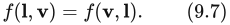

在实际应用中，渲染所使用的 BRDF 经常违反亥姆霍兹互易性，却不会产生明显伪影；例外是明确要求互易性的离线渲染算法，例如双向路径追踪。不过，互易性仍是判断一个 BRDF 是否具有物理合理性的有用工具。

第二个约束是**能量守恒**：出射能量不能大于入射能量（不计自身发光的表面，它们作为特殊情况处理）。路径追踪等离线渲染算法需要能量守恒来保证收敛。对于实时渲染，并不需要精确的能量守恒，但近似的能量守恒很重要。若使用明显违反能量守恒的 BRDF 渲染表面，该表面就会过亮，从而可能显得不真实。

**方向—半球反射率** R(**l**) 是一个与 BRDF 相关的函数，可用于衡量 BRDF 在多大程度上满足能量守恒。虽然名字有些令人望而生畏，但方向—半球反射率的概念很简单：它衡量来自某个给定方向的光，有多少被反射到了以表面法线为中心的半球中的任意出射方向。实际上，它衡量的是给定入射方向下的能量损失。该函数的输入是入射方向向量 **l**，其定义如下：

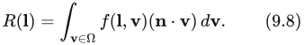

注意，这里的 **v** 与反射方程中的 **l** 一样，遍历整个半球，并不表示某个单独的观察方向。

另一个类似、但在某种意义上与之相反的函数，是**半球—方向反射率** R(**v**)，同样可以定义为：

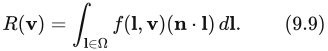

如果 BRDF 满足互易性，那么半球—方向反射率和方向—半球反射率相等，二者可以用同一个函数计算。在这两种反射率可以互换使用时，可以用**方向反照率**作为它们的统称。

由于能量守恒，方向—半球反射率 R(**l**) 的值必须始终处于 [0, 1] 范围内。反射率为 0 表示所有入射光均被吸收或以其他方式损失。如果所有光都被反射，反射率就是 1。在大多数情况下，它位于这两个值之间。与 BRDF 一样，R(**l**) 的值随波长而变化，因此在渲染中用 RGB 向量表示。由于每个分量（红、绿、蓝）都限制在 [0, 1] 范围内，R(**l**) 的一个取值可以视为一种简单的颜色。注意，这个限制不适用于 BRDF 的取值。BRDF 是分布函数，如果它描述的分布高度不均匀，那么在某些方向上（例如高光的中心），它可以具有任意高的值。BRDF 满足能量守恒的要求是：对于 **l** 的所有可能取值，R(**l**) 均不大于 1。

最简单的 BRDF 是**朗伯 BRDF**，它对应于第 5.2 节简要讨论的朗伯着色模型。朗伯 BRDF 的值为常数。众所周知、用来体现朗伯着色特征的（**n** · **l**）因子并不是 BRDF 的一部分，而是公式（9.4）的一部分。尽管朗伯 BRDF 很简单，但实时渲染中经常用它来表示局部次表面散射（不过，如第 9.9 节所述，它正在被更准确的模型取代）。朗伯表面的方向—半球反射率也是常数。令 f(**l**, **v**) 为常数并计算公式（9.8），可以得到方向—半球反射率与 BRDF 之间的如下关系：

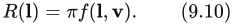

朗伯 BRDF 的恒定反射率通常称为**漫反射颜色** 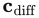，或**反照率** ρ。本章为了强调它与次表面散射的联系，将这个量称为**次表面反照率** 。第 9.9.1 节将详细讨论次表面反照率。由公式（9.10）可得如下 BRDF：

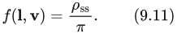

因子 1/π 的出现，是因为将余弦因子在半球上积分所得的值为 π。BRDF 中经常可以看到这样的因子。

理解 BRDF 的一种方式，是固定输入方向并将其可视化，见图 9.18。对于给定的入射光方向，显示所有出射方向上的 BRDF 值。交点周围的球状部分是漫反射分量，因为出射辐亮度有相等的机会反射到任何方向。椭球状部分是**镜面反射瓣**。自然地，这些瓣位于入射光所对应的反射方向，瓣的厚度对应于反射的模糊程度。根据互易性原理，这些相同的可视化也可以理解为：各个不同的入射光方向对某个单一出射方向分别贡献了多少。

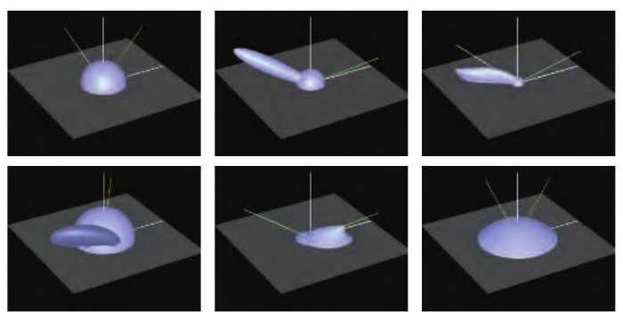

**图 9.18.** BRDF 示例。每幅图中从右侧伸来的绿色实线表示入射光方向，绿白相间的虚线表示理想反射方向。上排左图是朗伯 BRDF（一个简单的半球）；中图是在朗伯项上加入 Blinn–Phong 高光；右图是 Cook–Torrance BRDF [285, 1779]。注意，镜面高光并不是在反射方向上最强。下排左图是 Ward 各向异性模型的近景，在这种情况下，其效果是使镜面反射瓣倾斜；中图是 Hapke/Lommel–Seeliger“月球表面”BRDF [664]，它具有很强的逆向反射；右图展示 Lommel–Seeliger 散射，在这种散射中，积尘表面将光散射到掠射角方向。（图片由 Szymon Rusinkiewicz 提供，取自他的“bv”BRDF 浏览器。）

> 译注：原书公式（9.5）、（9.6）的入射辐亮度写作 L，未带下标 i，此处依原页保留。原书将相对于法线的 θ 称为 elevation（仰角），其几何定义以图 9.17 为准；改用 μ = cos θ 时，原文 d**l** =   表示积分使用的正测度，变量代换的负号通过反转积分上下限处理。
