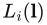
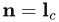
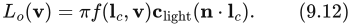
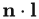
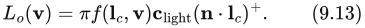
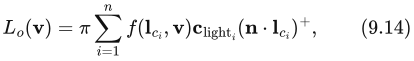
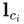
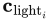

# 9.4 光照

来源：原书第315—316页（PDF第336—337页）。本节从“9.4 Illumination”标题起，至“9.5 Fresnel Reflectance”标题前止。

反射方程（式9.4）中的 （入射辐亮度）项表示从场景其他部分照射到当前着色表面点的光。全局光照算法通过模拟光在整个场景中的传播和反射来计算 。这些算法使用渲染方程[846]，反射方程是它的一个特例。第11章将讨论全局光照。在本章和下一章中，我们关注局部光照：它利用反射方程，在每个表面点局部计算着色。在局部光照算法中， 是给定的，不需要计算。

在真实场景中， 包含来自所有方向的非零辐亮度，这些光可能直接由光源发出，也可能由其他表面反射而来。与第5.2节讨论的方向光源和点状光源不同，现实世界中的光源都是占据非零立体角的面光源。本章使用一种受限形式的 ，其中只包含方向光源和点状光源，把更一般的光照环境留到第10章讨论。这种限制使讨论能够更加集中。

尽管点状光源和方向光源是非物理的抽象，但可以将它们推导为物理光源的近似。这种推导很重要，因为它使我们能够在清楚了解所引入误差的前提下，将这些光源纳入基于物理的渲染框架。

取一个位于远处的小面光源，并将  定义为指向其中心的向量。我们还将光源颜色  定义为一个正对光源的白色朗伯表面的反射辐亮度，此时 。对于内容创作而言，这种定义很直观，因为光源的颜色直接对应于它的视觉效果。

根据这些定义，方向光源可以推导为如下极限情形：保持  的值不变，同时将面光源的尺寸缩小到零[758]。在这种情况下，反射方程（式9.4）中的积分简化为一次 BRDF 求值，计算开销显著降低：

点积  通常会将负值钳制为零，从而方便地跳过位于表面下方的光源所产生的贡献：

注意第1.2节引入的  记号，它表示将负值钳制为零。

点状光源也可以用类似方式处理。仅有的区别在于：面光源不必位于远处，而且  按照到光源距离的平方反比衰减，如式5.11（第111页）所示。如果存在多个光源，就多次计算式9.12，并将结果相加：

其中， 和  分别为第 i 个光源的方向和颜色。注意它与式5.6（第109页）的相似之处。

式9.14中的 π 因子会与 BRDF 中经常出现的 1/π 因子（例如式9.11）相消。这种抵消将除法运算移出了着色器，也让着色方程更容易阅读。不过，在将学术论文中的 BRDF 调整后用于实时着色方程时，必须小心。通常，BRDF 在使用前需要乘以 π。
