# 9.8 表面反射的 BRDF 模型

来源：《Real-Time Rendering, Fourth Edition》，书页 336—347（PDF 物理页 357—368）。范围从 9.8 标题开始，到 9.9 标题之前，包含全部下级小节、图 9.33—9.39 和公式（9.33）—（9.60）。

除了少数例外，基于物理的渲染中使用的镜面 BRDF 项都推导自微表面理论。对于镜面表面反射，每个微表面都是完全光滑的菲涅耳镜面。回想一下，这种镜面会把每条入射光线反射到唯一的反射方向。这意味着，除非 v 平行于 l 的反射方向，否则每个面的微 BRDF 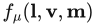 都等于零。对于给定的 l 和 v 向量，这种构型等价于微表面法线 m 与一个恰好指向 l 和 v 正中间的向量对齐。这个向量就是**半程向量 h**。见图 9.33。将 v 与 l 相加并归一化即可得到它：

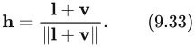

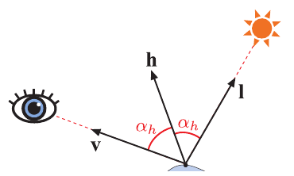

**图 9.33** 半程向量 h 与光照向量和观察向量形成相等的角度（以红色标出）。

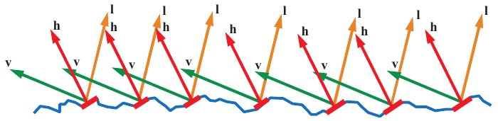

**图 9.34** 由微表面组成的表面。只有红色微表面的表面法线与半程向量 h 对齐，能够将来自入射光照向量 l 的光反射到观察向量 v。

从公式（9.26）推导镜面微表面模型时，菲涅耳镜面的微 BRDF  对所有 m ≠ h 都为零，这一点非常便利，因为它使积分简化为在 m = h 处对被积函数求值。由此得到镜面 BRDF 项：

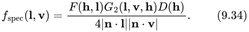

推导的细节见 Walter 等人 [1833]、Heitz [708] 和 Hammon [657] 的出版物。Hammon 还给出了一种优化 BRDF 实现的方法：无需计算向量 h 本身，就能计算 n·h 和 l·h。

我们用 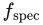 表示公式（9.34）中的 BRDF 项，以表明它仅对表面（镜面）反射建模。在完整 BRDF 中，它很可能会与一个对次表面（漫反射）着色建模的附加项搭配使用。要直观理解公式（9.34），可以考虑：只有那些法线恰巧与半程向量对齐（m = h）的微表面，其朝向才适合把光从 l 反射到 v，见图 9.34。因此，反射光量取决于三个因素：法线等于 h 的微表面的集中程度，由 D(h) 给出；这些微表面中，从光照方向和观察方向都可见的比例，等于 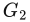(l, v, h)；以及每个这样的微表面反射的光所占的比例，由 F(h, l) 指定。计算菲涅耳函数时，以向量 h 代替表面法线，例如计算书页 320 的公式（9.16）中的 Schlick 近似时就是如此。

在遮蔽—阴影函数中使用半程向量，还允许作一个小的简化。由于涉及的角度不可能大于 90°，可以去掉公式（9.24）、（9.31）和（9.32）中的 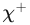 项。

## 9.8.1 法线分布函数

法线分布函数会显著影响渲染表面的外观。在微表面法线所对应的球面上绘出的 NDF 形状，决定了反射光线锥体（镜面波瓣）的宽度和形状，进而决定镜面高光的大小与形状。NDF 不仅影响表面粗糙度的整体感知，还影响更细微的视觉特征，例如高光是否具有清晰的边缘，或是否被一层薄雾般的光晕包围。

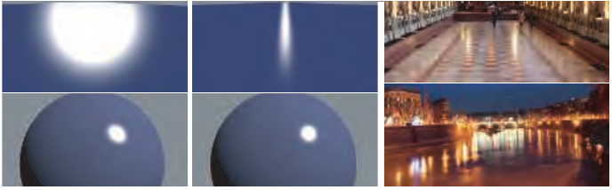

**图 9.35** 左侧图像使用非物理的 Phong 反射模型渲染。该模型的镜面波瓣绕反射向量旋转对称。计算机图形学早期经常使用这类 BRDF。中间的图像使用基于物理的微表面 BRDF 渲染。左上与中上显示的是以掠射角照明的平面表面。左上呈现出错误的圆形高光，而中间展现了微表面 BRDF 所特有的高光拉长现象。中间的结果符合现实，右侧照片即为例证。下方两幅渲染图中的球体，其高光形状差异要细微得多，因为此时表面曲率才是决定高光形状的主导因素。（照片由 Elan Ruskin 提供。）

然而，镜面波瓣并不是 NDF 形状的简单复制。波瓣及其决定的高光形状，会随着表面曲率和观察角度而发生程度不同的畸变。对于以掠射角观察的平坦表面，这种畸变尤其明显，如图 9.35 所示。Ngan 等人 [1271] 分析了这种畸变产生的原因。

### 各向同性法线分布函数

渲染中使用的大多数 NDF 都是各向同性的，即绕宏观表面法线 n 旋转对称。在这种情况下，NDF 只依赖一个变量：n 与微表面法线 m 之间的夹角 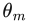。理想情况下，NDF 可以写成 cos  的表达式，从而通过 n 与 m 的点积高效计算。

Beckmann NDF [124] 是光学界最初开发的微表面模型所采用的法线分布，直到今天仍在该领域广泛使用。Cook–Torrance BRDF [285, 286] 也选择了它。归一化的 Beckmann 分布形式如下：

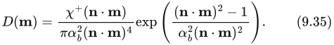

(n·m) 项保证：对于所有指向宏观表面下方的微表面法线，NDF 的值都是 0。这个性质说明，该 NDF 与本节将讨论的其他所有 NDF 一样，描述的是高度场微表面。参数 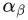 控制表面粗糙度，它正比于微几何表面斜率的均方根（RMS），因此  = 0 表示完全光滑的表面。

要推导 Beckmann NDF 的 Smith  函数，需要相应的 Λ 函数，并将它代入公式（9.24）（使用  的可分离形式时）、（9.31）（使用高度相关形式时）或（9.32）（使用方向与高度相关形式时）。

Beckmann NDF 具有**形状不变性**，这简化了 Λ 的推导。按照 Heitz [708] 的定义，如果各向同性 NDF 的粗糙度参数产生的效果等价于缩放（拉伸）微表面，那么该 NDF 就是形状不变的。具有形状不变性的 NDF 可以写成以下形式：

其中 g 表示任意一元函数。对于任意各向同性 NDF，Λ 函数依赖两个变量：第一个是粗糙度 α，第二个是计算 Λ 时所用向量（v 或 l）的入射角。然而，对于形状不变的 NDF，Λ 函数只依赖变量 a：

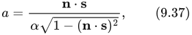

其中向量 s 代表 v 或 l。此时 Λ 只依赖一个变量，这给实现带来了便利。一元函数更容易用近似曲线拟合，也可以制成一维数组形式的查找表。

Beckmann NDF 的 Λ 函数为：

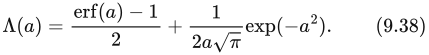

公式（9.38）包含误差函数 erf，计算开销很大。因此通常改用以下近似 [1833]：

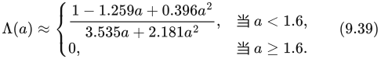

接下来讨论 Blinn–Phong NDF。它过去在计算机图形学中应用广泛，但近来大部分已被其他分布取代。在计算资源十分紧张的场合（例如移动硬件），仍然会使用 Blinn–Phong NDF，因为它比本节讨论的其他 NDF 计算成本更低。

Blinn [159] 通过修改非物理的 Phong 着色模型 [1414]，推导出了 Blinn–Phong NDF：

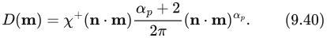

指数 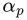 是 Phong NDF 的粗糙度参数。较大的值表示光滑表面，较小的值表示粗糙表面。对于极为光滑的表面， 可以任意大；理想镜面需要  = ∞。令  为 0，即可得到随机程度最大的表面（均匀 NDF）。直接操纵  并不方便，因为它的视觉影响极不均匀：在  较小时，数值的小幅变化就会带来很大的视觉变化；而在数值较大时，即使显著改变数值，视觉影响也不大。因此，通常通过非线性映射，从用户操纵的参数推导出 。例如，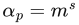，其中 s 是 0 到 1 之间的参数值，m 是特定应用中  的上限。若干游戏采用了这种映射，其中《Call of Duty: Black Ops》将 m 设为 8192 [998]。

当 BRDF 参数的行为在感知上不均匀时，这类“界面映射”通常很有用。这些映射用于解释通过滑块设置或在纹理中绘制的参数。

利用关系 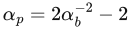 [1833]，可以找到 Beckmann 与 Blinn–Phong 粗糙度参数的等效值。以这种方式匹配参数时，两种分布非常接近，尤其对于相对光滑的表面，如图 9.36 左上所示。

Blinn–Phong NDF 不具有形状不变性，其 Λ 函数也不存在解析形式。Walter 等人 [1833] 建议结合参数等效关系 ，使用 Beckmann 的 Λ 函数。

在 1977 年将 Phong 着色函数改造成微表面 NDF 的同一篇论文 [159] 中，Blinn 还提出了另外两种 NDF。在这三种分布中，他推荐了 Trowbridge 和 Reitz [1788] 推导的一种分布。这个建议没有受到广泛重视，但 30 年后，Walter 等人 [1833] 独立地重新发现了 Trowbridge–Reitz 分布，并将它命名为 GGX 分布。这一次，这颗种子生根了。短短几年内，GGX 分布便开始在电影 [214, 1133] 和游戏 [861, 960] 行业中传播，如今它很可能已成为这两个行业使用最频繁的分布。看来 Blinn 的推荐比时代早了 30 年。虽然严格来说正确名称应为“Trowbridge–Reitz 分布”，但由于 GGX 这个名称已深入人心，本书仍使用它。

GGX 分布为：

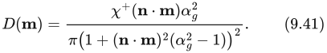

参数 αɡ 提供的粗糙度控制与 Beckmann 参数  类似。在 Disney 原则化着色模型中，Burley [214] 以 αɡ =  的方式向用户提供粗糙度控制，其中 r 是用户界面中取值在 0 到 1 之间的粗糙度参数。让用户通过滑块操纵 r，会使效果以更接近线性的方式变化。大多数使用 GGX 分布的应用都采用了这种映射。

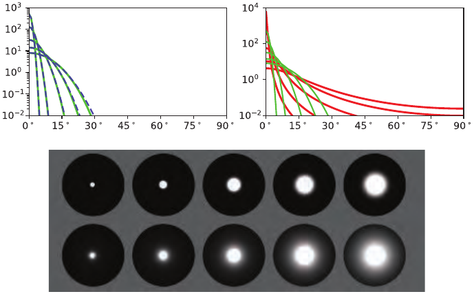

**图 9.36** 左上比较了 Blinn–Phong（蓝色虚线）与 Beckmann（绿色）分布， 的取值范围为 0.025 到 0.2，使用参数关系 。右上比较了 GGX（红色）与 Beckmann（绿色）分布。 的值与左图相同；αɡ 的值通过目测调整，以匹配高光大小。下方球体的渲染也使用了这些相同的值，上排使用 Beckmann NDF，下排使用 GGX。

GGX 分布具有形状不变性，其 Λ 函数相对简单：

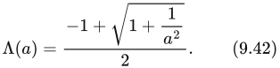

变量 a 在公式（9.42）中仅以 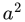 的形式出现，这一点很方便，因为可以避免计算公式（9.37）中的平方根。

由于 GGX 分布和 Smith 遮蔽—阴影函数十分流行，人们专门投入了精力来优化两者的组合。Lagarde [960] 观察到，GGX 的高度相关 Smith （公式（9.31））与镜面微表面 BRDF 的分母（公式（9.34））组合后，有些项会相消。组合项可以简化为：

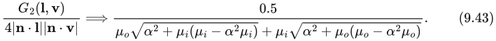

为简洁起见，公式使用变量替换  = 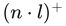 和 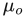 = 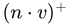。

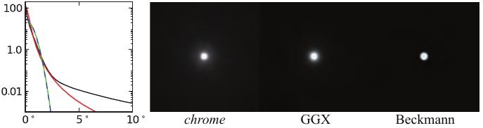

**图 9.37** 对 MERL 数据库中实测铬材质拟合得到的 NDF。左侧绘出了镜面峰值随  变化的曲线：铬为黑色，GGX 为红色（αɡ = 0.006），Beckmann 为绿色（ = 0.013），Blinn–Phong 为蓝色虚线（n = 12000）。右侧为铬、GGX 和 Beckmann 的高光渲染结果。（图片由 Brent Burley [214] 提供。）

Karis [861] 提出了 GGX 的 Smith 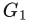 函数的近似形式：

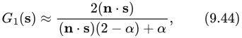

其中 s 可以替换为 l 或 v。Hammon [657] 指出，这个  的近似形式能够导出一个高效近似，用于计算高度相关 Smith  函数与镜面微表面 BRDF 分母构成的组合项：

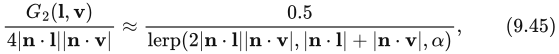

其中使用了线性插值算子 lerp(x, y, s) = x(1 − s) + ys。

比较图 9.36 中的 GGX 与 Beckmann 分布，可以明显看出两者的形状有根本差异。GGX 的峰比 Beckmann 更窄，峰周围的“尾部”也更长。从图底部的渲染图像中可以看到，GGX 较长的尾部在高光核心周围形成了薄雾或光晕般的外观。

许多现实材质都有类似的朦胧高光，其尾部通常甚至比 GGX 分布更长 [214]，见图 9.37。这一认识是 GGX 分布日益流行的重要推动因素，也促使人们继续寻找能更准确拟合实测材质的新分布。

Burley [214] 提出了**广义 Trowbridge–Reitz（GTR）NDF**，目的是更充分地控制 NDF 的形状，特别是分布尾部：

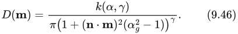

参数 γ 控制尾部形状。当 γ = 2 时，GTR 与 GGX 相同。γ 减小时，分布尾部变长；γ 增大时，尾部变短。当 γ 较大时，GTR 分布类似于 Beckmann。k(α, γ) 项是归一化因子；由于它比其他 NDF 的归一化因子更复杂，我们用单独的公式给出：

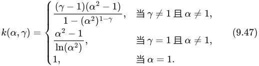

> 译注：公式（9.46）分母中的粗糙度在原书排作 αɡ，而归一化因子和公式（9.47）使用 α；此处保留原书记号，不作暗改。

GTR 分布不具有形状不变性，这使其 Smith  遮蔽—阴影函数的求解更复杂。NDF 发表三年之后，才有  的解发表 [355]。这个  解相当复杂，需要为某些 γ 值列出解析解表，中间值则必须插值。GTR 的另一个问题是，参数 α 和 γ 对感知粗糙度与“光晕”的影响并不直观。

**Student t 分布（STD）**[1491] 和**指数幂分布（EPD）**[763] NDF 都包含形状控制参数。与 GTR 不同，这些函数相对于粗糙度参数具有形状不变性。在本书写作时，它们刚刚发表，尚不清楚是否会进入实际应用。

为了更好地匹配实测材质，除了增加 NDF 的复杂度，另一种办法是使用多个镜面波瓣。Cook 和 Torrance [285, 286] 提出了这个想法。Ngan [1271] 对其进行了实验检验，发现对于许多材质，增加第二个波瓣确实能显著改善拟合。Pixar 的 PxrSurface 材质 [732] 有一个“roughspecular”波瓣，其用途就是与主镜面波瓣一起实现这一目的。附加波瓣是一个完整的镜面微表面 BRDF，带有所有相关参数和项。Imageworks 采取了更有针对性的办法 [947]：混合两个 GGX NDF，并将其作为扩展 NDF 提供给用户，而非另加一个完整的镜面 BRDF 项。这样，唯一需要增加的参数就是第二个粗糙度值和混合量。

### 各向异性法线分布函数

虽然大多数材质具有各向同性的表面统计特征，但有些材质的微结构具有显著各向异性，足以明显影响外观，例如书页 329 的图 9.26。为了准确渲染这些材质，需要同样具有各向异性的 BRDF，尤其是各向异性 NDF。

与各向同性 NDF 不同，各向异性 NDF 不能仅用角度  求值，还需要额外的朝向信息。一般情况下，需要将微表面法线 m 变换到由法线、切线和副切线向量（分别为 n、t 和 b）定义的局部坐标系，也就是切线空间，见书页 210 的图 6.32。实践中，这种变换通常表示为三个独立的点积：m·n、m·t 和 m·b。

将法线映射与各向异性 BRDF 结合时，必须确保法线贴图不仅扰动法线，也扰动切线和副切线向量。通常，对扰动后的法线 n 以及经过插值的顶点切线和副切线向量 、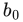 应用修正的 Gram–Schmidt 过程来完成这一操作（以下假定 n 已经归一化）：

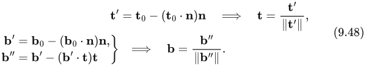

另一种办法是在完成第一行之后，取 n 与 t 的叉积来构造正交的 b 向量。

对于拉丝金属或卷发等效果，需要逐像素修改切线方向，通常由**切线贴图**提供。这种纹理存储每个像素的切线，类似于法线贴图存储逐像素法线。切线贴图最常存储的是切线向量在垂直于法线的平面上的二维投影。这种表示能很好地配合纹理过滤，也能像法线贴图一样压缩。有些应用改为存储一个标量旋转量，用它使切线向量绕 n 旋转。虽然这种表示更加紧凑，但当旋转角从 360° 回绕到 0° 时，容易产生纹理过滤伪影。

创建各向异性 NDF 的常用办法，是将已有的各向同性 NDF 推广。这种通用方法适用于任何具有形状不变性的各向同性 NDF [708]，这也是优先选用形状不变 NDF 的另一个理由。回顾一下，各向同性的形状不变 NDF 可以写成：

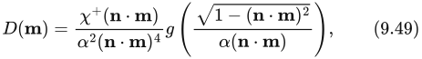

其中 g 是表达 NDF 形状的一维函数。其各向异性版本为：

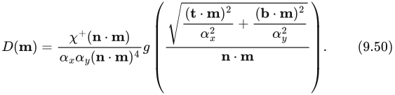

参数 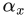 和 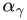 分别表示沿 t 和 b 方向的粗糙度。如果  = ，公式（9.50）就退化回各向同性形式。

各向异性 NDF 的  遮蔽—阴影函数与各向同性版本相同，唯一的区别是传入 Λ 函数的变量 a 采用不同的计算方式：

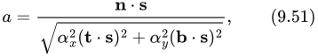

其中，与公式（9.37）一样，s 代表 v 或 l。

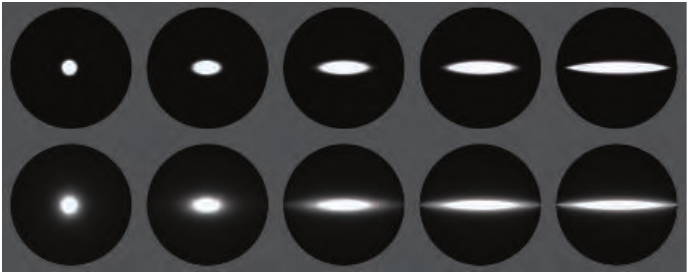

**图 9.38** 使用各向异性 NDF 渲染的球体：上排为 Beckmann，下排为 GGX。两排都保持  不变，让  从左到右增大。

采用这种方法，可以推导出 Beckmann NDF 的各向异性版本：

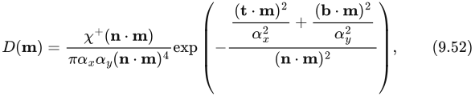

以及 GGX NDF 的各向异性版本：

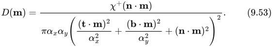

两者都展示在图 9.38 中。

虽然各向异性 NDF 最直接的参数化办法，是将各向同性的粗糙度参数化使用两次，分别用于  和 ，但有时也会使用其他参数化方式。在 Disney 原则化着色模型 [214] 中，各向同性粗糙度参数 r 与第二个标量参数 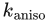 组合，后者的范围为 [0, 1]。由这些参数计算 、 的方式如下：

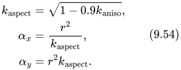

因子 0.9 将长宽比限制为 10 : 1。

Imageworks [947] 使用另一种参数化方式，允许任意程度的各向异性：

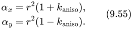

## 9.8.2 多次弹射的表面反射

如前面 9.7 节所述，微表面 BRDF 框架没有考虑在微表面上反射（“弹射”）多次的光。这一简化会造成一定的能量损失和过度变暗，对粗糙金属尤其如此 [712]。

Imageworks [947] 使用的一项技术融合了此前研究 [811, 878] 中的要素，构造出一个可加到 BRDF 上的项，用于模拟多次弹射的表面反射：

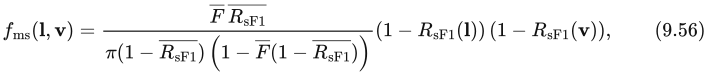

其中 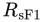 是 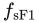 的方向反照率（9.3 节），而后者是把  设为 1 的镜面 BRDF 项。函数  依赖粗糙度 α 和仰角 θ。它相对平滑，因此可以通过数值方法预计算（使用公式（9.8）或（9.9）），并存入一张小型二维纹理。Imageworks 发现 32 × 32 的分辨率就已足够。

函数 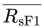 是  在半球上的余弦加权平均值。它只依赖 α，因此可以存入一维纹理，也可以用一条计算成本很低的曲线拟合这些数据。由于  绕 n 旋转对称， 可以通过一维积分计算。我们还使用变量代换 μ = cos θ（见书页 312 的公式（9.6））：

最后，F̅ 是菲涅耳项的余弦加权平均值，以同样方式计算：

对于 F 使用广义 Schlick 形式（公式（9.18））的情况，Imageworks 给出了公式（9.58）的闭式解：

如果使用原始的 Schlick 近似（公式（9.16）），解则简化为：

在各向异性的情况下，Imageworks 使用介于  和  之间的粗糙度来计算 。这种近似避免了增加  查找表的维数，而且引入的误差很小。

Imageworks 多次弹射镜面项的效果见图 9.39。

**图 9.39** 所有行的表面粗糙度都从左到右递增。最上面的两行展示金材质：第一行渲染时未使用 Imageworks 多次弹射项，第二行使用了该项。对于更粗糙的球体，差异最为明显。接下来的两行展示黑色电介质材质：第三行未使用多次弹射项，第四行使用了该项。由于镜面反射率低得多，此时差异也更加细微。（图片由 Christopher Kulla [947] 提供。）
