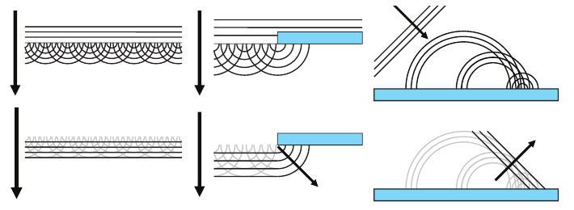
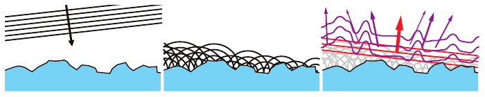
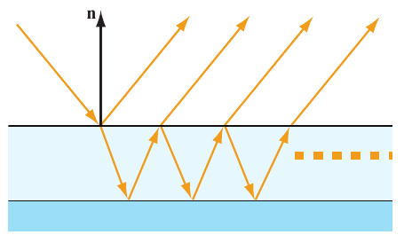
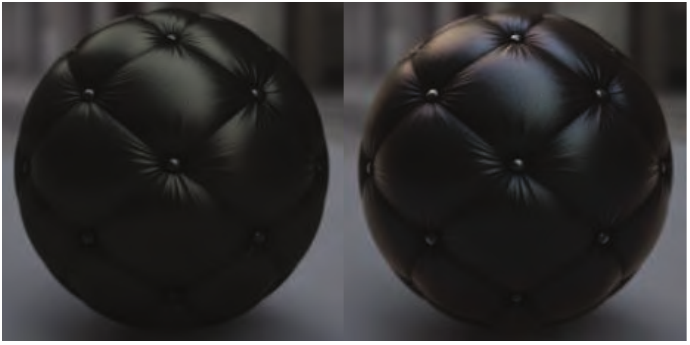

# 9.11 波动光学 BRDF 模型

本节来源：《Real-Time Rendering, Fourth Edition》书页 359—363（PDF 物理页 380—384）。范围自 9.11 节标题起，至 9.12 节标题前，包含 9.11.1、9.11.2 及图 9.44—9.47。

前面几节讨论的模型都依赖几何光学；几何光学将光视为沿光线传播，而不是以波的形式传播。如书页 303 所述，几何光学建立在这样一个假设之上：表面的任何不规则起伏，要么小于一个波长，要么大于约 100 个波长。

现实世界中的表面可不会如此配合。它们往往在各种尺度上都有不规则起伏，包括 1—100 个波长这一范围。我们把这种尺寸的不规则起伏称为**纳米几何**（nanogeometry），以区别于前面几节讨论的**微几何**（microgeometry）起伏；后者虽然小到无法逐一渲染，却仍大于光的 100 个波长。几何光学无法建模纳米几何对反射率的影响。这些效应取决于光的波动性，必须使用**波动光学**（wave optics，也称 physical optics，即物理光学）来建模。

厚度接近光的一个波长的表面层，也就是薄膜，同样会产生与光的波动性有关的光学现象。

本节将简要介绍衍射和薄膜干涉等波动光学现象，并讨论它们对于真实感渲染的重要性；这种重要性有时令人惊讶，因为所渲染的材质在其他方面看起来可能相当普通。

## 9.11.1 衍射模型

**图 9.44。** 左图中，平面波前在空旷空间中传播。如果把波前上的每一点都视为一个新球面波的波源，这些新波就会在除前进方向以外的所有方向上发生相消干涉，从而再次形成平面波前。中图中，波遇到了障碍物。障碍物边缘处的球面波，其右侧没有其他波与之发生相消干涉，因此有些波会绕过边缘发生衍射，也就是从边缘“漏”过去。右图中，平面波前从平坦表面反射。平面波前先到达左侧的表面点，再到达右侧的表面点，因此左侧表面点发出的球面波有更长的传播时间，尺寸也就更大。这些大小不同的球面波前沿反射平面波前的边缘发生相长干涉，在其他方向上则发生相消干涉。

纳米几何会引起一种称为**衍射**（diffraction）的现象。为了解释它，我们需要用到**惠更斯–菲涅耳原理**：波前，也就是具有相同波相位的点所组成的集合，其上的每一点都可以视为一个新球面波的波源。见图 9.44。当波遇到障碍物时，惠更斯–菲涅耳原理表明，它们会在拐角处稍稍弯曲、绕行，这就是衍射的一个例子。几何光学无法预测这种现象。对于入射到平面表面上的光，几何光学确实能正确预测光会沿单一方向反射。不过，菲涅耳–惠更斯原理还能提供进一步的认识：表面上的球面波恰好排列成能够产生反射波前的形式，而其他所有方向上的波都通过相消干涉被消除。当我们考察具有纳米级不规则起伏的表面时，这一认识就十分重要。由于各个表面点的高度不同，表面上的球面波不再排列得那么整齐。见图 9.45。

**图 9.45。** 左图显示平面波前入射到具有粗糙纳米几何的表面上。中图显示依据菲涅耳–惠更斯原理在表面上形成的球面波。右图显示，在发生相长和相消干涉之后，产生的波中有一部分（红色）形成了平面反射波。其余的波（紫色）发生衍射；在各个方向上传播的光量不同，并且取决于波长。

如图所示，光散射到不同方向。其中一部分发生镜面反射，即在反射方向上叠加成一个平面波前。其余光则按照某种方向分布衍射出去，这种分布取决于纳米几何的某些性质。镜面反射光与衍射光之间的分配取决于纳米几何凸起的高度；更准确地说，取决于高度分布的方差。衍射光在镜面反射方向周围的角度扩展范围，取决于纳米几何凸起相对于光波长的宽度。有一点不太符合直觉：越宽的起伏，造成的扩展范围反而越小。如果不规则起伏的尺寸大于光的 100 个波长，衍射光与镜面反射光之间的夹角就会小到可以忽略。起伏尺寸越小，衍射光的扩展范围越大，直到起伏小于光的一个波长；此时就不再发生衍射。

在具有周期性纳米几何的表面上，衍射最为明显，因为重复图案通过相长干涉增强了衍射光，从而产生色彩丰富的虹彩。这种现象可以在 CD、DVD 光盘以及某些昆虫身上观察到。虽然非周期性表面也会发生衍射，但计算机图形学界多年来一直认为这种效应很微弱。因此，多年以来，除了少数例外 [89, 366, 686, 1688]，计算机图形学文献大多忽略了衍射。

然而，Holzschuch 和 Pacanowski [762] 最近对实测材质的分析表明，许多材质中都存在显著的衍射效应；这或许能够解释为什么使用现有模型拟合这些材质始终很困难。同一组作者的后续工作 [763] 提出了一种结合微表面理论与衍射理论的模型：它采用通用微表面 BRDF（公式 9.26），并以一个考虑衍射的微 BRDF 作为其中的组成部分。与此同时，Toisoul 和 Ghosh [1772, 1773] 提出了捕获周期性纳米几何所产生的虹彩衍射效应的方法，以及在点光源和基于图像的光照下实时渲染这些效应的方法。

## 9.11.2 薄膜干涉模型

**薄膜干涉**是一种波动光学现象：从薄电介质层的顶面和底面反射的光路相互干涉，便会产生这种现象。见图 9.46。

**图 9.46。** 光入射到反射性基底上方的一层薄膜。除了初次反射以外，还存在多条光路：光先折射进入薄膜，再从基底反射，随后或者在薄膜顶面内侧反射，或者折射穿出该表面。这些光路都是同一个波的副本，只因路径长度不同而产生了短暂的相位延迟，因此会相互发生相干干涉。

不同波长的光会发生相长干涉或相消干涉，具体取决于波长与路径长度差之间的关系。由于路径长度差会随角度而变化，不同波长便会在相长干涉与相消干涉之间转换，最终表现为虹彩般的颜色变化。

这种效应之所以要求膜足够薄，与**相干长度**（coherence length）的概念有关。相干长度是一个光波的副本仍能与原波发生相干干涉时，所允许的最大位移距离。该长度与光的**带宽**成反比；这里的带宽是指其光谱功率分布（SPD）所覆盖的波长范围。激光的带宽极窄，因此相干长度极长；根据激光类型的不同，相干长度可能达到数英里。这种关系很好理解，因为一个简单的正弦波即使平移许多个波长，仍然能与原波发生相干干涉。如果激光是真正的单色光，它就会具有无限长的相干长度；但在实际中，激光的带宽并不为零。反过来，带宽极宽的光会具有杂乱的波形。这样的波形副本只需平移很短的距离，就不再与原波发生相干干涉，这也很容易理解。

理论上，理想白光是所有波长的混合，其相干长度应为零。不过，就可见光光学而言，决定相干长度的是人类视觉系统的带宽；人眼只能感知 400—700 nm 范围内的光，因此相干长度约为 1 微米。所以，在大多数情况下，“薄膜增厚到什么程度后就不再引起可见干涉？”这个问题的答案是“约 1 微米”。

与衍射类似，多年以来，人们一直把薄膜干涉看作一种特殊情形下的效应，认为它只发生在肥皂泡、油渍等表面上。然而，Akin [27] 指出，薄膜干涉确实会为许多日常表面带来细微的色彩，并展示了对这种效应进行建模如何增强真实感。见图 9.47。他的文章使人们对基于物理的薄膜干涉的兴趣大幅增加，包括 RenderMan 的 PxrSurface [732] 和 Imageworks 着色模型 [947] 在内的多种着色模型，都加入了对这种效应的支持。

**图 9.47。** 左图为未考虑薄膜干涉的皮革材质渲染，右图为考虑了薄膜干涉的渲染。薄膜干涉造成的镜面反射着色增强了图像的真实感。（图像由 Next Limit Technologies 的 Atilla Akin 制作 [27]。）

适用于实时渲染的薄膜干涉技术已经存在一段时间了。Smits 和 Meyer [1667] 提出了一种高效方法，用来考虑一阶与二阶光路之间的薄膜干涉。他们观察到，得到的颜色主要是路径长度差的函数，而路径长度差可以根据薄膜厚度、观察角度和折射率高效计算。他们的实现需要一个存储 RGB 颜色的一维查找表。表中的内容可以通过密集的光谱采样计算，并在预处理阶段转换为 RGB 颜色，因此这项技术相当快速。游戏《使命召唤：无限战争》（Call of Duty: Infinite Warfare）采用了另一种快速的薄膜近似方法，作为其分层材质系统的一部分 [386]。这些技术没有建模光在薄膜中的多次弹射，也没有建模其他一些物理现象。Belcour 和 Barla [129] 提出了一种更精确、计算代价也更高，但仍以实时实现为目标的技术。
