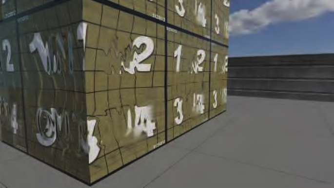

# 9.12 分层材质

来源：原书第 363—365 页（PDF 第 384—386 页）；范围为 9.12 节正文及图 9.48，止于 9.13 节标题之前。

在现实生活中，材质往往一层叠在另一层之上。表面可能覆有灰尘、水、冰或雪；也可能出于装饰或保护的目的，涂有漆或其他涂层；还可能像许多生物材料一样，其基本构造本身就包含多个层次。

分层中最简单、视觉影响也最显著的情形之一是透明涂层（clear coat），即覆盖在另一种材质的基底之上的光滑透明层。例如，在粗糙木材表面涂上一层光滑的清漆。迪士尼原则化着色模型 [214] 包含透明涂层项，虚幻引擎 [1802]、RenderMan 的 PxrSurface 材质 [732]，以及 Dreamworks Animation [1937] 和 Imageworks [947] 等公司的着色模型也都如此。

透明涂层最显著的视觉效果，是光分别从透明涂层和下方基底反射所产生的双重反射。当基底是金属时，第二重反射最为明显，因为这时电介质透明涂层与基底之间的折射率差异最大。当基底是电介质时，其折射率接近透明涂层的折射率，因此第二重反射相对较弱。这种效果与第 325 页表 9.4 所示的水下材质相似。

透明涂层也可以带有颜色。从物理角度看，这种着色是吸收造成的。根据比尔–朗伯定律（第 14.1.2 节），被吸收的光量取决于光在透明涂层内传播的路径长度。这一长度取决于观察方向和光照方向的角度，以及材质的折射率。较简单的透明涂层实现，例如迪士尼原则化模型和虚幻引擎中的实现，没有模拟这种与视角的相关性。另一些实现则会模拟它，例如 PxrSurface、Imageworks 和 Dreamworks 着色模型中的实现。Imageworks 模型还允许将任意数量、不同类型的层串接起来。

在一般情况下，不同层可以具有不同的表面法线。例如，流过平坦路面的一道道细流、覆盖在凹凸不平土壤之上的光滑冰层，或包裹纸板箱的褶皱塑料薄膜。电影行业使用的大多数分层模型都支持为每一层单独设置法线。这种做法在实时应用中并不普遍，不过虚幻引擎的透明涂层实现将其作为一项可选功能提供。

Weidlich 和 Wilkie [1862, 1863] 提出了一种分层微表面模型，假设层的厚度相对于微表面的尺寸很小。他们的模型支持任意数量的层，并跟踪从最上层向下到达最底层、再返回上方这一过程中发生的反射和折射。该模型足够简单，可以实时实现 [420, 573]，但没有考虑层间的多次反射。Jakob 等人 [811, 812] 提出了一个全面而精确的分层材质模拟框架，其中包含多次反射。虽然这一系统不适合实时实现，但可以用于与真实值进行比较，而且其采用的思路或许能为未来的实时技术提供启发。

游戏《使命召唤：无限战争》（Call of Duty: Infinite Warfare）使用的分层材质系统 [386] 尤其值得关注。它允许用户合成任意数量的材质层，支持层间的折射、散射和基于路径长度的吸收，也支持每一层采用不同的表面法线。结合高效的实现，该系统能够实时呈现复杂程度前所未有的材质；考虑到这是一款以 60 Hz 运行的游戏，这一点尤为令人印象深刻。见图 9.48。

**图 9.48** 展示《使命召唤：无限战争》多层材质系统各项特性的测试表面。尽管每一面仅由两个三角形构成，该材质却模拟出了具有畸变和散射效果的复杂几何表面。（图片由 Activision Publishing, Inc. 提供，2018 年。）
