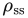
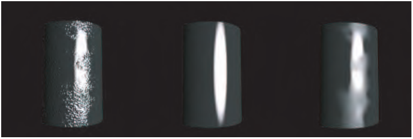
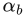
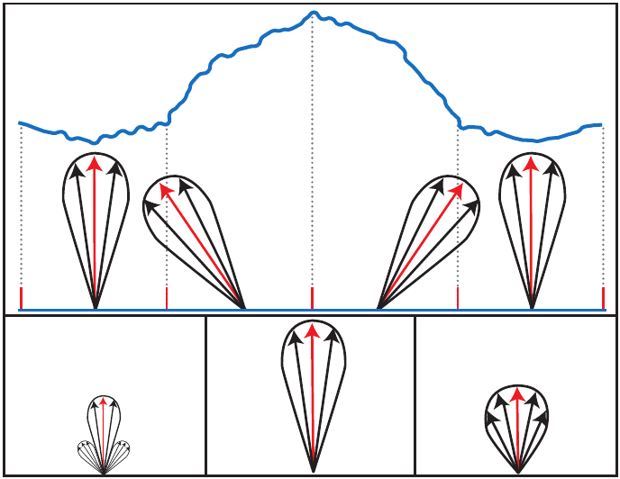
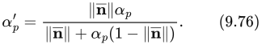
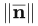
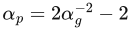
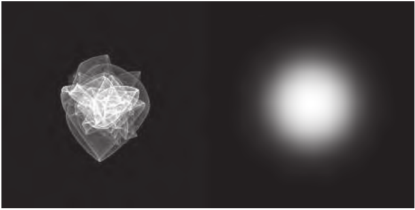

# 9.13 材质的混合与过滤

来源：《Real-Time Rendering》第 4 版，书页 365—372（PDF 物理页 386—393）；从第 9.13 节标题起，至“延伸阅读与资源”之前，包含第 9.13.1 节。章末延伸阅读另见 09.99_延伸阅读与资源.md。

材质混合是将多种材质的属性，也就是 BRDF 参数，组合起来的过程。例如，要为一张带有锈斑的金属板建模，可以绘制一张遮罩纹理来控制锈斑的位置，并利用它在铁锈与金属的材质属性之间进行混合，这些属性包括镜面反射颜色 、漫反射颜色  和粗糙度 α。参与混合的各个材质本身也可以随空间位置变化，其参数存储在纹理中。混合可以作为预处理来创建新的纹理，这通常称为“烘焙”；也可以在着色器中即时进行。严格来说，表面法线 **n** 并不是 BRDF 参数，但它的空间变化对外观十分重要，因此材质混合通常也包括法线贴图的混合。

材质混合对许多实时渲染应用都至关重要。例如，游戏《教团：1886》（The Order: 1886）具有一个复杂的材质混合系统 [1266, 1267, 1410]：用户可以从一个庞大的材质库中选取材质，创作任意深度的材质堆栈，并通过各种空间遮罩进行控制。大部分材质混合都作为离线预处理完成，但某些合成操作可按需要推迟到运行时。这类运行时处理通常用于环境，为平铺纹理增添独特的变化。广受欢迎的材质创作工具 Substance Painter 和 Substance Designer 使用类似的方法进行材质合成，纹理绘制工具 Mari 也是如此。

即时混合纹理元素既能节省内存，又能产生丰富多样的效果。游戏将材质混合用于多种用途，例如：

- 显示建筑物、载具以及活体（或不死）生物受到的动态损伤 [201, 603, 1488, 1778, 1822]。
- 允许用户自定义游戏中的装备与服装 [604, 1748]。
- 增加角色 [603, 1488] 和环境 [39, 656, 1038] 的视觉多样性。书页 891 的图 20.5 给出了一个例子。

有时，一种材质以低于 100% 的不透明度混合到另一种材质上；但即使是完全不透明的混合，遮罩边界处仍然会有一些像素需要进行部分混合；如果烘焙到纹理中，则对应的是纹素。无论哪种情况，严格正确的做法都是分别计算每种材质的着色模型，再混合计算结果。不过，先混合 BRDF 参数、再仅计算一次着色，要快得多。对于与最终着色颜色具有线性或近似线性关系的材质属性，例如漫反射颜色和镜面反射颜色参数，这种插值几乎不会引入误差，或者完全没有误差。在许多情况下，即便参数与最终着色颜色之间具有高度非线性的关系，例如镜面反射粗糙度，遮罩边界处产生的误差也不会令人难以接受。

法线贴图的混合需要特别考虑。将这一过程视为对生成这些法线贴图的高度图进行混合，通常可以取得良好效果 [1086, 1087]。在某些情况下，例如将细节法线贴图叠加到基础表面之上，其他混合方式更为合适 [106]。

材质过滤是一个与材质混合密切相关的话题。材质属性通常存储在纹理中，并通过 GPU 双线性过滤、mipmap 等机制进行过滤。然而，这些机制以一个假设为基础：被过滤的量，即着色方程的输入，与最终颜色，即着色方程的输出，具有线性关系。同样，某些量满足这种线性关系，但一般情况并非如此。对法线贴图，或对包含粗糙度等非线性 BRDF 参数的纹理，使用线性的 mipmap 方法可能会产生伪影。这些伪影可能表现为镜面反射走样，即闪烁的高光；也可能表现为表面与相机之间的距离改变时，表面光泽或亮度出现意外变化。在这两类问题中，镜面反射走样明显得多；用于减轻这些伪影的技术通常称为镜面反射抗锯齿技术。下面将讨论其中的几种方法。

**图 9.49。** 左侧圆柱使用原始法线贴图渲染。中间使用分辨率低得多的法线贴图，其中存储的是经过平均并重新归一化的法线，如图 9.50 左下所示。右侧圆柱所使用的纹理具有同样低的分辨率，但存储的是针对理想 NDF 拟合得到的法线值和光泽值，如图 9.50 右下所示。右图对原始外观的表现明显更好。在低分辨率下渲染时，这种表面也较不容易产生走样。（图片由 ILM 的 Patrick Conran 提供。）

> 译注：原书图 9.49 图注将“平均并重新归一化”的情况指向图 9.50 的“左下”。对照图 9.50 及其图注，该情况实际上位于下排中间；这里保留原文指向，并注明这一疑似排印错误。

## 9.13.1 法线与法线分布的过滤

材质过滤伪影中的绝大部分，主要是镜面反射走样，以及最常使用的相应解决方案，都与法线和法线分布函数的过滤有关。由于这一方面十分重要，我们将较深入地讨论它。

要理解这些伪影为何出现以及如何解决，首先回忆一下：NDF 是对亚像素表面结构的统计描述。当相机与表面之间的距离增加时，原本覆盖多个像素的表面结构可能会缩小到亚像素尺寸，从凹凸贴图所描述的范围转入 NDF 所描述的范围。这一转换与 mipmap 链密切相关，因为 mipmap 链封装了纹理细节缩小到亚像素尺寸的过程。

考虑如何为图 9.49 左侧圆柱这样的物体建立外观模型，以供渲染使用。外观建模总是假定一个特定的观察尺度。宏观尺度，即大尺度的几何结构，用三角形建模；中观尺度，即中等尺度的几何结构，用纹理建模；小于单个像素的微观尺度几何结构，则通过 BRDF 建模。

对于图中所示的尺度，将圆柱建模为光滑网格来表达宏观结构，并用法线贴图表达中观尺度的凹凸，是合适的。我们选择具有固定粗糙度  的 Beckmann NDF，来描述微观尺度的法线分布。这种组合表示能够很好地描述圆柱在该尺度下的外观。但是，当观察尺度改变时，会发生什么？

请仔细观察图 9.50。上方黑框中的图表示表面的一小部分，由四个法线贴图纹素覆盖。假设我们正在某个尺度下渲染表面，使每个法线贴图纹素平均被一个像素覆盖。对于每个纹素，法线，也就是分布的平均值或均值，以红色箭头表示；其周围的黑色部分表示 Beckmann NDF。法线与 NDF 隐式指定了底层的表面结构，图中以横截面显示。中间的大隆起是法线贴图中的一个凸起，细小的起伏则是微观尺度的表面结构。法线贴图中的每个纹素与粗糙度相结合，可以看作汇集了该纹素所覆盖表面区域内的法线分布。

**图 9.50。** 图 9.49 中表面的一部分。上排显示法线分布、以红色表示的平均法线，以及隐含的微观几何结构。下排显示将四个 NDF 平均成一个 NDF 的三种方式，这正是 mipmap 生成时所做的操作。左侧为真实基准，即对法线分布求平均；中间显示分别对均值（法线）和方差（粗糙度）求平均的结果；右侧显示针对平均 NDF 拟合的一个 NDF 波瓣。

现在假设相机移得离物体更远，使一个像素覆盖了法线贴图中的全部四个纹素。在这一分辨率下，理想的表面表示应准确表达每个像素所覆盖的更大表面区域内汇集的全部法线的分布。对最高分辨率 mipmap 层中四个纹素的 NDF 求平均，即可得到这一分布。左下图显示了这种理想的法线分布。如果用这一结果进行渲染，就能最准确地表现表面在较低分辨率下的外观。

下排中图显示分别对法线和粗糙度求平均的结果；法线是每个分布的均值，而粗糙度对应每个分布的宽度。结果具有正确的平均法线，以红色表示，但分布过窄。这一误差会使表面看起来过于光滑。更糟的是，由于 NDF 太窄，它容易引起走样，表现为闪烁的高光。

我们无法用 Beckmann NDF 直接表示理想的法线分布。不过，如果使用粗糙度贴图，Beckmann 粗糙度  就可以随纹素而变化。设想对于每个理想 NDF，我们都找到一个在朝向和总体宽度上与它最接近的定向 Beckmann 波瓣。我们将该 Beckmann 波瓣的中心方向存储在法线贴图中，将其粗糙度值存储在粗糙度贴图中。结果如右下所示。这一 NDF 与理想情况接近得多。与简单地对法线求平均相比，这种处理能更忠实地表示圆柱的外观，图 9.49 展示了这一点。

为了获得最佳结果，mipmap 等过滤操作应施加于法线分布，而不是法线或粗糙度值。这意味着需要以稍有不同的方式来理解 NDF 与法线之间的关系。通常，NDF 定义在由法线贴图的逐像素法线所确定的局部切线空间中。然而，当跨越不同法线对 NDF 进行过滤时，更有用的理解方式是：法线贴图与粗糙度贴图的组合，在底层几何表面的切线空间中定义了一个偏斜的 NDF，也就是其平均法线并不竖直向上的 NDF。

早期解决 NDF 过滤问题的尝试 [91, 284, 658] 使用数值优化，将一个或多个 NDF 波瓣拟合到平均分布上。这种方法存在稳健性和速度方面的问题，如今已很少使用。相反，目前使用的大多数技术通过计算法线分布的方差来工作。Toksvig [1774] 提出了一个巧妙的观察：如果对法线求平均后不重新归一化，那么平均法线的长度与法线分布的宽度负相关。也就是说，原始法线指向不同方向的程度越大，由它们平均得到的法线就越短。他提出了根据这一法线长度修改 NDF 粗糙度参数的方法。使用修改后的粗糙度计算 BRDF，可以近似表现过滤后的法线所产生的展宽效果。

Toksvig 最初的方程针对 Blinn–Phong NDF：

其中， 是原始粗糙度参数值，α′ₚ 是修改后的值， 是平均法线的长度。由于两种 NDF 的形状非常接近，利用等价关系 ，该方程也可以用于 Beckmann NDF；这一关系来自 Walter 等人 [1833]。将该方法用于 GGX 则没有这么直接，因为 GGX 与 Blinn–Phong 或 Beckmann 之间没有明确的等价关系。将针对  的等价关系用于 ，会在高光中心得到相同的数值，但高光外观却相当不同。更令人担忧的是，GGX 分布的方差没有定义，这使得这一类基于方差的技术在用于 GGX 时，理论基础并不稳固。尽管存在这些理论困难，将式（9.76）用于 GGX 分布仍相当常见，通常采用 。这种做法在实践中的效果相当不错。

Toksvig 方法的一个优点是能够考虑 GPU 纹理过滤所引入的法线方差。它还适用于最简单的法线 mipmap 生成方案，即进行线性平均而不归一化。这一特点对水面涟漪等动态生成的法线贴图尤其有用，因为这些贴图必须即时生成 mipmap。该方法对静态法线贴图则不那么理想，因为它与主流法线贴图压缩方法不能很好地配合。这些压缩方法依赖于法线具有单位长度。由于 Toksvig 方法依赖平均法线长度的变化，与该方法配合使用的法线贴图可能必须保持未压缩状态。即便如此，存储缩短后的法线仍可能带来精度问题。

Olano 和 Baker 的 LEAN 贴图技术 [1320] 基于对法线分布的协方差矩阵进行贴图。与 Toksvig 技术一样，它能很好地配合 GPU 纹理过滤与线性 mipmap 使用。它还支持各向异性的法线分布。类似于 Toksvig 方法，LEAN 贴图很适合动态生成的法线；但用于静态法线时，为了避免精度问题，它需要大量存储空间。Hery 等人 [731, 732] 独立开发了一种类似技术，并将其用于皮克斯动画电影，渲染金属薄片和细小划痕等亚像素细节。LEAN 贴图的简化变体 CLEAN 贴图 [93] 以失去各向异性支持为代价，减少了存储需求。LEADR 贴图 [395, 396] 则扩展了 LEAN 贴图，进一步考虑位移贴图对可见性的影响。

实时应用中使用的法线贴图大多是静态的，而不是动态生成的。对于这类贴图，通常采用方差贴图这一类技术。这些技术在生成法线贴图的 mipmap 链时，计算因求平均而丢失的方差。Hill [739] 指出，Toksvig 技术、LEAN 贴图和 CLEAN 贴图的数学表达形式都可以用于以这种方式预计算方差，从而消除这些技术以原始形式使用时的许多缺点。在某些情况下，预计算的方差值存储在一张独立方差纹理的 mipmap 链中。更常见的是，利用这些值修改已有粗糙度贴图的 mipmap 链。例如，《使命召唤：黑色行动》（Call of Duty: Black Ops）使用的方差贴图技术就采用了这种方法 [998]。修改后的粗糙度值通过以下过程计算：先将原始粗糙度值转换成方差值，加上法线贴图中的方差，再将结果转换回粗糙度。对于《教团：1886》，Neubelt 和 Pettineo [1266, 1267] 以类似方式使用了 Han 的一项技术 [658]。他们将法线贴图的 NDF 与其 BRDF 镜面反射项的 NDF 进行卷积，将结果转换为粗糙度，再存储到粗糙度贴图中。

付出一些额外存储空间的代价，可以分别计算纹理空间 x、y 方向上的方差，并将其存储在各向异性粗糙度贴图中，从而改善结果 [384, 740, 1823]。单独使用这项技术时，只能表示与坐标轴对齐的各向异性；这种各向异性在人造表面上很常见，在自然形成的表面上则较少。再多存储一个值，就还能支持具有任意朝向的各向异性 [740]。

与 Toksvig、LEAN 和 CLEAN 贴图的原始形式不同，方差贴图技术没有考虑 GPU 纹理过滤引入的方差。为弥补这一点，方差贴图的实现往往会用一个小型滤波器对法线贴图的最高分辨率 mip 层进行卷积 [740, 998]。组合多个法线贴图时，例如细节法线贴图 [106]，需要注意正确组合这些法线贴图的方差 [740, 960]。

法线方差既可能由法线贴图引入，也可能来自高曲率几何结构。此前讨论的技术无法减轻后者引起的伪影。另有一组方法专门处理几何法线方差。如果几何表面具有唯一的纹理映射，这在角色上很常见，在环境上则较少，就可以将几何曲率“烘焙”进粗糙度贴图 [740]。也可以使用像素着色器的导数指令即时估计曲率 [740, 857, 1229, 1589, 1775, 1823]。这一估计可在渲染几何体时进行；如果有法线缓冲区，也可在后处理通道中进行。

到目前为止讨论的方法主要关注镜面反射响应，但法线方差也会影响漫反射着色。考虑法线方差对 **n** · **l** 项的影响，有助于同时提高漫反射与镜面反射着色的准确性，因为反射积分中的两者都乘以这一因子 [740]。

方差贴图技术将法线分布近似为一个光滑的高斯波瓣。如果每个像素覆盖数十万个凹凸，使它们能够平滑地平均起来，那么这是一种合理近似。然而，在许多情况下，一个像素可能只覆盖几百或几千个凹凸，这就可能产生“闪点”外观。书页 328 的图 9.25 展示了一个例子：在这一系列球体图像中，凹凸的尺寸逐图减小。右下图显示凹凸已经小到足以平均成光滑高光时的结果；而左下图与下排中图中的凹凸虽然小于像素，却还没有小到足以平滑平均的程度。如果观察这些球体的动画渲染，带有噪声的高光就会表现为在连续帧之间忽明忽暗的闪点。

如果绘出这种表面的 NDF，其外观就会类似图 9.51 左图。随着球体运动，向量 **h** 在 NDF 上移动，经过明亮区域和黑暗区域，从而产生“闪烁”的外观。如果对这一表面使用方差贴图技术，实际上就相当于用一个类似图 9.51 右图的光滑 NDF 来近似该 NDF，因此会丢失闪烁细节。

电影行业通常通过大量超采样来解决这一问题；但这在实时渲染应用中不可行，即使在离线渲染中也不是理想做法。

**图 9.51。** 左侧是随机凹凸表面上一个小片区的 NDF，该片区每边包含几十个凹凸。右侧是宽度大致相同的 Beckmann NDF 波瓣。（图片由 Miloš Hašan 提供。）

为解决这一问题，人们已经开发出多种技术。其中一些不适合实时使用，但可能为未来研究提供方向 [84, 810, 1941, 1942]。有两种技术专为实时实现而设计。Wang 和 Bowles [187, 1837] 提出的一项技术被用于游戏《迪士尼无限 3.0》（Disney Infinity 3.0），以渲染闪烁的积雪。这项技术旨在产生可信的闪烁外观，而不是模拟某个特定 NDF。它针对雪这类闪点相对稀疏的材质。Zirr 和 Kaplanyan 的技术 [1974] 则在多个尺度上模拟法线分布，在空间和时间上都具有稳定性，并允许实现更丰富的外观。

我们没有足够篇幅涵盖关于材质过滤的大量文献，因此这里只列出几个值得注意的参考资料。Bruneton 等人 [204] 提出了一项技术，用于处理海洋表面从几何到 BRDF 各尺度上的方差，并包括环境光照。Schilling [1565] 讨论了一种类似方差贴图的技术，支持使用环境贴图进行各向异性着色。Bruneton 和 Neyret [205] 对这一领域的早期工作作了全面综述。

