# 10.3 球面函数与半球面函数

本节来源：《Real-Time Rendering, Fourth Edition》书页392—404（PDF物理页413—425），自10.3节标题起，止于10.4节标题之前；包含全部下级小节。图中英文标签保留，图注完整译出。

为了将环境光照扩展到常量项之外，我们需要一种方法来表示从任意方向到达物体的入射辐亮度。首先，我们只把辐亮度视为所积分方向的函数，而不考虑表面位置。这种做法基于一个假设：光照环境位于无穷远处。

到达给定点的辐亮度，对于每个入射方向都可能不同。光照可能从左侧射来时是红色，从右侧射来时是绿色；也可能上方的光被遮挡，侧面的光却没有被遮挡。这类量可以用球面函数表示，其定义域是单位球面，或者说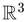中的方向空间。我们把这个定义域记作S。函数输出一个值还是多个值，并不影响这些函数的工作方式。例如，通过为每个颜色通道分别存储一个标量函数，存储标量函数的同一种表示也能用来编码颜色值。

假设表面是朗伯表面，那么可以通过存储预计算的辐照度函数来使用球面函数计算环境光照，例如，对每一种可能的表面法线方向，存储辐亮度与余弦瓣卷积的结果。更复杂的方法则存储辐亮度，并在运行时为每个需要着色的表面点计算它与BRDF的积分。球面函数也广泛用于全局光照算法（第11章）。

与球面函数相关的还有半球面函数，它们适用于只定义了一半方向取值的情况。例如，当表面下方没有光线射来时，就会用这些函数描述表面处的入射辐亮度。我们将这些表示统称为“球面基”，因为它们是定义在球面上的函数向量空间的基。尽管环境光/高光/方向表示（10.3.3节）严格说来并不是数学意义上的基，为了简便，我们也用这个术语称呼它。把函数转换为某种给定表示称为“投影”，从给定表示求出函数值则称为“重建”。

每种表示都有自身的取舍。我们可能希望一种基具备以下性质：

- 高效的编码（投影）与解码（查找）。
- 仅用少量系数、以较低重建误差表示任意球面函数的能力。
- 投影的旋转不变性，即旋转函数投影所得的结果，与先旋转函数再投影所得的结果相同。这种等价性意味着，例如用球谐函数近似表示的函数，在旋转时不会发生变化。
- 容易计算已编码函数的和与积。
- 容易计算球面积分与卷积。

## 10.3.1 简单查表表示

表示球面函数（或半球面函数）最直接的方法，是选择若干方向，并为每个方向存储一个值。求函数值时，先找到求值方向周围的若干样本，再通过某种插值形式重建该值。

这种表示既简单，又具有很强的表达能力。对这样的球面函数做加法或乘法，只需对相应表项做加法或乘法。按需增加样本，就能以任意低的误差编码许多不同的球面函数。

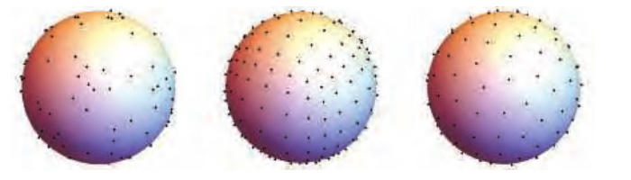

图10.17　在球面上分布点的几种不同方法。从左到右：随机点、立方体网格点、球面t设计（spherical t-design）。

要在球面上分布样本（见图10.17），使其既能高效检索，又能相对均等地表示各个方向，并不容易。最常用的技术是先把球面展开到矩形定义域，再用规则点网格对该定义域采样。二维纹理所表示的恰好就是矩形上的点网格（纹素），因此可以用纹素作为样本值的底层存储。这使我们能够借助GPU加速的双线性纹理过滤，实现快速查找（重建）。本章稍后将讨论环境贴图（10.5节），它们正是采用这种形式的球面函数；届时还会讨论展开球面的不同方案。

查表表示也有不足。在低分辨率下，硬件过滤提供的质量往往无法接受。卷积是处理光照时常见的运算，其计算复杂度与样本数量成正比，开销可能高得难以承受。此外，这种投影不具有旋转不变性，在某些应用中会造成问题。例如，设想把一组方向射来、照到物体表面的光的辐亮度进行编码。当物体旋转时，编码结果的重建可能发生变化。这会导致编码所表示的辐射能量变化，在场景动画中表现为脉动伪影。在投影和重建时，为每个样本采用精心构造的核函数，可以减轻这些问题。不过，更常见的做法是直接采用足够密集的采样，以掩盖这些问题。

通常，当需要存储复杂的高频函数，而且只有使用大量数据点才能以低误差编码时，我们会使用查表表示。如果需要只用少量参数紧凑地编码球面函数，就可以使用更复杂的基。

一种常用的基是环境立方体（ambient cube，AC）。它是最简单的查表形式之一，由沿主要坐标轴定向的六个平方余弦瓣构成[1193]。之所以称为环境“立方体”，是因为它等价于在立方体各面中存储数据，并在从一个方向移向另一个方向时进行插值。对于任何给定方向，只有三个瓣与之相关，因此不必从内存中读取另外三个瓣的参数[766]。在数学上，环境立方体可定义为

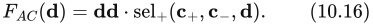

其中，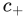和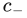包含立方体六个面的六个值；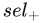(, , d)是一个向量函数，其每个分量根据d中相应分量是否为正，从或中选取值。译注：式中的dd表示逐分量相乘。

环境立方体类似于每个立方体面上只有一个纹素的立方体贴图（10.4节）。在某些系统中，针对这一特例用软件执行重建，可能比使用GPU对立方体贴图进行双线性过滤更快。Sloan[1656]推导了一种简单公式，用于在环境立方体与球谐基（10.3.2节）之间转换。

环境立方体的重建质量相当低。若改为存储并插值对应立方体顶点的八个值，而非六个值，结果会稍好一些。较近的时候，Iwanicki和Sloan[808]提出了一种名为环境骰子（ambient dice，AD）的替代方案。它的基由沿二十面体顶点方向定向的平方余弦瓣和四次方余弦瓣构成。重建时需要读取所存十二个值中的六个；确定读取哪六个值的逻辑，比环境立方体的相应逻辑稍复杂，但结果质量要高得多。

## 10.3.2 球面基

把函数投影（编码）到使用固定数量数值（系数）的表示中，有无穷多种方法。我们只需要一个带有可调参数、覆盖球面定义域的数学表达式。随后就可以通过拟合来近似任何给定的目标函数，也就是找到使该表达式与给定函数之间误差最小的参数值。

最简的选择是使用一个常量：

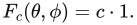

通过在单位球面的整个面积上求平均，可以得到给定函数f在这个基上的投影：

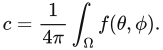

周期函数的平均值c也称为直流分量（DC component）。这个基的优点是简单，而且也满足我们所希望的部分性质（容易重建、相加、相乘，以及旋转不变性）。但是，它只是用平均值替换原函数，因此不能很好地表达大多数球面函数。利用两个系数a和b，可以构造稍复杂的近似：

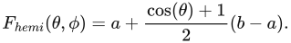

这种表示能够精确编码两极处的值，并在球面上对二者插值。这种选择的表达能力更强，但投影也变得更复杂，而且不再对所有旋转保持不变。实际上，这个基也可以看成只有两个样本、分别位于两极的查表形式。

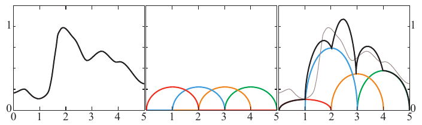

图10.18　基函数的一个基本示例。这里的空间是“输入在0到5之间、取值在0到1之间的函数”。左图给出这种函数的一个例子。中图是一组基函数（每种颜色代表一个不同的函数）。右图把各基函数乘以权重后求和，形成对目标函数的近似。图中的基函数已经按各自权重缩放。黑线表示求和结果，即对原函数的近似；原函数以灰色显示，以便比较。

一般而言，谈到函数空间的基时，我们指的是一组函数，它们的线性组合（加权求和）可用于表示给定定义域上的其他函数。图10.18给出了这一概念的例子。本节余下部分将探讨一些可用于近似球面函数的基。

### 球面径向基函数

利用GPU硬件过滤的查表形式，其重建质量低，至少在一定程度上是由样本插值采用的双线性形函数造成的。重建时，也可以用其他函数为样本加权。这些函数可能比双线性过滤产生更高质量的结果，还可能具备其他优点。常用于这一目的的一类函数是球面径向基函数（spherical radial basis functions，SRBF）。它们具有径向对称性，因此只依赖一个自变量：定向轴与求值方向之间的夹角。由分布在球面上的一组这样的函数（称为瓣）构成基。一个函数的表示由各瓣的一组参数组成。这组参数可以包含瓣的方向，但那会使投影困难得多（需要非线性全局优化）。因此，通常假设瓣的方向固定，并均匀分布在球面上，而使用其他参数，例如各瓣的幅度或展宽，即所覆盖的角度。重建时，在给定方向上对所有瓣求值，然后将结果相加。

### 球面高斯函数

球面高斯函数（spherical Gaussian，SG）是SRBF瓣的一种特别常见的选择，在方向统计学中也称为von Mises-Fisher分布。需要指出，von Mises-Fisher分布通常包含一个归一化常数，而我们的公式省略了它。单个瓣可以定义为

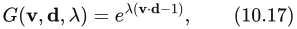

其中，v是求值方向（单位向量），d是瓣的方向轴（分布的均值，同样已归一化），λ ≥ 0是瓣的锐度，用于控制其角宽，也称为集中参数或展宽[1838]。

随后，使用给定数量球面高斯函数的线性组合来构造球面基：

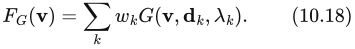

将球面函数投影到这种表示中，需要找到使重建误差最小的参数集合{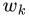, 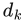, 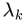}。这一过程通常通过数值优化完成，经常使用非线性最小二乘优化算法（例如Levenberg-Marquardt算法）。注意，如果优化过程中允许全部参数变化，就不再是在使用函数的线性组合，因此式10.18并不表示一个基。只有选定一组固定的瓣（方向与展宽），使其良好覆盖整个定义域[1127]，并且仅通过拟合权重进行投影，才能得到真正的基。这样也大大简化了优化问题，因为此时可以将其写成普通最小二乘优化。如果需要在不同数据集（已投影函数）之间插值，这也是一个很好的方案。在这种情况下，允许瓣的方向和锐度变化是不利的，因为这些参数具有很强的非线性。

这种表示的一个优点是，SG上的许多运算都具有简单的解析形式。两个球面高斯函数的乘积仍是球面高斯函数（见[1838]）：

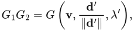

其中

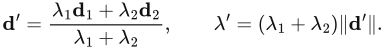

球面高斯函数在球面上的积分也可以解析计算：

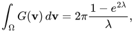

这意味着两个球面高斯函数乘积的积分也具有简单的表达式。

> 译注（原书公式疑点）：以上乘积与积分均按书页397的排印保留。按式10.17的定义，乘积右端还需乘以幅度因子exp(λ′ − 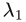 − 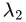)；积分分子中的指数应为−2λ，原书印为2λ。λ = 0时积分取极限4π；若 + 或d′的长度为零，乘积的方向归一化也须按退化情况处理。此处未暗改原式。

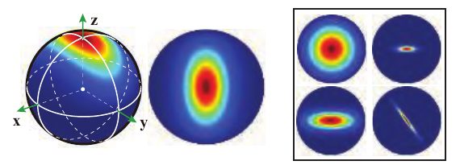

图10.19　各向异性球面高斯函数。左：球面上的一个ASG及其对应的俯视图。右：另外四种ASG配置示例，展示了这一表达式的表达能力。（图片由Xu Kun提供。）

如果能用球面高斯函数表示光的辐亮度，就可以对它与采用同样表示编码的BRDF之积进行积分，从而完成光照计算[1408, 1838]。基于这些原因，SG已用于许多研究项目[582, 1838]以及工业应用[1268]。

与平面上的高斯分布一样，von Mises-Fisher分布也可以推广到各向异性的情况。Xu等人[1940]引入了各向异性球面高斯函数（anisotropic spherical Gaussian，ASG；见图10.19）。其定义是在单个方向d之外增加两个辅助轴t和b，三者共同形成一个标准正交切线标架：

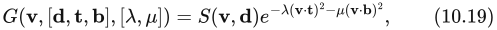

其中，λ, μ ≥ 0控制瓣沿切线标架两个轴的展宽，而S(v, d) = 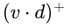是平滑项。这个项是方向统计学中使用的Fisher-Bingham分布与计算机图形学所用ASG之间的主要区别。Xu等人还给出了积分、乘积和卷积算子的解析近似。

SG虽然具有许多理想性质，但也有一个缺点：与查表形式以及一般具有有限范围（带宽）的核不同，它们具有全局支撑。每个瓣在整个球面上都非零，尽管其衰减相当迅速。这种全局范围意味着，若用N个瓣表示一个函数，则在任何方向上重建时都需要全部N个瓣。

### 球谐函数

球谐函数（spherical harmonics，SH）注2是球面上的一组正交基函数。一组基函数正交，是指集合中任意两个不同函数的内积都为零。内积是比点积更一般、但与之类似的概念。两个向量的内积就是点积，即对应分量两两相乘后求和。同样，通过考虑两个函数相乘后的积分，可以得到函数内积的定义：

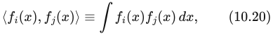

其中，积分在相应定义域上进行。对于图10.18中的函数，定义域是x轴上的0到5（注意，这一特定函数集合并不正交）。球面函数的形式稍有不同，但基本概念相同：

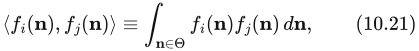

其中，n ∈ Θ表示积分在单位球面上进行。

标准正交集合是在正交集合的基础上，再要求集合中任意函数与自身的内积等于1。更形式化地，函数集合{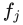()}为标准正交集合的条件是

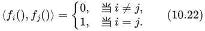

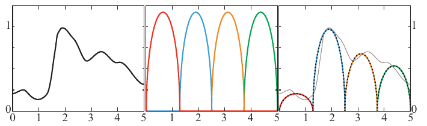

图10.20　标准正交基函数。本例使用与图10.18相同的空间和目标函数，但把基函数修改为标准正交函数。左图显示目标函数，中图显示标准正交基函数集合，右图显示缩放后的基函数。对目标函数的最终近似用黑色点线表示，原函数用灰色显示以便比较。

图10.20给出了与图10.18类似的例子，只是基函数是标准正交的。注意，图10.20中的标准正交基函数彼此不重叠。对于由非负函数构成的标准正交集合，这一条件是必需的，因为任何重叠都会意味着非零内积。如果函数在部分取值范围内为负，那么它们可以重叠，仍然构成标准正交集合。这种重叠通常能带来更好的近似，因为它允许基保持平滑。定义域互不相交的基往往会造成不连续。

**注2：** 这里讨论的基函数更准确地说应称为“实球谐函数”，因为它们表示复值球谐函数的实部。

标准正交基的优点是，寻找与目标函数最接近的近似这一过程非常直接。投影时，每个基函数的系数，就是目标函数与相应基函数的内积：

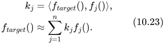

实践中，这一积分必须用数值方法计算，通常采用蒙特卡洛采样，对均匀分布在球面上的n个方向取平均。

标准正交基在概念上类似于4.2.4节介绍的三维向量“标准基”。标准基的目标不是一个函数，而是点的位置。标准基由三个向量（每维一个）组成，而非一组函数。按照式10.22采用的定义，标准基也是标准正交的。把点投影到标准基的方法也相同，因为系数就是位置向量与各基向量的点积。一个重要区别在于，标准基能精确复现每个点，而有限个基函数只能近似目标函数。结果不能始终精确：标准基使用三个基向量表示三维空间，而函数空间有无穷多个维度，因此有限个基函数不可能完美表示整个函数空间。

球谐函数既正交又标准正交，而且还有其他一些优点。它们具有旋转不变性，SH基函数的求值开销也很低。它们是单位长度向量的x、y、z坐标的简单多项式。然而，与球面高斯函数一样，它们具有全局支撑，所以重建时必须对全部基函数求值。基函数表达式可在多份参考资料中找到，包括Sloan的一份演讲材料[1656]。这份材料尤其值得关注，因为它讨论了许多使用球谐函数的实用技巧，包括公式，以及某些情况下的着色器代码。后来，Sloan还推导了执行SH重建的高效方法[1657]。

SH基函数按频带排列。第一个基函数是常量，接下来三个是在球面上缓慢变化的线性函数，再接下来五个是变化稍快的二次函数。见图10.21。低频函数（即在球面上变化缓慢的函数），例如辐照度值，可以用相对少量的SH系数准确表示（10.6.1节将会说明）。

投影到球谐函数时，得到的系数表示被投影函数中各个频率的幅度，也就是它的频谱。在这个频谱域中，一个基本性质成立：两个函数乘积的积分，等于这两个函数投影系数的点积。这一性质使我们能够高效计算光照积分。

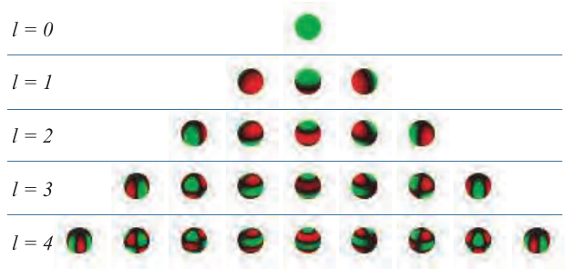

图10.21　球谐函数的前五个频带。每个球谐函数都有正值区域（绿色）与负值区域（红色），接近零时颜色渐变为黑色。（球谐函数可视化图片由Robin Green提供。）

球谐函数的许多运算在概念上很简单，归结为对系数向量进行矩阵变换[583]。其中的重要情况包括：计算投影到球谐函数的两个函数的乘积、旋转已投影函数，以及计算卷积。在实践中，SH中的矩阵变换意味着这些运算的复杂度与所用系数数量的平方成正比，成本可能相当高。幸运的是，这些矩阵往往具有特殊结构，可以利用它们设计更快的算法。Kautz等人[869]提出了一种优化旋转计算的方法，把旋转分解为绕x轴和z轴的旋转。Hable[633]给出了一种常用的低阶SH投影快速旋转方法。Green的综述[583]讨论了如何利用旋转矩阵的分块结构加快计算。当前最先进的方法，是Nowrouzezahrai等人[1290]提出的分解为带谐函数（zonal harmonics）的做法。

球谐函数以及下文介绍的H基等频谱变换，有一个常见问题：可能出现称为振铃（也称吉布斯现象）的视觉伪影。如果原始信号包含带限近似无法表示的快速变化，重建就会出现振荡。在极端情况下，重建函数甚至可能产生负值。可以采用各种预过滤方法来应对这一问题[1656, 1659]。

### 其他球面表示

还有许多其他表示，可以用有限个系数编码球面函数。线性变换余弦（10.1.2节）就是一例，它可以高效近似BRDF函数，同时具备容易在球面的多边形区域上积分的性质。

球面小波[1270, 1579, 1841]是一种兼顾空间局部性（具有紧支撑）与频率局部性（平滑性）的基，可以对高频函数进行压缩表示。将球面划分为常值区域的球面分段常数基函数[1939]，以及依赖矩阵分解的双聚类近似[1723]，也已经用于环境光照。

## 10.3.3 半球面基

尽管上述基可用于表示半球面函数，但会造成浪费：一半信号始终等于零。在这种情况下，通常更倾向于使用直接建立在半球面定义域上的表示。对于定义在表面上的函数，这一点尤其重要：BRDF、入射辐亮度，以及到达物体给定点的辐照度，都是常见例子。这些函数天然局限于以给定表面点为中心、沿表面法线定向的半球面；对于指向物体内部的方向，它们没有取值。

### 环境光/高光/方向

这类表示中最简单的一种，是把常量函数与半球面上信号最强的单一方向结合起来。它通常称为环境光/高光/方向（ambient/highlight/direction，AHD）基，最常用于存储辐照度。AHD这个名称说明了各组成部分所表示的含义：恒定的环境光，加上一盏用于近似“高光”方向辐照度的方向光，以及大部分入射光集中的方向。AHD基通常需要存储八个参数：方向向量用两个角度，环境光与方向光的强度用两个RGB颜色。它最早引人注目的应用是在游戏《雷神之锤III》中，动态物体的体积光照就是以这种方式存储的。此后，它被用于多款游戏，例如《使命召唤》系列中的作品。

投影到这种表示有些棘手。由于它是非线性的，寻找近似给定输入的最优参数，计算成本很高。实践中会改用启发式方法。首先把信号投影到球谐函数，再用最优线性方向为余弦瓣定向。给定方向后，环境光值与高光值可以通过最小二乘最小化计算。Iwanicki和Sloan[809]说明了如何在强制非负约束的同时完成这一投影。

### 辐射度法线贴图/《半条命2》基

Valve在《半条命2》系列游戏中使用了一种新颖表示，在辐射度法线贴图的语境下表达方向性辐照度[1193, 1222]。它最初为存储预计算漫反射光照、同时允许使用法线贴图而设计，现在通常称为《半条命2》基。它通过采样切线空间中的三个方向，表示表面上的半球面函数。见图10.22。这三个互相垂直的基向量在切线空间中的坐标为

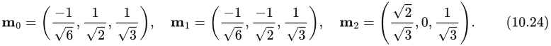

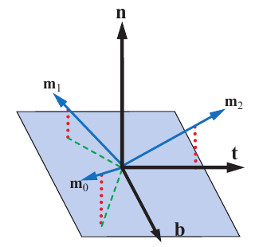

图10.22　《半条命2》的光照基。三个基向量与切平面的仰角约为26°，它们在切平面上的投影绕法线以120°等间隔分布。它们都是单位长度，并且每个向量都与另外两个垂直。

> 译注（原书图注疑点）：图注的“约26°”照原文保留，但由式10.24的法线分量1/√3计算，仰角应约为35.26°。下文文字使用方向d，而公式使用n，亦保留原书符号。

重建时，给定切线空间方向d，我们可以对沿三个基向量的值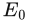、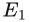和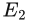进行插值：注3

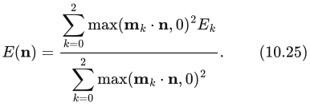

Green[579]指出，如果改为针对切线空间方向d预计算下面三个值，就能显著降低式10.25的成本：

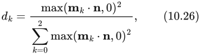

其中k = 0, 1, 2。式10.25于是简化为

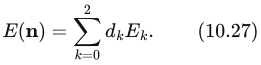

Green还介绍了这种表示的其他一些优点，其中部分将在11.4节讨论。

《半条命2》基对方向性辐照度表现良好。Sloan[1654]发现，这种表示产生的结果优于低阶半球谐函数。

**注3：** GDC 2004演讲材料给出的公式有误。式10.25的形式来自SIGGRAPH 2007的一份演讲材料[579]。

### 半球谐函数/H基

Gautron等人[518]将球谐函数专门化到半球面定义域，称之为半球谐函数（hemispherical harmonics，HSH）。实现这种专门化有多种方法。

例如，Zernike多项式与球谐函数一样是正交函数，但定义在单位圆盘上。与SH一样，它们可用于将函数变换到频域（频谱），从而获得一些方便的性质。由于能将单位半球面变换为圆盘，因此可以用Zernike多项式表达半球面函数[918]。不过，用它们执行重建相当昂贵。Gautron等人的方案既更经济，又允许通过对系数向量做矩阵乘法，实现相对快速的旋转。

不过，HSH基的求值仍比球谐函数昂贵，因为它是通过把球面的负极移到半球面的外缘来构造的。这种偏移操作使基函数不再是多项式，需要计算除法和平方根，而这些运算在GPU硬件上通常较慢。此外，基在半球边缘始终为常量，因为边缘在偏移之前映射到球面上的同一个点。边缘附近的近似误差可能很大，尤其是在只使用少量系数（球谐频带）时。

Habel[627]引入了H基，经度参数化采用一部分球谐基，纬度参数化采用一部分HSH基。这个基混合了偏移与未偏移的SH版本，在允许高效求值的同时，仍然保持正交。

