# 10.5 基于图像的镜面光照

来源：《Real-Time Rendering》第 4 版，书页 414—424（PDF 物理页 435—445）；从 10.5 节标题开始，至 10.6 节标题之前，包含 10.5.1—10.5.3 全部下级内容。图内英文标签保留原图，图注完整译为中文。

环境映射最初是为渲染镜面般的表面而开发的技术，但也可以扩展到有光泽的反射。当用来模拟无限远光源产生的一般镜面效果时，环境贴图也称为**镜面光照探针**。之所以使用这个术语，是因为它们在场景中的一个给定点捕获来自所有方向的辐亮度（也就是进行探测），并利用这些信息求值一般的 BRDF，而不只局限于理想镜面或朗伯表面这两种特殊情况。对于将环境光照存储在立方体贴图中，并对贴图进行处理以模拟有光泽材质反射的常见情况，也使用**镜面立方体贴图**这一名称。

为了模拟表面粗糙度，可以对纹理中的环境表示进行**预过滤** [590]。通过模糊环境贴图纹理，我们可以呈现比理想镜面反射看起来更粗糙的镜面反射。这种模糊应以非线性的方式进行，也就是说，纹理的不同部分应采用不同的模糊方式。之所以需要这种调整，是因为环境贴图的纹理表示与理想的球面方向空间之间是非线性映射。两个相邻纹素中心之间的角距离不是常数，单个纹素所覆盖的立体角也不是常数。专门用于预处理立方体贴图的工具，例如 AMD 的 CubeMapGen（现已开源），在过滤时会考虑这些因素。它们会使用其他面上的相邻样本来创建 mipmap 链，并把每个纹素的角范围考虑在内。图 10.33 给出了一个例子。

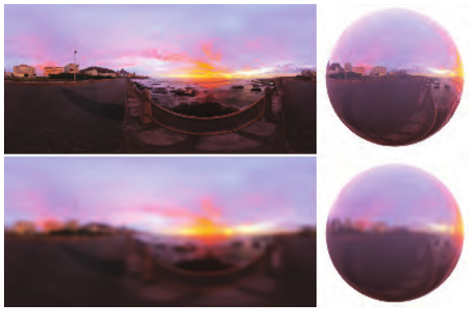

**图 10.33** 上排：原始环境贴图（左）及其应用于球体的着色结果（右）。下排：用高斯核模糊同一幅环境贴图，以模拟粗糙材质的外观。

模糊环境贴图虽然在经验上接近粗糙表面的外观，但与实际的 BRDF 并没有联系。更有理论依据的方法，是考虑在给定表面法线和观察方向时，BRDF 函数在球面上呈现的形状，然后利用这一分布过滤环境贴图。见图 10.34。用镜面波瓣过滤环境贴图并不简单，因为 BRDF 会随粗糙度参数以及观察向量、法线向量的不同而呈现各种形状。至少有五个维度的输入值控制最终的波瓣形状：粗糙度，以及观察方向和法线方向各自的两个极坐标角。针对这些输入的每一种选择都存储若干幅环境贴图，是不可行的。

## 10.5.1 预过滤环境映射

将环境光照预过滤用于有光泽材质的实际实现，需要近似所使用的 BRDF，使生成的纹理独立于观察向量和法线向量。如果把 BRDF 的形状变化限制为仅由材质光泽度决定，就可以计算并存储少量对应不同粗糙度参数选择的环境贴图，在运行时选择合适的一幅。实际上，这意味着把所使用的模糊核，也就是波瓣形状，限制为围绕反射向量径向对称。

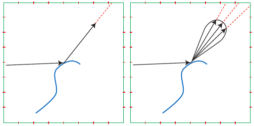

**图 10.34** 左图展示一条视线光线在物体上反射，从环境纹理（这里是立方体贴图）取得理想镜面反射。右图展示反射视线光线的镜面波瓣，用它对环境纹理进行采样。绿色正方形表示立方体贴图的一个截面，红色刻线表示纹素之间的边界。

设想有一些光从某个给定的反射视线方向附近入射。恰好来自反射视线方向的光贡献最大；入射光方向与反射视线方向的差异越大，其贡献越小。环境贴图纹素的面积乘以该纹素的 BRDF 贡献，给出该纹素的相对影响。将这一加权贡献乘以环境贴图纹素的颜色，再把结果相加，得到 **q**。同时计算加权贡献的总和 s。最终结果 **q**/s 是在反射视线方向的波瓣上积分得到的总体颜色，并被存入生成的反射贴图。

如果采用 Phong 材质模型，径向对称假设自然成立，因此几乎可以精确计算环境光照。Phong [1414] 通过经验推导出了他的模型；与我们在第 9.8 节看到的 BRDF 不同，这个模型没有物理依据。Phong 模型和第 9.8.1 节讨论的 Blinn-Phong [159] BRDF，都是余弦波瓣的幂，但在 Phong 着色中，余弦由反射向量（式 9.15）与观察向量的点积构成，而不是半程向量（见式 9.33）与法线的点积。这使反射波瓣具有旋转对称性。见书页 338 的图 9.35。

在采用径向对称镜面波瓣时，仍无法处理的唯一效果是**地平线裁剪**，因为它会使波瓣形状依赖观察方向。想象观察一个有光泽、但不是镜面的球体。看向球体表面的中心附近时，得到的可以是一个对称的 Phong 波瓣。而观察接近球体轮廓的表面时，实际上必须切去波瓣的一部分，因为地平线以下的光不可能到达眼睛。见图 10.35。这与此前讨论区域光照近似（第 10.1 节）时遇到的是同一个问题，实际的实时方法常常忽略它。这样做可能导致掠射角处的着色过亮。

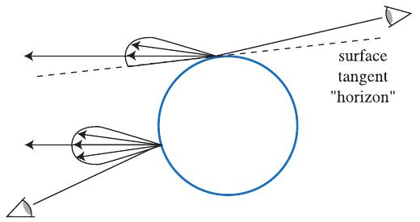

**图 10.35** 两位观察者观察一个有光泽的球体。球体上的不同位置为两位观察者给出相同的反射视线方向。左侧观察者对应的表面反射采样一个对称波瓣。右侧观察者对应的反射波瓣必须被表面自身的地平线截断，因为光不可能从表面地平线以下反射出来。

Heidrich 和 Seidel [704] 以这种方式使用一幅反射贴图，模拟表面的模糊程度。为了适应不同粗糙度，通常使用环境立方体贴图的 mipmap（第 6.2.2 节）。各层存储入射辐亮度的模糊版本，较高的 mip 层存储较粗糙表面对应的结果，也就是较宽的 Phong 波瓣 [80, 582, 1150, 1151]。运行时，可以使用反射向量访问立方体贴图，并根据所需的 Phong 指数（材质粗糙度）强制选择指定的 mip 层。见图 10.36。

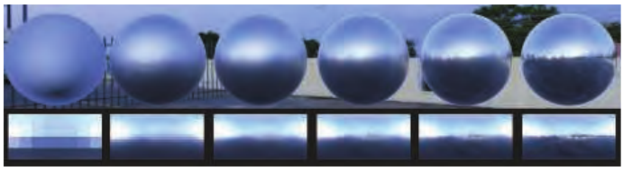

**图 10.36** 环境贴图预过滤。将一幅立方体贴图与不同粗糙度的 GGX 波瓣卷积，并将结果存储在纹理的 mip 链中。从左到右粗糙度逐渐降低；下方显示生成的纹理 mip 层，上方则是沿反射向量方向访问这些层后渲染出的球体。

较粗糙材质使用的较宽过滤区域会去除高频，因此只需较低分辨率就能得到足够好的结果，这与 mipmap 结构完全吻合。此外，借助 GPU 硬件的三线性过滤，可以在预过滤的 mip 层之间采样，模拟没有精确存储表示的粗糙度值。结合菲涅耳项后，这样的反射贴图能够为有光泽表面产生相当可信的效果。

出于性能和走样方面的考虑，选择使用哪个 mipmap 层时，不仅应考虑着色点的材质粗糙度，还应考虑正在着色的屏幕像素足迹所覆盖表面区域内，法线与粗糙度的变化。Ashikhmin 和 Ghosh [80] 指出，为获得最佳结果，应比较两个候选 mipmap 层的索引：一个是纹理硬件计算的缩小层级，另一个是当前过滤宽度对应的层级，并使用其中分辨率较低的 mipmap 层索引。更准确的做法是考虑表面方差造成的波瓣展宽效果，使用一个新的粗糙度级别，使其对应的 BRDF 波瓣最贴近像素足迹内各个波瓣的平均值。这个问题与 BRDF 抗锯齿（第 9.13.1 节）完全相同，也适用相同的解决方法。

前述过滤方案假设，对于给定的反射视线方向，所有波瓣都具有相同的形状和高度。这一假设也意味着波瓣必须径向对称。除了地平线处的问题，大多数 BRDF 并非在所有角度下都具有均匀的径向对称波瓣。例如，在掠射角下，波瓣往往变得更尖、更细。此外，波瓣的长度通常会随仰角变化。

在曲面上，这种效果通常不易察觉。然而，对于地板等平面表面，径向对称过滤器可能引入明显的误差。（见书页 338 的图 9.35。）

### 对环境贴图进行卷积

生成预过滤环境贴图，意味着对每个对应方向 **v** 的纹素，计算环境辐亮度与镜面波瓣 D 的积分：

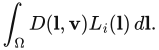

这个积分是一个**球面卷积**，通常无法用解析方法完成，因为对于环境贴图，我们只知道  的表格形式。一种常用的数值解决方法是采用蒙特卡洛方法：

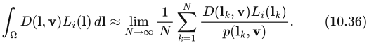

其中，k = 1, 2, …, N 时的 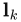 是单位球面上的离散样本（方向），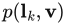 是与生成方向  上样本相关的概率函数。如果对球面均匀采样，那么始终有 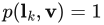。虽然这个求和对每个需要积分的方向 **v** 都成立，但把结果存入环境贴图时，还必须考虑投影施加的畸变，按照每个计算所得纹素所张的立体角对其加权（见 Driscoll [376]）。

> 译注：原文保留了式（10.36）中的“≈”与极限并用，以及均匀采样时 p = 1 的写法。若 p 指相对于通常立体角测度的单位球面概率密度，则应为 1/(4π)；p = 1 需要采用归一化球面测度。这里不暗改原式，使用时需统一积分测度与概率密度的归一化约定。

蒙特卡洛方法虽然简单而且正确，却可能需要大量样本才能收敛到积分的数值，即使作为离线过程也可能很慢。这对于 mipmap 的最初几层尤其明显，这些层编码较窄的镜面波瓣（Blinn-Phong 对应高指数，Cook-Torrance 对应低粗糙度）。我们不仅有更多纹素需要计算，因为需要足够分辨率来存储高频细节，而且对于不接近理想反射方向的方向，波瓣值可能几乎为零。大多数样本都被“浪费”了，因为对它们而言，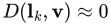。

为了避免这种现象，可以采用重要性采样，按照尽量匹配镜面波瓣形状的概率分布生成方向。这是蒙特卡洛积分中常见的**方差缩减**技术，大多数常用波瓣都有相应的重要性采样策略 [279, 878, 1833]。为得到效率更高的采样方案，还可以将环境贴图中的辐亮度分布与镜面波瓣形状联合考虑 [270, 819]。不过，所有依赖点采样的技术通常都只用于离线渲染和真值模拟，因为一般需要数百个样本。

为了进一步降低采样方差（也就是噪声），还可以估计样本之间的距离，使用一组圆锥的求和来积分，而不是使用单个方向。对环境贴图进行圆锥采样，可以近似为对某个 mip 层进行点采样：选择纹素尺寸所张立体角与圆锥立体角相近的层级 [280]。这样做会引入偏差，却可以显著减少得到无噪声结果所需的样本数。借助 GPU，这种采样可以达到交互速度。

McGuire 等人 [1175] 同样利用面积样本，开发了一种旨在实时近似镜面波瓣卷积结果、无需预计算的技术。它通过巧妙混合未经预过滤的环境立方体贴图的多个 mipmap 层，重建 Phong 波瓣形状。类似地，Hensley 等人 [718, 719, 720] 使用求和区域表（第 6.2.2 节）快速完成这种近似。严格来说，McGuire 等人和 Hensley 等人的技术都并非完全不需要预计算：渲染环境贴图之后，前者仍需生成 mip 层，后者仍需生成前缀和。两种情况都有高效算法，因此所需预计算远快于执行完整的镜面波瓣卷积。这两种技术都足够快，甚至可以实时用于环境光照下的表面着色，但其精度不如依赖专门预过滤的其他方法。

Kautz 等人 [868] 提出了另一个变体，即快速生成经过过滤的抛物面反射贴图的层次化技术。较近时期，Manson 和 Sloan [1120] 使用高效的二次 B 样条过滤方案生成环境贴图的 mip 层，显著推进了当时的技术水平。然后，以类似 McGuire 等人和 Kautz 等人技术的方式，将这些专门计算的 B 样条过滤 mip 层中的少量样本组合起来，得到快速而准确的近似。这样便可以实时生成与使用重要性采样蒙特卡洛技术计算的真值无法区分的结果。

快速卷积技术允许实时更新预过滤立方体贴图；当待过滤环境贴图是动态渲染的时，这是必需的。使用环境贴图往往会使物体难以在不同光照条件之间移动，例如从一个房间移到另一个房间。立方体环境贴图可以逐帧（或每隔几帧）即时重新生成，因此，如果采用高效过滤方案，换入新的镜面反射贴图就相对廉价。

除了重新生成完整环境贴图，还可以把动态光源产生的镜面高光叠加到静态的基础环境贴图上。新增高光可以是预过滤的“光斑”，叠加到预过滤的基础环境贴图上。这样就无需在运行时进行任何过滤。其局限来自环境映射的假设：光源和被反射物体都在远处，因此不会随被观察物体的位置而变化。这些要求意味着局部光源不容易使用。

如果几何体是静态的，但某些光源（例如太阳）会移动，那么一种低成本的探针更新技术，是将表面属性（位置、法线、材质）存储在 **G 缓冲环境贴图**中，它不需要把场景动态渲染到立方体贴图。第 20.1 节将详细讨论 G 缓冲。然后利用这些属性计算表面出射辐亮度，并写入环境贴图。《使命召唤：无限战争》[384]、《巫师 3》[1778] 和《孤岛惊魂 4》[1154] 等游戏都使用过这一技术。

## 10.5.2 微表面 BRDF 的分离积分近似

环境光照非常有用，因此人们开发了许多技术，以减轻立方体贴图预过滤固有的 BRDF 近似问题。

到目前为止，我们描述的近似方法都是假设一个 Phong 波瓣，然后再乘上理想镜面的菲涅耳项：

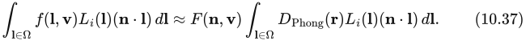

其中，对每个 **r** 预计算 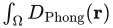，并存入环境立方体贴图。如果考虑书页 337 式 9.34 给出的镜面微表面 BRDF 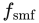，为方便起见在这里重复列出：

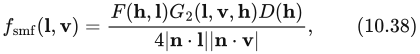

就会注意到，即使假设 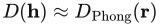 成立，我们仍从光照积分中移除了 BRDF 的重要部分：阴影项 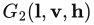，以及基于半程向量的菲涅耳项 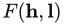，而将后者放在积分外应用并没有理论依据。Lazarov [998] 表明，使用依赖 **n**·**v** 的理想镜面菲涅耳项，来代替微表面 BRDF 中依赖 **n**·**h** 的项，所产生的误差甚至比完全不使用菲涅耳项更大。Gotanda [573]、Lazarov [999] 和 Karis [861] 各自独立推导出相似的**分离积分近似**：

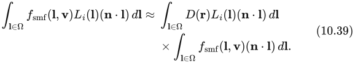

> 译注：以上公式按原书符号保留。式（10.37）后的积分简写省略了被积函数的其余部分和微分；式（10.38）明确写的是 F(h, l)，而随后的原文文字却写 n·h，二者不一致。微表面菲涅耳项通常使用 h·l（等于 h·v）。此处仅指出原文疑点，未替换正文中的原书陈述。式（10.39）为便于阅读换行，以乘号明确连接原式右侧两个积分。

注意，虽然这一方案通常称为“分离积分”，我们并没有把积分分解成两个互不相交的项，因为那样并不是好的近似。记住  包含镜面波瓣 D，就会发现 D 和 **n**·**l** 项实际上在两边都重复出现。在分离积分近似中，对于环境贴图中围绕反射向量对称的所有项，我们都会将它们包含在两个积分中。Karis 将他的推导称为**分离求和**，因为推导是在预计算使用的重要性采样数值积分器（式 10.36）上进行的，但本质上是同一个方案。

得到的两个积分都可以高效预计算。第一个积分在假设 D 波瓣径向对称的情况下，只依赖表面粗糙度和反射向量。实际上，可以使用任何波瓣，只需强制令 **n** = **v** = **r**。与通常做法一样，这个积分可以预计算并存储在立方体贴图的 mip 层中。将基于半程向量的 BRDF 转换为围绕反射向量的波瓣时，为使环境光照和解析光源产生相似的高光，径向对称波瓣应使用经过修改的粗糙度。例如，从纯粹基于 Phong 的反射向量镜面项转换到使用半角的 Blinn-Phong BRDF 时，将指数除以四可以得到良好拟合 [472, 957]。

第二个积分是镜面项的半球—方向反射率（第 9.3 节），即 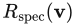。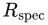 函数依赖仰角 θ、粗糙度 α 和菲涅耳项 F。通常，F 使用 Schlick 近似（式 9.16）实现，它只由单个值 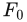 参数化，因此  成为三个参数的函数。Gotanda 数值预计算 ，并将结果存储在三维查找表中。Karis 和 Lazarov 注意到， 的值可以从  中提出，得到两个因子，而每个因子只依赖两个参数：仰角与粗糙度。Karis 利用这一点，把  的预计算查找降为二维表，可以存入一幅双通道纹理；Lazarov 则通过函数拟合，为这两个因子分别推导解析近似。后来，Iwanicki 和 Pesce [807] 推导出了更准确、更简单的解析近似。注意， 也能用于提高漫反射 BRDF 模型的准确性（见书页 352 的式 9.65）。如果在同一应用中实现这两种技术，那么  的实现就可以供两者共用，从而提高效率。

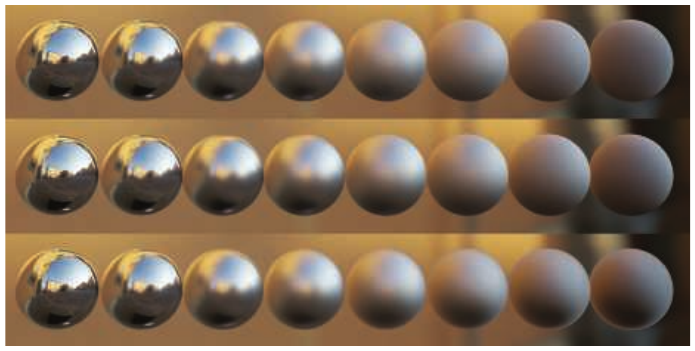

**图 10.37** Karis 的“分离求和”近似。从左到右：材质粗糙度逐渐增大。第一行：参考解。第二行：分离积分近似。第三行：在分离积分中，为镜面波瓣加上所要求的径向对称性（**n** = **v** = **r**）。最后这一要求引入了最多误差。（图片由 Epic Games Inc. 的 Brian Karis 惠供。）

对于恒定的环境贴图，分离积分方案是精确的。立方体贴图部分提供用于缩放镜面反射率的光照强度，而镜面反射率就是均匀光照下正确的 BRDF 积分。经验上，Karis 和 Lazarov 都观察到，该近似对一般环境贴图也成立，特别是在频率成分相对较低时，而这在室外场景中并不少见。见图 10.37。与真值相比，这项技术最大的误差来源，是预过滤环境立方体贴图被限制使用径向对称、未经裁剪的镜面波瓣（图 10.35）。Lagarde [960] 建议根据表面粗糙度，将读取预过滤环境贴图所用的向量从反射方向向法线方向偏移，因为经验表明这样可以减小相对真值的误差。这样做具有合理性，因为它部分补偿了没有按照表面的入射辐亮度半球裁剪波瓣的问题。

## 10.5.3 非对称与各向异性波瓣

到目前为止，我们看到的方案都限制为各向同性镜面波瓣，也就是说，当入射方向与出射方向绕表面法线旋转时，波瓣不变（第 9.3 节）；同时还要求波瓣围绕反射向量径向对称。微表面 BRDF 波瓣围绕半程向量 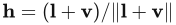（式 9.33）定义，因此即使在各向同性情况下，也不具备我们所需的对称性。半程向量依赖光照方向 **l**，而环境光照中并没有唯一定义的光照方向。因此，按照 Karis [861] 的方法，对于这些 BRDF，我们强制令 **n** = **v** = **r**，并推导一个恒定的粗糙度校正因子，使镜面高光大小与原始半程向量公式匹配。这些假设都是相当大的误差来源（见图 10.38）。

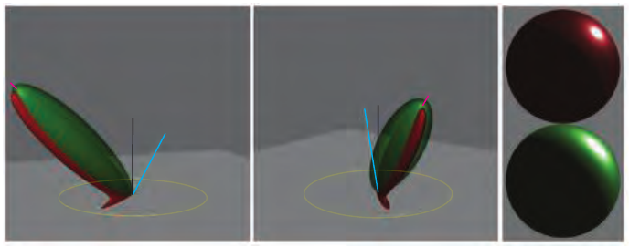

**图 10.38** 从两个视角比较 GGX BRDF（红色）与经过调整、围绕反射向量径向对称的 GGX NDF 波瓣（绿色）。后者经过缩放，使其峰值与 GGX 镜面波瓣匹配，但请注意，它无法表现基于半程向量的 BRDF 的各向异性形状。在右侧，注意这两个波瓣在球体上产生的高光差异。（图片使用 Disney 的开源软件 BRDF Explorer 生成。）

第 10.5.1 节提到的一些方法，可以按交互速度计算任意 BRDF 下的环境光照，例如 Luksch 等人 [1093] 以及 Colbert 和 Křivánek [279, 280] 的方法。不过，由于这些方法需要数十个样本，因此很少用于表面的实时着色。它们更适合被视为蒙特卡洛积分的快速重要性采样技术。

如果通过强制镜面波瓣径向对称来创建预过滤环境贴图，再使用简单直接的逻辑访问当前表面镜面粗糙度所对应的预过滤波瓣，那么只有在正面观察表面（**n** = **v**）时，才保证结果正确。其他情况下都没有这样的保证；在掠射角下，无论 BRDF 波瓣形状如何，都会出现误差，因为我们忽略了真实波瓣不能伸到着色表面点的地平线以下这一事实。一般来说，精确镜面反射方向上的数据很可能并不是与真实情况最吻合的数据。

Kautz 和 McCool 通过对预过滤环境贴图中存储的径向对称波瓣采用更好的采样方案，改进了朴素的预积分方法 [867]。他们提出两种方法。第一种只使用一个样本，但尝试寻找最适合近似当前观察方向 BRDF 的波瓣，而不是依赖恒定校正因子。第二种对来自不同波瓣的多个样本求平均。第一种方法能更好地模拟掠射角下的表面。他们还推导出一个校正因子，用于补偿径向对称波瓣近似与原始 BRDF 之间反射总能量的差异。第二种方案扩展了结果，使其包含半程向量模型典型的拉长高光。在两种情况下，都使用优化技术计算参数表，以控制预过滤波瓣的采样。Kautz 和 McCool 的技术使用贪心拟合算法与抛物面环境贴图。

较近时期，Iwanicki 和 Pesce [807] 使用称为 Nelder-Mead 最小化的方法，为 GGX BRDF 与环境立方体贴图推导了类似近似。他们还分析了利用现代 GPU 硬件的各向异性过滤能力来加速采样的想法。

Revie [1489] 在结合延迟着色（第 20.1 节）的毛发渲染中，也探索了从预过滤立方体贴图中取单个样本、但使采样位置适应更复杂镜面 BRDF 峰值的思路。在这一背景下，限制并不直接来自环境映射，而是来自需要在 G 缓冲中编码尽可能少的参数。McAuley [1154] 扩展了这一思路，将这项技术用于延迟渲染系统中的所有表面。

McAllister 等人 [1150, 1151] 利用 Lafortune BRDF 的性质，开发了一种能够渲染各向异性、逆向反射等多种效果的技术。这个 BRDF [954] 本身就是基于物理渲染的一种近似。它由多个在反射方向周围扰动的 Phong 波瓣构成。Lafortune 通过将这些波瓣拟合到 He-Torrance 模型 [686]，以及测角反射计测得的真实材质数据，展示了这个 BRDF 表现复杂材质的能力。McAllister 的技术依据以下观察：既然 Lafortune 波瓣是广义的 Phong 波瓣，就可以使用常规的预过滤环境贴图，让其 mip 层编码不同的 Phong 指数。Green 等人 [582] 提出了类似方法，用高斯波瓣代替 Phong 波瓣。此外，他们的方法还可以扩展，以支持环境贴图的方向性阴影（第 11.4 节）。
