# 10.6 辐照度环境映射

来源：《Real-Time Rendering》第 4 版，书页 424—433（PDF 物理页 445—454）。本节从 10.6 标题开始，包含 10.6.1、10.6.2 及其全部内容，止于 10.7 标题之前；图 10.39—10.45，公式（10.40）—（10.43）。

上一节讨论了使用经过滤波的环境贴图来实现有光泽的镜面反射。这些贴图也可以用于漫反射 [590, 1212]。用于镜面反射的环境贴图具有一些共同性质，无论它们是未经滤波、用于理想镜面反射，还是经过滤波、用于有光泽的反射，都是如此。在这两种情况下，镜面环境贴图都以反射后的观察向量进行索引，存储的都是辐亮度值。未经滤波的环境贴图包含入射辐亮度值，而经过滤波的环境贴图包含出射辐亮度值。

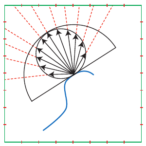

**图 10.39** 辐照度环境贴图的计算。围绕表面法线的半球按余弦加权，从环境纹理（这里是立方体贴图）中采样并求和，得到与视角无关的辐照度。绿色正方形表示立方体贴图的一个截面，红色刻度线表示纹素之间的边界。虽然图中画的是立方体贴图表示，但可以使用任意环境表示法。

相比之下，用于漫反射的环境贴图只以表面法线 **n** 进行索引，存储的是辐照度值。因此，它们被称为*辐照度环境贴图* [1458]。图 10.35 表明，使用环境贴图的有光泽反射在某些情况下会因为其固有的歧义而出现误差：同一个反射后的观察向量可能对应不同的反射情形。辐照度环境贴图没有这个问题。表面法线包含了漫反射所需的全部相关信息。由于辐照度环境贴图相对于原始照明极为模糊，因此可以用低得多的分辨率存储。通常会使用预滤波镜面环境贴图中最低的几个 mip 层级之一来存储辐照度数据。此外，与之前研究的有光泽反射不同，这里并不是对一个需要裁剪到表面法线周围半球范围内的 BRDF 波瓣进行积分。环境照明与截断余弦波瓣的卷积是精确的，而非近似。

对于贴图中的每个纹素，我们需要将影响朝向给定法线方向的表面的所有照明贡献进行余弦加权求和。创建辐照度环境贴图时，要对原始环境贴图应用一个作用范围很广、覆盖整个可见半球的滤波器。这个滤波器包含余弦因子。参见图 10.39。第 408 页图 10.26 中的球面贴图所对应的辐照度贴图如图 10.40 所示。图 10.41 给出了使用辐照度贴图的实例。

辐照度环境贴图与镜面环境贴图或反射贴图分开存储、分开访问，通常使用立方体贴图这类与视角无关的表示法，参见图 10.42。访问立方体贴图、取得辐照度时，使用的是表面法线，而不是反射后的观察向量。从辐照度环境贴图中取出的值乘以漫反射率，从镜面环境贴图中取出的值乘以镜面反射率。也可以对菲涅耳效应进行建模，使掠射角处的镜面反射率增大，并可能同时减小漫反射率 [704, 960]。

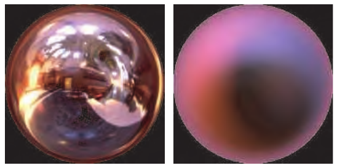

**图 10.40** 由格雷斯大教堂球面贴图生成的辐照度贴图。左图是原始球面贴图。右图通过对每个像素上方半球内的颜色加权求和而得到。（左图由 Paul Debevec 提供，debevec.org；右图由斯坦福大学计算机图形实验室的 Ravi Ramamoorthi 提供。）

**图 10.41** 使用辐照度贴图完成的角色照明。（图片由游戏《Dead or Alive® 3》提供，Tecmo, Ltd.，2001 年。）

由于辐照度环境贴图使用极宽的滤波器，很难通过采样高效地即时生成它们。King [897] 讨论了如何在 GPU 上执行卷积以创建辐照度贴图。他把环境贴图变换到频域，在 2004 年左右的硬件上便能够以超过 300 FPS 的速率生成辐照度贴图。

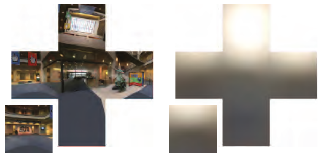

**图 10.42** 立方体贴图（左）及其对应的经过滤波的辐照度贴图（右）。（经 Microsoft Corporation 许可转载。）

用于漫反射表面或粗糙表面的滤波环境贴图可以以低分辨率存储，有时也可以从相对较小的场景反射贴图生成，例如每个面只有 64 × 64 个纹素的立方体贴图。这种方法的一个问题是，渲染到如此小的纹理中的面光源可能“落在纹素之间”，使光照发生闪烁，甚至完全消失。为避免这一问题，Wiley 和 Scheuermann [1886] 建议在渲染动态环境贴图时，用较大的“卡片”（带纹理的矩形）来表示这些光源。

与有光泽反射的情况一样，动态光源也可以加入预滤波的辐照度环境贴图。Brennan [195] 给出了一种低开销的方法。设想一张只对应单个光源的辐照度贴图。在光源方向上，辐亮度达到最大值，因为光线正面照射表面。对于给定表面法线方向（即给定纹素），辐亮度随该方向与光源方向夹角的余弦而衰减，在表面背对光源时为零。可以渲染一个表示余弦波瓣的半球，以观察者为中心，使半球的极轴沿着光源方向，从而利用 GPU 将这一贡献快速地直接加到已有的辐照度贴图中。

> 译注：上一段原文在解释辐照度贴图时两次使用 radiance（辐亮度）。译文保留原词；按上下文，随法线与光源夹角的余弦变化的是该光源的辐照度贡献。

## 10.6.1 球谐辐照度

虽然到目前为止，我们只讨论了用立方体贴图等纹理来表示辐照度环境贴图，但也存在其他表示法，第 10.3 节已经介绍过。特别是球谐函数，作为辐照度环境贴图的表示法相当流行，因为来自环境照明的辐照度是平滑的。将辐亮度与余弦波瓣卷积，会去除环境贴图中的所有高频分量。

Ramamoorthi 和 Hanrahan [1458] 表明，只用前九个球谐（SH）系数，就能以约 1% 的误差精度表示辐照度环境贴图（每个系数是一个 RGB 向量，所以需要存储 27 个浮点数）。于是，任何辐照度环境贴图都可以被看作一个球面函数 E(**n**)，并使用公式（10.21）和（10.23）投影为九个 RGB 系数。这种形式比立方体贴图或抛物面贴图更加紧凑，而且在渲染时，可以通过计算一些简单多项式来重建辐照度，无须访问纹理。如果辐照度环境贴图表示的是间接光照，往往不需要那么高的精度，而这在交互式应用中很常见。在这种情况下，对应常量基函数和三个线性基函数的四个系数通常就能产生良好结果，因为间接光照往往属于低频信号，即随角度的变化较为缓慢。

Ramamoorthi 和 Hanrahan [1458] 还表明，将入射辐亮度函数 L(**l**) 的每个 SH 系数乘以一个常量，就能转换为辐照度函数 E(**n**) 的系数。这样便得到一种将环境贴图快速滤波为辐照度环境贴图的方法：先将它们投影到 SH 基上，再将每个系数乘以一个常量。例如，King [897] 的快速辐照度滤波实现便是这样工作的。其思路是，由辐亮度计算辐照度，等价于对入射辐亮度函数 L(**l**) 与截断余弦函数 cos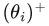 执行球面卷积。由于截断余弦函数关于球面的 z 轴旋转对称，它在 SH 中具有一种特殊形式：其投影在每个频带中只有一个非零系数。这些非零系数对应于第 401 页图 10.21 中间一列的基函数，它们也称为*带谐函数*（zonal harmonics）。

将一个一般球面函数与一个旋转对称函数（例如截断余弦函数）做球面卷积，得到的仍是一个定义在球面上的函数。这个卷积可以直接在函数的 SH 系数上高效地进行。卷积结果的 SH 系数等于两个函数系数的乘积，再乘以缩放因子 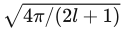，其中 l 是频带索引。因此，辐照度函数 E(**n**) 的 SH 系数等于辐亮度函数 L(**l**) 的系数乘以截断余弦函数 cos 的系数，再按各频带常量进行缩放。cos 在前九个系数之后的系数值很小，这解释了为什么只用九个系数就足以表示辐照度函数 E(**n**)。通过这种方式可以快速求出 SH 辐照度环境贴图。Sloan [1656] 描述了一种高效的 GPU 实现。

这里存在一种固有的近似，因为 E(**n**) 的高阶系数虽小，却并不为零，参见图 10.43。这个近似非常接近原函数。不过，在 π/2 与 π 之间本该为零的区域，曲线出现了“摆动”，这在信号处理中称为*振铃*（ringing）。正如第 10.3.2 节所见，用少量基函数近似一个包含高频的函数时，通常就会发生这种现象。在 π/2 处截断为零是一种急剧变化，这意味着我们的截断余弦函数所包含的信号频率延伸到无穷大。在大多数情况下，振铃不明显，但在极端照明条件下，可以在物体处于阴影的一侧看到颜色偏移或明亮的“斑块”。如果辐照度环境贴图只用于存储间接光照（实际中经常如此），振铃一般不会成为问题。一些预滤波方法可以尽量减轻这个问题 [1656, 1659]，参见图 10.44。

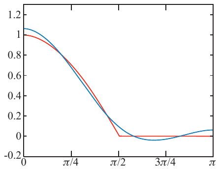

**图 10.43** 截断余弦函数（红色）与使用九个系数的球谐近似（蓝色）的比较。近似相当接近原函数。注意，在 π/2 与 π 之间，近似曲线先略微降到零以下，再升到零以上。

图 10.40 比较了直接求得的辐照度贴图与使用九项函数合成的贴图。这种 SH 表示可以在渲染时根据当前表面法线 **n** 求值 [1458]，也可以用于快速创建立方体贴图或抛物面贴图，供以后使用。这种照明开销很低，并且在漫反射情况下能够提供良好的视觉效果。

> 译注：上一段对图 10.40 的描述沿用原文，但该图实际图注将左图标为原始球面贴图、右图标为辐照度贴图，并未标为“直接求得”与“九项函数合成”两个辐照度结果。这是原文正文与图注之间的不一致，未擅自改换图号或图像。

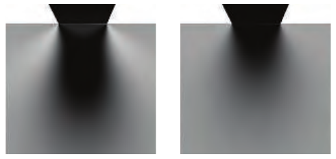

**图 10.44** 左：振铃造成的视觉伪影示例。右：一种可行的解决方法是使原函数更加平滑，从而能够在不产生振铃的情况下表示它，这一过程称为“加窗”（windowing）。（图片由 Peter-Pike Sloan 提供。）

动态渲染的立方体环境贴图可以投影到 SH 基上 [871, 897, 1458]。由于立方体环境贴图是入射辐亮度函数的一种离散表示，公式（10.21）中对球面的积分就变成了对立方体贴图纹素的求和：

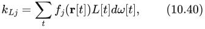

其中，t 是当前立方体贴图纹素的索引，**r**[t] 是指向当前纹素的方向向量，(**r**[t]) 是第 j 个 SH 基函数在 **r**[t] 处的值，L[t] 是该纹素中存储的辐亮度，dω[t] 是该纹素所张的立体角。Kautz [871]、King [897] 和 Sloan [1656] 描述了如何计算 dω[t]。

要将辐亮度系数 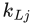 转换为辐照度系数，需要把它们乘以截断余弦函数 cos 经过缩放的系数：

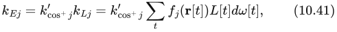

其中，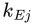 是辐照度函数 E(**n**) 的第 j 个系数， 是入射辐亮度函数 L(**l**) 的第 j 个系数，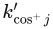 是截断余弦函数 cos 的第 j 个系数乘以  后的结果（l 是频带索引）。给定 t 和立方体贴图的分辨率后，对于每个基函数 ()，因子 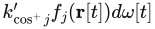 都是常量。这些基函数因子可以离线预计算并存入立方体贴图；这些贴图的分辨率应与将要渲染的动态环境贴图相同。在每个颜色通道中分别打包一个基函数因子，可以减少使用的纹理数量。要计算动态立方体贴图的一个辐照度系数，只需将相应基函数因子贴图的纹素与动态立方体贴图的纹素相乘，再对结果求和。除了动态辐照度立方体贴图的信息之外，King [897] 还提供了 GPU 上 SH 投影的实现细节。

动态光源可以加入已有的 SH 辐照度环境贴图中。合并的方法是计算这些光源的辐照度贡献所对应的 SH 系数，再将其加到已有系数上。这样就不必重新计算整张辐照度环境贴图。这一过程很直接，因为点光源、圆盘光源和球形光源的系数都有简单的解析表达式 [583, 871, 1656, 1690]。系数相加与辐照度相加具有相同的效果。通常，这些表示都先针对沿 z 轴的光源，以带谐函数形式给出，然后通过旋转将光源朝向任意方向。带谐函数旋转是 SH 旋转（第 10.3.2 节）的一种特殊情况，效率高得多，只需要一次点积，而不需要完整的矩阵变换。对于形状更复杂的光源，可以先将它们绘制到图像中，再通过数值方法把图像投影到 SH 基上，以此计算系数 [1690]。对于物理天空模型这一特殊情况，Habel [626] 展示了 Preetham 天空光在球谐函数中的直接展开。

常见解析光源能够很容易地投影到 SH 中，这一点很重要，因为环境照明经常被用来代替远处或强度较低的光源。补光灯是一个重要例子。在渲染中，设置这类光源是为了模拟场景中的间接光，即在表面之间反弹的光。通常不会为补光灯计算镜面反射贡献，尤其是因为相对于被着色物体，这些光源的实际尺寸可能很大，而相对于场景中的其他照明源，它们又比较暗。这些因素使其镜面高光分布得更广，也更不明显。现实世界中的影视照明也有与之对应的光源：常常使用实际的补光灯，向阴影中添加照明。

在球谐空间中，反向推导也很简单，即从投影到 SH 中的辐亮度提取解析光源。在其 SH 技术综述中，Sloan [1656] 展示了：给定一个轴向已知的方向光源，很容易从 SH 辐照度表示中求出该光源应有的强度，使它与所编码辐照度之间的误差最小。Sloan 在此前的工作 [1653] 中还展示了如何只使用第一阶（线性）频带的系数来选择一个接近最优的方向。这篇综述也包含提取多个方向光源的方法。这些工作表明，球谐函数是汇总光源的一种实用基底。我们可以将多个光源投影到 SH 中，再提取出数量较少的方向光源，来紧密近似已投影的光源集合。lightcuts [1832] 框架为聚合较不重要的光源提供了一种有理论依据的方法。

虽然 SH 投影最常用于辐照度，但它也可以用来模拟有光泽、依赖视角的 BRDF 照明。Ramamoorthi 和 Hanrahan [1459] 描述了一种这样的技术。他们在立方体贴图中存储的不是单个颜色，而是编码环境贴图视角依赖性的球谐投影系数。不过，在实践中，这种技术所需的空间远多于前面看到的预滤波环境贴图方法。Kautz 等人 [869] 利用 SH 系数的二维表推导出了一种更节省空间的方案，但该方法只能用于频率相当低的照明。

## 10.6.2 其他表示法

虽然立方体贴图和球谐函数是辐照度环境贴图最常用的表示法，但还可以使用其他表示法，参见图 10.45。许多辐照度环境贴图有两种主导颜色：上方的天空颜色和下方的地面颜色。受到这一观察的启发，Parker 等人 [1356] 提出了只使用两种颜色的*半球照明*模型。假设上半球发出均匀的辐亮度 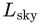，下半球发出均匀的辐亮度 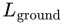，则此时的辐照度积分为

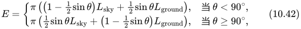

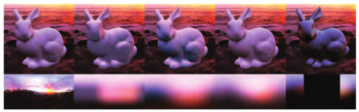

**图 10.45** 辐照度的不同编码方式。从左到右：环境贴图，以及通过蒙特卡洛积分求辐照度而计算得到的漫反射照明；使用环境立方体编码的辐照度；球谐函数；球面高斯函数；H 基（只能表示一个半球范围内的方向，所以没有对背向法线进行着色）。（图片使用 Yuriy O’Donnell 和 David Neubelt 的开源软件 Probulator 计算得到。）

其中，θ 是表面法线与天空半球轴线之间的夹角。Baker 和 Boyd 提出了一种更快的近似（由 Taylor [1752] 描述）：

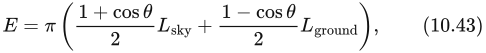

它是在天空与地面之间进行线性插值，使用 (cos θ + 1)/2 作为插值因子。cos θ 一般可以通过点积快速计算；而在天空半球轴线恰好是某一坐标轴（例如 y 轴或 z 轴）的常见情况下，甚至完全不需要计算，因为它就等于 **n** 在世界空间中的某个坐标分量。这个近似足够接近原表达式，速度又显著更快，因此对于大多数应用，它比完整表达式更合适。

Forsyth [487] 提出了一种低开销而灵活的照明模型，称为 *trilight*（三光照明），方向照明、双向照明、半球照明和包裹照明都可以视为它的特殊情况。

Valve 最初引入环境立方体表示法（第 10.3.1 节）就是为了表示辐照度。一般而言，第 10.3 节中介绍的所有球面函数表示法都可用于预计算辐照度。对于辐照度函数所表示的低频信号，我们知道 SH 是一种很好的近似。我们往往会设计专门的方法，以便比球谐函数更简单，或者占用更少的存储空间。如果要计算遮挡和其他全局光照效果，或者要加入有光泽反射（第 10.1.1 节），就需要能够表示高频的更复杂表示法。通过预计算照明来考虑所有相互作用，这一总体思想称为*预计算辐亮度传输*（precomputed radiance transport，PRT），将在第 11.5.3 节讨论。为有光泽照明捕捉高频也称为*全频照明*。在这一背景下，经常使用小波表示 [1059] 来压缩环境贴图，并以类似于前面球谐函数的方式设计高效算子。Ng 等人 [1269, 1270] 展示了如何用 *Haar 小波*推广辐照度环境映射，以便对自阴影建模。他们将环境贴图和随物体表面位置变化的阴影函数都存储在小波基中。这种表示值得注意，因为它相当于对环境立方体贴图进行一种变换：对立方体的每个面分别执行二维小波投影。因此，它可以被看作一种立方体贴图压缩技术。
