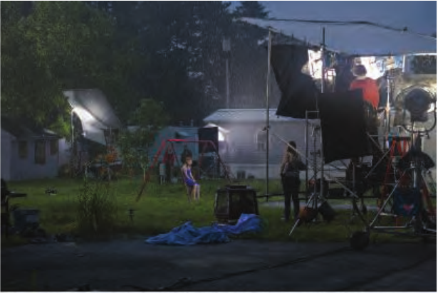
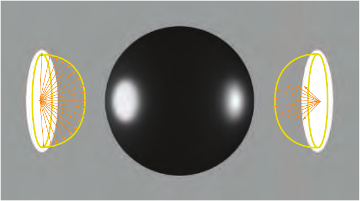

# 10.7 误差来源

原书来源：第 433—435 页（PDF 第 454—456 页）。本节从“10.7 Sources of Error”标题开始，止于“Further Reading and Resources”之前；第 435 页上方的图 10.47 及其图注属于本节。

为了正确地进行着色，我们必须对非点状光源求积分。在实践中，这意味着我们可以根据所考虑光源的性质，采用许多不同的技术。实时引擎通常会以解析方式对少数重要光源建模，近似计算光源面积上的积分，并通过阴影贴图计算遮挡。其余所有光源——远处的照明、天空、补光灯，以及在表面之间反弹的光——往往用环境立方体贴图表示其镜面反射分量，而用球面基表示其漫反射辐照度。

混合使用多种照明技术，意味着我们从来都不是直接使用给定的 BRDF 模型，而是在使用具有不同程度误差的近似。有时，对 BRDF 的近似是显式的，因为我们会拟合中间模型，以便计算光照积分；线性变换余弦分布（LTC）就是一个例子。有时，我们构造的近似对于某个给定 BRDF，在特定条件下（这些条件往往很少出现）是精确的，但通常会存在误差；预滤波立方体贴图就属于这一类。

开发实时着色模型时，需要考虑的一个重要方面，是确保不同照明形式之间的差异不明显。从视觉上看，让不同表示方法产生一致的照明结果，甚至可能比各自引入的绝对近似误差更为重要。

遮挡对于真实感渲染也至关重要，因为光“泄漏”到本不该有光的地方，往往比本该有光的地方没有光更引人注意。对于大多数面光源表示方法，生成阴影并不简单。目前已有的实时阴影技术，即便考虑了“柔化”效果（第 7.6 节），也没有一种能够准确地考虑光源的形状。当物体投下阴影时，我们会计算一个标量因子，通过相乘来减小某一光源的贡献，但这种做法并不正确；我们应该在对 BRDF 求积分时就把这种遮挡考虑进去。环境照明尤其难处理，因为我们没有一个确定的、占主导地位的光照方向，因此无法使用针对点状光源的阴影技术。

虽然我们已经介绍了一些相当先进的照明模型，但必须记住，它们并不是现实世界光源的精确表示。例如，在环境照明中，我们假设辐亮度源位于无穷远处，而这在现实中是不可能的。我们介绍过的所有解析光源，都基于一个更强的假设：光源表面上的每一点都向出射半球均匀地发出辐亮度。在实践中，这一假设可能成为误差来源，因为真实光源往往具有很强的方向性。在摄影和电影照明中，经常会使用专门制作的遮光片和滤光片来营造艺术效果，它们被称为 gobo、cuculoris 或 cookie。例如，图 10.46 展示了摄影师 Gregory Crewdson 精心布置的电影式照明。为了在保持较大发光面积的同时限制照明角度，可以在大型发光面板（即所谓的柔光箱，softbox）前加装由黑色遮光材料构成的网格，称为蜂巢格栅（honeycomb）。灯具外壳内还可以使用复杂的镜面和反射器配置，例如室内灯具、汽车前照灯和手电筒，见图 10.47。这些光学系统会形成一个或多个远离实际发光物理中心的虚拟发光体，计算衰减时应当考虑这种偏移。

图 10.46．拍摄现场照明。（《拖车公园 5》（Trailer Park 5）。档案级颜料印相，17 × 22 英寸。Gregory Crewdson 的《玫瑰之下》（Beneath the Roses）系列拍摄现场照片。© Gregory Crewdson。由高古轩画廊（Gagosian）提供。）

请注意，始终应当在以感知为基础、以结果为导向的框架中评估这些误差，除非我们的目标是进行预测性渲染，也就是可靠地模拟表面在现实世界中的外观。在艺术家手中，某些简化即使不符合现实，仍然可以成为有用且富有表现力的基本工具。当物理模型能够让艺术家更容易创作出视觉上可信的图像时，它们就是有用的；但物理模型本身并不是目标。

图 10.47．同一个圆盘光源采用两种不同的发射分布。左：圆盘上的每一点都向出射半球均匀发光。右：发射集中在围绕圆盘法线的一个波瓣内。
