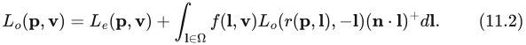
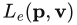
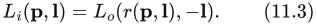
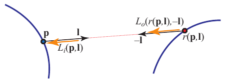
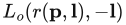
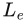
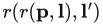
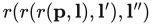
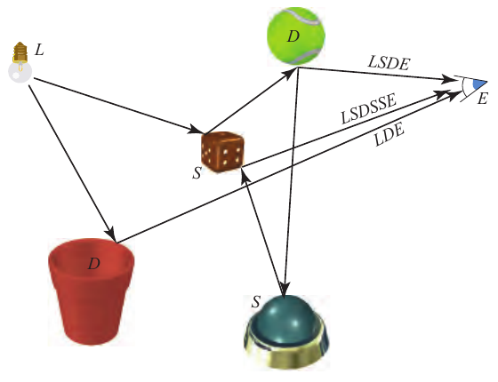

# 11.1 渲染方程

书页来源：《Real-Time Rendering》第 4 版，书页 437—440（PDF 第 458—461 页）。已核对 PDF 第 462 页的边界；该页图 11.3 及正文属于 11.2 节。

反射方程是完整渲染方程的一个受限特例。渲染方程由 Kajiya 于 1986 年提出 [846]。人们使用过不同形式的渲染方程。我们将采用以下版本：

其中新增的元素是 ，即从表面位置 p 沿方向 v 发射的辐亮度，以及下面这项替换：

这一项表示，从方向 l 入射到位置 p 的辐亮度，等于从另一个点沿相反方向 −l 出射的辐亮度。在这里，“另一个点”由光线投射函数 r(p, l) 定义。该函数返回从 p 沿方向 l 投射的光线所击中的第一个表面点的位置。见图 11.1。

**图 11.1** 待着色的表面位置 p、光照方向 l、光线投射函数 r(p, l)，以及入射辐亮度 ；后者也表示为 。

渲染方程的含义很直观。为了对表面位置 p 着色，我们需要知道从 p 沿观察方向 v 离开的出射辐亮度 。它等于发射辐亮度  加上反射辐亮度。前面的章节已经研究过光源的发射，也研究过反射。甚至光线投射算子也没有看起来那么陌生。例如，z 缓冲就为从眼睛投射到场景中的光线计算这个算子。

唯一的新项是 ，它明确表达了这样一个事实：入射到某个点的辐亮度，必然是从另一个点出射的。不幸的是，这是一个递归项。也就是说，要计算它，就又要对各个位置  的出射辐亮度求和。而这些位置又需要计算位置  的出射辐亮度，如此无穷无尽。真实世界竟然能够实时计算所有这些，实在令人惊叹。

我们凭直觉就知道，灯光照亮场景，光子在其中四处弹射，每次碰撞时都会以各种方式被吸收、反射和折射。渲染方程的重要之处在于，它用一个看似简单的方程概括了所有可能的路径。

渲染方程的一个重要性质是：它相对于发射的光照是线性的。如果把灯光的强度加倍，着色结果的亮度也会加倍。材质对每盏灯的响应也独立于其他光源。也就是说，一盏灯的存在不会影响另一盏灯与材质之间的相互作用。

在实时渲染中，通常只使用局部光照模型。计算光照只需要可见点处的表面数据，而这恰好是 GPU 能够最高效地提供的数据。各个图元被独立处理并光栅化，随后便被丢弃。在 b 点执行计算时，无法访问 a 点处的光照计算结果。透明、反射和阴影都是全局光照算法的例子。它们使用被照亮物体以外的其他物体的信息。这些效果能够大幅提高渲染图像的真实感，并提供帮助观察者理解空间关系的线索。同时，它们的模拟也很复杂，可能需要预计算，或者进行多个渲染遍次来计算一些中间信息。

**图 11.2** 一些到达眼睛的路径及其等价记法。注意，图中有两条路径从网球继续延伸。

思考光照问题的一种方式，是考虑光子所走的路径。在局部光照模型中，光子从光源传播到一个表面（忽略中间的物体），然后到达眼睛。阴影技术会考虑这些中间物体造成的直接遮挡效果。环境贴图捕获从光源传播到远处物体的光照，然后将其应用于局部的光亮物体；这些物体通过镜面反射把光送入眼睛。辐照度贴图也捕获光照对远处物体的影响，并针对每个方向在一个半球上进行积分。从所有这些物体反射的光经过加权求和，用来计算某个表面的光照，而这个表面又被眼睛看到。

以更形式化的方式思考光传输路径的不同类型和组合，有助于理解现有的各种算法。Heckbert [693] 提出了一种记法，可用于描述某种技术所模拟的路径。光子从光源（L）到眼睛（E）的旅途中，每次相互作用都可以标记为漫反射（D）或镜面反射（S）。还可以增加其他表面类型，进一步细化分类，例如“光泽”（glossy），表示表面光亮但并非镜面。见图 11.2。可以用正则表达式简要概括算法，表明它们模拟哪些类型的相互作用。基本记法汇总见表 11.1。

光子可以沿各种路径从光源到达眼睛。最简单的路径是 LE，此时眼睛直接看到光源。基本的 z 缓冲对应 L(D∣S)E，或等价地写成 LDE∣LSE。光子离开光源，到达漫反射或镜面反射表面，然后到达眼睛。注意，在基本渲染系统中，点光源没有实体表示。为光源赋予几何形状，就会得到 L(D∣S)?E 系统，在这样的系统中，光也可以直接到达眼睛。

**表 11.1** 正则表达式记法。

| 运算符 | 描述 | 示例 | 解释 |
| --- | --- | --- | --- |
| ∗ | 零次或多次 | S∗ | 零次或多次镜面反射弹射 |
| + | 一次或多次 | D+ | 一次或多次漫反射弹射 |
| ? | 零次或一次 | S? | 零次或一次镜面反射弹射 |
| ∣ | 二者择一 | D∣SS | 一次漫反射弹射，或两次镜面反射弹射 |
| () | 分组 | (D∣S)∗ | 零次或多次漫反射或镜面反射 |

如果在渲染器中加入环境映射，紧凑的表达式就不那么显而易见了。虽然 Heckbert 的记法是从光源向眼睛读的，但沿相反方向构造表达式通常更容易。眼睛首先会看到镜面反射或漫反射表面，即 (S∣D)E。如果该表面是镜面反射表面，那么它还可以选择性地反射一个已经渲染到环境贴图中的（远处的）镜面反射或漫反射表面。因此，就增加了一条可能的路径：((S∣D)?S∣D)E。为了计入眼睛直接看到光源的路径，在这个中间表达式后加上一个 ?，使其成为可选项，再在开头加上光源本身：L((S∣D)?S∣D)?E。

这个表达式可以展开为 LE∣LSE∣LDE∣LSSE∣LDSE，逐一显示所有可能的路径；也可以写成更短的 L(D∣S)?S?E。每一种形式都有助于理解其中的关系与限制。这种记法的一部分用途，在于表达算法的效果，并能够在此基础上继续构建。例如，生成环境贴图时编码的是 L(S∣D)，而随后访问这张贴图的部分则是 SE。

渲染方程本身可以概括为简单的表达式 L(D∣S)∗E，也就是说，来自光源的光子在到达眼睛之前，可以击中零个到近乎无穷多个漫反射或镜面反射表面。

全局光照研究关注的是，如何计算沿其中某些路径发生的光传输。将其用于实时渲染时，我们通常愿意牺牲一些质量或正确性，以换取高效的求值。最常见的两种策略是简化和预计算。例如，我们可以假设，除了最终到达眼睛的那一次弹射之外，之前所有的光线弹射都是漫反射；这种简化在某些环境中能够很好地发挥作用。我们也可以离线预先计算一些物体之间相互影响的信息，例如生成记录表面光照水平的纹理；然后在实时阶段，仅依赖这些存储值进行基本计算。本章将展示如何利用这些策略实时实现各种全局光照效果的例子。
