# 11.3 环境光遮蔽

来源：《Real-Time Rendering》第 4 版，书页 446—465（PDF 物理页 467—486）。范围从 11.3 标题起，到 11.4 标题前止，包含全部下级小节；图号、公式编号和文献编号沿用原书。

上一节介绍的通用全局光照算法计算开销很大。它们能够产生种类繁多的复杂效果，但生成一幅图像可能需要数小时。我们对实时替代方案的探索，将从最简单、但视觉上仍然可信的方案开始，并在本章中逐步深入到更复杂的效果。

一种基本的全局光照效果是环境光遮蔽（ambient occlusion，AO）。这项技术由工业光魔公司的 Landis [974] 于 21 世纪初开发，用来改善电影《珍珠港》中计算机生成飞机的环境光照质量。尽管这种效果的物理基础包含相当多的简化，其结果却出人意料地可信。当光照缺乏方向变化、无法显现物体细节时，这种方法能以很低的代价提供有关形状的视觉线索。

## 11.3.1 环境光遮蔽理论

环境光遮蔽的理论基础可以直接由反射方程推导出来。为简单起见，我们首先只考虑朗伯表面。这类表面的出射辐亮度  与表面辐照度 E 成正比。辐照度是入射辐亮度经过余弦加权后的积分。一般而言，它取决于表面位置 **p** 和表面法线 **n**。同样为了简化，我们假设对于所有入射方向 **l**，入射辐亮度均为常量，即 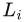(**l**) = 。由此得到计算辐照度的下式：

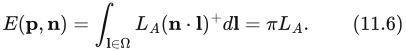

这里的积分在所有可能入射方向所构成的半球 Ω 上进行。假设照明恒定且均匀，辐照度（因此也包括出射辐亮度）就不依赖表面位置或法线，而在整个物体上保持不变。这会使物体呈现平板的外观。

式 11.6 完全没有考虑可见性。有些方向可能被物体的其他部分或场景中的其他物体挡住。这些方向的入射辐亮度将不同于 。为简单起见，我们假设被遮挡方向的入射辐亮度为零。这忽略了所有可能从场景中其他物体反弹、最终沿这些被遮挡方向到达点 **p** 的光，但大大简化了推理。于是得到下面这个最早由 Cook 和 Torrance [285, 286] 提出的方程：

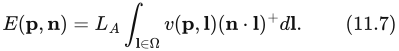

其中 v(**p**, **l**) 是可见性函数：若从 **p** 沿 **l** 方向发射的射线被挡住，它等于零；否则等于一。

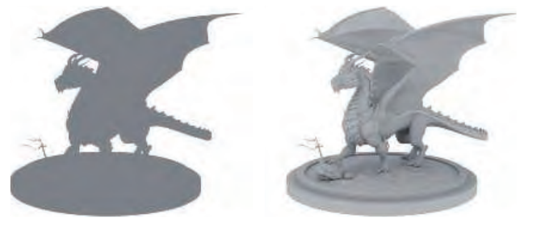

图 11.7　只使用恒定环境光照渲染的物体（左），以及使用环境光遮蔽渲染的物体（右）。即使光照恒定，环境光遮蔽也能显现物体细节。（“Dragon”模型由 Delatronic 制作，来自 Benedikt Bitterli Rendering Resources，采用 CC BY 3.0 许可 [149]。使用 Mitsuba 渲染器渲染。）

可见性函数经过归一化的余弦加权积分，称为环境光遮蔽：

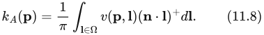

它表示未被遮挡的半球所占的余弦加权比例。其值从零到一：完全被遮挡的表面点为零，完全没有遮挡的位置为一。需要注意，球体或盒子等凸物体不会造成自遮蔽。如果场景中没有其他物体，凸物体各处的环境光遮蔽值都为一。如果物体存在凹陷，那么这些区域的遮蔽值就会小于一。

定义 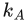 之后，存在遮蔽时的环境辐照度方程为：

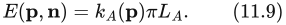

注意，现在辐照度确实会随表面位置变化，因为  会变化。这会产生真实得多的结果，如图 11.7 右图所示。尖锐褶皱中的表面位置会很暗，因为这些位置的  很低。请比较图 11.8 中的表面位置  与 。表面朝向也有影响，因为可见性函数 v(**p**, **l**) 在积分时用余弦因子加权。请比较该图左侧的  与 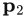。两者未被遮挡的立体角大小大致相同，但  的大部分未遮挡区域位于其表面法线附近，因此余弦因子较高，这从箭头的明暗可以看出。相比之下， 的大部分未遮挡区域偏向表面法线的一侧，对应的余弦因子较低。因此， 处的  较低。从这里开始，为简洁起见，我们不再显式写出对表面位置 **p** 的依赖。

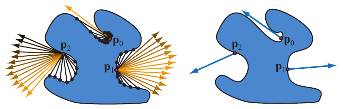

图 11.8　环境照明下的一个物体。图中标出三个点（、 和 ）。左图中，被挡住的方向用终止于交点（黑色圆点）的黑色射线表示。未被挡住的方向用箭头表示，并按余弦因子着色，因此越接近表面法线的箭头越亮。右图中，每个蓝色箭头都表示平均未遮挡方向，即弯曲法线。

除  外，Landis [974] 还计算平均未遮挡方向，称为弯曲法线（bent normal）。这一方向向量通过对未遮挡的入射光方向求余弦加权平均得到：

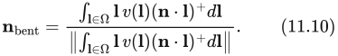

记号 ‖**x**‖ 表示向量 **x** 的长度。将积分结果除以它自身的长度，就得到归一化结果。参见图 11.8 右图。在着色时，可以用得到的向量替代几何法线，以提供更准确的结果，而不增加性能开销（第 11.3.7 节）。

## 11.3.2 可见性与遮暗

用来计算环境光遮蔽因子 （式 11.8）的可见性函数 v(**l**) 需要仔细定义。对于角色或车辆这样的物体，可以很直接地根据从某个表面位置沿 **l** 方向发射的射线是否与同一物体的其他部分相交来定义 v(**l**)。但这没有计入附近其他物体造成的遮蔽。在照明计算中，通常可以假定该物体放在一个平面上。将这个平面包含在可见性计算中，就能得到更真实的遮蔽。另一个好处是，物体对地平面的遮蔽可以用作接触阴影 [974]。

遗憾的是，这种可见性函数方法对封闭几何体会失效。设想一个由封闭房间及其中各种物体组成的场景。所有表面的  都为零，因为从表面发出的所有射线都会碰到某个东西。对于这类场景，尝试复现环境光遮蔽外观、但不一定模拟物理可见性的经验方法往往效果更好。其中一些方法受到 Miller 的可达性着色（accessibility shading）概念 [1211] 的启发；它模拟表面角落和缝隙如何积聚污垢或受到腐蚀。

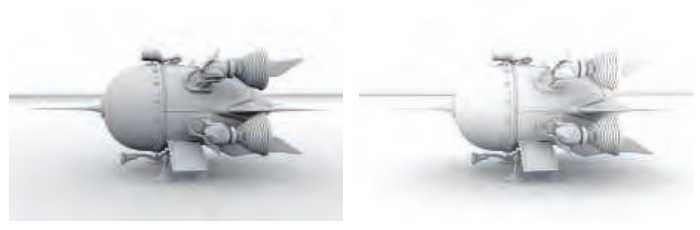

图 11.9　环境光遮蔽与遮暗之间的区别。左侧飞船的遮蔽使用无限长射线计算，右图使用有限长度的射线。（“4060.b Spaceship”模型由 thecali 制作，来自 Benedikt Bitterli Rendering Resources，采用 CC BY 3.0 许可 [149]。使用 Mitsuba 渲染器渲染。）

Zhukov 等人 [1970] 引入了遮暗（obscurance）的概念：将可见性函数 v(**l**) 替换为距离映射函数 ρ(**l**)，从而修改环境光遮蔽的计算：

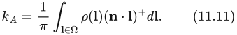

v(**l**) 只有两个有效值，无交点时为 1，有交点时为 0；与之不同，ρ(**l**) 是一个连续函数，取决于射线在与表面相交前所行进的距离。当交点距离为 0 时，ρ(**l**) 为 0；当交点距离大于指定距离 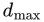，或者完全没有交点时，其值为 1。无需检测  之外的交点，这能显著加快  的计算。图 11.9 展示了环境光遮蔽与环境遮暗的区别。注意，使用环境光遮蔽渲染的图像明显更暗。这是因为即使很远处的交点也会被检测到，进而影响  的值。

尽管有人尝试从物理角度为它提供依据，遮暗并不符合物理规律。不过，它常常能给出符合观看者预期的可信结果。一个缺点是，必须手动设定  才能得到令人满意的效果。计算机图形学中经常会出现这种折中：一种技术没有直接的物理基础，却“在感知上令人信服”。目标通常是可信的图像，因此使用这样的技术没有问题。话虽如此，基于理论的方法也有一些优势：它们能够自动工作，而且可以通过推理真实世界的运作方式来进一步改进。

## 11.3.3 计入相互反射

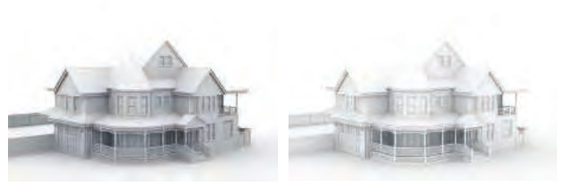

图 11.10　不考虑与考虑相互反射时的环境光遮蔽差异。左图只使用可见性信息。右图还使用了一次反弹的间接光照。（“Victorian Style House”模型由 MrChimp2313 制作，来自 Benedikt Bitterli Rendering Resources，采用 CC BY 3.0 许可 [149]。使用 Mitsuba 渲染器渲染。）

尽管环境光遮蔽产生的结果在视觉上可信，它们仍比完整全局光照模拟的结果更暗。请比较图 11.10 中的图像。

环境光遮蔽与完整全局光照之间的一个重要差异来源是相互反射。式 11.8 假定被遮挡方向的辐亮度为零，而实际上相互反射会让这些方向产生非零辐亮度。与图 11.10 右侧模型相比，这种影响表现为左侧模型褶皱和凹坑中的变暗。可以通过增大  来弥补这一差异。使用遮暗的距离映射函数替代可见性函数（第 11.3.2 节）也能缓解这一问题，因为遮暗函数对于被遮挡方向的取值通常大于零。

更准确地跟踪相互反射很昂贵，因为这需要求解一个递归问题。要对一个点着色，就必须先对其他点着色，以此类推。计算  比完整全局光照计算便宜得多，但通常仍希望以某种形式补上这部分缺失的光，以免过度变暗。Stewart 和 Langer [1699] 提出一种低成本、却出人意料地准确的相互反射近似方法。它依据这样的观察：对于漫射照明下的朗伯场景，从给定位置能够看到的表面位置往往具有相近的辐亮度。假定来自被遮挡方向的辐亮度  等于当前着色点的出射辐亮度 ，就可以打破递归，并得到解析表达式：

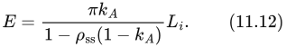

其中  是次表面反照率，也就是漫反射率。这等价于用一个新的因子 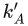 替换环境光遮蔽因子 ：

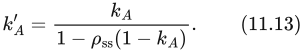

这个方程倾向于提高环境光遮蔽因子，使视觉结果更接近包含相互反射的完整全局光照解。其效果高度依赖  的值。底层近似假定着色点附近的表面颜色相同，从而产生一种有些类似颜色渗透的效果。Hoffman 和 Mitchell [755] 使用这种方法，以天空光照亮地形。

Jimenez 等人 [835] 提出了另一种方案。他们对若干场景执行完整的离线路径追踪，每个场景都由均匀白色、位于无限远处的环境贴图照明，以获得正确计入相互反射的遮蔽值。根据这些示例，他们拟合三次多项式来近似函数 f；该函数将环境光遮蔽值  和次表面反照率  映射为受相互反射光提亮后的遮蔽值 。他们的方法也假定反照率在局部恒定，因此可以根据给定点的反照率推导入射反弹光的颜色。

## 11.3.4 预计算环境光遮蔽

计算环境光遮蔽因子可能很耗时，因此常在渲染之前离线执行。预先计算任何与光照有关的信息，包括环境光遮蔽，这一过程通常称为烘焙（baking）。

预计算环境光遮蔽最常见的方法是蒙特卡洛方法。发射射线并检查它们与场景的交点，对式 11.8 进行数值求值。例如，设我们在法线 **n** 周围的半球上选取 N 个均匀分布的随机方向 **l**，并沿这些方向追踪射线。根据相交结果求出可见性函数 v。于是环境光遮蔽可计算为：

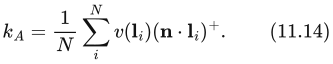

> 译注：式 11.14 忠实保留原书。按照正文所述“在半球上均匀分布”的采样以及式 11.8 的归一化，蒙特卡洛估计的前因子应为 2/N；原式的 1/N 疑似漏了因子 2。此处不暗改原式。

计算环境遮暗时，可以把发射射线限制在最大距离内，并根据找到的交点距离确定 v 的值。

环境光遮蔽或遮暗因子的计算包含余弦加权因子。虽然可以像式 11.14 那样直接把它乘进去，但更有效的方式是通过重要性采样引入该权重。与其在半球上均匀发射射线，再对结果进行余弦加权，不如直接对射线方向的分布进行余弦加权。换言之，射线更可能沿接近表面法线的方向发射，因为这些方向的结果往往更重要。这种采样方案称为 Malley 方法。

环境光遮蔽的预计算既可以在 CPU 上执行，也可以在 GPU 上执行。两种平台都有能加速复杂几何体射线投射的库。其中最流行的两个是面向 CPU 的 Embree [1829] 和面向 GPU 的 OptiX [951]。过去也曾使用 GPU 流水线的结果，例如深度图 [1412] 或遮挡查询 [493]，来计算环境光遮蔽。随着更通用的 GPU 射线投射方案越来越普及，如今这些方法的使用已减少。大多数商业建模与渲染软件都提供预计算环境光遮蔽的选项。

物体上每个点的遮蔽数据都是独有的。它们通常存储在纹理、体数据或网格顶点中。无论存储哪一种信号，各种存储方法的特点和问题都相似。相同的方法也可以用来存储环境光遮蔽、方向性遮蔽或预计算光照，详见第 11.5.4 节。

预计算数据还可以用来模拟物体彼此之间的环境光遮蔽效果。Kontkanen 和 Laine [924, 925] 把物体对周围环境的遮蔽效果存储在立方体贴图中，称为环境光遮蔽场（ambient occlusion field）。他们用一个二次多项式的倒数，描述环境光遮蔽值随到物体距离的变化。其系数存储在立方体贴图中，以模拟遮蔽随方向的变化。运行时，根据遮挡物的距离和相对位置提取合适的系数，并重建遮蔽值。

Malmer 等人 [1111] 将环境光遮蔽因子以及可选的弯曲法线存储在一个称为环境光遮蔽体（ambient occlusion volume）的三维网格中，获得了更好的结果。计算需求更低，因为环境光遮蔽因子直接从纹理读取，而无需计算。相比 Kontkanen 和 Laine 的方法，它存储的标量更少；两种方法使用的纹理分辨率都较低，因此总体存储需求相近。Hill [737] 和 Reed [1469] 描述了 Malmer 等人的方法在商业游戏引擎中的实现。他们讨论了算法的多种实际问题及有用的优化。这两种方法都面向刚性物体，但也可以扩展到只有少量活动部件的关节式物体，只需把每个部件看作独立物体。

无论选择哪种方法存储环境光遮蔽值，都必须意识到，我们处理的是连续信号。从空间某一点发射射线时，我们在进行采样；在着色之前根据这些结果插值出一个值时，我们在进行重建。信号处理领域的所有工具都可以用于提高采样与重建过程的质量。Kavan 等人 [875] 提出一种称为最小二乘烘焙（least-squares baking）的方法。先在整个网格上均匀采样遮蔽信号，再推导顶点值，使插值结果与采样结果之间的总差异在最小二乘意义下达到最小。他们专门在顶点数据存储的背景下讨论该方法，但同样的推理也可以用于推导要存储到纹理或体数据中的值。

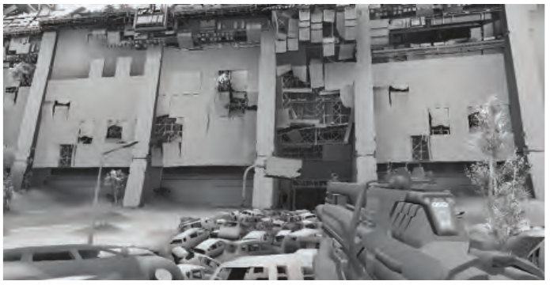

图 11.11　《命运》在间接光照计算中使用预计算环境光遮蔽。这一方案用于两个不同硬件世代的游戏版本，兼顾了高质量与高性能。（图像 ©2013 Bungie, Inc.，保留所有权利。）

《命运》是一款备受好评的游戏，它以预计算环境光遮蔽作为间接光照方案的基础（图 11.11）。该游戏在两代主机硬件交替时期发行，需要一种既满足新平台高质量预期、又适应旧平台性能及内存限制的方案。游戏中一天内的时间动态变化，因此任何预计算方案都必须正确考虑这一点。开发者因环境光遮蔽外观可信且成本低而选择了它。由于环境光遮蔽把可见性计算与光照分离，无论一天中的哪个时间都可以使用同一份预计算数据。Sloan 等人 [1658] 描述了完整系统，包括基于 GPU 的烘焙流水线。

育碧的《刺客信条》[1692] 与《孤岛惊魂》[1154] 系列，也使用某种形式的预计算环境光遮蔽来补充其间接光照方案。它们从俯视视角渲染世界，并处理得到的深度图，计算大尺度遮蔽。通过各种启发式方法，根据邻近深度样本的分布估计遮蔽值。把物体的世界空间位置投影到纹理空间，就能将得到的世界空间 AO 贴图应用于所有物体。他们把这种方法称为 World AO。Swoboda [1728] 也描述了一种类似的方法。

## 11.3.5 动态计算环境光遮蔽

对于静态场景，环境光遮蔽因子  和弯曲法线 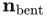 可以预计算。但对于物体正在移动或改变形状的场景，即时计算这些因子能得到更好的结果。这类方法可以分成两组：在物体空间中工作的方法，以及在屏幕空间中工作的方法。

离线环境光遮蔽计算方法通常从每个表面点向场景发射大量射线，数量从几十条到几百条不等，并检查是否相交。这是一项昂贵的操作，因此实时方法重点研究如何近似或避免其中的大部分计算。

Bunnell [210] 把表面建模为放置在网格顶点上的一组圆盘状元素，从而计算环境光遮蔽因子  和弯曲法线 。选择圆盘，是因为一个圆盘对另一个圆盘的遮蔽可以解析计算，从而无需投射射线。简单地将其他所有圆盘对某个圆盘的遮蔽因子相加，会因重复阴影而得到过暗的结果。也就是说，如果一个圆盘位于另一个圆盘后面，两者都会被计为遮挡表面，尽管本来只应计入较近的圆盘。Bunnell 使用一种巧妙的两遍方法来避免这一问题。第一遍计算包含重复阴影的环境光遮蔽；第二遍根据第一遍算出的每个圆盘所受的遮蔽，降低该圆盘的贡献。这是一种近似，但实际结果令人信服。

计算每一对元素之间的遮蔽，是 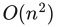 量级的操作，除最简单的场景外，开销都过高。对远处表面使用简化表示可以降低成本。Bunnell 为元素构建一棵层次树，其中每个节点都是一个圆盘，代表树中其下方圆盘的聚合。计算圆盘之间的遮蔽时，对更远处的表面使用更高层节点。这将计算量降低到合理得多的 O(n log n)。Bunnell 的技术相当高效，并能产生高质量结果。例如，它曾用于《加勒比海盗》系列电影的最终渲染 [265]。

Hoberock [751] 对 Bunnell 的算法提出若干修改，以更高的计算开销换取质量提升。他还给出一个距离衰减因子，产生的结果与 Zhukov 等人 [1970] 提出的遮暗因子相似。

Evans [444] 描述了一种基于有符号距离场（signed distance field，SDF）的动态环境光遮蔽近似方法。在这种表示中，物体嵌入一个三维网格。网格的每个位置存储到物体最近表面的距离。处于任意物体内部的点取负值，处于所有物体外部的点取正值。Evans 为场景创建 SDF，并将其存储在体纹理中。为了估计物体上某个位置的遮蔽，他使用一种启发式方法，组合沿法线、距离表面逐渐增大的一些采样点的值。当 SDF 以解析形式表示（第 17.3 节）、而非存储在三维纹理中时，也能采用相同的方法，Quílez [1450] 对此进行了介绍。虽然该方法不符合物理规律，但结果在视觉上令人满意。

Wright [1910] 进一步扩展了将有符号距离场用于环境光遮蔽的方法。他没有使用临时设计的启发式规则来生成遮蔽值，而是执行锥体追踪。锥体起于正在着色的位置，并与距离场中编码的场景表示进行相交测试。锥体追踪通过沿轴线前进若干步来近似：每一步都检查 SDF 与一个半径不断增大的球体是否相交。如果到最近遮挡物的距离（从 SDF 采样得到的值）小于球体半径，锥体的这一部分便被遮挡（图 11.12）。只追踪单个锥体不够精确，而且无法纳入余弦项。因此，Wright 追踪一组覆盖整个半球的锥体，以估计环境光遮蔽。为了提高视觉保真度，他的方案不仅使用场景的全局 SDF，还使用表示单个物体或逻辑上相连的一组物体的局部 SDF。

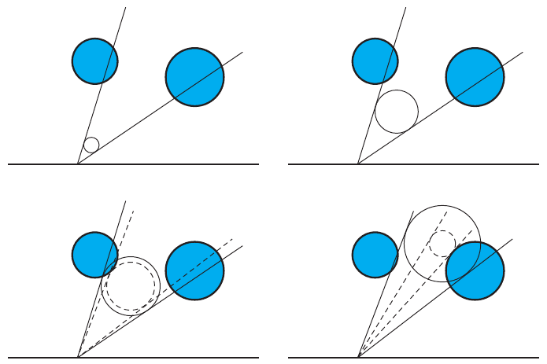

图 11.12　通过让场景几何体与半径逐渐增大的球体执行一系列相交测试，来近似锥体追踪。球体的大小对应于距追踪起点给定距离处的锥体半径。每一步都减小锥角，以计入场景几何体造成的遮蔽。最终遮蔽因子估计为裁剪后锥体所张立体角与原始锥体立体角之比。

Crassin 等人 [305] 在场景体素表示的背景下描述了类似方法。他们使用稀疏体素八叉树（第 13.10 节）存储场景体素化的结果。他们的环境光遮蔽计算算法，是一种用于渲染完整全局光照效果的更通用方法的特殊情况（第 11.5.7 节）。

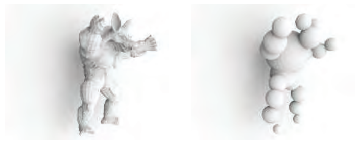

图 11.13　环境光遮蔽效果是模糊的，不会显现遮挡物的细节。AO 计算可以使用简单得多的几何表示，仍然产生可信效果。犰狳模型（左）用一组球体（右）近似。两个模型在身后墙面上投下的遮蔽几乎没有区别。（模型由斯坦福计算机图形学实验室提供。）

Ren 等人 [1482] 把遮挡几何体近似为球体集合（图 11.13）。表面点被单个球体遮挡时的可见性函数用球谐函数表示。被一组球体遮挡时的总可见性函数，是各个球体可见性函数相乘的结果。遗憾的是，计算球谐函数乘积是一项昂贵的操作。他们的关键思路是，将各个球谐可见性函数的对数相加，再对结果求指数。这样得到的最终结果与可见性函数直接相乘相同，但球谐函数求和的成本远低于相乘。论文表明，采用合适的近似后，对数与指数运算可以快速完成，从而实现整体加速。

这种方法计算的不只是环境光遮蔽因子，而是以球谐函数表示的完整球面可见性函数（第 10.3.2 节）。第一个系数（0 阶）可以用作环境光遮蔽因子 ，接下来的三个系数（1 阶）可以用来计算弯曲法线 。更高阶的系数可以用于环境贴图或圆形光源的阴影。由于几何体近似为包围球，褶皱和其他细小细节造成的遮蔽不会被模拟。

Sloan 等人 [1655] 在屏幕空间中累加 Ren 所描述的可见性函数。对于每个遮挡物，他们考虑到其中心的世界空间距离位于指定范围内的一组像素。可以通过渲染一个球体，并在着色器中执行距离测试或使用模板测试，来实现这一操作。对于所有受影响的屏幕区域，将适当的球谐值加到离屏缓冲区。在累加完所有遮挡物的可见性后，对缓冲区中的值求指数，便得到每个屏幕像素最终的组合可见性函数。Hill [737] 使用相同的方法，但将球谐可见性函数限制为仅使用二阶系数。在这一假设下，球谐乘积只需少量标量乘法，甚至可以由 GPU 的固定功能混合硬件执行。因此，即使性能有限的主机硬件也能使用该方法。由于采用低阶球谐函数，它无法生成边界更清晰的硬阴影，而只能产生大体没有方向性的遮蔽。

## 11.3.6 屏幕空间方法

物体空间方法的开销与场景复杂度成正比。不过，仅凭已经可用的屏幕空间数据，例如深度和法线，也能推断出某些遮蔽信息。这类方法的成本恒定，与场景有多少细节无关，只取决于渲染分辨率。注1

**注1：** 实际上，执行时间仍取决于深度或法线缓冲区中数据的分布，因为这种分布会影响遮蔽计算逻辑利用 GPU 缓存的效率。

Crytek 开发了一种动态屏幕空间环境光遮蔽（screen-space ambient occlusion，SSAO）方法，用于《孤岛危机》[1227]。他们在一个全屏处理遍中计算环境光遮蔽，唯一的输入是 z 缓冲区。通过对像素位置周围一个球体内分布的一组点与 z 缓冲区进行测试，估计该像素的环境光遮蔽因子 。 是位于相应 z 缓冲值前方的样本数量的函数。通过测试的样本越少， 就越低。参见图 11.14。样本的权重随到该像素的距离增加而减小，类似于遮暗因子 [1970]。注意，由于样本没有用 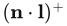 因子加权，得到的环境光遮蔽并不正确。它没有只考虑表面位置上方半球内的样本，而是将全部样本统计并计入。这一简化意味着表面下方本不该参与的样本也被计入，导致平坦表面变暗，而边缘比周围更亮。尽管如此，其结果通常仍然具有令人满意的视觉效果。参见图 11.15。

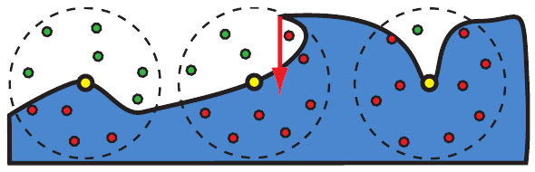

图 11.14　将 Crytek 的环境光遮蔽方法应用于三个表面点（黄色圆点）。为清楚起见，图中以二维形式展示算法，摄像机（未画出）位于图的上方。本例在每个表面点周围的圆盘内分布十个样本（实际是在球体内分布）。未通过 z 测试的样本，即位于已存储 z 缓冲值之后的样本，显示为红色；通过的样本显示为绿色。 是通过测试样本数占总样本数比例的函数。为简化说明，这里忽略可变的样本权重。左侧点的 10 个样本中有 6 个通过测试，比值为 0.6，据此计算 。中间的点有三个通过测试的样本；另一个样本虽位于物体外部，却未通过 z 测试，如红色箭头所示。由此得到  为 0.3。右侧点只有一个样本通过，因此  为 0.1。

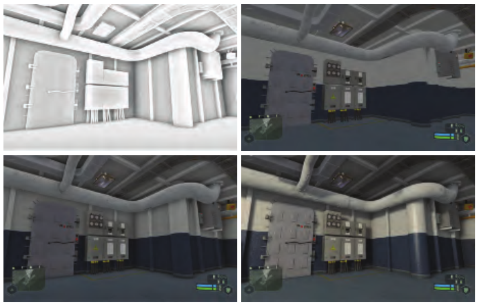

图 11.15　左上展示屏幕空间环境光遮蔽效果。右上展示没有环境光遮蔽的反照率（漫反射颜色）。左下将两者组合。再加入镜面着色与阴影，就得到右下的最终图像。（《孤岛危机》图像由 Crytek 提供。）

Shanmugam 和 Arikan [1615] 同期开发了一种类似方法。他们的论文描述了两种方案：一种从附近的小细节生成精细的环境光遮蔽，另一种从较大的物体生成粗略的环境光遮蔽。将两者结果组合，得到最终环境光遮蔽因子。他们的细尺度环境光遮蔽方法使用一个全屏处理遍，访问 z 缓冲区以及另一个包含可见像素表面法线的缓冲区。对于每个待着色像素，从 z 缓冲区采样附近像素。把采样像素表示为球体，并在考虑待着色像素法线的情况下，为其计算遮蔽项。它没有处理重复阴影，因此结果有些偏暗。他们的粗尺度遮蔽方法与书页 456 讨论的 Ren 等人 [1482] 的物体空间方法相似，都把遮挡几何体近似为球体集合。但 Shanmugam 和 Arikan 在屏幕空间中累加遮蔽，使用与屏幕对齐的公告板覆盖每个遮挡球的“影响区域”。与 Ren 等人的方法不同，粗尺度遮蔽方法同样没有处理重复阴影。

这两种方法极为简单，很快就引起工业界与学术界的注意，催生了大量后续研究。许多方法，例如 Filion 等人 [471] 用于《星际争霸 II》的方法，以及 McGuire 等人 [1174] 的可扩展环境遮暗（scalable ambient obscurance），都使用特设的启发式规则来生成遮蔽因子。这类方法性能良好，并提供一些可手动调节的参数，以获得预期的艺术效果。

另一些方法则试图为遮蔽计算提供更有理论依据的方式。Loos 和 Sloan [1072] 注意到，Crytek 的方法可以解释为蒙特卡洛积分。他们将计算得到的值称为体积遮暗（volumetric obscurance），定义为：

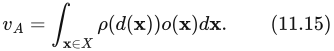

其中 X 是该点周围的三维球形邻域，ρ 是类似于式 11.11 的距离映射函数，d 是距离函数，o(**x**) 是占据函数：**x** 未被占据时为零，否则为一。他们指出，ρ(d) 函数对最终视觉质量影响很小，因此使用常量函数。在这一假设下，体积遮暗就是在一点的邻域内对占据函数求积分。Crytek 的方法通过随机采样三维邻域来计算该积分。Loos 和 Sloan 则通过随机采样像素的屏幕空间邻域，在 x、y 维度上进行数值积分，而在 z 维度上进行解析积分。如果该点的球形邻域内没有任何几何体，积分就等于射线与表示 X 的球体相交所形成线段的长度。存在几何体时，将深度缓冲区用作占据函数的近似，并只在每条线段未被占据的部分求积分。参见图 11.16 左图。该方法生成的结果质量与 Crytek 的方法相当，但所需样本更少，因为其中一个维度上的积分是精确的。如果有表面法线可用，还能扩展该方法，将法线考虑在内。在这一版本中，线积分的求值范围截断于求值点法线定义的平面。

> 译注：原书式 11.15 及紧随其后的定义令 o 在“被占据”时为 1，但后文及图 11.16 描述的却是对“未被占据”部分积分，两处约定不一致。这里分别按原文保留；若按后文计算未占据体积，应使用占据函数的补函数 1 − o。

Szirmay-Kalos 等人 [1733] 提出另一种利用法线信息的屏幕空间方案，称为体积环境光遮蔽（volumetric ambient occlusion）。式 11.6 在法线周围的半球上积分，并包含余弦项。他们提出，可以从被积函数中去掉余弦项，再用余弦分布限制积分范围，从而近似这类积分。这会把半球上的积分变成球体上的积分：这个球体半径减半，并沿法线平移，使其完全位于原半球内部。其未占据部分的体积按照 Loos 和 Sloan 的方法计算，即随机采样像素邻域，并在 z 维度上对占据函数作解析积分。参见图 11.16 右图。

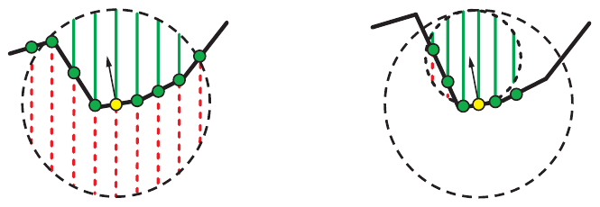

图 11.16　体积遮暗（左）利用线积分，估计点周围未占据体积的积分。体积环境光遮蔽（右）也使用线积分，不过是计算与着色点相切的球体的占据情况，从而模拟反射方程中的余弦项。两种情况下，积分均由球体未占据体积（绿色实线所标）与球体总体积之比估计；总体积是未占据体积与被占据体积之和，后者用红色虚线标出。两图的摄像机均从上方观察。绿色圆点表示从深度缓冲区读取的样本，黄色圆点是正在计算遮蔽的样本。

Bavoil 等人 [119] 针对局部可见性估计问题提出另一种方法，其灵感来自 Max [1145] 的地平线映射技术。他们的方法称为基于地平线的环境光遮蔽（horizon-based ambient occlusion，HBAO），假设 z 缓冲区的数据表示一个连续高度场。可以通过确定地平线角来估计一点的可见性；地平线角就是邻域在切平面上方遮挡到的最大角度。也就是说，从一点沿给定方向观察，记录可见最高物体的角度。如果忽略余弦项，环境光遮蔽因子可以通过对地平线上方未遮挡部分积分得到，或者等价地，以一减去地平线下方被遮挡部分的积分：

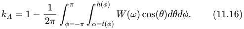

其中 h(φ) 是切平面上方的地平线角，t(φ) 是切平面与视向量之间的切线角，W(ω) 是衰减函数。参见图 11.17。1/(2π) 项对积分归一化，使结果位于零与一之间。

> 译注：式 11.16 的内层积分下限原书印为 α = t(φ)，而积分变量写作 θ；二者不一致，疑似排印问题。此处保留原式。该式中的 cos(θ) 是此坐标参数化的积分权重，不应与前文所说忽略的表面法线余弦加权项混同。

对于给定 φ，按到定义地平线的点的距离采用线性衰减，就可以解析计算内层积分：

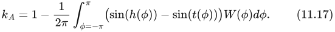

剩余积分通过采样若干方向并求取地平线角来进行数值计算。

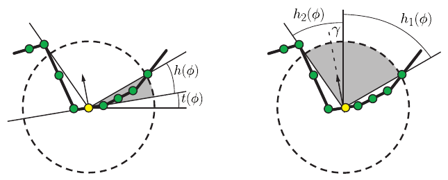

图 11.17　基于地平线的环境光遮蔽（左）寻找切平面上方的地平线角 h，并对它们之间未遮挡的角度积分。切平面与视向量之间的角记为 t。真值环境光遮蔽（右）使用相同的地平线角 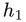 和 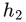，但还利用法线与视向量之间的夹角 γ，把余弦项纳入计算。两图中摄像机均从上方观察场景。图中展示的是截面；地平线角是 φ 的函数，φ 是绕观察方向的角度。绿色圆点表示从深度缓冲区读取的样本；黄色圆点表示正在计算遮蔽的样本。

Jimenez 等人 [835] 也采用基于地平线的思路，并将其方法称为真值环境光遮蔽（ground-truth ambient occlusion，GTAO）。他们的目标是在唯一可用信息为 z 缓冲数据所形成高度场的假设下，得到与射线追踪结果一致的真值结果。HBAO 的定义没有包含余弦项，还加入了式 11.8 中不存在的特设衰减，因此它的结果虽然接近射线追踪，却并不相同。GTAO 补入缺少的余弦因子，去掉衰减函数，并在围绕视向量的参考系中表述遮蔽积分。遮蔽因子定义为：

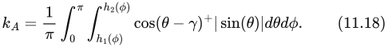

其中 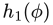 和 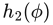 是给定 φ 时左右两侧的地平线角，γ 是法线与观察方向之间的夹角。由于包含余弦项，归一化项 1/π 与 HBAO 不同；余弦项使开放半球上的积分等于 π，而不包含余弦项时积分等于 2π。在高度场假设下，这一表述与式 11.8 完全一致。参见图 11.17。内层积分仍可解析求解，因此只需数值计算外层积分。积分方式与 HBAO 相同，即在给定像素周围采样若干方向。

在基于地平线的方法中，开销最大的部分是沿屏幕空间直线采样深度缓冲区，以确定地平线角。Timonen [1771] 提出一种专门改善这一步性能的方法。他指出，对于沿屏幕空间直线排列的像素，用来估计给定方向地平线角的样本可以大量复用。他将遮蔽计算分成两步。首先，在整个 z 缓冲区上进行直线追踪。沿直线前进的每一步，他都在考虑指定最大影响距离的同时更新地平线角，并将信息写入缓冲区。对于地平线映射采用的每个屏幕空间方向，都建立这样一个缓冲区。这些缓冲区不必与原深度缓冲区大小相同。其大小取决于直线间距以及沿线步进间距；选择这些参数时有一定灵活性，不同设置会影响最终质量。

第二步，根据缓冲区存储的地平线信息计算遮蔽因子。Timonen 使用 HBAO 定义的遮蔽因子（式 11.17），但也可以替换成其他遮蔽估计器，例如 GTAO（式 11.18）。

深度缓冲区并不是场景的完美表示，因为它只记录给定方向上最近的物体，我们不知道物体后面是什么。许多方法使用各种启发式规则，尝试推断可见物体的厚度信息。这些近似足以应付许多情况，而且人眼能够容忍一定误差。虽然也有使用多层深度来缓解问题的方法，但由于与渲染引擎集成复杂、运行成本高，它们始终未能广泛普及。

屏幕空间方法依靠反复采样 z 缓冲区，为给定点周围的几何体构建某种简化模型。实验表明，要达到较高视觉质量，可能需要多达几百个样本。然而，为了用于交互式渲染，通常最多只能采用 10—20 个样本，往往还更少。Jimenez 等人 [835] 报告，为了满足 60 FPS 游戏的性能预算，他们每像素只能负担一个样本！为了缩小理论与实践的差距，屏幕空间方法通常采用某种空间抖动。最常见的形式是每个屏幕像素使用略有不同的一组随机样本，对样本作旋转或径向位移。在 AO 主计算阶段之后，再执行一次全屏滤波。采用联合双边滤波（第 12.1.1 节），避免跨越表面不连续处进行滤波，并保留锐利边缘。它利用已有的深度或法线信息，把参与滤波的样本限制为属于同一表面的样本。有些方法使用随机变化的采样模式以及通过实验选出的滤波核；另一些方法则在固定大小的屏幕空间模式（例如 4 × 4 像素）中重复使用样本集，并将滤波器限制在这一邻域内。

环境光遮蔽计算还经常沿时间进行超采样 [835, 1660, 1916]。通常的做法是每帧采用不同采样模式，并对遮蔽因子进行指数平均。利用上一帧的 z 缓冲区、摄像机变换以及动态物体运动信息，将上一帧数据重投影到当前视图，再与当前帧的结果混合。通常采用基于深度、法线或速度的启发式规则，检测上一帧数据不可靠、应予丢弃的情况，例如新物体进入视野。第 5.4.2 节在更一般的背景下解释了时间超采样与抗锯齿技术。时间滤波成本低，也容易实现；虽然它并非始终完全可靠，但实际中大多数问题并不明显。这主要是因为环境光遮蔽从不直接显示，而只是光照计算的一个输入。将这种效果与法线贴图、反照率纹理以及直接光照组合之后，细小伪影会被掩盖，不再可见。

## 11.3.7 使用环境光遮蔽着色

尽管我们是在恒定、远距离照明的背景下推导环境光遮蔽值，也可以将它应用于更复杂的光照情形。再次考虑反射方程：

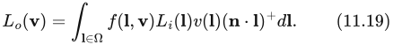

上式包含第 11.3.1 节引入的可见性函数 v(**l**)。如果处理的是漫反射表面，可以用朗伯 BRDF 替换 f(**l**, **v**)，它等于次表面反照率  除以 π。于是得到：

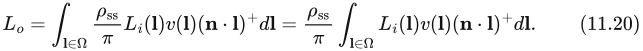

对上式改写，可得：

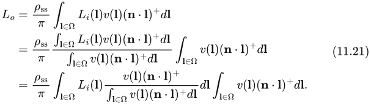

利用式 11.8 中环境光遮蔽的定义，上式简化为：

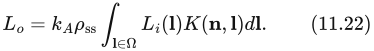

其中：

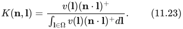

这种形式为理解这一过程提供了新的角度。式 11.22 的积分可以看作向入射辐亮度  应用方向性滤波核 K。滤波器 K 随空间位置与方向发生复杂变化，但具有两个重要性质。第一，由于点积被截断，它最多只覆盖点 **p** 处法线周围的半球。第二，由于分母的归一化因子，它在半球上的积分等于一。

为了着色，需要计算两个函数乘积的积分，这两个函数分别为入射辐亮度  和滤波函数 K。在某些情况下，可以简化描述滤波器，以较低成本计算这一双函数乘积积分，例如  和 K 都用球谐函数表示时（第 10.3.2 节）。处理该方程复杂性的另一种方式，是用性质相近、但更简单的滤波器进行近似。最常见的选择是归一化余弦核 H：

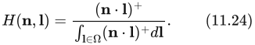

当没有任何东西阻挡入射光照时，这一近似是准确的。它覆盖的角度范围也与被近似的滤波器相同。它完全忽略可见性，但式 11.22 中仍然存在环境光遮蔽项 ，因此着色表面上仍会出现一定程度的、取决于可见性的变暗。

选择这一滤波核后，式 11.22 变为：

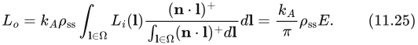

这意味着，最简单形式的环境光遮蔽着色，只需计算辐照度，再乘以环境光遮蔽值。辐照度可以来自任何来源，例如从辐照度环境贴图采样（第 10.6 节）。这种方法的准确性只取决于近似滤波器对正确滤波器的拟合程度。对于在球面上平滑变化的光照，该近似能够给出可信结果。如果所有可能方向上的  都相同，也就是场景仿佛被一幅全白的环境贴图照明，那么它也完全准确。

这一表述也有助于理解，为什么环境光遮蔽不能很好地近似点状光源或小面积光源的可见性。它们在表面上只张成很小的立体角；对点状光源而言，立体角为无穷小。可见性函数会对光照积分值产生重要影响。它几乎以二值方式控制光的贡献，即要么完全启用，要么完全禁用。像式 11.25 那样忽略可见性，是一种相当大的近似，通常无法产生预期结果。阴影缺乏清晰度，也没有预期的方向性，也就是说，它们看起来不像由某个特定光源产生。环境光遮蔽并不适合模拟这类光源的可见性，应改用阴影贴图等其他方法。不过，有时会用小型局部光源来模拟间接照明，在这种情况下，用环境光遮蔽值调制其贡献是合理的。

到目前为止，我们都假定正在为朗伯表面着色。当处理更复杂、非常量的 BRDF 时，就不能像式 11.20 那样把该函数移到积分之外。对于镜面材质，K 不仅依赖可见性和法线，还依赖观察方向。典型微表面 BRDF 的波瓣在定义域内变化显著。用一个预先确定的单一形状近似它过于粗糙，无法产生可信结果。这就是为什么环境光遮蔽最适合用于漫反射 BRDF 着色。接下来各节讨论的其他方法，更适合复杂的材质模型。

使用弯曲法线（参见书页 448 的式 11.10）可以看作更精确地近似滤波器 K 的方式。滤波器中仍然没有可见性项，但它的最大值方向与平均未遮挡方向一致，因此总体上对式 11.23 的近似稍好一些。当几何法线与弯曲法线不一致时，使用后者会得到更准确的结果。Landis [974] 不仅将它用于环境贴图着色，还将它用于某些直接光源，替代常规阴影技术。

对于环境贴图着色，Pharr [1412] 提出另一种方案，利用 GPU 的纹理滤波硬件动态执行滤波。滤波器 K 的形状即时确定：其中心位于弯曲法线方向，大小取决于  的值。这能更精确地匹配式 11.23 中的原始滤波器。
