# 11.5 漫反射全局光照

来源：《Real-Time Rendering, Fourth Edition》，书页 472—497（PDF 物理页 493—518）。范围从 11.5 标题起，至 11.6 标题前，包含 11.5.1—11.5.9。图 11.21 属于前节；本节原图为 11.22—11.35。技术陈述保留原书出版时的语境。

接下来的几节介绍各种实时模拟方法，它们不仅模拟遮挡，还模拟完整的光线反弹。这些算法大致可以分为两类：一类假设光线到达眼睛前的最后一次反弹发生在漫反射表面上，另一类则假设发生在镜面反射表面上。相应的光线路径分别可以写成 L(D|S)∗DE 和 L(D|S)∗SE，其中许多方法还会对更早的反弹类型施加某些限制。第一类解决方案假设，着色点上方半球内的入射光照变化平缓，或者干脆忽略这种变化。第二类算法则假设光照随入射方向的变化率很高。它们利用的是这样一个事实：只会在相对较小的立体角范围内访问光照。由于两类方法的约束截然不同，将其分开处理很有益。本节介绍漫反射全局光照方法，下一节介绍镜面反射全局光照，最后一节则介绍有前景的统一方法。

## 11.5.1 表面预光照

辐射度和路径追踪都面向离线使用。虽然人们曾尝试将它们用于实时场景，但结果仍然不够成熟，尚不能用于生产。目前最常见的做法，是用它们预计算与光照有关的信息。先执行开销高昂的离线过程，把结果存储下来，随后在显示时使用，以提供高质量光照。如 11.3.4 节所述，对静态场景进行这样的预计算称为烘焙。

这种做法有一些限制。如果提前执行光照计算，就不能在运行时改变场景配置。场景中的所有几何体、光源和材质都必须保持不变。我们不能改变一天中的时间，也不能在墙上炸出一个洞。在许多情况下，这种限制是可以接受的取舍。建筑可视化可以假定用户只是在虚拟环境中走动。游戏同样会限制玩家的行为。在这类应用中，可以把几何体分为静态物体和动态物体。静态物体参与预计算过程，并与光照充分交互。静态墙壁投射阴影，静态红地毯反弹红光。动态物体则仅作为接收者，不遮挡光，也不产生间接光照效果。在这些场景中，动态几何体通常被限制为相对较小的物体，这样便可以忽略它对其余光照的影响，或使用其他技术加以模拟，而质量损失很小。例如，动态几何体可以使用屏幕空间方法产生遮挡。典型的动态物体包括角色、装饰性几何体和车辆。

可以预计算的最简单光照信息是辐照度。对于平坦的朗伯表面，辐照度与表面颜色结合，就能完整描述材质对光照的响应。由于一个照明源的影响独立于其他照明源，因此可以在预计算辐照度之上叠加动态光源（图 11.22）。

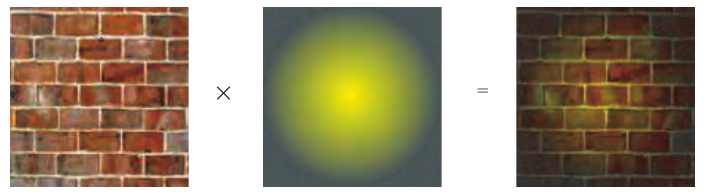

图 11.22。对于法线已知的朗伯表面，可以预计算其辐照度。运行时，将此值与实际表面颜色相乘（例如来自纹理的颜色），便得到反射辐亮度。根据表面颜色的具体形式，可能还需要额外除以 π，才能确保能量守恒。

1996 年的《Quake》和 1997 年的《Quake II》是最早使用预计算辐照度值的商业交互式应用。《Quake》预计算静态光源的直接贡献，主要目的是提高性能。《Quake II》还加入了间接分量，成为首款使用全局光照算法生成更真实光照的游戏。它采用了基于辐射度的算法，因为这一技术非常适合计算朗伯环境中的辐照度。此外，当时的内存限制要求光照的分辨率相对较低，这也与辐射度解典型的模糊、低频阴影相吻合。

预计算辐照度值通常与存储在另一组纹理中的漫反射颜色或反照率贴图相乘。虽然理论上可以将辐射出射度（辐照度乘以漫反射颜色）预计算并存储在同一组纹理中，但许多实际因素使得这种选择在大多数情况下不可行。颜色贴图通常具有相当高的频率，会采用各种平铺方式，而且其局部经常在模型上重复使用，这些都是为了使内存占用保持合理。辐照度值的频率通常低得多，也不容易重复使用。将光照与表面颜色分开，消耗的内存要少得多。

如今，除了限制最严格的硬件平台之外，已经很少直接使用预计算辐照度。按定义，辐照度是针对给定法线方向计算的，因此不能使用法线映射提供高频细节。这也意味着，只能为平坦表面预计算辐照度。如果需要把烘焙光照用于动态几何体，就需要其他存储方法。这些限制促使人们寻找带有方向分量的预计算光照存储方式。

## 11.5.2 带方向的表面预光照

要在朗伯表面上同时使用预光照和法线映射，就需要一种表示辐照度如何随表面法线变化的方法。为了给动态几何体提供间接光照，还需要知道每一种可能的表面朝向所对应的辐照度值。幸运的是，我们已经有了表示这类函数的工具。10.3 节介绍了确定依赖于法线方向的光照的各种方法。其中包括一些专门用于半球函数定义域的方案：在这类情况下，球体下半部的值无关紧要，不透明表面就是如此。

最通用的方法是存储完整的球面辐照度信息，例如使用球谐函数。这种方案最初由 Good 和 Taylor [564] 在加速光子映射的背景下提出，Shopf 等人 [1637] 则将它用于实时环境。两者都把带方向的辐照度存储在纹理中。如果使用九个球谐系数（三阶 SH），质量非常出色，但存储和带宽成本都很高。仅使用四个系数（二阶 SH）开销较低，但会丢失许多微妙细节，光照对比度降低，法线贴图的效果也不那么明显。

Chen [257] 在《Halo 3》中采用了这一方法的变体，目的是以较低成本达到三阶 SH 的质量。他从球面信号中提取出最主要的光源，将其颜色和方向单独存储。剩余部分使用二阶 SH 编码。这样就把系数数量从 27 降到了 18，而质量损失很小。Hu [780] 描述了进一步压缩这些数据的方法。Chen 和 Tatarchuk [258] 还提供了关于其生产中使用的 GPU 烘焙流水线的更多信息。

Habel 等人 [627] 的 H 基是另一种可选方案。因为它只编码半球信号，所以能够以更少的系数获得与球谐函数相同的精度。仅用六个系数，就能得到接近三阶 SH 的质量。由于该基仅定义在半球上，因此需要表面上的某个局部坐标系来正确确定它的朝向。通常使用由 uv 参数化得到的切线标架。如果将 H 基分量存储在纹理中，纹理分辨率应足够高，以适应底层切线空间的变化。如果切线空间差异显著的多个三角形覆盖同一个纹素，重建信号就不准确。

球谐函数和 H 基都有一个问题，即可能产生振铃（10.6.1 节）。虽然预滤波可以减轻这一现象，但它也会平滑光照，而这未必总是我们希望的。此外，即使是开销较低的变体，在存储和计算方面仍有相对较高的成本。在限制更加严格的情况下，例如低端平台或虚拟现实渲染，这种开销可能无法承受。

正因为成本问题，简单的替代方案仍然很流行。《Half-Life 2》使用了一种自定义半球基（10.3.3 节），存储三个颜色值，每个样本共九个系数。环境／高光／方向（ambient/highlight/direction，AHD）基（10.3.3 节）虽然简单，也是很受欢迎的选择。它已用于《Call of Duty》系列 [809, 998] 和《The Last of Us》[806] 等游戏，见图 11.23。

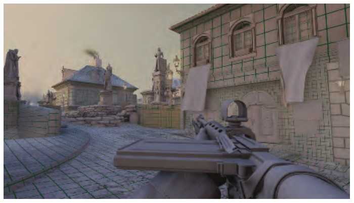

图 11.23。《Call of Duty: WWII》使用 AHD 表示法，在光照贴图中编码光照随方向的变化。调试模式下用网格可视化光照贴图的密度。每个方格对应一个光照贴图纹素。（图片由 Activision Publishing, Inc. 提供，2018。）

Crytek 在《Far Cry》中采用了一个变体 [1227]。Crytek 的表示由切线空间中的平均光照方向、平均光照颜色和一个标量方向性因子组成。最后这个值用于在环境分量和方向分量之间混合，两者使用同一种颜色。这样，每个样本只需存储六个系数：三个颜色值、两个方向值和一个方向性因子。Unity 引擎在其一种模式中也采用了类似方法 [315]。

这类表示是非线性的。严格来说，无论在纹素之间还是顶点之间，对各分量做线性插值，在数学上都不正确。如果主光源方向变化很快，例如在阴影边界处，着色中可能出现视觉伪影。尽管存在这些不准确之处，结果在视觉上仍然令人满意。环境光区域与方向光照亮区域之间具有较高对比度，因此法线贴图的效果会得到强化，而这往往是所希望的。此外，在计算 BRDF 的镜面响应时，也可以使用方向分量，为低光泽材质提供一种成本低廉的环境贴图替代方案。

另一端则是为高视觉质量设计的方法。Neubelt 和 Pettineo [1268] 在游戏《The Order: 1886》中使用存储球面高斯系数的纹理贴图（图 11.24）。他们存储的是入射辐亮度，而非辐照度，并将其投影到一组在切线标架中定义的高斯波瓣上（10.3.2 节）。根据特定场景中光照的复杂程度，他们使用五到九个波瓣。为了产生漫反射响应，将球面高斯与沿表面法线方向的余弦波瓣卷积。该表示的精度也足以通过将高斯与镜面 BRDF 波瓣卷积，提供低光泽的镜面效果。Pettineo 详细描述了整个系统 [1408]，并提供了一个能够烘焙和渲染不同光照表示的应用程序的源代码。

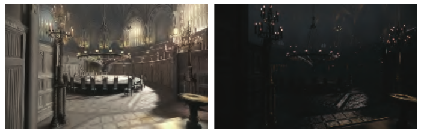

图 11.24。《The Order: 1886》在光照贴图中存储投影到一组球面高斯波瓣上的入射辐亮度。运行时，将辐亮度与余弦波瓣卷积来计算漫反射响应（左），与形状适当的各向异性球面高斯卷积来生成镜面响应（右）。（图片由 Ready at Dawn Studios 提供，版权归 Sony Interactive Entertainment 所有。）

如果需要任意方向的光照信息，而不仅是表面上方一个半球内的信息，例如为了给动态几何体提供间接光照，可以采用编码完整球面信号的方法。球谐函数在此非常合适。内存不是主要顾虑时，三阶 SH（每个颜色通道九个系数）是常见选择；否则使用二阶 SH（每个颜色通道四个系数，恰好与 RGBA 纹理的分量数相同，因此一张贴图就能存储一个颜色通道的系数）。球面高斯同样能用于完整球面，因为波瓣既可以分布在整个球面上，也可以只分布在法线周围的半球上。不过，完整球面技术需要用波瓣覆盖的立体角是半球的两倍，因此可能需要更多波瓣才能保持相同质量。

如果想避免处理振铃，又无法承担大量波瓣的开销，环境立方体 [1193]（10.3.1 节）是一种可行替代。它由沿主坐标轴定向的六个截断 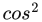 波瓣组成。余弦波瓣具有局部支撑，也就是仅在球面定义域的一个子集上非零，因此每个波瓣只覆盖一个半球。正因如此，重建时在存储的六个值中只需要三个可见波瓣。这限制了光照计算的带宽成本。重建质量与二阶球谐函数相近。

环境骰子 [808]（同见 10.3.1 节）可以提供比环境立方体更高的质量。它采用沿正二十面体顶点方向定向的十二个波瓣，各波瓣是  和 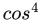 波瓣的线性组合。重建时使用十二个存储值中的六个。质量与三阶球谐函数相当。这些以及其他类似表示，例如由三个  波瓣和一个经变形以覆盖整个球面的余弦波瓣组成的基，已在许多商业上成功的游戏中使用，其中包括《Half-Life 2》[1193]、《Call of Duty》系列 [766, 808]、《Far Cry 3》[533]、《Tom Clancy’s The Division》[1694] 和《Assassin’s Creed 4: Black Flag》[1911]，等等。

## 11.5.3 预计算传输

预计算光照虽然可以非常出色，但本质上是静态的。几何体或光照的任何变化，都可能使整个解失效。就像现实世界中，拉开窗帘（场景几何体的局部变化）可能让整个房间充满光（光照的全局变化）。人们投入了大量研究精力，寻找允许某些类型变化的解决方案。

如果假设场景几何体保持不变，只有光照变化，就可以预计算光与模型的交互方式。在不处理实际辐亮度值的情况下，可以预先在一定程度上分析物体间的相互反射或次表面散射等效果，并存储结果。把入射光照转换为整个场景中辐亮度分布描述的函数，称为传输函数。预计算该函数的解决方案，称为预计算传输或预计算辐亮度传输（precomputed radiance transfer，PRT）方法。

与完全离线烘焙光照不同，这些技术在运行时确实有明显的开销。把场景显示到屏幕上时，需要计算特定光照配置下的辐亮度值。为此，首先将实际数量的直接光“注入”系统，然后应用传输函数，将它传播到整个场景。有些方法假定直接光照来自环境贴图，另一些方案则允许任意配置光照，并灵活地改变它。

Sloan 等人 [1651] 把预计算辐亮度传输的概念引入了图形学。他们用球谐函数描述它，但这一方法并不一定要使用 SH。基本思想很简单：如果用一定数量（最好较少）的“构件”光源描述直接光照，就可以预计算场景受到每个构件照明时的结果。设想一个有三台计算机显示器的房间，假定每台显示器只能显示单一颜色，但亮度可以变化。令各屏幕的最大亮度等于 1，也就是归一化的“单位”亮度。我们可以分别预计算每台显示器对房间的影响，方法可使用 11.2 节所介绍的那些。由于光传输是线性的，三台显示器同时照明场景的结果，等于各显示器直接或间接产生的光的总和。每台显示器的照明不影响其他解，因此把其中一块屏幕的亮度减半，只会改变它自身对总光照的贡献。这样便可以快速计算整个房间中包含反弹的完整光照。取每个预计算光照解，乘以该屏幕的实际亮度，再把结果相加。我们可以开关显示器，使其变亮或变暗，甚至改变颜色；得到最终光照所需的只是这些乘法和加法（图 11.25）。

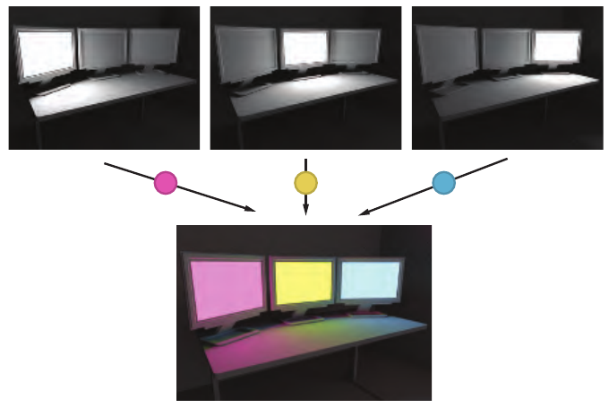

图 11.25。使用预计算辐亮度传输进行渲染的例子。分别预计算三台显示器中每一台产生的完整光传输，得到“单位”响应。由于光传输的线性性质，可以将这些独立的解分别乘以屏幕颜色（本例为粉红、黄和蓝），得到最终光照。

可以写成

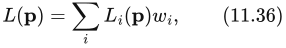

其中，L(𝐩) 是点 𝐩 处的最终辐亮度，(𝐩) 是来自屏幕 i 的预计算单位贡献，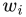 是该屏幕当前的亮度。从数学意义上讲，这个方程定义了一个向量空间， 是该空间的基向量。任何可能的光照都可以由各光源贡献的线性组合产生。

Sloan 等人的原始 PRT 论文 [1651] 使用了同样的推理，不过背景是用球谐函数表示的无限远光照环境。他们存储的并非场景对显示器屏幕的响应，而是场景对周围光照的响应，其分布由球谐基函数定义。对一定数量的 SH 频带执行这一过程后，就可以渲染被任意光照环境照亮的场景。他们将该光照投影到球谐函数上，把得到的各系数分别乘以对应的归一化“单位”贡献，再全部相加，就像前面显示器的例子一样。

注意，用于向场景“注入”光的基，与用于表示最终光照的表示法，可以独立选择。例如，可以用球谐函数描述场景如何被照亮，同时选择另一种基来存储任意给定点接收到的辐亮度。假设使用环境立方体来存储，就要计算有多少辐亮度来自上方、有多少来自侧面。每个方向的传输都将分别存储，而不是以表示总传输的单个标量值来存储。

Sloan 等人的 PRT 论文 [1651] 分析了两种情况。第一种情况是，接收端的基只是表面的一个标量辐照度值。这要求接收者为完全漫反射表面，并且法线预先确定，意味着它不能使用法线贴图表现精细细节。传输函数表现为输入光照的 SH 投影与预计算传输向量的点积，而这个传输向量在场景中随空间位置而变化。

如果要渲染非朗伯材质，或者允许法线映射，可以使用所提出的第二种变体。在这种情况下，周围光照的 SH 投影被变换成给定点入射辐亮度的 SH 投影。这一操作提供了完整球面上的辐亮度分布；对于静态不透明物体，则是半球上的分布。因此，可以正确地将其与任意 BRDF 卷积。传输函数把 SH 向量映射到另一 SH 向量，形式为矩阵乘法。无论计算还是内存，这种乘法操作的开销都很高。如果源端和接收端都采用三阶 SH，就需要为场景中的每个点存储一个 9 × 9 矩阵，而且这些数据仅表示单色传输。如果需要颜色，就需要三个这样的矩阵，每点所需的内存量惊人。

一年后，Sloan 等人 [1652] 针对这一问题提出了处理方法。他们不直接存储传输向量或矩阵，而是使用主成分分析（principal component analysis，PCA）技术分析其整个集合。可以把传输系数看成多维空间中的点，例如 9 × 9 矩阵对应 81 维空间中的点，但这些点的集合并不是均匀分布在该空间中的，而是形成维度较低的簇。这就像沿一条直线分布的三维点，实际上都处在三维空间的一个一维子空间中。PCA 能有效发现这类统计关系。发现子空间后，可以使用少得多的坐标来表示这些点，因为能够以较少的维数存储其在子空间中的位置。继续以直线为例：不必用三个坐标存储点的完整位置，只需存储它沿直线的距离。Sloan 等人用这种方法，把传输矩阵的维度从 625 维（25 × 25 的传输矩阵）降到了 256 维。虽然这对典型实时应用来说仍然过高，但后来的许多光传输算法都采用了 PCA 压缩数据。

这种降维本质上是有损的。少数情况下，数据形成一个完美的子空间，但通常只近似如此，因此把数据投影到该子空间会造成一定退化。为了提高质量，Sloan 等人把传输矩阵集合划分成多个簇，并对每个簇分别执行 PCA。该过程还包含一个优化步骤，确保簇边界上没有不连续。他们还提出了一种允许物体有限形变的扩展，称为局部可变形预计算辐亮度传输（local deformable precomputed radiance transfer，LDPRT）[1653]。

PRT 已以不同形式用于若干游戏。对于玩法主要集中于室外区域，并且一天中的时间与天气条件动态变化的游戏，它尤其流行。《Far Cry 3》和《Far Cry 4》使用的 PRT，其源端基为二阶 SH，接收端基则是一个自定义的四方向基 [533, 1154]。《Assassin’s Creed 4: Black Flag》以一个基函数作为源（太阳颜色），但会针对一天中的不同时刻预计算传输。这种表示可以理解为源端基函数定义在时间维度上，而非方向上。其接收端基与《Far Cry》系列所用的相同。

SIGGRAPH 2005 关于预计算辐亮度传输的课程 [870] 很好地概述了这一领域的研究。Lehtinen [1019, 1020] 给出了一个数学框架，可用于分析不同算法之间的差异和开发新算法。

原始 PRT 方法假设周围光照来自无限远处。虽然这能较好地模拟室外场景的光照，但对室内环境而言限制过强。不过，正如前面所说，这一概念本身完全不依赖最初的照明源。Kristensen 等人 [941] 描述了一种为分散在整个场景中的一组光源计算 PRT 的方法，相当于具有大量“源端”基函数。随后把光源合并成簇，并把接收几何体分成区域，每个区域受到不同光源子集的影响。这一过程大幅压缩了传输数据。运行时，通过对预计算光源集合中最近的光源数据插值，近似任意位置光源产生的照明。Gilabert 和 Stefanov [533] 用这种方法在游戏《Far Cry 3》中生成间接光照。其基本形式只能处理点光源。虽然可以扩展为支持其他类型，但成本会随着每个光源自由度的数量呈指数增长。

前面讨论的 PRT 技术，都是预计算来自一定数量元素的传输，再用这些元素模拟光源。另一类流行方法则预计算表面之间的传输。在这种系统中，实际照明源不再重要。任何光源都可以使用，因为这类方法的输入是一组表面的出射辐亮度，或其他相关量；例如，如果方法假设表面只有漫反射，就可以使用辐照度。这些直接光照计算可以使用阴影（第 7 章）、辐照度环境贴图（10.6 节），或者本章前面讨论的环境遮挡与方向遮挡方法。还可以非常容易地将任意表面的出射辐亮度设为所需值，使其自发光，成为面光源。

按照这些原理工作的系统中，最受欢迎的是 Geomerics 的 Enlighten（图 11.26）。虽然算法的具体细节从未完全公开，但众多演讲与报告已经准确呈现了该系统的原理 [315, 1101, 1131, 1435]。

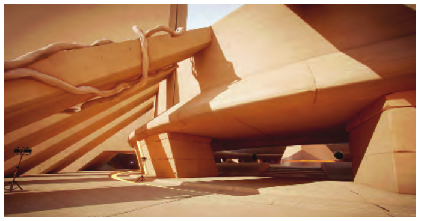

图 11.26。Geomerics 的 Enlighten 能够实时生成全局光照效果。图中展示了它与 Unity 引擎集成的一个例子。用户可以自由改变一天中的时间，也可以开关光源。所有间接光照都会相应地实时更新。（Courtyard 演示，© Unity Technologies，2015。）

系统假设场景为朗伯场景，但这一假设仅用于光传输。使用 Heckbert 记法，它处理的路径集合是 LD∗(D|S)E，因为到达眼睛前的最后一个表面不必仅有漫反射。系统定义一组“源”元素和另一组“接收”元素。源元素位于表面上，并共享表面的某些属性，例如漫反射颜色和法线。预处理步骤计算光如何在源元素与接收元素之间传输。这些信息的具体形式取决于源元素是什么，以及接收端用什么基收集光照。最简单的形式中，源元素可以是点，而我们希望在接收位置生成辐照度。此时，传输系数只是源与接收者之间的相互可见性。运行时，将所有源元素的出射辐亮度提供给系统。根据这些信息，结合预计算可见性以及源与接收者的位置、朝向信息，就能对反射方程（式 11.1）进行数值积分，以此完成一次光线反弹。由于大多数间接光照来自第一次反弹，仅执行一次就足以产生可信的照明。不过，还可以使用这次得到的光，再运行一次传播步骤，生成第二次反弹。通常这会跨若干帧进行，将一帧的输出作为下一帧的输入。

把点用作源元素会产生大量连接。为了提高性能，还可以把代表法线与颜色相近区域的点簇用作源集合。此时，传输系数与辐射度算法中的形状因子相同（11.2.1 节）。注意，尽管两者相似，该算法仍与经典辐射度不同，因为它每次仅计算一次反弹，不涉及求解线性方程组。它借鉴了渐进辐射度的思想 [275, 1642]。在该系统中，单个面片可以通过迭代过程确定自己从其他面片收到多少能量。将辐亮度传输到接收位置的过程称为收集（gathering）。

接收元素处的辐亮度可以以不同形式收集。向接收元素的传输可以使用前面介绍的任何方向基。在这种情况下，单个系数变为一组值构成的向量，维度等于接收端基中函数的数量。使用方向表示进行收集时，结果与 11.5.2 节介绍的离线方案相同，因此可以与法线映射配合，也可以提供低光泽的镜面响应。

许多变体都采用了相同的总体思路。为了节省内存，Sugden 和 Iwanicki [1721] 使用 SH 传输系数，对其量化，并以调色板条目索引的形式间接存储。Jendersie 等人 [820] 为源面片建立层次结构；当子元素张成的立体角太小时，便存储对树中更高层元素的引用。Stefanov [1694] 引入了一个中间步骤：先将表面元素的辐亮度传播到场景的体素化表示中，随后由该表示作为传输源。

从某种意义上说，将表面划分为源面片的理想方式取决于接收者的位置。对于远处元素，将其视为独立实体会带来不必要的存储开销，但近距离观察时又应分别处理。源面片层次结构能够在一定程度上缓解这一问题，但无法彻底解决。有些面片对于某些接收者本可以合并，却可能在空间中相距太远，无法进行这样的合并。Silvennoinen 和 Lehtinen [1644] 提出了一种新方法：不显式创建源面片，而是为每个接收位置生成一组不同的源面片。将物体渲染到分布在场景中的一组稀疏环境贴图里，把每张贴图投影到球谐函数上，再将这个低频版本“虚拟地”投影回环境。接收点记录自己能看到多少投影内容，并对各发送端的每一个 SH 基函数分别执行这一过程。这样，根据环境探针和接收点两者的可见性信息，为每个接收者创建不同的源元素集合。

由于源端基由投影到 SH 上的环境贴图生成，因此自然会将较远的表面合并。为了选择要用的探针，接收者采用偏向附近探针的启发式方法，使接收者以相近尺度“看到”环境。为了限制所需存储的数据量，传输信息使用分簇 PCA 压缩。

Lehtinen 等人 [1021] 描述了另一种预计算传输形式。在这种方法中，源元素和接收元素都不位于网格上，而是体积式的，可以在三维空间中的任意位置查询。这种形式很适合让静态与动态几何体之间保持一致的光照，但计算成本相当高。

Loos 等人 [1073] 针对不同侧壁配置，在模块化单位单元内预计算传输。随后将多个这样的单元拼接并变形，以近似场景几何体。辐亮度首先传播到充当接口的单元边界，再使用预计算模型传播到相邻单元。该方法足够快，甚至能在移动平台上高效运行，但其结果质量可能无法满足要求更高的应用。

## 11.5.4 存储方法

无论希望使用完整的预计算光照，还是预计算传输信息并允许光照发生某些变化，得到的数据都必须以某种形式存储。格式必须适合 GPU 使用。

光照贴图是存储预计算光照最常见的方法之一。它们是存放预计算信息的纹理。虽然有时会用“辐照度贴图”等术语指明所存数据的具体类型，但“光照贴图”是所有这些贴图的统称。运行时使用 GPU 内置的纹理机制。通常会对值进行双线性滤波，对某些表示来说，这可能不完全正确。例如，使用 AHD 表示时，经插值滤波后的 D（方向）分量不再是单位长度，因此需要重新归一化。使用插值还意味着 A（环境）和 H（高光）并不精确等于在采样点直接计算所得到的值。尽管如此，即使表示是非线性的，结果通常也可以接受。

多数情况下，光照贴图不使用 mipmapping。相较于典型的反照率贴图或法线贴图，光照贴图的分辨率很小，因此通常不需要它。即使在高质量应用中，一个光照贴图纹素覆盖的面积至少也大约为 20 × 20 厘米，而且往往更大。在这种纹素尺寸下，几乎从不需要额外的 mip 层级。

为了把光照存入纹理，物体需要提供唯一参数化。将漫反射颜色纹理映射到模型上时，网格的不同部分使用纹理中的相同区域通常没有问题，尤其是采用通用重复图案为模型贴纹理时。然而，要复用光照贴图，即使在最好的情况下也很困难。网格上每一点的光照都是独特的，所以每个三角形都需要在光照贴图上占有自己独一无二的区域。创建参数化时，先把网格拆分为较小的块。可以使用某些启发式方法自动完成 [1036]，也可以在创作工具中手工完成。通常会沿用为其他纹理映射已有的划分。接着，分别对每一块参数化，确保其各部分在纹理空间中不重叠 [1057, 1617]。在纹理空间中得到的元素称为图表（charts）或壳（shells）。最后，把所有图表打包到一张公共纹理中（图 11.27）。不仅要确保图表不重叠，还必须使其滤波足迹相互分离。渲染某个图表时可能访问的所有纹素，都应标记为已使用，避免其他图表与它们重叠；双线性滤波会访问四个相邻纹素。否则，图表之间可能出现渗漏，一个图表的光照会在另一个图表上显现。虽然光照贴图系统经常提供一个由用户控制的“沟槽”（gutter）宽度，用来设置图表之间的间隔，但这种额外间隔并非必需。可以使用一组特殊规则，在光照贴图空间中光栅化图表，自动确定其正确的滤波足迹，见图 11.28。只要按这种方式光栅化得到的壳不重叠，就能保证不会发生渗漏。

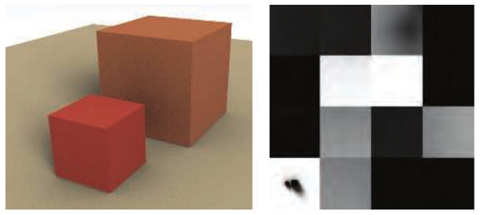

图 11.27。烘焙到场景中的光照，以及应用于这些表面的光照贴图。光照映射采用唯一参数化：将场景分成若干元素，展开后打包到同一张纹理中。例如，左下方区域对应地面平面，其中可以看到两个立方体的阴影。（来自 three.js 示例 webgl_materials_lightmap [218]。）

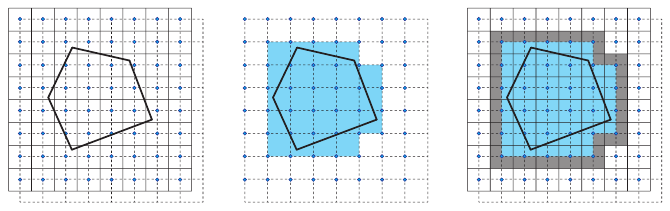

图 11.28。要准确确定图表的滤波足迹，需要找出渲染时可能访问的全部纹素。如果图表与四个相邻纹素中心围成的正方形相交，那么这四个纹素都会参与双线性滤波。左图中，实线表示纹素网格，蓝点表示纹素中心，粗实线表示要光栅化的图表。首先，对图表执行保守光栅化，所用网格偏移半个纹素，图中以虚线表示（中）。与标记单元接触的任何纹素，都被视为已占用（右）。

避免渗漏是光照贴图很少使用 mipmapping 的另一个原因。图表的滤波足迹必须在所有 mip 层级上都保持分离，这会要求壳之间留出过大的间隔。

把图表最优地打包到纹理中是一个 NP 完全问题，也就是说，目前没有已知算法能以多项式复杂度生成理想解。实时应用在单张纹理中可能包含数十万个图表，因此所有实际方案都使用精心调整的启发式方法和仔细优化的代码，快速生成打包结果 [183, 233, 1036]。如果随后还要对光照贴图进行块压缩（6.2.6 节），则可能向打包器加入额外约束，确保单个块只包含相近的值，从而改善压缩质量。

光照贴图的一个常见问题是接缝（图 11.29）。网格被拆分为图表，每个图表独立参数化，因此无法保证分割边缘两侧的光照完全相同。这会表现为视觉不连续。如果手工拆分网格，可以选择在不直接可见的区域分割，从而在一定程度上避免这一问题。不过，这是一个费力的过程，也无法用于自动生成参数化的情况。Iwanicki [806] 对最终光照贴图执行后处理，修改分割边缘沿线的纹素，使两侧插值结果的差异最小。Liu、Ferguson 等人 [1058] 通过等式约束强制边缘沿线的插值值相匹配，并求解能最好保持平滑性的纹素值。另一种方法是在创建参数化和打包图表时就考虑该约束。Ray 等人 [1467] 展示了如何使用保持网格的参数化，创建不会出现接缝伪影的光照贴图。

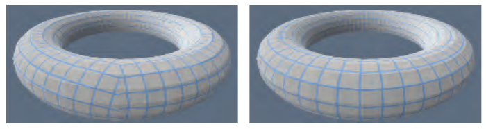

图 11.29。为了给环面创建唯一参数化，需要将其切开并展开。左侧环面采用简单映射，创建时没有考虑切口在纹理空间中的位置。请注意左侧表示纹素的网格存在不连续。使用更先进的算法，可以创建如右图所示的参数化，确保纹素网格线在三维网格上保持连续。这类展开方法非常适合光照映射，因为所得到的光照不会出现不连续。

预计算光照也可以存储在网格顶点上。缺点是，光照质量取决于网格细分得有多密。由于这一决定通常在创作的早期阶段做出，很难确保网格上有足够顶点，能在所有预期的光照情况下都呈现良好效果。此外，曲面细分可能开销很高。如果网格细分很密，就会对光照信号过度采样。如果采用带方向的光照存储方法，GPU 必须在顶点之间插值整个表示，并将其传给像素着色器阶段，以执行光照计算。在顶点着色器与像素着色器之间传递如此多参数并不常见，产生的工作负载也并非现代 GPU 的优化对象，因此会造成低效和性能下降。基于这些原因，很少采用在顶点上存储预计算光照的方法。

虽然所需的是表面上的入射辐亮度信息，体积渲染除外（第 14 章），但仍可以用体积形式预计算和存储它。这样，便能查询空间中任意点的光照，为预计算阶段并不存在于场景中的物体提供照明。不过需要注意，这些物体不会正确地反射或遮挡光照。

Greger 等人 [594] 提出了辐照度体（irradiance volume），通过对辐照度环境贴图进行稀疏空间采样，表示五维辐照度函数（三个空间维度、两个方向维度）。也就是说，在空间中建立一个三维网格，每个网格点都有一张辐照度环境贴图。动态物体从最近的贴图中插值得到辐照度值。Greger 等人使用两级自适应网格进行空间采样，也可以采用八叉树等其他体积数据结构 [1304, 1305]。

在最初的辐照度体中，Greger 等人把每个采样点处的辐照度存储在一张小纹理里，但这种表示无法在 GPU 上高效滤波。如今，体积光照数据最常存储在三维纹理中，因此体积采样能够利用 GPU 加速滤波。采样点处辐照度函数最常见的表示包括：

- 二阶和三阶球谐函数（SH），其中二阶更常见，因为单个颜色通道所需的四个系数，能方便地装入典型纹理格式的四个通道。
- 球面高斯。
- 环境立方体或环境骰子。

AHD 编码虽然在技术上能够表示球面辐照度，却会产生明显扰人的伪影。如果使用 SH，球谐梯度 [54] 可以进一步改善质量。上述所有表示都已在许多游戏中成功使用 [766, 808, 1193, 1268, 1643]。

Evans [444] 描述了《LittleBigPlanet》辐照度体中采用的一项技巧。它不使用完整的辐照度贴图表示，而是在每个点存储平均辐照度。由辐照度场的梯度，即场变化最快的方向，计算近似的方向性因子。并不显式计算梯度，而是对辐照度场取两个样本：一个位于表面点 𝐩，另一个沿表面法线 𝐧 的方向稍作偏移，再将二者相减，以此计算梯度与法线 𝐧 的点积。之所以采用这种近似表示，是因为《LittleBigPlanet》的辐照度体是动态计算的。

辐照度体也可以为静态表面提供光照。优点是无需为光照贴图单独提供参数化，也不会产生接缝。静态和动态物体可以使用同一种表示，使两类几何体的光照保持一致。体积表示很适合用于延迟着色（20.1 节），可以在单个通道中完成全部光照。主要缺点是内存消耗：光照贴图占用的内存随分辨率的平方增长，而规则体积结构则按立方增长。因此，基于网格的体积表示会采用低得多的分辨率。自适应、层次化的光照体具有更好的特性，但存储的数据仍多于光照贴图。它们也比规则间隔的网格更慢，因为额外的间接寻址会在着色器代码中产生读取依赖，从而导致停顿和执行速度下降。

在体积结构中存储表面光照有些棘手。多个表面可能占据同一个体素，而这些表面的光照特征有时截然不同，因此该存储什么数据并不明确。从这类体素采样时，光照经常不正确。明亮室外和昏暗室内之间的墙壁附近尤其容易出现这种问题，表现为室外的暗斑或室内的亮斑。解决办法是让体素足够小，永远不跨越这种边界，但所需数据量使它通常不切实际。最常见的处理方式，是把采样位置沿法线偏移一定距离，或调整插值时使用的三线性混合权重。这往往并不完善，有时还需要手工调整几何体来掩盖问题。Hooker [766] 为辐照度体添加额外裁剪平面，将其影响限制在一个凸多胞体内部。Kontkanen 和 Laine [926] 讨论了减少渗漏的各种策略。

存储光照的体积结构不一定是规则的。一种流行选择是在不规则点云中存储光照，再连接这些点，形成 Delaunay 四面体剖分（图 11.30）。Cupisz [316] 推广了这一方法。查询光照时，首先找到采样位置所在的四面体。这是一个迭代过程，成本可能不低。我们遍历网格，在相邻单元之间移动。根据查询点相对于当前四面体各角点的重心坐标，选择下一步访问哪个邻居（图 11.31）。典型场景可能包含数千个存储光照的位置，因此这个过程可能相当耗时。为了加速，可以在可能时记录上一帧查询所用的四面体，或者使用简单的体积数据结构，为场景中的任意点提供合适的“起始四面体”。

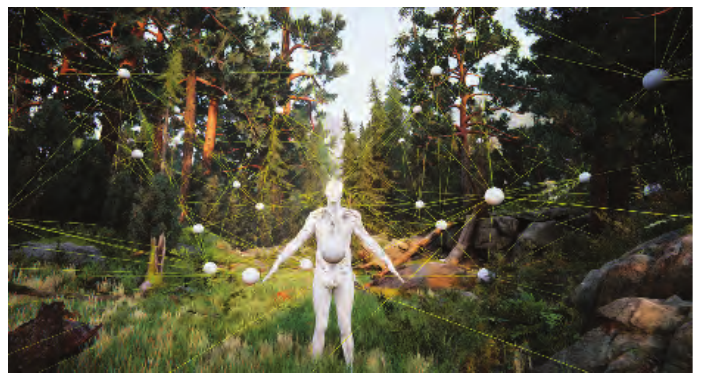

图 11.30。Unity 引擎使用四面体网格，对一组探针的光照进行插值。（Book of the Dead，© Unity Technologies，2018。）

找到正确的四面体后，利用已经得到的重心坐标，对其角点上存储的光照进行插值。GPU 不会加速这一操作，但它只需四个值，而规则网格上的三线性插值需要八个值。

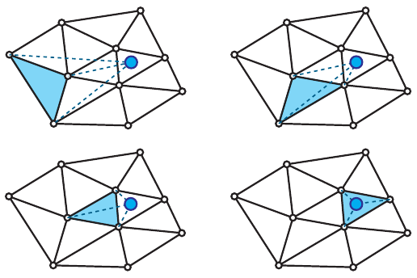

图 11.31。用二维图示说明四面体网格中的查询过程。步骤顺序从左到右、从上到下。给定一个起始单元（蓝色标记），计算查询点（蓝点）相对于该单元各角点的重心坐标。下一步，跨过最负坐标所对应角点的对边，移动到相邻单元。

预计算并存储光照的位置，可以手工放置 [134, 316]，也可以自动放置 [809, 1812]。它们通常称为光照探针（lighting probes 或 light probes），因为它们探测，也就是采样光照信号。不要把这里的术语与 10.4.2 节的“光探针”（light probe）混淆，后者指环境贴图中记录的远处光照。

从四面体网格采样得到的光照质量，很大程度上取决于网格结构，而不只是探针的总体密度。如果探针分布不均匀，得到的网格可能包含又薄又长的四面体，产生视觉伪影。如果手工放置探针，就能容易地修正问题，但这仍是一个手工过程。四面体的结构与场景几何体的结构没有关联，因此如果处理不当，光照会穿过墙壁插值，像辐照度体那样产生渗漏伪影。对于手工放置探针的情况，可以要求用户添加额外探针来防止这一问题。如果自动放置探针，则可以向探针或四面体添加某种形式的可见性信息，将其影响限制在相关区域 [809, 1184, 1812]。

静态和动态几何体使用不同的光照存储方法，是一种常见做法。例如，静态网格使用光照贴图，动态物体则从体积结构获取光照信息。虽然这种方案很流行，但它可能导致不同类型几何体的外观不一致。可以通过正则化消除其中一些差异，也就是在不同表示之间对光照信息取平均。

烘焙光照时，要注意只在光照值真正有效的位置计算它。网格往往并不完美：某些顶点可能位于几何体内部，或者网格的部分区域可能自相交。如果在这类有缺陷的位置计算入射辐亮度，结果就会不正确，导致不必要的变暗，或者本应被阴影遮挡的光照错误地渗漏进来。Kontkanen 和 Laine [926] 以及 Iwanicki 和 Sloan [809] 讨论了可用于丢弃无效样本的不同启发式方法。

环境遮挡和方向遮挡信号，与漫反射光照有许多相同的空间特征。如 11.3.4 节所述，以上所有方法也都可以用于存储它们。

## 11.5.5 动态漫反射全局光照

尽管预计算光照可以产生令人印象深刻的结果，其主要优势同时也是主要弱点：它需要预计算。这种离线过程可能很漫长。对典型游戏关卡进行光照烘焙，耗时数小时并不少见。由于光照计算如此耗时，美术人员通常被迫同时处理多个关卡，以避免等待烘焙完成时无事可做。这又常常给渲染资源造成过重负载，让烘焙耗时更长。这一循环会严重影响生产效率，令人沮丧。有些情况下甚至无法预计算光照，因为几何体会在运行时变化，或者在某种程度上由用户创建。

人们已经开发出若干方法，在动态环境中模拟全局光照。它们要么不需要任何预处理，要么准备阶段足够快，可以每帧执行。

在完全动态环境中模拟全局光照的最早方法之一，是基于“即时辐射度”（Instant Radiosity）[879] 的方法。尽管名称如此，它与辐射度算法几乎没有共同之处。它从光源向外发射射线，在每个射线命中的位置放置一个光源，用来表示来自该表面元素的间接光照。这些光源称为虚拟点光源（virtual point lights，VPL）。借鉴这一想法，Tabellion 和 Lamorlette [1734] 开发了用于《Shrek 2》制作的方法：对场景表面执行直接光照通道，并将结果存入纹理。随后在渲染时追踪射线，使用缓存光照生成一次反弹的间接光照。Tabellion 和 Lamorlette 表明，许多情况下只需一次反弹，就足以产生可信的结果。这是一种离线方法，但启发了 Dachsbacher 和 Stamminger [321] 提出的反射阴影贴图（reflective shadow maps，RSM）方法。

与普通阴影贴图（7.4 节）相似，反射阴影贴图也是从光源视点渲染的。除深度外，它还存储可见表面的其他信息，例如反照率、法线和直接光照（通量）。最终着色时，把 RSM 的纹素视为点光源，以提供一次反弹的间接光照。典型 RSM 包含数十万个像素，因此会采用基于重要性的启发式方法，仅选取其中的一个子集。Dachsbacher 和 Stamminger [322] 后来展示了如何通过反转过程来优化这一方法：不再为每个着色点从 RSM 中挑选相关纹素，而是根据整张 RSM 创建一定数量的光源，再将它们泼溅到屏幕空间（13.9 节）。

该方法的主要缺点，是不提供间接光照的遮挡。虽然这是一项很大的近似，但结果看起来可信，对许多应用而言可以接受。

要获得高质量结果，并在光源移动时保持时间稳定性，需要创建大量间接光源。创建得太少时，随着 RSM 重新生成，这些光源的位置往往会迅速变化，引起闪烁伪影。另一方面，间接光源过多又会带来性能挑战。Xu [1938] 描述了该方法在游戏《Uncharted 4》中的实现。为了满足性能约束，他为每个像素仅使用少量光源（16 个），但跨若干帧循环使用不同的光源集合，并对结果进行时间滤波（图 11.32）。

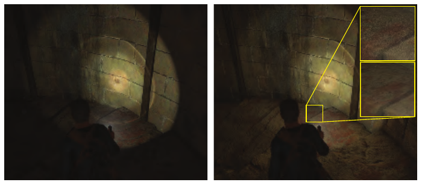

图 11.32。《Uncharted 4》使用反射阴影贴图，提供来自玩家手电筒的间接光照。左图展示不包含间接贡献的场景，右图则启用了该贡献。插图展示了关闭时间滤波（上）和启用时间滤波（下）时渲染帧的局部特写。时间滤波用来增加每个图像像素实际使用的 VPL 有效数量。（UNCHARTED 4 A Thief’s End，©/TM 2016 SIE。由 Naughty Dog LLC 创作与开发。）

针对缺少间接遮挡的问题，人们提出了不同方法。Laine 等人 [962] 为间接光源使用双抛物面阴影贴图，但以增量方式将其加入场景，因此每一帧只渲染少量阴影贴图。Ritschel 等人 [1498] 使用一种简化的、基于点的场景表示，渲染大量不完美阴影贴图（imperfect shadow maps）。这些贴图很小，直接使用时有许多缺陷，但经过简单滤波后，就能提供足够的保真度，为间接光照产生恰当的遮挡效果。

一些游戏采用了与这些方案相关的方法。《Dust 514》渲染世界的俯视图，需要时最多使用四个独立层 [1110]。得到的纹理用于收集间接光照，与 Tabellion 和 Lamorlette 的方法很相似。用于展示 Unreal Engine 的 Kite 演示也使用了类似方法，提供来自地形的间接光照 [60]。

## 11.5.6 光传播体

辐射传输理论是一种模拟电磁辐射如何在介质中传播的通用方式，考虑了散射、发射与吸收。实时图形虽然力求表现所有这些效果，但除了最简单的情况，模拟它们的方法通常比直接用于渲染所能承受的成本高出多个数量级。不过，这一领域中的某些技术已被证明对实时图形很有用。

Kaplanyan [854] 提出的光传播体（light propagation volumes，LPV）借鉴了辐射传输中的离散纵标法。在他的方法中，把场景离散为由三维单元组成的规则网格。每个单元保存流经它的辐亮度方向分布。他使用二阶球谐函数表示这些数据。第一步，将光照注入包含直接受光表面的单元。通过访问反射阴影贴图找出这些单元，但也可以使用其他任何方法。注入的光照是受光表面反射出的辐亮度，因此其分布围绕法线、朝向表面外侧，其颜色来自材质颜色。接着传播光照：每个单元分析相邻单元的辐亮度场，再修改自身分布，计入从各个方向到达的辐亮度。单步只能将辐亮度传播一个单元的距离。要将其分布到更远处，需要多次迭代（图 11.33）。

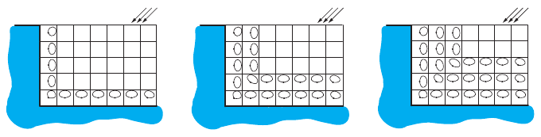

图 11.33。光照分布在体积网格中传播的三个步骤。左图展示方向光源照亮几何体后，几何体反射出的光照分布。注意，只有与几何体直接相邻的单元具有非零分布。在后续步骤中，收集相邻单元的光，并将其传播到网格中。

这一方法的重要优点，是为每个单元生成完整的辐亮度场。这意味着着色时可以使用任意 BRDF，尽管采用二阶球谐函数时，光泽 BRDF 的反射质量会相当低。Kaplanyan 展示了同时包含漫反射表面和反射表面的例子。

为了让光照传播得更远、扩大体积覆盖范围，同时维持合理的内存消耗，Kaplanyan 和 Dachsbacher [855] 开发了级联变体。不再只用一个由等尺寸单元组成的体积，而是使用一组相互嵌套、单元尺寸逐渐增大的体积。将光照注入所有层级，并分别传播。查询时，选择给定位置可用的最精细层级。

原始实现完全没有考虑间接光照的遮挡。改进方案使用反射阴影贴图中的深度信息，以及摄像机位置的深度缓冲，向体积中添加遮光体信息。这些信息并不完整，不过也可以在预处理时将场景体素化，使用更精确的表示。

该方法与其他体积方法存在相同的问题，其中最严重的是渗漏。不幸的是，提高网格分辨率来解决渗漏，又会引起其他问题。单元尺寸缩小时，需要更多迭代才能将光传播相同的世界空间距离，使成本显著提高。在网格分辨率与性能之间取得平衡并不容易。该方法还存在走样问题：网格分辨率有限，加上辐亮度方向表示较粗糙，会导致信号在相邻单元之间移动时退化。多次迭代之后，结果中可能出现对角条纹等空间伪影。在传播通道之后进行空间滤波，可以去除其中一些问题。

## 11.5.7 基于体素的方法

Crassin [304] 提出的体素锥追踪全局光照（voxel cone tracing global illumination，VXGI）同样以体素化场景表示为基础。几何体本身以稀疏体素八叉树的形式存储，见 13.10 节。关键在于，这种结构提供了类似 mipmap 的场景表示，因此可以快速测试某个空间体积，例如判断遮挡。体素还包含它所表示的几何体反射光量的信息。信息以方向形式存储，即向六个主方向反射的辐亮度。借助反射阴影贴图，先将直接光照注入八叉树的最底层，再向层次结构上方传播。

八叉树用于估计入射辐亮度。理想情况下，会追踪一条射线，估计从特定方向入射的辐亮度。但是，这样做需要很多射线，因此改为使用沿平均方向追踪的一个锥体，近似整束射线，并只返回单个值。精确测试锥体与八叉树的相交并不简单，所以沿锥轴执行一系列树查询来近似这一操作。每次查询都读取树中一个层级，其节点尺寸对应锥体在该点的横截面。查询返回朝锥体原点方向反射的已滤波辐亮度，以及查询足迹被几何体占据的百分比。以类似 alpha 混合的方式，用这些信息衰减后续点的光照。算法持续跟踪整个锥体的遮挡情况，并在每一步依据当前样本被几何体占据的百分比减小该值。累积辐亮度时，先将辐亮度乘以合成的遮挡因子（图 11.34）。这种策略无法检测由多次部分遮挡共同造成的完全遮挡，但结果仍然可信。

> 译注：原文在此将逐步减小、用于衰减后续辐亮度的量称为“occlusion”。从计算作用看，它对应尚可透过的比例（剩余可见性）；译文保留原文“遮挡因子”的称呼，不将其暗改为另一个算法。

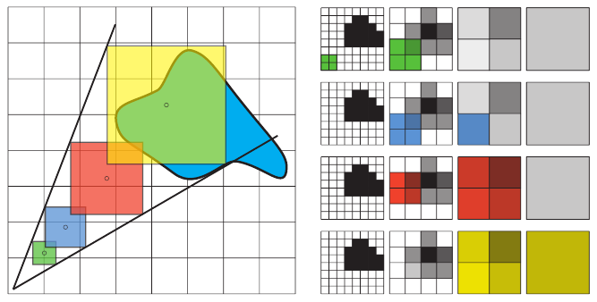

图 11.34。体素锥追踪用对体素树的一系列滤波查询，近似精确的锥体追踪。左侧是三维追踪的二维类比。右侧展示体素化几何体的层次表示，每一列对应逐渐变粗的一个树层级。每一行展示为某个样本提供覆盖所使用的层次节点。选择层级时，使较粗层的节点尺寸大于查询尺寸，较细层的节点尺寸小于查询尺寸。再使用类似三线性滤波的过程，在这两个选定层级之间插值。

为计算漫反射光照，要追踪若干个锥体。生成并发射多少锥体，是性能与精度之间的折中。追踪更多锥体能够得到更高质量的结果，但耗时更长。这里假设余弦项在整个锥体范围内保持常数，因此可以将其移出反射方程的积分。这样，计算漫反射光照就简化为对锥体追踪返回的值求加权和。

Mittring [1229] 描述了该方法在 Unreal Engine 某个原型版本中的实现。他给出了开发者为使它成为完整渲染流水线一部分所需的若干优化，包括以更低分辨率执行追踪，以及在空间上分配锥体。这样，每个像素只追踪一个锥体。通过在屏幕空间滤波结果，获得用于漫反射响应的完整辐亮度。

使用稀疏八叉树存储光照的一个主要问题是查询成本高。寻找包含给定位置的叶节点，需要一系列内存查询，期间穿插简单逻辑，决定接下来遍历哪棵子树。一次典型内存读取可能花费几百个周期。GPU 通过并行执行多个着色器线程组（warp 或 wavefront）来隐藏这种延迟（第 3 章）。虽然任一时刻只有一个组执行 ALU 运算，但它需要等待内存读取时，另一个组就会接替它。能够同时活动的 warp 数量由不同因素决定，但都与单个组所使用的资源数量有关（23.3 节）。遍历层次数据结构时，大部分时间用于等待下一个节点从内存中取出。然而，在等待期间执行的其他 warp 很可能也要读取内存。由于相较于内存访问次数，ALU 工作很少，而且同时在途的 warp 总数有限，因此经常出现所有组都在等待内存、没有实际工作的情况。

大量 warp 停顿会使性能不理想，人们为此开发了缓解这些低效现象的方法。McLaren [1190] 用一组级联三维纹理替代八叉树，很像级联光传播体 [855]（11.5.6 节）。它们具有相同的纹理尺寸，但覆盖的区域逐级扩大。这样，读取数据只需一次普通纹理查询，不需要依赖读取。纹理中存储的数据与稀疏体素八叉树相同，包括反照率、占据情况，以及六个方向的反弹光照信息。由于级联的位置随摄像机移动而改变，物体会不断进入或离开高分辨率区域。内存限制使我们无法一直保留这些体素化版本，因此会在需要时按需进行体素化。McLaren 还描述了若干优化，使该技术能够用于以 30 FPS 运行的游戏《The Tomorrow Children》（图 11.35）。

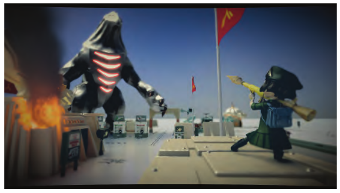

图 11.35。《The Tomorrow Children》使用体素锥追踪渲染间接光照效果。（© 2016 Sony Interactive Entertainment Inc.。The Tomorrow Children 是 Sony Interactive Entertainment America LLC 的商标。）

## 11.5.8 屏幕空间方法

与屏幕空间环境遮挡（11.3.6 节）类似，仅使用存储在屏幕位置上的表面值，就能模拟某些漫反射全局光照效果 [1499]。这类方法不如 SSAO 流行，主要是因为可用数据有限所导致的伪影更加明显。颜色渗透等效果，来自强烈直接光照亮了大面积、颜色相当一致的区域。这类表面通常无法全部容纳在视野中，使反弹光量强烈依赖当前取景，并随摄像机移动而波动。因此，屏幕空间方法仅用于在细小尺度上补充其他方案，补足主算法分辨率无法达到的细节。游戏《Quantum Break》[1643] 使用了这类系统：辐照度体模拟大尺度全局光照效果，屏幕空间方案则提供有限距离内的反弹光。

## 11.5.9 其他方法

Bunnell 用于计算环境遮挡的方法 [210]（11.3.5 节）也可以动态计算全局光照效果。在基于点的场景表示（11.3.5 节）中，额外为每个圆盘存储反射辐亮度信息。在收集步骤中，不再只收集遮挡，而是在每个收集位置构造完整的入射辐亮度函数。与环境遮挡一样，必须执行后续步骤，消除来自被遮挡圆盘的光照。
