# 11.6 镜面全局光照

来源：《Real-Time Rendering》第4版，书页497—509（PDF物理页518—530）；范围自11.6节标题起，至11.7节标题前，包含11.6.1—11.6.5全部下级小节。

前面几节介绍的方法主要针对漫反射全局光照的模拟。现在，我们将考察能够用来渲染视点相关效果的各种方法。对于光泽材质，镜面波瓣远比漫反射光照所使用的余弦波瓣狭窄。如果希望显示一种极其光亮、镜面波瓣很窄的材质，就需要能够提供这类高频细节的辐亮度表示。另一方面，这些条件也意味着，计算反射方程时只需要来自有限立体角内的入射光照，而不像朗伯BRDF那样反射整个半球的光照。这与漫反射材质提出的要求截然不同。这些特征说明了为什么要实时实现此类效果，就必须作出不同的取舍。

存储入射辐亮度的方法可以用来提供粗略的视点相关效果。使用AHD编码或HL2基时，可以把光照当作来自编码方向的方向光，计算镜面响应；对于HL2基，则是来自三个方向的光。该方法确实能够从间接光照中产生一些镜面高光，但精度相当有限。这一思路用于AHD编码时尤其容易出现问题，因为其方向分量可能在很短的距离内发生剧烈变化。这种变化会使镜面高光以不自然的方式变形。对方向进行空间滤波可以减轻这些瑕疵[806]。使用HL2基时，如果相邻三角形之间的切线空间变化很快，也会出现类似的问题。

提高入射光照表示的精度也能减轻瑕疵。Neubelt和Pettineo在游戏《教团：1886》中使用球面高斯波瓣表示入射辐亮度[1268]。为了渲染镜面效果，他们采用Xu等人[1940]的方法；后者为典型微表面BRDF（第9.8节）的镜面响应提出了一种高效近似。如果用一组球面高斯表示光照，并假设菲涅耳项和遮蔽—阴影函数在各自的支撑域上保持常量，则反射方程可以近似为

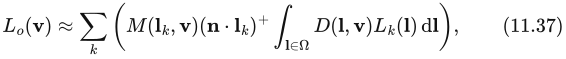

其中，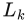是表示入射辐亮度的第k个球面高斯，M是合并了菲涅耳函数和遮蔽—阴影函数的因子，D是法线分布函数（NDF）。Xu等人引入了各向异性球面高斯（ASG），用于建模NDF。他们还给出了计算球面高斯（SG）与ASG乘积积分的高效近似，如式（11.37）所示。

Neubelt和Pettineo用9到12个高斯波瓣表示光照，因此只能对具有中等光泽的材质进行建模。他们能够用这种方法表示游戏中的大部分光照，是因为游戏发生在19世纪的伦敦，高度抛光的材质、玻璃以及反光表面都很少见。

## 11.6.1 局部化环境贴图

迄今讨论的方法还不足以令人信服地渲染抛光材质。这些技术中的辐亮度场过于粗糙，无法精确编码入射辐亮度的细微细节，因而反射显得暗淡。如果同一种材质上还使用了解析光源，所产生的结果也会与这些光源形成的镜面高光不一致。一种解决办法是使用更多的球面高斯，或阶数高得多的球谐函数（SH），以获得所需细节。这是可行的，但很快就会遇到性能问题：SH和SG都具有全局支撑。每个基函数在整个球面上都非零，这意味着，要计算某个方向上的光照，就需要使用全部基函数。要渲染清晰的反射，需要数千个基函数，而在数量还远未达到这一要求时，计算开销就已经高得无法承受。此外，也不可能在漫反射光照通常采用的分辨率下存储这么多数据。

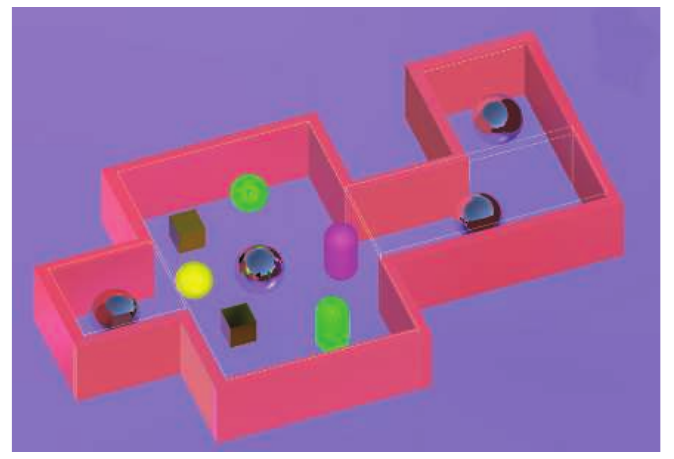

**图11.36** 配置了局部化反射探针的简单场景。反光球体代表探针位置。黄色线条表示盒状反射代理。注意这些代理如何近似场景的整体形状。

在实时环境中，为全局光照提供镜面分量最流行的解决方案是局部化环境贴图。它们解决了前面两个问题。入射辐亮度用环境贴图表示，因此只需读取少量数值就能求出辐亮度。它们还稀疏地分布在场景中，因此牺牲了入射辐亮度的空间精度，换取更高的角分辨率。这种在场景中特定位置渲染的环境贴图通常称为反射探针。图11.36给出了一个例子。

环境贴图天然适合渲染理想反射，即镜面间接光照。人们已经提出了许多使用纹理实现各种镜面效果的方法（第10.5节）。所有这些方法都可以与局部化环境贴图结合，用来渲染对间接光照的镜面响应。

《半衰期2》是最早将环境贴图与空间中特定点关联起来的游戏之一[1193, 1222]。在其系统中，美术人员首先在场景各处布置采样位置。预处理步骤从每个位置渲染一张立方体贴图。随后，物体在计算镜面光照时，使用最近采样位置的结果表示入射辐亮度。相邻物体可能使用不同的环境贴图，造成视觉不匹配，不过美术人员可以手动覆盖立方体贴图的自动分配结果。

如果物体很小，并且环境贴图是从其中心渲染的——先隐藏物体，以免它出现在纹理中——结果就相当精确。遗憾的是，这种情况很少见。更多时候，同一个反射探针用于多个物体，而这些物体有时会占据很大的空间范围。镜面表面的位置离环境贴图中心越远，结果就可能越偏离真实情况。

Brennan[194]和Bjorke[155]提出了一种解决方法。他们不再把入射光照看成来自无穷远处的包围球面，而是假定它来自半径由用户指定、大小有限的球面。查找入射辐亮度时，不直接使用方向索引环境贴图，而是把该方向视为一条从待求值表面位置出发的射线，并求它与这个球面的交点。接着，计算从环境贴图中心指向交点的新方向，用这个向量作为查找方向。见图11.37。这个过程相当于将环境贴图“固定”在空间中，通常称为视差校正。同样的方法也可以用于其他图元，例如盒子[958]。用于射线求交的形状通常称为反射代理。所使用的代理物体应当代表环境贴图中所渲染几何体的大致形状和大小。虽然通常无法做到，但如果两者完全吻合，例如用盒子表示矩形房间，这种方法就能提供完全局部化的反射。

这项技术在游戏中非常流行。它易于实现，运行时速度快，而且既能用于前向渲染，也能用于延迟渲染。美术人员可以直接控制外观和内存用量。如果某些区域需要更精确的光照，就可以增加反射探针，并让代理更好地贴合场景。如果环境贴图占用的内存过多，也很容易删减探针。使用光泽材质时，可以用着色点到代理形状交点之间的距离来决定预滤波环境贴图应使用哪一级（图11.38）。这模拟了随着离着色点的距离增大，BRDF波瓣覆盖范围随之扩大的现象。

当多个探针覆盖同一区域时，可以建立直观的组合规则。例如，为探针设置用户指定的优先级参数，让数值较高的探针优先于数值较低的探针，或者让它们之间平滑混合。

遗憾的是，这种方法过于简单，会引发多种瑕疵。反射代理很少与底层几何体完全吻合，从而使某些区域的反射发生不自然的拉伸。这主要影响反射能力很强的抛光材质。此外，渲染到环境贴图中的反光物体，其BRDF是从贴图所在位置求值的。访问环境贴图的表面位置观察这些物体时，视角并不完全相同，因此纹理中存储的结果并不完全正确。

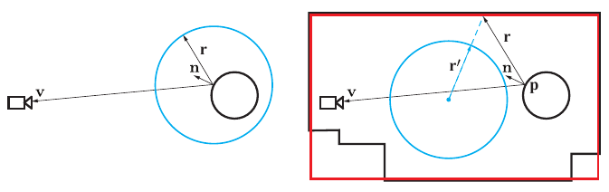

**图11.37** 使用反射代理在空间中局部化环境贴图（EM）的效果。两种情况下，我们都希望在黑色圆的表面渲染环境的反射。左图是常规环境映射，用蓝色圆表示；实际可以采用任意表示形式，例如立方体贴图。对于黑色圆上的一点，使用反射后的观察方向r访问环境贴图，确定其效果。由于只使用该方向，蓝色圆所代表的EM被视为无限大且位于无穷远处。对于黑色圆上的任意一点，都好像EM以该点为中心。右图中，我们希望EM把周围的黑色房间表示为局部环境，而不是无穷远处的环境。蓝色圆EM从房间中心生成。为了像访问一个房间那样访问此EM，从位置p沿反射后的观察方向追踪反射射线，并在着色器中求它与简单代理物体的交点；代理是包围房间的红色盒子。随后利用交点和EM中心形成方向r′，再像通常那样仅凭一个方向访问EM。通过求出r′，这个过程将EM当作具有实体形状的对象，即红色盒子。由于代理形状不符合实际房间的几何形状，这种代理盒假设在该房间下面的两个角落处会失效。

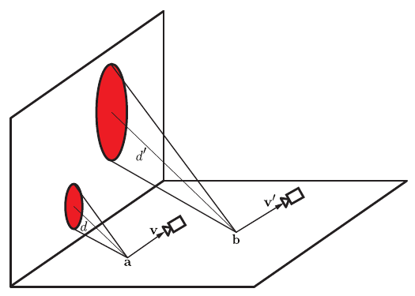

**图11.38** 点a和点b处的BRDF相同，观察向量v与v′也相同。由于点a到反射代理的距离d小于点b到反射代理的距离d′，BRDF波瓣在反射代理侧面上的覆盖范围（红色标出）更小。采样预滤波环境贴图时，可以结合这个距离与反射点处的粗糙度来影响mip层级。

代理还会造成漏光，有时非常严重。简化的射线投射可能遗漏本应造成遮挡的局部几何体，导致查找返回环境贴图中明亮区域的数值。有时可以使用方向性遮蔽方法（第11.4节）减轻这个问题。另一种流行策略是使用预计算漫反射光照，它通常以更高的分辨率存储。首先，将环境贴图中的数值除以渲染该贴图的位置处的平均漫反射光照。这相当于从环境贴图中移除平滑的漫反射贡献，只保留较高频率的分量。进行着色时，再将反射乘以着色位置处的漫反射光照[384, 999]。这样可以部分缓解反射探针空间精度不足的问题。

已有一些解决方案使用更复杂的表示来描述反射探针捕获的几何体。Szirmay-Kalos等人[1730]为每个反射探针存储深度图，并在查找时针对深度图进行射线追踪。这能产生更准确的结果，但会带来额外开销。McGuire等人[1184]提出了一种针对探针深度缓冲区进行射线追踪的更高效方法。他们的系统存储多个探针。如果最初选中的探针不包含足够的信息，无法可靠确定命中位置，就选择一个后备探针，使用新的深度数据继续追踪。

使用光泽BRDF时，通常会对环境贴图进行预滤波，每个mipmap存储的是入射辐亮度与逐渐增大的核卷积后的结果。预滤波步骤假设这个核具有径向对称性（第10.5节）。但是，使用视差校正时，BRDF波瓣在反射代理形状上的覆盖范围会随着色点的位置而变化，使预滤波出现轻微偏差。Pesce和Iwanicki分析了这个问题的不同方面，并讨论了可能的解决方案[807, 1395]。

反射代理不必是封闭的凸形状。也可以使用简单的平面矩形，既可以替代盒状或球状代理，也可以给它们补充高质量细节[1228, 1640]。

## 11.6.2 环境贴图的动态更新

使用局部化反射探针时，每张环境贴图都需要渲染和滤波。这项工作通常离线完成，但在某些情况下可能必须在运行时进行。对于一天中时间不断变化的开放世界游戏，或者世界几何体动态生成的情况，离线处理所有贴图可能耗时过长，影响生产效率。在需要很多变体的极端情况下，甚至可能无法将它们全部存到磁盘上。

实践中，一些游戏会在运行时渲染反射探针。这类系统需要仔细调整，以免显著影响性能。除非场景极其简单，否则无法每帧重新渲染所有可见探针，因为现代游戏的典型一帧可能使用数十甚至数百个探针。幸运的是，没有必要这样做。我们很少要求反射探针始终准确描绘周围的全部几何体。通常确实希望它们能够正确响应一天中时间的变化，但动态几何体的反射可以用其他手段近似，例如后面介绍的屏幕空间方法（第11.6.5节）。这些假设允许我们在加载时渲染少量探针，然后随着其他探针进入视野，逐个渐进地渲染。

即使确实希望反射探针中渲染动态几何体，几乎肯定也能接受以更低的帧率更新探针。我们可以规定每帧愿意花多少时间渲染反射探针，每帧只更新固定数量的探针。根据每个探针到相机的距离、距上次更新经过的时间及类似因素建立启发式规则，就能决定更新次序。如果时间预算特别紧，甚至可以将单张环境贴图的渲染拆分到多帧，例如每帧只渲染立方体贴图的一个面。

离线进行卷积时，通常采用高质量滤波。这种滤波需要多次采样输入纹理，在高帧率下无法承担其开销。Colbert和Křivánek[279]提出一种使用重要性采样的方法，以相对较少的样本数——约64个——达到相近的滤波质量。为了消除大部分噪声，他们从具有完整mip链的立方体贴图采样，并使用启发式规则确定每个样本应该读取哪一mip层级。这种方法是运行时快速预滤波环境贴图的常见选择[960, 1154]。Manson和Sloan[1120]利用基函数构造所需的滤波核。构造特定核的精确系数必须通过优化过程求得，但对于给定形状，这只需进行一次。卷积分两阶段完成：首先，对环境贴图降采样，同时用简单的核进行滤波；然后，组合所得mip链中的样本，构造最终环境贴图。

为限制光照处理阶段使用的带宽以及内存用量，压缩生成的纹理是有益的。Narkowicz[1259]描述了一种高效方法，将高动态范围反射探针压缩成能够存储半精度浮点值的BC6H格式（第6.2.6节）。

对CPU而言，即使一次只渲染立方体贴图的一个面，复杂场景的渲染也可能过于昂贵。一种解决方案是离线为环境贴图准备G缓冲区，在运行时只计算对CPU要求低得多的光照和卷积[384, 1154]。如果需要，甚至可以在预先生成的G缓冲区上叠加渲染动态几何体。

## 11.6.3 基于体素的方法

在性能限制最严格的场景中，局部化环境贴图是一种优秀方案。不过，其质量往往多少有些不尽如人意。实践中，必须采用补救措施，掩盖探针空间密度不足或者代理对实际几何体近似过于粗糙所产生的问题。如果每帧有更多时间可用，就可以采用更复杂的方法。

体素锥追踪，包括稀疏八叉树版本[307]和级联版本[1190]（第11.5.7节），也可以用于镜面分量。这种方法针对存储在稀疏体素八叉树中的场景表示进行锥追踪。一次锥追踪仅提供一个值，表示来自该锥体所张立体角内的平均辐亮度。对于漫反射光照，需要追踪多个锥体，因为只用一个锥体并不准确。

将锥追踪用于光泽材质，效率明显更高。对于镜面光照，BRDF波瓣很窄，只需考虑来自较小立体角内的辐亮度。不再需要追踪多个锥体，很多情况下一个就足够了。只有较粗糙材质的镜面效果才可能需要追踪多个锥体，但由于这些反射比较模糊，此时退回使用局部化反射探针通常就足够，完全不必进行锥追踪。

另一个极端是高度抛光的材质。这些材质的镜面反射几乎像镜子一样清晰，使锥体非常细，近似一条射线。如此精确的追踪可能使底层场景表示的体素特征在反射中显露出来：看到的是体素化过程产生的立方块，而不是多边形几何体。这种瑕疵在实践中很少成为问题，因为反射几乎从不直接呈现。它的贡献会受到纹理调制，纹理往往能掩盖缺陷。当需要理想镜面反射时，可以使用其他运行时开销更低的方法。

## 11.6.4 平面反射

另一种选择是复用场景的常规表示，重新渲染场景以生成反射图像。如果反射表面数量有限，而且都是平面，就可以使用常规GPU渲染流水线，生成场景经这些表面反射的图像。这些图像不仅能够提供准确的镜面反射，通过对每张图像进行一些额外处理，还能渲染出可信的光泽效果。

理想反射体遵循反射定律，即入射角等于反射角。换言之，入射射线与法线的夹角等于反射射线与法线的夹角。见图11.39。图中还显示了被反射物体的“像”。根据反射定律，物体的反射像就是该物体自身相对于平面对称后的结果。也就是说，无须沿反射射线前进，我们可以沿入射射线穿过反射体，在镜像物体上命中同一个对应点。

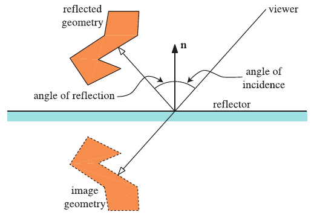

**图11.39** 平面中的反射，展示了入射角、反射角、被反射的几何体和反射体。

由此得到一个原则：可以创建物体的副本，将它变换到反射位置，再从那里渲染，从而生成反射。为了获得正确的光照，光源的位置和方向也必须相对于平面进行反射[1314]。一个等效方法是，将观察者的位置和朝向穿过镜面反射到反射体的另一侧。这种反射可以通过对投影矩阵作简单修改来实现。

位于反射平面远侧，即平面后方的物体不应被反射。可以利用反射体的平面方程解决这个问题。最简单的方法是在像素着色器中定义一个裁剪平面，并让它与反射体平面重合[654]。渲染反射场景时使用这个裁剪平面，将裁掉与视点位于同一侧的所有反射后几何体，也就是原先位于镜面后方的所有物体。

## 11.6.5 屏幕空间方法

与环境光遮蔽和漫反射全局光照一样，一些镜面效果也可以完全在屏幕空间中计算。由于镜面波瓣较尖锐，这样做比漫反射情形略微精确。只需要反射后的观察向量周围有限立体角内的辐亮度信息，而不是整个半球的信息，因此屏幕数据更有可能包含所需内容。这类方法最早由Sousa等人[1678]提出，其他开发者也在同一时期独立发现了它。整个方法族称为屏幕空间反射（SSR）。

给定待着色点的位置、观察向量和法线，就可以沿观察向量关于法线反射后的方向追踪射线，并测试其与深度缓冲区的相交情况。测试过程沿射线迭代前进，将位置投影到屏幕空间，再从该位置读取z缓冲区深度。如果射线上的点比深度缓冲区所表示的几何体离相机更远，就意味着射线进入了几何体内部，检测到一次命中。随后可以从颜色缓冲区读取对应值，得到从所追踪方向入射的辐亮度。该方法假设射线命中的表面是朗伯表面，不过这种近似在许多方法中都很常见，在实践中很少构成限制。可以在世界空间中以均匀步长追踪射线。这种方式相当粗糙，因此检测到命中后可以进行一次细化处理。在有限距离内，通过二分搜索能够准确定位交点。

McGuire和Mara[1179]指出，由于透视投影，在世界空间中等间隔前进会使采样点沿射线在屏幕空间中分布不均。靠近相机的射线部分采样不足，可能错过一些命中事件；较远的部分则过度采样，同一个深度缓冲区像素被重复读取，造成不必要的内存流量和冗余计算。他们建议改为在屏幕空间中，使用可用于直线光栅化的数字微分分析器（DDA）进行射线步进。

首先，将待追踪射线的起点和终点投影到屏幕空间。依次检查这条线上的每个像素，从而保证均匀的精度。这一方法还意味着，相交测试不必为每个像素完整重建观察空间深度。观察空间深度的倒数，也就是典型透视投影情况下z缓冲区中存储的值，在屏幕空间中呈线性变化。这意味着，可以在实际追踪之前计算它相对于屏幕空间x、y坐标的导数，再通过简单的线性插值求出屏幕空间线段上任意位置的值。计算出的值可以直接与深度缓冲区数据比较。

屏幕空间反射的基本形式只追踪一条射线，只能提供理想镜面反射。然而，完美镜面表面相当少见。在现代基于物理的渲染流水线中，更常需要的是光泽反射，而SSR也能用于渲染这类效果。

在简单的临时性方案中[1589, 1812]，仍然沿反射方向只追踪一条射线。结果存入离屏缓冲区，供后续步骤处理。应用一系列滤波核，通常还结合对缓冲区的降采样，创建一组模糊程度各不相同的反射缓冲区。计算光照时，由BRDF波瓣宽度决定采样哪个反射缓冲区。尽管滤波器形状通常被选为与BRDF波瓣形状匹配，这依然只是粗略近似，因为屏幕空间滤波没有考虑不连续性、表面朝向以及其他对结果精度至关重要的因素。最后还要加入专门的启发式规则，让屏幕空间光泽反射在视觉上与其他来源的镜面贡献一致。虽然这是一种近似，其结果仍然具有说服力。

Stachowiak[1684]以更有理论依据的方式处理这个问题。屏幕空间反射计算是射线追踪的一种形式，因此同样可以用来进行正确的蒙特卡洛积分。他不再只使用反射后的观察方向，而是对BRDF进行重要性采样，随机发射射线。受性能限制，追踪以一半分辨率进行，每个像素只追踪少量射线，介于1到4条之间。这么少的射线不足以产生无噪声图像，因此相邻像素之间会共享相交结果。这里假设一定范围内各像素的局部可见性可以视为相同。如果从点沿方向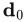发出的射线在点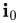与场景相交，就可以假设：从点沿同样经过的方向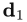发射射线，也会在命中几何体，而在此之前不会发生其他相交。这样，只需适当修改这条射线对相邻像素积分的贡献，就可以利用它，而不必真正追踪。从形式上说，对于从相邻像素发出的射线，若相对于当前像素BRDF的概率分布函数计算，其方向会具有不同的概率。

为了进一步增加有效射线数量，还会对结果进行时间滤波。另外，离线计算积分中与场景无关的部分，并将其存入由BRDF参数索引的查找表，也能降低最终积分的方差。当反射射线所需的全部信息都可以在屏幕空间中获得时，这些策略能够产生精确、无噪声的结果，接近路径追踪的真值图像（图11.40）。

在屏幕空间中追踪射线通常开销很高。它需要反复采样深度缓冲区，可能多次读取同一处，并对查找结果执行一些运算。由于读取的相干性较差，缓存利用率可能很低，使着色器执行因等待内存事务完成而长时间停顿。必须格外精心地实现，才能尽可能提高速度。屏幕空间反射通常以降低的分辨率计算[1684, 1812]，再使用时间滤波弥补质量下降。

Uludag[1798]描述了一种利用层次深度缓冲区（第19.7.2节）加速追踪的优化。首先创建层次结构。逐步对深度缓冲区降采样，每一步在两个方向上都缩小为原来的一半。较高层的一个像素存储下一层对应四个像素的最小深度值。然后在层次结构中追踪射线。如果某一步中，射线没有命中所经过单元中存储的几何体，就让它前进到单元边界，并在下一步使用分辨率更低的缓冲区。如果射线在当前单元中命中，就让它前进到命中位置，并在下一步使用分辨率更高的缓冲区。在最高分辨率缓冲区中检测到命中时，追踪终止（图11.41）。

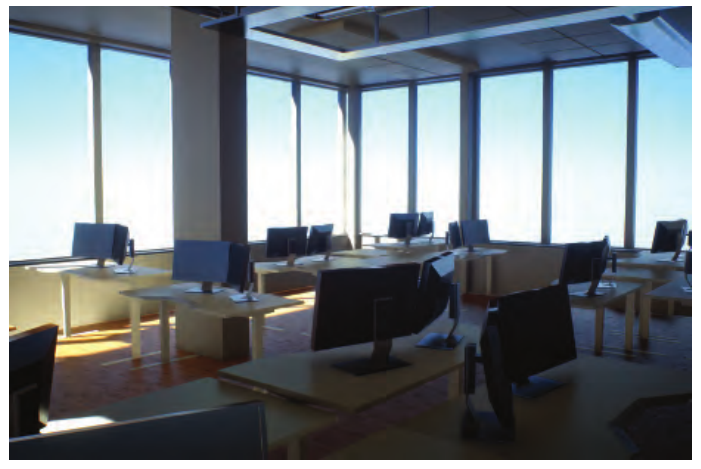

**图11.40** 这幅图像中的全部镜面效果均使用随机屏幕空间反射算法渲染[1684]。注意垂直方向的拉伸，这是微表面模型反射的特征。（图片由Tomasz Stachowiak提供。场景由Joacim Lunde建模并制作纹理。）

该方案特别适合长距离追踪，因为它既确保不会漏掉任何特征，又允许射线以大步长前进。它的缓存访问表现也很好，因为读取深度缓冲区时，访问的是局部邻域，而不是随机且相距很远的位置。Grenier[599]介绍了实现该方法的许多实用技巧。

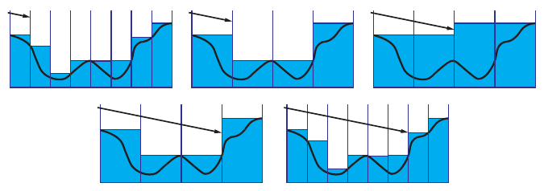

**图11.41** 在层次深度缓冲区中追踪射线。如果射线经过一个像素时未命中几何体，下一步就使用更粗的分辨率。如果检测到命中，后续步骤就使用更细的分辨率。这个过程使射线能够以大步长穿过空白区域，从而提高性能。

另一些方法完全避免了射线追踪。Drobot[384]复用与反射代理的交点位置，从那里查找屏幕空间辐亮度。Cichocki[266]假定反射体为平面，不去追踪射线，而是把过程反过来，运行一次全屏处理，让每个像素将其数值写到它应该被反射到的位置。

与其他屏幕空间方法一样，反射也会因可用数据有限而出现瑕疵。反射射线经常在命中之前就离开屏幕区域，或者命中没有可用光照信息的几何体背面。必须妥善处理这些情况，因为即使相邻像素，追踪的有效性也往往不同。可以使用空间滤波器，部分填补追踪缓冲区中的空缺[1812, 1913]。

SSR的另一个问题是深度缓冲区中缺少物体厚度信息。由于只存储一个数值，射线走到深度数据描述的表面后方时，无法判断它是否命中了任何东西。Cupisz[315]讨论了各种低成本方法，用来减轻因不知道深度缓冲区中物体的厚度而产生的瑕疵。Mara等人[1123]介绍了深层G缓冲区，它存储多层数据，因而拥有更多关于表面和环境的信息。

屏幕空间反射非常适合提供一组特定效果，例如附近物体在大体平坦表面上的局部反射。它们显著改善了实时镜面光照的质量，但不能提供完整解决方案。本章描述的不同方法经常叠加使用，以构建完整而稳健的系统。屏幕空间反射作为第一层；如果无法提供准确结果，就使用局部化反射探针作为后备；如果给定区域没有任何适用的探针，就使用全局默认探针[1812]。这种配置提供了一种一致且稳健的方式，得到可信的间接镜面贡献，对于营造令人信服的外观尤其重要。
