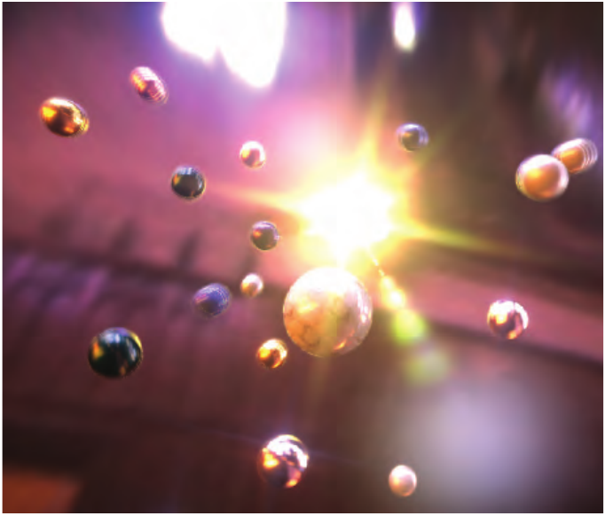
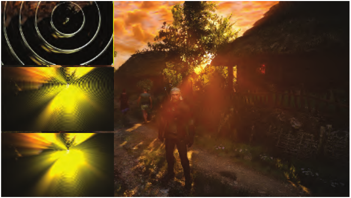
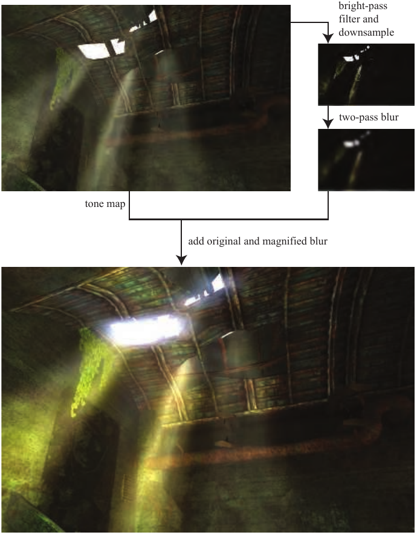

# 12.3 镜头光晕与泛光

来源：《Real-Time Rendering》第4版，书页 524—527（PDF 物理页 545—548）；本节图 12.9 及其完整图注位于书页 528（PDF 物理页 549）。正文范围从 12.3 标题起，到 12.4 标题前止。

*镜头光晕*（lens flare）是一种现象：光通过镜头系统或人眼时，沿间接反射或其他非预期路径传播，从而产生这种现象。光晕可按不同现象加以分类，其中最显著的是光环（halo）和睫状光冠（ciliary corona）。光环由晶状体结构中的径向纤维造成。它看起来像围绕光源的一圈环，外缘略带红色，内缘略带紫色。无论光源距离多远，光环的视大小都保持不变。睫状光冠来自晶状体内的密度起伏，看起来像从一个点向外辐射的光线，并且可能延伸到光环之外 [1683]。

当镜头的某些部分在内部反射或折射光线时，相机镜头还会产生次生效果。例如，相机的光圈叶片可能造成多边形图案。挡风玻璃上也能看到横向拖开的光条，这是玻璃中细小沟槽造成的 [1303]。*泛光*（bloom）由晶状体和人眼其他部分中的散射引起，它在光源周围形成辉光，并降低场景其他区域的对比度。摄像机使用*电荷耦合器件*（charge-coupled device，CCD）将光子转换为电荷，从而捕获图像。当 CCD 中的一个电荷存储单元饱和，电荷溢出到相邻单元时，摄像机中就会出现泛光。光环、光冠和泛光统称为*眩光效果*（glare effects）。

实际上，随着相机技术的改进，这类伪影中的大多数已越来越少见。更好的设计、遮光罩和抗反射镀膜能够减少或消除这些杂散鬼影伪影 [598, 786]。然而，如今人们经常以数字方式把这些效果添加到真实照片中。由于计算机显示器能够产生的光强有限，我们可以通过向图像中添加这类效果，让人感觉场景或物体的亮度有所增加 [1951]。由于使用得十分普遍，泛光效果和镜头光晕在照片、电影与交互式计算机图形中几乎已成了陈词滥调。尽管如此，运用得当时，这些效果仍能为观看者提供强烈的视觉线索。

为了产生令人信服的效果，镜头光晕应当随光源位置改变。King [899] 创建了一组带有不同纹理的正方形来表示镜头光晕。然后沿一条从光源的屏幕位置穿过屏幕中心的直线布置这些正方形。当光源远离屏幕中心时，这些正方形较小、较透明；随着光源向内移动，它们逐渐变大、变得更不透明。Maughan [1140] 利用 GPU 计算屏幕内面光源受到遮挡的程度，以此改变镜头光晕的亮度。他生成一张单像素的强度纹理，然后用它来衰减该效果的亮度。Sekulic [1600] 将光源渲染为一个多边形，利用遮挡查询硬件给出可见区域的像素数（第 19.7.1 节）。为了避免等待查询向 CPU 返回数值而导致 GPU 停顿，他在下一帧使用查询结果来确定衰减量。由于强度很可能以相当连续且可预测的方式变化，一帧的延迟几乎不会造成感知上的混乱。Gjøl 和 Svendsen [539] 首先生成深度缓冲区（他们也将其用于其他效果），然后在镜头光晕将要出现的区域中，按螺旋模式对其采样 32 次，并利用结果衰减光晕纹理。这种可见性采样在渲染光晕几何体时由顶点着色器完成，因此避免了硬件遮挡查询引起的延迟。

**图 12.7.** 镜头光晕、星形眩光和泛光效果，以及景深和运动模糊 [1208]。注意，一些运动小球上存在因累积多幅独立图像而产生的频闪伪影。（图片来自 Masaki Kawase 的“Rthdribl”。）

场景中明亮物体或光源产生的光条，也可以采用类似方式实现：绘制半透明公告板，或者直接对明亮像素进行后处理滤波。《侠盗猎车手 V》（Grand Theft Auto V）等游戏使用一组应用于公告板的纹理来实现这些及其他效果 [293]。

Oat [1303] 讨论了使用*可转向滤波器*（steerable filter）产生光条效果的方法。这类滤波器并非在某个区域上进行对称滤波，而是被赋予一个方向。沿该方向累加纹素值，便产生光条效果。将图像下采样至原宽度和高度的四分之一，再利用乒乓缓冲区执行两个遍次，就能获得令人信服的光条效果。图 12.7 展示了这种技术的一个例子。

**图 12.8.** 游戏《巫师 3》（The Witcher 3）中生成太阳光晕的过程。首先，对输入图像应用一条高对比度校正曲线，以分离出太阳未被遮挡的部分。接着，对图像应用以太阳为中心的径向模糊。如左侧所示，这些模糊操作依次执行，每次都作用于上一次的输出。这样可以生成平滑、高质量的模糊，同时在每个遍次中仅使用有限数量的采样，以提高效率。所有模糊操作均在半分辨率下执行，以降低运行时开销。最终的光晕图像通过加法与原始场景渲染结果合成。（CD PROJEKT®、The Witcher® 是 CD PROJEKT Capital Group 的注册商标。《巫师》游戏 © CD PROJEKT S.A.。由 CD PROJEKT S.A. 开发。保留所有权利。《巫师》游戏根据 Andrzej Sapkowski 的文学作品改编。其他所有版权及商标均归其各自所有者所有。）

此外还有许多变体和技术，其方法远远超出了公告板。Mittring [1229] 使用图像处理分离明亮部分，对其下采样，并在多张纹理中进行模糊。随后，通过复制、缩放、镜像翻转和着色，将这些纹理重新合成到最终图像之上。采用这种方法时，美术人员无法独立控制每个光晕源的外观：每个光晕都会经过同样的处理。不过，图像中的任何明亮部分都可以产生镜头光晕，例如镜面反射、表面的自发光部分，或明亮的火花粒子。Wronski [1919] 描述了变形宽银幕镜头光晕（anamorphic lens flares），这是 20 世纪 50 年代所用电影摄影设备的一种副产物。Hullin 等人 [598, 786] 为各种鬼影伪影提供了一个物理模型，通过追踪光线束来计算效果。该方法根据镜头系统的设计产生可信的结果，并可在精度与性能之间进行权衡。Lee 和 Eisemann [1012] 在此工作基础上，采用一种线性模型来避免昂贵的预处理。Hennessy [716] 给出了实现细节。图 12.8 展示了一个在实际制作中使用的典型镜头光晕系统。

泛光效果使极亮区域向相邻像素溢出，可以通过组合前面介绍过的几种技术来实现。其主要思路是，创建一张只包含那些将要“过曝”的明亮物体的泛光图像，对它进行模糊，再将其合成回正常图像。通常采用高斯模糊 [832]，不过近期与参考照片的匹配表明，这种分布更接近尖峰形状 [512]。生成这张图像的一种常用方法是*亮通滤波*（bright-pass filter）：保留所有明亮像素，将所有暗淡像素设为黑色，并且往往在过渡点处做一些混合或缩放 [1616, 1674]。如果只需要对少数几个小物体施加泛光，可以计算一个屏幕包围盒，以限制后处理模糊和合成遍次的作用范围 [1859]。

这张泛光图像可以按较低分辨率渲染，例如宽度和高度分别为原图的二分之一到八分之一。这样既能节省时间，也有助于增强滤波效果。对这张低分辨率图像进行模糊，然后与原图合成。许多后处理效果都采用了这种降低分辨率的方法，也使用压缩或以其他方式降低颜色分辨率的技术 [1877]。泛光图像可以被多次下采样，然后从生成的这组图像中重新采样，从而在尽量降低采样开销的同时得到范围更广的模糊效果 [832, 1391, 1918]。例如，一个在屏幕上移动的明亮像素可能引起闪烁，因为某些帧中可能没有采样到它。

由于目标是让图像的明亮区域看起来过曝，因此可以按需缩放这张图像的颜色值，再将其加到原图上。加法混合会使颜色达到饱和，随后变为白色，这通常正是我们希望得到的结果。图 12.9 展示了一个例子。也可以使用 Alpha 混合，以获得更多艺术控制 [1859]。采用高动态范围图像进行滤波，而不是进行阈值截断，可以得到更好的结果 [512, 832]。还可以分别计算低动态范围和高动态范围泛光，再将其合成，以更令人信服的方式表现不同现象 [539]。其他变体也可行，例如还可以将前一帧的结果加到当前帧，使运动物体产生带拖尾的辉光 [815]。

**图 12.9.** 高动态范围色调映射与泛光。下方图像是在原图上进行色调映射并添加后处理泛光而得到的 [1869]。（图片来自《孤岛惊魂》（Far Cry），由 Ubisoft 提供。）

图内文字：bright-pass filter and downsample＝亮通滤波并下采样；two-pass blur＝两遍次模糊；tone map＝色调映射；add original and magnified blur＝将原图与放大后的模糊图相加。
