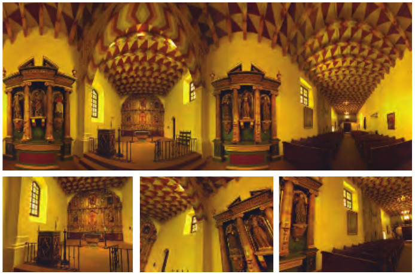
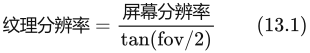

# 13.3 天空盒

来源：《Real-Time Rendering》第 4 版，书页 547—549（PDF 第 568—570 页）。本节范围从“13.3 Skyboxes”标题起，到“13.4 Light Field Rendering”标题前。

环境贴图（第 10.4 节）表示局部空间区域内的入射辐亮度。这类贴图通常用于模拟反射，但也可以直接用于表示周围环境。图 13.2 给出了一个例子。任何环境贴图表示形式，例如全景图或立方体贴图，都可以用于这一目的。承载它的网格会被做得足够大，以包围场景中的其余物体。这个网格称为**天空盒**（skybox）。

**图 13.2** 多洛雷斯教堂（Mission Dolores）的全景图，下方是由它生成的三个视图。注意，这些视图本身看起来并没有畸变。（图片由 Ken Turkowski 提供。）

拿起这本书，视线刚好越过它的左边缘或右边缘，看向书后面的景物。先只用右眼看，再只用左眼看。书的边缘相对于后方景物发生的位移，称为**视差**（parallax）。对于附近的物体，这种效应很明显，有助于我们在移动时感知相对深度。然而，如果一个物体或一组物体距离观察者足够远，而且这些物体彼此足够接近，那么当观察者改变位置时，几乎察觉不到任何视差效应。例如，当你移动一米、甚至一千米时，远处山峰本身的外观通常都不会发生明显变化。在移动过程中，附近的物体可能会遮住它；但如果去掉这些物体，山峰及其周围景物看起来仍然一样。

天空盒网格通常以观察者为中心，并随观察者一起移动。天空盒网格不一定要很大，因为只要保持相对位置，它看起来就不会改变形状。对于图 13.2 所示这样的场景，观察者可能只移动一小段距离，就会发现自己相对于周围建筑其实并没有移动。对于尺度更大的内容，例如星空或远方景观，用户通常不会移动得足够远、足够快，以至于因物体大小、形状或视差没有变化而识破这种假象。

天空盒常常采用箱形网格上的立方体贴图来渲染，因为这样每个面上的纹理像素密度相对均匀。要让天空盒看起来效果良好，立方体贴图的纹理分辨率必须足够高，也就是说，每个屏幕像素应对应一个纹素 [1613]。所需分辨率的近似公式为

其中，fov 是相机的视场角。视场角越小，立方体贴图所需的分辨率就越高，因为此时立方体某个面上更小的一部分会占据相同大小的屏幕区域。这个公式可以由如下事实推导出来：立方体贴图一个面的纹理必须在水平方向和垂直方向上各覆盖 90° 的视场角。

除了用箱体包围整个世界，还可以采用其他形状。例如，Gehling [520] 描述了一个使用扁平穹顶来表示天空的系统。研究发现，这种几何形状最适合模拟从头顶飘过的云。云本身则通过组合多种二维噪声纹理并使其产生动画来表示。

由于我们知道天空盒位于所有其他物体之后，因此可以采用几项幅度虽小、却值得实施的优化。天空盒永远不必写入 z 缓冲，因为它不会遮挡任何东西。如果首先绘制天空盒，它也完全不必读取 z 缓冲；此时网格可以采用任意大小，因为深度无关紧要。不过，稍后再绘制天空盒——在不透明物体之后、透明物体之前——有一个优势：场景中的物体已经覆盖了一些像素，因此渲染天空盒时所需的像素着色器调用次数会减少 [1433, 1882]。
