# 13.6 公告板技术

来源：原书第 551—564 页，对应 PDF 第 572—585 页；从 13.6 标题开始，至 13.7 标题之前，包含 13.6.1—13.6.5 全部正文及图 13.4—13.15。

根据观察方向调整带纹理矩形朝向的过程称为**公告板技术（billboarding）**，这个矩形称为**公告板（billboard）**[1192]。视图改变时，矩形的朝向也随之修改。公告板技术与 alpha 纹理和动画相结合，可以表示许多没有平滑实体表面的现象。草、烟、火、雾、爆炸、能量护盾、蒸汽尾迹和云，只是这些技术能够表示的一部分对象 [1192, 1871]。见图 13.4。

本节介绍几种常用的公告板形式。每种形式都需要确定表面法线和向上方向，以确定矩形朝向。这两个向量足以为表面建立一个标准正交基。换言之，它们描述了将四边形旋转到最终朝向所需的旋转矩阵（第 4.2.4 节）。随后，用四边形上的一个锚点位置（例如中心）确定其在空间中的位置。

通常，期望的表面法线 **n** 和向上向量 **u** 并不垂直。在所有公告板技术中，都将这两个向量之一设为固定向量，使其必须保持给定方向。使另一个向量垂直于这个固定向量的过程始终相同。首先建立一个“向右”向量 **r**，即指向四边形右边缘的向量。这通过对 **u** 和 **n** 求叉积来完成。将 **r** 归一化，因为它将用作旋转矩阵标准正交基的一条轴。如果 **r** 的长度为零，**u** 和 **n** 必然平行，可以使用第 4.2.4 节介绍的技术 [784]。如果 **r** 的长度不完全为零、但非常接近零，那么 **u** 和 **n** 几乎平行，可能产生精度误差。

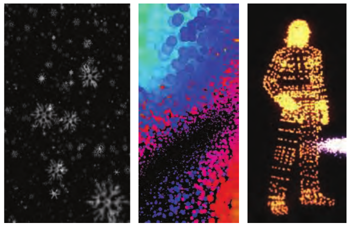

图 13.4. 表示雪、表面和人物的小型公告板。（出自 three.js 示例程序 [218]。）

图 13.5 展示了从不平行的 **n**、**u** 向量计算 **r** 及新的第三个向量的过程。如果法线 **n** 保持不变——大多数公告板技术都如此——则新的向上向量 **u′** 为

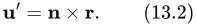

反之，如果向上方向固定（例如地形上的树木等轴向对齐公告板），则新的法线向量 **n′** 为

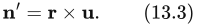

随后将新向量归一化，并用这三个向量构成旋转矩阵。例如，固定法线 **n** 并调整向上向量 **u′** 时，矩阵为

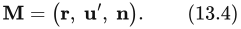

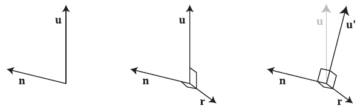

图 13.5. 对于具有法线方向 **n** 和近似向上方向 **u** 的公告板，我们希望建立三个两两垂直的向量来确定其朝向。中图通过 **u** 与 **n** 的叉积求得“向右”向量 **r**，因此它与二者都垂直。右图将固定向量 **n** 与 **r** 求叉积，得到与它们均垂直的向上向量 **u′**。

这个矩阵把位于 xy 平面、+y 指向上边缘、以锚点位置为中心的四边形变换到正确朝向。然后应用平移矩阵，将四边形的锚点移动到期望位置。

有了这些准备，余下的主要任务就是决定使用什么表面法线和向上向量来定义公告板朝向。下面几节讨论构造这些向量的几种不同方法。

## 13.6.1 屏幕对齐公告板

最简单的公告板形式是**屏幕对齐公告板**。这种形式与二维精灵相同：图像始终平行于屏幕，并具有恒定的向上向量。相机将场景渲染到一个与近、远裁剪平面平行的观察平面上。我们通常把这个假想平面想象为位于近裁剪平面的位置。对于这类公告板，期望的表面法线是观察平面法线的反向；观察平面法线 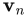 指向远离观察位置的方向。向上向量 **u** 来自相机自身，它位于观察平面内，定义相机的向上方向。这两个向量已经垂直，因此只需“向右”方向向量 **r**，就能构成公告板的旋转矩阵。由于 **n** 和 **u** 对相机而言是常量，这一类所有公告板的旋转矩阵都相同。

除粒子效果外，屏幕对齐公告板也适合显示注释文本、地图地点标记等信息，因为文本始终与屏幕本身对齐，“公告板”之名由此而来。注意，文本注释对象通常在屏幕上保持固定尺寸。这意味着，当用户缩小视图或将相机移离公告板位置时，公告板在世界空间中的尺寸会增大。因此，对象尺寸依赖于视图，这会使视锥体剔除等方案更复杂。

## 13.6.2 世界定向公告板

对于显示玩家身份或地点名称之类信息的公告板，我们希望它们与屏幕对齐。但是，如果相机向侧面倾斜，例如飞行模拟中进入转弯，我们希望公告板云朵也相应倾斜。如果精灵表示一个物理对象，它通常相对于世界的向上方向定向，而非相机的向上方向。圆形精灵不受倾斜影响，其他形状的公告板则会受到影响。我们可能希望这些公告板继续朝向观察者，同时绕各自的观察轴旋转，以保持世界定向。

渲染此类精灵的一种方法，是使用世界向上向量来推导旋转矩阵。在这种情况下，法线仍为观察平面法线的反向，并作为固定向量；再按前述方法，根据世界向上向量推导出一个与之垂直的新向上向量。与屏幕对齐公告板相同，这个矩阵可以供全部精灵重复使用，因为这些向量在所渲染的场景中不发生变化。

所有精灵使用同一旋转矩阵存在风险。由于透视投影的性质，偏离观察轴一定距离的对象会发生变形。见图 13.6 下方的两个球体。投影到平面会使球体变成椭圆形。这种现象不是错误；只要观察者双眼与屏幕之间的距离和位置正确，看起来就没有问题。也就是说，如果虚拟相机的**几何视场角**与眼睛的**显示视场角**匹配，这些球体看起来就不会变形。视场角存在不超过 10%—20% 的轻微不匹配时，观察者也不会察觉 [1695]。不过，为向用户展示更多世界内容，常见做法是为虚拟相机设置更宽的视场角。此外，只有观察者位于显示器正前方中央、且处于给定距离时，视场角匹配才有效。几百年来，艺术家已经认识到这个问题，并按需补偿。月亮等预期应为圆形的对象，无论处于画布什么位置，都会被画成圆形 [639]。

当视场角或精灵较小时，可以忽略这种变形，统一使用与观察平面对齐的朝向。否则，期望法线需要等于从公告板中心指向观察者位置的向量。我们称之为**视点定向公告板**。见图 13.7。不同对齐方式的效果见图 13.6。可以看到，观察平面对齐会使公告板无论处于屏幕何处都不发生畸变。视点定向则使球体图像产生与真实球体在场景投影到平面时相同的畸变。

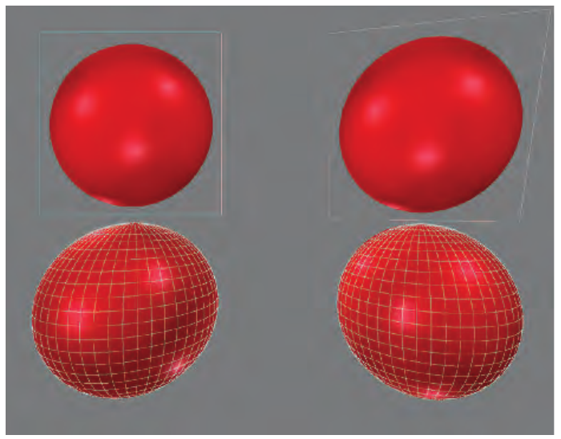

图 13.6. 宽视场角下的四个球体。左上方是使用观察平面对齐的球体公告板纹理。右上方公告板采用视点定向。下排展示两个真实球体。

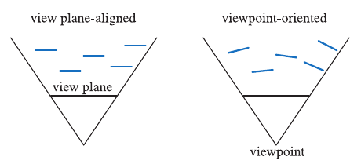

图 13.7. 两种公告板对齐技术的俯视图。五个公告板的朝向随所用方法不同而不同。

世界定向公告板适合渲染许多不同现象。Guymon [624] 和 Nguyen [1273] 都讨论了如何制作逼真的火焰、烟雾和爆炸。一种技术是以随机、杂乱的方式聚集并重叠动画精灵。这样有助于掩盖动画序列的循环规律，同时避免每团火或每次爆炸看起来都一样。

镂空纹理中的透明纹素不会影响最终图像，但仍须由 GPU 处理，并因为 alpha 为零而在光栅化流水线的后期丢弃。一组镂空纹理动画中，往往有些帧的透明纹素边缘区域特别大。我们通常考虑把纹理应用到矩形图元上。Persson 指出，使用更紧致的多边形并调整纹理坐标，可以更快地渲染精灵，因为处理的纹素更少 [439, 1379, 1382]。见图 13.8。他发现，仅有四个顶点的新多边形就能显著提升性能，而新多边形顶点超过八个后，收益开始递减。例如，Unreal Engine 4 包含用于寻找此类多边形的“粒子镂空”（particle cutout）工具 [512]。

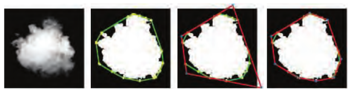

图 13.8. 一个云朵精灵含有很大的透明边缘。利用绿色所示的凸包，可以找到更紧致的四顶点和八顶点多边形（红色），使其包含更少透明纹素。与最左侧原始正方形粒子相比，两者总面积分别减少 40% 和 48%。（图片由 Emil Persson 提供 [1382]。）

公告板的一个常见用途是云渲染。Dobashi 等人 [358] 模拟云并用公告板渲染，同时通过渲染同心半透明壳层产生光柱。Harris 和 Lastra [670] 也使用替身模拟云。见图 13.9。

Wang [1839, 1840] 详细介绍了微软飞行模拟器产品中的云建模与渲染技术。每朵云由 5—400 个公告板组成。只需要 16 种不同的基础精灵纹理，因为可以通过非均匀缩放和旋转来修改它们，形成各种各样的云。根据距云中心的距离改变透明度，用于模拟云的形成和消散。为节省处理开销，远处的云全部渲染到环绕场景的一组八张全景纹理中，类似天空盒。

平面公告板并非唯一可行的云渲染技术。例如，Elinas 和 Stuerzlinger [421] 通过渲染一组嵌套椭球生成云，这些椭球在观察轮廓附近变得更加透明。Bahnassi 和 Bahnassi [90] 渲染他们称为“巨型粒子”（mega-particles）的椭球，再通过模糊和屏幕空间湍流纹理获得逼真的云状外观。Pallister [1347] 讨论了程序化生成云图像，并使这些图像在头顶的天空网格上运动。Wenzel [1871] 使用观察者上方的一系列平面表示远处的云。这里主要讨论公告板及其他图元的渲染与混合。云公告板的着色在第 14.4.2 节讨论，真正的体积方法则在第 14.4.2 节讨论。

> 译注：原书在上一句两处均印为“Section 14.4.2”，此处忠实保留，未擅自修改交叉引用。

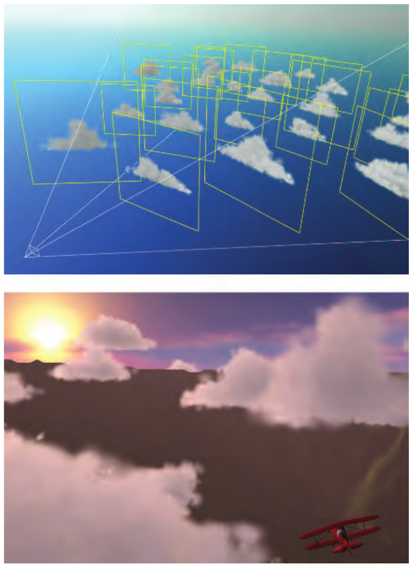

图 13.9. 用一组世界定向替身创建的云。（图片由北卡罗来纳大学教堂山分校的 Mark Harris 提供。）

如第 5.5 和 6.6 节所述，为正确执行合成，重叠的半透明公告板应当排序后渲染。烟或雾公告板与实体对象相交时会产生伪影，见图 13.10。本应呈现为体积的事物被看成了一组图层，因而破坏了视觉幻觉。一种解决办法是在处理每个公告板时，由像素着色器程序检查其下方对象的 z 深度。公告板测试这个深度，但不以自身深度替换它，也就是不写入 z 深度。如果某像素处下方对象的深度接近公告板深度，就使该公告板片元更加透明。这样就更像在处理一个体积，图层伪影随之消失。随深度线性淡出，在达到最大淡出距离时可能导致不连续；S 曲线淡出函数可以避免这一问题。Persson [1379] 指出，观察者距粒子的距离会影响淡出范围的最佳设置方式。Lorach [1075, 1300] 提供了更多信息和实现细节。以这种方式修改透明度的公告板称为**软粒子（soft particles）**。

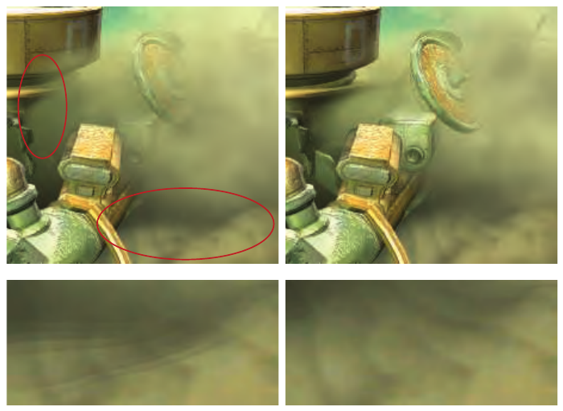

图 13.10. 左图圈出区域展示了尘云公告板与对象相交造成的边缘和条带。右图中，公告板在接近对象的地方淡出，避免了这个问题。底部放大了下方圈出区域，以便比较。（图片来自 NVIDIA SDK 10 [1300] 的“Soft Particles”示例，由 NVIDIA Corporation 提供。）

利用软粒子淡出解决了公告板与实体对象相交的问题，如图 13.10 所示。当爆炸在场景中移动，或观察者穿过云时，还可能出现其他伪影。前一种情况下，动画过程中公告板可能从对象后方移动到前方。如果它从完全不可见变成完全可见，就会出现明显的突跳。类似地，当观察者穿过公告板时，公告板可能由于移到近裁剪平面前方而完全消失，导致所见画面突然变化。一种快速修补方法是让公告板越靠近就越透明，通过淡出来避免“突跳”。

还可以采用更真实的解决办法。Umenhoffer 等人 [1799, 1800] 提出了**球形公告板**的思想：将公告板对象看作实际定义了空间中的一个球形体积。渲染公告板本身时忽略 z 深度读取；公告板的目的纯粹是使像素着色器程序在球体可能存在的位置运行。像素着色器程序计算进入和离开这一球形体积的位置，并按需利用实体对象修改离开深度，利用近裁剪平面修改进入深度。这样便能依据从相机发出的射线在裁剪后球体内部行进的距离来增加透明度，使每个公告板的球体正确淡出。

《Crysis》[1227, 1870] 使用了略有不同的技术，以盒状体积代替球体，降低像素着色器成本。另一项优化是让公告板表示体积的正面而非背面。这样可以利用 z 缓冲测试跳过实体对象后方的体积部分。只有在已知体积完全位于观察者前方、公告板不会被近裁剪平面裁剪时，这项优化才可行。

## 13.6.3 轴向公告板

最后一种常见类型称为**轴向公告板技术**。在此方案中，带纹理对象通常不直接正对观察者，而是允许它绕世界空间中的某条固定轴旋转，并在这一限制范围内尽可能面向观察者。这种公告板技术可用于显示远处的树木。不用实体表面表示一棵树，也不用第 6.6 节介绍的一对树木轮廓，而只用一个树木公告板。将世界向上向量设为沿树干方向的轴。观察者移动时，树随之面向观察者，如图 13.11 所示。这幅图像是单个面向相机的公告板，不同于第 203 页图 6.28 所示的“交叉树”。对于这种公告板，世界向上向量固定，视点方向用作第二个可调整向量。构成旋转矩阵后，再把树平移到它的位置。

这种形式与世界定向公告板的区别，在于什么固定、什么允许旋转。世界定向公告板直接面向观察者，并可以绕这条观察轴旋转，使公告板的向上方向尽可能与世界向上方向对齐。对于轴向公告板，世界向上方向定义固定轴，而公告板绕此轴旋转，使其尽可能面向观察者。例如，观察者几乎位于这两种公告板正上方时，世界定向版本将完全朝向观察者，而轴向版本则更像固定在场景中。

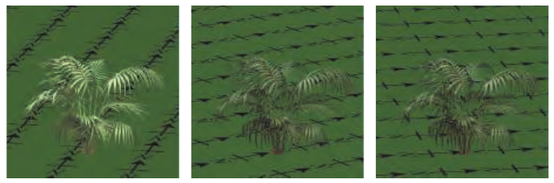

图 13.11. 观察者在场景中移动时，灌木公告板旋转以保持正面朝向观察者。此例中灌木受到来自南方的照明，因此视图改变会使其整体明暗随旋转而变化。

这种行为带来的一个问题是：如果观察者飞到树木上方并向下看，视觉幻觉就会被破坏，因为树几乎以侧边朝向观察者，看起来就是实际所用的剪纸薄片。一种变通方法是增加树木的水平横截面纹理（它不需要公告板定向），以缓解问题 [908]。

另一种技术是使用细节层次技术，从基于图像的模型切换到基于网格的模型 [908]。第 13.6.5 节讨论将树木三角形网格模型自动转换成一组公告板的方法。Kharlamov 等人 [887] 提出了相关树木渲染技术，Klint [908] 则解释了大量植被的数据管理与表示。第 857 页图 19.31 展示了商业软件包 SpeedTree 用来渲染远处树木的一种轴向公告板技术。

正如屏幕对齐公告板适合表示对称的球形对象，轴向公告板适合表示具有圆柱对称性的对象。例如，激光束效果可用轴向公告板渲染，因为绕轴从任何角度观察，其外观都相同。图 13.12 展示了这类公告板及其他公告板的例子。第 913 页图 20.15 还有更多例子。

这些技术说明了一个对上述及后续算法都很重要的思想：像素着色器的目的是求值真正的几何形状，丢弃所表示对象边界之外的片元。对于公告板，图像纹理完全透明的地方就是此类片元。后面将看到，可以执行更复杂的像素着色器来确定模型存在于何处。在这些方法中，几何体的作用都是触发像素着色器求值，并给出 z 深度的粗略估计，像素着色器还可以进一步细化这一估计。我们既想避免浪费时间对模型之外的像素求值，也不希望几何体过于复杂，以至于顶点处理，以及各三角形外部不必要的像素着色器调用，变成显著开销；后者来自沿三角形边缘生成的 2 × 2 像素组，见第 18.2.3 节。

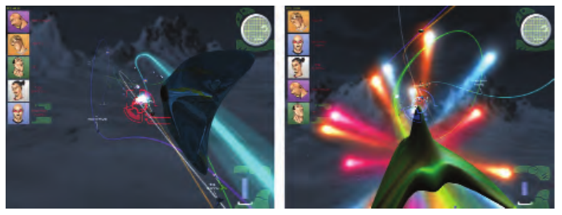

图 13.12. 公告板示例。平视显示器（HUD）图形和星状投射物采用屏幕对齐公告板。右图的大型泪滴状爆炸采用视点定向公告板。弯曲光束采用由一组相连四边形组成的轴向公告板。为形成连续光束，这些四边形在角点处连接，因此不再完全是矩形。（图片由 Maxim Garber、Mark Harris、Vincent Scheib、Stephan Sherman 和 Andrew Zaferakis 提供，出自“BHX: Beamrunner Hypercross”。）

## 13.6.4 替身

 **替身（impostor）** 是一种公告板：从当前视点将复杂对象渲染成图像纹理，再把该纹理映射到公告板上。替身可以供该对象的几个实例或几帧画面使用，从而分摊生成成本。本节介绍更新替身的不同策略。早在 1995 年，Maciel 和 Shirley [1097] 就区分了几种不同类型的替身，包括本节介绍的这种。此后，“替身”的定义缩小到了这里采用的含义 [482]。

替身图像在对象存在的位置不透明，其他位置则完全透明。它可以通过多种方式代替几何网格。例如，替身图像可以表示由小型静态对象组成的杂物 [482, 1109]。替身有助于快速渲染远处对象，因为复杂模型被简化为单幅图像。另一种做法是采用最低细节层次的模型（第 19.9 节）。然而，这类简化模型往往会丢失形状和颜色信息。替身没有这一缺点，因为生成图像的分辨率可以做得与显示分辨率近似匹配 [30, 1892]。另一个适合使用替身的场合是：对象靠近观察者，并在移动时始终以同一侧面朝向观察者 [1549]。

在渲染对象以创建替身图像之前，先将观察者设置为看向对象包围盒中心，并选择直接朝向视点的替身矩形（图 13.13 左侧）。替身四边形的大小取为能包含对象投影包围盒的最小矩形。先将 alpha 清为零，并在渲染对象的所有位置将 alpha 设为 1.0。然后将图像用作视点定向公告板，见图 13.13 右侧。当相机或替身对象移动时，纹理分辨率可能被放大，从而破坏视觉幻觉。Schaufler 和 Stürzlinger [1549] 提出了判断何时需要更新替身图像的启发式方法。

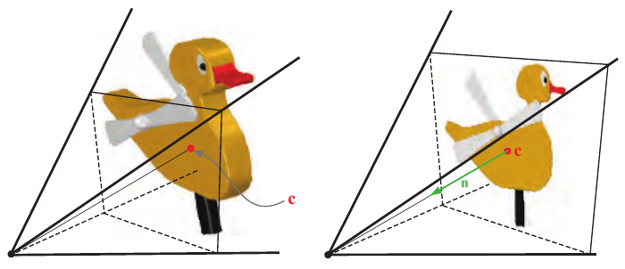

图 13.13. 左图用从侧面观察对象的视锥体创建其替身。观察方向指向对象中心 **c**，渲染出图像并用作替身纹理。右图展示了将该纹理应用到四边形上的情况。替身中心与对象中心重合，从中心出发的法线直接指向视点。

Forsyth [482] 给出了在游戏中使用替身的许多实用技术。例如，更频繁地更新靠近观察者或鼠标光标的对象，可以改善感知质量。对于动态对象的替身，他介绍了一种预处理技术：确定整个动画中任意顶点移动的最大距离 d。将该距离除以动画的时间步数，因此 Δ = d / frames。如果某替身已有 n 帧未更新，就将 Δ × n 投影到图像平面。若该距离超过用户设定的阈值，则更新替身。

把纹理映射到面向观察者的矩形上，并不总能产生可信效果。问题在于替身本身没有厚度，因此与真实几何体结合时可能暴露问题。见图 13.16 右上图。Forsyth 建议，改为沿观察方向将纹理投影到对象包围盒上 [482]。这样至少赋予了替身一定的几何存在感。

通常，最好在对象移动时直接渲染几何体，而在对象静止时切换到替身 [482]。Kavan 等人 [874] 提出了**多部件替身（polypostors）**，将人物模型表示为一组替身，每个肢体和躯干各用一个。该系统试图在纯替身与纯几何体之间取得平衡。Beacco 等人 [122] 介绍了多部件替身，以及大量用于人群渲染的其他替身相关技术，并详细比较各自的优势与局限。图 13.14 给出了一个例子。

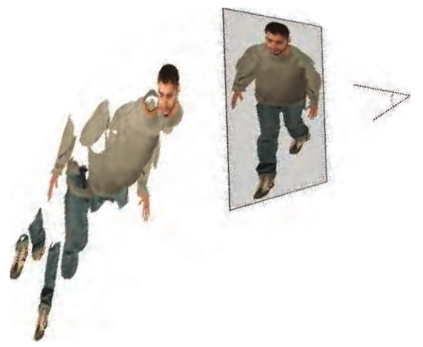

图 13.14. 一种替身技术，其中每个独立的动画元素都由一组图像表示。通过一系列遮罩和合成操作渲染这些图像，使其组合成当前视图下可信的模型。（图片由 Alejandro Beacco 提供，版权 ©2016 John Wiley & Sons, Ltd. [122]。）

## 13.6.5 公告板表示

替身的一个问题是，渲染的图像必须始终面向观察者。如果远处对象改变朝向，就必须重新计算替身。为使远处对象的模型更接近其所表示的三角形网格，Décoret 等人 [338] 提出了 **公告板云（billboard cloud）** 的思想。复杂模型通常可以用少量重叠的镂空公告板表示。还可以在其表面应用法线贴图、位移贴图以及不同材质等附加信息，使模型更加可信。

这种寻找一组平面的思想，比剪纸薄片的比喻所暗示的更加一般化。公告板可以相交，镂空形状可以任意复杂。例如，已有多位研究者用公告板拟合树木模型 [128, 503, 513, 950]。他们可以将包含数万个三角形的模型，转成由不到一百个带纹理四边形组成、效果可信的公告板云。见图 13.15。

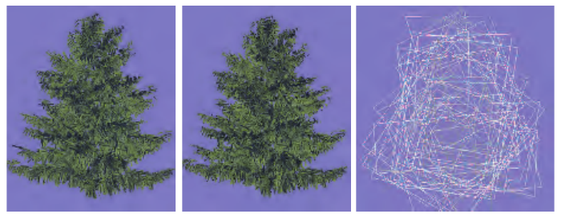

图 13.15. 左侧是由 20,610 个三角形组成的树木模型。中间用 78 个公告板为树建模。右侧展示这些相互重叠的公告板。（图片由犹他大学的 Dylan Lacewell 提供 [950]。）

使用公告板云可能造成大量过度绘制，成本可能很高。质量也可能受损，因为相交的镂空薄片可能使严格的从后向前绘制顺序无法实现。Alpha 转覆盖率（第 6.6 节）有助于渲染复杂的 alpha 纹理集合 [887]。为避免过度绘制，SpeedTree 等专业软件包使用由带 alpha 纹理的叶片和树枝集合构成的大型网格，来表示和简化模型。虽然这样会增加几何处理时间，但降低的过度绘制成本足以抵消这一增加，且仍有盈余。第 857 页图 19.31 展示了例子。另一种方法是用体积纹理表示这些对象，再将它们渲染成一系列垂直于眼睛观察方向的图层，如第 14.3 节所述 [337]。
