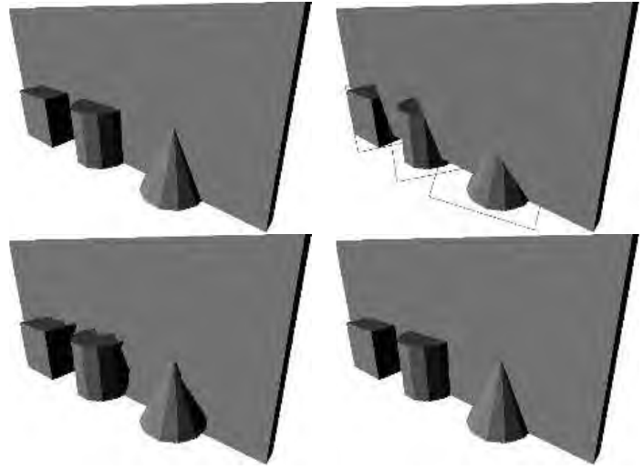
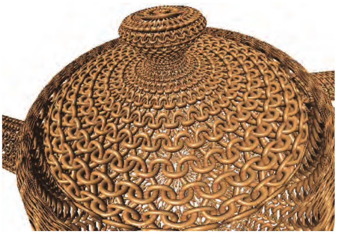
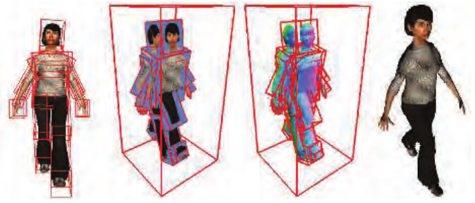

# 13.7 位移技术

来源：《Real-Time Rendering, Fourth Edition》，书页564—567（PDF物理页585—588）。本节从13.7标题起，到13.8标题之前止，包含全部跨页续文及图13.16—13.18。

如果为替身（impostor）的纹理增加一个深度分量，就定义出了一种称为深度精灵（depth sprite）或钉板（nailboard）的渲染图元[1550]。因此，这种纹理图像是在RGB图像的每个像素上增加一个Δ参数，构成RGBΔ纹理。Δ存储从深度精灵矩形到该深度精灵所代表的几何体正确深度之间的偏移。这个Δ通道是视图空间中的高度场。由于深度精灵包含深度信息，它们比替身更优越之处在于能够与周围物体更好地融合。当深度精灵矩形穿入附近的几何体时，这一点尤其明显。图13.16展示了这种情况。像素着色器可以通过逐像素改变z深度来执行这一算法。

**图13.16** 左上图是用几何体渲染的一个简单场景。右上图展示了为立方体、圆柱体和圆锥体创建并使用替身后会出现的情况。下方图像展示使用深度精灵的结果。左下图中的深度精灵用2位表示深度偏移，右下图则使用8位。（图片由Gernot Schaufler提供[1550]。）

Shade等人[1611]也描述了一种深度精灵图元，其中采用图像变形（warping）来适应新的视点。他们引入了一种称为分层深度图像（layered depth image）的图元，每个像素具有多个深度。采用多个深度的原因，是为了避免在变形过程中因解除遮挡（即原先隐藏的区域变得可见）而产生空隙。Schaufler[1551]以及Meyer和Neyret[1203]也提出了相关技术。为了控制采样率，Chang等人[255]提出了一种称为LDI树的层次表示。

与深度精灵相关的是Oliveira等人[1324]提出的浮雕纹理映射（relief texture mapping）。浮雕纹理是一幅带有高度场的图像，高度场表示表面的真实位置。与深度精灵不同，这幅图像并不在公告板上渲染，而是定向放置在世界空间中的一个四边形上。一个物体可以由一组在接缝处相互匹配的浮雕纹理来定义。借助GPU，可以将高度场映射到表面上，并使用光线步进来渲染它们，相关内容见6.8.1节。浮雕纹理映射还与一种称为光栅化包围体层次结构的技术相似[1288]。

**图13.17** 通过在表面上应用四个高度场纹理来建模的编织表面，使用浮雕映射进行渲染。（图片由Fabio Policarpo和Manuel M. Oliveira提供[1425]。）

Policarpo和Oliveira[1425]在单个四边形上使用一组纹理来存储高度场，并依次渲染每个高度场。作一个简单的类比，任何由注塑机成型的物体都可以由两个高度场构成。每个高度场表示模具的一半。增加高度场，就能够重建更精细复杂的模型。对于模型的一个给定视图，所需高度场的数量等于任意像素处相互重叠的表面数量的最大值。与球面公告板一样，每个底层四边形的主要作用，是触发像素着色器对高度场纹理进行求值。这种方法也可以用来为表面创建复杂的几何细节；见图13.17。

Beacco等人[122]将浮雕替身（relief impostor）用于人群场景。在这种表示中，为模型生成颜色、法线和高度场纹理，并将它们关联到一个盒子的各个面。渲染某个面时，执行光线步进，以找出每个像素处可见的表面（如果存在）。模型的每个刚性部分（“骨骼”）都关联一个盒子，从而能够执行动画。由于假设角色距离很远，因此不进行蒙皮。纹理化提供了一种降低原始模型细节层次的简便方法。见图13.18。

**图13.18** 浮雕替身。角色的表面模型被划分到多个盒子中，然后用来为每个盒子的各个面创建高度场、颜色和法线纹理。模型使用浮雕映射进行渲染。（图片由Alejandro Beacco提供，版权©2016 John Wiley & Sons, Ltd. [122]。）

Gu等人[616]引入了几何图像（geometry image）。其思路是将不规则网格转换为一幅存储位置值的正方形图像。图像本身表示一个规则网格，也就是说，所构成的三角形由网格位置隐式确定。换言之，图像中四个相邻纹素构成两个三角形。生成这种图像的过程既困难又相当复杂；这里关注的是最终得到的、对模型进行编码的图像。显然，可以用这幅图像来生成网格。其关键特性在于，几何图像可以构建mipmap。mipmap金字塔的不同层级构成模型的不同简化版本。顶点数据与纹素数据之间、网格与图像之间的界限由此变得模糊，这是一种令人着迷、引人探索的建模思考方式。几何图像也已与保留特征的映射结合用于地形，以对悬挑部分进行建模[852]。

本章讨论到这里，我们将告别用图像表示整个多边形物体的话题，转而讨论在粒子系统和点云中使用彼此不相连的独立样本。
