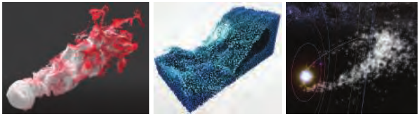
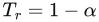
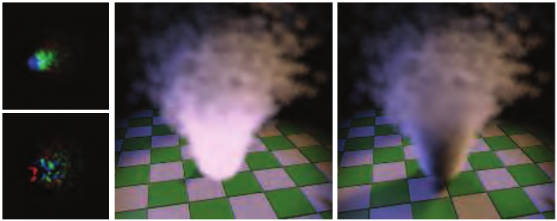
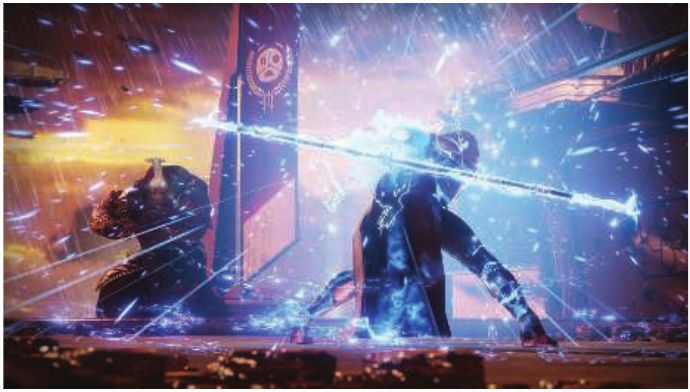

# 13.8 粒子系统

来源：原书第 567—572 页（PDF 第 588—593 页）。本节范围从“13.8 Particle Systems”开始，至“13.9 Point Rendering”之前，包含全部下级小节。

粒子系统 [1474] 是一组彼此独立的小物体，它们按照某种算法运动。其应用包括模拟火焰、烟雾、爆炸、水流、旋转的星系以及其他现象。因此，粒子系统既控制动画，也控制渲染。在粒子的整个生命周期中，对其创建、移动、变化和删除的控制，都是系统的一部分。

与本章有关的是这些粒子的建模和渲染方式。每个粒子可以是单个像素，也可以是从粒子的上一位置画到当前位置的一条线段，但通常使用公告板来表示。如第 13.6.2 节所述，如果粒子是圆形的，那么向上向量与其显示无关。换句话说，只需要粒子的位置，就能确定其朝向。图 13.19 给出了一些粒子系统示例。每个粒子的公告板都可以通过一次几何着色器调用生成，但在实践中，使用顶点着色器生成精灵可能更快 [146]。除了表示粒子的图像纹理外，还可以包含其他纹理，例如法线贴图。轴向公告板可以显示较粗的线条。使用线段表现雨的示例见第 609 页的图 14.18。

**图 13.19.** 粒子系统：类似烟雾的模拟（左）、流体（中），以及以星系天空盒为背景的流星轨迹（右）。（WebGL 程序分别为 Edan Kwan 的“The Spirit”、David Li 的“Fluid Particles”，以及 Ian Webster 的“Southern Delta Aquariids meteor shower”。）

如果用半透明公告板粒子来表示烟雾等现象，就必须解决正确渲染透明物体所面临的难题。可能需要从后向前排序，但其开销可能很大。Ericson [439] 提供了大量关于高效渲染粒子的建议；这里列出其中几条，并附上相关文章：

- 用厚实的镂空纹理制作烟雾；避免半透明就意味着不需要排序和混合。
- 如果需要半透明，可以考虑加法混合或减法混合，它们不需要排序 [987, 1971]。
- 与大量静态粒子相比，使用少量带动画的粒子可以获得相近的质量和更好的性能。
- 为了维持帧率，对渲染的粒子数量设置动态上限。
- 让不同的粒子系统使用同一个着色器，以避免状态切换的开销 [987, 1747]（第 18.4.2 节）。
- 包含全部粒子图像的纹理图集或纹理数组可以避免纹理切换调用 [986]。
- 将烟雾等平滑变化的粒子绘制到分辨率较低的缓冲区中，再进行合并 [1503]；或者在 MSAA 解析完成后再绘制。

Tatarchuk 等人 [1747] 进一步发展了最后一个想法。他们将烟雾渲染到一个小得多、大小为原来十六分之一的缓冲区中，并使用方差深度图辅助计算粒子效果的累积分布函数。详细内容请参阅他们的演示报告。

当粒子数量很大时，完整排序的开销可能很高。美术指导可能会指定一种渲染顺序，以便正确地对不同效果进行分层，从而缓解这一问题。对于较小或对比度较低的粒子，可能不需要排序。有时，也可以按某种近似有序的顺序发射粒子 [987]。如果粒子相当透明，就可以采用不需要排序的加权混合透明技术 [394, 1180]。也可以使用更复杂的顺序无关透明系统。例如，Köhler [920] 概述了一种方法：先把粒子渲染到存储在纹理数组中的九层深缓冲区，再使用计算着色器进行排序。

## 13.8.1 粒子着色

采用何种着色方式取决于粒子本身。火花等发光体不需要着色，而且为了简单起见，常常使用加法混合。Green [589] 描述了如何将流体系统作为球形粒子渲染到深度图像中，随后对深度进行模糊，根据深度推导法线，再将结果与场景合并。灰尘或烟雾等小粒子可以使用逐图元或逐顶点的值进行着色 [44]。然而，这种光照可能使表面特征明显的粒子看起来很平。为粒子提供法线贴图，可以得到合适的表面法线来计算光照，但代价是额外的纹理访问。对于圆形粒子，在粒子的四个角使用四个向外发散的法线可能就足够了 [987, 1650]。烟雾粒子系统可以采用更复杂的光散射模型 [1481]。辐射度法线映射（第 11.5.2 节）或球谐函数 [1190, 1503] 也曾用于粒子光照。较大的粒子可以使用曲面细分，并通过域着色器在每个顶点上累积光照 [225, 816, 1388, 1590]。

可以逐顶点计算光照，然后在粒子的四边形上进行插值 [44]。这种方法速度很快，但对于大粒子，质量较低，因为相距较远的顶点可能漏掉小光源的贡献。一种解决办法是逐像素对粒子着色，但使用比最终图像更低的分辨率。为此，每个可见粒子都会在光照贴图纹理中分配一个图块 [384, 1682]。每个图块的分辨率可以根据粒子在屏幕上的大小来调整，例如，根据屏幕上的投影面积，在 1 × 1 到 32 × 32 之间变化。分配好图块后，为每个图块渲染粒子，将像素对应的世界空间位置写入一个辅助纹理。然后调度计算着色器，计算到达从辅助纹理中读取的各个位置的辐亮度。通过采样场景中的光源来汇集辐亮度，并使用加速结构，仅计算可能产生贡献的光源，如第 20 章所述。得到的辐亮度可以作为简单的颜色，也可以作为球谐函数，写入光照贴图纹理。当最终将各粒子渲染到屏幕上时，把各自的图块映射到粒子四边形上，并通过纹理读取逐像素采样辐亮度，从而应用光照。

也可以应用同样的原理，为每个发射器分配一个图块 [1538]。在这种情况下，使用深度光照贴图纹理，有助于让包含许多粒子的效果获得具有体积感的光照。值得注意的是，粒子通常朝向观察者，而且本身是平面的，因此，如果视点绕任意粒子发射器旋转，本节介绍的每一种光照模型都会产生可见的闪烁伪影。

除了光照之外，粒子的体积阴影及自阴影的生成也需要特别处理。对于接收其他遮挡物投下的阴影，小粒子通常只需在顶点处进行阴影贴图测试，而不必逐像素测试。由于粒子是一些离散的点，并被渲染为简单的朝向摄像机的四边形，因此无法通过在阴影贴图中进行光线步进来实现向其他物体投射阴影。不过，可以使用泼溅方法（第 13.9 节）。为了在太阳照射下向其他场景元素投射阴影，可以将粒子泼溅到纹理中，在一个首先清为 1 的缓冲区里，逐像素乘入其透射率 。纹理可以只包含一个通道来表示灰度透射率，也可以包含三个通道来表示彩色透射率。这些纹理按照阴影级联的层级应用于场景：将该透射率与常规不透明阴影级联所得到的可见性相乘，具体见第 7.4 节。这种技术实际上提供了单层透明阴影 [44]。它唯一的缺点是，粒子可能会错误地向位于粒子与太阳之间的不透明元素反向投射阴影。通常可以通过仔细的关卡设计来避免这一问题。

为了实现粒子的自阴影，必须使用更先进的技术，例如傅里叶不透明度映射（Fourier opacity mapping，FOM）[816]。见图 13.20。首先从光源视点渲染粒子，将粒子的贡献累加到透射率函数中；该函数以傅里叶系数的形式表示，并存入不透明度贴图。当从这一视点渲染粒子时，可以采样不透明度贴图，根据傅里叶系数重建透射率信号。这种表示方式很适合表达平滑的透射率函数。然而，由于它为了控制纹理内存需求，采用了系数数量有限的傅里叶基，因此在透射率变化很大时会产生振铃。这可能使渲染出的粒子四边形出现不正确的明亮或阴暗区域。FOM 很适合粒子，但也可以采用其他各有优缺点的方法。其中包括第 14.3.2 节介绍的自适应体积阴影贴图 [1531]（类似于深度阴影贴图 [1066]）、针对 GPU 优化的粒子阴影贴图 [120]（类似于不透明度阴影贴图 [894]，但只适用于朝向摄像机的粒子，因此不适用于带状粒子或沿运动方向拉伸的粒子），以及透射率函数映射 [341]（类似于 FOM）。

**图 13.20.** 使用傅里叶不透明度映射投射体积阴影的粒子。左：从其中一个聚光灯视点生成的傅里叶不透明度贴图，其中包含函数系数。中：不带阴影渲染的粒子。右：体积阴影投射到粒子和场景中其他不透明表面上。（图片由 NVIDIA 提供 [816]。）

另一种方法是将粒子体素化到包含消光系数  的体积中 [742]。这些体积可以像裁剪贴图（clipmap）[1739] 一样布置在摄像机周围。这种方法能够统一计算粒子和参与介质产生的体积阴影，因为二者都可以体素化到这些共同的体积中。从这些“消光体积”生成一张为每个体素存储  的深度阴影贴图 [894]，就会自动得到来自这两种来源的体积阴影。由此会产生多种相互作用：粒子和参与介质既可以相互投射阴影，也可以产生自阴影；见第 613 页的图 14.21。最终质量取决于体素大小，而为了达到实时性能，体素很可能会比较大。这会产生粗略、但视觉上柔和的体积阴影。更多细节见第 14.3.2 节。

> 译注：上文 FOM 段落中的“从这一视点”忠实保留原文“from this point of view”的指代，原文未在此明确切换到摄像机视点。末段“深度阴影贴图”的引文编号原书为 [894]，此处亦按原书保留。

## 13.8.2 粒子模拟

使用粒子高效且令人信服地近似物理过程，是一个广泛的话题，超出了本书的范围，因此这里向读者推荐一些资料。GPU 可以为精灵生成动画路径，甚至执行碰撞检测。流输出可以控制粒子的产生和消亡。具体做法是把结果存入顶点缓冲区，并在 GPU 上每帧更新该缓冲区 [522, 700]。如果支持无序访问视图缓冲区，那么粒子系统可以完全基于 GPU，并由顶点着色器控制 [146, 1503, 1911]。

Van der Burg 的文章 [211] 和 Latta 的综述 [986, 987] 提供了模拟基础的快速入门。Bridson 关于计算机图形学流体模拟的著作 [197] 深入讨论了理论，其中包括用于模拟各种形态的水、烟雾和火焰的基于物理的技术。多位实践者曾发表关于交互式渲染器中粒子系统的演讲。Whitley [1879] 详细介绍了为《命运 2》（Destiny 2）开发的粒子系统，示例图像见图 13.21。Evans 和 Kirczenow [445] 讨论了他们对 Bridson 著作中一种流体流动算法的实现。Mittring [1229] 简要介绍了虚幻引擎 4 中如何控制粒子。Vainio [1808] 深入探讨了游戏《声名狼藉：次子》（inFAMOUS Second Son）中粒子效果的设计和渲染。Wronski [1911] 介绍了一个高效生成和渲染雨的系统。Gjøl 和 Svendsen [539] 讨论了烟雾和火焰效果，以及许多其他基于采样的技术。Thomas [1767] 介绍了一个基于计算着色器的粒子模拟系统，其中包含碰撞检测、透明排序，以及高效的基于图块的渲染。Xiao 等人 [1936] 提出了一个交互式物理流体模拟器，它还会计算用于显示的等值面。Skillman 和 Demoreuille [1650] 介绍了他们的粒子系统，以及用于把游戏《野兽传奇》（Brütal Legend）的效果推向极致的其他基于图像的效果。

**图 13.21.** 游戏《命运 2》（Destiny 2）中使用的粒子系统示例。（图片 © 2017 Bungie, Inc.，保留所有权利。）
