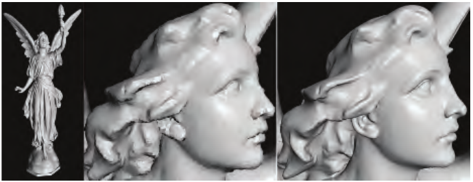
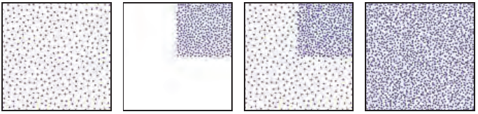
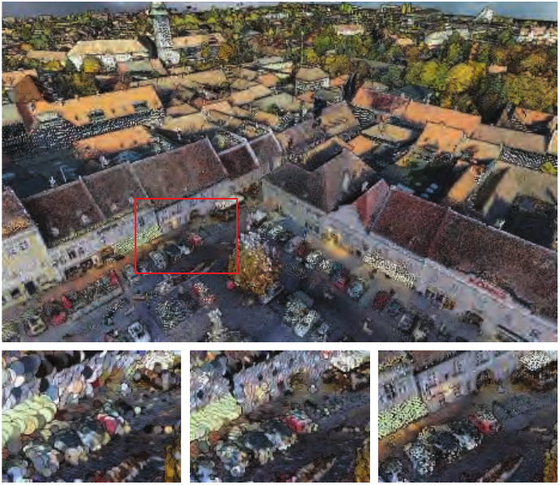
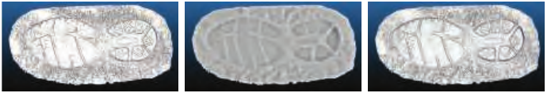
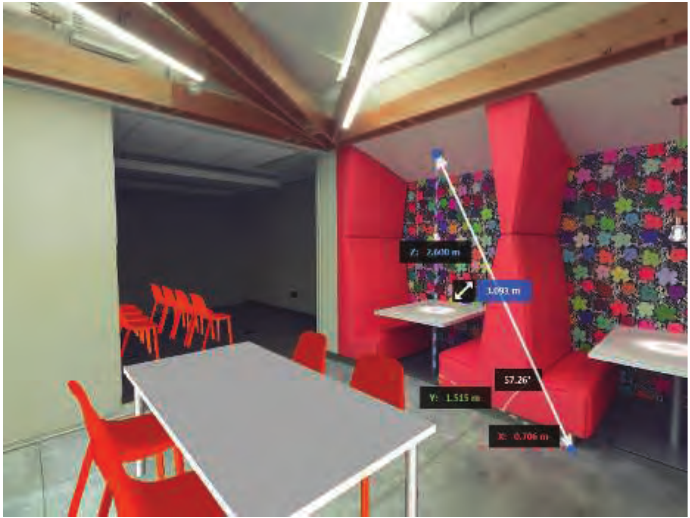

# 13.9 点渲染

来源：Real-Time Rendering，第四版，书页 572—578（PDF 物理页 593—599）。本节从 13.9 标题起，至 13.10 标题前止。

1985 年，Levoy 和 Whitted 撰写了一份开创性的技术报告 [1033]，建议使用点作为一种新的图元来渲染一切。其基本思想是用大量点表示表面，然后渲染这些点。在后续遍次中，执行高斯滤波，填补已渲染点之间的空隙。高斯滤波器的半径取决于表面上的点密度，以及投影到屏幕上的点密度。Levoy 和 Whitted 在一台 VAX-11/780 上实现了这一系统。

然而，直到大约 15 年之后，基于点的渲染才重新引起关注。这次复兴有两个原因：计算能力已经达到能够以交互速率进行点渲染的水平，而且通过激光测距扫描仪获得的极其精细的模型也已出现 [1035]。此后，各种能够检测距离的 RGB-D（深度）设备相继问世，从用于地形测绘的机载 LIDAR（LIght Detection And Ranging，光探测与测距，即激光雷达）仪器 [779]，到用于近距离数据采集的微软 Kinect 传感器、iPhone TrueDepth 摄像头和 Google 的 Tango 设备，不一而足。自动驾驶汽车上的 LIDAR 系统每秒可以记录数百万个点。通过摄影测量或其他计算摄影技术处理二维图像，也可以得到数据集。这些技术的原始输出都是一组三维点，并带有附加数据，通常是强度或颜色。还可能提供额外的分类数据，例如一个点来自建筑物还是路面 [37]。这些点云可以通过多种方式进行处理和渲染。

这类模型最初表示为彼此没有连接关系的三维点。关于点云滤波技术以及将点云转换为网格的方法，Berger 等人 [137] 给出了深入的综述。Kotfis 和 Cozzi [930] 提出了一种处理点云、将其体素化并以交互速率渲染体素化结果的方法。这里，我们讨论直接渲染点云数据的技术。

QSplat [1519] 是一个颇具影响力的点渲染器，首次发布于 2000 年。它使用球体层次结构来表示模型。这棵树中的节点经过压缩，因此能够渲染由数亿个点组成的场景。一个点被渲染为具有一定半径的形状，称为 splat（泼溅片）。可用的泼溅片形状包括正方形、不透明圆形和模糊圆形。换句话说，泼溅片就是粒子，只是渲染它们的目的是表示连续表面。图 13.22 给出了一个示例。渲染可以在树的任意一层停止。该层的节点被渲染为泼溅片，其半径与节点球体的半径相同。因此，构建包围球层次结构时，要确保在任何层级都看不到孔洞。由于树遍历可以在任意层级停止，只要在时间预算耗尽时停止遍历，就能获得交互帧率。当用户停止移动视点时，可以反复细化渲染结果，直到到达层次结构的叶节点。

图 13.22。这些模型采用基于点的渲染方式，使用圆形泼溅片绘制。左图展示名为 Lucy 的天使模型全貌，共有 1000 万个顶点，但渲染时只使用了大约 300 万个泼溅片。中图和右图放大了头部。中图在渲染时使用了大约 4 万个泼溅片。当观察者停止移动后，结果逐渐收敛为右图，其中使用了 60 万个泼溅片。（图像由 Szymon Rusinkiewicz 编写的 QSplat 程序生成。Lucy 模型由斯坦福图形学实验室创建。）

大约同一时期，Pfister 等人 [1409] 提出了 surfel，即表面元素。它同样是一种基于点的图元，用来表示物体表面的一部分，因此始终包含法线。采样得到的表面元素使用八叉树（第 19.1.3 节）存储，数据包括位置、法线和滤波后的纹素。渲染时，先将表面元素投影到屏幕上，再使用可见性泼溅算法填补产生的孔洞。QSplat 和表面元素的论文指出并解决了点云系统的一些关键问题：管理数据集规模，以及根据给定的一组点渲染出可信的表面。

QSplat 使用层次结构，但它一直细分到单个点的层级；内部的父节点是包围球，每个球中包含一个点，其值是各子节点的平均值。Gobbetti 和 Marton [546] 引入了分层点云，这种层次结构更适合映射到 GPU，而且不会生成人为的“平均”数据点。每个内部节点和子节点包含的点数大致相同，记为 n；这些点作为一个集合，通过一次 API 调用进行渲染。构建根节点时，从整个点集中选取 n 个点，作为模型的粗略表示。选取点间距离大致相同的一组点，效果要优于随机选择 [1583]。也可以利用法线或颜色的差异来选择点簇 [570]。其余的点按空间位置划分到两个子节点中。在每个子节点上重复这一过程，选择 n 个有代表性的点，再将剩下的点分成两个子集。不断进行这种选择和细分，直到每个子节点所含的点数不超过 n。见图 13.23。Botsch 等人的工作 [180] 很好地展示了先进技术的水平：它采用 GPU 加速，并使用延迟着色（第 20.1 节）和高质量滤波。在显示过程中，持续加载并渲染可见节点，直到达到某个限制条件。可以根据节点相对于屏幕的大小，判断加载该点集的重要程度，并估计所渲染公告板的尺寸。由于没有为父节点引入新的点，内存用量与存储的点数成正比。这一方案的缺点是，当放大观察某一个子节点时，所有父节点都必须送入流水线，即使其中每个父节点只有少量点可见也是如此。

图 13.23。分层点云。左图中，根节点包含从子节点数据中取出的稀疏子集。接下来展示一个子节点，随后展示它与根节点中的点合并后的结果；注意，子节点所占的区域变得更加充实。最右侧是完整点云，包括根节点和全部子节点。（图像来自开源软件 Potree [1583] 的文档，potree.org。本图参照 Adorjan [12]。）

在当前的点云渲染系统中，数据集可能极其庞大，由数千亿个点组成。这样的数据集无法全部加载到内存中，更不用说以交互速率显示，因此几乎所有点云渲染系统都使用层次结构进行加载和显示。所采用的方案可能受到数据特点的影响，例如，四叉树通常比八叉树更适合地形。关于如何高效创建和遍历点云数据结构，已有大量研究。Scheiblauer [1553] 总结了这一领域的研究，也介绍了表面重建技术及其他算法。Adorjan [12] 概述了若干系统，重点关注如何共享通过摄影测量生成的建筑物点云。

理论上，可以为每个泼溅片提供各自的法线和半径，以定义表面。实际应用中，这些数据占用的内存过多，而且只有经过大量预处理才能获得，所以通常使用固定半径的公告板。由于排序和混合的开销，为点正确渲染半透明泼溅片公告板可能既昂贵又充满伪影。为了保持交互性和质量，往往采用不透明公告板，即正方形或通过裁切形成的圆形。见图 13.24。

图 13.24。从包含 1.45 亿个点的小镇数据集中选取 500 万个点进行渲染。通过检测深度差异来增强边缘。数据稀疏或公告板半径过小的地方会出现空隙。底部一排分别展示图像点数预算为 50 万、100 万和 500 万时，所选区域的效果。（图像使用开源软件 Potree [1583] 生成，potree.org。奥地利 Retz 小镇模型由 RIEGL 提供，riegl.com。）

如果点没有法线，可以采用多种技术来实现着色。一种基于图像的方法是计算某种形式的屏幕空间环境光遮蔽（第 11.3.6 节）。通常先将所有点渲染到深度缓冲中，所用半径要足够大，以形成连续表面。在后续渲染遍次中，根据比当前点更靠近观察者的相邻像素数量，按比例调暗每个点的着色。眼穹光照（eye-dome lighting，EDL）能够进一步突出表面细节 [1583]。EDL 会检查相邻像素的屏幕深度，找出比当前像素更靠近观察者的像素。对于每个这样的邻居，计算它与当前像素的深度差，然后累加。对这些差值求平均、取负，再乘以一个强度因子，最后将结果作为指数函数 exp 的输入。见图 13.25。

图 13.25。左图是在单个遍次中渲染带法线的点。中图是对不带法线的点云进行屏幕空间环境光遮蔽渲染；右图则对同一点云使用眼穹光照。后两种方法都需要先执行一个遍次，建立图像中的深度信息。（图像使用 GPL 软件 CloudCompare 生成，cloudcompare.org。足印模型由 Eugene Liscio 提供。）

如果每个点都附带颜色或强度，光照就已经被烘焙进这些数据，可以直接显示，不过有光泽或反射性的物体不会随视角变化而产生相应变化。物体类型或高程等额外的非图形属性，也可以用来显示这些点。这里仅涉及点云管理与渲染的基础。Schuetz [1583] 讨论了多种渲染技术，提供了实现细节以及一个高质量的开源系统。

点云数据可以与其他数据源结合。例如，Cesium 程序可以将点云与高分辨率地形、图像、矢量地图数据以及摄影测量生成的模型组合起来。另一种与扫描有关的技术，是从一个视点将环境捕获到天空盒中，同时保存颜色和深度信息，从而使捕获的场景具有物理上的空间存在感。例如，用户可以向场景中加入合成模型，并让它们与这种天空盒正确融合，因为周围图像中的每个点都具有深度信息。见图 13.26。

图 13.26。每个像素都具有深度信息的环境。在固定的观察位置下，观察方向可以改变；用户可以测量世界空间位置之间的距离，并放置虚拟物体，遮挡关系也能得到正确处理。（图像使用 Autodesk ReCap Pro 生成，由 Autodesk, Inc. 提供。）

先进技术已经取得相当大的进展，这类技术开始应用于数据采集与显示之外的领域。举例来说，下面简要介绍 Evans [446] 为游戏 Dreams 提出的一个实验性点渲染系统。每个模型都表示为由点簇组成的包围体层次结构（BVH），每个点簇包含 256 个点。这些点由有符号距离函数（第 17.3 节）生成。为了支持细节层次，每个细节层次都会单独生成一套 BVH、点簇和点。从高细节过渡到低细节时，先通过随机方式将高密度子点簇中的点数减少至 25%，然后换入低细节的父点簇。渲染器基于计算着色器，通过原子操作避免冲突，将点泼溅到帧缓冲中。它实现了多种技术，例如随机透明度、景深（根据弥散圆对泼溅片施加抖动）、环境光遮蔽以及不完美阴影贴图 [1498]。为了平滑伪影，还执行时间抗锯齿（第 5.4.2 节）。

点云表示空间中的任意位置，因此渲染可能面临挑战，因为点之间的间隙通常是未知的，或者不容易获得。Kobbelt 和 Botsch [916] 对这一问题以及点云相关的其他研究领域进行了综述。在本章的最后，我们转向一种非多边形表示，在这种表示中，一个样本与其邻居之间的距离始终相同。
