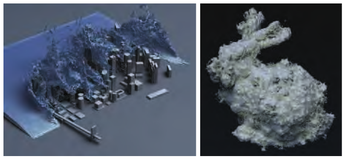
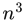
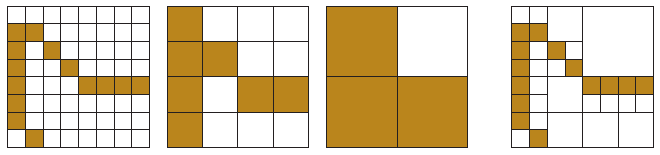
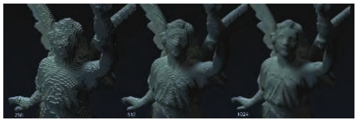
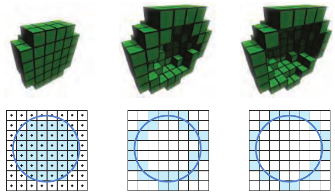
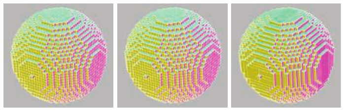
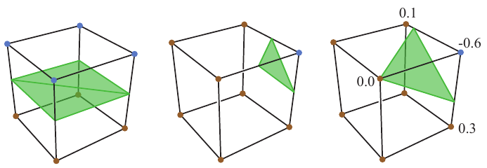
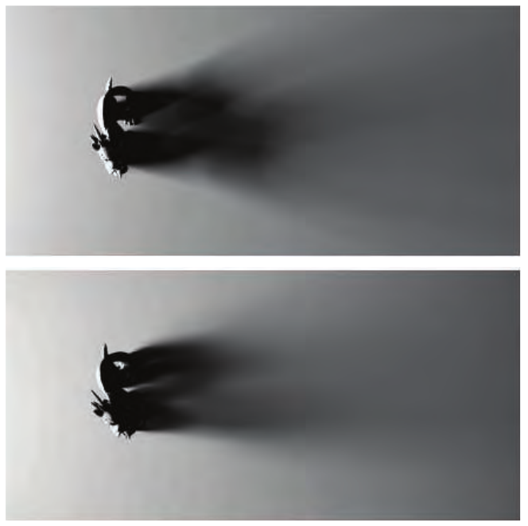

# 13.10 体素

来源：《Real-Time Rendering, Fourth Edition》书页 578—586（PDF 第 599—607 页）。本节从 13.10 标题开始，包含 13.10.1—13.10.5；章末“延伸阅读与资源”另见 13.99_延伸阅读与资源.md。

正如像素（pixel）是“图像元素”（picture element），纹素（texel）是“纹理元素”（texture element），体素（voxel）就是“体积元素”（volume element）。每个体素表示均匀三维网格中的一块空间体积，通常是一个立方体。体素是存储体积数据的传统方式，能够表示的对象从烟雾到 3D 打印模型，从骨骼扫描到地形表示，不一而足。每个体素可以只存储一个比特，表示其中心位于物体内部还是外部。在医学应用中，可能具有密度或不透明度数据，或许还包括体积流量。为了便于渲染，也可以存储颜色、法线、有符号距离或其他数值。每个体素都不需要单独存储位置信息，因为其在网格中的索引已经决定了位置。

## 13.10.1 应用

模型的体素表示有许多不同用途。规则的数据网格适合进行各种涉及整个物体、而不仅仅是其表面的操作。例如，以体素表示的物体，其体积就是内部所有体素的体积之和。网格具有规则结构，而且体素的局部邻域定义明确，因此可以用元胞自动机或其他算法模拟烟雾、侵蚀或云的形成等现象。有限元分析利用体素确定物体的抗拉强度。对模型进行雕塑或雕刻，就变成了减去体素的操作。反过来，要构建精细复杂的模型，可以把多边形模型放入体素网格，并确定它与哪些体素重叠。与必须处理奇异情况和精度问题的较传统多边形工作流程相比，这类构造实体几何建模操作高效、可预测，而且能够保证正常工作。OpenVDB [1249, 1336] 和 NVIDIA GVDB Voxels [752, 753] 等基于体素的系统，被用于电影制作、科学与医学可视化、3D 打印及其他应用。见图 13.27。

**图 13.27：** 体素的应用。左图直接在稀疏体素网格上计算流体模拟，并以体积形式进行渲染。右图把一个多边形兔子模型体素化为有符号距离场，再用噪声函数扰动该距离场，最后渲染一个等值面。（左图由 NVIDIA® 提供，基于 Wu 等人的研究 [1925]。右图使用 NVIDIA® GVDB Voxels 渲染，由 NVIDIA Corporation 提供。）

## 13.10.2 体素存储

体素存储需要大量内存，因为数据量随体素分辨率按 O() 增长。例如，一个各维分辨率均为 1000 的体素网格，会产生十亿个位置。《Minecraft》等基于体素的游戏可以拥有巨大的世界。在该游戏中，数据以每块 16 × 16 × 256 个体素的区块形式流式载入，覆盖每位玩家周围一定半径内的区域。每个体素存储一个标识符，以及额外的朝向或样式数据。每种方块类型都有自己的多边形表示：例如，用立方体显示的实心石块、使用带 alpha 值纹理的半透明窗户，或由一对镂空公告板表示的草。示例见书页 529 的图 12.10 和书页 842 的图 19.19。

存储在体素网格中的数据通常具有很强的相干性，因为相邻位置很可能具有相同或相近的数值。根据数据来源的不同，网格的绝大部分也可能为空，这称为稀疏体积。相干性与稀疏性都能带来紧凑的表示。例如，可以在网格上建立一棵八叉树（第 19.1.3 节）。在八叉树的最底层，每组 2 × 2 × 2 个体素样本可能完全相同，此时可在八叉树中记录这一点，并舍弃这些体素。还可以沿树向上检测相同性，舍弃相同的八叉树子节点。只有数据不同的地方才需要存储。这种稀疏体素八叉树（sparse voxel octree，SVO）表示 [87, 304, 308, 706] 天然适合细节层次表示，是 mipmap 在三维体积中的对应形式。见图 13.28 和图 13.29。Laine 和 Karras [963] 给出了 SVO 数据结构的大量实现细节以及多种扩展。

**图 13.28：** 以二维形式展示的稀疏体素八叉树。给定左侧的一组体素，沿树向上记录哪些父节点中含有体素。右侧是最终八叉树的可视化，显示每个网格位置所存储的最深层节点。（据 Laine 和 Karras [963] 的图绘制。）

**图 13.29：** 不同细节层次下的体素光线追踪。从左到右，包含模型的体素网格每条边上的分辨率分别为 256、512 和 1024。（图像使用 Optix 和 NVIDIA® GVDB Voxels 渲染，由 NVIDIA Corporation 提供 [753]。）

## 13.10.3 体素的生成

体素模型的输入可以来自多种来源。例如，许多扫描设备会在任意位置生成数据点。GPU 可以加速体素化（voxelization），即把点云 [930]、多边形网格或其他表示转换为一组体素的过程。对于网格，Karabassi 等人 [859] 提出了一种快速但粗略的方法：从六个正交视图渲染物体，即顶面、底面和四个侧面。每个视图生成一个深度缓冲区，因此每个像素都保存了从该方向看到的第一个体素所在的位置。如果一个体素的位置，在六个缓冲区中都处于所存深度的后方，那么它就是不可见的，因此被标记为处于物体内部。这种方法会遗漏从六个视图中的任何一个都无法看到的特征，导致某些体素被错误地标记为内部体素。不过，对于简单模型，这种方法可能已经足够。

受到视觉外壳（visual hull）[1139] 的启发，Loop 等人 [1071] 使用了一种更简单的系统，为现实世界中的人物创建体素化表示。首先拍摄人物的一组图像，并提取剪影。然后根据相机位置，使用每个剪影削除一组体素：只有能看到人物的像素，才会有与之关联的体素。

**图 13.30：** 用三种不同方式对球体进行体素化，并显示其横截面。左图为实体体素化，通过测试每个体素的中心相对于球体的位置来确定。中图为保守体素化，只要体素被球面接触，就将其选中。这种表面称为 26 分离体素化（26-separating voxelization），其中任何内部体素的 3 × 3 × 3 邻域内都不会紧邻外部体素。换句话说，内部体素和外部体素从不共享面、边或顶点。右图为 6 分离体素化（6-separating voxelization），其中内部与外部体素之间可以共享边和角点。（据 Schwarz 和 Seidel [1594] 的图绘制。）

体素网格也可以从一组图像创建，例如医学成像设备生成切片，然后将这些切片堆叠起来。按照同样的思路，可以逐切片渲染网格模型，并记录找到的位于模型内部的体素。通过调整近、远裁剪平面来限定每张切片，并检查其中的内容。Eisemann 和 Décoret [409] 提出了切片图（slicemap）的概念：把一个 32 位渲染目标看成 32 个独立深度层，每层用一个比特标志表示。把渲染到这一体素网格中的三角形深度转换成对应的比特形式并存储。这样，32 层就可以在一个渲染通道中完成渲染；如果使用通道位宽更大的图像格式以及多个渲染目标，同一个通道还可以处理更多体素层。Forest 等人 [480] 给出了实现细节，并指出现代 GPU 在单个通道中最多可以渲染 1024 层。注意，这种切片算法只识别模型的表面，即其边界表示。前面介绍的六视图算法还会识别完全位于模型内部的体素，尽管有时会误分类。图 13.30 展示了三种常见的体素化类型。Laine [964] 对相关术语、各种体素化类型，以及生成和使用它们所涉及的问题，作了全面论述。

利用现代 GPU 提供的新功能，可以实现更高效的体素化。Schwarz 和 Seidel [1594, 1595] 以及 Pantaleoni [1350] 提出了使用计算着色器的体素化系统，它们能够直接构建 SVO。Crassin 和 Green [306, 307] 描述了他们的开源规则网格体素化系统，该系统利用了从 OpenGL 4.2 开始提供的图像加载/存储操作。这些操作允许随机读写纹理内存。他们的算法使用保守光栅化（第 23.1.2 节）确定与一个体素重叠的所有三角形，从而高效计算体素占用情况，以及平均颜色和法线。他们也可以用这种方法创建 SVO：自顶向下构建，在下降过程中只对非空节点进行体素化，然后使用自底向上的滤波式 mipmap 生成过程来填充该结构。Schwarz [1595] 给出了基于光栅化和基于计算内核的两类体素化系统的实现细节，并解释了各自的特点。Rauwendaal 和 Bailey [1466] 在介绍其混合系统时附带了源代码。他们提供了并行体素化方案的性能分析，以及正确使用保守光栅化以避免误判为占用的细节。Takeshige [1737] 讨论了在能够接受少量误差的情况下，如何使用 MSAA 作为保守光栅化的可行替代方案。Baert 等人 [87] 提出了一种能够高效进行外存处理的 SVO 创建算法；也就是说，它可以以很高的精度对场景进行体素化，而无需让整个模型常驻内存。

由于场景体素化需要大量处理，动态物体，即发生移动或以其他方式运动的物体，对基于体素的系统构成了挑战。Gaitatzes 和 Papaioannou [510] 通过逐步更新场景的体素表示来处理这一任务。他们使用场景相机的渲染结果以及所生成的阴影贴图，来清除和设置体素。将体素与深度缓冲区进行测试，清除那些比所记录的 z 深度更近的体素。然后把缓冲区中的深度位置视为一组点，并将其变换到世界空间。确定这些点对应的体素，若之前尚未标记，就将其设置为占用。这种清除再设置的过程依赖于视图，也就是说，场景中当前没有任何相机能看到的部分实际上是未知的，因此可能成为误差来源。不过，这种快速近似方法使得在动态环境中以交互速率计算基于体素的全局光照效果成为现实（第 11.5.6 节）。

## 13.10.4 渲染

体素数据存储在三维数组中，也可以把它视为三维纹理，而且确实能够这样存储。这类数据有许多种显示方式。下一章将讨论如何可视化半透明体素数据，例如雾；以及如何通过放置切片平面检查数据集，例如超声图像。这里我们重点讨论表示实体物体的体素数据的渲染。

设想最简单的体积表示：每个体素包含一个比特，用来指明它位于物体内部还是外部。这种数据有几种常见的显示方法 [1094]。一种方法是直接对体积进行光线投射 [752, 753, 1908]，确定每个立方体被击中的最近表面。另一种技术是把体素立方体转换为一组多边形。虽然使用网格进行渲染会很快，但这会在体素化阶段带来额外开销，因而最适合静态体积。如果每个体素的立方体都要显示为不透明的，那么两个立方体相邻处的面都可以剔除，因为它们之间共享的正方形不可见。这个过程最终留下一个由正方形组成、内部中空的外壳。简化技术（第 16.5 节）可以进一步减少多边形数量。见图 13.31。

**图 13.31：** 立方体剔除。左图中，由 17,074 个体素构成的实心球体包含 102,444 个四边形，每个体素有六个。中图移除了相邻实心体素之间的两个四边形，使数量减至 4,770。由于外壳未变，其外观与左图相同。右图使用快速贪心算法合并面，形成更大的矩形，最终得到 2,100 个四边形。（图像来自 Mikola Lysenko 的剔除程序 [1094]。）

对于表示曲面的体素，直接对这组立方体面进行着色并不逼真。一种常见的替代方法是，不再对立方体着色，而是使用移动立方体（marching cubes）[558, 1077] 等算法生成更平滑的网格表面。这一过程称为表面提取（surface extraction）或多边形化（polygonalization，亦称 polygonization）。我们不再把每个体素视为一个盒子，而是把它视为一个点样本。随后，以呈 2 × 2 × 2 排列的八个相邻样本为角点，构成一个立方体。这八个角点的状态可以定义一个穿过立方体的表面。例如，如果立方体顶部的四个角点位于物体外部，而底部四个角点位于内部，那么用一个水平正方形将立方体分成两半，就是对表面形状的合理猜测。如果一个角点在外部而其余角点在内部，就会产生一个三角形，它由连接到该外部角点的三条立方体边的中点构成。见图 13.32。把一组立方体角点转换成对应多边形网格的过程非常高效，因为八个角点的比特可以转换为 0 到 255 的索引，并用它查询一张表；表中为每一种可能的配置规定了三角形的数量和位置。

其他体素渲染方法，例如水平集（level sets）[636]，更适合光滑的曲面。设想每个体素存储它到所表示物体表面的距离，内部为正值，外部为负值。我们可以利用这些数据调整所生成网格的顶点位置，以更精确地表示表面，如图 13.32 右图所示。另一种做法是直接对等值为零的水平集进行光线追踪。这种技术称为水平集渲染（level-set rendering）[1249]。它特别擅长在无需任何额外体素属性的情况下，表示曲面模型的表面和法线。

**图 13.32：** 移动立方体。左图中，底部四个角点是位于物体内部的体素中心，因此在底部和顶部的四个角点之间，形成一个由两个三角形组成的水平正方形。中图中，一个角点位于外部，因此形成一个三角形。右图中，如果在角点存储有符号距离值，就可以通过插值，将三角形顶点定位在各条边上数值为 0.0 的位置。注意，共享某条边的其他立方体也会在这条边的同一位置产生顶点，以确保表面没有裂缝。

对于表示密度差异的体素数据，可以通过决定什么构成表面，以不同方式将其可视化。例如，某个给定密度可能很好地表示肾脏，而另一密度可以显示其中存在的肾结石。选择一个密度值，就定义了一个等值面（isosurface），即一组具有相同数值的位置。能够改变这一数值，对科学可视化尤其有用。直接对任意等值面数值进行光线追踪，是水平集光线追踪的推广；后者的目标值始终为零。也可以提取等值面，并将其转换为多边形模型。

2008 年，Olick [1323] 发表了一场颇具影响力的演讲，介绍如何通过光线投射直接渲染稀疏体素表示，启发了后续研究。对光线与规则化体素进行测试，非常适合在 GPU 上实现，而且能够达到交互帧率。许多研究人员探索了这一渲染领域。若要入门，可以从 Crassin 的博士论文 [304] 和 SIGGRAPH 演讲 [308] 开始，其中介绍了基于体素的方法的优势。Crassin 使用锥体追踪（cone tracing）来利用数据类似 mipmap 的性质。其总体思路是利用体素表示的规则性以及定义明确的局部性，为几何和着色属性设计预滤波方案，从而允许使用线性滤波器。虽然只在场景中追踪一条光线，却能够收集从光线起点发出的一个锥体范围内的近似可见性信息。随着光线在空间中前进，其关注区域的半径逐渐增大，这意味着要在体素层次结构中更高的层级进行采样；这类似于当一个像素内覆盖的纹素增多时，需要采样 mipmap 的更高层级。这类采样能够快速计算软阴影和景深等效果，因为这些效果可以分解为锥体追踪问题。区域采样对其他处理也有价值，例如抗锯齿，以及对变化的表面法线进行正确滤波。Heitz 和 Neyret [706] 介绍了已有工作，并提出了一种用于锥体追踪的新数据结构，改善了可见性计算结果。Kasyan [865] 使用体素锥体追踪处理面光源，并讨论了误差来源。图 13.33 给出了对比。最终效果见书页 264 的图 7.33。第 11.5.7 节讨论并展示了如何使用锥体追踪计算全局光照效果。

**图 13.33：** 锥体追踪阴影。上图：在 Maya 中通过光线追踪渲染球形面光源，耗时 20 秒。下图：对同一场景进行体素化和锥体追踪，耗时约 20 毫秒。模型使用多边形渲染，其体素化版本用于阴影计算。（图像由 Crytek 提供 [865]。）

近期的研究趋势是在 GPU 上探索八叉树以外的结构。八叉树的一个主要缺点是，光线追踪等操作需要在遍历树时进行大量跳转，因此必须存储相当多的中间节点。Hoetzlein [752] 表明，使用 GPU 对 VDB 树这种由网格组成的层次结构进行光线追踪，与八叉树相比能够显著提升性能，而且更适合体积数据的动态变化。Fogal 等人 [477] 展示了使用索引表而非八叉树，通过双通道方法实时渲染大型体积数据的方案。第一个通道识别可见子区域（砖块，bricks），并从磁盘流式载入这些区域。第二个通道渲染当前驻留在内存中的区域。Beyer 等人 [138] 对大规模体积渲染作了全面综述。

## 13.10.5 其他主题

表面提取的一种常见用途是可视化隐式曲面（第 17.3 节）。这种基本算法存在不同形式，网格形成方式也有一些微妙之处。例如，如果发现立方体的角点交替位于内部和外部，那么在形成的多边形网格中，应该把这些内部角点连接起来，还是保持分离？关于隐式曲面的多边形化技术综述，可参阅 de Araújo 等人的文章 [67]。Austin [85] 逐一讨论了多种通用多边形化方案的优缺点，认为立方体移动正方形（cubical marching squares）具有最理想的性质。

使用光线投射进行渲染时，除了完整的多边形化之外，还可以采用其他方案。例如，Laine 和 Karras [963] 为每个体素附加一组近似表面的平行平面，然后用后处理模糊掩盖体素之间的不连续。Heitz 和 Neyret [706] 通过一种可线性滤波的表示来访问有符号距离；这种表示允许在任意空间位置和分辨率下，重建平面方程，并确定给定方向上的覆盖率。

Eisemann 和 Décoret [409] 展示了如何用体素表示执行深度阴影映射（第 7.8 节），用于相互重叠的半透明表面投射阴影的情况。正如 Kämpe、Sintorn 等人所展示的 [850, 1647]，体素化场景的另一项优点是，所有光源的阴影光线都可以使用同一份表示进行测试，而无需为每个光源各生成一张阴影贴图。与直接可见表面的渲染相比，人眼对阴影和间接光照等次级效果中的小误差更加宽容，因此完成这些任务所需的体素数据要少得多。当只跟踪体素是否被占用时，许多稀疏体素节点之间可能具有极高的自相似性 [849, 1817]。例如，一堵墙会形成在若干层级上完全相同的体素集合。这意味着树中的多个节点乃至整棵子树都是相同的，因此可以对这些节点使用单个实例，并将它们存储在称为有向无环图的结构中（第 19.1.5 节）。这样做通常能够大幅降低每个体素结构所需的内存量。
