# 14.1 光散射理论

来源：《Real-Time Rendering》第4版，书页589—599（PDF物理页610—620）；并核对PDF物理页621的14.2边界。章首导言另存；本节止于14.1.4“几何散射”末段。

本节介绍参与介质中光的模拟与渲染。这是对9.1.1和9.1.2节讨论过的散射与吸收这两种物理现象的定量论述。许多作者已在包含多次散射的路径追踪背景下阐述了辐射传输方程[479, 743, 818, 1413]。这里我们将着重讨论**单次散射**，并建立对其工作原理的直观认识。单次散射只考虑光在构成参与介质的粒子上反弹一次。**多次散射**则跟踪每条光路上的多次反弹，因此复杂得多[243, 479]。书页646的图14.51给出了考虑与不考虑多次散射的结果。表14.1列出了散射方程中用于表示参与介质属性的符号和单位。注意，本章中许多量，例如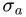、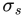、、p、ρ、v和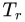，都与波长有关；在实际应用中，这意味着它们是RGB量。

| 符号 | 说明 | 单位 |
| --- | --- | --- |
|  | 吸收系数 | 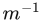 |
|  | 散射系数 |  |
|  | 消光系数 |  |
| ρ | 反照率 | 无量纲 |
| p | 相函数 | 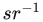 |

**表14.1** 用于散射和参与介质的记号。每个参数都可以依赖于波长（即RGB），从而实现有颜色的光吸收或散射。相函数的单位为球面度的倒数（8.1.1节）。

## 14.1.1 参与介质材料

有四类事件会影响沿光线穿过介质传播的辐亮度。图14.1展示了这些事件，可概括如下：

- **吸收**（由决定）：光子被介质中的物质吸收，并转变为热或其他形式的能量。
- **出散射**（由决定）：光子在介质物质中的粒子上反弹，散射到当前方向之外。这一过程遵循相函数p，后者描述光反弹方向的分布。
- **发射**：介质达到高温时可能发光，例如火焰的黑体辐射。有关发射的更多细节，请参阅Fong等人的课程讲义[479]。
- **入散射**（由决定）：来自任意方向的光子在粒子上反弹后，可能散射进入当前光路，对最终辐亮度作出贡献。某个给定方向入散射的光量还取决于该光照方向对应的相函数p。

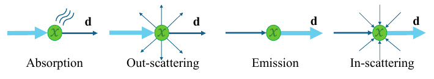

**图14.1** 不同事件会改变参与介质中沿方向d的辐亮度。

总之，向一条路径中添加光子取决于入散射和发射；从路径中移除光子则取决于**消光** =  + ，它同时表示吸收与出散射。按照辐射传输方程的解释，这组系数表示位置𝐱处、朝向𝐯的辐亮度相对于L(𝐱, 𝐯)的导数。因此，这些系数的取值均在[0, +∞]范围内。详情参见Fong等人的讲义[479]。散射系数与吸收系数决定介质的**反照率**ρ，其定义为

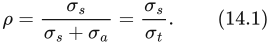

它表示在所考虑的每个可见光谱范围内，介质散射相对于吸收的重要程度，也就是介质总体的反射能力。ρ的取值在[0, 1]内。接近0表示大部分光被吸收，介质因而显得暗浊，例如深色的废气烟雾；接近1则表示大部分光被散射而不是被吸收，介质因而显得较明亮，例如空气、云或地球大气。

如9.1.2节所述，介质的外观由散射和吸收属性共同决定。真实世界中参与介质的系数值已经得到测量并发表[1258]。例如，牛奶具有很高的散射值，因此呈现浑浊、不透明的外观。牛奶还有很高的反照率ρ > 0.999，所以显得白。另一方面，红葡萄酒几乎不发生散射，却具有很强的吸收，因此呈现半透明、有颜色的外观。请观察图14.2中的液体渲染结果，并与书页301图9.8中的液体照片比较。

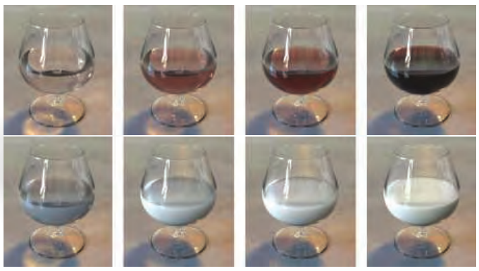

**图14.2** 渲染的葡萄酒与牛奶，分别表现了不同浓度下的吸收与散射。（图片由Narasimhan等人提供[1258]。）

这些属性与事件都依赖于波长。这意味着在某个给定介质中，不同频率的光被吸收或散射的概率可能不同。理论上，为了考虑这一点，我们应当在渲染中使用光谱值。为提高效率，实时渲染使用RGB值代替；离线渲染除少数例外[660]之外也如此。如果条件允许，应使用颜色匹配函数（8.1.3节），根据光谱数据预先计算、等量的RGB值。

前面的章节没有参与介质，因此我们可以假设进入相机的辐亮度与离开最近表面的辐亮度相同。更确切地说，我们曾在书页310假设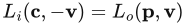，其中𝐜是相机位置，𝐩是视线与最近表面的交点，𝐯是从𝐩指向𝐜的单位视向量。

引入参与介质后，这个假设便不再成立，我们需要考虑沿视线发生的辐亮度变化。作为示例，下面介绍计算点状光源散射光所涉及的运算；点状光源是指用单个无穷小点表示的光源（9.4节）：

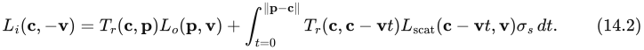

其中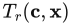是给定点𝐱与相机位置𝐜之间的**透射率**（14.1.2节）；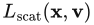是光线上给定点𝐱处沿视线散射的光（14.1.3节）。图14.3展示了计算中的各个组成部分，后续小节将逐一解释。关于如何从辐射传输方程推导出式14.2，Fong等人的课程讲义[479]中提供了更多细节。

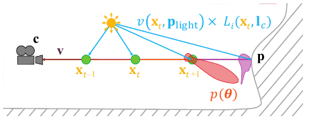

**图14.3** 点状光源的单次散射积分示意图。沿视线的采样点用绿色表示，其中一个点的相函数用红色表示，不透明表面S的BRDF用橙色表示。这里，是指向光源中心的方向向量，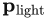是光源位置，p是相函数，函数v是可见性项。

## 14.1.2 透射率

透射率表示光在穿过一定距离的介质后能够通过的比例，按照下式计算：

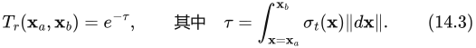

这种关系也称为**比尔–朗伯定律**。**光学深度**τ是无量纲量，表示光衰减的程度。消光越强，或穿行距离越长，光学深度就越大，穿过介质的光也就越少。光学深度τ = 1会使约60%的光被移除。例如，如果的RGB值为(0.5, 1, 2)，则穿过深度d = 1米后的光为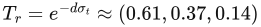。图14.4展示了这一行为。透射率需要应用于：(i) 来自不透明表面的辐亮度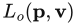；(ii) 入散射事件产生的辐亮度；以及(iii) 从散射事件到光源的每一条路径。在视觉上，(i) 会产生类似雾的表面遮蔽；(ii) 会遮蔽散射光，从而为介质厚度提供另一种视觉线索（见图14.6）；(iii) 会产生参与介质的体积自阴影（见图14.5）。由于 =  + ，透射率自然会同时受到吸收和出散射分量的影响。

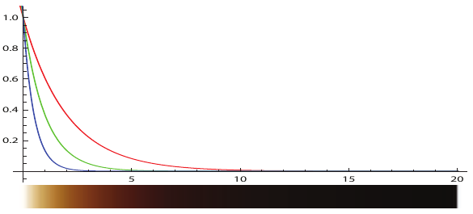

**图14.4** 透射率随深度变化的函数， = (0.5, 1.0, 2.0)。正如预期，红色分量的消光系数较低，因此有更多红光透射出来。

## 14.1.3 散射事件

对于给定位置𝐱和方向𝐯，可以按下式积分场景中各点状光源产生的入散射：

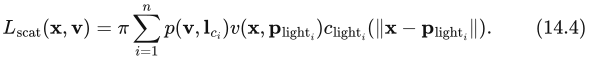

其中n是光源数量，p()是相函数，v()是可见性函数，是指向第i个光源的方向向量，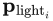是第i个光源的位置。此外，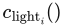表示第i个光源的辐亮度，它是到该光源位置的距离的函数，采用9.4节中的定义及5.2.2节中的平方反比衰减函数。可见性函数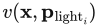表示从位置的光源到达位置𝐱的光的比例，按照下式计算：

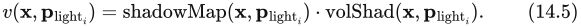

其中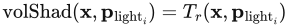。在实时渲染中，阴影来自两类遮挡：不透明遮挡和体积遮挡。不透明物体产生的阴影（shadowMap）传统上使用阴影映射或第7章中的其他技术计算。

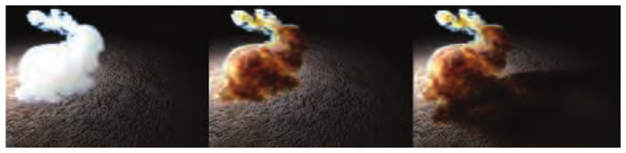

**图14.5** 由参与介质构成的斯坦福兔子的体积阴影示例[744]。左：没有体积自阴影；中：有自阴影；右：向场景中的其他元素投下阴影。（模型由斯坦福计算机图形学实验室提供。）

式14.5中的体积阴影项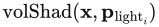表示从光源位置到采样点𝐱的透射率，取值范围为[0, 1]。体积产生的遮挡是体积渲染的关键组成部分，体积元素既可以产生自阴影，也可以向场景中的其他元素投射阴影。见图14.5。通常先沿着从眼睛穿过体积、到达第一个表面的主光线执行**光线步进**，然后从每个采样点出发，沿着指向每个光源的次级光线路径执行光线步进。“光线步进”是指使用n个采样点对两点之间的路径进行采样，并沿途积分散射光和透射率。关于这种采样方法的更多细节，参见6.8.1节，那里将其用于高度场渲染。对于三维体积，光线步进的方法类似：每条光线逐步前进，在沿途的每个点采样体积材质或光照。参见图14.3，其中主光线的采样点用绿色表示，次级阴影光线用蓝色表示。许多其他文献也详细介绍了光线步进[479, 1450, 1908]。

由于光线步进的复杂度为O()，其中n为每条路径上的采样数，因此其开销会迅速增大。为了在质量和性能之间进行折中，可以使用专门的体积阴影表示技术，存储从光源出发的各个方向上的透射率。本章后面的相应章节将介绍这些技术。

为了直观理解介质内部的光散射与消光行为，考虑 = (0.5, 1, 2)、 = (0, 0, 0)的情况。当介质内部的光路较短时，入散射事件将胜过消光；在本例中，消光就是出散射，且深度较小时 ≈ 1。材质会显蓝色，因为蓝色通道的值最高。光在介质中穿得越深，消光使能够通过的光子越少。这时，由消光形成的透射颜色开始占主导。这可以用以下事实解释：由于 = (0, 0, 0)，所以 = 。因此，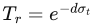作为光学深度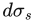的函数，其下降速度要比用式14.2对散射光作线性积分时快得多。在本例中，红光通道穿过介质时受到的消光较少，因为该通道的值最低，因此红色会占主导。图14.6展示了这种行为，这也正是大气和天空中发生的现象。太阳高悬时（例如光沿垂直于地面的方向穿过大气，光路较短），蓝光散射更多，赋予天空自然的蓝色。然而，当太阳位于地平线附近时，光在大气中的路径很长，更多红光被透射，天空便显得更红。这就形成了我们熟悉的美丽日出与日落过渡。关于大气的物质组成，14.4.1节有更详细的介绍。这一效应的另一个例子是书页299图9.6右侧的乳光玻璃。

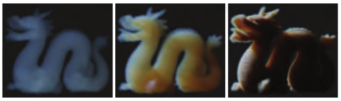

**图14.6** 随介质浓度增加而变化的斯坦福龙。从左到右：0.1、1.0和10.0， = (0.5, 1.0, 2.0)。（模型由斯坦福计算机图形学实验室提供。）

## 14.1.4 相函数

参与介质由半径不同的粒子组成。粒子的大小分布会影响光相对于其向前传播方向、朝某个给定方向散射的概率。9.1节解释了这种行为背后的物理原理。

在计算入散射时，使用**相函数**便可在宏观层面描述散射方向的概率与分布，如式14.4所示。图14.7展示了这一点。红色相函数采用参数θ，表示蓝色光的向前传播路径与绿色方向𝐯之间的夹角。注意这个相函数示例中的两个主要波瓣：在光路相反方向上的较小后向散射波瓣，以及较大的前向散射波瓣。相机B位于较大的前向散射波瓣方向，因此与相机A相比，它会接收到多得多的散射辐亮度。为了满足能量守恒、保持能量不增不减，相函数在单位球面上的积分必须等于1。

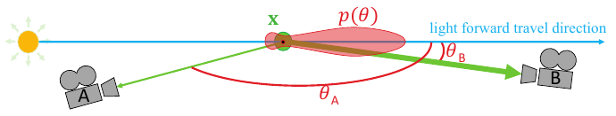

**图14.7** 相函数（红色）及其对散射光（绿色）的影响随θ变化的示意图。

相函数会根据到达某点的各方向辐亮度信息，改变该点的入散射。最简单的函数是**各向同性**的：光向所有方向均匀散射。这种理想而不现实的行为表示为

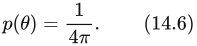

其中θ是入射光方向与出散射方向之间的夹角，4π是单位球面的面积。

基于物理的相函数依赖于粒子的相对大小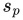，其定义为

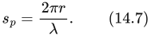

其中r为粒子半径，λ为所考虑的波长[743]：

- 当 ≪ 1时，发生**瑞利散射**（例如空气）。
- 当 ≈ 1时，发生**米氏散射**。
- 当 ≫ 1时，发生**几何散射**。

### 瑞利散射

瑞利勋爵（1842—1919）推导出了空气分子光散射的表达式。这些表达式的应用之一，是描述地球大气中的光散射。该相函数有两个波瓣，如图14.8所示，相对于光的方向分别称为**后向散射**与**前向散射**。函数在角度θ处求值，θ是入射光与出散射方向之间的夹角。该函数为

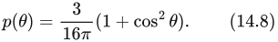

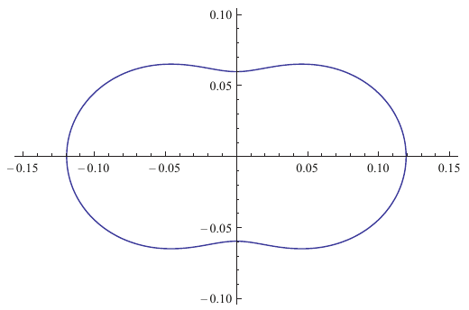

**图14.8** 瑞利相函数随θ变化的极坐标图。光从左侧水平入射，图中给出了对应角度θ的相对强度，θ从x轴起逆时针测量。前向散射与后向散射的概率相同。

瑞利散射高度依赖波长。将瑞利散射的散射系数看作光波长λ的函数时，它与波长的四次方成反比：

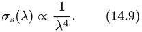

这种关系意味着，短波长的蓝光或紫光比长波长红光受到的散射强得多。可以用光谱颜色匹配函数（8.1.3节），把式14.9给出的光谱分布转换为RGB： = (0.490, 1.017, 2.339)。这个值经过归一化，其亮度为1，应根据所需散射强度进行缩放。蓝光在大气中受到更强散射所产生的视觉效果，将在14.4.1节解释。

### 米氏散射

米氏散射[776]是一种在粒子大小与光波长大致相当时可采用的模型。这种散射不依赖波长。MiePlot软件可用于模拟这一现象[996]。特定粒子大小所对应的米氏相函数，通常是具有强烈而尖锐方向波瓣的复杂分布；也就是说，相对于光子的传播方向，光子有很高概率散射到某些特定方向。为体积着色计算这类相函数的代价很高，但所幸很少需要这样做。介质通常具有连续的粒径分布。对这些不同大小所对应的米氏相函数求平均，会得到整个介质平滑的平均相函数。因此，可以用相对平滑的相函数表示米氏散射。

> 译注：本段“不依赖波长”忠实保留原书的概括性陈述。

为此常用的一种相函数是**Henyey–Greenstein（HG）相函数**，它最初被提出用于模拟星际尘埃中的光散射[721]。这一函数无法捕捉所有真实散射行为的复杂性，但可以很好地匹配相函数中的一个波瓣[1967]，即朝向主要散射方向的波瓣。它可用于表示各类烟、雾或尘埃状参与介质。这类介质可能表现出很强的后向或前向散射，在光源周围形成很大的视觉光晕。例如雾中的聚光灯，以及朝向太阳的云边缘上强烈的银边效果。

HG相函数可以表示比瑞利散射更复杂的行为，计算式为

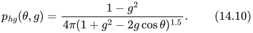

它可以呈现各种形状，如图14.9所示。参数g可以表示后向散射（g < 0）、各向同性散射（g = 0）或前向散射（g > 0），g的取值范围是[−1, 1]。图14.10展示了采用HG相函数的散射结果示例。

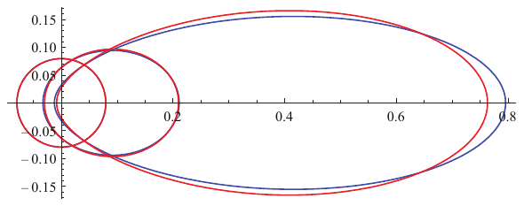

**图14.9** Henyey–Greenstein（蓝色）与Schlick近似（红色）相函数随θ变化的极坐标图。光从左侧水平入射。参数g从0增大到0.3、0.6，在右侧形成强波瓣，意味着光将更多地沿着其从左到右的前进路径散射。

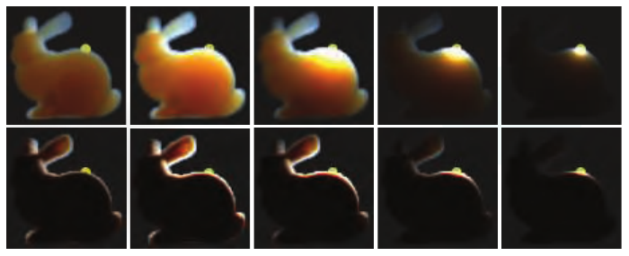

**图14.10** 由参与介质构成的斯坦福兔子，展示了HG相函数的影响，g的变化对应从各向同性散射到强前向散射。从左到右：g = 0.0、0.5、0.9、0.99和0.999。下排使用的参与介质密度是上排的十倍。（模型由斯坦福计算机图形学实验室提供。）

若要更快地得到与Henyey–Greenstein相函数相似的结果，可以使用Blasi等人[157]提出的近似；它通常以第三位作者命名，称为**Schlick相函数**：

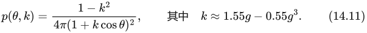

它不包含复杂的幂函数，只有平方运算，因此求值快得多。为了将该函数映射到原始HG相函数，需要由g计算参数k。对于g值恒定的参与介质，这一步只需执行一次。从实际应用角度看，Schlick相函数是一种出色的、满足能量守恒的近似，如图14.9所示。

> 译注：原书式14.11的分母为“1 + k cos θ”，且给出正号映射k ≈ 1.55g − 0.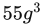；此处按原页保留。在本节相同θ定义下，这与式14.10中正g的前向波瓣方向存在符号一致性疑点，应用时应核查方向约定，不能直接把两式视为同向匹配。

还可以混合多个HG或Schlick相函数，表示更复杂的一般相函数[743]。这样便能表示同时具有强前向散射波瓣和强后向散射波瓣的相函数，类似于云的行为，14.4.2节将对此进行描述并给出图示。

### 几何散射

当粒子明显大于光的波长时，便会发生几何散射。在这种情况下，光可以在每个粒子内部折射和反射。要在宏观层面模拟这种行为，可能需要复杂的散射相函数。光的偏振也会影响这种散射。例如，现实中的彩虹视觉效应就是一个例子：它由光在空气中水粒子内部的内反射引起，使太阳光在所产生的后向散射中，于很小的视角范围（约3度）内分散成可见光谱。可以使用MiePlot软件[996]模拟这样复杂的相函数。14.4.2节介绍了这类相函数的一个示例。
